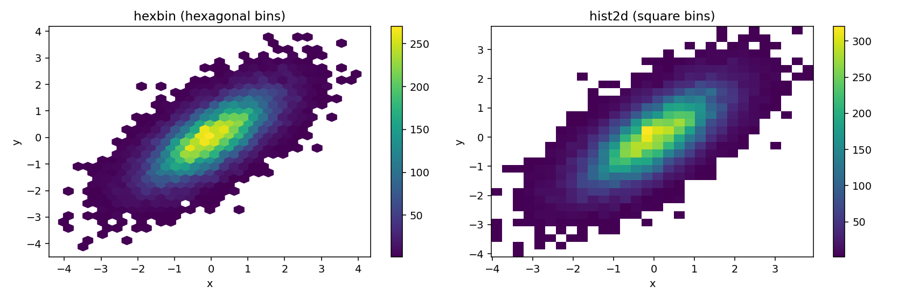

# 육각형 구간 그림과 2차원 히스토그램

히스토그램은 1차원 자료를 구간으로 나누어 개수를 센다. 같은 발상을 2차원으로 옮기면 **평면을 칸으로 나누어 개수를 세는** 그림이 된다. 앞 절에서 본 산점도의 과밀 문제에 대한 정면 해결책이다.

칸의 모양이 사각형이면 **2차원 히스토그램**, 육각형이면 **육각형 구간 그림(hexbin)** 이다.

## 1. 두 방식을 나란히

```python
import numpy as np
import matplotlib.pyplot as plt

rng = np.random.default_rng(0)
n = 20000
x = rng.normal(0, 1, n)
y = 0.7 * x + rng.normal(0, 0.7, n)

fig, axes = plt.subplots(1, 2, figsize=(12, 4))

# hexbin: 평면을 정육각형으로 덮는다.
#   gridsize=30  가로 방향으로 육각형을 30개 놓는다 (많을수록 잘게 나뉨)
#   mincnt=1     점이 하나도 없는 칸은 그리지 않는다 (배경이 흰색으로 남음)
hb = axes[0].hexbin(x, y, gridsize=30, cmap='viridis', mincnt=1)
axes[0].set_title("hexbin (hexagonal bins)")
plt.colorbar(hb, ax=axes[0])

# hist2d: 평면을 정사각형 격자로 나눈다.
#   bins=30   가로·세로 각각 30등분 -> 900개의 칸
#   cmin=1    개수가 1 미만인 칸은 그리지 않는다 (mincnt와 같은 역할)
# hist2d는 (도수, x경계, y경계, 이미지)를 돌려주므로 [3]번이 색막대용 객체다
h = axes[1].hist2d(x, y, bins=30, cmap='viridis', cmin=1)
axes[1].set_title("hist2d (square bins)")
plt.colorbar(h[3], ax=axes[1])

for ax in axes:
    ax.set_xlabel('x')
    ax.set_ylabel('y')
plt.tight_layout()
plt.show()
```



두 그림 모두 같은 것을 말한다. 중심이 원점 부근에 있고, 좌하에서 우상으로 기울어진 타원 모양으로 퍼져 있으며, 가장 진한 칸에 250~300개가 들어 있다.

**색막대(colorbar)가 핵심이다.** 산점도에 투명도를 주면 "여기가 더 진하다"까지만 알 수 있지만, 이 그림들은 **"여기는 270개, 저기는 50개"** 라고 숫자로 읽게 해 준다. 밀도가 눈금 있는 양이 되는 것이다.

## 2. 왜 육각형인가

사각형 대신 육각형을 쓰는 데는 이유가 있다.

**첫째, 이웃까지의 거리가 고르다.** 정사각형 칸은 이웃이 8개인데 그중 4개는 변을 맞대고(거리 1) 4개는 꼭짓점만 맞댄다(거리 $\sqrt{2}$). 정육각형은 이웃 6개가 **모두** 변을 맞대며 거리가 같다. 그래서 육각형 격자는 방향에 따른 편향이 적다.

**둘째, 격자 방향의 인공적 무늬가 덜 생긴다.** 사각 격자는 가로세로 줄이 눈에 띄어, 자료에 없는 격자무늬가 보이는 일이 있다. 위 그림 오른쪽에서 바깥쪽 칸들이 계단처럼 각져 보이는 것이 그 예다. 왼쪽 육각형 그림은 가장자리가 더 매끄럽다.

**셋째, 원을 더 잘 근사한다.** 같은 넓이의 정사각형보다 정육각형이 원에 가깝다. 밀도가 등방적일 때(어느 방향으로도 비슷하게 퍼져 있을 때) 육각형 칸이 더 자연스럽다.

!!! note "실무에서는 차이가 크지 않다"
    위 세 이유는 모두 타당하지만, **자료가 충분히 많고 칸이 충분히 잘면 두 그림의 결론은 같다.** 위 예제에서 어느 쪽을 봐도 "중심은 원점, 양의 상관, 타원형"이라는 판단은 달라지지 않는다.

    hexbin을 권하는 실용적인 이유는 오히려 **matplotlib에서 쓰기 편하다**는 것이다. `mincnt`, `bins='log'`(로그 눈금 색), `C`와 `reduce_C_function`(개수 대신 다른 값을 집계) 같은 옵션이 잘 갖춰져 있다.

## 3. 칸 크기 고르기

히스토그램의 구간 폭과 같은 문제가 2차원에서도 나온다. `gridsize`(또는 `bins`)가 그 선택이다.

- **너무 크면**(칸이 잘면) 각 칸에 점이 한둘뿐이라 색이 거의 균일해지고, 산점도로 되돌아간 것과 같아진다.
- **너무 작으면**(칸이 굵으면) 서너 개의 큰 덩어리만 남아 구조가 뭉개진다.

경험적으로 **가장 진한 칸에 수십에서 수백 개**가 들어가도록 잡으면 무난하다. 위 예제는 $n = 20{,}000$에 `gridsize=30`이고 최대 칸이 270개 남짓이다.

**칸 크기를 두세 가지로 바꿔 가며 그려 보는 것이 정석이다.** 어느 크기에서나 보이는 구조는 실제 구조이고, 특정 크기에서만 나타나는 봉우리는 의심해야 한다.

!!! tip "개수 대신 다른 값을 집계하기"
    `hexbin`의 `C` 인자에 세 번째 변수를 주면, 각 칸의 **개수** 대신 그 칸에 속한 점들의 **평균**(기본값)을 색으로 나타낸다.

    ```python
    # 각 칸의 평균 소득을 색으로
    ax.hexbin(lon, lat, C=income, gridsize=40, reduce_C_function=np.mean)
    ```

    이렇게 하면 "위치별 밀도"가 아니라 **"위치별 평균값"** 의 지도가 된다. 지리 자료에서 특히 유용하다.

    다만 점이 하나뿐인 칸도 그 값이 그대로 색이 되므로, `mincnt=5`처럼 최소 개수를 걸어 표본이 너무 작은 칸을 빼는 것이 좋다.

## 연습문제

**연습문제 1.**
$n = 20{,}000$인 자료에 `hexbin(gridsize=200)`을 썼더니 그림이 거의 균일한 옅은 색이 되었다. 무슨 일이 일어났고 어떻게 고쳐야 하는가?

??? success "풀이"
    **무슨 일인가.** `gridsize=200`이면 가로로 200개, 세로로도 비슷한 수의 육각형이 놓이므로 칸이 대략 $200 \times 200 \approx 40{,}000$개가 된다. 자료는 20,000개뿐이므로 **칸이 자료보다 두 배 많다.**

    그 결과 대부분의 칸에 점이 0개 또는 1개다. 색막대의 최댓값이 2~3 정도가 되고, 거의 모든 칸이 같은 옅은 색으로 칠해진다. 밀도의 차이가 색으로 표현되지 않는다.

    **이것은 사실상 산점도로 되돌아간 것이다.** 칸을 자료보다 잘게 나누면 각 점이 자기만의 칸을 차지하므로, hexbin이 해결하려던 과밀 문제를 그대로 안게 된다.

    **고치는 법.** `gridsize`를 크게 줄인다. 목표는 **가장 진한 칸에 수십~수백 개**가 들어가는 것이다.

    $n = 20{,}000$이고 자료가 대략 타원 모양으로 퍼져 있다면, 칸이 대략 500~1500개일 때 평균적으로 칸당 13~40개가 된다. 육각형 칸 수가 `gridsize`의 제곱에 비례하므로 `gridsize`는 **25~40** 정도가 적당하다. 실제로 앞 예제에서 `gridsize=30`으로 최대 칸이 270개 남짓이었다.

    **점검하는 법.** 색막대의 최댓값을 본다. 그것이 한 자리 수라면 칸이 너무 잔 것이다.

---

**연습문제 2.**
2차원 히스토그램과 2차원 커널밀도추정(등고선 그림)의 차이는 무엇인가? 어느 쪽을 언제 쓰겠는가?

??? success "풀이"
    **차이.**

    | | 2차원 히스토그램 / hexbin | 2차원 KDE |
    |:---|:---|:---|
    | 결과 | 칸마다 **개수** | 매끄러운 **밀도 함수** |
    | 읽는 값 | 정수 도수 (색막대에 눈금) | 밀도값 (단위 해석이 어려움) |
    | 조절 손잡이 | 칸 크기 | 띠폭(bandwidth) |
    | 경계 | 계단 모양 | 매끄러움 |
    | 자료 밖 영역 | 0으로 남음 | **자료가 없는 곳에도 밀도가 새어 나감** |

    **히스토그램/hexbin을 쓸 때.**

    - **실제 개수를 알아야 할 때.** "이 영역에 몇 개인가"가 질문이면 도수가 그대로 필요하다.
    - **자료의 범위가 제한적일 때.** 값이 음수가 될 수 없거나 상한이 있는 자료에서, KDE는 경계 너머로 밀도를 흘려보내 없는 자료를 만들어 낸다.
    - **자료가 아주 많을 때.** 계산이 빠르고 메모리도 적게 든다. KDE는 $n$이 크면 느리다.
    - **가정을 최소화하고 싶을 때.** 히스토그램은 세는 것뿐이라 매끄러움을 가정하지 않는다.

    **KDE를 쓸 때.**

    - **분포가 매끄럽다고 믿을 근거가 있고, 그 매끄러운 모양을 보여 주고 싶을 때.**
    - **여러 집단을 겹쳐 비교할 때.** 등고선을 색만 달리해 여러 개 겹칠 수 있다. 히스토그램은 겹쳐 그리기가 어렵다.
    - **자료가 적당히 적을 때**(수백~수천). 이때는 히스토그램의 칸에 점이 몇 개 안 들어가 색이 들쭉날쭉해진다.

    **실무적 조언.** 둘을 **함께** 그리는 것이 흔하다. hexbin으로 밀도와 도수를 보이고 그 위에 KDE 등고선을 얹으면, 세는 것과 매끄럽게 하는 것의 결과가 일치하는지 확인할 수 있다. 어긋난다면 띠폭이나 칸 크기 중 하나가 잘못된 것이다.

---

**연습문제 3.**
어떤 지도 위에 각 지점의 **평균 미세먼지 농도**를 hexbin으로 나타내려 한다. `C=pm25, reduce_C_function=np.mean`으로 그렸더니 지도 외곽에 극단적으로 진한 칸 몇 개가 나타났다. 원인과 대책을 설명하라.

??? success "풀이"
    **원인: 측정점이 하나뿐인 칸.**

    `reduce_C_function=np.mean`은 그 칸에 속한 점들의 평균을 낸다. 도심에는 측정소가 빽빽해 한 칸에 수십 개가 들어가지만, 외곽에는 측정소가 드물어 한 칸에 하나뿐일 수 있다.

    **점이 하나인 칸의 "평균"은 그 하나의 값 자체다.** 표본이 1이므로 표준오차가 무한히 크다고 봐야 하는데, 그림에서는 수십 개를 평균 낸 도심 칸과 **똑같은 시각적 무게**로 그려진다. 그 하나가 우연히 높은 값이었다면 외곽이 오염이 심한 것처럼 보인다.

    이것은 앞 절의 모자이크 그림 연습문제에서 본 문제와 같다. **표본 크기가 그림에 반영되지 않으면 불안정한 추정치가 안정된 추정치와 구별되지 않는다.**

    **대책.**

    1. **`mincnt`로 최소 표본을 건다.** `mincnt=5`처럼 하면 측정점이 다섯 미만인 칸은 아예 그리지 않는다. 가장 간단하고 효과적이다. 다만 "자료가 없는 곳"과 "자료가 적어 뺀 곳"이 똑같이 빈칸으로 보이므로 그림 설명에 밝혀야 한다.
    2. **칸을 굵게 한다.** `gridsize`를 줄이면 외곽 칸에도 여러 점이 들어간다. 대신 도심의 세부 구조가 뭉개진다.
    3. **도수 그림을 나란히 놓는다.** 같은 격자로 `C` 없이(= 개수) 한 장 더 그려, 어느 칸이 자료가 많은지 독자가 볼 수 있게 한다. **가장 정직한 방법이다.**
    4. **불확실성을 시각적으로 반영한다.** 표본이 적은 칸을 흐리게(투명도를 낮춰) 그리면 "여기는 믿기 어렵다"가 그림 안에 들어간다.

    어느 방법을 쓰든, **평균 지도에는 표본 크기 정보가 반드시 따라붙어야 한다.**

## 정리하며

육각형 구간 그림과 2차원 히스토그램은 **히스토그램의 발상을 평면으로 옮긴 것**이다.

- 평면을 칸으로 나누고 각 칸의 개수를 색으로 나타낸다.
- **색막대 덕분에 밀도를 숫자로 읽을 수 있다.** 투명한 산점도가 못 하는 일이다.
- 육각형이 사각형보다 이웃 거리가 고르고 격자무늬가 덜 생기지만, 실무적 차이는 크지 않다.
- **칸 크기가 유일한 선택**이며, 몇 가지로 바꿔 가며 그려 보는 것이 정석이다.
- `C` 인자를 쓰면 개수 대신 다른 값의 평균을 그릴 수 있는데, 이때는 표본이 적은 칸을 조심해야 한다.

다음 절의 **쌍그림**은 변수가 셋 이상일 때로 넘어간다. 모든 변수 쌍의 산점도를 격자로 늘어놓아 한눈에 훑는 도구다.
