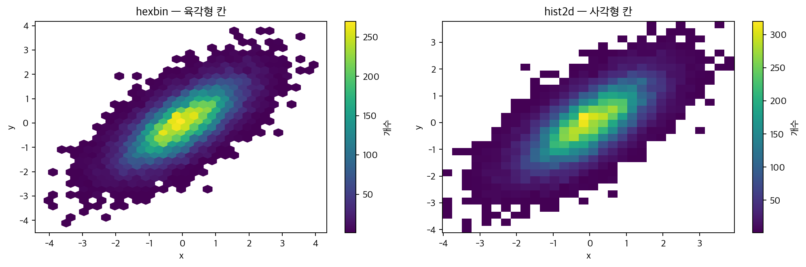
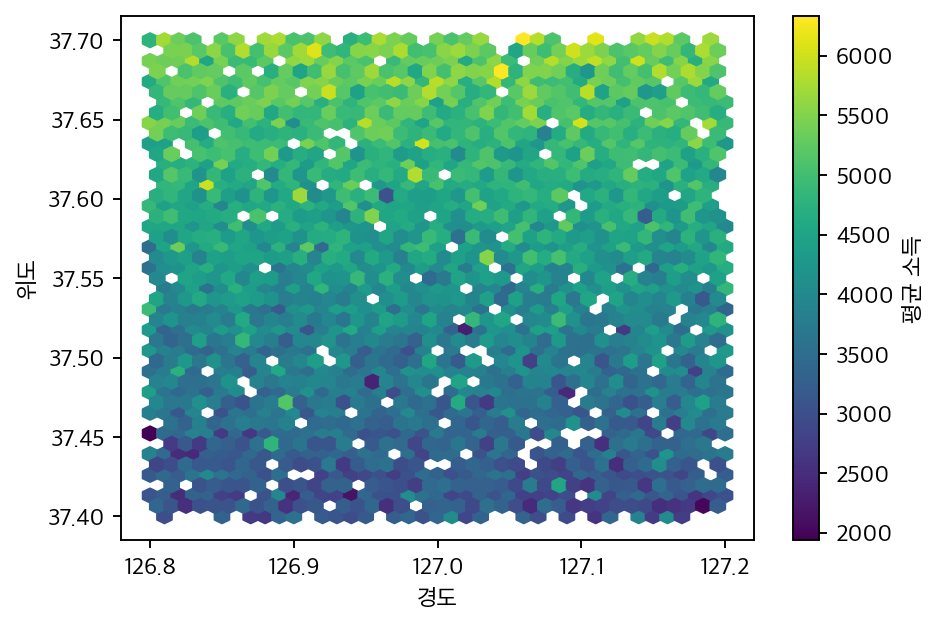
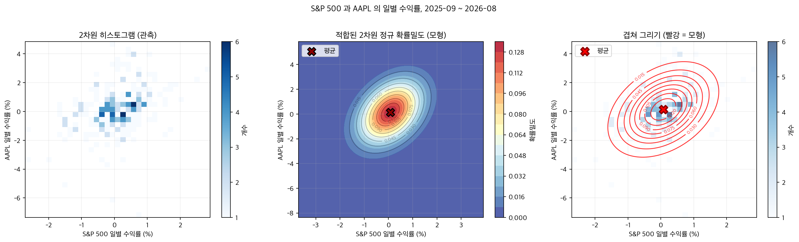
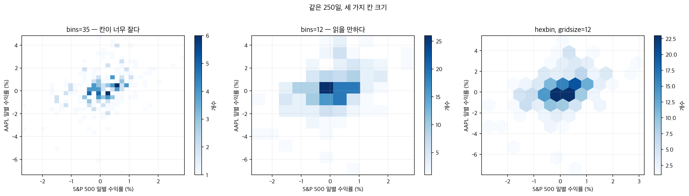
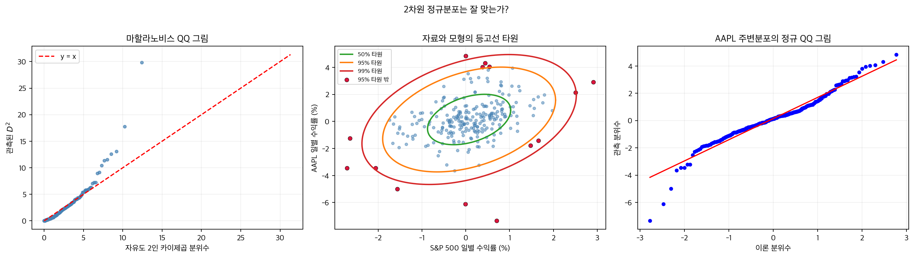
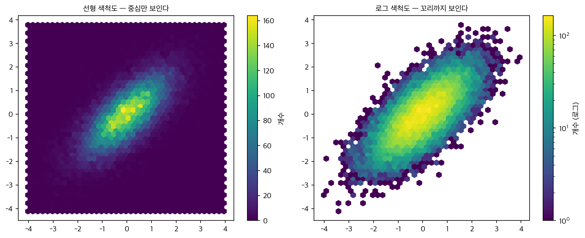
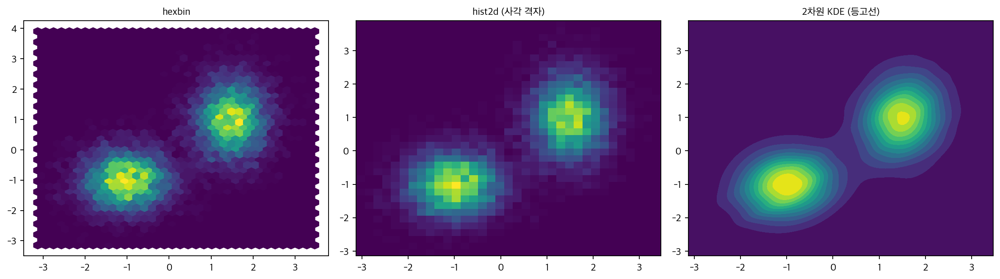
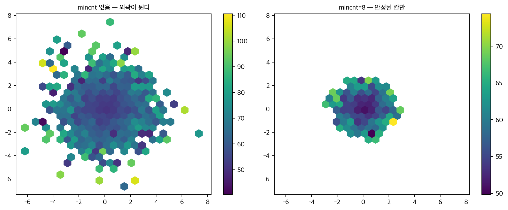
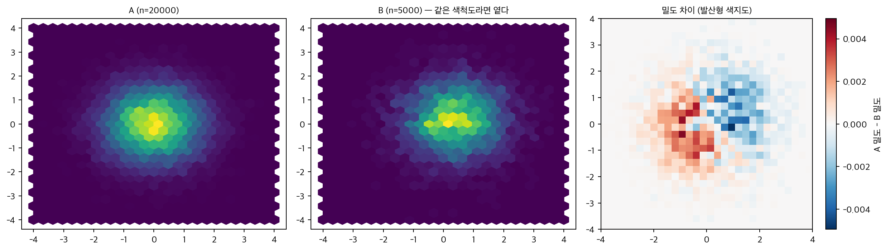
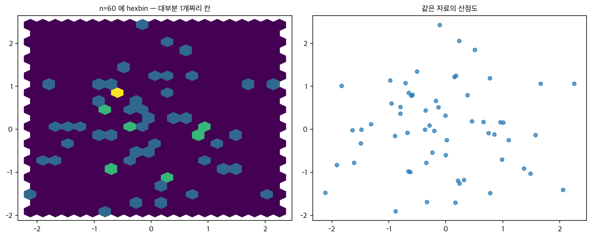

# 육각형 구간 그림과 2차원 히스토그램

히스토그램은 1차원 자료를 구간으로 나누어 개수를 센다. 같은 발상을 2차원으로 옮기면 **평면을 칸으로 나누어 개수를 세는** 그림이 된다. 앞 절에서 본 산점도의 과밀 문제에 대한 정면 해결책이다.

칸의 모양이 사각형이면 **2차원 히스토그램**, 육각형이면 **육각형 구간 그림(hexbin)** 이다.

## 1. 두 방식을 나란히

<div class="exbox" markdown>

**보기 1.** <span class="diff easy" title="쉬움"></span> 왜 하필 육각형인가. 평면을 한 가지 정다각형으로 빈틈없이 덮으려 한다.

**(1)** 그렇게 덮을 수 있는 정다각형이 정삼각형·정사각형·정육각형 **셋뿐**임을 보이시오.

**(2)** 세 타일의 $\text{둘레}/\sqrt{\text{면적}}$ 과 이웃까지의 거리를 재어, 육각형이 고른 이유를 수로 밝히시오. 같은 자료를 육각형 칸과 사각형 칸으로 나란히 그려 보이시오.

</div>

??? success "풀이"

    **(1) 해석적으로.** 정 $k$ 각형의 한 내각은

    $$
    \theta_k = \frac{(k-2)\cdot 180^\circ}{k}
    $$

    이다. 한 꼭짓점에 똑같은 타일이 빈틈없이 모이려면 $\theta_k$ 를 정수 번 모아 $360^\circ$ 를 만들 수 있어야 하므로

    $$
    \frac{360^\circ}{\theta_k} = \frac{360 k}{180(k-2)} = \frac{2k}{k-2} = 2 + \frac{4}{k-2}
    $$

    가 **정수**여야 한다. 곧 $k - 2$ 가 $4$ 의 약수여야 하므로 $k - 2 \in \{1, 2, 4\}$, 즉

    $$
    k \in \{3, 4, 6\}
    $$

    뿐이다. $k \ge 7$ 이면 $2 + 4/(k-2)$ 가 $2$ 와 $3$ 사이의 정수가 아닌 수가 되어 영원히 안 된다. $k = 5$ 는 $10/3$ 으로 떨어지지 않는다. **정삼각형 여섯 개, 정사각형 네 개, 정육각형 세 개가 한 꼭짓점에 모인다.**

    **(2) 셋 가운데 육각형을 고르는 두 가지 근거.**

    **첫째, 둘레가 가장 짧다.** 변 길이를 $a$ 라 하면

    | 타일 | 둘레 | 면적 | $\text{둘레}/\sqrt{\text{면적}}$ |
    |---|---|---|---|
    | 정삼각형 | $3a$ | $\dfrac{\sqrt3}{4}a^2$ | $6/3^{1/4} = 4.5590$ |
    | 정사각형 | $4a$ | $a^2$ | $4.0000$ |
    | 정육각형 | $6a$ | $\dfrac{3\sqrt3}{2}a^2$ | $6/\sqrt{3\sqrt3/2} = 3.7224$ |

    이 비는 모양만의 성질이어서 크기와 무관하다. 아래로 갈 수 있는 한계는 원의 $2\pi r/\sqrt{\pi r^2} = 2\sqrt\pi = 3.5449$ 다. **정육각형의 $3.7224$ 는 그 하한에 $5\%$ 안쪽으로 다가가 있고, 사각형은 $13\%$, 삼각형은 $29\%$ 떨어져 있다.** 둘레가 짧다는 것은 같은 면적을 더 둥글게 담는다는 뜻이고, 밀도가 어느 방향으로도 비슷하게 퍼져 있을 때 칸 모양이 결과에 덜 끼어든다는 뜻이다.

    **둘째, 이웃이 모두 같은 거리에 있다.** 변 길이를 $1$ 로 두면

    - 정사각형 격자: 이웃이 $8$ 개인데 변을 맞댄 $4$ 개는 중심 간 거리 $1$, 꼭짓점만 맞댄 $4$ 개는 $\sqrt2 = 1.4142$ 다. **방향에 따라 거리가 $41\%$ 차이 난다.**
    - 정육각형 격자: 이웃 $6$ 개가 모두 변을 맞대고 중심 간 거리가 전부 $\sqrt3$ 이다. **비가 정확히 $1$ 이다.**

    이것이 사각 격자에서 가로세로 줄무늬가 눈에 띄고 육각 격자에서 덜한 까닭이다. 사각 격자는 축 방향과 대각 방향을 다르게 취급하므로, 자료에 없는 **격자 자신의 방향**이 그림에 섞여 든다.

    **(3) 수치적으로.**

    ```python
    import numpy as np
    import matplotlib.pyplot as plt

    rng = np.random.default_rng(0)
    n = 20000
    x = rng.normal(0, 1, n)
    y = 0.7 * x + rng.normal(0, 0.7, n)

    fig, axes = plt.subplots(1, 2, figsize=(12, 4))

    # hexbin: 평면을 정육각형으로 덮는다.
    #   gridsize=30  가로 방향으로 육각형을 30개 놓는다 (많을수록 잘게 나뉨)
    #   mincnt=1     점이 하나도 없는 칸은 그리지 않는다 (배경이 흰색으로 남음)
    hb = axes[0].hexbin(x, y, gridsize=30, cmap='viridis', mincnt=1)
    axes[0].set_title("hexbin — 육각형 칸")
    plt.colorbar(hb, ax=axes[0], label="개수")

    # hist2d: 평면을 정사각형 격자로 나눈다.
    #   bins=30   가로·세로 각각 30등분 -> 900개의 칸
    #   cmin=1    개수가 1 미만인 칸은 그리지 않는다 (mincnt와 같은 역할)
    # hist2d는 (도수, x경계, y경계, 이미지)를 돌려주므로 [3]번이 색막대용 객체다
    h = axes[1].hist2d(x, y, bins=30, cmap='viridis', cmin=1)
    axes[1].set_title("hist2d — 사각형 칸")
    plt.colorbar(h[3], ax=axes[1], label="개수")

    for ax in axes:
        ax.set_xlabel('x')
        ax.set_ylabel('y')
    plt.tight_layout()
    plt.show()

    # (1) 평면을 덮는 정다각형은 셋뿐이다. 내각 (k-2)*180/k 가 360 을 나누어야 한다.
    print(f"{'k':>4}{'내각':>10}{'360/내각':>11}{'평면을 덮는가':>15}")
    for k in range(3, 13):
        ang = (k - 2) * 180 / k
        q = 360 / ang
        print(f"{k:>4}{ang:>10.3f}{q:>11.4f}{'예' if abs(q - round(q)) < 1e-12 else '아니오':>15}")

    # (2) 같은 면적에서 둘레가 짧은 타일이 원에 가깝다.
    print(f"\n{'타일':>8}{'둘레/sqrt(면적)':>18}")
    for name, per, area in [("정삼각형", 3.0, np.sqrt(3) / 4),
                            ("정사각형", 4.0, 1.0),
                            ("정육각형", 6.0, 3 * np.sqrt(3) / 2)]:
        print(f"{name:>8}{per / np.sqrt(area):>18.4f}")
    print(f"{'원':>8}{2 * np.sqrt(np.pi):>18.4f}   <- 이론적 하한")

    # 이웃까지의 거리. 변 길이를 1 로 둔 격자의 중심 간 거리를 센다.
    print("\n이웃까지의 중심 간 거리 (변 길이 1)")
    sq = np.array([1.0, 1.0, 1.0, 1.0, np.sqrt(2), np.sqrt(2), np.sqrt(2), np.sqrt(2)])
    hx = np.full(6, np.sqrt(3))
    print(f"  정사각형 격자: 이웃 {len(sq)}개  거리 {np.unique(np.round(sq, 4))}"
          f"  최대/최소 {sq.max()/sq.min():.4f}")
    print(f"  정육각형 격자: 이웃 {len(hx)}개  거리 {np.unique(np.round(hx, 4))}"
          f"  최대/최소 {hx.max()/hx.min():.4f}")

    # 가장 진한 칸의 도수
    H, _, _ = np.histogram2d(x, y, bins=30)
    print(f"\n가장 진한 칸: 육각형 {int(hb.get_array().max())}개, 사각형 {int(H.max())}개")
    ```

    출력:

    ```
       k        내각     360/내각        평면을 덮는가
       3    60.000     6.0000              예
       4    90.000     4.0000              예
       5   108.000     3.3333            아니오
       6   120.000     3.0000              예
       7   128.571     2.8000            아니오
       8   135.000     2.6667            아니오
       9   140.000     2.5714            아니오
      10   144.000     2.5000            아니오
      11   147.273     2.4444            아니오
      12   150.000     2.4000            아니오

          타일       둘레/sqrt(면적)
        정삼각형            4.5590
        정사각형            4.0000
        정육각형            3.7224
           원            3.5449   <- 이론적 하한

    이웃까지의 중심 간 거리 (변 길이 1)
      정사각형 격자: 이웃 8개  거리 [1.     1.4142]  최대/최소 1.4142
      정육각형 격자: 이웃 6개  거리 [1.7321]  최대/최소 1.0000

    가장 진한 칸: 육각형 270개, 사각형 320개
    ```

    

    **$k = 3, 4, 6$ 에서만 `예` 가 찍힌다.** 유도한 대로이고, $k \ge 7$ 에서는 $360/\theta_k$ 가 $2.8$ 에서 $2.4$ 로 줄어들며 영원히 정수가 되지 않는다. 둘레 비도 $4.5590$, $4.0000$, $3.7224$ 로 손으로 계산한 값과 같고 원의 $3.5449$ 가 하한이다.

    **두 그림 모두 같은 것을 말한다.** 중심이 원점 부근에 있고, 좌하에서 우상으로 기울어진 타원 모양으로 퍼져 있으며, 가장 진한 칸에 수백 개가 들어 있다. **육각형은 $270$ 개, 사각형은 $320$ 개다.** 칸 모양이 다르므로 최댓값도 다른 것이 당연하다 — $\sqrt{\text{면적}}$ 을 맞춰 놓아도 모양이 달라 담기는 점의 수가 달라진다.

    **색막대(colorbar)가 핵심이다.** 산점도에 투명도를 주면 "여기가 더 진하다" 까지만 알 수 있지만, 이 그림들은 **"여기는 $270$ 개, 저기는 $50$ 개"** 라고 숫자로 읽게 해 준다. 밀도가 눈금 있는 양이 되는 것이다.

    **그림이 가리는 것.** 두 그림 모두 **칸 안의 구조를 지운다.** 한 칸에 $270$ 개가 들어 있다는 것은 알려 주지만 그 $270$ 개가 칸 안에서 어떻게 놓여 있는지는 말하지 않는다. 그리고 `gridsize` 를 바꾸면 봉우리의 수와 위치가 달라질 수 있다(보기 4).

## 2. 왜 육각형인가

보기 1 에서 수로 확인한 것을 정리하면 셋이다.

**첫째, 이웃까지의 거리가 고르다.** 정사각형 칸은 이웃이 8개인데 그중 4개는 변을 맞대고(거리 1) 4개는 꼭짓점만 맞댄다(거리 $\sqrt{2}$). 정육각형은 이웃 6개가 **모두** 변을 맞대며 거리가 같다. 그래서 육각형 격자는 방향에 따른 편향이 적다.

**둘째, 격자 방향의 인공적 무늬가 덜 생긴다.** 사각 격자는 가로세로 줄이 눈에 띄어, 자료에 없는 격자무늬가 보이는 일이 있다. 위 그림 오른쪽에서 바깥쪽 칸들이 계단처럼 각져 보이는 것이 그 예다. 왼쪽 육각형 그림은 가장자리가 더 매끄럽다.

**셋째, 원을 더 잘 근사한다.** $\text{둘레}/\sqrt{\text{면적}}$ 이 육각형 $3.7224$, 사각형 $4$, 삼각형 $4.5590$ 이고 원의 하한이 $3.5449$ 다. 밀도가 등방적일 때(어느 방향으로도 비슷하게 퍼져 있을 때) 육각형 칸이 더 자연스럽다.

!!! note "실무에서는 차이가 크지 않다"
    위 세 이유는 모두 타당하지만, **자료가 충분히 많고 칸이 충분히 잘면 두 그림의 결론은 같다.** 위 보기에서 어느 쪽을 봐도 "중심은 원점, 양의 상관, 타원형"이라는 판단은 달라지지 않는다.

    hexbin을 권하는 실용적인 이유는 오히려 **matplotlib에서 쓰기 편하다**는 것이다. `mincnt`, `bins='log'`(로그 눈금 색), `C`와 `reduce_C_function`(개수 대신 다른 값을 집계) 같은 옵션이 잘 갖춰져 있다.

## 3. 칸 크기 고르기

히스토그램의 구간 폭과 같은 문제가 2차원에서도 나온다. `gridsize`(또는 `bins`)가 그 선택이다.

- **너무 크면**(칸이 잘면) 각 칸에 점이 한둘뿐이라 색이 거의 균일해지고, 산점도로 되돌아간 것과 같아진다.
- **너무 작으면**(칸이 굵으면) 서너 개의 큰 덩어리만 남아 구조가 뭉개진다.

경험적으로 **가장 진한 칸에 수십에서 수백 개**가 들어가도록 잡으면 무난하다. 위 보기는 $n = 20{,}000$에 `gridsize=30`이고 최대 칸이 270개 남짓이다.

**칸 크기를 두세 가지로 바꿔 가며 그려 보는 것이 정석이다.** 어느 크기에서나 보이는 구조는 실제 구조이고, 특정 크기에서만 나타나는 봉우리는 의심해야 한다.

!!! tip "개수 대신 다른 값을 집계하기"
    `hexbin`의 `C` 인자에 세 번째 변수를 주면, 각 칸의 **개수** 대신 그 칸에 속한 점들의 **평균**(기본값)을 색으로 나타낸다.

    ```python
    import numpy as np
    import matplotlib.pyplot as plt

    rng = np.random.default_rng(0)
    lon = rng.uniform(126.8, 127.2, 5000)
    lat = rng.uniform(37.4, 37.7, 5000)
    income = 3000 + 8000 * (lat - 37.4) + rng.normal(0, 500, 5000)

    fig, ax = plt.subplots(figsize=(6, 4))
    # 각 칸의 평균 소득을 색으로
    hb = ax.hexbin(lon, lat, C=income, gridsize=40, reduce_C_function=np.mean)
    fig.colorbar(hb, ax=ax, label="평균 소득")
    ax.set_xlabel("경도"); ax.set_ylabel("위도")
    plt.show()
    ```

    

    이렇게 하면 "위치별 밀도"가 아니라 **"위치별 평균값"** 의 지도가 된다. 지리 자료에서 특히 유용하다.

    다만 점이 하나뿐인 칸도 그 값이 그대로 색이 되므로, `mincnt=5`처럼 최소 개수를 걸어 표본이 너무 작은 칸을 빼는 것이 좋다.

## 4. 실제 자료: 두 수익률의 결합분포

앞의 보기는 모두 모의 자료였다. 이제 **실제로 내려받은 자료**에 같은 도구를 써 보자. 주가지수와 개별 종목의 일별 수익률은 2차원 히스토그램이 잘 맞는 소재다. 관측이 수백 개 있고, 두 변수가 같은 단위(퍼센트)이며, 둘 사이에 관계가 있으리라 짐작되기 때문이다.

여기서는 한 걸음 더 나아가, **관측된 히스토그램 위에 모형을 겹쳐 놓는다.** 2차원 정규분포를 자료에 맞춘 뒤 그 확률밀도의 등고선을 히스토그램 위에 그리면, **모형이 자료를 어디서 잘 맞히고 어디서 틀리는지**가 한 그림에 드러난다.

!!! note "외부 자료를 쓰는 보기에 대하여"
    뒤의 선그림 절에서 다시 짚겠지만 **네트워크에 의존하는 보기는 재현성이 약하다.** 여기서는 세 가지로 그 문제를 줄였다.

    - **기간을 날짜로 고정했다.** `datetime.now()`가 아니라 `2025-09-01 ~ 2026-09-01`이므로, 과거 자료가 수정되지 않는 한 언제 실행해도 같은 값이 나온다.
    - **한 번 받은 자료를 `datasets/stocks/`에 저장한다.** 두 번째 실행부터는 네트워크를 쓰지 않는다.
    - 아래 출력은 모두 **실제로 실행해 얻은 값**이다.

    그래도 야후 파이낸스가 요청을 거절하면(`YFRateLimitError`) 잠시 뒤 다시 시도해야 한다. `pip install yfinance curl_cffi`로 두 꾸러미를 함께 설치해 두면 차단을 덜 받는다.

    **자료를 받지 못해도 이 절의 내용은 따라갈 수 있다.** 중요한 것은 특정 종목의 수치가 아니라 **관측과 모형을 겹쳐 보는 방법**이다.

<div class="exbox" markdown>

**보기 2.** <span class="diff easy" title="쉬움"></span> 상관계수 하나에서 더 끌어낼 수 있는 것. S&P 500 지수와 애플의 일별 수익률 $250$ 일을 모은다.

**(1)** 지수의 수익률을 $X$, 종목의 수익률을 $Y$ 라 하자. 상관계수 $\rho$ 와 두 표준편차 $s_X$, $s_Y$ 만으로 (ㄱ) $Y$ 를 $X$ 에 회귀한 기울기(베타), (ㄴ) 지수가 설명하는 $Y$ 의 분산 비율, (ㄷ) 종목 고유 변동의 표준편차를 각각 식으로 적으시오.

**(2)** 자료를 내려받아 요약통계를 내고 (1)의 세 값을 구해, 최소제곱 적합과 분산 분해로 확인하시오.

</div>

??? success "풀이"

    **(1) 해석적으로.** $Y$ 를 $X$ 로 설명하는 최소제곱 직선 $Y \approx \alpha + \beta X$ 의 기울기는

    $$
    \beta = \frac{\operatorname{Cov}(X, Y)}{\operatorname{Var}(X)}
    = \frac{\rho\, s_X s_Y}{s_X^2}
    = \rho\,\frac{s_Y}{s_X}
    $$

    이다. 금융에서 **베타**라 부르는 수가 바로 이것이다. 상관계수가 단위 없는 수인 데 반해 베타는 **$X$ 가 $1\%$ 움직일 때 $Y$ 가 몇 $\%$ 움직이는가**로 읽힌다.

    잔차를 $\varepsilon = Y - \alpha - \beta X$ 라 하면 최소제곱의 성질상 $\varepsilon$ 과 $X$ 가 직교하므로 분산이 깨끗하게 쪼개진다.

    $$
    s_Y^2 = \beta^2 s_X^2 + s_\varepsilon^2
    $$

    여기서 $\beta^2 s_X^2 = \rho^2 s_Y^2$ 이므로

    $$
    \frac{\beta^2 s_X^2}{s_Y^2} = \rho^2, \qquad
    s_\varepsilon = s_Y\sqrt{1 - \rho^2}
    $$

    이다. **지수가 설명하는 분산 비율이 $\rho^2$ 이고, 나머지 $1 - \rho^2$ 이 종목 고유의 몫이다.** 이것이 회귀의 결정계수 $R^2$ 와 같은 수다.

    $\rho = 0.3704$, $s_X = 0.8061$, $s_Y = 1.5832$ 를 넣으면

    $$
    \beta = 0.3704 \times \frac{1.5832}{0.8061} = 0.7274, \qquad
    \rho^2 = 0.1372, \qquad
    s_\varepsilon = 1.5832\sqrt{1 - 0.1372} = 1.4706
    $$

    이다. **상관계수 $0.37$ 이 "낮다" 는 말의 정확한 뜻이 $\rho^2 = 0.137$ 이다.** 애플의 하루 변동 가운데 지수로 설명되는 것이 $13.7\%$ 뿐이고 $86.3\%$ 는 종목 고유의 움직임이다.

    **(2) 수치적으로.**

    ```python
    import warnings
    warnings.filterwarnings("ignore")

    import os
    import numpy as np
    import pandas as pd
    import yfinance as yf

    # ── 내려받을 대상과 기간 ────────────────────────────────────────────
    # ^GSPC 는 S&P 500 지수, AAPL 은 애플 보통주다.
    # 기간을 날짜로 고정해 두었다. datetime.now() 를 쓰면 실행할 때마다
    # 자료가 달라져 아래 출력이 재현되지 않는다.
    TICKERS = {"^GSPC": "GSPC", "AAPL": "AAPL"}
    START, END = "2025-09-01", "2026-09-01"
    CACHE = "datasets/stocks"          # 한 번 받은 자료를 저장해 둘 곳

    os.makedirs(CACHE, exist_ok=True)

    def load(ticker: str, name: str) -> pd.DataFrame:
        """자료를 캐시에서 읽고, 없으면 내려받아 캐시에 저장한다.

        야후 파이낸스는 짧은 시간에 여러 번 요청하면 거절한다(rate limit).
        한 번 받아 두고 다시 쓰는 편이 안전하고 빠르다.
        """
        path = f"{CACHE}/{name}.csv"
        if os.path.exists(path):
            return pd.read_csv(path, index_col=0, parse_dates=True)

        try:
            # curl_cffi 가 있으면 브라우저처럼 행세해 차단을 덜 받는다.
            from curl_cffi import requests as cr
            session = cr.Session(impersonate="chrome")
        except ImportError:
            session = None

        df = yf.Ticker(ticker, session=session).history(
            start=START, end=END, auto_adjust=False)
        df.to_csv(path)
        return df

    frames = {name: load(tk, name) for tk, name in TICKERS.items()}
    for name, df in frames.items():
        print(f"{name:5s}  {df.shape[0]}일  "
              f"{df.index.min().date()} ~ {df.index.max().date()}")

    # ── 일별 수익률 ─────────────────────────────────────────────────────
    # 배당·액면분할을 반영한 'Adj Close' 가 있으면 그것을 쓴다.
    # pct_change() 는 (오늘값 - 어제값) / 어제값 이고, 첫날은 NaN 이라 버린다.
    # 100 을 곱해 퍼센트 단위로 바꾼다.
    def returns(df: pd.DataFrame) -> pd.Series:
        col = "Adj Close" if "Adj Close" in df.columns else "Close"
        return df[col].pct_change().dropna() * 100

    r = {name: returns(df) for name, df in frames.items()}

    # 두 종목의 거래일이 완전히 같다는 보장이 없으므로 교집합만 남긴다.
    common = r["GSPC"].index.intersection(r["AAPL"].index)
    x = r["GSPC"].loc[common].to_numpy()      # S&P 500 일별 수익률 (%)
    y = r["AAPL"].loc[common].to_numpy()      # AAPL    일별 수익률 (%)

    print(f"\n공통 거래일 {len(x)}일\n")
    print(f"{'':6s}{'평균':>9s}{'표준편차':>10s}{'최소':>9s}{'최대':>9s}")
    for lab, v in [("S&P", x), ("AAPL", y)]:
        # ddof=1 은 표본표준편차다. numpy 의 기본값은 ddof=0 이므로 명시한다.
        print(f"{lab:6s}{v.mean():>+9.4f}{v.std(ddof=1):>10.4f}"
              f"{v.min():>+9.4f}{v.max():>+9.4f}")
    print(f"\n피어슨 상관계수 {np.corrcoef(x, y)[0, 1]:.4f}")

    # ── (1) 의 세 값 ────────────────────────────────────────────────────
    rho = np.corrcoef(x, y)[0, 1]
    sx, sy = x.std(ddof=1), y.std(ddof=1)
    beta = rho * sy / sx
    s_eps = sy * np.sqrt(1 - rho ** 2)

    print(f"\n베타  = rho * sy / sx = {rho:.4f} * {sy:.4f} / {sx:.4f} = {beta:.4f}")
    # 최소제곱으로 직접 적합해 공식을 확인한다.
    b_ols, a_ols = np.polyfit(x, y, 1)
    print(f"최소제곱 기울기 {b_ols:.4f}   절편 {a_ols:+.4f}")
    print(f"R^2 = rho^2 = {rho**2:.4f}   →  지수가 설명하는 분산 {rho**2:.1%}, "
          f"고유 변동 {1 - rho**2:.1%}")
    print(f"고유 변동의 표준편차 s_eps = sy * sqrt(1 - rho^2) = {s_eps:.4f}")
    resid = y - (a_ols + b_ols * x)
    print(f"  실제 잔차의 표준편차 (ddof=1)             = {resid.std(ddof=1):.4f}")
    print(f"분산 분해: beta^2 * sx^2 + s_eps^2 = {beta**2 * sx**2 + s_eps**2:.4f}"
          f"   sy^2 = {sy**2:.4f}")
    ```

    ```text
    GSPC   251일  2025-09-02 ~ 2026-08-31
    AAPL   251일  2025-09-02 ~ 2026-08-31

    공통 거래일 250일

                 평균      표준편차       최소       최대
    S&P     +0.0755    0.8061  -2.7112  +2.9131
    AAPL    +0.1427    1.5832  -7.3539  +4.8407

    피어슨 상관계수 0.3704

    베타  = rho * sy / sx = 0.3704 * 1.5832 / 0.8061 = 0.7274
    최소제곱 기울기 0.7274   절편 +0.0878
    R^2 = rho^2 = 0.1372   →  지수가 설명하는 분산 13.7%, 고유 변동 86.3%
    고유 변동의 표준편차 s_eps = sy * sqrt(1 - rho^2) = 1.4706
      실제 잔차의 표준편차 (ddof=1)             = 1.4706
    분산 분해: beta^2 * sx^2 + s_eps^2 = 2.5066   sy^2 = 2.5066
    ```

    **(1)의 세 값이 모두 맞는다.** 공식으로 구한 베타 $0.7274$ 가 최소제곱이 직접 찾은 기울기와 소수 넷째 자리까지 같고, $s_Y\sqrt{1-\rho^2} = 1.4706$ 이 실제 잔차의 표준편차와 같다. 분산 분해 $\beta^2 s_X^2 + s_\varepsilon^2 = 2.5066$ 도 $s_Y^2$ 과 정확히 일치한다.

    **개별 종목이 지수보다 두 배 가까이 출렁인다.** 표준편차가 $0.81\%$ 와 $1.58\%$ 다. 지수는 $500$ 개 종목의 평균이라 개별 종목의 고유한 움직임이 상당 부분 상쇄되기 때문이다. 그런데 베타는 $0.73$ 으로 $1$ 보다 작다. **"출렁임이 두 배" 와 "지수에 두 배로 반응" 은 다른 말이고, 그 차이를 만드는 것이 상관계수다.**

    **최솟값의 비대칭도 눈에 띈다.** AAPL 은 하루에 $-7.35\%$ 까지 빠진 날이 있는데 가장 많이 오른 날은 $+4.84\%$ 다. **내리는 쪽 꼬리가 더 길다**는 수익률 자료의 전형적인 성질이다.

    **상관계수 $0.37$ 은 생각보다 낮다.** 애플은 지수에서 큰 비중을 차지하므로 더 높으리라 기대하기 쉽지만, 이 $12$ 개월 동안에는 종목 고유의 움직임이 컸다. $\rho^2 = 0.137$ 이 그 크기를 정확히 말해 준다. 그리고 **상관계수와 베타로는 여기까지가 전부다.** 두 수는 모두 이차 적률만 쓰므로 **두 변수가 어떤 모양으로 함께 흩어져 있는지**는 담지 못한다. 그것은 그림을 봐야 한다.

<div class="exbox" markdown>

**보기 3.** <span class="diff easy" title="쉬움"></span> 자료에 2차원 정규분포를 맞추는 데 두 줄이면 되는 까닭. 보기 2 의 $250$ 일 수익률에 2차원 정규분포를 적합한다.

**(1)** $d$ 차원 정규분포의 최대가능도추정값이 표본평균과 **분모 $n$** 의 표본공분산임을 보이시오. `np.cov` 의 기본값은 분모 $n-1$ 이므로 최대가능도추정값이 아니다. 그래도 **상관계수는 분모에 무관**함을 보이시오.

**(2)** 최대가능도추정값에서의 평균 로그가능도를 닫힌 꼴로 적고, 두 분모에서 그 값을 비교하시오.

**(3)** 관측 히스토그램과 적합된 확률밀도를 겹쳐 그려 어디서 맞고 어디서 틀리는지 읽으시오.

</div>

??? success "풀이"

    **(1) 해석적으로.** 밀도가

    $$
    f(\mathbf x) = (2\pi)^{-d/2}(\det\Sigma)^{-1/2}
    \exp\!\left(-\tfrac12 (\mathbf x - \boldsymbol\mu)^{\mathsf T}\Sigma^{-1}(\mathbf x - \boldsymbol\mu)\right)
    $$

    이므로 로그가능도는

    $$
    \ell(\boldsymbol\mu, \Sigma) = -\frac{nd}{2}\log 2\pi - \frac n2 \log\det\Sigma
    - \frac12 \sum_{i=1}^{n} (\mathbf x_i - \boldsymbol\mu)^{\mathsf T}\Sigma^{-1}(\mathbf x_i - \boldsymbol\mu)
    $$

    다. $\boldsymbol\mu$ 로 미분해 $0$ 으로 두면

    $$
    \Sigma^{-1}\sum_{i=1}^{n}(\mathbf x_i - \boldsymbol\mu) = \mathbf 0
    $$

    이고 $\Sigma$ 가 양정부호라 $\Sigma^{-1}$ 이 가역이므로 $\sum_i (\mathbf x_i - \boldsymbol\mu) = \mathbf 0$, 곧 $\hat{\boldsymbol\mu} = \bar{\mathbf x}$ 다. 그리고 $\Sigma$ 의 최대가능도추정값은

    $$
    \hat\Sigma = \frac1n \sum_{i=1}^{n} (\mathbf x_i - \bar{\mathbf x})(\mathbf x_i - \bar{\mathbf x})^{\mathsf T}
    $$

    로 **분모가 $n$** 이다. 분모에 관한 부분만은 손으로 끝까지 확인할 수 있다. $\Sigma = c\hat\Sigma$ ($c > 0$) 꼴로 범위를 좁혀 보자. 아래 (2)의 대각합 항등식 $\sum_i (\mathbf x_i - \bar{\mathbf x})^{\mathsf T}\hat\Sigma^{-1}(\mathbf x_i - \bar{\mathbf x}) = nd$ 를 쓰면

    $$
    \frac1n\ell(\bar{\mathbf x}, c\hat\Sigma)
    = -\frac d2\log 2\pi - \frac12\log\det\hat\Sigma - \frac d2\log c - \frac{d}{2c}
    $$

    이고, $c$ 로 미분하면

    $$
    -\frac{d}{2c} + \frac{d}{2c^2} = 0 \ \Longrightarrow\ c = 1,
    \qquad
    \frac{d}{2c^2} - \frac{d}{c^3}\bigg|_{c=1} = -\frac d2 < 0
    $$

    이다. **$c = 1$, 곧 분모 $n$ 이 최대다.** `np.cov` 의 기본값 $\text{ddof}=1$ 은 $S = \frac{n}{n-1}\hat\Sigma$, 곧 $c = n/(n-1) = 250/249 = 1.00402$ 를 쓰는 것이므로 가능도를 조금 떨어뜨린다. 대신 $S$ 는 불편추정값이다 — **최대가능도와 불편성이 서로 다른 것을 고르는 자리다.**

    **상관계수는 어느 쪽을 써도 같다.** $S = c\hat\Sigma$ 이면 성분마다 같은 $c$ 가 곱해지므로

    $$
    \frac{S_{12}}{\sqrt{S_{11}S_{22}}}
    = \frac{c\hat\Sigma_{12}}{\sqrt{c^2\,\hat\Sigma_{11}\hat\Sigma_{22}}}
    = \frac{\hat\Sigma_{12}}{\sqrt{\hat\Sigma_{11}\hat\Sigma_{22}}}
    $$

    로 $c$ 가 약분된다.

    **(2) 평균 로그가능도의 닫힌 꼴.** 마할라노비스 거리의 합은 대각합으로 바뀐다.

    $$
    \sum_{i} (\mathbf x_i - \bar{\mathbf x})^{\mathsf T}\hat\Sigma^{-1}(\mathbf x_i - \bar{\mathbf x})
    = \operatorname{tr}\!\left(\hat\Sigma^{-1}\sum_i (\mathbf x_i - \bar{\mathbf x})(\mathbf x_i - \bar{\mathbf x})^{\mathsf T}\right)
    = \operatorname{tr}\!\left(\hat\Sigma^{-1}\cdot n\hat\Sigma\right) = nd
    $$

    **자료가 무엇이든 정확히 $nd$ 다.** 그러므로

    $$
    \frac{\ell}{n} = -\frac d2\log 2\pi - \frac12\log\det\hat\Sigma - \frac d2
    $$

    이고 $d = 2$ 이면 $-\log 2\pi - 1 - \frac12\log\det\hat\Sigma = -2.83788 - \frac12\log\det\hat\Sigma$ 다. 분모 $n$ 의 $\hat\Sigma$ 는 $\det\hat\Sigma = 1.394255$ 이므로 $-2.83788 - 0.16618 = -3.004057$, 분모 $n-1$ 의 $S$ 는 $-3.004065$ 다. **차이가 $8 \times 10^{-6}$ 뿐이지만 최대가능도쪽이 크다.** 위 식에서 두 값의 차는 정확히

    $$
    \frac{\ell(\bar{\mathbf x}, \hat\Sigma) - \ell(\bar{\mathbf x}, c\hat\Sigma)}{n}
    = \log c + \frac1c - 1, \qquad c = \frac{n}{n-1} = \frac{250}{249}
    $$

    로 예측된다. 아래에서 이 값을 맞춰 본다.

    **(3) 수치적으로.** 아래 코드는 쪽의 본래 꼴대로 `np.cov` 의 기본값을 쓴다. 소수 넷째 자리까지는 두 선택이 같은 수를 주므로 그림과 결론은 달라지지 않는다.

    ```python
    import matplotlib.pyplot as plt
    from scipy.stats import multivariate_normal

    # ── 2차원 정규분포를 자료에 맞춘다 ──────────────────────────────────
    # 적합이라야 할 일이 두 줄뿐이다. 2차원 정규분포의 모수는
    # 평균벡터(2개)와 공분산행렬(3개: 분산 2개 + 공분산 1개)이고,
    # 최대가능도 추정값이 곧 표본평균과 표본공분산이기 때문이다.
    X = np.column_stack([x, y])
    mu = X.mean(axis=0)
    S = np.cov(X.T)                    # np.cov 는 기본이 ddof=1
    model = multivariate_normal(mean=mu, cov=S)

    print(f"평균벡터   [{mu[0]:+.4f}, {mu[1]:+.4f}]")
    print("공분산행렬")
    print(f"   [{S[0, 0]:8.4f} {S[0, 1]:8.4f}]")
    print(f"   [{S[1, 0]:8.4f} {S[1, 1]:8.4f}]")
    print(f"상관계수   {S[0, 1] / np.sqrt(S[0, 0] * S[1, 1]):.4f}")
    print(f"평균 로그가능도 {model.logpdf(X).mean():.4f}")

    # (1)(2) 두 분모를 나란히 견준다.
    S_mle = np.cov(X.T, ddof=0)                    # 최대가능도추정값: 분모 n
    nobs, dim = X.shape
    print(f"\n{'분모':>8}{'det':>12}{'D^2 평균':>12}{'평균 로그가능도':>18}{'상관계수':>11}")
    for lab, Sg in [("n-1", S), ("n", S_mle)]:
        dev = X - mu
        D2g = np.einsum("ij,jk,ik->i", dev, np.linalg.inv(Sg), dev)
        llg = multivariate_normal(mean=mu, cov=Sg).logpdf(X).mean()
        # 닫힌 꼴:  -d/2 log(2pi) - 1/2 log det - (D^2 의 평균)/2
        closed = (-dim / 2 * np.log(2 * np.pi) - 0.5 * np.log(np.linalg.det(Sg))
                  - D2g.mean() / 2)
        print(f"{lab:>8}{np.linalg.det(Sg):>12.6f}{D2g.mean():>12.6f}"
              f"{llg:>18.8f}{Sg[0,1]/np.sqrt(Sg[0,0]*Sg[1,1]):>11.6f}")
        print(f"{'':8}{'':12}{'':12}{'닫힌 꼴 ' + f'{closed:.8f}':>18}")
    c = nobs / (nobs - 1)
    print(f"\n최대가능도쪽이 큰 양  "
          f"{multivariate_normal(mean=mu, cov=S_mle).logpdf(X).mean() - model.logpdf(X).mean():.3e}")
    print(f"예측값 log c + 1/c - 1  (c = {c:.6f})  {np.log(c) + 1/c - 1:.3e}")

    # ── PDF 를 그릴 격자 ────────────────────────────────────────────────
    # 자료 범위보다 1%p 씩 넓게 잡아 등고선이 잘리지 않게 한다.
    gx = np.linspace(x.min() - 1, x.max() + 1, 120)
    gy = np.linspace(y.min() - 1, y.max() + 1, 120)
    GX, GY = np.meshgrid(gx, gy)
    # dstack 으로 (120, 120, 2) 모양을 만들면 pdf 가 격자 전체를 한 번에 받는다.
    Z = model.pdf(np.dstack([GX, GY]))

    fig, axes = plt.subplots(1, 3, figsize=(16.5, 4.8))

    # ── 왼쪽: 관측 자료의 2차원 히스토그램 ──────────────────────────────
    # cmin=1 은 비어 있는 칸을 그리지 않는다(흰색으로 남긴다).
    h = axes[0].hist2d(x, y, bins=35, cmap="Blues", cmin=1)
    axes[0].set_title("2차원 히스토그램 (관측)")
    fig.colorbar(h[3], ax=axes[0], label="개수")

    # ── 가운데: 적합된 모형의 확률밀도 ──────────────────────────────────
    cf = axes[1].contourf(GX, GY, Z, levels=20, cmap="RdYlBu_r", alpha=0.85)
    cl = axes[1].contour(GX, GY, Z, levels=10, colors="black",
                         alpha=0.35, linewidths=0.7)
    axes[1].clabel(cl, inline=True, fontsize=7, fmt="%.3f")
    axes[1].scatter(*mu, color="darkred", s=140, marker="X", edgecolors="black",
                    linewidth=1.5, zorder=5, label="평균")
    axes[1].set_title("적합된 2차원 정규 확률밀도 (모형)")
    fig.colorbar(cf, ax=axes[1], label="확률밀도")
    axes[1].legend(loc="upper left")

    # ── 오른쪽: 둘을 겹쳐서 ─────────────────────────────────────────────
    # 히스토그램을 흐리게(alpha=0.65) 깔고 모형의 등고선을 빨간 선으로 올린다.
    h2 = axes[2].hist2d(x, y, bins=35, cmap="Blues", cmin=1, alpha=0.65)
    co = axes[2].contour(GX, GY, Z, levels=12, colors="red",
                         alpha=0.8, linewidths=1.2)
    axes[2].clabel(co, inline=True, fontsize=7, fmt="%.3f")
    axes[2].scatter(*mu, color="red", s=140, marker="X", edgecolors="darkred",
                    linewidth=2, zorder=5, label="평균")
    axes[2].set_title("겹쳐 그리기 (빨강 = 모형)")
    fig.colorbar(h2[3], ax=axes[2], label="개수")
    axes[2].legend(loc="upper left")

    for ax in axes:
        ax.set_xlabel("S&P 500 일별 수익률 (%)")
        ax.set_ylabel("AAPL 일별 수익률 (%)")
        ax.grid(alpha=0.2)

    fig.suptitle("S&P 500 과 AAPL 의 일별 수익률, 2025-09 ~ 2026-08", y=1.02)
    fig.tight_layout()
    plt.show()
    ```

    ```text
    평균벡터   [+0.0755, +0.1427]
    공분산행렬
       [  0.6499   0.4727]
       [  0.4727   2.5066]
    상관계수   0.3704
    평균 로그가능도 -3.0041

          분모         det      D^2 평균          평균 로그가능도       상관계수
         n-1    1.405476    1.992000       -3.00406518   0.370399
                                      닫힌 꼴 -3.00406518
           n    1.394255    2.000000       -3.00405715   0.370399
                                      닫힌 꼴 -3.00405715

    최대가능도쪽이 큰 양  8.021e-06
    예측값 log c + 1/c - 1  (c = 1.004016)  8.021e-06
    ```

    **(1)과 (2)가 모두 맞는다.** $D^2$ 의 평균이 분모 $n$ 에서 정확히 $2.000000$, 곧 $d$ 다 — 대각합 항등식이 자료와 무관하게 성립한다는 것이 소수 여섯째 자리까지 보인다. 닫힌 꼴로 계산한 평균 로그가능도가 `logpdf` 가 준 값과 소수 여덟째 자리까지 같고, 상관계수는 두 분모에서 $0.370399$ 로 완전히 같다. 가능도의 차 $8.021 \times 10^{-6}$ 도 $\log c + 1/c - 1$ 이 예측한 값과 일치한다.

    

    **세 그림이 각각 다른 일을 한다.**

    | 그림 | 무엇을 보여 주나 |
    |---|---|
    | 왼쪽 | **자료가 실제로 어디에 있는가** |
    | 가운데 | **모형이 어디에 있다고 말하는가** |
    | 오른쪽 | **둘이 얼마나 맞는가** |

    **가운데 그림만 보면 모형은 완벽하다.** 매끄러운 타원이고 중심이 원점 근처이며 오른쪽 위로 기울어져 있다. 하지만 그것은 **모형이 자료를 설명해서가 아니라 2차원 정규분포가 원래 그렇게 생겼기 때문**이다. 어떤 자료를 넣어도 이런 타원이 나온다.

    **오른쪽 겹쳐 그린 그림이 판단의 자리다.** 여기서 두 가지가 보인다.

    **첫째, 중심 부근은 잘 맞는다.** 파란 칸이 가장 진한 곳과 빨간 등고선이 가장 촘촘한 곳이 겹친다.

    **둘째, 아래쪽으로 삐져나간 점들이 있다.** AAPL이 $-5\%$ 아래로 빠진 날들이 가장 바깥 등고선보다 훨씬 멀리 있다. **모형이 "거의 일어나지 않는다"고 말한 일이 실제로 일어났다.**

    **이것이 겹쳐 그리기의 값어치다.** 모형만 보거나 자료만 봐서는 알 수 없고, 같은 축 위에 포개 놓아야 보인다.

<div class="exbox" markdown>

**보기 4.** <span class="diff easy" title="쉬움"></span> 칸 수를 몇으로 잡아야 하는가. 보기 3 의 그림은 거래일 $250$ 일에 `bins=35` 를 썼고, 색막대의 최댓값이 $6$ 이었다.

**(1)** 한 축에 칸을 $b$ 개 놓을 때 칸 하나의 평균 도수를 $n$ 과 $b$ 로 적고, "평균 도수가 적어도 $5$" 를 요구할 때 $b$ 의 상한을 구하시오. $n = 250$ 이면 얼마인가.

**(2)** 자료가 **균등하게 흩어져 있다면** 빈 칸의 비율이 얼마일지 구하고, 실제 자료의 빈 칸 비율과 견주시오. 어긋난다면 그 까닭을 밝히시오.

**(3)** 네 가지 $b$ 로 재어 (1), (2)를 확인하고 세 가지 칸 크기로 그려 보이시오.

</div>

??? success "풀이"

    **(1) 해석적으로.** 가로·세로를 각각 $b$ 등분하면 칸이 $b^2$ 개다. 전체 도수가 $n$ 이므로 칸 하나의 평균 도수는

    $$
    \lambda = \frac{n}{b^2}
    $$

    다. **$b$ 를 두 배로 하면 칸이 네 배가 되고 평균 도수가 $1/4$ 로 준다.** 1차원 히스토그램의 직관이 2차원에서 잘 듣지 않는 까닭이 이 제곱이다.

    $\lambda \ge 5$ 를 요구하면

    $$
    \frac{n}{b^2} \ge 5 \quad\Longleftrightarrow\quad b \le \sqrt{\frac n5}
    $$

    이고, $n = 250$ 이면 $b \le \sqrt{50} = 7.07$ 이다. **보기 3 이 쓴 $b = 35$ 는 그 상한의 다섯 배다.** 칸이 $35^2 = 1225$ 개라 관측보다 다섯 배 많으니, 평균 도수가 $250/1225 = 0.204$ 로 **칸 하나에 점 하나도 들어가지 않는 것이 보통**이다. 색막대 최댓값이 $6$ 에 그친 것이 그 결과다.

    **(2) 균등하다면.** 점 $n$ 개를 $b^2$ 개 칸에 독립적으로 고르게 던지면 한 칸의 도수가 $\text{Bin}(n, 1/b^2)$ 이므로 그 칸이 비어 있을 확률은

    $$
    \left(1 - \frac{1}{b^2}\right)^{n} \approx e^{-n/b^2} = e^{-\lambda}
    $$

    이다($n$ 이 크고 $1/b^2$ 이 작을 때의 포아송 근사). $b = 35$ 면 $e^{-0.204} = 0.815$, $b = 8$ 이면 $e^{-3.906} = 0.020$ 을 기대한다.

    **그러나 이 자료는 균등하지 않다.** 수익률은 중심에 몰려 있고 격자는 자료의 **최소에서 최대까지**를 덮으므로, 네 구석의 칸들은 애초에 점이 들어갈 일이 없다. 그래서 실측 빈 칸 비율이 균등 가정의 값보다 **크게 나올 것**으로 예상된다. 아래에서 얼마나 큰지 본다.

    **(3) 수치적으로.**

    ```python
    # 가장 진한 칸에 몇 개가 들어가는지부터 센다.
    print(f"{'bins':>6s}{'칸 수':>8s}{'평균 도수':>10s}{'최대 도수':>10s}"
          f"{'빈 칸 비율':>11s}{'균등가정':>10s}{'정확':>8s}")
    for b in [35, 20, 12, 8]:
        H, _, _ = np.histogram2d(x, y, bins=b)
        lam = len(x) / b**2
        print(f"{b:>6d}{b * b:>8d}{lam:>10.3f}"
              f"{int(H.max()):>10d}{(H == 0).mean():>11.3f}"
              f"{np.exp(-lam):>10.3f}{(1 - 1/b**2)**len(x):>8.3f}")
    print(f"\n평균 도수 5 를 보장하는 상한 sqrt(n/5) = {np.sqrt(len(x)/5):.3f}")

    fig, axes = plt.subplots(1, 3, figsize=(16.5, 4.5))

    h1 = axes[0].hist2d(x, y, bins=35, cmap="Blues", cmin=1)
    axes[0].set_title("bins=35 — 칸이 너무 잘다")
    fig.colorbar(h1[3], ax=axes[0], label="개수")

    h2 = axes[1].hist2d(x, y, bins=12, cmap="Blues", cmin=1)
    axes[1].set_title("bins=12 — 읽을 만하다")
    fig.colorbar(h2[3], ax=axes[1], label="개수")

    # hexbin 은 같은 자료를 육각형 칸으로 덮는다.
    hb = axes[2].hexbin(x, y, gridsize=12, cmap="Blues", mincnt=1)
    axes[2].set_title("hexbin, gridsize=12")
    fig.colorbar(hb, ax=axes[2], label="개수")

    for ax in axes:
        ax.set_xlabel("S&P 500 일별 수익률 (%)")
        ax.set_ylabel("AAPL 일별 수익률 (%)")
        ax.grid(alpha=0.2)
    fig.suptitle("같은 250일, 세 가지 칸 크기", y=1.02)
    fig.tight_layout()
    plt.show()
    ```

    ```text
      bins     칸 수     평균 도수     최대 도수     빈 칸 비율      균등가정      정확
        35    1225     0.204         6      0.869     0.815   0.815
        20     400     0.625        11      0.752     0.535   0.535
        12     144     1.736        26      0.639     0.176   0.175
         8      64     3.906        43      0.500     0.020   0.020

    평균 도수 5 를 보장하는 상한 sqrt(n/5) = 7.071
    ```

    

    **칸 수를 줄이자 구조가 나타난다.**

    | `bins` | 평균 도수 | 최대 도수 | 빈 칸 (실측) | 빈 칸 (균등 가정) | 읽히는가 |
    |---|---|---|---|---|---|
    | 35 | $0.204$ | **6** | **86.9%** | $81.5\%$ | 사실상 산점도 |
    | 20 | $0.625$ | 11 | 75.2% | $53.5\%$ | 아직 성기다 |
    | **12** | $1.736$ | **26** | 63.9% | $17.6\%$ | **중심이 보인다** |
    | 8 | $3.906$ | 43 | 50.0% | $2.0\%$ | 거칠지만 뚜렷 |

    **(1)이 확인된다.** 평균 도수가 $0.204$, $0.625$, $1.736$, $3.906$ 으로 칸 수 $b^2$ 에 정확히 반비례하고, $b$ 가 $35 \to 8$ 로 줄 때 비가 $(35/8)^2 = 19.14$ 배다. `bins=35` 는 색막대가 $1$ 에서 $6$ 까지밖에 없어 **"밀도를 숫자로 읽는다" 는 이 그림의 목적을 잃는다.** 3절에서 말한 실패의 첫 번째 유형 — 칸이 너무 잘아 산점도로 되돌아간 경우 — 그대로다. 평균 도수 $5$ 를 요구하는 상한 $\sqrt{250/5} = 7.07$ 로 보면 `bins=8` 이 거기에 가장 가깝다.

    **(2)는 어긋난다. 그리고 그 어긋남이 읽을 거리다.** 포아송 근사 $e^{-\lambda}$ 와 정확한 $(1 - 1/b^2)^n$ 은 소수 둘째 자리까지 서로 같아(가장 벌어진 $b = 12$ 에서 $0.176$ 대 $0.175$), 근사 자체는 잘 맞는다. 문제는 **균등 가정**이다.

    | `bins` | 실측 빈 칸 | 균등 가정 | 차 |
    |---|---|---|---|
    | 35 | $0.869$ | $0.815$ | $+0.054$ |
    | 20 | $0.752$ | $0.535$ | $+0.217$ |
    | 12 | $0.639$ | $0.176$ | $+0.463$ |
    | 8 | $0.500$ | $0.020$ | $+0.480$ |

    **칸이 굵어질수록 어긋남이 커진다.** 칸이 아주 잘 때는 어디나 거의 비어 있으니 균등이든 아니든 결과가 비슷하지만, 칸이 굵어지면 **중심의 칸은 꽉 차고 바깥 칸은 여전히 비어** 두 양상이 갈라진다. `bins=8` 에서는 균등 가정이 빈 칸을 $2\%$ 로 보는데 실제로는 절반이 빈다. 격자가 자료의 최소에서 최대까지를 덮으므로 네 구석에는 애초에 점이 들어갈 자리가 없고, 그 사실이 $0.480$ 이라는 차로 드러난다.

    **그러므로 "빈 칸 비율" 자체가 쓸모 있는 눈금이다.** 균등 가정의 $e^{-\lambda}$ 보다 크게 나오면 그만큼 자료가 몰려 있다는 뜻이다.

    **$n$ 과 칸 수의 어림셈을 정리하면** 평균 도수가 최소 몇 개는 되도록

    $$
    \text{bins}\;\lesssim\;\sqrt{n/5}
    $$

    정도로 잡고 시작해 늘려 보는 식이다. $n=250$ 이면 $\sqrt{50}\approx7$ 이다.

    **hexbin이 같은 `gridsize`에서 더 매끄럽다.** 오른쪽 그림은 육각형 칸이 서로 물려 있어 중심의 덩어리가 한 덩어리로 보인다. 가운데 사각 격자에서는 같은 덩어리가 계단처럼 각져 보인다. 2절에서 말한 육각형의 장점이 **표본이 적을 때 특히 두드러진다.**

    **그러나 보기 3의 결론은 바뀌지 않는다.** 칸을 어떻게 잡든 중심은 원점 부근이고 기울기는 양수이며 아래쪽에 멀리 떨어진 날들이 있다. **여러 칸 크기에서 살아남는 구조가 실제 구조**라는 3절의 원칙이 여기서 확인된다.

<div class="exbox" markdown>

**보기 5.** <span class="diff easy" title="쉬움"></span> 정규 가정은 어디서 깨지는가. 그리고 적합도 확인 가운데 하나는 **아무것도 확인하지 못한다.** 보기 3 의 적합을 마할라노비스 거리로 진단한다.

**(1)** 표본평균과 분모 $n-1$ 의 표본공분산 $S$ 로 잰 $D^2 = (\mathbf x - \bar{\mathbf x})^{\mathsf T} S^{-1}(\mathbf x - \bar{\mathbf x})$ 의 **표본평균이 자료와 무관하게 정확히 $d(n-1)/n$** 임을 보이시오. $n = 250$, $d = 2$ 면 얼마인가.

**(2)** 그러므로 "$D^2$ 의 평균이 $\chi^2_2$ 의 평균 $2$ 에 가깝다" 는 확인이 적합도에 대해 무엇을 말해 주는지 판정하시오.

**(3)** 실제로 쓸 수 있는 세 가지 진단 — $D^2$ 의 분위수, 등고선 타원 밖 관측 비율, 관심 있는 사건의 확률 — 을 재어 모형이 어디서 깨지는지 보이시오.

</div>

??? success "풀이"

    겹쳐 그린 그림이 "아래쪽이 안 맞는 것 같다"고 말했다. 이제 그것을 **수치로** 확인한다.

    2차원 정규분포가 맞고 $\boldsymbol\mu$ 와 $\Sigma$ 를 **알고 있다면** **마할라노비스 거리의 제곱**

    $$
    D^2=(\mathbf{x}-\boldsymbol\mu)^{\mathsf T}\,\Sigma^{-1}(\mathbf{x}-\boldsymbol\mu)
    $$

    이 자유도 $2$ 인 카이제곱분포를 따른다. 이 한 개의 수로 2차원 문제를 1차원 문제로 바꿔 놓고 QQ 그림을 그릴 수 있다.

    **(1) 해석적으로.** 실제로는 $\boldsymbol\mu$ 와 $\Sigma$ 를 자료에서 추정해 쓴다. $\bar{\mathbf x}$ 와 $S = \frac{1}{n-1}\sum_i (\mathbf x_i - \bar{\mathbf x})(\mathbf x_i - \bar{\mathbf x})^{\mathsf T}$ 를 넣고 $n$ 개의 $D_i^2$ 을 더하면 보기 3 의 대각합 항등식이 다시 쓰인다.

    $$
    \sum_{i=1}^{n} D_i^2
    = \operatorname{tr}\!\left(S^{-1}\sum_i (\mathbf x_i - \bar{\mathbf x})(\mathbf x_i - \bar{\mathbf x})^{\mathsf T}\right)
    = \operatorname{tr}\!\left(S^{-1}\cdot (n-1)S\right)
    = (n-1)\,d
    $$

    양변을 $n$ 으로 나누면

    $$
    \frac1n\sum_{i=1}^{n} D_i^2 = \frac{(n-1)d}{n}
    $$

    이다. **오른쪽에 자료가 전혀 들어 있지 않다.** 분포가 정규든 아니든, 꼬리가 두껍든 얇든, 이 평균은 늘 같은 수다. $n = 250$, $d = 2$ 면

    $$
    \frac{249 \times 2}{250} = 1.992
    $$

    로 **정확히** $1.992$ 다.

    **(2) 그러므로 이 확인은 비어 있다.** 아래 출력의 첫 줄 `D² 의 평균 1.9920 (이론값 2)` 는 "모형이 잘 맞는다" 의 증거가 아니다. **어떤 자료를 넣어도 똑같이 $1.9920$ 이 찍힌다.** $2$ 와의 차이 $0.008$ 조차 몬테카를로 오차가 아니라 $d/n = 2/250$ 이라는 결정된 양이다. 아래 코드에서 자유도 $3$ 인 $t$ 분포 — 정규와 아주 다른, 꼬리가 무거운 분포 — 로 만든 자료 세 벌에도 똑같이 $1.992000$ 이 나오는지 확인한다.

    적합도를 재려면 **평균이 아닌 것**을 봐야 한다. 꼬리를 보는 세 가지가 (3)이다.

    **(3) 수치적으로.**

    ```python
    from scipy import stats

    # ── 마할라노비스 거리 ───────────────────────────────────────────────
    d = X - mu
    D2 = np.einsum("ij,jk,ik->i", d, np.linalg.inv(S), d)

    n = len(D2)
    # 관측된 D² 를 정렬하고, 같은 개수의 이론 분위수와 짝짓는다.
    q_theory = stats.chi2.ppf((np.arange(1, n + 1) - 0.5) / n, df=2)
    D2_sorted = np.sort(D2)

    # (1) D² 의 평균은 자료와 무관하게 d(n-1)/n 이다. 다른 자료로도 확인한다.
    print(f"d(n-1)/n = 2 * {n-1}/{n} = {2*(n-1)/n:.6f}")
    rng_chk = np.random.default_rng(3)
    for trial in range(3):
        Z = rng_chk.standard_t(3, size=(n, 2))     # 꼬리가 무거운 t(3) 자료
        mz, Sz = Z.mean(0), np.cov(Z.T)
        dz = Z - mz
        print(f"  t(3) 자료 {trial + 1}: D² 의 평균 "
              f"{np.einsum('ij,jk,ik->i', dz, np.linalg.inv(Sz), dz).mean():.6f}")

    print(f"\nD² 의 평균   {D2.mean():.4f}   (이론값 2)")
    print(f"D² 의 95분위 {np.quantile(D2, 0.95):.4f}   "
          f"(이론값 {stats.chi2.ppf(0.95, 2):.4f})")
    print(f"D² 의 99분위 {np.quantile(D2, 0.99):.4f}   "
          f"(이론값 {stats.chi2.ppf(0.99, 2):.4f})")
    print(f"D² 최댓값    {D2.max():.4f}")

    # 95% 타원 밖으로 나간 날이 몇 %인가 (이론상 5%)
    print(f"\n95% 타원 밖 관측 비율 {np.mean(D2 > stats.chi2.ppf(0.95, 2)):.4f} (이론 0.05)")
    print(f"99% 타원 밖 관측 비율 {np.mean(D2 > stats.chi2.ppf(0.99, 2)):.4f} (이론 0.01)")

    # ── 꼬리 확률: 모형과 실제가 얼마나 다른가 ──────────────────────────
    # 두 자산이 "함께 크게 빠지는 날"이 투자자에게 가장 중요한데,
    # 2차원 정규분포가 그 확률을 제대로 맞히는지 직접 세어 본다.
    # 모형 확률은 결합 CDF 로 바로 구한다. 모의실험으로 근사하면
    # 배율이 표본오차 때문에 몇 %씩 흔들리므로 정확한 값을 쓰는 편이 낫다.
    print(f"\n{'사건':>26s}{'실제':>9s}{'모형':>9s}{'배율':>8s}")
    for lab, thr in [("둘 다 -1% 아래", -1.0), ("둘 다 -2% 아래", -2.0)]:
        emp = np.mean((x < thr) & (y < thr))
        mod = model.cdf([thr, thr])
        print(f"{lab:>26s}{emp:>9.4f}{mod:>9.4f}{emp / mod:>8.2f}")

    # ── 주변분포의 첨도 ─────────────────────────────────────────────────
    print(f"\n초과첨도 (정규분포는 0)")
    for lab, v in [("S&P 500", x), ("AAPL", y)]:
        print(f"  {lab:9s} {stats.kurtosis(v):+.4f}"
              f"   왜도 {stats.skew(v):+.4f}")

    # ── 그림 ────────────────────────────────────────────────────────────
    fig, axes = plt.subplots(1, 3, figsize=(16.5, 4.5))

    axes[0].scatter(q_theory, D2_sorted, s=14, alpha=0.7, color="steelblue")
    lim = max(q_theory.max(), D2_sorted.max()) * 1.05
    axes[0].plot([0, lim], [0, lim], "r--", lw=1.5, label="y = x")
    axes[0].set_xlabel("자유도 2인 카이제곱 분위수")
    axes[0].set_ylabel("관측된 $D^2$")
    axes[0].set_title("마할라노비스 QQ 그림")
    axes[0].legend()

    # 95% 타원을 자료 위에 직접 그려 본다.
    # 단위원을 촐레스키 인자로 늘려 주면 곧 등고선 타원이 된다.
    theta = np.linspace(0, 2 * np.pi, 200)
    circle = np.column_stack([np.cos(theta), np.sin(theta)])
    L = np.linalg.cholesky(S)
    for lvl, c in [(0.50, "tab:green"), (0.95, "tab:orange"), (0.99, "tab:red")]:
        e = mu + (circle * np.sqrt(stats.chi2.ppf(lvl, 2))) @ L.T
        axes[1].plot(e[:, 0], e[:, 1], color=c, lw=1.8, label=f"{lvl:.0%} 타원")
    outside = D2 > stats.chi2.ppf(0.95, 2)
    axes[1].scatter(x[~outside], y[~outside], s=12, alpha=0.5, color="steelblue")
    axes[1].scatter(x[outside], y[outside], s=28, color="crimson",
                    edgecolors="black", linewidth=0.4, label="95% 타원 밖")
    axes[1].set_xlabel("S&P 500 일별 수익률 (%)")
    axes[1].set_ylabel("AAPL 일별 수익률 (%)")
    axes[1].set_title("자료와 모형의 등고선 타원")
    axes[1].legend(fontsize=8)

    # 주변분포의 정규 QQ 그림 (AAPL)
    # probplot 은 축 이름을 영어로 붙이므로 그린 뒤에 덮어쓴다.
    stats.probplot(y, dist="norm", plot=axes[2])
    axes[2].set_title("AAPL 주변분포의 정규 QQ 그림")
    axes[2].set_xlabel("이론 분위수"); axes[2].set_ylabel("관측 분위수")
    axes[2].get_lines()[0].set_markersize(4)

    for ax in axes:
        ax.grid(alpha=0.2)
    fig.suptitle("2차원 정규분포는 잘 맞는가?", y=1.02)
    fig.tight_layout()
    plt.show()
    ```

    ```text
    d(n-1)/n = 2 * 249/250 = 1.992000
      t(3) 자료 1: D² 의 평균 1.992000
      t(3) 자료 2: D² 의 평균 1.992000
      t(3) 자료 3: D² 의 평균 1.992000

    D² 의 평균   1.9920   (이론값 2)
    D² 의 95분위 6.2782   (이론값 5.9915)
    D² 의 99분위 12.8549   (이론값 9.2103)
    D² 최댓값    29.8324

    95% 타원 밖 관측 비율 0.0560 (이론 0.05)
    99% 타원 밖 관측 비율 0.0280 (이론 0.01)

                            사건       실제       모형      배율
                    둘 다 -1% 아래   0.0440   0.0434    1.01
                    둘 다 -2% 아래   0.0080   0.0019    4.18

    초과첨도 (정규분포는 0)
      S&P 500   +1.2193   왜도 -0.2340
      AAPL      +3.0215   왜도 -0.4122
    ```

    

    **(1)과 (2)가 먼저 확인된다.** $t(3)$ 자료 세 벌 — 정규와 아주 다르고 꼬리가 무거운 자료 — 에서도 $D^2$ 의 평균이 똑같이 $1.992000$ 이다. 유도한 $d(n-1)/n$ 과 소수 여섯째 자리까지 같다. **첫 줄의 `1.9920` 은 자료에 대해 아무것도 말하지 않는다.**

    **그 줄을 뺀 나머지는 모두 쓸모가 있다.** 모형은 가운데에서는 맞고 바깥에서는 틀린다.

    | 확인 | 실제 | 모형 | 판정 |
    |---|---|---|---|
    | ~~$D^2$의 평균~~ | ~~1.992~~ | ~~2~~ | **비어 있는 확인** |
    | 95% 타원 밖 비율 | 0.056 | 0.05 | 잘 맞음 |
    | **99% 타원 밖 비율** | **0.028** | 0.01 | **2.8배** |
    | $D^2$의 99분위 | 12.85 | 9.21 | 꼬리가 두꺼움 |

    **분위수와 타원 밖 비율은 평균과 달리 자료에 따라 달라진다.** 평균은 대각합 하나로 고정되지만 **같은 평균을 가진 분포가 무수히 많기** 때문이다. 꼬리가 두꺼운 쪽으로 질량이 옮겨 가면 중심 부근이 그만큼 더 촘촘해져 평균이 그대로 유지된다. $95\%$ 타원 밖이 $0.056$ 으로 거의 맞는데 $99\%$ 타원 밖이 $0.028$ 로 세 배 가까이 나온 것이 바로 그 이동이다.

    **왼쪽 QQ 그림이 이것을 한눈에 보여 준다.** 점들이 $D^2\approx6$까지는 대각선 위에 정확히 놓이다가, 그 위에서 **일제히 대각선 위로 휘어 올라간다.** 가장 먼 날은 $D^2=29.8$로, 이론상 확률이 $3\times10^{-7}$인 사건이다. 250일 표본에서 그런 날이 나올 확률은 사실상 0이다.

    **꼬리 확률의 차이가 실무에서 가장 중요하다.**

    ```text
    둘 다 -1% 아래로 빠지는 날   →  실제 4.40%,  모형 4.34%   (배율 1.01)
    둘 다 -2% 아래로 빠지는 날   →  실제 0.80%,  모형 0.19%   (배율 4.18)
    ```

    **평범한 하락은 모형이 정확히 맞히고, 큰 동반 하락은 4.2배 과소평가한다.** 위험 관리에서 알고 싶은 것이 정확히 후자이므로, **가장 알고 싶은 곳에서 가장 크게 틀리는** 셈이다.

    다만 **"실제 0.80%"는 250일 가운데 단 이틀**에서 나온 값이다. 꼬리 사건은 원래 관측이 적어 이런 배율이 정밀할 수 없다. $4.2$라는 수는 **방향과 크기의 자릿수**를 말해 줄 뿐이며, 두꺼운 꼬리를 진지하게 재려면 표본 기간을 훨씬 길게 잡아야 한다.

    **원인은 주변분포의 두꺼운 꼬리다.** 초과첨도가 S&P 500은 $+1.22$, AAPL은 $+3.02$다. 정규분포라면 0이어야 한다. 오른쪽 QQ 그림에서 AAPL의 아래쪽 점 대여섯 개가 직선에서 크게 벗어나 있는 것이 그 $-7.35\%$ 같은 날들이다.

    **왜도도 둘 다 음수다**($-0.23$, $-0.41$). 2차원 정규분포는 **대칭**이라 이 비대칭을 표현할 수단이 아예 없다.

!!! warning "적합이 잘 되었다는 말의 뜻"
    평균 로그가능도가 $-3.0041$이라는 숫자 하나만 보고 "모형이 잘 맞았다"고 할 수는 없다. **비교 대상이 없는 가능도 값은 아무것도 말하지 않는다.**

    적합도는 **모형이 말한 것과 자료가 한 것을 직접 맞대어** 판단해야 한다. 이 보기에서 쓴 세 가지가 표준적인 방법이다.

    - $D^2$의 QQ 그림 — 결합분포의 모양 전체
    - 타원 밖 관측 비율 — 명목 수준과 실제의 일치
    - 관심 있는 사건의 확률 — **쓰려는 목적에 맞춘** 검증

    셋째가 가장 중요하다. 모형은 **쓰려는 용도에서** 평가해야 한다.

**그렇다면 2차원 정규분포는 쓸모없는가.** 그렇지 않다. 중심 부근의 자료 95%에 대해서는 잘 맞고, 상관 구조와 산포를 간결하게 요약한다. 다만 **꼬리를 물을 때는 다른 도구**가 필요하다 — 자유도가 작은 다변량 $t$ 분포, 코퓰러, 또는 극단값 이론이 그런 도구다.

## 연습문제

<div class="drillbox" markdown>

**연습문제 1.** <span class="diff med" title="중간"></span>
$n = 20{,}000$인 자료에 `hexbin(gridsize=200)`을 썼더니 그림이 거의 균일한 옅은 색이 되었다. 무슨 일이 일어났고 어떻게 고쳐야 하는가?

</div>

??? success "풀이"
    **무슨 일인가.** `gridsize=200`이면 가로로 200개, 세로로도 비슷한 수의 육각형이 놓이므로 칸이 대략 $200 \times 200 \approx 40{,}000$개가 된다. 자료는 20,000개뿐이므로 **칸이 자료보다 두 배 많다.**

    그 결과 대부분의 칸에 점이 0개 또는 1개다. 색막대의 최댓값이 2~3 정도가 되고, 거의 모든 칸이 같은 옅은 색으로 칠해진다. 밀도의 차이가 색으로 표현되지 않는다.

    **이것은 사실상 산점도로 되돌아간 것이다.** 칸을 자료보다 잘게 나누면 각 점이 자기만의 칸을 차지하므로, hexbin이 해결하려던 과밀 문제를 그대로 안게 된다.

    **고치는 법.** `gridsize`를 크게 줄인다. 목표는 **가장 진한 칸에 수십~수백 개**가 들어가는 것이다.

    $n = 20{,}000$이고 자료가 대략 타원 모양으로 퍼져 있다면, 칸이 대략 500~1500개일 때 평균적으로 칸당 13~40개가 된다. 육각형 칸 수가 `gridsize`의 제곱에 비례하므로 `gridsize`는 **25~40** 정도가 적당하다. 실제로 앞 보기에서 `gridsize=30`으로 최대 칸이 270개 남짓이었다.

    **점검하는 법.** 색막대의 최댓값을 본다. 그것이 한 자리 수라면 칸이 너무 잔 것이다.

<div class="drillbox" markdown>

**연습문제 2.** <span class="diff med" title="중간"></span>
2차원 히스토그램과 2차원 커널밀도추정(등고선 그림)의 차이는 무엇인가? 어느 쪽을 언제 쓰겠는가?

</div>

??? success "풀이"
    **차이.**

    | | 2차원 히스토그램 / hexbin | 2차원 KDE |
    |:---|:---|:---|
    | 결과 | 칸마다 **개수** | 매끄러운 **밀도 함수** |
    | 읽는 값 | 정수 도수 (색막대에 눈금) | 밀도값 (단위 해석이 어려움) |
    | 조절 손잡이 | 칸 크기 | 띠폭(bandwidth) |
    | 경계 | 계단 모양 | 매끄러움 |
    | 자료 밖 영역 | 0으로 남음 | **자료가 없는 곳에도 밀도가 새어 나감** |

    **히스토그램/hexbin을 쓸 때.**

    - **실제 개수를 알아야 할 때.** "이 영역에 몇 개인가"가 질문이면 도수가 그대로 필요하다.
    - **자료의 범위가 제한적일 때.** 값이 음수가 될 수 없거나 상한이 있는 자료에서, KDE는 경계 너머로 밀도를 흘려보내 없는 자료를 만들어 낸다.
    - **자료가 아주 많을 때.** 계산이 빠르고 메모리도 적게 든다. KDE는 $n$이 크면 느리다.
    - **가정을 최소화하고 싶을 때.** 히스토그램은 세는 것뿐이라 매끄러움을 가정하지 않는다.

    **KDE를 쓸 때.**

    - **분포가 매끄럽다고 믿을 근거가 있고, 그 매끄러운 모양을 보여 주고 싶을 때.**
    - **여러 집단을 겹쳐 비교할 때.** 등고선을 색만 달리해 여러 개 겹칠 수 있다. 히스토그램은 겹쳐 그리기가 어렵다.
    - **자료가 적당히 적을 때**(수백~수천). 이때는 히스토그램의 칸에 점이 몇 개 안 들어가 색이 들쭉날쭉해진다.

    **실무적 조언.** 둘을 **함께** 그리는 것이 흔하다. hexbin으로 밀도와 도수를 보이고 그 위에 KDE 등고선을 얹으면, 세는 것과 매끄럽게 하는 것의 결과가 일치하는지 확인할 수 있다. 어긋난다면 띠폭이나 칸 크기 중 하나가 잘못된 것이다.

<div class="drillbox" markdown>

**연습문제 3.** <span class="diff med" title="중간"></span>
어떤 지도 위에 각 지점의 **평균 미세먼지 농도**를 hexbin으로 나타내려 한다. `C=pm25, reduce_C_function=np.mean`으로 그렸더니 지도 외곽에 극단적으로 진한 칸 몇 개가 나타났다. 원인과 대책을 설명하라.

</div>

??? success "풀이"
    **원인: 측정점이 하나뿐인 칸.**

    `reduce_C_function=np.mean`은 그 칸에 속한 점들의 평균을 낸다. 도심에는 측정소가 빽빽해 한 칸에 수십 개가 들어가지만, 외곽에는 측정소가 드물어 한 칸에 하나뿐일 수 있다.

    **점이 하나인 칸의 "평균"은 그 하나의 값 자체다.** 표본이 1이므로 표준오차가 무한히 크다고 봐야 하는데, 그림에서는 수십 개를 평균 낸 도심 칸과 **똑같은 시각적 무게**로 그려진다. 그 하나가 우연히 높은 값이었다면 외곽이 오염이 심한 것처럼 보인다.

    이것은 앞 절의 모자이크 그림 연습문제에서 본 문제와 같다. **표본 크기가 그림에 반영되지 않으면 불안정한 추정치가 안정된 추정치와 구별되지 않는다.**

    **대책.**

    1. **`mincnt`로 최소 표본을 건다.** `mincnt=5`처럼 하면 측정점이 다섯 미만인 칸은 아예 그리지 않는다. 가장 간단하고 효과적이다. 다만 "자료가 없는 곳"과 "자료가 적어 뺀 곳"이 똑같이 빈칸으로 보이므로 그림 설명에 밝혀야 한다.
    2. **칸을 굵게 한다.** `gridsize`를 줄이면 외곽 칸에도 여러 점이 들어간다. 대신 도심의 세부 구조가 뭉개진다.
    3. **도수 그림을 나란히 놓는다.** 같은 격자로 `C` 없이(= 개수) 한 장 더 그려, 어느 칸이 자료가 많은지 독자가 볼 수 있게 한다. **가장 정직한 방법이다.**
    4. **불확실성을 시각적으로 반영한다.** 표본이 적은 칸을 흐리게(투명도를 낮춰) 그리면 "여기는 믿기 어렵다"가 그림 안에 들어간다.

    어느 방법을 쓰든, **평균 지도에는 표본 크기 정보가 반드시 따라붙어야 한다.**

<div class="drillbox" markdown>

**연습문제 4.** <span class="diff med" title="중간"></span>
연습문제 1을 정량화하라. `gridsize`가 커지면 각 칸의 개수가 어떻게 변하는가? 본문 $3$절의 "가장 진한 칸에 수십에서 수백 개" 기준을 확인하라.

</div>

??? success "풀이"
    ```python
    import numpy as np
    import matplotlib.pyplot as plt

    rng = np.random.default_rng(0)
    n = 20_000
    x = rng.normal(0, 1, n)
    y = 0.7 * x + rng.normal(0, 0.7, n)

    fig, ax = plt.subplots()
    print(f"{'gridsize':>10}{'칸 수':>10}{'최대 칸':>10}{'평균(빈칸 제외)':>18}")
    for g in (10, 30, 60, 120, 200):
        counts = ax.hexbin(x, y, gridsize=g).get_array()
        nz = np.asarray(counts)[np.asarray(counts) > 0]
        print(f"{g:>10}{len(counts):>10}{int(counts.max()):>10}{nz.mean():>18.2f}")
        ax.clear()
    plt.close(fig)
    ```

    출력:

    ```
      gridsize       칸 수      최대 칸         평균(빈칸 제외)
            10       116      2327            307.69
            30      1068       270             44.44
            60      4175        81             14.37
           120     16750        29              5.03
           200     46316        14              2.59
    ```

    **칸 수가 `gridsize`의 제곱에 비례해 늘고, 칸당 개수는 그만큼 줄어든다.**

    | `gridsize` | 칸 수 | 최대 칸 | 평균 |
    |---|---|---|---|
    | $10$ | $116$ | $2327$ | $308$ |
    | $30$ | $1068$ | $270$ | $44$ |
    | $120$ | $16750$ | $29$ | $5.0$ |
    | $200$ | $46316$ | $14$ | $2.6$ |

    **`gridsize=200`이면 평균 $2.6$개다.** 대부분의 칸이 $1$–$3$개를 담으므로 색 차이가 거의 없어지고, 연습문제 1이 말한 "균일한 옅은 색"이 된다. 사실상 산점도로 되돌아간 것이다.

    **`gridsize=10`은 반대로 지나치다.** 칸이 $116$개뿐이라 구조가 뭉개진다.

    **실용적인 규칙.** 목표 최대 칸 개수를 $M$이라 하면, 자료가 대략 정규처럼 퍼져 있을 때

    $$
    \text{gridsize} \approx \sqrt{\frac{n}{M}} \times c
    $$

    정도가 출발점이다. 위 자료에서 $n = 20000$, $M \approx 200$을 원하면 $\text{gridsize} \approx 30$이고, 실제로 $270$이 나왔다.

    **더 확실한 방법은 직접 확인하는 것이다.** 위 코드처럼 `get_array()` 로 칸 개수 분포를 뽑아 보면 추측할 필요가 없다. 그리고 본문의 조언대로 **두세 가지 크기로 그려 보아** 어느 크기에서나 보이는 구조만 믿는다. $\square$

<div class="drillbox" markdown>

**연습문제 5.** <span class="diff med" title="중간"></span>
밀도가 크게 치우친 자료에서는 `gridsize`를 잘 골라도 그림이 잘 읽히지 않는다. **색 척도**를 바꾸면 무엇이 달라지는가?

</div>

??? success "풀이"
    ```python
    import numpy as np
    import matplotlib.pyplot as plt
    from matplotlib.colors import LogNorm

    rng = np.random.default_rng(0)
    n = 20_000
    x = rng.normal(0, 1, n)
    y = 0.7 * x + rng.normal(0, 0.7, n)

    fig, ax = plt.subplots()
    counts = np.asarray(ax.hexbin(x, y, gridsize=40).get_array())
    plt.close(fig)
    nz = counts[counts > 0]

    print(f"칸 개수: 최소 {nz.min():.0f}  중앙값 {np.median(nz):.0f}  최대 {nz.max():.0f}")
    print(f"\n중앙값 칸의 상대 밝기")
    print(f"  선형 색척도 {np.median(nz) / nz.max():.4f}   ← 거의 배경과 구별되지 않는다")
    print(f"  로그 색척도 {np.log(np.median(nz)) / np.log(nz.max()):.4f}")

    fig, axes = plt.subplots(1, 2, figsize=(11, 4.5))
    hb1 = axes[0].hexbin(x, y, gridsize=40, cmap="viridis")
    fig.colorbar(hb1, ax=axes[0], label="개수")
    axes[0].set_title("선형 색척도 — 중심만 보인다", fontsize=10)
    hb2 = axes[1].hexbin(x, y, gridsize=40, cmap="viridis", norm=LogNorm())
    fig.colorbar(hb2, ax=axes[1], label="개수 (로그)")
    axes[1].set_title("로그 색척도 — 꼬리까지 보인다", fontsize=10)
    fig.tight_layout()
    plt.show()
    ```

    출력:

    ```
    칸 개수: 최소 1  중앙값 9  최대 164

    중앙값 칸의 상대 밝기
      선형 색척도 0.0549   ← 거의 배경과 구별되지 않는다
      로그 색척도 0.4308
    ```

    

    **선형 색척도에서 중앙값 칸의 밝기가 최대의 $5.5\%$에 불과하다.** 즉 절반 이상의 칸이 거의 배경색으로 보이고, 중심의 몇 칸만 눈에 들어온다.

    **로그 색척도에서는 $43\%$가 되어** 꼬리 영역의 구조까지 읽을 수 있다.

    **왜 이런 일이 생기는가.** 2차원 밀도는 중심에서 매우 높고 주변에서 급격히 낮아진다. 정규분포라면 중심과 $2\sigma$ 지점의 밀도 비가 $e^{-2} \approx 0.14$이고, 2차원에서는 이것이 제곱되어 더 극단적이다. **선형 척도는 이 큰 동적 범위를 담지 못한다.**

    **언제 무엇을 쓰는가.**

    | 색척도 | 적합한 경우 |
    |---|---|
    | **선형** | 개수의 절대적 크기가 중요할 때 |
    | **로그**(`LogNorm`) | 밀도가 여러 자릿수에 걸칠 때 (대부분의 경우) |
    | **제곱근**(`PowerNorm(0.5)`) | 로그가 지나칠 때의 절충 |
    | **분위수 기반** | 순위만 중요할 때 |

    **주의.** 로그 척도는 뒤의 선그림 연습문제 9에서와 같은 위험을 갖는다. **독자가 로그임을 인지하지 못하면 밀도 차이를 크게 과소평가한다.** 색막대에 로그임을 명시하고 눈금을 원래 단위($1, 10, 100$)로 적어야 한다.

    또한 로그는 $0$을 표현하지 못하므로 빈 칸은 그려지지 않는데, 이는 오히려 자연스럽다. $\square$

<div class="drillbox" markdown>

**연습문제 6.** <span class="diff med" title="중간"></span>
연습문제 2의 비교를 실제로 해 보라. 같은 자료를 hexbin, 2차원 히스토그램, 2차원 KDE로 그리고 각각의 장단점을 확인하라.

</div>

??? success "풀이"
    ```python
    import numpy as np
    import matplotlib.pyplot as plt
    from scipy.stats import gaussian_kde

    rng = np.random.default_rng(1)
    n = 12_000
    x = np.concatenate([rng.normal(-1, 0.6, n // 2), rng.normal(1.5, 0.5, n // 2)])
    y = np.concatenate([rng.normal(-1, 0.6, n // 2), rng.normal(1.0, 0.8, n // 2)])

    fig, axes = plt.subplots(1, 3, figsize=(14, 4))
    axes[0].hexbin(x, y, gridsize=35, cmap="viridis")
    axes[0].set_title("hexbin", fontsize=10)
    axes[1].hist2d(x, y, bins=35, cmap="viridis")
    axes[1].set_title("hist2d (사각 격자)", fontsize=10)

    xi, yi = np.mgrid[x.min():x.max():120j, y.min():y.max():120j]
    zi = gaussian_kde(np.vstack([x, y]))(np.vstack([xi.ravel(), yi.ravel()]))
    axes[2].contourf(xi, yi, zi.reshape(xi.shape), levels=14, cmap="viridis")
    axes[2].set_title("2차원 KDE (등고선)", fontsize=10)
    fig.tight_layout()
    plt.show()

    # 계산량 비교: KDE 는 격자점마다 모든 관측을 훑는다
    print(f"자료 {len(x):,}개, 평가 격자 {xi.size:,}점")
    print(f"  hist2d/hexbin: 관측을 한 번 훑는다        → {len(x):,} 연산 규모")
    print(f"  2차원 KDE:     격자점마다 모든 관측을 본다 → {len(x) * xi.size:,} 연산 규모")
    ```

    출력:

    ```
    자료 12,000개, 평가 격자 14,400점
      hist2d/hexbin: 관측을 한 번 훑는다        → 12,000 연산 규모
      2차원 KDE:     격자점마다 모든 관측을 본다 → 172,800,000 연산 규모
    ```

    

    **세 방법의 성격이 다르다.**

    | | hexbin | hist2d | 2차원 KDE |
    |---|---|---|---|
    | 자료를 변형하는가 | 구간화만 | 구간화만 | **평활한다** |
    | 격자 인공물 | 적음 (육각형) | 있음 (사각형) | 없음 |
    | 계산 비용 | 낮음 | 낮음 | **높음** ($O(n \times m)$) |
    | 경계 처리 | 문제 없음 | 문제 없음 | **경계 편향** |
    | 큰 $n$ | 좋음 | 좋음 | 느림 |
    | 작은 $n$ | 칸이 비어 부적합 | 부적합 | **적합** |

    **hexbin이 hist2d보다 나은 이유**는 본문 $2$절의 설명대로다. 육각형은 원에 더 가까워 방향에 따른 편향이 적고, 인접 칸이 여섯 개라 사각형의 네 개보다 자연스럽게 이어진다.

    **KDE는 매끄러운 대신 두 가지 대가를 치른다.** 평활 대역폭이라는 자의적 선택이 들어가고(바이올린 문서 연습문제 8), 경계 근처에서 편향이 생긴다(히스토그램 문서 연습문제 8). 그리고 $n$이 크면 계산이 느리다.

    **선택 기준.**

    - **$n$이 수천 이상이고 밀도의 모양이 관심사** → hexbin
    - **$n$이 수백 이하** → 산점도 또는 KDE 등고선
    - **정확한 개수가 필요** → hexbin이나 hist2d (KDE는 밀도이지 개수가 아니다)
    - **발표용으로 매끄러운 그림** → KDE 등고선, 단 대역폭을 밝힐 것 $\square$

<div class="drillbox" markdown>

**연습문제 7.** <span class="diff med" title="중간"></span>
연습문제 3의 상황을 수치로 재현하라. `C=` 로 평균을 집계할 때 **표본이 작은 칸**이 만드는 문제를 확인하고 `mincnt` 의 효과를 보여라.

</div>

??? success "풀이"
    ```python
    import numpy as np
    import matplotlib.pyplot as plt

    rng = np.random.default_rng(2)
    n = 6000
    # 중심에 밀집하고 외곽으로 갈수록 희박한 자료
    r = rng.exponential(1.0, n)
    theta = rng.uniform(0, 2 * np.pi, n)
    x, y = r * np.cos(theta), r * np.sin(theta)
    value = 50 + 5 * r + rng.normal(0, 15, n)      # 참 평균은 반지름에 따라 완만히 증가

    fig, ax = plt.subplots()
    means = np.asarray(ax.hexbin(x, y, C=value, gridsize=25,
                                 reduce_C_function=np.mean, mincnt=1).get_array())
    cnt = np.asarray(ax.hexbin(x, y, C=value, gridsize=25,
                               reduce_C_function=len, mincnt=1).get_array())
    plt.close(fig)

    valid = ~np.isnan(means)
    print(f"칸 {valid.sum()}개")
    for lo, hi, label in [(1, 1, "점 1개"), (2, 4, "점 2~4개"), (5, 20, "점 5~20개"), (21, 10**9, "21개 이상")]:
        m = valid & (cnt >= lo) & (cnt <= hi)
        if m.sum():
            print(f"  {label:>10} ({m.sum():>3}칸): 평균값의 범위 "
                  f"{means[m].min():>7.1f} ~ {means[m].max():>7.1f}   "
                  f"표준편차 {means[m].std():>6.2f}")

    fig, axes = plt.subplots(1, 2, figsize=(11, 4.5))
    h1 = axes[0].hexbin(x, y, C=value, gridsize=25, reduce_C_function=np.mean, cmap="viridis")
    fig.colorbar(h1, ax=axes[0]); axes[0].set_title("mincnt 없음 — 외곽이 튄다", fontsize=10)
    h2 = axes[1].hexbin(x, y, C=value, gridsize=25, reduce_C_function=np.mean,
                        mincnt=8, cmap="viridis")
    fig.colorbar(h2, ax=axes[1]); axes[1].set_title("mincnt=8 — 안정된 칸만", fontsize=10)
    fig.tight_layout()
    plt.show()
    ```

    출력:

    ```
    칸 251개
            점 1개 ( 90칸): 평균값의 범위    40.3 ~   110.6   표준편차  15.45
          점 2~4개 ( 56칸): 평균값의 범위    46.9 ~   106.3   표준편차  10.42
         점 5~20개 ( 61칸): 평균값의 범위    49.8 ~    79.5   표준편차   5.39
          21개 이상 ( 44칸): 평균값의 범위    50.9 ~    64.9   표준편차   3.48
    ```

    

    **점이 하나뿐인 칸의 평균값 범위가 압도적으로 넓다.** 그 칸의 "평균"은 관측 하나의 값 그대로이므로 잡음의 표준편차 $15$를 그대로 갖는다. 점이 $21$개 이상인 칸은 $15/\sqrt{21} \approx 3.3$으로 훨씬 안정적이다.

    **그림에서 어떻게 보이는가.** 자료가 중심에 밀집한 구조라 **외곽 칸일수록 점이 적다.** 그 칸들이 극단적인 색으로 튀어 "외곽에 뭔가 특별한 일이 있다"는 인상을 준다. 실제로는 표본이 작아 흔들린 것뿐이다.

    **이것은 이 책에서 반복된 문제다.**

    - 앞 절 막대그림 연습문제 9의 "분모가 작은 범주의 비율은 불안정하다"
    - 1장의 승자의 저주 — 극단값은 표본이 작은 곳에서 나온다
    - 지도 시각화에서 인구가 적은 지역의 발생률이 극단적으로 나오는 고전적 문제

    **대책.**

    | 방법 | 효과 |
    |---|---|
    | **`mincnt=k`** | 점이 $k$개 미만인 칸을 아예 그리지 않는다 |
    | **칸 크기 키우기** | 칸당 점이 늘어 안정된다 |
    | **수축 추정** | 칸 평균을 전체 평균 쪽으로 당긴다 (경험적 베이즈) |
    | **투명도로 표본 크기 표시** | 점이 적은 칸을 흐리게 |

    **`mincnt` 를 쓸 때의 주의.** 잘려 나간 칸은 "자료가 없다"가 아니라 "자료가 적다"이다. 독자가 그 구분을 할 수 있도록 그림 설명에 임계값을 밝혀야 한다. $\square$

<div class="drillbox" markdown>

**연습문제 8.** <span class="diff med" title="중간"></span>
hexbin으로 **두 집단을 비교**하려면 어떻게 해야 하는가? 나란히 그리는 것의 문제와 대안을 제시하라.

</div>

??? success "풀이"
    ```python
    import numpy as np
    import matplotlib.pyplot as plt

    rng = np.random.default_rng(3)
    nA, nB = 20_000, 5_000                       # 표본 크기가 다르다
    xa, ya = rng.normal(0, 1, nA), rng.normal(0, 1, nA)
    xb = rng.normal(0.4, 1, nB)
    yb = rng.normal(0.2, 1, nB)

    edges = [np.linspace(-4, 4, 31), np.linspace(-4, 4, 31)]
    ha, _, _ = np.histogram2d(xa, ya, bins=edges)
    hb, _, _ = np.histogram2d(xb, yb, bins=edges)

    print(f"A: {nA}개, 최대 칸 {ha.max():.0f}")
    print(f"B: {nB}개,  최대 칸 {hb.max():.0f}")
    print(f"→ 같은 색척도로 나란히 그리면 B 가 통째로 옅어 보인다\n")

    pa, pb = ha / ha.sum(), hb / hb.sum()        # 밀도로 정규화
    diff = pa - pb
    print(f"밀도 차이의 범위 {diff.min():+.5f} ~ {diff.max():+.5f}")
    print(f"차이가 가장 큰 칸의 위치: A 우세 {np.unravel_index(diff.argmax(), diff.shape)}, "
          f"B 우세 {np.unravel_index(diff.argmin(), diff.shape)}")

    fig, axes = plt.subplots(1, 3, figsize=(14, 4))
    axes[0].hexbin(xa, ya, gridsize=25, extent=(-4, 4, -4, 4), cmap="viridis")
    axes[0].set_title(f"A (n={nA})", fontsize=10)
    axes[1].hexbin(xb, yb, gridsize=25, extent=(-4, 4, -4, 4), cmap="viridis")
    axes[1].set_title(f"B (n={nB}) — 같은 색척도라면 옅다", fontsize=10)
    m = np.abs(diff).max()
    im = axes[2].imshow(diff.T, origin="lower", extent=(-4, 4, -4, 4),
                        cmap="RdBu_r", vmin=-m, vmax=m)
    fig.colorbar(im, ax=axes[2], label="A 밀도 - B 밀도")
    axes[2].set_title("밀도 차이 (발산형 색지도)", fontsize=10)
    fig.tight_layout()
    plt.show()
    ```

    출력:

    ```
    A: 20000개, 최대 칸 246
    B: 5000개,  최대 칸 67
    → 같은 색척도로 나란히 그리면 B 가 통째로 옅어 보인다

    밀도 차이의 범위 -0.00495 ~ +0.00455
    차이가 가장 큰 칸의 위치: A 우세 (11, 13), B 우세 (18, 14)
    ```

    

    **나란히 그리는 것의 문제는 두 가지다.**

    **첫째, 표본 크기가 다르면 색이 비교되지 않는다.** A는 $20000$개, B는 $5000$개이므로 같은 색척도에서 B가 통째로 옅게 보인다. 이는 밀도의 차이가 아니라 **표본 크기의 차이**다.

    **둘째, 사람은 두 그림을 눈으로 빼지 못한다.** 8장 오차막대 그림 연습문제 4에서 "두 구간을 눈으로 비교하는 것"이 실패한 것과 같은 이유다.

    **대안: 차이 지도.**

    - **각각을 밀도로 정규화한 뒤 빼라.** 그러면 표본 크기 차이가 사라진다.
    - **발산형 색지도를 쓰고 중심을 $0$에 맞춰라**(`vmin=-m, vmax=m`). 0장 matplotlib 문서 연습문제 10의 조언 그대로다.
    - **차이의 불확실성을 고려하라.** 점이 적은 칸에서는 차이도 불안정하다(연습문제 7).

    **더 나은 방법.** 밀도 비의 로그 $\log(p_A/p_B)$를 그리면 비율 해석이 가능하고 대칭적이다. 다만 한쪽이 $0$인 칸을 따로 처리해야 한다.

    **가장 확실한 방법은 모형이다.** "어느 영역에서 두 집단이 다른가"가 진짜 질문이라면, 2차원 그림을 눈으로 비교하는 것보다 로지스틱 회귀로 $P(\text{집단 A} \mid x, y)$를 모형화하는 것이 정확하고 불확실성도 제공한다. $\square$

<div class="drillbox" markdown>

**연습문제 9.** <span class="diff med" title="중간"></span>
hexbin이 **부적절한** 경우를 정리하라. 어떤 자료에 쓰면 안 되는가?

</div>

??? success "풀이"
    ```python
    import numpy as np
    import matplotlib.pyplot as plt

    rng = np.random.default_rng(4)

    small = (rng.normal(0, 1, 60), rng.normal(0, 1, 60))                    # n 이 작다
    grid_x = rng.choice([1, 2, 3, 4, 5], 3000)                              # 이산 격자
    grid_y = rng.choice([1, 2, 3, 4, 5], 3000)

    fig, ax = plt.subplots()
    c_small = np.asarray(ax.hexbin(*small, gridsize=20).get_array())
    ax.clear()
    c_grid = np.asarray(ax.hexbin(grid_x, grid_y, gridsize=20).get_array())
    plt.close(fig)

    print(f"n=60 자료: 비어 있지 않은 칸 {np.sum(c_small > 0)}개, "
          f"그중 1개짜리 {np.sum(c_small == 1)}개 ({np.mean(c_small[c_small>0] == 1):.1%})")
    print(f"이산 격자 자료: 서로 다른 (x,y) 조합 {len(set(zip(grid_x, grid_y)))}개, "
          f"비어 있지 않은 칸 {np.sum(c_grid > 0)}개")
    print("  → 25개 격자점이 여러 칸에 쪼개지거나 합쳐진다")

    fig, axes = plt.subplots(1, 2, figsize=(11, 4.5))
    axes[0].hexbin(*small, gridsize=20, cmap="viridis")
    axes[0].set_title("n=60 에 hexbin — 대부분 1개짜리 칸", fontsize=10)
    axes[1].scatter(*small, s=25, alpha=0.7)
    axes[1].set_title("같은 자료의 산점도", fontsize=10)
    fig.tight_layout()
    plt.show()
    ```

    출력:

    ```
    n=60 자료: 비어 있지 않은 칸 52개, 그중 1개짜리 45개 (86.5%)
    이산 격자 자료: 서로 다른 (x,y) 조합 25개, 비어 있지 않은 칸 25개
      → 25개 격자점이 여러 칸에 쪼개지거나 합쳐진다
    ```

    

    **hexbin을 쓰면 안 되는 경우.**

    | 자료 | 왜 나쁜가 | 대안 |
    |---|---|---|
    | **$n$이 작다** ($\lesssim 500$) | 칸 대부분이 $0$–$2$개 | 산점도 |
    | **이산 격자** | 격자점이 육각형 칸에 어긋나게 쪼개진다 | 도수 표시 산점도, 히트맵 |
    | **개별 점의 식별이 필요** | 점이 뭉개져 사라진다 | 산점도 + 이름표 |
    | **이상치가 관심사** | 외딴 점이 옅은 칸 하나가 된다 | 산점도 또는 병용 |
    | **세 번째 범주로 나누어 비교** | 색이 이미 밀도에 쓰였다 | 면 나누기 |

    **둘째 줄이 특히 자주 간과된다.** 리커트 응답이나 정수 격자 자료에 hexbin을 쓰면, $25$개의 실제 조합이 육각형 칸에 어긋나게 배치되어 **없는 구조가 만들어진다.** 바이올린 문서 연습문제 10과 같은 문제다. 이런 자료에는 사각 히트맵이나 도수에 비례한 점 크기가 맞다.

    **넷째 줄도 중요하다.** hexbin은 **밀집 영역을 보여 주려고** 만든 도구라 희박한 영역을 잘 보여 주지 못한다. 이상치를 찾는 것이 목적이라면 hexbin 위에 이상치만 점으로 겹쳐 그리는 병용이 좋다.

    **원칙.** hexbin의 목적은 **과밀 해소**다. 과밀이 문제가 아니라면 쓸 이유가 없다. 도구를 고를 때는 언제나 **어떤 문제를 풀려는지**부터 물어야 한다. $\square$

<div class="drillbox" markdown>

**연습문제 10.** <span class="diff med" title="중간"></span>
hexbin과 이 장의 다른 이변량 도구들을 **하나의 결정 규칙**으로 정리하라.

</div>

??? success "풀이"
    ```python
    import numpy as np

    print(f"{'n':>8}{'권장 도구':>28}{'이유':>30}")
    rules = [
        (50, "산점도", "모든 점이 보인다"),
        (500, "산점도 + 투명도", "겹침이 시작된다"),
        (5_000, "hexbin 또는 alpha", "겹침이 심하다"),
        (50_000, "hexbin", "개별 점은 무의미"),
        (5_000_000, "hexbin (구간화 필수)", "산점도는 그려지지도 않는다"),
    ]
    for n, tool, why in rules:
        print(f"{n:>8,}{tool:>28}{why:>30}")
    ```

    출력:

    ```
           n                       권장 도구                            이유
          50                         산점도                     모든 점이 보인다
         500                   산점도 + 투명도                      겹침이 시작된다
       5,000             hexbin 또는 alpha                       겹침이 심하다
      50,000                      hexbin                     개별 점은 무의미
    5,000,000             hexbin (구간화 필수)                산점도는 그려지지도 않는다
    ```

    **표본 크기에 따른 기본 선택.**

    | $n$ | 권장 |
    |---|---|
    | $\lesssim 500$ | 산점도 |
    | $500$–$5000$ | 산점도 + 투명도, 또는 hexbin |
    | $\gtrsim 5000$ | **hexbin** |
    | $\gtrsim 10^6$ | hexbin (산점도는 렌더링 자체가 불가능) |

    **그러나 $n$만으로 정해지지 않는다.** 다음 질문들이 함께 답을 정한다.

    | 질문 | 답이 "예"라면 |
    |---|---|
    | 개별 점을 식별해야 하는가 | 산점도 (hexbin 불가) |
    | 이상치가 관심사인가 | 산점도, 또는 hexbin + 이상치 겹쳐 그리기 |
    | 밀도의 모양이 관심사인가 | hexbin 또는 2차원 KDE |
    | 정확한 개수가 필요한가 | hexbin / hist2d (KDE 불가) |
    | 자료가 이산인가 | 히트맵 (hexbin 불가) |
    | 세 번째 변수가 있는가 | 면 나누기, 또는 `C=` 집계 |
    | 두 집단을 비교하는가 | 차이 지도 (연습문제 8) |
    | 발표용 매끄러운 그림인가 | KDE 등고선 |

    **이 장 전체의 원칙이 여기서도 같다.**

    - **도구가 자료의 종류와 맞아야 한다**(연속/이산, $n$의 크기).
    - **무엇을 묻는지가 도구를 정한다.** 밀도인가, 개별 점인가, 이상치인가, 관계인가.
    - **자의적 선택(칸 크기, 대역폭, 색척도)은 결론을 바꾸므로 여러 설정을 시도하고 밝혀야 한다.**
    - **의심스러우면 두 가지로 그려 보라.** hexbin과 산점도를 나란히 놓는 것만으로 대부분의 오해가 걸러진다. $\square$


## 정리하며

육각형 구간 그림과 2차원 히스토그램은 **히스토그램의 발상을 평면으로 옮긴 것**이다.

- 평면을 칸으로 나누고 각 칸의 개수를 색으로 나타낸다.
- **색막대 덕분에 밀도를 숫자로 읽을 수 있다.** 투명한 산점도가 못 하는 일이다.
- 육각형이 사각형보다 이웃 거리가 고르고 격자무늬가 덜 생기지만, 실무적 차이는 크지 않다.
- **칸 크기가 유일한 선택**이며, 몇 가지로 바꿔 가며 그려 보는 것이 정석이다.
- `C` 인자를 쓰면 개수 대신 다른 값의 평균을 그릴 수 있는데, 이때는 표본이 적은 칸을 조심해야 한다.
- **관측 히스토그램 위에 모형의 확률밀도를 겹쳐 그리면** 모형이 어디서 맞고 어디서 틀리는지가 한 그림에 드러난다. 주가 수익률 보기에서 2차원 정규분포는 중심은 잘 맞혔지만 **동반 급락 확률을 4.2배 과소평가**했다.

다음 절의 **쌍그림**은 변수가 셋 이상일 때로 넘어간다. 모든 변수 쌍의 산점도를 격자로 늘어놓아 한눈에 훑는 도구다.
