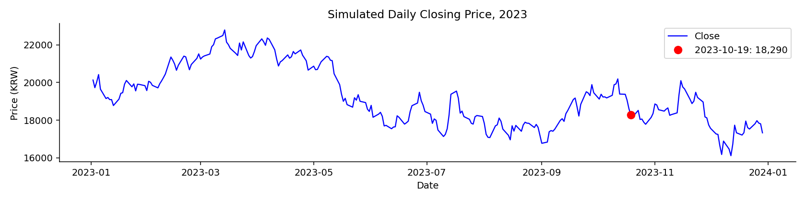
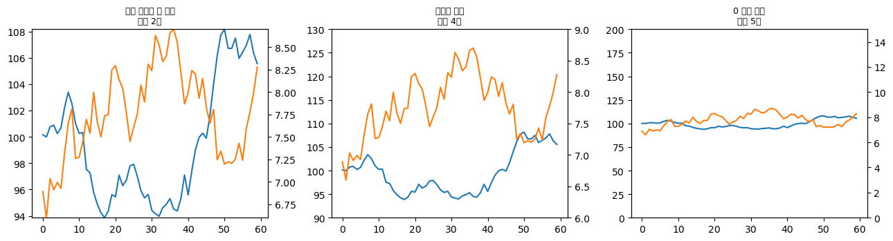
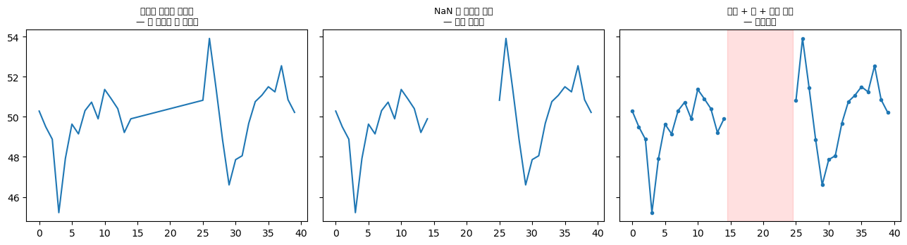
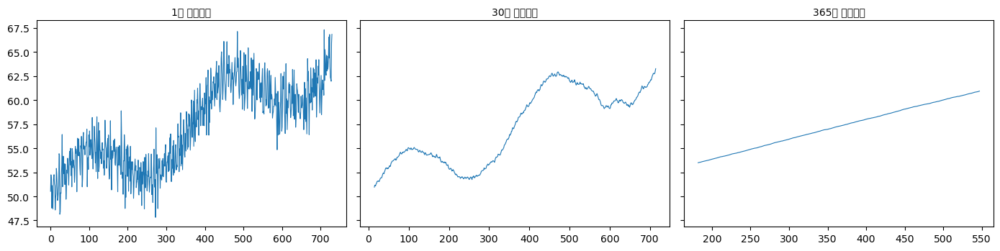
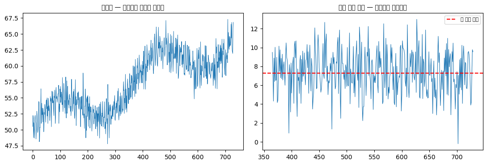
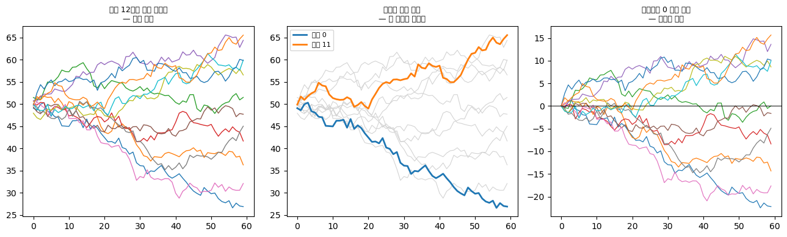
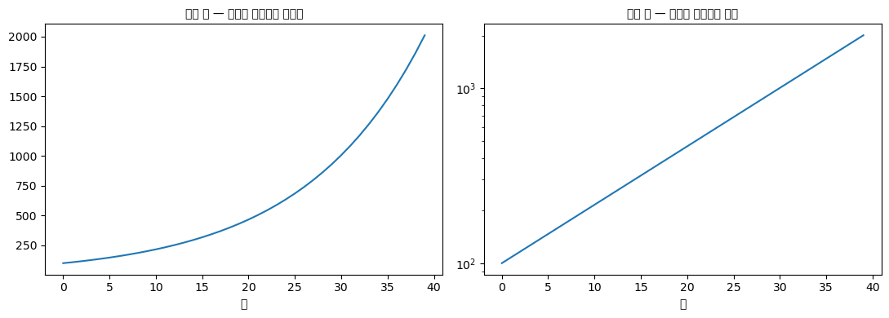
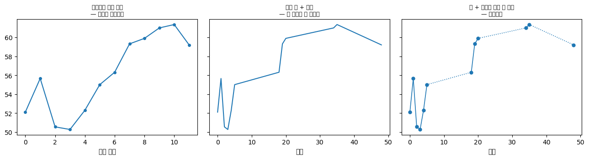

# 선그림

지금까지의 그림들은 자료점의 **순서**를 쓰지 않았다. 산점도의 점들을 아무렇게나 섞어도 그림은 같다. 히스토그램도, 상자그림도 마찬가지다.

**선그림**은 다르다. 점을 순서대로 잇는다. 그 "잇기" 하나가 새로운 정보를 만들어 낸다.

**선을 그을 수 있다는 것은 곧 이웃한 두 점이 서로 이어져 있다고 주장하는 것이다.** 그 주장이 맞을 때만 선그림을 써야 한다.

## 1. 시계열 예제

<div class="codebox" markdown>

**예제 1.** 시계열 꺾은선그림

```python
import numpy as np
import pandas as pd
import matplotlib.pyplot as plt

# 재현 가능하도록 주가를 모의생성한다. 실제 자료를 쓰는 법은 아래에 있다.
# 로그수익률을 정규분포에서 뽑고 누적합의 지수를 취하면
# 실제 주가와 비슷한 기하 브라운 운동 경로가 나온다.
rng = np.random.default_rng(42)
dates = pd.bdate_range("2023-01-01", "2023-12-31")   # 거래일만(주말 제외)
returns = rng.normal(0.0004, 0.02, len(dates))        # 일평균 0.04%, 일변동성 2%
price = 20000 * np.exp(np.cumsum(returns))            # 시작가 20,000원
s = pd.Series(price, index=dates, name="Close")

print(f"거래일 수: {len(s)}")
print(f"기간: {s.index.min().date()} ~ {s.index.max().date()}")
print(f"시작가 {s.iloc[0]:,.0f}  종료가 {s.iloc[-1]:,.0f}")
print(f"최저 {s.min():,.0f}  최고 {s.max():,.0f}")

fig, ax = plt.subplots(figsize=(12, 3))

# 선그림의 핵심: 점을 시간 순서대로 이어 그린다.
# 이 "이어 그리기" 때문에 추세와 변동이 눈에 들어온다.
ax.plot(s.index, s.values, color="blue", lw=1.2, label="Close")

# 특정 날짜를 강조하고 싶으면 그 점 하나만 따로 찍는다.
mark = pd.Timestamp("2023-10-19")
ax.plot([mark], [s.loc[mark]], "or", ms=8,
        label=f"{mark.date()}: {s.loc[mark]:,.0f}")

ax.set_xlabel("Date")
ax.set_ylabel("Price (KRW)")
ax.set_title("Simulated Daily Closing Price, 2023")
ax.legend()
ax.spines[['top', 'right']].set_visible(False)
plt.tight_layout()
plt.show()
```

출력:

```
거래일 수: 260
기간: 2023-01-02 ~ 2023-12-29
시작가 20,130  종료가 17,330
최저 16,117  최고 22,786
```

</div>



선그림이 하는 일이 여기 다 있다. 260개의 점을 시간 순서로 이었을 뿐인데 **추세**(연중 하락)와 **변동성**(오르내림의 폭)이 한눈에 들어온다.

**같은 260개 값을 히스토그램으로 그리면 이 두 가지가 모두 사라진다.** 히스토그램은 "16,000원대가 며칠, 20,000원대가 며칠"만 알려 주고, 어느 순서로 그랬는지는 버린다. 순서를 버리면 추세도 변동성도 없다.

!!! tip "실제 주가로 바꾸려면"
    `yfinance`로 실제 자료를 받아 같은 그림을 그릴 수 있다.

    ```python
    import yfinance as yf

    data = yf.download('019170.KS', start='2023-01-01', end='2023-12-31')
    s = data['Close']
    s.index = s.index.tz_localize(None)
    # 이후 그리는 코드는 위와 같다
    ```

    출력:

    ```
    YF.download() has changed argument auto_adjust default to True
    ```

    다만 이 방식은 **네트워크와 외부 서비스에 의존한다.** 요청 제한에 걸리거나 종목 코드가 바뀌면 실행되지 않고, 자료가 갱신되면 그림도 달라진다. 교재의 예제를 모의자료로 둔 이유가 이것이다. 결과가 언제 실행해도 같아야 검증할 수 있다.

## 2. 선을 그어도 되는가

선그림의 유일하면서도 중요한 전제는 **가로축에 의미 있는 순서가 있고, 이웃한 두 점 사이가 연속적으로 이어져 있다**는 것이다.

**선을 그어도 되는 경우**

- **시간에 따른 관측.** 주가, 기온, 인구, 매출. 두 관측 시점 사이에도 값이 존재했으므로 잇는 것이 자연스럽다.
- **순서가 있는 연속 변수.** 용량에 따른 반응, 거리에 따른 감쇠.

**선을 그으면 안 되는 경우**

- **범주형 가로축.** 지역별 매출을 선으로 이으면 "서울과 부산 사이"에 값이 있다는 뜻이 되는데, 그런 것은 없다. 막대그림을 써야 한다.
- **관측 간격이 매우 불규칙한 경우.** 1월과 12월 사이에 관측이 없다면, 둘을 잇는 직선은 **자료가 아니라 가정**이다. 그럴 때는 점을 함께 찍어(`'-o'`) 실제 관측 시점을 보여 준다.
- **값이 계단처럼 바뀌는 경우.** 기준금리는 발표일에 순간적으로 바뀌고 그사이에는 일정하다. 직선으로 이으면 서서히 변한 것처럼 보인다. 다음 절의 **계단 그림**이 이 경우를 다룬다.

!!! warning "선그림의 y축은 잘라도 된다 — 막대그림과 다르다"
    막대그림에서는 세로축이 반드시 0에서 시작해야 했다. 막대의 **길이**로 크기를 비교하기 때문이다.

    선그림은 다르다. 선그림에서 읽는 것은 길이가 아니라 **기울기와 변화**다. 기울기는 축을 잘라도 왜곡되지 않는다. 오히려 0부터 그리면 변동이 납작해져 아무것도 안 보이는 일이 흔하다. 체온 변화를 0°C부터 그린다고 생각해 보라.

    **다만 축을 잘랐다면 그 사실이 눈에 띄어야 한다.** y축 눈금을 명확히 표시하고, 필요하면 잘림 표시를 넣는다. 변화율이 중요하다면 축을 로그로 하거나 아예 변화율 자체를 그리는 편이 낫다.

## 3. 여러 계열을 겹칠 때

선그림의 흔한 쓰임이 여러 계열을 한 그림에 겹치는 것이다. 그때 생기는 문제가 둘 있다.

**첫째, 계열이 많으면 뒤엉킨다.** 대여섯 개가 넘어가면 어느 선이 어느 것인지 추적할 수 없다. 이른바 **스파게티 그림**이다.

대책은 **강조와 배경 분리**다. 말하려는 한두 계열만 진한 색으로 그리고 나머지는 옅은 회색으로 깔아 둔다. 또는 격자로 나누어(작은 그림 여러 장) 각 계열을 따로 그리되 축을 공유한다.

**둘째, 척도가 다른 계열을 겹치면 오해를 부른다.** 두 번째 y축(`twinx`)을 쓰면 두 선의 교차점이나 나란함이 **축의 배율을 어떻게 잡았느냐에 따라** 완전히 달라진다. 원하는 결론을 만들어 낼 수 있다는 뜻이다.

파레토 그림은 두 축을 쓰지만 예외였다. 선이 언제나 막대의 누적이라 관계가 고정되어 있기 때문이다. 일반적인 두 계열에는 그런 고정 관계가 없다.

**대안**은 각 계열을 자기 기준으로 정규화하는 것이다. 기준 시점을 100으로 두는 지수화(indexing)나 표준화가 흔히 쓰인다. 그러면 하나의 축에 그릴 수 있고 배율 조작의 여지가 사라진다.

## 연습문제

<div class="drillbox" markdown>

**연습문제 1.** <span class="diff easy" title="쉬움"></span>
다음 각 상황에서 가장 적절한 그림 유형을 밝히고 그 선택을 정당화하라. (a) 환자 세 집단의 나이 분포 비교, (b) 12개월에 걸친 주가 변화 표시, (c) 경쟁하는 다섯 브랜드의 시장 점유율 표시.

</div>

??? success "풀이"
    **(a) 환자 세 집단의 나이 분포 비교:** **나란히 놓은 상자그림**이나 **바이올린 그림**. 상자그림은 집단 간 중심, 퍼짐, 이상치를 압축적으로 비교해 준다. 분포가 다봉일 수 있거나 전체 모양이 중요하다면 바이올린 그림이 낫다. 각 집단이 30개 이하로 작다면 **스웜 그림**을 겹쳐 원자료를 함께 보인다.

    **(b) 12개월에 걸친 주가:** x축에 시간, y축에 가격을 둔 **선그림**. 잇는 선이 시간적 연속성과 추세를 강조하므로 시계열 자료에는 선그림이 표준적인 선택이다. 주가는 실제로 연속적으로 변하므로 잇는 것이 정당하다.

    **(c) 다섯 브랜드의 시장 점유율:** **정렬한 막대그림**. 브랜드는 범주형이므로 선으로 이으면 안 된다. 원그래프도 가능하지만, 다섯 개의 각도를 비교하는 것보다 막대 길이를 비교하는 편이 훨씬 정확하다. "전체가 100%"를 강조해야 한다면 100% 누적 막대 하나를 곁들인다.

<div class="drillbox" markdown>

**연습문제 2.** <span class="diff med" title="중간"></span>
어떤 보고서가 두 회사의 매출을 한 선그림에 겹쳐 그렸는데, 왼쪽 축은 A사(단위: 억 원, 범위 100~120), 오른쪽 축은 B사(단위: 억 원, 범위 5~9)로 두었다. 그림에서 두 선이 여러 번 교차하며 "두 회사가 엎치락뒤치락한다"고 설명되어 있다. 무엇이 문제인가?

</div>

??? success "풀이"
    **문제: 교차는 자료가 아니라 축 설정이 만들어 낸 것이다.**

    A사 매출은 100~120억, B사는 5~9억으로 **자릿수가 다르다.** 실제로는 A사가 언제나 B사의 열 배 이상이므로, 한 축에 그리면 B사 선이 바닥에 붙어 있고 두 선은 **한 번도 교차하지 않는다.**

    두 축을 따로 잡으면 각 선이 자기 축의 범위를 꽉 채우도록 늘어난다. 그 상태에서 두 선이 겹쳐 보이는 것은 **배율을 그렇게 잡았기 때문**이지 두 회사가 비슷해서가 아니다.

    더 나쁜 것은 **교차 지점이 임의로 조작 가능**하다는 점이다. 오른쪽 축의 범위를 4~10으로 바꾸면 교차 지점이 옮겨 가고, 3~12로 바꾸면 교차가 사라진다. 같은 자료로 정반대의 그림을 만들 수 있다.

    **"엎치락뒤치락한다"는 설명은 근거가 없다.** 두 선이 교차한 것이지 두 회사의 매출이 역전된 것이 아니다.

    **대안.**

    1. **지수화.** 첫 시점의 값을 각각 100으로 두고 상대적 변화를 그린다. 하나의 축에 그릴 수 있고, "누가 더 빨리 성장하는가"라는 물음에 정직하게 답한다. **이것이 두 회사를 비교하려는 원래 의도에 가장 맞다.**
    2. **로그 축.** 한 축에 그리되 y축을 로그로 한다. 자릿수가 달라도 둘 다 보이고, 로그 축에서는 **기울기가 곧 성장률**이다.
    3. **그림을 둘로 나눈다.** 위아래로 나란히 놓고 x축을 공유시킨다. 배율 조작의 여지가 없고 각 회사의 절대 규모도 정직하게 드러난다.
    4. **성장률 자체를 그린다.** 전년 대비 증가율을 두 선으로 그리면 단위가 %로 같아진다.

    어느 경우든 **두 번째 y축은 피하는 것이 원칙**이다.

<div class="drillbox" markdown>

**연습문제 3.** <span class="diff med" title="중간"></span>
같은 시계열을 (a) 선그림, (b) 히스토그램, (c) 상자그림으로 그렸다. 각 그림에서 무엇을 알 수 있고 무엇을 잃는가?

</div>

??? success "풀이"
    앞의 주가 자료(260개 종가)를 예로 들어 정리한다.

    **(a) 선그림**

    - **알 수 있는 것**: 추세(연중 하락), 변동성의 시간 변화, 특정 시점의 값, 급등락이 일어난 날, 자기상관의 흔적(오늘 오르면 내일도 오르는 경향).
    - **잃는 것**: 값의 분포를 읽기 어렵다. "20,000원 이상이었던 날이 며칠인가"를 세려면 눈으로 훑어야 한다. 중앙값이나 사분위수가 보이지 않는다.

    **(b) 히스토그램**

    - **알 수 있는 것**: 값의 분포. 어느 가격대에 며칠이 몰려 있는지, 분포가 한 봉우리인지 두 봉우리인지.
    - **잃는 것**: **순서 전체.** 260개를 무작위로 섞어도 히스토그램은 같다. 따라서 추세, 변동성, 자기상관이 모두 사라진다. 연중 꾸준히 오른 자료와 꾸준히 내린 자료의 히스토그램이 동일할 수 있다.

    **(c) 상자그림**

    - **알 수 있는 것**: 다섯 숫자 요약(최소·1사분위·중앙값·3사분위·최대)과 이상치. 아주 압축적이다.
    - **잃는 것**: 순서는 물론이고 **분포의 모양까지** 잃는다. 봉우리가 둘인 분포도 평범한 상자로 보인다. 다만 여러 시계열을 비교하거나, 연도별로 나누어 나란히 놓으면(예: 월별 상자그림 12개) 순서 정보를 부분적으로 되살릴 수 있다.

    **핵심.** 세 그림은 서로를 대체하지 못한다. **선그림은 시간 구조를, 히스토그램은 분포를, 상자그림은 요약을 보여 준다.** 시계열 분석에서는 대개 선그림을 먼저 보고, 그다음 잔차나 수익률의 히스토그램을 보는 식으로 **함께** 쓴다.

<div class="drillbox" markdown>

**연습문제 4.** <span class="diff med" title="중간"></span>
연습문제 2의 이중 축 문제를 정량화하라. 축 범위를 바꾸는 것만으로 두 선의 **교차 횟수**가 달라지는가?

</div>

??? success "풀이"
    ```python
    import numpy as np
    import matplotlib.pyplot as plt

    rng = np.random.default_rng(0)
    t = np.arange(60)
    a = 100 + np.cumsum(rng.normal(0, 1.2, 60))
    b = 7 + np.cumsum(rng.normal(0, 0.25, 60))

    def crossings(alo, ahi, blo, bhi):
        """두 축 범위로 정규화했을 때 선이 교차하는 횟수"""
        d = (a - alo) / (ahi - alo) - (b - blo) / (bhi - blo)
        return int(np.sum(np.diff(np.sign(d)) != 0))

    print(f"두 계열의 실제 상관 {np.corrcoef(a, b)[0, 1]:+.4f}\n")
    settings = [(a.min(), a.max(), b.min(), b.max(), "자료 범위에 딱 맞춤"),
                (90, 130, 6, 9, "임의로 넓힘"),
                (0, 200, 0, 15, "0 에서 시작")]
    for alo, ahi, blo, bhi, label in settings:
        print(f"  A:{alo:>6.0f}~{ahi:<6.0f} B:{blo:>5.1f}~{bhi:<5.1f}  "
              f"교차 {crossings(alo, ahi, blo, bhi)}회   ({label})")

    fig, axes = plt.subplots(1, 3, figsize=(13, 3.6))
    for ax, (alo, ahi, blo, bhi, label) in zip(axes, settings):
        ax.plot(t, a, color="C0"); ax.set_ylim(alo, ahi)
        ax2 = ax.twinx(); ax2.plot(t, b, color="C1"); ax2.set_ylim(blo, bhi)
        ax.set_title(f"{label}\n교차 {crossings(alo, ahi, blo, bhi)}회", fontsize=9)
    fig.tight_layout()
    plt.show()
    ```

    출력:

    ```
    두 계열의 실제 상관 -0.5566

      A:    94~108    B:  6.6~8.7    교차 2회   (자료 범위에 딱 맞춤)
      A:    90~130    B:  6.0~9.0    교차 4회   (임의로 넓힘)
      A:     0~200    B:  0.0~15.0   교차 5회   (0 에서 시작)
    ```

    

    **같은 두 계열이 축 범위에 따라 $2$번, $4$번, $5$번 교차한다.** 자료는 하나도 바뀌지 않았다.

    그리고 두 계열의 실제 상관은 $-0.56$으로 **음수**다. 그런데 축을 잘 고르면 두 선이 나란히 움직이는 것처럼 보이게 만들 수 있다.

    **이중 축이 위험한 근본 이유.** 두 축의 배율에 **자연스러운 기준이 없다.** 어떤 배율도 정당화할 수 없으므로, 작성자가 원하는 인상을 자유롭게 만들 수 있다. 본문이 지적한 대로 파레토 그림은 예외인데, 거기서는 선이 언제나 막대의 누적이라 관계가 고정되어 있기 때문이다.

    **대안.**

    | 방법 | 방식 |
    |---|---|
    | **지수화** | 기준 시점을 $100$으로 두고 상대 변화를 그린다 |
    | **표준화** | 각 계열을 $(x-\bar{x})/s$로 변환 |
    | **변화율** | 수준 대신 전기 대비 증감률을 그린다 |
    | **면 나누기** | 위아래 두 패널로 나누고 가로축만 공유 |

    앞의 셋은 하나의 축에 그릴 수 있게 만들어 조작의 여지를 없앤다. 마지막은 두 계열을 아예 섞지 않는다.

    **읽는 사람으로서.** 이중 축 그림을 보면 **두 축의 범위를 먼저 확인하라.** 범위가 자료에 딱 맞춰져 있다면 그 자체가 "교차점이 의미 있어 보이도록 맞췄다"는 신호일 수 있다. $\square$

<div class="drillbox" markdown>

**연습문제 5.** <span class="diff med" title="중간"></span>
시계열에 **결측**이 있을 때 선그림은 무엇을 하는가? 그 결과가 왜 위험한지 보이고 올바른 처리법을 제시하라.

</div>

??? success "풀이"
    ```python
    import numpy as np
    import matplotlib.pyplot as plt

    rng = np.random.default_rng(2)
    t = np.arange(40)
    y = 50 + np.cumsum(rng.normal(0, 1.5, 40))
    y_missing = y.copy()
    y_missing[15:25] = np.nan                      # 10개 시점이 비었다

    dropped = y_missing[~np.isnan(y_missing)]
    t_dropped = t[~np.isnan(y_missing)]

    print(f"전체 {len(t)}개 시점 중 관측 {np.sum(~np.isnan(y_missing))}개, "
          f"결측 {np.sum(np.isnan(y_missing))}개 (시점 15~24)")

    fig, axes = plt.subplots(1, 3, figsize=(13, 3.6), sharey=True)
    axes[0].plot(t_dropped, dropped, "-")
    axes[0].set_title("결측을 지우고 이으면\n— 빈 구간이 안 보인다", fontsize=9)
    axes[1].plot(t, y_missing, "-")
    axes[1].set_title("NaN 을 그대로 두면\n— 선이 끊긴다", fontsize=9)
    axes[2].plot(t, y_missing, "-o", ms=3)
    axes[2].axvspan(14.5, 24.5, color="red", alpha=0.12)
    axes[2].set_title("끊고 + 점 + 구간 표시\n— 정직하다", fontsize=9)
    fig.tight_layout()
    plt.show()
    ```

    출력:

    ```
    전체 40개 시점 중 관측 30개, 결측 10개 (시점 15~24)
    ```

    

    **왼쪽 그림이 위험하다.** 결측 시점을 지우고 남은 점만 이으면, 시점 $14$와 $25$가 **직선으로 연결되어** 그 사이에 자료가 있었던 것처럼 보인다. 게다가 가로축의 점 간격이 균일해 보이므로 독자는 결측이 있었다는 사실조차 알 수 없다.

    **`NaN` 을 그대로 두는 것이 첫 번째 해법이다.** matplotlib은 `NaN` 구간에서 선을 끊으므로 자동으로 정직해진다. `pandas` 로 자료를 읽었다면 `reindex` 로 빠진 시점을 명시적으로 만들어 두는 것이 중요하다.

    **더 나은 처리.**

    - **관측 시점에 점을 찍어라**(`'-o'`). 본문 $2$절의 조언대로, 어디가 실제 관측인지 보인다.
    - **결측 구간을 음영으로 표시하라.** 독자가 그 구간을 해석에서 제외할 수 있다.
    - **보간했다면 반드시 밝혀라.** 보간은 분석 편의를 위한 것이지 자료가 아니다. 보간값을 점선이나 다른 색으로 구별하는 것이 관행이다.

    **결측이 무작위가 아니면 더 심각하다.** 센서가 극단적인 값에서 고장 나거나, 경제 위기 때 통계 집계가 중단되는 경우가 흔하다. 그러면 남은 자료만 이은 선은 **체계적으로 완만해 보인다.** 1장의 MNAR 문제가 시계열에서 나타난 형태다. $\square$

<div class="drillbox" markdown>

**연습문제 6.** <span class="diff med" title="중간"></span>
같은 시계열을 **평활**해서 그리면 이야기가 달라진다. 평활 창의 크기가 무엇을 바꾸는지 보이고, 어떻게 고를지 논하라.

</div>

??? success "풀이"
    ```python
    import numpy as np
    import matplotlib.pyplot as plt

    rng = np.random.default_rng(1)
    n = 730
    t = np.arange(n)
    y = (50 + 0.02 * t                              # 추세: 하루 0.02
         + 3 * np.sin(2 * np.pi * t / 365.25)       # 연간 계절성
         + 1.2 * np.sin(2 * np.pi * t / 7)          # 주간 주기
         + rng.normal(0, 1.5, n))                   # 잡음

    ma = lambda x, k: np.convolve(x, np.ones(k) / k, mode="valid")

    print(f"{'창':>7}{'표준편차':>11}{'최대-최소':>12}")
    for k in (1, 7, 30, 90, 365):
        s = y if k == 1 else ma(y, k)
        print(f"{k:>5}일{s.std():>11.4f}{s.ptp():>12.4f}")

    print(f"\n참 추세 {0.02 * 365:.2f}/년")
    print(f"  원자료 회귀        {np.polyfit(t, y, 1)[0] * 365:.4f}/년")
    s365 = ma(y, 365)
    print(f"  365일 이동평균 회귀 {np.polyfit(np.arange(len(s365)), s365, 1)[0] * 365:.4f}/년")

    fig, axes = plt.subplots(1, 3, figsize=(14, 3.6), sharey=True)
    for ax, k in zip(axes, (1, 30, 365)):
        s = y if k == 1 else ma(y, k)
        ax.plot(np.arange(len(s)) + (k - 1) / 2, s, lw=0.8)
        ax.set_title(f"{k}일 이동평균", fontsize=10)
    fig.tight_layout()
    plt.show()
    ```

    출력:

    ```
    창       표준편차       최대-최소
        1일     4.3236     19.4806
        7일     3.9818     14.3163
       30일     3.8246     12.3035
       90일     3.6203     10.1797
      365일     2.1650      7.4372

    참 추세 7.30/년
      원자료 회귀        5.8696/년
      365일 이동평균 회귀 7.4785/년
    ```

    

    **창이 커질수록 다른 것이 보인다.**

    | 창 | 무엇이 보이는가 |
    |---|---|
    | $1$일 (원자료) | 잡음이 지배해 아무것도 안 보인다 |
    | $7$일 | 주간 주기가 제거된다 |
    | $30$일 | 계절 곡선이 뚜렷해진다 |
    | $365$일 | 계절성이 사라지고 **추세만 남는다** |

    **추세 추정도 달라진다.** 원자료 회귀는 $5.87$/년으로 참값 $7.30$을 크게 빗나가는데, $730$일이 계절 주기의 정수배가 아니라 계절 성분이 추세로 새어 들었기 때문이다. $365$일 이동평균 후에는 $7.48$/년으로 참값에 가깝다.

    **창을 고르는 원칙.**

    - **제거하려는 주기의 정수배로 잡아라.** 주간 효과를 없애려면 $7$일, 계절성을 없애려면 $365$일(또는 $12$개월). 이것이 가장 중요한 규칙이다.
    - **목적을 먼저 정하라.** 추세를 보고 싶은가, 계절 패턴을 보고 싶은가, 단기 이상을 잡고 싶은가에 따라 답이 다르다.
    - **평활은 정보를 버리는 연산이다.** 매끄러운 곡선이 더 "진짜"인 것이 아니다.

    **주의할 점 두 가지.**

    - **중심 이동평균은 미래를 쓴다.** 위 그림의 $t$ 위치 보정이 그것이며, **실시간 예측에는 쓸 수 없다.** 과거만 쓰는 후행 이동평균은 지연이 생긴다.
    - **양 끝이 잘린다.** $365$일 평균은 앞뒤 반년치를 잃는다. 최근 자료가 중요한 상황에서는 치명적이다.

    **더 나은 도구.** 계절성과 추세를 분리하려면 이동평균보다 **STL 분해**나 계절조정(X-13ARIMA)이 낫다. 다음 문제에서 다룬다. $\square$

<div class="drillbox" markdown>

**연습문제 7.** <span class="diff med" title="중간"></span>
연습문제 6의 계절성을 다른 방식으로 다루어라. **전년 동기 대비**가 왜 널리 쓰이며 무엇을 잃는가?

</div>

??? success "풀이"
    ```python
    import numpy as np
    import matplotlib.pyplot as plt

    rng = np.random.default_rng(1)
    n = 730
    t = np.arange(n)
    y = (50 + 0.02 * t + 3 * np.sin(2 * np.pi * t / 365.25)
         + 1.2 * np.sin(2 * np.pi * t / 7) + rng.normal(0, 1.5, n))

    yoy = y[365:] - y[:365]                          # 전년 동기 대비 차이
    print(f"전년 대비 차이의 평균 {yoy.mean():.4f}   (참 연간 증가 {0.02 * 365:.2f})")
    print(f"                표준편차 {yoy.std():.4f}")
    print(f"원자료 인접 차이의 표준편차 {np.diff(y).std():.4f}")

    fig, axes = plt.subplots(1, 2, figsize=(11, 3.8))
    axes[0].plot(t, y, lw=0.7)
    axes[0].set_title("원자료 — 계절성이 추세를 가린다", fontsize=10)
    axes[1].plot(t[365:], yoy, lw=0.8)
    axes[1].axhline(0.02 * 365, color="red", ls="--", label="참 연간 증가")
    axes[1].set_title("전년 동기 대비 — 계절성이 사라진다", fontsize=10)
    axes[1].legend(fontsize=8)
    fig.tight_layout()
    plt.show()
    ```

    출력:

    ```
    전년 대비 차이의 평균 7.4372   (참 연간 증가 7.30)
                    표준편차 2.2538
    원자료 인접 차이의 표준편차 2.2281
    ```

    

    **전년 동기 대비 차이의 평균이 $7.44$로 참 연간 증가 $7.30$과 맞는다.** 계절 성분이 $1$년 주기이므로 $1$년 전 값을 빼면 정확히 상쇄되기 때문이다.

    **널리 쓰이는 이유가 여기 있다.** 계산이 단순하고, 모형을 가정하지 않으며, "작년 같은 달보다 얼마나"라는 해석이 직관적이다. 매출·물가·고용 통계가 대부분 이 형태로 보고된다.

    **그런데 잃는 것이 많다.**

    - **$1$년치 자료를 통째로 버린다.** 위에서 $730$개가 $365$개가 되었다.
    - **잡음이 커진다.** 두 잡음의 차이라 분산이 $2$배가 된다. 위에서 표준편차가 $2.25$로 원자료 인접 차이의 $2.23$과 비슷한데, 이는 **$1$년치 정보를 쓰고도 하루치 차이만큼만 정밀하다**는 뜻이다.
    - **기저효과에 취약하다.** 작년 값이 이상했으면 올해 수치가 그 때문에 튄다. 코로나 시기의 경제 통계가 이듬해 "폭등"으로 보인 것이 전형적인 예다.
    - **추세의 변곡점을 늦게 알린다.** $1$년 전과 비교하므로 최근의 방향 전환이 희석된다.

    **대안.**

    | 방법 | 특징 |
    |---|---|
    | **전년 동기 대비** | 단순, 해석 쉬움, 잡음 큼 |
    | **계절조정 후 전기 대비** | 최신 변화에 민감, 모형 필요 |
    | **STL 분해** | 추세·계절·잔차를 분리해 각각 볼 수 있음 |
    | **$12$개월 이동합계** | 계절성 제거 + 평활, 지연 큼 |

    **실무에서는 두 개 이상을 함께 본다.** 전년 대비는 "작년과 비교해 어떤가", 계절조정 전기 대비는 "지금 방향이 어떤가"에 답하며, 두 질문이 다르기 때문이다. $\square$

<div class="drillbox" markdown>

**연습문제 8.** <span class="diff med" title="중간"></span>
본문 $3$절의 **스파게티 그림** 문제를 다루어라. 계열이 몇 개부터 문제가 되며, 강조와 면 나누기는 각각 무엇을 해결하는가?

</div>

??? success "풀이"
    ```python
    import numpy as np
    import matplotlib.pyplot as plt

    rng = np.random.default_rng(4)
    K, n = 12, 60
    t = np.arange(n)
    series = np.array([50 + np.cumsum(rng.normal(0.05 * (k - K / 2), 1.0, n))
                       for k in range(K)])

    fig = plt.figure(figsize=(13, 4))
    ax1 = fig.add_subplot(1, 3, 1)
    for s in series:
        ax1.plot(t, s, lw=1)
    ax1.set_title(f"계열 {K}개를 모두 진하게\n— 추적 불가", fontsize=9)

    ax2 = fig.add_subplot(1, 3, 2)
    for i, s in enumerate(series):
        if i in (0, K - 1):
            ax2.plot(t, s, lw=2, label=f"계열 {i}")
        else:
            ax2.plot(t, s, lw=0.8, color="lightgray", zorder=1)
    ax2.legend(fontsize=8)
    ax2.set_title("강조와 배경 분리\n— 두 계열은 읽힌다", fontsize=9)

    ax3 = fig.add_subplot(1, 3, 3)
    for s in series:
        ax3.plot(t, s - s[0], lw=0.9)
    ax3.axhline(0, color="black", lw=0.7)
    ax3.set_title("시작점을 0 으로 정렬\n— 변화만 비교", fontsize=9)
    fig.tight_layout()
    plt.show()

    print(f"계열 {K}개, 시점 {n}개")
    print(f"시작값의 범위 {series[:, 0].min():.1f} ~ {series[:, 0].max():.1f}"
          f"  (폭 {series[:, 0].ptp():.1f})")
    print(f"끝값의 범위   {series[:, -1].min():.1f} ~ {series[:, -1].max():.1f}"
          f"  (폭 {series[:, -1].ptp():.1f})")
    print(f"→ 시작점이 이미 흩어져 있어 '어느 계열이 더 올랐는가'를 눈으로 읽기 어렵다")
    ```

    출력:

    ```
    계열 12개, 시점 60개
    시작값의 범위 47.9 ~ 51.5  (폭 3.5)
    끝값의 범위   26.9 ~ 65.5  (폭 38.7)
    → 시작점이 이미 흩어져 있어 '어느 계열이 더 올랐는가'를 눈으로 읽기 어렵다
    ```

    

    **경험칙은 계열 $5$–$7$개다.** 그보다 많으면 색으로 구별하기 어렵고, 선이 서로를 가린다. 위 그림의 $12$개는 명백히 한계를 넘는다.

    **세 가지 처방이 서로 다른 문제를 푼다.**

    | 방법 | 무엇을 해결하는가 | 무엇을 포기하는가 |
    |---|---|---|
    | **강조 + 회색 배경** | 한두 계열을 읽을 수 있다 | 나머지는 맥락으로만 |
    | **면 나누기(작은 다중 그림)** | 모든 계열을 볼 수 있다 | 계열 간 직접 비교가 어렵다 |
    | **시작점 정렬(지수화)** | 변화의 비교가 쉬워진다 | 수준의 차이가 사라진다 |

    **셋째가 특히 유용하다.** 위 출력에서 시작값이 이미 넓게 흩어져 있어, 원 그림에서는 "어느 계열이 더 많이 올랐는가"를 판단할 수 없다. 시작점을 $0$(또는 $100$)으로 맞추면 그 질문에 바로 답할 수 있다. 연습문제 4의 이중 축 대안으로 제시한 지수화와 같은 기법이다.

    **직접 이름표를 붙여라.** 계열이 여러 개일 때 범례는 색과 이름을 눈으로 왕복시켜야 해서 읽기가 느리다. **선의 끝에 이름을 직접 적으면** 그 왕복이 사라진다. 신문 그래픽에서 표준적으로 쓰는 방법이다. $\square$

<div class="drillbox" markdown>

**연습문제 9.** <span class="diff med" title="중간"></span>
성장을 보여 주는 시계열에서 **로그 축**이 더 정직한 경우가 있다. 언제 그러하며 왜인가?

</div>

??? success "풀이"
    ```python
    import numpy as np
    import matplotlib.pyplot as plt

    t = np.arange(40)
    y = 100 * 1.08 ** t                              # 매년 8% 성장

    print(f"값 {y[0]:.0f} → {y[-1]:,.0f}   ({y[-1] / y[0]:.1f}배)")
    print(f"\n{'구간':>12}{'절대 증가':>12}{'비율 증가':>11}")
    for lo, hi in [(0, 5), (17, 22), (34, 39)]:
        print(f"  {lo:>2}~{hi:<2}년{y[hi] - y[lo]:>12.1f}{y[hi] / y[lo]:>11.4f}")

    fig, axes = plt.subplots(1, 2, figsize=(11, 4))
    axes[0].plot(t, y)
    axes[0].set_title("선형 축 — 최근만 극적으로 보인다", fontsize=10)
    axes[1].plot(t, y)
    axes[1].set_yscale("log")
    axes[1].set_title("로그 축 — 일정한 성장률이 직선", fontsize=10)
    for ax in axes:
        ax.set_xlabel("연")
    fig.tight_layout()
    plt.show()
    ```

    출력:

    ```
    값 100 → 2,012   (20.1배)

              구간       절대 증가      비율 증가
       0~5 년        46.9     1.4693
      17~22년       173.7     1.4693
      34~39년       642.5     1.4693
    ```

    

    **성장률이 $8\%$로 내내 일정한데** 선형 축에서는 최근 구간만 가파르게 보인다. 절대 증가가 $47$에서 $\mathbf{1010}$으로 커지기 때문이다. 그러나 비율 증가는 세 구간 모두 $1.47$배로 **완전히 같다.**

    **로그 축에서는 직선이 된다.** $\log y = \log 100 + t\log 1.08$이므로 기울기가 성장률의 로그다. **직선이면 성장률이 일정하고, 휘면 성장률이 변한 것이다.**

    **언제 로그 축을 쓰는가.**

    | 상황 | 축 |
    |---|---|
    | 관심이 **비율 변화**(성장률, 수익률) | **로그** |
    | 여러 자릿수에 걸친 값 | **로그** |
    | 크기가 매우 다른 계열을 함께 | **로그** |
    | 관심이 **절대 변화**(금액, 인원) | 선형 |
    | 값에 $0$이나 음수가 있다 | 선형 (또는 `symlog`) |

    **코로나 확진자 그래프 논쟁이 이 문제였다.** 초기 확산은 지수적이므로 로그 축에서 직선이 되고, 방역 효과는 그 **직선이 꺾이는 것**으로 나타난다. 선형 축에서는 "폭증"만 보일 뿐 언제 꺾였는지 알 수 없다.

    **반대로 로그 축의 위험도 있다.** 독자가 로그임을 인지하지 못하면 증가를 크게 과소평가한다. **눈금 이름표를 원래 단위로 적고**(`100, 1000, 10000`), 축 제목에 로그임을 명시해야 한다.

    **가장 정직한 대안**은 **성장률 자체를 그리는 것**이다. 그러면 축 선택 논쟁이 사라지고, 성장률이 일정한지 변하는지가 직접 보인다. $\square$

<div class="drillbox" markdown>

**연습문제 10.** <span class="diff med" title="중간"></span>
본문 $2$절이 "선을 그어도 되는가"를 다루었다. 그 판단이 애매한 경우를 하나 깊이 들여다보라. 관측 간격이 불규칙할 때 무엇이 문제인가?

</div>

??? success "풀이"
    ```python
    import numpy as np
    import matplotlib.pyplot as plt

    rng = np.random.default_rng(6)
    t_obs = np.array([0, 1, 2, 3, 4, 5, 18, 19, 20, 34, 35, 48], float)
    y_obs = 50 + np.cumsum(rng.normal(0, 2.0, len(t_obs)))

    print(f"관측 {len(t_obs)}개,  기간 {t_obs[0]:.0f}~{t_obs[-1]:.0f}")
    gaps = np.diff(t_obs)
    print(f"관측 간격: 최소 {gaps.min():.0f}, 중앙값 {np.median(gaps):.0f}, 최대 {gaps.max():.0f}")
    print(f"→ 간격이 {gaps.max() / gaps.min():.0f}배까지 차이 난다")

    fig, axes = plt.subplots(1, 3, figsize=(13, 3.6), sharey=True)
    axes[0].plot(range(len(t_obs)), y_obs, "-o", ms=4)
    axes[0].set_xlabel("관측 번호")
    axes[0].set_title("가로축이 관측 번호\n— 시간이 왜곡된다", fontsize=9)

    axes[1].plot(t_obs, y_obs, "-")
    axes[1].set_xlabel("시간")
    axes[1].set_title("시간 축 + 선만\n— 빈 구간이 안 보인다", fontsize=9)

    axes[2].plot(t_obs, y_obs, "o", ms=5)
    for i in range(len(t_obs) - 1):
        style = "-" if gaps[i] <= 2 else ":"
        axes[2].plot(t_obs[i:i+2], y_obs[i:i+2], style, color="C0", lw=1.2)
    axes[2].set_xlabel("시간")
    axes[2].set_title("점 + 간격에 따라 선 구분\n— 정직하다", fontsize=9)
    fig.tight_layout()
    plt.show()
    ```

    출력:

    ```
    관측 12개,  기간 0~48
    관측 간격: 최소 1, 중앙값 1, 최대 14
    → 간격이 14배까지 차이 난다
    ```

    

    **첫 그림이 가장 흔한 실수다.** 가로축을 관측 번호로 두면 모든 간격이 같아 보인다. $5$번과 $6$번 관측 사이가 실제로는 $13$단위인데 $1$단위처럼 그려진다. **시간축을 시간으로 두는 것이 최소 요건이다.**

    **둘째 그림은 시간축은 맞지만 여전히 문제다.** 긴 빈 구간을 직선이 가로지르며, 그 직선은 **자료가 아니라 선형 보간이라는 가정**이다. 본문이 말한 대로다.

    **셋째 그림의 처리.** 관측점을 반드시 찍고, 간격이 큰 구간은 점선이나 회색으로 구별한다. 독자가 "여기는 추측"이라고 읽을 수 있다.

    **불규칙 간격이 만드는 다른 문제들.**

    - **이동평균을 쓸 수 없다.** 일정 간격을 전제하기 때문이다. 시간 기반 창(`pandas` 의 `rolling('7D')`)을 써야 한다.
    - **자기상관 분석이 무의미해진다.** 시차 $1$이 시간적으로 얼마인지 일정하지 않다.
    - **관측 간격 자체가 정보일 수 있다.** 환자가 자주 내원한 시기는 상태가 나빴던 시기일 수 있다. **관측이 있다는 사실이 무작위가 아니면**(1장의 MNAR) 보이는 궤적이 편향된다.

    **더 정교한 처리.** 불규칙 시계열을 제대로 다루려면 가우시안 과정이나 상태공간 모형처럼 **연속시간 모형**을 쓴다. 그러면 관측 사이의 불확실성이 신뢰띠로 표현되어, 빈 구간에서 띠가 넓어지는 것을 눈으로 볼 수 있다. **모르는 구간을 모른다고 그리는 것**이 이 절 전체의 원칙이다. $\square$


## 정리하며

선그림의 본질은 **점을 잇는다는 것**이며, 그것이 곧 "이 둘은 이어져 있다"는 주장이다.

- **잇는 것이 정당할 때만** 쓴다. 시간이나 순서가 있는 연속 변수가 대표적이다.
- **범주형 가로축에는 쓰지 않는다.**
- **y축은 잘라도 된다.** 막대그림과 반대다. 선그림에서 읽는 것은 길이가 아니라 기울기이기 때문이다.
- **여러 계열을 겹칠 때**는 강조와 배경을 나누고, 척도가 다르면 두 번째 축 대신 지수화나 로그 축을 쓴다.

다음 절의 **계단 그림과 면적 그림**은 선그림의 두 변형이다. 값이 계단처럼 바뀔 때와, 여러 계열의 합과 구성을 함께 보고 싶을 때 쓴다.
