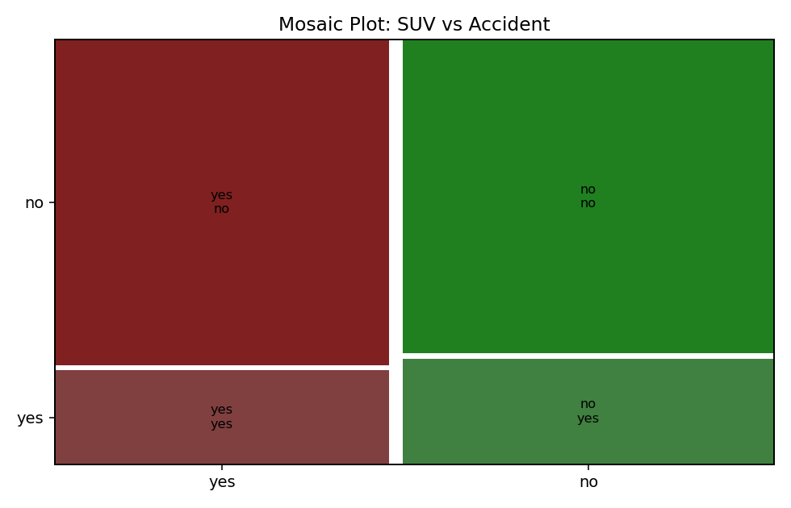
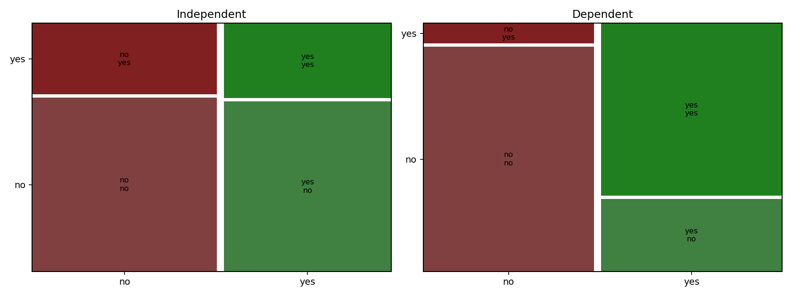

# 모자이크 그림과 도수분포표

지금까지의 막대그림·원그래프·파레토 그림은 모두 **범주형 변수 하나**를 다루었다. 이제 변수가 둘이 되면 새로운 물음이 생긴다.

**두 범주형 변수가 서로 얽혀 있는가?** SUV를 타는 것과 사고를 내는 것 사이에 관계가 있는가?

이 물음에 답하는 도구가 둘이다. 숫자로는 **이원 도수분포표**, 그림으로는 **모자이크 그림**이다. 모자이크 그림은 도수분포표의 각 칸을 그 도수에 비례하는 **넓이**의 사각형으로 그린 것이므로, 둘은 같은 자료의 두 표현이다.

## 1. 이원 도수분포표

두 범주형 변수의 조합마다 개수를 센 표다. **분할표(contingency table)** 라고도 한다.

<div class="codebox" markdown>

**예제 1.** 이원 도수분포표 만들기

```python
import pandas as pd

# 네 조합의 개수를 그대로 펼쳐 원자료 형태로 만든다.
#   SUV·사고 28명 / 비SUV·사고 35명 / SUV·무사고 97명 / 비SUV·무사고 104명
data = {'SUV':      28*['yes'] + 35*['no']  + 97*['yes'] + 104*['no'],
        'Accident': 28*['yes'] + 35*['yes'] + 97*['no']  + 104*['no']}
df = pd.DataFrame(data)

# crosstab이 두 범주형 변수를 교차하여 도수를 센다
dg = pd.crosstab(df.SUV, df.Accident, rownames=['SUV'], colnames=['Accident'])

dg.loc['TOTAL', :] = dg.sum()        # 열 방향 합계를 맨 아래 줄에 추가
dg.loc[:, 'TOTAL'] = dg.sum(axis=1)  # 행 방향 합계를 맨 오른쪽 열에 추가
dg = dg.astype(int)                  # 합계를 더하며 실수가 되었으므로 정수로 되돌린다
print(dg)
```

출력:

```
Accident   no  yes  TOTAL
SUV
no        104   35    139
yes        97   28    125
TOTAL     201   63    264
```

</div>

행과 열의 이름이 알파벳 순으로 정렬되어 `no`가 먼저 온다는 점에 주의하라. 오른쪽 아래 264는 전체 인원이다.

### 상대도수분포표

모든 칸을 전체로 나누면 비율이 된다.

<div class="codebox" markdown>

**예제 2.** 상대도수분포표

```python
# 모든 칸을 전체 합으로 나누면 상대도수분포표가 된다.
# 모자이크 그림은 바로 이 비율을 넓이로 옮겨 그린 것이다.
dh = dg / dg.loc['TOTAL', 'TOTAL']
print(dh)
```

출력:

```
Accident        no       yes     TOTAL
SUV
no        0.393939  0.132576  0.526515
yes       0.367424  0.106061  0.473485
TOTAL     0.761364  0.238636  1.000000
```

</div>

### 표에서 세 가지 확률을 읽는다

이 표는 3장의 확률 개념과 곧바로 대응한다.

- **결합확률** $P(\text{SUV}, \text{사고}) = 0.106$ — 가운데 칸
- **주변확률** $P(\text{SUV}) = 0.473$ — 오른쪽 끝 열
- **조건부확률** $P(\text{사고} \mid \text{SUV}) = 28/125 = 0.224$ — 칸을 그 **행의 합**으로 나눈 값

마지막이 3장 조건부확률의 정의 $P(A \mid B) = P(A \cap B)/P(B)$를 표에서 실행한 것이다. $0.106/0.473 = 0.224$로 같은 값이 나온다.

$$
\begin{array}{ll}
\text{곱셈 규칙:} & p(x, y) = p(x)\, p(y \mid x) \\
\text{주변화:} & p(x) = \sum_y p(x, y) \\
\text{조건화:} & p(y \mid x) = \dfrac{p(x, y)}{p(x)}
\end{array}
$$

## 2. 모자이크 그림

표의 각 칸을 도수에 비례하는 넓이의 사각형으로 그린다. **전체 넓이가 전체 도수**이고, 각 사각형의 넓이가 그 칸의 도수다.

<div class="codebox" markdown>

**예제 3.** 모자이크 그림 그리기

```python
import matplotlib.pyplot as plt
import pandas as pd
from statsmodels.graphics.mosaicplot import mosaic

data = {'SUV':      28*['yes'] + 35*['no']  + 97*['yes'] + 104*['no'],
        'Accident': 28*['yes'] + 35*['yes'] + 97*['no']  + 104*['no']}
df = pd.DataFrame(data)

fig, ax = plt.subplots(figsize=(7, 4.5))

# 변수를 준 순서대로 나눈다.
#   첫 변수(SUV)      -> 세로로 분할. 열의 너비가 그 범주의 비율
#   두 번째(Accident) -> 각 열 안에서 가로로 분할. 조건부확률이 높이가 된다
# gap은 사각형 사이의 간격
mosaic(df, ['SUV', 'Accident'], ax=ax, gap=0.02,
       title='Mosaic Plot: SUV vs Accident')
plt.tight_layout()
plt.show()
```

</div>



읽는 법이 그림의 구조에 그대로 담겨 있다.

- **열의 너비** = 첫 변수의 주변확률. SUV 열이 조금 좁으니 $P(\text{SUV}) = 0.473$이다.
- **각 열 안의 높이** = 그 열에서의 조건부확률. SUV 열에서 사고 부분의 높이가 $P(\text{사고} \mid \text{SUV}) = 0.224$다.
- **사각형의 넓이** = 결합확률. 너비 × 높이 = $0.473 \times 0.224 = 0.106$이다.

**모자이크 그림은 곱셈 규칙을 그림으로 옮긴 것이다.** 결합확률 = 주변확률 × 조건부확률이 넓이 = 너비 × 높이가 된다.

## 3. 독립이면 분할선이 나란해진다

모자이크 그림의 가장 큰 쓸모는 여기에 있다. 두 변수가 독립인지가 **한눈에** 보인다.

<div class="codebox" markdown>

**예제 4.** 독립이면 분할선이 나란해진다

```python
import numpy as np
import pandas as pd
import matplotlib.pyplot as plt
from statsmodels.graphics.mosaicplot import mosaic

rng = np.random.default_rng(7)
n = 400

# --- 독립: Y가 X와 무관하게 생성된다 ---
A = rng.choice(['yes', 'no'], n, p=[.5, .5])
B = rng.choice(['yes', 'no'], n, p=[.3, .7])
df_indep = pd.DataFrame({'X': A, 'Y': B})

# --- 종속: X가 yes면 Y가 yes일 확률이 크게 높아진다 ---
A2 = rng.choice(['yes', 'no'], n, p=[.5, .5])
B2 = np.where(A2 == 'yes',
              rng.choice(['yes', 'no'], n, p=[.7, .3]),
              rng.choice(['yes', 'no'], n, p=[.1, .9]))
df_dep = pd.DataFrame({'X': A2, 'Y': B2})

for name, d in [('독립', df_indep), ('종속', df_dep)]:
    ct = pd.crosstab(d.X, d.Y)
    print(f"=== {name} ===")
    print(ct)
    print("P(Y=yes | X=no) =", round(ct.loc['no', 'yes'] / ct.loc['no'].sum(), 3))
    print("P(Y=yes | X=yes)=", round(ct.loc['yes', 'yes'] / ct.loc['yes'].sum(), 3))
    print()

fig, axes = plt.subplots(1, 2, figsize=(12, 4.5))
mosaic(df_indep, ['X', 'Y'], ax=axes[0], gap=0.02, title='Independent')
mosaic(df_dep,   ['X', 'Y'], ax=axes[1], gap=0.02, title='Dependent')
plt.tight_layout()
plt.show()
```

출력:

```
=== 독립 ===
Y     no  yes
X
no   149   61
yes  132   58
P(Y=yes | X=no) = 0.29
P(Y=yes | X=yes)= 0.305

=== 종속 ===
Y     no  yes
X
no   178   16
yes   61  145
P(Y=yes | X=no) = 0.082
P(Y=yes | X=yes)= 0.704
```

</div>



**왼쪽(독립).** 두 열의 가로 분할선이 거의 같은 높이에 있다. 조건부확률이 0.290과 0.305로 사실상 같기 때문이다. $X$를 알아도 $Y$에 대한 예측이 달라지지 않는다.

**오른쪽(종속).** 분할선이 뚜렷하게 어긋나 있다. $X = \text{no}$일 때 0.082, $X = \text{yes}$일 때 0.704로 여덟 배 넘게 차이 난다.

!!! tip "분할선의 어긋남이 곧 종속성이다"
    3장에서 독립을 $P(Y \mid X) = P(Y)$로 정의했다. **$X$의 값이 무엇이든 $Y$의 조건부확률이 같다**는 뜻이다.

    모자이크 그림에서 그 조건부확률이 바로 **각 열 안의 분할 높이**다. 따라서

    - 모든 열의 분할선이 같은 높이 → 독립
    - 분할선이 어긋남 → 종속

    이 대응 덕분에 표의 숫자를 계산하기 전에 그림만 보고도 판단할 수 있다. 어긋남의 정도를 형식적으로 검정하는 것이 10장의 **카이제곱 독립성 검정**이다.

    앞의 SUV 예제로 돌아가면, 두 열의 분할선이 거의 같은 높이였다. SUV 여부와 사고 사이에 뚜렷한 관계가 보이지 않는다는 뜻이다. 실제로 $P(\text{사고} \mid \text{SUV}) = 0.224$이고 $P(\text{사고} \mid \text{비SUV}) = 35/139 = 0.252$로 비슷하다.

## 연습문제

<div class="drillbox" markdown>

**연습문제 1.** <span class="diff easy" title="쉬움"></span>
어떤 이원 도수분포표가 환자 200명에 대해 다음과 같은 도수를 보여준다.

|  | 처리 A | 처리 B | 합계 |
|:---|:---:|:---:|:---:|
| 호전됨 | 60 | 40 | 100 |
| 호전 안 됨 | 40 | 60 | 100 |
| 합계 | 100 | 100 | 200 |

(처리 A, 호전됨)의 결합상대도수와 처리 A가 주어졌을 때 호전될 조건부확률을 계산하라.

</div>

??? success "풀이"
    (처리 A, 호전됨)의 **결합상대도수**는

    $$
    \frac{60}{200} = 0.30
    $$

    이다. 처리 A가 주어졌을 때 호전될 **조건부확률**은

    $$
    P(\text{Improved} \mid \text{Treatment A}) = \frac{60}{100} = 0.60
    $$

    이다.

    비교하자면 처리 B가 주어졌을 때 호전될 조건부확률은 $40/100 = 0.40$이다. 처리 A의 호전율이 더 높아 보인다.

<div class="drillbox" markdown>

**연습문제 2.** <span class="diff med" title="중간"></span>
연습문제 1의 자료를 모자이크 그림으로 그린다면 어떤 모양이 되겠는가? 열의 너비와 분할선의 위치를 구체적으로 말하고, 그 그림에서 두 처리의 효과 차이가 어떻게 나타나는지 설명하라.

</div>

??? success "풀이"
    **열의 너비.** 처리 A와 B가 각각 100명으로 같으므로 두 열의 너비가 **정확히 같다**($P(\text{A}) = P(\text{B}) = 0.5$).

    **분할선의 위치.** 각 열 안에서 "호전됨"이 차지하는 높이는 조건부확률이다.

    - A 열: 위쪽 60%가 호전됨
    - B 열: 위쪽 40%가 호전됨

    **효과 차이가 나타나는 방식.** 두 분할선이 **뚜렷하게 어긋난다.** A 열의 분할선이 B 열보다 20%포인트 아래에 있고(호전 영역이 더 넓고), 이 어긋남이 곧 처리와 결과가 독립이 아니라는 신호다.

    독립이라면 두 열 모두 분할선이 전체 호전율 $100/200 = 50\%$ 위치에 나란히 놓였을 것이다. 실제로는 60%와 40%로 갈라져 있다.

    **다만 그림만으로 인과를 말할 수는 없다.** 1장에서 본 대로, 처리를 무작위 배정하지 않았다면 이 차이가 교란요인 때문일 수 있다. 모자이크 그림은 연관성의 크기를 보여 줄 뿐이다.

<div class="drillbox" markdown>

**연습문제 3.** <span class="diff med" title="중간"></span>
모자이크 그림과 100% 누적 막대그림은 둘 다 조건부확률을 높이로 나타낸다. 두 그림의 차이는 무엇이며, 어떤 경우에 모자이크 그림이 나은가?

</div>

??? success "풀이"
    **차이: 열의 너비.**

    100% 누적 막대그림은 모든 막대의 **너비가 같다.** 각 막대가 100%로 정규화되므로 조건부확률만 보이고, **그 범주에 몇 명이 있는지는 사라진다.**

    모자이크 그림은 열의 너비가 그 범주의 **주변확률에 비례한다.** 그래서 조건부확률과 표본 크기를 동시에 보여 준다.

    **모자이크 그림이 나은 경우: 범주별 도수가 크게 다를 때.**

    예를 들어 어떤 범주에 5명, 다른 범주에 500명이 있다고 하자. 100% 누적 막대에서는 두 막대가 같은 크기로 그려져, 5명짜리 범주의 비율이 500명짜리와 **똑같은 무게로** 보인다. 5명 중 4명이면 80%인데, 이 80%는 표본이 작아 매우 불안정하다.

    모자이크 그림에서는 그 열이 아주 좁게 그려져 **"여기는 자료가 적다"는 경고가 그림 안에 들어 있다.** 넓이(= 결합확률)가 작으므로 시각적 비중도 그만큼 작아진다.

    **반대로 100% 누적 막대가 나은 경우**도 있다. 조건부확률만 정확히 비교하고 싶고 표본 크기는 이미 알고 있을 때다. 모든 막대가 같은 기준선에서 출발하므로 비율 비교가 더 정확하다.

<div class="drillbox" markdown>

**연습문제 4.** <span class="diff med" title="중간"></span>
본문 $3$절은 분할선의 **나란함**으로 독립을 판정했다. 이를 수치로 만들어라. **피어슨 잔차**란 무엇이며 모자이크 그림에서 어떻게 쓰이는가?

</div>

??? success "풀이"
    각 칸의 피어슨 잔차는

    $$
    r_{ij} = \frac{O_{ij} - E_{ij}}{\sqrt{E_{ij}}},
    \qquad
    E_{ij} = \frac{(\text{행 합})(\text{열 합})}{n}
    $$

    이다. $E_{ij}$는 **독립이라면 기대되는 도수**이므로, $r_{ij}$는 그 기대에서 얼마나 벗어났는지를 표준화한 값이다.

    ```python
    import numpy as np
    from scipy import stats

    obs = np.array([[40, 60], [70, 30]], float)
    chi2, p, dof, exp = stats.chi2_contingency(obs, correction=False)
    resid = (obs - exp) / np.sqrt(exp)

    print("관측 도수\n", obs.astype(int))
    print("독립일 때의 기대 도수\n", np.round(exp, 2))
    print("피어슨 잔차\n", np.round(resid, 3))
    print(f"\nchi2 = {chi2:.4f}   잔차 제곱합 = {np.sum(resid ** 2):.4f}   p = {p:.3e}")
    ```

    출력:

    ```
    관측 도수
     [[40 60]
     [70 30]]
    독립일 때의 기대 도수
     [[55. 45.]
     [55. 45.]]
    피어슨 잔차
     [[-2.023  2.236]
     [ 2.023 -2.236]]

    chi2 = 18.1818   잔차 제곱합 = 18.1818   p = 2.008e-05
    ```

    **잔차 제곱합이 정확히 카이제곱 통계량이다.**

    $$
    \chi^2 = \sum_{i,j} r_{ij}^2
    $$

    즉 모자이크 그림의 각 칸이 카이제곱 통계량에 얼마나 기여하는지를 잔차가 알려 준다.

    **잔차로 색을 칠하는 것이 표준 관행이다**(`statsmodels` 의 `mosaic` 에 `properties` 인자로 넘긴다).

    | 잔차 | 뜻 | 관례적 색 |
    |---|---|---|
    | $r > 2$ | 기대보다 훨씬 많다 | 파랑 계열 |
    | $-2 < r < 2$ | 기대와 다르지 않다 | 회색 |
    | $r < -2$ | 기대보다 훨씬 적다 | 빨강 계열 |

    임계값 $2$는 표준정규의 대략적인 $95\%$ 기준에서 온다. 다만 칸이 많으면 다중비교 문제가 생기므로(오차막대 문서 연습문제 9) 엄밀하게는 보정이 필요하다.

    !!! note "`correction=False` 를 쓴 이유"
        `scipy.stats.chi2_contingency` 는 $2 \times 2$ 표에서 **예이츠 연속성 보정을 기본으로 적용한다.** 보정을 켜면 $\chi^2$가 $16.99$로 잔차 제곱합 $18.18$과 맞지 않는다.

        연속성 보정은 이산인 도수를 연속인 카이제곱분포로 근사할 때의 오차를 줄이려는 것이지만, **지나치게 보수적이라는 비판이 많다.** 표가 $2\times2$가 아니면 적용되지 않으므로, 같은 자료를 $2\times2$로 보느냐 아니냐에 따라 결과가 달라지는 일관성 문제도 있다.

        잔차를 그림에 쓸 때는 보정 없는 값이 자연스럽다. $\square$

<div class="drillbox" markdown>

**연습문제 5.** <span class="diff med" title="중간"></span>
연습문제 3을 정량화하라. 모자이크 그림이 $100\%$ 누적 막대에 대해 갖는 고유한 정보는 무엇인가?

</div>

??? success "풀이"
    ```python
    import numpy as np
    import pandas as pd

    tab = pd.DataFrame({"성공": [45, 180], "실패": [15, 120]},
                       index=["소규모 병원", "대규모 병원"])
    n = tab.values.sum()
    row_n = tab.sum(axis=1)

    print(tab.to_string())
    print(f"\n{'집단':>12}{'표본 수':>9}{'비중':>9}{'성공률':>9}")
    for name in tab.index:
        print(f"{name:>12}{row_n[name]:>9}{row_n[name]/n:>9.3f}"
              f"{tab.loc[name, '성공']/row_n[name]:>9.3f}")

    print("\n100% 누적 막대: 두 막대의 폭이 같다 → 표본 수 정보 없음")
    print(f"모자이크:       폭이 {row_n['소규모 병원']/n:.3f} : {row_n['대규모 병원']/n:.3f}"
          f" 로 표본 수를 반영한다")
    ```

    출력:

    ```
    성공   실패
    소규모 병원   45   15
    대규모 병원  180  120

              집단     표본 수       비중      성공률
          소규모 병원       60    0.167    0.750
          대규모 병원      300    0.833    0.600

    100% 누적 막대: 두 막대의 폭이 같다 → 표본 수 정보 없음
    모자이크:       폭이 0.167 : 0.833 로 표본 수를 반영한다
    ```

    **두 그림 모두 높이로 조건부확률(성공률)을 보여 준다.** 차이는 **너비**다.

    | | $100\%$ 누적 막대 | 모자이크 |
    |---|---|---|
    | 높이 | 조건부확률 | 조건부확률 |
    | 너비 | **일정** | **주변확률(표본 수)** |
    | 칸 넓이 | 무의미 | **결합확률** |

    **모자이크의 칸 넓이가 결합확률이라는 점이 핵심이다.** 너비 $\times$ 높이 $= P(X)P(Y\mid X) = P(X, Y)$이므로, 그림 전체가 결합분포의 그림이 된다.

    **실무적으로 무엇이 달라지는가.**

    - **표본이 적은 범주가 좁게 그려진다.** 위 예에서 소규모 병원은 폭이 $0.167$이므로 그 성공률 $0.75$가 얼마나 불확실한지 시각적으로 암시된다. $100\%$ 누적 막대에서는 두 막대가 같은 폭이라 그 정보가 없다(막대그림 문서 연습문제 9, 상자그림 문서 연습문제 10과 같은 주제).
    - **전체 구성이 보인다.** 어느 범주가 주류인지 한눈에 알 수 있다.
    - **그 대가로 좁은 칸의 높이는 읽기 어려워진다.** 폭이 $5\%$ 미만인 범주는 사실상 읽을 수 없다.

    **언제 무엇을 쓰는가.**

    - **조건부확률만 비교**하고 집단 크기는 관심 밖이면 $100\%$ 누적 막대가 읽기 쉽다.
    - **결합분포 전체**를 전달하려면 모자이크.
    - **집단 크기가 크게 다르면** 모자이크가 그 사실을 감추지 않는다는 점에서 정직하다. $\square$

<div class="drillbox" markdown>

**연습문제 6.** <span class="diff med" title="중간"></span>
모자이크 그림으로 **심슨의 역설**을 보여라. $2 \times 2$ 표를 층별로 나누면 무엇이 달라지는가?

</div>

??? success "풀이"
    ```python
    import numpy as np
    from scipy import stats

    # [결석 크기][치료] -> (성공, 실패)
    table = np.array([[[81, 6], [234, 36]],       # 작은 결석: A, B
                      [[192, 71], [55, 25]]], float)  # 큰 결석: A, B

    print(f"{'층':>10}{'치료':>6}{'성공률':>10}{'환자 수':>9}")
    for i, size in enumerate(["작은 결석", "큰 결석"]):
        for j, tr in enumerate(["A", "B"]):
            s, f = table[i, j]
            print(f"{size:>10}{tr:>6}{s/(s+f):>10.4f}{int(s+f):>9}")

    agg = table.sum(axis=0)
    print()
    for j, tr in enumerate(["A", "B"]):
        s, f = agg[j]
        print(f"{'전체':>10}{tr:>6}{s/(s+f):>10.4f}{int(s+f):>9}")

    print(f"\n주변화한 2x2 표의 카이제곱 p = "
          f"{stats.chi2_contingency(agg, correction=False)[1]:.4f}")
    ```

    출력:

    ```
    층    치료       성공률     환자 수
         작은 결석     A    0.9310       87
         작은 결석     B    0.8667      270
          큰 결석     A    0.7300      263
          큰 결석     B    0.6875       80

            전체     A    0.7800      350
            전체     B    0.8257      350

    주변화한 2x2 표의 카이제곱 p = 0.1285
    ```

    **A가 두 층 모두에서 이기는데 전체에서는 진다.** 1장 교란 문서와 pandas 문서에서 본 그 자료다.

    **모자이크 그림에서 어떻게 보이는가.**

    - **주변화한 $2\times2$ 모자이크**를 그리면 B의 성공 칸이 더 높아 "B가 낫다"로 읽힌다.
    - **결석 크기로 층을 나눈 모자이크**(세 변수 모자이크)를 그리면 각 층에서 A가 더 높다.

    **모자이크 그림의 강점이 여기 있다.** 세 번째 변수를 **추가 분할축**으로 넣을 수 있으므로, 같은 그림 안에서 층별 비교가 가능하다. `statsmodels` 의 `mosaic` 은 다중 인덱스를 받아 여러 단계로 분할한다.

    **주의할 점.** 주변화한 표의 카이제곱 $p$ 값이 $0.15$로 유의하지 않다. 즉 **"차이가 없다"는 결론에 이를 수도 있는데, 층별로 보면 두 층 모두에서 A가 낫다.** 주변화가 정보를 지운 정도가 아니라 방향까지 바꾼 것이다.

    **일반 원리.** $2\times2$ 표를 볼 때는 언제나 **"이 표가 무엇을 주변화한 결과인가"** 를 물어야 한다. 층화 변수가 있다면 층별 표를 함께 보아야 하며, 그것이 1장에서 본 교란 보정의 가장 단순한 형태다. $\square$

<div class="drillbox" markdown>

**연습문제 7.** <span class="diff med" title="중간"></span>
카이제곱 검정에는 **기대 도수에 대한 조건**이 있다. 그 조건이 깨지면 어떻게 되며, 모자이크 그림에서 어떻게 알아채는가?

</div>

??? success "풀이"
    ```python
    import numpy as np
    from scipy import stats

    rng = np.random.default_rng(4)

    def check(obs, label):
        chi2, p, dof, exp = stats.chi2_contingency(obs, correction=False)
        small = np.sum(exp < 5)
        print(f"{label}")
        print(f"  기대 도수 최소 {exp.min():.2f}, 5 미만인 칸 {small}/{exp.size}개")
        print(f"  카이제곱 p = {p:.4f}", end="")
        if obs.shape == (2, 2):
            print(f"   피셔 정확검정 p = {stats.fisher_exact(obs)[1]:.4f}")
        else:
            print()

    check(np.array([[40, 60], [70, 30]]), "충분한 표본")
    check(np.array([[8, 2], [3, 7]]), "\n작은 표본")
    check(np.array([[1, 9], [8, 2]]), "\n매우 작은 표본")

    print("\n귀무가설이 참일 때 카이제곱 검정의 실제 1종 오류율")
    for n in (20, 40, 100, 400):
        rej = 0
        for _ in range(20_000):
            row = rng.multinomial(n, [0.5, 0.5])
            tab = np.array([rng.multinomial(row[0], [0.15, 0.85]),
                            rng.multinomial(row[1], [0.15, 0.85])])
            if tab.sum(axis=0).min() > 0 and tab.sum(axis=1).min() > 0:
                if stats.chi2_contingency(tab, correction=False)[1] < 0.05:
                    rej += 1
        print(f"  n={n:>4}: {rej / 20_000:.4f}")
    ```

    출력:

    ```
    충분한 표본
      기대 도수 최소 45.00, 5 미만인 칸 0/4개
      카이제곱 p = 0.0000   피셔 정확검정 p = 0.0000

    작은 표본
      기대 도수 최소 4.50, 5 미만인 칸 2/4개
      카이제곱 p = 0.0246   피셔 정확검정 p = 0.0698

    매우 작은 표본
      기대 도수 최소 4.50, 5 미만인 칸 2/4개
      카이제곱 p = 0.0017   피셔 정확검정 p = 0.0055

    귀무가설이 참일 때 카이제곱 검정의 실제 1종 오류율
      n=  20: 0.0343
      n=  40: 0.0447
      n= 100: 0.0505
      n= 400: 0.0527
    ```

    **표본이 작으면 카이제곱 근사가 어긋난다.** 위 모의에서 $n = 20$일 때 실제 1종 오류율이 $0.034$로 명목 $0.05$보다 낮고, $n$이 커지면서 $0.05$에 수렴한다.

    여기서는 **보수적인 쪽으로** 어긋났다. 즉 귀무가설을 덜 기각하므로 거짓양성 위험은 없지만 **검정력을 잃는다.** 어긋나는 방향은 주변 비율에 따라 달라지며, 비율이 극단적이면 반대로 관대해지는 경우도 있다. 어느 쪽이든 **소표본에서 명목 수준을 믿을 수 없다는 것**이 요점이다.

    **관례적 기준**은 다음과 같다.

    - **모든 기대 도수가 $5$ 이상**이면 카이제곱 근사가 무난하다(코크런의 규칙).
    - $2\times2$ 표에서 기대 도수가 $5$ 미만인 칸이 있으면 **피셔 정확검정**을 쓴다.
    - 큰 표에서는 기대 도수가 $5$ 미만인 칸이 **전체의 $20\%$ 이하**이고 모두 $1$ 이상이면 허용하기도 한다.

    **모자이크 그림에서 어떻게 알아채는가.** **아주 좁거나 아주 낮은 칸**이 보이면 그 칸의 도수가 작다는 신호다. 특히 폭과 높이가 모두 작은 칸은 결합확률이 작으므로 기대 도수도 작다. 그런 칸이 여럿이면 카이제곱 검정 결과를 그대로 믿어서는 안 된다.

    **모자이크 그림의 시각적 함정.** 도수가 $1$–$2$인 칸도 색이 진하게 칠해질 수 있다(잔차가 크므로). 그러면 **그 칸이 중요한 발견처럼 보이지만** 실제로는 표본이 없어서 잔차가 튄 것이다. 앞 절 hexbin 연습문제 7의 "점이 적은 칸이 극단적으로 튄다"와 같은 문제다.

    **처방.** 도수가 작은 범주는 **묶거나** 별도로 표시하고, 카이제곱 대신 정확검정이나 몬테카를로 $p$ 값을 쓴다. $\square$

<div class="drillbox" markdown>

**연습문제 8.** <span class="diff med" title="중간"></span>
모자이크 그림에서 **범주의 순서**가 해석을 어떻게 바꾸는가?

</div>

??? success "풀이"
    ```python
    import numpy as np
    import pandas as pd

    # 만족도(순서형) × 연령대(순서형)
    data = pd.DataFrame({
        "매우 불만": [30, 20, 10, 5],
        "불만":     [40, 35, 25, 15],
        "보통":     [50, 55, 60, 50],
        "만족":     [30, 45, 60, 70],
        "매우 만족": [10, 20, 35, 60],
    }, index=["20대", "30대", "40대", "50대"])

    print(data.to_string())
    print("\n행별 조건부확률 (연령대별 만족도 분포)")
    print((data.div(data.sum(axis=1), axis=0) * 100).round(1).to_string())

    top2 = data[["만족", "매우 만족"]].sum(axis=1) / data.sum(axis=1)
    print(f"\n'만족 이상' 비율: {dict(zip(data.index, top2.round(3)))}")
    ```

    출력:

    ```
    매우 불만  불만  보통  만족  매우 만족
    20대     30  40  50  30     10
    30대     20  35  55  45     20
    40대     10  25  60  60     35
    50대      5  15  50  70     60

    행별 조건부확률 (연령대별 만족도 분포)
         매우 불만    불만    보통    만족  매우 만족
    20대   18.8  25.0  31.2  18.8    6.2
    30대   11.4  20.0  31.4  25.7   11.4
    40대    5.3  13.2  31.6  31.6   18.4
    50대    2.5   7.5  25.0  35.0   30.0

    '만족 이상' 비율: {'20대': 0.25, '30대': 0.371, '40대': 0.5, '50대': 0.65}
    ```

    **순서형 범주는 순서를 지켜야 한다.** 만족도를 도수 순으로 정렬하면 "매우 불만 → 보통 → 만족"처럼 뒤섞여, 만족도가 연령에 따라 **단조적으로 오르는** 구조가 완전히 사라진다.

    **막대그림 문서 연습문제 7의 결론이 여기서도 같다.** 자연스러운 순서가 있으면 그것을 보존하고, 없을 때만 값으로 정렬한다.

    **순서형일 때의 추가 고려.**

    - **발산형 색지도가 자연스럽다.** "보통"을 중심으로 불만 쪽은 빨강, 만족 쪽은 파랑으로 하면 순서와 방향이 색으로도 전달된다.
    - **"보통"을 기준으로 정렬하는 변형**이 있다. 리커트 자료 전용 그림에서 중립 응답을 가운데 놓고 좌우로 뻗게 그리면, 긍정과 부정의 균형이 한눈에 보인다.
    - **상위 $k$ 비율을 함께 보고하라.** 위 출력의 "만족 이상" 비율이 $0.25 \to 0.72$로 오르는 것이 핵심 발견인데, 모자이크 그림에서는 여러 칸을 눈으로 합쳐야 알 수 있다.

    **순서가 없는 범주라면.** 값으로 정렬하되 **모든 그림에서 같은 순서**를 쓴다. 여러 모자이크를 비교할 때 순서가 다르면 대조가 불가능하다.

    **그리고 분할 축의 순서도 선택이다.** 행을 먼저 나눌지 열을 먼저 나눌지에 따라 그림이 달라진다. **먼저 나눈 변수의 주변분포가 폭으로 정확히 읽히므로**, 어느 변수가 "조건"인지에 맞춰 정해야 한다. $\square$

<div class="drillbox" markdown>

**연습문제 9.** <span class="diff med" title="중간"></span>
모자이크 그림이 **한계에 부딪히는** 경우를 정리하라. 범주가 많거나 칸이 비면 어떻게 되는가?

</div>

??? success "풀이"
    ```python
    import numpy as np
    import pandas as pd

    rng = np.random.default_rng(6)

    for r, c in [(2, 2), (3, 4), (5, 6), (8, 10)]:
        n = 500
        tab = rng.multinomial(n, np.ones(r * c) / (r * c)).reshape(r, c).astype(float)
        empty = np.sum(tab == 0)
        small = np.sum(tab < 5)
        widths = tab.sum(axis=1) / n
        print(f"{r}x{c} 표 ({r*c}칸, n={n}): 빈 칸 {empty}개, 5 미만 {small}개, "
              f"평균 칸 도수 {n/(r*c):.1f}, 최소 열 폭 {widths.min():.3f}")
    ```

    출력:

    ```
    2x2 표 (4칸, n=500): 빈 칸 0개, 5 미만 0개, 평균 칸 도수 125.0, 최소 열 폭 0.480
    3x4 표 (12칸, n=500): 빈 칸 0개, 5 미만 0개, 평균 칸 도수 41.7, 최소 열 폭 0.288
    5x6 표 (30칸, n=500): 빈 칸 0개, 5 미만 0개, 평균 칸 도수 16.7, 최소 열 폭 0.188
    8x10 표 (80칸, n=500): 빈 칸 0개, 5 미만 24개, 평균 칸 도수 6.2, 최소 열 폭 0.094
    ```

    **칸이 늘면 칸당 도수가 급격히 줄고 빈 칸이 생긴다.** $8\times10$이면 $80$칸에 $500$개라 칸당 $6.25$개이고, 무작위 변동만으로도 도수가 $0$인 칸이 나타난다.

    **모자이크 그림이 무너지는 방식.**

    | 문제 | 증상 |
    |---|---|
    | 범주가 많다 | 칸이 잘아 이름표를 넣을 수 없다 |
    | 칸이 비었다 | 폭이나 높이가 $0$이라 사라진다 |
    | 주변분포가 치우쳤다 | 한 범주가 그림을 독점하고 나머지는 실선처럼 보인다 |
    | 도수가 작다 | 잔차 색이 잡음에 좌우된다 (연습문제 7) |

    **실용적 한계는 대략 $5 \times 5$ 정도**다. 그보다 크면 다른 도구가 낫다.

    **대안.**

    | 상황 | 대안 |
    |---|---|
    | 범주가 많은 $2$원 표 | **히트맵** (색으로 도수나 잔차) |
    | 순서형 $\times$ 순서형 | 히트맵, 또는 상관·일치도 통계량 |
    | 범주가 많고 구조를 찾고 싶다 | **대응분석**(correspondence analysis) |
    | 흐름·전이를 보이고 싶다 | 생키 다이어그램, 충적 그림 |
    | 세 변수 이상 | 면 나누기 + 모자이크, 또는 로그선형 모형 |

    **대응분석이 특히 유용하다.** 큰 분할표를 2차원 산점도로 축약해, 어느 행 범주와 열 범주가 서로 끌리는지 보여 준다. 모자이크가 칸 하나하나를 보여 준다면 대응분석은 **전체 구조를 요약**한다.

    **원칙.** 모자이크 그림은 **작은 분할표의 결합분포를 온전히 보여 주는** 도구다. 그 조건을 벗어나면 억지로 쓰지 말고 목적에 맞는 다른 도구로 옮겨야 한다. 이 장에서 반복된 조언 그대로다. $\square$

<div class="drillbox" markdown>

**연습문제 10.** <span class="diff med" title="중간"></span>
분할표를 다루는 도구들을 하나의 결정 규칙으로 정리하고, 이 장의 다른 그림들과 어떻게 이어지는지 밝혀라.

</div>

??? success "풀이"
    **무엇을 보여 주려는가에 따라 도구가 갈린다.**

    | 목적 | 도구 |
    |---|---|
    | 결합분포 전체 (작은 표) | **모자이크** |
    | 조건부확률 비교만 | $100\%$ 누적 막대, 묶음 막대 |
    | 도수의 절대 크기 | 묶음 막대, 히트맵 |
    | 독립 여부의 시각적 판정 | **모자이크** (분할선의 나란함) |
    | 어느 칸이 기대와 다른가 | 잔차로 색칠한 모자이크, 히트맵 |
    | 범주가 많다 | 히트맵, 대응분석 |
    | 순서형 $\times$ 순서형 | 히트맵 + 순서 보존 |
    | 층화 변수가 있다 | 다단계 모자이크, 면 나누기 |

    **이 장의 다른 그림들과의 관계.**

    - **막대그림**과는 "높이가 조건부확률"이라는 점을 공유하고, **너비가 주변확률**이라는 점에서 갈린다(연습문제 5).
    - **히트맵**은 모자이크의 사촌이다. 칸의 위치를 격자에 고정하고 색으로 값을 부호화하므로 범주가 많아도 견딘다. 대신 주변분포 정보를 잃는다.
    - **산점도**가 두 연속변수의 결합분포를 보여 주듯 **모자이크는 두 범주형 변수의 결합분포**를 보여 준다. hexbin이 산점도를 구간화한 것이라면, 모자이크는 처음부터 구간화된 자료를 다룬다.

    **이 장 전체의 원칙이 여기서도 같다.**

    - **자료형이 도구를 정한다.** 범주형에는 모자이크·막대·히트맵이고, 연속형에는 산점도·hexbin이다(2장 첫 절의 자료형 분류).
    - **표본 크기를 감추지 마라.** 모자이크는 너비로 그것을 담는다는 점에서 정직하지만, 작은 칸의 잔차는 여전히 불안정하다.
    - **주변화는 정보를 지우고 때로는 방향까지 바꾼다**(연습문제 6).
    - **자의적 선택(순서, 색, 분할 축)이 해석을 바꾸므로 밝혀야 한다**(연습문제 8). $\square$


## 정리하며

이원 도수분포표와 모자이크 그림은 같은 자료의 두 표현이다.

- **표**는 정확한 숫자를 준다. 결합·주변·조건부 확률을 모두 읽을 수 있다.
- **모자이크 그림**은 그 구조를 넓이로 옮긴다. 넓이 = 너비 × 높이가 결합확률 = 주변확률 × 조건부확률이다.

모자이크 그림의 핵심 쓸모는 **독립성 판정**이다. 열마다 분할선이 나란하면 독립, 어긋나면 종속이다. 이 시각적 판정을 형식적 검정으로 바꾼 것이 10장의 카이제곱 독립성 검정이다.

이것으로 범주형 자료의 시각화가 끝난다. 다음 절부터는 **수치형 자료** — 값이 크고 작은 순서를 갖는 자료 — 로 넘어간다. 첫 도구는 자료가 적을 때 쓰는 **점그림과 줄기잎그림**이다.
