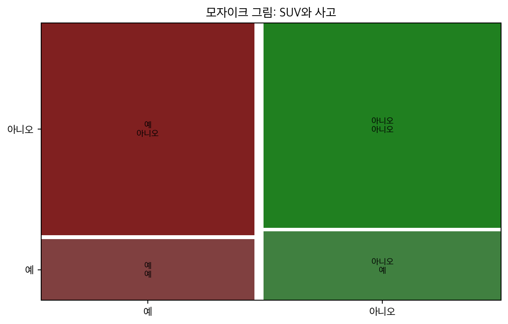
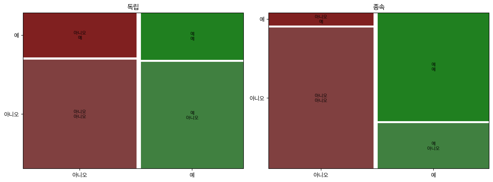

# 모자이크 그림과 도수분포표

지금까지의 막대그림·원그래프·파레토 그림은 모두 **범주형 변수 하나**를 다루었다. 이제 변수가 둘이 되면 새로운 물음이 생긴다.

**두 범주형 변수가 서로 얽혀 있는가?** SUV를 타는 것과 사고를 내는 것 사이에 관계가 있는가?

이 물음에 답하는 도구가 둘이다. 숫자로는 **이원 도수분포표**, 그림으로는 **모자이크 그림**이다. 모자이크 그림은 도수분포표의 각 칸을 그 도수에 비례하는 **넓이**의 사각형으로 그린 것이므로, 둘은 같은 자료의 두 표현이다.

## 1. 이원 도수분포표

두 범주형 변수의 조합마다 개수를 센 표다. **분할표(contingency table)** 라고도 한다.

<div class="exbox" markdown>

**보기 1.** <span class="diff easy" title="쉬움"></span> 주변합이 정해지면 표에 남는 자유는 얼마인가. 자동차 보유자 $264$ 명을 SUV 여부와 사고 여부로 교차해 세었다.

**(1)** $I \times J$ 분할표에서 행합과 열합이 모두 주어졌을 때 자유롭게 정할 수 있는 칸이 몇 개인지 구하시오. $2 \times 2$ 표에서는 몇 개인가.

**(2)** 표를 만들어 (1)을 확인하고, 자유로운 한 칸을 바꿀 때 나머지 세 칸이 어떻게 따라 움직이는지 보이시오. 그 칸이 놓일 수 있는 범위도 구하시오.

</div>

??? success "풀이"

    **(1) 해석적으로.** 칸의 도수를 $n_{ij}$ ($i = 1, \ldots, I$; $j = 1, \ldots, J$), 행합을 $n_{i\cdot}$, 열합을 $n_{\cdot j}$, 총합을 $n$ 이라 하자. 미지수는 $IJ$ 개다. 제약은

    $$
    \sum_{j} n_{ij} = n_{i\cdot} \ (I\text{개}), \qquad
    \sum_{i} n_{ij} = n_{\cdot j} \ (J\text{개})
    $$

    로 모두 $I + J$ 개인데, **하나가 중복이다.** 행합을 전부 더한 것과 열합을 전부 더한 것이 둘 다 $n$ 이기 때문이다. 곧 독립인 제약은 $I + J - 1$ 개이고

    $$
    IJ - (I + J - 1) = IJ - I - J + 1 = (I-1)(J-1)
    $$

    개의 칸만 자유롭다. **$2 \times 2$ 표는 $(2-1)(2-1) = 1$ 개뿐이다.** 네 칸이지만 사실상 수 하나로 표가 결정된다.

    실제로 $n_{11}$ 하나를 정하면

    $$
    n_{12} = n_{1\cdot} - n_{11}, \quad
    n_{21} = n_{\cdot 1} - n_{11}, \quad
    n_{22} = n - n_{1\cdot} - n_{\cdot 1} + n_{11}
    $$

    이다. $n_{11}$ 이 $1$ 늘면 $n_{12}$ 와 $n_{21}$ 이 각각 $1$ 줄고 $n_{22}$ 가 $1$ 늘어 합은 $n$ 그대로다. 모든 칸이 음수가 아니어야 하므로 $n_{11}$ 의 범위는

    $$
    \max(0,\ n_{1\cdot} + n_{\cdot 1} - n) \ \le\ n_{11} \ \le\ \min(n_{1\cdot},\ n_{\cdot 1})
    $$

    이다. 이 자료는 $n_{1\cdot} = 139$, $n_{\cdot 1} = 201$, $n = 264$ 이므로 $\max(0, 76) = 76$ 부터 $\min(139, 201) = 139$ 까지, 곧 **주변합이 같은 표가 $64$ 개** 있다.

    **이 $(I-1)(J-1)$ 이 10장 카이제곱 독립성 검정의 자유도다.** 주변합을 자료에서 가져다 쓰기 때문에 그만큼의 자유가 깎인다. 그리고 위의 범위가 바로 피셔의 정확검정에서 쓰는 초기하분포의 지지집합이다.

    **(2) 수치적으로.**

    ```python
    import pandas as pd

    # 네 조합의 개수를 그대로 펼쳐 원자료 형태로 만든다.
    #   SUV·사고 28명 / 비SUV·사고 35명 / SUV·무사고 97명 / 비SUV·무사고 104명
    data = {'SUV': 28*['예'] + 35*['아니오'] + 97*['예'] + 104*['아니오'],
            '사고': 28*['예'] + 35*['예']    + 97*['아니오'] + 104*['아니오']}
    df = pd.DataFrame(data)

    # crosstab이 두 범주형 변수를 교차하여 도수를 센다
    dg = pd.crosstab(df.SUV, df.사고, rownames=['SUV'], colnames=['사고'])

    dg.loc['합계', :] = dg.sum()         # 열 방향 합계를 맨 아래 줄에 추가
    dg.loc[:, '합계'] = dg.sum(axis=1)   # 행 방향 합계를 맨 오른쪽 열에 추가
    dg = dg.astype(int)                  # 합계를 더하며 실수가 되었으므로 정수로 되돌린다
    print(dg)

    # (1) 주변합을 고정하고 n11 하나만 바꾸면 나머지 세 칸이 따라온다.
    O = pd.crosstab(df.SUV, df.사고).values.astype(int)
    r1, r2 = O.sum(1)          # 행합 (아니오, 예)
    c1, c2 = O.sum(0)          # 열합 (아니오, 예)
    n = O.sum()
    print(f"\n행합 {r1}, {r2}   열합 {c1}, {c2}   총합 {n}")

    lo = max(0, r1 + c1 - n)
    hi = min(r1, c1)
    print(f"n11 이 놓일 수 있는 범위 [{lo}, {hi}]  →  주변합이 같은 표가 {hi - lo + 1} 개")

    print(f"\n{'n11':>5}{'n12':>5}{'n21':>5}{'n22':>5}{'합':>6}")
    for n11 in [lo, 100, int(O[0, 0]), 110, hi]:
        n12, n21 = r1 - n11, c1 - n11
        n22 = n - r1 - c1 + n11
        mark = "   <- 실제 자료" if n11 == O[0, 0] else ""
        print(f"{n11:>5}{n12:>5}{n21:>5}{n22:>5}{n11+n12+n21+n22:>6}{mark}")
    ```

    출력:

    ```
    사고   아니오   예   합계
    SUV
    아니오  104  35  139
    예     97  28  125
    합계   201  63  264

    행합 139, 125   열합 201, 63   총합 264
    n11 이 놓일 수 있는 범위 [76, 139]  →  주변합이 같은 표가 64 개

      n11  n12  n21  n22     합
       76   63  125    0   264
      100   39  101   24   264
      104   35   97   28   264   <- 실제 자료
      110   29   91   34   264
      139    0   62   63   264
    ```

    **다섯 표가 모두 행합 $139$, $125$ 와 열합 $201$, $63$ 을 지킨다.** $n_{11}$ 하나만 달라도 나머지 세 칸이 전부 따라 움직이고, 합은 언제나 $264$ 다. 자유도가 $1$ 이라는 것이 이 표에서 그대로 보인다.

    행과 열의 이름이 가나다 순으로 정렬되어 `아니오`가 먼저 온다는 점에 주의하라. 오른쪽 아래 $264$ 는 전체 인원이다. 그리고 $n_{11}$ 이 $76$ 이나 $139$ 인 양끝에서는 어느 칸이 $0$ 이 되는데, 이것이 주변합이 허용하는 가장 치우친 표다.

### 상대도수분포표

모든 칸을 전체로 나누면 비율이 된다.

<div class="exbox" markdown>

**보기 2.** <span class="diff easy" title="쉬움"></span> 한 표에서 나오는 세 가지 비율, 그리고 그중 둘을 뒤집는 법.

**(1)** 분할표의 칸을 **총합**으로, **행합**으로, **열합**으로 각각 나눈 세 표가 무엇을 뜻하는지 적으시오. 그리고 "SUV 운전자 중 사고를 낸 비율" 에서 "사고를 낸 사람 중 SUV 운전자 비율" 을 베이즈 정리로 구하시오. 두 비의 관계를 식으로 적으시오.

**(2)** 세 표를 찍어 (1)을 확인하시오.

</div>

??? success "풀이"

    **(1) 해석적으로.** 세 표는 분모가 다르다.

    | 나누는 것 | 칸의 뜻 | 기호 |
    |---|---|---|
    | 총합 $n$ | 결합확률 | $p_{ij} = n_{ij}/n$ |
    | 행합 $n_{i\cdot}$ | 행을 조건으로 한 조건부확률 | $p_{j \mid i} = n_{ij}/n_{i\cdot}$ |
    | 열합 $n_{\cdot j}$ | 열을 조건으로 한 조건부확률 | $p_{i \mid j} = n_{ij}/n_{\cdot j}$ |

    같은 칸의 수 $n_{ij}$ 를 서로 다른 분모로 나눈 것이므로 **세 표의 수는 모두 다르고, 답하는 물음도 모두 다르다.**

    곱셈 규칙을 두 방향으로 쓰면

    $$
    p_{ij} = p_{i\cdot}\, p_{j \mid i} = p_{\cdot j}\, p_{i \mid j}
    $$

    이고, 여기서 베이즈 정리가 바로 나온다.

    $$
    p_{i \mid j} = \frac{p_{j \mid i}\, p_{i\cdot}}{p_{\cdot j}}
    $$

    $X = \text{SUV}$, $Y = \text{사고}$ 로 두면 $P(Y \mid X) = 28/125 = 0.224$, $P(X) = 125/264 = 0.4735$, $P(Y) = 63/264 = 0.2386$ 이므로

    $$
    P(X \mid Y) = \frac{0.224 \times 0.4735}{0.2386} = 0.4444 = \frac{28}{63}
    $$

    이다. **두 조건부확률의 비는 주변확률의 비다.**

    $$
    \frac{P(X \mid Y)}{P(Y \mid X)} = \frac{P(X)}{P(Y)} = \frac{0.4735}{0.2386} = 1.984
    $$

    이 한 줄이 조건부확률을 뒤집어도 되는지 판정해 준다. **$P(X) = P(Y)$ 일 때만 두 값이 같다.** 여기서는 SUV 운전자가 사고자보다 두 배 가까이 많으므로 두 조건부확률도 두 배 가까이 벌어진다. $0.224$ 와 $0.444$ 를 같은 수로 읽는 것이 **조건부확률 뒤집기 오류**다.

    **(2) 수치적으로.**

    ```python
    # 모든 칸을 전체 합으로 나누면 상대도수분포표가 된다.
    # 모자이크 그림은 바로 이 비율을 넓이로 옮겨 그린 것이다.
    dh = dg / dg.loc['합계', '합계']
    print(dh)

    ct = pd.crosstab(df.SUV, df.사고)          # 합계 줄이 없는 2x2 표
    n = ct.values.sum()

    print("\n행으로 나눈 표 — P(사고 | SUV)")
    print((ct.div(ct.sum(axis=1), axis=0)).round(6))
    print("\n열로 나눈 표 — P(SUV | 사고)")
    print((ct.div(ct.sum(axis=0), axis=1)).round(6))

    # 베이즈 정리로 두 조건부확률을 서로 옮긴다.
    p_acc_given_suv = ct.loc['예', '예'] / ct.loc['예'].sum()
    p_suv = ct.loc['예'].sum() / n
    p_acc = ct['예'].sum() / n
    p_suv_given_acc = p_acc_given_suv * p_suv / p_acc

    print(f"\nP(사고 | SUV) = {ct.loc['예','예']}/{ct.loc['예'].sum()} = {p_acc_given_suv:.6f}")
    print(f"P(SUV)       = {ct.loc['예'].sum()}/{n} = {p_suv:.6f}")
    print(f"P(사고)       = {ct['예'].sum()}/{n} = {p_acc:.6f}")
    print(f"베이즈:  P(SUV | 사고) = {p_acc_given_suv:.6f} * {p_suv:.6f} / {p_acc:.6f}"
          f" = {p_suv_given_acc:.6f}")
    print(f"표에서 직접: {ct.loc['예','예']}/{ct['예'].sum()} = {ct.loc['예','예']/ct['예'].sum():.6f}")
    print(f"\n두 조건부확률의 비 = P(SUV)/P(사고) = {p_suv/p_acc:.6f}"
          f"   (실제 비 {p_suv_given_acc/p_acc_given_suv:.6f})")
    ```

    출력:

    ```
    사고        아니오         예        합계
    SUV
    아니오  0.393939  0.132576  0.526515
    예    0.367424  0.106061  0.473485
    합계   0.761364  0.238636  1.000000

    행으로 나눈 표 — P(사고 | SUV)
    사고        아니오         예
    SUV
    아니오  0.748201  0.251799
    예    0.776000  0.224000

    열로 나눈 표 — P(SUV | 사고)
    사고        아니오         예
    SUV
    아니오  0.517413  0.555556
    예    0.482587  0.444444

    P(사고 | SUV) = 28/125 = 0.224000
    P(SUV)       = 125/264 = 0.473485
    P(사고)       = 63/264 = 0.238636
    베이즈:  P(SUV | 사고) = 0.224000 * 0.473485 / 0.238636 = 0.444444
    표에서 직접: 28/63 = 0.444444

    두 조건부확률의 비 = P(SUV)/P(사고) = 1.984127   (실제 비 1.984127)
    ```

    **베이즈로 구한 $0.444444$ 가 표에서 직접 읽은 $28/63$ 과 같다.** 비도 $1.984127$ 로 $P(\text{SUV})/P(\text{사고})$ 와 정확히 일치한다.

    **같은 칸(SUV·사고 $28$ 명)이 세 표에서 $0.1061$, $0.2240$, $0.4444$ 로 나타난다.** 어느 것도 틀리지 않았고 어느 것도 서로 바꿔 쓸 수 없다. 표를 읽을 때 **무엇으로 나눈 값인지**를 먼저 확인해야 하는 까닭이다.

### 표에서 세 가지 확률을 읽는다

이 표는 3장의 확률 개념과 곧바로 대응한다.

- **결합확률** $P(\text{SUV}, \text{사고}) = 0.106$ — 가운데 칸
- **주변확률** $P(\text{SUV}) = 0.473$ — 오른쪽 끝 열
- **조건부확률** $P(\text{사고} \mid \text{SUV}) = 28/125 = 0.224$ — 칸을 그 **행의 합**으로 나눈 값

마지막이 3장 조건부확률의 정의 $P(A \mid B) = P(A \cap B)/P(B)$를 표에서 실행한 것이다. $0.106/0.473 = 0.224$로 같은 값이 나온다.

$$
\begin{array}{ll}
\text{곱셈 규칙:} & p(x, y) = p(x)\, p(y \mid x) \\
\text{주변화:} & p(x) = \sum_y p(x, y) \\
\text{조건화:} & p(y \mid x) = \dfrac{p(x, y)}{p(x)}
\end{array}
$$

## 2. 모자이크 그림

표의 각 칸을 도수에 비례하는 넓이의 사각형으로 그린다. **전체 넓이가 전체 도수**이고, 각 사각형의 넓이가 그 칸의 도수다.

<div class="exbox" markdown>

**보기 3.** <span class="diff easy" title="쉬움"></span> 타일의 넓이가 결합확률이라는 것을 실제로 재어 확인하기.

**(1)** 모자이크 그림에서 열의 너비와 각 열 안의 높이가 각각 무엇인지 적고, **타일 넓이의 합이 반드시 $1$ 임**을 보이시오.

**(2)** `mosaic` 이 돌려주는 타일의 좌표를 읽어 넓이를 재고 상대도수표와 맞추시오. 넓이를 잴 때 `gap` 을 $0$ 으로 두어야 하는 까닭도 적으시오.

</div>

??? success "풀이"

    **(1) 해석적으로.** 모자이크 그림은 단위정사각형을 두 단계로 나눈다. 먼저 첫 변수의 범주별로 **세로로** 자르고, 그 다음 각 열 안에서 둘째 변수의 범주별로 **가로로** 자른다.

    열 $i$ 의 너비는 첫 변수의 주변확률이다.

    $$
    w_i = p_{i\cdot}
    $$

    그 열 안의 $j$ 번째 조각의 높이는 그 열에서의 조건부확률이다.

    $$
    h_{j \mid i} = p_{j \mid i}
    $$

    따라서 타일 $(i, j)$ 의 넓이는

    $$
    w_i \, h_{j \mid i} = p_{i\cdot} \cdot \frac{p_{ij}}{p_{i\cdot}} = p_{ij}
    $$

    곧 **결합확률 그 자체**다. **모자이크 그림은 곱셈 규칙 $p(x,y) = p(x)\,p(y \mid x)$ 를 넓이 $=$ 너비 $\times$ 높이로 옮겨 놓은 것이다.**

    넓이의 합은

    $$
    \sum_{i}\sum_{j} w_i h_{j \mid i} = \sum_i p_{i\cdot} \sum_j p_{j \mid i} = \sum_i p_{i\cdot} \cdot 1 = 1
    $$

    이다. 각 열 안에서 조건부확률이 $1$ 로 더해지므로 열이 위아래로 꽉 차고, 열의 너비가 $1$ 로 더해지므로 좌우로 꽉 찬다. **빈틈도 겹침도 없는 정확한 분할이다.**

    이 자료에서는 너비 $0.4735$, 높이 $0.224$, 넓이 $0.4735 \times 0.224 = 0.1061$ 이고, 이것이 상대도수표의 가운데 칸 $0.106061$ 과 같아야 한다.

    `gap` 은 보기 좋게 하려고 타일 사이에 틈을 두는 장치다. 너비와 높이를 조금씩 깎으므로 **넓이가 $p_{ij}$ 보다 작아진다.** 넓이를 재려면 $0$ 으로 두어야 한다.

    **(2) 수치적으로.**

    ```python
    import matplotlib.pyplot as plt
    import pandas as pd
    from statsmodels.graphics.mosaicplot import mosaic

    plt.rcParams["font.family"] = "Apple SD Gothic Neo"
    plt.rcParams["axes.unicode_minus"] = False

    data = {'SUV': 28*['예'] + 35*['아니오'] + 97*['예'] + 104*['아니오'],
            '사고': 28*['예'] + 35*['예']    + 97*['아니오'] + 104*['아니오']}
    df = pd.DataFrame(data)

    fig, ax = plt.subplots(figsize=(7, 4.5))

    # 변수를 준 순서대로 나눈다.
    #   첫 변수(SUV)   -> 세로로 분할. 열의 너비가 그 범주의 비율
    #   두 번째(사고)  -> 각 열 안에서 가로로 분할. 조건부확률이 높이가 된다
    # gap은 사각형 사이의 간격
    _, rects = mosaic(df, ['SUV', '사고'], ax=ax, gap=0.02,
                      title='모자이크 그림: SUV와 사고')
    plt.tight_layout()
    plt.show()

    # 넓이를 재려면 gap 을 0 으로 두어야 한다. gap 은 너비와 높이를 깎는다.
    fig0, ax0 = plt.subplots()
    _, tiles = mosaic(df, ['SUV', '사고'], ax=ax0, gap=0.0)
    plt.close(fig0)

    prop = pd.crosstab(df.SUV, df.사고) / len(df)
    print(f"{'타일':>18}{'너비':>11}{'높이':>11}{'넓이':>11}{'상대도수':>12}")
    total = 0.0
    for suv in ['예', '아니오']:
        for acc in ['예', '아니오']:
            x, y, w, h = tiles[(suv, acc)]
            total += w * h
            print(f"{'SUV=' + suv + ', 사고=' + acc:>18}{w:>11.6f}{h:>11.6f}"
                  f"{w * h:>11.6f}{prop.loc[suv, acc]:>12.6f}")
    print(f"{'합':>18}{'':>11}{'':>11}{total:>11.6f}{prop.values.sum():>12.6f}")
    print(f"넓이의 합에서 1 을 뺀 값 = {total - 1:.3e}")

    # gap 을 넣으면 넓이가 깎인다
    w0, h0 = tiles[('예', '예')][2], tiles[('예', '예')][3]
    wg, hg = rects[('예', '예')][2], rects[('예', '예')][3]
    print(f"\n(SUV=예, 사고=예) 타일")
    print(f"  gap=0.00: 너비 {w0:.6f} x 높이 {h0:.6f} = {w0*h0:.6f}")
    print(f"  gap=0.02: 너비 {wg:.6f} x 높이 {hg:.6f} = {wg*hg:.6f}"
          f"  ({wg*hg/(w0*h0) - 1:+.2%})")
    ```

    출력:

    ```
                    타일         너비         높이         넓이        상대도수
           SUV=예, 사고=예   0.473485   0.224000   0.106061    0.106061
         SUV=예, 사고=아니오   0.473485   0.776000   0.367424    0.367424
         SUV=아니오, 사고=예   0.526515   0.251799   0.132576    0.132576
       SUV=아니오, 사고=아니오   0.526515   0.748201   0.393939    0.393939
                     합                         1.000000    1.000000
    넓이의 합에서 1 을 뺀 값 = 0.000e+00

    (SUV=예, 사고=예) 타일
      gap=0.00: 너비 0.473485 x 높이 0.224000 = 0.106061
      gap=0.02: 너비 0.464201 x 높이 0.221053 = 0.102613  (-3.25%)
    ```

    

    **네 타일의 넓이가 상대도수와 소수 여섯째 자리까지 같고, 합이 정확히 $1$ 이다.** 부동소수 오차조차 없이 `0.000e+00` 이 나왔다.

    읽는 법이 그림의 구조에 그대로 담겨 있다.

    - **열의 너비** $=$ 첫 변수의 주변확률. SUV 열이 조금 좁으니 $P(\text{SUV}) = 0.4735$ 다.
    - **각 열 안의 높이** $=$ 그 열에서의 조건부확률. SUV 열에서 사고 부분의 높이가 $P(\text{사고} \mid \text{SUV}) = 0.224$ 다.
    - **사각형의 넓이** $=$ 결합확률. $0.4735 \times 0.224 = 0.1061$ 이다.

    **그리고 `gap` 이 공짜가 아니라는 것도 확인된다.** $0.02$ 만 주어도 가운데 타일의 넓이가 $3.25\%$ 줄어든다. 틈은 범주의 경계를 보기 쉽게 해 주지만, **넓이를 눈으로 비교하는 일에는 그만큼의 거짓을 더한다.** 범주가 많아 틈이 여러 개 쌓이면 이 오차도 쌓인다.

## 3. 독립이면 분할선이 나란해진다

모자이크 그림의 가장 큰 쓸모는 여기에 있다. 두 변수가 독립인지가 **한눈에** 보인다.

<div class="exbox" markdown>

**보기 4.** <span class="diff easy" title="쉬움"></span> 분할선의 어긋남이 곧 연관의 눈금이다. 표본 $400$ 개를 두 벌 만든다. 한 벌은 $Y$ 를 $X$ 와 무관하게 뽑고, 다른 한 벌은 $X = \text{예}$ 일 때 $Y = \text{예}$ 의 확률을 $0.7$, 아니면 $0.1$ 로 둔다.

**(1)** 모자이크 그림에서 **독립 $\iff$ 모든 열의 가로 분할선이 같은 높이**임을 양쪽 방향으로 보이시오.

**(2)** 어긋남을 수로 재는 눈금을 적고(기대도수, 피어슨 잔차, 조정잔차, $\chi^2$), 두 자료에서 계산해 그림의 판단과 맞는지 확인하시오. $2 \times 2$ 표에서 조정잔차와 $\chi^2$ 사이에 성립하는 관계도 확인하시오.

</div>

??? success "풀이"

    **(1) 해석적으로.** 보기 3 에서 열 $i$ 안의 $j$ 번째 조각의 높이가

    $$
    h_{j \mid i} = P(Y = j \mid X = i)
    $$

    임을 보았다. 가로 분할선의 위치는 이 높이들을 쌓아 올린 것이므로, **분할선의 높이는 조건부확률로 결정된다.**

    $(\Rightarrow)$ $X$ 와 $Y$ 가 독립이면 $P(Y = j \mid X = i) = P(Y = j)$ 로 $i$ 에 의존하지 않는다. 따라서 모든 열에서 $h_{j \mid i}$ 가 같고, 분할선이 한 직선에 놓인다.

    $(\Leftarrow)$ 거꾸로 모든 $i$ 에서 $P(Y = j \mid X = i) = c_j$ 로 같다고 하자. 주변화하면

    $$
    P(Y = j) = \sum_i P(X = i)\, P(Y = j \mid X = i) = c_j \sum_i P(X = i) = c_j
    $$

    이므로 $P(Y = j \mid X = i) = P(Y = j)$, 곧 독립이다.

    **두 방향이 모두 성립하므로 "분할선이 나란하다" 와 "독립이다" 는 같은 말이다.** 그림에서 어긋남을 본다는 것은 종속성을 본다는 것이고, **어긋난 양이 곧 연관의 크기**다.

    **(2) 어긋남의 눈금.** 독립을 가정하면 결합확률이 주변확률의 곱이므로 기대도수는

    $$
    E_{ij} = n \cdot \frac{n_{i\cdot}}{n}\cdot\frac{n_{\cdot j}}{n} = \frac{n_{i\cdot}\, n_{\cdot j}}{n}
    $$

    이다. 칸마다의 어긋남을 재는 **피어슨 잔차**와 그 제곱합이

    $$
    r_{ij} = \frac{O_{ij} - E_{ij}}{\sqrt{E_{ij}}}, \qquad
    \chi^2 = \sum_{i,j} r_{ij}^2
    $$

    이고, 독립 아래 $\chi^2$ 은 자유도 $(I-1)(J-1)$ 의 카이제곱분포를 따른다(자유도는 보기 1 에서 센 것과 같다).

    $r_{ij}$ 를 표준정규처럼 읽으면 조금 보수적이다. 주변합을 자료에서 가져왔기 때문에 분산이 $1$ 보다 작고, 그 값이 $(1 - p_{i\cdot})(1 - p_{\cdot j})$ 다. 그래서 **조정잔차**

    $$
    \tilde r_{ij} = \frac{r_{ij}}{\sqrt{(1 - p_{i\cdot})(1 - p_{\cdot j})}}
    $$

    를 쓰고, $\lvert \tilde r_{ij}\rvert > 2$ 인 칸을 눈여겨본다. 모자이크 그림을 잔차로 칠한다면 이 눈금을 색에 올리는 것이다.

    $2 \times 2$ 표에서는 자유로운 칸이 하나뿐이므로(보기 1) **네 칸의 조정잔차가 절댓값이 모두 같고, 그 값이 $\sqrt{\chi^2}$ 이다.** 아래에서 확인한다.

    **(3) 수치적으로.**

    ```python
    import numpy as np
    import pandas as pd
    import matplotlib.pyplot as plt
    from scipy import stats
    from statsmodels.graphics.mosaicplot import mosaic

    plt.rcParams["font.family"] = "Apple SD Gothic Neo"
    plt.rcParams["axes.unicode_minus"] = False

    rng = np.random.default_rng(7)
    n = 400

    # --- 독립: Y가 X와 무관하게 생성된다 ---
    A = rng.choice(['예', '아니오'], n, p=[.5, .5])
    B = rng.choice(['예', '아니오'], n, p=[.3, .7])
    df_indep = pd.DataFrame({'X': A, 'Y': B})

    # --- 종속: X가 '예'면 Y가 '예'일 확률이 크게 높아진다 ---
    A2 = rng.choice(['예', '아니오'], n, p=[.5, .5])
    B2 = np.where(A2 == '예',
                  rng.choice(['예', '아니오'], n, p=[.7, .3]),
                  rng.choice(['예', '아니오'], n, p=[.1, .9]))
    df_dep = pd.DataFrame({'X': A2, 'Y': B2})

    for name, d in [('독립', df_indep), ('종속', df_dep)]:
        ct = pd.crosstab(d.X, d.Y)
        print(f"=== {name} ===")
        print(ct)
        print("P(Y=예 | X=아니오) =", round(ct.loc['아니오', '예'] / ct.loc['아니오'].sum(), 3))
        print("P(Y=예 | X=예)    =", round(ct.loc['예', '예'] / ct.loc['예'].sum(), 3))

        O = ct.values.astype(float)
        chi2, p, dof, E = stats.chi2_contingency(O, correction=False)
        r = (O - E) / np.sqrt(E)                       # 피어슨 잔차
        pr, pc = O.sum(1) / O.sum(), O.sum(0) / O.sum()
        adj = r / np.sqrt(np.outer(1 - pr, 1 - pc))    # 조정잔차
        print("분할선 높이 차 =", round(abs(ct.loc['예', '예'] / ct.loc['예'].sum()
                                     - ct.loc['아니오', '예'] / ct.loc['아니오'].sum()), 3))
        print("기대도수 E =", np.round(E, 2).tolist())
        print("피어슨 잔차 =", np.round(r, 3).tolist())
        print("조정잔차    =", np.round(adj, 3).tolist())
        print(f"잔차 제곱합 {np.sum(r**2):.4f}  = chi2 {chi2:.4f}   (dof {dof}, p {p:.3g})")
        print(f"sqrt(chi2) = {np.sqrt(chi2):.4f}  = |조정잔차| {np.abs(adj).max():.4f}")
        print()

    fig, axes = plt.subplots(1, 2, figsize=(12, 4.5))
    mosaic(df_indep, ['X', 'Y'], ax=axes[0], gap=0.02, title='독립')
    mosaic(df_dep,   ['X', 'Y'], ax=axes[1], gap=0.02, title='종속')
    plt.tight_layout()
    plt.show()

    # 앞의 SUV 자료도 같은 눈금으로 재어 본다.
    O_suv = np.array([[104, 35], [97, 28]], float)        # 보기 1 의 표
    chi2, p, dof, E = stats.chi2_contingency(O_suv, correction=False)
    pr, pc = O_suv.sum(1) / O_suv.sum(), O_suv.sum(0) / O_suv.sum()
    adj = ((O_suv - E) / np.sqrt(E)) / np.sqrt(np.outer(1 - pr, 1 - pc))
    print(f"SUV 자료: chi2 {chi2:.4f}, p {p:.3f}, |조정잔차| {np.abs(adj).max():.4f}")
    ```

    출력:

    ```
    === 독립 ===
    Y    아니오   예
    X
    아니오  149  61
    예    132  58
    P(Y=예 | X=아니오) = 0.29
    P(Y=예 | X=예)    = 0.305
    분할선 높이 차 = 0.015
    기대도수 E = [[147.52, 62.48], [133.48, 56.52]]
    피어슨 잔차 = [[0.121, -0.187], [-0.128, 0.196]]
    조정잔차    = [[0.323, -0.323], [-0.323, 0.323]]
    잔차 제곱합 0.1044  = chi2 0.1044   (dof 1, p 0.747)
    sqrt(chi2) = 0.3230  = |조정잔차| 0.3230

    === 종속 ===
    Y    아니오    예
    X
    아니오  178   16
    예     61  145
    P(Y=예 | X=아니오) = 0.082
    P(Y=예 | X=예)    = 0.704
    분할선 높이 차 = 0.621
    기대도수 E = [[115.92, 78.08], [123.08, 82.92]]
    피어슨 잔차 = [[5.767, -7.026], [-5.596, 6.818]]
    조정잔차    = [[12.666, -12.666], [-12.666, 12.666]]
    잔차 제곱합 160.4208  = chi2 160.4208   (dof 1, p 9.16e-37)
    sqrt(chi2) = 12.6657  = |조정잔차| 12.6657

    SUV 자료: chi2 0.2799, p 0.597, |조정잔차| 0.5291
    ```

    

    **왼쪽(독립).** 두 열의 가로 분할선이 거의 같은 높이에 있다. 조건부확률이 $0.290$ 과 $0.305$ 로 사실상 같고 분할선 높이 차가 $0.015$ 뿐이다. 조정잔차가 네 칸 모두 $\lvert\tilde r\rvert = 0.323$ 으로 $2$ 에 한참 못 미치고, $\chi^2 = 0.1044$ 에 $p = 0.747$ 이다. **$X$ 를 알아도 $Y$ 에 대한 예측이 달라지지 않는다.**

    **오른쪽(종속).** 분할선이 뚜렷하게 어긋나 있다. $X = \text{아니오}$ 일 때 $0.082$, $X = \text{예}$ 일 때 $0.704$ 로 여덟 배 넘게 차이 나고 높이 차가 $0.621$ 이다. 조정잔차가 $\lvert\tilde r\rvert = 12.666$ 으로 $2$ 를 한참 넘고 $\chi^2 = 160.42$ 에 $p \approx 9 \times 10^{-37}$ 이다.

    **(2)에서 유도한 두 관계가 모두 맞는다.** 피어슨 잔차의 제곱합이 `chi2_contingency` 가 준 $\chi^2$ 과 소수 넷째 자리까지 같고($0.1044$, $160.4208$), $2 \times 2$ 표의 조정잔차 네 개가 절댓값이 모두 같으면서 그 값이 $\sqrt{\chi^2}$ 이다($\sqrt{0.1044} = 0.3230$, $\sqrt{160.4208} = 12.6657$).

    **SUV 자료는 독립 쪽이다.** $\chi^2 = 0.2799$, $p = 0.597$, $\lvert\tilde r\rvert = 0.529$ 다. 보기 3 의 그림에서 두 열의 분할선이 $0.224$ 와 $0.252$ 로 거의 같은 높이였던 것과 맞는다. **SUV 를 타는 것과 사고를 내는 것 사이에 이 자료로는 관계가 보이지 않는다.**

    **그림이 가리는 것도 있다.** $\chi^2$ 은 어긋남의 크기와 표본 크기를 함께 담으므로, $n$ 이 커지면 아주 작은 어긋남도 $p$ 값을 작게 만든다. 그림이 "거의 나란하다" 고 보이는데 $p$ 가 작다면 어긋남이 작지만 확실하다는 뜻이다. 반대로 $n$ 이 작으면 눈에 보이는 어긋남도 통계적으로 뒷받침되지 않는다. **그림과 $p$ 값은 같은 것을 재지 않는다.** 그리고 타일이 작아지면 모자이크 그림의 이름표가 사라져 어느 칸인지조차 읽을 수 없게 된다.

!!! tip "분할선의 어긋남이 곧 종속성이다"
    3장에서 독립을 $P(Y \mid X) = P(Y)$로 정의했다. **$X$의 값이 무엇이든 $Y$의 조건부확률이 같다**는 뜻이다.

    모자이크 그림에서 그 조건부확률이 바로 **각 열 안의 분할 높이**다. 따라서

    - 모든 열의 분할선이 같은 높이 → 독립
    - 분할선이 어긋남 → 종속

    이 대응 덕분에 표의 숫자를 계산하기 전에 그림만 보고도 판단할 수 있다. 어긋남의 정도를 형식적으로 검정하는 것이 10장의 **카이제곱 독립성 검정**이다.

    앞의 SUV 보기로 돌아가면, 두 열의 분할선이 거의 같은 높이였다. SUV 여부와 사고 사이에 뚜렷한 관계가 보이지 않는다는 뜻이다. 실제로 $P(\text{사고} \mid \text{SUV}) = 0.224$이고 $P(\text{사고} \mid \text{비SUV}) = 35/139 = 0.252$로 비슷하다.

## 연습문제

<div class="drillbox" markdown>

**연습문제 1.** <span class="diff easy" title="쉬움"></span>
어떤 이원 도수분포표가 환자 200명에 대해 다음과 같은 도수를 보여준다.

|  | 처리 A | 처리 B | 합계 |
|:---|:---:|:---:|:---:|
| 호전됨 | 60 | 40 | 100 |
| 호전 안 됨 | 40 | 60 | 100 |
| 합계 | 100 | 100 | 200 |

(처리 A, 호전됨)의 결합상대도수와 처리 A가 주어졌을 때 호전될 조건부확률을 계산하라.

</div>

??? success "풀이"
    (처리 A, 호전됨)의 **결합상대도수**는

    $$
    \frac{60}{200} = 0.30
    $$

    이다. 처리 A가 주어졌을 때 호전될 **조건부확률**은

    $$
    P(\text{호전됨} \mid \text{처리 A}) = \frac{60}{100} = 0.60
    $$

    이다.

    비교하자면 처리 B가 주어졌을 때 호전될 조건부확률은 $40/100 = 0.40$이다. 처리 A의 호전율이 더 높아 보인다.

<div class="drillbox" markdown>

**연습문제 2.** <span class="diff med" title="중간"></span>
연습문제 1의 자료를 모자이크 그림으로 그린다면 어떤 모양이 되겠는가? 열의 너비와 분할선의 위치를 구체적으로 말하고, 그 그림에서 두 처리의 효과 차이가 어떻게 나타나는지 설명하라.

</div>

??? success "풀이"
    **열의 너비.** 처리 A와 B가 각각 100명으로 같으므로 두 열의 너비가 **정확히 같다**($P(\text{A}) = P(\text{B}) = 0.5$).

    **분할선의 위치.** 각 열 안에서 "호전됨"이 차지하는 높이는 조건부확률이다.

    - A 열: 위쪽 60%가 호전됨
    - B 열: 위쪽 40%가 호전됨

    **효과 차이가 나타나는 방식.** 두 분할선이 **뚜렷하게 어긋난다.** A 열의 분할선이 B 열보다 20%포인트 아래에 있고(호전 영역이 더 넓고), 이 어긋남이 곧 처리와 결과가 독립이 아니라는 신호다.

    독립이라면 두 열 모두 분할선이 전체 호전율 $100/200 = 50\%$ 위치에 나란히 놓였을 것이다. 실제로는 60%와 40%로 갈라져 있다.

    **다만 그림만으로 인과를 말할 수는 없다.** 1장에서 본 대로, 처리를 무작위 배정하지 않았다면 이 차이가 교란요인 때문일 수 있다. 모자이크 그림은 연관성의 크기를 보여 줄 뿐이다.

<div class="drillbox" markdown>

**연습문제 3.** <span class="diff med" title="중간"></span>
모자이크 그림과 100% 누적 막대그림은 둘 다 조건부확률을 높이로 나타낸다. 두 그림의 차이는 무엇이며, 어떤 경우에 모자이크 그림이 나은가?

</div>

??? success "풀이"
    **차이: 열의 너비.**

    100% 누적 막대그림은 모든 막대의 **너비가 같다.** 각 막대가 100%로 정규화되므로 조건부확률만 보이고, **그 범주에 몇 명이 있는지는 사라진다.**

    모자이크 그림은 열의 너비가 그 범주의 **주변확률에 비례한다.** 그래서 조건부확률과 표본 크기를 동시에 보여 준다.

    **모자이크 그림이 나은 경우: 범주별 도수가 크게 다를 때.**

    예를 들어 어떤 범주에 5명, 다른 범주에 500명이 있다고 하자. 100% 누적 막대에서는 두 막대가 같은 크기로 그려져, 5명짜리 범주의 비율이 500명짜리와 **똑같은 무게로** 보인다. 5명 중 4명이면 80%인데, 이 80%는 표본이 작아 매우 불안정하다.

    모자이크 그림에서는 그 열이 아주 좁게 그려져 **"여기는 자료가 적다"는 경고가 그림 안에 들어 있다.** 넓이(= 결합확률)가 작으므로 시각적 비중도 그만큼 작아진다.

    **반대로 100% 누적 막대가 나은 경우**도 있다. 조건부확률만 정확히 비교하고 싶고 표본 크기는 이미 알고 있을 때다. 모든 막대가 같은 기준선에서 출발하므로 비율 비교가 더 정확하다.

<div class="drillbox" markdown>

**연습문제 4.** <span class="diff med" title="중간"></span>
본문 $3$절은 분할선의 **나란함**으로 독립을 판정했다. 이를 수치로 만들어라. **피어슨 잔차**란 무엇이며 모자이크 그림에서 어떻게 쓰이는가?

</div>

??? success "풀이"
    각 칸의 피어슨 잔차는

    $$
    r_{ij} = \frac{O_{ij} - E_{ij}}{\sqrt{E_{ij}}},
    \qquad
    E_{ij} = \frac{(\text{행 합})(\text{열 합})}{n}
    $$

    이다. $E_{ij}$는 **독립이라면 기대되는 도수**이므로, $r_{ij}$는 그 기대에서 얼마나 벗어났는지를 표준화한 값이다.

    ```python
    import numpy as np
    from scipy import stats

    obs = np.array([[40, 60], [70, 30]], float)
    chi2, p, dof, exp = stats.chi2_contingency(obs, correction=False)
    resid = (obs - exp) / np.sqrt(exp)

    print("관측 도수\n", obs.astype(int))
    print("독립일 때의 기대 도수\n", np.round(exp, 2))
    print("피어슨 잔차\n", np.round(resid, 3))
    print(f"\nchi2 = {chi2:.4f}   잔차 제곱합 = {np.sum(resid ** 2):.4f}   p = {p:.3e}")
    ```

    출력:

    ```
    관측 도수
     [[40 60]
     [70 30]]
    독립일 때의 기대 도수
     [[55. 45.]
     [55. 45.]]
    피어슨 잔차
     [[-2.023  2.236]
     [ 2.023 -2.236]]

    chi2 = 18.1818   잔차 제곱합 = 18.1818   p = 2.008e-05
    ```

    **잔차 제곱합이 정확히 카이제곱 통계량이다.**

    $$
    \chi^2 = \sum_{i,j} r_{ij}^2
    $$

    즉 모자이크 그림의 각 칸이 카이제곱 통계량에 얼마나 기여하는지를 잔차가 알려 준다.

    **잔차로 색을 칠하는 것이 표준 관행이다**(`statsmodels` 의 `mosaic` 에 `properties` 인자로 넘긴다).

    | 잔차 | 뜻 | 관례적 색 |
    |---|---|---|
    | $r > 2$ | 기대보다 훨씬 많다 | 파랑 계열 |
    | $-2 < r < 2$ | 기대와 다르지 않다 | 회색 |
    | $r < -2$ | 기대보다 훨씬 적다 | 빨강 계열 |

    임계값 $2$는 표준정규의 대략적인 $95\%$ 기준에서 온다. 다만 칸이 많으면 다중비교 문제가 생기므로(오차막대 문서 연습문제 9) 엄밀하게는 보정이 필요하다.

    !!! note "`correction=False` 를 쓴 이유"
        `scipy.stats.chi2_contingency` 는 $2 \times 2$ 표에서 **예이츠 연속성 보정을 기본으로 적용한다.** 보정을 켜면 $\chi^2$가 $16.99$로 잔차 제곱합 $18.18$과 맞지 않는다.

        연속성 보정은 이산인 도수를 연속인 카이제곱분포로 근사할 때의 오차를 줄이려는 것이지만, **지나치게 보수적이라는 비판이 많다.** 표가 $2\times2$가 아니면 적용되지 않으므로, 같은 자료를 $2\times2$로 보느냐 아니냐에 따라 결과가 달라지는 일관성 문제도 있다.

        잔차를 그림에 쓸 때는 보정 없는 값이 자연스럽다. $\square$

<div class="drillbox" markdown>

**연습문제 5.** <span class="diff med" title="중간"></span>
연습문제 3을 정량화하라. 모자이크 그림이 $100\%$ 누적 막대에 대해 갖는 고유한 정보는 무엇인가?

</div>

??? success "풀이"
    ```python
    import numpy as np
    import pandas as pd

    tab = pd.DataFrame({"성공": [45, 180], "실패": [15, 120]},
                       index=["소규모 병원", "대규모 병원"])
    n = tab.values.sum()
    row_n = tab.sum(axis=1)

    print(tab.to_string())
    print(f"\n{'집단':>12}{'표본 수':>9}{'비중':>9}{'성공률':>9}")
    for name in tab.index:
        print(f"{name:>12}{row_n[name]:>9}{row_n[name]/n:>9.3f}"
              f"{tab.loc[name, '성공']/row_n[name]:>9.3f}")

    print("\n100% 누적 막대: 두 막대의 폭이 같다 → 표본 수 정보 없음")
    print(f"모자이크:       폭이 {row_n['소규모 병원']/n:.3f} : {row_n['대규모 병원']/n:.3f}"
          f" 로 표본 수를 반영한다")
    ```

    출력:

    ```
             성공   실패
    소규모 병원   45   15
    대규모 병원  180  120

              집단     표본 수       비중      성공률
          소규모 병원       60    0.167    0.750
          대규모 병원      300    0.833    0.600

    100% 누적 막대: 두 막대의 폭이 같다 → 표본 수 정보 없음
    모자이크:       폭이 0.167 : 0.833 로 표본 수를 반영한다
    ```

    **두 그림 모두 높이로 조건부확률(성공률)을 보여 준다.** 차이는 **너비**다.

    | | $100\%$ 누적 막대 | 모자이크 |
    |---|---|---|
    | 높이 | 조건부확률 | 조건부확률 |
    | 너비 | **일정** | **주변확률(표본 수)** |
    | 칸 넓이 | 무의미 | **결합확률** |

    **모자이크의 칸 넓이가 결합확률이라는 점이 핵심이다.** 너비 $\times$ 높이 $= P(X)P(Y\mid X) = P(X, Y)$이므로, 그림 전체가 결합분포의 그림이 된다.

    **실무적으로 무엇이 달라지는가.**

    - **표본이 적은 범주가 좁게 그려진다.** 위 예에서 소규모 병원은 폭이 $0.167$이므로 그 성공률 $0.75$가 얼마나 불확실한지 시각적으로 암시된다. $100\%$ 누적 막대에서는 두 막대가 같은 폭이라 그 정보가 없다(막대그림 문서 연습문제 9, 상자그림 문서 연습문제 10과 같은 주제).
    - **전체 구성이 보인다.** 어느 범주가 주류인지 한눈에 알 수 있다.
    - **그 대가로 좁은 칸의 높이는 읽기 어려워진다.** 폭이 $5\%$ 미만인 범주는 사실상 읽을 수 없다.

    **언제 무엇을 쓰는가.**

    - **조건부확률만 비교**하고 집단 크기는 관심 밖이면 $100\%$ 누적 막대가 읽기 쉽다.
    - **결합분포 전체**를 전달하려면 모자이크.
    - **집단 크기가 크게 다르면** 모자이크가 그 사실을 감추지 않는다는 점에서 정직하다. $\square$

<div class="drillbox" markdown>

**연습문제 6.** <span class="diff med" title="중간"></span>
모자이크 그림으로 **심슨의 역설**을 보여라. $2 \times 2$ 표를 층별로 나누면 무엇이 달라지는가?

</div>

??? success "풀이"
    ```python
    import numpy as np
    from scipy import stats

    # [결석 크기][치료] -> (성공, 실패)
    table = np.array([[[81, 6], [234, 36]],       # 작은 결석: A, B
                      [[192, 71], [55, 25]]], float)  # 큰 결석: A, B

    print(f"{'층':>10}{'치료':>6}{'성공률':>10}{'환자 수':>9}")
    for i, size in enumerate(["작은 결석", "큰 결석"]):
        for j, tr in enumerate(["A", "B"]):
            s, f = table[i, j]
            print(f"{size:>10}{tr:>6}{s/(s+f):>10.4f}{int(s+f):>9}")

    agg = table.sum(axis=0)
    print()
    for j, tr in enumerate(["A", "B"]):
        s, f = agg[j]
        print(f"{'전체':>10}{tr:>6}{s/(s+f):>10.4f}{int(s+f):>9}")

    print(f"\n주변화한 2x2 표의 카이제곱 p = "
          f"{stats.chi2_contingency(agg, correction=False)[1]:.4f}")
    ```

    출력:

    ```
             층    치료       성공률     환자 수
         작은 결석     A    0.9310       87
         작은 결석     B    0.8667      270
          큰 결석     A    0.7300      263
          큰 결석     B    0.6875       80

            전체     A    0.7800      350
            전체     B    0.8257      350

    주변화한 2x2 표의 카이제곱 p = 0.1285
    ```

    **A가 두 층 모두에서 이기는데 전체에서는 진다.** 1장 교란 문서와 pandas 문서에서 본 그 자료다.

    **모자이크 그림에서 어떻게 보이는가.**

    - **주변화한 $2\times2$ 모자이크**를 그리면 B의 성공 칸이 더 높아 "B가 낫다"로 읽힌다.
    - **결석 크기로 층을 나눈 모자이크**(세 변수 모자이크)를 그리면 각 층에서 A가 더 높다.

    **모자이크 그림의 강점이 여기 있다.** 세 번째 변수를 **추가 분할축**으로 넣을 수 있으므로, 같은 그림 안에서 층별 비교가 가능하다. `statsmodels` 의 `mosaic` 은 다중 인덱스를 받아 여러 단계로 분할한다.

    **주의할 점.** 주변화한 표의 카이제곱 $p$ 값이 $0.13$으로 유의하지 않다. 즉 **"차이가 없다"는 결론에 이를 수도 있는데, 층별로 보면 두 층 모두에서 A가 낫다.** 주변화가 정보를 지운 정도가 아니라 방향까지 바꾼 것이다.

    **일반 원리.** $2\times2$ 표를 볼 때는 언제나 **"이 표가 무엇을 주변화한 결과인가"** 를 물어야 한다. 층화 변수가 있다면 층별 표를 함께 보아야 하며, 그것이 1장에서 본 교란 보정의 가장 단순한 형태다. $\square$

<div class="drillbox" markdown>

**연습문제 7.** <span class="diff med" title="중간"></span>
모자이크 그림에서 **도수가 아주 작은 칸**을 어떻게 알아채는가? 그런 칸이 있을 때 그림을 읽는 데 무슨 문제가 생기는지 설명하라.

</div>

??? success "풀이"
    **아주 좁거나 아주 낮은 칸을 찾는다.** 모자이크 그림에서 칸의 넓이는 결합도수에 비례하므로, **폭과 높이가 모두 작은 칸**은 그 범주 조합에 자료가 거의 없다는 뜻이다.

    ```python
    import numpy as np
    import pandas as pd

    # 한 범주 조합에만 자료가 거의 없는 표
    obs = pd.DataFrame([[120, 90], [85, 3]],
                       index=["A", "B"], columns=["X", "Y"])
    n = obs.values.sum()
    print("관측도수"); print(obs.to_string())

    # 모자이크 그림에서 각 칸이 차지하는 넓이 = 결합비율
    print("\n칸이 차지하는 넓이 (결합비율)")
    print((obs / n).round(4).to_string())

    # 폭(행 비율)과 높이(행 안에서의 열 비율)
    print("\n폭 = 행 비율")
    print((obs.sum(axis=1) / n).round(4).to_string())
    print("\n높이 = 행 안에서의 열 비율")
    print(obs.div(obs.sum(axis=1), axis=0).round(4).to_string())
    ```

    ```text
    관측도수
         X   Y
    A  120  90
    B   85   3

    칸이 차지하는 넓이 (결합비율)
            X       Y
    A  0.4027  0.3020
    B  0.2852  0.0101

    폭 = 행 비율
    A    0.7047
    B    0.2953

    높이 = 행 안에서의 열 비율
            X       Y
    A  0.5714  0.4286
    B  0.9659  0.0341
    ```

    **(B, Y) 칸이 전체 넓이의 1%에 불과하다.** B행의 폭은 0.295로 좁지 않지만, 그 안에서 Y의 높이가 0.034로 거의 눌려 있다. **띠 하나가 실처럼 얇게 보이는 것**이 신호다.

    **여기서 두 가지 문제가 생긴다.**

    **첫째, 얇은 칸은 눈에 보이지 않는다.** 넓이가 1%면 화면에서 몇 픽셀이다. 라벨을 넣을 자리도 없어 **칸이 있다는 사실 자체를 놓치기 쉽다.**

    **둘째, 색이 오히려 눈길을 끈다.** 잔차로 칸을 칠하는 모자이크 그림에서는 **도수가 1–2인 칸도 진하게 칠해질 수 있다.** 기대도수가 작으면 작은 이탈도 표준화 잔차를 크게 만들기 때문이다. 그러면 **그 칸이 중요한 발견처럼 보이지만** 실제로는 표본이 없어서 튄 것이다. [육각구간그림](hexbin.md) 절 연습문제 7의 "점이 적은 칸이 극단적으로 튄다"와 같은 문제다.

    **처방 셋.**

    1. **칸마다 도수를 함께 적는다.** 넓이만으로는 3과 30을 구별할 수 없다.
    2. **도수가 작은 범주는 묶는다.** "기타"로 합치면 그림이 정직해진다.
    3. **작은 칸의 색을 믿지 않는다.** 진한 색이 신호인지 잡음인지는 그 칸의 $n$을 보아야 안다.

    **이 문제는 그림에만 있는 것이 아니다.** 같은 표에 카이제곱 검정을 적용할 때도 **기대도수가 작으면 검정이 타당하지 않다.** 그 기준과 대처는 [기대 칸 도수와 타당성 조건](../../ch10/practice/validity_conditions.md) 절에서 다룬다. $\square$

<div class="drillbox" markdown>

**연습문제 8.** <span class="diff med" title="중간"></span>
모자이크 그림에서 **범주의 순서**가 해석을 어떻게 바꾸는가?

</div>

??? success "풀이"
    ```python
    import numpy as np
    import pandas as pd

    # 만족도(순서형) × 연령대(순서형)
    data = pd.DataFrame({
        "매우 불만": [30, 20, 10, 5],
        "불만":     [40, 35, 25, 15],
        "보통":     [50, 55, 60, 50],
        "만족":     [30, 45, 60, 70],
        "매우 만족": [10, 20, 35, 60],
    }, index=["20대", "30대", "40대", "50대"])

    print(data.to_string())
    print("\n행별 조건부확률 (연령대별 만족도 분포)")
    print((data.div(data.sum(axis=1), axis=0) * 100).round(1).to_string())

    top2 = data[["만족", "매우 만족"]].sum(axis=1) / data.sum(axis=1)
    print(f"\n'만족 이상' 비율: {dict(zip(data.index, top2.round(3)))}")
    ```

    출력:

    ```
         매우 불만  불만  보통  만족  매우 만족
    20대     30  40  50  30     10
    30대     20  35  55  45     20
    40대     10  25  60  60     35
    50대      5  15  50  70     60

    행별 조건부확률 (연령대별 만족도 분포)
         매우 불만    불만    보통    만족  매우 만족
    20대   18.8  25.0  31.2  18.8    6.2
    30대   11.4  20.0  31.4  25.7   11.4
    40대    5.3  13.2  31.6  31.6   18.4
    50대    2.5   7.5  25.0  35.0   30.0

    '만족 이상' 비율: {'20대': 0.25, '30대': 0.371, '40대': 0.5, '50대': 0.65}
    ```

    **순서형 범주는 순서를 지켜야 한다.** 만족도를 도수 순으로 정렬하면 "매우 불만 → 보통 → 만족"처럼 뒤섞여, 만족도가 연령에 따라 **단조적으로 오르는** 구조가 완전히 사라진다.

    **막대그림 문서 연습문제 7의 결론이 여기서도 같다.** 자연스러운 순서가 있으면 그것을 보존하고, 없을 때만 값으로 정렬한다.

    **순서형일 때의 추가 고려.**

    - **발산형 색지도가 자연스럽다.** "보통"을 중심으로 불만 쪽은 빨강, 만족 쪽은 파랑으로 하면 순서와 방향이 색으로도 전달된다.
    - **"보통"을 기준으로 정렬하는 변형**이 있다. 리커트 자료 전용 그림에서 중립 응답을 가운데 놓고 좌우로 뻗게 그리면, 긍정과 부정의 균형이 한눈에 보인다.
    - **상위 $k$ 비율을 함께 보고하라.** 위 출력의 "만족 이상" 비율이 $0.25 \to 0.65$로 오르는 것이 핵심 발견인데, 모자이크 그림에서는 여러 칸을 눈으로 합쳐야 알 수 있다.

    **순서가 없는 범주라면.** 값으로 정렬하되 **모든 그림에서 같은 순서**를 쓴다. 여러 모자이크를 비교할 때 순서가 다르면 대조가 불가능하다.

    **그리고 분할 축의 순서도 선택이다.** 행을 먼저 나눌지 열을 먼저 나눌지에 따라 그림이 달라진다. **먼저 나눈 변수의 주변분포가 폭으로 정확히 읽히므로**, 어느 변수가 "조건"인지에 맞춰 정해야 한다. $\square$

<div class="drillbox" markdown>

**연습문제 9.** <span class="diff med" title="중간"></span>
모자이크 그림이 **한계에 부딪히는** 경우를 정리하라. 범주가 많거나 칸이 비면 어떻게 되는가?

</div>

??? success "풀이"
    ```python
    import numpy as np
    import pandas as pd

    rng = np.random.default_rng(6)

    for r, c in [(2, 2), (3, 4), (5, 6), (8, 10)]:
        n = 500
        tab = rng.multinomial(n, np.ones(r * c) / (r * c)).reshape(r, c).astype(float)
        empty = np.sum(tab == 0)
        small = np.sum(tab < 5)
        widths = tab.sum(axis=1) / n
        print(f"{r}x{c} 표 ({r*c}칸, n={n}): 빈 칸 {empty}개, 5 미만 {small}개, "
              f"평균 칸 도수 {n/(r*c):.1f}, 최소 열 폭 {widths.min():.3f}")
    ```

    출력:

    ```
    2x2 표 (4칸, n=500): 빈 칸 0개, 5 미만 0개, 평균 칸 도수 125.0, 최소 열 폭 0.480
    3x4 표 (12칸, n=500): 빈 칸 0개, 5 미만 0개, 평균 칸 도수 41.7, 최소 열 폭 0.288
    5x6 표 (30칸, n=500): 빈 칸 0개, 5 미만 0개, 평균 칸 도수 16.7, 최소 열 폭 0.188
    8x10 표 (80칸, n=500): 빈 칸 0개, 5 미만 24개, 평균 칸 도수 6.2, 최소 열 폭 0.094
    ```

    **칸이 늘면 칸당 도수가 급격히 줄고 빈 칸이 생긴다.** $8\times10$이면 $80$칸에 $500$개라 칸당 $6.25$개이고, 무작위 변동만으로도 도수가 $0$인 칸이 나타난다.

    **모자이크 그림이 무너지는 방식.**

    | 문제 | 증상 |
    |---|---|
    | 범주가 많다 | 칸이 잘아 이름표를 넣을 수 없다 |
    | 칸이 비었다 | 폭이나 높이가 $0$이라 사라진다 |
    | 주변분포가 치우쳤다 | 한 범주가 그림을 독점하고 나머지는 실선처럼 보인다 |
    | 도수가 작다 | 잔차 색이 잡음에 좌우된다 (연습문제 7) |

    **실용적 한계는 대략 $5 \times 5$ 정도**다. 그보다 크면 다른 도구가 낫다.

    **대안.**

    | 상황 | 대안 |
    |---|---|
    | 범주가 많은 $2$원 표 | **히트맵** (색으로 도수나 잔차) |
    | 순서형 $\times$ 순서형 | 히트맵, 또는 상관·일치도 통계량 |
    | 범주가 많고 구조를 찾고 싶다 | **대응분석**(correspondence analysis) |
    | 흐름·전이를 보이고 싶다 | 생키 다이어그램, 충적 그림 |
    | 세 변수 이상 | 면 나누기 + 모자이크, 또는 로그선형 모형 |

    **대응분석이 특히 유용하다.** 큰 분할표를 2차원 산점도로 축약해, 어느 행 범주와 열 범주가 서로 끌리는지 보여 준다. 모자이크가 칸 하나하나를 보여 준다면 대응분석은 **전체 구조를 요약**한다.

    **원칙.** 모자이크 그림은 **작은 분할표의 결합분포를 온전히 보여 주는** 도구다. 그 조건을 벗어나면 억지로 쓰지 말고 목적에 맞는 다른 도구로 옮겨야 한다. 이 장에서 반복된 조언 그대로다. $\square$

<div class="drillbox" markdown>

**연습문제 10.** <span class="diff med" title="중간"></span>
분할표를 다루는 도구들을 하나의 결정 규칙으로 정리하고, 이 장의 다른 그림들과 어떻게 이어지는지 밝혀라.

</div>

??? success "풀이"
    **무엇을 보여 주려는가에 따라 도구가 갈린다.**

    | 목적 | 도구 |
    |---|---|
    | 결합분포 전체 (작은 표) | **모자이크** |
    | 조건부확률 비교만 | $100\%$ 누적 막대, 묶음 막대 |
    | 도수의 절대 크기 | 묶음 막대, 히트맵 |
    | 독립 여부의 시각적 판정 | **모자이크** (분할선의 나란함) |
    | 어느 칸이 기대와 다른가 | 잔차로 색칠한 모자이크, 히트맵 |
    | 범주가 많다 | 히트맵, 대응분석 |
    | 순서형 $\times$ 순서형 | 히트맵 + 순서 보존 |
    | 층화 변수가 있다 | 다단계 모자이크, 면 나누기 |

    **이 장의 다른 그림들과의 관계.**

    - **막대그림**과는 "높이가 조건부확률"이라는 점을 공유하고, **너비가 주변확률**이라는 점에서 갈린다(연습문제 5).
    - **히트맵**은 모자이크의 사촌이다. 칸의 위치를 격자에 고정하고 색으로 값을 부호화하므로 범주가 많아도 견딘다. 대신 주변분포 정보를 잃는다.
    - **산점도**가 두 연속변수의 결합분포를 보여 주듯 **모자이크는 두 범주형 변수의 결합분포**를 보여 준다. hexbin이 산점도를 구간화한 것이라면, 모자이크는 처음부터 구간화된 자료를 다룬다.

    **이 장 전체의 원칙이 여기서도 같다.**

    - **자료형이 도구를 정한다.** 범주형에는 모자이크·막대·히트맵이고, 연속형에는 산점도·hexbin이다(2장 첫 절의 자료형 분류).
    - **표본 크기를 감추지 마라.** 모자이크는 너비로 그것을 담는다는 점에서 정직하지만, 작은 칸의 잔차는 여전히 불안정하다.
    - **주변화는 정보를 지우고 때로는 방향까지 바꾼다**(연습문제 6).
    - **자의적 선택(순서, 색, 분할 축)이 해석을 바꾸므로 밝혀야 한다**(연습문제 8). $\square$


## 정리하며

이원 도수분포표와 모자이크 그림은 같은 자료의 두 표현이다.

- **표**는 정확한 숫자를 준다. 결합·주변·조건부 확률을 모두 읽을 수 있다.
- **모자이크 그림**은 그 구조를 넓이로 옮긴다. 넓이 = 너비 × 높이가 결합확률 = 주변확률 × 조건부확률이다.

모자이크 그림의 핵심 쓸모는 **독립성 판정**이다. 열마다 분할선이 나란하면 독립, 어긋나면 종속이다. 이 시각적 판정을 형식적 검정으로 바꾼 것이 10장의 카이제곱 독립성 검정이다.

이것으로 범주형 자료의 시각화가 끝난다. 다음 절부터는 **수치형 자료** — 값이 크고 작은 순서를 갖는 자료 — 로 넘어간다. 첫 도구는 자료가 적을 때 쓰는 **점그림과 줄기잎그림**이다.
