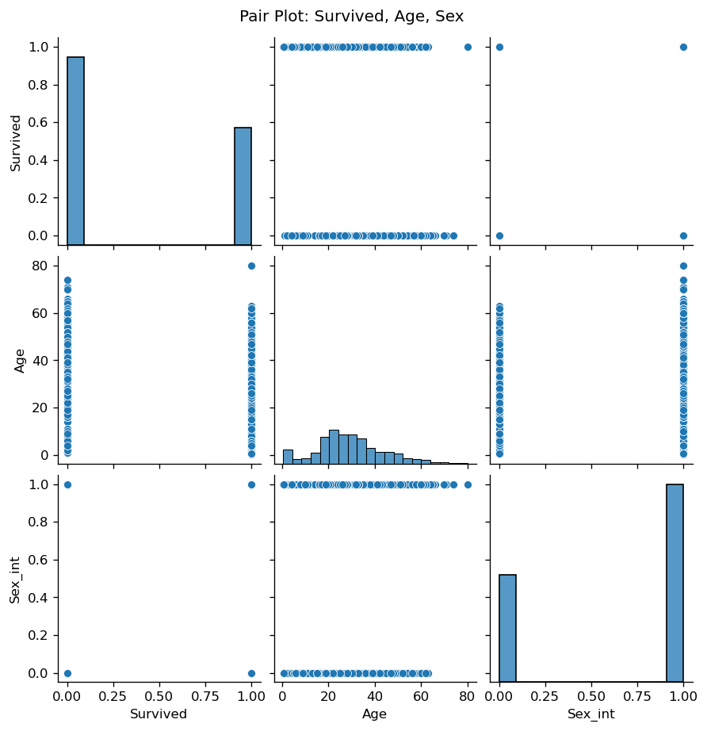
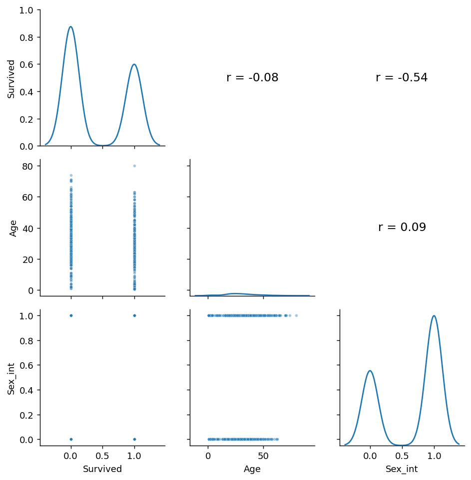
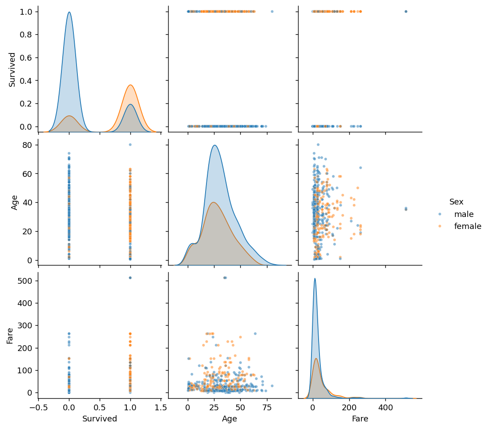
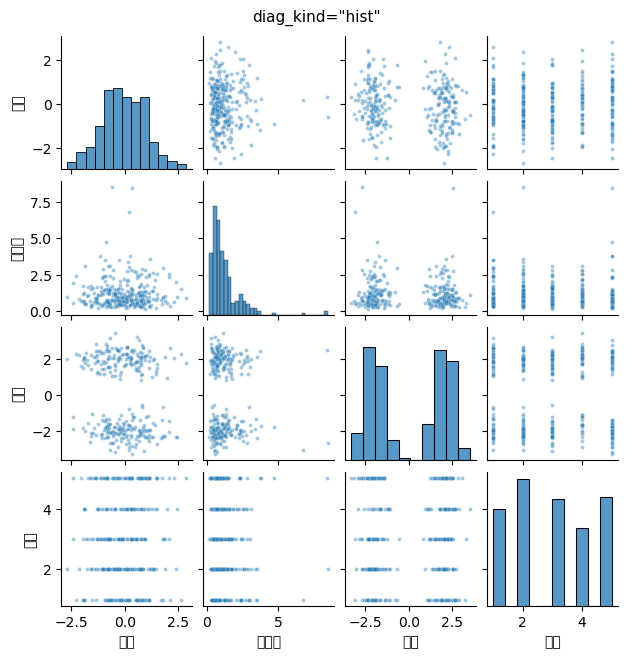
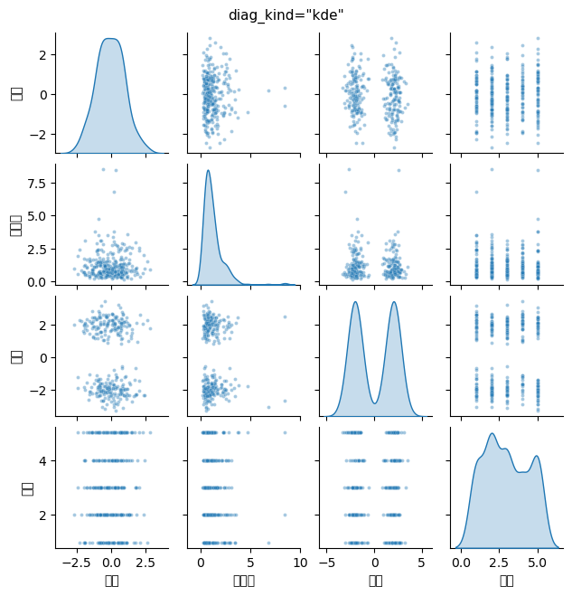
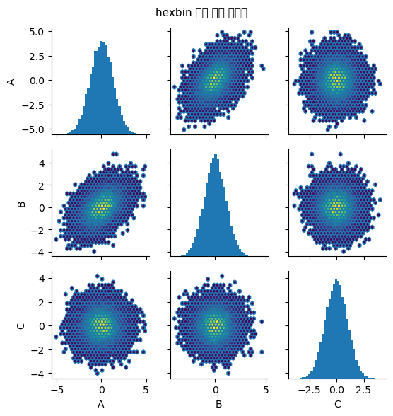

# 쌍그림

변수가 둘이면 산점도 하나로 끝난다. 변수가 다섯이면 어떻게 하는가?

가능한 쌍이 $\binom{5}{2} = 10$개다. 열 장의 산점도를 따로 그려 하나씩 넘겨 보는 것과, **한 화면에 격자로 늘어놓고 한눈에 훑는 것**은 전혀 다른 경험이다. 후자가 **쌍그림(pair plot)**, 또는 **산점도 행렬**이다.

## 1. 타이타닉 자료로 그려 본다

<div class="codebox" markdown>

**예제 1.** 타이타닉 자료의 쌍그림

```python
import seaborn as sns
import pandas as pd

url = "https://raw.githubusercontent.com/datasciencedojo/datasets/master/titanic.csv"
df = pd.read_csv(url, index_col='PassengerId')

# 쌍그림은 수치형 변수만 받으므로 성별을 0/1로 부호화한다
df['Sex_int'] = df['Sex'].apply(lambda x: 1 if x == 'male' else 0)

# 변수 k개를 주면 k x k 격자가 만들어진다.
#   대각선   그 변수 하나의 분포 (히스토그램)
#   비대각선 두 변수의 산점도
# 결측이 있는 행(Age가 비어 있는 177명)은 자동으로 빠진다.
sns.pairplot(df[["Survived", "Age", "Sex_int"]])
```

</div>



세 변수의 격자에서 읽을 것이 몇 가지 있다.

- **Survived와 Sex_int의 산점도**는 네 귀퉁이에 점이 몰린 모양이다. 두 변수가 모두 0/1이기 때문인데, 왼쪽 위(여성·생존)와 오른쪽 아래(남성·사망)가 짙다. 성별과 생존이 강하게 얽혀 있다는 신호다.
- **Age의 히스토그램**(가운데 대각선)은 20–30대에 봉우리가 있고 오른쪽으로 약간 치우쳐 있다.
- **Age와 Survived**는 뚜렷한 관계가 보이지 않는다. 다만 이런 산점도는 한쪽이 0/1일 때 겹침이 심해 읽기 어려우므로, 앞 절의 바이올린 그림이나 상자그림이 더 낫다.

## 2. 격자의 구조

$k$개 변수를 주면 $k \times k$ 격자가 만들어진다.

- **대각선**: 그 변수 하나의 분포. 기본은 히스토그램이고 `diag_kind='kde'`로 밀도곡선으로 바꿀 수 있다.
- **비대각선 $(i, j)$**: 변수 $j$를 가로축, 변수 $i$를 세로축으로 한 산점도.
- **위쪽 삼각형과 아래쪽 삼각형은 같은 정보**다. 축만 뒤바뀌어 있다.

중복이 있다는 것은 곧 **한쪽을 다른 용도로 쓸 수 있다**는 뜻이다. seaborn의 `PairGrid`를 쓰면 아래는 산점도, 위는 상관계수 숫자, 대각선은 밀도곡선으로 채우는 식의 구성이 가능하다.

<div class="codebox" markdown>

**예제 2.** 격자의 구조 들여다보기

```python
import seaborn as sns
import numpy as np
import matplotlib.pyplot as plt

g = sns.PairGrid(df[["Survived", "Age", "Sex_int"]].dropna())
g.map_lower(sns.scatterplot, s=10, alpha=.4)   # 아래쪽 삼각형: 산점도
g.map_diag(sns.kdeplot)                        # 대각선: 밀도곡선

# 위쪽 삼각형: 상관계수를 숫자로 적는다
def corr_text(x, y, **kwargs):
    ax = plt.gca()
    ax.annotate(f"r = {np.corrcoef(x, y)[0, 1]:.2f}",
                xy=(.5, .5), xycoords='axes fraction',
                ha='center', va='center', fontsize=13)
    ax.set_axis_off()

g.map_upper(corr_text)
```

</div>



## 3. 집단별로 색을 입힌다

`hue` 인자를 주면 범주형 변수에 따라 점의 색이 갈린다. 쌍그림의 가장 유용한 쓰임이다.

<div class="codebox" markdown>

**예제 3.** 집단별로 색 입히기

```python
# hue 에 범주형 열을 주면 집단마다 색이 갈린다. 변수 쌍마다 두 집단이
# 겹치는지 갈리는지를 한 장에서 훑을 수 있다.
# diag_kind="kde" 는 대각선의 히스토그램을 매끄러운 밀도곡선으로 바꾼다.
sns.pairplot(df[["Survived", "Age", "Fare", "Sex"]], hue="Sex",
             diag_kind="kde", plot_kws={"s": 12, "alpha": .5})
```

</div>



이렇게 하면 모든 산점도에서 두 집단이 색으로 나뉘고, 대각선에는 집단별 밀도곡선이 겹쳐 그려진다. **어느 변수 쌍에서 두 집단이 갈라지는지**가 한눈에 보인다. 분류 문제에서 어떤 변수가 유용할지 가늠하는 표준적인 첫 단계다.

!!! warning "쌍그림은 결론을 내는 도구가 아니라 훑어보는 도구다"
    쌍그림의 각 칸은 아주 작다. 축 눈금이 촘촘하고 점도 작아서, 하나하나를 정확히 읽기는 어렵다.

    **쌍그림의 역할은 "어느 쌍을 더 들여다볼지 고르는 것"** 이다. 흥미로워 보이는 칸을 발견하면, 그 두 변수만으로 **큰 산점도를 따로 그려** 제대로 본다. 그 단계에서 과밀 처리, 추세선, 이상치 확인 같은 일을 한다.

    쌍그림의 작은 칸에서 읽은 것을 그대로 보고하거나 논문에 싣는 것은 좋지 않다.

## 4. 변수가 몇 개까지 가능한가

칸의 수가 $k^2$로 늘어나므로 곧 한계에 부딪힌다.

| 변수 수 $k$ | 칸 수 | 실용성 |
|---:|---:|:---|
| 3 | 9 | 넉넉하다 |
| 5 | 25 | 편하게 읽을 수 있는 상한 |
| 8 | 64 | 각 칸이 작아 대략적인 형태만 보인다 |
| 15 | 225 | **읽을 수 없다** |

$k$가 커지면 다음 중 하나로 간다.

- **변수를 골라낸다.** 도메인 지식이나 상관 크기를 기준으로 흥미로운 것 대여섯 개만 남긴다.
- **상관 히트맵으로 먼저 훑는다.** $k \times k$ 상관계수를 색으로 나타낸 표는 $k$가 수십이어도 읽을 수 있다. 거기서 눈에 띄는 쌍을 골라 산점도를 그린다. 다만 히트맵은 **선형 상관만** 보므로, 곡선 관계는 놓친다.
- **차원 축소.** 주성분분석 등으로 차원을 줄인 뒤 그린다.

!!! danger "쌍그림과 다중비교"
    변수가 15개면 쌍이 105개다. 이 105개 산점도를 훑어보며 "관계가 있어 보이는" 것을 고르면, **우연히 그렇게 보이는 것을 고르게 된다.**

    $\alpha = 0.05$로 105번 검정하면 실제로 아무 관계가 없어도 평균 5개 남짓이 유의하게 나온다. 눈으로 고르는 것도 마찬가지다. 1장의 출판 편향 절에서 본 문제가 탐색적 그림에서도 그대로 일어난다.

    쌍그림에서 발견한 관계는 **가설**이지 결론이 아니다. 확인하려면 **다른 자료**가 필요하다. 같은 자료로 발견하고 같은 자료로 검정하면 안 된다.

## 연습문제

<div class="drillbox" markdown>

**연습문제 1.** <span class="diff med" title="중간"></span>
어떤 분석가가 변수 12개의 쌍그림을 그리고 "대부분의 쌍에서 뚜렷한 관계가 보이지 않는다"고 결론지었다. 이 결론의 문제를 지적하라.

</div>

??? success "풀이"
    **문제 1: 칸이 너무 작아 관계를 볼 수 없다.**

    변수 12개면 $12^2 = 144$개의 칸이 격자에 들어간다. 화면 하나에 그리면 각 칸이 몇 센티미터도 안 된다. 그 크기에서는 축 눈금이 읽히지 않고, 점이 뭉개지며, 약하거나 중간 정도의 관계는 잡음과 구별되지 않는다.

    **"뚜렷한 관계가 보이지 않는다"는 자료의 성질이 아니라 그림의 한계일 수 있다.**

    **문제 2: 과밀이 처리되지 않았을 가능성.**

    자료가 많다면 각 작은 칸이 검은 덩어리가 된다. 앞 절에서 본 대로 그러면 구조가 전혀 보이지 않는다. 작은 칸에서는 이 문제가 더 심하다.

    **문제 3: 비선형 관계와 부분집단.**

    작은 칸에서 눈에 띄는 것은 뚜렷한 선형 추세뿐이다. 곡선 관계, 두 덩어리로 갈라진 구조, 일부 구간에서만 나타나는 관계 등은 놓치기 쉽다.

    **문제 4: 결론의 방향이 위험하다.**

    쌍그림은 **찾는** 도구지 **없음을 확인하는** 도구가 아니다. 무언가를 발견하면 "여기를 더 보자"는 신호로 유용하지만, 아무것도 못 봤다고 "관계가 없다"고 말할 수는 없다.

    **어떻게 해야 하는가.**

    1. 변수를 대여섯 개로 줄여 여러 장의 쌍그림으로 나눈다.
    2. 또는 **상관 히트맵**으로 12×12를 먼저 훑고, 눈에 띄는 쌍만 큰 산점도로 확인한다.
    3. 히트맵은 선형 상관만 보므로, 비선형이 의심되면 거리 상관이나 상호정보량 같은 척도를 병행한다.
    4. 어느 경우든 **"관계 없음"은 그림이 아니라 적절한 검정과 검정력 계산으로** 말해야 한다.

<div class="drillbox" markdown>

**연습문제 2.** <span class="diff med" title="중간"></span>
쌍그림에서 `hue`로 집단을 나누어 색칠했더니, 어떤 변수 쌍에서 두 집단이 깔끔하게 갈라졌다. 이것을 근거로 "이 두 변수로 집단을 완벽하게 분류할 수 있다"고 말하는 것의 위험은 무엇인가?

</div>

??? success "풀이"
    **위험 1: 같은 자료로 발견하고 같은 자료로 평가했다.**

    쌍그림을 훑으며 "가장 잘 갈라지는 쌍"을 고른 것이므로, **고르는 과정 자체가 그 자료에 맞춘 것이다.** 변수가 8개면 쌍이 28개인데, 그중 가장 잘 갈라지는 하나는 우연만으로도 꽤 잘 갈라져 보인다. 이 분리가 새 자료에서도 유지된다는 보장이 없다.

    제대로 하려면 **자료를 나누어**, 한쪽에서 변수를 고르고 다른 쪽에서 성능을 재야 한다.

    **위험 2: "깔끔하게 갈라진다"의 눈대중은 과대평가되기 쉽다.**

    작은 칸에서 점들이 두 덩어리로 보여도, 경계 부근에서 겹치는 점들은 서로 가려 보이지 않을 수 있다. 특히 점이 많고 과밀하면 그렇다. 실제 오분류율을 재려면 분류기를 적합시키고 교차검증으로 평가해야 한다.

    **위험 3: 표본 크기가 작으면 우연한 분리가 흔하다.**

    각 집단이 10개씩이라면 2차원에서 두 집단이 갈라져 보이는 일은 우연히도 자주 일어난다. 차원이 높아질수록 심해진다(차원의 저주).

    **위험 4: 정보 누출.**

    갈라짐이 너무 깔끔하다면 그 변수가 **집단 정보를 이미 담고 있는 것**은 아닌지 의심해야 한다. 예컨대 "질병 진단" 집단을 나누는데 "처방된 약의 용량"이 변수에 있다면, 그것으로 완벽히 갈라지는 것은 당연하고 아무 쓸모도 없다.

    **결론.** 쌍그림에서 본 분리는 **"이 쌍을 제대로 조사해 보자"** 는 가설이다. 그 뒤에는 별도의 검증 자료, 교차검증, 그리고 변수의 의미에 대한 검토가 따라야 한다.

<div class="drillbox" markdown>

**연습문제 3.** <span class="diff med" title="중간"></span>
본문 $4$절의 경고 상자를 정량화하라. 변수가 $k$개일 때 **우연히 관계가 있어 보이는** 쌍이 몇 개나 나오는가?

</div>

??? success "풀이"
    ```python
    import numpy as np

    print(f"{'변수 k':>7}{'쌍 수':>8}{'기대 거짓양성':>15}{'하나 이상 유의할 확률':>22}")
    for k in (5, 8, 12, 15, 20):
        pairs = k * (k - 1) // 2
        print(f"{k:>7}{pairs:>8}{pairs * 0.05:>15.1f}{1 - 0.95 ** pairs:>22.4f}")

    rng = np.random.default_rng(0)
    print("\n서로 완전히 무관한 변수들에서 관측되는 최대 |상관|")
    for k, n in [(12, 50), (12, 200), (20, 50)]:
        mx = []
        for _ in range(3000):
            X = rng.normal(0, 1, (n, k))
            C = np.corrcoef(X.T)
            mx.append(np.max(np.abs(C[np.triu_indices(k, 1)])))
        mx = np.array(mx)
        print(f"  k={k:>3}, n={n:>4}: 평균 {mx.mean():.4f}   95% 분위수 {np.quantile(mx, 0.95):.4f}")
    ```

    출력:

    ```
    변수 k     쌍 수        기대 거짓양성          하나 이상 유의할 확률
          5      10            0.5                0.4013
          8      28            1.4                0.7622
         12      66            3.3                0.9661
         15     105            5.2                0.9954
         20     190            9.5                0.9999

    서로 완전히 무관한 변수들에서 관측되는 최대 |상관|
      k= 12, n=  50: 평균 0.3649   95% 분위수 0.4592
      k= 12, n= 200: 평균 0.1835   95% 분위수 0.2350
      k= 20, n=  50: 평균 0.4080   95% 분위수 0.4943
    ```

    **변수 $12$개면 쌍이 $66$개이고, 아무 관계가 없어도 평균 $3.3$개가 유의하게 나온다.** 적어도 하나가 유의할 확률은 $0.966$이다. 즉 **거의 확실히 무언가를 발견한다.**

    **더 직접적인 수치가 최대 상관이다.** $k = 12$, $n = 50$이면 완전히 무관한 변수들에서도 최대 $\lvert r \rvert$이 평균 $0.365$이고, $5\%$의 경우 $0.459$를 넘는다. **$0.46$짜리 상관은 산점도에서 뚜렷한 관계로 보인다.**

    | $k$ | $n$ | 최대 $\lvert r\rvert$ 평균 |
    |---|---|---|
    | $12$ | $50$ | $0.365$ |
    | $12$ | $200$ | $0.184$ |
    | $20$ | $50$ | $0.408$ |

    **$n$이 커지면 완화되지만 $k$가 커지면 악화된다.** 그리고 현대 자료는 대개 $k$가 크다.

    **그래서 어떻게 하는가.**

    - **쌍그림은 가설 생성 도구다.** 본문이 말한 대로 발견한 관계는 결론이 아니다.
    - **확인은 다른 자료로.** 자료를 미리 둘로 나누어 한쪽에서 탐색하고 다른 쪽에서 확인하는 것이 가장 단순한 방법이다(1장 가용 자료 문서 연습문제 7).
    - **보정된 임계값을 쓰라.** $k$개 변수의 상관을 검정한다면 $\alpha/\binom{k}{2}$ 수준을 쓰거나 FDR을 통제한다.
    - **효과크기를 보라.** $\lvert r \rvert = 0.2$짜리 관계는 유의하더라도 실용적 의미가 거의 없다(1장 예측 대 추론 문서 연습문제 10). $\square$

<div class="drillbox" markdown>

**연습문제 4.** <span class="diff med" title="중간"></span>
쌍그림의 **대각선**에 무엇을 그릴지가 선택이다. 히스토그램, KDE, 아무것도 안 그리기 중 무엇이 좋은가?

</div>

??? success "풀이"
    ```python
    import numpy as np
    import pandas as pd
    import matplotlib.pyplot as plt
    import seaborn as sns

    rng = np.random.default_rng(2)
    n = 300
    df = pd.DataFrame({
        "정규": rng.normal(0, 1, n),
        "치우침": rng.lognormal(0, 0.7, n),
        "이봉": np.concatenate([rng.normal(-2, 0.5, n // 2), rng.normal(2, 0.5, n // 2)]),
        "이산": rng.integers(1, 6, n).astype(float),
    })
    print(df.describe().round(3).to_string())

    for kind in ("hist", "kde"):
        g = sns.pairplot(df, diag_kind=kind, plot_kws=dict(s=8, alpha=0.4),
                         height=1.6)
        g.figure.suptitle(f'diag_kind="{kind}"', y=1.02, fontsize=11)
        plt.show()
    ```

    출력:

    ```
    정규      치우침       이봉      이산
    count  300.000  300.000  300.000  300.00
    mean    -0.054    1.224    0.008    2.95
    std      1.018    1.040    2.078    1.41
    min     -2.686    0.164   -3.303    1.00
    25%     -0.766    0.606   -2.004    2.00
    50%     -0.082    0.930    0.133    3.00
    75%      0.674    1.485    2.055    4.00
    max      2.846    8.495    3.497    5.00
    ```

    

    

    **대각선은 각 변수의 주변분포를 보여 준다.** 산점도만으로는 주변분포를 읽기 어려우므로(산점도 문서 연습문제 8) 이 칸이 실제로 중요하다.

    | 선택 | 장점 | 단점 |
    |---|---|---|
    | **히스토그램** | 이산성·뭉침이 보인다 | 구간 개수 선택 |
    | **KDE** | 매끄럽고 다봉성이 뚜렷 | 이산 자료에서 거짓 (바이올린 문서 연습문제 10) |
    | **비우기** | 칸을 아낀다 | 주변분포 정보를 잃는다 |
    | **집단별 KDE** | `hue` 와 함께 쓸 때 집단 분리가 보인다 | 집단이 많으면 지저분 |

    **위 자료에서 차이가 드러난다.** "이산" 변수는 값이 $1$–$5$의 정수뿐인데, KDE로 그리면 $0.5$나 $5.5$까지 뻗는 매끄러운 곡선이 나온다. 히스토그램은 다섯 개의 막대로 정직하게 보여 준다.

    **실무 권장.**

    - **자료형을 먼저 확인하라.** 이산 변수가 섞여 있으면 `diag_kind="hist"`.
    - **다봉성이 관심사면** KDE가 낫다.
    - **`hue` 를 쓸 때는** 집단별 KDE가 유용하다. 어느 변수가 집단을 잘 가르는지 대각선에서 바로 보인다.

    **대각선 위·아래를 다르게 쓰는 것도 흔하다.** 위쪽 삼각형에 상관계수를 숫자로 적고 아래쪽에 산점도를 그리면, 한 그림에서 수치와 형태를 모두 얻는다. `seaborn` 의 `PairGrid` 로 `map_upper` 와 `map_lower` 를 따로 지정하면 된다. $\square$

<div class="drillbox" markdown>

**연습문제 5.** <span class="diff med" title="중간"></span>
연습문제 2의 위험을 정량화하라. 집단이 깔끔하게 갈라져 보이는 것이 **우연**일 수 있는가?

</div>

??? success "풀이"
    ```python
    import numpy as np
    from sklearn.linear_model import LogisticRegression
    from sklearn.model_selection import cross_val_score

    rng = np.random.default_rng(3)

    print("집단 레이블이 특징과 아무 관계 없을 때, '가장 잘 가르는 변수 쌍'의 성능")
    print(f"{'k':>5}{'n':>6}{'훈련 정확도':>14}{'교차검증 정확도':>18}")
    for k, n in [(10, 40), (10, 200), (30, 40)]:
        best_tr = best_cv = 0.0
        for _ in range(200):
            X = rng.normal(0, 1, (n, k))
            y = rng.integers(0, 2, n)             # 무작위 레이블
            bt = bc = 0.0
            for i in range(k):
                for j in range(i + 1, k):
                    Z = X[:, [i, j]]
                    m = LogisticRegression().fit(Z, y)
                    bt = max(bt, m.score(Z, y))
            best_tr += bt / 200
            # 가장 좋은 쌍을 고른 뒤 교차검증하면?
            best_cv += cross_val_score(LogisticRegression(), X[:, :2], y, cv=5).mean() / 200
        print(f"{k:>5}{n:>6}{best_tr:>14.4f}{best_cv:>18.4f}")
    ```

    출력:

    ```
    집단 레이블이 특징과 아무 관계 없을 때, '가장 잘 가르는 변수 쌍'의 성능
        k     n        훈련 정확도          교차검증 정확도
       10    40        0.7140            0.5359
       10   200        0.5976            0.5190
       30    40        0.7706            0.5387
    ```

    **레이블이 완전히 무작위인데도 "가장 잘 가르는 쌍"의 훈련 정확도가 $0.7$을 넘는다.** $k$가 클수록, $n$이 작을수록 높아진다.

    **쌍이 $\binom{k}{2}$개이므로 그중 최댓값을 고르는 것이 곧 승자의 저주다**(집단 비교 문서 연습문제 9). 눈으로 쌍그림을 훑으며 "이 두 변수가 집단을 잘 가른다"고 판단하는 것이 정확히 이 절차다.

    **교차검증 정확도는 $0.5$ 근처에 머문다.** 미리 정한 변수 쌍을 표본 밖에서 평가하면 진실이 드러난다.

    **그래서 어떻게 확인하는가.**

    - **표본 밖 평가.** 발견한 변수 쌍으로 분류기를 만들어 **떼어 둔 자료**에서 평가한다. 1장 지도학습 문서 연습문제 8의 중첩 교차검증이 필요한 이유와 같다.
    - **변수 선택까지 교차검증 안에 넣어라.** "가장 좋은 쌍 고르기"가 학습 과정의 일부이므로, 그것까지 포함해 평가해야 한다.
    - **집단 크기를 확인하라.** 한 집단이 아주 작으면 몇 개의 점이 우연히 모여 있는 것을 "분리"로 읽기 쉽다.

    **그림이 특히 위험한 이유.** 분류기를 $45$개 만들어 최고를 고르면 다중비교를 인식하지만, **쌍그림 $45$칸을 눈으로 훑는 것은 같은 일인데 아무도 그것을 검정으로 세지 않는다.** $\square$

<div class="drillbox" markdown>

**연습문제 6.** <span class="diff med" title="중간"></span>
쌍그림에서 **표본 크기가 크면** 어떤 문제가 생기며 어떻게 다루는가?

</div>

??? success "풀이"
    ```python
    import numpy as np
    import pandas as pd
    import matplotlib.pyplot as plt
    import seaborn as sns

    rng = np.random.default_rng(5)
    n = 20_000
    z = rng.normal(0, 1, n)
    df = pd.DataFrame({"A": z + rng.normal(0, 0.8, n),
                       "B": 0.6 * z + rng.normal(0, 0.9, n),
                       "C": rng.normal(0, 1, n)})

    print(f"n = {n:,}, 변수 {df.shape[1]}개")
    print(f"상관행렬\n{df.corr().round(3).to_string()}")

    g = sns.PairGrid(df, height=1.9)
    g.map_diag(plt.hist, bins=40)
    g.map_offdiag(plt.hexbin, gridsize=28, cmap="viridis", mincnt=1)
    g.figure.suptitle("hexbin 으로 그린 쌍그림", y=1.02, fontsize=11)
    plt.show()
    ```

    출력:

    ```
    n = 20,000, 변수 3개
    상관행렬
           A      B      C
    A  1.000  0.433 -0.005
    B  0.433  1.000 -0.006
    C -0.005 -0.006  1.000
    ```

    

    **$n$이 수만이면 산점도 칸이 검은 덩어리가 된다.** 앞 절 hexbin 문서에서 본 과밀 문제가 $\binom{k}{2}$개의 칸에서 동시에 일어난다.

    **대응.**

    | 방법 | 특징 |
    |---|---|
    | **투명도** (`alpha=0.02`) | 가장 간단, 밀도가 명암으로 |
    | **hexbin** | 밀도를 정확히, 위 코드처럼 `PairGrid` 로 조합 |
    | **표본 추출** | 무작위로 $2000$개만 그린다. 가장 흔한 실무 해법 |
    | **KDE 등고선** | 매끄럽지만 칸마다 계산이 느리다 |

    **표본 추출이 의외로 좋은 선택이다.** 쌍그림의 목적은 **구조를 훑어보는 것**이지 정밀한 밀도 추정이 아니다. $2000$개면 관계의 형태를 파악하는 데 충분하고, 그리기도 빠르다. 다만 **이상치가 빠질 수 있으므로** 이상치 탐색이 목적이라면 전체를 써야 한다.

    **또 하나의 문제는 계산 시간이다.** $k = 8$이면 칸이 $64$개이고, 각 칸에 $n = 20000$개를 그리면 렌더링이 매우 느려진다. 벡터 형식(PDF, SVG)으로 저장하면 파일이 수십 MB가 되기도 한다. **래스터로 저장하거나 점 수를 줄여야 한다.**

    **$n$이 클 때의 역설.** 자료가 많으면 관계를 더 잘 볼 수 있어야 하는데, 그림에서는 오히려 안 보인다. 그래서 $n$이 클수록 **그림보다 수치**(상관행렬, 요약통계량)의 역할이 커지고, 그림은 수치가 놓치는 비선형성과 군집을 확인하는 보조가 된다. $\square$

<div class="drillbox" markdown>

**연습문제 7.** <span class="diff med" title="중간"></span>
쌍그림은 **선형 관계**를 잘 보여 준다. 그렇다면 무엇을 놓치는가?

</div>

??? success "풀이"
    ```python
    import numpy as np
    from scipy import stats

    rng = np.random.default_rng(7)
    n = 500
    x = rng.uniform(-3, 3, n)

    relations = {
        "선형":       2 * x + rng.normal(0, 1, n),
        "이차":       x ** 2 + rng.normal(0, 1, n),
        "주기":       3 * np.sin(2 * x) + rng.normal(0, 0.5, n),
        "이분산":     rng.normal(0, 0.3 + 0.8 * np.abs(x), n),
        "군집":       np.where(x > 0, 3, -3) + rng.normal(0, 0.5, n),
    }

    print(f"{'관계':>8}{'피어슨 r':>11}{'스피어만':>11}{'거리상관 근사':>15}")
    for name, y in relations.items():
        # 거리상관 대신 |x| 와 |y-중앙값| 의 상관으로 이분산 감지
        het = np.corrcoef(np.abs(x - x.mean()), np.abs(y - np.median(y)))[0, 1]
        print(f"{name:>8}{np.corrcoef(x, y)[0, 1]:>+11.4f}"
              f"{stats.spearmanr(x, y)[0]:>+11.4f}{het:>+15.4f}")
    ```

    출력:

    ```
    관계      피어슨 r       스피어만        거리상관 근사
          선형    +0.9639    +0.9667        +0.8606
          이차    +0.0193    +0.0443        +0.4353
          주기    -0.4004    -0.3866        +0.1099
         이분산    +0.0158    +0.0172        +0.4992
          군집    +0.8527    +0.7422        +0.0970
    ```

    **피어슨 상관이 $0$에 가까운데 관계가 뚜렷한 경우가 여럿이다.**

    | 관계 | 피어슨 $r$ | 눈으로 보이는가 |
    |---|---|---|
    | 이차 | $\approx 0$ | **보인다** (포물선) |
    | 주기 | $\approx 0$ | **보인다** (물결) |
    | 이분산 | $\approx 0$ | **보인다** (나비 모양) |

    **쌍그림의 강점이 바로 여기 있다.** 상관행렬이나 히트맵은 이 관계들을 모두 $0$으로 보고하지만, 산점도는 형태를 보여 준다. 본문 $4$절이 "히트맵은 선형 상관만 본다"고 지적한 이유다.

    **그러나 쌍그림도 놓치는 것이 있다.**

    - **세 변수 이상의 상호작용.** $z$가 클 때만 $x$와 $y$가 관계있다면, $x$–$y$ 칸에서는 그 관계가 희석되어 보인다. `hue` 로 세 번째 변수를 색칠하는 것이 부분적 해법이다.
    - **조건부 관계.** 산점도는 **주변** 관계를 보여 준다. 다른 변수를 통제한 **부분 관계**는 다르다(1장의 심슨의 역설, 산점도 문서 연습문제 10). 편상관 행렬이 이를 보완한다.
    - **고차원 구조.** 자료가 $5$차원 공간의 곡면 위에 있어도 2차원 투영에서는 보이지 않을 수 있다.

    **보완 도구.**

    | 놓치는 것 | 도구 |
    |---|---|
    | 비선형 관계의 강도 | 거리상관, 최대정보계수(MIC), 상호정보량 |
    | 조건부 관계 | 편상관, 조건부 독립 검정 |
    | 고차원 구조 | PCA, t-SNE, UMAP |
    | 세 변수 상호작용 | `hue` 색칠, 면 나누기, 3차원 회전 그림 |

    **그럼에도 쌍그림을 먼저 그리는 이유.** 어떤 요약통계량도 "포물선"이나 "나비 모양"을 한 수로 전달하지 못한다. **먼저 보고 그다음에 재는 것**이 순서다. $\square$

<div class="drillbox" markdown>

**연습문제 8.** <span class="diff med" title="중간"></span>
쌍그림의 변수 **순서**와 **척도**가 읽기에 미치는 영향을 논하라.

</div>

??? success "풀이"
    ```python
    import numpy as np
    import pandas as pd

    rng = np.random.default_rng(9)
    n = 400
    df = pd.DataFrame({
        "소득": rng.lognormal(10, 0.8, n),          # 수만~수십만
        "나이": rng.uniform(20, 70, n),             # 20~70
        "만족도": rng.integers(1, 6, n).astype(float),  # 1~5
        "거리": rng.exponential(5, n),              # 0~수십
    })
    print(df.describe().loc[["mean", "std", "min", "max"]].round(2).to_string())

    print("\n각 변수의 범위 폭")
    for c in df.columns:
        print(f"  {c}: {df[c].max() - df[c].min():>12,.1f}")
    print("\n→ 축 범위가 수십만 대 4 로 갈리므로 각 칸이 독립적으로 축을 잡는다")
    print("   즉 칸끼리 축이 공유되지 않아 크기 비교가 불가능하다")
    ```

    출력:

    ```
    소득     나이   만족도     거리
    mean   30271.30  44.16  3.02   5.38
    std    25563.39  13.88  1.41   5.57
    min     2094.04  20.17  1.00   0.01
    max   170773.60  69.55  5.00  34.15

    각 변수의 범위 폭
      소득:    168,679.6
      나이:         49.4
      만족도:          4.0
      거리:         34.1

    → 축 범위가 수십만 대 4 로 갈리므로 각 칸이 독립적으로 축을 잡는다
       즉 칸끼리 축이 공유되지 않아 크기 비교가 불가능하다
    ```

    **쌍그림의 각 칸은 자기 축을 갖는다.** 위 자료처럼 변수의 척도가 크게 다르면 그것이 오히려 다행이다. 공통 축을 쓰면 소득이 다른 변수들을 압도해 아무것도 보이지 않는다.

    **그러나 그 대가가 있다.** 칸마다 축이 다르므로 **점의 위치를 칸 사이에서 비교할 수 없다.** 어떤 칸에서 "오른쪽 위"인 점이 다른 칸에서도 그러리라는 보장이 없다.

    **변수 순서의 영향.**

    - **관련 있는 변수를 인접하게 배치하라.** 대각선 근처 칸이 가장 눈에 잘 들어온다.
    - **상관 크기로 정렬하거나 군집화하라.** 상관 히트맵에서 계층적 군집으로 변수를 재배열하는 관행이 있는데(`seaborn.clustermap`), 쌍그림에도 같은 발상을 쓸 수 있다.
    - **의미 있는 그룹으로 묶어라.** 인구학적 변수, 행동 변수, 결과 변수 순으로.

    **척도에 대한 추가 고려.**

    - **치우친 변수는 로그 변환 후 그려라.** 소득처럼 여러 자릿수에 걸친 변수는 원 척도에서 모든 칸이 왼쪽 아래에 뭉친다(산점도 문서 연습문제 6).
    - **이산 변수는 지터를 주어라.** "만족도"처럼 값이 다섯 개뿐이면 격자 위의 점이 되어 밀도가 보이지 않는다.
    - **표준화는 대개 불필요하다.** 칸마다 축이 독립이므로 표준화해도 그림이 거의 같다. 다만 `hue` 로 색칠하고 판별 경계를 그릴 때는 영향이 있다.

    **정리.** 쌍그림은 **자동으로 잘 되는 그림이 아니다.** 변수 순서, 척도 변환, 대각선 선택, 과밀 처리를 모두 정해야 하며, 기본값을 그대로 쓰면 대개 읽기 어려운 그림이 나온다. $\square$

<div class="drillbox" markdown>

**연습문제 9.** <span class="diff med" title="중간"></span>
쌍그림에 **범주형 변수**가 섞여 있으면 어떻게 하는가?

</div>

??? success "풀이"
    ```python
    import numpy as np
    import pandas as pd

    rng = np.random.default_rng(4)
    n = 300
    grade = rng.choice(["A", "B", "C"], n, p=[0.3, 0.5, 0.2])
    df = pd.DataFrame({
        "점수": np.array([rng.normal({"A": 85, "B": 72, "C": 60}[g], 6) for g in grade]),
        "출석": np.clip(rng.normal(0.85, 0.12, n), 0, 1),
        "등급": grade,
    })

    print(df.groupby("등급")[["점수", "출석"]].agg(["mean", "std", "count"]).round(3).to_string())
    print(f"\n수치형 변수 {df.select_dtypes('number').shape[1]}개, "
          f"범주형 {df.select_dtypes('object').shape[1]}개")
    ```

    출력:

    ```
    점수                  출석             
          mean    std count   mean    std count
    등급                                         
    A   84.806  5.787    71  0.836  0.098    71
    B   70.705  6.252   152  0.836  0.117   152
    C   60.906  5.567    77  0.847  0.111    77

    수치형 변수 2개, 범주형 1개
    ```

    **`seaborn.pairplot` 은 수치형 변수만 칸에 배치한다.** 범주형 변수는 자동으로 제외되므로, 그대로 넘기면 조용히 빠진다.

    **범주형을 다루는 세 가지 방법.**

    | 방법 | 어떻게 | 언제 |
    |---|---|---|
    | **`hue` 로 색칠** | 범주를 점의 색으로 | 범주가 $2$–$5$개일 때 |
    | **면 나누기** | 범주별로 쌍그림을 따로 | 범주별 구조 비교가 목적 |
    | **수치로 부호화 후 포함** | 순서형을 정수로 | 순서형일 때만, 지터 필요 |

    **`hue` 가 기본 선택이다.** 색으로 나누면 각 칸에서 집단별 관계를 동시에 볼 수 있고, 대각선의 집단별 KDE가 어느 변수가 집단을 잘 가르는지 보여 준다(연습문제 4).

    **한계도 분명하다.**

    - **범주가 많으면 색이 구별되지 않는다.** $5$–$6$개가 상한이다.
    - **집단 크기가 크게 다르면** 큰 집단이 작은 집단을 덮는다. 그리는 순서(`hue_order`)와 투명도로 조절해야 한다.
    - **색맹 접근성.** 질적 색지도 중 색각 이상에 안전한 것을 쓰라(`tab10` 보다 `colorblind` 팔레트).

    **순서형을 정수로 넣는 것은 조심스럽다.** 2장 자료형 문서 연습문제 7에서 본 대로 등간격을 가정하는 것이며, 산점도에서는 격자 위의 점이 되어 지터가 필요하다(연습문제 8).

    **범주형끼리의 관계는 쌍그림이 다루지 못한다.** 그것은 앞 절 모자이크 그림의 영역이다. 자료에 범주형이 여럿이면 **수치형은 쌍그림, 범주형은 모자이크나 히트맵**으로 나누어 보는 것이 자연스럽다. $\square$

<div class="drillbox" markdown>

**연습문제 10.** <span class="diff med" title="중간"></span>
쌍그림을 **탐색적 자료분석의 첫 단계**로 쓸 때의 절차를 정리하라.

</div>

??? success "풀이"
    **쌍그림을 그리기 전에.**

    1. **자료형을 확인한다.** `df.dtypes` 로 수치형과 범주형을 나눈다(2장 자료형 문서 연습문제 10).
    2. **결측을 확인한다.** `seaborn` 은 결측이 있는 행을 조용히 버리므로, 칸마다 다른 $n$이 쓰일 수 있다.
    3. **변수를 고른다.** $5$–$6$개가 상한이다(본문 $4$절). 더 많으면 상관 히트맵으로 먼저 훑는다.
    4. **치우친 변수는 변환한다**(연습문제 8).
    5. **$n$이 크면 표본을 뽑거나 hexbin으로 바꾼다**(연습문제 6).

    **그리고 나서 무엇을 보는가.**

    | 볼 것 | 의미 |
    |---|---|
    | 대각선의 모양 | 치우침, 다봉성, 이산성 |
    | 뚜렷한 비선형 형태 | 상관계수가 놓치는 관계 (연습문제 7) |
    | 외딴 점 | 다변량 이상치 (이상치 문서 연습문제 8) |
    | 덩어리·띠 | 숨은 집단변수 (산점도 문서 연습문제 10) |
    | 격자·직선 무늬 | 이산성, 반올림, 결정론적 관계 |
    | 빈 영역 | 물리적 제약, 검열, 자료 생성 규칙 |

    **마지막 줄이 자주 간과된다.** 산점도에서 **점이 없는 영역**은 점이 있는 영역만큼 정보를 담는다. 삼각형 모양의 빈 곳은 대개 $x \le y$ 같은 제약이 있다는 뜻이고, 그것은 두 변수가 독립이 아님을 알려 준다.

    **그리고 반드시 기억할 것.**

    - **쌍그림에서 발견한 것은 가설이다**(연습문제 3, 5). 같은 자료로 확인하면 안 된다.
    - **보이지 않는다고 없는 것이 아니다.** 조건부 관계와 고차원 구조는 2차원 투영에 나타나지 않는다(연습문제 7).
    - **기본값을 그대로 쓰지 마라.** 변수 순서, 척도, 대각선, 과밀 처리를 의식적으로 정해야 한다(연습문제 8).

    **이 장 전체를 관통하는 원칙과 같다.** 그림은 **자료를 보게 해 주는 도구**이지 결론을 만들어 주는 장치가 아니다. 쌍그림은 그 첫걸음으로 가장 유용하지만, 첫걸음일 뿐이다. $\square$


## 정리하며

쌍그림은 여러 변수를 **한눈에 훑는** 도구다.

- $k \times k$ 격자에서 대각선은 각 변수의 분포, 비대각선은 변수 쌍의 산점도다.
- `hue`로 집단을 색칠하면 어느 변수 쌍이 집단을 가르는지 보인다.
- 실용적 상한은 **변수 대여섯 개**다. 그 이상이면 상관 히트맵으로 먼저 좁힌다.

가장 중요한 것은 쌍그림의 **역할**이다. 결론을 내는 곳이 아니라 **어디를 볼지 고르는 곳**이다. 고른 뒤에는 그 쌍만으로 큰 그림을 따로 그리고, 발견한 관계는 다른 자료로 확인해야 한다.

다음 절부터는 **순서가 있는 자료** — 주로 시간에 따라 관측된 자료 — 로 넘어간다. 첫 도구는 **선그림**이다.
