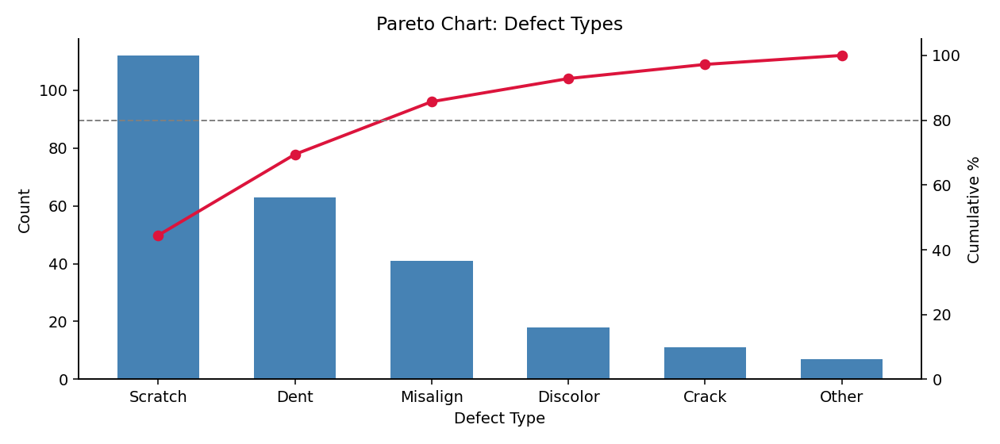

# 파레토 그림

**파레토 그림**은 정렬한 막대그림에 누적 비율 선을 겹쳐 놓은 것이다. 앞 절에서 원그래프가 하려다 실패한 일 — 몫의 순위를 정확히 보여 주는 일 — 을 제대로 해내면서, 한 가지를 더 답한다.

**어디까지 손대면 문제의 대부분이 해결되는가?**

품질관리에서 나온 도구이지만 쓰임은 훨씬 넓다. 고장 원인, 고객 불만 유형, 매출 기여 상품, 오류 로그 분류처럼 **"많은 원인 중 소수가 결과의 대부분을 만드는"** 상황이면 어디든 맞는다.

## 1. 그리는 법

두 가지를 겹친다. 값이 큰 순으로 정렬한 막대와, 왼쪽부터 누적한 비율을 나타내는 선이다.

```python
import matplotlib.pyplot as plt
import pandas as pd

# 어떤 공정에서 한 달간 기록된 불량 유형별 건수
defects = pd.Series({'Scratch': 112, 'Dent': 63, 'Misalign': 41,
                     'Discolor': 18, 'Crack': 11, 'Other': 7})

# 1단계: 큰 순으로 정렬한다. 파레토 그림에서 정렬은 선택이 아니라 필수다.
#         정렬하지 않으면 누적선이 계단처럼 들쭉날쭉해져 읽을 수 없다.
defects = defects.sort_values(ascending=False)

# 2단계: 누적 비율을 계산한다. cumsum()이 왼쪽부터 차례로 더해 준다.
cum = defects.cumsum() / defects.sum() * 100

fig, ax = plt.subplots(figsize=(9, 4))

# 왼쪽 축: 건수 막대
ax.bar(defects.index, defects.values, color='steelblue', width=0.6)
ax.set_ylabel("Count")
ax.set_xlabel("Defect Type")

# 오른쪽 축: 누적 비율 선. twinx()가 같은 x축을 공유하는 두 번째 y축을 만든다.
ax2 = ax.twinx()
ax2.plot(defects.index, cum.values, 'o-', color='crimson', lw=2)
ax2.axhline(80, color='gray', ls='--', lw=1)   # 80% 기준선
ax2.set_ylabel("Cumulative %")
ax2.set_ylim(0, 105)

ax.set_title("Pareto Chart: Defect Types")
ax.spines['top'].set_visible(False)
ax2.spines['top'].set_visible(False)
plt.tight_layout()
plt.show()

print(cum.round(1))
```

출력:

```
Scratch      44.4
Dent         69.4
Misalign     85.7
Discolor     92.9
Crack        97.2
Other       100.0
dtype: float64
```



## 2. 읽는 법

누적선이 **80% 기준선을 넘는 지점**을 찾는다. 그 왼쪽에 있는 범주들이 문제의 대부분을 만드는 것들이다.

이 자료에서는 세 번째 막대(Misalign)에서 누적이 85.7%가 되어 기준선을 넘는다. 즉

- **불량 유형 여섯 가지 중 세 가지가 전체 불량의 86%를 만든다.**
- 나머지 세 유형(Discolor, Crack, Other)은 다 합쳐도 14%다.

개선 자원이 한정되어 있다면 Scratch·Dent·Misalign에 집중하는 것이 합리적이다. Crack을 완전히 없애도 전체 불량은 4%밖에 줄지 않는다.

!!! note "80/20 법칙, 그리고 그것을 믿지 말아야 하는 이유"
    "원인의 20%가 결과의 80%를 만든다"는 **파레토 법칙**은 19세기 이탈리아 경제학자 빌프레도 파레토가 토지 소유 분포에서 관찰한 것에서 유래했다.

    그러나 80과 20이라는 수에 마법은 없다. 자료마다 다르다. 위 예제에서는 여섯 중 셋(50%)이 86%를 만들었으니 "50/86"인 셈이다. 어떤 자료는 "10/90"이고 어떤 자료는 아예 고르게 퍼져 있다.

    **파레토 그림의 값어치는 80/20이 맞는지 확인해 주는 데 있는 것이 아니라, 실제 비율이 얼마인지 보여 주는 데 있다.** 누적선이 완만하게 오르면 "집중할 소수가 없다"는 뜻이고, 그것도 유용한 정보다. 어중간하게 여러 곳에 자원을 나누기 전에 알아야 할 사실이다.

## 3. 언제 쓰고 언제 피하는가

**맞는 경우**

- 범주가 대여섯 개 이상이고, 크기가 크게 차이 난다.
- "무엇부터 손댈까"라는 **의사결정**이 걸려 있다.
- 범주에 자연스러운 순서가 없다(정렬해도 정보가 사라지지 않는다).

**피해야 할 경우**

- **범주에 순서가 있을 때.** 월별·연령대별 자료를 크기 순으로 정렬하면 추세가 사라진다. 이때는 정렬하지 않은 막대그림이나 선그림을 쓴다.
- **범주가 서너 개뿐일 때.** 누적선을 더할 이유가 없다. 정렬한 막대그림으로 충분하다.
- **크기가 고를 때.** 누적선이 거의 직선이 되어 아무것도 알려 주지 않는다. 이 경우에도 "집중할 소수가 없다"는 결론 자체는 의미가 있으므로, 한 번 그려 보고 판단하는 것은 괜찮다.

두 축을 쓰는 그림이라는 점도 유념할 만하다. **왼쪽 축(건수)과 오른쪽 축(누적 %)의 눈금이 다르므로**, 막대의 높이와 선의 높이를 직접 견주어서는 안 된다. 두 축 그림은 일반적으로 오해를 부르기 쉬운데, 파레토 그림은 두 축의 관계가 고정되어 있어(선은 언제나 막대의 누적) 예외적으로 안전한 경우다.

## 연습문제

**연습문제 1.**
어떤 고객센터가 한 달간 접수한 문의를 유형별로 집계했다. 결제 오류 340건, 배송 지연 210건, 상품 불량 95건, 회원가입 문제 60건, 환불 요청 45건, 기타 30건이다.

**(a)** 누적 비율을 계산하라.
**(b)** 80% 기준을 넘는 데 필요한 유형은 몇 가지인가?
**(c)** 인력을 두 유형에만 배치할 수 있다면 어디를 고르겠는가? 그 선택이 전체 문의의 몇 %를 덮는가?

??? success "풀이"
    (a) 총합은 $340 + 210 + 95 + 60 + 45 + 30 = 780$건이다. 큰 순으로 누적하면

    | 유형 | 건수 | 비율 | 누적 비율 |
    |:---|---:|---:|---:|
    | 결제 오류 | 340 | 43.6% | 43.6% |
    | 배송 지연 | 210 | 26.9% | 70.5% |
    | 상품 불량 | 95 | 12.2% | 82.7% |
    | 회원가입 문제 | 60 | 7.7% | 90.4% |
    | 환불 요청 | 45 | 5.8% | 96.2% |
    | 기타 | 30 | 3.8% | 100.0% |

    (b) **세 가지**다. 두 가지로는 70.5%에 그치고, 상품 불량까지 포함해야 82.7%로 80%를 넘는다.

    (c) **결제 오류와 배송 지연**을 고른다. 둘이 전체 문의의 **70.5%** 를 덮는다.

    여섯 유형 중 두 가지, 즉 33%의 유형이 70%의 문의를 만든다. 80/20에 정확히 맞지는 않지만 소수 집중의 양상은 뚜렷하다. 남은 자원이 있다면 상품 불량을 추가해 82.7%까지 올릴 수 있다.

---

**연습문제 2.**
어떤 분석가가 월별 매출 자료(1월부터 12월까지)를 파레토 그림으로 그렸다. 이 선택의 문제를 지적하고 대안을 제시하라.

??? success "풀이"
    **문제: 월에는 자연스러운 순서가 있는데 파레토 그림이 그것을 파괴한다.**

    파레토 그림은 값이 큰 순으로 정렬하므로, 예컨대 12월·7월·3월·... 순으로 막대가 늘어선다. 그 결과 다음을 모두 잃는다.

    - **계절성**. 여름과 연말에 매출이 오르는 양상이 사라진다.
    - **추세**. 연중 매출이 오르는지 내리는지 알 수 없다.
    - **인접 월의 비교**. 6월과 7월이 그림에서 멀리 떨어져 있으면 그 사이의 변화를 볼 수 없다.

    게다가 파레토 그림이 답하려는 물음("어디에 집중할까")이 이 자료에는 어울리지 않는다. 12월 매출이 높다고 12월에만 자원을 쓸 수는 없다. 월은 선택할 수 있는 대상이 아니다.

    **대안.**

    - **선그림**(1월~12월 순서 유지)이 기본이다. 계절성과 추세가 곧바로 보인다.
    - 전년과 비교하려면 두 해의 선을 겹쳐 그린다.
    - 월별 크기 자체를 강조하려면 **정렬하지 않은 막대그림**을 쓴다.

    **파레토 그림이 맞는 경우와 대비된다.** 불량 유형이나 문의 유형은 순서가 없고, 하나를 골라 집중할 수 있는 대상이다. 월은 둘 다 아니다.

## 정리하며

파레토 그림은 두 가지를 한 그림에 담는다.

- **정렬한 막대**: 어느 범주가 큰가
- **누적선**: 몇 개까지 손대면 얼마가 덮이는가

두 번째가 파레토 그림 고유의 기여다. 막대만으로는 "세 번째까지 하면 86%"라는 것을 눈으로 계산해야 한다.

다만 80/20이라는 수 자체는 기대가 아니라 **확인해야 할 대상**이다. 누적선이 완만하면 집중할 소수가 없다는 뜻이고, 그 사실을 아는 것이 잘못된 집중보다 낫다.

다음 절의 **모자이크 그림**은 범주형 변수가 **둘**일 때로 넘어간다. 지금까지는 한 변수의 도수를 그렸지만, 두 변수가 서로 어떻게 얽혀 있는지 보려면 다른 도구가 필요하다.
