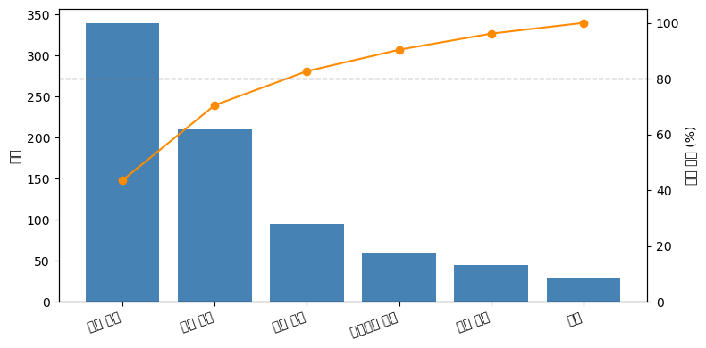

# 파레토 그림

**파레토 그림**은 정렬한 막대그림에 누적 비율 선을 겹쳐 놓은 것이다. 앞 절에서 원그래프가 하려다 실패한 일 — 몫의 순위를 정확히 보여 주는 일 — 을 제대로 해내면서, 한 가지를 더 답한다.

**어디까지 손대면 문제의 대부분이 해결되는가?**

품질관리에서 나온 도구이지만 쓰임은 훨씬 넓다. 고장 원인, 고객 불만 유형, 매출 기여 상품, 오류 로그 분류처럼 **"많은 원인 중 소수가 결과의 대부분을 만드는"** 상황이면 어디든 맞는다.

## 1. 그리는 법

두 가지를 겹친다. 값이 큰 순으로 정렬한 막대와, 왼쪽부터 누적한 비율을 나타내는 선이다.

<div class="codebox" markdown>

### 예제 1. 파레토 그림 그리기 { .eg }

```python
import matplotlib.pyplot as plt
import pandas as pd

# 어떤 공정에서 한 달간 기록된 불량 유형별 건수
defects = pd.Series({'Scratch': 112, 'Dent': 63, 'Misalign': 41,
                     'Discolor': 18, 'Crack': 11, 'Other': 7})

# 1단계: 큰 순으로 정렬한다. 파레토 그림에서 정렬은 선택이 아니라 필수다.
#         정렬하지 않으면 누적선이 계단처럼 들쭉날쭉해져 읽을 수 없다.
defects = defects.sort_values(ascending=False)

# 2단계: 누적 비율을 계산한다. cumsum()이 왼쪽부터 차례로 더해 준다.
cum = defects.cumsum() / defects.sum() * 100

fig, ax = plt.subplots(figsize=(9, 4))

# 왼쪽 축: 건수 막대
ax.bar(defects.index, defects.values, color='steelblue', width=0.6)
ax.set_ylabel("Count")
ax.set_xlabel("Defect Type")

# 오른쪽 축: 누적 비율 선. twinx()가 같은 x축을 공유하는 두 번째 y축을 만든다.
ax2 = ax.twinx()
ax2.plot(defects.index, cum.values, 'o-', color='crimson', lw=2)
ax2.axhline(80, color='gray', ls='--', lw=1)   # 80% 기준선
ax2.set_ylabel("Cumulative %")
ax2.set_ylim(0, 105)

ax.set_title("Pareto Chart: Defect Types")
ax.spines['top'].set_visible(False)
ax2.spines['top'].set_visible(False)
plt.tight_layout()
plt.show()

print(cum.round(1))
```

출력:

```
Scratch      44.4
Dent         69.4
Misalign     85.7
Discolor     92.9
Crack        97.2
Other       100.0
dtype: float64
```


</div>

## 2. 읽는 법

누적선이 **80% 기준선을 넘는 지점**을 찾는다. 그 왼쪽에 있는 범주들이 문제의 대부분을 만드는 것들이다.

이 자료에서는 세 번째 막대(Misalign)에서 누적이 85.7%가 되어 기준선을 넘는다. 즉

- **불량 유형 여섯 가지 중 세 가지가 전체 불량의 86%를 만든다.**
- 나머지 세 유형(Discolor, Crack, Other)은 다 합쳐도 14%다.

개선 자원이 한정되어 있다면 Scratch·Dent·Misalign에 집중하는 것이 합리적이다. Crack을 완전히 없애도 전체 불량은 4%밖에 줄지 않는다.

!!! note "80/20 법칙, 그리고 그것을 믿지 말아야 하는 이유"
    "원인의 20%가 결과의 80%를 만든다"는 **파레토 법칙**은 19세기 이탈리아 경제학자 빌프레도 파레토가 토지 소유 분포에서 관찰한 것에서 유래했다.

    그러나 80과 20이라는 수에 마법은 없다. 자료마다 다르다. 위 예제에서는 여섯 중 셋(50%)이 86%를 만들었으니 "50/86"인 셈이다. 어떤 자료는 "10/90"이고 어떤 자료는 아예 고르게 퍼져 있다.

    **파레토 그림의 값어치는 80/20이 맞는지 확인해 주는 데 있는 것이 아니라, 실제 비율이 얼마인지 보여 주는 데 있다.** 누적선이 완만하게 오르면 "집중할 소수가 없다"는 뜻이고, 그것도 유용한 정보다. 어중간하게 여러 곳에 자원을 나누기 전에 알아야 할 사실이다.

## 3. 언제 쓰고 언제 피하는가

**맞는 경우**

- 범주가 대여섯 개 이상이고, 크기가 크게 차이 난다.
- "무엇부터 손댈까"라는 **의사결정**이 걸려 있다.
- 범주에 자연스러운 순서가 없다(정렬해도 정보가 사라지지 않는다).

**피해야 할 경우**

- **범주에 순서가 있을 때.** 월별·연령대별 자료를 크기 순으로 정렬하면 추세가 사라진다. 이때는 정렬하지 않은 막대그림이나 선그림을 쓴다.
- **범주가 서너 개뿐일 때.** 누적선을 더할 이유가 없다. 정렬한 막대그림으로 충분하다.
- **크기가 고를 때.** 누적선이 거의 직선이 되어 아무것도 알려 주지 않는다. 이 경우에도 "집중할 소수가 없다"는 결론 자체는 의미가 있으므로, 한 번 그려 보고 판단하는 것은 괜찮다.

두 축을 쓰는 그림이라는 점도 유념할 만하다. **왼쪽 축(건수)과 오른쪽 축(누적 %)의 눈금이 다르므로**, 막대의 높이와 선의 높이를 직접 견주어서는 안 된다. 두 축 그림은 일반적으로 오해를 부르기 쉬운데, 파레토 그림은 두 축의 관계가 고정되어 있어(선은 언제나 막대의 누적) 예외적으로 안전한 경우다.

## 연습문제

<div class="drillbox" markdown>

**연습문제 1.** <span class="diff easy" title="쉬움"></span>
어떤 고객센터가 한 달간 접수한 문의를 유형별로 집계했다. 결제 오류 340건, 배송 지연 210건, 상품 불량 95건, 회원가입 문제 60건, 환불 요청 45건, 기타 30건이다.

**(a)** 누적 비율을 계산하라.
**(b)** 80% 기준을 넘는 데 필요한 유형은 몇 가지인가?
**(c)** 인력을 두 유형에만 배치할 수 있다면 어디를 고르겠는가? 그 선택이 전체 문의의 몇 %를 덮는가?

</div>

??? success "풀이"
    (a) 총합은 $340 + 210 + 95 + 60 + 45 + 30 = 780$건이다. 큰 순으로 누적하면

    | 유형 | 건수 | 비율 | 누적 비율 |
    |:---|---:|---:|---:|
    | 결제 오류 | 340 | 43.6% | 43.6% |
    | 배송 지연 | 210 | 26.9% | 70.5% |
    | 상품 불량 | 95 | 12.2% | 82.7% |
    | 회원가입 문제 | 60 | 7.7% | 90.4% |
    | 환불 요청 | 45 | 5.8% | 96.2% |
    | 기타 | 30 | 3.8% | 100.0% |

    (b) **세 가지**다. 두 가지로는 70.5%에 그치고, 상품 불량까지 포함해야 82.7%로 80%를 넘는다.

    (c) **결제 오류와 배송 지연**을 고른다. 둘이 전체 문의의 **70.5%** 를 덮는다.

    여섯 유형 중 두 가지, 즉 33%의 유형이 70%의 문의를 만든다. 80/20에 정확히 맞지는 않지만 소수 집중의 양상은 뚜렷하다. 남은 자원이 있다면 상품 불량을 추가해 82.7%까지 올릴 수 있다.

<div class="drillbox" markdown>

**연습문제 2.** <span class="diff easy" title="쉬움"></span>
어떤 분석가가 월별 매출 자료(1월부터 12월까지)를 파레토 그림으로 그렸다. 이 선택의 문제를 지적하고 대안을 제시하라.

</div>

??? success "풀이"
    **문제: 월에는 자연스러운 순서가 있는데 파레토 그림이 그것을 파괴한다.**

    파레토 그림은 값이 큰 순으로 정렬하므로, 예컨대 12월·7월·3월·... 순으로 막대가 늘어선다. 그 결과 다음을 모두 잃는다.

    - **계절성**. 여름과 연말에 매출이 오르는 양상이 사라진다.
    - **추세**. 연중 매출이 오르는지 내리는지 알 수 없다.
    - **인접 월의 비교**. 6월과 7월이 그림에서 멀리 떨어져 있으면 그 사이의 변화를 볼 수 없다.

    게다가 파레토 그림이 답하려는 물음("어디에 집중할까")이 이 자료에는 어울리지 않는다. 12월 매출이 높다고 12월에만 자원을 쓸 수는 없다. 월은 선택할 수 있는 대상이 아니다.

    **대안.**

    - **선그림**(1월~12월 순서 유지)이 기본이다. 계절성과 추세가 곧바로 보인다.
    - 전년과 비교하려면 두 해의 선을 겹쳐 그린다.
    - 월별 크기 자체를 강조하려면 **정렬하지 않은 막대그림**을 쓴다.

    **파레토 그림이 맞는 경우와 대비된다.** 불량 유형이나 문의 유형은 순서가 없고, 하나를 골라 집중할 수 있는 대상이다. 월은 둘 다 아니다.

<div class="drillbox" markdown>

**연습문제 3.** <span class="diff med" title="중간"></span>
"$80$/$20$ 법칙"은 얼마나 자주 맞는가? 여러 분포에서 상위 $20\%$가 차지하는 비중을 계산하라.

</div>

??? success "풀이"
    ```python
    import numpy as np

    rng = np.random.default_rng(0)

    def top_share(v, frac=0.2):
        s = np.sort(np.asarray(v, float))[::-1]
        k = max(1, int(round(len(s) * frac)))
        return s[:k].sum() / s.sum()

    print(f"{'분포':>16}{'상위 20% 비중':>15}{'80% 를 차지하는 상위 비율':>26}")
    cases = {
        "균등": rng.uniform(1, 2, 2000),
        "정규(양수)": np.abs(rng.normal(100, 20, 2000)),
        "지수": rng.exponential(1, 2000),
        "로그정규(s=1)": rng.lognormal(0, 1, 2000),
        "로그정규(s=2)": rng.lognormal(0, 2, 2000),
        "파레토(a=1.16)": rng.pareto(1.16, 2000) + 1,
    }
    for name, v in cases.items():
        s = np.sort(v)[::-1]
        c = np.cumsum(s) / s.sum()
        k80 = int(np.searchsorted(c, 0.8)) + 1
        print(f"{name:>16}{top_share(v):>15.4f}{k80 / len(s):>26.4f}")
    ```

    출력:

    ```
    분포      상위 20% 비중          80% 를 차지하는 상위 비율
                  균등         0.2536                    0.7345
              정규(양수)         0.2570                    0.7360
                  지수         0.5223                    0.4360
           로그정규(s=1)         0.5594                    0.4335
           로그정규(s=2)         0.8456                    0.1535
         파레토(a=1.16)         0.7491                    0.2875
    ```

    **$80$/$20$이 정확히 성립하는 분포는 파레토 분포의 특정 모수뿐이다.**

    | 분포 | 상위 $20\%$의 비중 | $80\%$를 차지하는 상위 비율 |
    |---|---|---|
    | 균등 | $0.254$ | $73\%$ |
    | 정규(양수) | $0.257$ | $74\%$ |
    | 지수 | $0.522$ | $44\%$ |
    | 로그정규 $(\sigma=1)$ | $0.559$ | $43\%$ |
    | 로그정규 $(\sigma=2)$ | $0.846$ | $15\%$ |
    | 파레토 $(\alpha=1.16)$ | $0.749$ | $29\%$ |

    **어느 분포도 정확히 $80$/$20$이 아니다.** 이론적으로 파레토 분포에서 상위 비율 $p$가 차지하는 몫은 $p^{(\alpha-1)/\alpha}$이고, $80/20$이 성립하려면 $\alpha = \log 5/\log 4 \approx 1.161$이다. 위 모의에서 $\alpha = 1.16$인데도 $0.749$가 나온 것은 **표본이 $2000$개뿐이라 무거운 꼬리가 충분히 실현되지 않았기** 때문이다. 꼬리가 두꺼운 분포에서는 표본 통계량이 매우 불안정하다(2장 왜도·첨도 문서 연습문제 9).

    **함의가 둘이다.**

    **첫째, $80$/$20$은 법칙이 아니라 경험칙이다.** 자료가 얼마나 치우쳤느냐에 따라 $60$/$20$일 수도 $95$/$20$일 수도 있다. 파레토 그림을 그리는 목적은 **그 비율을 실제로 측정하는 것**이지 $80$/$20$을 확인하는 것이 아니다.

    **둘째, 균등하거나 정규에 가까운 자료에서는 파레토 그림이 쓸모없다.** 상위 $20\%$가 $26$–$29\%$를 차지할 뿐이므로 "소수에 집중하라"는 결론이 나오지 않는다. 본문 $3$절이 "크기가 고를 때는 피하라"고 한 이유다.

    **어디서 치우친 분포가 나타나는가.** 소득, 도시 인구, 웹사이트 방문, 단어 빈도, 소프트웨어 결함, 고객별 매출이 모두 로그정규나 파레토에 가깝다. 이런 영역에서는 $80$/$20$이 대략 맞고, 그래서 품질관리와 경영에서 파레토 그림이 표준 도구가 되었다. $\square$

<div class="drillbox" markdown>

**연습문제 4.** <span class="diff med" title="중간"></span>
연습문제 1의 자료로 파레토 그림을 그리고, **"기타" 범주**를 어떻게 다룰지 논하라.

</div>

??? success "풀이"
    ```python
    import numpy as np
    import matplotlib.pyplot as plt

    labels = ["결제 오류", "배송 지연", "상품 불량", "회원가입 문제", "환불 요청", "기타"]
    counts = np.array([340, 210, 95, 60, 45, 30], float)

    order = np.argsort(-counts)
    print(f"{'유형':>14}{'건수':>7}{'비율':>9}{'누적 비율':>11}")
    cum = 0.0
    for i in order:
        cum += counts[i] / counts.sum()
        print(f"{labels[i]:>14}{counts[i]:>7.0f}{counts[i]/counts.sum():>9.3f}{cum:>11.3f}")

    # "기타"를 크기와 무관하게 맨 끝으로
    idx = [i for i in np.argsort(-counts) if labels[i] != "기타"] + [labels.index("기타")]
    c = np.cumsum(counts[idx]) / counts.sum()

    fig, ax = plt.subplots(figsize=(8, 4))
    ax.bar(range(len(idx)), counts[idx], color="steelblue")
    ax.set_xticks(range(len(idx)))
    ax.set_xticklabels([labels[i] for i in idx], rotation=20, ha="right")
    ax.set_ylabel("건수")
    ax2 = ax.twinx()
    ax2.plot(range(len(idx)), c * 100, "o-", color="darkorange")
    ax2.axhline(80, color="gray", ls="--", lw=1)
    ax2.set_ylabel("누적 비율 (%)"); ax2.set_ylim(0, 105)
    fig.tight_layout()
    plt.show()

    k80 = int(np.searchsorted(c, 0.8)) + 1
    print(f"\n상위 {k80}개 유형이 전체의 {c[k80-1]:.1%} 를 차지한다")
    ```

    출력:

    ```
    유형     건수       비율      누적 비율
             결제 오류    340    0.436      0.436
             배송 지연    210    0.269      0.705
             상품 불량     95    0.122      0.827
           회원가입 문제     60    0.077      0.904
             환불 요청     45    0.058      0.962
                기타     30    0.038      1.000

    상위 3개 유형이 전체의 82.7% 를 차지한다
    ```

    

    **상위 $3$개 유형이 전체의 $82.7\%$를 차지한다.** 이 자료에서는 $80$/$20$이 아니라 **$83$/$50$**에 가깝다(범주 $6$개 중 $3$개).

    **"기타" 범주의 처리가 중요하다.**

    - **크기와 무관하게 맨 끝에 둔다.** 위 코드가 그렇게 했다. "기타"는 여러 소수 범주의 합이므로 하나의 원인이 아니고, 크기 순으로 정렬하면 그 위치가 의미를 잃는다.
    - **"기타"가 크면 문제다.** 전체의 $20\%$를 넘으면 범주화가 잘못된 것이다. 그 안에 실제로 큰 원인이 숨어 있을 수 있다.
    - **"기타"에는 개선 조치를 취할 수 없다.** 파레토 그림의 목적이 "무엇부터 손댈까"인데, "기타"는 손댈 대상이 아니다.

    **범주화 자체가 결론을 좌우한다.** 위 자료에서 "결제 오류"를 "카드 오류"와 "계좌이체 오류"로 나누면 $1$위가 바뀔 수 있다. 반대로 "배송 지연"과 "상품 불량"을 "물류 문제"로 묶으면 그것이 $1$위가 된다.

    **이것이 파레토 그림의 숨은 자의성이다.** 막대의 높이는 자료가 정하지만 **막대가 무엇인지는 분석자가 정한다.** 범주 정의를 바꾸어 보고 결론이 안정적인지 확인하는 것이 좋다. $\square$

<div class="drillbox" markdown>

**연습문제 5.** <span class="diff med" title="중간"></span>
파레토 그림은 **누적선**을 그린다. 그 선에서 무엇을 읽고 무엇을 읽으면 안 되는가?

</div>

??? success "풀이"
    ```python
    import numpy as np

    a = np.array([50, 45, 40, 35, 30], float)      # 고른 자료
    b = np.array([160, 20, 10, 8, 2], float)       # 치우친 자료

    for name, v in [("고른 자료", a), ("치우친 자료", b)]:
        s = np.sort(v)[::-1]
        c = np.cumsum(s) / s.sum()
        slopes = np.diff(np.concatenate([[0], c]))
        print(f"{name}: 누적 {np.round(c, 3)}")
        print(f"  구간별 기울기 {np.round(slopes, 3)}")
        print(f"  첫 기울기 / 마지막 기울기 = {slopes[0]/slopes[-1]:.1f}\n")
    ```

    출력:

    ```
    고른 자료: 누적 [0.25  0.475 0.675 0.85  1.   ]
      구간별 기울기 [0.25  0.225 0.2   0.175 0.15 ]
      첫 기울기 / 마지막 기울기 = 1.7

    치우친 자료: 누적 [0.8  0.9  0.95 0.99 1.  ]
      구간별 기울기 [0.8  0.1  0.05 0.04 0.01]
      첫 기울기 / 마지막 기울기 = 80.0
    ```

    **읽어야 할 것.**

    - **곡선의 굽은 정도.** 초반에 가파르게 오르고 빨리 평평해지면 집중도가 높다. 직선에 가까우면 고르다.
    - **$80\%$ 선과 만나는 지점.** 그 왼쪽의 범주가 "핵심 소수"다.
    - **기울기의 변화.** 위 출력에서 치우친 자료는 첫 기울기가 마지막의 $80$배다. 고른 자료는 $1.7$배에 그친다. **기울기 비 자체가 집중도의 척도**로 쓸 만하다.

    **읽으면 안 되는 것.**

    - **막대 높이와 선 높이를 직접 비교하지 마라.** 본문 $3$절이 지적한 대로 두 축의 눈금이 다르다.
    - **선의 절대 높이에 의미를 두지 마라.** 마지막 점은 언제나 $100\%$다. 그것은 자료의 성질이 아니라 정의다.
    - **곡선의 모양을 다른 자료와 직접 비교하지 마라.** 범주 개수가 다르면 가로축의 눈금이 달라 곡선 모양이 비교되지 않는다.

    **마지막 항목이 실무에서 자주 어겨진다.** 범주가 $5$개인 파레토 그림과 $20$개인 그림을 나란히 놓고 "이쪽이 더 집중되어 있다"고 말하는 것은 위험하다. 비교하려면 **가로축을 범주의 누적 비율로** 바꾸어야 하며, 그러면 사실상 **로렌츠 곡선**이 된다.

    **로렌츠 곡선과 지니 계수**가 이 문제의 정식 해법이다. 가로축을 "하위 $x\%$의 범주", 세로축을 "그들이 차지하는 비중"으로 두면 범주 개수와 무관하게 비교할 수 있고, 곡선과 대각선 사이 면적의 두 배가 지니 계수다. **집중도를 하나의 수로 요약**하려면 그쪽이 맞다. $\square$

<div class="drillbox" markdown>

**연습문제 6.** <span class="diff med" title="중간"></span>
연습문제 2를 일반화하라. 파레토 그림이 **정렬**을 요구한다는 사실이 왜 제약인가?

</div>

??? success "풀이"
    ```python
    import numpy as np

    months = ["1월", "2월", "3월", "4월", "5월", "6월",
              "7월", "8월", "9월", "10월", "11월", "12월"]
    sales = np.array([80, 75, 85, 90, 95, 110, 130, 125, 100, 92, 88, 140], float)

    print("원래 순서 (계절성이 보인다)")
    print(f"  {dict(zip(months, sales.astype(int)))}")
    print(f"  여름(6~8월) 평균 {sales[5:8].mean():.1f}, 겨울(12~2월) 평균 "
          f"{np.mean([sales[11], sales[0], sales[1]]):.1f}")

    order = np.argsort(-sales)
    print("\n크기 순 정렬 (계절성이 사라진다)")
    print(f"  {[months[i] for i in order]}")
    c = np.cumsum(sales[order]) / sales.sum()
    print(f"  상위 20%(2~3개월)가 {c[2]:.1%} 를 차지 — 그래서 어쩌라는 것인가?")
    ```

    출력:

    ```
    원래 순서 (계절성이 보인다)
      {'1월': 80, '2월': 75, '3월': 85, '4월': 90, '5월': 95, '6월': 110, '7월': 130, '8월': 125, '9월': 100, '10월': 92, '11월': 88, '12월': 140}
      여름(6~8월) 평균 121.7, 겨울(12~2월) 평균 98.3

    크기 순 정렬 (계절성이 사라진다)
      ['12월', '7월', '8월', '6월', '9월', '5월', '10월', '4월', '11월', '3월', '1월', '2월']
      상위 20%(2~3개월)가 32.6% 를 차지 — 그래서 어쩌라는 것인가?
    ```

    **정렬은 순서 정보를 파괴한다.** 월별 매출을 크기 순으로 늘어놓으면 여름에 높고 겨울에 낮은 계절 구조가 완전히 사라진다.

    **그리고 결과가 무의미하다.** "상위 $3$개월이 전체의 $30\%$"라는 진술은 **어떤 자료에서든 대략 성립한다**($12$개월 중 $3$개월이면 $25\%$가 기준선). 개선 조치와 연결되지도 않는다.

    **파레토 그림이 요구하는 조건은 두 가지다.**

    - **범주에 자연스러운 순서가 없어야 한다.** 정렬해도 잃을 것이 없어야 한다.
    - **범주가 서로 배타적이고 개별적으로 조치 가능해야 한다.** "무엇부터 손댈까"에 답하는 것이 목적이기 때문이다.

    **월·연령대·등급은 첫째 조건을 어긴다.** 이런 자료에는 **정렬하지 않은 막대그림이나 선그림**이 맞다(막대그림 문서 연습문제 7, 선그림 문서).

    **더 미묘한 위반도 있다.** 범주가 **중첩되거나 인과적으로 연결**되어 있으면 둘째 조건이 깨진다. 예를 들어 결함 원인을 "설계 오류"와 "설계 검토 미흡"으로 나누면 둘이 사실상 같은 문제이고, 따로 세면 각각의 순위가 낮아져 진짜 원인이 묻힌다.

    **정렬이 만드는 또 하나의 함정.** 집단 비교 문서 연습문제 10에서 본 대로, **정렬은 잡음에도 순서를 부여한다.** 범주별 도수가 모두 비슷하고 표본이 작으면, 파레토 그림의 순위는 다음 달이면 뒤바뀐다. 도수에 신뢰구간을 붙여 보면 순위가 얼마나 불안정한지 드러난다. $\square$

<div class="drillbox" markdown>

**연습문제 7.** <span class="diff med" title="중간"></span>
파레토 그림의 도수에 **불확실성**이 있다면 어떻게 다루는가?

</div>

??? success "풀이"
    ```python
    import numpy as np
    from scipy import stats

    rng = np.random.default_rng(1)
    labels = ["A", "B", "C", "D", "E"]
    counts = np.array([48, 42, 38, 35, 32], float)      # 서로 비슷하다
    n = counts.sum()

    print(f"{'범주':>5}{'건수':>7}{'비율':>9}{'95% 윌슨 구간':>22}")
    for l, k in zip(labels, counts):
        p = k / n
        z = 1.96
        d = 1 + z * z / n
        c = (p + z * z / (2 * n)) / d
        h = z / d * np.sqrt(p * (1 - p) / n + z * z / (4 * n * n))
        print(f"{l:>5}{k:>7.0f}{p:>9.4f}   [{c-h:.4f}, {c+h:.4f}]")

    print("\n부트스트랩으로 순위의 안정성 확인")
    B = 10_000
    ranks = np.empty((B, len(labels)))
    for b in range(B):
        resampled = rng.multinomial(int(n), counts / n)
        ranks[b] = stats.rankdata(-resampled)
    for i, l in enumerate(labels):
        print(f"  {l}: 1위 확률 {np.mean(ranks[:, i] == 1):.3f}   "
              f"순위 90% 구간 [{np.quantile(ranks[:, i], 0.05):.0f}, "
              f"{np.quantile(ranks[:, i], 0.95):.0f}]")
    ```

    출력:

    ```
    범주     건수       비율             95% 윌슨 구간
        A     48   0.2462   [0.1910, 0.3111]
        B     42   0.2154   [0.1635, 0.2783]
        C     38   0.1949   [0.1454, 0.2561]
        D     35   0.1795   [0.1320, 0.2394]
        E     32   0.1641   [0.1187, 0.2225]

    부트스트랩으로 순위의 안정성 확인
      A: 1위 확률 0.641   순위 90% 구간 [1, 3]
      B: 1위 확률 0.203   순위 90% 구간 [1, 4]
      C: 1위 확률 0.070   순위 90% 구간 [1, 5]
      D: 1위 확률 0.027   순위 90% 구간 [2, 5]
      E: 1위 확률 0.008   순위 90% 구간 [2, 5]
    ```

    **도수가 비슷하면 순위가 불안정하다.** 위 자료에서 $1$위인 A가 실제로 $1$위일 확률은 $0.641$에 그치고, $2$위 B도 $0.203$의 확률로 $1$위가 된다. C의 순위 $90\%$ 구간은 $[1, 5]$로 **어느 자리에도 놓일 수 있다.**

    **파레토 그림은 이 불확실성을 전혀 보여 주지 않는다.** 막대가 크기 순으로 깔끔하게 늘어서 있어 순위가 확정된 것처럼 보인다.

    **대응.**

    | 방법 | 효과 |
    |---|---|
    | **비율에 신뢰구간을 붙인다** | 윌슨 구간 권장 (오차막대 문서 연습문제 6) |
    | **부트스트랩 순위 구간** | 순위 자체의 불확실성을 직접 보여 준다 |
    | **도수가 비슷한 범주를 묶어 표시** | 시각적으로 "구별되지 않음"을 전달 |
    | **표본을 늘린다** | 근본적 해법 |

    **언제 이 문제가 심각한가.** 총 도수가 작고 범주가 많을 때다. 위 자료는 $n = 195$인데 범주가 $5$개라 범주당 평균 $39$건이고, 그 정도면 순위가 흔들린다. 반대로 연습문제 4의 자료는 $1$위가 $340$건으로 $2$위 $210$건과 뚜렷이 차이 나므로 순위가 안정적이다.

    **실무 지침.** 파레토 그림에서 **상위 $1$–$2$개가 나머지와 뚜렷이 차이 날 때만** 순위를 결론으로 삼아라. 막대 높이가 비슷비슷하면 그것은 "집중할 소수가 없다"는 뜻이며, 억지로 $1$위를 고르는 것은 잡음을 좇는 일이다. $\square$

<div class="drillbox" markdown>

**연습문제 8.** <span class="diff med" title="중간"></span>
파레토 그림의 도수를 **무엇으로 셀지**가 결론을 바꾼다. 건수, 비용, 시간 중 무엇을 써야 하는가?

</div>

??? success "풀이"
    ```python
    import numpy as np

    labels = ["결제 오류", "배송 지연", "상품 불량", "회원가입 문제", "환불 요청"]
    counts = np.array([340, 210, 95, 60, 45], float)          # 건수
    unit_cost = np.array([2, 8, 45, 1, 30], float)            # 건당 처리 비용(만원)
    unit_time = np.array([5, 20, 90, 3, 40], float)           # 건당 처리 시간(분)

    for name, w in [("건수", counts),
                    ("총 비용", counts * unit_cost),
                    ("총 시간", counts * unit_time)]:
        order = np.argsort(-w)
        c = np.cumsum(w[order]) / w.sum()
        top = [labels[i] for i in order[:3]]
        print(f"{name:>8} 기준 상위 3개: {top}   상위 3개가 {c[2]:.1%}")
    ```

    출력:

    ```
    건수 기준 상위 3개: ['결제 오류', '배송 지연', '상품 불량']   상위 3개가 86.0%
        총 비용 기준 상위 3개: ['상품 불량', '배송 지연', '환불 요청']   상위 3개가 90.8%
        총 시간 기준 상위 3개: ['상품 불량', '배송 지연', '환불 요청']   상위 3개가 88.6%
    ```

    **기준을 바꾸면 순위가 완전히 뒤바뀐다.**

    | 기준 | $1$위 |
    |---|---|
    | 건수 | 결제 오류 |
    | 총 비용 | **상품 불량** |
    | 총 시간 | **상품 불량** |

    **건수로는 $3$위인 "상품 불량"이 비용과 시간으로는 $1$위다.** 건당 처리 비용이 $45$만원으로 결제 오류의 $22$배이기 때문이다.

    **어느 기준이 옳은가.** **개선의 목적이 정한다.**

    | 목적 | 기준 |
    |---|---|
    | 고객 불만 건수를 줄인다 | 건수 |
    | 비용을 줄인다 | 총 비용 |
    | 처리 인력을 줄인다 | 총 시간 |
    | 심각한 피해를 막는다 | 심각도 가중 |

    **파레토 그림의 표준 관행이 "가중 파레토"다.** 건수 대신 건수 $\times$ 단위 영향을 막대 높이로 쓴다. 품질관리에서는 결함 건수보다 **결함 비용**으로 그리는 것이 권장된다.

    **이것은 앞 절 막대그림 연습문제 9의 "개수 대 비율" 문제와 같은 부류다.** 무엇을 세는지가 결론을 정하며, 그림은 그 선택을 보여 주지 않는다. **축 이름표에 무엇을 세었는지 분명히 적고, 가능하면 두세 기준으로 그려 보아야 한다.**

    **그리고 결정에 쓸 것은 사실 하나 더 있다.** 각 원인을 **고치는 비용**이다. 영향이 크더라도 고칠 수 없으면 우선순위가 낮다. 파레토 그림은 "문제의 크기"만 보여 주므로, 실제 의사결정에는 **영향 대비 개선 비용**을 함께 따져야 한다. $\square$

<div class="drillbox" markdown>

**연습문제 9.** <span class="diff med" title="중간"></span>
파레토 그림을 **시간에 따라 반복해서** 그리면 무엇을 알 수 있는가?

</div>

??? success "풀이"
    ```python
    import numpy as np

    labels = ["A", "B", "C", "D", "E"]
    before = np.array([340, 210, 95, 60, 45], float)
    after = np.array([120, 205, 92, 58, 44], float)      # A 에만 개선 조치

    for name, v in [("개선 전", before), ("개선 후", after)]:
        order = np.argsort(-v)
        c = np.cumsum(v[order]) / v.sum()
        print(f"{name}: 총 {v.sum():.0f}건, 순위 {[labels[i] for i in order]}, "
              f"상위 2개가 {c[1]:.1%}")

    print(f"\nA 는 {before[0]:.0f} → {after[0]:.0f} 로 {1 - after[0]/before[0]:.1%} 감소")
    print(f"전체는 {before.sum():.0f} → {after.sum():.0f} 로 "
          f"{1 - after.sum()/before.sum():.1%} 감소")
    print(f"그런데 B 의 '비중'은 {before[1]/before.sum():.3f} → "
          f"{after[1]/after.sum():.3f} 로 올랐다 (건수는 거의 그대로)")
    ```

    출력:

    ```
    개선 전: 총 750건, 순위 ['A', 'B', 'C', 'D', 'E'], 상위 2개가 73.3%
    개선 후: 총 519건, 순위 ['B', 'A', 'C', 'D', 'E'], 상위 2개가 62.6%

    A 는 340 → 120 로 64.7% 감소
    전체는 750 → 519 로 30.8% 감소
    그런데 B 의 '비중'은 0.280 → 0.395 로 올랐다 (건수는 거의 그대로)
    ```

    **개선 전후 파레토 그림을 비교하는 것이 품질관리의 표준 절차다.** A에 조치를 취해 $340$건에서 $120$건으로 줄이자 전체가 $29\%$ 감소했다.

    **그런데 비중을 보면 착시가 생긴다.** B의 건수는 $210 \to 205$로 거의 그대로인데 **비중은 $0.29$에서 $0.39$로 올랐다.** 분모가 줄었기 때문이다.

    **이것이 $100\%$ 누적 그림의 문제와 같다**(막대그림 문서 연습문제 8, 계단·면적 문서 연습문제 6). **비율만 보면 "B가 악화되었다"고 오해한다.**

    **올바른 비교 방법.**

    - **절대 건수를 같은 축에 그려라.** 두 시점의 막대를 나란히 놓으면 실제 변화가 보인다.
    - **총합을 반드시 표시하라.** 파레토 그림의 제목이나 주석에 "총 $750$건 → $519$건"을 적는다.
    - **개선한 항목을 표시하라.** 어느 막대에 조치를 취했는지 색이나 주석으로 구별한다.
    - **순위 변동에 과잉 반응하지 마라.** 연습문제 7에서 본 대로 순위는 불안정하다.

    **반복 파레토가 드러내는 것.** 조치를 취한 항목이 실제로 줄었는가(효과 확인), 그리고 **다음에 무엇을 할 것인가**(새로운 상위 항목). 이것이 품질관리의 개선 순환(PDCA)에서 파레토 그림이 맡는 역할이다.

    **주의.** 조치를 취한 항목이 줄어든 것이 **조치 때문인지**는 파레토 그림이 답해 주지 않는다. 평균 회귀나 계절성일 수 있다. 인과를 주장하려면 1장에서 본 설계가 필요하다. $\square$

<div class="drillbox" markdown>

**연습문제 10.** <span class="diff med" title="중간"></span>
파레토 그림을 이 장의 다른 도구들과 견주어 정리하라. **언제 쓰고 무엇으로 대체하는가?**

</div>

??? success "풀이"
    **파레토 그림이 하는 일은 셋이다.**

    1. 범주를 크기 순으로 정렬해 보여 준다 (정렬한 막대그림)
    2. 누적 비율을 함께 보여 준다 (누적선)
    3. "핵심 소수"를 시각적으로 지목한다

    **각각을 대체할 수 있는 도구가 있다.**

    | 목적 | 파레토 | 대안 |
    |---|---|---|
    | 범주 크기 비교 | 막대 | **클리블랜드 점그림** (점·줄기잎 문서 연습문제 7) |
    | 집중도 요약 | 누적선의 굽음 | **지니 계수, 로렌츠 곡선** (연습문제 5) |
    | 상위 $k$개 지목 | $80\%$ 선 | 표로 충분한 경우가 많다 |
    | 시간에 따른 변화 | 반복 파레토 | 계열별 선그림 (연습문제 9) |

    **파레토 그림이 여전히 최선인 자리.**

    - **의사결정 회의에서.** "이 세 가지부터 하자"를 한 장으로 전달한다. 통계적 정교함보다 **행동 지침**이 목적일 때 강력하다.
    - **품질관리의 표준 절차로서.** 조직이 공유하는 형식이라 설명이 필요 없다.
    - **범주가 $5$–$15$개이고 크기가 크게 차이 날 때.**

    **쓰지 말아야 할 때** (본문 $3$절과 연습문제 $6$, $7$).

    - 범주에 자연스러운 순서가 있을 때
    - 크기가 고를 때 (연습문제 3의 균등·정규 자료)
    - 도수가 작아 순위가 불안정할 때 (연습문제 7)
    - 범주가 배타적이지 않거나 조치 대상이 아닐 때

    **이 장 전체의 원칙과 이어진다.**

    - **정렬은 중립적 행위가 아니다.** 정보를 드러내기도 하고 파괴하기도 한다.
    - **무엇을 세는지가 결론을 정한다** (연습문제 8).
    - **그림은 불확실성을 보여 주지 않으므로 작성자가 채워 넣어야 한다** (연습문제 7).
    - **도구는 질문에 맞춰 고른다.** 파레토 그림은 "무엇부터 손댈까"라는 아주 구체적인 질문을 위한 도구이며, 그 질문이 아니라면 다른 그림이 낫다. $\square$


## 정리하며

파레토 그림은 두 가지를 한 그림에 담는다.

- **정렬한 막대**: 어느 범주가 큰가
- **누적선**: 몇 개까지 손대면 얼마가 덮이는가

두 번째가 파레토 그림 고유의 기여다. 막대만으로는 "세 번째까지 하면 86%"라는 것을 눈으로 계산해야 한다.

다만 80/20이라는 수 자체는 기대가 아니라 **확인해야 할 대상**이다. 누적선이 완만하면 집중할 소수가 없다는 뜻이고, 그 사실을 아는 것이 잘못된 집중보다 낫다.

다음 절의 **모자이크 그림**은 범주형 변수가 **둘**일 때로 넘어간다. 지금까지는 한 변수의 도수를 그렸지만, 두 변수가 서로 어떻게 얽혀 있는지 보려면 다른 도구가 필요하다.
