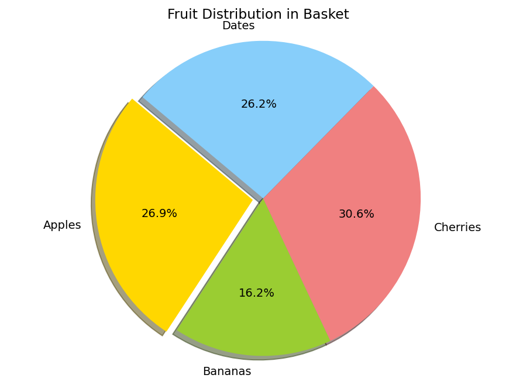
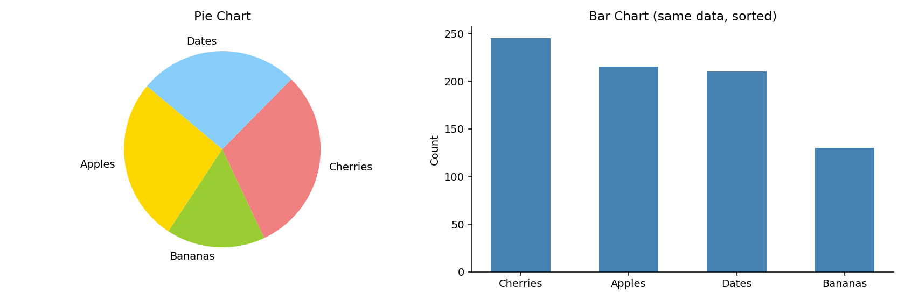
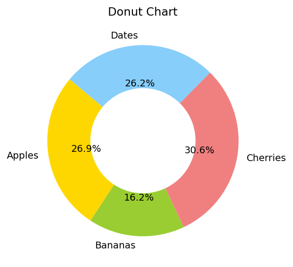
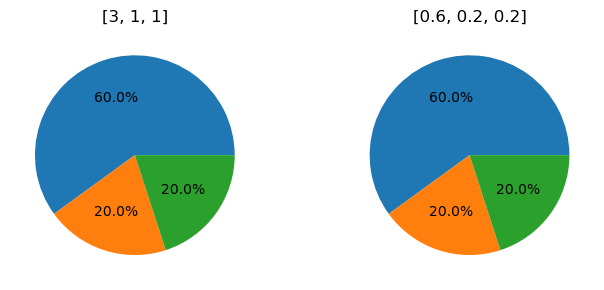
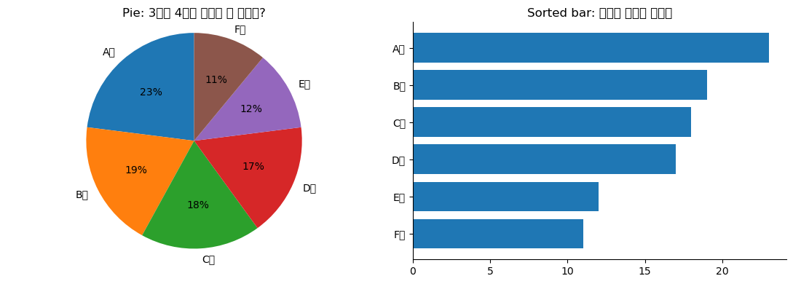
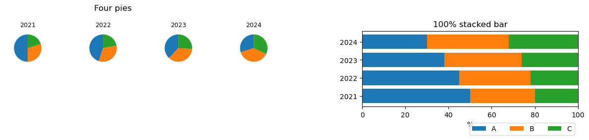

# 원그래프

**원그래프**는 원을 조각으로 나누어 전체에 대한 각 범주의 몫을 보여 준다. 가장 널리 알려진 통계 그림이고, 동시에 통계학자들이 가장 자주 말리는 그림이다.

이 절은 원그래프를 그리는 법과 함께 **왜 대부분의 경우 막대그림이 나은지**를 다룬다. 도구를 아는 것과 언제 쓰지 말아야 하는지를 아는 것은 같은 공부의 두 부분이다.

## 1. 기본 원그래프

```python
import matplotlib.pyplot as plt

labels = 'Apples', 'Bananas', 'Cherries', 'Dates'
sizes = [215, 130, 245, 210]     # 개수. 합이 800이며 자동으로 백분율로 환산된다
colors = ['gold', 'yellowgreen', 'lightcoral', 'lightskyblue']
explode = (0.1, 0, 0, 0)         # 첫 조각만 0.1만큼 바깥으로 밀어 강조

fig, ax = plt.subplots()
ax.pie(sizes,
       explode=explode,
       labels=labels,
       colors=colors,
       autopct='%1.1f%%',        # 각 조각에 백분율 표시 (소수점 한 자리)
       shadow=True,
       startangle=140,           # 첫 조각이 시작하는 각도
       radius=1.5,
       counterclock=True)        # 반시계 방향으로 배치
ax.axis('equal')                 # 가로세로 비를 맞춰 원이 찌그러지지 않게 한다
ax.set_title('Fruit Distribution in Basket')
plt.show()
```



형식 문자열 `autopct='%1.1f%%'`는 각 조각에 백분율을 소수점 한 자리까지 표시한다. 마지막 `%%`는 퍼센트 기호 자체를 뜻한다.

**원그래프는 자동으로 비율을 계산한다.** 값을 그대로 주면 합으로 나누어 각도를 정한다. 따라서 원그래프는 언제나 "전체 = 100%"를 전제하며, 합이 의미 없는 자료에는 쓸 수 없다.

## 2. 왜 막대그림이 나은가

같은 자료를 두 방식으로 그려 놓고 물어보자.

```python
import matplotlib.pyplot as plt
import numpy as np

sizes = [215, 130, 245, 210]
labels = ['Apples', 'Bananas', 'Cherries', 'Dates']

fig, (ax1, ax2) = plt.subplots(1, 2, figsize=(12, 4))

# 왼쪽: 원그래프. 백분율 숫자를 일부러 빼고 각도만 남긴다.
ax1.pie(sizes, labels=labels, startangle=140, counterclock=True,
        colors=['gold', 'yellowgreen', 'lightcoral', 'lightskyblue'])
ax1.set_title("Pie Chart")

# 오른쪽: 같은 자료를 정렬한 막대그림
order = np.argsort(sizes)[::-1]
ax2.bar([labels[i] for i in order], [sizes[i] for i in order],
        color='steelblue', width=0.55)
ax2.set_title("Bar Chart (same data, sorted)")
ax2.set_ylabel("Count")
ax2.spines[['top', 'right']].set_visible(False)

plt.tight_layout()
plt.show()
```



**왼쪽 그림에서 Apples와 Dates 중 어느 쪽이 큰가?** 실제 값은 215와 210으로 Apples가 조금 크다. 각도로 판단할 수 있는가? 거의 불가능하다.

오른쪽에서는 막대 끝의 높이를 비교하면 끝이다. 순서도 정렬해 두었으니 1위부터 4위까지가 한눈에 들어온다.

!!! warning "사람은 각도와 넓이를 잘 비교하지 못한다"
    시각적 부호화(visual encoding)의 정확도에는 순서가 있다. Cleveland와 McGill의 실험 이래 널리 받아들여지는 순위는 대략 다음과 같다.

    1. **공통 척도 위의 위치** — 막대그림, 점그림 (가장 정확)
    2. 공통 기준선이 없는 위치 — 누적 막대의 위쪽 조각
    3. 길이
    4. **각도, 기울기**
    5. **넓이**
    6. 부피, 색의 진하기 (가장 부정확)

    원그래프는 **각도와 넓이**를 동시에 쓴다. 목록의 아래쪽 두 항목이다. 막대그림은 맨 위 항목을 쓴다.

    그래서 원그래프는 숫자를 적어 넣어야만 읽힌다. **숫자를 적어야 읽히는 그림은 그림의 역할을 못 하고 있는 것**이다. 그럴 바에는 표가 낫다.

## 3. 그래도 원그래프가 통하는 경우

원그래프를 아예 쓰지 말라는 것은 아니다. 다음 조건이 모두 맞으면 괜찮다.

- **범주가 두셋뿐이다.** 조각이 둘이면 각도 비교가 어렵지 않다.
- **"절반쯤인가", "3분의 1쯤인가" 같은 대략적인 몫만 전달하면 된다.** 정확한 순위나 차이가 중요하지 않다.
- **전체가 100%라는 사실 자체를 강조하고 싶다.** 원이라는 형태가 "이것이 전부다"를 직관적으로 전한다.

예컨대 "예산의 절반이 인건비"라는 한 가지 사실만 전하는 자리라면 원그래프가 막대그림보다 나을 수 있다.

### 도넛 그래프

가운데를 비운 형태다. 빈 공간에 총계나 핵심 숫자를 넣을 수 있다는 실용적 이점이 있다.

```python
import matplotlib.pyplot as plt

sizes = [215, 130, 245, 210]
labels = ['Apples', 'Bananas', 'Cherries', 'Dates']

fig, ax = plt.subplots(figsize=(5, 4))
ax.pie(sizes, labels=labels, autopct='%1.1f%%', startangle=140,
       colors=['gold', 'yellowgreen', 'lightcoral', 'lightskyblue'],
       wedgeprops=dict(width=0.45))   # 조각의 두께. 원 반지름보다 작으면 도넛이 된다
ax.set_title("Donut Chart")
plt.show()
```



읽기 쉬움의 관점에서는 원그래프와 다를 바 없다. 가운데를 비웠으니 넓이 단서가 줄어 오히려 조금 나빠진다는 지적도 있다.

!!! danger "3차원 원그래프는 쓰지 말 것"
    입체로 기울여 그린 원그래프는 **앞쪽 조각이 실제보다 커 보인다.** 원근 때문에 앞쪽 조각의 보이는 넓이가 부풀려지기 때문이다.

    같은 20%짜리 조각이라도 앞에 놓으면 뒤에 놓을 때보다 크게 읽힌다. 그림이 자료가 아니라 **배치 각도**에 따라 달라지는 것이며, 이는 정의상 왜곡이다.

    입체 효과, 그림자, 기울임은 모두 정보를 더하지 않으면서 읽기만 어렵게 만든다.

## 연습문제

<div class="drillbox" markdown>

**연습문제 1.**
어떤 발표자가 일곱 개 부서의 예산 배분을 원그래프로 보여 주었다. 청중이 "영업과 마케팅 중 어디가 더 많나요?"라고 물었는데 발표자가 바로 답하지 못했다. 무엇이 잘못되었고 어떻게 고쳐야 하는가?

</div>

??? success "풀이"
    **잘못된 것.** 원그래프는 각도로 크기를 나타내는데, 사람은 비슷한 각도를 구별하지 못한다. 조각이 일곱 개면 각 조각이 평균 51도씩이고, 비슷한 두 조각을 눈으로 가려내는 일은 사실상 불가능하다. 발표자조차 자기 그림을 읽지 못한 것이 그 증거다.

    범주가 일곱 개라는 점도 문제다. 원그래프는 조각이 늘어날수록 급격히 나빠진다. 색을 일곱 가지 쓰면 범례를 왔다 갔다 하며 봐야 하는 부담도 생긴다.

    **고치는 법.** **정렬한 가로 막대그림**으로 바꾼다.

    - 길이로 읽으므로 비슷한 두 값도 구별된다.
    - 값 순으로 정렬하면 "영업이 2위, 마케팅이 4위"처럼 순위가 즉시 보인다.
    - 부서 이름이 길어도 가로로 편하게 읽힌다.
    - 색을 일곱 가지 쓸 필요가 없어 범례가 사라진다.

    "전체 예산이 100%"라는 점을 강조해야 한다면 100% 누적 막대 하나를 함께 놓거나, 막대그림의 축을 백분율로 표시하면 된다.

<div class="drillbox" markdown>

**연습문제 2.**
원그래프로 나타내면 **안 되는** 자료의 예를 두 가지 들고 이유를 설명하라.

</div>

??? success "풀이"
    **(1) 합이 100%가 아닌 자료.**

    "지난달 어떤 매체를 이용했습니까(복수 응답)"라는 설문 결과가 TV 60%, 유튜브 70%, 신문 20%라면 합이 150%다. 원그래프는 값을 합으로 나누어 각도를 정하므로, 이 자료를 넣으면 TV가 40%(=60/150)로 그려진다. **원래 없던 수가 만들어진다.**

    복수 응답 자료는 막대그림으로 그려야 한다. 각 막대가 0~100%의 독립적인 값을 나타내고, 합에는 의미가 없다는 사실이 그림에도 드러난다.

    **(2) 시간에 따른 변화.**

    2020년과 2024년의 시장 점유율을 원그래프 두 개로 나란히 놓으면 변화를 읽기 어렵다. 두 원의 대응하는 조각을 각각 찾아 각도를 비교해야 하는데, 그것도 각도끼리의 비교다.

    이런 자료는 **누적 면적 그림**이나 범주별 **선그림**이 맞다. 변화의 방향과 속도가 곧바로 보인다.

    **덧붙여, 음수가 있는 자료.** 손익 항목처럼 음수가 섞이면 원그래프는 아예 성립하지 않는다. 각도가 음수일 수 없기 때문이다.

<div class="drillbox" markdown>

**연습문제 3.**
어떤 원그래프의 조각이 각각 $12\%$, $13\%$, $14\%$, $61\%$이다. 세 작은 조각의 중심각을 구하고, 그 각도 차이를 눈으로 구별할 수 있을지 논하라.

</div>

??? success "풀이"
    중심각은 비율에 $360^\circ$를 곱한 값이다.

    $$
    0.12 \times 360 = 43.2^\circ, \quad
    0.13 \times 360 = 46.8^\circ, \quad
    0.14 \times 360 = 50.4^\circ
    $$

    이웃한 조각의 각도 차이가 $3.6^\circ$에 지나지 않는다. 시계 문자판으로 치면 1분에 해당하는 각도로, 조각의 방향과 위치까지 제각각인 원 위에서 이 차이를 알아보기란 사실상 불가능하다.

    막대그림이라면 같은 자료가 길이 $12$, $13$, $14$로 그려진다. 길이는 공통의 기준선에서 시작하므로 $8\%$의 차이($12 \to 13$)가 곧바로 보인다. **각도는 기준선이 없고 방향도 제각각이라는 점이 결정적인 차이다.** $\square$

<div class="drillbox" markdown>

**연습문제 4.**
`ax.pie()`에 `sizes = [3, 1, 1]`을 주면 각 조각의 백분율은 얼마인가? 같은 함수에 `sizes = [0.6, 0.2, 0.2]`를 주면 어떻게 되는가? 이로부터 원그래프가 자료를 어떻게 다루는지 설명하라.

</div>

??? success "풀이"
    두 경우 모두 같은 그림이 나온다. 각각 $60\%$, $20\%$, $20\%$이다.

    ```python
    import matplotlib.pyplot as plt

    fig, axes = plt.subplots(1, 2, figsize=(7, 3))
    for ax, sizes in zip(axes, ([3, 1, 1], [0.6, 0.2, 0.2])):
        wedges, _, _ = ax.pie(sizes, autopct='%1.1f%%')
        ax.set_title(str(sizes))
        print(sizes, "-> 각도:", [round(w.theta2 - w.theta1, 1) for w in wedges])
    plt.tight_layout()
    plt.show()
    ```

    출력:

    ```
    [3, 1, 1] -> 각도: [216.0, 72.0, 72.0]
    [0.6, 0.2, 0.2] -> 각도: [216.0, 72.0, 72.0]
    ```

    

    `pie`는 받은 값을 **합으로 나누어** 각도를 정한다. 곧 원그래프는 자료의 절대적인 크기를 완전히 버리고 **비율만** 남긴다.

    이 성질이 두 가지를 뜻한다. 첫째, 값의 단위나 총량이 메시지의 일부라면 원그래프는 그것을 지워 버린다(전체 매출이 두 배가 되어도 그림은 그대로다). 둘째, 합이 의미 없는 자료(복수 응답, 서로 다른 단위)를 넣으면 **없던 비율이 만들어진다.** $\square$

<div class="drillbox" markdown>

**연습문제 5.**
같은 자료를 원그래프와 정렬한 가로 막대그림으로 나란히 그리는 코드를 작성하라. 범주는 여섯 개로 하고, 두 그림에서 3위와 4위를 가려내는 난이도를 비교하라.

</div>

??? success "풀이"
    ```python
    import matplotlib.pyplot as plt
    import numpy as np

    labels = ["A팀", "B팀", "C팀", "D팀", "E팀", "F팀"]
    values = np.array([23, 19, 18, 17, 12, 11])

    fig, (ax1, ax2) = plt.subplots(1, 2, figsize=(11, 4))

    ax1.pie(values, labels=labels, autopct='%1.0f%%', startangle=90)
    ax1.axis('equal')
    ax1.set_title("Pie: 3위와 4위를 구별할 수 있는가?")

    order = np.argsort(values)                      # 가로 막대는 아래에서 위로 쌓인다
    ax2.barh(np.array(labels)[order], values[order])
    ax2.set_title("Sorted bar: 순위가 그대로 보인다")
    ax2.spines[["top", "right"]].set_visible(False)

    plt.tight_layout()
    plt.show()

    print("3위와 4위 값:", values[2], values[3], " 차이:", values[2] - values[3])
    print("각도 차이:", round((values[2] - values[3]) / values.sum() * 360, 2), "도")
    ```

    출력:

    ```
    3위와 4위 값: 18 17  차이: 1
    각도 차이: 3.6 도
    ```

    

    C팀($18$)과 D팀($17$)의 차이는 각도로 $3.6^\circ$에 지나지 않는다. 원그래프에서는 두 조각이 사실상 같아 보이지만, 정렬한 막대그림에서는 위아래 순서가 곧 순위이므로 **읽을 필요조차 없이** 드러난다.

    정렬이 핵심이다. 막대그림이라도 범주를 가나다순으로 두면 순위를 읽는 부담이 남는다. $\square$

<div class="drillbox" markdown>

**연습문제 6.**
어떤 보고서에 값이 적히지 않은 원그래프가 실려 있다. 각도기로 잰 중심각이 각각 $126^\circ$, $90^\circ$, $72^\circ$, $72^\circ$였다. (a) 각 범주의 비율을 구하라. (b) 전체가 $4{,}500$건이라는 사실을 따로 알았다면 각 범주의 도수는 얼마인가? (c) 전체를 모른다면 도수를 알 수 있는가?

</div>

??? success "풀이"
    **(a)** 비율은 중심각을 $360^\circ$로 나눈 값이다.

    $$
    \frac{126}{360} = 35\%, \quad
    \frac{90}{360} = 25\%, \quad
    \frac{72}{360} = 20\%, \quad
    \frac{72}{360} = 20\%
    $$

    합이 $100\%$로 맞는다.

    **(b)** 전체 $4{,}500$건에 비율을 곱한다.

    ```python
    angles = [126, 90, 72, 72]
    props = [a / 360 for a in angles]
    print("비율(%):", [round(p * 100, 1) for p in props])
    print("합계 확인:", sum(props))
    print("도수:", [round(p * 4500) for p in props])
    ```

    출력:

    ```
    비율(%): [35.0, 25.0, 20.0, 20.0]
    합계 확인: 1.0
    도수: [1575, 1125, 900, 900]
    ```

    **(c) 알 수 없다.** 원그래프는 값을 합으로 나누어 각도를 정하므로(연습문제 4) **총량 정보를 완전히 버린다.** 같은 그림이 총 $45$건에서도, $45{,}000$건에서도 나온다.

    이것이 원그래프의 근본적인 한계다. 표본크기가 결론의 신뢰도를 좌우하는데도 그림에는 그 정보가 남지 않는다. 그래서 원그래프를 쓸 때는 **총계를 제목이나 부제에 반드시 적어야 한다**(도넛의 가운데 공간을 총계에 쓰는 관행도 여기서 나온다). $\square$

<div class="drillbox" markdown>

**연습문제 7.**
부분-전체 관계를 보이는 또 다른 방법으로 **100% 누적 막대**가 있다. 원그래프와 무엇이 같고 무엇이 다른가? 집단이 여럿일 때 어느 쪽이 나은지 코드로 확인하라.

</div>

??? success "풀이"
    **같은 점**: 둘 다 값을 합으로 나누어 비율로 만들고, 전체를 $100\%$로 놓는다.

    **다른 점**: 100% 누적 막대는 크기를 **길이**로 부호화한다. 게다가 막대를 여러 개 나란히 놓으면 **집단 간 비교**가 가능하다. 원그래프로 집단을 비교하려면 원을 여러 개 그려야 하는데, 그러면 서로 다른 원의 조각끼리 각도를 비교해야 한다.

    ```python
    import matplotlib.pyplot as plt
    import numpy as np

    groups = ["2021", "2022", "2023", "2024"]
    cats = ["A", "B", "C"]
    data = np.array([[50, 30, 20],       # 각 행이 한 해의 구성비
                     [45, 33, 22],
                     [38, 36, 26],
                     [30, 38, 32]], dtype=float)
    pct = data / data.sum(axis=1, keepdims=True) * 100

    fig, (ax1, ax2) = plt.subplots(1, 2, figsize=(12, 3.5))

    # 원그래프 넷: 해마다 A가 줄어드는 추세가 보이는가?
    for i, g in enumerate(groups):
        sub = fig.add_subplot(2, 8, i + 1)
        sub.pie(pct[i], startangle=90)
        sub.set_title(g, fontsize=9)
    ax1.axis("off")
    ax1.set_title("Four pies", pad=30)

    # 100% 누적 가로 막대: 추세가 한눈에 보인다
    left = np.zeros(len(groups))
    for j, c in enumerate(cats):
        ax2.barh(groups, pct[:, j], left=left, label=c)
        left += pct[:, j]
    ax2.set_xlim(0, 100)
    ax2.set_xlabel("%")
    ax2.legend(ncol=3, loc="lower right", bbox_to_anchor=(1.0, -0.42))
    ax2.set_title("100% stacked bar")

    plt.tight_layout()
    plt.show()

    print("A의 비율 추이(%):", pct[:, 0].round(1))
    ```

    출력:

    ```
    A의 비율 추이(%): [50. 45. 38. 30.]
    ```

    

    A의 비율이 해마다 줄어드는 추세가 누적 막대에서는 왼쪽 끝의 경계선이 계단처럼 밀려나는 모습으로 즉시 보인다. 원 네 개에서는 각 원의 조각을 찾아 각도를 눈으로 비교해야 한다.

    **다만 누적 막대에도 약점이 있다.** 맨 왼쪽 범주만 공통의 기준선($0$)에서 시작하고, 가운데 범주들은 시작 위치가 막대마다 달라 길이를 비교하기 어렵다. 가운데 범주의 추세가 중요하다면 **범주별로 선그림을 그리는 것**이 가장 정확하다. $\square$

<div class="drillbox" markdown>

**연습문제 8.**
어떤 신문이 "응답자의 45%가 A를, 40%가 B를, 30%가 C를 지지한다"는 설문 결과를 원그래프로 실었다. 무엇이 잘못되었는가?

</div>

??? success "풀이"
    비율의 합이 $45 + 40 + 30 = 115\%$로 $100\%$를 넘는다. **복수 응답 문항**이었을 가능성이 크다.

    원그래프는 값을 합으로 나누므로, 이 자료를 넣으면 A가 $45/115 = 39.1\%$로 그려진다. 원자료의 어디에도 없는 수다.

    ```python
    vals = [45, 40, 30]
    total = sum(vals)
    print("원자료(%):", vals)
    print("원그래프가 그리는 값(%):", [round(v / total * 100, 1) for v in vals])
    ```

    출력:

    ```
    원자료(%): [45, 40, 30]
    원그래프가 그리는 값(%): [39.1, 34.8, 26.1]
    ```

    올바른 표현은 **각 막대가 $0$부터 $100\%$까지의 독립적인 값을 나타내는 막대그림**이다. 이렇게 하면 합이 $100\%$가 아니라는 사실 자체가 그림에 드러나고, "복수 응답"이라는 설문 구조가 독자에게 전달된다. $\square$

<div class="drillbox" markdown>

**연습문제 9.**
원그래프에서 한 조각이 정확히 $50\%$일 때는 다른 경우보다 읽기 쉽다. 왜 그런가? 이 성질을 이용할 수 있는 상황을 하나 들어라.

</div>

??? success "풀이"
    $50\%$는 중심각이 정확히 $180^\circ$, 곧 **직선**이다. 사람은 직선(과 직각)을 매우 정확하게 판별하므로, 조각의 경계가 일직선을 이루는지 여부로 "절반을 넘었는지"를 즉시 알 수 있다.

    같은 이유로 $25\%$($90^\circ$, 직각)와 $75\%$도 비교적 읽기 쉽다. 원그래프의 정확도는 값에 따라 고르지 않으며, **기준이 되는 각도 근처에서만 좋다.**

    이용할 수 있는 상황은 **과반 여부 자체가 메시지일 때**다. 예컨대 찬반 투표에서 "찬성이 과반을 넘었는가"를 보이는 그림이라면, 두 조각짜리 원그래프가 직관적으로 작동한다. 경계선이 수직선에서 어느 쪽으로 기울었는지만 보면 되기 때문이다.

    반대로 $37\%$와 $41\%$를 구별해야 한다면 기준 각도가 없으므로 원그래프의 장점이 사라진다. $\square$

<div class="drillbox" markdown>

**연습문제 10.**
범주가 $k$개인 원그래프에서 조각의 크기가 모두 같다면 중심각은 $360/k$도다. $k$가 커질 때 이웃한 두 조각의 각도 차이를 사람이 구별할 수 있는 한계를 생각해 보자. 실무에서 원그래프의 범주 개수를 몇 개로 제한하는 것이 합리적인지 논하라.

</div>

??? success "풀이"
    조각이 모두 같으면 각도가 $360/k$이므로, $k$가 커질수록 조각 하나가 얇아진다.

    | $k$ | 조각당 각도 | 한 조각이 $10\%$ 커질 때의 각도 변화 |
    |---:|---:|---:|
    | 3 | $120^\circ$ | $12^\circ$ |
    | 5 | $72^\circ$ | $7.2^\circ$ |
    | 7 | $51.4^\circ$ | $5.1^\circ$ |
    | 10 | $36^\circ$ | $3.6^\circ$ |
    | 20 | $18^\circ$ | $1.8^\circ$ |

    ```python
    for k in (3, 5, 7, 10, 20):
        ang = 360 / k
        print(f"k={k:>2}: 조각당 {ang:6.1f}도, 10% 차이 = {ang * 0.1:4.1f}도")
    ```

    출력:

    ```
    k= 3: 조각당  120.0도, 10% 차이 = 12.0도
    k= 5: 조각당   72.0도, 10% 차이 =  7.2도
    k= 7: 조각당   51.4도, 10% 차이 =  5.1도
    k=10: 조각당   36.0도, 10% 차이 =  3.6도
    k=20: 조각당   18.0도, 10% 차이 =  1.8도
    ```

    각도 판별의 한계는 사람과 상황에 따라 다르지만, 대략 **$5^\circ$ 아래에서는 신뢰하기 어렵다**고 보는 것이 안전하다. 위 표에서 $k = 7$이 이미 그 언저리다.

    따라서 실무 기준은 **$k \le 5$**, 넉넉히 잡아도 $k \le 7$이다. 범주가 그보다 많으면 (1) 작은 범주를 "기타"로 묶거나 (2) 정렬한 막대그림으로 바꾸는 것이 옳다.

    다만 이 계산은 원그래프를 **써도 되는 상한**을 말할 뿐이다. $k$가 작아도 정확한 비교가 목적이라면 막대그림이 여전히 낫다. $\square$

## 정리하며

원그래프는 각도와 넓이로 크기를 나타내며, 이 둘은 사람이 가장 부정확하게 읽는 시각 부호다.

- **기본 규칙**: 범주형 자료의 몫을 보여 줄 일이 있으면 먼저 **정렬한 막대그림**을 그려 보라.
- **원그래프가 통하는 좁은 경우**: 범주가 두셋이고, 대략적인 몫만 전하며, "전체가 100%"라는 점 자체가 메시지일 때.
- **절대 하지 말 것**: 3차원, 그림자, 기울임. 합이 100%가 아닌 자료.

다음 절의 **파레토 그림**은 정렬한 막대그림에 누적선을 더한 것이다. "어디에 집중해야 하는가"라는 물음에 답하도록 설계된 그림이며, 원그래프가 하려다 실패하는 일 — 몫의 순위를 보여 주는 일 — 을 제대로 해낸다.
