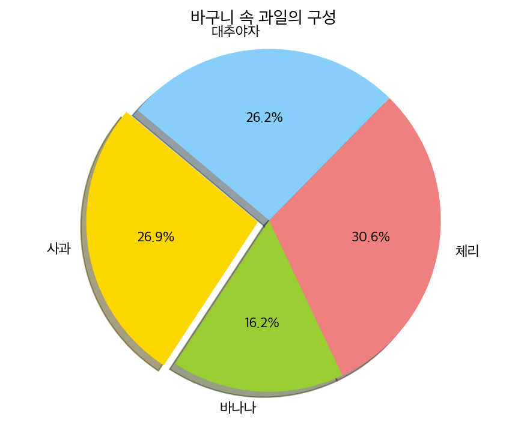
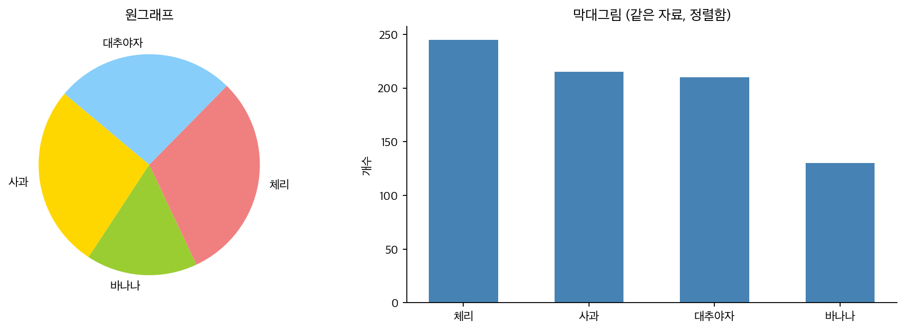
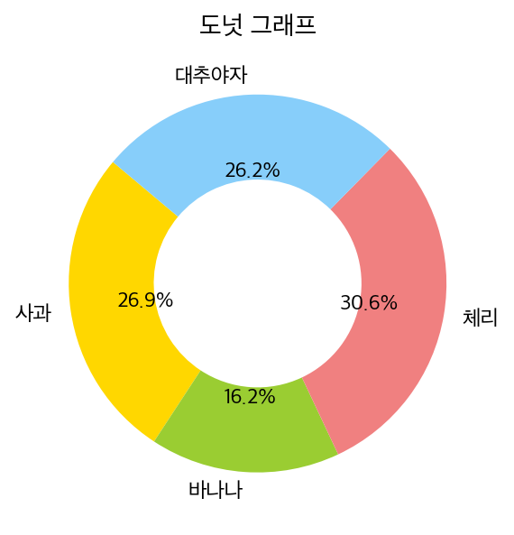
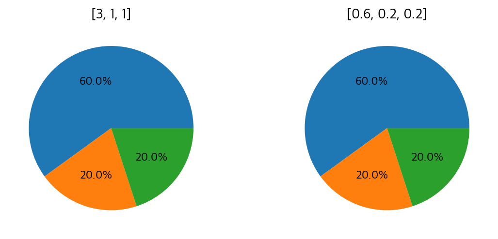
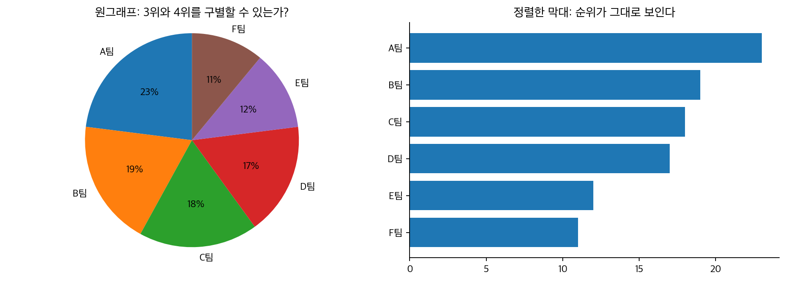
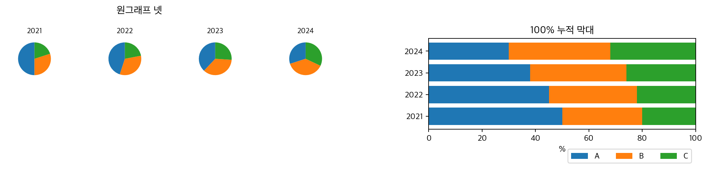

# 원그래프

**원그래프**는 원을 조각으로 나누어 전체에 대한 각 범주의 몫을 보여 준다. 가장 널리 알려진 통계 그림이고, 동시에 통계학자들이 가장 자주 말리는 그림이다.

이 절은 원그래프를 그리는 법과 함께 **왜 대부분의 경우 막대그림이 나은지**를 다룬다. 도구를 아는 것과 언제 쓰지 말아야 하는지를 아는 것은 같은 공부의 두 부분이다.

---

## 1. 기본 원그래프

<div class="exbox" markdown>

**보기 1.** <span class="diff easy" title="쉬움"></span> 조각의 각도가 비율을 정확히 담는다는 것, 그리고 그 대가. 과일 바구니에 사과 $215$, 바나나 $130$, 체리 $245$, 대추야자 $210$ 개가 있다.

**(1)** 네 조각의 중심각을 구하고, 그 합이 반드시 $360^\circ$ 가 되는 까닭을 적으시오. 또 이 성질 때문에 원그래프에 넣을 수 **없는** 자료가 무엇인지 말하시오.

**(2)** 원그래프를 그려 조각의 각도를 실제로 재어 (1)을 확인하고, 복수응답 자료(TV $60\%$, 유튜브 $70\%$, 신문 $20\%$)를 넣으면 무엇이 그려지는지 보이시오.

</div>

??? success "풀이"

    **(1) 해석적으로.** 도수를 $x_1, \ldots, x_K$, 총합을 $T = \sum_k x_k$ 라 하면 원그래프는 $k$ 번째 조각에 중심각

    $$
    \theta_k = 360^\circ \times p_k, \qquad p_k = \frac{x_k}{T}
    $$

    를 준다. 이 자료는 $T = 215 + 130 + 245 + 210 = 800$ 이므로

    $$
    \theta = 360^\circ \times \left(\tfrac{215}{800}, \tfrac{130}{800}, \tfrac{245}{800}, \tfrac{210}{800}\right)
    = (96.75^\circ,\ 58.5^\circ,\ 110.25^\circ,\ 94.5^\circ)
    $$

    이다. **각도는 비율을 하나도 잃지 않고 담는다.** $\theta_k$ 에서 $p_k = \theta_k / 360^\circ$ 를 정확히 되찾을 수 있으니, 원그래프가 자료를 왜곡한다는 흔한 말은 부호화 자체에 대해서는 틀렸다. 문제는 사람이 그 각도를 읽어 내지 못하는 데 있다(보기 2).

    각도의 합은 언제나

    $$
    \sum_{k=1}^{K} \theta_k = 360^\circ \sum_k p_k = 360^\circ \times \frac{\sum_k x_k}{T} = 360^\circ
    $$

    이다. **합이 $360^\circ$ 라는 것은 자료의 성질이 아니라 $T$ 로 나눈 결과다.** 원그래프는 받은 값이 무엇이든 합으로 나누므로, 비율의 합이 $1$ 이라는 사실을 **강제로** 만들어 낸다.

    그러므로 **합이 $1$ 이 아닌 자료는 넣을 수 없다.** 복수응답처럼 범주가 겹치면 참 비율의 합이 $1$ 을 넘는다. TV $0.6$, 유튜브 $0.7$, 신문 $0.2$ 는 합이 $1.5$ 이고, 원그래프는 이것을 $0.6/1.5 = 0.4$, $0.7/1.5 \approx 0.467$, $0.2/1.5 \approx 0.133$ 로 바꾸어 그린다. **어느 수치도 자료에 없던 것이다.** 음수도 마찬가지로 넣을 수 없다. 각도가 음수일 수 없기 때문이다.

    원그래프가 쓸 수 있는 자료는 **배타적이고 빠짐없는 범주로 전체를 나눈 것**뿐이다.

    **(2) 수치적으로.** `ax.pie` 가 돌려주는 조각 객체에서 시작각과 끝각을 빼면 중심각이 나온다.

    ```python
    import matplotlib.pyplot as plt

    plt.rcParams["font.sans-serif"] = ["NanumGothic", "Apple SD Gothic Neo", "Malgun Gothic"]
    plt.rcParams["font.family"] = "sans-serif"
    plt.rcParams["axes.unicode_minus"] = False            # 음수 기호가 네모가 되지 않게

    # 과일 바구니의 구성. 원그래프는 "전체를 이루는 부분"에만 쓸 수 있다.
    labels = '사과', '바나나', '체리', '대추야자'
    sizes = [215, 130, 245, 210]     # 개수. 합이 800이며 자동으로 백분율로 환산된다
    colors = ['gold', 'yellowgreen', 'lightcoral', 'lightskyblue']
    explode = (0.1, 0, 0, 0)         # 첫 조각만 0.1만큼 바깥으로 밀어 강조

    fig, ax = plt.subplots()
    wedges, _, _ = ax.pie(sizes,
           explode=explode,
           labels=labels,
           colors=colors,
           autopct='%1.1f%%',        # 각 조각에 백분율 표시 (소수점 한 자리)
           shadow=True,
           startangle=140,           # 첫 조각이 시작하는 각도
           radius=1.5,
           counterclock=True)        # 반시계 방향으로 배치
    ax.axis('equal')                 # 가로세로 비를 맞춰 원이 찌그러지지 않게 한다
    ax.set_title('바구니 속 과일의 구성')
    plt.show()

    # (1) 조각의 중심각이 360 * p 인가. wedge 의 시작각과 끝각을 뺀다.
    T = sum(sizes)
    print(f"{'범주':>6}{'도수':>6}{'비율':>9}{'360p':>9}{'실측 각도':>11}")
    for lab, x, w in zip(labels, sizes, wedges):
        print(f"{lab:>6}{x:>6}{x/T:>9.5f}{360*x/T:>9.2f}{w.theta2 - w.theta1:>11.2f}")
    print(f"{'합':>6}{T:>6}{sum(sizes)/T:>9.5f}{360.0:>9.2f}"
          f"{sum(w.theta2 - w.theta1 for w in wedges):>11.2f}")

    # (2) 합이 1 이 아닌 자료를 넣으면 없던 비율이 만들어진다.
    multi = [60, 70, 20]             # 복수응답: 참 비율의 합이 1.5 다
    print(f"\n복수응답 입력 {multi} (합 {sum(multi)})")
    for name, x in zip(["TV", "유튜브", "신문"], multi):
        print(f"  {name:>4}: 참 {x/100:.3f}  →  원그래프가 그리는 값 "
              f"{x/sum(multi):.3f}  ({360*x/sum(multi):.1f}도)")
    ```

    출력:

    ```
        범주    도수       비율     360p      실측 각도
        사과   215  0.26875    96.75      96.75
       바나나   130  0.16250    58.50      58.50
        체리   245  0.30625   110.25     110.25
      대추야자   210  0.26250    94.50      94.50
         합   800  1.00000   360.00     360.00

    복수응답 입력 [60, 70, 20] (합 150)
        TV: 참 0.600  →  원그래프가 그리는 값 0.400  (144.0도)
       유튜브: 참 0.700  →  원그래프가 그리는 값 0.467  (168.0도)
        신문: 참 0.200  →  원그래프가 그리는 값 0.133  (48.0도)
    ```

    

    **실측 각도가 $360p$ 와 소수점까지 같다.** `explode` 로 첫 조각을 밀어내고 `shadow` 로 그림자를 넣어도 각도는 그대로다. 밀어내기는 조각의 **위치**만 바꾼다.

    **복수응답은 완전히 다른 그림이 된다.** TV 를 고른 사람이 응답자의 $60\%$ 인데 원그래프에는 $40\%$ 로 찍힌다. $0.4$ 라는 수는 "TV 를 고른 선택의 수가 전체 선택의 $40\%$" 라는 뜻이고, 애초에 묻지 않은 양이다. **각 범주를 따로 $0$–$100\%$ 축에 올리는 막대그림이 맞다.**

    형식 문자열 `autopct='%1.1f%%'` 는 각 조각에 백분율을 소수점 한 자리까지 표시한다. 마지막 `%%` 는 퍼센트 기호 자체를 뜻한다.

---

## 2. 왜 막대그림이 나은가

같은 자료를 두 방식으로 그려 놓고 물어보자.

<div class="exbox" markdown>

**보기 2.** <span class="diff easy" title="쉬움"></span> 같은 차이가 두 그림에서 몇 배로 보이는가. 보기 1 의 과일 자료에서 사과는 $215$, 대추야자는 $210$ 개다.

**(1)** 두 범주의 비율 차 $\Delta p$ 가 원그래프에서는 각도로, $0$ 에서 시작하는 막대그림에서는 길이로 나타난다. 그 차이가 **그림의 눈금 전체에서 차지하는 비중**을 각각 식으로 적고, 사과와 대추야자에 대해 수로 구하시오.

**(2)** 같은 자료를 두 그림으로 나란히 그려 (1)을 확인하고, 범주 수가 늘면 어느 쪽이 더 나빠지는지 말하시오.

</div>

??? success "풀이"

    **(1) 해석적으로.** 보기 1 에서 본 대로 두 부호화는 **비율을 똑같이 정확하게** 담는다. 각도의 비는

    $$
    \frac{\theta_i}{\theta_j} = \frac{360 p_i}{360 p_j} = \frac{p_i}{p_j},
    \qquad
    \frac{\text{막대 }i\text{ 의 길이}}{\text{막대 }j\text{ 의 길이}} = \frac{x_i}{x_j} = \frac{p_i}{p_j}
    $$

    로 같다. 그러므로 **둘의 차이는 담긴 정보가 아니라 읽어 내는 쪽에 있다.** 그리고 읽기에서 결정적인 양은 "차이가 눈금 전체의 몇 분의 몇인가"다.

    원그래프의 눈금은 한 바퀴 $360^\circ$ 다. 비율 차 $\Delta p = p_i - p_j$ 는 각도 차 $360^\circ \Delta p$ 로 나타나므로, 눈금 전체에서 차지하는 비중은

    $$
    \frac{360^\circ \Delta p}{360^\circ} = \Delta p
    $$

    곧 $\Delta p$ 그 자체다. 한편 막대그림의 세로축은 **가장 큰 범주에 맞춰** 잡는다. 축의 위쪽 끝을 $x_{\max}$ 라 하면

    $$
    \frac{x_i - x_j}{x_{\max}} = \frac{T\Delta p}{T p_{\max}} = \frac{\Delta p}{p_{\max}}
    $$

    이다. 두 비중의 비가 결론이다.

    $$
    \frac{\Delta p / p_{\max}}{\Delta p} = \frac{1}{p_{\max}}
    $$

    **$0$ 에서 시작하는 막대그림은 같은 차이를 $1/p_{\max}$ 배로 확대해 보여 준다.** 원그래프가 눈금을 모든 범주에 나누어 쓰는 데 반해, 막대그림은 눈금 전체를 가장 큰 범주 하나에 쓰기 때문이다.

    이 자료는 $\Delta p = 5/800 = 0.00625$, $p_{\max} = 245/800 = 0.30625$ 이므로

    - 원그래프: 각도 차 $2.25^\circ$, 한 바퀴의 $0.625\%$
    - 막대그림: 높이 차 $5$, 축 길이 $245$ 의 $2.041\%$
    - 배율 $1/0.30625 = 3.27$

    이다. 그리고 범주 $K$ 개가 고르면 $p_{\max} = 1/K$ 이므로 배율이 $K$ 가 된다. **조각이 많아질수록 원그래프가 급격히 불리해진다**는 경험적 사실의 산술적 근거가 이것이다.

    여기에 **공통 기준선**이 더해진다. 막대는 모두 $y = 0$ 에서 출발하므로 끝점의 위치만 견주면 되지만, 원그래프의 두 조각은 방향이 서로 달라 끝점을 같은 눈금에 대고 볼 수가 없다. 아래 상자의 부호화 순위에서 막대가 $1$ 위, 각도가 $4$ 위인 까닭이다.

    **(2) 수치적으로.**

    ```python
    import matplotlib.pyplot as plt
    import numpy as np

    plt.rcParams["font.sans-serif"] = ["NanumGothic", "Apple SD Gothic Neo", "Malgun Gothic"]
    plt.rcParams["font.family"] = "sans-serif"
    plt.rcParams["axes.unicode_minus"] = False            # 음수 기호가 네모가 되지 않게

    sizes = [215, 130, 245, 210]
    labels = ['사과', '바나나', '체리', '대추야자']

    fig, (ax1, ax2) = plt.subplots(1, 2, figsize=(12, 4))

    # 왼쪽: 원그래프. 백분율 숫자를 일부러 빼고 각도만 남긴다.
    ax1.pie(sizes, labels=labels, startangle=140, counterclock=True,
            colors=['gold', 'yellowgreen', 'lightcoral', 'lightskyblue'])
    ax1.set_title("원그래프")

    # 오른쪽: 같은 자료를 정렬한 막대그림
    order = np.argsort(sizes)[::-1]
    ax2.bar([labels[i] for i in order], [sizes[i] for i in order],
            color='steelblue', width=0.55)
    ax2.set_title("막대그림 (같은 자료, 정렬함)")
    ax2.set_ylabel("개수")
    ax2.spines[['top', 'right']].set_visible(False)

    plt.tight_layout()
    plt.show()

    x = np.array(sizes, float)
    T = x.sum()
    p = x / T
    dp = (x[0] - x[3]) / T          # 사과와 대추야자의 비율 차
    pmax = p.max()

    # 두 부호화가 담는 비는 같다.
    print(f"값의 비   {x[0]:.0f}/{x[3]:.0f} = {x[0]/x[3]:.4f}")
    print(f"각도의 비 {360*p[0]:.2f}/{360*p[3]:.2f} = {p[0]/p[3]:.4f}")

    # 다른 것은 그 차이가 눈금 전체에서 차지하는 비중이다.
    print(f"\n비율 차 dp = {dp:.5f}")
    print(f"  원그래프: 각도 차 {360*dp:.2f}도   = 한 바퀴 360도의 {dp:.3%}")
    print(f"  막대그림: 높이 차 {x[0]-x[3]:.0f}       = 축 길이 {x.max():.0f}의 {dp/pmax:.3%}")
    print(f"  확대 배율 1/p_max = {1/pmax:.3f}")

    print("\n범주가 고를 때는 배율이 곧 범주 수 K 다")
    for K in (2, 4, 7, 12):
        print(f"  K = {K:>2}:  p_max = 1/K = {1/K:.4f},  배율 {1/(1/K):.0f}")
    ```

    출력:

    ```
    값의 비   215/210 = 1.0238
    각도의 비 96.75/94.50 = 1.0238

    비율 차 dp = 0.00625
      원그래프: 각도 차 2.25도   = 한 바퀴 360도의 0.625%
      막대그림: 높이 차 5       = 축 길이 245의 2.041%
      확대 배율 1/p_max = 3.265

    범주가 고를 때는 배율이 곧 범주 수 K 다
      K =  2:  p_max = 1/K = 0.5000,  배율 2
      K =  4:  p_max = 1/K = 0.2500,  배율 4
      K =  7:  p_max = 1/K = 0.1429,  배율 7
      K = 12:  p_max = 1/K = 0.0833,  배율 12
    ```

    

    **값의 비와 각도의 비가 $1.0238$ 로 같다.** 원그래프가 정보를 잃지 않는다는 것이 이 한 줄로 확인된다.

    **그런데 그 차이가 그림에서 차지하는 자리는 $3.27$ 배 다르다.** 왼쪽 그림에서 사과와 대추야자 중 어느 쪽이 큰지 각도로 판단해 보라. $2.25^\circ$ 차이이고 두 조각의 방향도 다르니 사실상 불가능하다. 오른쪽에서는 막대 끝의 높이만 견주면 되고, 정렬해 두었으니 $1$ 위부터 $4$ 위까지가 한눈에 들어온다.

    **배율 $1/p_{\max}$ 가 공짜가 아니라는 점은 짚어 두어야 한다.** 이 확대는 축이 $0$ 에서 시작할 때만 안전하다. 기준선을 올리면 배율은 더 커지지만 **길이의 비가 값의 비와 달라져** 그림이 거짓말을 시작한다. 그 산술은 앞 절 [막대그림](bar_charts.md)의 보기 6 에 있다.

!!! warning "사람은 각도와 넓이를 잘 비교하지 못한다"
    시각적 부호화(visual encoding)의 정확도에는 순서가 있다. Cleveland와 McGill의 실험 이래 널리 받아들여지는 순위는 대략 다음과 같다.

    1. **공통 척도 위의 위치** — 막대그림, 점그림 (가장 정확)
    2. 공통 기준선이 없는 위치 — 누적 막대의 위쪽 조각
    3. 길이
    4. **각도, 기울기**
    5. **넓이**
    6. 부피, 색의 진하기 (가장 부정확)

    원그래프는 **각도와 넓이**를 동시에 쓴다. 목록의 아래쪽 두 항목이다. 막대그림은 맨 위 항목을 쓴다.

    그래서 원그래프는 숫자를 적어 넣어야만 읽힌다. **숫자를 적어야 읽히는 그림은 그림의 역할을 못 하고 있는 것**이다. 그럴 바에는 표가 낫다.

---

## 3. 그래도 원그래프가 통하는 경우

원그래프를 아예 쓰지 말라는 것은 아니다. 다음 조건이 모두 맞으면 괜찮다.

- **범주가 두셋뿐이다.** 조각이 둘이면 각도 비교가 어렵지 않다.
- **"절반쯤인가", "3분의 1쯤인가" 같은 대략적인 몫만 전달하면 된다.** 정확한 순위나 차이가 중요하지 않다.
- **전체가 100%라는 사실 자체를 강조하고 싶다.** 원이라는 형태가 "이것이 전부다"를 직관적으로 전한다.

예컨대 "예산의 절반이 인건비"라는 한 가지 사실만 전하는 자리라면 원그래프가 막대그림보다 나을 수 있다.

### 도넛 그래프

가운데를 비운 형태다. 빈 공간에 총계나 핵심 숫자를 넣을 수 있다는 실용적 이점이 있다.

<div class="exbox" markdown>

**보기 3.** <span class="diff easy" title="쉬움"></span> 가운데를 비우면 무엇이 사라지고 무엇이 남는가. 반지름 $1$ 인 원에서 `wedgeprops=dict(width=0.45)` 로 가운데를 비워 보기 1 의 자료를 도넛으로 그린다.

**(1)** 비율 $p$ 인 조각의 넓이를 원그래프와 도넛에서 각각 구하고, 두 넓이의 비가 **모든 조각에서 같음**을 보이시오. 전체 넓이의 몇 $\%$ 가 사라지는가.

**(2)** 도넛을 그려 각도와 넓이를 실제로 재어 (1)을 확인하고, 도넛이 원그래프보다 정밀해지는지 판정하시오.

</div>

??? success "풀이"

    **(1) 해석적으로.** 바깥 반지름을 $r$, 조각의 두께를 $w$ 라 하면 안쪽 반지름은 $r_i = r - w$ 다. 비율 $p$ 인 조각은 원 전체의 $p$ 만큼을 차지하므로

    $$
    A^{\text{원}}(p) = \pi r^2 p, \qquad
    A^{\text{도넛}}(p) = \pi\left(r^2 - r_i^2\right) p
    $$

    이다. 두 넓이의 비는

    $$
    \frac{A^{\text{도넛}}(p)}{A^{\text{원}}(p)} = \frac{r^2 - r_i^2}{r^2} = 1 - \left(\frac{r_i}{r}\right)^2
    $$

    로 **$p$ 가 약분되어 사라진다.** 곧 가운데를 비우는 일은 모든 조각을 같은 비율로 줄이는 것이고, **조각끼리의 비는 조금도 달라지지 않는다.** $r = 1$, $w = 0.45$ 이면 $r_i = 0.55$ 이고

    $$
    1 - 0.55^2 = 1 - 0.3025 = 0.6975
    $$

    이므로 넓이의 $30.25\%$ 가 사라진다. 호의 길이도 바깥이 $2\pi r p$, 안쪽이$2\pi r_i p$ 로 둘 다 $p$ 에 비례한다.

    **그러므로 도넛도 비율을 정확히 담는다.** 사라진 것은 넓이의 절대량이지 비가 아니다.

    **정밀도는 나아지지 않는다.** 도넛을 한 점에서 잘라 펴면 길이 $2\pi r$ 인 $100\%$ 누적 막대 하나가 된다. 눈금 전체가 "전체 $= 1$" 이므로 보기 2 의 계산을 그대로 쓰면 비율 차 $\Delta p$ 가 눈금에서 차지하는 비중은 다시 $\Delta p$ 다. 막대그림이 얻은 $1/p_{\max}$ 배 확대는 **도넛에서도 얻지 못한다.**

    바뀌는 것은 단서의 가짓수다. 원그래프의 조각은 중심까지 뾰족하게 모여 넓이가 눈에 들어오지만, 도넛의 조각은 **두께가 모두 같아** 남는 단서가 호의 길이(또는 각도) 하나뿐이다. 넓이 단서가 줄어 조금 나빠진다는 지적이 여기서 나온다.

    **(2) 수치적으로.**

    ```python
    import matplotlib.pyplot as plt
    import numpy as np

    plt.rcParams["font.sans-serif"] = ["NanumGothic", "Apple SD Gothic Neo", "Malgun Gothic"]
    plt.rcParams["font.family"] = "sans-serif"
    plt.rcParams["axes.unicode_minus"] = False            # 음수 기호가 네모가 되지 않게

    sizes = [215, 130, 245, 210]
    labels = ['사과', '바나나', '체리', '대추야자']

    # 도넛은 원그래프에서 가운데를 비운 것이다. 조각의 두께가 모두 같아져
    # 넓이 단서가 줄고 호의 길이로 읽게 된다.
    fig, ax = plt.subplots(figsize=(5, 4))
    wedges, _, _ = ax.pie(sizes, labels=labels, autopct='%1.1f%%', startangle=140,
           colors=['gold', 'yellowgreen', 'lightcoral', 'lightskyblue'],
           wedgeprops=dict(width=0.45))   # 조각의 두께. 원 반지름보다 작으면 도넛이 된다
    ax.set_title("도넛 그래프")
    plt.show()

    r = wedges[0].r
    ri = r - wedges[0].width
    print(f"바깥 반지름 r = {r:.2f},  두께 w = {wedges[0].width:.2f},  안쪽 반지름 r_i = {ri:.2f}")
    print(f"고리 넓이 / 원 넓이 = 1 - (r_i/r)^2 = {1 - (ri/r)**2:.4f}"
          f"   →  넓이의 {1-(1-(ri/r)**2):.2%} 가 사라진다")

    T = sum(sizes)
    print(f"\n{'범주':>6}{'비율':>9}{'각도':>9}{'원 넓이':>11}{'도넛 넓이':>12}{'비':>9}")
    for lab, x, w in zip(labels, sizes, wedges):
        p = x / T
        a_pie = np.pi * r**2 * p
        a_don = np.pi * (r**2 - ri**2) * p
        print(f"{lab:>6}{p:>9.5f}{w.theta2-w.theta1:>9.2f}"
              f"{a_pie:>11.5f}{a_don:>12.5f}{a_don/a_pie:>9.4f}")
    print(f"{'합':>6}{1.0:>9.5f}{360.0:>9.2f}"
          f"{np.pi*r**2:>11.5f}{np.pi*(r**2-ri**2):>12.5f}{1-(ri/r)**2:>9.4f}")

    # 도넛을 잘라 펴면 길이 2*pi*r 의 100% 누적 막대 하나다.
    print(f"\n바깥 호의 길이 (합 = 2*pi*r = {2*np.pi*r:.5f})")
    for lab, x in zip(labels, sizes):
        print(f"  {lab:>6}: {2*np.pi*r*x/T:.5f}  = 둘레의 {x/T:.3%}")
    ```

    출력:

    ```
    바깥 반지름 r = 1.00,  두께 w = 0.45,  안쪽 반지름 r_i = 0.55
    고리 넓이 / 원 넓이 = 1 - (r_i/r)^2 = 0.6975   →  넓이의 30.25% 가 사라진다

        범주       비율       각도       원 넓이       도넛 넓이        비
        사과  0.26875    96.75    0.84430     0.58890   0.6975
       바나나  0.16250    58.50    0.51051     0.35608   0.6975
        체리  0.30625   110.25    0.96211     0.67107   0.6975
      대추야자  0.26250    94.50    0.82467     0.57521   0.6975
         합  1.00000   360.00    3.14159     2.19126   0.6975

    바깥 호의 길이 (합 = 2*pi*r = 6.28319)
          사과: 1.68861  = 둘레의 26.875%
         바나나: 1.02102  = 둘레의 16.250%
          체리: 1.92423  = 둘레의 30.625%
        대추야자: 1.64934  = 둘레의 26.250%
    ```

    

    **마지막 열이 네 조각 모두 $0.6975$ 다.** 유도한 $1 - (r_i/r)^2$ 과 같고 $p$ 에 전혀 의존하지 않는다. 각도는 보기 1 의 $96.75^\circ$, $58.5^\circ$, $110.25^\circ$, $94.5^\circ$ 그대로이고, 호의 길이가 둘레에서 차지하는 비율도 $p$ 와 소수점까지 같다.

    **읽기 쉬움의 관점에서 도넛은 원그래프와 다를 바 없다.** 비율 차 $\Delta p$ 는 여전히 눈금 전체의 $\Delta p$ 만큼만 차지한다. 도넛의 실질적인 이점은 하나뿐이고 그것은 통계적인 것이 아니다. **빈 가운데에 총계나 핵심 숫자를 적어 넣을 수 있다**는 것이다. 그 자리에 "전체 $800$ 개" 를 적으면, 원그래프가 지워 버리는 절대 크기(연습문제 3)를 되살릴 수 있다.

!!! danger "3차원 원그래프는 쓰지 말 것"
    입체로 기울여 그린 원그래프는 **앞쪽 조각이 실제보다 커 보인다.** 원근 때문에 앞쪽 조각의 보이는 넓이가 부풀려지기 때문이다.

    같은 20%짜리 조각이라도 앞에 놓으면 뒤에 놓을 때보다 크게 읽힌다. 그림이 자료가 아니라 **배치 각도**에 따라 달라지는 것이며, 이는 정의상 왜곡이다.

    입체 효과, 그림자, 기울임은 모두 정보를 더하지 않으면서 읽기만 어렵게 만든다.

---

## 연습문제

<div class="drillbox" markdown>

**연습문제 1.** <span class="diff easy" title="쉬움"></span>
원그래프로 나타내면 **안 되는** 자료의 예를 두 가지 들고 이유를 설명하라.

</div>

??? success "풀이"
    **(1) 합이 100%가 아닌 자료.**

    "지난달 어떤 매체를 이용했습니까(복수 응답)"라는 설문 결과가 TV 60%, 유튜브 70%, 신문 20%라면 합이 150%다. 원그래프는 값을 합으로 나누어 각도를 정하므로, 이 자료를 넣으면 TV가 40%(=60/150)로 그려진다. **원래 없던 수가 만들어진다.**

    복수 응답 자료는 막대그림으로 그려야 한다. 각 막대가 0~100%의 독립적인 값을 나타내고, 합에는 의미가 없다는 사실이 그림에도 드러난다.

    **(2) 시간에 따른 변화.**

    2020년과 2024년의 시장 점유율을 원그래프 두 개로 나란히 놓으면 변화를 읽기 어렵다. 두 원의 대응하는 조각을 각각 찾아 각도를 비교해야 하는데, 그것도 각도끼리의 비교다.

    이런 자료는 **누적 면적 그림**이나 범주별 **선그림**이 맞다. 변화의 방향과 속도가 곧바로 보인다.

    **덧붙여, 음수가 있는 자료.** 손익 항목처럼 음수가 섞이면 원그래프는 아예 성립하지 않는다. 각도가 음수일 수 없기 때문이다.

---

<div class="drillbox" markdown>

**연습문제 2.** <span class="diff easy" title="쉬움"></span>
어떤 원그래프의 조각이 각각 $12\%$, $13\%$, $14\%$, $61\%$이다. 세 작은 조각의 중심각을 구하고, 그 각도 차이를 눈으로 구별할 수 있을지 논하라.

</div>

??? success "풀이"
    중심각은 비율에 $360^\circ$를 곱한 값이다.

    $$
    0.12 \times 360 = 43.2^\circ, \quad
    0.13 \times 360 = 46.8^\circ, \quad
    0.14 \times 360 = 50.4^\circ
    $$

    이웃한 조각의 각도 차이가 $3.6^\circ$에 지나지 않는다. 시계 문자판으로 치면 1분에 해당하는 각도로, 조각의 방향과 위치까지 제각각인 원 위에서 이 차이를 알아보기란 사실상 불가능하다.

    막대그림이라면 같은 자료가 길이 $12$, $13$, $14$로 그려진다. 길이는 공통의 기준선에서 시작하므로 $8\%$의 차이($12 \to 13$)가 곧바로 보인다. **각도는 기준선이 없고 방향도 제각각이라는 점이 결정적인 차이다.** $\square$

---

<div class="drillbox" markdown>

**연습문제 3.** <span class="diff easy" title="쉬움"></span>
`ax.pie()`에 `sizes = [3, 1, 1]`을 주면 각 조각의 백분율은 얼마인가? 같은 함수에 `sizes = [0.6, 0.2, 0.2]`를 주면 어떻게 되는가? 이로부터 원그래프가 자료를 어떻게 다루는지 설명하라.

</div>

??? success "풀이"
    두 경우 모두 같은 그림이 나온다. 각각 $60\%$, $20\%$, $20\%$이다.

    ```python
    import matplotlib.pyplot as plt

    plt.rcParams["font.sans-serif"] = ["NanumGothic", "Apple SD Gothic Neo", "Malgun Gothic"]
    plt.rcParams["font.family"] = "sans-serif"
    plt.rcParams["axes.unicode_minus"] = False

    fig, axes = plt.subplots(1, 2, figsize=(7, 3))
    for ax, sizes in zip(axes, ([3, 1, 1], [0.6, 0.2, 0.2])):
        wedges, _, _ = ax.pie(sizes, autopct='%1.1f%%')
        ax.set_title(str(sizes))
        print(sizes, "-> 각도:", [round(w.theta2 - w.theta1, 1) for w in wedges])
    plt.tight_layout()
    plt.show()
    ```

    출력:

    ```
    [3, 1, 1] -> 각도: [216.0, 72.0, 72.0]
    [0.6, 0.2, 0.2] -> 각도: [216.0, 72.0, 72.0]
    ```

    

    `pie`는 받은 값을 **합으로 나누어** 각도를 정한다. 곧 원그래프는 자료의 절대적인 크기를 완전히 버리고 **비율만** 남긴다.

    이 성질이 두 가지를 뜻한다. 첫째, 값의 단위나 총량이 메시지의 일부라면 원그래프는 그것을 지워 버린다(전체 매출이 두 배가 되어도 그림은 그대로다). 둘째, 합이 의미 없는 자료(복수 응답, 서로 다른 단위)를 넣으면 **없던 비율이 만들어진다.** $\square$

---

<div class="drillbox" markdown>

**연습문제 4.** <span class="diff easy" title="쉬움"></span>
어떤 신문이 "응답자의 45%가 A를, 40%가 B를, 30%가 C를 지지한다"는 설문 결과를 원그래프로 실었다. 무엇이 잘못되었는가?

</div>

??? success "풀이"
    비율의 합이 $45 + 40 + 30 = 115\%$로 $100\%$를 넘는다. **복수 응답 문항**이었을 가능성이 크다.

    원그래프는 값을 합으로 나누므로, 이 자료를 넣으면 A가 $45/115 = 39.1\%$로 그려진다. 원자료의 어디에도 없는 수다.

    ```python
    vals = [45, 40, 30]
    total = sum(vals)
    print("원자료(%):", vals)
    print("원그래프가 그리는 값(%):", [round(v / total * 100, 1) for v in vals])
    ```

    출력:

    ```
    원자료(%): [45, 40, 30]
    원그래프가 그리는 값(%): [39.1, 34.8, 26.1]
    ```

    올바른 표현은 **각 막대가 $0$부터 $100\%$까지의 독립적인 값을 나타내는 막대그림**이다. 이렇게 하면 합이 $100\%$가 아니라는 사실 자체가 그림에 드러나고, "복수 응답"이라는 설문 구조가 독자에게 전달된다. $\square$

---

<div class="drillbox" markdown>

**연습문제 5.** <span class="diff med" title="중간"></span>
어떤 발표자가 일곱 개 부서의 예산 배분을 원그래프로 보여 주었다. 청중이 "영업과 마케팅 중 어디가 더 많나요?"라고 물었는데 발표자가 바로 답하지 못했다. 무엇이 잘못되었고 어떻게 고쳐야 하는가?

</div>

??? success "풀이"
    **잘못된 것.** 원그래프는 각도로 크기를 나타내는데, 사람은 비슷한 각도를 구별하지 못한다. 조각이 일곱 개면 각 조각이 평균 51도씩이고, 비슷한 두 조각을 눈으로 가려내는 일은 사실상 불가능하다. 발표자조차 자기 그림을 읽지 못한 것이 그 증거다.

    범주가 일곱 개라는 점도 문제다. 원그래프는 조각이 늘어날수록 급격히 나빠진다. 색을 일곱 가지 쓰면 범례를 왔다 갔다 하며 봐야 하는 부담도 생긴다.

    **고치는 법.** **정렬한 가로 막대그림**으로 바꾼다.

    - 길이로 읽으므로 비슷한 두 값도 구별된다.
    - 값 순으로 정렬하면 "영업이 2위, 마케팅이 4위"처럼 순위가 즉시 보인다.
    - 부서 이름이 길어도 가로로 편하게 읽힌다.
    - 색을 일곱 가지 쓸 필요가 없어 범례가 사라진다.

    "전체 예산이 100%"라는 점을 강조해야 한다면 100% 누적 막대 하나를 함께 놓거나, 막대그림의 축을 백분율로 표시하면 된다.

---

<div class="drillbox" markdown>

**연습문제 6.** <span class="diff med" title="중간"></span>
같은 자료를 원그래프와 정렬한 가로 막대그림으로 나란히 그리는 코드를 작성하라. 범주는 여섯 개로 하고, 두 그림에서 3위와 4위를 가려내는 난이도를 비교하라.

</div>

??? success "풀이"
    ```python
    import matplotlib.pyplot as plt
    import numpy as np

    plt.rcParams["font.sans-serif"] = ["NanumGothic", "Apple SD Gothic Neo", "Malgun Gothic"]
    plt.rcParams["font.family"] = "sans-serif"
    plt.rcParams["axes.unicode_minus"] = False            # 음수 기호가 네모가 되지 않게

    labels = ["A팀", "B팀", "C팀", "D팀", "E팀", "F팀"]
    values = np.array([23, 19, 18, 17, 12, 11])

    fig, (ax1, ax2) = plt.subplots(1, 2, figsize=(11, 4))

    ax1.pie(values, labels=labels, autopct='%1.0f%%', startangle=90)
    ax1.axis('equal')
    ax1.set_title("원그래프: 3위와 4위를 구별할 수 있는가?")

    order = np.argsort(values)                      # 가로 막대는 아래에서 위로 쌓인다
    ax2.barh(np.array(labels)[order], values[order])
    ax2.set_title("정렬한 막대: 순위가 그대로 보인다")
    ax2.spines[["top", "right"]].set_visible(False)

    plt.tight_layout()
    plt.show()

    print("3위와 4위 값:", values[2], values[3], " 차이:", values[2] - values[3])
    print("각도 차이:", round((values[2] - values[3]) / values.sum() * 360, 2), "도")
    ```

    출력:

    ```
    3위와 4위 값: 18 17  차이: 1
    각도 차이: 3.6 도
    ```

    

    C팀($18$)과 D팀($17$)의 차이는 각도로 $3.6^\circ$에 지나지 않는다. 원그래프에서는 두 조각이 사실상 같아 보이지만, 정렬한 막대그림에서는 위아래 순서가 곧 순위이므로 **읽을 필요조차 없이** 드러난다.

    정렬이 핵심이다. 막대그림이라도 범주를 가나다순으로 두면 순위를 읽는 부담이 남는다. $\square$

---

<div class="drillbox" markdown>

**연습문제 7.** <span class="diff med" title="중간"></span>
어떤 보고서에 값이 적히지 않은 원그래프가 실려 있다. 각도기로 잰 중심각이 각각 $126^\circ$, $90^\circ$, $72^\circ$, $72^\circ$였다. (a) 각 범주의 비율을 구하라. (b) 전체가 $4{,}500$건이라는 사실을 따로 알았다면 각 범주의 도수는 얼마인가? (c) 전체를 모른다면 도수를 알 수 있는가?

</div>

??? success "풀이"
    **(a)** 비율은 중심각을 $360^\circ$로 나눈 값이다.

    $$
    \frac{126}{360} = 35\%, \quad
    \frac{90}{360} = 25\%, \quad
    \frac{72}{360} = 20\%, \quad
    \frac{72}{360} = 20\%
    $$

    합이 $100\%$로 맞는다.

    **(b)** 전체 $4{,}500$건에 비율을 곱한다.

    ```python
    angles = [126, 90, 72, 72]
    props = [a / 360 for a in angles]
    print("비율(%):", [round(p * 100, 1) for p in props])
    print("합계 확인:", sum(props))
    print("도수:", [round(p * 4500) for p in props])
    ```

    출력:

    ```
    비율(%): [35.0, 25.0, 20.0, 20.0]
    합계 확인: 1.0
    도수: [1575, 1125, 900, 900]
    ```

    **(c) 알 수 없다.** 원그래프는 값을 합으로 나누어 각도를 정하므로(연습문제 3) **총량 정보를 완전히 버린다.** 같은 그림이 총 $45$건에서도, $45{,}000$건에서도 나온다.

    이것이 원그래프의 근본적인 한계다. 표본크기가 결론의 신뢰도를 좌우하는데도 그림에는 그 정보가 남지 않는다. 그래서 원그래프를 쓸 때는 **총계를 제목이나 부제에 반드시 적어야 한다**(도넛의 가운데 공간을 총계에 쓰는 관행도 여기서 나온다). $\square$

---

<div class="drillbox" markdown>

**연습문제 8.** <span class="diff med" title="중간"></span>
부분-전체 관계를 보이는 또 다른 방법으로 **100% 누적 막대**가 있다. 원그래프와 무엇이 같고 무엇이 다른가? 집단이 여럿일 때 어느 쪽이 나은지 코드로 확인하라.

</div>

??? success "풀이"
    **같은 점**: 둘 다 값을 합으로 나누어 비율로 만들고, 전체를 $100\%$로 놓는다.

    **다른 점**: 100% 누적 막대는 크기를 **길이**로 부호화한다. 게다가 막대를 여러 개 나란히 놓으면 **집단 간 비교**가 가능하다. 원그래프로 집단을 비교하려면 원을 여러 개 그려야 하는데, 그러면 서로 다른 원의 조각끼리 각도를 비교해야 한다.

    ```python
    import matplotlib.pyplot as plt
    import numpy as np

    plt.rcParams["font.sans-serif"] = ["NanumGothic", "Apple SD Gothic Neo", "Malgun Gothic"]
    plt.rcParams["font.family"] = "sans-serif"
    plt.rcParams["axes.unicode_minus"] = False            # 음수 기호가 네모가 되지 않게

    groups = ["2021", "2022", "2023", "2024"]
    cats = ["A", "B", "C"]
    data = np.array([[50, 30, 20],       # 각 행이 한 해의 구성비
                     [45, 33, 22],
                     [38, 36, 26],
                     [30, 38, 32]], dtype=float)
    pct = data / data.sum(axis=1, keepdims=True) * 100

    fig, (ax1, ax2) = plt.subplots(1, 2, figsize=(12, 3.5))

    # 원그래프 넷: 해마다 A가 줄어드는 추세가 보이는가?
    for i, g in enumerate(groups):
        sub = fig.add_subplot(2, 8, i + 1)
        sub.pie(pct[i], startangle=90)
        sub.set_title(g, fontsize=9)
    ax1.axis("off")
    ax1.set_title("원그래프 넷", pad=30)

    # 100% 누적 가로 막대: 추세가 한눈에 보인다
    left = np.zeros(len(groups))
    for j, c in enumerate(cats):
        ax2.barh(groups, pct[:, j], left=left, label=c)
        left += pct[:, j]
    ax2.set_xlim(0, 100)
    ax2.set_xlabel("%")
    ax2.legend(ncol=3, loc="lower right", bbox_to_anchor=(1.0, -0.42))
    ax2.set_title("100% 누적 막대")

    plt.tight_layout()
    plt.show()

    print("A의 비율 추이(%):", pct[:, 0].round(1))
    ```

    출력:

    ```
    A의 비율 추이(%): [50. 45. 38. 30.]
    ```

    

    A의 비율이 해마다 줄어드는 추세가 누적 막대에서는 왼쪽 끝의 경계선이 계단처럼 밀려나는 모습으로 즉시 보인다. 원 네 개에서는 각 원의 조각을 찾아 각도를 눈으로 비교해야 한다.

    **다만 누적 막대에도 약점이 있다.** 맨 왼쪽 범주만 공통의 기준선($0$)에서 시작하고, 가운데 범주들은 시작 위치가 막대마다 달라 길이를 비교하기 어렵다. 가운데 범주의 추세가 중요하다면 **범주별로 선그림을 그리는 것**이 가장 정확하다. $\square$

---

<div class="drillbox" markdown>

**연습문제 9.** <span class="diff med" title="중간"></span>
원그래프에서 한 조각이 정확히 $50\%$일 때는 다른 경우보다 읽기 쉽다. 왜 그런가? 이 성질을 이용할 수 있는 상황을 하나 들어라.

</div>

??? success "풀이"
    $50\%$는 중심각이 정확히 $180^\circ$, 곧 **직선**이다. 사람은 직선(과 직각)을 매우 정확하게 판별하므로, 조각의 경계가 일직선을 이루는지 여부로 "절반을 넘었는지"를 즉시 알 수 있다.

    같은 이유로 $25\%$($90^\circ$, 직각)와 $75\%$도 비교적 읽기 쉽다. 원그래프의 정확도는 값에 따라 고르지 않으며, **기준이 되는 각도 근처에서만 좋다.**

    이용할 수 있는 상황은 **과반 여부 자체가 메시지일 때**다. 예컨대 찬반 투표에서 "찬성이 과반을 넘었는가"를 보이는 그림이라면, 두 조각짜리 원그래프가 직관적으로 작동한다. 경계선이 수직선에서 어느 쪽으로 기울었는지만 보면 되기 때문이다.

    반대로 $37\%$와 $41\%$를 구별해야 한다면 기준 각도가 없으므로 원그래프의 장점이 사라진다. $\square$

---

<div class="drillbox" markdown>

**연습문제 10.** <span class="diff med" title="중간"></span>
범주가 $k$개인 원그래프에서 조각의 크기가 모두 같다면 중심각은 $360/k$도다. $k$가 커질 때 이웃한 두 조각의 각도 차이를 사람이 구별할 수 있는 한계를 생각해 보자. 실무에서 원그래프의 범주 개수를 몇 개로 제한하는 것이 합리적인지 논하라.

</div>

??? success "풀이"
    조각이 모두 같으면 각도가 $360/k$이므로, $k$가 커질수록 조각 하나가 얇아진다.

    | $k$ | 조각당 각도 | 한 조각이 $10\%$ 커질 때의 각도 변화 |
    |---:|---:|---:|
    | 3 | $120^\circ$ | $12^\circ$ |
    | 5 | $72^\circ$ | $7.2^\circ$ |
    | 7 | $51.4^\circ$ | $5.1^\circ$ |
    | 10 | $36^\circ$ | $3.6^\circ$ |
    | 20 | $18^\circ$ | $1.8^\circ$ |

    ```python
    for k in (3, 5, 7, 10, 20):
        ang = 360 / k
        print(f"k={k:>2}: 조각당 {ang:6.1f}도, 10% 차이 = {ang * 0.1:4.1f}도")
    ```

    출력:

    ```
    k= 3: 조각당  120.0도, 10% 차이 = 12.0도
    k= 5: 조각당   72.0도, 10% 차이 =  7.2도
    k= 7: 조각당   51.4도, 10% 차이 =  5.1도
    k=10: 조각당   36.0도, 10% 차이 =  3.6도
    k=20: 조각당   18.0도, 10% 차이 =  1.8도
    ```

    각도 판별의 한계는 사람과 상황에 따라 다르지만, 대략 **$5^\circ$ 아래에서는 신뢰하기 어렵다**고 보는 것이 안전하다. 위 표에서 $k = 7$이 이미 그 언저리다.

    따라서 실무 기준은 **$k \le 5$**, 넉넉히 잡아도 $k \le 7$이다. 범주가 그보다 많으면 (1) 작은 범주를 "기타"로 묶거나 (2) 정렬한 막대그림으로 바꾸는 것이 옳다.

    다만 이 계산은 원그래프를 **써도 되는 상한**을 말할 뿐이다. $k$가 작아도 정확한 비교가 목적이라면 막대그림이 여전히 낫다. $\square$

---

## 정리하며

원그래프는 각도와 넓이로 크기를 나타내며, 이 둘은 사람이 가장 부정확하게 읽는 시각 부호다.

- **기본 규칙**: 범주형 자료의 몫을 보여 줄 일이 있으면 먼저 **정렬한 막대그림**을 그려 보라.
- **원그래프가 통하는 좁은 경우**: 범주가 두셋이고, 대략적인 몫만 전하며, "전체가 100%"라는 점 자체가 메시지일 때.
- **절대 하지 말 것**: 3차원, 그림자, 기울임. 합이 100%가 아닌 자료.

다음 절의 **파레토 그림**은 정렬한 막대그림에 누적선을 더한 것이다. "어디에 집중해야 하는가"라는 물음에 답하도록 설계된 그림이며, 원그래프가 하려다 실패하는 일 — 몫의 순위를 보여 주는 일 — 을 제대로 해낸다.
