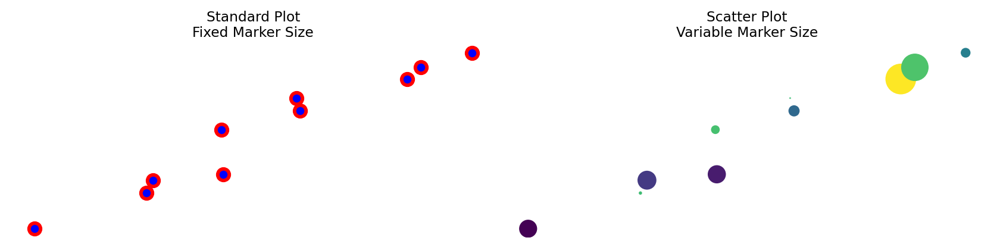
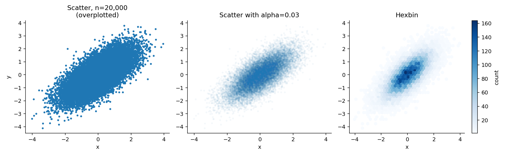
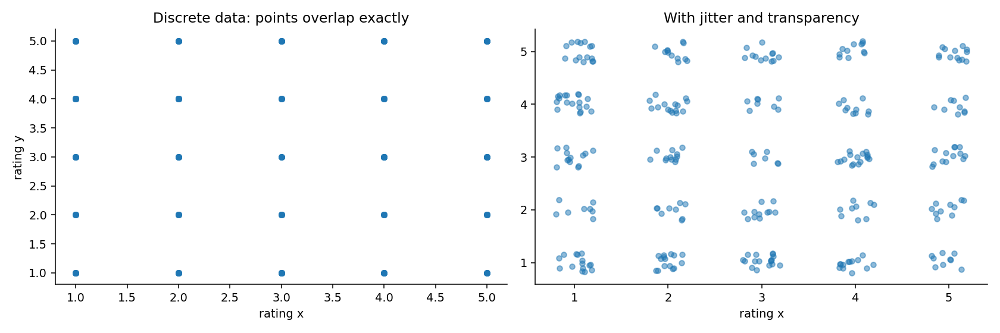
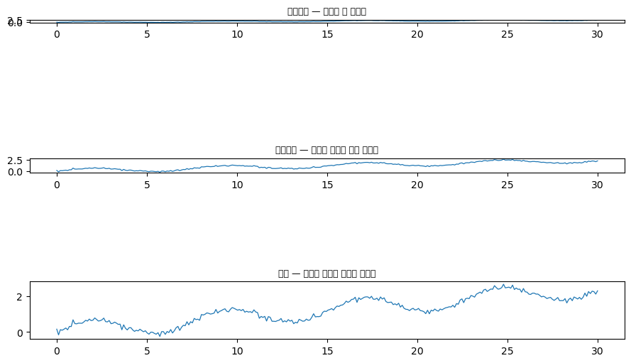
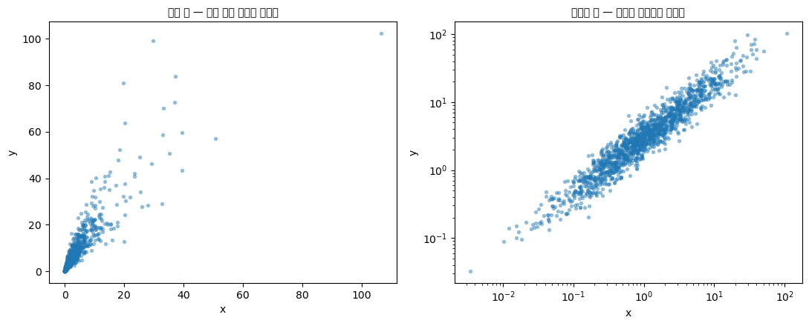
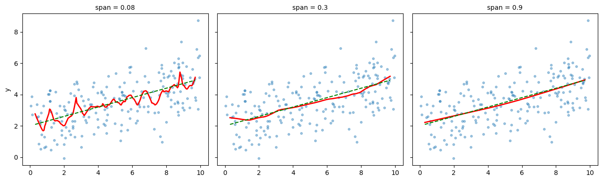
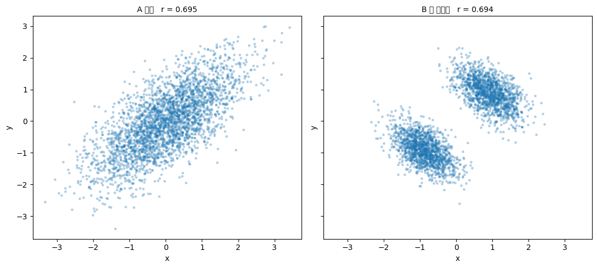
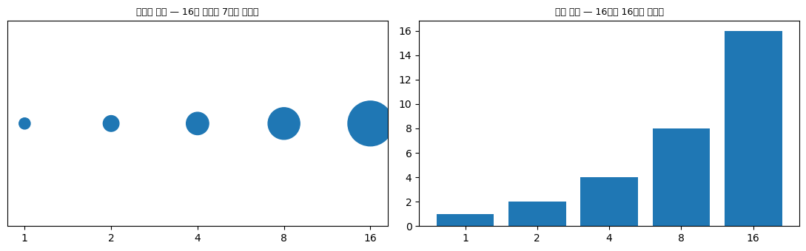
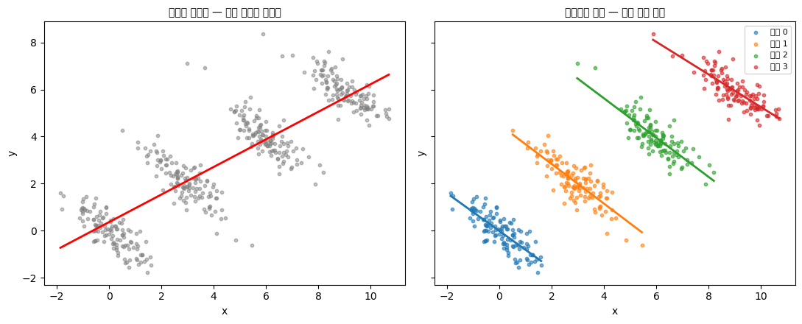

# 산점도

**산점도**는 두 수치형 변수의 관계를 보여 준다. 통계학에서 가장 중요한 그림 하나를 꼽으라면 대부분이 산점도를 든다. 상관, 회귀, 이상치, 군집, 비선형성 — 이 모든 것이 산점도에서 눈으로 확인된다.

## 1. `ax.plot`과 `ax.scatter`

Matplotlib은 점을 찍는 방법을 둘 제공하는데, 기능이 다르다.

<div class="codebox" markdown>

### 예제 1. plot 과 scatter 의 차이 { .eg }

```python
import matplotlib.pyplot as plt
import numpy as np
from scipy import stats

np.random.seed(0)
num_samples = 10
x = stats.norm().rvs(size=num_samples)
noise = 0.7 * stats.norm().rvs(size=num_samples)
y = 1 + 2 * x + noise

fig, (ax_plot, ax_scatter) = plt.subplots(1, 2, figsize=(12, 3))

point_sizes = 100 * stats.norm().rvs(size=num_samples) ** 2
color_values = stats.uniform().rvs(size=num_samples)

# ax.plot: 마커 속성이 모든 점에 똑같이 적용된다.
#   markersize=10  모든 점의 크기가 10
#   mec/mfc/mew    테두리색(red) / 채움색(blue) / 테두리굵기(3)
ax_plot.plot(x, y, 'o', markersize=10, mec="red", mfc="blue", mew=3)
ax_plot.set_title("Standard Plot\nFixed Marker Size")

# ax.scatter: 점마다 다른 값을 줄 수 있다.
#   s=배열  점마다 크기가 다르다  -> 세 번째 변수를 크기로 표현
#   c=배열  점마다 색이 다르다    -> 네 번째 변수를 색으로 표현
ax_scatter.scatter(x, y, s=point_sizes, c=color_values)
ax_scatter.set_title("Scatter Plot\nVariable Marker Size")

for ax in (ax_plot, ax_scatter):
    ax.set_xticks([])
    ax.set_yticks([])
    for spine in ['left', 'right', 'top', 'bottom']:
        ax.spines[spine].set_visible(False)

plt.show()
```



**핵심 차이.** `ax.plot`은 마커의 크기와 색이 일정하여 단순한 점 표시에 이상적이고 빠르다. `ax.scatter`는 각 점마다 크기와 색을 달리할 수 있어 자료의 차원을 추가로 시각화할 수 있다.

같은 10개 점을 그렸는데 오른쪽 그림은 **네 개의 변수**를 담는다. 가로축, 세로축, 점의 크기, 점의 색이다.

</div>

!!! warning "크기와 색은 보조 정보에만"
    앞서 원그래프 절에서 본 시각 부호화의 정확도 순위를 떠올려 보자. **위치**가 가장 정확하고 **넓이**와 **색의 진하기**가 가장 부정확하다.

    산점도의 가로축·세로축은 위치를 쓰므로 정확하지만, 점의 크기는 넓이, 점의 색은 색상/진하기를 쓴다. 따라서 크기와 색으로 표현한 변수는 **대략적인 경향만** 읽어야 한다.

    특히 점의 크기로 값을 나타낼 때는 **반지름이 아니라 넓이를 값에 비례**시켜야 한다. 반지름을 비례시키면 값이 두 배일 때 넓이는 네 배가 되어 크게 과장된다. matplotlib의 `s` 인자는 이미 넓이(points²)이므로 그냥 값을 주면 된다.

## 2. 과밀 문제

점이 많아지면 산점도는 검은 덩어리가 된다. 이것을 **과밀(overplotting)** 이라 한다.

<div class="codebox" markdown>

### 예제 2. 점이 뭉칠 때 { .eg }

```python
import numpy as np
import matplotlib.pyplot as plt

rng = np.random.default_rng(0)
n = 20000
x = rng.normal(0, 1, n)
y = 0.7 * x + rng.normal(0, 0.7, n)

fig, axes = plt.subplots(1, 3, figsize=(13, 4))

# (1) 그냥 그리면 가운데가 다 뭉개진다
axes[0].scatter(x, y, s=6)
axes[0].set_title(f"Scatter, n={n:,}\n(overplotted)")

# (2) 투명도. alpha=0.03이면 점 하나가 3%만 진하다.
#     같은 자리에 33개쯤 겹쳐야 완전히 진해지므로 밀도가 진하기로 드러난다.
axes[1].scatter(x, y, s=6, alpha=0.03)
axes[1].set_title("Scatter with alpha=0.03")

# (3) hexbin: 평면을 육각형으로 나누고 각 칸의 개수를 색으로 나타낸다.
#     mincnt=1 은 점이 하나도 없는 칸을 그리지 않는다는 뜻
hb = axes[2].hexbin(x, y, gridsize=40, cmap='Blues', mincnt=1)
axes[2].set_title("Hexbin")
plt.colorbar(hb, ax=axes[2], label='count')

for ax in axes:
    ax.set_xlabel('x')
    ax.spines[['top', 'right']].set_visible(False)
axes[0].set_ylabel('y')

plt.tight_layout()
plt.show()
```



**왼쪽.** 20,000개를 그대로 찍으니 가운데가 단색 덩어리다. 자료의 대부분이 있는 곳에서 아무것도 읽을 수 없다. **바깥 테두리의 모양만 보이고, 그 테두리는 이상치가 결정한다.** 즉 이 그림은 자료의 1%에 대해서만 정보를 준다.

**가운데.** 투명도를 크게 낮췄다. 밀도가 높은 곳이 진해져 중심이 어디인지, 어느 방향으로 늘어져 있는지가 드러난다.

**오른쪽.** 육각형 구간으로 나누어 개수를 색으로 나타냈다. 밀도가 **눈금 있는 색으로** 표현되므로 "여기는 160개, 저기는 20개"라고 읽을 수 있다. 투명도는 그 정도를 알 수 없다.

</div>

## 3. 이산값과 지터

또 다른 과밀은 값이 **이산**일 때 생긴다. 5점 척도 설문처럼 값이 몇 가지뿐이면 점이 정확히 같은 자리에 겹친다.

<div class="codebox" markdown>

### 예제 3. 이산값과 지터 { .eg }

```python
import numpy as np
import matplotlib.pyplot as plt

rng = np.random.default_rng(0)

# 1~5의 정수 평점 300쌍
xs = rng.integers(1, 6, 300)
ys = rng.integers(1, 6, 300)

fig, (a, b) = plt.subplots(1, 2, figsize=(12, 4))

# 그냥 그리면 300개가 25개 자리에 완전히 포개진다
a.scatter(xs, ys, s=20)
a.set_title("Discrete data: points overlap exactly")
a.set_xlabel("rating x")
a.set_ylabel("rating y")

# 지터: 각 점을 ±0.2 범위에서 무작위로 민다.
# 값을 바꾸는 것이므로 그림 설명에 반드시 밝혀야 한다.
b.scatter(xs + rng.uniform(-.2, .2, 300),
          ys + rng.uniform(-.2, .2, 300), s=20, alpha=.5)
b.set_title("With jitter and transparency")
b.set_xlabel("rating x")

for ax in (a, b):
    ax.spines[['top', 'right']].set_visible(False)
plt.tight_layout()
plt.show()
```



**왼쪽 그림에는 300개의 점이 있지만 25개만 보인다.** 각 자리에 몇 개가 겹쳤는지 전혀 알 수 없다. 이 그림만 보면 25개 조합이 모두 똑같이 흔하다고 오해하게 된다.

**오른쪽**은 각 점을 조금씩 흔들었다. 이제 각 자리의 점 뭉치 크기가 도수를 나타낸다.

</div>

!!! danger "지터는 자료를 바꾸는 일이다"
    지터는 **없는 값을 만들어 낸다.** 오른쪽 그림에는 평점 3.87 같은 점이 있지만, 실제 자료에 그런 값은 없다.

    따라서

    - **그림 설명에 지터를 썼다고 반드시 밝힌다.**
    - 지터 폭을 값의 최소 간격보다 훨씬 작게 잡는다. 위에서는 간격이 1인데 ±0.2를 썼으므로 범주가 섞이지 않는다.
    - **지터한 자료로 통계량을 계산하지 않는다.** 지터는 그림에만 쓴다.

    지터를 쓰기 싫다면 **점의 크기를 도수에 비례**시키거나(버블 산점도), 앞의 hexbin/2차원 히스토그램을 쓰면 된다. 이쪽은 자료를 바꾸지 않는다.

## 4. 산점도에서 무엇을 읽는가

산점도를 볼 때 확인할 것이 넷이다.

1. **방향** — 양의 관계인가, 음의 관계인가, 방향이 없는가.
2. **형태** — 직선인가, 곡선인가. 이것이 상관계수만으로는 알 수 없는 부분이다.
3. **강도** — 점들이 추세 주위에 얼마나 촘촘히 모여 있는가.
4. **이상점과 군집** — 동떨어진 점이 있는가. 여러 덩어리로 갈라져 있는가.

!!! tip "언제나 그려 보라"
    상관계수 하나로 관계를 요약할 수 있다는 생각은 위험하다. 앤스컴의 4중주는 평균·분산·상관·회귀직선이 **모두 같으면서** 산점도가 전혀 다른 네 자료다. 현대판인 **데이터사우루스 도즌**(Matejka & Fitzmaurice 2017)은 공룡 그림을 포함해 13가지 모양이 같은 요약통계량을 공유한다.

    요약통계량을 계산하기 **전에** 산점도를 그려라.

## 연습문제

<div class="drillbox" markdown>

**연습문제 1.** <span class="diff med" title="중간"></span>
두 변수의 산점도가 강한 곡선(이차) 관계를 보이는데 피어슨 상관계수는 0에 가깝다. 이런 일이 왜 생기는지, 그리고 산점도와 함께 상관계수를 요약으로 쓰는 것에 대해 무엇을 시사하는지 설명하라.

</div>

??? success "풀이"
    피어슨 상관은 **선형** 연관만을 잰다. $X$와 $Y$의 관계가 대칭적인 곡선이면(예: 0을 중심으로 한 $Y = X^2$) 양의 절반과 음의 절반이 상쇄되어, $X$와 $Y$가 강하게 관련되어 있는데도 상관이 0 근처가 된다.

    구체적으로, $X$가 0을 중심으로 대칭이고 $Y = X^2$이면

    $$
    \operatorname{Cov}(X, Y) = E[X^3] - E[X]E[X^2] = 0 - 0 = 0
    $$

    이다. $X$를 알면 $Y$를 **정확히** 알 수 있는데도 상관은 0이다.

    이는 요약으로서의 상관에 언제나 산점도가 따라야 하는 이유를 보여 준다. 산점도는 관계의 모양(선형, 곡선, 뭉침)을 드러내는 반면 상관계수는 선형 성분만 포착한다. 상관계수만 믿으면 두 변수가 무관하다는 잘못된 결론에 이를 수 있다.

    **"상관 0"과 "독립"은 다르다.** 독립이면 상관이 0이지만, 상관이 0이라고 독립인 것은 아니다.

<div class="drillbox" markdown>

**연습문제 2.** <span class="diff med" title="중간"></span>
앤스컴의 4중주는 요약통계량(평균, 분산, 상관, 회귀직선)이 **동일**하면서도 산점도는 극적으로 다른 네 자료로 이루어져 있다. 이것이 탐색적 자료분석에 대해 어떤 교훈을 주는가?

</div>

??? success "풀이"
    앤스컴(1973)은 각각 11개 점으로 이루어진 네 자료를 만들었는데, 소수점 둘째 자리까지 다음 통계량이 같다.

    - $x$의 평균 = 9, $y$의 평균 = 7.5
    - $x$의 분산 = 11, $y$의 분산 = 4.12
    - 상관 $r$ = 0.816
    - 최소제곱 회귀: $y = 3 + 0.5x$

    그런데 산점도는 다음과 같다.

    - 자료 1: 잡음이 있지만 대체로 선형인 관계
    - 자료 2: 깔끔한 이차 곡선
    - 자료 3: 완벽한 선형 추세에 이상치 하나가 회귀선을 밀어낸 형태
    - 자료 4: 대부분의 점이 $x = 8$에 있고, $x = 19$의 영향력 있는 점 하나가 상관 전체를 좌우한다

    **교훈:** 요약통계량은 아무리 포괄적이어도 질적으로 다른 자료 구조를 감출 수 있다. 같은 경고가 현대의 변형인 **데이터사우루스 도즌**(Matejka & Fitzmaurice 2017)에도 적용된다. 공룡 실루엣을 포함해 13가지 전혀 다른 모양이 동일한 요약통계량을 공유한다.

    **언제나 자료를 그려라.** 특히 요약통계량을 보고하거나 해석하기 전에 그래야 한다. 투키의 권고를 빌리면, "잘못된 질문에 대한 정확한 답보다, 흔히 모호하더라도 올바른 질문에 대한 근사적인 답이 훨씬 낫다."

<div class="drillbox" markdown>

**연습문제 3.** <span class="diff med" title="중간"></span>
어떤 분석가가 $n = 50{,}000$인 자료의 산점도를 그리고 "$x$와 $y$가 대략 타원형으로 퍼져 있으며 뚜렷한 구조가 없다"고 보고했다. 이 결론의 위험을 지적하고 대안을 제시하라.

</div>

??? success "풀이"
    **위험: 보고 있는 것이 자료가 아니라 자료의 껍데기일 수 있다.**

    50,000개를 그대로 찍으면 밀도가 높은 중앙부가 완전히 뭉개져 단색 덩어리가 된다. 그 결과

    - **덩어리 안의 구조가 전혀 보이지 않는다.** 봉우리가 둘인지, 가운데가 비었는지, 여러 군집으로 갈라졌는지 알 수 없다.
    - **눈에 보이는 "타원형 테두리"는 자료의 극히 일부(바깥쪽 점들)가 만든 것이다.** 즉 이 그림은 이상치의 분포를 보여 주고 있는 셈이다.
    - "뚜렷한 구조가 없다"는 결론은 **그림이 구조를 보여 줄 수 없었다**는 사실과 구별되지 않는다.

    **대안.**

    1. **hexbin이나 2차원 히스토그램.** 각 칸의 개수를 색으로 나타내고 색눈금을 붙인다. 밀도의 봉우리가 몇 개인지 바로 보인다. **첫 번째 선택이다.**
    2. **투명도를 크게 낮춘 산점도** (`alpha=0.01` 수준). 원자료 점을 유지하면서 밀도를 드러낸다. hexbin과 함께 그려 보면 좋다.
    3. **2차원 커널밀도 등고선.** 부드러운 밀도 윤곽을 준다. 다만 띠폭 선택에 민감하다.
    4. **무작위 부분표본.** 5,000개쯤 뽑아 그리면 과밀이 크게 줄고 개별 점도 보인다. 다만 드문 구조가 사라질 수 있으므로 전체 hexbin과 함께 봐야 한다.

    현실적으로는 **hexbin으로 밀도를 보고, 부분표본 산점도로 개별 점을 보는** 두 그림을 나란히 놓는 것이 좋다.

<div class="drillbox" markdown>

**연습문제 4.** <span class="diff med" title="중간"></span>
본문 3절의 **지터**는 얼마나 주어야 하는가? 너무 크면 무엇을 잃는지 수치로 보여라.

</div>

??? success "풀이"
    ```python
    import numpy as np

    rng = np.random.default_rng(0)
    d = rng.choice([1, 2, 3, 4, 5], 4000)

    print("지터 폭에 따른 정보 손실 (원래 정수값을 반올림으로 되찾을 수 있는가)")
    for j in (0.1, 0.3, 0.45, 0.6, 1.0):
        jittered = d + rng.uniform(-j, j, len(d))
        print(f"  ±{j:>4}: 복원 정확도 {np.mean(np.round(jittered) == d):.4f}   "
              f"인접 범주와 겹침 {'있음' if j > 0.5 else '없음'}")
    ```

    출력:

    ```
    지터 폭에 따른 정보 손실 (원래 정수값을 반올림으로 되찾을 수 있는가)
      ± 0.1: 복원 정확도 1.0000   인접 범주와 겹침 없음
      ± 0.3: 복원 정확도 1.0000   인접 범주와 겹침 없음
      ±0.45: 복원 정확도 1.0000   인접 범주와 겹침 없음
      ± 0.6: 복원 정확도 0.8350   인접 범주와 겹침 있음
      ± 1.0: 복원 정확도 0.5062   인접 범주와 겹침 있음
    ```

    **경계는 $\pm 0.5$다.** 그보다 좁으면 지터를 주어도 원래 값을 완벽히 되찾을 수 있지만, 넘어서면 인접 범주의 점들이 섞여 복원 정확도가 $0.84$, $0.51$로 떨어진다.

    **왜 이것이 중요한가.** 지터의 목적은 **겹침을 풀어 밀도를 보이게 하는 것**이지 자료를 바꾸는 것이 아니다. 지터 폭이 범주 간격의 절반을 넘으면 그림이 거짓말을 시작한다. "$3$점 근처"에 있는 점이 실제로는 $2$점이나 $4$점일 수 있게 되기 때문이다.

    **실무 규칙.**

    | 상황 | 권장 지터 폭 |
    |---|---|
    | 정수 격자 (리커트, 계수) | 간격의 $0.15$–$0.3$배 |
    | 점이 매우 많다 | 지터 대신 투명도나 hexbin |
    | 정확한 값을 읽어야 한다 | 지터 없이, 대신 점 크기로 도수 표시 |

    **지터에는 무작위성이 들어간다.** 같은 코드를 다시 돌리면 그림이 달라진다. 논문 그림이라면 난수 씨앗을 고정해야 재현할 수 있다.

    **대안: 결정론적 배치.** 벌떼그림(`seaborn.swarmplot`)은 점을 겹치지 않게 **계산해서** 배치하므로 무작위성이 없고 밀도도 정확히 보인다. 다만 $n$이 크면 느리고 폭이 넓어진다. $\square$

<div class="drillbox" markdown>

**연습문제 5.** <span class="diff med" title="중간"></span>
같은 자료의 산점도가 **가로세로 비율**에 따라 전혀 다르게 읽힌다. 클리블랜드의 "$45^\circ$로 눕히기" 원칙을 설명하고 확인하라.

</div>

??? success "풀이"
    ```python
    import numpy as np
    import matplotlib.pyplot as plt

    rng = np.random.default_rng(3)
    x = np.linspace(0, 30, 300)
    y = np.sin(x / 1.2) * 0.5 + 0.08 * x + rng.normal(0, 0.08, len(x))

    fig, axes = plt.subplots(3, 1, figsize=(9, 7))
    for ax, ratio, title in [(axes[0], 0.05, "납작하다 — 진동이 안 보인다"),
                             (axes[1], 0.25, "적절하다 — 진동과 추세가 함께 보인다"),
                             (axes[2], 1.0, "높다 — 추세만 보이고 진동이 뭉갠다")]:
        ax.plot(x, y, lw=0.9)
        ax.set_aspect(ratio)
        ax.set_title(title, fontsize=9)
    fig.tight_layout()
    plt.show()

    slopes = np.abs(np.diff(y) / np.diff(x))
    print(f"국소 기울기의 중앙값 {np.median(slopes):.4f}")
    print(f"기울기 중앙값을 45도로 만드는 가로세로 비율 ≈ {np.median(slopes):.4f}")
    ```

    출력:

    ```
    국소 기울기의 중앙값 0.7276
    기울기 중앙값을 45도로 만드는 가로세로 비율 ≈ 0.7276
    ```

    

    **클리블랜드의 원칙**은 그림의 **국소 기울기 중앙값이 $45^\circ$가 되도록** 가로세로 비율을 정하라는 것이다. 사람의 눈은 기울기의 차이를 $45^\circ$ 근처에서 가장 잘 구별하기 때문이다.

    - **너무 납작하면** 모든 선분이 수평에 가까워 변화가 보이지 않는다.
    - **너무 높으면** 모든 선분이 수직에 가까워 역시 구별이 안 된다.

    **이것이 그림의 결론을 바꾼다.** 위 자료에는 느린 상승 추세와 빠른 진동이 함께 있는데, 납작하게 그리면 추세만, 높게 그리면 진동만 보인다. **두 특징을 함께 보려면 중간이 필요하다.**

    **주의할 점.**

    - **기본값을 믿지 마라.** matplotlib의 기본 그림 크기는 자료와 무관하게 정해진 것이다.
    - **여러 패널을 나란히 놓을 때는 축 범위를 맞춰라.** 비율이 다르면 패널 간 기울기 비교가 무의미해진다.
    - **시계열에서 특히 중요하다.** 주가 그래프의 "급등"과 "완만한 상승"은 종종 가로세로 비율의 차이일 뿐이다.

    이는 앞 절 matplotlib 문서 연습문제 9의 축 왜곡과 같은 부류의 문제다. **축을 어떻게 잡느냐가 곧 주장이다.** $\square$

<div class="drillbox" markdown>

**연습문제 6.** <span class="diff med" title="중간"></span>
본문 2절의 과밀 문제를 다른 각도에서 보라. **치우친 자료**에서 산점도가 한 구석에 뭉치는 것을 로그 척도로 푸는 방법을 보이고, 그 대가를 밝혀라.

</div>

??? success "풀이"
    ```python
    import numpy as np
    import matplotlib.pyplot as plt

    rng = np.random.default_rng(4)
    n = 1500
    x = rng.lognormal(0, 1.4, n)
    y = 3 * x ** 0.8 * rng.lognormal(0, 0.35, n)

    print(f"x 의 범위 {x.min():.4f} ~ {x.max():.1f}")
    print(f"x 의 90% 가 {np.percentile(x, 90):.2f} 이하에 있다"
          f"  → 선형 축에서는 화면의 {np.percentile(x, 90) / x.max() * 100:.1f}% 안에 뭉친다")

    fig, axes = plt.subplots(1, 2, figsize=(11, 4.5))
    axes[0].scatter(x, y, s=8, alpha=0.4)
    axes[0].set_title("선형 축 — 왼쪽 아래 구석에 뭉친다", fontsize=10)
    axes[1].scatter(x, y, s=8, alpha=0.4)
    axes[1].set_xscale("log"); axes[1].set_yscale("log")
    axes[1].set_title("양로그 축 — 관계가 직선으로 펴진다", fontsize=10)
    for ax in axes:
        ax.set_xlabel("x"); ax.set_ylabel("y")
    fig.tight_layout()
    plt.show()

    slope = np.polyfit(np.log(x), np.log(y), 1)[0]
    print(f"\n양로그 기울기 {slope:.4f}   (참 지수 0.8)")
    ```

    출력:

    ```
    x 의 범위 0.0034 ~ 106.6
    x 의 90% 가 6.38 이하에 있다  → 선형 축에서는 화면의 6.0% 안에 뭉친다

    양로그 기울기 0.8035   (참 지수 0.8)
    ```

    

    **선형 축에서는 관측의 $90\%$가 화면 폭의 $2\%$ 안에 뭉친다.** 나머지 $10\%$가 축 범위를 통째로 차지해 버리기 때문이다. 관계가 있는지 없는지조차 알 수 없다.

    **양로그 축에서는 멱함수 관계가 직선이 된다.** 기울기가 참 지수 $0.8$을 정확히 되찾는다(앞 절 matplotlib 문서 연습문제 8과 같은 원리).

    **대가를 정확히 알아야 한다.**

    - **차이가 시각적으로 압축된다.** 로그 축에서 같은 거리는 같은 **비율**이지 같은 **차이**가 아니다. $1 \to 10$과 $100 \to 1000$이 같은 폭으로 그려진다.
    - **$0$과 음수를 그릴 수 없다.** 자료에 $0$이 있으면 그 점들이 조용히 사라진다. **점 개수를 세어 확인하라.**
    - **눈금을 잘못 읽기 쉽다.** 로그 축임을 분명히 표시하지 않으면 독자가 선형으로 읽는다.
    - **잔차의 의미가 바뀐다.** 로그 척도에서 대칭인 산포는 원래 척도에서 **곱셈적** 오차이며, 이는 회귀 모형의 가정을 바꾼다.

    **언제 로그 축을 쓰는가.** 값이 여러 자릿수에 걸쳐 있고, 관심이 절대 차이가 아니라 **비율**일 때다. 소득, 도시 인구, 유전자 발현량, 반응 시간이 전형적이다. $\square$

<div class="drillbox" markdown>

**연습문제 7.** <span class="diff med" title="중간"></span>
산점도에 **평활 곡선**을 더하면 관계가 뚜렷해 보인다. 평활의 강도가 결론을 어떻게 바꾸는지 보이고, 평활 곡선을 믿어도 되는지 판단하는 방법을 제시하라.

</div>

??? success "풀이"
    ```python
    import numpy as np
    import matplotlib.pyplot as plt

    rng = np.random.default_rng(6)
    n = 200
    x = np.sort(rng.uniform(0, 10, n))
    y = 2 + 0.3 * x + rng.normal(0, 1.2, n)         # 참 관계는 직선이다

    def loess(x, y, xq, frac):
        """국소 선형 평활 (단순 구현)"""
        k = max(3, int(frac * len(x)))
        out = np.empty(len(xq))
        for i, q in enumerate(xq):
            idx = np.argsort(np.abs(x - q))[:k]
            d = np.abs(x[idx] - q)
            w = (1 - (d / (d.max() + 1e-12)) ** 3) ** 3
            b = np.polyfit(x[idx], y[idx], 1, w=np.sqrt(w))
            out[i] = np.polyval(b, q)
        return out

    xq = np.linspace(0.3, 9.7, 200)
    fig, axes = plt.subplots(1, 3, figsize=(13, 4), sharey=True)
    for ax, frac in zip(axes, (0.08, 0.3, 0.9)):
        ax.scatter(x, y, s=10, alpha=0.4)
        ax.plot(xq, loess(x, y, xq, frac), color="red", lw=2)
        ax.plot(xq, 2 + 0.3 * xq, color="green", ls="--", lw=1.5)
        ax.set_title(f"span = {frac}", fontsize=10)
    axes[0].set_ylabel("y")
    fig.tight_layout()
    plt.show()

    for frac in (0.08, 0.3, 0.9):
        fit = loess(x, y, xq, frac)
        print(f"span {frac}: 참 직선과의 최대 이탈 {np.max(np.abs(fit - (2 + 0.3 * xq))):.4f}")
    ```

    출력:

    ```
    span 0.08: 참 직선과의 최대 이탈 0.9939
    span 0.3: 참 직선과의 최대 이탈 0.4274
    span 0.9: 참 직선과의 최대 이탈 0.1247
    ```

    

    **참 관계는 직선인데** 평활 폭이 좁으면(`span=0.08`) 곡선이 구불구불해져 없는 구조가 보인다. 넓으면(`span=0.9`) 직선에 가까워진다.

    **평활 곡선의 위험은 그것이 설득력 있어 보인다는 것이다.** 점 구름 위에 그은 매끄러운 붉은 선은 "이것이 진짜 관계다"라는 인상을 주지만, 그 곡선의 굴곡 대부분이 잡음일 수 있다.

    **믿어도 되는지 판단하는 방법.**

    - **평활 폭을 여러 개로 그려 보라.** 모든 폭에서 나타나는 특징만 믿는다. 히스토그램의 구간 개수, KDE의 대역폭과 같은 조언이다.
    - **신뢰띠를 함께 그려라.** `seaborn.regplot` 이나 `lowess` 는 부트스트랩 신뢰띠를 제공한다. 띠가 직선을 포함하면 굴곡의 증거가 약하다.
    - **양 끝을 의심하라.** 평활은 경계 근처에서 이웃이 한쪽밖에 없어 불안정하다. 위 그림에서도 양 끝의 굴곡이 가장 크다.
    - **모형으로 검정하라.** 곡선이 정말 필요한지 궁금하면 선형모형과 스플라인 모형을 비교하는 것이 그림보다 확실하다.

    **그럼에도 평활은 유용하다.** 관계가 비선형인지 눈으로 확인하는 데 이만한 도구가 없다. 요점은 **평활 곡선을 결론이 아니라 가설로 다루는 것**이다. $\square$

<div class="drillbox" markdown>

**연습문제 8.** <span class="diff hard" title="어려움"></span>
산점도는 두 변수의 **결합분포**를 보여 준다. 상관계수와 주변분포가 사실상 같으면서 결합 구조가 전혀 다른 두 자료를 만들어, 상관계수가 무엇을 놓치는지 보여라.

</div>

??? success "풀이"
    두 덩어리 구조에서 중심을 $\pm c$에 놓고 덩어리 안의 공분산을 $\begin{pmatrix} v & w \\ w & v\end{pmatrix}$라 하면

    $$
    \operatorname{Var}(x) = c^2 + v, \qquad \operatorname{Cov}(x,y) = c^2 + w
    $$

    이다. 분산 $1$, 공분산 $0.7$을 맞추려면 $c^2 + v = 1$, $c^2 + w = 0.7$이면 된다. $c^2 = 0.8$로 두면 $v = 0.2$, $w = -0.1$이다.

    ```python
    import numpy as np
    import matplotlib.pyplot as plt
    from scipy import stats

    rng = np.random.default_rng(7)
    n = 3000

    A = rng.multivariate_normal([0, 0], [[1, 0.7], [0.7, 1]], n)

    c2 = 0.8
    c, v, w = np.sqrt(c2), 1 - c2, 0.7 - c2
    half = n // 2
    B = np.vstack([rng.multivariate_normal([-c, -c], [[v, w], [w, v]], half),
                   rng.multivariate_normal([c, c], [[v, w], [w, v]], n - half)])

    print(f"{'자료':>12}{'상관':>10}{'x 평균':>10}{'x 표준편차':>12}{'x 초과첨도':>12}")
    for label, d in [("A 정규", A), ("B 두 덩어리", B)]:
        print(f"{label:>12}{np.corrcoef(d.T)[0, 1]:>+10.4f}{d[:, 0].mean():>+10.3f}"
              f"{d[:, 0].std():>12.4f}{stats.kurtosis(d[:, 0]):>+12.4f}")

    fig, axes = plt.subplots(1, 2, figsize=(11, 5), sharex=True, sharey=True)
    for ax, (label, d) in zip(axes, [("A 정규", A), ("B 두 덩어리", B)]):
        ax.scatter(d[:, 0], d[:, 1], s=6, alpha=0.25)
        ax.set_title(f"{label}   r = {np.corrcoef(d.T)[0, 1]:.3f}", fontsize=10)
        ax.set_xlabel("x"); ax.set_ylabel("y")
    fig.tight_layout()
    plt.show()
    ```

    출력:

    ```
    자료        상관      x 평균      x 표준편차      x 초과첨도
            A 정규   +0.6954    +0.008      1.0065     -0.0772
         B 두 덩어리   +0.6940    +0.010      1.0086     -1.2763
    ```

    

    **상관도 주변 평균·표준편차도 사실상 같다**($r = 0.695$ 대 $0.703$, 표준편차 $1.007$ 대 $1.000$). 그런데 A는 하나의 타원형 구름이고 B는 대각선상의 **두 덩어리**다.

    **초과첨도가 유일하게 차이를 잡아낸다**($-0.077$ 대 $-1.287$). 이봉 분포는 첨도가 음수로 크게 내려가기 때문이다(왜도·첨도 문서 연습문제 7의 균등분포와 같은 방향).

    **상관계수 $0.7$의 의미가 두 경우에 전혀 다르다.**

    - **A**: "$x$가 $1$ 표준편차 크면 $y$가 평균적으로 $0.7$ 표준편차 크다"가 개별 관측 수준에서 성립한다.
    - **B**: 관계는 **두 집단 사이**에 있다. 각 덩어리 **안에서는** 상관이 $w/v = -0.5$로 **음수**다.

    B의 구조는 사실 1장의 교란과 같다. 숨은 이분 변수가 $x$와 $y$를 함께 움직이고, 그것을 고정하면 관계의 부호가 뒤집힌다. 연습문제 10에서 이 현상을 더 극적으로 본다.

    **실무 처방.**

    - **주변분포를 함께 그려라.** `seaborn.jointplot` 처럼 가장자리에 히스토그램을 붙이면 다봉성이 즉시 보인다.
    - **알려진 집단변수로 색을 입혀 보라.** 덩어리의 정체를 확인하는 가장 확실한 방법이다.
    - **상관계수 하나로 보고하지 마라.** 산점도 없이 $r = 0.7$만 전달하면 독자는 반드시 A를 상상한다.

    **거꾸로도 성립한다.** 주변분포가 같아도 결합분포는 얼마든지 다를 수 있다. 코퓰라 이론이 이를 형식화하며, 금융 위험 모형에서 "각 자산의 분포는 맞췄는데 동시 폭락 확률을 크게 틀리는" 사고의 원인이 된다. $\square$

<div class="drillbox" markdown>

**연습문제 9.** <span class="diff med" title="중간"></span>
산점도에 **세 번째 변수**를 넣는 흔한 방법이 점의 크기다(버블 차트). 이 방식의 지각적 문제를 설명하고 대안을 제시하라.

</div>

??? success "풀이"
    **핵심 문제는 사람이 넓이를 정확히 지각하지 못한다는 것이다.**

    ```python
    import numpy as np
    import matplotlib.pyplot as plt

    values = np.array([1, 2, 4, 8, 16], float)

    print("값을 넓이에 비례시켰을 때")
    print(f"{'값':>6}{'반지름 비':>12}{'넓이 비':>10}{'지각되는 크기 비':>18}")
    for v in values:
        r = np.sqrt(v / values[0])
        print(f"{v:>6.0f}{r:>12.3f}{v / values[0]:>10.1f}{(v / values[0]) ** 0.7:>18.2f}")

    fig, axes = plt.subplots(1, 2, figsize=(11, 3.5))
    x = np.arange(len(values))
    axes[0].scatter(x, np.zeros_like(x), s=values / values[0] * 120)
    axes[0].set_title("넓이에 비례 — 16배 차이가 7배로 보인다", fontsize=9)
    axes[1].bar(x, values)
    axes[1].set_title("막대 길이 — 16배가 16배로 보인다", fontsize=9)
    for ax in axes:
        ax.set_xticks(x); ax.set_xticklabels([f"{int(v)}" for v in values])
    axes[0].set_yticks([])
    fig.tight_layout()
    plt.show()
    ```

    출력:

    ```
    값을 넓이에 비례시켰을 때
         값       반지름 비      넓이 비         지각되는 크기 비
         1       1.000       1.0              1.00
         2       1.414       2.0              1.62
         4       2.000       4.0              2.64
         8       2.828       8.0              4.29
        16       4.000      16.0              6.96
    ```

    

    **스티븐스의 멱법칙**에 따르면 넓이에 대한 지각은 실제 넓이의 약 $0.7$제곱에 비례한다. 값을 $16$배로 키워 넓이에 반영해도 독자는 약 **$7$배**로 느낀다.

    **더 나쁜 실수는 값을 반지름에 비례시키는 것이다.** 그러면 넓이가 값의 제곱에 비례해 $16$배 값이 $256$배 넓이로 그려진다. matplotlib의 `s=` 인자가 **넓이**를 받는다는 점을 아는 것이 중요하며, `s=value` 는 올바르고 `s=value**2` 는 재앙이다.

    **부호화 방식의 정확도 순위**(클리블랜드–맥길)를 기억하라.

    | 순위 | 부호화 | 정확도 |
    |---|---|---|
    | $1$ | 공통 축 위의 위치 | 가장 정확 |
    | $2$ | 공통 척도 없는 위치 | |
    | $3$ | 길이 | |
    | $4$ | 각도·기울기 | |
    | $5$ | **넓이** | |
    | $6$ | 부피, 색 농도 | 가장 부정확 |

    **대안.**

    - **면 나누기(faceting).** 세 번째 변수를 몇 개 구간으로 나누어 작은 그림 여러 개로 그린다. 위치 부호화를 유지하므로 가장 정확하다.
    - **색으로 부호화하되 순서형만.** 연속값을 색으로 쓰면 정확한 비교는 불가능하지만 **패턴**은 보인다. 지각적으로 균등한 색지도를 써야 한다(matplotlib 문서 연습문제 10).
    - **크기는 정말 대략적인 정보에만.** 인구, 매출처럼 "대충 큰 것과 작은 것"만 구별하면 되는 경우에 한한다.
    - **크기 범례를 반드시 넣어라.** 독자가 넓이를 값으로 되돌릴 유일한 수단이다. $\square$

<div class="drillbox" markdown>

**연습문제 10.** <span class="diff med" title="중간"></span>
본문 4절이 산점도에서 무엇을 읽는지 다루었다면, 마지막으로 **읽지 말아야 할 것**을 보라. 산점도에서 심슨의 역설이 어떻게 나타나는가?

</div>

??? success "풀이"
    ```python
    import numpy as np
    import matplotlib.pyplot as plt

    rng = np.random.default_rng(0)
    K, n = 4, 120
    group = np.repeat(np.arange(K), n)
    offset = np.array([0., 3., 6., 9.])
    x = rng.normal(offset[group], 0.8)
    y = -0.8 * (x - offset[group]) + 2.0 * offset[group] / 3 + rng.normal(0, 0.5, len(x))

    print(f"전체 상관 {np.corrcoef(x, y)[0, 1]:+.4f}   "
          f"전체 기울기 {np.polyfit(x, y, 1)[0]:+.4f}")
    for k in range(K):
        m = group == k
        print(f"  집단 {k}: 상관 {np.corrcoef(x[m], y[m])[0, 1]:+.4f}   "
              f"기울기 {np.polyfit(x[m], y[m], 1)[0]:+.4f}")

    fig, axes = plt.subplots(1, 2, figsize=(11, 4.5), sharey=True)
    axes[0].scatter(x, y, s=10, alpha=0.5, color="gray")
    xs = np.linspace(x.min(), x.max(), 50)
    axes[0].plot(xs, np.polyval(np.polyfit(x, y, 1), xs), color="red", lw=2)
    axes[0].set_title("집단을 모르면 — 양의 관계로 보인다", fontsize=10)
    for k in range(K):
        m = group == k
        axes[1].scatter(x[m], y[m], s=10, alpha=0.6, label=f"집단 {k}")
        xk = np.linspace(x[m].min(), x[m].max(), 30)
        axes[1].plot(xk, np.polyval(np.polyfit(x[m], y[m], 1), xk), lw=2)
    axes[1].set_title("집단별로 보면 — 모두 음의 관계", fontsize=10)
    axes[1].legend(fontsize=8)
    for ax in axes:
        ax.set_xlabel("x"); ax.set_ylabel("y")
    fig.tight_layout()
    plt.show()
    ```

    출력:

    ```
    전체 상관 +0.8508   전체 기울기 +0.5860
      집단 0: 상관 -0.8030   기울기 -0.8002
      집단 1: 상관 -0.8200   기울기 -0.8412
      집단 2: 상관 -0.8238   기울기 -0.8351
      집단 3: 상관 -0.8058   기울기 -0.6931
    ```

    

    **전체 상관은 $+0.85$인데 네 집단 각각의 상관은 모두 $-0.80$ 근처다.** 기울기도 전체 $+0.59$, 집단별 $-0.80$ 전후로 부호가 뒤집힌다.

    **왼쪽 그림만 보면 "$x$가 크면 $y$도 크다"는 강한 결론에 이른다.** 그런데 그 관계는 **집단 사이의 차이**가 만든 것이고, 각 집단 **안에서는 정반대**다.

    **산점도가 이 함정에 특히 취약한 이유.** 산점도는 두 변수만 보여 준다. 세 번째 변수가 자료 구조를 지배하고 있어도 그림에는 흔적이 없다. **점 구름이 매끄럽고 그럴듯할수록 오히려 더 위험하다.**

    **어떻게 방어하는가.**

    - **알고 있는 집단변수로 색을 입혀 보라.** 가장 간단하고 효과적이다. 위 오른쪽 그림이 그것이다.
    - **군집 구조를 의심하라.** 연습문제 8의 주변분포 확인과 같은 습관이다. 점 구름이 여러 덩어리로 나뉘어 보이면 반드시 이유를 찾아야 한다.
    - **관측 단위를 확인하라.** 개인 자료인지 집단 평균인지에 따라 결론이 달라진다(1장의 생태학적 오류).
    - **"어떤 변수를 통제해야 하는가"는 자료가 답해 주지 않는다.** 1장 교란 문서에서 본 대로, 그것은 인과 구조에 대한 지식의 문제다.

    **이 장의 결론과 이어진다.** 그림은 자료를 보여 주지만 **자료가 무엇을 뜻하는지는 말해 주지 않는다.** 산점도에서 읽어 낸 관계는 언제나 "내가 그리지 않은 변수를 고정했을 때도 그러한가"라는 질문을 견뎌야 한다. $\square$


## 정리하며

산점도는 두 수치형 변수의 관계를 위치로 나타낸다. 가장 정확한 시각 부호를 쓰기에 가장 믿을 만한 그림이다.

- 점마다 크기·색을 달리하려면 `ax.scatter`, 단순한 점이면 `ax.plot`
- **과밀**이 산점도의 최대 적이다. 투명도, hexbin, 부분표본으로 다룬다.
- **이산 자료**의 완전 중첩은 지터로 푼다. 다만 지터는 자료를 바꾸므로 반드시 밝혀야 한다.
- 산점도에서 읽을 것은 **방향·형태·강도·이상점**이며, 이 중 형태는 상관계수가 알려 주지 않는다.

다음 절의 **육각형 구간 그림과 2차원 히스토그램**은 과밀 문제를 정면으로 다루는 도구다.
