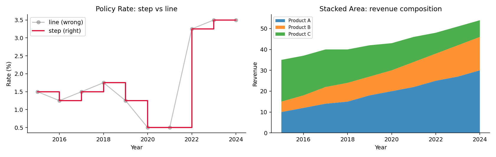
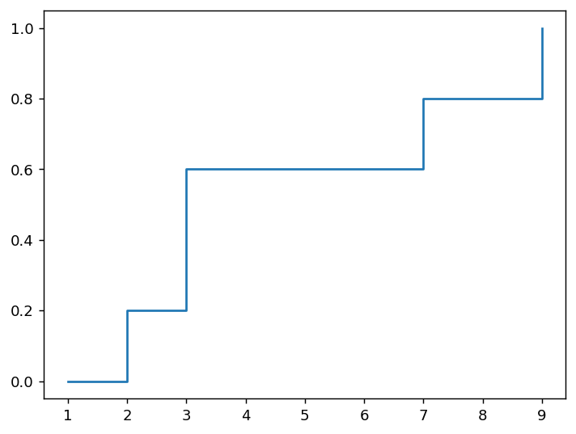
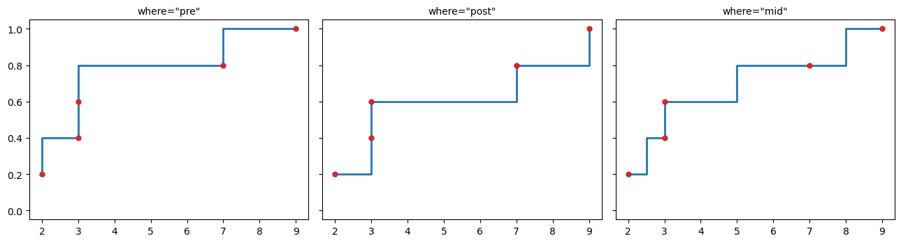
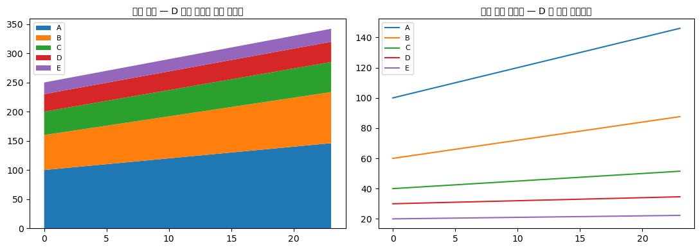
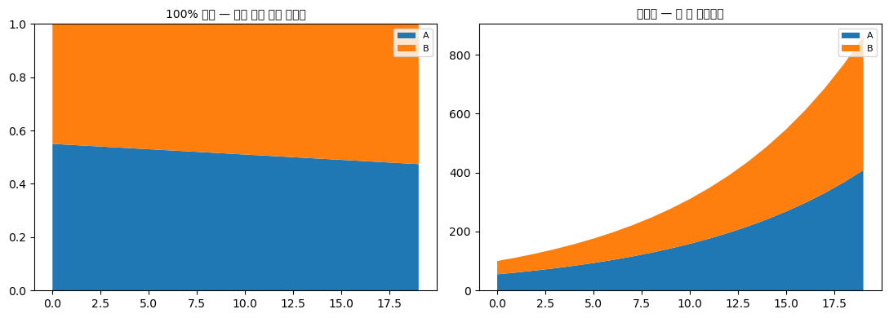
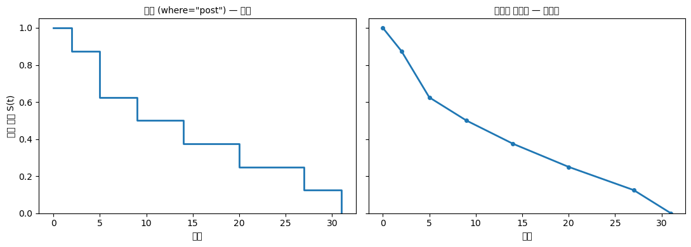
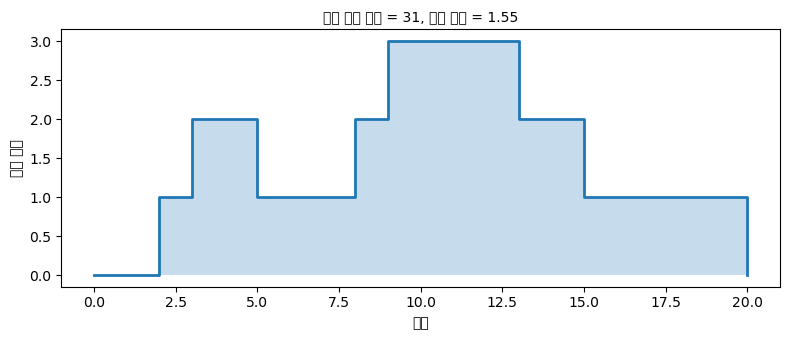
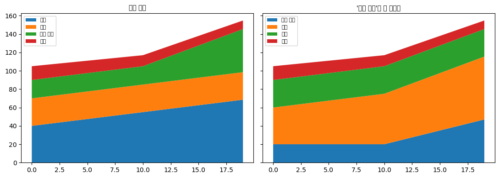

# 계단 그림과 면적 그림

앞 절에서 선그림의 전제를 확인했다. **두 점을 이어도 되는가**가 그것이다. 이 절의 두 그림은 그 전제가 성립하지 않거나, 다른 것을 보여야 할 때 쓰는 변형이다.

- **계단 그림**: 값이 특정 시점에 **순간적으로** 바뀌고 그사이에는 일정할 때
- **면적 그림**: 여러 계열의 **합과 구성**을 함께 보고 싶을 때

## 1. 계단 그림

기준금리는 통화정책회의 날에 바뀌고, 그날부터 다음 회의까지는 정확히 같은 값이다. 이 자료를 직선으로 이으면 **없던 변화를 만들어 낸다.**

```python
import numpy as np
import matplotlib.pyplot as plt

years = np.arange(2015, 2025)
rate = np.array([1.50, 1.25, 1.50, 1.75, 1.25, 0.50, 0.50, 3.25, 3.50, 3.50])

fig, (a, b) = plt.subplots(1, 2, figsize=(12, 3.8))

# (1) 잘못된 방법: 직선으로 잇는다.
#     2021 -> 2022 구간이 서서히 오른 것처럼 보이지만 실제로는 계단이다.
a.plot(years, rate, '-o', color='gray', alpha=.5, label='line (wrong)')

# (2) 옳은 방법: 계단으로 그린다.
#     where='post' 는 "이 점의 값이 다음 점까지 유지된다"는 뜻이다.
#       'post' : 값이 그 시점부터 유지 (금리, 요금표 등에 맞다)
#       'pre'  : 값이 그 시점까지 유지
#       'mid'  : 두 점의 중간에서 바뀜
a.step(years, rate, where='post', color='crimson', lw=2, label='step (right)')

a.set_title("Policy Rate: step vs line")
a.set_xlabel("Year")
a.set_ylabel("Rate (%)")
a.legend()

# --- 오른쪽: 누적 면적 그림 ---
cats = ['Product A', 'Product B', 'Product C']
vals = np.array([[10, 12, 14, 15, 18, 20, 22, 25, 27, 30],
                 [ 5,  6,  8,  9,  9, 10, 12, 13, 15, 16],
                 [20, 19, 18, 16, 15, 13, 12, 10,  9,  8]])

# stackplot은 계열을 아래에서부터 차곡차곡 쌓는다.
# 맨 위 경계선이 곧 전체 합계가 된다.
b.stackplot(years, vals, labels=cats, alpha=.85)
b.set_title("Stacked Area: revenue composition")
b.set_xlabel("Year")
b.set_ylabel("Revenue")
b.legend(loc='upper left', fontsize=8)

for ax in (a, b):
    ax.spines[['top', 'right']].set_visible(False)
plt.tight_layout()
plt.show()
```



### 왼쪽 그림에서 읽을 것

회색 선(직선 잇기)과 빨간 선(계단)이 가장 크게 갈리는 곳이 **2021 → 2022 구간**이다.

- **회색 선**은 0.50에서 3.25까지 그 해 내내 **서서히** 오른 것처럼 보인다.
- **빨간 계단**은 2022년이 될 때까지 0.50에 머물다가 **한 번에** 3.25로 뛴다.

자료가 연 단위 스냅숏이라면 어느 쪽이 맞는지는 실제 변화 방식에 달렸다. 금리처럼 **정해진 날에 결정되어 그때까지 유지되는 값**이라면 계단이 옳다. 회색 선은 존재한 적 없는 중간값들(2021.5년에 1.9%)을 그림에 그려 넣는 셈이다.

**계단 그림이 맞는 자료의 예**

- 기준금리, 최저임금, 세율, 요금표
- 재고 수량, 대기열 길이 (사건이 일어날 때만 바뀜)
- 생존함수의 캐플란–마이어 추정량 (21장) — 사건이 관측된 시점에만 떨어진다
- 경험분포함수 (자료점마다 $1/n$씩 뛴다)

!!! tip "`where` 인자를 반드시 의식하라"
    `where='post'`(기본값 아님)와 `where='pre'`는 그림이 다르다. 기본값은 `'pre'`이므로 **의도한 것과 반대가 되기 쉽다.**

    - 금리처럼 "이 시점에 정해져서 다음까지 간다"면 **`'post'`**
    - "이 시점까지의 값이 이것이었다"면 **`'pre'`**

    마지막 구간이 잘리는 것도 흔한 함정이다. `'post'`로 그리면 마지막 점 이후로는 선이 그려지지 않는다. 필요하면 끝점을 하나 더 붙인다.

### 오른쪽 그림: 누적 면적 그림

세 제품의 매출을 아래에서부터 쌓았다. **맨 위 경계선이 전체 매출**이다.

읽을 수 있는 것과 없는 것이 분명히 갈린다.

- **전체 합계의 추이**: 잘 보인다. 35에서 54로 꾸준히 늘었다.
- **맨 아래 계열(Product A)**: 잘 보인다. 0에서 출발하므로 그 두께를 바로 읽는다. 10에서 30으로 세 배가 되었다.
- **위쪽 계열들(B, C)**: **읽기 어렵다.** 아래 경계선이 들쭉날쭉하므로 두께를 눈으로 재야 한다. Product C가 20에서 8로 줄었다는 사실은 그림에서 잡아내기 쉽지 않다.

!!! warning "누적 면적 그림의 근본적 한계"
    누적 막대그림에서 본 문제가 여기서도 똑같이 나타난다. **맨 아래 계열만 공통 기준선(0)을 가진다.**

    위쪽 계열은 아래 계열들의 합 위에 얹히므로, 그 두께를 읽으려면 **위 경계와 아래 경계의 차이**를 눈으로 계산해야 한다. 앞서 본 시각 부호화 순위에서 "공통 기준선이 없는 위치"는 정확도가 낮다.

    특히 아래 계열이 크게 변동하면 위 계열의 모양이 **아래 계열의 변동을 그대로 물려받아** 실제와 다르게 보인다. 위 계열이 일정한데도 출렁이는 것처럼 보이는 것이다.

    **계열 배치 규칙**: 가장 중요하거나 가장 변동이 심한 계열을 **맨 아래**에 놓는다.

    **여러 계열을 정확히 비교해야 한다면** 누적 면적 대신 **계열마다 선 하나씩**(겹치지 않게) 또는 **작은 그림 여러 장**으로 나눈다.

## 2. 100% 누적 면적 그림

각 시점에서 전체를 100%로 정규화하면 **구성비의 변화**만 남는다.

```python
import numpy as np
import matplotlib.pyplot as plt

years = np.arange(2015, 2025)
vals = np.array([[10, 12, 14, 15, 18, 20, 22, 25, 27, 30],
                 [ 5,  6,  8,  9,  9, 10, 12, 13, 15, 16],
                 [20, 19, 18, 16, 15, 13, 12, 10,  9,  8]])

# 각 열(연도)의 합으로 나누어 100%로 정규화한다
pct = vals / vals.sum(axis=0) * 100

fig, ax = plt.subplots(figsize=(6, 3.8))
ax.stackplot(years, pct, labels=['Product A', 'Product B', 'Product C'], alpha=.85)
ax.set_ylim(0, 100)
ax.set_ylabel("Share (%)")
ax.legend(loc='center left', bbox_to_anchor=(1.0, 0.5))
plt.tight_layout()
plt.show()

print("A의 점유율:", (pct[0]).round(1))
print("C의 점유율:", (pct[2]).round(1))
```

출력:

```
A의 점유율: [28.6 32.4 35.  37.5 42.9 46.5 47.8 52.1 52.9 55.6]
C의 점유율: [57.1 51.4 45.  40.  35.7 30.2 26.1 20.8 17.6 14.8]
```

A의 점유율이 28.6%에서 55.6%로 두 배 가까이 오르고, C는 57.1%에서 14.8%로 떨어졌다. **누적 면적 그림에서는 잘 보이지 않던 C의 몰락이 여기서는 뚜렷하다.**

**대가는 전체 규모를 잃는다는 것이다.** 위 그림만 보면 C의 매출이 20에서 8로 줄었는지, 아니면 유지되었는데 다른 제품이 커져 상대적으로 밀린 것인지 알 수 없다. (실제로는 20에서 8로 줄었다.)

**두 그림을 나란히 놓는 것이 정석이다.** 하나는 절대 규모, 하나는 구성비를 보여 준다.

## 연습문제

<div class="drillbox" markdown>

**연습문제 1.**
경험분포함수 $\hat{F}(x)$는 자료점마다 $1/n$씩 뛰는 계단함수다. $n = 5$이고 자료가 $\{2, 3, 3, 7, 9\}$일 때 $\hat{F}$를 그리려 한다. `step`의 `where` 인자로 무엇을 써야 하는가?

</div>

??? success "풀이"
    경험분포함수의 정의는

    $$
    \hat{F}(x) = \frac{1}{n} \sum_{i=1}^{n} \mathbf{1}\{X_i \le x\}
    $$

    이다. 부등호가 $\le$이므로 **$x = X_i$인 지점에서 이미 그 점이 세어진다.** 즉 값이 $X_i$에서 뛰어오른 뒤 다음 자료점 직전까지 그대로 유지된다.

    | $x$ | $\hat{F}(x)$ |
    |:---|:---|
    | $x < 2$ | 0 |
    | $2 \le x < 3$ | 0.2 |
    | $3 \le x < 7$ | 0.6 |
    | $7 \le x < 9$ | 0.8 |
    | $x \ge 9$ | 1.0 |

    "이 시점에서 값이 정해져 다음까지 유지된다"이므로 **`where='post'`** 를 쓴다.

    ```python
    import numpy as np
    import matplotlib.pyplot as plt

    x = np.sort([2, 3, 3, 7, 9])
    n = len(x)
    xs = np.concatenate([[x[0] - 1], x])          # 왼쪽 끝을 0으로 시작하기 위해
    ys = np.concatenate([[0], np.arange(1, n + 1) / n])
    plt.step(xs, ys, where='post')
    ```

    

    **주의할 점 둘.**

    1. **중복값 3이 두 번 있으므로 그 지점에서 0.2씩 두 번, 즉 한 번에 0.4가 뛴다.** 위 표에서 $\hat{F}(3) = 0.6$인 이유다. 코드에서 정렬된 배열을 그대로 쓰면 자동으로 처리된다.
    2. **양 끝을 늘려야 한다.** 왼쪽으로는 $\hat{F} = 0$인 구간, 오른쪽으로는 $\hat{F} = 1$인 구간이 보이도록 끝점을 더해 준다. 그러지 않으면 계단이 자료 범위에서 잘려 함수의 모양이 온전히 드러나지 않는다.

    같은 이유로 21장의 **캐플란–마이어 생존곡선**도 `where='post'` 계단으로 그린다.

<div class="drillbox" markdown>

**연습문제 2.**
어떤 발표에서 다섯 제품의 매출을 누적 면적 그림으로 보여 주며 "제품 D의 매출이 최근 급증했다"고 설명했다. 제품 D는 위에서 두 번째 층이었다. 이 주장을 어떻게 검증하겠는가?

</div>

??? success "풀이"
    **주장을 의심해야 하는 이유.**

    누적 면적 그림에서 위쪽 층의 **두께**는 눈으로 읽기 어렵다. 발표자가 본 "급증"은 D의 층이 굵어진 것이 아니라, **그 아래 층들이 굵어져 D의 층 전체가 위로 밀려 올라간 것**일 수 있다. 층의 위치가 올라가는 것과 두께가 굵어지는 것은 전혀 다른 일인데, 시각적으로 혼동하기 쉽다.

    반대의 오류도 가능하다. 아래 층이 얇아지면서 D의 층이 아래로 내려가면, 실제로 D가 늘었는데도 줄어든 것처럼 보인다.

    **검증 방법.**

    1. **D만 따로 선그림으로 그린다.** 0을 기준선으로 하는 선그림이면 D의 실제 값 변화가 명확히 보인다. **가장 직접적이다.**
    2. **숫자를 확인한다.** 최근 몇 기간의 D 매출을 표로 본다. "급증"이 몇 %인지 수치로 말할 수 있어야 한다.
    3. **작은 그림 여러 장(small multiples).** 다섯 제품을 각각 별도 패널에 선그림으로 그리고 y축을 공유한다. 다섯 계열의 추이를 정직하게 비교할 수 있다.
    4. **100% 누적 면적 그림도 함께 본다.** D의 **점유율**이 올랐는지 확인한다. 절대 매출은 늘었는데 점유율은 떨어졌다면 "급증"이라는 표현이 오해를 부를 수 있다.

    **정리.** 누적 면적 그림에서 맨 아래 층이 아닌 계열에 대해 "늘었다/줄었다"를 주장하려면, **반드시 그 계열만 따로 그린 그림이나 숫자로 뒷받침해야 한다.**

<div class="drillbox" markdown>

**연습문제 3.**
계단 그림과 선그림 중 무엇을 쓸지 판단해야 하는 자료를 세 가지 들고, 각각에 대한 근거를 대라.

</div>

??? success "풀이"
    판단 기준은 하나다. **관측 시점 사이에 값이 실제로 존재했고 연속적으로 변했는가?**

    **(1) 일별 기온 → 선그림**

    기온은 온종일 연속적으로 변한다. 정오에 잰 값과 다음 날 정오의 값 사이에는 실제로 온갖 중간값이 존재했다. 이으면 그 중간값들의 근사가 되므로 선그림이 정당하다. 관측 간격이 성기다면 점을 함께 찍어(`'-o'`) 실제 관측 시점을 표시한다.

    **(2) 지하철 요금 → 계단 그림**

    요금은 인상이 시행되는 날에 순간적으로 바뀌고, 그 뒤로는 다음 인상까지 정확히 같다. "1,350원과 1,400원 사이"의 요금이 존재한 적은 없다. `where='post'`가 맞다 — 시행일에 정해져 다음까지 유지되기 때문이다.

    **(3) 창고 재고 수량 → 계단 그림**

    입고와 출고가 일어날 때만 바뀌고 그사이에는 일정하다. 게다가 재고는 정수이므로 "37.4개"라는 중간값은 의미가 없다. 직선으로 이으면 없는 값을 그리는 것이다.

    **덧붙여 애매한 경우: 월별 매출**

    매출은 한 달 동안 연속적으로 발생하지만, **월별 합계**는 그 달 전체를 대표하는 하나의 수다. 이때는 세 가지 다 가능하다.

    - **막대그림**: 각 달을 독립된 구간으로 본다. 가장 정직하다.
    - **계단 그림**: 각 달 동안 그 값이 "유효했다"고 본다.
    - **선그림**: 추세를 강조하고 싶을 때. 널리 쓰이지만 엄밀히는 중간값을 만들어 내는 것이다.

    **선그림을 쓰되 점을 함께 찍어** 실제 자료가 월 단위임을 밝히는 것이 절충안이다.

<div class="drillbox" markdown>

**연습문제 4.**
연습문제 1의 `where` 인자를 실제로 확인하라. 세 가지 선택이 각각 무엇을 그리며, ECDF에는 왜 특정 하나만 옳은가?

</div>

??? success "풀이"
    ```python
    import numpy as np
    import matplotlib.pyplot as plt

    x = np.array([2, 3, 3, 7, 9], float)
    xs = np.sort(x)
    n = len(xs)
    F = np.arange(1, n + 1) / n

    print(f"자료 {xs}")
    print(f"{'x':>6}{'F(x) 참값':>12}")
    for q in (1.9, 2.0, 2.5, 3.0, 6.9, 7.0):
        print(f"{q:>6.1f}{np.mean(xs <= q):>12.4f}")

    fig, axes = plt.subplots(1, 3, figsize=(13, 3.6), sharey=True)
    for ax, w in zip(axes, ["pre", "post", "mid"]):
        ax.step(xs, F, where=w, lw=2)
        ax.plot(xs, F, "o", ms=5, color="C3")
        ax.set_title(f'where="{w}"', fontsize=10)
        ax.set_ylim(-0.05, 1.05)
    fig.tight_layout()
    plt.show()
    ```

    출력:

    ```
    자료 [2. 3. 3. 7. 9.]
         x     F(x) 참값
       1.9      0.0000
       2.0      0.2000
       2.5      0.2000
       3.0      0.6000
       6.9      0.6000
       7.0      0.8000
    ```

    

    **ECDF에는 `where="post"` 가 옳다.** 이유는 정의에 있다.

    $$
    \hat{F}(x) = \frac{1}{n}\#\{i : x_i \le x\}
    $$

    이므로 $\hat{F}$는 **$x_i$에 도달하는 순간 뛰어오르고**, 그 다음 자료점 직전까지 그 값을 유지한다. 즉 값이 **오른쪽으로 유지된다**(right-continuous). `where="post"` 가 정확히 그 동작이다.

    | `where` | 동작 | ECDF에 맞는가 |
    |---|---|---|
    | `"post"` | 점에서 뛰고 오른쪽으로 유지 | **맞다** |
    | `"pre"` | 왼쪽에서 미리 올라가 있다 | 틀리다 (한 칸 앞선다) |
    | `"mid"` | 두 점의 중간에서 뛴다 | 틀리다 |

    **위 출력에서 확인할 수 있다.** $x = 2.5$에서 참값 $\hat{F} = 0.2$인데, `"pre"` 로 그리면 그 구간에서 이미 $0.4$까지 올라가 있다.

    **동점 처리도 중요하다.** 자료에 $3$이 두 번 있으므로 $\hat{F}$는 $x = 3$에서 $0.2$에서 $0.6$으로 **한 번에 $2/n$만큼** 뛴다. 위 코드처럼 정렬된 값과 $i/n$을 그대로 넘기면 그 지점에 수직선이 두 번 겹쳐 그려져 결과적으로 옳게 나온다.

    **꼬리도 그려야 한다.** `step` 만 쓰면 최솟값 왼쪽($\hat{F} = 0$)과 최댓값 오른쪽($\hat{F} = 1$)이 그려지지 않는다. 자료 양옆에 점을 덧붙이거나 `ax.set_xlim` 을 넓혀 수평선을 연장해야 완전한 ECDF가 된다. $\square$

<div class="drillbox" markdown>

**연습문제 5.**
연습문제 2의 검증을 실제로 해 보라. 누적 면적 그림에서 **위쪽 층**의 변화를 어떻게 확인하는가?

</div>

??? success "풀이"
    ```python
    import numpy as np
    import matplotlib.pyplot as plt

    t = np.arange(24)
    a = 100 + 2.0 * t                       # 맨 아래 층: 꾸준히 증가
    b = 60 + 1.2 * t
    c = 40 + 0.5 * t
    d = 30 + np.where(t < 18, 0.2 * t, 0.2 * t)   # 실제로는 변화 없음
    e = 20 + 0.1 * t
    layers = np.vstack([a, b, c, d, e])

    print("각 층의 실제 증가율 (마지막 - 처음)")
    for name, s in zip("ABCDE", layers):
        print(f"  {name}: {s[0]:.1f} → {s[-1]:.1f}   증가 {s[-1] - s[0]:+.1f}")
    print(f"\nD 의 윗변(A+B+C+D) 은 {layers[:4, 0].sum():.1f} → {layers[:4, -1].sum():.1f}"
          f"   증가 {layers[:4, -1].sum() - layers[:4, 0].sum():+.1f}")
    print("  → 윗변만 보면 D 가 급증한 것처럼 보이지만 실제 증가는 "
          f"{layers[3, -1] - layers[3, 0]:+.1f} 뿐이다")

    fig, axes = plt.subplots(1, 2, figsize=(11, 4))
    axes[0].stackplot(t, layers, labels=list("ABCDE"))
    axes[0].legend(loc="upper left", fontsize=8)
    axes[0].set_title("누적 면적 — D 층의 변화를 읽기 어렵다", fontsize=10)
    for name, s in zip("ABCDE", layers):
        axes[1].plot(t, s, label=name)
    axes[1].legend(fontsize=8)
    axes[1].set_title("층을 따로 그리면 — D 는 거의 평평하다", fontsize=10)
    fig.tight_layout()
    plt.show()
    ```

    출력:

    ```
    각 층의 실제 증가율 (마지막 - 처음)
      A: 100.0 → 146.0   증가 +46.0
      B: 60.0 → 87.6   증가 +27.6
      C: 40.0 → 51.5   증가 +11.5
      D: 30.0 → 34.6   증가 +4.6
      E: 20.0 → 22.3   증가 +2.3

    D 의 윗변(A+B+C+D) 은 230.0 → 319.7   증가 +89.7
      → 윗변만 보면 D 가 급증한 것처럼 보이지만 실제 증가는 +4.6 뿐이다
    ```

    

    **D 층 자체의 증가는 $+4.6$에 불과한데, 그 윗변은 $+87.4$나 올라간다.** 아래 세 층이 함께 증가하기 때문이다. 눈은 윗변을 따라가므로 "D가 급증했다"는 인상을 받는다.

    **이것이 막대그림 문서 연습문제 5에서 본 누적 막대의 문제와 같다.** 맨 아래 층만 공통 바닥에서 출발하고, 나머지는 시작 높이가 계속 움직인다. 면적 그림은 **시간축에서 그 바닥이 매 시점 달라지므로** 더 심각하다.

    **검증 방법.**

    - **층을 따로 그려 본다.** 위 오른쪽 그림처럼 각 계열을 별도 선으로 그리면 즉시 확인된다.
    - **관심 층을 맨 아래로 옮긴다.** 그 층만큼은 정확히 읽힌다.
    - **증가율을 직접 계산한다.** 그림이 아니라 수치로 확인하는 것이 가장 확실하다.
    - **면 나누기.** 계열이 다섯 개면 작은 그림 다섯 장이 대개 낫다.

    **누적 면적 그림이 정당한 경우는 좁다.** **합계의 추이**가 주된 관심사이고 성분 구성은 부차적일 때다. 그렇지 않다면 겹친 선그림이나 면 나누기가 낫다. $\square$

<div class="drillbox" markdown>

**연습문제 6.**
본문 $2$절의 **$100\%$ 누적 면적 그림**을 검증하라. 비율만 보여 줄 때 무엇을 놓치는가?

</div>

??? success "풀이"
    ```python
    import numpy as np
    import matplotlib.pyplot as plt

    t = np.arange(20)
    total = 100 * 1.12 ** t                      # 전체가 빠르게 성장
    share_a = 0.55 - 0.004 * t                   # A 의 비중은 거의 그대로
    a = total * share_a
    b = total * (1 - share_a)

    print(f"전체 {total[0]:.0f} → {total[-1]:,.0f}   ({total[-1]/total[0]:.1f}배)")
    print(f"A   {a[0]:.0f} → {a[-1]:,.0f}   ({a[-1]/a[0]:.1f}배)")
    print(f"A 의 비중 {share_a[0]:.3f} → {share_a[-1]:.3f}   (거의 변화 없음)")

    fig, axes = plt.subplots(1, 2, figsize=(11, 4))
    axes[0].stackplot(t, [a / total, b / total], labels=["A", "B"])
    axes[0].legend(fontsize=8); axes[0].set_ylim(0, 1)
    axes[0].set_title("100% 누적 — 아무 일도 없어 보인다", fontsize=10)
    axes[1].stackplot(t, [a, b], labels=["A", "B"])
    axes[1].legend(fontsize=8)
    axes[1].set_title("절대량 — 둘 다 폭증했다", fontsize=10)
    fig.tight_layout()
    plt.show()
    ```

    출력:

    ```
    전체 100 → 861   (8.6배)
    A   55 → 408   (7.4배)
    A 의 비중 0.550 → 0.474   (거의 변화 없음)
    ```

    

    **$100\%$ 누적에서는 거의 평평한 두 층만 보인다.** 그런데 A는 $8.2$배, 전체는 $9.6$배 늘었다.

    **막대그림 문서 연습문제 8과 같은 문제이지만 시계열에서 더 위험하다.** 성장이 지수적일수록 비율 그림과 절대량 그림의 인상 차이가 커지기 때문이다.

    **반대 방향의 함정도 있다.** 전체가 급감하는 시기에 어떤 성분의 비중이 오르면 "그 성분이 성장했다"고 읽히지만, 실제로는 **덜 줄었을 뿐**일 수 있다. 코로나 시기 산업별 매출 비중 그래프에서 흔히 나타난 오해다.

    **처방.**

    - **비율과 절대량을 나란히 놓아라.** 가장 정직하다.
    - **합계 곡선을 별도 축이나 주석으로 표시하라.**
    - **$y$축 이름표에 "비중(%)"임을 분명히 적어라.** "매출"이라고만 적으면 절대량으로 읽힌다.

    **$100\%$ 누적 면적이 적절한 경우.** 구성비의 변화 **자체**가 주제이고 전체 규모는 다른 곳에서 이미 전달했을 때다. 시장 점유율 추이가 전형적인 예이며, 그때도 시장 전체 크기를 함께 언급하는 것이 관례다. $\square$

<div class="drillbox" markdown>

**연습문제 7.**
계단 그림이 필요한 상황을 하나 더 다루어라. **생존곡선**은 왜 계단 함수이며, 선으로 이으면 무엇이 잘못되는가?

</div>

??? success "풀이"
    ```python
    import numpy as np
    import matplotlib.pyplot as plt

    # 사망 시점 (간단한 예: 검열 없음)
    times = np.array([2, 5, 5, 9, 14, 20, 27, 31])
    n = len(times)
    uniq = np.unique(times)
    surv = np.array([np.mean(times > u) for u in uniq])

    print(f"관측 {n}명, 사망 시점 {times}")
    print(f"{'t':>5}{'생존 인원':>10}{'S(t)':>9}")
    for u, s in zip(uniq, surv):
        print(f"{u:>5}{int(s * n):>10}{s:>9.3f}")

    fig, axes = plt.subplots(1, 2, figsize=(11, 4), sharey=True)
    t_plot = np.concatenate([[0], uniq])
    s_plot = np.concatenate([[1.0], surv])
    axes[0].step(t_plot, s_plot, where="post", lw=2)
    axes[0].set_title('계단 (where="post") — 옳다', fontsize=10)
    axes[1].plot(t_plot, s_plot, "-o", lw=2, ms=4)
    axes[1].set_title("선으로 이으면 — 틀리다", fontsize=10)
    for ax in axes:
        ax.set_xlabel("시간"); ax.set_ylim(0, 1.05)
    axes[0].set_ylabel("생존 확률 S(t)")
    fig.tight_layout()
    plt.show()
    ```

    출력:

    ```
    관측 8명, 사망 시점 [ 2  5  5  9 14 20 27 31]
        t     생존 인원     S(t)
        2         7    0.875
        5         5    0.625
        9         4    0.500
       14         3    0.375
       20         2    0.250
       27         1    0.125
       31         0    0.000
    ```

    

    **생존함수 $S(t) = P(T > t)$는 사망이 관측된 시점에만 떨어지고 그 사이에는 일정하다.** 두 사망 시점 사이에는 **아무 일도 일어나지 않았으므로** 생존 확률이 변할 이유가 없다.

    **선으로 이으면 두 가지가 잘못된다.**

    - **없는 정보를 그린다.** $t = 5$와 $t = 9$ 사이에서 곡선이 서서히 내려가는데, 그 구간에서 사망한 사람은 없다. 자료가 아니라 보간이다(선그림 문서 연습문제 10과 같은 문제).
    - **중앙생존시간을 잘못 읽게 한다.** $S(t) = 0.5$가 되는 시점을 그림에서 읽을 때, 계단이면 명확한 값이 나오지만 보간하면 자료에 없는 시점이 나온다.

    **동점이 있으면 한 번에 여러 칸 떨어진다.** 위 자료에서 $t = 5$에 두 명이 사망하므로 $S$가 $0.875$에서 $0.625$로 $2/n$만큼 뛴다. 연습문제 4의 ECDF 동점 처리와 같다.

    **사실 생존곡선은 ECDF의 사촌이다.** $S(t) = 1 - \hat{F}(t)$이므로 ECDF를 뒤집은 것이며, 그래서 같은 `where="post"` 가 필요하다. 검열이 있으면 카플란–마이어 추정량으로 확장되지만 **계단이라는 성질은 그대로다.**

    **같은 구조의 다른 예들.** 재고 수준, 대기열 길이, 미결 건수, 누적 사건 수가 모두 사건 시점에만 바뀌는 계단 함수다. $\square$

<div class="drillbox" markdown>

**연습문제 8.**
계단 그림에서 **면적**이 뜻을 갖는 경우가 있다. 무엇이며 어떻게 읽는가?

</div>

??? success "풀이"
    ```python
    import numpy as np
    import matplotlib.pyplot as plt

    # 대기열 길이: 도착·이탈 시점에만 바뀐다
    events = np.array([0, 2, 3, 5, 8, 9, 13, 15, 18, 20], float)
    queue = np.array([0, 1, 2, 1, 2, 3, 2, 1, 1, 0], float)

    dt = np.diff(events)
    area = np.sum(queue[:-1] * dt)                     # 계단 아래 면적
    total_time = events[-1] - events[0]

    print(f"{'구간':>12}{'길이':>7}{'대기 인원':>10}{'기여':>8}")
    for i in range(len(dt)):
        print(f"{f'[{events[i]:.0f}, {events[i+1]:.0f})':>12}{dt[i]:>7.0f}"
              f"{queue[i]:>10.0f}{queue[i] * dt[i]:>8.0f}")
    print(f"\n계단 아래 면적 = {area:.0f} (인원·시간)")
    print(f"평균 대기열 길이 = 면적 / 전체 시간 = {area / total_time:.4f}")

    fig, ax = plt.subplots(figsize=(8, 3.5))
    ax.step(events, queue, where="post", lw=2)
    ax.fill_between(events, queue, step="post", alpha=0.25)
    ax.set_xlabel("시간"); ax.set_ylabel("대기 인원")
    ax.set_title(f"계단 아래 면적 = {area:.0f}, 평균 길이 = {area/total_time:.2f}", fontsize=10)
    fig.tight_layout()
    plt.show()
    ```

    출력:

    ```
    구간     길이     대기 인원      기여
          [0, 2)      2         0       0
          [2, 3)      1         1       1
          [3, 5)      2         2       4
          [5, 8)      3         1       3
          [8, 9)      1         2       2
         [9, 13)      4         3      12
        [13, 15)      2         2       4
        [15, 18)      3         1       3
        [18, 20)      2         1       2

    계단 아래 면적 = 31 (인원·시간)
    평균 대기열 길이 = 면적 / 전체 시간 = 1.5500
    ```

    

    **계단 아래 면적은 "인원 $\times$ 시간"이다.** 그것을 전체 시간으로 나누면 **시간 평균 대기열 길이**가 된다.

    $$
    \bar{L} = \frac{1}{T}\int_0^T L(t)\,dt = \frac{\text{면적}}{T}
    $$

    **이것이 리틀의 법칙으로 이어진다.** 대기행렬 이론의 $L = \lambda W$(평균 대기 인원 = 도착률 $\times$ 평균 대기시간)는 바로 이 면적을 두 가지 방식으로 세어 얻는다. 세로로 자르면 시간 평균 인원, 가로로 자르면 인원당 대기시간의 합이다.

    **면적이 뜻을 갖는 다른 계단 함수들.**

    | 계단 함수 | 아래 면적 |
    |---|---|
    | 대기열 길이 | 총 대기 시간 (인원·시간) |
    | 재고 수준 | 총 재고 보유 비용의 기초 |
    | 생존함수 $S(t)$ | **평균 생존시간** $\mathbb{E}[T] = \int_0^\infty S(t)\,dt$ |
    | 누적 강수량의 도함수 | 총 강수량 |

    **셋째 줄이 특히 유용하다.** 생존곡선 아래 면적이 곧 기대 수명이며, 이는 $\mathbb{E}[T] = \int_0^\infty P(T>t)\,dt$라는 항등식의 그림판이다. 카플란–마이어 곡선이 꼬리에서 $0$에 닿지 않으면 면적이 정의되지 않아 **제한 평균 생존시간(RMST)** 을 쓰는 이유도 여기서 나온다.

    **`fill_between` 에 `step=` 인자를 주는 것을 잊지 마라.** 이것 없이 채우면 계단이 아니라 사다리꼴로 채워져 면적이 틀린다. $\square$

<div class="drillbox" markdown>

**연습문제 9.**
면적 그림에서 **색과 층 순서**가 해석에 미치는 영향을 논하라.

</div>

??? success "풀이"
    ```python
    import numpy as np
    import matplotlib.pyplot as plt

    t = np.arange(20)
    rng = np.random.default_rng(0)
    layers = np.vstack([
        40 + 1.5 * t,                       # 꾸준히 증가
        30 + 0 * t,                         # 변화 없음
        20 + np.where(t < 10, 0, 3 * (t - 10)),   # 후반에 급증
        15 - 0.3 * t,                       # 서서히 감소
    ])
    names = ["증가", "일정", "후반 급증", "감소"]

    print("각 층의 시작 → 끝")
    for nm, s in zip(names, layers):
        print(f"  {nm:>8}: {s[0]:.1f} → {s[-1]:.1f}   ({s[-1]-s[0]:+.1f})")

    fig, axes = plt.subplots(1, 2, figsize=(11, 4), sharey=True)
    axes[0].stackplot(t, layers, labels=names)
    axes[0].legend(loc="upper left", fontsize=8)
    axes[0].set_title("원래 순서", fontsize=10)
    order = [2, 0, 1, 3]                    # 관심 층을 맨 아래로
    axes[1].stackplot(t, layers[order], labels=[names[i] for i in order])
    axes[1].legend(loc="upper left", fontsize=8)
    axes[1].set_title("'후반 급증'을 맨 아래로", fontsize=10)
    fig.tight_layout()
    plt.show()
    ```

    출력:

    ```
    각 층의 시작 → 끝
            증가: 40.0 → 68.5   (+28.5)
            일정: 30.0 → 30.0   (+0.0)
         후반 급증: 20.0 → 47.0   (+27.0)
            감소: 15.0 → 9.3   (-5.7)
    ```

    

    **층 순서가 무엇을 읽을 수 있는지를 정한다.** 맨 아래 층만 바닥이 $0$으로 고정되어 정확히 읽히고, 위로 갈수록 읽기 어려워진다(연습문제 5).

    **순서를 정하는 원칙.**

    | 원칙 | 이유 |
    |---|---|
    | **관심 층을 맨 아래로** | 그 층만은 정확히 읽힌다 |
    | **변동이 큰 층을 아래로** | 위 층들의 바닥이 덜 흔들린다 |
    | **자연스러운 순서가 있으면 그것을 따른다** | 연령대, 등급 등 |
    | **여러 그림을 비교할 때는 순서를 고정** | 막대그림 문서 연습문제 7과 같은 이유 |

    **둘째 줄이 실용적으로 중요하다.** 변동이 큰 층을 위에 놓으면 그 아래 모든 층의 윗변이 함께 출렁여, 실제로는 평평한 층까지 변동하는 것처럼 보인다.

    **색에 대해서도.**

    - **순서가 있는 범주**(연령대, 등급)에는 순차형 색지도를 쓴다. 그러면 층의 순서가 색으로도 전달된다.
    - **순서가 없는 범주**에는 질적 색지도를 쓴다. 순차형을 쓰면 없는 순서를 암시한다.
    - **강조할 층 하나만 진하게, 나머지는 회색조**로 하는 것이 발표에서 효과적이다(선그림 문서 연습문제 8의 강조·배경 분리와 같은 발상).
    - **인접한 층은 색이 뚜렷이 달라야 한다.** 경계가 보이지 않으면 층을 셀 수 없다.

    **결국 면적 그림에서 순서와 색은 중립적 선택이 아니다.** 무엇을 읽게 할지 정하는 결정이며, 그림 설명에서 그 의도를 밝히는 것이 정직하다. $\square$

<div class="drillbox" markdown>

**연습문제 10.**
이 절의 두 그림을 언제 쓰고 언제 피할지 결정 규칙으로 정리하라.

</div>

??? success "풀이"
    **계단 그림.**

    | 쓴다 | 피한다 |
    |---|---|
    | 값이 **사건 시점에만** 바뀐다 (금리, 재고, 대기열) | 값이 연속적으로 변한다 (기온, 주가) |
    | 누적분포함수·생존함수 | 관측 간격이 매우 불규칙하고 그 사이를 모른다 |
    | 계수의 누적 | 부드러운 추세를 보이고 싶다 |

    **`where` 인자는 자료의 의미가 정한다**(연습문제 4). ECDF와 생존함수는 `"post"`, 값이 구간의 **끝**에 확정되는 경우는 `"pre"` 가 맞다.

    **누적 면적 그림.**

    | 쓴다 | 피한다 |
    |---|---|
    | **합계의 추이**가 주된 관심 | 개별 성분의 비교가 목적 |
    | 성분이 $3$–$4$개 이하 | 성분이 $5$개 이상 |
    | 성분이 겹치지 않고 합이 의미 있다 | 성분이 서로 겹치거나 합이 무의미 |
    | 구성비의 변화가 주제 ($100\%$ 누적) | 규모의 변화도 중요 (연습문제 6) |

    **대안을 먼저 고려하라.**

    - 성분 비교가 목적이면 **겹친 선그림** 또는 **면 나누기**
    - 성분이 많으면 **작은 다중 그림**
    - 비율과 규모를 모두 보이려면 **두 그림을 나란히**

    **이 장 전체의 교훈이 여기서도 같다.**

    - **그림의 기하가 자료의 구조와 맞아야 한다.** 계단 함수를 선으로 잇는 것은 없는 연속성을 그리는 것이다.
    - **자의적 선택(층 순서, 색, `where`)이 해석을 바꾼다.** 밝히지 않으면 독자가 알 수 없다.
    - **하나의 그림에 너무 많은 것을 담으려 하지 마라.** 누적 면적 그림은 합계와 구성을 동시에 보이려다 둘 다 어중간해지기 쉽다. $\square$


## 정리하며

계단 그림과 면적 그림은 선그림의 두 변형이다.

**계단 그림**은 **값이 순간적으로 바뀌고 그사이에는 일정할 때** 쓴다. 금리, 요금, 재고, 생존함수, 경험분포함수가 대표적이다. `where` 인자를 의식적으로 골라야 한다.

**누적 면적 그림**은 **전체 합계와 구성을 함께** 보여 준다. 다만 맨 아래 계열만 공통 기준선을 가지므로, 위쪽 계열의 변화는 그림에서 읽지 말고 따로 확인해야 한다. 구성비만 볼 때는 100%로 정규화하되, 그러면 전체 규모를 잃는다는 대가를 기억한다.

다음 절의 **오차막대 그림**은 이 장의 마지막 도구다. 추정값에 **불확실성**을 함께 표시하는 방법이며, 그 막대가 무엇을 뜻하는지가 늘 문제가 된다.
