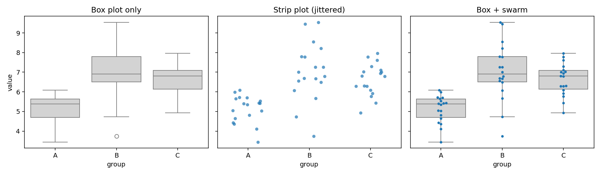

# 스트립 그림과 스웜 그림

상자그림은 다섯 개의 숫자로 분포를 요약한다. 요약은 강력하지만 **요약은 버리는 것이 있다.** 앤스컴의 4중주가 보여 준 대로, 같은 요약통계량 뒤에 전혀 다른 자료가 숨어 있을 수 있다.

**스트립 그림**과 **스웜 그림**은 원자료 점을 그대로 찍는다. 상자그림 위에 겹쳐 놓으면 요약과 원자료를 한 그림에서 볼 수 있다.

## 1. 세 가지를 나란히 놓고 본다

같은 자료를 상자그림만, 스트립 그림만, 상자+스웜으로 그려 비교한다.

```python
import numpy as np
import pandas as pd
import matplotlib.pyplot as plt
import seaborn as sns

rng = np.random.default_rng(1)

# 세 집단, 각 18개. B와 C는 평균이 비슷하지만(7.0 vs 6.9) 퍼짐이 다르다.
rows = []
for g, mu in zip(['A', 'B', 'C'], [5, 7, 6.9]):
    for v in rng.normal(mu, 1.2, 18):
        rows.append({'group': g, 'value': v})
d = pd.DataFrame(rows)

fig, axes = plt.subplots(1, 3, figsize=(13, 3.8), sharey=True)

# (1) 상자그림만: 다섯 숫자 요약
sns.boxplot(data=d, x='group', y='value', ax=axes[0], color='lightgray')
axes[0].set_title("Box plot only")

# (2) 스트립 그림: 원자료 점만. jitter가 가로로 흔들어 겹침을 푼다.
#     jitter=0.25 는 범주 폭의 ±25% 범위에서 무작위로 민다는 뜻
sns.stripplot(data=d, x='group', y='value', ax=axes[1], jitter=0.25, alpha=.7)
axes[1].set_title("Strip plot (jittered)")

# (3) 상자 + 스웜: 요약과 원자료를 겹친다.
#     showfliers=False 로 상자그림의 이상치 점을 끈다.
#     끄지 않으면 같은 점이 두 번(상자의 이상치 + 스웜의 점) 그려진다.
sns.boxplot(data=d, x='group', y='value', ax=axes[2],
            color='lightgray', showfliers=False)
sns.swarmplot(data=d, x='group', y='value', ax=axes[2], size=4)
axes[2].set_title("Box + swarm")

plt.tight_layout()
plt.show()

print("n per group:", d.groupby('group').size().to_dict())
print(d.groupby('group')['value'].agg(['mean', 'median', 'std']).round(2))
```

출력:

```
n per group: {'A': 18, 'B': 18, 'C': 18}
       mean  median   std
group
A      5.12    5.37  0.70
B      7.01    6.90  1.47
C      6.63    6.80  0.82
```



**왼쪽(상자그림만).** B가 가장 높고 A가 가장 낮다. B에 이상치 하나가 아래쪽에 있다. 여기까지가 전부다.

**가운데(스트립 그림).** 각 집단이 18개라는 것이 눈에 보인다. 상자그림에서는 알 수 없던 사실이다. B의 점들이 아래쪽 3.7부터 위쪽 9.6까지 넓게 흩어져 있고, C는 훨씬 좁게 뭉쳐 있다.

**오른쪽(상자+스웜).** 둘을 합쳤다. 상자가 중심과 사분위수를 알려 주고, 점들이 실제 분포와 표본 크기를 알려 준다.

## 2. 스트립과 스웜의 차이

둘 다 원자료를 점으로 찍는데, **겹침을 푸는 방식**이 다르다.

| | 겹침 해소 방식 | 성질 |
|:---|:---|:---|
| **스트립 그림** (`stripplot`) | 가로로 **무작위**하게 민다(지터) | 실행할 때마다 점 위치가 달라진다. 점이 많아도 그려진다. |
| **스웜 그림** (`swarmplot`) | 가로로 **결정적**으로 밀어 겹치지 않게 배치 | 실행 결과가 항상 같다. 점이 많으면 옆으로 너무 퍼지거나 경고가 난다. |

스웜 그림의 모양 자체가 정보다. **가로 폭이 그 값 근처의 밀도에 비례**하므로, 바이올린 그림과 비슷하게 분포의 모양을 보여 준다. 위 그림 오른쪽에서 C의 6~7 부근이 옆으로 가장 넓다.

!!! tip "언제 무엇을 쓰는가"
    - **$n \lesssim 30$**: 스웜 그림. 점이 겹치지 않고 예쁘게 배치되며 모양도 보인다.
    - **$n$이 30~수백**: 스트립 그림 + 투명도(`alpha`). 스웜은 옆으로 너무 퍼진다.
    - **$n$이 수백 이상**: 점 찍기를 포기하고 **바이올린 그림**이나 상자그림으로 간다. 점이 너무 많으면 원자료를 보여 준다는 이점 자체가 사라진다.

    seaborn의 `swarmplot`은 점이 많아 다 배치하지 못하면 `UserWarning`을 내고 일부를 생략한다. **경고를 무시하면 그림에 없는 점이 생긴다.** 경고가 나오면 스트립이나 바이올린으로 바꾸라는 신호로 받아들여야 한다.

## 3. 왜 점을 겹쳐 그리는가

상자그림만 그렸을 때 놓치는 것이 셋 있다.

**첫째, 표본 크기.** 상자그림은 $n = 5$든 $n = 5000$이든 똑같이 생겼다. 상자의 크기가 표본 크기를 반영하지 않는다. 점을 찍으면 개수가 그대로 보인다.

**둘째, 다봉성.** 봉우리가 둘인 분포도 상자그림에서는 평범한 상자로 보인다. (앞 절의 바이올린 그림이 이 문제를 다루었다.)

**셋째, 뭉침과 이산성.** 값이 특정 지점에 반복해서 몰려 있거나(측정 한계, 반올림), 실은 이산값인데 연속형처럼 보이는 경우가 있다. 점을 찍으면 가로줄로 늘어선 점들이 이를 드러낸다.

!!! warning "막대그림 + 오차막대는 최악의 선택인 경우가 많다"
    집단별 평균을 막대로, 표준오차를 오차막대로 그린 그림(이른바 **다이너마이트 플롯**)을 생물·의학 논문에서 흔히 본다. 이 그림은 위 세 가지를 **전부** 감춘다. 표본 크기도, 분포 모양도, 이상치도 보이지 않는다.

    같은 막대+오차막대 그림 뒤에 정규분포 자료가 있을 수도, 이상치 하나가 평균을 끌어올린 자료가 있을 수도, 봉우리가 둘인 자료가 있을 수도 있다.

    $n$이 작을 때(대략 30 이하)는 **점을 찍는 것이 거의 언제나 낫다.** 최근 여러 학술지가 이를 편집 방침으로 요구하고 있다.

## 연습문제

**연습문제 1.**
위 출력에서 B와 C의 평균은 7.01과 6.63으로 비슷하다. 그런데 그림에서 두 집단은 뚜렷하게 달라 보인다. 무엇이 다르며, 상자그림만 보고도 그 차이를 알 수 있었겠는가?

??? success "풀이"
    **다른 것은 퍼짐이다.** 표준편차가 B는 1.47, C는 0.82로 B가 거의 두 배 크다. 스트립 그림에서 B의 점들은 3.7에서 9.6까지 넓게 흩어져 있고, C는 4.9에서 8.0 사이에 모여 있다.

    **상자그림만으로도 부분적으로는 알 수 있었다.** 상자(사분위범위)의 높이가 B에서 더 크고, 수염도 더 길다. 아래쪽 이상치 하나도 표시된다.

    **다만 놓치는 것이 있다.** 상자그림에서 B의 아래쪽 점 3.7은 "이상치" 하나로 표시되고, 그것이 나머지 17개와 얼마나 떨어져 있는지, 그 사이가 비어 있는지 차 있는지는 알 수 없다. 스트립 그림을 보면 3.7과 그다음 값(4.7) 사이가 비어 있어 정말로 동떨어진 값임이 확인된다.

    **또한 상자그림은 두 집단이 각각 18개라는 사실을 전혀 알려 주지 않는다.** $n = 18$이라면 SD의 차이(1.47 대 0.82)가 우연일 가능성도 진지하게 고려해야 한다. 표본 크기를 모르면 그 판단 자체를 할 수 없다.

---

**연습문제 2.**
어떤 연구자가 각 집단 $n = 400$인 자료에 `swarmplot`을 그렸더니 경고가 났고, 점들이 범주 폭을 넘어 옆 집단까지 침범했다. 어떻게 해야 하는가?

??? success "풀이"
    **경고를 무시하면 안 된다.** seaborn이 "일부 점을 배치하지 못했다"고 알리는 것이므로, 그림에 **없는 점이 생긴다.** 그림이 자료를 그대로 보여 준다는 전제가 깨지는 것이다. 옆 집단을 침범하는 것도 잘못이다. 어느 집단 소속인지 그림에서 구별되지 않는다.

    **대안을 상황에 따라 고른다.**

    1. **바이올린 그림 + 상자그림.** $n = 400$이면 밀도추정이 안정적이므로 바이올린이 분포 모양을 제대로 보여 준다. 안쪽에 작은 상자그림을 넣으면 요약도 함께 전달된다. **이것이 기본 선택이다.**

    2. **스트립 그림 + 낮은 투명도.** `stripplot(jitter=0.3, alpha=0.2, size=3)`처럼 하면 400개도 그릴 수 있다. 점이 겹치는 곳이 진해져 밀도가 드러난다. 원자료를 반드시 보여야 하는 자리라면 이쪽이다.

    3. **둘을 겹친다.** 바이올린을 옅게 깔고 그 위에 투명한 스트립 점을 얹는 것이 요즘 널리 쓰이는 방식이다.

    **하지 말아야 할 것: 점 크기만 줄여서 스웜을 유지하기.** 점을 작게 하면 경고는 사라질 수 있지만, 스웜의 가로 폭이 밀도를 나타낸다는 해석이 왜곡되고 점 하나하나가 보이지 않아 이점도 사라진다.

---

**연습문제 3.**
어떤 논문이 처리군과 대조군의 평균을 막대로, ±1 표준오차를 오차막대로 그렸다. 각 군 $n = 8$이고 막대는 거의 같은 높이인데 저자는 "차이가 없다"고 결론지었다. 이 그림과 결론을 비판하라.

??? success "풀이"
    **그림의 문제.**

    1. **$n = 8$인데 점을 찍지 않았다.** 여덟 개는 다 그려도 전혀 붐비지 않는다. 점을 찍지 않을 이유가 없다.
    2. **분포 모양이 완전히 감춰졌다.** 두 군 각각이 뭉쳐 있는지 갈라져 있는지, 이상치가 있는지 알 수 없다. $n = 8$에서 이상치 하나는 평균을 크게 흔든다.
    3. **막대 자체가 불필요하다.** 평균은 점 하나면 되고, 막대는 0부터 평균까지의 넓이가 아무 의미도 없는데 시각적 무게만 차지한다.
    4. **오차막대가 무엇인지 밝혔는지 확인해야 한다.** SD인지 SE인지 CI인지에 따라 길이가 크게 달라진다(다음 절에서 다룬다).

    **결론의 문제.**

    "차이가 없다"는 **"차이를 검출하지 못했다"와 다르다.** $n = 8$이면 검정력이 매우 낮아, 실제로 상당한 차이가 있어도 통계적으로 잡아내지 못하는 것이 정상이다. 귀무가설을 기각하지 못한 것을 귀무가설의 증거로 삼는 것은 흔한 오류다.

    **어떻게 해야 하는가.**

    - 여덟 개 점을 모두 찍고(스웜 그림), 그 위에 평균과 신뢰구간을 표시한다.
    - "차이가 없다" 대신 **차이의 추정치와 신뢰구간**을 보고한다. 예컨대 "차이 = 0.3, 95% CI = [−2.1, 2.7]"이라면 이 자료로는 큰 차이도 배제할 수 없다는 사실이 드러난다.
    - 등가성을 주장하려면 **동등성 검정**을 설계 단계에서 계획해야 한다.

## 정리하며

스트립 그림과 스웜 그림은 **요약이 감추는 것을 되돌려 놓는다.**

- **스트립**: 무작위 지터로 겹침을 푼다. 점이 많아도 쓸 수 있다.
- **스웜**: 결정적으로 밀어 겹치지 않게 한다. 가로 폭이 밀도를 나타내지만 $n$이 크면 무너진다.
- **상자그림이나 바이올린 그림과 겹쳐** 요약과 원자료를 한 그림에 담는 것이 표준적인 쓰임이다.

$n$이 작을 때 점을 찍지 않을 이유는 거의 없다. 표본 크기, 분포 모양, 이상치가 모두 공짜로 딸려 온다.

다음 절부터는 변수가 **둘**인 수치형 자료로 넘어간다. 첫 도구는 **산점도**다.
