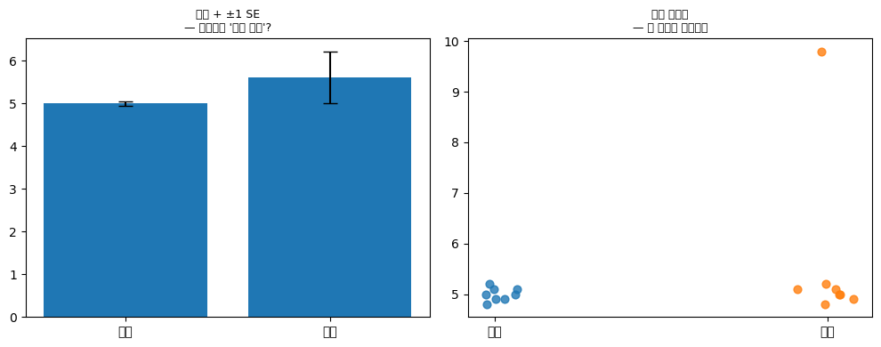
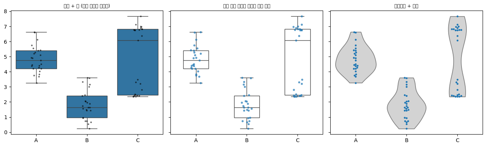
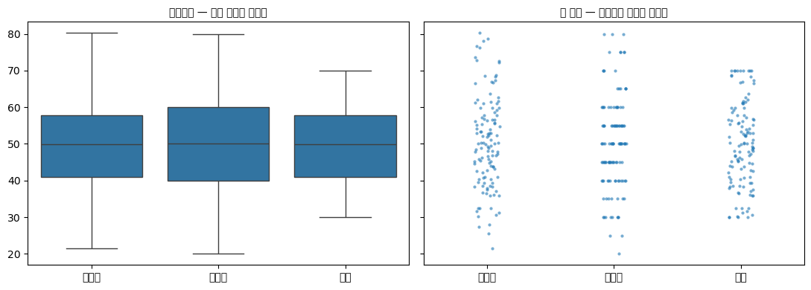
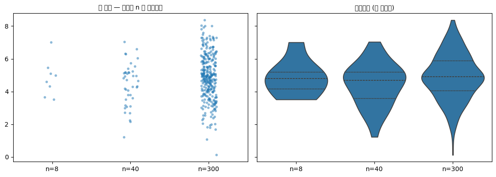

# 스트립 그림과 스웜 그림

상자그림은 다섯 개의 숫자로 분포를 요약한다. 요약은 강력하지만 **요약은 버리는 것이 있다.** 앤스컴의 4중주가 보여 준 대로, 같은 요약통계량 뒤에 전혀 다른 자료가 숨어 있을 수 있다.

**스트립 그림**과 **스웜 그림**은 원자료 점을 그대로 찍는다. 상자그림 위에 겹쳐 놓으면 요약과 원자료를 한 그림에서 볼 수 있다.

## 1. 세 가지를 나란히 놓고 본다

같은 자료를 상자그림만, 스트립 그림만, 상자+스웜으로 그려 비교한다.

<div class="codebox" markdown>

**예제 1.** 스트립·스웜·상자그림 견주기

```python
import numpy as np
import pandas as pd
import matplotlib.pyplot as plt
import seaborn as sns

rng = np.random.default_rng(1)

# 세 집단, 각 18개. B와 C는 평균이 비슷하지만(7.0 vs 6.9) 퍼짐이 다르다.
rows = []
for g, mu in zip(['A', 'B', 'C'], [5, 7, 6.9]):
    for v in rng.normal(mu, 1.2, 18):
        rows.append({'group': g, 'value': v})
d = pd.DataFrame(rows)

fig, axes = plt.subplots(1, 3, figsize=(13, 3.8), sharey=True)

# (1) 상자그림만: 다섯 숫자 요약
sns.boxplot(data=d, x='group', y='value', ax=axes[0], color='lightgray')
axes[0].set_title("Box plot only")

# (2) 스트립 그림: 원자료 점만. jitter가 가로로 흔들어 겹침을 푼다.
#     jitter=0.25 는 범주 폭의 ±25% 범위에서 무작위로 민다는 뜻
sns.stripplot(data=d, x='group', y='value', ax=axes[1], jitter=0.25, alpha=.7)
axes[1].set_title("Strip plot (jittered)")

# (3) 상자 + 스웜: 요약과 원자료를 겹친다.
#     showfliers=False 로 상자그림의 이상치 점을 끈다.
#     끄지 않으면 같은 점이 두 번(상자의 이상치 + 스웜의 점) 그려진다.
sns.boxplot(data=d, x='group', y='value', ax=axes[2],
            color='lightgray', showfliers=False)
sns.swarmplot(data=d, x='group', y='value', ax=axes[2], size=4)
axes[2].set_title("Box + swarm")

plt.tight_layout()
plt.show()

print("n per group:", d.groupby('group').size().to_dict())
print(d.groupby('group')['value'].agg(['mean', 'median', 'std']).round(2))
```

출력:

```
n per group: {'A': 18, 'B': 18, 'C': 18}
       mean  median   std
group
A      5.12    5.37  0.70
B      7.01    6.90  1.47
C      6.63    6.80  0.82
```

</div>


**왼쪽(상자그림만).** B가 가장 높고 A가 가장 낮다. B에 이상치 하나가 아래쪽에 있다. 여기까지가 전부다.

**가운데(스트립 그림).** 각 집단이 18개라는 것이 눈에 보인다. 상자그림에서는 알 수 없던 사실이다. B의 점들이 아래쪽 3.7부터 위쪽 9.6까지 넓게 흩어져 있고, C는 훨씬 좁게 뭉쳐 있다.

**오른쪽(상자+스웜).** 둘을 합쳤다. 상자가 중심과 사분위수를 알려 주고, 점들이 실제 분포와 표본 크기를 알려 준다.

## 2. 스트립과 스웜의 차이

둘 다 원자료를 점으로 찍는데, **겹침을 푸는 방식**이 다르다.

| | 겹침 해소 방식 | 성질 |
|:---|:---|:---|
| **스트립 그림** (`stripplot`) | 가로로 **무작위**하게 민다(지터) | 실행할 때마다 점 위치가 달라진다. 점이 많아도 그려진다. |
| **스웜 그림** (`swarmplot`) | 가로로 **결정적**으로 밀어 겹치지 않게 배치 | 실행 결과가 항상 같다. 점이 많으면 옆으로 너무 퍼지거나 경고가 난다. |

스웜 그림의 모양 자체가 정보다. **가로 폭이 그 값 근처의 밀도에 비례**하므로, 바이올린 그림과 비슷하게 분포의 모양을 보여 준다. 위 그림 오른쪽에서 C의 6~7 부근이 옆으로 가장 넓다.

!!! tip "언제 무엇을 쓰는가"
    - **$n \lesssim 30$**: 스웜 그림. 점이 겹치지 않고 예쁘게 배치되며 모양도 보인다.
    - **$n$이 30~수백**: 스트립 그림 + 투명도(`alpha`). 스웜은 옆으로 너무 퍼진다.
    - **$n$이 수백 이상**: 점 찍기를 포기하고 **바이올린 그림**이나 상자그림으로 간다. 점이 너무 많으면 원자료를 보여 준다는 이점 자체가 사라진다.

    seaborn의 `swarmplot`은 점을 겹치지 않게 배치할 수 없으면 `UserWarning`을 낸다. 이때 점이 **사라지는 것은 아니고**(모든 점이 그려진다) 서로 겹쳐서 놓인다. 즉 **스웜 그림의 존재 이유인 "겹치지 않는 배치"가 무너진 것**이며, 겹친 만큼 밀도를 과소하게 보이게 한다. 경고가 나오면 스트립이나 바이올린으로 바꾸라는 신호로 받아들여야 한다. (연습문제 4에서 확인한다.)

## 3. 왜 점을 겹쳐 그리는가

상자그림만 그렸을 때 놓치는 것이 셋 있다.

**첫째, 표본 크기.** 상자그림은 $n = 5$든 $n = 5000$이든 똑같이 생겼다. 상자의 크기가 표본 크기를 반영하지 않는다. 점을 찍으면 개수가 그대로 보인다.

**둘째, 다봉성.** 봉우리가 둘인 분포도 상자그림에서는 평범한 상자로 보인다. (앞 절의 바이올린 그림이 이 문제를 다루었다.)

**셋째, 뭉침과 이산성.** 값이 특정 지점에 반복해서 몰려 있거나(측정 한계, 반올림), 실은 이산값인데 연속형처럼 보이는 경우가 있다. 점을 찍으면 가로줄로 늘어선 점들이 이를 드러낸다.

!!! warning "막대그림 + 오차막대는 최악의 선택인 경우가 많다"
    집단별 평균을 막대로, 표준오차를 오차막대로 그린 그림(이른바 **다이너마이트 플롯**)을 생물·의학 논문에서 흔히 본다. 이 그림은 위 세 가지를 **전부** 감춘다. 표본 크기도, 분포 모양도, 이상치도 보이지 않는다.

    같은 막대+오차막대 그림 뒤에 정규분포 자료가 있을 수도, 이상치 하나가 평균을 끌어올린 자료가 있을 수도, 봉우리가 둘인 자료가 있을 수도 있다.

    $n$이 작을 때(대략 30 이하)는 **점을 찍는 것이 거의 언제나 낫다.** 최근 여러 학술지가 이를 편집 방침으로 요구하고 있다.

## 연습문제

<div class="drillbox" markdown>

**연습문제 1.** <span class="diff med" title="중간"></span>
위 출력에서 B와 C의 평균은 7.01과 6.63으로 비슷하다. 그런데 그림에서 두 집단은 뚜렷하게 달라 보인다. 무엇이 다르며, 상자그림만 보고도 그 차이를 알 수 있었겠는가?

</div>

??? success "풀이"
    **다른 것은 퍼짐이다.** 표준편차가 B는 1.47, C는 0.82로 B가 거의 두 배 크다. 스트립 그림에서 B의 점들은 3.7에서 9.6까지 넓게 흩어져 있고, C는 4.9에서 8.0 사이에 모여 있다.

    **상자그림만으로도 부분적으로는 알 수 있었다.** 상자(사분위범위)의 높이가 B에서 더 크고, 수염도 더 길다. 아래쪽 이상치 하나도 표시된다.

    **다만 놓치는 것이 있다.** 상자그림에서 B의 아래쪽 점 3.7은 "이상치" 하나로 표시되고, 그것이 나머지 17개와 얼마나 떨어져 있는지, 그 사이가 비어 있는지 차 있는지는 알 수 없다. 스트립 그림을 보면 3.7과 그다음 값(4.7) 사이가 비어 있어 정말로 동떨어진 값임이 확인된다.

    **또한 상자그림은 두 집단이 각각 18개라는 사실을 전혀 알려 주지 않는다.** $n = 18$이라면 SD의 차이(1.47 대 0.82)가 우연일 가능성도 진지하게 고려해야 한다. 표본 크기를 모르면 그 판단 자체를 할 수 없다.

<div class="drillbox" markdown>

**연습문제 2.** <span class="diff med" title="중간"></span>
어떤 연구자가 각 집단 $n = 400$인 자료에 `swarmplot`을 그렸더니 경고가 났고, 점들이 범주 폭을 넘어 옆 집단까지 침범했다. 어떻게 해야 하는가?

</div>

??? success "풀이"
    **경고를 무시하면 안 된다.** seaborn이 "일부 점을 배치하지 못했다"고 알리는 것이므로, 그림에 **없는 점이 생긴다.** 그림이 자료를 그대로 보여 준다는 전제가 깨지는 것이다. 옆 집단을 침범하는 것도 잘못이다. 어느 집단 소속인지 그림에서 구별되지 않는다.

    **대안을 상황에 따라 고른다.**

    1. **바이올린 그림 + 상자그림.** $n = 400$이면 밀도추정이 안정적이므로 바이올린이 분포 모양을 제대로 보여 준다. 안쪽에 작은 상자그림을 넣으면 요약도 함께 전달된다. **이것이 기본 선택이다.**

    2. **스트립 그림 + 낮은 투명도.** `stripplot(jitter=0.3, alpha=0.2, size=3)`처럼 하면 400개도 그릴 수 있다. 점이 겹치는 곳이 진해져 밀도가 드러난다. 원자료를 반드시 보여야 하는 자리라면 이쪽이다.

    3. **둘을 겹친다.** 바이올린을 옅게 깔고 그 위에 투명한 스트립 점을 얹는 것이 요즘 널리 쓰이는 방식이다.

    **하지 말아야 할 것: 점 크기만 줄여서 스웜을 유지하기.** 점을 작게 하면 경고는 사라질 수 있지만, 스웜의 가로 폭이 밀도를 나타낸다는 해석이 왜곡되고 점 하나하나가 보이지 않아 이점도 사라진다.

<div class="drillbox" markdown>

**연습문제 3.** <span class="diff med" title="중간"></span>
어떤 논문이 처리군과 대조군의 평균을 막대로, ±1 표준오차를 오차막대로 그렸다. 각 군 $n = 8$이고 막대는 거의 같은 높이인데 저자는 "차이가 없다"고 결론지었다. 이 그림과 결론을 비판하라.

</div>

??? success "풀이"
    **그림의 문제.**

    1. **$n = 8$인데 점을 찍지 않았다.** 여덟 개는 다 그려도 전혀 붐비지 않는다. 점을 찍지 않을 이유가 없다.
    2. **분포 모양이 완전히 감춰졌다.** 두 군 각각이 뭉쳐 있는지 갈라져 있는지, 이상치가 있는지 알 수 없다. $n = 8$에서 이상치 하나는 평균을 크게 흔든다.
    3. **막대 자체가 불필요하다.** 평균은 점 하나면 되고, 막대는 0부터 평균까지의 넓이가 아무 의미도 없는데 시각적 무게만 차지한다.
    4. **오차막대가 무엇인지 밝혔는지 확인해야 한다.** SD인지 SE인지 CI인지에 따라 길이가 크게 달라진다(다음 절에서 다룬다).

    **결론의 문제.**

    "차이가 없다"는 **"차이를 검출하지 못했다"와 다르다.** $n = 8$이면 검정력이 매우 낮아, 실제로 상당한 차이가 있어도 통계적으로 잡아내지 못하는 것이 정상이다. 귀무가설을 기각하지 못한 것을 귀무가설의 증거로 삼는 것은 흔한 오류다.

    **어떻게 해야 하는가.**

    - 여덟 개 점을 모두 찍고(스웜 그림), 그 위에 평균과 신뢰구간을 표시한다.
    - "차이가 없다" 대신 **차이의 추정치와 신뢰구간**을 보고한다. 예컨대 "차이 = 0.3, 95% CI = [−2.1, 2.7]"이라면 이 자료로는 큰 차이도 배제할 수 없다는 사실이 드러난다.
    - 등가성을 주장하려면 **동등성 검정**을 설계 단계에서 계획해야 한다.

<div class="drillbox" markdown>

**연습문제 4.** <span class="diff med" title="중간"></span>
연습문제 2의 경고가 정확히 무엇을 뜻하는지 확인하라. 점이 **사라지는가**, 아니면 다른 일이 벌어지는가?

</div>

??? success "풀이"
    ```python
    import warnings
    import numpy as np
    import matplotlib.pyplot as plt
    import seaborn as sns

    rng = np.random.default_rng(0)

    print(f"{'n':>6}{'그림 크기':>12}{'그려진 점':>11}{'경고 메시지':>14}")
    for n, size in [(600, (2, 3)), (2000, (2, 3)), (2000, (6, 4))]:
        d = rng.normal(0, 1, n)
        with warnings.catch_warnings(record=True) as caught:
            warnings.simplefilter("always")
            fig, ax = plt.subplots(figsize=size)
            sns.swarmplot(y=d, ax=ax, size=5)
            fig.canvas.draw()                       # 배치는 그릴 때 결정된다
            drawn = len(ax.collections[0].get_offsets())
            plt.close(fig)
        msg = str(caught[0].message).split(";")[0] if caught else "없음"
        print(f"{n:>6}{str(size):>12}{drawn:>11}   {msg}")
    ```

    출력:

    ```
    n       그림 크기      그려진 점        경고 메시지
       600      (2, 3)        600   51.2% of the points cannot be placed
      2000      (2, 3)       2000   78.1% of the points cannot be placed
      2000      (6, 4)       2000   34.8% of the points cannot be placed
    ```

    **점은 하나도 사라지지 않는다.** $n = 2000$이면 $2000$개가 모두 그려진다. 경고는 "$78.1\%$의 점을 (겹치지 않게) **배치할 수 없다**"는 뜻이지 "그리지 않는다"가 아니다.

    **그렇다면 무엇이 문제인가.** 스웜 그림의 존재 이유는 **겹치지 않는 배치**다. 그 배치가 불가능해지면 점들이 서로 겹쳐 놓이고, 겹친 만큼 **밀도가 과소하게 보인다.** 결과적으로 스트립 그림보다 나을 것이 없으면서 계산만 오래 걸린다.

    **경고는 그림 크기와 마커 크기에 의존한다.** 위 표에서 같은 $n = 2000$인데 그림을 크게 하면 배치 불가 비율이 $78.1\%$에서 $34.8\%$로 줄어든다. 즉 **경고는 자료의 성질이 아니라 렌더링 조건에 대한 것**이다.

    **함의가 중요하다.** 같은 코드로 만든 그림이 논문 크기로 줄이면 겹치고, 발표 자료 크기로 키우면 안 겹칠 수 있다. **최종 출력 크기에서 확인해야 한다.**

    **대응.**

    | 방법 | 효과 |
    |---|---|
    | `size=` 를 줄인다 | 더 많은 점을 배치할 수 있다 |
    | 그림을 키운다 | 같은 효과, 다만 지면 제약이 있다 |
    | `stripplot` 으로 바꾼다 | 겹침을 무작위로 푼다 |
    | 바이올린·상자그림으로 간다 | $n$이 수백 이상이면 이쪽이 정답 |

    **경고를 끄지 마라.** 경고가 나온 채로 그린 스웜 그림은 밀도를 왜곡하며, 독자는 그 사실을 알 수 없다. $\square$

<div class="drillbox" markdown>

**연습문제 5.** <span class="diff med" title="중간"></span>
본문 $2$절이 스트립은 무작위, 스웜은 결정적이라고 했다. 이를 직접 확인하고 **재현성** 관점에서 무엇을 뜻하는지 논하라.

</div>

??? success "풀이"
    ```python
    import numpy as np
    import matplotlib.pyplot as plt
    import seaborn as sns

    rng = np.random.default_rng(0)
    d = rng.normal(0, 1, 50)

    def x_positions(kind, **kw):
        fig, ax = plt.subplots()
        (sns.stripplot if kind == "strip" else sns.swarmplot)(y=d, ax=ax, **kw)
        pos = ax.collections[0].get_offsets()[:, 0].copy()
        plt.close(fig)
        return pos

    s1, s2, s3 = x_positions("strip"), x_positions("strip"), x_positions("strip")
    w1, w2 = x_positions("swarm"), x_positions("swarm")
    print(f"stripplot 세 번: 1=2? {np.allclose(s1, s2)}   2=3? {np.allclose(s2, s3)}")
    print(f"swarmplot 두 번: 1=2? {np.allclose(w1, w2)}")

    np.random.seed(42); a = x_positions("strip")
    np.random.seed(42); b = x_positions("strip")
    print(f"\nnp.random.seed 를 고정하면 stripplot 도 같은가: {np.allclose(a, b)}")
    ```

    출력:

    ```
    stripplot 세 번: 1=2? False   2=3? False
    swarmplot 두 번: 1=2? True

    np.random.seed 를 고정하면 stripplot 도 같은가: True
    ```

    **스트립은 매번 다르고 스웜은 항상 같다.** 본문의 설명이 확인된다.

    **재현성 관점에서 무엇을 뜻하는가.**

    - **논문 그림을 다시 만들면 점의 가로 위치가 달라진다.** 자료가 같아도 그림이 달라지므로, 심사자가 재현했을 때 "다른 그림"으로 보일 수 있다.
    - **씨앗을 고정하면 해결된다.** 위에서 `np.random.seed` 로 고정하니 같은 배치가 나온다. seaborn의 지터는 전역 난수 상태를 쓰므로, **분석 스크립트 맨 앞에서 씨앗을 고정하는 습관**이 그림에도 적용된다.
    - **스웜은 이 걱정이 없다.** 결정적 알고리즘이므로 언제나 같다. 다만 연습문제 4에서 보았듯 **그림 크기에 의존**하므로 완전히 자유롭지는 않다.

    **더 깊은 문제.** 지터는 **자료에 없는 가로 변동을 더하는 것**이다. 산점도 문서 연습문제 4에서 본 대로, 지터 폭이 지나치면 정보가 손상된다. 스트립 그림의 가로축은 **아무 의미가 없다**는 점을 독자가 알아야 하며, 축 이름표를 비워 두거나 범주 이름만 두는 것이 그 신호가 된다.

    **스웜의 가로 폭은 반대로 의미가 있다.** 본문이 말한 대로 그 값 근처의 밀도에 비례한다. **같은 점 그림인데 가로축의 의미가 정반대**이므로, 그림 설명에서 어느 쪽인지 밝히는 것이 좋다. $\square$

<div class="drillbox" markdown>

**연습문제 6.** <span class="diff med" title="중간"></span>
연습문제 3의 상황을 수치로 재현하라. $n = 8$인 두 군의 막대 + 오차막대가 무엇을 감추는가?

</div>

??? success "풀이"
    ```python
    import numpy as np
    import matplotlib.pyplot as plt
    from scipy import stats

    rng = np.random.default_rng(11)
    control = np.array([4.9, 5.1, 5.0, 4.8, 5.2, 5.0, 4.9, 5.1])
    treated = np.array([5.0, 5.1, 4.9, 5.2, 5.0, 4.8, 9.8, 5.1])   # 한 개체만 크게 반응

    for name, d in [("대조", control), ("처리", treated)]:
        print(f"{name}: 평균 {d.mean():.3f}  SE {d.std(ddof=1)/np.sqrt(len(d)):.3f}  "
              f"중앙값 {np.median(d):.3f}  범위 {d.min():.1f}~{d.max():.1f}")
    print(f"\nt 검정 p = {stats.ttest_ind(treated, control)[1]:.4f}")
    print(f"윌콕슨 순위합 p = {stats.mannwhitneyu(treated, control)[1]:.4f}")

    fig, axes = plt.subplots(1, 2, figsize=(10, 4))
    means = [control.mean(), treated.mean()]
    ses = [control.std(ddof=1)/np.sqrt(8), treated.std(ddof=1)/np.sqrt(8)]
    axes[0].bar(["대조", "처리"], means, yerr=ses, capsize=6)
    axes[0].set_title("막대 + ±1 SE\n— 겹치므로 '차이 없음'?", fontsize=9)
    for i, d in enumerate([control, treated]):
        axes[1].scatter(np.full(len(d), i) + rng.normal(0, 0.05, len(d)), d, s=40, alpha=0.8)
    axes[1].set_xticks([0, 1]); axes[1].set_xticklabels(["대조", "처리"])
    axes[1].set_title("점을 찍으면\n— 한 개체만 반응했다", fontsize=9)
    fig.tight_layout()
    plt.show()
    ```

    출력:

    ```
    대조: 평균 5.000  SE 0.046  중앙값 5.000  범위 4.8~5.2
    처리: 평균 5.613  SE 0.600  중앙값 5.050  범위 4.8~9.8

    t 검정 p = 0.3259
    윌콕슨 순위합 p = 0.5559
    ```

    

    **막대 그림에서는 두 평균이 비슷하고 오차막대가 겹친다.** 저자의 "차이가 없다"는 결론이 그럴듯해 보인다.

    **점을 찍으면 전혀 다른 이야기가 나온다.** 처리군의 일곱 개체는 대조군과 구별되지 않고, **단 한 개체만 $9.8$로 크게 반응했다.** 이는 "효과가 없다"도 "효과가 있다"도 아니고 **"일부 개체만 반응한다"** 는 제3의 가능성이다.

    **그림이 감춘 것 세 가지.**

    - **표본 크기.** $n = 8$이라는 사실이 막대 그림 어디에도 없다.
    - **분포의 모양.** 처리군은 사실상 두 덩어리다.
    - **평균이 대표값이 아니라는 사실.** 처리군 평균 $5.61$인 개체는 한 명도 없다.

    **검정 결과도 갈린다.** $t$ 검정은 이상치 하나에 끌려가고, 순위 기반 검정은 다른 답을 준다. 어느 쪽도 "일부만 반응한다"는 구조를 직접 말해 주지 못한다.

    **올바른 보고.** $n = 8$이면 **점을 모두 찍는 것이 정보 손실이 전혀 없는 유일한 선택**이다. 본문 $3$절의 경고 상자가 말한 그대로이며, 여러 학술지가 이를 요구하게 된 이유이기도 하다. $\square$

<div class="drillbox" markdown>

**연습문제 7.** <span class="diff med" title="중간"></span>
점 그림을 **상자그림이나 바이올린과 겹쳐** 그리는 것이 표준 관행이 되었다. 겹쳐 그릴 때의 실무적 주의점을 정리하라.

</div>

??? success "풀이"
    ```python
    import numpy as np
    import matplotlib.pyplot as plt
    import seaborn as sns

    rng = np.random.default_rng(5)
    groups = ["A", "B", "C"]
    data = [rng.normal(5, 1, 25), rng.gamma(2, 1.2, 25), 
            np.concatenate([rng.normal(3, 0.5, 12), rng.normal(7, 0.5, 13)])]
    flat = np.concatenate(data)
    label = np.repeat(groups, 25)

    fig, axes = plt.subplots(1, 3, figsize=(13, 4), sharey=True)
    sns.boxplot(x=label, y=flat, ax=axes[0])
    sns.stripplot(x=label, y=flat, ax=axes[0], color="black", size=3, alpha=0.6)
    axes[0].set_title("상자 + 점 (점이 상자에 묻힌다)", fontsize=9)

    sns.boxplot(x=label, y=flat, ax=axes[1], showfliers=False,
                boxprops=dict(facecolor="none"), width=0.5)
    sns.stripplot(x=label, y=flat, ax=axes[1], color="C0", size=4, alpha=0.7)
    axes[1].set_title("상자 속을 비우고 이상치 중복 제거", fontsize=9)

    sns.violinplot(x=label, y=flat, ax=axes[2], inner=None, cut=0, color="lightgray")
    sns.swarmplot(x=label, y=flat, ax=axes[2], size=3.5, color="C0")
    axes[2].set_title("바이올린 + 스웜", fontsize=9)
    fig.tight_layout()
    plt.show()

    for g, d in zip(groups, data):
        q1, q3 = np.percentile(d, [25, 75])
        n_out = np.sum((d < q1 - 1.5 * (q3 - q1)) | (d > q3 + 1.5 * (q3 - q1)))
        print(f"  {g}: n={len(d)}  중앙값 {np.median(d):.2f}  이상치로 표시될 점 {n_out}개")
    ```

    출력:

    ```
    A: n=25  중앙값 4.75  이상치로 표시될 점 0개
      B: n=25  중앙값 1.63  이상치로 표시될 점 0개
      C: n=25  중앙값 6.08  이상치로 표시될 점 0개
    ```

    

    **겹쳐 그릴 때의 주의점 다섯 가지.**

    **첫째, 이상치가 두 번 그려진다.** 상자그림은 울타리 밖 점을 따로 찍는데, 그 위에 원자료 점을 또 찍으면 같은 관측이 두 개로 보인다. **`showfliers=False` 로 상자그림의 이상치 표시를 꺼야 한다.**

    **둘째, 상자가 점을 가린다.** 상자를 채우면 안쪽 점이 묻힌다. `boxprops=dict(facecolor="none")` 로 속을 비우거나, 점을 상자 위(`zorder`)에 그린다.

    **셋째, 색이 충돌한다.** 상자와 점이 같은 색이면 구별되지 않는다. 상자는 옅은 회색, 점은 진한 색으로 하는 것이 무난하다.

    **넷째, 바이올린과 겹칠 때는 `inner=None`.** 바이올린 기본값은 안쪽에 작은 상자그림을 그리는데, 점과 겹치면 지저분해진다. 그리고 `cut=0` 으로 자료 범위 밖으로 뻗지 않게 한다(바이올린 문서 연습문제 9).

    **다섯째, $n$이 크면 겹쳐 그리는 의미가 없다.** 점이 수백 개면 검은 덩어리가 되어 정보도 없이 그림만 어지럽힌다. 그 경우 바이올린만, 또는 점을 아주 작고 투명하게.

    **왜 그럼에도 겹쳐 그리는가.** 요약(상자·바이올린)과 원자료(점)가 **서로 다른 것을 보여 주기 때문**이다. 요약은 비교를 쉽게 하고, 점은 그 요약이 믿을 만한지 보여 준다. 이 장 전체에서 되풀이된 주제다. $\square$

<div class="drillbox" markdown>

**연습문제 8.** <span class="diff med" title="중간"></span>
본문 $3$절의 셋째 항목 **"뭉침과 이산성"** 을 확인하라. 점 그림이 어떻게 그것을 드러내는가?

</div>

??? success "풀이"
    ```python
    import numpy as np
    import matplotlib.pyplot as plt
    import seaborn as sns

    rng = np.random.default_rng(9)
    n = 120
    true = rng.normal(50, 12, n)
    rounded = np.round(true / 5) * 5                       # 5 단위로 반올림
    censored = np.clip(true, 30, 70)                       # 측정 한계에서 잘림

    for name, d in [("원자료", true), ("5 단위 반올림", rounded), ("30~70 에서 절단", censored)]:
        u = len(np.unique(np.round(d, 6)))
        print(f"{name:>14}: 서로 다른 값 {u:>3}개 / {n}개   "
              f"중앙값 {np.median(d):.2f}   IQR {np.subtract(*np.percentile(d, [75, 25])):.2f}")

    fig, axes = plt.subplots(1, 2, figsize=(11, 4), sharey=True)
    label = np.repeat(["원자료", "반올림", "절단"], n)
    flat = np.concatenate([true, rounded, censored])
    sns.boxplot(x=label, y=flat, ax=axes[0])
    axes[0].set_title("상자그림 — 셋이 비슷해 보인다", fontsize=10)
    sns.stripplot(x=label, y=flat, ax=axes[1], size=3, alpha=0.6)
    axes[1].set_title("점 그림 — 가로줄과 뭉침이 보인다", fontsize=10)
    fig.tight_layout()
    plt.show()
    ```

    출력:

    ```
    원자료: 서로 다른 값 120개 / 120개   중앙값 49.99   IQR 16.82
          5 단위 반올림: 서로 다른 값  13개 / 120개   중앙값 50.00   IQR 20.00
       30~70 에서 절단: 서로 다른 값 109개 / 120개   중앙값 49.99   IQR 16.82
    ```

    

    **상자그림에서는 세 자료가 비슷해 보인다.** 중앙값과 IQR이 크게 다르지 않기 때문이다.

    **점 그림에서는 즉시 드러난다.**

    - **반올림 자료**는 점들이 **가로줄로 늘어선다.** $5$의 배수에만 점이 있으므로 이산적인 층이 보인다(히스토그램 문서 연습문제 10의 자릿수 쏠림).
    - **절단 자료**는 $30$과 $70$에 점이 **빽빽하게 쌓인다.** 측정 한계 밖의 값이 모두 그 지점으로 모였기 때문이다.

    **왜 이것이 중요한가.**

    - **반올림은 분산을 부풀린다**(왜도·첨도 문서 연습문제에서 본 대로) 그리고 특정 분위수를 그 값에 고정시킨다.
    - **절단은 분포를 왜곡하고 평균을 중앙으로 당긴다.** 절단된 자료로 계산한 표준편차는 참값보다 작다.
    - **둘 다 요약통계량만으로는 알 수 없다.** 원자료를 보아야 한다.

    **점 그림의 고유한 가치가 여기 있다.** 상자그림·바이올린·히스토그램은 모두 자료를 **요약하거나 평활**하므로 이산성을 지운다. 점 그림만이 관측값을 있는 그대로 보여 준다.

    **실무 습관.** 새 자료를 받으면 **먼저 점을 찍어 보라.** 예상치 못한 층, 벽, 뭉침이 보이면 자료 수집 과정에 무슨 일이 있었는지 물어야 한다. 2장 자료형 문서 연습문제 10의 "자료를 처음 받았을 때의 점검표"와 같은 정신이다. $\square$

<div class="drillbox" markdown>

**연습문제 9.** <span class="diff med" title="중간"></span>
집단마다 **표본 크기가 크게 다를 때** 점 그림에 어떤 문제가 생기며 어떻게 다루는가?

</div>

??? success "풀이"
    ```python
    import numpy as np
    import matplotlib.pyplot as plt
    import seaborn as sns

    rng = np.random.default_rng(7)
    sizes = [8, 40, 300]
    data = [rng.normal(5, 1.5, n) for n in sizes]
    label = np.concatenate([[f"n={n}"] * n for n in sizes])
    flat = np.concatenate(data)

    for n, d in zip(sizes, data):
        se = d.std(ddof=1) / np.sqrt(n)
        print(f"  n={n:>3}: 평균 {d.mean():.3f}  SE {se:.3f}  "
              f"95% CI 반폭 {1.96 * se:.3f}  범위 {d.min():.2f}~{d.max():.2f}")

    fig, axes = plt.subplots(1, 2, figsize=(11, 4), sharey=True)
    sns.stripplot(x=label, y=flat, ax=axes[0], size=4, alpha=0.5)
    axes[0].set_title("점 그림 — 밀도가 n 에 좌우된다", fontsize=10)
    sns.violinplot(x=label, y=flat, ax=axes[1], inner="quartile", cut=0,
                   density_norm="width")
    axes[1].set_title("바이올린 (폭 정규화)", fontsize=10)
    fig.tight_layout()
    plt.show()
    ```

    출력:

    ```
    n=  8: 평균 4.829  SE 0.393  95% CI 반폭 0.770  범위 3.51~7.01
      n= 40: 평균 4.434  SE 0.206  95% CI 반폭 0.404  범위 1.22~7.04
      n=300: 평균 4.899  SE 0.081  95% CI 반폭 0.158  범위 0.12~8.37
    ```

    

    **문제는 시각적 무게가 $n$에 비례한다는 것이다.** $n = 300$인 집단은 점이 빽빽해 진하게 보이고, $n = 8$인 집단은 성기게 보인다. 독자는 진한 쪽을 "더 확실한" 또는 "더 중요한" 것으로 받아들이기 쉽다.

    **그런데 그 인상은 절반만 옳다.** $n$이 크면 평균 추정이 정밀한 것은 맞다($SE$가 작다). 그러나 **점의 밀도는 개별 관측의 퍼짐이지 추정의 정밀도가 아니다.** 두 가지가 시각적으로 섞인다.

    **대응.**

    | 방법 | 효과 |
    |---|---|
    | **$n$을 축 이름표에 적는다** | 가장 단순하고 확실하다 |
    | **투명도를 $n$에 맞춰 조절** | 큰 집단의 점을 더 투명하게 |
    | **바이올린 폭 정규화**(`density_norm="width"`) | 모든 집단의 최대 폭을 같게 |
    | **바이올린 폭을 $n$에 비례**(`density_norm="count"`) | 반대로 $n$을 폭으로 부호화 |
    | **평균과 신뢰구간을 겹쳐 그린다** | 추정의 정밀도를 따로 표시 |

    **셋째와 넷째가 정반대라는 점이 중요하다.** 바이올린 문서 연습문제 5에서 다룬 선택이며, **무엇을 비교하려는지**가 답을 정한다. 분포의 **모양**을 비교하려면 폭을 정규화하고, 집단의 **크기**도 함께 보이려면 비례시킨다.

    **가장 흔한 실수는 아무 선택도 하지 않는 것이다.** 기본값이 무엇인지 모른 채 그리면, 독자가 폭을 어떻게 읽어야 할지 알 수 없다. **그림 설명에 밝혀야 한다.** $\square$

<div class="drillbox" markdown>

**연습문제 10.** <span class="diff med" title="중간"></span>
이 절과 앞 절들을 종합해, **집단별 분포를 비교하는 그림**의 결정 규칙을 만들어라.

</div>

??? success "풀이"
    **표본 크기가 첫 번째 갈림길이다.**

    | 집단당 $n$ | 권장 | 이유 |
    |---|---|---|
    | $\lesssim 10$ | **점만** (스웜) | 요약이 무의미하다 |
    | $10$–$30$ | **점 + 상자** | 점이 주, 상자가 보조 |
    | $30$–$100$ | **상자 + 점**, 또는 바이올린 + 점 | 둘 다 읽을 만하다 |
    | $100$–$1000$ | **바이올린** 또는 상자 | 점은 덩어리가 된다 |
    | $\gtrsim 1000$ | 바이올린, 능선 그림, ECDF | 요약이 유일한 선택 |

    **그 다음 질문들.**

    | 질문 | 답이 "예"라면 |
    |---|---|
    | 자료가 이산이거나 값의 종류가 적은가 | 점 그림 또는 막대 (바이올린 금지) |
    | 봉우리가 여럿일 가능성이 있는가 | 바이올린 또는 점 (상자그림만은 금지) |
    | 집단 크기가 크게 다른가 | $n$ 표기 + 폭 정규화 선택 |
    | 짝지은 자료인가 | 개인별 연결선 (오차막대 문서 연습문제 5) |
    | 집단이 아주 많은가 ($\gtrsim 10$) | 능선 그림, 또는 요약 통계량의 점그림 |
    | 이상치가 관심사인가 | 점을 반드시 포함 |
    | 평균 비교가 목적인가 | **차이의 신뢰구간**을 따로 그린다 |

    **마지막 줄이 이 장 전체의 결론에 가깝다.** 분포를 보여 주는 그림과 **비교를 판정하는 그림**은 다르다. 앞의 것은 자료가 어떻게 생겼는지 보여 주고, 뒤의 것은 차이가 잡음보다 큰지 보여 준다. 하나의 그림에 두 가지를 모두 담으려다 어느 쪽도 못 하는 경우가 많다.

    **그리고 어떤 경우에도 하지 말아야 할 것.**

    - **$n$이 작은데 막대 + 오차막대만 그리기** (연습문제 3, 6)
    - **$n$을 표시하지 않기**
    - **오차막대의 정의를 밝히지 않기** (오차막대 문서 연습문제 3)
    - **이산 자료에 바이올린 쓰기** (바이올린 문서 연습문제 10)
    - **경고를 무시하고 스웜 그리기** (연습문제 4)

    **원칙 하나로 줄이면.** **자료가 허락하는 한 자료를 보여 주어라.** 요약은 자료를 볼 수 없을 때의 차선책이다. $\square$


## 정리하며

스트립 그림과 스웜 그림은 **요약이 감추는 것을 되돌려 놓는다.**

- **스트립**: 무작위 지터로 겹침을 푼다. 점이 많아도 쓸 수 있다.
- **스웜**: 결정적으로 밀어 겹치지 않게 한다. 가로 폭이 밀도를 나타내지만 $n$이 크면 무너진다.
- **상자그림이나 바이올린 그림과 겹쳐** 요약과 원자료를 한 그림에 담는 것이 표준적인 쓰임이다.

$n$이 작을 때 점을 찍지 않을 이유는 거의 없다. 표본 크기, 분포 모양, 이상치가 모두 공짜로 딸려 온다.

다음 절부터는 변수가 **둘**인 수치형 자료로 넘어간다. 첫 도구는 **산점도**다.
