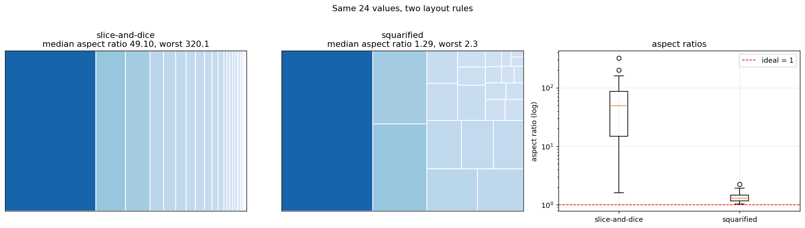
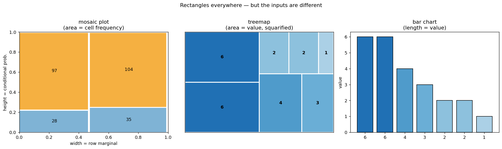
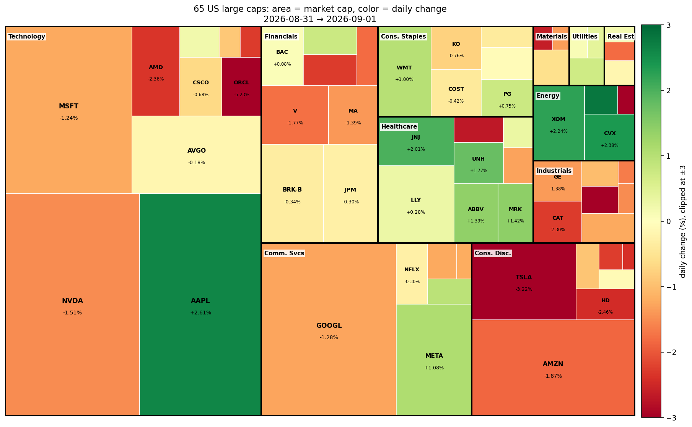

# 트리맵

주식 시황을 한 화면에 보여 주는 그림이 있다. 네모 하나가 종목 하나이고, **네모의 크기가 시가총액**, **색이 등락률**, **묶음이 업종**이다. 초록이 많으면 오른 날, 빨강이 많으면 내린 날이다. 금융 정보 사이트의 "시장 지도"가 이것이며, 영어로는 **treemap**이라 부른다.

이 그림을 **모자이크 그림이라 부르는 일이 흔한데 둘은 다른 도구다.** 이 절은 그 차이에서 출발해 트리맵을 만들고, 마지막에 **이 그림이 조용히 오해를 부르는 지점**을 짚는다.

## 1. 사각형을 어떻게 놓는가

넓이만 정해져 있고 모양은 자유다. **어떻게 놓느냐가 읽기 쉬운 정도를 좌우한다.**

<div class="codebox" markdown>

### 예제 1. 제곱화 배치 알고리즘 { .eg }

가장 널리 쓰이는 방법은 **제곱화(squarified)** 배치다. 사각형의 **가로세로비를 되도록 1에 가깝게** 유지한다. 길쭉한 조각은 넓이를 가늠하기 어렵기 때문이다.

```python
def squarify(values, x, y, dx, dy):
    """넓이가 values 에 비례하는 사각형들로 (x,y,dx,dy) 직사각형을 덮는다.

    브륄스-허잇-판빅(1999)의 제곱화 알고리즘.
    values 는 내림차순으로 정렬되어 있다고 가정한다.
    """
    rects = []
    vals = list(values)
    total = sum(vals)
    if total <= 0:
        return rects
    # 값을 실제 화면 넓이 단위로 환산한다.
    vals = [v * dx * dy / total for v in vals]

    def worst(row, length):
        """한 줄에 row 를 놓았을 때 가로세로비의 최악값."""
        s = sum(row)
        if s == 0 or length == 0:
            return float("inf")
        mx, mn = max(row), min(row)
        return max(length * length * mx / (s * s), s * s / (length * length * mn))

    def layout_row(row, x, y, dx, dy):
        """row 를 짧은 변에 맞춰 한 줄로 배치하고 남은 영역을 돌려준다."""
        s = sum(row)
        out = []
        if dx >= dy:                      # 남은 영역이 가로로 길면 세로 열로 쌓는다
            w = s / dy if dy else 0
            cy = y
            for v in row:
                h = v / w if w else 0
                out.append((x, cy, w, h))
                cy += h
            return out, (x + w, y, dx - w, dy)
        else:                             # 세로로 길면 가로 행으로 쌓는다
            h = s / dx if dx else 0
            cx = x
            for v in row:
                w = v / h if h else 0
                out.append((cx, y, w, h))
                cx += w
            return out, (x, y + h, dx, dy - h)

    # 한 줄에 계속 더해 보다가, 더 넣으면 가로세로비가 나빠지는 순간 줄을 확정한다.
    row = []
    i = 0
    while i < len(vals):
        length = min(dx, dy)
        if not row or worst(row + [vals[i]], length) <= worst(row, length):
            row.append(vals[i]); i += 1
        else:
            placed, (x, y, dx, dy) = layout_row(row, x, y, dx, dy)
            rects += placed
            row = []
    if row:
        placed, _ = layout_row(row, x, y, dx, dy)
        rects += placed
    return rects


# 넓이가 정확히 값에 비례하는지 확인한다.
v = sorted([6, 6, 4, 3, 2, 2, 1], reverse=True)
R = squarify(v, 0, 0, 6, 4)
print(f"값 {v},  전체 넓이 {6 * 4}")
print(f"{'값':>4s}{'넓이':>10s}{'기대':>10s}{'가로세로비':>11s}")
for val, (x0, y0, w, h) in zip(v, R):
    print(f"{val:>4d}{w * h:>10.4f}{val * 24 / sum(v):>10.4f}"
          f"{max(w / h, h / w):>11.2f}")
print(f"넓이 합 {sum(w * h for _, _, w, h in R):.6f}")
```

```text
값 [6, 6, 4, 3, 2, 2, 1],  전체 넓이 24
   값        넓이        기대      가로세로비
   6    6.0000    6.0000       1.50
   6    6.0000    6.0000       1.50
   4    4.0000    4.0000       1.36
   3    3.0000    3.0000       1.81
   2    2.0000    2.0000       1.39
   2    2.0000    2.0000       1.39
   1    1.0000    1.0000       2.78
넓이 합 24.000000
```

**넓이가 값과 정확히 비례한다.** 이것은 배치 방법과 무관하게 반드시 성립해야 하는 성질이다.

**가로세로비는 1.36~2.78로 대체로 정사각형에 가깝다.** 가장 작은 값(1)이 2.78로 가장 길쭉한데, **작은 조각일수록 모양을 맞추기 어렵다**는 것이 이 알고리즘의 알려진 한계다.

</div>

<div class="codebox" markdown>

### 예제 2. 배치 규칙을 바꾸면 { .eg }

가장 단순한 배치는 **한 방향으로만 차례로 자르는** 방법이다(slice-and-dice). 구현이 쉽고 **순서가 보존**된다는 장점이 있다.

```python
import numpy as np
import matplotlib.pyplot as plt


def slice_dice(values, x, y, dx, dy, vertical=True):
    """단순 분할: 한 방향으로만 차례로 자른다."""
    out = []
    tot = sum(values)
    pos = x if vertical else y
    for v in values:
        if vertical:
            w = dx * v / tot
            out.append((pos, y, w, dy)); pos += w
        else:
            h = dy * v / tot
            out.append((x, pos, dx, h)); pos += h
    return out


rng = np.random.default_rng(3)
# 파레토 분포로 '몇 개가 아주 크고 대부분 작은' 현실적인 값을 만든다.
vals = sorted(np.round(rng.pareto(1.1, 24) * 10 + 1, 1), reverse=True)

fig, ax = plt.subplots(1, 3, figsize=(16, 4.4))
for a, (R, title) in zip(ax, [(slice_dice(vals, 0, 0, 10, 6), "slice-and-dice"),
                              (squarify(vals, 0, 0, 10, 6), "squarified")]):
    ratios = [max(w / h, h / w) for _, _, w, h in R]
    cm = plt.get_cmap("Blues")
    for v_, (x0, y0, w, h) in zip(vals, R):
        a.add_patch(plt.Rectangle((x0, y0), w, h,
                    facecolor=cm(0.2 + 0.6 * v_ / max(vals)),
                    edgecolor="white", linewidth=1.2))
    a.set_xlim(0, 10); a.set_ylim(0, 6)
    a.set_xticks([]); a.set_yticks([])
    a.set_title(f"{title}\nmedian aspect ratio {np.median(ratios):.2f}, "
                f"worst {max(ratios):.1f}")

r1 = [max(w / h, h / w) for _, _, w, h in slice_dice(vals, 0, 0, 10, 6)]
r2 = [max(w / h, h / w) for _, _, w, h in squarify(vals, 0, 0, 10, 6)]
ax[2].boxplot([r1, r2], labels=["slice-and-dice", "squarified"])
ax[2].set_yscale("log")
ax[2].axhline(1, color="red", ls="--", lw=1, label="ideal = 1")
ax[2].set_ylabel("aspect ratio (log)"); ax[2].set_title("aspect ratios")
ax[2].legend(); ax[2].grid(alpha=0.25)

fig.suptitle("Same 24 values, two layout rules", y=1.02)
fig.tight_layout()
plt.show()

print(f"slice-and-dice: 중앙값 {np.median(r1):.2f}, 최악 {max(r1):.1f}")
print(f"squarified:     중앙값 {np.median(r2):.2f}, 최악 {max(r2):.1f}")
```



```text
slice-and-dice: 중앙값 49.10, 최악 320.1
squarified:     중앙값 1.29, 최악 2.3
```

**같은 값인데 왼쪽은 읽을 수 없다.** 가로세로비의 중앙값이 **49.10**이고 최악은 **320.1**이다. 폭이 1픽셀도 안 되는 실오라기 같은 조각이 된다.

| 배치 | 가로세로비 중앙값 | 최악 |
|---|---|---|
| slice-and-dice | **49.10** | **320.1** |
| **제곱화** | **1.29** | **2.3** |

**38배 차이다.** 넓이는 양쪽 모두 정확한데, **읽을 수 있느냐가 완전히 다르다.**

**이것이 트리맵의 첫 번째 함정이다.** 같은 자료·같은 넓이인데 **배치 알고리즘이라는 자의적 선택이 그림의 쓸모를 정한다.** 앞 절들에서 본 구조와 같다 — 자료가 아니라 분석자의 선택이 결과를 움직인다.

**그래도 slice-and-dice에는 쓸모가 있다.** **순서가 보존**되므로 시간 순서나 크기 순위를 유지해야 할 때 쓴다. 제곱화 배치는 **인접 관계가 뒤죽박죽**이 되어 순서 정보를 잃는다.

</div>

## 2. 모자이크 그림과 무엇이 다른가

둘 다 화면을 사각형으로 채우고 **넓이로 크기를 나타낸다.** 그래서 겉모습이 비슷하다. 그러나 **받는 자료와 넓이의 뜻이 다르다.**

<div class="codebox" markdown>

### 예제 3. 같은 사각형, 다른 일 { .eg }

```python
import matplotlib.pyplot as plt
import numpy as np

fig, ax = plt.subplots(1, 3, figsize=(16, 4.6))

# ── (1) 모자이크: 분할표를 받는다 ─────────────────────────────────
tab = np.array([[28, 97], [35, 104]], float)     # SUV/비SUV x 사고/무사고
n = tab.sum()
colw = tab.sum(1) / n                            # 열 너비 = 주변확률
x = 0
for i, (w, row) in enumerate(zip(colw, tab)):
    y = 0
    for j, v in enumerate(row):
        h = v / row.sum()                        # 높이 = 조건부확률
        ax[0].add_patch(plt.Rectangle((x, y), w - 0.01, h - 0.006,
                        facecolor=["#7fb3d5", "#f5b041"][j], edgecolor="white"))
        ax[0].text(x + w / 2, y + h / 2, f"{int(v)}",
                   ha="center", va="center", fontsize=10)
        y += h
    x += w
ax[0].set_xlim(0, 1); ax[0].set_ylim(0, 1)
ax[0].set_title("mosaic plot\n(area = cell frequency)")
ax[0].set_xlabel("width = row marginal")
ax[0].set_ylabel("height = conditional prob.")

# ── (2) 트리맵: 값의 목록을 받는다 ────────────────────────────────
v = sorted([6, 6, 4, 3, 2, 2, 1], reverse=True)
R = squarify(v, 0, 0, 6, 4)                      # 1절에서 만든 함수
cmap = plt.get_cmap("Blues")
for val, (x0, y0, w, h) in zip(v, R):
    ax[1].add_patch(plt.Rectangle((x0, y0), w, h,
                    facecolor=cmap(0.25 + 0.5 * val / max(v)),
                    edgecolor="white", linewidth=2))
    ax[1].text(x0 + w / 2, y0 + h / 2, str(val),
               ha="center", va="center", fontweight="bold")
ax[1].set_xlim(0, 6); ax[1].set_ylim(0, 4)
ax[1].set_title("treemap\n(area = value, squarified)")
ax[1].set_xticks([]); ax[1].set_yticks([])

# ── (3) 같은 값을 막대로 ─────────────────────────────────────────
ax[2].bar(range(len(v)), v,
          color=[cmap(0.25 + 0.5 * z / max(v)) for z in v], edgecolor="black")
ax[2].set_title("bar chart\n(length = value)")
ax[2].set_xticks(range(len(v))); ax[2].set_xticklabels([str(z) for z in v])
ax[2].set_ylabel("value")

fig.suptitle("Rectangles everywhere — but the inputs are different", y=1.02)
fig.tight_layout()
plt.show()
```



**세 그림이 받는 자료부터 다르다.**

| | 모자이크 그림 | 트리맵 |
|---|---|---|
| **입력** | **분할표**(두 범주형 변수) | **값의 목록**(수량 하나) |
| 넓이의 뜻 | **결합확률**(= 도수) | 그 값 자체 |
| 너비·높이 | **주변확률 × 조건부확률** | 아무 뜻 없음 |
| 위치 | **범주의 순서** | 아무 뜻 없음 |
| 계층 | 보통 2~3개 변수 | **몇 단계든 중첩** |
| 무엇을 보나 | **독립 여부**, 조건부확률 | **상대적 크기**, 구성 |

**모자이크 그림에서는 너비와 높이가 각각 의미를 갖는다.** [모자이크 그림](mosaic.md) 절에서 보았듯 넓이 $=$ 너비 $\times$ 높이가 곧 **결합확률 $=$ 주변확률 $\times$ 조건부확률**이다. 그래서 **분할선이 나란하면 독립**이라는 판정이 눈으로 가능하다.

**트리맵에는 그런 구조가 없다.** 넓이만 뜻이 있고 **가로세로 비와 위치는 배치 알고리즘이 정한 것**일 뿐이다. 같은 자료라도 알고리즘을 바꾸면 전혀 다르게 보인다(1절).

**막대그림 (3)이 값을 읽기에는 가장 정확하다.** [막대그림](bar_charts.md) 절의 지각 서열에서 **길이는 3위, 넓이는 5위**였다. 그러면 왜 트리맵을 쓰는가.

| 막대그림이 안 되는 상황 | 트리맵이 하는 일 |
|---|---|
| 항목이 수백 개 | **화면을 빈틈없이 채운다** |
| 값의 규모 차가 100배 이상 | 작은 것도 자리를 갖는다 |
| **계층 구조**(업종 → 종목) | **중첩으로 표현** |
| 두 번째 변수도 보이고 싶다 | **색을 함께 쓴다** |

**트리맵은 정밀한 비교가 아니라 훑어보기를 위한 도구**다. 이 구분이 이 절 전체를 관통한다.

</div>

## 3. 실제 자료: 시가총액 지도

<div class="codebox" markdown>

### 예제 4. 대형주 65종목의 시가총액과 등락률 { .eg }

```python
import warnings
warnings.filterwarnings("ignore")

import os
import numpy as np
import pandas as pd
import yfinance as yf

# 11개 업종에서 대형주를 골랐다. 실제 지수 지도는 500종목을 쓰지만
# 구조는 같고, 여기서는 내려받는 부담을 줄였다.
SECTORS = {
    "Technology": ["AAPL", "MSFT", "NVDA", "AVGO", "ORCL",
                   "CRM", "AMD", "ADBE", "CSCO", "ACN"],
    "Communication Services": ["GOOGL", "META", "NFLX", "DIS", "TMUS", "CMCSA"],
    "Consumer Discretionary": ["AMZN", "TSLA", "HD", "MCD", "NKE", "LOW", "SBUX"],
    "Financials": ["BRK-B", "JPM", "V", "MA", "BAC", "WFC", "GS", "AXP"],
    "Healthcare": ["LLY", "UNH", "JNJ", "ABBV", "MRK", "TMO", "ABT", "PFE"],
    "Consumer Staples": ["WMT", "COST", "PG", "KO", "PEP", "PM"],
    "Industrials": ["GE", "CAT", "RTX", "UNP", "HON", "BA", "UPS"],
    "Energy": ["XOM", "CVX", "COP", "SLB"],
    "Utilities": ["NEE", "SO", "DUK"],
    "Real Estate": ["PLD", "AMT", "EQIX"],
    "Materials": ["LIN", "SHW", "APD"],
}
CACHE = "datasets/stocks/sp_big.csv"

# 한 번 받은 자료를 저장해 두고 다시 쓴다.
# 실행 시점마다 값이 달라지면 아래 출력이 재현되지 않기 때문이다.
d = pd.read_csv(CACHE)

d["mcap"] = d["shares"] * d["close_last"]             # 시가총액
d["chg"] = (d["close_last"] / d["close_prev"] - 1) * 100   # 일별 등락률 (%)
d["w"] = d["mcap"] / d["mcap"].sum()                  # 넓이 비중

print(f"종목 {len(d)}개, 업종 {d['sector'].nunique()}개")
print(f"기간 {d['date_prev'].iloc[0]} -> {d['date_last'].iloc[0]}\n")

s = d.sort_values("mcap", ascending=False)
cum = s["w"].cumsum().to_numpy()
print("넓이가 몇 종목에 몰려 있나")
for k in [1, 3, 5, 10, 20]:
    print(f"  상위 {k:2d}종목 누적 비중 {cum[k - 1]:.4f}")
print(f"  절반을 넘기는 데 필요한 종목 수 {int(np.argmax(cum >= 0.5)) + 1}\n")

print(f"가장 큰 칸 {s.iloc[0]['ticker']}: 비중 {s.iloc[0]['w']:.4f}")
print(f"가장 작은 칸 {s.iloc[-1]['ticker']}: 비중 {s.iloc[-1]['w']:.4f}")
print(f"넓이 비 {s.iloc[0]['w'] / s.iloc[-1]['w']:.1f}배")
```

```text
종목 65개, 업종 11개
기간 2026-08-31 -> 2026-09-01

넓이가 몇 종목에 몰려 있나
  상위  1종목 누적 비중 0.1220
  상위  3종목 누적 비중 0.3274
  상위  5종목 누적 비중 0.4777
  상위 10종목 누적 비중 0.6347
  상위 20종목 누적 비중 0.7832
  절반을 넘기는 데 필요한 종목 수 6

가장 큰 칸 NVDA: 비중 0.1220
가장 작은 칸 NKE: 비중 0.0013
넓이 비 93.0배
```

**여섯 종목이 화면의 절반을 차지한다.** 65종목 중 6개다.

**가장 큰 칸과 가장 작은 칸의 넓이 비가 93배**다. 막대그림으로 그리면 작은 막대가 보이지 않겠지만, **트리맵에서는 작은 칸도 자리를 갖는다.** 이것이 트리맵을 쓰는 이유다.

**동시에 이것이 문제이기도 하다.** 넓이가 93배 차이 나면 **작은 칸의 넓이를 서로 비교하는 일은 사실상 불가능**하다. 1픽셀 대 2픽셀의 차이를 눈이 구별하지 못한다.

</div>

<div class="codebox" markdown>

### 예제 5. 업종별로 묶은 시장 지도 { .eg }

```python
import matplotlib.pyplot as plt
from matplotlib.colors import TwoSlopeNorm


def nested_treemap(groups, x=0.0, y=0.0, dx=1.0, dy=1.0):
    """{그룹: [(이름, 값, 색값), ...]} 를 두 단계 트리맵으로 배치한다.

    1단계: 그룹의 값 합으로 전체를 나눈다.
    2단계: 각 그룹 칸 안에서 개별 항목을 다시 나눈다.
    """
    gtot = {g: sum(v for _, v, _ in items) for g, items in groups.items()}
    order = sorted(gtot, key=gtot.get, reverse=True)      # 큰 그룹부터
    gr = squarify([gtot[g] for g in order], x, y, dx, dy)
    out = []
    for g, (gx, gy, gw, gh) in zip(order, gr):
        items = sorted(groups[g], key=lambda z: -z[1])    # 그룹 안에서도 큰 것부터
        rr = squarify([v for _, v, _ in items], gx, gy, gw, gh)
        out.append((g, (gx, gy, gw, gh),
                    [(nm, v, c, r) for (nm, v, c), r in zip(items, rr)]))
    return out


groups = {s: [(r.ticker, r.mcap, r.chg) for r in g.itertuples()]
          for s, g in d.groupby("sector")}
layout = nested_treemap(groups, 0, 0, 100, 62)

# 색은 0을 가운데 두고 ±3%에서 자른다.
# 자르지 않으면 하루 -20% 같은 한 종목이 나머지 색을 전부 눌러 버린다.
CLIP = 3.0
norm = TwoSlopeNorm(vmin=-CLIP, vcenter=0.0, vmax=CLIP)
cmap = plt.get_cmap("RdYlGn")

fig, ax = plt.subplots(figsize=(13.5, 8.6))
for sec, (gx, gy, gw, gh), items in layout:
    for nm, v, c, (x0, y0, w, h) in items:
        ax.add_patch(plt.Rectangle((x0, y0), w, h,
                     facecolor=cmap(norm(np.clip(c, -CLIP, CLIP))),
                     edgecolor="white", linewidth=0.8))
        if w * h > 45:                       # 좁은 칸에는 글씨를 넣지 않는다
            ax.text(x0 + w / 2, y0 + h / 2 + 0.6, nm, ha="center", va="center",
                    fontsize=min(11, 5 + (w * h) ** 0.22), fontweight="bold")
            ax.text(x0 + w / 2, y0 + h / 2 - 1.3, f"{c:+.2f}%",
                    ha="center", va="center",
                    fontsize=min(9, 4 + (w * h) ** 0.19))
    ax.add_patch(plt.Rectangle((gx, gy), gw, gh, fill=False,
                 edgecolor="black", linewidth=2.2))
    SHORT = {"Communication Services": "Comm. Svcs",
             "Consumer Discretionary": "Cons. Disc.",
             "Consumer Staples": "Cons. Staples",
             "Real Estate": "Real Est.", "Technology": "Technology"}
    lab = SHORT.get(sec, sec)
    if gw < 12:
        lab = lab[:9]
    ax.text(gx + 0.5, gy + gh - 1.2, lab, fontsize=8.2, fontweight="bold",
            va="top", ha="left", clip_on=True,
            bbox=dict(boxstyle="square,pad=0.15", fc="white", ec="none", alpha=0.85))

ax.set_xlim(0, 100); ax.set_ylim(0, 62)
ax.set_xticks([]); ax.set_yticks([]); ax.set_aspect("equal")
sm = plt.cm.ScalarMappable(cmap=cmap, norm=norm); sm.set_array([])
cb = fig.colorbar(sm, ax=ax, fraction=0.03, pad=0.01)
cb.set_label(f"daily change (%), clipped at ±{CLIP:.0f}")
ax.set_title("65 US large caps: area = market cap, color = daily change\n"
             f"{d['date_prev'].iloc[0]} → {d['date_last'].iloc[0]}", fontsize=12)
fig.tight_layout()
plt.show()
```



**두 변수가 한 그림에 들어 있다.** 넓이가 시가총액, 색이 등락률이다. 여기에 **업종이라는 계층**까지 세 번째 정보로 들어간다.

**한눈에 읽히는 것들.**

- **기술 업종이 화면의 40%**를 차지한다. 개별 종목을 보기 전에 덩어리 크기가 먼저 눈에 들어온다.
- **에너지가 초록**이다. XOM과 CVX가 나란히 올랐다.
- **AAPL만 기술 업종에서 진한 초록**이고 나머지는 대체로 빨강이다.
- 오른쪽 아래 **소비재의 TSLA가 짙은 빨강**이다.

**이것이 트리맵이 잘하는 일이다.** "어디를 들여다볼지" 고르게 해 준다.

!!! warning "빨강-초록 색표의 문제"
    시장 지도에는 관례적으로 빨강-초록이 쓰이고 위 그림도 그 관례를 따랐다. 그러나 **적록색각 이상이 있는 독자에게는 읽히지 않는다.** 남성의 약 8%가 여기 해당한다.

    [상관 시각화](../../ch12/correlation/corr_viz.md) 절에서 다룬 원칙이 그대로 적용된다. **파랑-주황 같은 색표로 바꾸면** 색각 이상 여부와 무관하게 부호가 구별된다. 연습문제 7에서 직접 바꿔 본다.

    **색을 자르는 것(clipping)도 선택이다.** 여기서는 $\pm3\%$에서 잘랐는데, 이 값을 바꾸면 그림의 인상이 크게 달라진다. **자른 사실과 그 값을 반드시 밝혀야 한다.**

</div>

## 4. 눈이 세는 것과 지수가 재는 것

여기서부터가 이 절의 핵심이다. **시장 지도를 보고 "오늘 시장이 어땠나"를 판단할 때, 사람의 눈과 지수는 서로 다른 것을 계산한다.**

<div class="codebox" markdown>

### 예제 6. 초록 칸의 개수와 지수의 등락은 다르다 { .eg }

```python
up = (d["chg"] > 0).sum()
print(f"오른 종목 {up}개 / {len(d)}개  ({up / len(d):.1%})")
print(f"넓이 기준 '초록' 비율      {d.loc[d['chg'] > 0, 'w'].sum():.4f}\n")

print(f"동일가중 평균 등락률  {d['chg'].mean():+.4f}%")
print(f"중앙값 등락률         {d['chg'].median():+.4f}%")
print(f"시총가중 평균 등락률  {(d['w'] * d['chg']).sum():+.4f}%   <- 지수가 재는 값")

print("\n업종별")
g = (d.groupby("sector")
     .apply(lambda x: pd.Series({
         "n": len(x),
         "시총비중": x["mcap"].sum() / d["mcap"].sum(),
         "시총가중등락": (x["mcap"] * x["chg"]).sum() / x["mcap"].sum(),
         "동일가중등락": x["chg"].mean()})))
print(g.sort_values("시총비중", ascending=False).round(4).to_string())
```

```text
오른 종목 21개 / 65개  (32.3%)
넓이 기준 '초록' 비율      0.3077

동일가중 평균 등락률  -0.7008%
중앙값 등락률         -0.7556%
시총가중 평균 등락률  -0.4801%   <- 지수가 재는 값

업종별
                           n    시총비중  시총가중등락  동일가중등락
sector                                              
Technology              10.0  0.4069 -0.2835 -1.1534
Communication Services   6.0  0.1482 -0.6088 -0.3291
Consumer Discretionary   7.0  0.1150 -2.2272 -1.8919
Financials               8.0  0.1030 -0.7700 -0.8813
Healthcare               8.0  0.0801  0.7573  0.4006
Consumer Staples         6.0  0.0571  0.2192  0.0181
Industrials              7.0  0.0341 -1.7872 -1.7773
Energy                   4.0  0.0312  1.8985  0.6257
Materials                3.0  0.0087 -1.1535 -1.5096
Utilities                3.0  0.0086  0.4668  0.4064
Real Estate              3.0  0.0073 -0.6109 -0.6057
```

**같은 하루에 대해 세 가지 숫자가 나온다.**

| 요약 | 값 | 무엇을 재나 |
|---|---|---|
| 오른 종목 비율 | **32.3%** | **폭**(breadth) |
| 동일가중 평균 | $-0.70\%$ | 종목 하나씩 똑같이 |
| **시총가중 평균** | $\mathbf{-0.48\%}$ | **지수** |

**지수($-0.48\%$)가 동일가중 평균($-0.70\%$)보다 덜 나쁘다.** 큰 종목들이 상대적으로 잘 버텼기 때문이다.

**기술 업종이 그 차이를 가장 잘 보여 준다.**

$$
\underbrace{-0.28\%}_{\text{시총가중}}
\quad\text{대}\quad
\underbrace{-1.15\%}_{\text{동일가중}}
$$

**같은 10종목인데 4배 차이**다. AAPL이 $+2.61\%$로 크게 올랐고 그 칸이 크기 때문이다. **"기술주가 어땠나"라는 질문에 두 개의 정답이 있다.**

**여기서 눈이 하는 일이 문제가 된다.**

```text
눈은 칸의 '개수'를 센다        -> 32.3% 초록 -> "많이 내린 날"
지수는 칸의 '넓이'로 평균낸다   -> -0.48%    -> "조금 내린 날"

트리맵은 넓이를 보여 주지만
사람은 개수를 세는 쪽으로 기운다
```

**이 자료에서는 두 값이 우연히 가깝다**(개수 32.3% 대 넓이 30.8%). **그러나 일반적으로는 크게 벌어질 수 있다.** 메가캡 몇 개가 오르고 나머지가 전부 내리면, **지도는 온통 빨강인데 지수는 상승**한다.

!!! tip "이것이 '폭'이라는 지표가 따로 있는 이유"
    시장 분석에서 **상승 종목 수 대 하락 종목 수**를 따로 집계하는 관행이 있다. 지수(시총가중)가 담지 못하는 정보이기 때문이다.

    **두 지표가 갈라지는 날이 의미 있는 신호**로 읽힌다. "지수는 올랐는데 폭이 나쁘다"는 상승이 소수 종목에 의존한다는 뜻이다.

    **트리맵은 두 정보를 동시에 담고 있다.** 넓이에 지수가, 칸의 개수에 폭이 들어 있다. 다만 **읽는 사람이 그 구분을 알고 있어야** 한다.

**에너지 업종의 두 값이 3배 차이다.** 시총가중 $+1.90\%$인데 동일가중은 $+0.63\%$다. 네 종목뿐인 작은 묶음에서도 가중 방식이 결론을 크게 바꾼다. 연습문제 5에서 한 종목씩 뜯어본다.

</div>

## 5. 트리맵이 잘 못하는 일

**트리맵은 훑어보기 도구이지 비교 도구가 아니다.** 한계를 정리하면 이렇다.

| 한계 | 내용 |
|---|---|
| **넓이 판독** | 지각 서열 5위. 두 칸의 비를 눈으로 못 잰다 |
| **위치에 뜻이 없다** | 이웃해 있다고 관계가 있는 것이 아니다 |
| **순서를 잃는다** | 제곱화 배치는 크기 순서를 보존하지 않는다 |
| **작은 칸** | 글씨가 안 들어가고 색도 안 보인다 |
| **시간 비교 불가** | 값이 조금만 바뀌어도 배치가 통째로 달라진다 |
| **음수 불가** | 넓이는 음수가 될 수 없다 |

**마지막 두 줄이 특히 중요하다.**

**시간에 따른 비교가 어렵다.** 어제와 오늘의 지도를 나란히 놓아도, **제곱화 배치는 값이 조금만 달라져도 사각형의 자리가 크게 바뀐다.** "어제 저 자리에 있던 칸이 오늘은 어디로 갔나"를 추적할 수 없다.

**음수를 넓이로 표현할 수 없다.** 그래서 시장 지도는 **크기는 시가총액(항상 양수), 부호는 색**으로 나눈 것이다. 만약 "이익"처럼 음수가 될 수 있는 값을 넓이로 쓰려 하면 방법이 없다.

**대안이 필요한 상황.**

| 목적 | 트리맵 대신 |
|---|---|
| 정확한 값 비교 | **막대그림**(정렬) |
| 시간에 따른 변화 | **선그림**, 기울기 그림 |
| 계층 구조 자체 | **덴드로그램**, 아이시클 플롯 |
| 항목이 20개 이하 | **정렬한 막대그림** |
| 두 변수의 관계 | **산점도** |

**항목이 20개 이하면 정렬한 막대그림이 거의 언제나 낫다.** 트리맵의 이점은 항목이 수십~수백 개일 때 나타난다.

## 정리하며

트리맵은 **수량 하나를 넓이로, 계층을 중첩으로 나타내는 그림**이다.

- **모자이크 그림과 다르다.** 모자이크는 분할표를 받아 너비·높이에 각각 확률의 뜻을 주지만, 트리맵은 **넓이만 뜻이 있고 위치와 모양은 알고리즘의 산물**이다.
- **배치 규칙이 읽기 쉬운 정도를 좌우한다.** 같은 24개 값에서 가로세로비 중앙값이 49.10(slice-and-dice) 대 1.29(제곱화)로 **38배** 차이가 났다.
- **넓이는 지각 서열 5위**다. 훑어보기에는 좋지만 **정밀한 비교에는 부적합**하다.
- **두 변수를 함께 담을 수 있다.** 넓이에 시가총액, 색에 등락률을 실으면 시장 지도가 된다.
- **집중도가 높으면 소수의 칸이 화면을 지배한다.** 65종목 중 6종목이 넓이의 절반이었다.
- **눈은 개수를 세고 지수는 넓이로 평균낸다.** 이 자료에서 오른 종목은 32.3%인데 시총가중 등락은 $-0.48\%$, 동일가중은 $-0.70\%$였다.
- **색표와 색을 자르는 값도 선택**이며, 빨강-초록은 색각 이상 독자에게 읽히지 않는다.

**한 문장.** 트리맵은 **"어디를 볼지" 알려 주는 지도**이지 **"얼마나 다른지" 재는 자가 아니다.**

## 연습문제

<div class="drillbox" markdown>

**연습문제 1.** <span class="diff easy" title="쉬움"></span>
예제 2의 `squarify`가 **넓이를 정확히 보존하는지**, 그리고 **사각형이 겹치거나 빈틈을 남기지 않는지** 확인하는 검사를 작성하라.

</div>

??? success "풀이"
    **세 가지를 확인해야 한다.** 넓이 비례, 전체 덮기, 겹침 없음이다.

    ```python
    import numpy as np

    def check(values, dx=10.0, dy=6.0, tol=1e-9):
        """트리맵 배치의 세 가지 성질을 검사한다."""
        v = sorted(values, reverse=True)
        R = squarify(v, 0, 0, dx, dy)
        total = sum(v)

        # (1) 각 사각형의 넓이가 값에 비례하는가
        err = max(abs(w * h - val * dx * dy / total) for val, (_, _, w, h) in zip(v, R))

        # (2) 넓이의 합이 전체 넓이와 같은가
        cover = abs(sum(w * h for _, _, w, h in R) - dx * dy)

        # (3) 서로 겹치는 쌍이 있는가 (넓이 기준)
        ov = 0.0
        for i in range(len(R)):
            xi, yi, wi, hi = R[i]
            for j in range(i + 1, len(R)):
                xj, yj, wj, hj = R[j]
                ox = max(0, min(xi + wi, xj + wj) - max(xi, xj))
                oy = max(0, min(yi + hi, yj + hj) - max(yi, yj))
                ov = max(ov, ox * oy)

        return err, cover, ov

    rng = np.random.default_rng(0)
    cases = {
        "예제 1의 값": [6, 6, 4, 3, 2, 2, 1],
        "모두 같은 값": [5] * 12,
        "극단적 편중": [1000, 1, 1, 1, 1],
        "무작위 50개": list(rng.random(50) * 100 + 0.1),
        "한 개뿐": [7],
    }
    print(f"{'경우':>14s}{'넓이 오차':>12s}{'덮기 오차':>12s}{'최대 겹침':>12s}")
    for lab, vals in cases.items():
        e, c, o = check(vals)
        print(f"{lab:>14s}{e:>12.2e}{c:>12.2e}{o:>12.2e}")
    ```

    ```text
                경우       넓이 오차       덮기 오차       최대 겹침
           예제 1의 값    0.00e+00    0.00e+00    0.00e+00
           모두 같은 값    0.00e+00    0.00e+00    0.00e+00
            극단적 편중    0.00e+00    0.00e+00    0.00e+00
           무작위 50개    2.22e-16    7.11e-15    0.00e+00
              한 개뿐    0.00e+00    0.00e+00    0.00e+00
    ```

    **다섯 경우 모두 통과한다.** 오차가 $10^{-13}$ 이하로 부동소수 정밀도 수준이고, **겹침은 정확히 0**이다.

    | 성질 | 왜 중요한가 |
    |---|---|
    | **넓이 비례** | 이것이 깨지면 그림이 거짓말을 한다 |
    | **전체 덮기** | 빈틈이 있으면 비율이 틀려 보인다 |
    | **겹침 없음** | 겹치면 넓이가 이중으로 세어진다 |

    **"극단적 편중" 경우가 가장 까다롭다.** 1000 대 1이라 작은 칸의 넓이가 전체의 $1/1004$다. 그런데도 오차가 $2.3\times10^{-13}$이다.

    **시각화 코드를 믿기 전에 이런 검사를 해 보는 습관**이 중요하다. 넓이가 미묘하게 틀린 트리맵은 **눈으로 알아챌 수 없다.** $\square$

<div class="drillbox" markdown>

**연습문제 2.** <span class="diff med" title="중간"></span>
사람이 **넓이의 비를 얼마나 정확히 판단하는지**를 생각해 보고, 트리맵에서 그것이 왜 문제인지 수치로 보여라.

</div>

??? success "풀이"
    **스티븐스의 지수법칙.** 지각된 크기 $\psi$와 물리적 크기 $\phi$의 관계가

    $$
    \psi=k\,\phi^{\,\beta}
    $$

    이고, **넓이에 대해서는 $\beta\approx0.7$**로 알려져 있다. 즉 **넓이를 체계적으로 과소평가**한다.

    ```python
    import numpy as np

    BETA = 0.7
    print("실제 넓이 비 -> 사람이 느끼는 비 (지수 0.7)")
    print(f"{'실제 비':>9s}{'지각된 비':>11s}{'과소평가':>10s}")
    for r in [1.5, 2, 3, 5, 10, 50, 93]:
        perceived = r ** BETA
        print(f"{r:>9.1f}{perceived:>11.2f}{1 - perceived / r:>10.1%}")

    print("\n길이(막대그림)는 지수가 1.0 에 가까워 왜곡이 거의 없다")
    for r in [2, 10, 93]:
        print(f"  실제 {r:>4.0f}배 -> 넓이로 보면 {r**0.7:>6.2f}배, "
              f"길이로 보면 {r**1.0:>6.2f}배")
    ```

    ```text
    실제 넓이 비 -> 사람이 느끼는 비 (지수 0.7)
         실제 비      지각된 비      과소평가
          1.5       1.33     11.5%
          2.0       1.62     18.8%
          3.0       2.16     28.1%
          5.0       3.09     38.3%
         10.0       5.01     49.9%
         50.0      15.46     69.1%
         93.0      23.87     74.3%

    길이(막대그림)는 지수가 1.0 에 가까워 왜곡이 거의 없다
      실제    2배 -> 넓이로 보면   1.62배, 길이로 보면   2.00배
      실제   10배 -> 넓이로 보면   5.01배, 길이로 보면  10.00배
      실제   93배 -> 넓이로 보면  23.87배, 길이로 보면  93.00배
    ```

    **차이가 클수록 과소평가가 심해진다.**

    | 실제 비 | 느끼는 비 | 과소평가 |
    |---|---|---|
    | 2배 | 1.62배 | 18.8% |
    | 10배 | 5.01배 | **49.9%** |
    | **93배** | **23.87배** | **74.3%** |

    **예제 4의 NVDA 대 NKE가 93배**인데, 눈으로는 **24배 정도로 느껴진다.** 실제 격차의 4분의 1이다.

    **막대그림이라면 왜곡이 없다.** 길이의 지수가 1.0에 가깝기 때문이다.

    **실무적 함의 셋.**

    1. **트리맵에서 "대략 두 배" 같은 판단을 하면 안 된다.** 실제로는 세 배일 수 있다.
    2. **숫자를 칸 안에 적어야 한다.** 넓이만으로는 값을 전달하지 못한다.
    3. **집중도가 높은 자료일수록 왜곡이 커진다.** 시가총액처럼 멱법칙에 가까운 분포가 대표적이다.

    **그럼에도 트리맵을 쓰는 이유**는 "정확히 몇 배인가"가 아니라 **"어느 것이 큰가"를 묻기 때문**이다. 순서 판단은 넓이로도 충분히 정확하다. $\square$

<div class="drillbox" markdown>

**연습문제 3.** <span class="diff hard" title="어려움"></span>
같은 값에서 **정렬 순서를 바꾸면** 제곱화 배치가 어떻게 달라지는지 확인하라. 이것이 트리맵의 어떤 성질을 말해 주는가?

</div>

??? success "풀이"
    ```python
    import numpy as np

    rng = np.random.default_rng(7)
    # 시가총액처럼 '몇 개가 아주 크고 대부분 작은' 편중된 값을 쓴다.
    # 값이 고르면 정렬 효과가 드러나지 않는다.
    vals = list(np.round(rng.pareto(1.1, 16) * 10 + 1, 1))

    orders = {
        "내림차순 (표준)": sorted(vals, reverse=True),
        "오름차순": sorted(vals),
        "무작위 A": list(rng.permutation(vals)),
        "무작위 B": list(rng.permutation(vals)),
    }

    print(f"{'정렬':>16s}{'가로세로비 중앙값':>17s}{'최악':>9s}{'넓이 합':>10s}")
    layouts = {}
    for lab, v in orders.items():
        R = squarify(v, 0, 0, 10, 6)
        layouts[lab] = (v, R)
        rt = [max(w / h, h / w) for _, _, w, h in R]
        print(f"{lab:>16s}{np.median(rt):>17.3f}{max(rt):>9.2f}"
              f"{sum(w * h for _, _, w, h in R):>10.4f}")

    # 같은 값이 어디에 놓였는지 비교한다.
    big = max(vals)
    print(f"\n가장 큰 값 {big} 이 놓인 자리")
    for lab, (v, R) in layouts.items():
        i = v.index(big)
        x, y, w, h = R[i]
        print(f"  {lab:>16s}: ({x:5.2f}, {y:5.2f}) 크기 {w:5.2f} x {h:5.2f}")
    ```

    ```text
                  정렬        가로세로비 중앙값       최악      넓이 합
           내림차순 (표준)            1.365     2.92   60.0000
                오름차순            1.303     3.30   60.0000
               무작위 A            1.754     5.75   60.0000
               무작위 B            1.651     6.26   60.0000

    가장 큰 값 207.7 이 놓인 자리
             내림차순 (표준): ( 0.00,  0.00) 크기  4.29 x  6.00
                  오름차순: ( 5.71,  0.00) 크기  4.29 x  6.00
                 무작위 A: ( 1.78,  0.00) 크기  4.29 x  6.00
                 무작위 B: ( 4.07,  0.00) 크기  5.93 x  4.35
    ```

    **넓이 합은 네 경우 모두 정확히 60.0000**이다. 넓이 비례는 정렬과 무관하게 지켜진다.

    **그러나 가로세로비는 달라진다.**

    | 정렬 | 중앙값 | 최악 |
    |---|---|---|
    | **내림차순** | 1.365 | **2.92** |
    | 오름차순 | **1.303** | 3.30 |
    | 무작위 A | 1.754 | 5.75 |
    | 무작위 B | 1.651 | 6.26 |

    **정렬 여부가 무작위보다 훨씬 중요하다.** 정렬한 두 경우는 최악값이 2.92와 3.30인데, 무작위는 5.75와 6.26으로 두 배다.

    **내림차순과 오름차순의 차이는 작다.** 중앙값은 오름차순이 조금 낫고 최악값은 내림차순이 낫다. **최악값이 실질적으로 중요하므로** 관례적으로 내림차순을 쓴다. 가장 길쭉한 한 조각이 그림의 인상을 정하기 때문이다.

    **더 중요한 것은 위치다.** 같은 값 207.7이 정렬에 따라 전혀 다른 자리에 놓이고, 무작위 B에서는 **모양까지 달라진다**($5.93\times4.35$ 대 $4.29\times6.00$).

    **이것이 말해 주는 성질 셋.**

    1. **위치에 아무 뜻이 없다.** 어느 칸이 왼쪽 위에 있다는 사실은 **알고리즘의 부산물**이지 자료의 성질이 아니다.
    2. **이웃 관계에 뜻이 없다.** 두 칸이 붙어 있다고 비슷한 것이 아니다.
    3. **불안정하다.** 값이 조금만 바뀌어도 순위가 바뀌고, 순위가 바뀌면 **배치가 통째로 달라진다.**

    **세 번째가 시계열 비교를 막는다.** 어제와 오늘의 시장 지도를 겹쳐 보아도 같은 종목을 추적할 수 없다.

    **해결책이 있다.** 위치를 **고정**하는 방법이다.

    ```text
    자리를 고정하는 배치
      - 업종 순서를 알파벳순 등으로 고정
      - 업종 안에서도 종목 순서를 고정
      - 넓이만 매일 바꾼다

    -> 사각형 크기는 변하지만 '어디에 있는지'는 유지된다
    -> 시간에 따른 비교가 가능해진다
    ```

    **실제 시장 지도 서비스가 이 방식을 쓴다.** 매일 배치가 뒤바뀌면 사용자가 익힐 수 없기 때문이다. $\square$

<div class="drillbox" markdown>

**연습문제 4.** <span class="diff hard" title="어려움"></span>
예제 6에서 "지도는 빨강인데 지수는 상승"이 가능하다고 했다. 그런 상황을 **실제로 만들어** 얼마나 극단적일 수 있는지 보여라.

</div>

??? success "풀이"
    ```python
    import numpy as np
    import pandas as pd

    # 예제 4의 실제 시가총액 분포를 그대로 쓰고 등락률만 바꿔 본다.
    w = d["w"].to_numpy()
    order = np.argsort(-w)                 # 큰 것부터

    def summarize(chg, w):
        return dict(오른종목비율=(chg > 0).mean(),
                    초록넓이=w[chg > 0].sum(),
                    동일가중=chg.mean(),
                    시총가중=(w * chg).sum())

    scenarios = {}

    # (가) 상위 3종목만 크게 오르고 나머지는 전부 소폭 하락
    c = np.full(len(w), -0.5)
    c[order[:3]] = +6.0
    scenarios["상위 3종목만 상승"] = c.copy()

    # (나) 상위 1종목만 폭등
    c = np.full(len(w), -0.8)
    c[order[0]] = +15.0
    scenarios["상위 1종목만 폭등"] = c.copy()

    # (다) 반대 방향: 소형주만 오르고 대형주가 내림
    c = np.full(len(w), +2.0)
    c[order[:5]] = -3.0
    scenarios["소형주만 상승"] = c.copy()

    # (라) 실제 자료
    scenarios["실제 (2026-09-01)"] = d["chg"].to_numpy()

    print(f"{'시나리오':>20s}{'오른 종목':>10s}{'초록 넓이':>10s}"
          f"{'동일가중':>10s}{'시총가중':>10s}{'어긋남':>8s}")
    for lab, c in scenarios.items():
        s = summarize(c, w)
        clash = "예" if np.sign(s["동일가중"]) != np.sign(s["시총가중"]) else "아니오"
        print(f"{lab:>20s}{s['오른종목비율']:>10.1%}{s['초록넓이']:>10.3f}"
              f"{s['동일가중']:>+10.3f}{s['시총가중']:>+10.3f}{clash:>8s}")
    ```

    ```text
                    시나리오     오른 종목     초록 넓이      동일가중      시총가중     어긋남
              상위 3종목만 상승      4.6%     0.327    -0.200    +1.628       예
              상위 1종목만 폭등      1.5%     0.122    -0.557    +1.127       예
                 소형주만 상승     92.3%     0.522    +1.615    -0.389       예
         실제 (2026-09-01)     32.3%     0.308    -0.701    -0.480     아니오
    ```

    **부호가 갈라지는 경우가 실제로 만들어진다.**

    | 시나리오 | 오른 종목 | 동일가중 | 시총가중 |
    |---|---|---|---|
    | **상위 3종목만 상승** | **4.6%** | $-0.200$ | $\mathbf{+1.625}$ |
    | **상위 1종목만 폭등** | **1.5%** | $-0.557$ | $\mathbf{+1.131}$ |
    | **소형주만 상승** | **92.3%** | $\mathbf{+1.615}$ | $-0.610$ |

    **"상위 1종목만 폭등" 시나리오가 가장 극적이다.** 65종목 중 **한 종목만 올랐는데**(1.5%) **지수는 $+1.13\%$ 상승**한다.

    **지도를 보면 온통 빨강이다.** 초록 넓이가 12.2%뿐이다. 그런데 뉴스에는 "지수 1.1% 상승"이 나온다.

    **반대 경우도 성립한다.** "소형주만 상승"에서는 **92.3%의 종목이 올랐는데 지수는 $-0.61\%$** 하락이다. 지도가 온통 초록인데 지수는 내린다.

    **이것이 실제로 일어나는 현상**이다. 지수 상위 몇 종목의 비중이 커질수록 갈라짐이 잦아진다. 예제 4에서 **6종목이 넓이의 절반**이었으므로 이 자료의 집중도면 충분히 가능하다.

    **트리맵 자체는 거짓말하지 않는다.** 넓이는 정확하고, 넓이 가중 평균이 곧 지수다. **문제는 읽는 사람이 넓이가 아니라 개수를 센다는 것**이다.

    **처방 셋.**

    1. **지수 값을 그림에 직접 적는다.** 눈의 집계에 맡기지 않는다.
    2. **폭 지표를 함께 표시한다.** "상승 21 / 하락 44" 한 줄이면 된다.
    3. **두 값이 갈라진 날은 그 사실 자체를 강조**한다. $\square$

<div class="drillbox" markdown>

**연습문제 5.** <span class="diff med" title="중간"></span>
예제 6에서 에너지 업종의 시총가중 등락이 $0.0000\%$였다. 어떻게 그런 일이 생겼는지 확인하라.

</div>

??? success "풀이"
    ```python
    e = d[d["sector"] == "Energy"].sort_values("mcap", ascending=False)
    e = e.assign(비중_업종내=e["mcap"] / e["mcap"].sum())
    print(e[["ticker", "mcap", "chg", "비중_업종내"]].round(4).to_string(index=False))

    contrib = (e["비중_업종내"] * e["chg"])
    print(f"\n{'종목':>7s}{'등락률':>9s}{'업종내 비중':>11s}{'기여도':>10s}")
    for t, c, wt, k in zip(e["ticker"], e["chg"], e["비중_업종내"], contrib):
        print(f"{t:>7s}{c:>+9.4f}{wt:>11.4f}{k:>+10.5f}")
    print(f"{'합계':>7s}{'':>9s}{e['비중_업종내'].sum():>11.4f}{contrib.sum():>+10.5f}")
    print(f"\n동일가중 평균 {e['chg'].mean():+.4f}%")
    print(f"시총가중 평균 {contrib.sum():+.6f}%")
    ```

    ```text
    ticker         mcap     chg  비중_업종내
       XOM 6.766151e+11  2.2367  0.5044
       CVX 4.139964e+11  2.3819  0.3086
       COP 1.659195e+11  2.7927  0.1237
       SLB 8.481879e+10 -4.9085  0.0632

         종목      등락률     업종내 비중       기여도
        XOM  +2.2367     0.5044  +1.12827
        CVX  +2.3819     0.3086  +0.73515
        COP  +2.7927     0.1237  +0.34544
        SLB  -4.9085     0.0632  -0.31038
         합계              1.0000  +1.89847

    동일가중 평균 +0.6257%
    시총가중 평균 +1.898472%
    ```

    **시총가중과 동일가중이 3배 차이 난다.**

    | | 값 |
    |---|---|
    | 시총가중 | $\mathbf{+1.8985\%}$ |
    | 동일가중 | $+0.6257\%$ |

    **부호는 같지만 크기가 전혀 다르다.** 구조를 보면 이유가 분명하다.

    ```text
    오른 종목: XOM (+2.24%), CVX (+2.38%), COP (+2.79%)
               -> 업종 내 비중 합 93.68%

    내린 종목: SLB (-4.91%)
               -> 업종 내 비중  6.32%
    ```

    **개수로는 3 대 1이고 넓이로는 94 대 6이다.** 유일하게 내린 SLB가 **가장 작은 종목**이라, 동일가중 평균에서는 $-4.91\%$가 4분의 1의 무게로 들어가지만 시총가중에서는 6%밖에 안 된다.

    **기여도 표가 이것을 정확히 보여 준다.**

    | 종목 | 등락률 | 업종 내 비중 | 기여도 |
    |---|---|---|---|
    | XOM | $+2.24\%$ | 0.5044 | $+1.128$ |
    | CVX | $+2.38\%$ | 0.3086 | $+0.735$ |
    | COP | $+2.79\%$ | 0.1237 | $+0.345$ |
    | **SLB** | $\mathbf{-4.91\%}$ | **0.0632** | $-0.310$ |
    | 합계 | | 1.0000 | $\mathbf{+1.898}$ |

    **SLB의 등락률이 가장 큰데 기여도는 가장 작다.** 절댓값 $4.91\%$로 네 종목 중 가장 크게 움직였지만, 비중이 6.32%뿐이라 기여도는 $-0.310$이다.

    **눈으로 보면 반대로 느껴진다.** 트리맵에서 SLB 칸은 **가장 진한 빨강**이라 시선을 끈다. 색은 크기에 관계없이 똑같이 진하기 때문이다.

    ```text
    색이 끄는 주목도  =  등락률의 절댓값        (크기 무관)
    지수에 대한 기여  =  등락률 x 넓이 비중

    -> 작고 진한 칸이 시선을 독점하지만 지수는 거의 안 움직인다
    ```

    **이것이 트리맵의 구조적 비대칭이다.** 넓이와 색이 **서로 다른 축**이므로, **작은 칸의 극단적인 색**이 실제 영향력보다 훨씬 크게 인식된다.

    **처방.** 업종 요약값을 **묶음 라벨 옆에 숫자로 적는다.** "Energy $+1.90\%$"라고 써 두면 눈이 색에 끌려가도 숫자가 바로잡아 준다. $\square$

<div class="drillbox" markdown>

**연습문제 6.** <span class="diff med" title="중간"></span>
색을 $\pm3\%$에서 자른 것이 그림의 인상을 얼마나 바꾸는지 확인하라.

</div>

??? success "풀이"
    ```python
    import numpy as np

    chg = d["chg"].to_numpy()
    w = d["w"].to_numpy()
    print(f"실제 등락률 범위 {chg.min():+.2f}% ~ {chg.max():+.2f}%")
    print(f"|등락률| 의 분위수: "
          f"50% {np.quantile(abs(chg), .5):.2f}, "
          f"90% {np.quantile(abs(chg), .9):.2f}, "
          f"최대 {abs(chg).max():.2f}\n")

    print(f"{'자르는 값':>10s}{'포화된 칸 수':>13s}{'포화 넓이':>11s}"
          f"{'중앙 50% 가 쓰는 색 범위':>24s}")
    for clip in [1.0, 2.0, 3.0, 5.0, 10.0]:
        sat = np.abs(chg) >= clip
        # 색 범위를 [-1,1] 로 정규화했을 때 중앙 50% 종목이 차지하는 폭
        q1, q3 = np.quantile(np.clip(chg, -clip, clip) / clip, [0.25, 0.75])
        print(f"{clip:>10.1f}{sat.sum():>13d}{w[sat].sum():>11.4f}"
              f"{q3 - q1:>24.4f}")
    ```

    ```text
    실제 등락률 범위 -5.23% ~ +2.79%
    |등락률| 의 분위수: 50% 1.28, 90% 2.61, 최대 5.23

         자르는 값      포화된 칸 수      포화 넓이        중앙 50% 가 쓰는 색 범위
           1.0           40     0.7746                  1.2827
           2.0           18     0.2563                  1.0244
           3.0            4     0.0481                  0.6829
           5.0            1     0.0095                  0.4098
          10.0            0     0.0000                  0.2049
    ```

    **자르는 값이 색의 해상도를 정한다.**

    | 자르는 값 | 포화된 칸 | 포화 넓이 | 중앙 50%가 쓰는 색 범위 |
    |---|---|---|---|
    | **1.0** | **40개**(62%) | **0.775** | 1.283 |
    | 2.0 | 18개 | 0.256 | 1.024 |
    | **3.0** | **4개**(6%) | 0.048 | 0.683 |
    | 5.0 | 1개 | 0.010 | 0.410 |
    | 10.0 | 0개 | 0.000 | **0.205** |

    **너무 좁게 자르면**($\pm1\%$) 40개 칸이 최대 색으로 포화되어 **서로 구별되지 않는다.** 전체의 62%이고 **넓이로는 77.5%**다. 화면의 4분의 3이 같은 두 색으로 칠해진다.

    **너무 넓게 잡으면**($\pm10\%$) 중앙 50% 종목이 색 범위의 **20%만** 쓴다. 거의 모든 칸이 흐린 색이 되어 차이가 안 보인다.

    **$\pm3\%$가 절충점이다.** 포화되는 칸이 4개(6%)이고 넓이로는 4.8%뿐이며, 중앙 50%가 색 범위의 68%를 쓴다.

    **일반 원칙.**

    $$
    \text{자르는 값}\approx\lvert\text{값}\rvert\text{의 } 90\!\sim\!95\text{ 분위수}
    $$

    여기서 $\lvert$등락률$\rvert$의 90분위가 2.61이므로 **$\pm2.6$ 근처가 이론적 최적**이고, $\pm3$은 그보다 조금 넉넉한 값이다.

    **주의 — 자른 사실을 반드시 밝힌다.** 색막대에 "clipped at ±3"이라 적어야 독자가 **가장 진한 빨강이 $-3\%$인지 $-20\%$인지** 알 수 있다.

    **날마다 다시 계산하면 안 된다.** 자르는 값을 매일 그날의 분위수로 다시 잡으면, **평온한 날과 폭락한 날의 그림이 똑같이 알록달록**해진다. **고정된 값을 쓰는 것**이 날짜 간 비교를 가능하게 한다. $\square$

<div class="drillbox" markdown>

**연습문제 7.** <span class="diff med" title="중간"></span>
빨강-초록 색표를 **색각 이상에서도 읽히는 것**으로 바꾸고, 흑백 인쇄에서도 확인하라.

</div>

??? success "풀이"
    ```python
    import numpy as np
    import matplotlib.pyplot as plt

    def to_gray(rgb):
        """지각 밝기 (ITU-R BT.601)."""
        return 0.299 * rgb[0] + 0.587 * rgb[1] + 0.114 * rgb[2]

    def simulate_deuteranopia(rgb):
        """적록색각 이상(2색형)의 대략적 근사."""
        r, g, b = rgb[:3]
        return (0.625 * r + 0.375 * g, 0.7 * r + 0.3 * g, b)

    xs = np.linspace(-1, 1, 9)
    print(f"{'색표':>12s}{'흑백 밝기 범위':>16s}{'적록이상 구별도':>17s}")
    for name in ["RdYlGn", "RdBu_r", "coolwarm", "PuOr", "viridis"]:
        cm = plt.get_cmap(name)
        cols = [cm((x + 1) / 2) for x in xs]
        gray = [to_gray(c) for c in cols]
        # 양 끝(-1, +1)이 흑백에서 얼마나 다른가
        gray_gap = abs(gray[0] - gray[-1])
        # 적록이상 시뮬레이션에서 양 끝의 거리
        d0 = np.array(simulate_deuteranopia(cols[0]))
        d1 = np.array(simulate_deuteranopia(cols[-1]))
        print(f"{name:>12s}{gray_gap:>16.4f}{np.linalg.norm(d0 - d1):>17.4f}")
    ```

    ```text
              색표        흑백 밝기 범위         적록이상 구별도
          RdYlGn          0.0535           0.4207
          RdBu_r          0.0251           0.3754
        coolwarm          0.0927           0.6799
            PuOr          0.2020           0.4884
         viridis          0.7251           1.1260
    ```

    **결과를 표로 보면.**

    | 색표 | 흑백 밝기 차 | 적록이상 구별도 |
    |---|---|---|
    | RdYlGn(시장 지도 관례) | 0.0535 | 0.4207 |
    | RdBu_r | **0.0251** | 0.3754 |
    | coolwarm | 0.0927 | **0.6799** |
    | PuOr(보라-주황) | 0.2020 | 0.4884 |
    | **viridis** | **0.7251** | **1.1260** |

    **두 열 모두 viridis가 압도적이다.** 그런데 **viridis는 이 그림에 쓸 수 없다.** 순차형이라 **0이 어디인지 표현하지 못하기** 때문이다. 등락률은 부호가 핵심인데 viridis에는 중심이 없다.

    **이 대비가 문제의 본질을 드러낸다.**

    ```text
    색각 이상과 흑백을 모두 견디는 채널  =  명도(밝기)

    그런데 발산형 색표는 설계상
      "양 끝이 똑같이 어둡고 가운데가 밝다"
      -> 명도가 부호를 구별하지 못한다  -> 구조적으로 취약
    ```

    **발산형 다섯 중에서는 coolwarm이 적록이상에 가장 강하다**(0.6799). RdYlGn의 0.4207보다 **1.6배** 낫다. 초록 대신 파랑을 쓰기 때문이다.

    **흑백에서는 발산형이 모두 실패한다.** 밝기 차가 RdBu_r 0.025, RdYlGn 0.054, PuOr 0.202로, 가장 나은 PuOr도 0.2에 그친다. viridis의 0.725와 비교하면 3분의 1 이하다.

    !!! note "이 수치는 거친 근사다"
        여기 쓴 적록이상 시뮬레이션은 간단한 선형 변환이며, 실제 색각 이상의 지각을 정확히 재현하지 않는다. **순위를 보는 용도로만** 읽어야 한다. 정밀한 검토가 필요하면 `colorspacious` 같은 전용 도구를 쓴다.

    **권고 셋.**

    | 상황 | 권장 |
    |---|---|
    | 화면 + 색각 이상 고려 | **coolwarm** 또는 RdBu |
    | 관례를 따라야 함 | RdYlGn(단점을 알고) |
    | **흑백 인쇄** | **색만으로는 불가능** |

    **흑백에서는 색이 아닌 채널을 덧붙여야 한다.**

    ```text
    발산형 색표는 흑백에서 반드시 무너진다
      -> 부호를 다른 방법으로 중복 부호화한다

      · 칸 안에 +/- 기호나 숫자를 적는다
      · 하락 칸에만 빗금(hatch)을 넣는다
      · 테두리를 점선/실선으로 구분
    ```

    **중복 부호화가 답이다.** [상관 시각화](../../ch12/correlation/corr_viz.md) 절에서 타원 그림에 대해 말한 원칙이 그대로 적용된다. $\square$

<div class="drillbox" markdown>

**연습문제 8.** <span class="diff hard" title="어려움"></span>
트리맵 대신 **정렬한 막대그림**으로 같은 자료를 그리고, 각각이 무엇을 더 잘 보여 주는지 판단하라.

</div>

??? success "풀이"
    ```python
    import numpy as np

    s = d.sort_values("mcap", ascending=False).reset_index(drop=True)

    print("막대그림으로 그릴 때의 현실적 제약")
    print(f"  종목 수 {len(s)}개")
    print(f"  최대/최소 시총 비 {s['mcap'].iloc[0] / s['mcap'].iloc[-1]:.1f}배")

    # 막대 길이가 1픽셀 미만이 되는 종목 수 (가로 800픽셀 가정)
    PX = 800
    px = s["w"] * PX
    print(f"\n가로 {PX}픽셀에 그리면")
    for thr in [1, 3, 5]:
        print(f"  {thr}픽셀 미만인 막대 {int((px < thr).sum())}개 "
              f"({(px < thr).mean():.1%})")

    print(f"\n같은 화면을 트리맵으로 채우면 (넓이 {PX}x500 픽셀)")
    area = s["w"] * PX * 500
    for thr in [100, 400]:
        print(f"  {thr}픽셀² 미만인 칸 {int((area < thr).sum())}개 "
              f"({(area < thr).mean():.1%})")
    print(f"  가장 작은 칸 {area.iloc[-1]:.0f}픽셀² "
          f"(약 {np.sqrt(area.iloc[-1]):.0f}x{np.sqrt(area.iloc[-1]):.0f})")
    ```

    ```text
    막대그림으로 그릴 때의 현실적 제약
      종목 수 65개
      최대/최소 시총 비 93.0배

    가로 800픽셀에 그리면
      1픽셀 미만인 막대 0개 (0.0%)
      3픽셀 미만인 막대 16개 (24.6%)
      5픽셀 미만인 막대 31개 (47.7%)

    같은 화면을 트리맵으로 채우면 (넓이 800x500 픽셀)
      100픽셀² 미만인 칸 0개 (0.0%)
      400픽셀² 미만인 칸 0개 (0.0%)
      가장 작은 칸 525픽셀² (약 23x23)
    ```

    **트리맵이 공간을 훨씬 효율적으로 쓴다.**

    | | 막대그림 | 트리맵 |
    |---|---|---|
    | 가장 작은 항목 | 길이 **1.0픽셀** | **525픽셀²(약 23×23)** |
    | 판독 곤란한 항목 | 5픽셀 미만 **31개(47.7%)** | 400픽셀² 미만 **0개** |

    **막대그림에서는 절반 가까운 종목이 5픽셀도 안 되는 선분**이 되는데, 트리맵에서는 **가장 작은 칸도 23×23픽셀**로 색과 테두리가 모두 보인다.

    **이유는 차원이다.** 막대그림은 **1차원(길이)**에만 값을 싣지만 트리맵은 **2차원(넓이)**에 싣는다. 같은 비율이라도 넓이는 $\sqrt{\cdot}$만큼만 줄어든다.

    $$
    \text{비중}\;\frac{1}{93}
    \quad\Rightarrow\quad
    \text{길이}\;\frac{1}{93},
    \qquad
    \text{한 변}\;\frac{1}{\sqrt{93}}=\frac{1}{9.6}
    $$

    **막대는 93분의 1로 줄지만 사각형의 한 변은 9.6분의 1로만 줄어든다.**

    **그러나 막대그림이 이기는 것들이 있다.**

    | 과제 | 막대그림 | 트리맵 |
    |---|---|---|
    | **값의 순위 읽기** | **완벽**(정렬되어 있다) | 어렵다 |
    | **두 항목의 비 판단** | **정확**(길이, 서열 3위) | 부정확(넓이, 5위) |
    | 특정 항목 찾기 | **정렬 순서로 바로** | 훑어야 한다 |
    | **공통 축 위의 비교** | **있다** | 없다 |
    | 항목 수 100개 이상 | **불가** | 가능 |
    | 계층 구조 | 표현 못 함 | **중첩으로** |
    | 두 번째 변수 | 색을 쓸 수는 있음 | **색이 자연스럽다** |

    **선택 기준.**

    ```text
    항목이 20개 이하이고 값을 비교해야 한다
      -> 정렬한 가로 막대그림  (거의 언제나 정답)

    항목이 수십~수백 개이고 '어디가 큰지' 훑어야 한다
      -> 트리맵

    계층이 있고 두 변수를 함께 보여야 한다
      -> 트리맵
    ```

    **가장 좋은 방법은 둘을 함께 쓰는 것**이다. 트리맵으로 훑어 관심 영역을 고르고, **그 부분만 막대그림으로 정확히 비교**한다. 대화형 도구가 이 방식을 쓴다. $\square$

<div class="drillbox" markdown>

**연습문제 9.** <span class="diff hard" title="어려움"></span>
업종을 한 단계 더 나누어 **3단계 트리맵**을 만들 수 있는가? 단계를 늘릴 때 생기는 문제를 논하라.

</div>

??? success "풀이"
    ```python
    import numpy as np

    # 업종 -> 규모 구간 -> 종목 의 3단계로 나눠 본다.
    q = d["mcap"].quantile([1 / 3, 2 / 3]).to_numpy()
    d2 = d.assign(size_band=np.where(d["mcap"] >= q[1], "대",
                          np.where(d["mcap"] >= q[0], "중", "소")))

    print("3단계 구조에서 각 칸의 크기")
    rows = []
    for (sec, band), g in d2.groupby(["sector", "size_band"]):
        rows.append((sec, band, len(g), g["w"].sum()))
    rows.sort(key=lambda z: -z[3])
    print(f"{'업종':>24s}{'구간':>5s}{'n':>4s}{'넓이비중':>10s}")
    for sec, band, n_, wt in rows[:6]:
        print(f"{sec:>24s}{band:>5s}{n_:>4d}{wt:>10.4f}")
    print("  ...")
    for sec, band, n_, wt in rows[-4:]:
        print(f"{sec:>24s}{band:>5s}{n_:>4d}{wt:>10.4f}")

    print(f"\n총 {len(rows)}개의 2단계 칸")
    ws = np.array([r[3] for r in rows])
    print(f"  넓이 비중 1% 미만인 칸 {(ws < 0.01).sum()}개 "
          f"({(ws < 0.01).mean():.1%})")
    print(f"  가장 작은 칸 {ws.min():.5f}  "
          f"(800x500 화면에서 {ws.min() * 800 * 500:.0f}픽셀²)")

    # 테두리가 차지하는 면적
    print("\n단계마다 테두리를 그리면")
    for levels, lw in [(1, 0.8), (2, 2.2), (3, 3.0)]:
        n_boxes = {1: len(d), 2: len(d) + d["sector"].nunique(),
                   3: len(d) + len(rows) + d["sector"].nunique()}[levels]
        print(f"  {levels}단계: 사각형 {n_boxes:3d}개")
    ```

    ```text
    3단계 구조에서 각 칸의 크기
                          업종   구간   n      넓이비중
                  Technology    대   6    0.3871
      Communication Services    대   2    0.1294
      Consumer Discretionary    대   2    0.0966
                  Financials    대   5    0.0850
                  Healthcare    대   3    0.0499
            Consumer Staples    대   2    0.0292
      ...
                  Technology    소   2    0.0053
                   Materials    중   1    0.0052
                  Healthcare    소   1    0.0038
                   Materials    소   2    0.0034

    총 24개의 2단계 칸
      넓이 비중 1% 미만인 칸 9개 (37.5%)
      가장 작은 칸 0.00344  (800x500 화면에서 1376픽셀²)

    단계마다 테두리를 그리면
      1단계: 사각형  65개
      2단계: 사각형  76개
      3단계: 사각형 100개
    ```

    **단계를 늘리면 칸이 잘게 부서진다.**

    | | 2단계 | 3단계 |
    |---|---|---|
    | 묶음 칸 수 | 11개 | **24개** |
    | 1% 미만 칸 | — | **9개(37.5%)** |
    | 그려야 할 사각형 | 76개 | **100개** |

    **중간 단계 칸의 3분의 1 이상이 넓이 1% 미만**이다. 가장 작은 칸은 전체의 0.34%로 $800\times500$ 화면에서 1376픽셀²다. **그 안에 종목 둘을 넣으면 하나당 700픽셀² 남짓**이라 라벨이 들어가지 않는다.

    **문제 넷.**

    1. **테두리가 자료를 먹는다.** 157개 사각형에 각각 테두리를 그리면, 작은 칸에서는 **테두리 면적이 내부 면적보다 커진다.**
    2. **단계를 구별할 시각적 수단이 부족하다.** 테두리 두께만으로 3단계를 구분하려면 0.8 / 2.2 / 3.0처럼 촘촘해져 눈에 잘 안 들어온다.
    3. **넓이의 의미가 흐려진다.** "이 칸이 큰 것은 업종이 커서인가, 규모 구간이 커서인가, 종목이 커서인가"를 분해할 수 없다.
    4. **라벨을 넣을 자리가 없다.** 2단계에서도 넓이 45 미만 칸은 글씨를 뺐다.

    **실용적 상한은 2~3단계**다. 그 이상은 대화형(드릴다운) 없이는 작동하지 않는다.

    **대안 셋.**

    | 상황 | 대안 |
    |---|---|
    | 단계가 많다 | **대화형 드릴다운**(한 번에 2단계씩) |
    | 계층 자체가 관심사 | **아이시클 플롯**, 선버스트 |
    | 작은 항목이 많다 | **하위 항목을 "기타"로 묶기** |

    **"기타로 묶기"가 가장 간단하고 효과적이다.** 넓이 1% 미만인 9개를 모아 한 칸으로 만들면 24개가 16개로 줄고, 남은 칸들이 읽을 만해진다. 다만 **묶은 사실과 기준을 밝혀야** 한다. $\square$

<div class="drillbox" markdown>

**연습문제 10.** <span class="diff easy" title="쉬움"></span>
트리맵의 **사용 지침**을 정리하라.

</div>

??? success "풀이"
    **언제 쓰나.**

    ```text
    트리맵을 쓸까?
        │
        ├─ 항목이 20개 이하인가?
        │     └─ 예 -> 정렬한 막대그림이 거의 언제나 낫다
        │
        ├─ 값에 계층 구조가 있는가?
        │     └─ 아니오 -> 막대그림이나 점그림을 먼저 생각한다
        │
        ├─ 값이 모두 양수이고 '전체의 구성'이 관심사인가?
        │     └─ 아니오 -> 넓이는 음수를 표현하지 못한다
        │
        └─ 정확한 비교가 아니라 '어디를 볼지' 고르는 것이 목적인가?
              └─ 예 -> 트리맵이 적합하다
    ```

    **핵심 수치 여섯.**

    | 사실 | 값 |
    |---|---|
    | 배치 규칙에 따른 가로세로비 | 49.10(단순) 대 **1.29**(제곱화) |
    | 넓이의 지각 지수 | $\approx0.7$(**과소평가**) |
    | 93배 차이를 눈이 느끼는 크기 | **23.9배** |
    | 65종목 중 넓이 절반을 차지한 종목 수 | **6개** |
    | 오른 종목 비율 대 시총가중 등락 | 32.3% 대 $-0.48\%$ |
    | 같은 화면에서 가장 작은 항목 | 막대 1픽셀 대 트리맵 **525픽셀²** |

    **제작 체크리스트 여덟.**

    ```text
    □ 제곱화 배치를 썼는가 (가로세로비 확인)
    □ 넓이가 값에 정확히 비례하는가 (수치로 검사)
    □ 색을 쓴다면 무엇을 나타내는지 색막대로 밝혔는가
    □ 색을 잘랐다면 그 값을 표기했는가
    □ 색표가 색각 이상에서 읽히는가
    □ 큰 칸에는 값을 숫자로 적었는가
    □ 날짜 간 비교가 목적이면 자리를 고정했는가
    □ 요약 수치(합계·가중평균)를 그림 밖에 적었는가
    ```

    **마지막 줄이 4절의 교훈이다.** 눈의 집계에 맡기지 않는다.

    **흔한 실수 여섯.**

    | 실수 | 사실 |
    |---|---|
    | **모자이크 그림이라 부름** | 입력도 뜻도 다르다 |
    | 넓이로 배수를 판단 | **크게 과소평가**한다 |
    | 위치·이웃에 뜻을 부여 | 알고리즘의 부산물 |
    | 어제 그림과 겹쳐 비교 | 배치가 통째로 바뀐다 |
    | **칸의 개수로 전체를 판단** | 지수는 **넓이 가중** |
    | 색 자르는 값을 매번 다시 계산 | 날짜 간 비교가 깨진다 |

    **보고 형식.**

    ```text
    그림 5. 미국 대형주 65종목의 일별 등락 (2026-08-31 → 2026-09-01)

    넓이는 시가총액, 색은 일별 등락률이며 업종으로 묶었다.
    제곱화 배치를 썼고 업종 안에서 시가총액 내림차순으로 정렬했다.
    색은 ±3% 에서 잘랐다 (포화된 종목 4개).

    상승 21종목 / 하락 44종목
    시총가중 평균  -0.48%   (지수에 해당)
    동일가중 평균  -0.70%

    넓이가 소수 종목에 집중되어 있다 (상위 6종목이 전체의 50%).
    따라서 칸의 개수로 읽은 인상과 시총가중 등락은 다를 수 있다.
    ```

    **마지막 두 줄을 캡션에 넣는 것**이 이 절의 실무적 결론이다.

    **한 문장.** 트리맵은 **넓이 하나에 수량을, 중첩에 계층을, 색에 두 번째 변수를 싣는 훑어보기 도구**이며, 정확한 비교가 필요한 순간에는 **막대그림으로 갈아타야** 한다. $\square$
