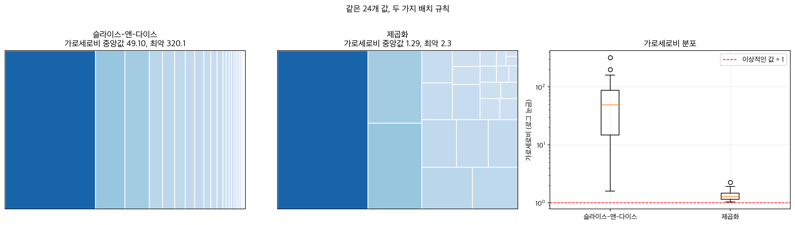
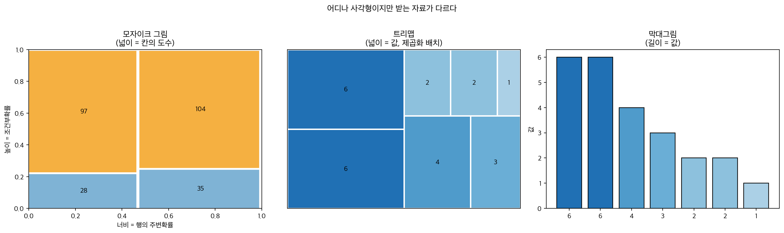
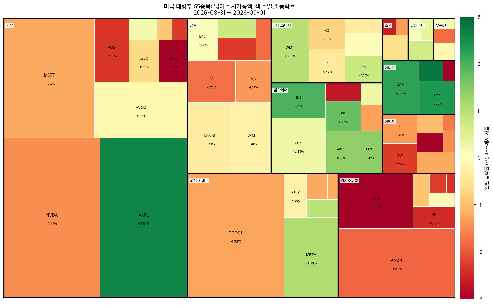

# 트리맵

주식 시황을 한 화면에 보여 주는 그림이 있다. 네모 하나가 종목 하나이고, **네모의 크기가 시가총액**, **색이 등락률**, **묶음이 업종**이다. 초록이 많으면 오른 날, 빨강이 많으면 내린 날이다. 금융 정보 사이트의 "시장 지도"가 이것이며, 영어로는 **treemap**이라 부른다.

이 그림을 **모자이크 그림이라 부르는 일이 흔한데 둘은 다른 도구다.** 이 절은 그 차이에서 출발해 트리맵을 만들고, 마지막에 **이 그림이 조용히 오해를 부르는 지점**을 짚는다.

---

## 1. 사각형을 어떻게 놓는가

넓이만 정해져 있고 모양은 자유다. **어떻게 놓느냐가 읽기 쉬운 정도를 좌우한다.**

<div class="exbox" markdown>

**보기 1.** <span class="diff easy" title="쉬움"></span> 트리맵이 반드시 지켜야 하는 것과 지킬 수 없는 것. 값 $6, 6, 4, 3, 2, 2, 1$ 을 $6 \times 4$ 직사각형에 제곱화 배치로 담는다.

**(1)** 타일 넓이의 합이 반드시 전체 넓이와 같음을 보이고, 그 결과 트리맵에 **담을 수 없는 값**이 무엇인지 말하시오.

**(2)** 한 줄에 여러 타일을 놓을 때 각 타일의 가로세로비를 **줄의 폭과 타일 넓이만으로** 적으시오. 그 식에서 **작은 타일이 왜 반드시 길쭉해지는지** 밝히시오.

**(3)** 배치해 넓이와 가로세로비를 재어 (1), (2)를 확인하고, 가장 큰 타일과 가장 작은 타일의 가로세로비를 적으시오.

</div>

??? success "풀이"

    가장 널리 쓰이는 방법은 **제곱화(squarified)** 배치다. 사각형의 **가로세로비를 되도록 $1$ 에 가깝게** 유지한다. 길쭉한 조각은 넓이를 가늠하기 어렵기 때문이다.

    **(1) 해석적으로.** 값 $v_1, \ldots, v_K$ 를 가로 $DX$, 세로 $DY$ 인 영역에 담을 때, 타일 $k$ 의 넓이를

    $$
    a_k = v_k \cdot \frac{DX \cdot DY}{\sum_j v_j}
    $$

    로 정한다. 그러면

    $$
    \sum_{k=1}^{K} a_k = \frac{DX \cdot DY}{\sum_j v_j}\sum_{k} v_k = DX \cdot DY
    $$

    로 **타일 넓이의 합이 전체 넓이와 정확히 같다.** 트리맵은 영역을 빈틈도 겹침도 없이 분할하므로 이것은 선택이 아니라 **구조가 강제하는 항등식**이다. 배치 알고리즘을 어떻게 바꾸어도 깨지지 않는다.

    그 대가로 **넓이가 될 수 없는 값은 담을 수 없다.**

    - **음수.** $v_k < 0$ 이면 $a_k < 0$ 인데 넓이가 음수인 사각형이 없다. 손익, 증감, 편차는 트리맵에 넣을 수 없다. 실무에서 흔한 잘못이 손익을 트리맵으로 그리는 것인데, 그러면 음수를 절댓값으로 바꾸고 색으로 부호를 나타내는 식이 되어 **넓이와 색이 같은 변수를 두 번 말하게** 된다.
    - **합이 $0$ 이거나 음수인 목록.** 분모 $\sum v_j$ 가 $0$ 이면 식이 정의되지 않는다. 코드가 `total <= 0` 에서 빈 목록을 돌려주는 까닭이다.
    - **합이 뜻 없는 값.** 비율, 순위, 온도처럼 더해서 뜻이 생기지 않는 양은 "전체를 나눈 몫" 이 될 수 없다. 원그래프와 같은 제약이다([원그래프](pie_charts.md) 보기 1).

    **(2) 가로세로비는 줄의 폭이 정한다.** 제곱화 배치는 타일을 한 줄씩 묶어 놓는다. 줄에 담긴 넓이의 합이 $s$ 이고 그 줄이 길이 $L$ 인 변에 붙는다면 줄의 폭은

    $$
    w = \frac{s}{L}
    $$

    이고, 그 줄의 타일 $i$ 는 폭이 $w$ 로 같으므로 높이가 $h_i = a_i/w$ 다. 따라서 가로세로비는

    $$
    \rho_i = \max\!\left(\frac{w}{h_i},\ \frac{h_i}{w}\right)
    = \max\!\left(\frac{w^2}{a_i},\ \frac{a_i}{w^2}\right)
    $$

    로 **줄의 폭과 자기 넓이만으로 정해진다.** $w = s/L$ 을 넣으면

    $$
    \rho_i = \max\!\left(\frac{s^2}{L^2 a_i},\ \frac{L^2 a_i}{s^2}\right)
    $$

    이고, 한 줄의 최악값은 $a_i$ 가 가장 작거나 가장 클 때 나온다.

    $$
    \text{worst}(\text{줄}, L) = \max\!\left(\frac{L^2 a_{\max}}{s^2},\ \frac{s^2}{L^2 a_{\min}}\right)
    $$

    **아래 코드의 `worst` 함수가 바로 이 식이다.** 알고리즘은 한 줄에 타일을 계속 더해 보다가 이 값이 나빠지는 순간 줄을 끊는다.

    **작은 타일이 길쭉해지는 까닭도 이 식에 있다.** 같은 줄 안에서는 $w$ 가 공통이므로 $\rho_i \ge w^2/a_i$ 이고, 이것은 $a_i$ 에 **반비례**한다. 곧 같은 줄의 두 타일이 넓이로 $t$ 배 차이 나면 가로세로비도 최대 $t$ 배까지 벌어진다. **알고리즘이 쓸 수 있는 유일한 손잡이는 "어느 타일을 한 줄에 묶을까" 뿐이고, 한 타일의 넓이가 정해진 이상 모양을 완전히 맞출 방법은 없다.**

    **(3) 수치적으로.**

    ```python
    def squarify(values, x, y, dx, dy):
        """넓이가 values 에 비례하는 사각형들로 (x,y,dx,dy) 직사각형을 덮는다.

        브륄스-허잇-판빅(1999)의 제곱화 알고리즘.
        values 는 내림차순으로 정렬되어 있다고 가정한다.
        """
        rects = []
        vals = list(values)
        total = sum(vals)
        if total <= 0:
            return rects
        # 값을 실제 화면 넓이 단위로 환산한다.
        vals = [v * dx * dy / total for v in vals]

        def worst(row, length):
            """한 줄에 row 를 놓았을 때 가로세로비의 최악값."""
            s = sum(row)
            if s == 0 or length == 0:
                return float("inf")
            mx, mn = max(row), min(row)
            return max(length * length * mx / (s * s), s * s / (length * length * mn))

        def layout_row(row, x, y, dx, dy):
            """row 를 짧은 변에 맞춰 한 줄로 배치하고 남은 영역을 돌려준다."""
            s = sum(row)
            out = []
            if dx >= dy:                      # 남은 영역이 가로로 길면 세로 열로 쌓는다
                w = s / dy if dy else 0
                cy = y
                for v in row:
                    h = v / w if w else 0
                    out.append((x, cy, w, h))
                    cy += h
                return out, (x + w, y, dx - w, dy)
            else:                             # 세로로 길면 가로 행으로 쌓는다
                h = s / dx if dx else 0
                cx = x
                for v in row:
                    w = v / h if h else 0
                    out.append((cx, y, w, h))
                    cx += w
                return out, (x, y + h, dx, dy - h)

        # 한 줄에 계속 더해 보다가, 더 넣으면 가로세로비가 나빠지는 순간 줄을 확정한다.
        row = []
        i = 0
        while i < len(vals):
            length = min(dx, dy)
            if not row or worst(row + [vals[i]], length) <= worst(row, length):
                row.append(vals[i]); i += 1
            else:
                placed, (x, y, dx, dy) = layout_row(row, x, y, dx, dy)
                rects += placed
                row = []
        if row:
            placed, _ = layout_row(row, x, y, dx, dy)
            rects += placed
        return rects


    # 넓이가 정확히 값에 비례하는지 확인한다.
    v = sorted([6, 6, 4, 3, 2, 2, 1], reverse=True)
    R = squarify(v, 0, 0, 6, 4)
    print(f"값 {v},  전체 넓이 {6 * 4}")
    print(f"{'값':>4s}{'넓이':>10s}{'기대':>10s}{'가로세로비':>11s}{'max(w^2/a, a/w^2)':>20s}")
    for val, (x0, y0, w, h) in zip(v, R):
        a = w * h
        print(f"{val:>4d}{a:>10.4f}{val * 24 / sum(v):>10.4f}"
              f"{max(w / h, h / w):>11.2f}{max(w*w/a, a/(w*w)):>20.2f}")
    print(f"넓이 합 {sum(w * h for _, _, w, h in R):.6f}   전체 넓이 {6*4}")
    print(f"차이 {sum(w * h for _, _, w, h in R) - 24:.3e}")

    ratios = [max(w / h, h / w) for _, _, w, h in R]
    print(f"\n가장 큰 값 {v[0]} 의 가로세로비 {ratios[0]:.2f},  "
          f"가장 작은 값 {v[-1]} 의 가로세로비 {ratios[-1]:.2f}")
    print(f"가로세로비 범위 {min(ratios):.2f} ~ {max(ratios):.2f}")

    # (1) 넓이가 될 수 없는 값은 담을 수 없다.
    print("\n음수가 섞인 값 [6, -2, 4] 의 합 =", 6 - 2 + 4,
          "  →  -2 에 줄 넓이가 없다")
    print("합이 0 인 값 [0, 0, 0]:", squarify([0, 0, 0], 0, 0, 6, 4), "(빈 목록)")
    ```

    ```text
    값 [6, 6, 4, 3, 2, 2, 1],  전체 넓이 24
       값        넓이        기대      가로세로비   max(w^2/a, a/w^2)
       6    6.0000    6.0000       1.50                1.50
       6    6.0000    6.0000       1.50                1.50
       4    4.0000    4.0000       1.36                1.36
       3    3.0000    3.0000       1.81                1.81
       2    2.0000    2.0000       1.39                1.39
       2    2.0000    2.0000       1.39                1.39
       1    1.0000    1.0000       2.78                2.78
    넓이 합 24.000000   전체 넓이 24
    차이 0.000e+00

    가장 큰 값 6 의 가로세로비 1.50,  가장 작은 값 1 의 가로세로비 2.78
    가로세로비 범위 1.36 ~ 2.78

    음수가 섞인 값 [6, -2, 4] 의 합 = 8   →  -2 에 줄 넓이가 없다
    합이 0 인 값 [0, 0, 0]: [] (빈 목록)
    ```

    **(1)이 확인된다.** 넓이가 값과 정확히 비례하고, 넓이의 합이 전체 넓이 $24$ 와 **부동소수 오차조차 없이**(`차이 0.000e+00`) 같다. 이것은 배치 방법과 무관하게 반드시 성립해야 하는 성질이다. 합이 $0$ 인 목록에는 아무 타일도 만들지 못한다.

    **(2)도 확인된다.** 네 번째 열의 측정값과 다섯 번째 열의 $\max(w^2/a,\ a/w^2)$ 가 모든 타일에서 같다. 가로세로비가 **줄의 폭과 자기 넓이만으로** 결정된다는 것이다.

    **가로세로비는 $1.36$ 에서 $2.78$ 까지로 대체로 정사각형에 가깝다.** 그런데 그 양 끝을 보라.

    | | 값 | 가로세로비 |
    |---|---|---|
    | 가장 큰 타일 | $6$ | $\mathbf{1.50}$ |
    | 가장 작은 타일 | $1$ | $\mathbf{2.78}$ |

    **가장 작은 타일이 가장 길쭉하다.** 넓이가 $6$ 배 작으니 (2)의 $\rho_i \ge w^2/a_i$ 가 최대 $6$ 배까지 나빠질 수 있다고 예고했고, 실제로 $1.50 \to 2.78$ 로 $1.85$ 배 나빠졌다. **작은 조각일수록 모양을 맞추기 어렵다**는 것이 이 알고리즘의 알려진 한계이고, 그것은 구현의 흠이 아니라 **넓이를 고정한 채 모양을 고르려는 일의 산술적 한계**다. 종목 수백 개를 담는 실제 시황 지도에서 작은 칸의 넓이 판독이 무너지는 까닭이 이것이다(보기 5).

<div class="exbox" markdown>

**보기 2.** <span class="diff easy" title="쉬움"></span> 배치 규칙을 바꾸면 모양이 얼마나 나빠지는가. 파레토 분포로 만든 값 $24$ 개(합 $533.5$, 가장 작은 값 $1.0$)를 $10 \times 6$ 영역에 담는다.

**(1)** 한 방향으로만 차례로 자르는 배치(slice-and-dice)에서 타일 $k$ 의 가로세로비를 비중 $p_k$ 와 영역 크기 $DX$, $DY$ 로 **닫힌 꼴**로 적고, 최악값을 $p_{\min}$ 으로 나타내시오.

**(2)** 그 식으로 최악 가로세로비와 중앙값을 예측하고, 두 배치를 실제로 재어 확인하시오.

</div>

??? success "풀이"

    가장 단순한 배치는 **한 방향으로만 차례로 자르는** 방법이다(slice-and-dice). 구현이 쉽고 **순서가 보존**된다는 장점이 있다.

    **(1) 해석적으로.** 세로로만 자르면 타일 $k$ 는 폭이 $DX \cdot p_k$, 높이가 $DY$ 로 **영역 전체의 높이**다. 그러므로

    $$
    \rho_k = \max\!\left(\frac{DX\, p_k}{DY},\ \frac{DY}{DX\, p_k}\right)
    $$

    다. 보기 1 의 식에서 줄 길이가 $L = DY$ 로 고정되고 줄마다 타일이 하나뿐인 특수한 경우다.

    $p_k$ 가 작으면 둘째 항이 커지므로

    $$
    \rho_k \approx \frac{DY}{DX\, p_k} \ \propto\ \frac{1}{p_k}
    $$

    **비중에 반비례한다.** 최악값은 가장 작은 비중에서 나오고

    $$
    \rho_{\max} = \frac{DY}{DX\, p_{\min}} = \frac{DY \sum_j v_j}{DX\, v_{\min}}
    $$

    이다. 이 자료는 $DX = 10$, $DY = 6$, $\sum v = 533.5$, $v_{\min} = 1.0$ 이므로

    $$
    \rho_{\max} = \frac{6 \times 533.5}{10 \times 1.0} = 320.1
    $$

    을 예측한다. **자료가 치우칠수록 $p_{\min}$ 이 작아져 최악값이 그만큼 선형으로 나빠진다.** 제곱화 배치는 여러 타일을 한 줄로 묶어 $L$ 과 줄 폭을 조절하므로 이 선형 폭발을 피한다.

    **(2) 수치적으로.**

    ```python
    import numpy as np
    import matplotlib.pyplot as plt

    plt.rcParams["font.sans-serif"] = ["NanumGothic", "Apple SD Gothic Neo", "Malgun Gothic"]
    plt.rcParams["font.family"] = "sans-serif"
    plt.rcParams["axes.unicode_minus"] = False            # 음수 기호가 네모가 되지 않게


    def slice_dice(values, x, y, dx, dy, vertical=True):
        """단순 분할: 한 방향으로만 차례로 자른다."""
        out = []
        tot = sum(values)
        pos = x if vertical else y
        for v in values:
            if vertical:
                w = dx * v / tot
                out.append((pos, y, w, dy)); pos += w
            else:
                h = dy * v / tot
                out.append((x, pos, dx, h)); pos += h
        return out


    rng = np.random.default_rng(3)
    # 파레토 분포로 '몇 개가 아주 크고 대부분 작은' 현실적인 값을 만든다.
    vals = sorted(np.round(rng.pareto(1.1, 24) * 10 + 1, 1), reverse=True)

    fig, ax = plt.subplots(1, 3, figsize=(16, 4.4))
    for a, (R, title) in zip(ax, [(slice_dice(vals, 0, 0, 10, 6), "슬라이스-앤-다이스"),
                                  (squarify(vals, 0, 0, 10, 6), "제곱화")]):
        ratios = [max(w / h, h / w) for _, _, w, h in R]
        cm = plt.get_cmap("Blues")
        for v_, (x0, y0, w, h) in zip(vals, R):
            a.add_patch(plt.Rectangle((x0, y0), w, h,
                        facecolor=cm(0.2 + 0.6 * v_ / max(vals)),
                        edgecolor="white", linewidth=1.2))
        a.set_xlim(0, 10); a.set_ylim(0, 6)
        a.set_xticks([]); a.set_yticks([])
        a.set_title(f"{title}\n가로세로비 중앙값 {np.median(ratios):.2f}, "
                    f"최악 {max(ratios):.1f}")

    r1 = [max(w / h, h / w) for _, _, w, h in slice_dice(vals, 0, 0, 10, 6)]
    r2 = [max(w / h, h / w) for _, _, w, h in squarify(vals, 0, 0, 10, 6)]
    ax[2].boxplot([r1, r2], labels=["슬라이스-앤-다이스", "제곱화"])
    ax[2].set_yscale("log")
    ax[2].axhline(1, color="red", ls="--", lw=1, label="이상적인 값 = 1")
    ax[2].set_ylabel("가로세로비 (로그 눈금)"); ax[2].set_title("가로세로비 분포")
    ax[2].legend(); ax[2].grid(alpha=0.25)

    fig.suptitle("같은 24개 값, 두 가지 배치 규칙", y=1.02)
    fig.tight_layout()
    plt.show()

    print(f"slice-and-dice: 중앙값 {np.median(r1):.2f}, 최악 {max(r1):.1f}")
    print(f"squarified:     중앙값 {np.median(r2):.2f}, 최악 {max(r2):.1f}")

    # (1) 닫힌 꼴이 실측과 맞는지 확인한다.
    p = np.array(vals, float) / sum(vals)
    DX, DY = 10.0, 6.0
    pred = np.maximum(DX * p / DY, DY / (DX * p))
    print(f"\n값 {len(vals)}개, 합 {sum(vals):.1f}, 가장 작은 값 {min(vals):.1f}")
    print(f"닫힌 꼴과 실측이 같은가 {np.allclose(pred, r1)}"
          f"   최대 차이 {np.abs(pred - np.array(r1)).max():.1e}")
    print(f"가장 작은 비중 p_min = {p.min():.6f}")
    print(f"  예측 최악 DY/(DX*p_min) = {DY/(DX*p.min()):.1f}   실측 {max(r1):.1f}")
    print(f"  예측 중앙값             = {np.median(pred):.2f}    실측 {np.median(r1):.2f}")
    print(f"\n제곱화 / 슬라이스-앤-다이스 중앙값 비 "
          f"{np.median(r1)/np.median(r2):.1f} 배")
    ```

    

    ```text
    slice-and-dice: 중앙값 49.10, 최악 320.1
    squarified:     중앙값 1.29, 최악 2.3

    값 24개, 합 533.5, 가장 작은 값 1.0
    닫힌 꼴과 실측이 같은가 True   최대 차이 2.8e-14
    가장 작은 비중 p_min = 0.001874
      예측 최악 DY/(DX*p_min) = 320.1   실측 320.1
      예측 중앙값             = 49.10    실측 49.10

    제곱화 / 슬라이스-앤-다이스 중앙값 비 38.1 배
    ```

    **닫힌 꼴이 실측과 소수 열넷째 자리까지 같다.** 예측한 최악값 $320.1$ 과 중앙값 $49.10$ 이 그대로 나왔다.

    **같은 값인데 왼쪽은 읽을 수 없다.** 가로세로비의 중앙값이 **$49.10$** 이고 최악은 **$320.1$** 이다. 폭이 $1$ 픽셀도 안 되는 실오라기 같은 조각이 된다.

    | 배치 | 가로세로비 중앙값 | 최악 |
    |---|---|---|
    | slice-and-dice | **49.10** | **320.1** |
    | **제곱화** | **1.29** | **2.3** |

    **38배 차이다.** 넓이는 양쪽 모두 정확한데, **읽을 수 있느냐가 완전히 다르다.**

    **이것이 트리맵의 첫 번째 함정이다.** 같은 자료·같은 넓이인데 **배치 알고리즘이라는 자의적 선택이 그림의 쓸모를 정한다.** 앞 절들에서 본 구조와 같다 — 자료가 아니라 분석자의 선택이 결과를 움직인다.

    **그래도 slice-and-dice에는 쓸모가 있다.** **순서가 보존**되므로 시간 순서나 크기 순위를 유지해야 할 때 쓴다. 제곱화 배치는 **인접 관계가 뒤죽박죽**이 되어 순서 정보를 잃는다.

---

## 2. 모자이크 그림과 무엇이 다른가

둘 다 화면을 사각형으로 채우고 **넓이로 크기를 나타낸다.** 그래서 겉모습이 비슷하다. 그러나 **받는 자료와 넓이의 뜻이 다르다.**

<div class="exbox" markdown>

**보기 3.** <span class="diff easy" title="쉬움"></span> 타일을 그리는 네 수 가운데 자료가 정하는 것은 몇 개인가.

**(1)** 모자이크 타일의 $(x, y, w, h)$ 를 분할표의 확률로 모두 적으시오. 트리맵 타일에서는 자료가 묶는 식이 몇 개인가.

**(2)** 그 차이를 확인하도록, 같은 값 목록을 가로세로비가 다른 네 영역에 담아 **넓이 비중은 그대로이고 모양은 달라짐**을 보이시오.

**(3)** 모자이크 그림·트리맵·막대그림을 나란히 그려 세 도구가 받는 자료와 읽는 법을 정리하시오.

</div>

??? success "풀이"

    **(1) 해석적으로.** 모자이크 그림에서는 네 수가 모두 자료의 함수다. 행을 $i$, 열을 $j$ 라 하면

    $$
    w_i = p_{i\cdot}, \qquad
    h_{ij} = p_{j \mid i}, \qquad
    x_i = \sum_{l < i} p_{l\cdot}, \qquad
    y_{ij} = \sum_{l < j} p_{l \mid i}
    $$

    이다([모자이크 그림](mosaic.md) 보기 3). **자료가 정하지 않는 것은 범주를 어느 순서로 늘어놓을지뿐이고, 좌표의 값 자체는 하나도 자유롭지 않다.** 그래서 분할선의 위치가 정보이고, 분할선이 나란하면 독립이라는 판정이 눈으로 가능하다.

    트리맵 타일에서는 자료가 묶는 식이

    $$
    w_k h_k = a_k
    $$

    **하나뿐이다.** 네 수 가운데 한 식만 제약되므로 나머지 세 자유도는 전부 **배치 알고리즘의 몫**이다. 그러므로

    - 영역의 가로세로비를 바꾸면 모든 타일의 $w, h$ 가 달라지는데 $wh$ 만 그대로다.
    - 알고리즘을 바꾸면 $x, y$ 도 전부 달라진다(보기 2).
    - **두 칸이 이웃이라는 사실에 아무 뜻이 없다.** 트리맵에서 인접 관계로 무언가를 읽으면 그것은 알고리즘을 읽은 것이다.

    **(2)와 (3) 수치적으로.**

    ```python
    import matplotlib.pyplot as plt
    import numpy as np

    plt.rcParams["font.sans-serif"] = ["NanumGothic", "Apple SD Gothic Neo", "Malgun Gothic"]
    plt.rcParams["font.family"] = "sans-serif"
    plt.rcParams["axes.unicode_minus"] = False            # 음수 기호가 네모가 되지 않게

    fig, ax = plt.subplots(1, 3, figsize=(16, 4.6))

    # ── (1) 모자이크: 분할표를 받는다 ─────────────────────────────────
    tab = np.array([[28, 97], [35, 104]], float)     # SUV/비SUV x 사고/무사고
    n = tab.sum()
    colw = tab.sum(1) / n                            # 열 너비 = 주변확률
    x = 0
    for i, (w, row) in enumerate(zip(colw, tab)):
        y = 0
        for j, v in enumerate(row):
            h = v / row.sum()                        # 높이 = 조건부확률
            ax[0].add_patch(plt.Rectangle((x, y), w - 0.01, h - 0.006,
                            facecolor=["#7fb3d5", "#f5b041"][j], edgecolor="white"))
            ax[0].text(x + w / 2, y + h / 2, f"{int(v)}",
                       ha="center", va="center", fontsize=10)
            y += h
        x += w
    ax[0].set_xlim(0, 1); ax[0].set_ylim(0, 1)
    ax[0].set_title("모자이크 그림\n(넓이 = 칸의 도수)")
    ax[0].set_xlabel("너비 = 행의 주변확률")
    ax[0].set_ylabel("높이 = 조건부확률")

    # ── (2) 트리맵: 값의 목록을 받는다 ────────────────────────────────
    v = sorted([6, 6, 4, 3, 2, 2, 1], reverse=True)
    R = squarify(v, 0, 0, 6, 4)                      # 1절에서 만든 함수
    cmap = plt.get_cmap("Blues")
    for val, (x0, y0, w, h) in zip(v, R):
        ax[1].add_patch(plt.Rectangle((x0, y0), w, h,
                        facecolor=cmap(0.25 + 0.5 * val / max(v)),
                        edgecolor="white", linewidth=2))
        ax[1].text(x0 + w / 2, y0 + h / 2, str(val),
                   ha="center", va="center", fontweight="bold")
    ax[1].set_xlim(0, 6); ax[1].set_ylim(0, 4)
    ax[1].set_title("트리맵\n(넓이 = 값, 제곱화 배치)")
    ax[1].set_xticks([]); ax[1].set_yticks([])

    # ── (3) 같은 값을 막대로 ─────────────────────────────────────────
    ax[2].bar(range(len(v)), v,
              color=[cmap(0.25 + 0.5 * z / max(v)) for z in v], edgecolor="black")
    ax[2].set_title("막대그림\n(길이 = 값)")
    ax[2].set_xticks(range(len(v))); ax[2].set_xticklabels([str(z) for z in v])
    ax[2].set_ylabel("값")

    fig.suptitle("어디나 사각형이지만 받는 자료가 다르다", y=1.02)
    fig.tight_layout()
    plt.show()

    # (2) 같은 값을 네 영역에 담는다. 넓이 비중은 불변, 모양은 달라진다.
    tot = sum(v)
    print(f"{'영역':>12}{'넓이 비중이 v/sum(v) 인가':>26}"
          f"{'가로세로비 중앙값':>20}{'최악':>9}{'가장 작은 타일':>14}")
    for DX, DY in [(6.0, 4.0), (4.0, 6.0), (12.0, 2.0), (24.0, 1.0)]:
        RR = squarify(v, 0, 0, DX, DY)
        share = np.array([w * h / (DX * DY) for _, _, w, h in RR])
        ok = np.allclose(share, np.array(v, float) / tot)
        rho = np.array([max(w / h, h / w) for _, _, w, h in RR])
        print(f"{f'{DX:g} x {DY:g}':>12}{str(ok):>26}{np.median(rho):>20.2f}"
              f"{rho.max():>9.2f}{rho[-1]:>14.2f}")

    # (1) 모자이크 타일은 네 수 모두 자료가 정한다.
    n = tab.sum()
    print("\n모자이크 타일의 네 수는 모두 자료가 정한다")
    xx = 0.0
    for i, row in enumerate(tab):
        w = row.sum() / n
        yy = 0.0
        for j, val in enumerate(row):
            h = val / row.sum()
            print(f"  ({i},{j})  x={xx:.4f}  y={yy:.4f}  w={w:.4f}  h={h:.4f}"
                  f"   넓이 {w*h:.4f} = 도수/n {val/n:.4f}")
            yy += h
        xx += w
    ```

    출력:

    ```
              영역        넓이 비중이 v/sum(v) 인가           가로세로비 중앙값       최악      가장 작은 타일
           6 x 4                      True                1.50     2.78          2.78
           4 x 6                      True                1.50     2.78          2.78
          12 x 2                      True                1.50     4.00          4.00
          24 x 1                      True                3.00     6.00          1.00

    모자이크 타일의 네 수는 모두 자료가 정한다
      (0,0)  x=0.0000  y=0.0000  w=0.4735  h=0.2240   넓이 0.1061 = 도수/n 0.1061
      (0,1)  x=0.0000  y=0.2240  w=0.4735  h=0.7760   넓이 0.3674 = 도수/n 0.3674
      (1,0)  x=0.4735  y=0.0000  w=0.5265  h=0.2518   넓이 0.1326 = 도수/n 0.1326
      (1,1)  x=0.4735  y=0.2518  w=0.5265  h=0.7482   넓이 0.3939 = 도수/n 0.3939
    ```

    

    **네 영역 모두 `True` 다 — 넓이 비중이 $v_k/\sum v$ 로 똑같다.** 그런데 가로세로비는 영역에 따라 중앙값 $1.50 \to 3.00$, 최악 $2.78 \to 6.00$ 으로 달라진다. 가장 작은 타일은 $6\times4$ 에서 $2.78$ 로 가장 길쭉한데 $24\times1$ 에서는 $1.00$, 곧 **정확한 정사각형**이 된다. **같은 자료, 같은 넓이, 다른 모양이다.** 자료가 묶는 식이 $wh = a_k$ 하나뿐이라는 (1)의 결론이 이 표다.

    **모자이크는 그렇지 않다.** 네 칸의 $x, y, w, h$ 가 모두 확률로 적히고 넓이가 도수$/n$ 과 소수 넷째 자리까지 일치한다. 영역의 모양을 바꿀 여지가 없다 — 단위정사각형이 정해져 있기 때문이다.

    **세 그림이 받는 자료부터 다르다.**

    | | 모자이크 그림 | 트리맵 |
    |---|---|---|
    | **입력** | **분할표**(두 범주형 변수) | **값의 목록**(수량 하나) |
    | 넓이의 뜻 | **결합확률**(= 도수) | 그 값 자체 |
    | 너비·높이 | **주변확률 × 조건부확률** | 아무 뜻 없음 |
    | 위치 | **범주의 순서** | 아무 뜻 없음 |
    | 계층 | 보통 2~3개 변수 | **몇 단계든 중첩** |
    | 무엇을 보나 | **독립 여부**, 조건부확률 | **상대적 크기**, 구성 |

    **모자이크 그림에서는 너비와 높이가 각각 의미를 갖는다.** [모자이크 그림](mosaic.md) 절에서 보았듯 넓이 $=$ 너비 $\times$ 높이가 곧 **결합확률 $=$ 주변확률 $\times$ 조건부확률**이다. 그래서 **분할선이 나란하면 독립**이라는 판정이 눈으로 가능하다.

    **트리맵에는 그런 구조가 없다.** 넓이만 뜻이 있고 **가로세로 비와 위치는 배치 알고리즘이 정한 것**일 뿐이다. 같은 자료라도 알고리즘을 바꾸면 전혀 다르게 보인다(1절).

    **막대그림 (3)이 값을 읽기에는 가장 정확하다.** [막대그림](bar_charts.md) 절의 지각 서열에서 **길이는 3위, 넓이는 5위**였다. 그러면 왜 트리맵을 쓰는가.

    | 막대그림이 안 되는 상황 | 트리맵이 하는 일 |
    |---|---|
    | 항목이 수백 개 | **화면을 빈틈없이 채운다** |
    | 값의 규모 차가 100배 이상 | 작은 것도 자리를 갖는다 |
    | **계층 구조**(업종 → 종목) | **중첩으로 표현** |
    | 두 번째 변수도 보이고 싶다 | **색을 함께 쓴다** |

    **트리맵은 정밀한 비교가 아니라 훑어보기를 위한 도구**다. 이 구분이 이 절 전체를 관통한다.

그런데 두 그림이 **아주 무관한 것도 아니다.** 둘 다 **직사각형을 재귀적으로 쪼개 화면을 채운다**는 점에서 같은 가족이다. 그 관계를 정확히 짚어 두면 앞의 표가 왜 그렇게 되는지도 설명된다.

<div class="exbox" markdown>

**보기 4.** <span class="diff easy" title="쉬움"></span> 두 그림이 같은 가족임을 좌표로 확인하기. SUV $\times$ 사고 분할표를 쓴다.

**(1)** 분할표를 계층(행 $\to$ 열)으로 보고 **방향을 번갈아 가며 `slice_dice` 를 두 번** 적용하면 모자이크 그림의 좌표가 그대로 나옴을 식으로 보이시오.

**(2)** 두 방식의 좌표를 실제로 계산해 맞대어 확인하시오.

**(3)** 그러면 모자이크 그림과 트리맵을 가르는 것이 무엇인지 정리하시오.

</div>

??? success "풀이"

    **주장.** 분할표를 계층으로 보고(행 $\to$ 열), 잎의 값을 칸의 도수로 두고, **방향을 번갈아 가며 1절의 `slice_dice` 를 두 번 적용하면 모자이크 그림이 그대로 나온다.**

    **(1) 해석적으로.** 단위정사각형에서 시작한다.

    **1단계.** `slice_dice` 를 행의 주변비중 $p_{i\cdot} = n_{i\cdot}/n$ 에 세로 방향으로 적용하면, 행 $i$ 의 띠는

    $$
    x_i = \sum_{l<i} p_{l\cdot}, \quad w_i = p_{i\cdot}, \quad y = 0, \quad h = 1
    $$

    을 얻는다. `slice_dice` 가 하는 일이 "비중에 비례해 한 방향으로 차례로 자르기" 이므로 폭이 곧 $p_{i\cdot}$ 다.

    **2단계.** 그 띠 안에서 같은 함수를 **가로 방향으로** 조건부비중 $p_{j\mid i} = n_{ij}/n_{i\cdot}$ 에 적용하면

    $$
    y_{ij} = \sum_{l<j} p_{l \mid i}, \quad h_{ij} = p_{j\mid i}
    $$

    가 되고 $x, w$ 는 1단계의 값을 물려받는다. 네 수가 보기 3 에서 적은 모자이크 타일의 정의와 **글자 그대로 같다.**

    넓이도 저절로 맞는다. 곱셈 규칙 때문이다.

    $$
    w_i \, h_{ij} = p_{i\cdot}\, p_{j\mid i} = p_{ij} = \frac{n_{ij}}{n}
    $$

    **그러므로 좌표가 수치적으로도 비트 단위로 같아야 한다** — 같은 수를 같은 순서로 곱하고 더하기 때문이다. 아래에서 차이가 정확히 $0$ 인지 본다.

    ```python
    import numpy as np

    tab = np.array([[28., 97.], [35., 104.]])      # SUV x 사고
    n = tab.sum()

    # (A) 모자이크를 정의대로 그린다: 열 너비 = 주변확률, 행 높이 = 조건부확률
    mosaic = []
    x = 0
    for i, row in enumerate(tab):
        w = row.sum() / n                          # P(행)
        y = 0
        for j, v in enumerate(row):
            h = v / row.sum()                      # P(열 | 행)
            mosaic.append((i, j, x, y, w, h))
            y += h
        x += w

    # (B) slice_dice 를 계층 2단계로 적용한다 (방향을 번갈아)
    tm = []
    lvl1 = slice_dice(tab.sum(1) / n, 0, 0, 1, 1, vertical=True)     # 1단계: 세로로 분할
    for i, (gx, gy, gw, gh) in enumerate(lvl1):
        lvl2 = slice_dice(tab[i] / tab[i].sum(), gx, gy, gw, gh,
                          vertical=False)                            # 2단계: 가로로 분할
        for j, (x0, y0, w, h) in enumerate(lvl2):
            tm.append((i, j, x0, y0, w, h))

    print(f"{'칸':>6s}{'모자이크 (x,y,w,h)':>34s}{'트리맵 (x,y,w,h)':>34s}{'차이':>10s}")
    worst = 0.0
    for (i, j, *a), (_, _, *b) in zip(mosaic, tm):
        dmax = max(abs(p - q) for p, q in zip(a, b))
        worst = max(worst, dmax)
        fa = "(%.4f,%.4f,%.4f,%.4f)" % tuple(a)
        fb = "(%.4f,%.4f,%.4f,%.4f)" % tuple(b)
        print(f"{f'({i},{j})':>6s}{fa:>34s}{fb:>34s}{dmax:>10.2e}")

    print(f"\n두 방식의 최대 좌표 차이 {worst:.3e}")
    print("넓이가 도수/n 과 일치하는가:",
          all(abs(w * h - tab[i, j] / n) < 1e-12 for i, j, _, _, w, h in tm))
    ```

    ```text
         칸                    모자이크 (x,y,w,h)                     트리맵 (x,y,w,h)        차이
     (0,0)     (0.0000,0.0000,0.4735,0.2240)     (0.0000,0.0000,0.4735,0.2240)  0.00e+00
     (0,1)     (0.0000,0.2240,0.4735,0.7760)     (0.0000,0.2240,0.4735,0.7760)  0.00e+00
     (1,0)     (0.4735,0.0000,0.5265,0.2518)     (0.4735,0.0000,0.5265,0.2518)  0.00e+00
     (1,1)     (0.4735,0.2518,0.5265,0.7482)     (0.4735,0.2518,0.5265,0.7482)  0.00e+00

    두 방식의 최대 좌표 차이 0.000e+00
    넓이가 도수/n 과 일치하는가: True
    ```

    **(2)가 확인된다. 네 칸의 좌표가 비트 단위로 같고 최대 차이가 정확히 $0$ 이다.** 우연이 아니라 **정의가 같기 때문**이다.

    $$
    \underbrace{P(\text{행})}_{\text{1단계 분할 비율}}\times
    \underbrace{P(\text{열}\mid\text{행})}_{\text{2단계 분할 비율}}
    =\underbrace{P(\text{행},\text{열})}_{\text{칸의 넓이}}
    $$

    **(3) 그러므로 "모자이크냐 트리맵이냐"는 잘못된 물음이다.** 올바른 물음은 **"어떤 계층에, 어떤 배치 규칙을 썼는가"**다.

    | | 계층 | 잎의 값 | 배치 규칙 |
    |---|---|---|---|
    | **모자이크 그림** | 교차분류(행 $\to$ 열) | 칸의 도수 | **슬라이스-앤-다이스**(방향 번갈아) |
    | **시황 지도** | 업종 $\to$ 종목 | 시가총액 | **제곱화** |

    **너비와 높이의 뜻은 슬라이스-앤-다이스가 주는 선물이다.** 방향을 번갈아 자르기 때문에 한 방향은 주변확률, 다른 방향은 조건부확률이 된다. **제곱화 배치는 그 구조를 버린다.** 가로세로비를 얻는 대가다.

    | 배치 규칙 | 너비·높이의 뜻 | 사각형 모양 |
    |---|---|---|
    | **슬라이스-앤-다이스** | **있다**(주변·조건부확률) | **나쁘다** |
    | **제곱화** | **없다** | **좋다** |

    **이 맞바꿈이 1절 보기 2의 수치를 설명한다.** 슬라이스-앤-다이스의 가로세로비 중앙값이 49.10이었다. **모자이크 그림이 작은 표에만 쓰이는 이유가 이것이다.** $2\times2$나 $3\times4$까지는 칸이 읽을 만하지만, 범주가 수십 개면 실오라기가 된다.

    **거꾸로, 시황 지도에 모자이크식 배치를 쓸 수 없는 이유**도 같다. 65종목을 슬라이스-앤-다이스로 자르면 세로줄 65개가 되어 아무것도 안 보인다.

---

## 3. 실제 자료: 시가총액 지도

<div class="exbox" markdown>

**보기 5.** <span class="diff easy" title="쉬움"></span> 넓이 비 $93$ 배가 눈에는 몇 배로 보이는가. 미국 대형주 $65$ 종목의 시가총액을 $100 \times 62$ 영역에 담는다.

**(1)** 넓이가 값에 비례하므로 두 칸의 **변 길이** 비는 값 비의 제곱근임을 적고, 가장 큰 칸과 가장 작은 칸의 두 비를 구하시오.

**(2)** 그림의 전체 넓이가 $6200$ 이고 넓이 $45$ 이상인 칸에만 이름표를 넣는다면 **몇 종목에 이름이 붙는지**, 그리고 이름 없는 칸들이 차지하는 비중이 얼마인지 구하시오.

**(3)** 보기 2 의 닫힌 꼴로, 이 $65$ 종목을 슬라이스-앤-다이스로 자르면 최악 가로세로비가 얼마가 될지 예측하시오.

</div>

??? success "풀이"

    **(1) 해석적으로.** 타일 $k$ 의 넓이가 $a_k = A\,w_k$ 이고($A$ 는 전체 넓이, $w_k$ 는 비중), 가로세로비 $\rho_k$ 를 알면 변 길이가

    $$
    \text{긴 변} = \sqrt{a_k \rho_k}, \qquad \text{짧은 변} = \sqrt{a_k/\rho_k}
    $$

    다. 두 칸의 가로세로비가 비슷하다면 변 길이의 비는

    $$
    \frac{\sqrt{a_i}}{\sqrt{a_j}} = \sqrt{\frac{w_i}{w_j}}
    $$

    로 **값 비의 제곱근**이다. **넓이 부호화는 비를 제곱근으로 압축해 보여 준다.** 이 자료는 넓이 비가 $93.0$ 배이므로 변 길이 비는

    $$
    \sqrt{93.0} = 9.64
    $$

    배에 그친다. $93$ 배 차이가 눈에는 $9.6$ 배 차이로 다가오는 것이다. 막대그림이라면 길이 비가 그대로 $93$ 배다 — **트리맵은 큰 차이를 작아 보이게 만든다.** 작은 것도 화면에 자리를 얻는 것이 바로 이 압축 덕분이고, 동시에 그것이 이 그림의 왜곡이다.

    **(2) 이름표의 문턱.** 넓이 $45$ 는 비중으로

    $$
    \frac{45}{6200} = 0.007258
    $$

    이다. 이보다 작은 칸에는 이름이 들어가지 않는다. 아래에서 몇 종목이 걸리는지 센다.

    **(3) 슬라이스-앤-다이스라면.** 보기 2 의 식에 $DX = 100$, $DY = 62$, $p_{\min} = 0.0013$ 을 넣으면

    $$
    \rho_{\max} = \frac{DY}{DX\, p_{\min}} = \frac{62}{100 \times 0.0013115} = 472.7
    $$

    이다. 가장 작은 칸이 **세로로 길이 $62$, 폭 $0.13$** 인 실오라기가 된다. 제곱화 배치를 쓰는 까닭이 이 한 수다.

    **(4) 수치적으로.**

    ```python
    import warnings
    warnings.filterwarnings("ignore")

    import os
    import numpy as np
    import pandas as pd
    import yfinance as yf

    # 11개 업종에서 대형주를 골랐다. 실제 지수 지도는 500종목을 쓰지만
    # 구조는 같고, 여기서는 내려받는 부담을 줄였다.
    SECTORS = {
        "Technology": ["AAPL", "MSFT", "NVDA", "AVGO", "ORCL",
                       "CRM", "AMD", "ADBE", "CSCO", "ACN"],
        "Communication Services": ["GOOGL", "META", "NFLX", "DIS", "TMUS", "CMCSA"],
        "Consumer Discretionary": ["AMZN", "TSLA", "HD", "MCD", "NKE", "LOW", "SBUX"],
        "Financials": ["BRK-B", "JPM", "V", "MA", "BAC", "WFC", "GS", "AXP"],
        "Healthcare": ["LLY", "UNH", "JNJ", "ABBV", "MRK", "TMO", "ABT", "PFE"],
        "Consumer Staples": ["WMT", "COST", "PG", "KO", "PEP", "PM"],
        "Industrials": ["GE", "CAT", "RTX", "UNP", "HON", "BA", "UPS"],
        "Energy": ["XOM", "CVX", "COP", "SLB"],
        "Utilities": ["NEE", "SO", "DUK"],
        "Real Estate": ["PLD", "AMT", "EQIX"],
        "Materials": ["LIN", "SHW", "APD"],
    }
    CACHE = "datasets/stocks/sp_big.csv"

    # 한 번 받은 자료를 저장해 두고 다시 쓴다.
    # 실행 시점마다 값이 달라지면 아래 출력이 재현되지 않기 때문이다.
    d = pd.read_csv(CACHE)

    d["mcap"] = d["shares"] * d["close_last"]             # 시가총액
    d["chg"] = (d["close_last"] / d["close_prev"] - 1) * 100   # 일별 등락률 (%)
    d["w"] = d["mcap"] / d["mcap"].sum()                  # 넓이 비중

    print(f"종목 {len(d)}개, 업종 {d['sector'].nunique()}개")
    print(f"기간 {d['date_prev'].iloc[0]} -> {d['date_last'].iloc[0]}\n")

    s = d.sort_values("mcap", ascending=False)
    cum = s["w"].cumsum().to_numpy()
    print("넓이가 몇 종목에 몰려 있나")
    for k in [1, 3, 5, 10, 20]:
        print(f"  상위 {k:2d}종목 누적 비중 {cum[k - 1]:.4f}")
    print(f"  절반을 넘기는 데 필요한 종목 수 {int(np.argmax(cum >= 0.5)) + 1}\n")

    print(f"가장 큰 칸 {s.iloc[0]['ticker']}: 비중 {s.iloc[0]['w']:.4f}")
    print(f"가장 작은 칸 {s.iloc[-1]['ticker']}: 비중 {s.iloc[-1]['w']:.4f}")
    print(f"넓이 비 {s.iloc[0]['w'] / s.iloc[-1]['w']:.1f}배")

    # (1) 넓이 비는 변 길이에서 제곱근으로 압축된다.
    AX, AY = 100.0, 62.0                      # 보기 6 이 쓰는 영역
    A = AX * AY
    ratio = s.iloc[0]["w"] / s.iloc[-1]["w"]
    print(f"  변 길이 비 sqrt(넓이 비) = {np.sqrt(ratio):.2f}배")
    print(f"  정사각형이라면 한 변: 가장 큰 칸 {np.sqrt(s.iloc[0]['w']*A):.2f}, "
          f"가장 작은 칸 {np.sqrt(s.iloc[-1]['w']*A):.2f} 단위")

    # (2) 이름표 문턱 — 넓이 45 미만에는 글씨를 넣지 않는다.
    THR = 45.0
    big = s["w"] * A > THR
    print(f"\n전체 넓이 {A:.0f},  이름표 문턱 {THR:.0f}  →  비중 {THR/A:.6f}")
    print(f"이름표가 붙는 칸 {big.sum()}개 / {len(s)}개 ({big.mean():.1%}),"
          f"  그 넓이 합 {s.loc[big, 'w'].sum():.4f}")
    print(f"이름 없는 칸 {(~big).sum()}개의 넓이 합 {s.loc[~big, 'w'].sum():.4f}")

    # (3) 슬라이스-앤-다이스로 자르면 최악 가로세로비가 얼마인가.
    print(f"\nslice-and-dice 최악 가로세로비 DY/(DX*p_min) = "
          f"{AY / (AX * s.iloc[-1]['w']):.1f}")
    ```

    ```text
    종목 65개, 업종 11개
    기간 2026-08-31 -> 2026-09-01

    넓이가 몇 종목에 몰려 있나
      상위  1종목 누적 비중 0.1220
      상위  3종목 누적 비중 0.3274
      상위  5종목 누적 비중 0.4777
      상위 10종목 누적 비중 0.6347
      상위 20종목 누적 비중 0.7832
      절반을 넘기는 데 필요한 종목 수 6

    가장 큰 칸 NVDA: 비중 0.1220
    가장 작은 칸 NKE: 비중 0.0013
    넓이 비 93.0배
      변 길이 비 sqrt(넓이 비) = 9.64배
      정사각형이라면 한 변: 가장 큰 칸 27.50, 가장 작은 칸 2.85 단위

    전체 넓이 6200,  이름표 문턱 45  →  비중 0.007258
    이름표가 붙는 칸 31개 / 65개 (47.7%),  그 넓이 합 0.8771
    이름 없는 칸 34개의 넓이 합 0.1229

    slice-and-dice 최악 가로세로비 DY/(DX*p_min) = 472.7
    ```

    **여섯 종목이 화면의 절반을 차지한다.** $65$ 종목 중 $6$ 개다.

    **(1)이 확인된다.** 가장 큰 칸과 가장 작은 칸의 넓이 비가 $93.0$ 배인데 변 길이 비는 $\sqrt{93.0} = 9.64$ 배다. 정사각형으로 그렸다면 한 변이 $27.50$ 단위 대 $2.85$ 단위다. 막대그림으로 그리면 작은 막대가 보이지 않겠지만, **트리맵에서는 작은 칸도 자리를 갖는다.** 이것이 트리맵을 쓰는 이유이고, 그 자리를 만들어 주는 것이 바로 제곱근 압축이다.

    **동시에 이것이 문제이기도 하다.** 넓이가 $93$ 배 차이 나면 **작은 칸의 넓이를 서로 비교하는 일은 사실상 불가능**하다. 넓이 비중 $0.0013$ 과 $0.0026$ 은 변 길이로 $1.41$ 배 차이인데, 그런 작은 두 사각형의 변 길이 차를 눈이 구별하지 못한다.

    **(2) 이름표가 붙는 칸은 절반이 안 된다.** $65$ 종목 중 $31$ 개($47.7\%$)만 넓이 $45$ 를 넘는다. 그 $31$ 개가 화면의 $87.71\%$ 를 차지하고, **이름 없는 $34$ 개가 나머지 $12.29\%$** 다. 곧 **그림의 $12\%$ 는 "무언가 있다" 는 것만 알려 주고 그것이 무엇인지는 말하지 않는다.** 트리맵이 가리는 것이 이것이다 — 작은 칸은 넓이도 읽히지 않고 이름도 사라지므로 **정보가 아니라 배경이 된다.**

    **(3) 예측한 $472.7$ 이 그대로 나왔다.** 슬라이스-앤-다이스로 $65$ 종목을 자르면 가장 작은 칸이 가로세로비 $472.7$ 의 실오라기가 된다. 보기 4 의 마지막 문단에서 "세로줄 $65$ 개가 되어 아무것도 안 보인다" 고 한 것의 정확한 수다.

<div class="exbox" markdown>

**보기 6.** <span class="diff easy" title="쉬움"></span> 업종으로 묶으면 넓이가 달라지는가. $65$ 종목을 업종 $\to$ 종목 두 단계로 배치한다.

**(1)** 1단계가 업종 시총 합으로, 2단계가 업종 안의 종목 시총으로 나눈다면, **잎 칸의 넓이가 계층과 무관**함을 보이시오. 그렇다면 업종으로 묶는 일이 그림에 무엇을 더하는가.

**(2)** 색을 $\pm 3\%$ 에서 자를 때 몇 종목의 색이 깎이는지 세고, 그것이 **양쪽 꼬리에 고르게** 작용하는지 확인하시오.

**(3)** 지도를 그려 읽히는 것과 가려지는 것을 적으시오.

</div>

??? success "풀이"

    **(1) 해석적으로.** 전체 넓이를 $A$, 종목 $i$ 의 시총을 $m_i$, 업종 $g$ 의 합을 $M_g = \sum_{i \in g} m_i$, 전체 합을 $M = \sum_i m_i$ 라 하자.

    **1단계**에서 업종 칸의 넓이는

    $$
    A_g = A \cdot \frac{M_g}{M}
    $$

    이고, **2단계**에서 그 칸 안의 종목 $i$ 의 넓이는

    $$
    a_i = A_g \cdot \frac{m_i}{M_g} = A \cdot \frac{M_g}{M}\cdot\frac{m_i}{M_g} = A \cdot \frac{m_i}{M}
    $$

    다. **$M_g$ 가 약분되어 사라진다.** 곧 잎 칸의 넓이는 업종을 어떻게 묶든, 몇 단계로 중첩하든, 아예 묶지 않고 평평하게 그리든 **똑같다.** 중첩 트리맵의 넓이는 이 약분 덕에 계층과 무관하다.

    그러므로 업종 칸의 넓이도 저절로 맞는다.

    $$
    \sum_{i \in g} a_i = A\,\frac{M_g}{M} = A_g
    $$

    **계층이 더하는 것은 넓이가 아니라 위치다.** 같은 업종이 한 블록에 모여 그 블록의 넓이가 업종 비중으로 읽히고, 그 블록 안에서 종목을 찾게 된다. 넓이 판독에는 아무 영향이 없고 **찾기와 묶어 보기**가 쉬워진다. 보기 3 에서 "트리맵의 위치에는 뜻이 없다" 고 했는데, **계층을 넣는 것이 위치에 뜻을 주는 유일한 방법**이다.

    **(2) 색 자르기.** `TwoSlopeNorm(vmin=-3, vcenter=0, vmax=3)` 과 `np.clip` 은 $\lvert \text{등락률}\rvert > 3\%$ 인 종목을 모두 양 끝 색으로 몰아넣는다. 그 종목들 사이의 차이는 그림에서 사라진다. 자르기가 **양쪽에 고르게** 작용하는지는 자료의 범위에 달렸으니 세어 보아야 한다.

    **(3) 수치적으로.**

    ```python
    import matplotlib.pyplot as plt
    from matplotlib.colors import TwoSlopeNorm

    plt.rcParams["font.sans-serif"] = ["NanumGothic", "Apple SD Gothic Neo", "Malgun Gothic"]
    plt.rcParams["font.family"] = "sans-serif"
    plt.rcParams["axes.unicode_minus"] = False            # 음수 기호가 네모가 되지 않게


    def nested_treemap(groups, x=0.0, y=0.0, dx=1.0, dy=1.0):
        """{그룹: [(이름, 값, 색값), ...]} 를 두 단계 트리맵으로 배치한다.

        1단계: 그룹의 값 합으로 전체를 나눈다.
        2단계: 각 그룹 칸 안에서 개별 항목을 다시 나눈다.
        """
        gtot = {g: sum(v for _, v, _ in items) for g, items in groups.items()}
        order = sorted(gtot, key=gtot.get, reverse=True)      # 큰 그룹부터
        gr = squarify([gtot[g] for g in order], x, y, dx, dy)
        out = []
        for g, (gx, gy, gw, gh) in zip(order, gr):
            items = sorted(groups[g], key=lambda z: -z[1])    # 그룹 안에서도 큰 것부터
            rr = squarify([v for _, v, _ in items], gx, gy, gw, gh)
            out.append((g, (gx, gy, gw, gh),
                        [(nm, v, c, r) for (nm, v, c), r in zip(items, rr)]))
        return out


    groups = {s: [(r.ticker, r.mcap, r.chg) for r in g.itertuples()]
              for s, g in d.groupby("sector")}
    layout = nested_treemap(groups, 0, 0, 100, 62)

    # 색은 0을 가운데 두고 ±3%에서 자른다.
    # 자르지 않으면 하루 -20% 같은 한 종목이 나머지 색을 전부 눌러 버린다.
    CLIP = 3.0
    norm = TwoSlopeNorm(vmin=-CLIP, vcenter=0.0, vmax=CLIP)
    cmap = plt.get_cmap("RdYlGn")

    fig, ax = plt.subplots(figsize=(13.5, 8.6))
    for sec, (gx, gy, gw, gh), items in layout:
        for nm, v, c, (x0, y0, w, h) in items:
            ax.add_patch(plt.Rectangle((x0, y0), w, h,
                         facecolor=cmap(norm(np.clip(c, -CLIP, CLIP))),
                         edgecolor="white", linewidth=0.8))
            if w * h > 45:                       # 좁은 칸에는 글씨를 넣지 않는다
                ax.text(x0 + w / 2, y0 + h / 2 + 0.6, nm, ha="center", va="center",
                        fontsize=min(11, 5 + (w * h) ** 0.22), fontweight="bold")
                ax.text(x0 + w / 2, y0 + h / 2 - 1.3, f"{c:+.2f}%",
                        ha="center", va="center",
                        fontsize=min(9, 4 + (w * h) ** 0.19))
        ax.add_patch(plt.Rectangle((gx, gy), gw, gh, fill=False,
                     edgecolor="black", linewidth=2.2))
        SHORT = {"Technology": "기술", "Communication Services": "통신 서비스",
                 "Consumer Discretionary": "경기소비재", "Consumer Staples": "필수소비재",
                 "Financials": "금융", "Healthcare": "헬스케어",
                 "Industrials": "산업재", "Energy": "에너지",
                 "Utilities": "유틸리티", "Real Estate": "부동산", "Materials": "소재"}
        lab = SHORT.get(sec, sec)
        if gw < 12:
            lab = lab[:5]
        ax.text(gx + 0.5, gy + gh - 1.2, lab, fontsize=8.2, fontweight="bold",
                va="top", ha="left", clip_on=True,
                bbox=dict(boxstyle="square,pad=0.15", fc="white", ec="none", alpha=0.85))

    ax.set_xlim(0, 100); ax.set_ylim(0, 62)
    ax.set_xticks([]); ax.set_yticks([]); ax.set_aspect("equal")
    sm = plt.cm.ScalarMappable(cmap=cmap, norm=norm); sm.set_array([])
    cb = fig.colorbar(sm, ax=ax, fraction=0.03, pad=0.01)
    cb.set_label(f"일별 등락률 (%), ±{CLIP:.0f}%에서 자름")
    ax.set_title("미국 대형주 65종목: 넓이 = 시가총액, 색 = 일별 등락률\n"
                 f"{d['date_prev'].iloc[0]} → {d['date_last'].iloc[0]}", fontsize=12)
    fig.tight_layout()
    plt.show()

    # (1) 잎 칸의 넓이는 계층과 무관하다. 평평한 배치와 맞대어 본다.
    A = 100.0 * 62.0
    leaf = {nm: w * h for _, _, items in layout for nm, v, c, (_, _, w, h) in items}
    flat_v = d.sort_values("mcap", ascending=False)
    flat = squarify(flat_v["mcap"].tolist(), 0, 0, 100.0, 62.0)
    flat_area = {t: w * h for t, (_, _, w, h) in zip(flat_v["ticker"], flat)}
    print(f"중첩 배치 대 평평한 배치, 잎 넓이 최대 차이 "
          f"{max(abs(leaf[t] - flat_area[t]) for t in flat_area):.3e}")
    print(f"중첩 배치 대 A*w, 최대 차이 "
          f"{max(abs(leaf[r.ticker] - A * r.w) for r in d.itertuples()):.3e}")
    print(f"잎 넓이의 합 {sum(leaf.values()):.6f}   전체 넓이 {A:.0f}")

    print(f"\n{'업종':>24}{'1단계 칸 넓이':>15}{'잎 넓이 합':>13}{'비중':>9}")
    for sec, (gx, gy, gw, gh), items in layout:
        sa = sum(w * h for _, _, _, (_, _, w, h) in items)
        print(f"{sec:>24}{gw*gh:>15.2f}{sa:>13.2f}{gw*gh/A:>9.4f}")

    # (2) 색 자르기가 깎는 종목
    clipped = d.loc[d["chg"].abs() > CLIP].sort_values("chg")
    print(f"\n등락률 범위 {d['chg'].min():+.2f}% ~ {d['chg'].max():+.2f}%")
    print(f"±{CLIP:.0f}% 에서 색이 깎이는 종목 {len(clipped)}개")
    for r in clipped.itertuples():
        print(f"  {r.ticker:>5}{r.chg:>+8.2f}%   넓이 비중 {r.w:.4f}")
    print(f"  음수 {(clipped['chg'] < 0).sum()}개, 양수 {(clipped['chg'] > 0).sum()}개")
    ```

    출력:

    ```
    중첩 배치 대 평평한 배치, 잎 넓이 최대 차이 1.137e-13
    중첩 배치 대 A*w, 최대 차이 1.137e-13
    잎 넓이의 합 6200.000000   전체 넓이 6200

                          업종       1단계 칸 넓이       잎 넓이 합       비중
                  Technology        2522.50      2522.50   0.4069
      Communication Services         918.97       918.97   0.1482
      Consumer Discretionary         712.96       712.96   0.1150
                  Financials         638.30       638.30   0.1030
                  Healthcare         496.39       496.39   0.0801
            Consumer Staples         354.09       354.09   0.0571
                 Industrials         211.35       211.35   0.0341
                      Energy         193.21       193.21   0.0312
                   Materials          53.65        53.65   0.0087
                   Utilities          53.03        53.03   0.0086
                 Real Estate          45.54        45.54   0.0073

    등락률 범위 -5.23% ~ +2.79%
    ±3% 에서 색이 깎이는 종목 4개
       ORCL   -5.23%   넓이 비중 0.0095
        SLB   -4.91%   넓이 비중 0.0020
        UNP   -3.34%   넓이 비중 0.0040
       TSLA   -3.22%   넓이 비중 0.0327
      음수 4개, 양수 0개
    ```

    

    **(1)이 확인된다.** 중첩 배치의 잎 넓이가 평평한 배치의 넓이와, 그리고 $A \cdot w_i$ 와 $10^{-13}$ 자리까지 같다. 부동소수 연산 순서가 달라서 생긴 오차뿐이다. 잎 넓이의 합이 $6200$ 으로 전체 넓이와 정확히 같고, 업종 칸의 넓이가 그 업종 잎 넓이의 합과 소수 둘째 자리까지 일치한다. **계층은 넓이를 바꾸지 않는다.**

    **(2)는 한쪽으로 치우쳐 있다.** 등락률이 $-5.23\%$ 에서 $+2.79\%$ 까지인데 자르기 문턱이 $\pm3\%$ 이므로 **깎이는 네 종목이 전부 음수다.** 양수는 하나도 걸리지 않는다. 곧 이 그림의 색표는 아래쪽 꼬리만 눌러 놓은 셈이고, **ORCL 의 $-5.23\%$ 와 TSLA 의 $-3.22\%$ 가 같은 진한 빨강으로 보인다.** 두 수가 $1.6$ 배 차이인데 그림에서는 구별되지 않는다.

    **두 변수가 한 그림에 들어 있다.** 넓이가 시가총액, 색이 등락률이다. 여기에 **업종이라는 계층**까지 세 번째 정보로 들어간다.

    **한눈에 읽히는 것들.**

    - **기술 업종이 화면의 $40.7\%$** 를 차지한다. 개별 종목을 보기 전에 덩어리 크기가 먼저 눈에 들어온다.
    - **에너지가 초록**이다. XOM $+2.24\%$, CVX $+2.38\%$, COP $+2.79\%$ 로 셋이 나란히 올랐다.
    - **기술 업종에서 AAPL 만 진한 초록**($+2.61\%$)이고 나머지는 대체로 빨강이다.
    - 오른쪽 아래 **경기소비재의 TSLA 가 짙은 빨강**($-3.22\%$)이다.

    **가려지는 것도 적어 두어야 한다.**

    - **이름 없는 칸 $34$ 개**(보기 5)의 색은 보이지만 종목은 알 수 없다.
    - **자르기 밖의 네 종목**은 서로 구별되지 않는다.
    - **아래쪽 비중 $0.01$ 미만의 업종 세 개**(소재 $0.0087$, 유틸리티 $0.0086$, 부동산 $0.0073$)는 칸 넓이가 $45$–$54$ 로 종목 이름표 문턱과 비슷해 거의 읽히지 않는다.
    - **시간 변화를 전혀 보이지 못한다.** 이 그림은 하루의 단면이고, 어제와 견주려면 두 장을 나란히 놓고 칸을 눈으로 찾아 맞춰야 한다. 트리맵에 시계열을 담는 표준적인 방법은 없다.

    **이것이 트리맵이 잘하는 일이다.** "어디를 들여다볼지" 고르게 해 준다.

!!! warning "빨강-초록 색표의 문제"
    시장 지도에는 관례적으로 빨강-초록이 쓰이고 위 그림도 그 관례를 따랐다. 그러나 **적록색각 이상이 있는 독자에게는 읽히지 않는다.** 남성의 약 8%가 여기 해당한다.

    [상관 시각화](../../ch12/correlation/corr_viz.md) 절에서 다룬 원칙이 그대로 적용된다. **파랑-주황 같은 색표로 바꾸면** 색각 이상 여부와 무관하게 부호가 구별된다. 연습문제 6에서 직접 바꿔 본다.

    **색을 자르는 것(clipping)도 선택이다.** 여기서는 $\pm3\%$에서 잘랐는데, 이 값을 바꾸면 그림의 인상이 크게 달라진다. **자른 사실과 그 값을 반드시 밝혀야 한다.**

---

## 4. 눈이 세는 것과 지수가 재는 것

여기서부터가 이 절의 핵심이다. **시장 지도를 보고 "오늘 시장이 어땠나"를 판단할 때, 사람의 눈과 지수는 서로 다른 것을 계산한다.**

<div class="exbox" markdown>

**보기 7.** <span class="diff easy" title="쉬움"></span> 시총가중 평균이 동일가중 평균보다 큰 양은 정확히 무엇인가. $65$ 종목의 비중 $w_i$ 와 등락률 $r_i$ 가 있다.

**(1)** 시총가중 평균 $\sum_i w_i r_i$ 에서 동일가중 평균 $\frac1K\sum_i r_i$ 를 뺀 값이 **비중과 등락률의 표본공분산**임을 보이시오.

**(2)** 전체와 업종마다 그 항등식을 확인하고, 두 평균이 가장 크게 갈라지는 업종을 찾으시오.

**(3)** 넓이 기준 "초록" 비율이 지수와 **다른 양**인 까닭을 적고, 눈이 세는 것과 지수가 재는 것이 어떻게 어긋날 수 있는지 밝히시오.

</div>

??? success "풀이"

    **(1) 해석적으로.** 비중의 평균은 $\bar w = \frac1K\sum_i w_i = \frac1K$ 이고(비중의 합이 $1$ 이므로), 등락률의 평균을 $\bar r = \frac1K\sum_i r_i$ 라 하자. 그러면

    $$
    \sum_i (w_i - \bar w)(r_i - \bar r)
    = \sum_i w_i r_i - \bar r\sum_i w_i - \bar w\sum_i r_i + K\bar w\bar r
    $$

    인데 $\sum_i w_i = 1$, $\bar w = 1/K$, $\sum_i r_i = K\bar r$ 이므로 뒤의 세 항이

    $$
    -\bar r - \frac{K\bar r}{K} + K\cdot\frac1K\cdot\bar r = -\bar r
    $$

    로 줄어든다. 따라서

    $$
    \boxed{\ \sum_i w_i r_i - \frac1K\sum_i r_i = \sum_i (w_i - \bar w)(r_i - \bar r)\ }
    $$

    **시총가중 평균과 동일가중 평균의 차는 비중과 등락률의 공분산(분모 없이 더한 것)이다.**

    읽는 법이 명확해진다.

    - **큰 종목이 더 올랐으면** 공분산이 양수이고 지수가 동일가중보다 **덜 나쁘다**.
    - **큰 종목이 더 내렸으면** 음수이고 지수가 더 나쁘다.
    - **크기와 등락이 무관하면** $0$ 이고 두 평균이 같다.

    같은 항등식이 업종 안에서도 성립한다. 업종 안의 비중 $u_i = m_i/M_g$ 역시 합이 $1$ 이기 때문이다.

    **(2)와 (3) 수치적으로.**

    ```python
    up = (d["chg"] > 0).sum()
    print(f"오른 종목 {up}개 / {len(d)}개  ({up / len(d):.1%})")
    print(f"넓이 기준 '초록' 비율      {d.loc[d['chg'] > 0, 'w'].sum():.4f}\n")

    print(f"동일가중 평균 등락률  {d['chg'].mean():+.4f}%")
    print(f"중앙값 등락률         {d['chg'].median():+.4f}%")
    print(f"시총가중 평균 등락률  {(d['w'] * d['chg']).sum():+.4f}%   <- 지수가 재는 값")

    print("\n업종별")
    g = (d.groupby("sector")
         .apply(lambda x: pd.Series({
             "n": len(x),
             "시총비중": x["mcap"].sum() / d["mcap"].sum(),
             "시총가중등락": (x["mcap"] * x["chg"]).sum() / x["mcap"].sum(),
             "동일가중등락": x["chg"].mean()})))
    print(g.sort_values("시총비중", ascending=False).round(4).to_string())

    # (1) 두 평균의 차는 비중과 등락률의 공분산이다.
    K = len(d)
    w = d["w"].to_numpy()
    r = d["chg"].to_numpy()
    eq, wt = r.mean(), (w * r).sum()
    print(f"\n시총가중 - 동일가중     = {wt - eq:+.6f}")
    print(f"sum (w - 1/K)(r - rbar) = {np.sum((w - 1/K) * (r - eq)):+.6f}")

    # 업종 안에서도 같은 항등식이 성립한다.
    print(f"\n{'업종':>24}{'n':>4}{'시총가중':>10}{'동일가중':>10}{'차':>10}{'공분산 항':>11}")
    for sec, gg in d.groupby("sector"):
        u = gg["mcap"].to_numpy() / gg["mcap"].sum()
        rr = gg["chg"].to_numpy()
        k = len(gg)
        print(f"{sec:>24}{k:>4}{(u*rr).sum():>+10.4f}{rr.mean():>+10.4f}"
              f"{(u*rr).sum()-rr.mean():>+10.4f}"
              f"{np.sum((u - 1/k) * (rr - rr.mean())):>+11.4f}")

    # (3) 넓이 기준 '초록' 비율은 부호만 보고 크기를 버린다.
    print(f"\n초록 넓이 비율 {w[r>0].sum():.4f},  초록 칸 비율 {(r>0).mean():.4f}")
    print(f"초록 칸의 넓이가중 기여 {np.sum(w[r>0]*r[r>0]):+.4f}, "
          f"빨강 칸의 기여 {np.sum(w[r<0]*r[r<0]):+.4f},  합 {wt:+.4f}")
    ```

    ```text
    오른 종목 21개 / 65개  (32.3%)
    넓이 기준 '초록' 비율      0.3077

    동일가중 평균 등락률  -0.7008%
    중앙값 등락률         -0.7556%
    시총가중 평균 등락률  -0.4801%   <- 지수가 재는 값

    업종별
                               n    시총비중  시총가중등락  동일가중등락
    sector
    Technology              10.0  0.4069 -0.2835 -1.1534
    Communication Services   6.0  0.1482 -0.6088 -0.3291
    Consumer Discretionary   7.0  0.1150 -2.2272 -1.8919
    Financials               8.0  0.1030 -0.7700 -0.8813
    Healthcare               8.0  0.0801  0.7573  0.4006
    Consumer Staples         6.0  0.0571  0.2192  0.0181
    Industrials              7.0  0.0341 -1.7872 -1.7773
    Energy                   4.0  0.0312  1.8985  0.6257
    Materials                3.0  0.0087 -1.1535 -1.5096
    Utilities                3.0  0.0086  0.4668  0.4064
    Real Estate              3.0  0.0073 -0.6109 -0.6057

    시총가중 - 동일가중     = +0.220770
    sum (w - 1/K)(r - rbar) = +0.220770

                          업종   n      시총가중      동일가중         차      공분산 항
      Communication Services   6   -0.6088   -0.3291   -0.2797    -0.2797
      Consumer Discretionary   7   -2.2272   -1.8919   -0.3353    -0.3353
            Consumer Staples   6   +0.2192   +0.0181   +0.2011    +0.2011
                      Energy   4   +1.8985   +0.6257   +1.2728    +1.2728
                  Financials   8   -0.7700   -0.8813   +0.1113    +0.1113
                  Healthcare   8   +0.7573   +0.4006   +0.3567    +0.3567
                 Industrials   7   -1.7872   -1.7773   -0.0099    -0.0099
                   Materials   3   -1.1535   -1.5096   +0.3561    +0.3561
                 Real Estate   3   -0.6109   -0.6057   -0.0052    -0.0052
                  Technology  10   -0.2835   -1.1534   +0.8699    +0.8699
                   Utilities   3   +0.4668   +0.4064   +0.0605    +0.0605

    초록 넓이 비율 0.3077,  초록 칸 비율 0.3231
    초록 칸의 넓이가중 기여 +0.5148, 빨강 칸의 기여 -0.9949,  합 -0.4801
    ```

    **(1)의 항등식이 소수 여섯째 자리까지 맞는다.** 시총가중과 동일가중의 차 $+0.220770$ 이 $\sum_i (w_i - 1/K)(r_i - \bar r)$ 와 같다. 업종 열한 개에서도 `차` 열과 `공분산 항` 열이 소수 넷째 자리까지 전부 일치한다.

    **(2) 두 평균이 가장 크게 갈라지는 업종은 에너지다.** 차가 $+1.2728$ 으로 기술 업종의 $+0.8699$ 보다 크다. 네 종목뿐인데 큰 세 종목(XOM, CVX, COP)이 오르고 가장 작은 SLB 가 $-4.91\%$ 로 내렸기 때문이다. **비중과 등락의 공분산이 양수면 지수가 동일가중보다 좋게 나온다**는 (1)의 읽기가 그대로 적용된다. 반대로 경기소비재는 차가 $-0.3353$ 으로 음수다 — 큰 종목(TSLA)이 더 내렸다.

    **같은 하루에 대해 세 가지 숫자가 나온다.**

    | 요약 | 값 | 무엇을 재나 |
    |---|---|---|
    | 오른 종목 비율 | **32.3%** | **폭**(breadth) |
    | 동일가중 평균 | $-0.70\%$ | 종목 하나씩 똑같이 |
    | **시총가중 평균** | $\mathbf{-0.48\%}$ | **지수** |

    **지수($-0.48\%$)가 동일가중 평균($-0.70\%$)보다 덜 나쁘다.** 큰 종목들이 상대적으로 잘 버텼기 때문이다.

    **기술 업종이 그 차이를 가장 잘 보여 준다.**

    $$
    \underbrace{-0.28\%}_{\text{시총가중}}
    \quad\text{대}\quad
    \underbrace{-1.15\%}_{\text{동일가중}}
    $$

    **같은 10종목인데 4배 차이**다. AAPL 이 $+2.61\%$ 로 크게 올랐고 그 칸이 비중 $0.1102$ 로 크기 때문이다. **"기술주가 어땠나" 라는 질문에 두 개의 정답이 있다.**

    **(3) 넓이 기준 "초록" 비율은 지수와 다른 양이다.** 초록 넓이 비율은

    $$
    \sum_{i:\,r_i > 0} w_i = 0.3077
    $$

    로 **부호만 보고 크기를 버린다.** 지수는

    $$
    \sum_i w_i r_i = \underbrace{+0.5148}_{\text{초록 칸의 기여}} \ \underbrace{-\ 0.9949}_{\text{빨강 칸의 기여}} = -0.4801
    $$

    로 부호와 크기를 함께 쓴다. **두 수는 서로를 결정하지 않는다.** 초록 넓이가 $0.3$ 뿐이어도 그 초록이 크게 오르고 빨강이 조금씩 내렸다면 지수는 양수가 된다.

    **여기서 눈이 하는 일이 문제가 된다.**

    ```text
    눈은 칸의 '개수'를 센다        -> 32.3% 초록 -> "많이 내린 날"
    지수는 칸의 '넓이'로 평균낸다   -> -0.48%    -> "조금 내린 날"

    트리맵은 넓이를 보여 주지만
    사람은 개수를 세는 쪽으로 기운다
    ```

    **이 자료에서는 두 값이 우연히 가깝다**(개수 32.3% 대 넓이 30.8%). **그러나 일반적으로는 크게 벌어질 수 있다.** 메가캡 몇 개가 오르고 나머지가 전부 내리면, **지도는 온통 빨강인데 지수는 상승**한다.

!!! tip "이것이 '폭'이라는 지표가 따로 있는 이유"
    시장 분석에서 **상승 종목 수 대 하락 종목 수**를 따로 집계하는 관행이 있다. 지수(시총가중)가 담지 못하는 정보이기 때문이다.

    **두 지표가 갈라지는 날이 의미 있는 신호**로 읽힌다. "지수는 올랐는데 폭이 나쁘다"는 상승이 소수 종목에 의존한다는 뜻이다.

    **트리맵은 두 정보를 동시에 담고 있다.** 넓이에 지수가, 칸의 개수에 폭이 들어 있다. 다만 **읽는 사람이 그 구분을 알고 있어야** 한다.

**에너지 업종의 두 값이 3배 차이다.** 시총가중 $+1.90\%$인데 동일가중은 $+0.63\%$다. 네 종목뿐인 작은 묶음에서도 가중 방식이 결론을 크게 바꾼다. 연습문제 4에서 한 종목씩 뜯어본다.

---

## 5. 트리맵이 잘 못하는 일

**트리맵은 훑어보기 도구이지 비교 도구가 아니다.** 한계를 정리하면 이렇다.

| 한계 | 내용 |
|---|---|
| **넓이 판독** | 지각 서열 5위. 두 칸의 비를 눈으로 못 잰다 |
| **위치에 뜻이 없다** | 이웃해 있다고 관계가 있는 것이 아니다 |
| **순서를 잃는다** | 제곱화 배치는 크기 순서를 보존하지 않는다 |
| **작은 칸** | 글씨가 안 들어가고 색도 안 보인다 |
| **시간 비교 불가** | 값이 조금만 바뀌어도 배치가 통째로 달라진다 |
| **음수 불가** | 넓이는 음수가 될 수 없다 |

**마지막 두 줄이 특히 중요하다.**

**시간에 따른 비교가 어렵다.** 어제와 오늘의 지도를 나란히 놓아도, **제곱화 배치는 값이 조금만 달라져도 사각형의 자리가 크게 바뀐다.** "어제 저 자리에 있던 칸이 오늘은 어디로 갔나"를 추적할 수 없다.

**음수를 넓이로 표현할 수 없다.** 그래서 시장 지도는 **크기는 시가총액(항상 양수), 부호는 색**으로 나눈 것이다. 만약 "이익"처럼 음수가 될 수 있는 값을 넓이로 쓰려 하면 방법이 없다.

**대안이 필요한 상황.**

| 목적 | 트리맵 대신 |
|---|---|
| 정확한 값 비교 | **막대그림**(정렬) |
| 시간에 따른 변화 | **선그림**, 기울기 그림 |
| 계층 구조 자체 | **덴드로그램**, 아이시클 플롯 |
| 항목이 20개 이하 | **정렬한 막대그림** |
| 두 변수의 관계 | **산점도** |

**항목이 20개 이하면 정렬한 막대그림이 거의 언제나 낫다.** 트리맵의 이점은 항목이 수십~수백 개일 때 나타난다.

---


---

## 연습문제

<div class="drillbox" markdown>

**연습문제 1.** <span class="diff easy" title="쉬움"></span>
보기 2의 `squarify`가 **넓이를 정확히 보존하는지**, 그리고 **사각형이 겹치거나 빈틈을 남기지 않는지** 확인하는 검사를 작성하라.

</div>

??? success "풀이"
    **세 가지를 확인해야 한다.** 넓이 비례, 전체 덮기, 겹침 없음이다.

    ```python
    import numpy as np

    def check(values, dx=10.0, dy=6.0, tol=1e-9):
        """트리맵 배치의 세 가지 성질을 검사한다."""
        v = sorted(values, reverse=True)
        R = squarify(v, 0, 0, dx, dy)
        total = sum(v)

        # (1) 각 사각형의 넓이가 값에 비례하는가
        err = max(abs(w * h - val * dx * dy / total) for val, (_, _, w, h) in zip(v, R))

        # (2) 넓이의 합이 전체 넓이와 같은가
        cover = abs(sum(w * h for _, _, w, h in R) - dx * dy)

        # (3) 서로 겹치는 쌍이 있는가 (넓이 기준)
        ov = 0.0
        for i in range(len(R)):
            xi, yi, wi, hi = R[i]
            for j in range(i + 1, len(R)):
                xj, yj, wj, hj = R[j]
                ox = max(0, min(xi + wi, xj + wj) - max(xi, xj))
                oy = max(0, min(yi + hi, yj + hj) - max(yi, yj))
                ov = max(ov, ox * oy)

        return err, cover, ov

    rng = np.random.default_rng(0)
    cases = {
        "보기 1의 값": [6, 6, 4, 3, 2, 2, 1],
        "모두 같은 값": [5] * 12,
        "극단적 편중": [1000, 1, 1, 1, 1],
        "무작위 50개": list(rng.random(50) * 100 + 0.1),
        "한 개뿐": [7],
    }
    print(f"{'경우':>14s}{'넓이 오차':>12s}{'덮기 오차':>12s}{'최대 겹침':>12s}")
    for lab, vals in cases.items():
        e, c, o = check(vals)
        print(f"{lab:>14s}{e:>12.2e}{c:>12.2e}{o:>12.2e}")
    ```

    ```text
                경우       넓이 오차       덮기 오차       최대 겹침
           보기 1의 값    0.00e+00    0.00e+00    0.00e+00
           모두 같은 값    0.00e+00    0.00e+00    0.00e+00
            극단적 편중    0.00e+00    0.00e+00    0.00e+00
           무작위 50개    2.22e-16    7.11e-15    0.00e+00
              한 개뿐    0.00e+00    0.00e+00    0.00e+00
    ```

    **다섯 경우 모두 통과한다.** 오차가 $10^{-14}$ 이하로 부동소수 정밀도 수준이고, **겹침은 정확히 0**이다.

    | 성질 | 왜 중요한가 |
    |---|---|
    | **넓이 비례** | 이것이 깨지면 그림이 거짓말을 한다 |
    | **전체 덮기** | 빈틈이 있으면 비율이 틀려 보인다 |
    | **겹침 없음** | 겹치면 넓이가 이중으로 세어진다 |

    **"극단적 편중" 경우가 가장 까다롭다.** 1000 대 1이라 작은 칸의 넓이가 전체의 $1/1004$다. 그런데도 세 오차가 모두 정확히 $0$이다.

    **시각화 코드를 믿기 전에 이런 검사를 해 보는 습관**이 중요하다. 넓이가 미묘하게 틀린 트리맵은 **눈으로 알아챌 수 없다.** $\square$

---

<div class="drillbox" markdown>

**연습문제 2.** <span class="diff easy" title="쉬움"></span>
트리맵의 **사용 지침**을 정리하라.

</div>

??? success "풀이"
    **언제 쓰나.**

    ```text
    트리맵을 쓸까?
        │
        ├─ 항목이 20개 이하인가?
        │     └─ 예 -> 정렬한 막대그림이 거의 언제나 낫다
        │
        ├─ 값에 계층 구조가 있는가?
        │     └─ 아니오 -> 막대그림이나 점그림을 먼저 생각한다
        │
        ├─ 값이 모두 양수이고 '전체의 구성'이 관심사인가?
        │     └─ 아니오 -> 넓이는 음수를 표현하지 못한다
        │
        └─ 정확한 비교가 아니라 '어디를 볼지' 고르는 것이 목적인가?
              └─ 예 -> 트리맵이 적합하다
    ```

    **핵심 수치 여섯.**

    | 사실 | 값 |
    |---|---|
    | 배치 규칙에 따른 가로세로비 | 49.10(단순) 대 **1.29**(제곱화) |
    | 넓이의 지각 지수 | $\approx0.7$(**과소평가**) |
    | 93배 차이를 눈이 느끼는 크기 | **23.9배** |
    | 65종목 중 넓이 절반을 차지한 종목 수 | **6개** |
    | 오른 종목 비율 대 시총가중 등락 | 32.3% 대 $-0.48\%$ |
    | 같은 화면에서 가장 작은 항목 | 막대 1픽셀 대 트리맵 **525픽셀²** |

    **제작 체크리스트 여덟.**

    ```text
    □ 제곱화 배치를 썼는가 (가로세로비 확인)
    □ 넓이가 값에 정확히 비례하는가 (수치로 검사)
    □ 색을 쓴다면 무엇을 나타내는지 색막대로 밝혔는가
    □ 색을 잘랐다면 그 값을 표기했는가
    □ 색표가 색각 이상에서 읽히는가
    □ 큰 칸에는 값을 숫자로 적었는가
    □ 날짜 간 비교가 목적이면 자리를 고정했는가
    □ 요약 수치(합계·가중평균)를 그림 밖에 적었는가
    ```

    **마지막 줄이 4절의 교훈이다.** 눈의 집계에 맡기지 않는다.

    **흔한 실수 여섯.**

    | 실수 | 사실 |
    |---|---|
    | **모자이크 그림이라 부름** | 입력도 뜻도 다르다 |
    | 넓이로 배수를 판단 | **크게 과소평가**한다 |
    | 위치·이웃에 뜻을 부여 | 알고리즘의 부산물 |
    | 어제 그림과 겹쳐 비교 | 배치가 통째로 바뀐다 |
    | **칸의 개수로 전체를 판단** | 지수는 **넓이 가중** |
    | 색 자르는 값을 매번 다시 계산 | 날짜 간 비교가 깨진다 |

    **보고 형식.**

    ```text
    그림 5. 미국 대형주 65종목의 일별 등락 (2026-08-31 → 2026-09-01)

    넓이는 시가총액, 색은 일별 등락률이며 업종으로 묶었다.
    제곱화 배치를 썼고 업종 안에서 시가총액 내림차순으로 정렬했다.
    색은 ±3% 에서 잘랐다 (포화된 종목 4개).

    상승 21종목 / 하락 44종목
    시총가중 평균  -0.48%   (지수에 해당)
    동일가중 평균  -0.70%

    넓이가 소수 종목에 집중되어 있다 (상위 6종목이 전체의 50%).
    따라서 칸의 개수로 읽은 인상과 시총가중 등락은 다를 수 있다.
    ```

    **마지막 두 줄을 캡션에 넣는 것**이 이 절의 실무적 결론이다.

    **한 문장.** 트리맵은 **넓이 하나에 수량을, 중첩에 계층을, 색에 두 번째 변수를 싣는 훑어보기 도구**이며, 정확한 비교가 필요한 순간에는 **막대그림으로 갈아타야** 한다. $\square$

---

<div class="drillbox" markdown>

**연습문제 3.** <span class="diff med" title="중간"></span>
사람이 **넓이의 비를 얼마나 정확히 판단하는지**를 생각해 보고, 트리맵에서 그것이 왜 문제인지 수치로 보여라.

</div>

??? success "풀이"
    **스티븐스의 지수법칙.** 지각된 크기 $\psi$와 물리적 크기 $\phi$의 관계가

    $$
    \psi=k\,\phi^{\,\beta}
    $$

    이고, **넓이에 대해서는 $\beta\approx0.7$**로 알려져 있다. 즉 **넓이를 체계적으로 과소평가**한다.

    ```python
    import numpy as np

    BETA = 0.7
    print("실제 넓이 비 -> 사람이 느끼는 비 (지수 0.7)")
    print(f"{'실제 비':>9s}{'지각된 비':>11s}{'과소평가':>10s}")
    for r in [1.5, 2, 3, 5, 10, 50, 93]:
        perceived = r ** BETA
        print(f"{r:>9.1f}{perceived:>11.2f}{1 - perceived / r:>10.1%}")

    print("\n길이(막대그림)는 지수가 1.0 에 가까워 왜곡이 거의 없다")
    for r in [2, 10, 93]:
        print(f"  실제 {r:>4.0f}배 -> 넓이로 보면 {r**0.7:>6.2f}배, "
              f"길이로 보면 {r**1.0:>6.2f}배")
    ```

    ```text
    실제 넓이 비 -> 사람이 느끼는 비 (지수 0.7)
         실제 비      지각된 비      과소평가
          1.5       1.33     11.5%
          2.0       1.62     18.8%
          3.0       2.16     28.1%
          5.0       3.09     38.3%
         10.0       5.01     49.9%
         50.0      15.46     69.1%
         93.0      23.87     74.3%

    길이(막대그림)는 지수가 1.0 에 가까워 왜곡이 거의 없다
      실제    2배 -> 넓이로 보면   1.62배, 길이로 보면   2.00배
      실제   10배 -> 넓이로 보면   5.01배, 길이로 보면  10.00배
      실제   93배 -> 넓이로 보면  23.87배, 길이로 보면  93.00배
    ```

    **차이가 클수록 과소평가가 심해진다.**

    | 실제 비 | 느끼는 비 | 과소평가 |
    |---|---|---|
    | 2배 | 1.62배 | 18.8% |
    | 10배 | 5.01배 | **49.9%** |
    | **93배** | **23.87배** | **74.3%** |

    **보기 5의 NVDA 대 NKE가 93배**인데, 눈으로는 **24배 정도로 느껴진다.** 실제 격차의 4분의 1이다.

    **막대그림이라면 왜곡이 없다.** 길이의 지수가 1.0에 가깝기 때문이다.

    **실무적 함의 셋.**

    1. **트리맵에서 "대략 두 배" 같은 판단을 하면 안 된다.** 실제로는 세 배일 수 있다.
    2. **숫자를 칸 안에 적어야 한다.** 넓이만으로는 값을 전달하지 못한다.
    3. **집중도가 높은 자료일수록 왜곡이 커진다.** 시가총액처럼 멱법칙에 가까운 분포가 대표적이다.

    **그럼에도 트리맵을 쓰는 이유**는 "정확히 몇 배인가"가 아니라 **"어느 것이 큰가"를 묻기 때문**이다. 순서 판단은 넓이로도 충분히 정확하다. $\square$

---

<div class="drillbox" markdown>

**연습문제 4.** <span class="diff med" title="중간"></span>
보기 7에서 에너지 업종의 시총가중 등락($+1.90\%$)과 동일가중($+0.63\%$)이 3배 차이였다. 한 종목씩 뜯어 그 이유를 밝혀라.

</div>

??? success "풀이"
    ```python
    e = d[d["sector"] == "Energy"].sort_values("mcap", ascending=False)
    e = e.assign(비중_업종내=e["mcap"] / e["mcap"].sum())
    print(e[["ticker", "mcap", "chg", "비중_업종내"]].round(4).to_string(index=False))

    contrib = (e["비중_업종내"] * e["chg"])
    print(f"\n{'종목':>7s}{'등락률':>9s}{'업종내 비중':>11s}{'기여도':>10s}")
    for t, c, wt, k in zip(e["ticker"], e["chg"], e["비중_업종내"], contrib):
        print(f"{t:>7s}{c:>+9.4f}{wt:>11.4f}{k:>+10.5f}")
    print(f"{'합계':>7s}{'':>9s}{e['비중_업종내'].sum():>11.4f}{contrib.sum():>+10.5f}")
    print(f"\n동일가중 평균 {e['chg'].mean():+.4f}%")
    print(f"시총가중 평균 {contrib.sum():+.6f}%")
    ```

    ```text
    ticker         mcap     chg  비중_업종내
       XOM 6.766151e+11  2.2367  0.5044
       CVX 4.139964e+11  2.3819  0.3086
       COP 1.659195e+11  2.7927  0.1237
       SLB 8.481879e+10 -4.9085  0.0632

         종목      등락률     업종내 비중       기여도
        XOM  +2.2367     0.5044  +1.12827
        CVX  +2.3819     0.3086  +0.73515
        COP  +2.7927     0.1237  +0.34544
        SLB  -4.9085     0.0632  -0.31038
         합계              1.0000  +1.89847

    동일가중 평균 +0.6257%
    시총가중 평균 +1.898472%
    ```

    **시총가중과 동일가중이 3배 차이 난다.**

    | | 값 |
    |---|---|
    | 시총가중 | $\mathbf{+1.8985\%}$ |
    | 동일가중 | $+0.6257\%$ |

    **부호는 같지만 크기가 전혀 다르다.** 구조를 보면 이유가 분명하다.

    ```text
    오른 종목: XOM (+2.24%), CVX (+2.38%), COP (+2.79%)
               -> 업종 내 비중 합 93.68%

    내린 종목: SLB (-4.91%)
               -> 업종 내 비중  6.32%
    ```

    **개수로는 3 대 1이고 넓이로는 94 대 6이다.** 유일하게 내린 SLB가 **가장 작은 종목**이라, 동일가중 평균에서는 $-4.91\%$가 4분의 1의 무게로 들어가지만 시총가중에서는 6%밖에 안 된다.

    **기여도 표가 이것을 정확히 보여 준다.**

    | 종목 | 등락률 | 업종 내 비중 | 기여도 |
    |---|---|---|---|
    | XOM | $+2.24\%$ | 0.5044 | $+1.128$ |
    | CVX | $+2.38\%$ | 0.3086 | $+0.735$ |
    | COP | $+2.79\%$ | 0.1237 | $+0.345$ |
    | **SLB** | $\mathbf{-4.91\%}$ | **0.0632** | $-0.310$ |
    | 합계 | | 1.0000 | $\mathbf{+1.898}$ |

    **SLB의 등락률이 가장 큰데 기여도는 가장 작다.** 절댓값 $4.91\%$로 네 종목 중 가장 크게 움직였지만, 비중이 6.32%뿐이라 기여도는 $-0.310$이다.

    **눈으로 보면 반대로 느껴진다.** 트리맵에서 SLB 칸은 **가장 진한 빨강**이라 시선을 끈다. 색은 크기에 관계없이 똑같이 진하기 때문이다.

    ```text
    색이 끄는 주목도  =  등락률의 절댓값        (크기 무관)
    지수에 대한 기여  =  등락률 x 넓이 비중

    -> 작고 진한 칸이 시선을 독점하지만 지수는 거의 안 움직인다
    ```

    **이것이 트리맵의 구조적 비대칭이다.** 넓이와 색이 **서로 다른 축**이므로, **작은 칸의 극단적인 색**이 실제 영향력보다 훨씬 크게 인식된다.

    **처방.** 업종 요약값을 **묶음 라벨 옆에 숫자로 적는다.** "Energy $+1.90\%$"라고 써 두면 눈이 색에 끌려가도 숫자가 바로잡아 준다. $\square$

---

<div class="drillbox" markdown>

**연습문제 5.** <span class="diff med" title="중간"></span>
색을 $\pm3\%$에서 자른 것이 그림의 인상을 얼마나 바꾸는지 확인하라.

</div>

??? success "풀이"
    ```python
    import numpy as np

    chg = d["chg"].to_numpy()
    w = d["w"].to_numpy()
    print(f"실제 등락률 범위 {chg.min():+.2f}% ~ {chg.max():+.2f}%")
    print(f"|등락률| 의 분위수: "
          f"50% {np.quantile(abs(chg), .5):.2f}, "
          f"90% {np.quantile(abs(chg), .9):.2f}, "
          f"최대 {abs(chg).max():.2f}\n")

    print(f"{'자르는 값':>10s}{'포화된 칸 수':>13s}{'포화 넓이':>11s}"
          f"{'중앙 50% 가 쓰는 색 범위':>24s}")
    for clip in [1.0, 2.0, 3.0, 5.0, 10.0]:
        sat = np.abs(chg) >= clip
        # 색 범위를 [-1,1] 로 정규화했을 때 중앙 50% 종목이 차지하는 폭
        q1, q3 = np.quantile(np.clip(chg, -clip, clip) / clip, [0.25, 0.75])
        print(f"{clip:>10.1f}{sat.sum():>13d}{w[sat].sum():>11.4f}"
              f"{q3 - q1:>24.4f}")
    ```

    ```text
    실제 등락률 범위 -5.23% ~ +2.79%
    |등락률| 의 분위수: 50% 1.28, 90% 2.61, 최대 5.23

         자르는 값      포화된 칸 수      포화 넓이        중앙 50% 가 쓰는 색 범위
           1.0           40     0.7746                  1.2827
           2.0           18     0.2563                  1.0244
           3.0            4     0.0481                  0.6829
           5.0            1     0.0095                  0.4098
          10.0            0     0.0000                  0.2049
    ```

    **자르는 값이 색의 해상도를 정한다.**

    | 자르는 값 | 포화된 칸 | 포화 넓이 | 중앙 50%가 쓰는 색 범위 |
    |---|---|---|---|
    | **1.0** | **40개**(62%) | **0.775** | 1.283 |
    | 2.0 | 18개 | 0.256 | 1.024 |
    | **3.0** | **4개**(6%) | 0.048 | 0.683 |
    | 5.0 | 1개 | 0.010 | 0.410 |
    | 10.0 | 0개 | 0.000 | **0.205** |

    **너무 좁게 자르면**($\pm1\%$) 40개 칸이 최대 색으로 포화되어 **서로 구별되지 않는다.** 전체의 62%이고 **넓이로는 77.5%**다. 화면의 4분의 3이 같은 두 색으로 칠해진다.

    **너무 넓게 잡으면**($\pm10\%$) 중앙 50% 종목이 색 범위의 **20%만** 쓴다. 거의 모든 칸이 흐린 색이 되어 차이가 안 보인다.

    **$\pm3\%$가 절충점이다.** 포화되는 칸이 4개(6%)이고 넓이로는 4.8%뿐이며, 중앙 50%가 색 범위의 68%를 쓴다.

    **일반 원칙.**

    $$
    \text{자르는 값}\approx\lvert\text{값}\rvert\text{의 } 90\!\sim\!95\text{ 분위수}
    $$

    여기서 $\lvert$등락률$\rvert$의 90분위가 2.61이므로 **$\pm2.6$ 근처가 이론적 최적**이고, $\pm3$은 그보다 조금 넉넉한 값이다.

    **주의 — 자른 사실을 반드시 밝힌다.** 색막대에 "clipped at ±3"이라 적어야 독자가 **가장 진한 빨강이 $-3\%$인지 $-20\%$인지** 알 수 있다.

    **날마다 다시 계산하면 안 된다.** 자르는 값을 매일 그날의 분위수로 다시 잡으면, **평온한 날과 폭락한 날의 그림이 똑같이 알록달록**해진다. **고정된 값을 쓰는 것**이 날짜 간 비교를 가능하게 한다. $\square$

---

<div class="drillbox" markdown>

**연습문제 6.** <span class="diff med" title="중간"></span>
빨강-초록 색표를 **색각 이상에서도 읽히는 것**으로 바꾸고, 흑백 인쇄에서도 확인하라.

</div>

??? success "풀이"
    ```python
    import numpy as np
    import matplotlib.pyplot as plt

    def to_gray(rgb):
        """지각 밝기 (ITU-R BT.601)."""
        return 0.299 * rgb[0] + 0.587 * rgb[1] + 0.114 * rgb[2]

    def simulate_deuteranopia(rgb):
        """적록색각 이상(2색형)의 대략적 근사."""
        r, g, b = rgb[:3]
        return (0.625 * r + 0.375 * g, 0.7 * r + 0.3 * g, b)

    xs = np.linspace(-1, 1, 9)
    print(f"{'색표':>12s}{'흑백 밝기 범위':>16s}{'적록이상 구별도':>17s}")
    for name in ["RdYlGn", "RdBu_r", "coolwarm", "PuOr", "viridis"]:
        cm = plt.get_cmap(name)
        cols = [cm((x + 1) / 2) for x in xs]
        gray = [to_gray(c) for c in cols]
        # 양 끝(-1, +1)이 흑백에서 얼마나 다른가
        gray_gap = abs(gray[0] - gray[-1])
        # 적록이상 시뮬레이션에서 양 끝의 거리
        d0 = np.array(simulate_deuteranopia(cols[0]))
        d1 = np.array(simulate_deuteranopia(cols[-1]))
        print(f"{name:>12s}{gray_gap:>16.4f}{np.linalg.norm(d0 - d1):>17.4f}")
    ```

    ```text
              색표        흑백 밝기 범위         적록이상 구별도
          RdYlGn          0.0535           0.4207
          RdBu_r          0.0251           0.3754
        coolwarm          0.0927           0.6799
            PuOr          0.2020           0.4884
         viridis          0.7251           1.1260
    ```

    **결과를 표로 보면.**

    | 색표 | 흑백 밝기 차 | 적록이상 구별도 |
    |---|---|---|
    | RdYlGn(시장 지도 관례) | 0.0535 | 0.4207 |
    | RdBu_r | **0.0251** | 0.3754 |
    | coolwarm | 0.0927 | **0.6799** |
    | PuOr(보라-주황) | 0.2020 | 0.4884 |
    | **viridis** | **0.7251** | **1.1260** |

    **두 열 모두 viridis가 압도적이다.** 그런데 **viridis는 이 그림에 쓸 수 없다.** 순차형이라 **0이 어디인지 표현하지 못하기** 때문이다. 등락률은 부호가 핵심인데 viridis에는 중심이 없다.

    **이 대비가 문제의 본질을 드러낸다.**

    ```text
    색각 이상과 흑백을 모두 견디는 채널  =  명도(밝기)

    그런데 발산형 색표는 설계상
      "양 끝이 똑같이 어둡고 가운데가 밝다"
      -> 명도가 부호를 구별하지 못한다  -> 구조적으로 취약
    ```

    **발산형 다섯 중에서는 coolwarm이 적록이상에 가장 강하다**(0.6799). RdYlGn의 0.4207보다 **1.6배** 낫다. 초록 대신 파랑을 쓰기 때문이다.

    **흑백에서는 발산형이 모두 실패한다.** 밝기 차가 RdBu_r 0.025, RdYlGn 0.054, PuOr 0.202로, 가장 나은 PuOr도 0.2에 그친다. viridis의 0.725와 비교하면 3분의 1 이하다.

    !!! note "이 수치는 거친 근사다"
        여기 쓴 적록이상 시뮬레이션은 간단한 선형 변환이며, 실제 색각 이상의 지각을 정확히 재현하지 않는다. **순위를 보는 용도로만** 읽어야 한다. 정밀한 검토가 필요하면 `colorspacious` 같은 전용 도구를 쓴다.

    **권고 셋.**

    | 상황 | 권장 |
    |---|---|
    | 화면 + 색각 이상 고려 | **coolwarm** 또는 RdBu |
    | 관례를 따라야 함 | RdYlGn(단점을 알고) |
    | **흑백 인쇄** | **색만으로는 불가능** |

    **흑백에서는 색이 아닌 채널을 덧붙여야 한다.**

    ```text
    발산형 색표는 흑백에서 반드시 무너진다
      -> 부호를 다른 방법으로 중복 부호화한다

      · 칸 안에 +/- 기호나 숫자를 적는다
      · 하락 칸에만 빗금(hatch)을 넣는다
      · 테두리를 점선/실선으로 구분
    ```

    **중복 부호화가 답이다.** [상관 시각화](../../ch12/correlation/corr_viz.md) 절에서 타원 그림에 대해 말한 원칙이 그대로 적용된다. $\square$

---

<div class="drillbox" markdown>

**연습문제 7.** <span class="diff hard" title="어려움"></span>
같은 값에서 **정렬 순서를 바꾸면** 제곱화 배치가 어떻게 달라지는지 확인하라. 이것이 트리맵의 어떤 성질을 말해 주는가?

</div>

??? success "풀이"
    ```python
    import numpy as np

    rng = np.random.default_rng(7)
    # 시가총액처럼 '몇 개가 아주 크고 대부분 작은' 편중된 값을 쓴다.
    # 값이 고르면 정렬 효과가 드러나지 않는다.
    vals = list(np.round(rng.pareto(1.1, 16) * 10 + 1, 1))

    orders = {
        "내림차순 (표준)": sorted(vals, reverse=True),
        "오름차순": sorted(vals),
        "무작위 A": list(rng.permutation(vals)),
        "무작위 B": list(rng.permutation(vals)),
    }

    print(f"{'정렬':>16s}{'가로세로비 중앙값':>17s}{'최악':>9s}{'넓이 합':>10s}")
    layouts = {}
    for lab, v in orders.items():
        R = squarify(v, 0, 0, 10, 6)
        layouts[lab] = (v, R)
        rt = [max(w / h, h / w) for _, _, w, h in R]
        print(f"{lab:>16s}{np.median(rt):>17.3f}{max(rt):>9.2f}"
              f"{sum(w * h for _, _, w, h in R):>10.4f}")

    # 같은 값이 어디에 놓였는지 비교한다.
    big = max(vals)
    print(f"\n가장 큰 값 {big} 이 놓인 자리")
    for lab, (v, R) in layouts.items():
        i = v.index(big)
        x, y, w, h = R[i]
        print(f"  {lab:>16s}: ({x:5.2f}, {y:5.2f}) 크기 {w:5.2f} x {h:5.2f}")
    ```

    ```text
                  정렬        가로세로비 중앙값       최악      넓이 합
           내림차순 (표준)            1.365     2.92   60.0000
                오름차순            1.303     3.30   60.0000
               무작위 A            1.754     5.75   60.0000
               무작위 B            1.651     6.26   60.0000

    가장 큰 값 207.7 이 놓인 자리
             내림차순 (표준): ( 0.00,  0.00) 크기  4.29 x  6.00
                  오름차순: ( 5.71,  0.00) 크기  4.29 x  6.00
                 무작위 A: ( 1.78,  0.00) 크기  4.29 x  6.00
                 무작위 B: ( 4.07,  0.00) 크기  5.93 x  4.35
    ```

    **넓이 합은 네 경우 모두 정확히 60.0000**이다. 넓이 비례는 정렬과 무관하게 지켜진다.

    **그러나 가로세로비는 달라진다.**

    | 정렬 | 중앙값 | 최악 |
    |---|---|---|
    | **내림차순** | 1.365 | **2.92** |
    | 오름차순 | **1.303** | 3.30 |
    | 무작위 A | 1.754 | 5.75 |
    | 무작위 B | 1.651 | 6.26 |

    **정렬 여부가 무작위보다 훨씬 중요하다.** 정렬한 두 경우는 최악값이 2.92와 3.30인데, 무작위는 5.75와 6.26으로 두 배다.

    **내림차순과 오름차순의 차이는 작다.** 중앙값은 오름차순이 조금 낫고 최악값은 내림차순이 낫다. **최악값이 실질적으로 중요하므로** 관례적으로 내림차순을 쓴다. 가장 길쭉한 한 조각이 그림의 인상을 정하기 때문이다.

    **더 중요한 것은 위치다.** 같은 값 207.7이 정렬에 따라 전혀 다른 자리에 놓이고, 무작위 B에서는 **모양까지 달라진다**($5.93\times4.35$ 대 $4.29\times6.00$).

    **이것이 말해 주는 성질 셋.**

    1. **위치에 아무 뜻이 없다.** 어느 칸이 왼쪽 위에 있다는 사실은 **알고리즘의 부산물**이지 자료의 성질이 아니다.
    2. **이웃 관계에 뜻이 없다.** 두 칸이 붙어 있다고 비슷한 것이 아니다.
    3. **불안정하다.** 값이 조금만 바뀌어도 순위가 바뀌고, 순위가 바뀌면 **배치가 통째로 달라진다.**

    **세 번째가 시계열 비교를 막는다.** 어제와 오늘의 시장 지도를 겹쳐 보아도 같은 종목을 추적할 수 없다.

    **해결책이 있다.** 위치를 **고정**하는 방법이다.

    ```text
    자리를 고정하는 배치
      - 업종 순서를 알파벳순 등으로 고정
      - 업종 안에서도 종목 순서를 고정
      - 넓이만 매일 바꾼다

    -> 사각형 크기는 변하지만 '어디에 있는지'는 유지된다
    -> 시간에 따른 비교가 가능해진다
    ```

    **실제 시장 지도 서비스가 이 방식을 쓴다.** 매일 배치가 뒤바뀌면 사용자가 익힐 수 없기 때문이다. $\square$

---

<div class="drillbox" markdown>

**연습문제 8.** <span class="diff hard" title="어려움"></span>
보기 7에서 "지도는 빨강인데 지수는 상승"이 가능하다고 했다. 그런 상황을 **실제로 만들어** 얼마나 극단적일 수 있는지 보여라.

</div>

??? success "풀이"
    ```python
    import numpy as np
    import pandas as pd

    # 보기 5의 실제 시가총액 분포를 그대로 쓰고 등락률만 바꿔 본다.
    w = d["w"].to_numpy()
    order = np.argsort(-w)                 # 큰 것부터

    def summarize(chg, w):
        return dict(오른종목비율=(chg > 0).mean(),
                    초록넓이=w[chg > 0].sum(),
                    동일가중=chg.mean(),
                    시총가중=(w * chg).sum())

    scenarios = {}

    # (가) 상위 3종목만 크게 오르고 나머지는 전부 소폭 하락
    c = np.full(len(w), -0.5)
    c[order[:3]] = +6.0
    scenarios["상위 3종목만 상승"] = c.copy()

    # (나) 상위 1종목만 폭등
    c = np.full(len(w), -0.8)
    c[order[0]] = +15.0
    scenarios["상위 1종목만 폭등"] = c.copy()

    # (다) 반대 방향: 소형주만 오르고 대형주가 내림
    c = np.full(len(w), +2.0)
    c[order[:5]] = -3.0
    scenarios["소형주만 상승"] = c.copy()

    # (라) 실제 자료
    scenarios["실제 (2026-09-01)"] = d["chg"].to_numpy()

    print(f"{'시나리오':>20s}{'오른 종목':>10s}{'초록 넓이':>10s}"
          f"{'동일가중':>10s}{'시총가중':>10s}{'어긋남':>8s}")
    for lab, c in scenarios.items():
        s = summarize(c, w)
        clash = "예" if np.sign(s["동일가중"]) != np.sign(s["시총가중"]) else "아니오"
        print(f"{lab:>20s}{s['오른종목비율']:>10.1%}{s['초록넓이']:>10.3f}"
              f"{s['동일가중']:>+10.3f}{s['시총가중']:>+10.3f}{clash:>8s}")
    ```

    ```text
                    시나리오     오른 종목     초록 넓이      동일가중      시총가중     어긋남
              상위 3종목만 상승      4.6%     0.327    -0.200    +1.628       예
              상위 1종목만 폭등      1.5%     0.122    -0.557    +1.127       예
                 소형주만 상승     92.3%     0.522    +1.615    -0.389       예
         실제 (2026-09-01)     32.3%     0.308    -0.701    -0.480     아니오
    ```

    **부호가 갈라지는 경우가 실제로 만들어진다.**

    | 시나리오 | 오른 종목 | 동일가중 | 시총가중 |
    |---|---|---|---|
    | **상위 3종목만 상승** | **4.6%** | $-0.200$ | $\mathbf{+1.628}$ |
    | **상위 1종목만 폭등** | **1.5%** | $-0.557$ | $\mathbf{+1.127}$ |
    | **소형주만 상승** | **92.3%** | $\mathbf{+1.615}$ | $-0.389$ |

    **"상위 1종목만 폭등" 시나리오가 가장 극적이다.** 65종목 중 **한 종목만 올랐는데**(1.5%) **지수는 $+1.13\%$ 상승**한다.

    **지도를 보면 온통 빨강이다.** 초록 넓이가 12.2%뿐이다. 그런데 뉴스에는 "지수 1.1% 상승"이 나온다.

    **반대 경우도 성립한다.** "소형주만 상승"에서는 **92.3%의 종목이 올랐는데 지수는 $-0.39\%$** 하락이다. 지도가 온통 초록인데 지수는 내린다.

    **이것이 실제로 일어나는 현상**이다. 지수 상위 몇 종목의 비중이 커질수록 갈라짐이 잦아진다. 보기 5에서 **6종목이 넓이의 절반**이었으므로 이 자료의 집중도면 충분히 가능하다.

    **트리맵 자체는 거짓말하지 않는다.** 넓이는 정확하고, 넓이 가중 평균이 곧 지수다. **문제는 읽는 사람이 넓이가 아니라 개수를 센다는 것**이다.

    **처방 셋.**

    1. **지수 값을 그림에 직접 적는다.** 눈의 집계에 맡기지 않는다.
    2. **폭 지표를 함께 표시한다.** "상승 21 / 하락 44" 한 줄이면 된다.
    3. **두 값이 갈라진 날은 그 사실 자체를 강조**한다. $\square$

---

<div class="drillbox" markdown>

**연습문제 9.** <span class="diff hard" title="어려움"></span>
트리맵 대신 **정렬한 막대그림**으로 같은 자료를 그리고, 각각이 무엇을 더 잘 보여 주는지 판단하라.

</div>

??? success "풀이"
    ```python
    import numpy as np

    s = d.sort_values("mcap", ascending=False).reset_index(drop=True)

    print("막대그림으로 그릴 때의 현실적 제약")
    print(f"  종목 수 {len(s)}개")
    print(f"  최대/최소 시총 비 {s['mcap'].iloc[0] / s['mcap'].iloc[-1]:.1f}배")

    # 막대 길이가 1픽셀 미만이 되는 종목 수 (가로 800픽셀 가정)
    PX = 800
    px = s["w"] * PX
    print(f"\n가로 {PX}픽셀에 그리면")
    for thr in [1, 3, 5]:
        print(f"  {thr}픽셀 미만인 막대 {int((px < thr).sum())}개 "
              f"({(px < thr).mean():.1%})")

    print(f"\n같은 화면을 트리맵으로 채우면 (넓이 {PX}x500 픽셀)")
    area = s["w"] * PX * 500
    for thr in [100, 400]:
        print(f"  {thr}픽셀² 미만인 칸 {int((area < thr).sum())}개 "
              f"({(area < thr).mean():.1%})")
    print(f"  가장 작은 칸 {area.iloc[-1]:.0f}픽셀² "
          f"(약 {np.sqrt(area.iloc[-1]):.0f}x{np.sqrt(area.iloc[-1]):.0f})")
    ```

    ```text
    막대그림으로 그릴 때의 현실적 제약
      종목 수 65개
      최대/최소 시총 비 93.0배

    가로 800픽셀에 그리면
      1픽셀 미만인 막대 0개 (0.0%)
      3픽셀 미만인 막대 16개 (24.6%)
      5픽셀 미만인 막대 31개 (47.7%)

    같은 화면을 트리맵으로 채우면 (넓이 800x500 픽셀)
      100픽셀² 미만인 칸 0개 (0.0%)
      400픽셀² 미만인 칸 0개 (0.0%)
      가장 작은 칸 525픽셀² (약 23x23)
    ```

    **트리맵이 공간을 훨씬 효율적으로 쓴다.**

    | | 막대그림 | 트리맵 |
    |---|---|---|
    | 가장 작은 항목 | 길이 **1.0픽셀** | **525픽셀²(약 23×23)** |
    | 판독 곤란한 항목 | 5픽셀 미만 **31개(47.7%)** | 400픽셀² 미만 **0개** |

    **막대그림에서는 절반 가까운 종목이 5픽셀도 안 되는 선분**이 되는데, 트리맵에서는 **가장 작은 칸도 23×23픽셀**로 색과 테두리가 모두 보인다.

    **이유는 차원이다.** 막대그림은 **1차원(길이)**에만 값을 싣지만 트리맵은 **2차원(넓이)**에 싣는다. 같은 비율이라도 넓이는 $\sqrt{\cdot}$만큼만 줄어든다.

    $$
    \text{비중}\;\frac{1}{93}
    \quad\Rightarrow\quad
    \text{길이}\;\frac{1}{93},
    \qquad
    \text{한 변}\;\frac{1}{\sqrt{93}}=\frac{1}{9.6}
    $$

    **막대는 93분의 1로 줄지만 사각형의 한 변은 9.6분의 1로만 줄어든다.**

    **그러나 막대그림이 이기는 것들이 있다.**

    | 과제 | 막대그림 | 트리맵 |
    |---|---|---|
    | **값의 순위 읽기** | **완벽**(정렬되어 있다) | 어렵다 |
    | **두 항목의 비 판단** | **정확**(길이, 서열 3위) | 부정확(넓이, 5위) |
    | 특정 항목 찾기 | **정렬 순서로 바로** | 훑어야 한다 |
    | **공통 축 위의 비교** | **있다** | 없다 |
    | 항목 수 100개 이상 | **불가** | 가능 |
    | 계층 구조 | 표현 못 함 | **중첩으로** |
    | 두 번째 변수 | 색을 쓸 수는 있음 | **색이 자연스럽다** |

    **선택 기준.**

    ```text
    항목이 20개 이하이고 값을 비교해야 한다
      -> 정렬한 가로 막대그림  (거의 언제나 정답)

    항목이 수십~수백 개이고 '어디가 큰지' 훑어야 한다
      -> 트리맵

    계층이 있고 두 변수를 함께 보여야 한다
      -> 트리맵
    ```

    **가장 좋은 방법은 둘을 함께 쓰는 것**이다. 트리맵으로 훑어 관심 영역을 고르고, **그 부분만 막대그림으로 정확히 비교**한다. 대화형 도구가 이 방식을 쓴다. $\square$

---

<div class="drillbox" markdown>

**연습문제 10.** <span class="diff hard" title="어려움"></span>
업종을 한 단계 더 나누어 **3단계 트리맵**을 만들 수 있는가? 단계를 늘릴 때 생기는 문제를 논하라.

</div>

??? success "풀이"
    ```python
    import numpy as np

    # 업종 -> 규모 구간 -> 종목 의 3단계로 나눠 본다.
    q = d["mcap"].quantile([1 / 3, 2 / 3]).to_numpy()
    d2 = d.assign(size_band=np.where(d["mcap"] >= q[1], "대",
                          np.where(d["mcap"] >= q[0], "중", "소")))

    print("3단계 구조에서 각 칸의 크기")
    rows = []
    for (sec, band), g in d2.groupby(["sector", "size_band"]):
        rows.append((sec, band, len(g), g["w"].sum()))
    rows.sort(key=lambda z: -z[3])
    print(f"{'업종':>24s}{'구간':>5s}{'n':>4s}{'넓이비중':>10s}")
    for sec, band, n_, wt in rows[:6]:
        print(f"{sec:>24s}{band:>5s}{n_:>4d}{wt:>10.4f}")
    print("  ...")
    for sec, band, n_, wt in rows[-4:]:
        print(f"{sec:>24s}{band:>5s}{n_:>4d}{wt:>10.4f}")

    print(f"\n총 {len(rows)}개의 2단계 칸")
    ws = np.array([r[3] for r in rows])
    print(f"  넓이 비중 1% 미만인 칸 {(ws < 0.01).sum()}개 "
          f"({(ws < 0.01).mean():.1%})")
    print(f"  가장 작은 칸 {ws.min():.5f}  "
          f"(800x500 화면에서 {ws.min() * 800 * 500:.0f}픽셀²)")

    # 테두리가 차지하는 면적
    print("\n단계마다 테두리를 그리면")
    for levels, lw in [(1, 0.8), (2, 2.2), (3, 3.0)]:
        n_boxes = {1: len(d), 2: len(d) + d["sector"].nunique(),
                   3: len(d) + len(rows) + d["sector"].nunique()}[levels]
        print(f"  {levels}단계: 사각형 {n_boxes:3d}개")
    ```

    ```text
    3단계 구조에서 각 칸의 크기
                          업종   구간   n      넓이비중
                  Technology    대   6    0.3871
      Communication Services    대   2    0.1294
      Consumer Discretionary    대   2    0.0966
                  Financials    대   5    0.0850
                  Healthcare    대   3    0.0499
            Consumer Staples    대   2    0.0292
      ...
                  Technology    소   2    0.0053
                   Materials    중   1    0.0052
                  Healthcare    소   1    0.0038
                   Materials    소   2    0.0034

    총 24개의 2단계 칸
      넓이 비중 1% 미만인 칸 9개 (37.5%)
      가장 작은 칸 0.00344  (800x500 화면에서 1376픽셀²)

    단계마다 테두리를 그리면
      1단계: 사각형  65개
      2단계: 사각형  76개
      3단계: 사각형 100개
    ```

    **단계를 늘리면 칸이 잘게 부서진다.**

    | | 2단계 | 3단계 |
    |---|---|---|
    | 묶음 칸 수 | 11개 | **24개** |
    | 1% 미만 칸 | — | **9개(37.5%)** |
    | 그려야 할 사각형 | 76개 | **100개** |

    **중간 단계 칸의 3분의 1 이상이 넓이 1% 미만**이다. 가장 작은 칸은 전체의 0.34%로 $800\times500$ 화면에서 1376픽셀²다. **그 안에 종목 둘을 넣으면 하나당 700픽셀² 남짓**이라 라벨이 들어가지 않는다.

    **문제 넷.**

    1. **테두리가 자료를 먹는다.** 100개 사각형에 각각 테두리를 그리면, 작은 칸에서는 **테두리 면적이 내부 면적보다 커진다.**
    2. **단계를 구별할 시각적 수단이 부족하다.** 테두리 두께만으로 3단계를 구분하려면 0.8 / 2.2 / 3.0처럼 촘촘해져 눈에 잘 안 들어온다.
    3. **넓이의 의미가 흐려진다.** "이 칸이 큰 것은 업종이 커서인가, 규모 구간이 커서인가, 종목이 커서인가"를 분해할 수 없다.
    4. **라벨을 넣을 자리가 없다.** 2단계에서도 넓이 45 미만 칸은 글씨를 뺐다.

    **실용적 상한은 2~3단계**다. 그 이상은 대화형(드릴다운) 없이는 작동하지 않는다.

    **대안 셋.**

    | 상황 | 대안 |
    |---|---|
    | 단계가 많다 | **대화형 드릴다운**(한 번에 2단계씩) |
    | 계층 자체가 관심사 | **아이시클 플롯**, 선버스트 |
    | 작은 항목이 많다 | **하위 항목을 "기타"로 묶기** |

    **"기타로 묶기"가 가장 간단하고 효과적이다.** 넓이 1% 미만인 9개를 모아 한 칸으로 만들면 24개가 16개로 줄고, 남은 칸들이 읽을 만해진다. 다만 **묶은 사실과 기준을 밝혀야** 한다. $\square$

---

## 정리하며

트리맵은 **수량 하나를 넓이로, 계층을 중첩으로 나타내는 그림**이다.

- **모자이크 그림과 다르다.** 모자이크는 분할표를 받아 너비·높이에 각각 확률의 뜻을 주지만, 트리맵은 **넓이만 뜻이 있고 위치와 모양은 알고리즘의 산물**이다.
- **그러나 남남은 아니다.** 모자이크 그림은 **교차분류를 계층으로 삼고 방향을 번갈아 슬라이스-앤-다이스를 적용한 트리맵**과 좌표까지 정확히 같다(보기 4). 너비·높이의 확률 해석은 **그 배치 규칙이 주는 것**이고, 제곱화는 모양을 얻는 대신 그것을 버린다.
- **배치 규칙이 읽기 쉬운 정도를 좌우한다.** 같은 24개 값에서 가로세로비 중앙값이 49.10(slice-and-dice) 대 1.29(제곱화)로 **38배** 차이가 났다.
- **넓이는 지각 서열 5위**다. 훑어보기에는 좋지만 **정밀한 비교에는 부적합**하다.
- **두 변수를 함께 담을 수 있다.** 넓이에 시가총액, 색에 등락률을 실으면 시장 지도가 된다.
- **집중도가 높으면 소수의 칸이 화면을 지배한다.** 65종목 중 6종목이 넓이의 절반이었다.
- **눈은 개수를 세고 지수는 넓이로 평균낸다.** 이 자료에서 오른 종목은 32.3%인데 시총가중 등락은 $-0.48\%$, 동일가중은 $-0.70\%$였다.
- **색표와 색을 자르는 값도 선택**이며, 빨강-초록은 색각 이상 독자에게 읽히지 않는다.

**한 문장.** 트리맵은 **"어디를 볼지" 알려 주는 지도**이지 **"얼마나 다른지" 재는 자가 아니다.**
