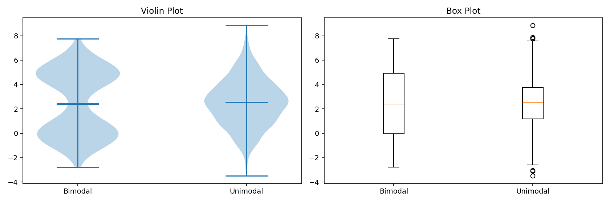
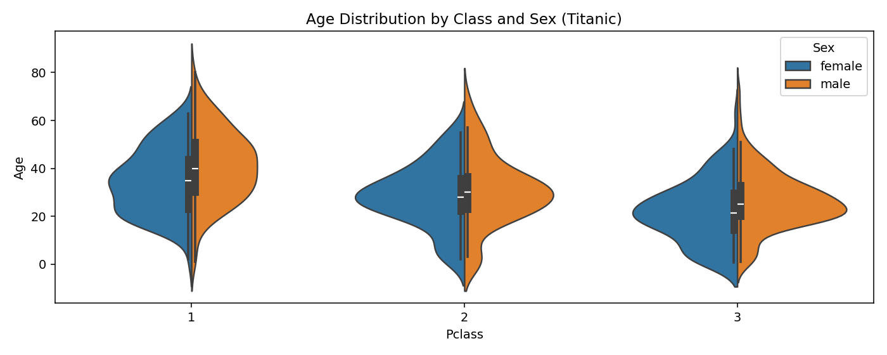
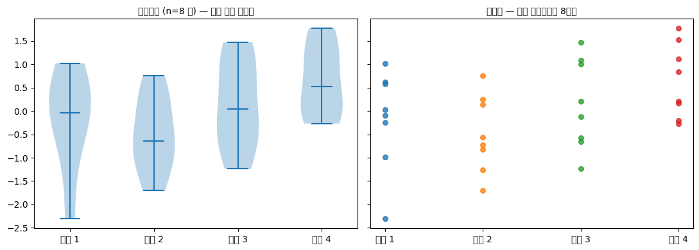
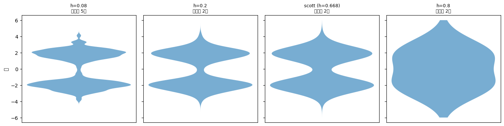
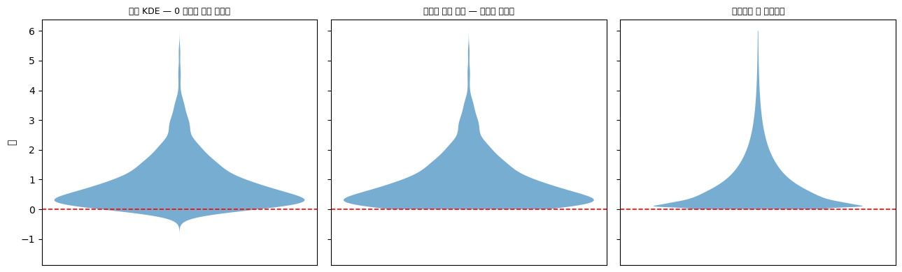
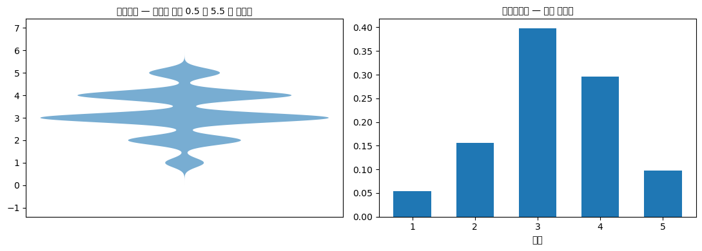

# 바이올린 그림

## 개요

**바이올린 그림**은 상자그림과 양쪽에 그린 커널밀도추정(KDE)을 결합하여 요약통계량과 함께 분포의 전체 모양을 보여준다. 상자그림이 분포를 다섯 개의 수와 이상치로 줄이는 반면, 바이올린 그림은 상자그림이 감추는 다봉성, 왜도, 밀도의 변화를 드러낸다.

## 바이올린 그림 대 상자그림

상자그림에 대한 바이올린 그림의 핵심 장점은 값에 따른 자료의 **확률밀도**를 보여줄 수 있다는 점이다. 덕분에 다음과 같은 경우에 특히 유용하다.

- 상자그림이 놓칠 이봉 또는 다봉 분포를 탐지할 때.
- 차이가 미묘한 집단 간 분포 모양을 비교할 때.
- 분포에 관한 이야기를 청중에게 온전히 전달할 때.

## 기본 바이올린 그림

상자그림이 무엇을 놓치는지 보려면, **요약통계량은 거의 같은데 모양은 전혀 다른** 두 자료를 나란히 놓으면 된다.

<div class="codebox" markdown>

### 예제 1. 기본 바이올린 그림 { .eg }

```python
import matplotlib.pyplot as plt
import numpy as np

np.random.seed(0)

# --- 자료 1: 봉우리가 둘인 분포 -------------------------------------
# 0 근처 500개와 5 근처 500개를 이어 붙인다.
# 두 무리의 한가운데인 2.5 부근에는 자료가 거의 없다.
data_1 = np.concatenate([np.random.normal(0, 1, 500),
                         np.random.normal(5, 1, 500)])

# --- 자료 2: 봉우리가 하나인 분포 -----------------------------------
# 평균과 퍼짐을 자료 1과 비슷하게 맞춘다. 요약통계량으로는
# 두 자료를 구별하기 어렵게 만드는 것이 목적이다.
data_2 = np.random.normal(2.5, 2, 1000)

# 요약통계량을 먼저 확인한다. 상자그림이 그리는 것이 바로 이 수들이다.
for name, d in [("data_1 (이봉)", data_1), ("data_2 (단봉)", data_2)]:
    q1, q3 = np.percentile(d, [25, 75])
    print(f"{name}: 평균 {d.mean():.2f}, 중앙값 {np.median(d):.2f}, "
          f"표준편차 {d.std():.2f}, IQR [{q1:.2f}, {q3:.2f}]")

fig, (ax1, ax2) = plt.subplots(1, 2, figsize=(12, 4))

# --- 왼쪽: 바이올린 그림 --------------------------------------------
# 좌우로 펼쳐진 폭이 그 높이에서의 커널밀도추정값이다.
# showmeans / showmedians 로 평균선과 중앙값선을 함께 표시한다.
ax1.violinplot([data_1, data_2], showmeans=True, showmedians=True)
ax1.set_title("Violin Plot")
ax1.set_xticks([1, 2])
ax1.set_xticklabels(["Bimodal", "Unimodal"])

# --- 오른쪽: 같은 자료의 상자그림 -----------------------------------
# 다섯 수치 요약과 이상치만 그린다. 밀도 정보는 버려진다.
ax2.boxplot([data_1, data_2], labels=["Bimodal", "Unimodal"])
ax2.set_title("Box Plot")

plt.tight_layout()
plt.show()
```

출력:

```
data_1 (이봉): 평균 2.45, 중앙값 2.40, 표준편차 2.67, IQR [-0.05, 4.93]
data_2 (단봉): 평균 2.53, 중앙값 2.55, 표준편차 1.94, IQR [1.19, 3.75]
```



**중앙값이 2.40과 2.55로 거의 같다.** 상자그림(오른쪽)만 보면 두 자료가 비슷한 분포처럼 보인다. 그런데 바이올린 그림(왼쪽)을 보면 왼쪽 자료가 **가운데가 잘록한 두 덩어리**임이 한눈에 드러난다.

이 차이가 중요한 이유는 실질적이다. 왼쪽 자료에서 "평균 근처인 2.5"는 가장 흔한 값이 아니라 **가장 드문 값**이다. 상자그림은 이 사실을 전혀 알려 주지 않는다.

</div>

## Seaborn으로 그리는 바이올린 그림

Seaborn은 집단화 기능이 내장된 더 다듬어진 바이올린 그림을 제공한다.

<div class="codebox" markdown>

### 예제 2. Seaborn 으로 그리는 바이올린 그림 { .eg }

```python
import seaborn as sns
import pandas as pd
import matplotlib.pyplot as plt

url = "https://raw.githubusercontent.com/datasciencedojo/datasets/master/titanic.csv"
df = pd.read_csv(url)

# 그림에 앞서 숫자로 먼저 확인한다. Age에 결측이 있어 count가 891보다 작다.
print(df.groupby(["Pclass", "Sex"])["Age"]
        .agg(["count", "median", "mean"]).round(1))

fig, ax = plt.subplots(figsize=(10, 4))

# x   : 바이올린을 나눌 기준 (객실 등급 1, 2, 3)
# y   : 분포를 볼 값 (나이)
# hue : 색으로 구분할 두 번째 범주 (성별)
# split=True : 두 색을 하나의 바이올린 좌우에 붙여 그린다.
#              범주가 정확히 둘일 때만 쓸 수 있고, 같은 등급 안에서
#              남녀를 곧바로 견주어 볼 수 있게 해 준다.
sns.violinplot(data=df, x="Pclass", y="Age", hue="Sex",
               split=True, ax=ax)
ax.set_title("Age Distribution by Class and Sex (Titanic)")
plt.show()
```

출력:

```
               count  median  mean
Pclass Sex
1      female     85    35.0  34.6
       male      101    40.0  41.3
2      female     74    28.0  28.7
       male       99    30.0  30.7
3      female    102    21.5  21.8
       male      253    25.0  26.5
```



`split=True`가 두 색을 하나의 바이올린 좌우에 붙여 놓아, 등급마다 남녀를 곧바로 견줄 수 있다.

그림에서 읽히는 것이 표보다 많다.

- **등급이 낮아질수록 젊어진다.** 중앙값이 1등급 35–40세, 2등급 28–30세, 3등급 21.5–25세로 내려간다.
- **3등급에 어린이가 몰려 있다.** 아래쪽 0–10세 구간이 3등급에서만 불룩하다. 표의 중앙값과 평균만으로는 보이지 않는 특징이다.
- **1등급은 퍼짐이 넓다.** 위로 70대까지 이어지는 반면 3등급은 60대에서 거의 끊긴다.
- **모든 등급에서 남성이 조금 더 나이가 많다.** 다만 그 차이는 등급 간 차이보다 훨씬 작다.

세 번째 항목이 바이올린 그림의 값어치를 잘 보여 준다. 3등급의 어린이 무리는 분포에 **작은 두 번째 봉우리**를 만드는데, 상자그림이라면 그저 아래쪽 수염이 길어질 뿐이라 놓치기 쉽다.

</div>

## 바이올린 그림을 쓸 때

바이올린 그림은 집단 간 분포의 모양을 비교할 때, 특히 분포가 비정규이거나 다봉일 수 있을 때 가장 가치가 크다. 중앙값과 IQR만이 중요한 단순한 비교라면 상자그림이 더 간결하고 읽기 쉽다.

## 연습문제

<div class="drillbox" markdown>

**연습문제 1.** <span class="diff easy" title="쉬움"></span>
두 식물 생장 실험의 결과가 다음과 같다. **처리 1**: $\{5, 6, 6, 7, 7, 7, 8, 8, 9\}$, **처리 2**: $\{3, 5, 7, 7, 7, 7, 7, 9, 11\}$. (a) 다섯 수치 요약을 구하라. (b) 상자그림이 비슷해 보이겠는가? (c) 바이올린 그림은 어떻게 다른가?

</div>

??? success "풀이"
    (a) 두 자료 모두:

    | | T1 | T2 |
    |---|---|---|
    | 최솟값 | 5 | 3 |
    | $Q_1$ | 6 | 6 |
    | 중앙값 | 7 | 7 |
    | $Q_3$ | 8 | 8 |
    | 최댓값 | 9 | 11 |

    (b) 상자가 동일하고 수염 길이만 다르다. 두 상자그림은 매우 비슷해 보인다.

    (c) 바이올린 그림은 처리 2가 7에서 날카롭게 솟아 있음을(아홉 값 중 다섯이 7) 드러내는 반면, 처리 1은 $[5, 9]$에 걸쳐 대체로 균일한 밀도를 갖는다. 두 분포는 중심과 퍼짐이 거의 같지만 모양이 매우 다르다. 상자그림은 이를 보지 못하지만 바이올린 그림은 즉시 눈에 띄게 만든다.

<div class="drillbox" markdown>

**연습문제 2.** <span class="diff med" title="중간"></span>
바이올린 그림의 밀도는 **커널밀도추정**으로 계산된다. KDE 공식을 쓰고, 대역폭 $h$가 바이올린 그림의 모습에 어떤 영향을 주는지 논하라.

</div>

??? success "풀이"
    KDE 공식:

    $$
    \hat f(x) = \frac{1}{n h}\sum_{i=1}^n K\!\left(\frac{x - x_i}{h}\right)
    $$

    여기서 $K$는 (보통 가우시안인) 커널이고 $h > 0$은 대역폭이다.

    **대역폭이 바이올린에 미치는 영향:**

    - **$h$가 작을 때**: 밀도추정이 뾰족뾰족해진다. 각 자료점이 좁은 봉우리를 만든다. 바이올린이 밑바탕 밀도가 아니라 개별 관측값을 보여주게 된다. 표집 잡음에 과적합할 수 있다.
    - **$h$가 클 때**: 밀도가 지나치게 매끄러워진다. 최빈값들이 뭉개져 이봉 분포가 단봉으로 보인다. 바이올린이 보여주어야 할 바로 그 특징을 감추는 왜곡이다.
    - **최적의 $h$**(예: 실버만, 스콧, 플러그인 선택자): 편향과 분산의 균형을 잡는다.

    대부분의 그림 라이브러리(matplotlib, seaborn)는 기본으로 스콧 규칙을 적용한다. 바이올린이 너무 들쭉날쭉하면 `bw_method`를 줄이고, 너무 매끄러우면 늘린다.

<div class="drillbox" markdown>

**연습문제 3.** <span class="diff med" title="중간"></span>
**반쪽 바이올린(분할 바이올린) 그림**은 하나의 수직축 양쪽에 두 집단을 보여준다. 이 표현이 나란히 놓은 전체 바이올린보다 선호되는 때는 언제인가?

</div>

??? success "풀이"
    분할 바이올린 그림은 다음과 같을 때 선호된다.

    - **직접적인 짝 비교**가 핵심 메시지일 때 — 예를 들어 각 승객 등급 안에서 남성과 여성의 나이 분포를 비교하는 경우.
    - 두 분포가 미묘하게 다를 것으로 예상될 때. 공유하는 축의 양쪽에 놓으면 모양, 위치, 퍼짐의 작은 차이가 시각적으로 분명해진다.
    - **공간이 제한될 때**: 분할 바이올린 하나는 나란히 놓은 전체 바이올린 둘의 절반 폭만 차지한다.

    다음과 같을 때는 분할 바이올린을 피한다.

    - 집단이 둘보다 많을 때.
    - 두 집단의 표본 크기가 크게 다를 때(밀도가 정규화되어 불균형이 감춰진다).
    - 모양이 매우 다를 때 — 눈이 "반대쪽 반쪽"을 대칭으로 읽어 오도할 수 있다.

<div class="drillbox" markdown>

**연습문제 4.** <span class="diff med" title="중간"></span>
어떤 의학 시험 결과 자료의 바이올린 그림이 물리적인 하한(예: 음이 아닌 양에 대한 0)에서 **잘려** 있다. KDE가 어떤 인공물을 만들어내며 어떻게 바로잡을 수 있는가?

</div>

??? success "풀이"
    표준 KDE는 각 관측값 주위에 커널 질량을 *대칭적으로* 배치한다. 딱딱한 경계 근처에서는 이 때문에 확률 질량이 *경계 아래*에 놓인다. 0에서 아래로 막힌 자료라면 KDE가 물리적으로 불가능한 음수 값에 0이 아닌 밀도를 부여한다.

    **시각적 인공물:** 바이올린이 0 아래로 뻗은 것처럼 보여 자료가 음수일 수 있다는 인상을 준다. 또한 대칭적 확장에서 왔어야 할 커널 질량을 경계가 막기 때문에 0 바로 위의 밀도도 과소추정된다.

    **바로잡는 방법:**

    - **반사법**: 자료를 경계에 대해 반사시켜 두 배가 된 자료에 KDE를 적합한 뒤, 경계에서 잘라내고 그 위의 밀도를 두 배로 한다.
    - $[0, 1]$로 막힌 자료에는 **베타 KDE**, $[0, \infty)$ 자료에는 **감마 / 로그정규 KDE** 등 적절한 받침을 갖는 커널을 쓴다.
    - **변환**: 음이 아닌 자료에 $\log(x + 1)$을 취해 변환된 척도에서 KDE를 적합한 뒤 변수변환을 통해 원래 척도로 그린다.

    대부분의 그림 라이브러리가 지정한 경계에서 바이올린을 잘라내게 해주지만, 밑바탕의 밀도추정은 여전히 경계 근처에서 편향되어 있을 수 있다. 바이올린의 경계 근처 부분은 언제나 조심해서 해석하라.

<div class="drillbox" markdown>

**연습문제 5.** <span class="diff med" title="중간"></span>
바이올린의 *폭*을 집단에 걸쳐 *정규화*하기도 하고(각 바이올린의 최대 폭이 같음) *정규화하지 않기도*(폭이 표본 크기를 반영) 하는 이유는 무엇인가? 각각은 언제 적절한가?

</div>

??? success "풀이"
    **정규화(각 바이올린의 최대 폭 = 1):** 모양 비교를 강조한다. 집단에 관측값이 몇 개든 각 집단의 분포 모양이 온전한 시각적 크기로 표시된다. 표본 크기가 다르지만 모양을 직접 비교하고 싶을 때 적합하다.

    **비정규화(폭 $\propto n$):** 각 집단의 상대적 중요도를 보존한다. 관측값이 1000개인 집단이 10개인 집단보다 훨씬 넓게 나타나, 작은 집단의 밀도추정이 덜 믿을 만하다는 신호를 준다.

    **각각이 적절한 때:**

    - 표본 크기가 비슷하거나 메시지가 순전히 모양에 관한 것일 때 **정규화**를 쓴다(예: 인구 규모가 다른 나라들의 소득 분포를 비교할 때, 인구 3000만인 나라가 300만인 나라를 시각적으로 압도해서는 안 된다).
    - 표본 크기의 차이 자체가 이야기의 일부일 때 **비정규화**를 쓴다(예: 응답자 1000명의 처리군과 50명의 대조군을 비교할 때, 확신의 차이가 중요하다).

    많은 라이브러리가 **scale="area"**(비정규화)를 기본으로 하되 **scale="width"**(정규화)도 제공한다. 어느 방식을 쓰고 있는지 늘 인지하고 그에 맞게 이름표를 달아라.

<div class="drillbox" markdown>

**연습문제 6.** <span class="diff med" title="중간"></span>
바이올린 그림의 강점은 분포의 모양을 보여준다는 것이고, 약점은 대부분의 청중에게 낯설다는 것이다. 통계 전문가가 아닌 일반 청중에게 바이올린 그림을 제시할 때 합리적인 소통 전략은 무엇인가?

</div>

??? success "풀이"
    서로 보완하는 몇 가지 전략이 있다.

    - **중앙값을 표시하라**: 수평선을 긋고 "중앙값"이라고 이름을 단다. 대부분의 시청자는 중앙값을 즉시 이해한다.
    - **$Q_1$과 $Q_3$을 표시하라**: 상자그림의 상자와 같은 위치에 선이나 음영을 넣는다. 더 익숙한 상자그림의 의미론에 바이올린을 붙들어 매는 효과가 있다.
    - **실제 자료점을 겹쳐 그려라**: 표본이 작으면 `inner='points'`나 `'sticks'`를 쓴다. 자료점이 직접 보이면 아무것도 매끄럽게 지워버리지 않았다는 확신을 준다.
    - **처음 쓸 때는 같은 자료의 상자그림과 나란히 보여줘라.** 이렇게 설명한다. "상자그림은 중앙값과 IQR을 알려주고, 바이올린은 밀도가 어디에 몰려 있는지 알려줍니다."
    - **모양 정보가 중요할 때만 쓰라.** 중앙값과 IQR만 흥미롭다면 상자그림으로 충분하다. 청중이 다봉성, 왜도, 모양의 차이를 봐야 하는 경우를 위해 바이올린을 아껴 두라.

    목표는 이것이다. 바이올린은 인지 부담을 늘리지 않으면서 정보를 *더해야* 한다. 청중에게 이름표가 달린 막대그래프가 더 도움이 된다면 그쪽을 쓰라.

<div class="drillbox" markdown>

**연습문제 7.** <span class="diff med" title="중간"></span>
바이올린 그림은 KDE를 그린 것이므로 **KDE의 약점을 그대로 물려받는다.** 표본이 작을 때 바이올린이 없는 구조를 만들어 내는 것을 확인하라.

</div>

??? success "풀이"
    ```python
    import numpy as np
    import matplotlib.pyplot as plt
    from scipy.stats import gaussian_kde

    rng = np.random.default_rng(0)

    def n_modes(x):
        g = np.linspace(x.min() - 1, x.max() + 1, 600)
        d = gaussian_kde(x)(g)
        return sum(1 for i in range(1, len(d) - 1) if d[i] > d[i - 1] and d[i] > d[i + 1])

    print("완전히 단봉인 N(0,1) 자료에서 KDE 가 봉우리 2개 이상을 보일 확률")
    for n in (8, 15, 30, 100):
        print(f"  n={n:>4}: {np.mean([n_modes(rng.normal(0, 1, n)) >= 2 for _ in range(2000)]):.4f}")

    samples = [rng.normal(0, 1, 8) for _ in range(4)]
    fig, axes = plt.subplots(1, 2, figsize=(11, 4), sharey=True)
    axes[0].violinplot(samples, showmedians=True)
    axes[0].set_title("바이올린 (n=8 씩) — 넷이 달라 보인다", fontsize=10)
    for i, s in enumerate(samples):
        axes[1].scatter(np.full(len(s), i + 1), s, s=30, alpha=0.8)
    axes[1].set_title("원자료 — 같은 모집단에서 8개씩", fontsize=10)
    for ax in axes:
        ax.set_xticks([1, 2, 3, 4])
        ax.set_xticklabels([f"표본 {i+1}" for i in range(4)])
    fig.tight_layout()
    plt.show()
    ```

    출력:

    ```
    완전히 단봉인 N(0,1) 자료에서 KDE 가 봉우리 2개 이상을 보일 확률
      n=   8: 0.1385
      n=  15: 0.1640
      n=  30: 0.1650
      n= 100: 0.1790
    ```

    

    **단봉 자료인데도 $14$–$18\%$의 확률로 봉우리가 둘 이상 보인다.** 그리고 $n$이 커져도 나아지지 않는데, 앞 절 봉우리 문서 연습문제 8에서 본 대로 기본 대역폭이 $n$과 함께 좁아지기 때문이다.

    그림에서 네 표본은 **같은 모집단 $N(0,1)$에서 $8$개씩** 뽑은 것이다. 바이올린은 각기 다른 모양을 보여 주지만 오른쪽 원자료를 보면 그저 점 여덟 개씩이다. **바이올린의 굴곡은 자료가 아니라 평활의 산물이다.**

    **실무 지침.**

    - **집단당 $n$이 $20$ 미만이면 바이올린을 쓰지 마라.** 점 흩뿌리기나 벌떼그림이 정직하다.
    - **$n$이 $20$–$50$이면 바이올린에 점을 겹쳐 그려라.** 독자가 굴곡의 근거를 직접 볼 수 있다.
    - **어떤 경우에도 $n$을 표시하라.** 상자그림에서와 같은 조언이다(상자그림 문서 연습문제 10).

    **바이올린이 상자그림보다 나은 점과 나쁜 점이 같은 뿌리에서 나온다.** 더 많은 것을 보여 주지만, 그중 일부는 자료에 없는 것이다. $\square$

<div class="drillbox" markdown>

**연습문제 8.** <span class="diff med" title="중간"></span>
연습문제 2의 대역폭 효과를 그림으로 확인하라. 같은 자료에 대역폭만 바꾸면 바이올린이 어떻게 달라지는가?

</div>

??? success "풀이"
    ```python
    import numpy as np
    import matplotlib.pyplot as plt
    from scipy.stats import gaussian_kde

    rng = np.random.default_rng(1)
    x = np.concatenate([rng.normal(-2, 0.7, 150), rng.normal(2, 0.7, 150)])
    grid = np.linspace(-6, 6, 800)

    bandwidths = [0.08, 0.2, "scott", 0.8]
    fig, axes = plt.subplots(1, 4, figsize=(14, 3.6), sharey=True)
    for ax, bw in zip(axes, bandwidths):
        kde = gaussian_kde(x, bw_method=bw)
        d = kde(grid)
        ax.fill_betweenx(grid, -d, d, alpha=0.6)
        peaks = sum(1 for i in range(1, len(d) - 1) if d[i] > d[i - 1] and d[i] > d[i + 1])
        label = f"h={bw}" if bw != "scott" else f"scott (h={kde.factor * x.std(ddof=1):.3f})"
        ax.set_title(f"{label}\n봉우리 {peaks}개", fontsize=9)
        ax.set_xticks([])
    axes[0].set_ylabel("값")
    fig.tight_layout()
    plt.show()

    for bw in bandwidths:
        kde = gaussian_kde(x, bw_method=bw)
        d = kde(grid)
        peaks = sum(1 for i in range(1, len(d) - 1) if d[i] > d[i - 1] and d[i] > d[i + 1])
        print(f"대역폭 {str(bw):>7}: 봉우리 {peaks}개")
    ```

    출력:

    ```
    대역폭    0.08: 봉우리 5개
    대역폭     0.2: 봉우리 2개
    대역폭   scott: 봉우리 2개
    대역폭     0.8: 봉우리 2개
    ```

    

    **같은 자료가 대역폭에 따라 전혀 다른 이야기를 한다.** 참 분포는 봉우리가 둘인 혼합인데, 너무 좁으면 여러 개의 가짜 봉우리가, 너무 넓으면 하나로 뭉개진 봉우리가 나온다.

    | 대역폭 | 결과 |
    |---|---|
    | $h = 0.08$ (과소평활) | 잡음이 봉우리로 보인다 |
    | $h = 0.2$ | 참 구조가 드러난다 |
    | 스콧 (자동) | 대개 적절하다 |
    | $h = 0.8$ (과대평활) | 두 봉우리가 하나로 합쳐진다 |

    **이것이 히스토그램의 구간 개수 문제와 정확히 같다**(히스토그램 문서 연습문제 9). 편향–분산 맞바꿈이며, 좁으면 분산이 크고 넓으면 편향이 크다. 최적 대역폭도 마찬가지로 $n^{-1/5}$에 비례한다(히스토그램의 $n^{-1/3}$과 다른 것은 커널이 더 매끄럽기 때문이다).

    **주의할 점.** 히스토그램은 구간 개수를 명시적으로 고르므로 독자가 그 선택을 인지한다. **바이올린 그림은 대역폭이 숨어 있어 독자가 자의적 선택이 있었다는 사실조차 모른다.** `seaborn.violinplot` 의 `bw_adjust` 기본값이 무엇인지 아는 독자는 드물다.

    **권고.** 결론이 바이올린의 모양에 의존한다면 **여러 대역폭으로 그려 보고, 모든 설정에서 나타나는 특징만 이야기하라.** 그리고 그림 설명에 대역폭 설정을 적어 두어라. $\square$

<div class="drillbox" markdown>

**연습문제 9.** <span class="diff med" title="중간"></span>
연습문제 4의 경계 인공물을 실제로 만들어 보고, 두 가지 교정법을 비교하라.

</div>

??? success "풀이"
    ```python
    import numpy as np
    import matplotlib.pyplot as plt
    from scipy.stats import gaussian_kde

    rng = np.random.default_rng(2)
    x = rng.exponential(1.0, 800)                  # 반드시 0 이상인 자료
    grid = np.linspace(-1.5, 6, 900)

    naive = gaussian_kde(x)(grid)
    log_kde = gaussian_kde(np.log(x))
    pos = grid > 0
    transformed = np.zeros_like(grid)
    transformed[pos] = log_kde(np.log(grid[pos])) / grid[pos]

    print(f"단순 KDE 가 x<0 에 배정한 질량 {np.trapz(naive[grid < 0], grid[grid < 0]):.4f}")
    print(f"x=0.05 에서: 단순 {gaussian_kde(x)(0.05)[0]:.4f}   "
          f"로그변환 {transformed[np.argmin(np.abs(grid - 0.05))]:.4f}   "
          f"참값 {np.exp(-0.05):.4f}")

    fig, axes = plt.subplots(1, 3, figsize=(13, 4), sharey=True)
    for ax, (d, title) in zip(axes, [
            (naive, "단순 KDE — 0 아래로 새어 나간다"),
            (np.where(grid >= 0, naive, 0), "단순히 잘라 내기 — 편향은 남는다"),
            (transformed, "로그변환 후 되돌리기")]):
        ax.fill_betweenx(grid, -d, d, alpha=0.6)
        ax.axhline(0, color="red", ls="--", lw=1.2)
        ax.set_title(title, fontsize=9)
        ax.set_xticks([])
    axes[0].set_ylabel("값")
    fig.tight_layout()
    plt.show()
    ```

    출력:

    ```
    단순 KDE 가 x<0 에 배정한 질량 0.0790
    x=0.05 에서: 단순 0.5156   로그변환 0.8476   참값 0.9512
    ```

    

    **단순 KDE는 존재할 수 없는 $x < 0$ 영역에 확률질량을 배정한다.** 그리고 그만큼 $x = 0$ 근처의 밀도가 깎여, 참값 $0.951$인 지점을 훨씬 낮게 추정한다.

    **두 교정법이 하는 일이 다르다.**

    - **잘라 내기**(`seaborn` 의 `cut=0`, `clip=`)는 **곡선을 보기 좋게 자를 뿐**이다. 경계 안쪽의 밀도가 낮게 추정된 것은 그대로 남는다. 히스토그램 문서 연습문제 8에서 이미 지적한 점이다.
    - **로그변환 후 되돌리기**는 실제로 편향을 고친다. $\log$ 척도에서는 경계가 $-\infty$로 밀려나 커널이 새어 나갈 곳이 없다.

    **어느 것을 쓰는가.**

    | 상황 | 권장 |
    |---|---|
    | 양수 자료, 경계 근처에 질량이 많다 | 로그변환 (또는 반사법) |
    | 경계는 있으나 그 근처에 자료가 거의 없다 | 잘라 내기로 충분 |
    | 비율 $[0,1]$ 자료 | 로짓 변환 |
    | 정확한 밀도가 필요 없고 비교만 한다 | 잘라 내기 + 주석 |

    **가장 중요한 실무 조언.** 바이올린이 **물리적으로 불가능한 값까지 뻗어 있으면** 독자가 그것을 자료로 오해한다. "응답 시간이 음수인 사람이 있나?"라는 질문을 받게 되며, 그 순간 그림의 신뢰도가 무너진다. **최소한 잘라 내기라도 반드시 적용하라.** $\square$

<div class="drillbox" markdown>

**연습문제 10.** <span class="diff med" title="중간"></span>
바이올린 그림이 **적극적으로 나쁜** 경우가 있다. 이산 자료나 값의 종류가 적은 자료에 바이올린을 쓰면 어떻게 되는가?

</div>

??? success "풀이"
    ```python
    import numpy as np
    import matplotlib.pyplot as plt
    from scipy.stats import gaussian_kde

    rng = np.random.default_rng(0)
    likert = rng.choice([1, 2, 3, 4, 5], 3000, p=[.05, .15, .40, .30, .10]).astype(float)
    grid = np.linspace(-1, 7, 800)
    d = gaussian_kde(likert)(grid)

    print(f"실제 분포: {np.round([np.mean(likert == k) for k in range(1, 6)], 3)}")
    print(f"KDE 가 1 미만에 배정한 질량 {np.trapz(d[grid < 1], grid[grid < 1]):.4f}")
    print(f"KDE 가 5 초과에 배정한 질량 {np.trapz(d[grid > 5], grid[grid > 5]):.4f}")
    print(f"KDE 봉우리 개수 {sum(1 for i in range(1, len(d) - 1) if d[i] > d[i-1] and d[i] > d[i+1])}")

    fig, axes = plt.subplots(1, 2, figsize=(11, 4))
    axes[0].fill_betweenx(grid, -d, d, alpha=0.6)
    axes[0].set_title("바이올린 — 있지도 않은 0.5 나 5.5 를 그린다", fontsize=10)
    axes[0].set_xticks([])
    levels, counts = np.unique(likert, return_counts=True)
    axes[1].bar(levels, counts / counts.sum(), width=0.6)
    axes[1].set_title("막대그래프 — 자료 그대로", fontsize=10)
    axes[1].set_xlabel("응답")
    fig.tight_layout()
    plt.show()
    ```

    출력:

    ```
    실제 분포: [0.053 0.156 0.398 0.295 0.098]
    KDE 가 1 미만에 배정한 질량 0.0259
    KDE 가 5 초과에 배정한 질량 0.0474
    KDE 봉우리 개수 5
    ```

    

    **KDE가 $1$ 미만에 $2.3\%$, $5$ 초과에 $4.9\%$의 질량을 배정한다.** 응답이 $1$부터 $5$까지의 정수뿐인데 그렇다. 그림은 "$0.5$점을 준 사람"과 "$5.5$점을 준 사람"이 있는 것처럼 보인다.

    봉우리도 $5$개로 나오는데, 이는 다섯 개의 이산 수준을 각각 봉우리로 그린 것이다. **"분포에 봉우리가 다섯 개"라는 해석은 완전히 잘못된 것이다.**

    **바이올린을 쓰지 말아야 할 경우.**

    | 자료 | 왜 나쁜가 | 대안 |
    |---|---|---|
    | 리커트·순서형 | 없는 중간값을 그린다 | 막대그래프, 누적 막대 |
    | 계수(작은 값) | 정수 사이를 메운다 | 막대그래프 |
    | 집단당 $n < 20$ | 없는 구조를 만든다 (연습문제 7) | 점 흩뿌리기 |
    | 값의 종류가 몇 개뿐 | 봉우리가 값의 개수를 반영 | 도수표 |
    | 경계가 있고 질량이 몰림 | 불가능한 값을 그린다 (연습문제 9) | 변환 후 그리기 |

    **KDE의 전제를 기억하라.** 커널밀도추정은 **연속인 밀도가 존재한다**고 가정한다. 이산 자료에는 밀도가 없고 확률질량함수가 있을 뿐이다. 없는 것을 추정하려 하면 그림이 거짓말을 한다.

    **바이올린이 빛나는 경우는 그 반대 조건이다.** 연속 자료, 집단당 관측이 충분히 많고, 경계가 문제되지 않으며, 분포의 **모양**이 실제로 비교의 대상일 때다. 그런 상황에서는 상자그림보다 훨씬 많은 정보를 준다(연습문제 1, 상자그림 문서 연습문제 7).

    **도구를 고르는 순서.** 먼저 **자료가 어떤 종류인지**(2장 첫 절의 자료형 분류) 확인하고, 그 다음에 그림을 고른다. 그림을 먼저 고르고 자료를 끼워 맞추면 이런 일이 생긴다. $\square$

---

## 정리하며

바이올린 그림은 상자그림에 밀도 정보를 더해 확장한 것으로, 다봉성이나 비대칭 같은 분포의 세부를 드러내는 데 이상적이다. 요약통계량만이 아니라 분포의 모양이 분석을 좌우하는 집단 비교에서 특히 효과적이다.
