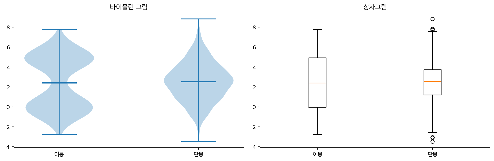
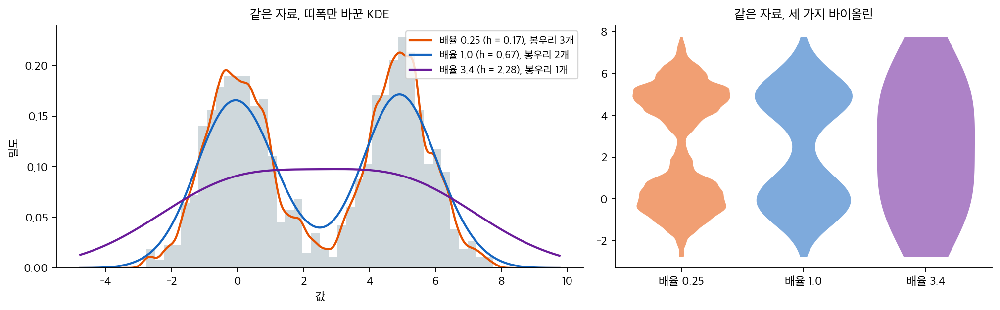
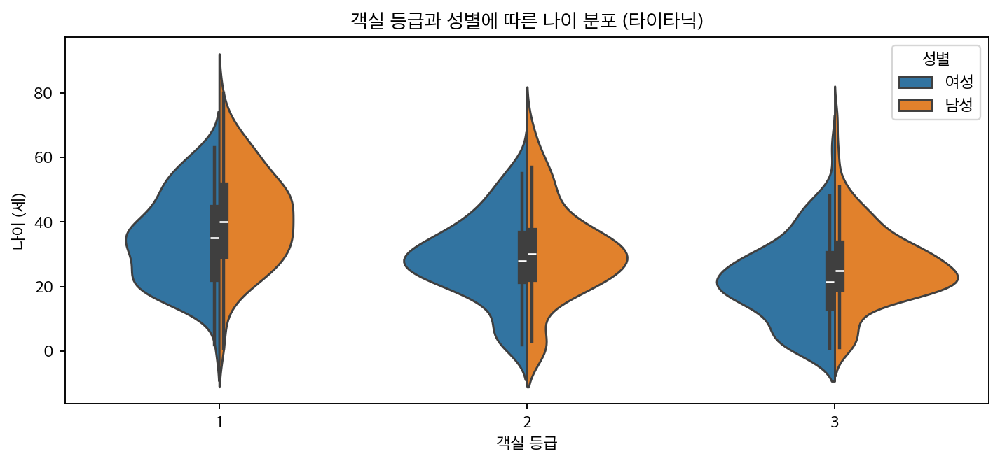
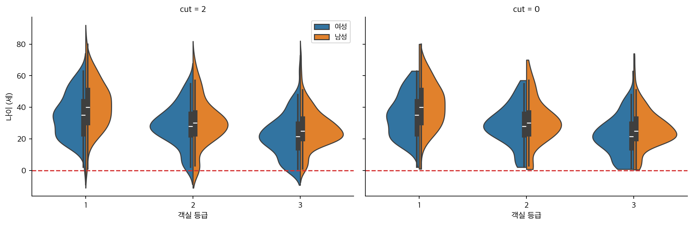
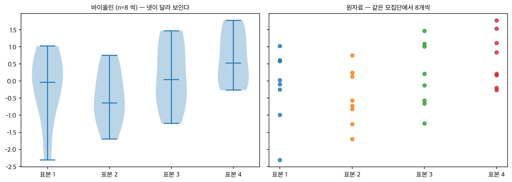
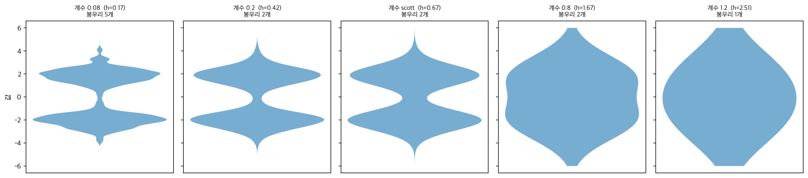
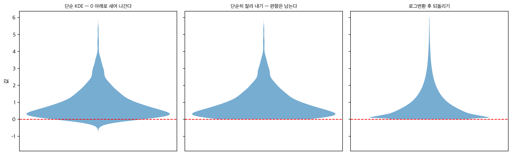
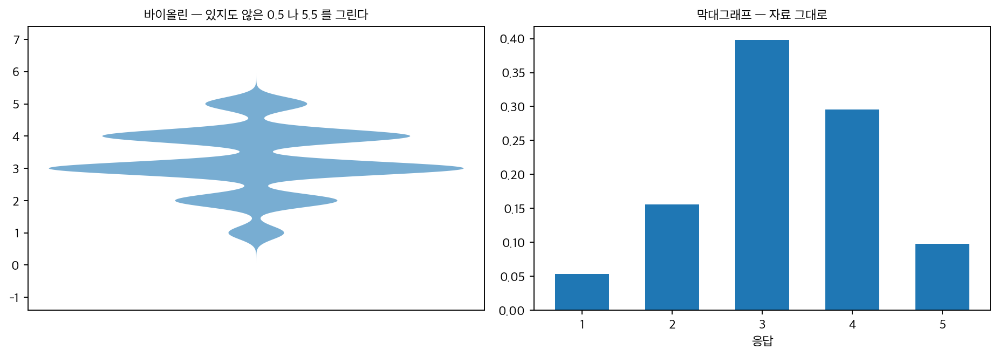

# 바이올린 그림

## 개요

**바이올린 그림**은 상자그림과 양쪽에 그린 커널밀도추정(KDE)을 결합하여 요약통계량과 함께 분포의 전체 모양을 보여준다. 상자그림이 분포를 다섯 개의 수와 이상치로 줄이는 반면, 바이올린 그림은 상자그림이 감추는 다봉성, 왜도, 밀도의 변화를 드러낸다.

## 바이올린 그림 대 상자그림

상자그림에 대한 바이올린 그림의 핵심 장점은 값에 따른 자료의 **확률밀도**를 보여줄 수 있다는 점이다. 덕분에 다음과 같은 경우에 특히 유용하다.

- 상자그림이 놓칠 이봉 또는 다봉 분포를 탐지할 때.
- 차이가 미묘한 집단 간 분포 모양을 비교할 때.
- 분포에 관한 이야기를 청중에게 온전히 전달할 때.

## 기본 바이올린 그림

상자그림이 무엇을 놓치는지 보려면, **중심은 거의 같은데 모양은 전혀 다른** 두 자료를 나란히 놓으면 된다.

<div class="exbox" markdown>

**보기 1.** <span class="diff easy" title="쉬움"></span> 기본 바이올린 그림, 그리고 모양을 정하는 것은 자료가 아니라 띠폭이다. $N(0,1)$에서 $500$개, $N(5,1)$에서 $500$개를 이어 붙인 이봉 자료와, 중심이 같은 $N(2.5, 2^2)$ 단봉 자료 $1000$개를 쓴다.

**(1)** 두 자료를 바이올린과 상자그림으로 나란히 그리고, 상자그림이 가리는 것을 수치와 함께 적으시오.

**(2)** 바이올린의 KDE 띠폭을 $h$라 하자. 이봉 자료의 **봉우리 두 개가 사라지는 $h$의 임계값**을 구하고, 띠폭을 바꾸어 가며 봉우리 개수를 세어 확인하시오.

</div>

??? success "풀이"

    **(1) 그려 본다.**

    ```python
    import matplotlib.pyplot as plt
    import numpy as np

    # 그림에 한글을 쓰므로 한글 글꼴을 지정한다. 맥이면 'Apple SD Gothic Neo',
    # 윈도우면 'Malgun Gothic', 리눅스면 'NanumGothic' 정도가 무난하다.
    # 글꼴을 바꾸면 마이너스 기호가 깨지므로 unicode_minus 도 함께 꺼 준다.
    plt.rcParams['font.family'] = 'Apple SD Gothic Neo'
    plt.rcParams['axes.unicode_minus'] = False

    np.random.seed(0)

    # --- 자료 1: 봉우리가 둘인 분포 -------------------------------------
    # 0 근처 500개와 5 근처 500개를 이어 붙인다.
    # 두 무리의 한가운데인 2.5 부근에는 자료가 거의 없다.
    data_1 = np.concatenate([np.random.normal(0, 1, 500),
                             np.random.normal(5, 1, 500)])

    # --- 자료 2: 봉우리가 하나인 분포 -----------------------------------
    # 중심을 자료 1과 같은 2.5 에 맞춘다. 중심만 보아서는
    # 두 자료를 구별할 수 없게 만드는 것이 목적이다.
    data_2 = np.random.normal(2.5, 2, 1000)

    # 요약통계량을 먼저 확인한다. 상자그림이 그리는 것이 바로 이 수들이다.
    for name, d in [("data_1 (이봉)", data_1), ("data_2 (단봉)", data_2)]:
        q1, q3 = np.percentile(d, [25, 75])
        print(f"{name}: 평균 {d.mean():.2f}, 중앙값 {np.median(d):.2f}, "
              f"표준편차 {d.std():.2f}, IQR [{q1:.2f}, {q3:.2f}]")

    fig, (ax1, ax2) = plt.subplots(1, 2, figsize=(12, 4))

    # --- 왼쪽: 바이올린 그림 --------------------------------------------
    # 좌우로 펼쳐진 폭이 그 높이에서의 커널밀도추정값이다.
    # showmeans / showmedians 로 평균선과 중앙값선을 함께 표시한다.
    ax1.violinplot([data_1, data_2], showmeans=True, showmedians=True)
    ax1.set_title("바이올린 그림")
    ax1.set_xticks([1, 2])
    ax1.set_xticklabels(["이봉", "단봉"])

    # --- 오른쪽: 같은 자료의 상자그림 -----------------------------------
    # 다섯 수치 요약과 이상치만 그린다. 밀도 정보는 버려진다.
    # 이름표는 boxplot 인자(labels= / tick_labels=)가 버전마다 달라지므로
    # 축에 직접 달아 두면 버전에 상관없이 동작한다.
    ax2.boxplot([data_1, data_2])
    ax2.set_xticks([1, 2])
    ax2.set_xticklabels(["이봉", "단봉"])
    ax2.set_title("상자그림")

    plt.tight_layout()
    plt.show()
    ```

    출력:

    ```
    data_1 (이봉): 평균 2.45, 중앙값 2.40, 표준편차 2.67, IQR [-0.05, 4.93]
    data_2 (단봉): 평균 2.53, 중앙값 2.55, 표준편차 1.94, IQR [1.19, 3.75]
    ```

    

    **중심이 거의 같다.** 평균이 2.45와 2.53, 중앙값이 2.40과 2.55다. 상자그림(오른쪽)이 알려 주는 것은 여기에 퍼짐이 더해진 정도가 전부다. 이봉 자료의 상자가 더 길다는 것($\text{IQR}$가 $4.98$ 대 $2.56$)은 보이지만, **왜 더 긴지**는 말해 주지 않는다. 퍼짐이 큰 단봉 분포여도 똑같은 상자가 나온다.

    그런데 바이올린 그림(왼쪽)을 보면 이봉 자료가 **가운데가 잘록한 두 덩어리**임이 한눈에 드러난다.

    이 차이가 중요한 이유는 실질적이다. 왼쪽 자료에서 "평균 근처인 2.5"는 가장 흔한 값이 아니라 **가장 드문 값**이다. 상자그림은 이 사실을 전혀 알려 주지 않는다.

    **(2) 봉우리를 지우는 띠폭. 해석적으로.** 먼저 **참 밀도**가 언제 이봉인지 본다. 평균이 $\pm\mu$이고 분산이 $\sigma^2$인 두 정규를 반반 섞으면

    $$
    f(x) = \tfrac12\,\varphi_\sigma(x-\mu) + \tfrac12\,\varphi_\sigma(x+\mu)
    $$

    이다. 대칭이므로 $x = 0$은 언제나 정류점이다($f'(0) = 0$). 가운데가 **골**인지 **봉우리**인지는 $f''(0)$의 부호가 정한다. $\sigma = 1$로 두고 계산하면

    $$
    f''(x) \propto \big[(x-\mu)^2 - 1\big]e^{-(x-\mu)^2/2} + \big[(x+\mu)^2 - 1\big]e^{-(x+\mu)^2/2}
    $$

    이므로

    $$
    f''(0) \propto 2(\mu^2 - 1)\,e^{-\mu^2/2}
    $$

    이다. 지수항은 늘 양수이니 **부호는 $\mu^2 - 1$이 정한다.** 곧 $\mu > 1$이면 $f''(0) > 0$이라 가운데가 골이고 봉우리가 둘, $\mu < 1$이면 가운데가 봉우리 하나다. 척도를 되살리면

    $$
    \boxed{\ \text{이봉}\iff \mu > \sigma\ }
    $$

    **이제 KDE를 끼워 넣는다.** 띠폭 $h$인 가우스 커널밀도추정은 자료를 $N(0, h^2)$과 합성곱한 것이다. 정규의 합성곱은 다시 정규이므로, 참 밀도를 추정하는 KDE가 보는 분포는 **분산이 $\sigma^2$에서 $\sigma^2 + h^2$로 불어난 같은 혼합분포**다. 중심 $\pm\mu$는 그대로다. 위 조건을 그대로 쓰면

    $$
    \text{KDE 가 이봉}\iff \mu > \sqrt{\sigma^2 + h^2}
    \iff h < h_{\text{임계}} = \sqrt{\mu^2 - \sigma^2}
    $$

    이다. 우리 자료는 두 중심이 $0$과 $5$이므로 $\mu = 2.5$, $\sigma = 1$이고

    $$
    h_{\text{임계}} = \sqrt{2.5^2 - 1^2} = \sqrt{5.25} = 2.2913
    $$

    이다. 한편 scipy·matplotlib이 쓰는 스콧(Scott)의 기본 띠폭은 $h_0 = \hat\sigma_{\text{전체}}\, n^{-1/5}$ 이고, 여기서 $\hat\sigma_{\text{전체}} = 2.6706$, $n^{-1/5} = 1000^{-1/5} = 0.2512$ 이므로 $h_0 = 0.6708$ 이다. 따라서 **기본 띠폭의 $2.2913/0.6708 = 3.42$ 배를 넘기면 두 봉우리가 하나로 합쳐진다.** 자료는 한 글자도 바뀌지 않았는데 말이다.

    **수치적으로.**

    ```python
    from scipy.stats import gaussian_kde

    n = len(data_1)
    sd = data_1.std(ddof=1)
    scott = n ** (-1 / 5)                 # scipy 의 'scott' 어림
    h0 = sd * scott                       # 기본 띠폭
    print(f"n = {n},  표본 sd = {sd:.4f},  n^(-1/5) = {scott:.4f}")
    print(f"기본 띠폭  h0 = sd * n^(-1/5) = {h0:.4f}")

    # 참값으로 본 임계 띠폭
    mu, sig = 2.5, 1.0
    h_crit = np.sqrt(mu ** 2 - sig ** 2)
    print(f"참값   mu = {mu}, sigma = {sig} -> 임계 h = {h_crit:.4f}  (배율 {h_crit / h0:.4f})")

    # 표본의 값으로 고쳐 본 임계 띠폭
    a, b = data_1[:500], data_1[500:]
    mu_h = (b.mean() - a.mean()) / 2
    sg_h = np.sqrt((a.var(ddof=1) + b.var(ddof=1)) / 2)
    h_crit2 = np.sqrt(mu_h ** 2 - sg_h ** 2)
    print(f"표본   mu = {mu_h:.4f}, sigma = {sg_h:.4f} -> 임계 h = {h_crit2:.4f}  "
          f"(배율 {h_crit2 / h0:.4f})")


    def peaks(factor):
        """띠폭을 기본의 factor 배로 준 KDE 의 봉우리 개수."""
        k = gaussian_kde(data_1, bw_method=factor * scott)
        xs = np.linspace(data_1.min() - 2, data_1.max() + 2, 4000)
        y = k(xs)
        m = (y[1:-1] > y[:-2]) & (y[1:-1] > y[2:])
        return int(m.sum()), xs, y


    print("\n배율   띠폭 h   봉우리")
    for f in [0.25, 0.5, 1.0, 2.0, 3.0, 3.4, 4.0]:
        print(f"{f:5.2f} {f * h0:8.4f} {peaks(f)[0]:7d}")

    lo, hi = 1.0, 8.0                      # 이분법으로 실제 임계 배율을 찾는다
    for _ in range(40):
        mid = (lo + hi) / 2
        lo, hi = (mid, hi) if peaks(mid)[0] >= 2 else (lo, mid)
    print(f"\n실측 임계 배율 = {lo:.4f}   (h = {lo * h0:.4f})")

    fig, (ax1, ax2) = plt.subplots(1, 2, figsize=(12, 3.8),
                                   gridspec_kw={"width_ratios": [1.4, 1]})
    cols = {0.25: "#E65100", 1.0: "#1565C0", 3.4: "#6A1B9A"}
    for f, c in cols.items():
        npk, xs, y = peaks(f)
        ax1.plot(xs, y, color=c, lw=1.8,
                 label=f"배율 {f} (h = {f * h0:.2f}), 봉우리 {npk}개")
    ax1.hist(data_1, bins=40, density=True, color="#CFD8DC", zorder=0)
    ax1.set_xlabel("값")
    ax1.set_ylabel("밀도")
    ax1.set_title("같은 자료, 띠폭만 바꾼 KDE", fontsize=11)
    ax1.legend(fontsize=9)
    ax1.spines[["top", "right"]].set_visible(False)

    for i, (f, c) in enumerate(cols.items(), start=1):
        pp = ax2.violinplot([data_1], positions=[i], widths=0.8,
                            showextrema=False, bw_method=f * scott)
        pp["bodies"][0].set_facecolor(c)
        pp["bodies"][0].set_alpha(0.55)
    ax2.set_xticks([1, 2, 3])
    ax2.set_xticklabels([f"배율 {f}" for f in cols])
    ax2.set_title("같은 자료, 세 가지 바이올린", fontsize=11)
    ax2.spines[["top", "right"]].set_visible(False)
    plt.tight_layout()
    plt.show()
    ```

    출력:

    ```
    n = 1000,  표본 sd = 2.6706,  n^(-1/5) = 0.2512
    기본 띠폭  h0 = sd * n^(-1/5) = 0.6708
    참값   mu = 2.5, sigma = 1.0 -> 임계 h = 2.2913  (배율 3.4157)
    표본   mu = 2.4801, sigma = 0.9878 -> 임계 h = 2.2749  (배율 3.3912)

    배율   띠폭 h   봉우리
     0.25   0.1677       3
     0.50   0.3354       2
     1.00   0.6708       2
     2.00   1.3416       2
     3.00   2.0124       2
     3.40   2.2808       1
     4.00   2.6833       1

    실측 임계 배율 = 3.3120   (h = 2.2217)
    ```

    

    **유도한 임계값이 맞는다.** 참값으로 계산한 $h_{\text{임계}} = 2.2913$, 표본의 중심과 군내 표준편차로 고쳐 계산한 값이 $2.2749$, 봉우리를 실제로 세어 이분법으로 찾은 값이 $2.2217$ 이다. 세 수가 $3\%$ 안에서 일치한다. 표본으로 고친 쪽이 참값보다 조금 더 가깝다 — 뽑힌 $1000$개의 두 무리 중심이 $0, 5$ 가 아니라 $\pm 2.4801$ 만큼 떨어져 있고 군내 표준편차도 $1$이 아니라 $0.9878$ 이기 때문이다. 남은 $2\%$ 는 표본이 두 정규의 혼합을 **정확히** 따르지는 않기 때문이고, 유도가 쓴 "KDE $=$ 참밀도 $*\,N(0,h^2)$" 라는 등식도 $n \to \infty$ 에서만 정확하다.

    **그래서 요점은 이것이다.** 표의 배율 $0.25$ 줄에서 봉우리가 **셋**이 되었다. 자료에는 무리가 둘뿐인데 띠폭이 너무 좁아 **없는 봉우리를 하나 지어낸** 것이다. 배율 $3.4$ 에서는 거꾸로 있는 봉우리 하나를 **지웠다.** 그림 왼쪽 패널에서 세 곡선이 모두 같은 히스토그램 위에 그려져 있다는 것을 보라. **바이올린의 모양은 자료가 정하는 것이 아니라 자료와 띠폭이 함께 정한다.** 바이올린을 하나만 보고 "봉우리가 둘이다"라고 말하려면 띠폭을 바꾸어 가며 그 봉우리가 버티는지 먼저 확인해야 한다.

## Seaborn으로 그리는 바이올린 그림

Seaborn은 집단화 기능이 내장된 더 다듬어진 바이올린 그림을 제공한다.

<div class="exbox" markdown>

**보기 2.** <span class="diff easy" title="쉬움"></span> Seaborn 으로 그리는 바이올린 그림, 그리고 바이올린의 양 끝은 자료가 아니다. 타이타닉 승객의 나이를 객실 등급과 성별로 갈라 `split=True` 바이올린으로 그린다.

**(1)** 그려 보고 표(등급·성별 중앙값과 평균)보다 무엇을 더 읽을 수 있는지 수치와 함께 적으시오.

**(2)** 그린 바이올린은 **나이가 음수인 자리까지** 뻗어 있다. 그 아래 끝이 정확히 어디에 놓이는지 식으로 구하고, 그림에서 실제 꼭짓점을 꺼내 맞는지 확인하시오. KDE 가 $0$세 미만에 두는 확률질량도 재시오.

</div>

??? success "풀이"

    **(1) 그려 본다.**

    ```python
    import seaborn as sns
    import pandas as pd
    import matplotlib.pyplot as plt

    # 그림에 한글이 들어가므로 한글 글꼴을 지정한다(지정하지 않으면 네모로 깨진다).
    plt.rcParams['font.family'] = 'Apple SD Gothic Neo'
    plt.rcParams['axes.unicode_minus'] = False

    # 자료를 인터넷에서 내려받으므로 실행에 연결이 필요하다.
    url = "https://raw.githubusercontent.com/datasciencedojo/datasets/master/titanic.csv"
    df = pd.read_csv(url)

    # 그림에 앞서 숫자로 먼저 확인한다. Age에 결측이 있어 count가 891보다 작다.
    print(df.groupby(["Pclass", "Sex"])["Age"]
            .agg(["count", "median", "mean"]).round(1))

    fig, ax = plt.subplots(figsize=(10, 4))

    # x   : 바이올린을 나눌 기준 (객실 등급 1, 2, 3)
    # y   : 분포를 볼 값 (나이)
    # hue : 색으로 구분할 두 번째 범주 (성별)
    # split=True : 두 색을 하나의 바이올린 좌우에 붙여 그린다.
    #              범주가 정확히 둘일 때만 쓸 수 있고, 같은 등급 안에서
    #              남녀를 곧바로 견주어 볼 수 있게 해 준다.
    # 범례에 한글이 나오도록 값 자체를 한글로 바꾼 열을 따로 만든다.
    # ax.legend(labels=[...]) 로 이름만 갈아 끼우면 색과 이름이 어긋날 위험이 있다.
    df["성별"] = df["Sex"].map({"male": "남성", "female": "여성"})

    sns.violinplot(data=df, x="Pclass", y="Age", hue="성별",
                   hue_order=["여성", "남성"], split=True, ax=ax)
    ax.set_title("객실 등급과 성별에 따른 나이 분포 (타이타닉)")
    ax.set_xlabel("객실 등급")
    ax.set_ylabel("나이 (세)")
    plt.show()
    ```

    출력:

    ```
                   count  median  mean
    Pclass Sex
    1      female     85    35.0  34.6
           male      101    40.0  41.3
    2      female     74    28.0  28.7
           male       99    30.0  30.7
    3      female    102    21.5  21.8
           male      253    25.0  26.5
    ```

    

    `split=True`가 두 색을 하나의 바이올린 좌우에 붙여 놓아, 등급마다 남녀를 곧바로 견줄 수 있다.

    그림에서 읽히는 것이 표보다 많다.

    - **등급이 낮아질수록 젊어진다.** 중앙값이 1등급 35–40세, 2등급 28–30세, 3등급 21.5–25세로 내려간다.
    - **2·3등급 아래쪽에 어린이 혹이 있다.** 나이가 알려진 승객 가운데 10세 이하의 비율이 1등급 $3/186 = 1.6\%$, 2등급 $17/173 = 9.8\%$, 3등급 $44/355 = 12.4\%$다. 그래서 0–10세 구간이 2등급과 3등급에서 불룩하고 1등급에서는 거의 평평하다. 표의 중앙값과 평균만으로는 보이지 않는 특징이다.
    - **위쪽 꼬리는 1등급이 가장 두껍다.** 최고령이 1등급 80세, 2등급 70세, 3등급 74세이고 65세 이상이 각각 6명, 2명, 3명이다. 다만 세 바이올린의 세로 길이 차이가 크지 않은 것은 KDE가 꼬리를 매끄럽게 늘여 놓기 때문이며, 바이올린의 끝을 자료의 최댓값으로 읽어서는 안 된다.
    - **모든 등급에서 남성이 조금 더 나이가 많다.** 다만 그 차이는 등급 간 차이보다 훨씬 작다.

    두 번째 항목이 바이올린 그림의 값어치를 잘 보여 준다. 어린이 무리는 분포에 **작은 두 번째 봉우리**를 만드는데, 상자그림이라면 그저 아래쪽 수염이 길어질 뿐이라 놓치기 쉽다.

    **(2) 바이올린의 아래 끝은 어디인가. 해석적으로.** seaborn은 KDE를 그릴 격자를 자료 범위 그대로가 아니라 양옆으로 **띠폭의 `cut` 배만큼 늘려서** 잡는다. 기본값이 `cut=2` 이므로 격자는

    $$
    \big[\,x_{\min} - 2h,\ \ x_{\max} + 2h\,\big]
    $$

    이고, 바이올린의 꼭짓점도 정확히 거기까지 간다. 띠폭 $h$는 스콧의 어림 $h = \hat\sigma n^{-1/5}$ 이고 **집단마다 따로** 계산된다.

    왜 자료 밖까지 그리는가. 가우스 커널은 꼬리가 무한하므로 KDE 는 자료 밖에서도 $0$이 아니다. `cut=2` 는 그 꼬리를 "거의 다" 보여 주겠다는 뜻이다. 문제는 **나이처럼 아래가 막힌 양**에서 그 꼬리가 물리적으로 불가능한 자리로 넘어간다는 것이다. 1등급 남성은 $x_{\min} = 0.92$, $h = 6.0152$ 이므로 아래 끝이

    $$
    0.92 - 2 \times 6.0152 = -11.11\ \text{세}
    $$

    가 된다. 꼬리가 넘어간 **질량**도 바로 적을 수 있다. 가우스 KDE 는 커널을 관측값마다 하나씩 얹은 것이므로 $0$ 미만의 추정 질량은 각 커널이 $0$ 아래에 남긴 몫의 평균이다.

    $$
    \widehat{P}(X < 0) = \int_{-\infty}^{0}\hat f(x)\,dx
    = \frac{1}{n}\sum_{i=1}^{n}\Phi\!\left(\frac{0 - x_i}{h}\right)
    $$

    **수치적으로.**

    ```python
    import numpy as np
    from scipy.stats import gaussian_kde, norm

    aged = df.dropna(subset=["Age"])
    print(f"{'집단':<10}{'n':>5}{'최소':>7}{'bw':>8}{'예측 아래끝':>12}{'0세 미만 질량':>13}")
    for (pc, sx), g in aged.groupby(["Pclass", "성별"]):
        x = g["Age"].values
        bw = np.sqrt(gaussian_kde(x, bw_method="scott").covariance[0, 0])
        lo = x.min() - 2 * bw                      # cut = 2 가 기본값
        print(f"{f'{pc}등급 {sx}':<10}{len(x):>5}{x.min():>7.2f}{bw:>8.4f}{lo:>12.4f}"
              f"{norm.cdf((0 - x) / bw).mean():>13.4f}")

    fig, axes = plt.subplots(1, 2, figsize=(12, 4), sharey=True)
    for ax, cut in zip(axes, [2, 0]):
        sns.violinplot(data=df, x="Pclass", y="Age", hue="성별",
                       hue_order=["여성", "남성"], split=True, cut=cut, ax=ax)
        ax.axhline(0, color="#D32F2F", ls="--", lw=1.4)
        ax.set_title(f"cut = {cut}", fontsize=11)
        ax.set_xlabel("객실 등급")
        ax.set_ylabel("나이 (세)" if cut == 2 else "")
        ax.spines[["top", "right"]].set_visible(False)
        if cut:
            ax.legend(fontsize=9, loc="upper right")
        else:
            ax.get_legend().remove()

    # 그려 놓은 다각형에서 꼭짓점을 직접 꺼내 예측과 맞춰 본다.
    fig.canvas.draw()
    print("\n왼쪽(cut=2) 바이올린 꼭짓점의 실제 아래끝:")
    for coll in axes[0].collections:
        if coll.get_paths():
            print(f"   {coll.get_paths()[0].vertices[:, 1].min():.4f}")
    print("오른쪽(cut=0):")
    for coll in axes[1].collections:
        if coll.get_paths():
            print(f"   {coll.get_paths()[0].vertices[:, 1].min():.4f}")
    plt.tight_layout()
    plt.show()
    ```

    출력:

    ```
    집단            n     최소      bw      예측 아래끝     0세 미만 질량
    1등급 남성      101   0.92  6.0152    -11.1104       0.0072
    1등급 여성       85   2.00  5.5981     -9.1962       0.0045
    2등급 남성       99   0.67  5.9014    -11.1328       0.0332
    2등급 여성       74   2.00  5.4428     -8.8856       0.0218
    3등급 남성      253   0.42  4.0206     -7.6212       0.0155
    3등급 여성      102   0.75  5.0479     -9.3457       0.0480

    왼쪽(cut=2) 바이올린 꼭짓점의 실제 아래끝:
       -9.1962
       -11.1104
       -8.8856
       -11.1328
       -9.3457
       -7.6212
    오른쪽(cut=0):
       2.0000
       0.9200
       2.0000
       0.6700
       0.7500
       0.4200
    ```

    

    **예측이 소수 넷째 자리까지 맞는다.** 여섯 개의 반쪽 바이올린 모두 $x_{\min} - 2h$ 와 실제 꼭짓점이 같다. $-9.1962, -11.1104, -8.8856, -11.1328, -9.3457, -7.6212$ 가 두 목록에 그대로 나타난다. 그리고 `cut=0` 으로 바꾸면 아래 끝이 $2.00, 0.92, 2.00, 0.67, 0.75, 0.42$ — **각 집단의 실제 최연소 승객 나이**가 된다.

    **그러니 바이올린의 길이는 자료의 범위가 아니다.** 1등급 남성 바이올린은 위로도 $80 + 2\times 6.0152 = 92.03$ 세까지 뻗는다. 타이타닉에 $92$세는 타지 않았다. 양 끝 $2h$ 는 **순전히 그림이 덧붙인 것**이고, $h$ 가 집단마다 다르므로 **덧붙는 길이도 집단마다 다르다.** 3등급 남성은 $n = 253$ 으로 가장 많아 $h = 4.02$ 로 가장 작고, 그래서 양 끝이 $8$세어치만 늘어난다. 1등급 남성은 $h = 6.02$ 라 $12$세어치가 늘어난다. **표본이 클수록 꼬리가 덜 늘어난다.** 바이올린 길이를 집단끼리 견주는 것이 왜 위험한지가 여기 있다.

    **넘어간 질량도 작지 않다.** 3등급 여성은 추정 밀도의 $4.80\%$ 가 $0$세 미만에 놓인다. 2등급 남성은 $3.32\%$ 다. 백 명 가운데 다섯 명이 태어나기 전이라는 그림이다. 이것은 KDE 가 **경계가 있는 양**을 모르기 때문에 생기는 전형적인 경계 인공물이고, 어린이 혹이 있는 집단일수록(곧 $0$ 가까이에 관측이 몰린 집단일수록) 심하다. `cut=0` 은 넘어간 부분을 **잘라내는** 처방이지 넘어가지 않게 **고치는** 처방이 아니다. 잘라도 그 질량은 남은 곡선 안에 잘못 들어가 있다. 더 나은 교정법은 연습문제 9에서 다룬다.

## 바이올린 그림을 쓸 때

바이올린 그림은 집단 간 분포의 모양을 비교할 때, 특히 분포가 비정규이거나 다봉일 수 있을 때 가장 가치가 크다. 중앙값과 IQR만이 중요한 단순한 비교라면 상자그림이 더 간결하고 읽기 쉽다.

## 연습문제

<div class="drillbox" markdown>

**연습문제 1.** <span class="diff easy" title="쉬움"></span>
두 식물 생장 실험의 결과가 다음과 같다. **처리 1**: $\{5, 6, 6, 7, 7, 7, 8, 8, 9\}$, **처리 2**: $\{3, 5, 7, 7, 7, 7, 7, 9, 11\}$. (a) 다섯 수치 요약을 구하라. (b) 상자그림이 비슷해 보이겠는가? (c) 바이올린 그림은 어떻게 다른가?

</div>

??? success "풀이"
    (a) 두 자료 모두 $n = 9$이고 평균과 중앙값이 $7$로 같다. 다섯 수치 요약은 다르다.

    | | T1 | T2 |
    |---|---|---|
    | 최솟값 | 5 | 3 |
    | $Q_1$ | 6 | **7** |
    | 중앙값 | 7 | 7 |
    | $Q_3$ | 8 | **7** |
    | 최댓값 | 9 | 11 |
    | $\text{IQR}$ | 2 | **0** |
    | 표준편차 | 1.22 | 2.24 |

    $Q_1$과 $Q_3$을 손으로 구해 보면 이유가 보인다. T2를 정렬하면 $3, 5, 7, 7, 7, 7, 7, 9, 11$인데, 아래쪽 절반에도 위쪽 절반에도 $7$이 가득하다. 그래서 **어떤 분위수 규약을 쓰든**(`numpy` 의 선형보간, 투키의 hinge, `pandas.describe()` 가 모두 같은 답을 준다) $Q_1 = Q_3 = 7$이고 $\text{IQR} = 0$이다.

    (b) **아니다. 두 상자그림은 전혀 다르게 보인다.**

    - T1은 $[6, 8]$의 정상적인 상자에 중앙값 선이 가운데 있고, 수염이 $5$와 $9$까지 뻗으며 이상치가 없다.
    - T2는 $\text{IQR} = 0$이므로 **상자가 납작하게 찌그러져 $7$에서 선 하나가 된다.** 울타리도 $Q_1 - 1.5 \times 0 = 7$과 $Q_3 + 1.5 \times 0 = 7$로 겹치므로 수염이 뻗을 자리가 없고, $3, 5, 9, 11$ **네 값이 모두 이상치로 찍힌다.**

    아홉 개 중 넷이 이상치라는 판정은 물론 터무니없다. $1.5 \times \text{IQR}$ 규칙이 **동점이 많아 $\text{IQR}$가 $0$에 가까운 자료에서 무너지는 것**이며, 표본이 작을 때 흔히 생긴다.

    (c) 바이올린 그림은 T2가 $7$에서 날카롭게 솟아 있음을(아홉 값 중 다섯이 $7$) 드러내는 반면, T1은 $5$–$9$에 걸쳐 $1, 2, 3, 2, 1$의 완만한 삼각형 모양임을 보여 준다. **중심은 둘 다 $7$인데 퍼짐의 성격이 전혀 다르다.** T2는 가운데에 몰린 덩어리와 양쪽으로 흩어진 네 점으로 이루어져 있다.

    **다만 $n = 9$에서는 바이올린도 믿을 것이 못 된다.** 관측이 아홉 개뿐이면 KDE의 굴곡 대부분이 평활의 산물이다(연습문제 7). 이 자료의 정직한 그림은 **점 아홉 개를 그대로 찍는 것**이다.

<div class="drillbox" markdown>

**연습문제 2.** <span class="diff med" title="중간"></span>
바이올린 그림의 밀도는 **커널밀도추정**으로 계산된다. KDE 공식을 쓰고, 대역폭 $h$가 바이올린 그림의 모습에 어떤 영향을 주는지 논하라.

</div>

??? success "풀이"
    KDE 공식:

    $$
    \hat f(x) = \frac{1}{n h}\sum_{i=1}^n K\!\left(\frac{x - x_i}{h}\right)
    $$

    여기서 $K$는 (보통 가우시안인) 커널이고 $h > 0$은 대역폭이다.

    **대역폭이 바이올린에 미치는 영향:**

    - **$h$가 작을 때**: 밀도추정이 뾰족뾰족해진다. 각 자료점이 좁은 봉우리를 만든다. 바이올린이 밑바탕 밀도가 아니라 개별 관측값을 보여주게 된다. 표집 잡음에 과적합할 수 있다.
    - **$h$가 클 때**: 밀도가 지나치게 매끄러워진다. 최빈값들이 뭉개져 이봉 분포가 단봉으로 보인다. 바이올린이 보여주어야 할 바로 그 특징을 감추는 왜곡이다.
    - **최적의 $h$**(예: 실버만, 스콧, 플러그인 선택자): 편향과 분산의 균형을 잡는다.

    대부분의 그림 라이브러리(matplotlib, seaborn)는 기본으로 스콧 규칙을 적용한다. 바이올린이 너무 들쭉날쭉하면 `bw_method`를 줄이고, 너무 매끄러우면 늘린다.

<div class="drillbox" markdown>

**연습문제 3.** <span class="diff med" title="중간"></span>
**반쪽 바이올린(분할 바이올린) 그림**은 하나의 수직축 양쪽에 두 집단을 보여준다. 이 표현이 나란히 놓은 전체 바이올린보다 선호되는 때는 언제인가?

</div>

??? success "풀이"
    분할 바이올린 그림은 다음과 같을 때 선호된다.

    - **직접적인 짝 비교**가 핵심 메시지일 때 — 예를 들어 각 승객 등급 안에서 남성과 여성의 나이 분포를 비교하는 경우.
    - 두 분포가 미묘하게 다를 것으로 예상될 때. 공유하는 축의 양쪽에 놓으면 모양, 위치, 퍼짐의 작은 차이가 시각적으로 분명해진다.
    - **공간이 제한될 때**: 분할 바이올린 하나는 나란히 놓은 전체 바이올린 둘의 절반 폭만 차지한다.

    다음과 같을 때는 분할 바이올린을 피한다.

    - 집단이 둘보다 많을 때.
    - 두 집단의 표본 크기가 크게 다를 때(밀도가 정규화되어 불균형이 감춰진다).
    - 모양이 매우 다를 때 — 눈이 "반대쪽 반쪽"을 대칭으로 읽어 오도할 수 있다.

<div class="drillbox" markdown>

**연습문제 4.** <span class="diff med" title="중간"></span>
어떤 의학 시험 결과 자료의 바이올린 그림이 물리적인 하한(예: 음이 아닌 양에 대한 0)에서 **잘려** 있다. KDE가 어떤 인공물을 만들어내며 어떻게 바로잡을 수 있는가?

</div>

??? success "풀이"
    표준 KDE는 각 관측값 주위에 커널 질량을 *대칭적으로* 배치한다. 딱딱한 경계 근처에서는 이 때문에 확률 질량이 *경계 아래*에 놓인다. 0에서 아래로 막힌 자료라면 KDE가 물리적으로 불가능한 음수 값에 0이 아닌 밀도를 부여한다.

    **시각적 인공물:** 바이올린이 0 아래로 뻗은 것처럼 보여 자료가 음수일 수 있다는 인상을 준다. 또한 대칭적 확장에서 왔어야 할 커널 질량을 경계가 막기 때문에 0 바로 위의 밀도도 과소추정된다.

    **바로잡는 방법:**

    - **반사법**: 자료를 경계에 대해 반사시켜 두 배가 된 자료에 KDE를 적합한 뒤, 경계에서 잘라내고 그 위의 밀도를 두 배로 한다.
    - $[0, 1]$로 막힌 자료에는 **베타 KDE**, $[0, \infty)$ 자료에는 **감마 / 로그정규 KDE** 등 적절한 받침을 갖는 커널을 쓴다.
    - **변환**: 음이 아닌 자료에 $\log(x + 1)$을 취해 변환된 척도에서 KDE를 적합한 뒤 변수변환을 통해 원래 척도로 그린다.

    대부분의 그림 라이브러리가 지정한 경계에서 바이올린을 잘라내게 해주지만, 밑바탕의 밀도추정은 여전히 경계 근처에서 편향되어 있을 수 있다. 바이올린의 경계 근처 부분은 언제나 조심해서 해석하라.

<div class="drillbox" markdown>

**연습문제 5.** <span class="diff med" title="중간"></span>
바이올린의 *폭*을 집단에 걸쳐 *정규화*하기도 하고(각 바이올린의 최대 폭이 같음) *정규화하지 않기도*(폭이 표본 크기를 반영) 하는 이유는 무엇인가? 각각은 언제 적절한가?

</div>

??? success "풀이"
    **정규화(각 바이올린의 최대 폭 = 1):** 모양 비교를 강조한다. 집단에 관측값이 몇 개든 각 집단의 분포 모양이 온전한 시각적 크기로 표시된다. 표본 크기가 다르지만 모양을 직접 비교하고 싶을 때 적합하다.

    **비정규화(폭 $\propto n$):** 각 집단의 상대적 중요도를 보존한다. 관측값이 1000개인 집단이 10개인 집단보다 훨씬 넓게 나타나, 작은 집단의 밀도추정이 덜 믿을 만하다는 신호를 준다.

    **각각이 적절한 때:**

    - 표본 크기가 비슷하거나 메시지가 순전히 모양에 관한 것일 때 **정규화**를 쓴다(예: 인구 규모가 다른 나라들의 소득 분포를 비교할 때, 인구 3000만인 나라가 300만인 나라를 시각적으로 압도해서는 안 된다).
    - 표본 크기의 차이 자체가 이야기의 일부일 때 **비정규화**를 쓴다(예: 응답자 1000명의 처리군과 50명의 대조군을 비교할 때, 확신의 차이가 중요하다).

    많은 라이브러리가 **scale="area"**(비정규화)를 기본으로 하되 **scale="width"**(정규화)도 제공한다. 어느 방식을 쓰고 있는지 늘 인지하고 그에 맞게 이름표를 달아라.

<div class="drillbox" markdown>

**연습문제 6.** <span class="diff med" title="중간"></span>
바이올린 그림의 강점은 분포의 모양을 보여준다는 것이고, 약점은 대부분의 청중에게 낯설다는 것이다. 통계 전문가가 아닌 일반 청중에게 바이올린 그림을 제시할 때 합리적인 소통 전략은 무엇인가?

</div>

??? success "풀이"
    서로 보완하는 몇 가지 전략이 있다.

    - **중앙값을 표시하라**: 수평선을 긋고 "중앙값"이라고 이름을 단다. 대부분의 시청자는 중앙값을 즉시 이해한다.
    - **$Q_1$과 $Q_3$을 표시하라**: 상자그림의 상자와 같은 위치에 선이나 음영을 넣는다. 더 익숙한 상자그림의 의미론에 바이올린을 붙들어 매는 효과가 있다.
    - **실제 자료점을 겹쳐 그려라**: 표본이 작으면 `inner='points'`나 `'sticks'`를 쓴다. 자료점이 직접 보이면 아무것도 매끄럽게 지워버리지 않았다는 확신을 준다.
    - **처음 쓸 때는 같은 자료의 상자그림과 나란히 보여줘라.** 이렇게 설명한다. "상자그림은 중앙값과 IQR을 알려주고, 바이올린은 밀도가 어디에 몰려 있는지 알려줍니다."
    - **모양 정보가 중요할 때만 쓰라.** 중앙값과 IQR만 흥미롭다면 상자그림으로 충분하다. 청중이 다봉성, 왜도, 모양의 차이를 봐야 하는 경우를 위해 바이올린을 아껴 두라.

    목표는 이것이다. 바이올린은 인지 부담을 늘리지 않으면서 정보를 *더해야* 한다. 청중에게 이름표가 달린 막대그래프가 더 도움이 된다면 그쪽을 쓰라.

<div class="drillbox" markdown>

**연습문제 7.** <span class="diff med" title="중간"></span>
바이올린 그림은 KDE를 그린 것이므로 **KDE의 약점을 그대로 물려받는다.** 표본이 작을 때 바이올린이 없는 구조를 만들어 내는 것을 확인하라.

</div>

??? success "풀이"
    ```python
    import numpy as np
    import matplotlib.pyplot as plt
    from scipy.stats import gaussian_kde

    # 그림에 한글이 들어가므로 한글 글꼴을 지정한다(지정하지 않으면 네모로 깨진다).
    plt.rcParams['font.family'] = 'Apple SD Gothic Neo'
    plt.rcParams['axes.unicode_minus'] = False

    rng = np.random.default_rng(0)

    def n_modes(x):
        g = np.linspace(x.min() - 1, x.max() + 1, 600)
        d = gaussian_kde(x)(g)
        return sum(1 for i in range(1, len(d) - 1) if d[i] > d[i - 1] and d[i] > d[i + 1])

    print("완전히 단봉인 N(0,1) 자료에서 KDE 가 봉우리 2개 이상을 보일 확률")
    for n in (8, 15, 30, 100):
        print(f"  n={n:>4}: {np.mean([n_modes(rng.normal(0, 1, n)) >= 2 for _ in range(2000)]):.4f}")

    samples = [rng.normal(0, 1, 8) for _ in range(4)]
    fig, axes = plt.subplots(1, 2, figsize=(11, 4), sharey=True)
    axes[0].violinplot(samples, showmedians=True)
    axes[0].set_title("바이올린 (n=8 씩) — 넷이 달라 보인다", fontsize=10)
    for i, s in enumerate(samples):
        axes[1].scatter(np.full(len(s), i + 1), s, s=30, alpha=0.8)
    axes[1].set_title("원자료 — 같은 모집단에서 8개씩", fontsize=10)
    for ax in axes:
        ax.set_xticks([1, 2, 3, 4])
        ax.set_xticklabels([f"표본 {i+1}" for i in range(4)])
    fig.tight_layout()
    plt.show()
    ```

    출력:

    ```
    완전히 단봉인 N(0,1) 자료에서 KDE 가 봉우리 2개 이상을 보일 확률
      n=   8: 0.1385
      n=  15: 0.1640
      n=  30: 0.1650
      n= 100: 0.1790
    ```

    

    **단봉 자료인데도 $14$–$18\%$의 확률로 봉우리가 둘 이상 보인다.** 그리고 $n$이 커져도 나아지지 않는데, 앞 절 봉우리 문서 연습문제 8에서 본 대로 기본 대역폭이 $n$과 함께 좁아지기 때문이다.

    그림에서 네 표본은 **같은 모집단 $N(0,1)$에서 $8$개씩** 뽑은 것이다. 바이올린은 각기 다른 모양을 보여 주지만 오른쪽 원자료를 보면 그저 점 여덟 개씩이다. **바이올린의 굴곡은 자료가 아니라 평활의 산물이다.**

    **실무 지침.**

    - **집단당 $n$이 $20$ 미만이면 바이올린을 쓰지 마라.** 점 흩뿌리기나 벌떼그림이 정직하다.
    - **$n$이 $20$–$50$이면 바이올린에 점을 겹쳐 그려라.** 독자가 굴곡의 근거를 직접 볼 수 있다.
    - **어떤 경우에도 $n$을 표시하라.** 상자그림에서와 같은 조언이다(상자그림 문서 연습문제 10).

    **바이올린이 상자그림보다 나은 점과 나쁜 점이 같은 뿌리에서 나온다.** 더 많은 것을 보여 주지만, 그중 일부는 자료에 없는 것이다. $\square$

<div class="drillbox" markdown>

**연습문제 8.** <span class="diff med" title="중간"></span>
연습문제 2의 대역폭 효과를 그림으로 확인하라. 같은 자료에 대역폭만 바꾸면 바이올린이 어떻게 달라지는가?

</div>

??? success "풀이"
    ```python
    import numpy as np
    import matplotlib.pyplot as plt
    from scipy.stats import gaussian_kde

    # 그림에 한글이 들어가므로 한글 글꼴을 지정한다(지정하지 않으면 네모로 깨진다).
    plt.rcParams['font.family'] = 'Apple SD Gothic Neo'
    plt.rcParams['axes.unicode_minus'] = False

    rng = np.random.default_rng(1)
    x = np.concatenate([rng.normal(-2, 0.7, 150), rng.normal(2, 0.7, 150)])
    grid = np.linspace(-6, 6, 800)

    # 주의: gaussian_kde 의 bw_method 에 넣는 수는 대역폭 h 가 아니라 '계수'다.
    # 실제 대역폭은 h = 계수 x 자료의 표준편차 이므로, 아래에서 h 를 따로 계산한다.
    factors = [0.08, 0.2, "scott", 0.8, 1.2]
    sd = x.std(ddof=1)

    fig, axes = plt.subplots(1, 5, figsize=(16, 3.6), sharey=True)
    for ax, bw in zip(axes, factors):
        kde = gaussian_kde(x, bw_method=bw)
        d = kde(grid)
        ax.fill_betweenx(grid, -d, d, alpha=0.6)
        peaks = sum(1 for i in range(1, len(d) - 1) if d[i] > d[i - 1] and d[i] > d[i + 1])
        ax.set_title(f"계수 {bw}  (h={kde.factor * sd:.2f})\n봉우리 {peaks}개", fontsize=9)
        ax.set_xticks([])
    axes[0].set_ylabel("값")
    fig.tight_layout()
    plt.show()

    print(f"자료의 표준편차 {sd:.3f}")
    for bw in factors:
        kde = gaussian_kde(x, bw_method=bw)
        d = kde(grid)
        peaks = sum(1 for i in range(1, len(d) - 1) if d[i] > d[i - 1] and d[i] > d[i + 1])
        print(f"계수 {str(bw):>7}  ->  대역폭 h={kde.factor * sd:.3f}: 봉우리 {peaks}개")
    ```

    출력:

    ```
    자료의 표준편차 2.091
    계수    0.08  ->  대역폭 h=0.167: 봉우리 5개
    계수     0.2  ->  대역폭 h=0.418: 봉우리 2개
    계수   scott  ->  대역폭 h=0.668: 봉우리 2개
    계수     0.8  ->  대역폭 h=1.672: 봉우리 2개
    계수     1.2  ->  대역폭 h=2.509: 봉우리 1개
    ```

    

    **같은 자료가 대역폭에 따라 전혀 다른 이야기를 한다.** 참 분포는 봉우리가 둘인 혼합인데, 너무 좁으면 여러 개의 가짜 봉우리가, 충분히 넓히면 하나로 뭉개진 봉우리가 나온다.

    | 계수 | 실제 대역폭 $h$ | 봉우리 | 결과 |
    |---|---|---|---|
    | $0.08$ (과소평활) | $0.17$ | $5$ | 잡음이 봉우리로 보인다 |
    | $0.2$ | $0.42$ | $2$ | 참 구조가 드러난다 |
    | 스콧 (자동) | $0.67$ | $2$ | 대개 적절하다 |
    | $0.8$ (과대평활) | $1.67$ | $2$ | 봉우리는 아직 둘이지만 골이 얕아지고, 자료가 없는 $\pm 6$ 근처까지 번진다 |
    | $1.2$ (심한 과대평활) | $2.51$ | $1$ | 두 봉우리가 마침내 하나로 합쳐진다 |

    **두 봉우리를 지우려면 생각보다 넓혀야 한다.** 두 성분의 중심이 $\pm 2$로 떨어져 있으므로, 계수 $0.8$($h = 1.67$)에서도 골은 남는다. 참 구조를 완전히 지우는 데 계수 $1.2$($h = 2.51$)가 필요하다는 사실 자체가 과대평활의 위험을 말해 준다. **모양이 사라지기 전에 먼저 왜곡되기 때문이다.**

    **이것이 히스토그램의 구간 개수 문제와 정확히 같다**(히스토그램 문서 연습문제 9). 편향–분산 맞바꿈이며, 좁으면 분산이 크고 넓으면 편향이 크다. 최적 대역폭도 마찬가지로 $n^{-1/5}$에 비례한다(히스토그램의 $n^{-1/3}$과 다른 것은 커널이 더 매끄럽기 때문이다).

    **주의할 점.** 히스토그램은 구간 개수를 명시적으로 고르므로 독자가 그 선택을 인지한다. **바이올린 그림은 대역폭이 숨어 있어 독자가 자의적 선택이 있었다는 사실조차 모른다.** `seaborn.violinplot` 의 `bw_adjust` 기본값이 무엇인지 아는 독자는 드물다.

    **권고.** 결론이 바이올린의 모양에 의존한다면 **여러 대역폭으로 그려 보고, 모든 설정에서 나타나는 특징만 이야기하라.** 그리고 그림 설명에 대역폭 설정을 적어 두어라. $\square$

<div class="drillbox" markdown>

**연습문제 9.** <span class="diff med" title="중간"></span>
연습문제 4의 경계 인공물을 실제로 만들어 보고, 두 가지 교정법을 비교하라.

</div>

??? success "풀이"
    ```python
    import numpy as np
    import matplotlib.pyplot as plt
    from scipy.stats import gaussian_kde

    # 그림에 한글이 들어가므로 한글 글꼴을 지정한다(지정하지 않으면 네모로 깨진다).
    plt.rcParams['font.family'] = 'Apple SD Gothic Neo'
    plt.rcParams['axes.unicode_minus'] = False

    rng = np.random.default_rng(2)
    x = rng.exponential(1.0, 800)                  # 반드시 0 이상인 자료
    grid = np.linspace(-1.5, 6, 900)

    naive = gaussian_kde(x)(grid)
    log_kde = gaussian_kde(np.log(x))
    pos = grid > 0
    transformed = np.zeros_like(grid)
    transformed[pos] = log_kde(np.log(grid[pos])) / grid[pos]

    print(f"단순 KDE 가 x<0 에 배정한 질량 {np.trapz(naive[grid < 0], grid[grid < 0]):.4f}")
    print(f"x=0.05 에서: 단순 {gaussian_kde(x)(0.05)[0]:.4f}   "
          f"로그변환 {transformed[np.argmin(np.abs(grid - 0.05))]:.4f}   "
          f"참값 {np.exp(-0.05):.4f}")

    fig, axes = plt.subplots(1, 3, figsize=(13, 4), sharey=True)
    for ax, (d, title) in zip(axes, [
            (naive, "단순 KDE — 0 아래로 새어 나간다"),
            (np.where(grid >= 0, naive, 0), "단순히 잘라 내기 — 편향은 남는다"),
            (transformed, "로그변환 후 되돌리기")]):
        ax.fill_betweenx(grid, -d, d, alpha=0.6)
        ax.axhline(0, color="red", ls="--", lw=1.2)
        ax.set_title(title, fontsize=9)
        ax.set_xticks([])
    axes[0].set_ylabel("값")
    fig.tight_layout()
    plt.show()
    ```

    출력:

    ```
    단순 KDE 가 x<0 에 배정한 질량 0.0790
    x=0.05 에서: 단순 0.5156   로그변환 0.8476   참값 0.9512
    ```

    

    **단순 KDE는 존재할 수 없는 $x < 0$ 영역에 확률질량을 배정한다.** 그리고 그만큼 $x = 0$ 근처의 밀도가 깎여, 참값 $0.951$인 지점을 훨씬 낮게 추정한다.

    **두 교정법이 하는 일이 다르다.**

    - **잘라 내기**(`seaborn` 의 `cut=0`, `clip=`)는 **곡선을 보기 좋게 자를 뿐**이다. 경계 안쪽의 밀도가 낮게 추정된 것은 그대로 남는다. 히스토그램 문서 연습문제 8에서 이미 지적한 점이다.
    - **로그변환 후 되돌리기**는 실제로 편향을 고친다. $\log$ 척도에서는 경계가 $-\infty$로 밀려나 커널이 새어 나갈 곳이 없다.

    **어느 것을 쓰는가.**

    | 상황 | 권장 |
    |---|---|
    | 양수 자료, 경계 근처에 질량이 많다 | 로그변환 (또는 반사법) |
    | 경계는 있으나 그 근처에 자료가 거의 없다 | 잘라 내기로 충분 |
    | 비율 $[0,1]$ 자료 | 로짓 변환 |
    | 정확한 밀도가 필요 없고 비교만 한다 | 잘라 내기 + 주석 |

    **가장 중요한 실무 조언.** 바이올린이 **물리적으로 불가능한 값까지 뻗어 있으면** 독자가 그것을 자료로 오해한다. "응답 시간이 음수인 사람이 있나?"라는 질문을 받게 되며, 그 순간 그림의 신뢰도가 무너진다. **최소한 잘라 내기라도 반드시 적용하라.** $\square$

<div class="drillbox" markdown>

**연습문제 10.** <span class="diff med" title="중간"></span>
바이올린 그림이 **적극적으로 나쁜** 경우가 있다. 이산 자료나 값의 종류가 적은 자료에 바이올린을 쓰면 어떻게 되는가?

</div>

??? success "풀이"
    ```python
    import numpy as np
    import matplotlib.pyplot as plt
    from scipy.stats import gaussian_kde

    # 그림에 한글이 들어가므로 한글 글꼴을 지정한다(지정하지 않으면 네모로 깨진다).
    plt.rcParams['font.family'] = 'Apple SD Gothic Neo'
    plt.rcParams['axes.unicode_minus'] = False

    rng = np.random.default_rng(0)
    likert = rng.choice([1, 2, 3, 4, 5], 3000, p=[.05, .15, .40, .30, .10]).astype(float)
    grid = np.linspace(-1, 7, 800)
    d = gaussian_kde(likert)(grid)

    print(f"실제 분포: {np.round([np.mean(likert == k) for k in range(1, 6)], 3)}")
    print(f"KDE 가 1 미만에 배정한 질량 {np.trapz(d[grid < 1], grid[grid < 1]):.4f}")
    print(f"KDE 가 5 초과에 배정한 질량 {np.trapz(d[grid > 5], grid[grid > 5]):.4f}")
    print(f"KDE 봉우리 개수 {sum(1 for i in range(1, len(d) - 1) if d[i] > d[i-1] and d[i] > d[i+1])}")

    fig, axes = plt.subplots(1, 2, figsize=(11, 4))
    axes[0].fill_betweenx(grid, -d, d, alpha=0.6)
    axes[0].set_title("바이올린 — 있지도 않은 0.5 나 5.5 를 그린다", fontsize=10)
    axes[0].set_xticks([])
    levels, counts = np.unique(likert, return_counts=True)
    axes[1].bar(levels, counts / counts.sum(), width=0.6)
    axes[1].set_title("막대그래프 — 자료 그대로", fontsize=10)
    axes[1].set_xlabel("응답")
    fig.tight_layout()
    plt.show()
    ```

    출력:

    ```
    실제 분포: [0.053 0.156 0.398 0.295 0.098]
    KDE 가 1 미만에 배정한 질량 0.0259
    KDE 가 5 초과에 배정한 질량 0.0474
    KDE 봉우리 개수 5
    ```

    

    **KDE가 $1$ 미만에 $2.6\%$, $5$ 초과에 $4.7\%$의 질량을 배정한다.** 응답이 $1$부터 $5$까지의 정수뿐인데 그렇다. 그림은 "$0.5$점을 준 사람"과 "$5.5$점을 준 사람"이 있는 것처럼 보인다.

    봉우리도 $5$개로 나오는데, 이는 다섯 개의 이산 수준을 각각 봉우리로 그린 것이다. **"분포에 봉우리가 다섯 개"라는 해석은 완전히 잘못된 것이다.**

    **바이올린을 쓰지 말아야 할 경우.**

    | 자료 | 왜 나쁜가 | 대안 |
    |---|---|---|
    | 리커트·순서형 | 없는 중간값을 그린다 | 막대그래프, 누적 막대 |
    | 계수(작은 값) | 정수 사이를 메운다 | 막대그래프 |
    | 집단당 $n < 20$ | 없는 구조를 만든다 (연습문제 7) | 점 흩뿌리기 |
    | 값의 종류가 몇 개뿐 | 봉우리가 값의 개수를 반영 | 도수표 |
    | 경계가 있고 질량이 몰림 | 불가능한 값을 그린다 (연습문제 9) | 변환 후 그리기 |

    **KDE의 전제를 기억하라.** 커널밀도추정은 **연속인 밀도가 존재한다**고 가정한다. 이산 자료에는 밀도가 없고 확률질량함수가 있을 뿐이다. 없는 것을 추정하려 하면 그림이 거짓말을 한다.

    **바이올린이 빛나는 경우는 그 반대 조건이다.** 연속 자료, 집단당 관측이 충분히 많고, 경계가 문제되지 않으며, 분포의 **모양**이 실제로 비교의 대상일 때다. 그런 상황에서는 상자그림보다 훨씬 많은 정보를 준다(연습문제 1, 상자그림 문서 연습문제 7).

    **도구를 고르는 순서.** 먼저 **자료가 어떤 종류인지**(2장 첫 절의 자료형 분류) 확인하고, 그 다음에 그림을 고른다. 그림을 먼저 고르고 자료를 끼워 맞추면 이런 일이 생긴다. $\square$

---

## 정리하며

바이올린 그림은 상자그림에 밀도 정보를 더해 확장한 것으로, 다봉성이나 비대칭 같은 분포의 세부를 드러내는 데 이상적이다. 요약통계량만이 아니라 분포의 모양이 분석을 좌우하는 집단 비교에서 특히 효과적이다.
