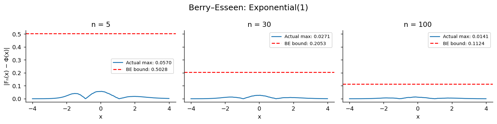
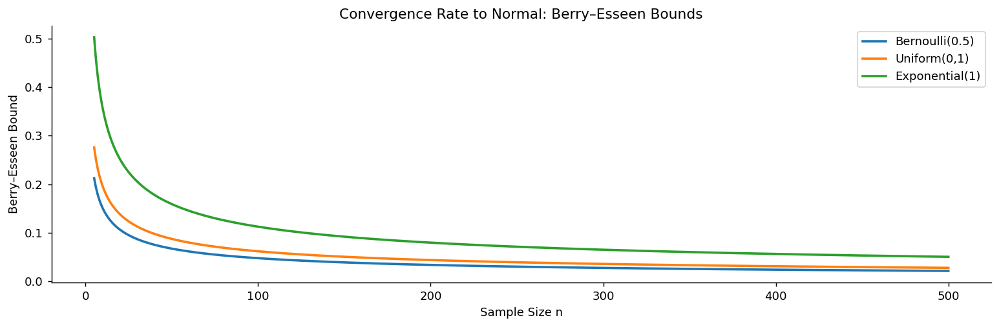

# 베리–에센 정리

중심극한정리는 $n \to \infty$일 때 정규분포로 수렴한다고 말할 뿐, 유한한 $n$에서 근사가 **얼마나 정확한지**는 말해 주지 않는다. 그래서 "$n \ge 30$이면 충분하다"는 관례가 생겼고, 그 관례에는 근거가 없다.

**베리–에센 정리**가 그 빈틈을 메운다. 임의의 유한한 $n$에 대해 정규근사 오차의 명시적인 상한을 준다. 그리고 그 상한에서 왜 어떤 분포는 빨리 수렴하고 어떤 분포는 느린지가 드러난다.

이 절은 세 개의 정리로 이루어진다. 오차의 상한(정리 1), 수렴 속도를 결정하는 양(정리 2), 그리고 중심극한정리와의 역할 분담(정리 3)이다.

## 1. 근사 오차에 명시적인 상한을 준다

중심극한정리가 "가까워진다"고만 말한 자리에, 이 정리는 "얼마나 가까운지"를 숫자로 적는다.

<div class="thmbox" markdown>

### 정리 1. 베리–에센 부등식 — 오차는 1/√n 규모 이하 { .thm }

$X_1, \ldots, X_n$이 i.i.d.이고 평균 $\mu$, 분산 $\sigma^2 > 0$, **3차 절대적률** $\rho = E\big[|X_i - \mu|^3\big] < \infty$를 가진다고 하자.

$F_n(x) = P\!\left(\dfrac{\bar X - \mu}{\sigma/\sqrt n} \le x\right)$을 표준화된 표본평균의 누적분포함수, $\mathcal N(x)$를 표준정규분포의 누적분포함수라 하면

$$
\sup_{x \in \mathbb{R}} \big|F_n(x) - \mathcal N(x)\big| \;\le\; \frac{C\,\rho}{\sigma^3 \sqrt n}
$$

이다. 여기서 $C$는 보편 상수이며 알려진 최선의 값은 $C \le 0.4748$이다(Shevtsova, 2011).

</div>

세 가지를 눈여겨보라.

**비점근적이다.** $n = 7$이든 $n = 10^6$이든 그대로 성립한다. "충분히 큰 $n$"이라는 단서가 없다.

**최대 오차를 잡는다.** $\sup_x$이므로 특정 지점이 아니라 **모든 $x$에서** 성립한다. 꼬리 확률을 계산할 때도 이 한계가 유효하다.

**가정이 하나 늘었다.** 중심극한정리는 분산까지만 요구했지만 여기서는 3차 적률도 유한해야 한다.

## 2. 무엇이 수렴 속도를 정하는가

상한의 형태 $\dfrac{C\rho}{\sigma^3\sqrt n}$을 뜯어보면 두 부분으로 나뉜다. $n$에 의존하는 부분과 분포에 의존하는 부분이다.

<div class="thmbox" markdown>

### 정리 2. 비정규성 척도 — 표준화 3차 적률이 속도를 정한다 { .thm }

오차 상한은

$$
\underbrace{\frac{\rho}{\sigma^3}}_{\text{분포의 성질}} \times \underbrace{\frac{C}{\sqrt n}}_{\text{표본크기}}
$$

로 분해된다. 앞의 인자 $\rho/\sigma^3$은 척도에 무관한 양으로, 분포가 정규분포에서 얼마나 벗어나 있는지를 재는 **비정규성의 척도**다. 이 값이 클수록 같은 $n$에서 근사가 나쁘다.

</div>

$\rho/\sigma^3$은 왜도의 사촌이다. 왜도가 $E[(X-\mu)^3]/\sigma^3$인데 여기서는 절댓값을 씌운다. 그래서 대칭 분포에서도 0이 되지 않지만, 치우칠수록 커지는 성질은 같다.

<div class="exbox" markdown>

**보기 1.** <span class="diff easy" title="쉬움"></span> 공정한 동전. $X_i \sim \text{Bernoulli}(0.5)$이면 $\mu = 0.5$, $\sigma^2 = 0.25$, $\rho = 0.125$이므로

</div>

??? success "풀이"
    $$
    \text{상한} = \frac{0.4748 \times 0.125}{0.25^{3/2}\sqrt n} = \frac{0.4748}{\sqrt n}
    $$

    $n = 100$에서 약 $0.0475$다. 누적분포함수가 어느 점에서도 정규분포와 4.75% 이상 차이 나지 않는다.

<div class="exbox" markdown>

**보기 2.** <span class="diff easy" title="쉬움"></span> 지수분포. $X_i \sim \text{Exponential}(1)$이면 $\mu = 1$, $\sigma^2 = 1$, $\rho = 2 + e^{-1} \approx 2.368$이므로

</div>

??? success "풀이"
    $$
    \text{상한} = \frac{0.4748 \times 2.368}{\sqrt n} \approx \frac{1.124}{\sqrt n}
    $$

    $n = 100$에서 약 $0.112$다. 대칭인 베르누이보다 **두 배 이상** 크다. 지수분포가 오른쪽으로 치우쳐 있기 때문이다.

    ```python
    import numpy as np
    from scipy import stats

    def berry_esseen_bound(sigma, rho, n, C=0.4748):
        """베리-에센 상계를 계산한다.

            |F_n(x) - Phi(x)|  <=  C * rho / (sigma^3 * sqrt(n))

        이 값은 **모든 x에 대해 한꺼번에** 성립하는 오차 상한이다.
        중심극한정리가 "n이 크면 정규분포에 가까워진다"고만 말하는 데 비해,
        베리-에센은 "얼마나 가까운가"를 수치로 준다.
        """
        return C * rho / (sigma**3 * np.sqrt(n))

    # 베르누이(0.5): 대칭이라 정규근사가 빠르다
    sigma_b = np.sqrt(0.25)     # 표준편차 0.5
    rho_b = 0.125               # E|X - mu|^3 = 0.5^3 = 0.125
    print("=== Bernoulli(0.5) ===")
    for n in [10, 30, 100, 1000]:
        bound = berry_esseen_bound(sigma_b, rho_b, n)
        print(f"n = {n:5d}: Berry–Esseen bound = {bound:.4f}")

    print()

    # 지수분포(1): 오른쪽으로 크게 치우쳐 정규근사가 훨씬 느리다.
    # rho/sigma^3 이 2.368 대 0.125 로 19배쯤 크므로 상계도 그만큼 커진다.
    sigma_e = 1.0
    rho_e = 2.368
    print("=== Exponential(1) ===")
    for n in [10, 30, 100, 1000]:
        bound = berry_esseen_bound(sigma_e, rho_e, n)
        print(f"n = {n:5d}: Berry–Esseen bound = {bound:.4f}")
    ```

    출력:

    ```
    === Bernoulli(0.5) ===
    n =    10: Berry–Esseen bound = 0.1501
    n =    30: Berry–Esseen bound = 0.0867
    n =   100: Berry–Esseen bound = 0.0475
    n =  1000: Berry–Esseen bound = 0.0150

    === Exponential(1) ===
    n =    10: Berry–Esseen bound = 0.3555
    n =    30: Berry–Esseen bound = 0.2053
    n =   100: Berry–Esseen bound = 0.1124
    n =  1000: Berry–Esseen bound = 0.0356
    ```

!!! note "$n \ge 30$ 관례의 정체"
    지수분포에서 $n = 30$이면 상한이 $1.124/\sqrt{30} \approx 0.205$다. **누적분포함수 오차가 20%까지 허용된다**는 뜻이며, 신뢰구간을 만들기에는 전혀 안심할 수 없는 수준이다.

    같은 $n = 30$에서 베르누이(0.5)는 상한이 $0.087$이다. 같은 표본크기인데 보장 수준이 두 배 이상 차이 난다.

    **$n \ge 30$은 대칭에 가까운 분포를 암묵적으로 전제한 관례다.** 자료가 치우쳐 있다면 그 수는 아무 의미가 없다. 상한이 $1/\sqrt n$로만 줄어들기 때문에, 오차를 절반으로 줄이려면 표본을 네 배로 늘려야 한다.

    다만 이 상한은 **보수적**이다. 실제 오차는 대개 훨씬 작다. 아래 시뮬레이션이 그 여유를 보여 준다.

<div class="codebox" markdown>

**예제 1.** 실제 오차와 베리-에센 상계 비교

```python
import numpy as np
import matplotlib.pyplot as plt
from scipy import stats

def berry_esseen_visualization(dist_name, rvs_fn, mu, sigma, rho, sample_sizes):
    """실제 오차와 베리-에센 상계를 나란히 그린다.

    상계는 "이보다 나쁘지는 않다"는 보장일 뿐이므로,
    실제 오차가 상계보다 훨씬 작게 나오는 것이 정상이다.
    """
    C = 0.4748
    x_grid = np.linspace(-4, 4, 1000)     # 오차를 재는 x 격자
    n_sim = 50_000                        # 표본평균을 5만 번 만든다

    fig, axes = plt.subplots(1, len(sample_sizes), figsize=(12, 3),
                             sharey=True)
    fig.suptitle(f'Berry–Esseen: {dist_name}', fontsize=14)

    for ax, n in zip(axes, sample_sizes):
        np.random.seed(42)
        # 크기 n인 표본을 5만 개 만들어 각각의 평균을 낸다
        samples = rvs_fn(size=(n_sim, n))
        x_bar = samples.mean(axis=1)

        # 표준화: (X-bar - mu) / (sigma/sqrt(n)).
        # 중심극한정리는 이 z가 N(0,1)로 간다고 말한다.
        z = (x_bar - mu) / (sigma / np.sqrt(n))

        # 경험적 CDF와 표준정규 CDF의 차이를 x마다 잰다
        ecdf = np.array([np.mean(z <= x) for x in x_grid])
        ncdf = stats.norm.cdf(x_grid)
        actual_error = np.abs(ecdf - ncdf)
        max_error = actual_error.max()      # 베리-에센이 상한을 주는 대상

        bound = C * rho / (sigma**3 * np.sqrt(n))

        ax.plot(x_grid, actual_error, lw=1.5, label=f'Actual max: {max_error:.4f}')
        ax.axhline(bound, color='r', linestyle='--', lw=1.5,
                   label=f'BE bound: {bound:.4f}')
        ax.set_title(f'n = {n}')
        ax.set_xlabel('x')
        ax.legend(fontsize=8)
        ax.spines[['top', 'right']].set_visible(False)

    axes[0].set_ylabel('|Fₙ(x) − Φ(x)|')
    plt.tight_layout()
    plt.show()

# Exp(1): 오른쪽으로 치우친 분포
berry_esseen_visualization(
    'Exponential(1)',
    lambda size: np.random.exponential(1, size),
    mu=1.0, sigma=1.0, rho=2.368,
    sample_sizes=[5, 30, 100]
)
```



</div>

세 분포의 상한을 $n$의 함수로 겹쳐 그리면 순서가 분명해진다.

<div class="codebox" markdown>

**예제 2.** 분포별 정규근사의 수렴 속도

```python
import numpy as np
import matplotlib.pyplot as plt

def convergence_rate_comparison():
    """분포마다 정규근사가 얼마나 빨리 좋아지는지 비교한다."""
    C = 0.4748           # 베리-에센 상수의 현재까지 알려진 최선의 값(셰바초바 2011)
    ns = np.arange(5, 501)

    # 각 분포에 필요한 것은 두 값뿐이다.
    #   sigma: 표준편차
    #   rho  : 세 번째 절대적률 E|X - mu|^3
    # rho/sigma^3 이 클수록(= 비대칭하거나 꼬리가 무거울수록) 수렴이 느리다.
    distributions = {
        'Bernoulli(0.5)': {'sigma': np.sqrt(0.25), 'rho': 0.125},
        'Uniform(0,1)':   {'sigma': 1/np.sqrt(12), 'rho': 1/32},
        'Exponential(1)': {'sigma': 1.0,            'rho': 2.368},
    }

    fig, ax = plt.subplots(figsize=(12, 4))
    for name, params in distributions.items():
        # 베리-에센 상계: |F_n(x) - Phi(x)| <= C * rho / (sigma^3 * sqrt(n))
        # n 의존성이 1/sqrt(n) 뿐이라는 점이 핵심이다.
        # 오차를 절반으로 줄이려면 표본을 네 배로 늘려야 한다.
        bounds = C * params['rho'] / (params['sigma']**3 * np.sqrt(ns))
        ax.plot(ns, bounds, label=name, lw=2)

    ax.set_xlabel('Sample Size n')
    ax.set_ylabel('Berry–Esseen Bound')
    ax.set_title('Convergence Rate to Normal: Berry–Esseen Bounds')
    ax.legend()
    ax.spines[['top', 'right']].set_visible(False)
    plt.tight_layout()
    plt.show()

convergence_rate_comparison()
```



</div>

## 3. 두 정리의 역할 분담

베리–에센 정리는 중심극한정리를 대체하지 않는다. 중심극한정리가 하지 못하는 말을 대신할 뿐이다.

<div class="thmbox" markdown>

### 정리 3. 질과 양 — 중심극한정리는 무엇을, 베리–에센은 얼마나 { .thm }

| 측면 | 중심극한정리 | 베리–에센 |
|:---|:---|:---|
| 진술 | $n \to \infty$일 때 $F_n(x) \to \mathcal N(x)$ | $\|F_n - \mathcal N\|_\infty \le C\rho/(\sigma^3\sqrt n)$ |
| 결과의 유형 | 점근적 | **비점근적**(유한한 $n$) |
| 수렴 속도 | 명시하지 않음 | $O(1/\sqrt n)$ |
| 가정 | 유한한 $\mu, \sigma^2$ | 유한한 $\mu, \sigma^2, \rho$ |

</div>

중심극한정리가 **정성적**으로 주장하는 바를 베리–에센이 **정량화**한다. 실무에서 "표본이 이만하면 정규근사를 써도 되는가"라는 물음에 답하려면 후자가 필요하다.

가정이 하나 늘었다는 대가도 기억할 만하다. 3차 적률이 무한한 분포 — 꼬리가 매우 두꺼운 분포 — 에서는 이 상한 자체를 쓸 수 없다. 그런 경우에는 수렴이 $1/\sqrt n$보다 느리며, 5장의 금융위기 사례가 그 상황을 다룬다.

## 연습문제

<div class="drillbox" markdown>

**연습문제 1.** <span class="diff med" title="중간"></span>
베리–에센 정리는 $C \leq 0.4748$일 때 $\sup_x |F_n(x) - \mathcal{N}(x)| \leq \frac{C \rho}{\sigma^3 \sqrt{n}}$이라고 말한다. Bernoulli(0.5) 분포에서는 $\sigma^2 = 0.25$이고 $\rho = E[|X - \mu|^3] = 0.125$이다. 베리–에센 한계가 근사 오차 0.01 이하를 보장하려면 $n$이 얼마나 커야 하는가?

</div>

??? success "풀이"
    다음이 필요하다.

    $$
    \frac{C \rho}{\sigma^3 \sqrt{n}} \leq 0.01
    $$

    $C = 0.4748$, $\rho = 0.125$, $\sigma = 0.5$를 넣으면

    $$
    \frac{0.4748 \times 0.125}{0.5^3 \sqrt{n}} \leq 0.01
    $$

    $$
    \frac{0.05935}{0.125 \sqrt{n}} \leq 0.01
    $$

    $$
    \frac{0.4748}{\sqrt{n}} \leq 0.01
    $$

    $$
    \sqrt{n} \geq 47.48 \implies n \geq 2254.3
    $$

    이다. 따라서 Bernoulli(0.5)의 경우 정규근사 오차가 0.01 이하임을 보장하려면 $n \geq 2255$이면 충분하다.

<div class="drillbox" markdown>

**연습문제 2.** <span class="diff med" title="중간"></span>
$\mu = 1$, $\sigma = 1$, $\rho = E[|X-1|^3] \approx 2.368$인 Exponential(1) 분포를 생각하자. $n = 30$에서의 베리–에센 한계를 같은 표본 크기의 Bernoulli(0.5)와 비교하라. 어느 분포가 정규분포로 더 빨리 수렴하며 그 이유는 무엇인가?

</div>

??? success "풀이"
    **Bernoulli(0.5):** $\rho = 0.125$, $\sigma = 0.5$이므로

    $$
    \text{Bound} = \frac{0.4748 \times 0.125}{0.5^3 \sqrt{30}} = \frac{0.05935}{0.125 \times 5.477} = \frac{0.05935}{0.6847} \approx 0.0867
    $$

    **Exponential(1):** $\rho = 2.368$, $\sigma = 1$이므로

    $$
    \text{Bound} = \frac{0.4748 \times 2.368}{1^3 \sqrt{30}} = \frac{1.1243}{5.477} \approx 0.2053
    $$

    Bernoulli(0.5)의 한계(0.087)가 Exponential(1)의 한계(0.205)보다 훨씬 작다. Bernoulli(0.5)는 대칭이라($\rho/\sigma^3$이 작아서) 더 빨리 수렴하는 반면, Exponential(1)은 오른쪽으로 치우쳐 있고 $\sigma^3$에 비해 3차 절대적률이 크다.

<div class="drillbox" markdown>

**연습문제 3.** <span class="diff easy" title="쉬움"></span>
중심극한정리가 이미 정규분포로의 수렴을 보장하는데도 베리–에센 정리가 필요한 이유를 설명하라.

</div>

??? success "풀이"
    중심극한정리는 **점근적** 결과다. $n \to \infty$일 때 $\bar{X}_n$이 정규분포로 분포수렴한다고 말할 뿐, 유한한 표본 크기 $n$에서 근사가 얼마나 좋은지에 대해서는 아무 말도 하지 않는다. 실무에서는 언제나 유한한 표본을 다루므로 $n = 30$이나 $n = 100$이나 $n = 10{,}000$이 "충분히 큰지"를 알아야 한다.

    베리–에센 정리는 정규근사의 최대 오차에 대한 명시적인 유한표본 **한계**를 제공하여 이 빈틈을 메운다. "내 특정 분포와 표본 크기에서 중심극한정리 근사는 얼마나 정확한가?"라는 실용적 질문에 답한다. 정규근사가 순진하게 짐작하는 것보다 훨씬 큰 표본을 요구할 수 있는, 치우쳤거나 꼬리가 두꺼운 분포에서 특히 중요하다.

<div class="drillbox" markdown>

**연습문제 4.** <span class="diff easy" title="쉬움"></span>
베리–에센 한계는 $O(1/\sqrt{n})$으로 줄어든다. 근사 오차를 10분의 1로 줄이려면(예: 0.1에서 0.01로) 표본 크기를 몇 배로 늘려야 하는가?

</div>

??? success "풀이"
    한계가 $1/\sqrt{n}$에 비례하므로 한계를 10분의 1로 줄이려면

    $$
    \frac{1}{\sqrt{n_{\text{new}}}} = \frac{1}{10} \cdot \frac{1}{\sqrt{n_{\text{old}}}}
    $$

    $$
    \sqrt{n_{\text{new}}} = 10 \sqrt{n_{\text{old}}}
    $$

    $$
    n_{\text{new}} = 100 \cdot n_{\text{old}}
    $$

    이어야 한다. 근사 오차를 10분의 1로 줄이려면 표본 크기를 **100배**로 늘려야 한다. 이 $O(1/\sqrt{n})$의 수렴 속도는 비교적 느리며, 특히 치우친 분포에서 정확한 정규근사에 때때로 아주 큰 표본이 필요한 이유를 설명해 준다.

<div class="drillbox" markdown>

**연습문제 5.** <span class="diff hard" title="어려움"></span>
**에지워스 전개**가 중심극한정리를 2차까지 정밀화함을 보여라. $\gamma_1$이 왜도일 때 $\sqrt n (\bar X_n - \mu)/\sigma$의 누적분포함수를 $\Phi(x) + (\gamma_1/(6\sqrt n)) \phi(x) (1 - x^2) + O(1/n)$으로 근사할 수 있다. 이것이 순수한 중심극한정리보다 왜 더 정확한 근사인지 설명하라.

</div>

??? success "풀이"
    순수한 중심극한정리는 누적분포함수를 $\Phi(x)$로 근사하며 오차가 $O(1/\sqrt n)$, 즉 베리–에센의 속도다.

    **에지워스 전개**는 모집단 분포의 왜도 $\gamma_1$에 비례하는 보정항을 더한다.

    $$
    P\!\left(\frac{\sqrt n (\bar X_n - \mu)}{\sigma} \le x\right) = \Phi(x) - \frac{\gamma_1}{6\sqrt n}(x^2 - 1)\phi(x) + O(1/n)
    $$

    이렇게 하면 잔여 오차가 $O(1/\sqrt n)$에서 $O(1/n)$으로 줄어들어 한 자릿수만큼 더 촘촘해진다. 그다음 항들은 첨도($\gamma_2$)와 더 높은 누율을 포함한다.

    **실용적 쓰임:** 심하게 치우친 자료에서 $n$이 중간 정도일 때 에지워스 보정이 순수한 가우시안 근사보다 상당히 정확할 수 있다. 통계 소프트웨어의 여러 고정밀 근사가 에지워스나 관련된 안장점 보정을 사용한다.

    **단서:** 에지워스 전개는 꼬리에서 음의 "확률밀도"를 낼 수 있으므로 타당한 영역(대개 $|x| \le 2$ 정도) 밖에서 쓰면 안 된다.

<div class="drillbox" markdown>

**연습문제 6.** <span class="diff hard" title="어려움"></span>
**i.i.d.가 아닌** 합에 대한 베리–에센. 독립이지만 동일분포는 아닌 확률변수에 대한 일반화를 진술하라. 이것이 회귀와 시계열 분석에 왜 중요한가?

</div>

??? success "풀이"
    **일반화된 베리–에센:** $\mathbb{E}[X_i] = 0$, $\mathrm{Var}(X_i) = \sigma_i^2$, $\mathbb{E}[|X_i|^3] = \rho_i$, $B_n^2 = \sum_i \sigma_i^2$인 독립(동일분포일 필요는 없음) $X_i$에 대해

    $$
    \sup_x \left| P\!\left(\frac{S_n}{B_n} \le x\right) - \Phi(x) \right| \le \frac{C \sum_i \rho_i}{B_n^3}
    $$

    이다. 이 한계는 합의 표준편차의 세제곱 대비 3차 적률의 *합*에 의존한다. 어느 한 $X_i$의 $\rho_i$가 불균형하게 크면 한계가 느슨해지는데, 이는 큰 항 하나가 가우시안 수렴을 막을 수 있음을 반영한다.

    **응용통계에서의 중요성:**

    - **회귀**: 오차 $\varepsilon_i$의 분산이 서로 다를 수 있으므로(이분산성) $\hat\beta$에 대한 정규분포 기반 신뢰구간을 정당화하려면 i.i.d.가 아닌 중심극한정리가 필요하다.
    - **시계열**: 약한 종속(혼합) 열은 적절한 보정을 거쳐 중심극한정리를 만족한다.
    - **표본조사**: 층화표본은 분산이 서로 다른 층들의 독립적인 기여를 섞는다.

    현대 점근통계학은 i.i.d. 가정이 정확히 성립하는 일이 드문 실제 자료 상황에서 가우시안 중심극한정리를 정당화하기 위해 이런 일반화에 의존한다.

<div class="drillbox" markdown>

**연습문제 7.** <span class="diff med" title="중간"></span>
베리–에센 한계는 **얼마나 느슨한가?** 실제 오차를 직접 계산해 한계와 비교하라.

</div>

??? success "풀이"
    ```python
    import numpy as np
    from scipy import stats

    def sup_err(n, p):                      # sup_x |F_n(x) - Phi(x)| 를 정확히
        k = np.arange(0, n + 1)
        sd = np.sqrt(p * (1 - p))
        F = stats.binom.cdf(k, n, p)
        Phi = stats.norm.cdf((k - n * p) / (sd * np.sqrt(n)))
        F_left = np.concatenate([[0.0], F[:-1]])          # 계단 직전 값
        return max(np.abs(F - Phi).max(), np.abs(F_left - Phi).max())

    print("Bernoulli(0.5):  sigma^2 = 0.25,  rho = 0.125,  rho/sigma^3 = 1")
    print(f"{'n':>7}{'실제 sup 오차':>17}{'베리-에센 한계':>17}{'한계/실제':>12}")
    for n in (10, 30, 100, 1000, 10_000):
        actual, bound = sup_err(n, 0.5), 0.4748 / np.sqrt(n)
        print(f"{n:>7}{actual:>17.6f}{bound:>17.6f}{bound / actual:>12.2f}")
    ```

    출력:

    ```
    Bernoulli(0.5):  sigma^2 = 0.25,  rho = 0.125,  rho/sigma^3 = 1
          n        실제 sup 오차         베리-에센 한계       한계/실제
         10         0.123047         0.150145        1.22
         30         0.072232         0.086686        1.20
        100         0.039795         0.047480        1.19
       1000         0.012613         0.015014        1.19
      10000         0.003989         0.004748        1.19
    ```

    **한계가 놀랍도록 타이트하다.** 모든 $n$에서 실제 오차의 $1.19$–$1.22$배에 불과하다. 상한이 흔히 몇 자릿수씩 헐거운 것과 대조적이다.

    **실제 오차가 정확히 $0.3989/\sqrt n$이다.** $n=10\,000$에서 $0.003989$, $n=100$에서 $0.039795$다. 이 상수는

    $$
    \frac{1}{\sqrt{2\pi}}=0.39894
    $$

    **왜 이 값인가.** $F_n$은 계단함수이고 $\Phi$는 연속이다. 중앙의 계단 하나의 높이가 이항분포의 최대 확률질량

    $$
    \binom{n}{n/2}2^{-n}\approx\sqrt{\frac{2}{\pi n}}
    $$

    이고, 연속함수가 계단을 가로지를 때 생기는 최대 간격은 **계단 높이의 절반**이다.

    $$
    \frac12\sqrt{\frac{2}{\pi n}}=\frac{1}{\sqrt{2\pi n}}
    $$

    **오차의 정체가 이산성이다.** 정규근사가 "틀린" 것이 아니라, 계단함수를 매끄러운 곡선으로 덮으려니 **계단의 절반만큼은 어쩔 수 없이 남는** 것이다.

    **그래서 이산분포에서는 $O(n^{-1/2})$를 개선할 수 없다.** 왜도를 아무리 보정해도(연습문제 $5$의 에지워스) 계단은 남는다. 이를 어떻게 다루는지는 연습문제 $10$에서 본다. $\square$

<div class="drillbox" markdown>

**연습문제 8.** <span class="diff hard" title="어려움"></span>
정리에 등장하는 상수 $C$의 **최적값은 아직 모른다.** 알려진 상한과 하한을 정리하고, 베르누이분포가 그 하한에 닿는지 확인하라.

</div>

??? success "풀이"
    **상한의 역사.**

    | 연도 | 저자 | $C$ |
    |---|---|---|
    | $1941$ | 에세인 | $7.59$ |
    | $1972$ | 판 베이크 | $0.7975$ |
    | $2001$ | 시가노프 | $0.7056$ |
    | $2010$ | 셰프초바 | $0.4748$ |
    | $2011$ | 셰프초바 | $0.4690$ |

    **하한.** 에세인(1956)이 $C$를 아래로도 가둘 수 있음을 보였다.

    $$
    C \;\ge\; \frac{\sqrt{10}+3}{6\sqrt{2\pi}} = 0.409732\ldots
    $$

    **따라서 최적 상수는 $[0.4097,\;0.4690]$ 안에 있고, 그 안 어디인지는 미해결 문제다.**

    ```python
    import numpy as np
    from scipy import stats

    def ratio(n, p):                # 실제오차 * sqrt(n) * sigma^3 / rho
        k = np.arange(0, n + 1)
        sd = np.sqrt(p * (1 - p))
        F = stats.binom.cdf(k, n, p)
        Phi = stats.norm.cdf((k - n * p) / (sd * np.sqrt(n)))
        F_left = np.concatenate([[0.0], F[:-1]])
        err = max(np.abs(F - Phi).max(), np.abs(F_left - Phi).max())
        rho = p * (1 - p) ** 3 + (1 - p) * p ** 3
        return err * np.sqrt(n) / (rho / sd ** 3)

    print(f"{'p':>7}{'rho/sigma^3':>14}"
          + "".join(f"{'n=' + str(n):>12}" for n in (100, 1000, 10_000, 100_000)))
    for p in (0.5, 0.2, 0.05, 0.01):
        sd = np.sqrt(p * (1 - p))
        r = (p * (1 - p) ** 3 + (1 - p) * p ** 3) / sd ** 3
        vals = [ratio(n, p) for n in (100, 1000, 10_000, 100_000)]
        print(f"{p:>7}{r:>14.4f}" + "".join(f"{v:>12.4f}" for v in vals))

    print(f"\n에세인의 하한 = (sqrt(10)+3)/(6 sqrt(2 pi)) = "
          f"{(np.sqrt(10) + 3) / (6 * np.sqrt(2 * np.pi)):.6f}")
    ```

    출력:

    ```
    p   rho/sigma^3       n=100      n=1000     n=10000    n=100000
        0.5        1.0000      0.3979      0.3988      0.3989      0.3989
        0.2        1.7000      0.3498      0.3518      0.3520      0.3520
       0.05        4.1524      0.2794      0.2858      0.2865      0.2865
       0.01        9.8514      0.2393      0.2666      0.2696      0.2699

    에세인의 하한 = (sqrt(10)+3)/(6 sqrt(2 pi)) = 0.409732
    ```

    **베르누이는 하한에 닿지 못한다.** 최댓값이 $p=0.5$에서의 $0.3989=1/\sqrt{2\pi}$이고, $p$가 치우칠수록 오히려 **줄어든다**($p=0.01$에서 $0.270$).

    | $p$ | $\rho/\sigma^3$ | 극한 비율 |
    |---|---|---|
    | $0.5$ | $1.00$ | $0.3989$ |
    | $0.2$ | $1.70$ | $0.3520$ |
    | $0.05$ | $4.15$ | $0.2865$ |
    | $0.01$ | $9.85$ | $0.2699$ |

    **$p$가 작아지면 오차 자체는 커지는데 비율은 줄어든다.** $\rho/\sigma^3$이 오차보다 더 빨리 커지기 때문이다. **정리가 치우친 분포에 대해 오히려 더 보수적**이라는 뜻이다.

    **$0.4097$을 주는 분포는 무엇인가.** 에세인의 예는 단순한 베르누이가 아니라 **두 값의 간격과 확률을 특별히 맞춘 격자분포의 극한**이며, 정확히 $(\sqrt{10}+3)/(6\sqrt{2\pi})$를 준다.

    **실무적으로 어떤 의미인가.** $C$의 정확한 값이 $0.41$이든 $0.47$이든 **필요한 $n$은 $30\%$ 정도밖에 차이 나지 않는다.** 지배적인 것은 $\rho/\sigma^3$과 $\sqrt n$이다. 그래도 이 문제가 $80$년간 열려 있다는 사실 자체가, 중심극한정리의 "오차가 정확히 얼마인가"라는 물음이 얼마나 미묘한지를 보여준다. $\square$

<div class="drillbox" markdown>

**연습문제 9.** <span class="diff hard" title="어려움"></span>
베리–에센 한계는 **모든 $x$에 같은 값**을 준다. 그런데 clt 문서 연습문제 $9$에서 보았듯 근사의 질은 중심과 꼬리에서 크게 다르다. **비균등 베리–에센 한계**를 진술하고 확인하라.

</div>

??? success "풀이"
    **나가예프의 비균등 한계.**

    $$
    \left|F_n(x)-\Phi(x)\right| \;\le\;
    \frac{C\,\rho}{\sigma^3\sqrt n\,(1+|x|)^3}
    $$

    **분모에 $(1+|x|)^3$이 붙었다.** $x=3$에서는 균등 한계의 $1/64$이다. 꼬리로 갈수록 절대오차가 훨씬 작음을 보장한다.

    ```python
    import numpy as np
    from scipy import stats

    print(f"{'n':>7}{'균등 오차':>14}{'|z|<1 구간':>15}{'|z|>2 구간':>16}"
          f"{'(1+|z|)^3 가중 최대':>22}")
    for n in (100, 1000, 10_000):
        k = np.arange(0, n + 1)
        z = (k - n * 0.5) / (0.5 * np.sqrt(n))
        d = np.abs(stats.binom.cdf(k, n, 0.5) - stats.norm.cdf(z))
        print(f"{n:>7}{d.max():>14.6f}{d[np.abs(z) < 1].max():>15.6f}"
              f"{d[np.abs(z) > 2].max():>16.8f}{(d * (1 + np.abs(z)) ** 3).max():>22.6f}")
    ```

    출력:

    ```
    n         균등 오차       |z|<1 구간        |z|>2 구간       (1+|z|)^3 가중 최대
        100      0.039795       0.039795      0.00369665              0.220041
       1000      0.012613       0.012613      0.00165320              0.067135
      10000      0.003989       0.003989      0.00052121              0.020971
    ```

    **꼬리의 절대오차가 훨씬 작다.** $n=100$에서 중심부 오차가 $0.0398$인데 $|z|>2$ 구간에서는 $0.0037$로 **$11$배 작다.**

    **가중 최댓값이 $1/\sqrt n$로 줄어든다.** $0.2200\to0.0671\to0.0210$으로 $10$배마다 약 $3.2$배씩 감소하며, 이는 비균등 한계의 형태가 옳음을 확인해 준다.

    !!! warning "그래도 상대오차는 여전히 통제하지 못한다"
        $|z|>2$에서 절대오차가 $0.0037$인데, 그 구간의 확률 자체가 $0.023$ 수준이다. **비율로는 $16\%$**다. 비균등 한계는 절대오차가 꼬리에서 더 작음을 말할 뿐, **꼬리확률의 상대적 정확도**는 여전히 보장하지 않는다.

    **상대오차를 원하면 다른 도구가 필요하다.**

    | 도구 | 보장하는 것 |
    |---|---|
    | 베리–에센(균등) | $\sup_x$ 절대오차 |
    | 비균등 베리–에센 | $x$에 따라 감소하는 절대오차 |
    | **크라메르 대편차 정리** | $x=o(n^{1/6})$ 범위에서 **상대오차** |
    | **체르노프·대편차 한계** | 지수적으로 작은 확률의 지수 |
    | 안장점 근사 | 꼬리에서 놀랍도록 정확한 상대오차 |

    **크라메르의 정리가 실무의 경계선을 알려준다.** $x$가 $n^{1/6}$보다 느리게 자라는 한 상대오차가 사라진다. $n=10\,000$이면 $n^{1/6}\approx4.6$이니 $z=3$ 정도까지는 상대적으로도 믿을 만하다. **$n=100$이면 $n^{1/6}\approx2.2$라 $z=3$은 이미 보장 밖**이다. $\square$

<div class="drillbox" markdown>

**연습문제 10.** <span class="diff med" title="중간"></span>
연습문제 $7$에서 오차의 정체가 **이산성**임을 보았다. 그렇다면 **연속성 보정**으로 없앨 수 있는가? 대칭인 경우와 치우친 경우를 나누어 확인하라.

</div>

??? success "풀이"
    연속성 보정은 $P(S_n\le k)$를 $\Phi$에 넣을 때 $k$ 대신 $k+\tfrac12$을 쓴다. **계단의 중간점**을 쓰는 것이므로, 연습문제 $7$의 "계단 절반" 오차를 정확히 겨냥한다.

    ```python
    import numpy as np
    from scipy import stats

    def compare(n, p):
        k = np.arange(0, n + 1)
        sd = np.sqrt(n * p * (1 - p))
        F = stats.binom.cdf(k, n, p)
        raw = np.abs(F - stats.norm.cdf((k - n * p) / sd)).max()
        cc = np.abs(F - stats.norm.cdf((k + 0.5 - n * p) / sd)).max()
        return raw, cc

    print("대칭:  Binomial(n, 0.5)")
    print(f"{'n':>7}{'보정 없음':>15}{'보정 있음':>15}{'개선 배수':>12}")
    for n in (10, 30, 100, 1000, 10_000):
        raw, cc = compare(n, 0.5)
        print(f"{n:>7}{raw:>15.6f}{cc:>15.6f}{raw / cc:>12.1f}")

    print("\n치우침:  Binomial(n, 0.1)")
    print(f"{'n':>7}{'보정 없음':>15}{'보정 있음':>15}{'개선 배수':>12}")
    for n in (30, 100, 1000, 10_000):
        raw, cc = compare(n, 0.1)
        print(f"{n:>7}{raw:>15.6f}{cc:>15.6f}{raw / cc:>12.1f}")
    ```

    출력:

    ```
    대칭:  Binomial(n, 0.5)
          n          보정 없음          보정 있음       개선 배수
         10       0.123047       0.002686        45.8
         30       0.072232       0.000918        78.7
        100       0.039795       0.000273       146.0
       1000       0.012613       0.000027       464.3
      10000       0.003989       0.000003      1469.2

    치우침:  Binomial(n, 0.1)
          n          보정 없음          보정 있음       개선 배수
         30       0.147439       0.030898         4.8
        100       0.083156       0.017474         4.8
       1000       0.026599       0.005599         4.8
      10000       0.008421       0.001773         4.8
    ```

    **대칭인 경우 보정이 수렴 차수 자체를 바꾼다.**

    | $n$ | 보정 없음 | 보정 있음 | 개선 |
    |---|---|---|---|
    | $10$ | $0.1230$ | $0.00269$ | $46$배 |
    | $100$ | $0.0398$ | $0.000273$ | $146$배 |
    | $10\,000$ | $0.00399$ | $0.0000027$ | $1469$배 |

    보정 없이는 $O(n^{-1/2})$인데, **보정 후에는 $O(n^{-1})$이다**($n$이 $1000$배 늘 때 오차가 $1000$배 줄었다). 개선 배수가 $\sqrt n$에 비례해 커지는 것이 그 증거다.

    **치우친 경우는 다르다.** $p=0.1$에서 개선이 **$4.8$배로 고정**된다. 차수는 여전히 $O(n^{-1/2})$다.

    **에지워스 전개가 이유를 설명한다.** 격자분포에서 오차는 두 항의 합이다.

    $$
    F_n(x)-\Phi(x) \;=\;
    \underbrace{-\frac{\gamma_1}{6\sqrt n}\phi(x)(x^2-1)}_{\text{왜도 항}}
    \;+\;\underbrace{\frac{S(\cdot)}{\sigma\sqrt n}\phi(x)}_{\text{격자 항}}+O(n^{-1})
    $$

    | 경우 | 왜도 항 | 격자 항 | 연속성 보정 후 |
    |---|---|---|---|
    | $p=0.5$ | $\gamma_1=0$이라 **없음** | 있음 | 둘 다 사라져 $O(n^{-1})$ |
    | $p=0.1$ | $\gamma_1\ne0$이라 **남음** | 있음 | 격자 항만 제거, 여전히 $O(n^{-1/2})$ |

    **연속성 보정은 격자 항만 지운다.** 대칭분포는 왜도가 $0$이라 그것으로 충분하고, 치우친 분포는 왜도 항이 남는다.

    **처방이 명확해진다.**

    | 상황 | 해야 할 일 |
    |---|---|
    | 대칭 이산분포 | 연속성 보정으로 충분 |
    | 치우친 이산분포 | 보정 **더하기** 왜도 보정(에지워스) |
    | 매우 치우침($np<5$) | 근사를 버리고 **정확 계산**(`scipy.stats.binom`) |
    | 꼬리확률이 중요 | 정확 계산 또는 안장점 근사 |

    **현대적 결론.** 연속성 보정은 계산이 비쌌던 시절의 유산이지만, 지금도 **왜 근사가 틀리는지**를 분해해 보여주는 도구로서 가치가 있다. 실제 계산에서는 이항분포의 정확한 확률을 그냥 구하면 되고, 근사가 필요한 경우는 이항분포가 더 큰 모형의 한 부품일 때다. $\square$


## 정리하며

베리–에센 정리는 중심극한정리에 눈금을 붙인다.

- **정리 1**은 정규근사 오차에 유한표본 상한 $C\rho/(\sigma^3\sqrt n)$을 주었다. 점근적 진술이 아니라 어떤 $n$에서든 성립한다.
- **정리 2**는 그 상한이 $\rho/\sigma^3$이라는 **비정규성 척도**와 $1/\sqrt n$의 곱임을 보였다. 치우친 분포일수록 느리게 수렴한다.
- **정리 3**은 두 정리의 역할을 갈랐다. 중심극한정리는 무엇으로 가는지를, 베리–에센은 얼마나 가까운지를 말한다.

실무적으로 남길 것은 하나다. **$n \ge 30$은 대칭에 가까운 분포를 전제한 관례다.** 지수분포에서는 $n = 30$의 보장이 20% 수준에 그친다. 자료가 치우쳐 있다면 표본크기 규칙보다 그림(14장 Q-Q 그림)이나 붓스트랩(17장)이 낫다.

이것으로 3.5절의 이론이 끝났다. 남은 두 페이지는 이 정리들이 **눈으로 어떻게 보이는지**, 그리고 **가정이 깨지면 어떻게 되는지**를 다룬다.

먼저 **중심극한정리 다중 분포 시각화**가 여러 모집단에서 표본평균의 분포가 정규 모양으로 모여드는 과정을 나란히 보여 준다. 이어지는 **도박사의 역설**은 평균이 무한한 분포에서 큰수의 법칙이 실패하는 모습을 다룬다. 정리의 가정이 장식이 아니라는 것을 그 사례가 분명히 한다.
