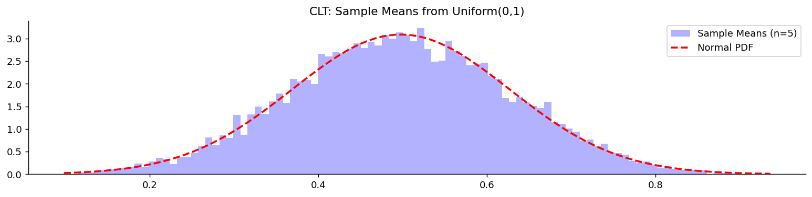
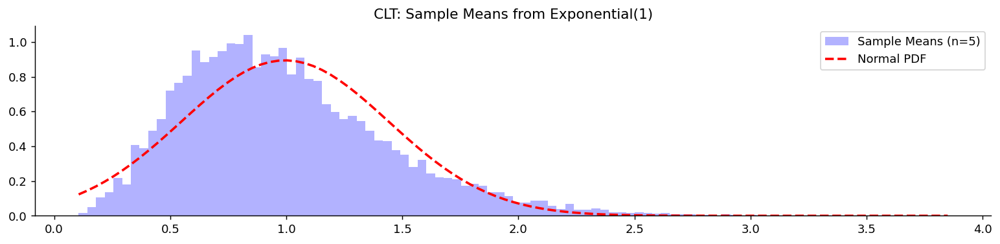

# 중심극한정리

큰수의 법칙은 표본평균이 **어디로** 가는지 알려 주었다. 그러나 어떻게 가는지는 말해 주지 않았다. $n = 100$에서 표본평균이 $\mu$에서 얼마나 떨어져 있을 가능성이 큰가? 그 오차의 분포는 어떤 모양인가?

**중심극한정리**가 이 물음에 답한다. 그리고 그 답이 놀랍다. **모집단이 어떤 분포이든 상관없이** 오차의 모양이 정규분포로 간다. 주사위든 지수분포든 심하게 치우친 소득 분포든, 평균과 분산만 유한하면 결과가 같다.

이 보편성 덕분에 신뢰구간과 가설검정이 모집단 분포를 몰라도 작동한다. 5장 이후 이 책의 추론 전체가 이 정리 위에 서 있다.

이 절은 세 개의 정리로 이루어진다. 정리의 진술(정리 1), 큰수의 법칙과의 관계(정리 2), 그리고 실제로 언제 쓸 수 있는가(정리 3)이다.

## 1. 오차의 모양은 언제나 정규분포다

정리의 형태는 단순하다. 표본평균에서 중심을 빼고 표준오차로 나누면, 남는 것이 표준정규분포다.

### 정리 1. 중심극한정리 — 표준화된 표본평균은 표준정규분포로 간다

$X_1, X_2, \ldots$가 평균 $\mu$, 분산 $\sigma^2 < \infty$인 i.i.d. 확률변수이면

$$
\frac{\bar X - \mu}{\sigma/\sqrt n} \xrightarrow{\;d\;} N(0, 1) \qquad (n \to \infty)
$$

이다. 동등하게 $n$이 크면

$$
\bar X \;\approx\; N\!\left(\mu, \frac{\sigma^2}{n}\right),
\qquad
S_n = \sum_{i=1}^n X_i \;\approx\; N(n\mu,\; n\sigma^2)
$$

이다.

**가정이 놀랍도록 적다.** 독립 동일분포일 것, 그리고 평균과 분산이 유한할 것. 모집단의 모양에 대한 조건은 **아무것도 없다.**

증명의 뼈대는 이미 3.4절에서 보았다. 적률생성함수가 합을 곱으로 바꾸고, 테일러 전개가 앞의 두 적률만 남기고, 유일성이 극한을 분포로 되돌린다. 남는 극한 $e^{t^2/2}$이 표준정규분포의 적률생성함수다.

**왜 하필 정규분포인가.** 전개에서 살아남는 것이 평균과 분산뿐이기 때문이다. 3차 이상의 적률은 $n$으로 나뉘며 사라진다. 원래 분포가 아무리 치우쳐 있어도 그 치우침은 $1/\sqrt n$의 속도로 씻겨 나가고, 평균과 분산만으로 결정되는 분포 — 즉 정규분포 — 가 남는다.

## 2. 두 극한정리는 같은 것의 다른 배율이다

큰수의 법칙과 중심극한정리는 별개의 결과처럼 보이지만 실은 같은 현상을 다른 배율로 본 것이다.

### 정리 2. 두 법칙의 관계 — $n$으로 나누면 소멸, $\sqrt n$을 곱하면 정규

편차 $\bar X - \mu$를 어떤 속도로 확대해 보느냐에 따라 보이는 것이 달라진다.

$$
\underbrace{\bar X - \mu \;\longrightarrow\; 0}_{\text{큰수의 법칙}}
\qquad
\underbrace{\sqrt n\,(\bar X - \mu) \;\xrightarrow{d}\; N(0, \sigma^2)}_{\text{중심극한정리}}
$$

큰수의 법칙은 편차가 0으로 간다고만 말한다. 그런데 그 편차에 $\sqrt n$을 곱해 **확대해서 보면** 사라지지 않고 정규분포 모양의 구조가 드러난다.

$\sqrt n$이라는 배율이 정확히 맞는 것도 우연이 아니다. 3.4절에서 $\text{Var}(\bar X) = \sigma^2/n$이었으므로 표준편차가 $\sigma/\sqrt n$이다. 그 크기로 나누어야 배율이 맞는다. 더 작은 배율을 쓰면 0으로 뭉개지고, 더 큰 배율을 쓰면 발산한다.

**실무적 함의:** 정밀도는 $1/\sqrt n$로 좋아진다. 오차를 절반으로 줄이려면 자료를 **네 배** 모아야 한다. 8장의 표본크기 계산이 전부 이 관계에서 나온다.

```python
import matplotlib.pyplot as plt
import numpy as np
from scipy import stats

def demonstrate_clt(distribution_type, sample_size, n_simulations=10_000):
    """모집단이 무엇이든 표본평균이 정규분포로 간다는 것을 보인다."""
    np.random.seed(0)

    # (sample_size, n_simulations) 모양으로 한 번에 뽑고 axis=0으로 평균 낸다.
    # 즉 "크기 n인 표본을 1만 번 뽑아 각각의 평균을 구한 것"이 한 줄에 들어 있다.
    if distribution_type == 'uniform':
        data = np.mean(stats.uniform().rvs((sample_size, n_simulations)), axis=0)
        label = 'Uniform(0,1)'      # 평평한 분포. 종 모양과 전혀 다르다.
    elif distribution_type == 'exponential':
        data = np.mean(stats.expon().rvs((sample_size, n_simulations)), axis=0)
        label = 'Exponential(1)'    # 오른쪽으로 심하게 치우친 분포

    # 1만 개의 표본평균에서 잰 중심과 퍼짐
    mu, sigma = data.mean(), data.std()

    fig, ax = plt.subplots(figsize=(12, 3))
    _, bins, _ = ax.hist(data, bins=100, density=True, alpha=0.3, color='blue',
                         label=f'Sample Means (n={sample_size})')
    # 같은 평균·표준편차의 정규분포를 겹친다.
    # 이 곡선이 히스토그램에 얼마나 붙는지가 중심극한정리의 성적표다.
    ax.plot(bins, stats.norm(mu, sigma).pdf(bins), '--r', lw=2, label='Normal PDF')
    ax.set_title(f'CLT: Sample Means from {label}')
    ax.spines[['top', 'right']].set_visible(False)
    ax.legend()
    plt.tight_layout()
    plt.show()

# Demonstrate with both distributions
demonstrate_clt('uniform', sample_size=5)
demonstrate_clt('exponential', sample_size=5)
```





$n = 5$라는 작은 표본에서도 균등분포 쪽은 이미 정규분포에 가깝다. 지수분포 쪽은 아직 오른쪽으로 치우쳐 있다. **정리는 분포와 무관하지만 수렴 속도는 그렇지 않다.**

## 3. 언제 써도 되는가

정리는 $n \to \infty$를 말하지만 실제 자료의 $n$은 유한하다. 얼마나 커야 "충분히 큰가"는 정리가 답해 주지 않으므로 실무 기준이 필요하다.

### 정리 3. 정규근사의 실무 조건 — 세 가지 확인 사항

| 상황 | 어림 기준 |
|:---|:---|
| 일반적인 표본평균 | $n \ge 30$ |
| 비율(이항 자료) | $np \ge 5$ 그리고 $n(1-p) \ge 5$ |
| 유한모집단에서 비복원 표집 | $n/N \le 10\%$ |

이들은 **정리가 아니라 관례다.** 각각의 배경은 다음과 같다.

**$n \ge 30$.** 모집단이 대칭이면 $n \approx 15$–20으로도 충분하고, 심하게 치우쳤거나 꼬리가 두꺼우면 $n \ge 40$–50이 필요하다. 30이라는 수에 특별한 근거는 없다. 다음 절의 **베리–에센 정리**가 이 근사 오차에 실제 상한을 준다.

**비율의 조건.** $X \sim \text{Binomial}(n,p)$일 때 $X \approx N(np,\, np(1-p))$인데, $p$가 0이나 1에 가까우면 이산분포가 경계에 몰려 정규 모양이 나오지 않는다. 정수값을 연속으로 근사하므로 **연속성 수정**을 함께 쓴다.

$$
P(X \le k) \approx P\!\left(Z \le \frac{k + 0.5 - np}{\sqrt{np(1-p)}}\right)
$$

포아송분포도 $\lambda$가 크면 $X \approx N(\lambda, \lambda)$로 근사된다.

**10% 조건.** 크기 $N$인 유한모집단에서 비복원으로 뽑으면 관측이 독립이 아니다. 정확한 분산은 유한모집단 수정을 포함한다.

$$
\text{Var}(\bar X) = \frac{\sigma^2}{n}\cdot\frac{N-n}{N-1}
$$

$n/N$이 작으면 수정계수가 1에 가까워 무시할 수 있다.

!!! warning "$n \ge 30$을 규칙으로 믿지 말 것"
    치우침이 심하면 $n = 30$은 턱없이 부족하다. 5장에서 왜도가 2인 지수분포로 확인해 보면 $n = 100$에서도 95% 신뢰구간의 실제 포함확률이 $0.934$에 그친다.

    반대로 모집단이 이미 정규분포라면 $n = 1$에서도 표본평균이 **정확히** 정규분포다. 근사가 아니라 등식이다.

    실무에서는 자료를 그려 보는 것이 규칙을 외우는 것보다 낫다. 14장의 정규성 검정과 Q-Q 그림, 17장의 붓스트랩이 $n \ge 30$을 대신할 도구다.

## 연습문제

**연습문제 1.**
어떤 기계가 $\mu = 500$ ml, $\sigma = 10$ ml로 병을 채운다(정규분포가 아니다). (a) 중심극한정리에 따른 $\bar X_{36}$의 분포는? (b) $P(\bar X_{36} > 503)$은? (c) $P(|\bar X_n - 500| < 2) \ge 0.95$가 되려면 $n$은?

??? success "풀이"
    (a) $\bar X_{36} \approx N(500, 100/36) = N(500, 2.778)$. 표준오차 $= 10/6 \approx 1.67$.

    (b) $Z = (503 - 500)/(10/6) = 1.8$이므로 $P(Z > 1.8) \approx 1 - 0.9641 = 0.0359$. 약 3.6%다.

    (c) $2/(\sigma/\sqrt n) \ge z_{0.025} = 1.96 \Rightarrow 2\sqrt n / 10 \ge 1.96 \Rightarrow n \ge 96.04$이어야 하므로 $n \ge 97$이다.

---

**연습문제 2.**
평균 0, 분산 1이고 0의 근방에서 적률생성함수 $M(t)$가 유한한 i.i.d. $X_i$에 대해 **적률생성함수 방법으로 중심극한정리를 증명하라**. $\sqrt n \bar X_n$의 적률생성함수가 $e^{t^2/2}$로 수렴함을 보여라.

??? success "풀이"
    표준화된 합: $Z_n = \sqrt n \bar X_n = (X_1 + \cdots + X_n)/\sqrt n$.

    그 적률생성함수: $M_{Z_n}(t) = \mathbb{E}[e^{t Z_n}] = \prod_i \mathbb{E}[e^{t X_i / \sqrt n}] = [M(t/\sqrt n)]^n$.

    $M(t/\sqrt n)$을 0 주위로 전개한다. $\mu = 0$, $\sigma^2 = 1$을 쓰면 $M(u) = 1 + \mu u + (\sigma^2 + \mu^2) u^2/2 + O(u^3) = 1 + u^2/2 + O(u^3)$이다.

    따라서 $M(t/\sqrt n) = 1 + t^2/(2n) + O(n^{-3/2})$이다.

    $n$제곱을 취하면 ($(1 + a/n + o(1/n))^n \to e^a$를 이용해) $n \to \infty$일 때 $M_{Z_n}(t) = (1 + t^2/(2n) + O(n^{-3/2}))^n \to e^{t^2/2}$이다.

    극한 적률생성함수 $e^{t^2/2}$이 $N(0, 1)$의 것이다. 적률생성함수 수렴 정리에 의해 $Z_n \xrightarrow{d} N(0, 1)$이다. $\square$

    참고: 이 증명은 근방에서 적률생성함수가 유한할 것을 요구하므로 꼬리가 두꺼운 일부 분포를 배제한다. ($\phi(t) = \mathbb{E}[e^{itX}]$를 쓰는) 특성함수 증명은 분산이 유한한 모든 분포로 일반화된다.

---

**연습문제 3.**
심하게 치우친 분포에서 **중심극한정리의 느린 수렴을 보여라.** $X_i$가 평균 1인 지수분포를 따른다고 하자. $n = 30$일 때 $\bar X_n$의 왜도는 얼마인가? 정규 극한의 대칭성과 비교하라.

??? success "풀이"
    Exponential(1)의 왜도는 2다(오른쪽으로 치우침). i.i.d. 합에서 *표준화된 합*의 왜도는 $\gamma_n = \gamma_1 / \sqrt n$으로 줄어든다.

    $$
    \mathrm{Skew}(\bar X_n) = \frac{\mathrm{Skew}(X)}{\sqrt n}
    $$

    $n = 30$이면 $\mathrm{Skew}(\bar X_{30}) = 2/\sqrt{30} \approx 0.365$이다.

    이는 여전히 0에서 상당히 떨어진 값이다. 정규 극한의 왜도는 0이다. $n = 30$에서 지수분포의 표본평균은 눈에 띄게 오른쪽으로 치우쳐 있다. 실무적 함의: 관례적인 $n \ge 30$ 어림법칙은 심하게 치우친 분포에는 *충분하지 않다*. 실제로는 $n \ge 100$ 이상이거나 대안 기법(부트스트랩, 정확법)이 필요하다.

    수렴 속도는 **베리–에센 정리**가 지배한다: $\sup_x |F_{\bar X_n}(x) - \Phi(x)| \le C \cdot \mathbb{E}|X|^3 / (\sigma^3 \sqrt n)$. 분자의 3차 적률이 왜도/비대칭성을 포착한다. 심하게 치우친 분포는 3차 절대적률이 커서 중심극한정리의 수렴이 느리다.

---

**연습문제 4.**
**다변량 중심극한정리.** $\mathbf X_i \in \mathbb{R}^d$가 평균 $\boldsymbol\mu$, 공분산 $\boldsymbol\Sigma$인 i.i.d.라 하자. 다변량 중심극한정리를 진술하고, 그것이 다변량 정규분포에 근거한 신뢰타원체를 왜 정당화하는지 설명하라.

??? success "풀이"
    **다변량 중심극한정리:**

    $$
    \sqrt n (\bar{\mathbf X}_n - \boldsymbol\mu) \xrightarrow{d} N_d(\mathbf 0, \boldsymbol\Sigma)
    $$

    이며 수렴은 $\mathbb{R}^d$에서의 분포수렴(모든 성분의 결합분포)이다.

    증명 개요: **크라메르–월드 장치**를 쓴다. 다변량 수렴은 모든 선형 사영이 (일변량으로) 수렴할 때에 한해 성립한다. 임의의 $\mathbf a \in \mathbb{R}^d$에 대해 스칼라 사영에 일변량 중심극한정리를 적용하면 $\sqrt n \, \mathbf a^T(\bar{\mathbf X}_n - \boldsymbol\mu) \xrightarrow{d} N(0, \mathbf a^T \boldsymbol\Sigma \mathbf a)$이고, 이로부터 $N_d(\mathbf 0, \boldsymbol\Sigma)$로의 다변량 수렴이 따라온다.

    **신뢰타원체의 정당화:** $\bar{\mathbf X}_n \approx N_d(\boldsymbol\mu, \boldsymbol\Sigma/n)$이면 $n(\bar{\mathbf X}_n - \boldsymbol\mu)^T \boldsymbol\Sigma^{-1}(\bar{\mathbf X}_n - \boldsymbol\mu) \approx \chi^2_d$이다. 집합 $\{\boldsymbol\mu : n(\bar{\mathbf X}_n - \boldsymbol\mu)^T \boldsymbol\Sigma^{-1}(\bar{\mathbf X}_n - \boldsymbol\mu) \le \chi^2_{d, 0.95}\}$은 참 평균을 95%의 점근 확률로 덮는 타원체다. 호텔링의 $T^2$ 검정과 다변량 신뢰영역이 모두 이 위에 서 있다.

---

**연습문제 5.**
**린데베르그 중심극한정리**는 동일분포가 아니어도 독립이기만 하면 되는 확률변수를 허용한다. **린데베르그 조건**을 진술하고 언제 성립하는지 설명하라.

??? success "풀이"
    $X_1, X_2, \ldots$가 독립이고(동일분포일 필요는 없다) $\mathbb{E}[X_i] = 0$, $\mathrm{Var}(X_i) = \sigma_i^2$, $s_n^2 = \sum_{i=1}^n \sigma_i^2$이라 하자. **린데베르그 조건**은 다음과 같다.

    $$
    \forall\, \varepsilon > 0: \quad \frac{1}{s_n^2}\sum_{i=1}^n \mathbb{E}\!\left[X_i^2 \mathbf 1(|X_i| > \varepsilon s_n)\right] \to 0
    $$

    직관: 개별 $X_i$의 "꼬리"(즉 $|X_i|$가 $\varepsilon s_n$을 넘는 부분)가 기여하는 총 분산이 무시할 만해진다는 것이다. 어느 한 $X_i$도 분산을 지배하지 않는다.

    **성립하는 경우:** (1) 분산이 유한한 i.i.d.인 경우 자명하게 성립한다. (2) $X_i$가 균등하게 유계이고 $s_n \to \infty$인 경우. (3) 최대 분산이 $\max_i \sigma_i^2 / s_n^2 \to 0$을 만족하는 임의의 열.

    **실패하는 경우:** 한 항이 총 분산에서 사라지지 않는 몫을 차지하면(예: 가우시안 $Y$에 대해 $X_n = n \cdot Y$여서 $X_n$이 지배하는 경우) 극한이 가우시안이 아니라 안정분포가 된다.

    린데베르그 중심극한정리는 i.i.d. 중심극한정리를 포괄하며, 독립이지만 이질적인 기여들의 합에 적용된다. 동일분포가 아닌 오차를 갖는 회귀에 핵심적이다.

---

**연습문제 6.**
중심극한정리는 **유한한 분산**을 요구한다. 그 이유와, 분산이 무한할 때(꼬리가 두꺼운 분포) 어떻게 되는지 논하라. **안정분포**와 **알파-안정 중심극한정리**를 언급하라.

??? success "풀이"
    **유한한 분산이 필수인 이유:** 표준화 $(S_n - n\mu)/\sqrt{n\sigma^2}$이 암묵적으로 $\sigma^2 < \infty$를 가정한다. 분산이 무한하면 이 표준화가 정의되지 않는다. 개별 기여의 "무시가능성"을 확립할 수 없으므로 린데베르그–펠러 틀이 무너진다.

    **꼬리가 두꺼운 경우의 행동:** $\alpha < 2$인 **안정분포** $S_\alpha(\sigma, \beta)$의 흡인 영역에 있는 분포는 거듭제곱 법칙 꼬리 $P(|X| > x) \sim x^{-\alpha}$를 갖는다. $\alpha \le 2$이면 분산이 무한하고 $\alpha \le 1$이면 평균이 무한하다.

    **알파-안정 중심극한정리:** 꼬리 지수가 $0 < \alpha \le 2$인 i.i.d. $X_i$에 대해 정규화된 합

    $$
    \frac{S_n - n a_n}{n^{1/\alpha}} \xrightarrow{d} S_\alpha(\sigma, \beta)
    $$

    이 $\alpha$-안정분포로 수렴한다. 정규화가 $\sqrt n$이 아니라 $n^{1/\alpha}$임에 주목하라. $\alpha = 2$이면 가우시안 중심극한정리가 복원되고, $\alpha = 1$이면 코시 극한을 얻으며, $\alpha < 1$이면 평균조차 수렴하지 않는다.

    **실무적 함의:** 금융 수익률은 흔히 $\alpha \approx 1.5$–$1.8$이다(꼬리는 두껍지만 분산이 유한하므로 가우시안 중심극한정리가 느리게나마 적용된다). 네트워크 패킷 크기, 파일 크기, 대기 지연은 흔히 $\alpha < 2$여서(진짜로 꼬리가 두꺼워서) 가우시안 기반 신뢰구간이 타당하지 않다. 알맞은 도구는 두꺼운 꼬리를 고려하는 것들이다. 조심스러운 부트스트랩, 분위수 추정량, 알파-안정 모형 등이다.

---

**연습문제 7.**
중심극한정리는 $\sigma$를 **안다**고 가정한다. 실제로는 표본표준편차 $s$로 바꿔 쓴다. 그 대체를 정당화하는 **슬러츠키 정리**를 진술하고, 소표본에서 무엇이 대가로 치러지는지 확인하라.

??? success "풀이"
    **슬러츠키 정리.** $Z_n\xrightarrow{d}Z$이고 $W_n\xrightarrow{p}c$($c$는 상수)이면

    $$
    Z_n + W_n \xrightarrow{d} Z+c,\qquad Z_nW_n\xrightarrow{d}cZ,\qquad
    \frac{Z_n}{W_n}\xrightarrow{d}\frac{Z}{c}\;(c\ne0)
    $$

    **적용.** $Z_n=\sqrt n(\bar X_n-\mu)/\sigma\xrightarrow{d}N(0,1)$이고, 큰수의 법칙으로 $s_n/\sigma\xrightarrow{p}1$이다. 따라서

    $$
    T_n=\frac{\sqrt n(\bar X_n-\mu)}{s_n}=Z_n\cdot\frac{\sigma}{s_n}\xrightarrow{d}N(0,1)
    $$

    **모르는 $\sigma$를 추정값으로 바꿔도 극한분포가 그대로다.** 이것이 없으면 실무에서 중심극한정리를 쓸 수 없다.

    ```python
    import numpy as np
    from scipy import stats

    rng = np.random.default_rng(0)
    print("자료 ~ Exp(1)  (mu = 1, sigma = 1)")
    print(f"{'n':>6}{'sigma 사용 sd':>16}{'s 사용 sd':>14}"
          f"{'|T|>1.96 비율':>16}{'|T|>t 분위수':>15}")
    for n in (5, 10, 30, 100, 1000):
        X = rng.exponential(1.0, (200_000, n))
        m, s = X.mean(1), X.std(1, ddof=1)
        Z = np.sqrt(n) * (m - 1) / 1.0
        T = np.sqrt(n) * (m - 1) / s
        tq = stats.t.ppf(0.975, n - 1)
        print(f"{n:>6}{Z.std():>16.4f}{T.std():>14.4f}"
              f"{np.mean(np.abs(T) > 1.96):>16.4f}{np.mean(np.abs(T) > tq):>15.4f}")
    print("  (마지막 두 열의 목표는 0.05)")
    ```

    출력:

    ```
    자료 ~ Exp(1)  (mu = 1, sigma = 1)
         n     sigma 사용 sd       s 사용 sd     |T|>1.96 비율      |T|>t 분위수
         5          0.9989        2.3325          0.1882         0.1170
        10          0.9974        1.4935          0.1305         0.0990
        30          1.0015        1.1474          0.0824         0.0729
       100          1.0021        1.0459          0.0608         0.0582
      1000          1.0005        1.0046          0.0512         0.0510
      (마지막 두 열의 목표는 0.05)
    ```

    **극한에서는 정확히 성립한다.** $n=1000$에서 $s$를 쓴 표준편차가 $1.0046$, 기각률이 $0.0512$로 목표에 닿는다.

    **그러나 소표본의 대가가 크다.**

    | $n$ | $s$ 사용 시 sd | 실제 제1종 오류 |
    |---|---|---|
    | $5$ | $2.33$ | $0.188$ |
    | $10$ | $1.49$ | $0.131$ |
    | $30$ | $1.15$ | $0.082$ |
    | $100$ | $1.05$ | $0.061$ |

    $n=5$에서 $5\%$ 검정이 실제로는 $19\%$나 기각한다. **$\sigma$를 알 때는 $0.999$로 완벽했는데** $s$로 바꾸는 순간 무너진다.

    **왜 이렇게 나쁜가.** $s_n$이 $\sigma$로 수렴하긴 하지만 소표본에서 크게 흔들리고, **$\bar X_n$과 상관되어 있다**(지수분포에서는 우연히 큰 관측이 평균과 $s$를 함께 올린다). 슬러츠키는 극한만 보장할 뿐 유한표본을 말해 주지 않는다.

    **$t$ 분위수를 써도 절반만 낫는다.** $n=5$에서 $0.188\to0.117$로 개선되지만 여전히 $5\%$의 두 배가 넘는다. **$t$ 분포는 모집단이 정규일 때만 정확**하기 때문이다(5장). 여기서는 지수분포라 정당화되지 않는다.

    **교훈.** 슬러츠키 정리는 "$n$이 크면 $\sigma$ 대신 $s$를 써도 된다"를 보장하는 **점근** 결과다. "$n$이 얼마나 커야 하는가"는 답하지 않으며, 그 답은 모집단의 치우침에 달려 있다. $\square$

---

**연습문제 8.**
$\sqrt n(\bar X_n-\mu)\xrightarrow{d}N(0,\sigma^2)$이라고 해서 그 **분산이 $\sigma^2$로 수렴한다**고 말할 수 있는가? **분포수렴이 적률수렴을 함의하지 않음**을 보여라.

??? success "풀이"
    ```python
    import numpy as np

    rng = np.random.default_rng(0)
    print("반례:  P(X_n = 0) = 1 - 1/n,  P(X_n = n) = 1/n")
    print(f"{'n':>7}{'P(X_n=0)':>12}{'E[X_n]':>10}{'E[X_n^2]':>12}")
    for n in (10, 100, 1000, 10_000):
        print(f"{n:>7}{1 - 1 / n:>12.4f}{n * (1 / n):>10.2f}{n * n * (1 / n):>12.1f}")
    print("  X_n -> 0 (분포수렴)  그런데 E[X_n] = 1 이고 E[X_n^2] -> 무한\n")

    print("통계적 사례: Exp 비율의 최대가능도추정량 1/Xbar  (참값 1)")
    print(f"{'n':>6}{'점근 sd = 1/sqrt(n)':>22}{'실제 sd':>12}{'실제 평균':>12}")
    for n in (3, 5, 10, 30, 100):
        r = 1 / rng.exponential(1.0, (400_000, n)).mean(1)
        print(f"{n:>6}{1 / np.sqrt(n):>22.4f}{r.std():>12.4f}{r.mean():>12.4f}")
    ```

    출력:

    ```
    반례:  P(X_n = 0) = 1 - 1/n,  P(X_n = n) = 1/n
          n    P(X_n=0)    E[X_n]    E[X_n^2]
         10      0.9000      1.00        10.0
        100      0.9900      1.00       100.0
       1000      0.9990      1.00      1000.0
      10000      0.9999      1.00     10000.0
      X_n -> 0 (분포수렴)  그런데 E[X_n] = 1 이고 E[X_n^2] -> 무한

    통계적 사례: Exp 비율의 최대가능도추정량 1/Xbar  (참값 1)
         n     점근 sd = 1/sqrt(n)       실제 sd       실제 평균
         3                0.5774      1.4360      1.5000
         5                0.4472      0.7238      1.2505
        10                0.3162      0.3937      1.1114
        30                0.1826      0.1955      1.0346
       100                0.1000      0.1019      1.0100
    ```

    **첫 반례가 구조를 보여준다.** $X_n$은 확률 $1-1/n$로 $0$이므로 분포가 $0$에 집중되어 $X_n\xrightarrow{d}0$이다. 그런데 확률 $1/n$로 $n$이라는 큰 값을 갖고, 그 곱이 정확히 $1$로 유지된다. **극한분포가 못 보는 곳에 질량이 조금 남아 적률을 전부 가져간다.**

    **둘째는 실제 추정 문제다.** $\hat\lambda=1/\bar X_n$은 지수분포 비율의 최대가능도추정량이고 $\sqrt n(\hat\lambda-1)\xrightarrow{d}N(0,1)$이다. 그런데 정확한 값은

    $$
    \mathbb{E}[\hat\lambda]=\frac{n}{n-1},\qquad
    \operatorname{Var}(\hat\lambda)=\frac{n^2}{(n-1)^2(n-2)}
    $$

    이다. **$n\le2$이면 분산이 무한대**인데도 점근분포는 얌전한 정규분포다.

    | $n$ | 점근 sd | 실제 sd | 실제 평균 |
    |---|---|---|---|
    | $3$ | $0.577$ | $1.436$ | $1.500$ |
    | $10$ | $0.316$ | $0.394$ | $1.111$ |
    | $100$ | $0.100$ | $0.102$ | $1.010$ |

    $n=3$에서 실제 표준편차가 점근값의 $2.5$배다. $\bar X_n$이 $0$에 가까울 때 $1/\bar X_n$이 폭발하는데, **그 사건의 확률은 $0$으로 가지만 크기가 그보다 빨리 커진다.**

    !!! warning "점근분산 ≠ 분산의 극한"
        $\sqrt n(\hat\theta-\theta)\xrightarrow{d}N(0,v)$에서 $v$를 **점근분산**이라 부르지만, 이것이 $\lim n\operatorname{Var}(\hat\theta)$라는 뜻은 아니다. 후자는 존재하지 않을 수도 있다.

    **언제 적률도 수렴하는가.** **균등적분가능성**이 추가로 필요하다. 실용적 충분조건은 어떤 $\delta>0$에 대해 $\sup_n\mathbb{E}|X_n|^{2+\delta}<\infty$이다. 위 반례들은 정확히 이것을 위반한다.

    **실무적 함의.** 점근 표준오차로 만든 신뢰구간은 소표본에서 **실제 변동성을 과소평가할 수 있다.** 비($1/\bar X$), 로그, 역수 같은 비선형 변환이 개입하면 특히 그렇다. 부트스트랩(17장)이 유용한 이유 중 하나가 이것으로, 부트스트랩은 점근 공식이 아니라 **유한표본 분포 자체**를 흉내 낸다. $\square$

---

**연습문제 9.**
정리 $3$의 "$n\ge30$" 규칙을 **꼬리에서** 검증하라. 근사가 중심부와 꼬리 중 어디에서 먼저 무너지는가?

??? success "풀이"
    ```python
    import numpy as np
    from scipy import stats

    rng = np.random.default_rng(0)
    n = 30
    Z = np.sqrt(n) * (rng.exponential(1.0, (4_000_000, n)).mean(1) - 1)

    print(f"Exp(1), n = {n}.  Z = sqrt(n)(Xbar - 1) 를 N(0,1) 로 근사")
    print(f"{'z':>4}{'참 P(Z>z)':>14}{'정규 근사':>14}{'절대오차':>12}{'상대오차':>11}")
    for z in (0, 1, 2, 3, 4):
        emp, nor = np.mean(Z > z), stats.norm.sf(z)
        print(f"{z:>4}{emp:>14.6f}{nor:>14.6f}{abs(emp - nor):>12.6f}"
              f"{abs(emp - nor) / nor:>10.1%}")

    print("\n왼쪽 꼬리")
    print(f"{'z':>4}{'참 P(Z<-z)':>14}{'정규 근사':>14}{'절대오차':>12}{'상대오차':>11}")
    for z in (1, 2, 3, 4):
        emp, nor = np.mean(Z < -z), stats.norm.sf(z)
        print(f"{z:>4}{emp:>14.6f}{nor:>14.6f}{abs(emp - nor):>12.6f}"
              f"{abs(emp - nor) / nor:>10.1%}")
    ```

    출력:

    ```
    Exp(1), n = 30.  Z = sqrt(n)(Xbar - 1) 를 N(0,1) 로 근사
       z      참 P(Z>z)         정규 근사        절대오차       상대오차
       0      0.475818      0.500000    0.024182      4.8%
       1      0.157599      0.158655    0.001056      0.7%
       2      0.031648      0.022750    0.008897     39.1%
       3      0.004181      0.001350    0.002831    209.7%
       4      0.000365      0.000032    0.000334   1053.3%

    왼쪽 꼬리
       z     참 P(Z<-z)         정규 근사        절대오차       상대오차
       1      0.156857      0.158655    0.001799      1.1%
       2      0.012149      0.022750    0.010601     46.6%
       3      0.000079      0.001350    0.001270     94.1%
       4      0.000000      0.000032    0.000032    100.0%
    ```

    **절대오차만 보면 근사가 훌륭하다.** 최대 오차가 $0.024$이고, 꼬리로 갈수록 절대오차는 **줄어든다**($z=4$에서 $0.0003$).

    **상대오차를 보면 정반대다.**

    | $z$ | 상대오차(오른쪽) | 상대오차(왼쪽) |
    |---|---|---|
    | $1$ | $0.7\%$ | $1.1\%$ |
    | $2$ | $39\%$ | $47\%$ |
    | $3$ | $210\%$ | $94\%$ |
    | $4$ | $1053\%$ | $100\%$ |

    **$z=4$에서 정규근사는 $3.2\times10^{-5}$를 주는데 참값은 $3.65\times10^{-4}$로 $11$배 크다.** 오른쪽 꼬리를 $11$분의 $1$로 과소평가한다.

    **왼쪽은 반대 방향으로 틀린다.** $\bar X_n\ge0$이므로 $Z\ge-\sqrt{30}=-5.48$이라는 **절대적 하한**이 있다. $z=-4$에서 참 확률이 사실상 $0$인데 정규근사는 $3.2\times10^{-5}$를 준다. **존재할 수 없는 값에 확률을 준다.**

    !!! danger "꼬리가 필요한 곳에서 정규근사가 가장 나쁘다"
        중심극한정리는 **분포수렴**을 말한다. 분포함수의 **절대적** 근접만 보장할 뿐, 꼬리확률의 **상대적** 정확도는 전혀 보장하지 않는다.

    **정확히 이 지점이 문제가 되는 응용들.**

    | 응용 | 필요한 것 |
    |---|---|
    | 다중검정 보정 | $p$값 $10^{-6}$의 정확도 |
    | 금융 위험(VaR, 꼬리손실) | $0.1\%$ 분위수 |
    | 품질관리 $6\sigma$ | $10^{-9}$ 수준 |
    | 희귀사건 모의 | 지수적으로 작은 확률 |

    **처방.**

    - **베리–에센 한계**(다음 문서)로 오차의 크기를 보증한다 — 다만 이것도 절대오차 한계다.
    - **에지워스 전개**로 왜도 보정을 한 항 더 넣는다.
    - **안장점 근사**나 **대편차 한계**(rv/mgf 문서 연습문제 $7$의 체르노프)를 쓴다. 이들은 상대오차를 통제한다.
    - **순열검정·부트스트랩**으로 근사 자체를 피한다.

    **"$n\ge30$"은 중심부에 대한 규칙이다.** 신뢰구간의 $95\%$ 수준을 맞추는 데는 대개 충분하지만, $99.9\%$ 수준이나 작은 $p$값에는 턱없이 부족하다. $\square$

---

**연습문제 10.**
중심극한정리는 **표본평균**에만 적용되는가? **표본분위수의 중심극한정리**를 진술하고 확인하라.

??? success "풀이"
    **정리.** $F$가 $q_p=F^{-1}(p)$ 근방에서 미분가능하고 $f(q_p)>0$이면, 표본 $p$분위수 $\hat q_p$에 대해

    $$
    \sqrt n\left(\hat q_p - q_p\right)\xrightarrow{d}
    N\!\left(0,\;\frac{p(1-p)}{f(q_p)^2}\right)
    $$

    **분모에 밀도가 있다.** 분위수는 그 지점의 자료 **밀집도**로 결정되며, 밀도가 낮은 곳(꼬리)의 분위수는 부정확하다.

    ```python
    import numpy as np
    from scipy import stats

    rng = np.random.default_rng(0)
    n, B = 2000, 40_000
    cases = [("정규", stats.norm, 0.50), ("정규", stats.norm, 0.90),
             ("라플라스", stats.laplace, 0.50),
             ("지수", stats.expon, 0.50), ("지수", stats.expon, 0.95)]

    print(f"{'분포':>10}{'p':>7}{'q_p':>9}{'f(q_p)':>9}"
          f"{'이론 점근분산':>16}{'모의 n*Var':>14}")
    for name, dist, p in cases:
        q, f = dist.ppf(p), dist.pdf(dist.ppf(p))
        qh = np.quantile(dist.rvs(size=(B, n), random_state=rng), p, axis=1)
        print(f"{name:>10}{p:>7.2f}{q:>9.4f}{f:>9.4f}"
              f"{p * (1 - p) / f ** 2:>16.4f}{n * qh.var():>14.4f}")

    print("\n중앙값과 평균의 점근분산 비교")
    for name, dist in [("정규", stats.norm), ("라플라스", stats.laplace)]:
        f = dist.pdf(dist.ppf(0.5))
        print(f"  {name:>8}: 중앙값 {0.25 / f ** 2:>7.4f}   평균 {dist.var():>7.4f}"
              f"   비 {0.25 / f ** 2 / dist.var():>6.4f}")
    ```

    출력:

    ```
    분포      p      q_p   f(q_p)         이론 점근분산      모의 n*Var
            정규   0.50   0.0000   0.3989          1.5708        1.5712
            정규   0.90   1.2816   0.1755          2.9221        2.9198
          라플라스   0.50   0.0000   0.5000          1.0000        1.0507
            지수   0.50   0.6931   0.5000          1.0000        0.9987
            지수   0.95   2.9957   0.0500         19.0000       18.7912

    중앙값과 평균의 점근분산 비교
            정규: 중앙값  1.5708   평균  1.0000   비 1.5708
          라플라스: 중앙값  1.0000   평균  2.0000   비 0.5000
    ```

    **공식이 그대로 맞는다.** 정규분포 중앙값의 이론 점근분산 $1.5708$에 모의값 $1.5712$다.

    **밀도가 낮으면 분산이 폭발한다.** 지수분포의 $95$분위수는 $f=0.05$라 점근분산이 $19.0$으로, 중앙값($1.0$)의 **$19$배**다. 극단 분위수를 추정하는 일이 왜 어려운지가 이 한 줄에 들어 있다.

    **평균과 중앙값의 경쟁이 여기서 결판난다.**

    | 분포 | 중앙값 점근분산 | 평균 분산 | 승자 |
    |---|---|---|---|
    | 정규 | $\pi/2=1.571$ | $1.000$ | 평균($57\%$ 우세) |
    | 라플라스 | $1.000$ | $2.000$ | **중앙값($2$배 우세)** |

    **분포의 모양이 뒤집는다.** 정규분포에서는 평균이 낫고 라플라스에서는 중앙값이 낫다. 밀도가 중앙에 뾰족하게 모여 있으면($f(m)$이 크면) 중앙값이 유리하다. 2장에서 "어떤 대푯값을 쓸 것인가"를 논한 것의 정량적 근거가 이 공식이다.

    **라플라스의 모의값이 $1.05$로 살짝 크다.** 밀도가 $0$에서 꺾여 있어(미분불가능) 수렴이 다른 경우보다 느리기 때문이다. **정리의 조건이 실제로 작동하고 있음**을 보여주는 신호다.

    **표본평균 밖으로 중심극한정리는 널리 퍼진다.**

    | 통계량 | 극한 |
    |---|---|
    | 표본분위수 | 위 공식 |
    | $U$-통계량 | 정규(하예크 사영) |
    | 최대가능도추정량 | $N(0,I(\theta)^{-1})$ |
    | $M$-추정량 | 정규(샌드위치 분산) |
    | 표본상관계수 | 정규(피셔 $z$ 변환 후 안정) |

    **공통 구조는 "평균으로 근사된다"는 것**이다. 각 통계량을 i.i.d. 항의 평균에 잔차를 더한 형태로 쓰면, 평균 부분이 중심극한정리를 따르고 잔차가 $o_P(n^{-1/2})$로 사라진다. $\square$


## 정리하며

중심극한정리가 통계학의 척추인 이유는 그 **보편성**에 있다.

- **정리 1**은 모집단의 모양과 무관하게 표준화된 표본평균이 $N(0,1)$로 감을 말한다. 가정은 i.i.d.와 유한한 평균·분산뿐이다.
- **정리 2**는 큰수의 법칙과의 관계를 밝혔다. 편차를 $\sqrt n$으로 확대해서 보면 사라지지 않고 정규 구조가 드러난다. 정밀도가 $1/\sqrt n$로 좋아진다는 실무 법칙이 여기서 나온다.
- **정리 3**은 유한한 $n$에서 언제 써도 되는지를 정리했다. 다만 $n \ge 30$은 정리가 아니라 관례다.

이 정리 덕분에 우리는 모집단 분포를 몰라도 신뢰구간을 만들고 가설을 검정할 수 있다. 8장과 9장에서 쓰는 $1.96$이라는 수가 정규분포의 분위수인 것도, 5장의 표본분포가 정규분포 중심으로 전개되는 것도 모두 여기서 비롯한다.

다만 두 가지 물음이 남는다.

**첫째, 근사가 얼마나 정확한가?** "$n$이 크면 정규분포에 가깝다"는 말은 오차의 크기를 말해 주지 않는다. 다음 절의 **베리–에센 정리**가 그 오차에 명시적인 상한을 준다. $n \ge 30$이라는 관례가 어디서 오는지도 거기서 드러난다.

**둘째, 가정이 깨지면 어떻게 되는가?** 분산이 무한한 분포에서는 중심극한정리가 성립하지 않는다. 이 절 뒤의 **도박사의 역설** 페이지와 5장의 금융위기 사례가 그 실패를 다룬다.
