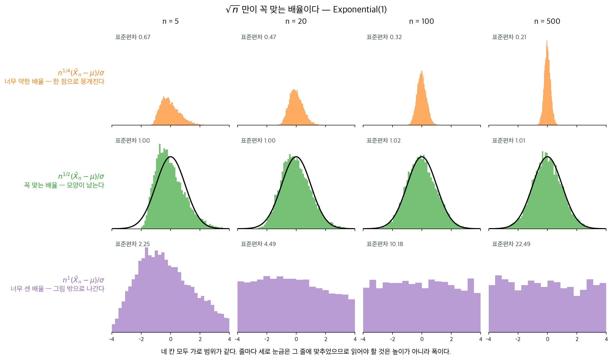
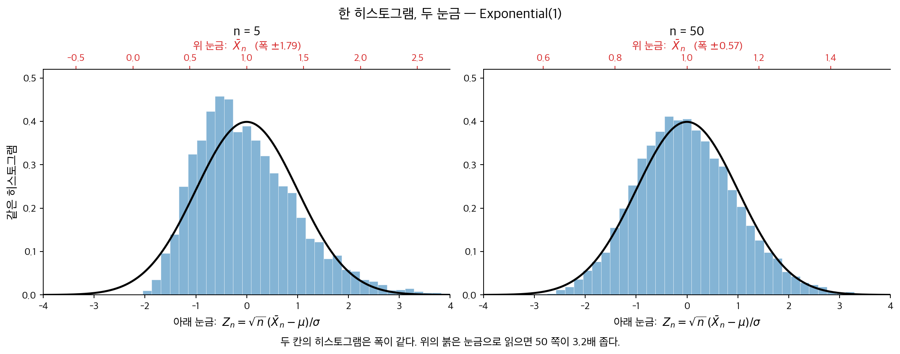
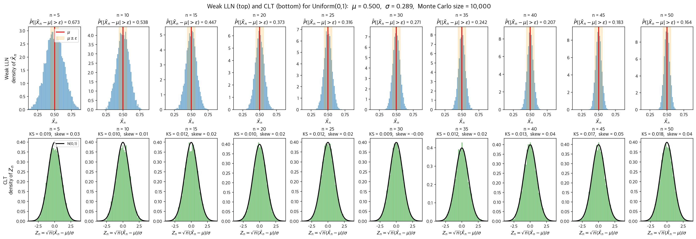
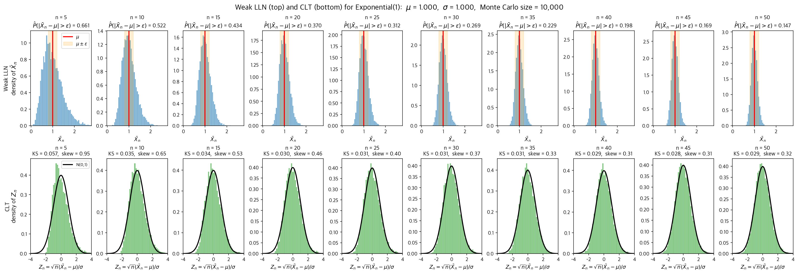
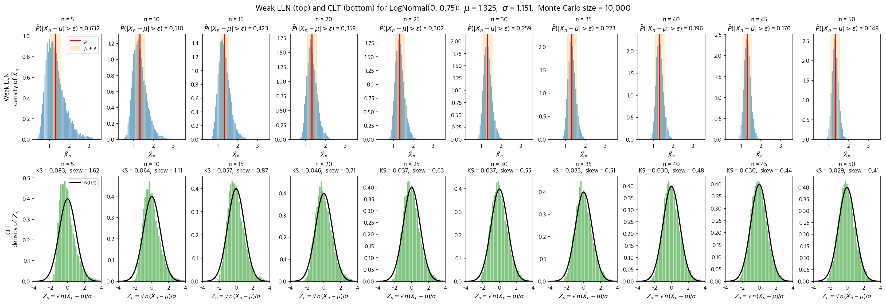
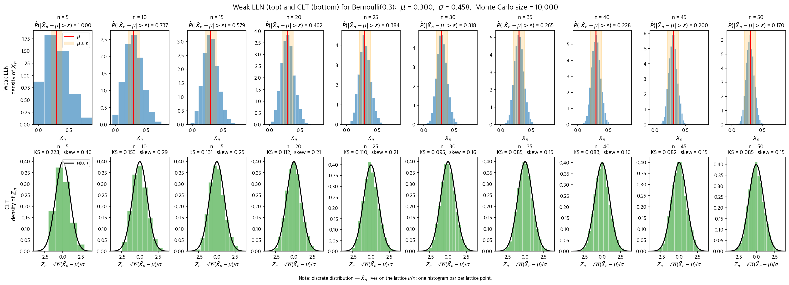
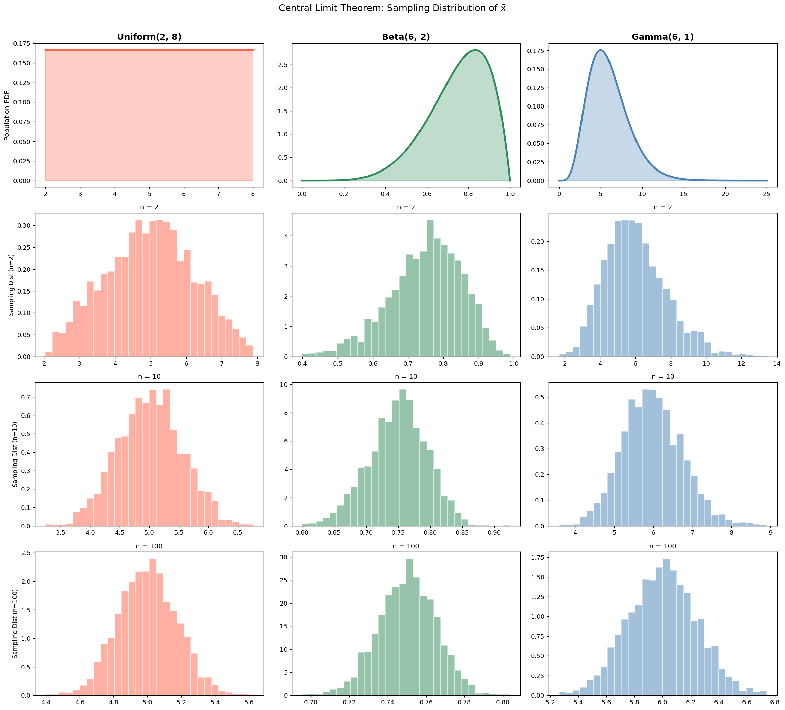
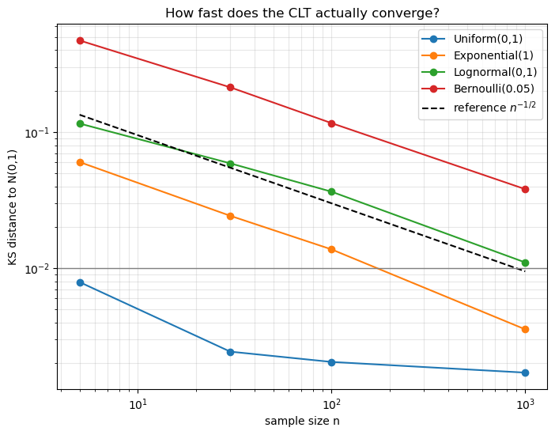
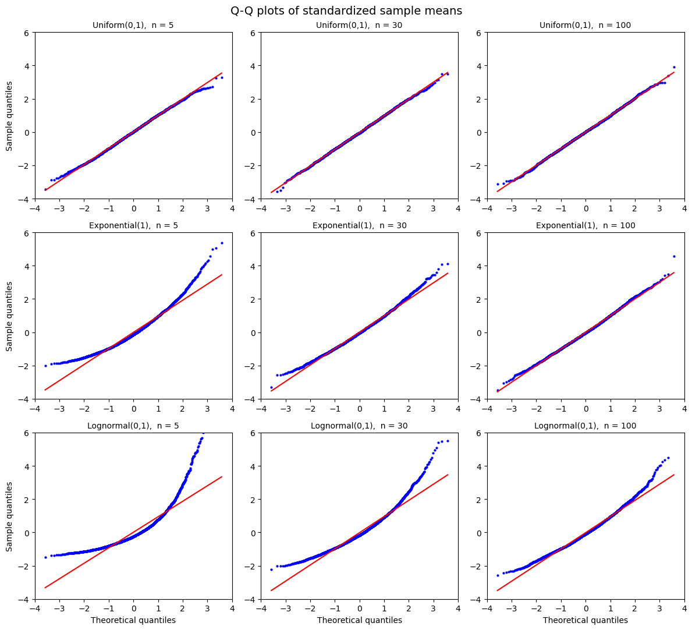

# 중심극한정리

큰수의 법칙은 표본평균이 **어디로** 가는지 알려 주었다. 그러나 어떻게 가는지는 말해 주지 않았다. $n = 100$에서 표본평균이 $\mu$에서 얼마나 떨어져 있을 가능성이 큰가? 그 오차의 분포는 어떤 모양인가?

**중심극한정리**가 이 물음에 답한다. 그리고 그 답이 놀랍다. **모집단이 어떤 분포이든 상관없이** 오차의 모양이 정규분포로 간다. 주사위든 지수분포든 심하게 치우친 소득 분포든, 평균과 분산만 유한하면 결과가 같다.

이 보편성 덕분에 신뢰구간과 가설검정이 모집단 분포를 몰라도 작동한다. 5장 이후 이 책의 추론 전체가 이 정리 위에 서 있다.

이 절은 네 개의 정리로 이루어진다. 정리의 진술(정리 1), 큰수의 법칙과의 관계(정리 2), 모양의 수렴과 폭의 수축이라는 두 예측의 구분(정리 3), 그리고 실제로 언제 쓸 수 있는가(정리 4)이다.

## 1. 오차의 모양은 언제나 정규분포다

정리의 형태는 단순하다. 표본평균에서 중심을 빼고 표준오차로 나누면, 남는 것이 표준정규분포다.

<div class="thmbox" markdown>

### 정리 1. 중심극한정리 — 표준화된 표본평균은 표준정규분포로 간다 { .thm }

$X_1, X_2, \ldots$가 평균 $\mu$, 분산 $\sigma^2 < \infty$인 i.i.d. 확률변수이면

$$
\frac{\bar X - \mu}{\sigma/\sqrt n} \xrightarrow{\;d\;} N(0, 1) \qquad (n \to \infty)
$$

이다. 동등하게 $n$이 크면

$$
\bar X \;\approx\; N\!\left(\mu, \frac{\sigma^2}{n}\right),
\qquad
S_n = \sum_{i=1}^n X_i \;\approx\; N(n\mu,\; n\sigma^2)
$$

이다.

</div>

**가정이 놀랍도록 적다.** 독립 동일분포일 것, 그리고 평균과 분산이 유한할 것. 모집단의 모양에 대한 조건은 **아무것도 없다.**

증명의 뼈대는 이미 3.4절에서 보았다. 적률생성함수가 합을 곱으로 바꾸고, 테일러 전개가 앞의 두 적률만 남기고, 유일성이 극한을 분포로 되돌린다. 남는 극한 $e^{t^2/2}$이 표준정규분포의 적률생성함수다.

**왜 하필 정규분포인가.** 전개에서 살아남는 것이 평균과 분산뿐이기 때문이다. 3차 이상의 적률은 $n$으로 나뉘며 사라진다. 원래 분포가 아무리 치우쳐 있어도 그 치우침은 $1/\sqrt n$의 속도로 씻겨 나가고, 평균과 분산만으로 결정되는 분포 — 즉 정규분포 — 가 남는다.

## 2. 두 극한정리는 같은 것의 다른 배율이다

큰수의 법칙과 중심극한정리는 별개의 결과처럼 보이지만 실은 같은 현상을 다른 배율로 본 것이다.

<div class="thmbox" markdown>

### 정리 2. 두 법칙의 관계 — n으로 나누면 소멸, √n을 곱하면 정규 { .thm }

편차 $\bar X - \mu$를 어떤 속도로 확대해 보느냐에 따라 보이는 것이 달라진다.

$$
\underbrace{\bar X - \mu \;\longrightarrow\; 0}_{\text{큰수의 법칙}}
\qquad
\underbrace{\sqrt n\,(\bar X - \mu) \;\xrightarrow{d}\; N(0, \sigma^2)}_{\text{중심극한정리}}
$$

왼쪽은 편차가 0으로 간다고 말하고, 오른쪽은 $\sqrt n$을 곱하면 **더 이상 0으로 가지 않는다**고 말한다.

</div>

큰수의 법칙은 편차가 0으로 간다는 것만 말한다. **얼마나 빨리** 가는지는 말하지 않는다. 그 속도를 말해 주는 것이 중심극한정리다.

속도를 재는 방법은 이렇다. 편차에 점점 큰 배율을 곱해 확대해 본다. 배율이 사라지는 속도에 못 미치면 확대해도 여전히 0으로 뭉개지고, 배율이 지나치면 확대가 과해 퍼져 나간다. **0으로도 가지 않고 퍼지지도 않는 배율이 있다면 그 배율이 곧 사라지는 속도의 역수다.** $\sqrt n\,(\bar X - \mu)$가 0으로 가지 않는다는 정리 2의 말은, 편차가 정확히 $1/\sqrt n$의 속도로 사라진다는 뜻이다.

배율이 왜 하필 $\sqrt n$인지는 3.4절에서 이미 나왔다. $\text{Var}(\bar X) = \sigma^2/n$이므로 표준편차가 $\sigma/\sqrt n$이고, 그 크기로 나누어야, 곧 $\sqrt n$을 곱해야 배율이 맞는다.



세 줄 모두 같은 지수분포 표본에서 나온 같은 편차 $\bar X_n - \mu$이고, 곱한 배율만 다르다. 일반적으로 $n^a(\bar X_n - \mu)/\sigma$의 표준편차는 $n^{a - 1/2}$이므로, 지수 $a$를 $1/2$과 견주면 결과가 갈린다.

- **$a = 1/4$ — 배율이 모자란다.** 표준편차가 $n^{-1/4}$로 여전히 0으로 간다. 0.67에서 0.21로 줄어 한 점으로 뭉개진다. 확대는 했지만 큰수의 법칙을 못 이겼다.
- **$a = 1/2$ — 꼭 맞는다.** 표준편차가 $n^0 = 1$로 $n$과 무관하다. 실제로 1.00, 1.00, 1.02, 1.01이다. 모양이 사라지지 않고, 게다가 그 모양이 정규곡선이다.
- **$a = 1$ — 배율이 지나치다.** 표준편차가 $\sqrt n$으로 커져 2.25에서 22.49가 된다. 분포가 그림 밖으로 밀려 나가 화면 가운데에는 납작한 바닥만 남는다.

가운데 줄만 살아남는다는 것, 이것이 중심극한정리가 더 주는 정보다. 큰수의 법칙은 "0으로 간다"는 사실만 주므로 윗줄과 가운데 줄을 구별하지 못한다. 중심극한정리는 그 속도를 $1/\sqrt n$으로 못 박고, 덤으로 남는 모양이 정규분포라는 것까지 알려 준다.

**두 정리가 서로 다른 두 사실이 아니라는 점을 분명히 해 두자.** 둘은 같은 $\bar X_n$을 놓고 **어느 자로 재느냐**만 다르다.



두 칸은 각각 $n = 5$와 $n = 50$에서 지수분포의 표본평균을 1만 번 모아 그린 것이다. **두 히스토그램은 같은 폭이다.** 아래쪽 검은 눈금, 곧 $Z_n$의 눈금으로 읽었기 때문이다. 그런데 같은 그림 위에 걸린 위쪽 붉은 눈금으로 읽으면 이야기가 달라진다. $n = 5$에서 $\bar X_n$은 $\mu$ 둘레로 $\pm 1.79$에 퍼져 있고 $n = 50$에서는 $\pm 0.57$에 그친다. **3.2배 좁아졌다.**

$$
\frac{1.79}{0.57} = 3.16 = \sqrt{\frac{50}{5}} = \sqrt{10}
$$

여기에 두 정리가 모두 들어 있다.

- **붉은 눈금을 고정해 놓고 보면** 막대들이 $\mu$ 한 점으로 빨려 들어간다. 이것이 큰수의 법칙이다.
- **막대가 늘 같은 폭을 차지하도록 눈금을 $\sqrt n$배씩 당겨 가며 보면** 모양이 사라지지 않고 정규곡선이 남는다. 이것이 중심극한정리다.

**히스토그램은 하나뿐이고 자가 둘이다.** 큰수의 법칙이 "아무것도 남지 않는다"고 말하는 바로 그 자리에서, 중심극한정리는 "얼마나 빨리 사라지는지를 보정해 주면 정확히 이 모양이 남는다"고 말한다. 앞의 정리가 극한을 주고 뒤의 정리가 그 극한에 이르는 **속도와 모양**을 준다.

**실무적 함의:** 정밀도는 $1/\sqrt n$로 좋아진다. 오차를 절반으로 줄이려면 자료를 **네 배** 모아야 한다. 8장의 표본크기 계산이 전부 이 관계에서 나온다.

<div class="codebox" markdown>

### 예제 1. 같은 모의실험을 두 배율로 보기 { .eg }

정리 2를 코드로 확인하는 가장 곧은 길은 **같은 $\bar X_n$을 두 번 그리는 것**이다. 한 번은 그대로, 한 번은 $\sqrt n / \sigma$를 곱해서. 앞 절 큰수의 법칙에서 쓴 코드에 둘째 줄을 덧붙이면 된다.

```python
import numpy as np
import matplotlib.pyplot as plt
from scipy import stats

N_LIST = [5, 10, 15, 20, 25, 30, 35, 40, 45, 50]
M = 10_000                    # 되풀이 횟수
EPS = 0.2                     # ε (σ 단위)

# 이름 -> (표본추출기, 평균 μ, 표준편차 σ, 라벨, 이산인가)
DISTRIBUTIONS = {
    "uniform": (lambda rng, s: rng.uniform(0, 1, s),
                0.5, np.sqrt(1 / 12), "Uniform(0,1)", False),
    "exponential": (lambda rng, s: rng.exponential(1.0, s),
                    1.0, 1.0, "Exponential(1)", False),
    "lognormal": (lambda rng, s: rng.lognormal(0, 0.75, s),
                  np.exp(0.75**2 / 2),
                  np.sqrt((np.exp(0.75**2) - 1) * np.exp(0.75**2)),
                  "LogNormal(0, 0.75)", False),
    "bernoulli": (lambda rng, s: rng.binomial(1, 0.3, s).astype(float),
                  0.3, np.sqrt(0.3 * 0.7), "Bernoulli(0.3)", True),
}


def lln_and_clt(dist):
    sampler, mu, sigma, label, discrete = DISTRIBUTIONS[dist]
    rng = np.random.default_rng(2026)
    eps = EPS * sigma
    X = sampler(rng, (M, max(N_LIST)))    # 가장 큰 n 으로 한 번만 뽑는다

    fig, axes = plt.subplots(2, 10, figsize=(22, 7.5), constrained_layout=True)
    lo, hi = np.percentile(X[:, :min(N_LIST)].mean(axis=1), [0.5, 99.5])
    pad = 0.1 * (hi - lo)
    lln_bins = np.linspace(lo - pad, hi + pad, 60)
    z_grid, z_bins = np.linspace(-4, 4, 400), np.linspace(-4, 4, 50)

    for j, n in enumerate(N_LIST):
        xbar = X[:, :n].mean(axis=1)

        # 정수값 분포에서는 X̄_n 이 격자 k/n 위에만 있다.
        # 격자점마다 막대 하나를 두어야 밀도로 읽을 수 있다.
        if discrete:
            s = np.rint(X[:, :n].sum(axis=1))
            lln_bins = (np.arange(s.min(), s.max() + 2) - 0.5) / n
            z_bins = np.sqrt(n) * (lln_bins - mu) / sigma

        # 윗줄 — 배율을 주지 않으면 μ 로 오그라든다 (큰수의 법칙)
        ax = axes[0, j]
        ax.hist(xbar, bins=lln_bins, density=True, color="tab:blue",
                alpha=0.6, edgecolor="white", linewidth=0.3)
        ax.axvline(mu, color="red", lw=2)
        ax.axvspan(mu - eps, mu + eps, color="orange", alpha=0.18)
        p_out = np.mean(np.abs(xbar - mu) > eps)
        ax.set_title(f"n = {n}\n"
                     rf"$\hat P(|\bar X_n-\mu|>\varepsilon)$ = {p_out:.3f}")
        ax.set_xlim(lo - pad, hi + pad)

        # 아랫줄 — √n/σ 를 곱해 확대하면 모양이 남는다 (중심극한정리)
        ax = axes[1, j]
        z = np.sqrt(n) * (xbar - mu) / sigma
        ax.hist(z, bins=z_bins, density=True, color="tab:green",
                alpha=0.6, edgecolor="white", linewidth=0.3)
        ax.plot(z_grid, stats.norm.pdf(z_grid), "k-", lw=2)
        ax.set_title(f"n = {n}\nKS = {stats.kstest(z, 'norm').statistic:.3f},"
                     f"  skew = {stats.skew(z):.2f}")
        ax.set_xlim(-4, 4)

    fig.suptitle(f"Weak LLN (top) and CLT (bottom) for {label}")
    plt.show()


for name in DISTRIBUTIONS:
    lln_and_clt(name)
```

**균등분포 — 이미 거의 정규다.**



**지수분포 — 치우침이 남아 있다가 천천히 펴진다.**



**로그정규분포 — 같은 $n$에서 가장 느리다.**



**베르누이분포 — 값이 격자 위에만 있다.**



**네 그림 모두 윗줄과 아랫줄이 같은 $\bar X_n$을 담고 있다.** 새로 뽑은 표본도, 새로 한 계산도 없다. 위의 두 눈금 그림을 네 분포에 대해 열 개의 $n$으로 펼쳐 놓은 것일 뿐이다.

**윗줄은 눈금을 고정한 얼굴이다.** 분포가 무엇이든 파란 히스토그램이 $\mu$ 둘레로 오그라들고 $\hat P(|\bar X_n - \mu| > \varepsilon)$가 줄어든다. 큰수의 법칙이 말하는 것은 여기까지이고, 얻는 정보는 "편차가 0으로 간다"는 사실 하나다.

**아랫줄은 눈금을 $\sqrt n / \sigma$배로 당긴 얼굴이다.** 사라지던 편차를 꼭 그만큼 확대해서 보면 아무것도 남지 않거나 발산하지 않고 **네 경우 모두 같은 종 모양이 남는다.** 같은 동전의 다른 면이며, 뒤집어 놓고 보아야만 보이는 것이 정규분포다.

수렴 속도는 분포마다 다르다. $n = 5$에서 KS 거리가 균등 $0.019$, 지수 $0.057$, 로그정규 $0.083$이고, $n = 50$에서는 각각 $0.018$, $0.029$, $0.030$이다. **치우친 분포일수록 늦게 도착할 뿐 도착하지 않는 것은 아니다.** 치우침(skew)이 지수분포에서 $0.95 \to 0.32$로, 로그정규에서 $1.62 \to 0.41$로 줄어드는 것이 그 과정이다.

베르누이는 다른 이유로 뒤처진다. $\bar X_n$이 격자 $k/n$ 위에만 있으므로 히스토그램이 매끄러운 곡선이 될 수 없고, KS 거리가 $n = 35$ 이후 $0.08$ 근처에서 더 내려가지 않는다. **이것은 수렴이 멈춘 것이 아니라 이산성이 남긴 계단이며**, 이 절 뒤의 [베리–에센 정리](berry_esseen.md) 페이지가 그 계단의 크기를 정확히 재고 연속성 보정으로 어떻게 다루는지 다룬다. $n = 5$에서 윗줄의 확률이 정확히 $1.000$인 것도 같은 이산성 때문이다. 이때 $\bar X_5$가 가질 수 있는 값은 $0, 0.2, 0.4, \ldots$뿐이라 $\mu = 0.3$에서 최소 $0.1$은 떨어지는데, $\varepsilon = 0.2\sigma = 0.092$가 그보다 좁다.

</div>

## 3. 모양의 수렴과 폭의 수축은 별개의 예측이다

여기까지 본 것은 **배율**이었다. 이번에는 배율을 주지 않은 $\bar X_n$의 분포를 여러 모집단에서 나란히 놓고 본다. 그러면 중심극한정리가 실은 **두 가지**를 동시에 주장하고 있다는 것과, 그 둘의 성격이 전혀 다르다는 것이 함께 드러난다.

<div class="thmbox" markdown>

### 정리 3. 두 예측의 성격이 다르다 — 모양은 근사, 폭은 등식 { .thm }

**모양의 수렴.** $n$이 커질수록 $\bar X_n$의 표본분포는 모집단의 모양(평평함, 왼쪽 치우침, 오른쪽 치우침)을 잃고 대칭인 종 모양으로 간다. 이것은 **근사**이며 $n$이 커야 한다.

**폭의 수축.**

$$
\operatorname{std}(\bar X_n) = \frac{\sigma}{\sqrt n}
$$

이것은 근사가 아니라 **등식**이다. 중심극한정리가 아니라 3.4절의 분산 성질에서 곧바로 나오며, 정규성과 무관하게 $n$이 작아도 정확하다.

</div>

**두 주장을 섞지 않는 것이 중요하다.** $n = 2$에서도 표준편차는 $\sigma/\sqrt 2$로 정확히 맞지만 히스토그램은 아직 종 모양 근처에도 가지 않는다. 폭은 처음부터 맞고 모양만 뒤늦게 따라온다. 중심극한정리가 새로 말해 주는 것은 폭이 아니라 **모양** 쪽이다.

!!! note "표본분포를 어떻게 눈으로 보는가"
    표본분포는 "표본을 뽑을 때마다 달라지는 $\bar X$의 분포"다. 실제 조사에서는 표본을 한 번만 뽑으므로 이 분포를 직접 볼 수 없다. 모의실험에서는 볼 수 있다.

    크기 $n$인 표본을 독립적으로 $B$번 뽑아 각각의 평균 $\bar x^{(1)}, \ldots, \bar x^{(B)}$을 계산하면, 이 $B$개 값의 히스토그램은 $B \to \infty$일 때 $\bar X_n$의 참 표본분포로 수렴한다. 각 $\bar x^{(b)}$가 $\bar X_n$에서 뽑은 i.i.d. 관측이므로 이것 자체가 **큰수의 법칙의 한 적용**이다. 이 페이지의 모든 그림이 이 방법으로 그려졌다.

모양이 뚜렷하게 다른 비정규 모집단 셋을 고른다. 어느 것도 종 모양이 아니다.

| 분포 | 모양 | 평균 | 분산 |
|:---|:---|---:|---:|
| Uniform(2, 8) | 평평하고 대칭 | 5 | 3 |
| Beta(6, 2) | 왼쪽으로 치우침, $[0,1]$에서 유계 | 0.75 | 0.0208 |
| Gamma(6, 1) | 오른쪽으로 치우침, 유계 아님 | 6 | 6 |

<div class="codebox" markdown>

### 예제 2. 세 모집단에서 모집단의 흔적이 씻겨 나가는 과정 { .eg }

**먼저 폭부터 확인한다.** 정리 3의 등식 쪽은 $n$이 작아도 맞아야 한다.

```python
import numpy as np
import matplotlib.pyplot as plt
from scipy import stats

np.random.seed(42)
N_REPS = 2000

def sample_means(dist_rvs, sample_sizes, n_reps=N_REPS):
    """표본 크기마다 n_reps개의 표본을 뽑아 각 표본평균을 모아 돌려준다.

    dist_rvs 는 "크기 n을 받아 표본을 돌려주는 함수"다.
    이렇게 함수를 인자로 받아 두면 균등·베르누이·감마 등
    어떤 모집단에도 같은 코드를 쓸 수 있다.

    돌려주는 results[n] 이 X-bar_n 의 표본분포 근사(2000개)다.
    """
    results = {}
    for n in sample_sizes:
        means = np.array([dist_rvs(n).mean() for _ in range(n_reps)])
        results[n] = means
    return results


# 균등분포 U(0,1)로 시험해 본다. 모평균 0.5, 모분산 1/12.
# 중심극한정리는 X-bar_n 의 표준편차가 sigma/sqrt(n) 이라고 예측한다.
demo = sample_means(lambda n: np.random.uniform(0, 1, n), [2, 10, 100])
sigma = (1 / 12) ** 0.5
for n, means in demo.items():
    print(f"n = {n:>3}: 평균 {means.mean():.4f}  "
          f"표준편차 {means.std():.4f}  (이론 {sigma / n**0.5:.4f})")
```

출력:

```
n =   2: 평균 0.4975  표준편차 0.2050  (이론 0.2041)
n =  10: 평균 0.5022  표준편차 0.0911  (이론 0.0913)
n = 100: 평균 0.5002  표준편차 0.0288  (이론 0.0289)
```

`results[n]`의 각 항목이 $\bar X_n$의 한 실현값이다. 2000개를 그리면 표본분포의 근사가 된다.

**소수 셋째 자리까지 맞는다.** $n = 2$에서 $0.2050$ 대 이론값 $0.2041$이다. 모양이 아직 종이 아닌 $n = 2$에서도 폭은 이미 정확하다.

**이제 모양을 본다.** 같은 방식으로 세 모집단에 대해 $n$을 키워 가며 그린다.

```python
sample_sizes = [2, 10, 100]

# 모양이 서로 전혀 다른 모집단 셋을 준비한다.
# 각 항목은 표본을 뽑는 함수(rvs)와 모집단 밀도를 그릴 정보를 담는다.
#   Uniform: 평평하다        (봉우리가 없음)
#   Beta   : 왼쪽으로 치우침  (유계)
#   Gamma  : 오른쪽으로 치우침 (유계가 아님)
# 세 모집단이 이렇게 다른데도 표본평균은 모두 종 모양으로 간다는 것이 요점이다.
distributions = {
    "Uniform(2, 8)": {
        "rvs": lambda n: np.random.uniform(2, 8, n),
        "color": "tomato",
        "pop_x": np.linspace(2, 8, 200),
        "pop_pdf": lambda x: np.ones_like(x) / 6,
    },
    "Beta(6, 2)": {
        "rvs": lambda n: stats.beta.rvs(6, 2, size=n),
        "color": "seagreen",
        "pop_x": np.linspace(0, 1, 200),
        "pop_pdf": lambda x: stats.beta.pdf(x, 6, 2),
    },
    "Gamma(6, 1)": {
        "rvs": lambda n: stats.gamma.rvs(6, size=n),
        "color": "steelblue",
        "pop_x": np.linspace(0, 25, 200),
        "pop_pdf": lambda x: stats.gamma.pdf(x, 6),
    },
}

n_dists = len(distributions)
# 격자 구성: 열 = 모집단, 행 = (모집단 자체, n=2, n=10, n=100)
# 세로로 내려가며 읽으면 "n이 커질수록 어떻게 변하는가"가 보이고,
# 가로로 읽으면 "모집단이 달라도 결과가 같은가"가 보인다.
n_rows = 1 + len(sample_sizes)
fig, axes = plt.subplots(n_rows, n_dists, figsize=(6 * n_dists, 4 * n_rows))

for col, (name, d) in enumerate(distributions.items()):
    c = d["color"]

    # 0행: 모집단의 밀도함수. 셋이 얼마나 다른지 먼저 확인한다.
    ax = axes[0, col]
    ax.plot(d["pop_x"], d["pop_pdf"](d["pop_x"]), lw=3, color=c)
    ax.fill_between(d["pop_x"], d["pop_pdf"](d["pop_x"]), alpha=0.3, color=c)
    ax.set_title(name, fontsize=14, fontweight="bold")
    if col == 0:
        ax.set_ylabel("Population PDF", fontsize=11)

    # 1~3행: 표본평균의 표집분포.
    # 앞서 정의한 sample_means 로 각 n마다 2000개의 표본평균을 얻는다.
    means_dict = sample_means(d["rvs"], sample_sizes)
    for row, n in enumerate(sample_sizes, start=1):
        ax = axes[row, col]
        ax.hist(means_dict[n], bins=30, color=c, alpha=0.5,
                edgecolor="white", density=True)
        ax.set_title(f"n = {n}", fontsize=11)
        if col == 0:
            ax.set_ylabel(f"Sampling Dist (n={n})", fontsize=10)

plt.suptitle("Central Limit Theorem: Sampling Distribution of x̄",
             fontsize=15, y=1.01)
plt.tight_layout()
plt.show()
```



그림은 $4 \times 3$ 격자다. 맨 윗줄이 모집단, 나머지 세 줄이 $n = 2, 10, 100$의 표본분포다. 줄을 따라 내려가며 읽으면 수렴이 보인다.

- **맨 윗줄.** 세 모집단이 눈에 띄게 비정규다. 평평하고, 왼쪽으로 치우쳤고, 오른쪽으로 치우쳤다.
- **$n = 2$.** 표본분포가 여전히 모집단의 모양을 반영한다. 관측 두 개의 평균으로는 거의 매끄러워지지 않는다.
- **$n = 10$.** 종 모양에 눈에 띄게 가까워지지만, 감마분포 쪽에는 오른쪽 치우침이 남아 있다.
- **$n = 100$.** 세 열이 모두 근사적으로 정규다. 모집단이 무엇이었는지 알아볼 수 없다.

**감마분포 열이 가장 느리다.** 왜도가 클수록 수렴이 느리기 때문이며, 다음 절의 [베리–에센 정리](berry_esseen.md)가 그 지연의 크기를 $\rho/\sigma^3$으로 정확히 잰다.

</div>

## 4. 언제 써도 되는가

정리는 $n \to \infty$를 말하지만 실제 자료의 $n$은 유한하다. 얼마나 커야 "충분히 큰가"는 정리가 답해 주지 않으므로 실무 기준이 필요하다.

<div class="thmbox" markdown>

### 정리 4. 정규근사의 실무 조건 — 세 가지 확인 사항 { .thm }

| 상황 | 어림 기준 |
|:---|:---|
| 일반적인 표본평균 | $n \ge 30$ |
| 비율(이항 자료) | $np \ge 5$ 그리고 $n(1-p) \ge 5$ (느슨한 기준) |
| 유한모집단에서 비복원 표집 | $n/N \le 10\%$ |

</div>

이들은 **정리가 아니라 관례다.** 각각의 배경은 다음과 같다.

**$n \ge 30$.** 모집단이 대칭이면 $n \approx 15$–20으로도 충분하고, 심하게 치우쳤거나 꼬리가 두꺼우면 $n \ge 40$–50이 필요하다. 30이라는 수에 특별한 근거는 없다. 다음 절의 **베리–에센 정리**가 이 근사 오차에 실제 상한을 준다.

**비율의 조건.** $X \sim \text{Binomial}(n,p)$일 때 $X \approx N(np,\, np(1-p))$인데, $p$가 0이나 1에 가까우면 이산분포가 경계에 몰려 정규 모양이 나오지 않는다. 여기 적은 5는 **느슨한 기준**으로, 분포의 모양이 종에 가까워져 확률 하나를 어림해도 될 수준을 뜻한다. 신뢰구간의 포함률이나 검정의 오류율까지 명목값에 가깝기를 요구한다면 10을 쓰는 보수적 기준이 따로 있다. 두 기준을 가르는 근거는 [이항분포의 정규근사](../../ch04/discrete_distributions/binomial.md#언제-쓸-수-있는가-5와-10)에 정리해 두었다. 정수값을 연속으로 근사하므로 **연속성 수정**을 함께 쓴다.

$$
P(X \le k) \approx P\!\left(Z \le \frac{k + 0.5 - np}{\sqrt{np(1-p)}}\right)
$$

포아송분포도 $\lambda$가 크면 $X \approx N(\lambda, \lambda)$로 근사된다.

**10% 조건.** 크기 $N$인 유한모집단에서 비복원으로 뽑으면 관측이 독립이 아니다. 정확한 분산은 유한모집단 수정을 포함한다.

$$
\text{Var}(\bar X) = \frac{\sigma^2}{n}\cdot\frac{N-n}{N-1}
$$

$n/N$이 작으면 수정계수가 1에 가까워 무시할 수 있다.

**독립이 깨지는 더 흔한 경우는 시계열이다.** 자기상관이 강한 자료에서는 관측 $n$개가 독립인 $n$개만큼의 정보를 주지 못한다. **유효 표본크기**가 $n$보다 작아지므로 표준오차가 $\sigma/\sqrt n$보다 크고, 정규근사도 그만큼 늦게 도착한다. 이 보정은 19장에서 다룬다.

!!! warning "$n \ge 30$을 규칙으로 믿지 말 것"
    치우침이 심하면 $n = 30$은 턱없이 부족하다. 5장에서 왜도가 2인 지수분포로 확인해 보면 $n = 100$에서도 95% 신뢰구간의 실제 포함확률이 $0.934$에 그친다.

    반대로 모집단이 이미 정규분포라면 $n = 1$에서도 표본평균이 **정확히** 정규분포다. 근사가 아니라 등식이다.

    실무에서는 자료를 그려 보는 것이 규칙을 외우는 것보다 낫다. 14장의 정규성 검정과 Q-Q 그림, 17장의 붓스트랩이 $n \ge 30$을 대신할 도구다.

## 연습문제

<div class="drillbox" markdown>

**연습문제 1.** <span class="diff easy" title="쉬움"></span>
$X_1, \ldots, X_n$이 i.i.d. Uniform(0, 1)이면 $\bar{X}$의 정확한 평균과 분산을 쓰라. $n = 12$일 때 $\bar{X}$의 표준편차는 얼마인가?

</div>

??? success "풀이"
    Uniform(0, 1)에서 $\mu = 1/2$, $\sigma^2 = 1/12$이다.

    $$
    E[\bar{X}] = \mu = \frac{1}{2}, \qquad \text{Var}(\bar{X}) = \frac{\sigma^2}{n} = \frac{1}{12n}
    $$

    $n = 12$이면

    $$
    \text{Var}(\bar{X}) = \frac{1}{144}, \qquad \text{std}(\bar{X}) = \frac{1}{12} \approx 0.0833
    $$

    이다.

<div class="drillbox" markdown>

**연습문제 2.** <span class="diff easy" title="쉬움"></span>
Gamma(2, 3) 분포($\mu = 6$, $\sigma^2 = 18$)에서 크기 $n$의 표본을 뽑는다고 하자. 중심극한정리 근사를 써서 $P(|\bar{X} - 6| < 0.5) \ge 0.95$가 되려면 $n$이 얼마나 커야 하는가?

</div>

??? success "풀이"
    중심극한정리에 의해 $\bar{X} \approx N(\mu, \sigma^2/n)$이다. 다음이 필요하다.

    $$
    P\left(\left|\frac{\bar{X} - 6}{\sqrt{18/n}}\right| < \frac{0.5}{\sqrt{18/n}}\right) \ge 0.95
    $$

    이를 위해서는 $\frac{0.5}{\sqrt{18/n}} \ge 1.96$이어야 하므로

    $$
    \sqrt{18/n} \le \frac{0.5}{1.96} \approx 0.2551
    $$

    $$
    \frac{18}{n} \le 0.06506 \implies n \ge \frac{18}{0.06506} \approx 276.7
    $$

    이다. 따라서 $n \ge 277$이다.

<div class="drillbox" markdown>

**연습문제 3.** <span class="diff med" title="중간"></span>
어떤 기계가 $\mu = 500$ ml, $\sigma = 10$ ml로 병을 채운다(정규분포가 아니다). (a) 중심극한정리에 따른 $\bar X_{36}$의 분포는? (b) $P(\bar X_{36} > 503)$은? (c) $P(|\bar X_n - 500| < 2) \ge 0.95$가 되려면 $n$은?

</div>

??? success "풀이"
    (a) $\bar X_{36} \approx N(500, 100/36) = N(500, 2.778)$. 표준오차 $= 10/6 \approx 1.67$.

    (b) $Z = (503 - 500)/(10/6) = 1.8$이므로 $P(Z > 1.8) \approx 1 - 0.9641 = 0.0359$. 약 3.6%다.

    (c) $2/(\sigma/\sqrt n) \ge z_{0.025} = 1.96 \Rightarrow 2\sqrt n / 10 \ge 1.96 \Rightarrow n \ge 96.04$이어야 하므로 $n \ge 97$이다.

<div class="drillbox" markdown>

**연습문제 4.** <span class="diff med" title="중간"></span>
$X_i$가 분산 $\sigma^2$인 i.i.d.일 때 $\bar{X}_n = \frac{1}{n}\sum_{i=1}^n X_i$의 분산이 $\sigma^2 / n$임을 증명하라.

</div>

??? success "풀이"
    독립인 확률변수에 대한 분산의 성질에 의해

    $$
    \text{Var}(\bar{X}_n) = \text{Var}\left(\frac{1}{n}\sum_{i=1}^n X_i\right) = \frac{1}{n^2} \sum_{i=1}^n \text{Var}(X_i) = \frac{1}{n^2} \cdot n\sigma^2 = \frac{\sigma^2}{n}
    $$

    이다. 두 번째 등호는 독립성(합의 분산이 분산의 합)과 각 $X_i$의 분산이 모두 $\sigma^2$이라는 사실을 쓴다. $\square$

<div class="drillbox" markdown>

**연습문제 5.** <span class="diff med" title="중간"></span>
중심극한정리를 이용해 $\bar{X}$와 $s$(표본표준편차)에 근거한 모평균 $\mu$의 근사적 95% 신뢰구간을 유도하라.

</div>

??? success "풀이"
    중심극한정리에 의해 $n$이 크면

    $$
    \frac{\bar{X} - \mu}{s / \sqrt{n}} \approx N(0, 1)
    $$

    이다. 95% 구간은 $|Z| \le 1.96$을 요구하므로

    $$
    P\left(-1.96 \le \frac{\bar{X} - \mu}{s/\sqrt{n}} \le 1.96\right) \approx 0.95
    $$

    이고, 정리하면

    $$
    \bar{X} - 1.96 \frac{s}{\sqrt{n}} \le \mu \le \bar{X} + 1.96 \frac{s}{\sqrt{n}}
    $$

    이다. 근사적 95% 신뢰구간은 $\bar{X} \pm 1.96 \, s / \sqrt{n}$이다.

<div class="drillbox" markdown>

**연습문제 6.** <span class="diff med" title="중간"></span>
이산분포에 대한 정규근사의 **연속성 수정**: 정숫값 $X$에 대해 $P(X \le k)$를 정규분포로 근사할 때 $\Phi((k + 0.5 - \mu)/\sigma)$를 쓴다. 왜 그런가?

</div>

??? success "풀이"
    이산확률변수는 정수에 질량을 놓지만 연속 근사는 질량을 매끄럽게 퍼뜨린다. 수정하지 않으면 $P(X \le k) \approx \Phi((k - \mu)/\sigma)$가 사실상 $X = k$의 질량을 제외해 버린다.

    연속성 수정은 각 정수를 그 정수를 중심으로 하는 너비 1인 구간으로 취급한다. $P(X \le k)$에는 위쪽 끝점 $k + 0.5$를 쓴다.

    $$
    P(X \le k) \approx \Phi\!\left(\frac{k + 0.5 - \mu}{\sigma}\right)
    $$

    **개선:** 오차율이 $O(1/\sqrt n)$에서 $O(1/n)$으로 좋아진다.

    **예:** Binomial(20, 0.5)에서 $\mu = 10$, $\sigma \approx 2.236$이다. 정확한 값은 $P(X \le 12) = 0.8684$이다. 수정하지 않으면 $\Phi(0.894) = 0.814$(오차 0.054)이고, 수정하면 $\Phi(1.118) = 0.868$(오차 0.000)이다.

    특히 $n$이 크지 않을 때 이산에서 연속으로의 근사에는 언제나 연속성 수정을 적용하라.

<div class="drillbox" markdown>

**연습문제 7.** <span class="diff med" title="중간"></span>
심하게 치우친 분포에서 **중심극한정리의 느린 수렴을 보여라.** $X_i$가 평균 1인 지수분포를 따른다고 하자. $n = 30$일 때 $\bar X_n$의 왜도는 얼마인가? 정규 극한의 대칭성과 비교하라.

</div>

??? success "풀이"
    Exponential(1)의 왜도는 2다(오른쪽으로 치우침). i.i.d. 합에서 *표준화된 합*의 왜도는 $\gamma_n = \gamma_1 / \sqrt n$으로 줄어든다.

    $$
    \mathrm{Skew}(\bar X_n) = \frac{\mathrm{Skew}(X)}{\sqrt n}
    $$

    $n = 30$이면 $\mathrm{Skew}(\bar X_{30}) = 2/\sqrt{30} \approx 0.365$이다.

    이는 여전히 0에서 상당히 떨어진 값이다. 정규 극한의 왜도는 0이다. $n = 30$에서 지수분포의 표본평균은 눈에 띄게 오른쪽으로 치우쳐 있다. 실무적 함의: 관례적인 $n \ge 30$ 어림법칙은 심하게 치우친 분포에는 *충분하지 않다*. 실제로는 $n \ge 100$ 이상이거나 대안 기법(부트스트랩, 정확법)이 필요하다.

    수렴 속도는 **베리–에센 정리**가 지배한다: $\sup_x |F_{\bar X_n}(x) - \Phi(x)| \le C \cdot \mathbb{E}|X|^3 / (\sigma^3 \sqrt n)$. 분자의 3차 적률이 왜도/비대칭성을 포착한다. 심하게 치우친 분포는 3차 절대적률이 커서 중심극한정리의 수렴이 느리다.

<div class="drillbox" markdown>

**연습문제 8.** <span class="diff med" title="중간"></span>
**"$n\ge30$이면 충분하다"는 규칙을 두 방향에서 검증하라.** (a) 분포마다 실제로 얼마나 큰 $n$이 필요한지 **측정**하라. (b) 같은 $n$에서 근사가 중심부와 꼬리 중 **어디에서 먼저** 무너지는가?

</div>

??? success "풀이"
    **(a) 분포마다 얼마나 큰 $n$이 필요한가**

    ```python
    import numpy as np
    import matplotlib.pyplot as plt
    from scipy import stats

    rng = np.random.default_rng(0)
    dists = [("Uniform(0,1)", stats.uniform), ("Exponential(1)", stats.expon),
             ("Lognormal(0,1)", stats.lognorm(1.0)),
             ("Bernoulli(0.05)", stats.bernoulli(0.05))]
    ns = (5, 30, 100, 1000)

    print("표준화 표본평균과 N(0,1) 사이의 콜모고로프-스미르노프 거리")
    print(f"{'분포':>18}{'왜도':>8}" + "".join(f"{'n=' + str(n):>11}" for n in ns))
    ks = {}
    for name, d in dists:
        mu, sd = d.mean(), d.std()
        ks[name] = [stats.kstest(
            np.sqrt(n) * (d.rvs(size=(100_000, n), random_state=rng).mean(1) - mu) / sd,
            "norm").statistic for n in ns]
        print(f"{name:>18}{float(d.stats(moments='s')):>8.2f}"
              + "".join(f"{v:>11.4f}" for v in ks[name]))

    print(f"\n참고: 100000회 모의에서 KS 통계량 자체의 크기 ~ 0.83/sqrt(B) = "
          f"{0.83 / np.sqrt(100_000):.4f}")
    print("\nKS ~ c/sqrt(n) 으로 보고 (n=100 기준) KS < 0.01 에 필요한 n")
    print(f"{'분포':>18}{'c':>10}{'필요한 n':>12}")
    for name, row in ks.items():
        c = row[2] * 10
        print(f"{name:>18}{c:>10.3f}{(c / 0.01) ** 2:>12.0f}")

    plt.figure(figsize=(8, 6))
    for name, row in ks.items():
        plt.loglog(ns, row, "o-", label=name)
    plt.loglog(ns, [0.3 / np.sqrt(n) for n in ns], "k--", label="reference $n^{-1/2}$")
    plt.axhline(0.01, color="gray", lw=1)
    plt.xlabel("sample size n")
    plt.ylabel("KS distance to N(0,1)")
    plt.title("How fast does the CLT actually converge?")
    plt.legend()
    plt.grid(alpha=0.3, which="both")
    plt.show()
    ```

    출력:

    ```
    표준화 표본평균과 N(0,1) 사이의 콜모고로프-스미르노프 거리
                    분포      왜도        n=5       n=30      n=100     n=1000
          Uniform(0,1)    0.00     0.0079     0.0024     0.0020     0.0017
        Exponential(1)    2.00     0.0603     0.0243     0.0138     0.0036
        Lognormal(0,1)    6.18     0.1156     0.0590     0.0365     0.0110
       Bernoulli(0.05)    4.13     0.4716     0.2134     0.1165     0.0381

    참고: 100000회 모의에서 KS 통계량 자체의 크기 ~ 0.83/sqrt(B) = 0.0026

    KS ~ c/sqrt(n) 으로 보고 (n=100 기준) KS < 0.01 에 필요한 n
                    분포         c       필요한 n
          Uniform(0,1)     0.020           4
        Exponential(1)     0.138         189
        Lognormal(0,1)     0.365        1333
       Bernoulli(0.05)     1.165       13563
    ```

    

    **"$n\ge30$"이 맞는 경우는 하나뿐이다.**

    | 분포 | $\gamma_1$ | $n=30$의 KS | KS $<0.01$에 필요한 $n$ |
    |---|---|---|---|
    | 균등 | $0$ | $0.0024$ | $\approx 4$ |
    | 지수 | $2.00$ | $0.0243$ | $\approx 190$ |
    | 로그정규 | $6.18$ | $0.0590$ | $\approx 1\,300$ |
    | 베르누이$(0.05)$ | $4.13$ | $0.2134$ | $\approx 13\,600$ |

    **$3$천 배 넘게 차이 난다.** 균등분포는 $n=5$에서 이미 충분하고, 베르누이$(0.05)$는 $1$만 개가 넘어야 한다.

    **균등분포의 곡선은 바닥에 눕는다.** $0.002$ 부근에서 평평해지는데, 이는 수렴이 멈춘 것이 아니라 **모의실험 자체의 잡음 바닥**($\approx0.83/\sqrt{B}=0.0026$)에 닿았기 때문이다. 실제 KS 거리는 그보다 훨씬 작다.

    **나머지 세 곡선의 기울기는 $-1/2$이다.** 로그–로그 그림에서 지수·로그정규·베르누이 세 선이 참조선 $n^{-1/2}$와 나란히 내려간다. **속도는 모두 같고 상수만 다르다** — 정확히 베리–에센 정리가 말하는 바다.

    **상수를 결정하는 것.**

    | 요인 | 효과 |
    |---|---|
    | 왜도 $\gamma_1$ | 주된 요인 — 대략 비례 |
    | **이산성(격자)** | 왜도와 **무관하게** 별도로 더해짐 |
    | 첨도 | 이차적 요인($1/n$ 항) |

    **베르누이가 특히 나쁜 이유는 왜도만이 아니다.** 왜도 $4.13$은 로그정규($6.18$)보다 낮은데 필요한 $n$은 $10$배다. 베리–에센 문서 연습문제 $7$에서 본 **격자 오차**가 더해지기 때문이며, 이 성분은 왜도 보정으로도 사라지지 않는다.

    **실무 지침.**

    | 상황 | 권고 |
    |---|---|
    | 대칭·유계 자료 | $n\ge20$이면 충분 |
    | 중간 정도 치우침($\gamma_1\approx2$) | $n\ge200$ |
    | 심한 치우침(소득, 보험청구) | $n\ge1000$ 또는 부트스트랩 |
    | 희귀 이항($np<10$) | 정확 계산 또는 포아송 근사 |
    | 꼬리확률·작은 $p$값이 목표 | 어떤 $n$에서도 근사를 믿지 말 것 |

    !!! tip "먼저 왜도를 재라"
        자료에서 $\hat\gamma_1$을 계산하고 $|\hat\gamma_1|/\sqrt n$을 보라. 이 값이 $0.1$보다 크면 정규근사를 의심해야 한다. 위 표의 "필요한 $n$"이 대략 $(\gamma_1/0.06)^2$과 맞아떨어진다.

    **가장 안전한 답은 근사를 재는 것이다.** 자신의 자료에서 부트스트랩으로 표본평균의 분포를 만들어 정규분포와 비교하면, 남의 경험칙을 빌리지 않고 직접 확인할 수 있다.

    **(b) 중심부와 꼬리 중 어디가 먼저 무너지는가**

    ```python
    import numpy as np
    from scipy import stats

    rng = np.random.default_rng(0)
    n = 30
    Z = np.sqrt(n) * (rng.exponential(1.0, (4_000_000, n)).mean(1) - 1)

    print(f"Exp(1), n = {n}.  Z = sqrt(n)(Xbar - 1) 를 N(0,1) 로 근사")
    print(f"{'z':>4}{'참 P(Z>z)':>14}{'정규 근사':>14}{'절대오차':>12}{'상대오차':>11}")
    for z in (0, 1, 2, 3, 4):
        emp, nor = np.mean(Z > z), stats.norm.sf(z)
        print(f"{z:>4}{emp:>14.6f}{nor:>14.6f}{abs(emp - nor):>12.6f}"
              f"{abs(emp - nor) / nor:>10.1%}")

    print("\n왼쪽 꼬리")
    print(f"{'z':>4}{'참 P(Z<-z)':>14}{'정규 근사':>14}{'절대오차':>12}{'상대오차':>11}")
    for z in (1, 2, 3, 4):
        emp, nor = np.mean(Z < -z), stats.norm.sf(z)
        print(f"{z:>4}{emp:>14.6f}{nor:>14.6f}{abs(emp - nor):>12.6f}"
              f"{abs(emp - nor) / nor:>10.1%}")
    ```

    출력:

    ```
    Exp(1), n = 30.  Z = sqrt(n)(Xbar - 1) 를 N(0,1) 로 근사
       z      참 P(Z>z)         정규 근사        절대오차       상대오차
       0      0.475818      0.500000    0.024182      4.8%
       1      0.157599      0.158655    0.001056      0.7%
       2      0.031648      0.022750    0.008897     39.1%
       3      0.004181      0.001350    0.002831    209.7%
       4      0.000365      0.000032    0.000334   1053.3%

    왼쪽 꼬리
       z     참 P(Z<-z)         정규 근사        절대오차       상대오차
       1      0.156857      0.158655    0.001799      1.1%
       2      0.012149      0.022750    0.010601     46.6%
       3      0.000079      0.001350    0.001270     94.1%
       4      0.000000      0.000032    0.000032    100.0%
    ```

    **절대오차만 보면 근사가 훌륭하다.** 최대 오차가 $0.024$이고, 꼬리로 갈수록 절대오차는 **줄어든다**($z=4$에서 $0.0003$).

    **상대오차를 보면 정반대다.**

    | $z$ | 상대오차(오른쪽) | 상대오차(왼쪽) |
    |---|---|---|
    | $1$ | $0.7\%$ | $1.1\%$ |
    | $2$ | $39\%$ | $47\%$ |
    | $3$ | $210\%$ | $94\%$ |
    | $4$ | $1053\%$ | $100\%$ |

    **$z=4$에서 정규근사는 $3.2\times10^{-5}$를 주는데 참값은 $3.65\times10^{-4}$로 $11$배 크다.** 오른쪽 꼬리를 $11$분의 $1$로 과소평가한다.

    **왼쪽은 반대 방향으로 틀린다.** $\bar X_n\ge0$이므로 $Z\ge-\sqrt{30}=-5.48$이라는 **절대적 하한**이 있다. $z=-4$에서 참 확률이 사실상 $0$인데 정규근사는 $3.2\times10^{-5}$를 준다. **존재할 수 없는 값에 확률을 준다.**

    !!! danger "꼬리가 필요한 곳에서 정규근사가 가장 나쁘다"
        중심극한정리는 **분포수렴**을 말한다. 분포함수의 **절대적** 근접만 보장할 뿐, 꼬리확률의 **상대적** 정확도는 전혀 보장하지 않는다.

    **정확히 이 지점이 문제가 되는 응용들.**

    | 응용 | 필요한 것 |
    |---|---|
    | 다중검정 보정 | $p$값 $10^{-6}$의 정확도 |
    | 금융 위험(VaR, 꼬리손실) | $0.1\%$ 분위수 |
    | 품질관리 $6\sigma$ | $10^{-9}$ 수준 |
    | 희귀사건 모의 | 지수적으로 작은 확률 |

    **처방.**

    - **베리–에센 한계**(다음 문서)로 오차의 크기를 보증한다 — 다만 이것도 절대오차 한계다.
    - **에지워스 전개**로 왜도 보정을 한 항 더 넣는다.
    - **안장점 근사**나 **대편차 한계**(rv/mgf 문서 연습문제 $7$의 체르노프)를 쓴다. 이들은 상대오차를 통제한다.
    - **순열검정·부트스트랩**으로 근사 자체를 피한다.

    **"$n\ge30$"은 중심부에 대한 규칙이다.** 신뢰구간의 $95\%$ 수준을 맞추는 데는 대개 충분하지만, $99.9\%$ 수준이나 작은 $p$값에는 턱없이 부족하다. $\square$

<div class="drillbox" markdown>

**연습문제 9.** <span class="diff med" title="중간"></span>
본문의 히스토그램은 **가운데 모양**을 보여준다. 히스토그램이 숨기는 것을 드러내는 **Q-Q 플롯**으로 같은 수렴을 다시 그려라.

</div>

??? success "풀이"
    ```python
    import numpy as np
    import matplotlib.pyplot as plt
    from scipy import stats

    rng = np.random.default_rng(0)
    dists = [("Uniform(0,1)", stats.uniform), ("Exponential(1)", stats.expon),
             ("Lognormal(0,1)", stats.lognorm(1.0))]
    ns = [5, 30, 100]

    fig, axes = plt.subplots(len(dists), len(ns), figsize=(12, 11))
    for i, (name, d) in enumerate(dists):
        mu, sd = d.mean(), d.std()
        for j, n in enumerate(ns):
            Z = np.sqrt(n) * (d.rvs(size=(4000, n), random_state=rng).mean(1) - mu) / sd
            ax = axes[i, j]
            stats.probplot(Z, dist="norm", plot=ax)
            ax.get_lines()[0].set_markersize(2)
            ax.get_lines()[1].set_color("red")
            ax.set_title(f"{name},  n = {n}", fontsize=10)
            ax.set_xlabel("Theoretical quantiles" if i == len(dists) - 1 else "")
            ax.set_ylabel("Sample quantiles" if j == 0 else "")
            ax.set_xlim(-4, 4)
            ax.set_ylim(-4, 6)
    plt.suptitle("Q-Q plots of standardized sample means", fontsize=14)
    plt.tight_layout()
    plt.show()

    print(f"{'분포':>16}{'n':>6}{'표준화 평균의 왜도':>20}{'P(Z>3)':>11}"
          f"{'정규값':>10}")
    for name, d in dists:
        mu, sd = d.mean(), d.std()
        for n in ns:
            Z = np.sqrt(n) * (d.rvs(size=(200_000, n), random_state=rng).mean(1) - mu) / sd
            print(f"{name:>16}{n:>6}{stats.skew(Z):>20.3f}"
                  f"{np.mean(Z > 3):>11.5f}{0.00135:>10.5f}")
    ```

    출력:

    ```
    분포     n          표준화 평균의 왜도     P(Z>3)       정규값
        Uniform(0,1)     5               0.001    0.00047   0.00135
        Uniform(0,1)    30               0.010    0.00128   0.00135
        Uniform(0,1)   100              -0.008    0.00131   0.00135
      Exponential(1)     5               0.886    0.00935   0.00135
      Exponential(1)    30               0.359    0.00411   0.00135
      Exponential(1)   100               0.212    0.00288   0.00135
      Lognormal(0,1)     5               2.806    0.01650   0.00135
      Lognormal(0,1)    30               1.106    0.01041   0.00135
      Lognormal(0,1)   100               0.626    0.00684   0.00135
    ```

    

    **Q-Q 플롯은 꼬리를 확대한다.** 히스토그램에서는 $n=30$의 로그정규가 이미 "종 모양"으로 보이지만, Q-Q 플롯에서는 오른쪽 끝이 직선 위로 크게 휘어 있다.

    **수치가 그것을 확인해 준다.** 로그정규는 $n=100$에서도 $P(Z>3)=0.00684$로 정규값 $0.00135$의 **$5$배**다.

    **왜도가 정확히 $\gamma_1/\sqrt n$로 준다.**

    | 분포 | $\gamma_1$ | $n=5$ | $n=30$ | $n=100$ | $\gamma_1/\sqrt{100}$ |
    |---|---|---|---|---|---|
    | 균등 | $0$ | $0.001$ | $0.010$ | $-0.008$ | $0$ |
    | 지수 | $2.00$ | $0.886$ | $0.359$ | $0.212$ | $0.200$ |
    | 로그정규 | $6.18$ | $2.806$ | $1.106$ | $0.626$ | $0.618$ |

    측정값이 이론값과 거의 정확히 맞는다. **중심극한정리가 지우는 것이 바로 이 $\gamma_1/\sqrt n$이며**, 얼마나 남았는지가 곧 "얼마나 정규에 가까운가"다. [베리–에센 정리](berry_esseen.md) 페이지 연습문제 $5$의 에지워스 전개에서 첫 보정항이 바로 이것이다.

    **히스토그램 대신 Q-Q 플롯을 봐야 하는 이유.**

    | 진단 대상 | 히스토그램 | Q-Q 플롯 |
    |---|---|---|
    | 중심의 모양 | 잘 보임 | 잘 보임 |
    | 치우침 | 보임 | 잘 보임 |
    | **꼬리의 두께** | **거의 안 보임** | 명확히 보임 |
    | **극단 이상치** | **막대 하나에 묻힘** | 점 하나로 튐 |
    | 구간폭 선택 의존 | 있음 | 없음 |

    **히스토그램에서 꼬리는 높이 $0$에 가까운 막대다.** 확률 $0.001$과 $0.005$가 눈으로 구별되지 않는다. Q-Q 플롯은 분위수를 비교하므로 그 차이가 위치의 차이로 나타난다.

    **실무 규칙.** 정규성을 눈으로 판단할 때는 **언제나 Q-Q 플롯을 먼저 본다.** 히스토그램은 청중에게 설명할 때, Q-Q 플롯은 스스로 판단할 때 쓴다. $\square$

<div class="drillbox" markdown>

**연습문제 10.** <span class="diff med" title="중간"></span>
중심극한정리는 **표본분산**에도 적용된다. 그런데 표본평균보다 훨씬 느리게 수렴한다. **정규 모집단에서조차** 그렇다. 이유를 밝혀라.

</div>

??? success "풀이"
    ```python
    import numpy as np
    from scipy import stats

    rng = np.random.default_rng(0)
    print("모집단이 N(0,1) 일 때 정규분포까지의 KS 거리")
    print(f"{'n':>7}{'표본평균':>15}{'표본분산':>15}")
    for n in (5, 10, 30, 100, 1000):
        X = rng.normal(0, 1, (200_000, n))
        Zm = np.sqrt(n) * X.mean(1)
        Zv = np.sqrt(n) * (X.var(1, ddof=1) - 1) / np.sqrt(2)
        print(f"{n:>7}{stats.kstest(Zm, 'norm').statistic:>15.4f}"
              f"{stats.kstest(Zv, 'norm').statistic:>15.4f}")

    print("\n표본분산은 (X - mu)^2 들의 평균이다. 그 분포의 왜도를 보라.")
    print(f"  X ~ N(0,1) 의 왜도          {float(stats.norm.stats(moments='s')):>8.4f}")
    print(f"  (X-mu)^2 ~ chi^2_1 의 왜도  {float(stats.chi2.stats(1, moments='s')):>8.4f}"
          f"   (= sqrt(8))")
    print(f"  참고: Exp(1) 의 왜도        {float(stats.expon.stats(moments='s')):>8.4f}")
    ```

    출력:

    ```
    모집단이 N(0,1) 일 때 정규분포까지의 KS 거리
          n           표본평균           표본분산
          5         0.0021         0.1002
         10         0.0012         0.0675
         30         0.0017         0.0372
        100         0.0024         0.0183
       1000         0.0015         0.0052

    표본분산은 (X - mu)^2 들의 평균이다. 그 분포의 왜도를 보라.
      X ~ N(0,1) 의 왜도            0.0000
      (X-mu)^2 ~ chi^2_1 의 왜도    2.8284   (= sqrt(8))
      참고: Exp(1) 의 왜도          2.0000
    ```

    **표본평균은 $n=5$에서 이미 완벽하다**(KS $0.0021$은 모의오차 수준). 모집단이 정규면 $\bar X_n$이 **정확히** 정규이기 때문이다.

    **표본분산은 그렇지 않다.** $n=5$에서 $0.1002$, $n=100$에서도 $0.0183$이다. 표본평균보다 훨씬 나쁘다.

    **이유는 무엇의 평균인지에 있다.**

    $$
    s_n^2 \approx \frac1n\sum_i (X_i-\mu)^2
    $$

    **$s^2$은 $X_i$의 평균이 아니라 $(X_i-\mu)^2$의 평균이다.** 그리고 $X\sim N(0,1)$이면

    $$
    (X-\mu)^2\sim\chi^2_1,\qquad \gamma_1(\chi^2_1)=\sqrt8=2.828
    $$

    **정규분포를 제곱하는 순간 왜도 $2.83$짜리 분포가 된다.** 이는 지수분포($\gamma_1=2$)보다 더 치우쳤다. 연습문제 $8$의 표에서 지수분포의 표본평균이 $n=100$에서 KS $0.0138$이었던 것과 견주면, $s^2$의 $0.0183$은 자연스럽다.

    **점근분포는 이렇다.** 4차적률 $\mu_4$가 유한하면

    $$
    \sqrt n\,(s_n^2-\sigma^2)\xrightarrow{d} N\!\left(0,\;\mu_4-\sigma^4\right)
    $$

    이고, 정규 모집단이면 $\mu_4=3\sigma^4$이라 분산이 $2\sigma^4$이다.

    !!! warning "4차적률이 필요하다"
        표본평균의 중심극한정리는 **2차적률**만 요구하지만, 표본분산은 **4차적률**을 요구한다. 꼬리가 두꺼운 자료에서는 $\mu_4=\infty$인 경우가 흔하고($t_4$ 분포, $\alpha<4$인 파레토), 그러면 $s^2$에 대한 정규근사가 **아예 성립하지 않는다.**

    **실무적 함의.**

    | 대상 | 필요한 적률 | 실무적 신뢰도 |
    |---|---|---|
    | 평균의 신뢰구간 | 2차 | 대체로 안전 |
    | 분산의 신뢰구간 | 4차 | 꼬리에 매우 민감 |
    | 상관계수 | 4차 | 마찬가지로 민감 |
    | 첨도 | 8차 | 사실상 신뢰 불가 |

    **적률의 차수가 올라갈수록 수렴이 느려지고 조건이 까다로워진다.** 분산이나 상관계수의 구간추정에는 정규근사 대신 **부트스트랩**(17장)을 쓰는 편이 안전한 이유다. $\square$

<div class="drillbox" markdown>

**연습문제 11.** <span class="diff hard" title="어려움"></span>
평균 0, 분산 1이고 0의 근방에서 적률생성함수 $M(t)$가 유한한 i.i.d. $X_i$에 대해 **적률생성함수 방법으로 중심극한정리를 증명하라**. $\sqrt n \bar X_n$의 적률생성함수가 $e^{t^2/2}$로 수렴함을 보여라.

</div>

??? success "풀이"
    표준화된 합: $Z_n = \sqrt n \bar X_n = (X_1 + \cdots + X_n)/\sqrt n$.

    그 적률생성함수: $M_{Z_n}(t) = \mathbb{E}[e^{t Z_n}] = \prod_i \mathbb{E}[e^{t X_i / \sqrt n}] = [M(t/\sqrt n)]^n$.

    $M(t/\sqrt n)$을 0 주위로 전개한다. $\mu = 0$, $\sigma^2 = 1$을 쓰면 $M(u) = 1 + \mu u + (\sigma^2 + \mu^2) u^2/2 + O(u^3) = 1 + u^2/2 + O(u^3)$이다.

    따라서 $M(t/\sqrt n) = 1 + t^2/(2n) + O(n^{-3/2})$이다.

    $n$제곱을 취하면 ($(1 + a/n + o(1/n))^n \to e^a$를 이용해) $n \to \infty$일 때 $M_{Z_n}(t) = (1 + t^2/(2n) + O(n^{-3/2}))^n \to e^{t^2/2}$이다.

    극한 적률생성함수 $e^{t^2/2}$이 $N(0, 1)$의 것이다. 적률생성함수 수렴 정리에 의해 $Z_n \xrightarrow{d} N(0, 1)$이다. $\square$

    참고: 이 증명은 근방에서 적률생성함수가 유한할 것을 요구하므로 꼬리가 두꺼운 일부 분포를 배제한다. ($\phi(t) = \mathbb{E}[e^{itX}]$를 쓰는) 특성함수 증명은 분산이 유한한 모든 분포로 일반화된다.

<div class="drillbox" markdown>

**연습문제 12.** <span class="diff med" title="중간"></span>
중심극한정리는 $\sigma$를 **안다**고 가정한다. 실제로는 표본표준편차 $s$로 바꿔 쓴다. 그 대체를 정당화하는 **슬러츠키 정리**를 진술하고, 소표본에서 무엇이 대가로 치러지는지 확인하라.

</div>

??? success "풀이"
    **슬러츠키 정리.** $Z_n\xrightarrow{d}Z$이고 $W_n\xrightarrow{p}c$($c$는 상수)이면

    $$
    Z_n + W_n \xrightarrow{d} Z+c,\qquad Z_nW_n\xrightarrow{d}cZ,\qquad
    \frac{Z_n}{W_n}\xrightarrow{d}\frac{Z}{c}\;(c\ne0)
    $$

    **적용.** $Z_n=\sqrt n(\bar X_n-\mu)/\sigma\xrightarrow{d}N(0,1)$이고, 큰수의 법칙으로 $s_n/\sigma\xrightarrow{p}1$이다. 따라서

    $$
    T_n=\frac{\sqrt n(\bar X_n-\mu)}{s_n}=Z_n\cdot\frac{\sigma}{s_n}\xrightarrow{d}N(0,1)
    $$

    **모르는 $\sigma$를 추정값으로 바꿔도 극한분포가 그대로다.** 이것이 없으면 실무에서 중심극한정리를 쓸 수 없다.

    ```python
    import numpy as np
    from scipy import stats

    rng = np.random.default_rng(0)
    print("자료 ~ Exp(1)  (mu = 1, sigma = 1)")
    print(f"{'n':>6}{'sigma 사용 sd':>16}{'s 사용 sd':>14}"
          f"{'|T|>1.96 비율':>16}{'|T|>t 분위수':>15}")
    for n in (5, 10, 30, 100, 1000):
        X = rng.exponential(1.0, (200_000, n))
        m, s = X.mean(1), X.std(1, ddof=1)
        Z = np.sqrt(n) * (m - 1) / 1.0
        T = np.sqrt(n) * (m - 1) / s
        tq = stats.t.ppf(0.975, n - 1)
        print(f"{n:>6}{Z.std():>16.4f}{T.std():>14.4f}"
              f"{np.mean(np.abs(T) > 1.96):>16.4f}{np.mean(np.abs(T) > tq):>15.4f}")
    print("  (마지막 두 열의 목표는 0.05)")
    ```

    출력:

    ```
    자료 ~ Exp(1)  (mu = 1, sigma = 1)
         n     sigma 사용 sd       s 사용 sd     |T|>1.96 비율      |T|>t 분위수
         5          0.9989        2.3325          0.1882         0.1170
        10          0.9974        1.4935          0.1305         0.0990
        30          1.0015        1.1474          0.0824         0.0729
       100          1.0021        1.0459          0.0608         0.0582
      1000          1.0005        1.0046          0.0512         0.0510
      (마지막 두 열의 목표는 0.05)
    ```

    **극한에서는 정확히 성립한다.** $n=1000$에서 $s$를 쓴 표준편차가 $1.0046$, 기각률이 $0.0512$로 목표에 닿는다.

    **그러나 소표본의 대가가 크다.**

    | $n$ | $s$ 사용 시 sd | 실제 제1종 오류 |
    |---|---|---|
    | $5$ | $2.33$ | $0.188$ |
    | $10$ | $1.49$ | $0.131$ |
    | $30$ | $1.15$ | $0.082$ |
    | $100$ | $1.05$ | $0.061$ |

    $n=5$에서 $5\%$ 검정이 실제로는 $19\%$나 기각한다. **$\sigma$를 알 때는 $0.999$로 완벽했는데** $s$로 바꾸는 순간 무너진다.

    **왜 이렇게 나쁜가.** $s_n$이 $\sigma$로 수렴하긴 하지만 소표본에서 크게 흔들리고, **$\bar X_n$과 상관되어 있다**(지수분포에서는 우연히 큰 관측이 평균과 $s$를 함께 올린다). 슬러츠키는 극한만 보장할 뿐 유한표본을 말해 주지 않는다.

    **$t$ 분위수를 써도 절반만 낫는다.** $n=5$에서 $0.188\to0.117$로 개선되지만 여전히 $5\%$의 두 배가 넘는다. **$t$ 분포는 모집단이 정규일 때만 정확**하기 때문이다(5장). 여기서는 지수분포라 정당화되지 않는다.

    **교훈.** 슬러츠키 정리는 "$n$이 크면 $\sigma$ 대신 $s$를 써도 된다"를 보장하는 **점근** 결과다. "$n$이 얼마나 커야 하는가"는 답하지 않으며, 그 답은 모집단의 치우침에 달려 있다. $\square$

<div class="drillbox" markdown>

**연습문제 13.** <span class="diff med" title="중간"></span>
$\sqrt n(\bar X_n-\mu)\xrightarrow{d}N(0,\sigma^2)$이라고 해서 그 **분산이 $\sigma^2$로 수렴한다**고 말할 수 있는가? **분포수렴이 적률수렴을 함의하지 않음**을 보여라.

</div>

??? success "풀이"
    ```python
    import numpy as np

    rng = np.random.default_rng(0)
    print("반례:  P(X_n = 0) = 1 - 1/n,  P(X_n = n) = 1/n")
    print(f"{'n':>7}{'P(X_n=0)':>12}{'E[X_n]':>10}{'E[X_n^2]':>12}")
    for n in (10, 100, 1000, 10_000):
        print(f"{n:>7}{1 - 1 / n:>12.4f}{n * (1 / n):>10.2f}{n * n * (1 / n):>12.1f}")
    print("  X_n -> 0 (분포수렴)  그런데 E[X_n] = 1 이고 E[X_n^2] -> 무한\n")

    print("통계적 사례: Exp 비율의 최대가능도추정량 1/Xbar  (참값 1)")
    print(f"{'n':>6}{'점근 sd = 1/sqrt(n)':>22}{'실제 sd':>12}{'실제 평균':>12}")
    for n in (3, 5, 10, 30, 100):
        r = 1 / rng.exponential(1.0, (400_000, n)).mean(1)
        print(f"{n:>6}{1 / np.sqrt(n):>22.4f}{r.std():>12.4f}{r.mean():>12.4f}")
    ```

    출력:

    ```
    반례:  P(X_n = 0) = 1 - 1/n,  P(X_n = n) = 1/n
          n    P(X_n=0)    E[X_n]    E[X_n^2]
         10      0.9000      1.00        10.0
        100      0.9900      1.00       100.0
       1000      0.9990      1.00      1000.0
      10000      0.9999      1.00     10000.0
      X_n -> 0 (분포수렴)  그런데 E[X_n] = 1 이고 E[X_n^2] -> 무한

    통계적 사례: Exp 비율의 최대가능도추정량 1/Xbar  (참값 1)
         n     점근 sd = 1/sqrt(n)       실제 sd       실제 평균
         3                0.5774      1.4360      1.5000
         5                0.4472      0.7238      1.2505
        10                0.3162      0.3937      1.1114
        30                0.1826      0.1955      1.0346
       100                0.1000      0.1019      1.0100
    ```

    **첫 반례가 구조를 보여준다.** $X_n$은 확률 $1-1/n$로 $0$이므로 분포가 $0$에 집중되어 $X_n\xrightarrow{d}0$이다. 그런데 확률 $1/n$로 $n$이라는 큰 값을 갖고, 그 곱이 정확히 $1$로 유지된다. **극한분포가 못 보는 곳에 질량이 조금 남아 적률을 전부 가져간다.**

    **둘째는 실제 추정 문제다.** $\hat\lambda=1/\bar X_n$은 지수분포 비율의 최대가능도추정량이고 $\sqrt n(\hat\lambda-1)\xrightarrow{d}N(0,1)$이다. 그런데 정확한 값은

    $$
    \mathbb{E}[\hat\lambda]=\frac{n}{n-1},\qquad
    \operatorname{Var}(\hat\lambda)=\frac{n^2}{(n-1)^2(n-2)}
    $$

    이다. **$n\le2$이면 분산이 무한대**인데도 점근분포는 얌전한 정규분포다.

    | $n$ | 점근 sd | 실제 sd | 실제 평균 |
    |---|---|---|---|
    | $3$ | $0.577$ | $1.436$ | $1.500$ |
    | $10$ | $0.316$ | $0.394$ | $1.111$ |
    | $100$ | $0.100$ | $0.102$ | $1.010$ |

    $n=3$에서 실제 표준편차가 점근값의 $2.5$배다. $\bar X_n$이 $0$에 가까울 때 $1/\bar X_n$이 폭발하는데, **그 사건의 확률은 $0$으로 가지만 크기가 그보다 빨리 커진다.**

    !!! warning "점근분산 ≠ 분산의 극한"
        $\sqrt n(\hat\theta-\theta)\xrightarrow{d}N(0,v)$에서 $v$를 **점근분산**이라 부르지만, 이것이 $\lim n\operatorname{Var}(\hat\theta)$라는 뜻은 아니다. 후자는 존재하지 않을 수도 있다.

    **언제 적률도 수렴하는가.** **균등적분가능성**이 추가로 필요하다. 실용적 충분조건은 어떤 $\delta>0$에 대해 $\sup_n\mathbb{E}|X_n|^{2+\delta}<\infty$이다. 위 반례들은 정확히 이것을 위반한다.

    **실무적 함의.** 점근 표준오차로 만든 신뢰구간은 소표본에서 **실제 변동성을 과소평가할 수 있다.** 비($1/\bar X$), 로그, 역수 같은 비선형 변환이 개입하면 특히 그렇다. 부트스트랩(17장)이 유용한 이유 중 하나가 이것으로, 부트스트랩은 점근 공식이 아니라 **유한표본 분포 자체**를 흉내 낸다. $\square$

<div class="drillbox" markdown>

**연습문제 14.** <span class="diff hard" title="어려움"></span>
**린데베르그 중심극한정리**는 동일분포가 아니어도 독립이기만 하면 되는 확률변수를 허용한다. **린데베르그 조건**을 진술하고 언제 성립하는지 설명하라.

</div>

??? success "풀이"
    $X_1, X_2, \ldots$가 독립이고(동일분포일 필요는 없다) $\mathbb{E}[X_i] = 0$, $\mathrm{Var}(X_i) = \sigma_i^2$, $s_n^2 = \sum_{i=1}^n \sigma_i^2$이라 하자. **린데베르그 조건**은 다음과 같다.

    $$
    \forall\, \varepsilon > 0: \quad \frac{1}{s_n^2}\sum_{i=1}^n \mathbb{E}\!\left[X_i^2 \mathbf 1(|X_i| > \varepsilon s_n)\right] \to 0
    $$

    직관: 개별 $X_i$의 "꼬리"(즉 $|X_i|$가 $\varepsilon s_n$을 넘는 부분)가 기여하는 총 분산이 무시할 만해진다는 것이다. 어느 한 $X_i$도 분산을 지배하지 않는다.

    **성립하는 경우:** (1) 분산이 유한한 i.i.d.인 경우 자명하게 성립한다. (2) $X_i$가 균등하게 유계이고 $s_n \to \infty$인 경우. (3) 최대 분산이 $\max_i \sigma_i^2 / s_n^2 \to 0$을 만족하는 임의의 열.

    **실패하는 경우:** 한 항이 총 분산에서 사라지지 않는 몫을 차지하면(예: 가우시안 $Y$에 대해 $X_n = n \cdot Y$여서 $X_n$이 지배하는 경우) 극한이 가우시안이 아니라 안정분포가 된다.

    린데베르그 중심극한정리는 i.i.d. 중심극한정리를 포괄하며, 독립이지만 이질적인 기여들의 합에 적용된다. 동일분포가 아닌 오차를 갖는 회귀에 핵심적이다.

<div class="drillbox" markdown>

**연습문제 15.** <span class="diff hard" title="어려움"></span>
**다변량 중심극한정리.** $\mathbf X_i \in \mathbb{R}^d$가 평균 $\boldsymbol\mu$, 공분산 $\boldsymbol\Sigma$인 i.i.d.라 하자. 다변량 중심극한정리를 진술하고, 그것이 다변량 정규분포에 근거한 신뢰타원체를 왜 정당화하는지 설명하라.

</div>

??? success "풀이"
    **다변량 중심극한정리:**

    $$
    \sqrt n (\bar{\mathbf X}_n - \boldsymbol\mu) \xrightarrow{d} N_d(\mathbf 0, \boldsymbol\Sigma)
    $$

    이며 수렴은 $\mathbb{R}^d$에서의 분포수렴(모든 성분의 결합분포)이다.

    증명 개요: **크라메르–월드 장치**를 쓴다. 다변량 수렴은 모든 선형 사영이 (일변량으로) 수렴할 때에 한해 성립한다. 임의의 $\mathbf a \in \mathbb{R}^d$에 대해 스칼라 사영에 일변량 중심극한정리를 적용하면 $\sqrt n \, \mathbf a^T(\bar{\mathbf X}_n - \boldsymbol\mu) \xrightarrow{d} N(0, \mathbf a^T \boldsymbol\Sigma \mathbf a)$이고, 이로부터 $N_d(\mathbf 0, \boldsymbol\Sigma)$로의 다변량 수렴이 따라온다.

    **신뢰타원체의 정당화:** $\bar{\mathbf X}_n \approx N_d(\boldsymbol\mu, \boldsymbol\Sigma/n)$이면 $n(\bar{\mathbf X}_n - \boldsymbol\mu)^T \boldsymbol\Sigma^{-1}(\bar{\mathbf X}_n - \boldsymbol\mu) \approx \chi^2_d$이다. 집합 $\{\boldsymbol\mu : n(\bar{\mathbf X}_n - \boldsymbol\mu)^T \boldsymbol\Sigma^{-1}(\bar{\mathbf X}_n - \boldsymbol\mu) \le \chi^2_{d, 0.95}\}$은 참 평균을 95%의 점근 확률로 덮는 타원체다. 호텔링의 $T^2$ 검정과 다변량 신뢰영역이 모두 이 위에 서 있다.

<div class="drillbox" markdown>

**연습문제 16.** <span class="diff hard" title="어려움"></span>
중심극한정리는 **유한한 분산**을 요구한다. (a) 코시분포에 적용되지 않는 이유는 무엇이며, $n$이 커질 때 i.i.d. 코시 확률변수의 표본평균은 어떻게 되는가? (b) 일반적으로 분산이 무한할 때 무슨 일이 벌어지는지 **안정분포**와 **알파-안정 중심극한정리**로 논하라.

</div>

??? success "풀이"
    **(a) 코시분포**

    코시분포의 밀도는 $f(x) = \frac{1}{\pi(1 + x^2)}$이다. 그 평균이 존재하지 않고(적분 $\int x f(x)\, dx$가 발산한다) 따라서 분산도 존재하지 않는다.

    중심극한정리는 유한한 평균과 분산을 요구하므로 적용되지 않는다. 실제로 i.i.d. 코시 $X_1, \ldots, X_n$에서 표본평균 $\bar{X}$는 관측값 하나와 같은 코시분포를 갖는다. 평균을 내도 퍼짐이 전혀 줄지 않는다. 코시분포가 지수 $\alpha = 1$인 안정분포이기 때문이다.

    **(b) 안정분포와 알파-안정 중심극한정리**

    **유한한 분산이 필수인 이유:** 표준화 $(S_n - n\mu)/\sqrt{n\sigma^2}$이 암묵적으로 $\sigma^2 < \infty$를 가정한다. 분산이 무한하면 이 표준화가 정의되지 않는다. 개별 기여의 "무시가능성"을 확립할 수 없으므로 린데베르그–펠러 틀이 무너진다.

    **꼬리가 두꺼운 경우의 행동:** $\alpha < 2$인 **안정분포** $S_\alpha(\sigma, \beta)$의 흡인 영역에 있는 분포는 거듭제곱 법칙 꼬리 $P(|X| > x) \sim x^{-\alpha}$를 갖는다. $\alpha \le 2$이면 분산이 무한하고 $\alpha \le 1$이면 평균이 무한하다.

    **알파-안정 중심극한정리:** 꼬리 지수가 $0 < \alpha \le 2$인 i.i.d. $X_i$에 대해 정규화된 합

    $$
    \frac{S_n - n a_n}{n^{1/\alpha}} \xrightarrow{d} S_\alpha(\sigma, \beta)
    $$

    이 $\alpha$-안정분포로 수렴한다. 정규화가 $\sqrt n$이 아니라 $n^{1/\alpha}$임에 주목하라. $\alpha = 2$이면 가우시안 중심극한정리가 복원되고, $\alpha = 1$이면 코시 극한을 얻으며, $\alpha < 1$이면 평균조차 수렴하지 않는다.

    **실무적 함의:** 금융 수익률은 흔히 $\alpha \approx 1.5$–$1.8$이다(꼬리는 두껍지만 분산이 유한하므로 가우시안 중심극한정리가 느리게나마 적용된다). 네트워크 패킷 크기, 파일 크기, 대기 지연은 흔히 $\alpha < 2$여서(진짜로 꼬리가 두꺼워서) 가우시안 기반 신뢰구간이 타당하지 않다. 알맞은 도구는 두꺼운 꼬리를 고려하는 것들이다. 조심스러운 부트스트랩, 분위수 추정량, 알파-안정 모형 등이다.

<div class="drillbox" markdown>

**연습문제 17.** <span class="diff hard" title="어려움"></span>
**중심극한정리는 최댓값에 적용되지 않는다.** i.i.d. 표본의 최댓값 $M_n = \max_i X_i$이 가우시안 극한을 갖지 않음을 보여라. 그 극한분포는 무엇인가?

</div>

??? success "풀이"
    $F_{M_n}(x) = F(x)^n$이다. $n \to \infty$이면 이것이 계단함수로 퇴화하며 가우시안이 아니다.

    적절히 척도를 다시 맞추면 퇴화하지 않는 극한을 얻는다. 수열 $a_n > 0$과 $b_n$에 대해

    $$
    P\!\left(\frac{M_n - b_n}{a_n} \le x\right) \to G(x)
    $$

    이다. **피셔–티펫–그네덴코 정리**에 의해 $G$는 세 가지 극단값 분포 중 하나여야 한다.

    - 꼬리가 얇은 $F$(정규, 지수)에 대해 **검벨**.
    - 꼬리가 두꺼운 $F$(파레토, $t$)에 대해 **프레셰**.
    - 받침이 유계인 $F$(균등)에 대해 **와이불**.

    **실용적 쓰임:** 극단값 이론은 최대 하천 수위(수문학), 최대 금융 손실(위험관리), 최소 수명 신뢰도 문제를 지배한다. 가우시안 중심극한정리는 합을 다루고 극단값 이론은 최댓값을 다룬다. 같은 자료의 서로 다른 통계량에 대한 별개의 점근 틀이다.

<div class="drillbox" markdown>

**연습문제 18.** <span class="diff hard" title="어려움"></span>
중심극한정리는 **표본평균**에만 적용되는가? **표본분위수의 중심극한정리**를 진술하고 확인하라.

</div>

??? success "풀이"
    **정리.** $F$가 $q_p=F^{-1}(p)$ 근방에서 미분가능하고 $f(q_p)>0$이면, 표본 $p$분위수 $\hat q_p$에 대해

    $$
    \sqrt n\left(\hat q_p - q_p\right)\xrightarrow{d}
    N\!\left(0,\;\frac{p(1-p)}{f(q_p)^2}\right)
    $$

    **분모에 밀도가 있다.** 분위수는 그 지점의 자료 **밀집도**로 결정되며, 밀도가 낮은 곳(꼬리)의 분위수는 부정확하다.

    ```python
    import numpy as np
    from scipy import stats

    rng = np.random.default_rng(0)
    n, B = 2000, 40_000
    cases = [("정규", stats.norm, 0.50), ("정규", stats.norm, 0.90),
             ("라플라스", stats.laplace, 0.50),
             ("지수", stats.expon, 0.50), ("지수", stats.expon, 0.95)]

    print(f"{'분포':>10}{'p':>7}{'q_p':>9}{'f(q_p)':>9}"
          f"{'이론 점근분산':>16}{'모의 n*Var':>14}")
    for name, dist, p in cases:
        q, f = dist.ppf(p), dist.pdf(dist.ppf(p))
        qh = np.quantile(dist.rvs(size=(B, n), random_state=rng), p, axis=1)
        print(f"{name:>10}{p:>7.2f}{q:>9.4f}{f:>9.4f}"
              f"{p * (1 - p) / f ** 2:>16.4f}{n * qh.var():>14.4f}")

    print("\n중앙값과 평균의 점근분산 비교")
    for name, dist in [("정규", stats.norm), ("라플라스", stats.laplace)]:
        f = dist.pdf(dist.ppf(0.5))
        print(f"  {name:>8}: 중앙값 {0.25 / f ** 2:>7.4f}   평균 {dist.var():>7.4f}"
              f"   비 {0.25 / f ** 2 / dist.var():>6.4f}")
    ```

    출력:

    ```
    분포      p      q_p   f(q_p)         이론 점근분산      모의 n*Var
            정규   0.50   0.0000   0.3989          1.5708        1.5712
            정규   0.90   1.2816   0.1755          2.9221        2.9198
          라플라스   0.50   0.0000   0.5000          1.0000        1.0507
            지수   0.50   0.6931   0.5000          1.0000        0.9987
            지수   0.95   2.9957   0.0500         19.0000       18.7912

    중앙값과 평균의 점근분산 비교
            정규: 중앙값  1.5708   평균  1.0000   비 1.5708
          라플라스: 중앙값  1.0000   평균  2.0000   비 0.5000
    ```

    **공식이 그대로 맞는다.** 정규분포 중앙값의 이론 점근분산 $1.5708$에 모의값 $1.5712$다.

    **밀도가 낮으면 분산이 폭발한다.** 지수분포의 $95$분위수는 $f=0.05$라 점근분산이 $19.0$으로, 중앙값($1.0$)의 **$19$배**다. 극단 분위수를 추정하는 일이 왜 어려운지가 이 한 줄에 들어 있다.

    **평균과 중앙값의 경쟁이 여기서 결판난다.**

    | 분포 | 중앙값 점근분산 | 평균 분산 | 승자 |
    |---|---|---|---|
    | 정규 | $\pi/2=1.571$ | $1.000$ | 평균($57\%$ 우세) |
    | 라플라스 | $1.000$ | $2.000$ | **중앙값($2$배 우세)** |

    **분포의 모양이 뒤집는다.** 정규분포에서는 평균이 낫고 라플라스에서는 중앙값이 낫다. 밀도가 중앙에 뾰족하게 모여 있으면($f(m)$이 크면) 중앙값이 유리하다. 2장에서 "어떤 대푯값을 쓸 것인가"를 논한 것의 정량적 근거가 이 공식이다.

    **라플라스의 모의값이 $1.05$로 살짝 크다.** 밀도가 $0$에서 꺾여 있어(미분불가능) 수렴이 다른 경우보다 느리기 때문이다. **정리의 조건이 실제로 작동하고 있음**을 보여주는 신호다.

    **표본평균 밖으로 중심극한정리는 널리 퍼진다.**

    | 통계량 | 극한 |
    |---|---|
    | 표본분위수 | 위 공식 |
    | $U$-통계량 | 정규(하예크 사영) |
    | 최대가능도추정량 | $N(0,I(\theta)^{-1})$ |
    | $M$-추정량 | 정규(샌드위치 분산) |
    | 표본상관계수 | 정규(피셔 $z$ 변환 후 안정) |

    **공통 구조는 "평균으로 근사된다"는 것**이다. 각 통계량을 i.i.d. 항의 평균에 잔차를 더한 형태로 쓰면, 평균 부분이 중심극한정리를 따르고 잔차가 $o_P(n^{-1/2})$로 사라진다. $\square$


## 정리하며

중심극한정리가 통계학의 척추인 이유는 그 **보편성**에 있다.

- **정리 1**은 모집단의 모양과 무관하게 표준화된 표본평균이 $N(0,1)$로 감을 말한다. 가정은 i.i.d.와 유한한 평균·분산뿐이다.
- **정리 2**는 큰수의 법칙과의 관계를 밝혔다. 큰수의 법칙이 편차가 0으로 간다는 것만 말하는 데 비해, 중심극한정리는 그 **속도**를 말한다. $\sqrt n$을 곱했는데도 0으로 가지 않는다는 것이 곧 속도가 $1/\sqrt n$이라는 뜻이고, 덤으로 남는 모양이 정규분포다.
- **정리 3**은 표본분포의 두 예측을 갈라놓았다. **폭의 수축은 등식**이라 $n$이 작아도 정확하고, **모양의 수렴은 근사**라 $n$이 커야 한다. 정밀도가 $1/\sqrt n$로 좋아진다는 실무 법칙은 앞쪽에서 나오고, 모집단을 몰라도 된다는 자유는 뒤쪽에서 나온다.
- **정리 4**는 유한한 $n$에서 언제 써도 되는지를 정리했다. 다만 $n \ge 30$은 정리가 아니라 관례다.

이 정리 덕분에 우리는 모집단 분포를 몰라도 신뢰구간을 만들고 가설을 검정할 수 있다. 8장과 9장에서 쓰는 $1.96$이라는 수가 정규분포의 분위수인 것도, 5장의 표본분포가 정규분포 중심으로 전개되는 것도 모두 여기서 비롯한다.

다만 두 가지 물음이 남는다.

**첫째, 근사가 얼마나 정확한가?** "$n$이 크면 정규분포에 가깝다"는 말은 오차의 크기를 말해 주지 않는다. 다음 절의 **베리–에센 정리**가 그 오차에 명시적인 상한을 준다. 세 모집단 가운데 감마분포가 가장 늦게 도착한 이유도, $n \ge 30$이라는 관례가 어디서 오는지도 거기서 드러난다.

**둘째, 가정이 깨지면 어떻게 되는가?** 분산이 무한한 분포에서는 중심극한정리가 성립하지 않는다. 이 절 뒤의 **도박사의 역설** 페이지와 5장의 금융위기 사례가 그 실패를 다룬다. 정리의 가정이 장식이 아니라는 사실을 그 사례가 분명히 한다.
