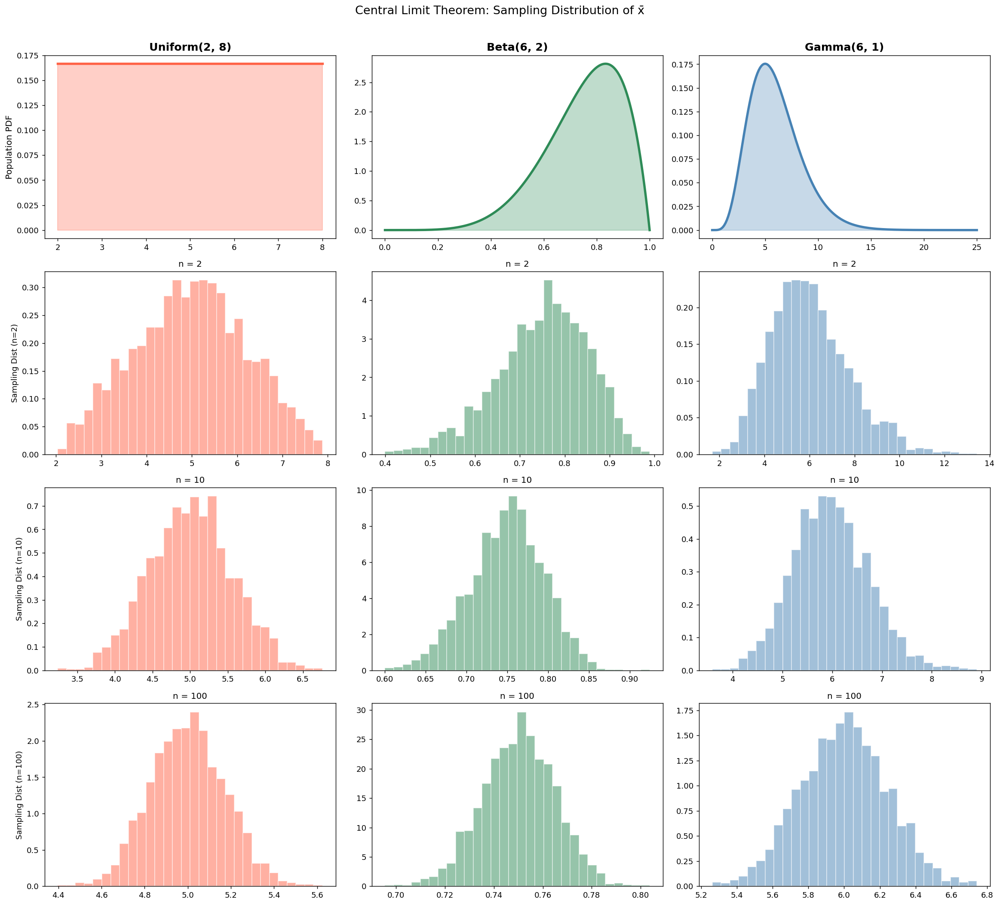
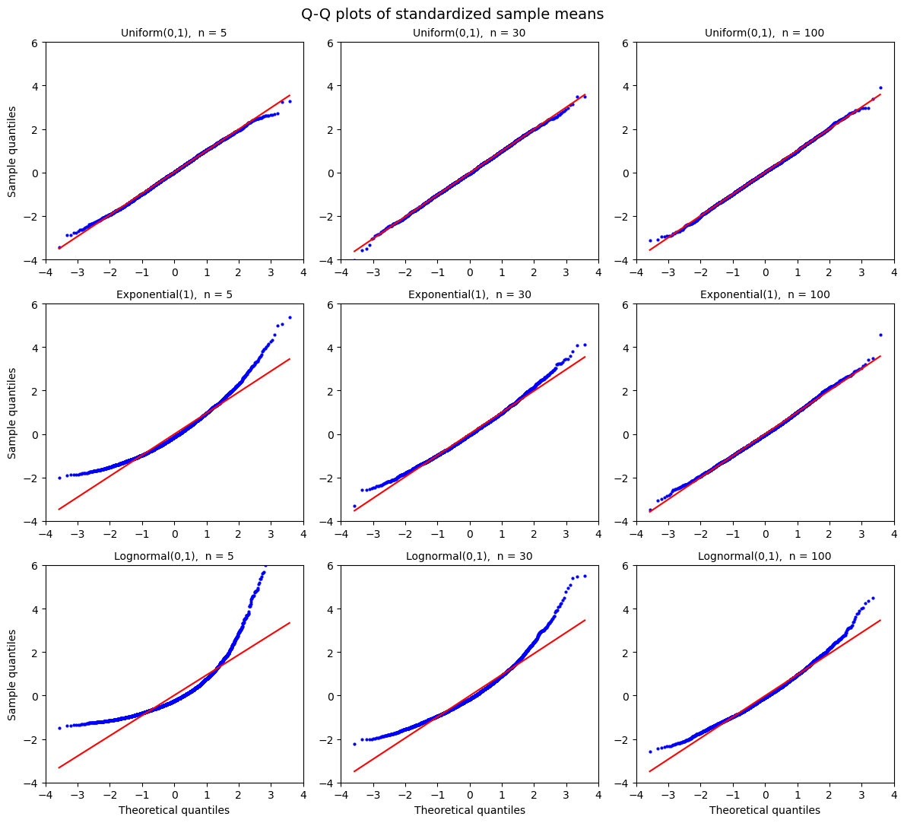
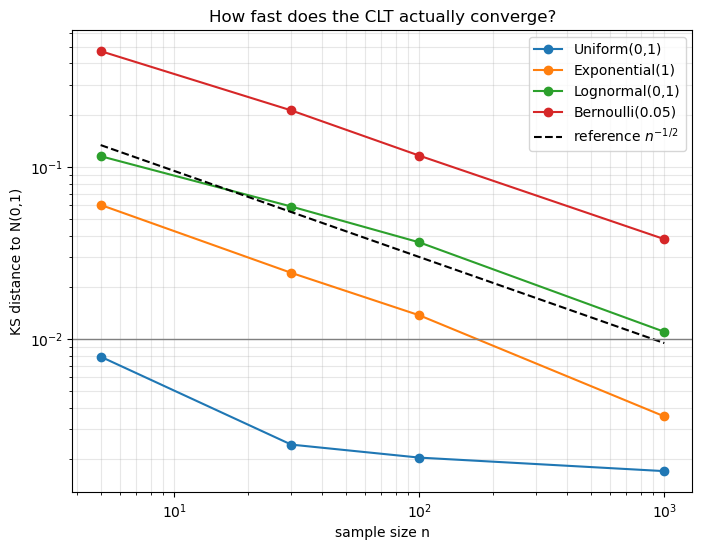

# 중심극한정리 다중 분포 시각화

앞의 두 절에서 중심극한정리를 진술하고 그 오차까지 재었다. 이제 눈으로 확인할 차례다.

정리는 두 가지를 동시에 주장한다. 표본평균의 분포가 **정규 모양으로 간다**는 것과, 그 폭이 **$\sigma/\sqrt n$으로 좁아진다**는 것이다. 둘은 별개의 예측이며 따로 확인할 수 있다.

뚜렷하게 비정규인 모집단 셋을 골라 표본을 반복해 뽑고, 표본평균의 히스토그램이 어떻게 변하는지 본다.

이 절은 세 개의 정리로 이루어진다. 표본분포를 모의실험으로 근사하는 방법(정리 1), 모양의 수렴(정리 2), 폭의 수축(정리 3)이다.

## 1. 표본평균을 여러 번 만들어 히스토그램을 그린다

표본분포는 "표본을 뽑을 때마다 달라지는 $\bar X$의 분포"다. 실제 조사에서는 표본을 한 번만 뽑으므로 이 분포를 직접 볼 수 없다. 모의실험에서는 볼 수 있다.

### 정리 1. 모의실험으로 표본분포 근사하기 — 실현값을 모으면 분포가 된다

크기 $n$인 표본을 독립적으로 $B$번 뽑아 각각의 평균 $\bar x^{(1)}, \ldots, \bar x^{(B)}$을 계산하면, 이 $B$개 값의 히스토그램은 $B \to \infty$일 때 $\bar X_n$의 참 표본분포로 수렴한다.

이것은 큰수의 법칙의 한 적용이다. 각 $\bar x^{(b)}$가 $\bar X_n$에서 뽑은 i.i.d. 관측이므로, 많이 모으면 그 분포가 드러난다.

세 모집단을 다음과 같이 고른다. 어느 것도 정규분포가 아니다.

| 분포 | 모양 | 평균 | 분산 |
|:---|:---|---:|---:|
| Uniform(2, 8) | 평평하고 대칭 | 5 | 3 |
| Beta(6, 2) | 왼쪽으로 치우침, $[0,1]$에서 유계 | 0.75 | 0.0208 |
| Gamma(6, 1) | 오른쪽으로 치우침, 유계 아님 | 6 | 6 |

각 분포와 각 $n \in \{2, 10, 100\}$에 대해 표본을 $B = 2000$개 뽑는다.

```python
import numpy as np
import matplotlib.pyplot as plt
from scipy import stats

np.random.seed(42)
N_REPS = 2000

def sample_means(dist_rvs, sample_sizes, n_reps=N_REPS):
    """표본 크기마다 n_reps개의 표본을 뽑아 각 표본평균을 모아 돌려준다.

    dist_rvs 는 "크기 n을 받아 표본을 돌려주는 함수"다.
    이렇게 함수를 인자로 받아 두면 균등·베르누이·감마 등
    어떤 모집단에도 같은 코드를 쓸 수 있다.

    돌려주는 results[n] 이 X-bar_n 의 표본분포 근사(2000개)다.
    """
    results = {}
    for n in sample_sizes:
        means = np.array([dist_rvs(n).mean() for _ in range(n_reps)])
        results[n] = means
    return results


# 균등분포 U(0,1)로 시험해 본다. 모평균 0.5, 모분산 1/12.
# 중심극한정리는 X-bar_n 의 표준편차가 sigma/sqrt(n) 이라고 예측한다.
demo = sample_means(lambda n: np.random.uniform(0, 1, n), [2, 10, 100])
sigma = (1 / 12) ** 0.5
for n, means in demo.items():
    print(f"n = {n:>3}: 평균 {means.mean():.4f}  "
          f"표준편차 {means.std():.4f}  (이론 {sigma / n**0.5:.4f})")
```

출력:

```
n =   2: 평균 0.4975  표준편차 0.2050  (이론 0.2041)
n =  10: 평균 0.5022  표준편차 0.0911  (이론 0.0913)
n = 100: 평균 0.5002  표준편차 0.0288  (이론 0.0289)
```

`results[n]`의 각 항목이 $\bar X_n$의 한 실현값이다. 2000개를 그리면 표본분포의 근사가 된다.

## 2. 모양이 정규분포로 모여든다

첫 번째 예측을 확인한다. 모집단이 무엇이든 $n$이 커지면 히스토그램이 종 모양이 되어야 한다.

### 정리 2. 모양의 수렴 — 모집단의 형태는 씻겨 나간다

$n$이 커질수록 $\bar X_n$의 표본분포는 모집단의 모양(평평함, 왼쪽 치우침, 오른쪽 치우침)을 잃고 대칭인 종 모양으로 간다.

```python
sample_sizes = [2, 10, 100]

# 모양이 서로 전혀 다른 모집단 셋을 준비한다.
# 각 항목은 표본을 뽑는 함수(rvs)와 모집단 밀도를 그릴 정보를 담는다.
#   Uniform: 평평하다        (봉우리가 없음)
#   Beta   : 왼쪽으로 치우침  (유계)
#   Gamma  : 오른쪽으로 치우침 (유계가 아님)
# 세 모집단이 이렇게 다른데도 표본평균은 모두 종 모양으로 간다는 것이 요점이다.
distributions = {
    "Uniform(2, 8)": {
        "rvs": lambda n: np.random.uniform(2, 8, n),
        "color": "tomato",
        "pop_x": np.linspace(2, 8, 200),
        "pop_pdf": lambda x: np.ones_like(x) / 6,
    },
    "Beta(6, 2)": {
        "rvs": lambda n: stats.beta.rvs(6, 2, size=n),
        "color": "seagreen",
        "pop_x": np.linspace(0, 1, 200),
        "pop_pdf": lambda x: stats.beta.pdf(x, 6, 2),
    },
    "Gamma(6, 1)": {
        "rvs": lambda n: stats.gamma.rvs(6, size=n),
        "color": "steelblue",
        "pop_x": np.linspace(0, 25, 200),
        "pop_pdf": lambda x: stats.gamma.pdf(x, 6),
    },
}

n_dists = len(distributions)
# 격자 구성: 열 = 모집단, 행 = (모집단 자체, n=2, n=10, n=100)
# 세로로 내려가며 읽으면 "n이 커질수록 어떻게 변하는가"가 보이고,
# 가로로 읽으면 "모집단이 달라도 결과가 같은가"가 보인다.
n_rows = 1 + len(sample_sizes)
fig, axes = plt.subplots(n_rows, n_dists, figsize=(6 * n_dists, 4 * n_rows))

for col, (name, d) in enumerate(distributions.items()):
    c = d["color"]

    # 0행: 모집단의 밀도함수. 셋이 얼마나 다른지 먼저 확인한다.
    ax = axes[0, col]
    ax.plot(d["pop_x"], d["pop_pdf"](d["pop_x"]), lw=3, color=c)
    ax.fill_between(d["pop_x"], d["pop_pdf"](d["pop_x"]), alpha=0.3, color=c)
    ax.set_title(name, fontsize=14, fontweight="bold")
    if col == 0:
        ax.set_ylabel("Population PDF", fontsize=11)

    # 1~3행: 표본평균의 표집분포.
    # 앞서 정의한 sample_means 로 각 n마다 2000개의 표본평균을 얻는다.
    means_dict = sample_means(d["rvs"], sample_sizes)
    for row, n in enumerate(sample_sizes, start=1):
        ax = axes[row, col]
        ax.hist(means_dict[n], bins=30, color=c, alpha=0.5,
                edgecolor="white", density=True)
        ax.set_title(f"n = {n}", fontsize=11)
        if col == 0:
            ax.set_ylabel(f"Sampling Dist (n={n})", fontsize=10)

plt.suptitle("Central Limit Theorem: Sampling Distribution of x̄",
             fontsize=15, y=1.01)
plt.tight_layout()
plt.show()
```



그림은 $4 \times 3$ 격자다. 맨 윗줄이 모집단, 나머지 세 줄이 $n = 2, 10, 100$의 표본분포다. 줄을 따라 내려가며 읽으면 수렴이 보인다.

- **맨 윗줄.** 세 모집단이 눈에 띄게 비정규다. 평평하고, 왼쪽으로 치우쳤고, 오른쪽으로 치우쳤다.
- **$n = 2$.** 표본분포가 여전히 모집단의 모양을 반영한다. 관측 두 개의 평균으로는 거의 매끄러워지지 않는다.
- **$n = 10$.** 종 모양에 눈에 띄게 가까워지지만, 감마분포 쪽에는 오른쪽 치우침이 남아 있다.
- **$n = 100$.** 세 열이 모두 근사적으로 정규다. 모집단이 무엇이었는지 알아볼 수 없다.

**감마분포 열이 가장 느리다.** 앞 절의 베리–에센 정리가 예고한 그대로다. 왜도가 클수록 $\rho/\sigma^3$이 크고 수렴이 느리다.

## 3. 폭이 $1/\sqrt n$로 좁아진다

두 번째 예측을 확인한다. 이쪽은 모양과 달리 **숫자로** 검증할 수 있다.

### 정리 3. 폭의 수축 — 표본분포의 표준편차는 $\sigma/\sqrt n$

$$
\text{std}(\bar X_n) = \frac{\sigma}{\sqrt n}
$$

이 관계는 근사가 아니라 **등식**이며, 중심극한정리가 아니라 3.4절의 분산 성질에서 곧바로 나온다. 정규성과 무관하게 $n$이 작아도 성립한다.

$\sigma^2 = 3$인 Uniform(2, 8)에서 확인해 보자.

| $n$ | 이론값 $\sigma/\sqrt n$ | 모의실험값 |
|---:|---:|---:|
| 2 | $\sqrt{3/2} \approx 1.225$ | $\approx 1.22$ |
| 10 | $\sqrt{3/10} \approx 0.548$ | $\approx 0.55$ |
| 100 | $\sqrt{3/100} \approx 0.173$ | $\approx 0.17$ |

$n$이 100배가 되면 폭이 10분의 1로 준다. 정밀도를 두 배로 올리려면 표본을 네 배로 늘려야 한다는 그 관계다.

!!! warning "가정이 깨지면 둘 다 무너진다"
    중심극한정리는 두 가지를 요구한다.

    1. 관측이 **독립이고 동일한 분포**를 따를 것
    2. 모집단의 **평균과 분산이 유한**할 것

    **종속인 자료**(자기상관이 강한 시계열)에서는 수렴이 느려지거나 다른 극한으로 간다. 유효 표본크기가 $n$보다 작아지기 때문이다.

    **분산이 무한한 분포**(코시분포)에서는 아예 성립하지 않는다. 표본평균이 안정되지 않으며, $n$을 아무리 늘려도 나아지지 않는다. 다음 페이지의 **도박사의 역설**이 이 경우를 다룬다.

## 연습문제

<div class="drillbox" markdown>

**연습문제 1.**
$X_1, \ldots, X_n$이 i.i.d. Uniform(0, 1)이면 $\bar{X}$의 정확한 평균과 분산을 쓰라. $n = 12$일 때 $\bar{X}$의 표준편차는 얼마인가?

</div>

??? success "풀이"
    Uniform(0, 1)에서 $\mu = 1/2$, $\sigma^2 = 1/12$이다.

    $$
    E[\bar{X}] = \mu = \frac{1}{2}, \qquad \text{Var}(\bar{X}) = \frac{\sigma^2}{n} = \frac{1}{12n}
    $$

    $n = 12$이면

    $$
    \text{Var}(\bar{X}) = \frac{1}{144}, \qquad \text{std}(\bar{X}) = \frac{1}{12} \approx 0.0833
    $$

    이다.

<div class="drillbox" markdown>

**연습문제 2.**
Gamma(2, 3) 분포($\mu = 6$, $\sigma^2 = 18$)에서 크기 $n$의 표본을 뽑는다고 하자. 중심극한정리 근사를 써서 $P(|\bar{X} - 6| < 0.5) \ge 0.95$가 되려면 $n$이 얼마나 커야 하는가?

</div>

??? success "풀이"
    중심극한정리에 의해 $\bar{X} \approx N(\mu, \sigma^2/n)$이다. 다음이 필요하다.

    $$
    P\left(\left|\frac{\bar{X} - 6}{\sqrt{18/n}}\right| < \frac{0.5}{\sqrt{18/n}}\right) \ge 0.95
    $$

    이를 위해서는 $\frac{0.5}{\sqrt{18/n}} \ge 1.96$이어야 하므로

    $$
    \sqrt{18/n} \le \frac{0.5}{1.96} \approx 0.2551
    $$

    $$
    \frac{18}{n} \le 0.06506 \implies n \ge \frac{18}{0.06506} \approx 276.7
    $$

    이다. 따라서 $n \ge 277$이다.

<div class="drillbox" markdown>

**연습문제 3.**
중심극한정리가 코시분포에 적용되지 않는 이유를 설명하라. $n$이 커질 때 i.i.d. 코시 확률변수의 표본평균은 어떻게 되는가?

</div>

??? success "풀이"
    코시분포의 밀도는 $f(x) = \frac{1}{\pi(1 + x^2)}$이다. 그 평균이 존재하지 않고(적분 $\int x f(x)\, dx$가 발산한다) 따라서 분산도 존재하지 않는다.

    중심극한정리는 유한한 평균과 분산을 요구하므로 적용되지 않는다. 실제로 i.i.d. 코시 $X_1, \ldots, X_n$에서 표본평균 $\bar{X}$는 관측값 하나와 같은 코시분포를 갖는다. 평균을 내도 퍼짐이 전혀 줄지 않는다. 코시분포가 지수 $\alpha = 1$인 안정분포이기 때문이다.

<div class="drillbox" markdown>

**연습문제 4.**
중심극한정리를 이용해 $\bar{X}$와 $s$(표본표준편차)에 근거한 모평균 $\mu$의 근사적 95% 신뢰구간을 유도하라.

</div>

??? success "풀이"
    중심극한정리에 의해 $n$이 크면

    $$
    \frac{\bar{X} - \mu}{s / \sqrt{n}} \approx N(0, 1)
    $$

    이다. 95% 구간은 $|Z| \le 1.96$을 요구하므로

    $$
    P\left(-1.96 \le \frac{\bar{X} - \mu}{s/\sqrt{n}} \le 1.96\right) \approx 0.95
    $$

    이고, 정리하면

    $$
    \bar{X} - 1.96 \frac{s}{\sqrt{n}} \le \mu \le \bar{X} + 1.96 \frac{s}{\sqrt{n}}
    $$

    이다. 근사적 95% 신뢰구간은 $\bar{X} \pm 1.96 \, s / \sqrt{n}$이다.

<div class="drillbox" markdown>

**연습문제 5.**
$X_i$가 분산 $\sigma^2$인 i.i.d.일 때 $\bar{X}_n = \frac{1}{n}\sum_{i=1}^n X_i$의 분산이 $\sigma^2 / n$임을 증명하라.

</div>

??? success "풀이"
    독립인 확률변수에 대한 분산의 성질에 의해

    $$
    \text{Var}(\bar{X}_n) = \text{Var}\left(\frac{1}{n}\sum_{i=1}^n X_i\right) = \frac{1}{n^2} \sum_{i=1}^n \text{Var}(X_i) = \frac{1}{n^2} \cdot n\sigma^2 = \frac{\sigma^2}{n}
    $$

    이다. 두 번째 등호는 독립성(합의 분산이 분산의 합)과 각 $X_i$의 분산이 모두 $\sigma^2$이라는 사실을 쓴다. $\square$

<div class="drillbox" markdown>

**연습문제 6.**
이산분포에 대한 정규근사의 **연속성 수정**: 정숫값 $X$에 대해 $P(X \le k)$를 정규분포로 근사할 때 $\Phi((k + 0.5 - \mu)/\sigma)$를 쓴다. 왜 그런가?

</div>

??? success "풀이"
    이산확률변수는 정수에 질량을 놓지만 연속 근사는 질량을 매끄럽게 퍼뜨린다. 수정하지 않으면 $P(X \le k) \approx \Phi((k - \mu)/\sigma)$가 사실상 $X = k$의 질량을 제외해 버린다.

    연속성 수정은 각 정수를 그 정수를 중심으로 하는 너비 1인 구간으로 취급한다. $P(X \le k)$에는 위쪽 끝점 $k + 0.5$를 쓴다.

    $$
    P(X \le k) \approx \Phi\!\left(\frac{k + 0.5 - \mu}{\sigma}\right)
    $$

    **개선:** 오차율이 $O(1/\sqrt n)$에서 $O(1/n)$으로 좋아진다.

    **예:** Binomial(20, 0.5)에서 $\mu = 10$, $\sigma \approx 2.236$이다. 정확한 값은 $P(X \le 12) = 0.8684$이다. 수정하지 않으면 $\Phi(0.894) = 0.814$(오차 0.054)이고, 수정하면 $\Phi(1.118) = 0.868$(오차 0.000)이다.

    특히 $n$이 크지 않을 때 이산에서 연속으로의 근사에는 언제나 연속성 수정을 적용하라.

<div class="drillbox" markdown>

**연습문제 7.**
**중심극한정리는 최댓값에 적용되지 않는다.** i.i.d. 표본의 최댓값 $M_n = \max_i X_i$이 가우시안 극한을 갖지 않음을 보여라. 그 극한분포는 무엇인가?

</div>

??? success "풀이"
    $F_{M_n}(x) = F(x)^n$이다. $n \to \infty$이면 이것이 계단함수로 퇴화하며 가우시안이 아니다.

    적절히 척도를 다시 맞추면 퇴화하지 않는 극한을 얻는다. 수열 $a_n > 0$과 $b_n$에 대해

    $$
    P\!\left(\frac{M_n - b_n}{a_n} \le x\right) \to G(x)
    $$

    이다. **피셔–티펫–그네덴코 정리**에 의해 $G$는 세 가지 극단값 분포 중 하나여야 한다.

    - 꼬리가 얇은 $F$(정규, 지수)에 대해 **검벨**.
    - 꼬리가 두꺼운 $F$(파레토, $t$)에 대해 **프레셰**.
    - 받침이 유계인 $F$(균등)에 대해 **와이불**.

    **실용적 쓰임:** 극단값 이론은 최대 하천 수위(수문학), 최대 금융 손실(위험관리), 최소 수명 신뢰도 문제를 지배한다. 가우시안 중심극한정리는 합을 다루고 극단값 이론은 최댓값을 다룬다. 같은 자료의 서로 다른 통계량에 대한 별개의 점근 틀이다.

<div class="drillbox" markdown>

**연습문제 8.**
본문의 히스토그램은 **가운데 모양**을 보여준다. 히스토그램이 숨기는 것을 드러내는 **Q-Q 플롯**으로 같은 수렴을 다시 그려라.

</div>

??? success "풀이"
    ```python
    import numpy as np
    import matplotlib.pyplot as plt
    from scipy import stats

    rng = np.random.default_rng(0)
    dists = [("Uniform(0,1)", stats.uniform), ("Exponential(1)", stats.expon),
             ("Lognormal(0,1)", stats.lognorm(1.0))]
    ns = [5, 30, 100]

    fig, axes = plt.subplots(len(dists), len(ns), figsize=(12, 11))
    for i, (name, d) in enumerate(dists):
        mu, sd = d.mean(), d.std()
        for j, n in enumerate(ns):
            Z = np.sqrt(n) * (d.rvs(size=(4000, n), random_state=rng).mean(1) - mu) / sd
            ax = axes[i, j]
            stats.probplot(Z, dist="norm", plot=ax)
            ax.get_lines()[0].set_markersize(2)
            ax.get_lines()[1].set_color("red")
            ax.set_title(f"{name},  n = {n}", fontsize=10)
            ax.set_xlabel("Theoretical quantiles" if i == len(dists) - 1 else "")
            ax.set_ylabel("Sample quantiles" if j == 0 else "")
            ax.set_xlim(-4, 4)
            ax.set_ylim(-4, 6)
    plt.suptitle("Q-Q plots of standardized sample means", fontsize=14)
    plt.tight_layout()
    plt.show()

    print(f"{'분포':>16}{'n':>6}{'표준화 평균의 왜도':>20}{'P(Z>3)':>11}"
          f"{'정규값':>10}")
    for name, d in dists:
        mu, sd = d.mean(), d.std()
        for n in ns:
            Z = np.sqrt(n) * (d.rvs(size=(200_000, n), random_state=rng).mean(1) - mu) / sd
            print(f"{name:>16}{n:>6}{stats.skew(Z):>20.3f}"
                  f"{np.mean(Z > 3):>11.5f}{0.00135:>10.5f}")
    ```

    출력:

    ```
    분포     n          표준화 평균의 왜도     P(Z>3)       정규값
        Uniform(0,1)     5               0.001    0.00047   0.00135
        Uniform(0,1)    30               0.010    0.00128   0.00135
        Uniform(0,1)   100              -0.008    0.00131   0.00135
      Exponential(1)     5               0.886    0.00935   0.00135
      Exponential(1)    30               0.359    0.00411   0.00135
      Exponential(1)   100               0.212    0.00288   0.00135
      Lognormal(0,1)     5               2.806    0.01650   0.00135
      Lognormal(0,1)    30               1.106    0.01041   0.00135
      Lognormal(0,1)   100               0.626    0.00684   0.00135
    ```

    

    **Q-Q 플롯은 꼬리를 확대한다.** 히스토그램에서는 $n=30$의 로그정규가 이미 "종 모양"으로 보이지만, Q-Q 플롯에서는 오른쪽 끝이 직선 위로 크게 휘어 있다.

    **수치가 그것을 확인해 준다.** 로그정규는 $n=100$에서도 $P(Z>3)=0.00684$로 정규값 $0.00135$의 **$5$배**다.

    **왜도가 정확히 $\gamma_1/\sqrt n$로 준다.**

    | 분포 | $\gamma_1$ | $n=5$ | $n=30$ | $n=100$ | $\gamma_1/\sqrt{100}$ |
    |---|---|---|---|---|---|
    | 균등 | $0$ | $0.001$ | $0.010$ | $-0.008$ | $0$ |
    | 지수 | $2.00$ | $0.886$ | $0.359$ | $0.212$ | $0.200$ |
    | 로그정규 | $6.18$ | $2.806$ | $1.106$ | $0.626$ | $0.618$ |

    측정값이 이론값과 거의 정확히 맞는다. **중심극한정리가 지우는 것이 바로 이 $\gamma_1/\sqrt n$이며**, 얼마나 남았는지가 곧 "얼마나 정규에 가까운가"다. 연습문제 $5$에서 본 에지워스 전개의 첫 보정항이 이것이다.

    **히스토그램 대신 Q-Q 플롯을 봐야 하는 이유.**

    | 진단 대상 | 히스토그램 | Q-Q 플롯 |
    |---|---|---|
    | 중심의 모양 | 잘 보임 | 잘 보임 |
    | 치우침 | 보임 | 잘 보임 |
    | **꼬리의 두께** | **거의 안 보임** | 명확히 보임 |
    | **극단 이상치** | **막대 하나에 묻힘** | 점 하나로 튐 |
    | 구간폭 선택 의존 | 있음 | 없음 |

    **히스토그램에서 꼬리는 높이 $0$에 가까운 막대다.** 확률 $0.001$과 $0.005$가 눈으로 구별되지 않는다. Q-Q 플롯은 분위수를 비교하므로 그 차이가 위치의 차이로 나타난다.

    **실무 규칙.** 정규성을 눈으로 판단할 때는 **언제나 Q-Q 플롯을 먼저 본다.** 히스토그램은 청중에게 설명할 때, Q-Q 플롯은 스스로 판단할 때 쓴다. $\square$

<div class="drillbox" markdown>

**연습문제 9.**
중심극한정리는 **표본분산**에도 적용된다. 그런데 표본평균보다 훨씬 느리게 수렴한다. **정규 모집단에서조차** 그렇다. 이유를 밝혀라.

</div>

??? success "풀이"
    ```python
    import numpy as np
    from scipy import stats

    rng = np.random.default_rng(0)
    print("모집단이 N(0,1) 일 때 정규분포까지의 KS 거리")
    print(f"{'n':>7}{'표본평균':>15}{'표본분산':>15}")
    for n in (5, 10, 30, 100, 1000):
        X = rng.normal(0, 1, (200_000, n))
        Zm = np.sqrt(n) * X.mean(1)
        Zv = np.sqrt(n) * (X.var(1, ddof=1) - 1) / np.sqrt(2)
        print(f"{n:>7}{stats.kstest(Zm, 'norm').statistic:>15.4f}"
              f"{stats.kstest(Zv, 'norm').statistic:>15.4f}")

    print("\n표본분산은 (X - mu)^2 들의 평균이다. 그 분포의 왜도를 보라.")
    print(f"  X ~ N(0,1) 의 왜도          {float(stats.norm.stats(moments='s')):>8.4f}")
    print(f"  (X-mu)^2 ~ chi^2_1 의 왜도  {float(stats.chi2.stats(1, moments='s')):>8.4f}"
          f"   (= sqrt(8))")
    print(f"  참고: Exp(1) 의 왜도        {float(stats.expon.stats(moments='s')):>8.4f}")
    ```

    출력:

    ```
    모집단이 N(0,1) 일 때 정규분포까지의 KS 거리
          n           표본평균           표본분산
          5         0.0021         0.1002
         10         0.0012         0.0675
         30         0.0017         0.0372
        100         0.0024         0.0183
       1000         0.0015         0.0052

    표본분산은 (X - mu)^2 들의 평균이다. 그 분포의 왜도를 보라.
      X ~ N(0,1) 의 왜도            0.0000
      (X-mu)^2 ~ chi^2_1 의 왜도    2.8284   (= sqrt(8))
      참고: Exp(1) 의 왜도          2.0000
    ```

    **표본평균은 $n=5$에서 이미 완벽하다**(KS $0.0021$은 모의오차 수준). 모집단이 정규면 $\bar X_n$이 **정확히** 정규이기 때문이다.

    **표본분산은 그렇지 않다.** $n=5$에서 $0.1002$, $n=100$에서도 $0.0183$이다. 표본평균보다 훨씬 나쁘다.

    **이유는 무엇의 평균인지에 있다.**

    $$
    s_n^2 \approx \frac1n\sum_i (X_i-\mu)^2
    $$

    **$s^2$은 $X_i$의 평균이 아니라 $(X_i-\mu)^2$의 평균이다.** 그리고 $X\sim N(0,1)$이면

    $$
    (X-\mu)^2\sim\chi^2_1,\qquad \gamma_1(\chi^2_1)=\sqrt8=2.828
    $$

    **정규분포를 제곱하는 순간 왜도 $2.83$짜리 분포가 된다.** 이는 지수분포($\gamma_1=2$)보다 더 치우쳤다. 연습문제 $8$의 표에서 지수분포의 표본평균이 $n=100$에서 KS $0.0138$이었던 것과 견주면, $s^2$의 $0.0183$은 자연스럽다.

    **점근분포는 이렇다.** 4차적률 $\mu_4$가 유한하면

    $$
    \sqrt n\,(s_n^2-\sigma^2)\xrightarrow{d} N\!\left(0,\;\mu_4-\sigma^4\right)
    $$

    이고, 정규 모집단이면 $\mu_4=3\sigma^4$이라 분산이 $2\sigma^4$이다.

    !!! warning "4차적률이 필요하다"
        표본평균의 중심극한정리는 **2차적률**만 요구하지만, 표본분산은 **4차적률**을 요구한다. 꼬리가 두꺼운 자료에서는 $\mu_4=\infty$인 경우가 흔하고($t_4$ 분포, $\alpha<4$인 파레토), 그러면 $s^2$에 대한 정규근사가 **아예 성립하지 않는다.**

    **실무적 함의.**

    | 대상 | 필요한 적률 | 실무적 신뢰도 |
    |---|---|---|
    | 평균의 신뢰구간 | 2차 | 대체로 안전 |
    | 분산의 신뢰구간 | 4차 | 꼬리에 매우 민감 |
    | 상관계수 | 4차 | 마찬가지로 민감 |
    | 첨도 | 8차 | 사실상 신뢰 불가 |

    **적률의 차수가 올라갈수록 수렴이 느려지고 조건이 까다로워진다.** 분산이나 상관계수의 구간추정에는 정규근사 대신 **부트스트랩**(17장)을 쓰는 편이 안전한 이유다. $\square$

<div class="drillbox" markdown>

**연습문제 10.**
"$n\ge30$이면 충분하다"는 규칙을 **측정**하라. 분포마다 실제로 얼마나 큰 $n$이 필요한가?

</div>

??? success "풀이"
    ```python
    import numpy as np
    import matplotlib.pyplot as plt
    from scipy import stats

    rng = np.random.default_rng(0)
    dists = [("Uniform(0,1)", stats.uniform), ("Exponential(1)", stats.expon),
             ("Lognormal(0,1)", stats.lognorm(1.0)),
             ("Bernoulli(0.05)", stats.bernoulli(0.05))]
    ns = (5, 30, 100, 1000)

    print("표준화 표본평균과 N(0,1) 사이의 콜모고로프-스미르노프 거리")
    print(f"{'분포':>18}{'왜도':>8}" + "".join(f"{'n=' + str(n):>11}" for n in ns))
    ks = {}
    for name, d in dists:
        mu, sd = d.mean(), d.std()
        ks[name] = [stats.kstest(
            np.sqrt(n) * (d.rvs(size=(100_000, n), random_state=rng).mean(1) - mu) / sd,
            "norm").statistic for n in ns]
        print(f"{name:>18}{float(d.stats(moments='s')):>8.2f}"
              + "".join(f"{v:>11.4f}" for v in ks[name]))

    print(f"\n참고: 100000회 모의에서 KS 통계량 자체의 크기 ~ 0.83/sqrt(B) = "
          f"{0.83 / np.sqrt(100_000):.4f}")
    print("\nKS ~ c/sqrt(n) 으로 보고 (n=100 기준) KS < 0.01 에 필요한 n")
    print(f"{'분포':>18}{'c':>10}{'필요한 n':>12}")
    for name, row in ks.items():
        c = row[2] * 10
        print(f"{name:>18}{c:>10.3f}{(c / 0.01) ** 2:>12.0f}")

    plt.figure(figsize=(8, 6))
    for name, row in ks.items():
        plt.loglog(ns, row, "o-", label=name)
    plt.loglog(ns, [0.3 / np.sqrt(n) for n in ns], "k--", label="reference $n^{-1/2}$")
    plt.axhline(0.01, color="gray", lw=1)
    plt.xlabel("sample size n")
    plt.ylabel("KS distance to N(0,1)")
    plt.title("How fast does the CLT actually converge?")
    plt.legend()
    plt.grid(alpha=0.3, which="both")
    plt.show()
    ```

    출력:

    ```
    표준화 표본평균과 N(0,1) 사이의 콜모고로프-스미르노프 거리
                    분포      왜도        n=5       n=30      n=100     n=1000
          Uniform(0,1)    0.00     0.0079     0.0024     0.0020     0.0017
        Exponential(1)    2.00     0.0603     0.0243     0.0138     0.0036
        Lognormal(0,1)    6.18     0.1156     0.0590     0.0365     0.0110
       Bernoulli(0.05)    4.13     0.4716     0.2134     0.1165     0.0381

    참고: 100000회 모의에서 KS 통계량 자체의 크기 ~ 0.83/sqrt(B) = 0.0026

    KS ~ c/sqrt(n) 으로 보고 (n=100 기준) KS < 0.01 에 필요한 n
                    분포         c       필요한 n
          Uniform(0,1)     0.020           4
        Exponential(1)     0.138         189
        Lognormal(0,1)     0.365        1333
       Bernoulli(0.05)     1.165       13563
    ```

    

    **"$n\ge30$"이 맞는 경우는 하나뿐이다.**

    | 분포 | $\gamma_1$ | $n=30$의 KS | KS $<0.01$에 필요한 $n$ |
    |---|---|---|---|
    | 균등 | $0$ | $0.0024$ | $\approx 4$ |
    | 지수 | $2.00$ | $0.0243$ | $\approx 190$ |
    | 로그정규 | $6.18$ | $0.0590$ | $\approx 1\,300$ |
    | 베르누이$(0.05)$ | $4.13$ | $0.2134$ | $\approx 13\,600$ |

    **$3$천 배 넘게 차이 난다.** 균등분포는 $n=5$에서 이미 충분하고, 베르누이$(0.05)$는 $1$만 개가 넘어야 한다.

    **균등분포의 곡선은 바닥에 눕는다.** $0.002$ 부근에서 평평해지는데, 이는 수렴이 멈춘 것이 아니라 **모의실험 자체의 잡음 바닥**($\approx0.83/\sqrt{B}=0.0026$)에 닿았기 때문이다. 실제 KS 거리는 그보다 훨씬 작다.

    **나머지 세 곡선의 기울기는 $-1/2$이다.** 로그–로그 그림에서 지수·로그정규·베르누이 세 선이 참조선 $n^{-1/2}$와 나란히 내려간다. **속도는 모두 같고 상수만 다르다** — 정확히 베리–에센 정리가 말하는 바다.

    **상수를 결정하는 것.**

    | 요인 | 효과 |
    |---|---|
    | 왜도 $\gamma_1$ | 주된 요인 — 대략 비례 |
    | **이산성(격자)** | 왜도와 **무관하게** 별도로 더해짐 |
    | 첨도 | 이차적 요인($1/n$ 항) |

    **베르누이가 특히 나쁜 이유는 왜도만이 아니다.** 왜도 $4.13$은 로그정규($6.18$)보다 낮은데 필요한 $n$은 $10$배다. 베리–에센 문서 연습문제 $7$에서 본 **격자 오차**가 더해지기 때문이며, 이 성분은 왜도 보정으로도 사라지지 않는다.

    **실무 지침.**

    | 상황 | 권고 |
    |---|---|
    | 대칭·유계 자료 | $n\ge20$이면 충분 |
    | 중간 정도 치우침($\gamma_1\approx2$) | $n\ge200$ |
    | 심한 치우침(소득, 보험청구) | $n\ge1000$ 또는 부트스트랩 |
    | 희귀 이항($np<10$) | 정확 계산 또는 포아송 근사 |
    | 꼬리확률·작은 $p$값이 목표 | 어떤 $n$에서도 근사를 믿지 말 것 |

    !!! tip "먼저 왜도를 재라"
        자료에서 $\hat\gamma_1$을 계산하고 $|\hat\gamma_1|/\sqrt n$을 보라. 이 값이 $0.1$보다 크면 정규근사를 의심해야 한다. 위 표의 "필요한 $n$"이 대략 $(\gamma_1/0.06)^2$과 맞아떨어진다.

    **가장 안전한 답은 근사를 재는 것이다.** 자신의 자료에서 부트스트랩으로 표본평균의 분포를 만들어 정규분포와 비교하면, 남의 경험칙을 빌리지 않고 직접 확인할 수 있다. $\square$


## 정리하며

그림 한 장이 세 절의 이론을 요약한다.

- **정리 1**은 표본평균을 반복해 만들어 표본분포를 눈에 보이게 하는 방법을 정했다.
- **정리 2**는 모양의 수렴을 확인했다. 평평하든 왼쪽으로 치우쳤든 오른쪽으로 치우쳤든, $n = 100$에서는 구별할 수 없다.
- **정리 3**은 폭의 수축을 숫자로 확인했다. $\sigma/\sqrt n$ 예측이 모의실험값과 소수 둘째 자리까지 맞는다.

두 예측의 성격이 다르다는 점을 기억해 둘 만하다. **폭의 수축은 등식**이고 $n$이 작아도 정확하지만, **모양의 수렴은 근사**이고 $n$이 커야 한다. 그래서 $n = 2$에서도 표준편차는 정확히 맞지만 히스토그램은 아직 종 모양이 아니다.

감마분포 열이 가장 늦게 수렴한 것도 우연이 아니다. 앞 절의 베리–에센 상한이 왜도가 큰 분포일수록 크다고 예고했고, 그림이 그대로 보여 주었다.

다음 페이지는 반대쪽을 본다. 지금까지는 정리의 **가정이 성립할 때** 무슨 일이 벌어지는지 보았다. 가정이 깨지면 어떻게 되는가?

**도박사의 역설**에서 평균이 무한한 분포를 다룬다. 거기서는 큰수의 법칙조차 성립하지 않으며, 표본평균이 어디로도 수렴하지 않는다. 정리의 가정이 장식이 아니라는 사실을 그 사례가 분명히 한다.
