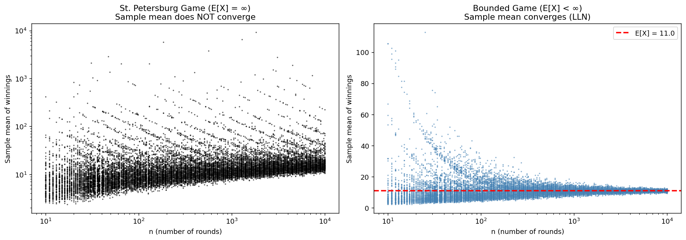

# 도박사의 역설: 큰수의 법칙이 실패할 때

앞의 세 절에서 극한정리가 **성립할 때** 무슨 일이 벌어지는지 보았다. 이제 반대쪽을 본다. 가정이 깨지면 어떻게 되는가?

큰수의 법칙은 "표본평균이 모평균으로 수렴한다"고 흔히 요약되지만, 그 진술에는 조건이 붙어 있다. **모평균이 유한할 때에만** 그렇다. 이 조건은 장식이 아니다. 깨지면 정리가 조금 나빠지는 것이 아니라 **완전히 무너진다**.

**상트페테르부르크 역설**이 그 고전적 반례다. 기댓값이 무한한 게임에서는 표본평균이 안정되지 않고, 라운드를 아무리 늘려도 나아지지 않는다.

이 절은 세 개의 정리로 이루어진다. 기댓값이 무한한 게임(정리 1), 상금에 상한을 두면 무엇이 달라지는가(정리 2), 그리고 두 극한정리가 정확히 무엇을 요구하는가(정리 3)이다.

## 1. 기댓값이 무한한 게임

규칙은 단순한데 기댓값이 발산한다. 이런 일이 실제로 가능하다는 것 자체가 놀랍다.

<div class="thmbox" markdown>

### 정리 1. 상트페테르부르크 게임 — 기댓값이 발산한다 { .thm }

공정한 동전을 첫 앞면이 나올 때까지 던진다. $k$번째에 처음 앞면이 나오면 $2^k$달러를 받는다. 이 게임의 기대 상금은

$$
E[X] = \sum_{k=1}^{\infty} 2^k \cdot \left(\frac{1}{2}\right)^k = \sum_{k=1}^{\infty} 1 = \infty
$$

이다. 따라서 큰수의 법칙이 **적용되지 않는다**. 표본평균이 수렴할 유한한 값 자체가 없다.

</div>

발산의 구조를 보라. 상금 $2^k$가 커지는 속도와 확률 $2^{-k}$가 줄어드는 속도가 **정확히 상쇄된다.** 각 항이 1이므로 무한히 더하면 발산한다.

**그런데 개별 라운드는 대부분 초라하다.** 50%는 \$2, 75%는 \$4 이하다. 무한한 기댓값을 만드는 것은 뒷면이 아주 길게 이어지는 드문 사건이며, 그 사건 하나가 그때까지의 평균 전체를 뒤집는다.

수열 100개를 각각 최대 10,000라운드까지 진행하며 표본평균을 추적해 보자.

<div class="codebox" markdown>

**예제 1.** 상트페테르부르크 게임의 표본평균

```python
import numpy as np
import matplotlib.pyplot as plt

np.random.seed(42)

def st_petersburg_sample_means(n_max=10_000, tries=100, n_grid=200):
    """상트페테르부르크 게임: 처음 앞면이 k번째에 나오면 2^k 을 받는다.

    상금이 2^k 이고 그 확률이 (1/2)^k 이므로 각 항의 기여가 1이고,
    항이 무한히 많아 E[X] = 1 + 1 + 1 + ... = 무한대다.
    기댓값이 없으므로 대수의 법칙이 성립하지 않는다.
    """
    # 표본 크기를 로그 눈금으로 200개 잡는다(10부터 n_max까지).
    # 로그 눈금이라야 "n이 10배가 될 때마다" 무슨 일이 생기는지 보인다.
    n_vals = np.unique(np.logspace(1, np.log10(n_max), n_grid).astype(int))
    results = []
    for n in n_vals:
        # 기하분포: 처음 성공(앞면)까지의 시행 횟수 k
        flips = np.random.geometric(0.5, size=(n, tries))
        winnings = 2.0 ** flips              # 상금
        # 같은 n에 대해 tries(=100)번 독립적으로 되풀이해 표본평균을 낸다.
        # 100개의 평균이 얼마나 흩어지는지가 이 그림의 핵심이다.
        means = winnings.mean(axis=0)
        results.append((n, means))
    return results

infinite_results = st_petersburg_sample_means()

# n이 커져도 표본평균이 한 값으로 모이지 않는다는 것을 숫자로 확인한다.
for n, means in [infinite_results[0], infinite_results[len(infinite_results)//2],
                 infinite_results[-1]]:
    print(f"n = {n:>6,}: 표본평균 100개의 중앙값 {np.median(means):8.1f}, "
          f"최댓값 {means.max():10.1f}")
```

출력:

```
n =     10: 표본평균 100개의 중앙값      5.8, 최댓값      415.4
n =    396: 표본평균 100개의 중앙값     10.2, 최댓값     1340.6
n = 10,000: 표본평균 100개의 중앙값     16.9, 최댓값      223.0
```

</div>

## 2. 상한 하나가 모든 것을 바꾼다

꼬리를 잘라 내면 기댓값이 유한해지고, 그 순간 큰수의 법칙이 되살아난다. 두 게임의 차이는 극단적으로 드문 사건뿐인데 결과는 정반대다.

<div class="thmbox" markdown>

### 정리 2. 유계 변형 — 절단하면 기댓값이 유한해진다 { .thm }

상금을 $2^{10} = 1024$달러로 제한하면

$$
E[X_{\text{유계}}] = \sum_{k=1}^{10} 2^k \left(\tfrac{1}{2}\right)^k + 1024\sum_{k=11}^{\infty}\left(\tfrac{1}{2}\right)^k = 10 + 1024 \cdot \frac{1}{1024} = 11
$$

이다. 평균과 분산이 모두 유한하므로 큰수의 법칙이 성립한다.

</div>

<div class="codebox" markdown>

**예제 2.** 상금에 상한을 두면 평균이 안정된다

```python
def bounded_game_sample_means(n_max=10_000, tries=100, n_grid=200):
    """같은 게임이되 상금을 2^10 = 1024 로 잘라 낸다.

    이 한 줄의 차이로 E[X]가 유한해지고, 대수의 법칙이 되살아난다.
    상금이 유계이면 기댓값이 반드시 존재하기 때문이다.
    """
    n_vals = np.unique(np.logspace(1, np.log10(n_max), n_grid).astype(int))
    results = []
    for n in n_vals:
        flips = np.random.geometric(0.5, size=(n, tries))
        # 위 함수와 다른 곳은 이 minimum 한 군데뿐이다
        winnings = np.minimum(2.0 ** flips, 1024.0)
        means = winnings.mean(axis=0)
        results.append((n, means))
    return results

bounded_results = bounded_game_sample_means()

# 이번에는 n이 커질수록 100개의 표본평균이 한 값으로 모여든다.
# 흩어짐(표준편차)이 줄어드는지 보라.
for n, means in [bounded_results[0], bounded_results[len(bounded_results)//2],
                 bounded_results[-1]]:
    print(f"n = {n:>6,}: 표본평균 100개의 중앙값 {np.median(means):7.2f}, "
          f"표준편차 {means.std():7.2f}")
```

출력:

```
n =     10: 표본평균 100개의 중앙값    5.50, 표준편차   17.34
n =    396: 표본평균 100개의 중앙값   10.50, 표준편차    2.61
n = 10,000: 표본평균 100개의 중앙값   11.01, 표준편차    0.59
```

</div>

두 게임을 나란히 그리면 차이가 분명하다.

<div class="codebox" markdown>

**예제 3.** 절단 전후의 표본평균 비교

```python
fig, axes = plt.subplots(1, 2, figsize=(14, 5))

# 왼쪽 패널: 기댓값이 무한한 게임 — 발산
ax = axes[0]
for n, means in infinite_results:
    # 각 n마다 100개의 표본평균을 세로로 흩뿌린다.
    # n이 커져도 이 흩어짐이 좁아지지 않는 것이 핵심이다.
    # 세로축도 로그(loglog)로 두어야 큰 값들이 화면에 들어온다.
    ax.loglog(n * np.ones(len(means)), means, ".", color="black", ms=2, alpha=0.5)
ax.set_xlabel("n (number of rounds)")
ax.set_ylabel("Sample mean of winnings")
ax.set_title("St. Petersburg Game (E[X] = ∞)\nSample mean does NOT converge")

# 오른쪽 패널: 기댓값이 유한한 게임 — 수렴
ax = axes[1]
for n, means in bounded_results:
    # 이쪽은 세로축을 로그로 하지 않는다(semilogx). 값이 좁은 범위에 모이기 때문이다.
    # n이 커질수록 점들이 깔때기처럼 한 선으로 좁아진다. 이것이 큰수의 법칙이다.
    ax.semilogx(n * np.ones(len(means)), means, ".", color="steelblue", ms=2, alpha=0.5)

# 이론적 기댓값. 상금이 2^10 에서 잘리므로
#   E[X] = (k=1..10 각각 1씩) + 1024 * P(k > 10) = 10 + 1 = 11
true_mean = 11.0
ax.axhline(true_mean, color="red", linestyle="--", lw=2,
           label=f"E[X] = {true_mean:.1f}")
ax.set_xlabel("n (number of rounds)")
ax.set_ylabel("Sample mean of winnings")
ax.set_title("Bounded Game (E[X] < ∞)\nSample mean converges (LLN)")
ax.legend()

plt.tight_layout()
plt.show()
```



</div>

**왼쪽(무한한 평균).** 표본평균의 구름이 $n$이 커져도 좁아지지 **않는다.** 로그–로그 척도에서 오히려 계속 퍼진다. $n = 10{,}000$에서도 실행마다 평균이 크게 다르다. 표본평균이 일치추정량이 아니라는 뜻이다.

**오른쪽(유한한 평균).** 구름이 빨간 선 $E[X] = 11$ 주위로 **수축한다.** $n = 10{,}000$쯤이면 100번의 실행이 사실상 모두 11 근처에 모인다.

!!! warning "유한한 평균은 선택 사항이 아니다"
    큰수의 법칙을 "평균은 수렴한다"고 외우면 이 사례에서 틀린다. 평균은 **모평균이 존재하고 유한할 때에만** 수렴한다.

    두 게임은 꼬리의 행동만 다르다. $2^{11}$ 이상의 상금은 확률이 $2^{-11} \approx 0.0005$에 불과하다. 천 번에 한 번도 안 나오는 사건 하나가 정리의 성립과 실패를 가른다.

    금융 수익률, 보험 손실액, 네트워크 트래픽처럼 꼬리가 두꺼운 자료에서는 이 조건을 실제로 의심해야 한다. 5장의 금융위기 사례가 그 상황을 다룬다.

## 3. 두 극한정리는 무엇을 요구하는가

이 사례를 계기로 3.5절의 정리들이 요구하는 조건을 한자리에 정리해 둔다.

<div class="thmbox" markdown>

### 정리 3. 가정의 계층 — 평균, 분산, 3차 적률 { .thm }

| 정리 | 필요한 조건 | 주는 것 |
|:---|:---|:---|
| 약한 큰수의 법칙 | $E[|X|] < \infty$ | 확률수렴 |
| 강한 큰수의 법칙 | $E[|X|] < \infty$ | 거의 확실한 수렴 |
| 중심극한정리 | $E[|X|] < \infty$, $\text{Var}(X) < \infty$ | 정규 극한분포 |
| 베리–에센 | 위에 더해 $E[|X-\mu|^3] < \infty$ | 오차의 상한 $O(1/\sqrt n)$ |

</div>

**요구가 한 단계씩 강해진다.** 어디로 가는지 알려면 평균이, 어떤 모양으로 가는지 알려면 분산이, 얼마나 가까운지 알려면 3차 적률이 필요하다.

상트페테르부르크 게임은 $E[X] = \infty$이므로 **첫 줄부터 걸린다.** 유계 변형은 네 조건을 모두 만족하므로 전부 성립한다.

!!! note "두꺼운 꼬리와 적분 불가능한 꼬리는 다르다"
    꼬리가 두껍다고 큰수의 법칙이 깨지는 것은 아니다. $\alpha > 1$인 파레토분포는 꼬리가 두껍지만 평균이 유한하므로 큰수의 법칙이 성립한다.

    구별해야 할 것은 **두꺼운 꼬리**(느린 감쇠)와 **적분 불가능한 꼬리**(무한한 평균)다. 정리를 깨뜨리는 것은 후자뿐이다.

    중간 지대도 있다. 평균은 유한하지만 분산이 무한한 분포($1 < \alpha \le 2$인 파레토)에서는 큰수의 법칙은 성립하지만 중심극한정리는 성립하지 않는다. 표본평균이 참값으로 가기는 하는데 그 오차가 정규분포를 따르지 않으므로, **신뢰구간을 만들 수 없다**.

## 연습문제

<div class="drillbox" markdown>

**연습문제 1.** <span class="diff med" title="중간"></span>
정의로부터 상트페테르부르크 게임 상금의 기댓값을 계산하라. 급수의 표준 수렴 판정법은 어느 단계에서 실패하는가?

</div>

??? success "풀이"
    상금은 $K \sim \text{Geometric}(1/2)$일 때 $X = 2^K$이다. 기댓값은

    $$
    E[X] = \sum_{k=1}^{\infty} 2^k \cdot P(K = k) = \sum_{k=1}^{\infty} 2^k \cdot \frac{1}{2^k} = \sum_{k=1}^{\infty} 1
    $$

    이다. 이것은 $1 + 1 + 1 + \cdots$ 형태의 급수로 발산한다. 항이 0으로 가지 않으므로 기본적인 발산 판정법($a_k \not\to 0$이면 $\sum a_k$가 발산)만으로도 기댓값이 무한함이 확인된다.

<div class="drillbox" markdown>

**연습문제 2.** <span class="diff med" title="중간"></span>
어떤 정수 $M \ge 1$에 대해 상금을 $2^M$으로 제한한다고 하자. $E[X_{\text{bounded}}]$를 $M$의 함수로 나타내는 공식을 유도하라.

</div>

??? success "풀이"
    $k \le M$이면 상금이 $2^k$이고 확률이 $(1/2)^k$다. $k > M$이면 상금이 $2^M$이고 확률이 $(1/2)^k$다. 따라서

    $$
    E[X_{\text{bounded}}] = \sum_{k=1}^{M} 2^k \cdot \frac{1}{2^k} + 2^M \sum_{k=M+1}^{\infty} \frac{1}{2^k}
    $$

    이다. 첫 합은 $M$이다. 둘째 합은 기하급수로

    $$
    2^M \cdot \frac{1/2^{M+1}}{1 - 1/2} = 2^M \cdot \frac{1}{2^M} = 1
    $$

    이다. 따라서 $E[X_{\text{bounded}}] = M + 1$이다.

    $M = 10$이면 $E[X] = 11$로 모의실험과 일치한다.

<div class="drillbox" markdown>

**연습문제 3.** <span class="diff easy" title="쉬움"></span>
모수가 $\alpha$인 파레토분포는 $x \ge 1$에서 밀도가 $f(x) = \alpha / x^{\alpha+1}$이다. $\alpha$가 어떤 값일 때 $E[X]$가 존재하는가? $\text{Var}(X)$는 어떤 값일 때 존재하는가? 각 경우에 큰수의 법칙의 어떤 형태가 적용되는가?

</div>

??? success "풀이"
    $r$차 적률은

    $$
    E[X^r] = \int_1^{\infty} \frac{\alpha \, x^r}{x^{\alpha+1}} \, dx = \alpha \int_1^{\infty} x^{r - \alpha - 1} \, dx
    $$

    이며, $r - \alpha - 1 < -1$, 즉 $r < \alpha$일 때에 한해 수렴한다.

    - $E[X]$가 존재할 필요충분조건은 $\alpha > 1$이다. 강한 큰수의 법칙이 적용된다.
    - $\text{Var}(X)$가 존재할 필요충분조건은 $E[X^2] < \infty$, 즉 $\alpha > 2$이다. (유한 분산의) 약한 큰수의 법칙이 적용되고 중심극한정리도 적용된다.
    - $1 < \alpha \le 2$이면 평균은 유한하지만 분산이 무한하다. 강한 큰수의 법칙은 여전히 성립하지만 중심극한정리는 표준 형태로는 적용되지 않는다(안정분포를 쓰는 일반화된 중심극한정리가 필요하다).
    - $\alpha \le 1$이면 평균이 무한하고 어느 큰수의 법칙도 적용되지 않는다.

<div class="drillbox" markdown>

**연습문제 4.** <span class="diff med" title="중간"></span>
분산 $\sigma^2$이 유한하다고 가정하고 체비쇼프 부등식을 이용해 약한 큰수의 법칙을 증명하라.

</div>

??? success "풀이"
    $X_1, \ldots, X_n$이 평균 $\mu$, 분산 $\sigma^2$인 i.i.d.라 하자. 그러면 $E[\bar{X}] = \mu$이고 $\text{Var}(\bar{X}) = \sigma^2 / n$이다.

    체비쇼프 부등식에 의해

    $$
    P(|\bar{X} - \mu| \ge \varepsilon) \le \frac{\text{Var}(\bar{X})}{\varepsilon^2} = \frac{\sigma^2}{n\varepsilon^2}
    $$

    이다. $n \to \infty$이면 고정된 임의의 $\varepsilon > 0$에 대해 우변이 0으로 가므로

    $$
    P(|\bar{X} - \mu| \ge \varepsilon) \to 0
    $$

    이다. 이것이 바로 확률수렴 $\bar{X} \xrightarrow{P} \mu$이다. $\square$

<div class="drillbox" markdown>

**연습문제 5.** <span class="diff med" title="중간"></span>
모의실험에서 유계 게임은 복원 표집(`np.random.geometric`)을 쓴다. 대신 $n$라운드의 고정된 수열을 진행하며 진행 중인 평균을 계산한다면 그림이 달라지겠는가? 모의실험 설계와 한 도박사의 경험 사이의 차이를 설명하라.

</div>

??? success "풀이"
    모의실험은 각 격자점마다 길이 $n$인 **독립적인** 수열 100개를 뽑아 각각의 표본평균을 그린다. 이는 $\bar{X}_n$의 **표본분포**, 즉 가상의 여러 도박사에 걸친 변동성을 보여준다.

    한 도박사가 $n$라운드를 진행하면 진행 중인 평균의 경로 하나가 나온다. 이 경로는 강한 큰수의 법칙이 보장하는 **거의 확실한** 수렴을 보여줄 것이다. 하나의 궤적이 결국 $E[X]$ 근처에서 안정된다.

    그림은 달라진다. 각 $n$에서의 점 구름 대신 100개의 개별 궤적(선)이 각각 참 평균으로 수렴하는 모습이 보일 것이다. 구름 표현은 추정량의 **분포**를 강조하고, 궤적 표현은 **경로별** 행동을 강조한다. 둘 다 큰수의 법칙을 보여주지만 서로 보완적인 관점에서 그렇게 한다.

<div class="drillbox" markdown>

**연습문제 6.** <span class="diff med" title="중간"></span>
**도박사의 오류**는 나쁜 결과가 이어진 뒤에는 "좋은 결과가 나올 차례"라고 믿는 잘못된 생각이다. 큰수의 법칙이 이를 정당화하지 *않음*을 형식적으로 보여라. "평균은 기댓값으로 수렴한다"의 올바른 해석을 진술하라.

</div>

??? success "풀이"
    $X_1, X_2, \ldots$를 공정한 동전 던지기 i.i.d.라 하자. 각 $X_i$가 독립이므로 이력과 무관하게 $P(X_{n+1} = \text{H} \mid X_1, \ldots, X_n) = P(X_{n+1} = \text{H}) = 1/2$이다. 뒷면이 열 번 연속 나왔어도 열한 번째는 여전히 50 대 50이다. 동전에는 기억이 없다.

    **큰수의 법칙이 실제로 말하는 것:** $\bar X_n \to \mu$가 거의 확실하게 성립한다. *평균*이 $\mu$에 가까워진다. 그러나 *합* $\sum X_i - n\mu$는 0으로 돌아오지 않는다. **반복로그의 법칙**에 의해 거의 확실하게 $\limsup |\sum X_i - n\mu|/\sqrt{2n\log\log n} = \sigma$이다. 합의 변동은 $\sqrt n$처럼 커지며 유계가 아니다.

    따라서 뒷면 열 번 뒤에 평균 $\bar X_{10} = -1$은 더 많이 던지면서 $\mu$ 쪽으로 이동하지만, 그것은 *미래의 던지기가 보상해서가 아니다*. 앞선 뒷면 열 번이 교정되는 것이 아니라 희석될 뿐이다. 모든 던지기는 홀로 선다.

    **도박사의 오류**는 이를 "이제 뒷면이 나에게 앞면을 빚졌다"로 오해한다. 카지노는 룰렛, 슬롯머신, 복권 전략에서 이를 이용한다. 올바른 진술은 이렇다. *장기 빈도*는 *확률*과 같지만, 특정한 짧은 구간이 무언가를 "빚지고" 있는 것은 아니다.

<div class="drillbox" markdown>

**연습문제 7.** <span class="diff hard" title="어려움"></span>
**유계** 확률변수($|X_i| \le M$)에 대해 $\{|\bar X_n - \mu| > \varepsilon\}$에 **보렐–칸텔리 보조정리**를 적용하여 강한 큰수의 법칙이 따라옴을 보여라.

</div>

??? success "풀이"
    (범위가 $\le 2M$인 유계 $X_i$에 대한) 회프딩 부등식에 의해

    $$
    P(|\bar X_n - \mu| > \varepsilon) \le 2 e^{-n\varepsilon^2/(2M^2)}
    $$

    이다. $n$에 대해 합하면 임의의 $\varepsilon > 0$에 대해 $\sum_n P(|\bar X_n - \mu| > \varepsilon) < \infty$이다(기하 꼬리라 합할 수 있다).

    **보렐–칸텔리 보조정리 I**에 의해 $P(|\bar X_n - \mu| > \varepsilon \text{ 가 무한히 자주}) = 0$이다. 따라서 확률 1로 이런 사건이 유한 번만 일어나며, 이는 $\bar X_n \to \mu$가 거의 확실하게 성립함과 동등하다. $\square$

    콜모고로프의 일반적인 강한 큰수의 법칙은 1차 적률의 유한성만 요구하지만 증명이 더 섬세하다(절단 논증). 유계성 가정 아래에서는 회프딩–보렐–칸텔리 증명이 가장 깔끔한 길이다.

<div class="drillbox" markdown>

**연습문제 8.** <span class="diff hard" title="어려움"></span>
상금에 상한을 두지 않은 원래 게임에서도 **극한은 존재한다.** 다만 나누는 것이 $n$이 아니다. **페러의 약한 법칙**을 확인하라.

</div>

??? success "풀이"
    상트페테르부르크 게임의 상금 $X$는 $\mathbb{E}[X]=\infty$이라 큰수의 법칙이 적용되지 않는다. 그런데 **정규화 상수를 바꾸면** 극한이 살아난다. 페러(1945)가 보인 것은

    $$
    \frac{S_n}{n\log_2 n}\xrightarrow{\;p\;}1
    $$

    이다. **$S_n$이 $n$이 아니라 $n\log_2 n$처럼 자란다.**

    ```python
    import numpy as np

    rng = np.random.default_rng(0)
    print(f"{'n':>9}{'S_n/n 중앙값':>16}{'log2 n':>10}"
          f"{'S_n/(n log2 n) 중앙값':>24}{'사분위범위':>18}")
    for n in (10 ** 2, 10 ** 3, 10 ** 4, 10 ** 5, 10 ** 6):
        G = rng.geometric(0.5, (400, n))          # 첫 앞면까지 던진 횟수
        S = (2.0 ** G).sum(1)
        r = S / (n * np.log2(n))
        print(f"{n:>9}{np.median(S / n):>16.2f}{np.log2(n):>10.2f}"
              f"{np.median(r):>24.4f}"
              f"{str(np.round(np.percentile(r, [25, 75]), 3)):>18}")
    ```

    출력:

    ```
    n       S_n/n 중앙값    log2 n      S_n/(n log2 n) 중앙값             사분위범위
          100            9.46      6.64                  1.4239     [1.068 2.058]
         1000           12.90      9.97                  1.2946     [1.022 1.786]
        10000           16.41     13.29                  1.2348     [1.016 1.63 ]
       100000           19.13     16.61                  1.1519     [1.034 1.363]
      1000000           22.79     19.93                  1.1436     [1.028 1.375]
    ```

    **$S_n/n$은 수렴하지 않는다.** $9.46\to12.90\to16.41\to19.13\to22.79$으로 계속 커진다. **$\log_2 n$과 나란히 자라는 것**이 표에서 바로 보인다($6.64\to9.97\to13.29\to16.61\to19.93$, 매번 약 $3.3$씩 증가).

    **$n\log_2 n$으로 나누면 $1$로 간다.** 중앙값이 $1.42\to1.29\to1.23\to1.15\to1.14$이고 사분위범위도 $[1.07,2.06]$에서 $[1.03,1.38]$로 좁아진다.

    **수렴이 극도로 느리다.** $n=10^6$에서도 아직 $14\%$ 위에 있다. 오차가 $1/\log_2 n$ 수준으로 줄기 때문이며, 오차를 반으로 줄이려면 $n$을 **제곱**해야 한다.

    **"공정한 참가비"에 대한 답이 여기 있다.**

    | $n$회 참가 | 공정한 1회 참가비 $\approx\log_2 n$ |
    |---|---|
    | $10$ | 약 $3.3$ |
    | $1\,000$ | 약 $10$ |
    | $10^6$ | 약 $20$ |
    | $10^9$ | 약 $30$ |

    **기댓값이 무한하다는 것과 "무한한 값을 내야 한다"는 것은 다르다.** 몇 번 할 것인지가 정해지면 합리적인 참가비도 정해지며, 그것이 $\log_2 n$이다. $10$억 번을 해도 회당 $30$이다.

    **정규화 상수를 바꾸는 것이 일반적인 처방이다.** 평균이 무한하면 $n\log n$으로, 분산이 무한하면 $n^{1/\alpha}$로 나눈다(clt 문서 연습문제 $6$의 안정분포). **극한정리가 없는 것이 아니라 배율이 다른 것이다.** $\square$

<div class="drillbox" markdown>

**연습문제 9.** <span class="diff hard" title="어려움"></span>
**기댓값이 양수인 도박에서도 거의 모든 참가자가 파산한다.** 이것이 어떻게 가능한지 보이고, 올바른 기준이 무엇인지 밝혀라.

</div>

??? success "풀이"
    매 회 자산이 $50\%$ 확률로 $1.5$배, $50\%$ 확률로 $0.6$배가 되는 게임을 생각하자.

    $$
    \text{산술평균 배수}=\frac{1.5+0.6}{2}=1.05>1,\qquad
    \text{기하평균 배수}=\sqrt{1.5\times0.6}=0.9487<1
    $$

    ```python
    import numpy as np

    rng = np.random.default_rng(0)
    up, down = 1.5, 0.6
    print(f"산술평균 배수 {(up + down) / 2:.4f}   기하평균 배수 {np.sqrt(up * down):.4f}")
    for T in (100, 1000):
        W = np.prod(np.where(rng.random((20_000, T)) < 0.5, up, down), axis=1)
        print(f"\nT = {T}")
        print(f"  평균 자산   모의 {W.mean():>11.3e}   이론 {((up + down) / 2) ** T:>11.3e}")
        print(f"  중앙값 자산 모의 {np.median(W):>11.3e}   이론 {(up * down) ** (T / 2):>11.3e}")
        print(f"  원금 미만으로 끝난 비율 {np.mean(W < 1):.4f}")
        print(f"  상위 0.1%가 전체 자산에서 차지하는 비중 "
              f"{np.sort(W)[-20:].sum() / W.sum():.4f}")

    print("\n자산의 f 비율만 거는 경우의 장기 성장률")
    fs = np.linspace(0.01, 1.0, 1000)
    g = 0.5 * np.log(1 + 0.5 * fs) + 0.5 * np.log(1 - 0.4 * fs)
    print(f"  최적 f* = {fs[g.argmax()]:.3f}   성장률 {g.max():.5f}"
          f"   (회당 배수 {np.exp(g.max()):.5f})")
    for f in (0.25, 0.5, 1.0):
        gg = 0.5 * np.log(1 + 0.5 * f) + 0.5 * np.log(1 - 0.4 * f)
        print(f"  f = {f:.2f}: 성장률 {gg:>9.5f}   (회당 배수 {np.exp(gg):.5f})")
    ```

    출력:

    ```
    산술평균 배수 1.0500   기하평균 배수 0.9487

    T = 100
      평균 자산   모의   6.622e+01   이론   1.315e+02
      중앙값 자산 모의   5.154e-03   이론   5.154e-03
      원금 미만으로 끝난 비율 0.8658
      상위 0.1%가 전체 자산에서 차지하는 비중 0.8353

    T = 1000
      평균 자산   모의   3.656e-03   이론   1.546e+21
      중앙값 자산 모의   1.322e-23   이론   1.322e-23
      원금 미만으로 끝난 비율 0.9999
      상위 0.1%가 전체 자산에서 차지하는 비중 1.0000

    자산의 f 비율만 거는 경우의 장기 성장률
      최적 f* = 0.250   성장률 0.00621   (회당 배수 1.00623)
      f = 0.25: 성장률   0.00621   (회당 배수 1.00623)
      f = 0.50: 성장률   0.00000   (회당 배수 1.00000)
      f = 1.00: 성장률  -0.05268   (회당 배수 0.94868)
    ```

    **$T=1000$에서 $99.99\%$가 원금 아래로 끝난다.** 중앙값 자산이 $1.3\times10^{-23}$이다. 그런데 이론상 **평균** 자산은 $1.5\times10^{21}$이다.

    **모의실험조차 평균을 재는 데 실패한다.** $T=1000$에서 모의 평균이 $0.00366$으로 이론값 $1.5\times10^{21}$과 $24$자릿수 차이가 난다. $20\,000$번의 모의로는 평균을 만드는 극단적 경로를 **한 번도 만나지 못했다.** 이 페이지 전체의 주제인 "기댓값이 존재해도 표본평균이 그것을 못 본다"의 가장 선명한 사례다.

    **$T=100$에서는 상위 $0.1\%$(스무 명)가 전체 자산의 $83.5\%$를 갖는다.** 평균은 이들 몇 명의 것이지 전형적 참가자의 것이 아니다.

    !!! danger "앙상블 평균과 시간 평균은 다르다"
        $\mathbb{E}[W_T]$는 **동시에 참가한 많은 사람의 평균**이다. 한 사람이 **시간을 따라 반복**할 때 겪는 것은 기하평균이며, 곱셈적 동역학에서 이 둘은 일치하지 않는다.

    **올바른 기준은 로그의 기댓값이다.** 자산의 비율 $f$만 걸면 성장률이

    $$
    g(f)=\tfrac12\ln(1+0.5f)+\tfrac12\ln(1-0.4f)
    $$

    이고, 이를 최대화하는 $f^\ast=0.25$에서 회당 $1.00623$배로 **성장한다.**

    | $f$ | 회당 배수 | 결과 |
    |---|---|---|
    | $0.25$ | $1.00623$ | 최적(**켈리 기준**) |
    | $0.50$ | $1.00000$ | 정확히 본전 |
    | $1.00$ | $0.94868$ | 파산 |

    **전부 거는 것($f=1$)이 기댓값은 가장 크지만 확실히 파산시킨다.** $f=0.5$가 손익분기이고, 그 절반인 $0.25$가 최적이다.

    **어디에 적용되는가.**

    | 분야 | 이름 |
    |---|---|
    | 투자 | 켈리 기준, 로그 효용 |
    | 보험 | 파산 확률 제약 |
    | 포트폴리오 | 기하평균 최대화 |
    | 강화학습 | 위험 민감 목적함수 |

    **베르누이(1738)가 상트페테르부르크 역설에 준 답이 정확히 이것이었다.** 사람은 금액이 아니라 **로그 효용**을 극대화한다. $\square$

<div class="drillbox" markdown>

**연습문제 10.** <span class="diff med" title="중간"></span>
평균이 **존재하는데도** 표본평균이 신뢰하기 어려운 경우를 정량화하라. 총합을 몇 건이 지배하며, 표본평균은 어느 방향으로 틀리는가?

</div>

??? success "풀이"
    ```python
    import numpy as np

    rng = np.random.default_rng(0)
    n = 1_000_000
    print(f"파레토 표본 n = {n:,}: 총합에서 상위 몇 건이 차지하는 비중")
    print(f"{'alpha':>7}{'평균':>8}{'분산':>8}{'상위 1건':>11}{'상위 10건':>12}"
          f"{'상위 0.1%':>12}{'상위 1%':>11}")
    for a in (1.05, 1.5, 2.5, 5.0):
        x = np.sort(rng.pareto(a, n) + 1)[::-1]
        tot = x.sum()
        print(f"{a:>7.2f}{'유한':>8}{('유한' if a > 2 else '무한'):>8}"
              f"{x[0] / tot:>11.4f}{x[:10].sum() / tot:>12.4f}"
              f"{x[:n // 1000].sum() / tot:>12.4f}{x[:n // 100].sum() / tot:>11.4f}")

    rng = np.random.default_rng(1)
    print("\nalpha = 1.5 (참 평균 3): 표본평균은 어느 쪽으로 틀리는가")
    print(f"{'n':>9}{'P(표본평균 < 3)':>18}{'표본평균의 중앙값':>20}"
          f"{'표본평균의 평균':>18}")
    for n in (10 ** 3, 10 ** 4, 10 ** 5, 10 ** 6):
        m = np.array([rng.pareto(1.5, n).mean() + 1 for _ in range(2000)])
        print(f"{n:>9}{np.mean(m < 3):>18.4f}{np.median(m):>20.4f}{m.mean():>18.4f}")
    ```

    출력:

    ```
    파레토 표본 n = 1,000,000: 총합에서 상위 몇 건이 차지하는 비중
      alpha      평균      분산      상위 1건      상위 10건     상위 0.1%      상위 1%
       1.05      유한      무한     0.0167      0.1044      0.3957     0.5777
       1.50      유한      무한     0.0045      0.0168      0.0958     0.2113
       2.50      유한      유한     0.0004      0.0012      0.0158     0.0630
       5.00      유한      유한     0.0000      0.0001      0.0040     0.0251

    alpha = 1.5 (참 평균 3): 표본평균은 어느 쪽으로 틀리는가
            n       P(표본평균 < 3)           표본평균의 중앙값          표본평균의 평균
         1000            0.6750              2.8655            3.1038
        10000            0.6705              2.9402            3.0097
       100000            0.6580              2.9723            2.9994
      1000000            0.6605              2.9868            2.9978
    ```

    **$\alpha$가 $1$에 가까우면 소수가 전부를 차지한다.**

    | $\alpha$ | 상위 $10$건 | 상위 $0.1\%$ | 상위 $1\%$ |
    |---|---|---|---|
    | $1.05$ | $10.4\%$ | $39.6\%$ | $57.8\%$ |
    | $1.50$ | $1.7\%$ | $9.6\%$ | $21.1\%$ |
    | $2.50$ | $0.1\%$ | $1.6\%$ | $6.3\%$ |
    | $5.00$ | $0.0\%$ | $0.4\%$ | $2.5\%$ |

    $\alpha=1.05$면 **백만 건 중 열 건이 총액의 $10\%$**다. 이런 자료에서 표본평균은 사실상 **최대 몇 건을 세는 것**이며, 그 몇 건이 표본에 들어왔는지가 결과를 정한다.

    **더 교묘한 문제: 표본평균이 한쪽으로 치우쳐 틀린다.**

    | $n$ | $P(\bar X_n<\mu)$ | $\bar X_n$의 중앙값 | $\bar X_n$의 평균 |
    |---|---|---|---|
    | $10^3$ | $0.675$ | $2.866$ | $3.104$ |
    | $10^4$ | $0.671$ | $2.940$ | $3.010$ |
    | $10^5$ | $0.658$ | $2.972$ | $2.999$ |
    | $10^6$ | $0.661$ | $2.987$ | $2.998$ |

    **불편추정량인데도 세 번 중 두 번은 과소평가한다.** 평균의 평균은 $3.00$으로 정확한데($\bar X_n$은 언제나 불편이다), **중앙값은 늘 참값보다 작고 $P(\bar X_n<\mu)\approx0.66$이 $n$이 커져도 줄지 않는다.**

    **구조가 이렇다.** 대부분의 표본에는 초대형 관측이 들어오지 않아 평균이 조금 낮게 나오고, 드물게 들어온 표본에서 아주 높게 나온다. 이 둘이 평균으로는 정확히 상쇄되지만, **전형적인 한 번의 추정은 낮은 쪽**이다.

    !!! warning "불편성은 한 번의 추정을 보호하지 않는다"
        불편성은 "무한히 반복하면 평균이 맞는다"는 성질이다. **당신이 지금 손에 든 하나의 추정값**에 대해서는 아무것도 말해 주지 않으며, 꼬리가 두꺼우면 그 하나는 체계적으로 한쪽으로 틀린다.

    **실무에서 무엇을 해야 하는가.**

    | 처방 | 이유 |
    |---|---|
    | 꼬리 지수 $\hat\alpha$를 먼저 추정(힐 추정량) | $\alpha\le2$면 표준오차 공식이 무효 |
    | 중앙값·절사평균을 함께 보고 | 소수 관측에 좌우되지 않음 |
    | 상위 $k$건의 기여도를 명시 | 결과가 몇 건에 달렸는지 드러남 |
    | 부트스트랩 대신 **분위수** 사용 | 부트스트랩도 꼬리에서는 실패 |
    | 로그 척도에서 분석 | 곱셈적 구조에 맞음 |

    **평균이 존재한다는 것은 최소 조건일 뿐이다.** 큰수의 법칙은 $n\to\infty$를 말하고, 실무는 유한한 $n$에서 이루어진다. **꼬리가 두꺼울수록 그 간극이 벌어진다는 것**이 이 절 전체의 교훈이다. $\square$


## 정리하며

이 페이지의 교훈은 하나다. **극한정리의 가정은 형식이 아니다.**

- **정리 1**은 기댓값이 무한한 게임을 보였다. 상금의 증가와 확률의 감소가 정확히 상쇄되어 발산한다.
- **정리 2**는 상금에 상한을 두면 기댓값이 11로 유한해지고 큰수의 법칙이 되살아남을 보였다. 두 게임의 차이는 천 번에 한 번도 안 나오는 사건뿐이다.
- **정리 3**은 3.5절의 네 정리가 요구하는 조건을 계층으로 정리했다. 평균 → 분산 → 3차 적률 순으로 요구가 강해지고, 그 대가로 더 많은 것을 얻는다.

3장 전체가 여기서 끝난다. 되짚어 보면 다섯 절이 하나의 길을 이룬다.

**3.1**에서 사건에 확률을 부여하고 조건부확률로 갱신하는 법을 배웠다. **3.2**에서 독립이라는 가정을 세웠다. **3.3**에서 무대를 실직선으로 옮겨 확률변수를 얻었고, **3.4**에서 그것을 평균·분산·적률생성함수로 요약했다. 그리고 **3.5**에서 관측을 많이 모으면 무슨 일이 벌어지는지 — 표본평균이 참값으로 모여들고 그 오차가 정규분포를 이룬다는 것 — 을 확인했다.

이 마지막 결과가 다음 장들의 출발점이다. **4장**에서 이름 붙은 분포들을 하나씩 공부하고, **5장**에서 표본분포를 본격적으로 다루며, **8장과 9장**에서 신뢰구간과 가설검정을 세운다. 그 모든 것이 방금 확인한 두 극한정리 위에 서 있다.

그리고 이 페이지가 남긴 경고도 함께 가지고 간다. **그 토대가 언제나 튼튼한 것은 아니다.** 자료의 꼬리가 두꺼우면 확인해야 할 것이 하나 더 늘어난다.
