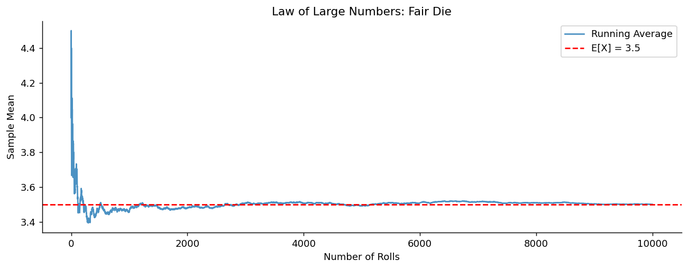

# 큰수의 법칙

앞의 네 절에서 도구를 갖추었다. 이제 통계학이 실제로 던지는 물음을 물을 차례다. **관측을 많이 모으면 무슨 일이 벌어지는가?**

동전을 100번 던지면 앞면 비율이 0.5에 가까워지리라 기대한다. 여론조사에서 사람을 많이 물을수록 결과가 정확해지리라 믿는다. 이 믿음이 옳은가, 그리고 어떤 의미에서 옳은가를 정확히 말해 주는 것이 **큰수의 법칙**이다.

이 절은 세 개의 정리로 이루어진다. 왜 표본평균이 참값 주위로 모여드는지(정리 1), 그 수렴을 확률로 말하는 형태(정리 2), 그리고 표본경로 자체가 수렴한다는 더 강한 형태(정리 3)이다.

## 1. 표본을 늘리면 퍼짐이 줄어든다

큰수의 법칙의 뿌리는 이미 3.4절에 있다. 표본평균의 분산이 $n$에 반비례한다는 사실이다.

<div class="thmbox" markdown>

### 정리 1. 표본평균의 분산 — 표본이 커지면 퍼짐이 0으로 간다 { .thm }

평균 $\mu$, 분산 $\sigma^2$인 i.i.d. 확률변수 $X_1, \ldots, X_n$에 대해

$$
E[\bar X] = \mu, \qquad \text{Var}(\bar X) = \frac{\sigma^2}{n}
$$

이다. 따라서 $n \to \infty$일 때 $\text{Var}(\bar X) \to 0$이다.

</div>

??? proof "증명"

    앞 절의 결과를 그대로 쓴 것이다. 기댓값은 선형성(3.4절 정리 3)에서, 분산은 독립이면 합의 분산이 분산의 합이라는 성질(3.4절 정리 3)에서 나온다.

    $$
    \text{Var}(\bar X) = \frac{1}{n^2}\text{Var}\!\left(\sum_i X_i\right) = \frac{1}{n^2}\cdot n\sigma^2 = \frac{\sigma^2}{n}
    $$

    여기에 체비쇼프 부등식을 적용하면 큰수의 법칙이 거의 곧바로 나온다.

    $$
    P\big(|\bar X - \mu| \ge \varepsilon\big) \le \frac{\text{Var}(\bar X)}{\varepsilon^2} = \frac{\sigma^2}{n\varepsilon^2} \longrightarrow 0
    $$

    $\square$

**중심은 그대로이고 퍼짐만 줄어든다.** 이것이 큰수의 법칙의 전부이며, 나머지는 "수렴"의 뜻을 얼마나 강하게 요구하느냐의 문제다.

## 2. 벗어날 확률이 0으로 간다

수렴을 말하는 첫 번째 방식은 각 $n$에서 "크게 벗어날 확률"을 재는 것이다.

<div class="thmbox" markdown>

### 정리 2. 약한 큰수의 법칙 — 확률수렴 { .thm }

평균 $\mu$가 유한한 i.i.d. 확률변수 $X_1, X_2, \ldots$에 대해 표본평균은 $\mu$로 **확률수렴**한다.

$$
\bar X = \frac{S_n}{n} \xrightarrow{\;P\;} \mu \qquad (n \to \infty)
$$

즉 고정된 임의의 $\varepsilon > 0$에 대해

$$
P\!\left(\left|\frac{S_n}{n} - \mu\right| > \varepsilon\right) \longrightarrow 0
$$

이다.

</div>

읽는 법이 중요하다. "$n$을 충분히 크게 잡으면 표본평균이 $\mu$에서 $\varepsilon$ 이상 벗어날 확률을 원하는 만큼 작게 만들 수 있다"는 뜻이다. 확률이 작아진다는 것이지 **0이 된다는 것은 아니다.**

정리 1에서 분산을 가정했지만, 실제로는 **평균만 유한하면** 약한 큰수의 법칙이 성립한다(분산이 무한해도 된다). 증명은 더 정교한 도구가 필요하다.

<div class="codebox" markdown>

**예제 1.** 표본평균이 참 평균으로 수렴하는 모습

```python
import numpy as np
import matplotlib.pyplot as plt

np.random.seed(42)

# 주사위를 1만 번 굴리고 "여태까지의 평균"을 매 시점 기록한다.
n_rolls = 10_000
rolls = np.random.randint(1, 7, size=n_rolls)

# cumsum(누적합)을 1, 2, 3, ... 로 나누면 각 시점까지의 평균이 된다.
# running_avg[k] = 처음 k+1번의 평균
# 반복문 없이 한 줄로 1만 개의 평균을 얻는 요령이다.
running_avg = np.cumsum(rolls) / np.arange(1, n_rolls + 1)

fig, ax = plt.subplots(figsize=(12, 4))
ax.plot(running_avg, alpha=0.8, label='Running Average')
# 참 기댓값 (1+2+3+4+5+6)/6 = 3.5. 큰수의 법칙은 곡선이 이 선에 붙는다고 말한다.
ax.axhline(y=3.5, color='r', linestyle='--', label='E[X] = 3.5')
ax.set_xlabel('Number of Rolls')
ax.set_ylabel('Sample Mean')
ax.set_title('Law of Large Numbers: Fair Die')
ax.legend()
ax.spines[['top', 'right']].set_visible(False)
plt.show()
```



초반에는 크게 출렁이다가 점차 3.5에 붙는다. 출렁임의 폭이 $1/\sqrt n$으로 줄어드는 것이 눈에 보인다.

</div>

!!! warning "도박사의 오류: 큰수의 법칙은 균형을 맞춰 주지 않는다"
    동전을 100번 던져 앞면이 40번뿐이었다면, 앞으로 앞면이 더 자주 나와 균형을 맞출까?

    **아니다.** 동전에는 기억이 없다. 이후의 던지기는 여전히 50 대 50이다.

    그러면 어떻게 비율이 0.5로 수렴하는가? **차이가 메워지는 것이 아니라 희석되는 것이다.** 앞면과 뒷면의 개수 차이 $|S_n - n/2|$는 오히려 $\sqrt n$의 속도로 **커진다**. 다만 그 차이를 $n$으로 나눈 비율이 0으로 갈 뿐이다.

    $$
    \frac{|S_n - n/2|}{n} \sim \frac{\sqrt n}{n} = \frac{1}{\sqrt n} \to 0
    $$

    부족한 10번은 영영 메워지지 않는다. 10,000번을 더 던지면 그 10번이 전체에서 차지하는 몫이 무시할 만해질 뿐이다. 이 절 뒤의 **도박사의 역설** 페이지에서 이 구조를 더 파고든다.

## 3. 표본경로 자체가 수렴한다

약한 법칙은 각 $n$마다 확률을 재는 진술이다. 더 강하게 말할 수도 있다. 하나의 실험을 무한히 이어 갈 때 그 **수열 자체가** 수렴하는가?

<div class="thmbox" markdown>

### 정리 3. 강한 큰수의 법칙 — 거의 확실한 수렴 { .thm }

같은 조건에서 표본평균은 $\mu$로 **거의 확실하게** 수렴한다.

$$
\bar X = \frac{S_n}{n} \xrightarrow{\;\text{a.s.}\;} \mu
$$

즉

$$
P\!\left(\omega \in \Omega : \frac{S_n(\omega)}{n} \to \mu\right) = 1
$$

이다.

</div>

**두 법칙의 차이.** 약한 법칙은 "각 $n$에서 벗어나 있을 확률이 작다"고 말한다. 표본경로가 이따금 크게 벗어났다가 돌아오기를 무한히 반복해도 약한 법칙과 모순되지 않는다.

강한 법칙은 그런 일이 (확률 1로) 일어나지 않는다고 말한다. 실험을 한 번 시작해 무한히 이어 가면, **그 하나의 수열이 수학적 의미에서 $\mu$로 수렴한다**. 어느 시점 이후로는 영영 $\varepsilon$ 안에 머문다.

"거의 확실하게"라는 단서는 3.1절에서 본 그것이다. 수렴하지 않는 표본경로가 존재할 수는 있지만(예: 언제나 앞면만 나오는 경로) 그 집합의 확률이 0이다. **확률 0은 불가능이 아니다.**

강한 법칙이 가산가법성 공리(3.2절 정리 3)를 필요로 하는 이유도 여기 있다. "수렴한다"는 사건은 가산 개의 사건으로 표현되며, 유한 가법성만으로는 그 확률을 다룰 수 없다.

## 연습문제

<div class="drillbox" markdown>

**연습문제 1.** <span class="diff easy" title="쉬움"></span>
$X_i \sim \mathrm{Uniform}(0,1)$이 i.i.d.다. (a) $\mathbb{E}[X]$, $\mathrm{Var}(X)$는? (b) $\bar X_n$에 대한 약한 큰수의 법칙을 진술하라. (c) $P(|\bar X_{100} - 1/2| \ge 0.05)$에 대한 체비쇼프 한계를 구하라. (d) $n = 10\,000$일 때의 한계를 구하라.

</div>

??? success "풀이"
    (a) $\mathbb{E}[X] = 1/2$, $\mathrm{Var}(X) = 1/12$.

    (b) 모든 $\varepsilon > 0$에 대해 $n \to \infty$일 때 $P(|\bar X_n - 1/2| \ge \varepsilon) \to 0$이다.

    (c) $\mathrm{Var}(\bar X_n) = 1/(12n)$이다. 체비쇼프: $P(|\bar X_{100} - 1/2| \ge 0.05) \le (1/1200)/(0.05)^2 = (1/1200)/0.0025 = 1/3 \approx 0.333$.

    (d) $n = 10\,000$이면 한계 $= (1/120000)/0.0025 = 1/300 \approx 0.00333$이다. $n$이 100배가 되면 한계가 100분의 1로 줄어 $O(1/n)$ 수렴을 확인해 준다. 실제 확률은 훨씬 작다(체비쇼프는 평균과 분산만 쓰며 균등분포는 최악의 경우와 거리가 멀다). 중심극한정리에 근거한 정규근사가 더 촘촘한 추정을 준다.

<div class="drillbox" markdown>

**연습문제 2.** <span class="diff med" title="중간"></span>
$\mathbb{E}[X] = \mu$이고 $\mathrm{Var}(X) = \sigma^2$이 유한한 i.i.d. $X_i$에 대해 체비쇼프 부등식으로부터 **약한 큰수의 법칙을 증명하라**.

</div>

??? success "풀이"
    체비쇼프: $P(|\bar X_n - \mu| \ge \varepsilon) \le \mathrm{Var}(\bar X_n)/\varepsilon^2 = \sigma^2/(n\varepsilon^2)$.

    고정된 임의의 $\varepsilon > 0$에 대해 $n \to \infty$이면 우변이 $\to 0$이므로 $\bar X_n \to \mu$가 확률수렴한다. $\square$

    이 증명은 콜모고로프의 강한 법칙 조건 전부가 아니라 유한 분산만 요구한다는 점에 유의하라. 약한 법칙은 (특성함수를 쓰는 더 섬세한 증명으로) 1차 적률만 유한해도 성립하도록 강화할 수 있으며, 힌친의 약한 큰수의 법칙이 그렇게 한다.

<div class="drillbox" markdown>

**연습문제 3.** <span class="diff hard" title="어려움"></span>
**확률수렴과 거의 확실한 수렴을 구별하라.** $X_n \to 0$이 확률수렴하지만 거의 확실하게는 수렴하지 **않는** 열을 구성하라.

</div>

??? success "풀이"
    고전적인 "움직이는 블록" 예다. 균등측도를 갖는 $\Omega = [0, 1]$ 위에서 다음과 같이 정의한다.

    - $X_1 = \mathbf 1_{[0, 1]}$
    - $X_2 = \mathbf 1_{[0, 1/2]}$, $X_3 = \mathbf 1_{[1/2, 1]}$
    - $X_4 = \mathbf 1_{[0, 1/4]}$, $X_5 = \mathbf 1_{[1/4, 1/2]}$, $X_6 = \mathbf 1_{[1/2, 3/4]}$, $X_7 = \mathbf 1_{[3/4, 1]}$
    - ... (길이 $1/2^k$인 구간들이 $[0,1]$을 덮도록 계속한다)

    그러면 $P(X_n \ne 0) = $ 지시구간의 길이 $\to 0$이므로 $X_n \to 0$이 확률수렴한다.

    그러나 **모든** $\omega \in [0, 1]$에 대해 $X_n(\omega) = 1$이 무한히 자주 일어난다(모든 길이 척도가 모든 $\omega$를 지나간다). 따라서 어떤 $\omega$에서도 $X_n(\omega) \not\to 0$이며 거의 확실한 수렴이 모든 점에서 실패한다.

    약한 법칙은 확률수렴을, 강한 법칙은 더 강한 거의 확실한 수렴을 준다. 개별 표본 경로에서의 행동이 두 체제에서 다를 수 있다.

<div class="drillbox" markdown>

**연습문제 4.** <span class="diff med" title="중간"></span>
**수렴 속도.** 평균 $\mu$, 분산 $\sigma^2$인 i.i.d. $X_i$에 대해 $\sqrt n (\bar X_n - \mu) = O_P(1)$임을 보여라. 이것이 왜 거의 확실한 수렴에는 *충분히 빠르지 않은가*?

</div>

??? success "풀이"
    중심극한정리에 의해 $\sqrt n (\bar X_n - \mu) \xrightarrow{d} N(0, \sigma^2)$이므로 이 열은 조밀(확률적으로 유계)하며, 즉 $O_P(1)$이다.

    $\bar X_n - \mu$에 대한 함의: 이는 $O_P(n^{-1/2})$로 $1/\sqrt n$의 속도로 줄어든다.

    **$1/\sqrt n$이 거의 확실한 수렴에 충분히 빠르지 않은 이유:** $\bar X_n - \mu$의 무작위 변동은 표준편차가 $\sigma/\sqrt n$인 대략 가우시안이다. $n_0 \le n \le 2 n_0$에 대한 최댓값은 $\sqrt{\log n_0}/\sqrt{n_0}$처럼 커지므로, $\sqrt n (\bar X_n - \mu)$이 임의로 큰 값을 무한히 자주 방문한다(**반복로그의 법칙**: 거의 확실하게 $\limsup \sqrt n (\bar X_n - \mu) / \sqrt{2\sigma^2 \log\log n} = 1$).

    거의 확실한 수렴은 편차가 확률적으로 작아지는 데 그치지 않고 이후의 모든 $n$에 대해 결국 작게 유지되기를 요구한다. 더 강한 조건(예: 4차 적률의 유계성, 또는 에테마디의 증명에 따르면 1차 적률의 유계성만으로도)이 필요하다.

<div class="drillbox" markdown>

**연습문제 5.** <span class="diff med" title="중간"></span>
**코시분포에서는 큰수의 법칙이 실패한다.** 표준 코시분포의 밀도는 $f(x) = 1/(\pi(1+x^2))$이다. $\mathbb{E}[X]$가 정의되지 않는 이유는 무엇이며, $n \to \infty$일 때 $\bar X_n$은 어떻게 되는가?

</div>

??? success "풀이"
    $\mathbb{E}[X] = \int x \, f(x) \, dx$가 정의되려면 적분이 수렴해야 한다. 코시분포에서는 $\int_0^\infty x/(1+x^2) \, dx = (1/2) \ln(1 + x^2) |_0^\infty = \infty$이다. 양의 부분과 음의 부분이 모두 발산하므로 $\mathbb{E}[X]$가 정의되지 않는다(단지 무한한 것이 아니라 형식적으로도 잘 정의되지 않는다).

    **$\bar X_n$의 행동:** 코시분포에서 표본평균 $\bar X_n$은 개별 $X_i$ 하나와 *같은 분포*를 갖는다. 평균에 대한 코시의 안정성 때문이다(코시 $n$개의 합은 코시의 $n$배이고 이를 $n$으로 나누면 다시 코시가 된다). 따라서 $n$이 커져도 $\bar X_n$은 집중되지 *않으며* 모든 $n$에 대해 두꺼운 꼬리를 갖는다.

    교훈: 큰수의 법칙은 유한한 평균을 요구한다. 꼬리가 두꺼운 분포는 표본평균이 불안정할 수 있으며, 관측값을 아무리 많이 평균 내도 하나를 보는 것보다 나을 게 없다. 실무에서 이는 극단값이 흔한 분야(금융, 네트워크 트래픽)의 추정량에 영향을 주며, 평균이 정의되지 않을 때에도 잘 정의된 모집단 대응물을 갖는 강건한 대안(중앙값, 절단평균)을 쓸 동기가 된다.

<div class="drillbox" markdown>

**연습문제 6.** <span class="diff med" title="중간"></span>
**약한 큰수의 법칙은 빈도주의 확률을 정당화한다**: $P(A) = \lim_{n \to \infty} (1/n) \sum_{i=1}^n \mathbf 1(\omega_i \in A)$. 이 극한을 정확히 진술하고, 이것이 왜 확률을 단지 계산하는 것이 아니라 *정의하는* 것인지 설명하라.

</div>

??? success "풀이"
    $\Omega$에서 뽑은 i.i.d. 표본에 대해 $X_i = \mathbf 1(\omega_i \in A)$라 하자. 그러면 $\mathbb{E}[X_i] = P(A)$이고 $\mathrm{Var}(X_i) = P(A)(1 - P(A)) < \infty$이다. 약한 큰수의 법칙에 의해

    $$
    \frac{1}{n}\sum_{i=1}^n X_i \xrightarrow{P} P(A)
    $$

    이므로 장기 빈도가 확률로 수렴한다.

    **왜 계산이 아니라 *정의*인가:** **빈도주의 해석**에서 확률은 장기 빈도로 정의된다. 그러면 약한 큰수의 법칙은 동어반복이 된다. $P$를 그 극한으로 두었으므로 극한이 존재하는 것이다. 반면 공리적 측도론(콜모고로프)에서 확률은 공리를 만족하는 집합함수이고, 약한 큰수의 법칙은 빈도주의적 직관을 공리와 잇는 정리가 된다.

    실용적 쓰임: 그래서 자료에서 표본비율을 계산해 $P(A)$를 추정할 수 있다. 약한 큰수의 법칙이 그 추정이 일치성을 가짐을, 즉 $n$이 커지면 참값으로 수렴함을 보장한다. 큰수의 법칙이 없으면 빈도주의 통계학에는 형식적 정당화가 없다.

<div class="drillbox" markdown>

**연습문제 7.** <span class="diff hard" title="어려움"></span>
연습문제 $2$의 증명은 **유한한 분산**을 썼다. 그런데 강한 큰수의 법칙은 $\mathbb{E}|X|<\infty$만 요구한다. **분산이 무한한데 평균은 유한한** 분포에서 무슨 일이 일어나는지 조사하라.

</div>

??? success "풀이"
    **콜모고로프의 강한 큰수의 법칙.** $X_i$가 i.i.d.이고 $\mathbb{E}|X|<\infty$이면 $\bar X_n \to \mu$가 거의 확실히 성립한다. **분산은 전혀 필요 없다.** 체비쇼프 증명은 편했을 뿐 필수가 아니었다.

    파레토분포 $P(X>x)=x^{-\alpha}$($x\ge1$)에서

    | $\alpha$ | 평균 | 분산 |
    |---|---|---|
    | $\alpha>2$ | 유한 | 유한 |
    | $1<\alpha\le2$ | 유한 | **무한** |
    | $\alpha\le1$ | 무한 | 무한 |

    $\alpha=1.5$면 평균은 $3$인데 분산이 무한하다. 큰수의 법칙은 성립하지만 **얼마나 느린가?**

    ```python
    import numpy as np

    rng = np.random.default_rng(0)
    print("표본평균의 흩어짐 (각 n마다 200회 반복한 사분위범위)")
    print(f"{'n':>9}{'파레토 a=1.5':>16}{'지수 (평균 3)':>16}{'배수':>8}")
    for n in (10 ** 3, 10 ** 4, 10 ** 5, 10 ** 6):
        pa = np.array([rng.pareto(1.5, n).mean() + 1 for _ in range(200)])
        ex = np.array([rng.exponential(3.0, n).mean() for _ in range(200)])
        iqr = lambda v: np.subtract(*np.percentile(v, [75, 25]))
        print(f"{n:>9}{iqr(pa):>16.5f}{iqr(ex):>16.5f}{iqr(pa)/iqr(ex):>8.1f}")
    ```

    출력:

    ```
    표본평균의 흩어짐 (각 n마다 200회 반복한 사분위범위)
            n       파레토 a=1.5       지수 (평균 3)      배수
         1000         0.38012         0.12907     2.9
        10000         0.17643         0.03738     4.7
       100000         0.09132         0.01276     7.2
      1000000         0.03894         0.00396     9.8
    ```

    **둘 다 수렴하지만 속도가 다르다.**

    | $n$ 10배 증가 | 파레토의 감소 배수 | 지수의 감소 배수 |
    |---|---|---|
    | $10^3\to10^4$ | $2.15$ | $3.45$ |
    | $10^4\to10^5$ | $1.93$ | $2.93$ |
    | $10^5\to10^6$ | $2.35$ | $3.22$ |

    **지수분포는 $\sqrt{10}=3.16$배씩, 파레토는 $10^{1/3}=2.15$배씩 줄어든다.** 이론값과 정확히 맞는다. 일반적으로 $1<\alpha<2$인 파레토에서 표본평균의 오차는

    $$
    \bar X_n - \mu = O_P\!\left(n^{1/\alpha - 1}\right)
    $$

    이며, $\alpha=1.5$면 $n^{-1/3}$이다. **연습문제 $4$의 $n^{-1/2}$보다 느리다.**

    **실무적 함의가 크다.** $n=10^6$에서 파레토의 흩어짐이 지수의 **$9.8$배**다. 지수분포에서 표본을 $10$배 늘려 얻는 만큼($3.16$배 개선)을 파레토에서 얻으려면 $n^{1/3}=3.16$, 곧 **표본을 약 $32$배** 늘려야 한다.

    **그리고 중심극한정리는 아예 적용되지 않는다.** 분산이 무한하므로 $\sqrt n(\bar X_n-\mu)$는 정규분포로 가지 않는다(clt 문서 연습문제 $6$의 안정분포). **평균은 믿을 수 있지만 그 평균의 신뢰구간은 표준 공식으로 만들 수 없다.** $\square$

<div class="drillbox" markdown>

**연습문제 8.** <span class="diff med" title="중간"></span>
큰수의 법칙을 **수치적분 방법**으로 뒤집어 읽어라. 몬테카를로 적분의 오차가 왜 차원과 무관한지 보이고, 그 주장의 **한계**도 밝혀라.

</div>

??? success "풀이"
    $I=\int_{[0,1]^d}f(\mathbf{x})\,d\mathbf{x}=\mathbb{E}[f(\mathbf{U})]$이므로, $\mathbf{U}_i$를 뽑아 $\hat I_n=\frac1n\sum_i f(\mathbf{U}_i)$로 추정한다. 큰수의 법칙이 $\hat I_n\to I$를 보장하고, 오차는

    $$
    \hat I_n - I = O_P\!\left(\frac{\sigma_f}{\sqrt n}\right),\qquad \sigma_f^2=\operatorname{Var}(f(\mathbf U))
    $$

    **지수 $-1/2$에 $d$가 들어 있지 않다.** 반면 격자를 쓰면 축마다 $m$개의 점이 필요해 총 $m^d$개, 즉 **차원의 저주**를 그대로 맞는다.

    ```python
    import numpy as np
    from scipy import integrate

    rng = np.random.default_rng(0)
    c = integrate.quad(lambda t: np.exp(-t ** 2), 0, 1)[0]   # I_d = c^d
    print(f"I_d = ∫_[0,1]^d exp(-|x|^2) dx = c^d,   c = {c:.6f}\n")

    print(f"{'d':>4}{'참값':>12}{'몬테카를로 n=10^5':>20}{'상대오차':>11}{'격자 점 수':>14}")
    for d in (1, 3, 10, 30, 100):
        U = rng.random((100_000, d))
        est = np.exp(-(U ** 2).sum(1)).mean()
        print(f"{d:>4}{c ** d:>12.3e}{est:>20.3e}{abs(est - c ** d) / c ** d:>11.2%}"
              f"{'10^' + str(d):>14}")

    print("\n피적분함수의 변동계수 (오차 상수를 결정한다)")
    for d in (1, 10, 100):
        v = np.exp(-(rng.random((200_000, d)) ** 2).sum(1))
        print(f"  d={d:>3}: sd/mean = {v.std() / v.mean():>8.4f}")
    ```

    출력:

    ```
    I_d = ∫_[0,1]^d exp(-|x|^2) dx = c^d,   c = 0.746824

       d          참값        몬테카를로 n=10^5       상대오차        격자 점 수
       1   7.468e-01           7.471e-01      0.04%          10^1
       3   4.165e-01           4.165e-01      0.00%          10^3
      10   5.397e-02           5.379e-02      0.34%         10^10
      30   1.572e-04           1.579e-04      0.41%         10^30
     100   2.098e-13           1.925e-13      8.23%        10^100

    피적분함수의 변동계수 (오차 상수를 결정한다)
      d=  1: sd/mean =   0.2690
      d= 10: sd/mean =   1.0087
      d=100: sd/mean =  21.3544
    ```

    **$d=30$까지는 $10^5$개의 표본으로 $0.4\%$ 오차를 낸다.** 격자로 축당 $10$점만 잡아도 $10^{30}$개가 필요하다 — 우주의 나이 동안에도 끝나지 않는다.

    **그런데 $d=100$에서 오차가 $8.2\%$로 튄다.** 차원과 무관한 것은 **지수 $-1/2$이지 상수 $\sigma_f$가 아니다.** 변동계수가 $d=1$에서 $0.27$, $d=10$에서 $1.01$, $d=100$에서 **$21.4$**로 커진다.

    !!! warning "차원 무관은 절반의 진실이다"
        수렴 **속도**는 $n^{-1/2}$로 고정이지만, 그 앞의 상수 $\sigma_f$는 차원에 따라 얼마든지 커질 수 있다. 고차원에서 $f$가 아주 좁은 영역에 집중되면 무작위 점 대부분이 $f\approx0$인 곳에 떨어지고, 추정은 **몇 개의 운 좋은 점**이 좌우한다.

    **처방이 곧 몬테카를로 방법론의 전부다.**

    | 기법 | 하는 일 |
    |---|---|
    | 중요도 표집 | $f$가 큰 곳에서 더 많이 뽑아 $\sigma_f$를 줄인다 |
    | 대조변량 | 참값을 아는 상관된 양을 빼서 분산을 줄인다 |
    | 층화 표집 | 영역을 나눠 각 층에서 고르게 뽑는다 |
    | 준몬테카를로 | 저불일치 수열로 $n^{-1}$에 가깝게 만든다 |
    | MCMC | 목표분포에서 직접 뽑는다(고차원 베이즈) |

    **모두 $\sigma_f$를 공격한다.** $n^{-1/2}$는 큰수의 법칙이 준 것이라 바꿀 수 없기 때문이다. $\square$

<div class="drillbox" markdown>

**연습문제 9.** <span class="diff med" title="중간"></span>
큰수의 법칙은 **독립**을 가정한다. 관측이 서로 상관되어 있으면 어떻게 되는가? AR(1) 시계열로 확인하라.

</div>

??? success "풀이"
    독립이 아니어도 상관이 충분히 빨리 사라지면 큰수의 법칙은 살아남는다(**에르고드 정리**). 다만 **정밀도가 떨어진다.**

    $X_t=\phi X_{t-1}+\varepsilon_t$($|\phi|<1$)에서 정상상태의 표본평균 분산은

    $$
    \operatorname{Var}(\bar X_n)\approx\frac{\gamma_0}{n}\cdot\frac{1+\phi}{1-\phi}
    $$

    이다. 독립일 때의 $\gamma_0/n$에 **$(1+\phi)/(1-\phi)$라는 벌점**이 붙는다. 이를 뒤집으면 **유효표본크기**

    $$
    n_{\text{eff}} = n\cdot\frac{1-\phi}{1+\phi}
    $$

    ```python
    import numpy as np

    def ar1(n, phi, rng):
        e = rng.normal(0, 1, n)
        x = np.empty(n)
        x[0] = e[0] / np.sqrt(1 - phi ** 2)          # 정상분포에서 출발
        for i in range(1, n):
            x[i] = phi * x[i - 1] + e[i]
        return x

    rng = np.random.default_rng(0)
    n = 10_000
    print(f"{'phi':>6}{'표본평균 sd':>15}{'독립 가정 sd':>15}{'실제 n_eff':>13}{'이론 n_eff':>13}")
    for phi in (0.0, 0.5, 0.9, 0.99):
        m = np.array([ar1(n, phi, rng).mean() for _ in range(300)])
        sd_indep = np.sqrt(1 / (1 - phi ** 2) / n)
        print(f"{phi:>6.2f}{m.std():>15.5f}{sd_indep:>15.5f}"
              f"{n * (sd_indep / m.std()) ** 2:>13.1f}"
              f"{n * (1 - phi) / (1 + phi):>13.1f}")
    ```

    출력:

    ```
    phi        표본평균 sd       독립 가정 sd     실제 n_eff     이론 n_eff
      0.00        0.01011        0.01000       9789.6      10000.0
      0.50        0.01995        0.01155       3350.6       3333.3
      0.90        0.09962        0.02294        530.4        526.3
      0.99        1.03067        0.07089         47.3         50.3
    ```

    **공식이 정확히 맞는다.** $\phi=0.99$면 관측 $10\,000$개가 **독립 관측 약 $50$개의 값어치**밖에 없다. $200$배의 낭비다.

    **큰수의 법칙 자체는 무사하다.** $\phi=0.99$여도 $n\to\infty$면 $\bar X_n\to0$이다. 깨지는 것은 **속도와 오차 평가**다.

    **위험한 것은 독립을 가정한 오차 계산이다.** $\phi=0.9$인 자료에 $s/\sqrt n$을 그대로 쓰면 표준오차를 $\sqrt{10000/526}=4.4$배 과소평가한다. 신뢰구간이 $4.4$배 좁아지고, 검정은 있지도 않은 유의성을 남발한다.

    **어디서 만나는가.**

    | 상황 | 상관의 출처 |
    |---|---|
    | 시계열 관측 | 시간적 자기상관 |
    | MCMC 표본 | 연쇄의 자기상관 |
    | 군집표본(학급·마을) | 집단 내 유사성 |
    | 공간 자료 | 가까운 곳끼리 닮음 |
    | 반복측정 | 같은 개인의 반복 |

    **처방.** MCMC에서는 유효표본크기를 언제나 함께 보고하고(`arviz`의 `ess`), 시계열 회귀에서는 뉴이–웨스트 표준오차를, 군집자료에서는 군집 강건 표준오차를 쓴다. **모두 $(1+\phi)/(1-\phi)$에 해당하는 벌점을 자료에서 추정해 되돌려 놓는 장치다.**

    **$\phi\to1$이면 무너진다.** $\phi=1$은 확률보행이고 정상성이 없어 $\bar X_n$이 아무 데도 수렴하지 않는다. 단위근 검정이 중요한 이유다. $\square$

<div class="drillbox" markdown>

**연습문제 10.** <span class="diff hard" title="어려움"></span>
$\theta$마다 큰수의 법칙이 성립한다고 하자. 그러면 $\hat\theta_n=\arg\max_\theta Q_n(\theta)$도 $\arg\max_\theta Q(\theta)$로 수렴하는가? **아니다.** 반례를 들고, 무엇이 더 필요한지 밝혀라.

</div>

??? success "풀이"
    ```python
    import numpy as np
    from scipy.special import logsumexp

    grid = np.linspace(-2, 60, 200_001)
    Q = -grid ** 2 / (1 + grid ** 2)                       # 최대는 t=0
    print("Q(t) = -t^2/(1+t^2),   Q_n(t) = Q(t) + 3 exp(-4 (t-n)^2)")
    for n in (5, 10, 50):
        Qn = Q + 3 * np.exp(-4 * (grid - n) ** 2)
        print(f"  n={n:>3}:  argmax Q_n = {grid[Qn.argmax()]:>6.2f}")
    print(f"  참 argmax Q = {grid[Q.argmax()]:.2f}"
          f"   (그런데 고정된 t 마다 Q_n(t) -> Q(t) 이다)")

    rng = np.random.default_rng(0)
    x = rng.normal(0, 1, 20)

    def loglik(mu1, s1, mu2=0.0, s2=1.0, w=0.5):
        lp = np.log(2 * np.pi) / 2
        a = np.log(w) - np.log(s1) - lp - 0.5 * ((x - mu1) / s1) ** 2
        b = np.log(1 - w) - np.log(s2) - lp - 0.5 * ((x - mu2) / s2) ** 2
        return logsumexp(np.vstack([a, b]), axis=0).sum()

    print("\n혼합 0.5 N(mu1, s1^2) + 0.5 N(0, 1),  자료 20개 ~ N(0,1)")
    print(f"  정직한 해 (mu1=0, s1=1):  로그가능도 {loglik(0.0, 1.0):>9.2f}")
    print(f"{'s1':>10}{'로그가능도':>16}   <- mu1 을 자료점 하나에 고정")
    for s1 in (1e-1, 1e-3, 1e-6, 1e-10, 1e-20):
        print(f"{s1:>10.0e}{loglik(x[0], s1):>16.2f}")
    ```

    출력:

    ```
    Q(t) = -t^2/(1+t^2),   Q_n(t) = Q(t) + 3 exp(-4 (t-n)^2)
      n=  5:  argmax Q_n =   5.00
      n= 10:  argmax Q_n =  10.00
      n= 50:  argmax Q_n =  50.00
      참 argmax Q = 0.00   (그런데 고정된 t 마다 Q_n(t) -> Q(t) 이다)

    혼합 0.5 N(mu1, s1^2) + 0.5 N(0, 1),  자료 20개 ~ N(0,1)
      정직한 해 (mu1=0, s1=1):  로그가능도    -25.95
            s1           로그가능도   <- mu1 을 자료점 하나에 고정
         1e-01          -31.94
         1e-03          -32.90
         1e-06          -25.99
         1e-10          -16.78
         1e-20            6.24
    ```

    **첫 반례: 봉우리가 도망간다.** 각 $t$를 고정하면 $3e^{-4(t-n)^2}\to0$이므로 $Q_n(t)\to Q(t)$가 **모든 $t$에서** 성립한다. 그런데 $Q_n$의 최댓값은 $t=n$에 있어 $\arg\max$가 $\infty$로 달아난다. **점별 수렴은 최댓값의 위치를 통제하지 못한다.**

    **둘째 반례는 실제 통계 문제다.** 정규혼합의 가능도는 $\mu_1$을 자료점 하나에 고정하고 $\sigma_1\to0$으로 보내면 **$+\infty$로 발산한다.** $\sigma_1=10^{-6}$에서 이미 정직한 해($-25.95$)를 넘어서고, $10^{-20}$에서 $+6.24$다. 최대가능도추정량이 **존재하지 않는다.**

    **무엇이 부족한가.** 두 가지를 더 요구해야 한다.

    | 조건 | 하는 일 | 위 반례에서 |
    |---|---|---|
    | **균등수렴** $\sup_\theta\lvert Q_n-Q\rvert\to0$ | 봉우리가 어디에도 숨지 못하게 | 첫 반례가 위반 |
    | **모수공간의 컴팩트성** | $\arg\max$가 달아나지 못하게 | 첫 반례가 위반 |
    | **$Q$의 유일한 최대** (식별가능성) | 극한이 하나로 정해지게 | — |
    | **가능도의 유계성** | 발산하는 방향을 차단 | 둘째 반례가 위반 |

    이 조건들이 갖춰지면 $\hat\theta_n\xrightarrow{p}\theta_0$가 따라온다. 이것이 **최대가능도추정량의 일치성 정리**(6장)의 실제 내용이며, 조건이 붙어 있는 이유가 바로 이 반례들이다.

    **실무에서는 어떻게 넘어가는가.** 혼합모형의 EM 알고리즘은 $\sigma\ge\epsilon$이라는 하한을 두거나, 분산에 사전분포를 주어(베이즈) 특이점을 없앤다. 어느 쪽이든 **가능도를 유계로 만드는 것**이 요점이다.

    **교훈.** "각 점에서 수렴한다"와 "함수로서 수렴한다"는 다르며, **추정은 후자를 요구한다.** 추정량이 $Q_n$ 전체의 모양에 의존하기 때문이다. $\square$


## 정리하며

큰수의 법칙은 "자료를 많이 모으면 참값에 가까워진다"는 상식에 정확한 형태를 준다.

- **정리 1**은 그 이유를 밝혔다. 표본평균의 중심은 그대로이고 퍼짐만 $\sigma^2/n$으로 줄어든다.
- **정리 2**(약한 법칙)는 각 $n$에서 크게 벗어날 확률이 0으로 감을 말한다.
- **정리 3**(강한 법칙)은 표본경로 자체가 확률 1로 수렴함을 말한다.

이 정리가 통계학에 주는 것은 **일치성**이다. 표본평균이 모평균의 믿을 만한 추정량이라는 보장이며, 6장 이후 추정량을 평가하는 첫 번째 기준이 된다.

그런데 큰수의 법칙은 한 가지만 말하고 만다. **어디로 가는지**는 말해 주지만 **어떻게 가는지**는 말해 주지 않는다.

$n = 100$에서 표본평균이 $\mu$에서 얼마나 떨어져 있을 가능성이 큰가? 그 오차의 분포는 어떤 모양인가? 이 물음에 답할 수 없으면 신뢰구간도 가설검정도 만들 수 없다.

놀랍게도 답은 **모집단의 모양과 거의 무관하다**. 원래 분포가 무엇이든 표본평균의 오차는 정규분포를 향해 간다. 다음 절의 **중심극한정리**이며, 통계학에서 가장 널리 쓰이는 정리다.
