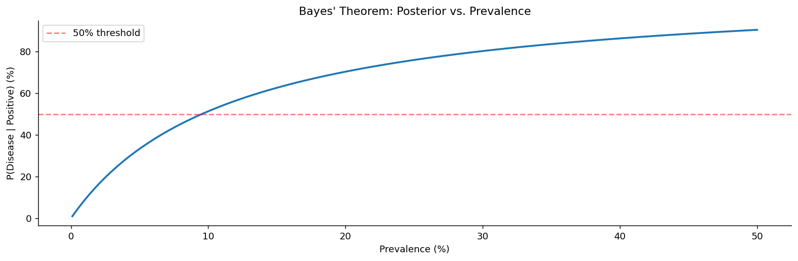

# 베이즈 정리

앞 절에서 확률나무를 **위에서 아래로** 따라 내려왔다. 원인을 알면 결과의 확률을 계산할 수 있었다. 병이 있으면 검사가 양성일 확률, 기계 A가 만들었으면 불량일 확률처럼.

그런데 현실에서 우리가 보는 것은 대개 반대다. 관측되는 것은 **결과**이고 알고 싶은 것은 **원인**이다. 검사가 양성이라는 사실을 보았을 때 병이 있을 확률은 얼마인가? 이메일에 "free"가 있을 때 그것이 스팸일 확률은?

**베이즈 정리**는 이 방향 전환을 해 주는 식이다. 확률나무를 아래에서 위로 거슬러 올라간다.

이 절은 세 개의 정리로 이루어진다. 방향을 뒤집는 식(정리 1), 원인이 여럿일 때의 일반형(정리 2), 그리고 이 식이 왜 그렇게 자주 직관을 배신하는가(정리 3)이다.

## 1. 나무를 거꾸로 거슬러 올라가기

조건부확률의 정의를 두 번 쓰면 곧바로 나온다. $P(A \cap B)$를 두 가지 방식으로 쪼갤 수 있다는 사실이 전부다.

<div class="thmbox" markdown>

### 정리 1. 역방향 조건부확률 — 경로 확률의 비 { .thm }

$P(B) > 0$인 사건 $A$와 $B$에 대해

$$
P(A \mid B) = \frac{P(B \mid A)\,P(A)}{P(B)}
$$

이다. 네 항에는 각각 이름이 붙어 있다.

$$
\underbrace{P(A \mid B)}_{\text{사후확률}} = \frac{\overbrace{P(B \mid A)}^{\text{가능도}} \cdot \overbrace{P(A)}^{\text{사전확률}}}{\underbrace{P(B)}_{\text{증거}}}
$$

</div>

??? proof "유도"

    조건부확률의 정의에서

    $$
    P(A \mid B) = \frac{P(A \cap B)}{P(B)} = \frac{P(B \mid A)\,P(A)}{P(B)}
    $$

    이다. 가운데 등식이 앞 절의 곱셈 규칙이다. 분모는 전확률의 법칙으로 전개하는 것이 보통이다. $\square$

$$
P(B) = P(B \mid A)\,P(A) + P(B \mid A^c)\,P(A^c)
$$

그러면 실제로 계산할 때 쓰는 형태가 된다.

$$
P(A \mid B) = \frac{P(B \mid A)\,P(A)}{P(B \mid A)\,P(A) + P(B \mid A^c)\,P(A^c)}
$$

**이 식은 경로 확률의 비다.** 분자는 $A$를 거쳐 $B$에 닿는 경로의 확률이고, 분모는 $B$에 닿는 **모든** 경로의 확률의 합이다. 즉 "$B$에 도달한 전체 무게 가운데 $A$를 거쳐 온 몫은 얼마인가"를 묻는다.

## 2. 원인이 여럿일 때

원인이 둘($A$와 $A^c$)뿐일 이유는 없다. 항아리가 셋일 수도, 질병 후보가 다섯일 수도 있다. 분모에 경로를 더 넣으면 그만이다.

<div class="thmbox" markdown>

### 정리 2. 베이즈 정리의 일반형 — 분할 위에서의 갱신 { .thm }

$A_1, A_2, \ldots, A_n$이 표본공간 $\Omega$의 분할을 이루면, 각 $i$에 대해

$$
P(A_i \mid B) = \frac{P(B \mid A_i)\,P(A_i)}{\sum_{j=1}^{n} P(B \mid A_j)\,P(A_j)}
$$

이다.

</div>

분모는 $i$에 의존하지 않는다. 그래서 실무에서는 분자만 계산해 두고 마지막에 합이 1이 되도록 나누는 방식을 흔히 쓴다. **사후확률 $\propto$ 가능도 $\times$ 사전확률**이라는 표현이 이 뜻이다.

<div class="exbox" markdown>

**보기 1.** <span class="diff easy" title="쉬움"></span> 항아리에서 공 뽑기. A 항아리에 빨간 공 3개와 파란 공 7개, B 항아리에 빨간 공 8개와 파란 공 2개가 있다. 항아리를 50 대 50으로 골라 빨간 공을 뽑았다. 그것이 B에서 나왔을 확률은?

$$
P(B \mid \text{빨강}) = \frac{0.8 \times 0.5}{0.3 \times 0.5 + 0.8 \times 0.5} = \frac{0.40}{0.55} \approx 0.727
$$

사전확률은 50%였지만 빨간 공을 보고 나서 73%로 올랐다. B가 빨간 공을 더 잘 내놓기 때문이다.

</div>

<div class="exbox" markdown>

**보기 2.** <span class="diff easy" title="쉬움"></span> 스팸 필터링. 이메일의 40%가 스팸이고, "free"라는 단어가 스팸의 80%, 정상 메일의 10%에 나타난다면

$$
P(\text{스팸} \mid \text{"free"}) = \frac{0.80 \times 0.40}{0.80 \times 0.40 + 0.10 \times 0.60} = \frac{0.32}{0.38} \approx 0.842
$$

이다. 단어 하나로 40%에서 84%로 올라간다. 실제 스팸 필터는 이 갱신을 단어마다 반복한다.

</div>

## 3. 드문 일에는 기저율이 이긴다

베이즈 정리가 유명한 것은 식이 어려워서가 아니다. 답이 자주 **직관을 배신하기** 때문이다.

<div class="thmbox" markdown>

### 정리 3. 기저율의 지배 — 사후확률은 사전확률에 붙들린다 { .thm }

사건 $A$가 드물면($P(A)$가 작으면) $P(B \mid A)$가 아무리 커도 $P(A \mid B)$는 작게 남는다. 분자 $P(B \mid A)P(A)$가 작은 $P(A)$에 묶여 있는 반면, 분모의 거짓양성 항 $P(B \mid A^c)P(A^c)$는 큰 $P(A^c)$를 갖기 때문이다.

</div>

<div class="exbox" markdown>

**보기 3.** <span class="diff easy" title="쉬움"></span> 의학 진단. 어떤 질병이 인구의 1%에 발생한다. 검사의 민감도는 95%, 특이도는 90%다. 양성 판정을 받은 사람이 실제로 병에 걸렸을 확률은?

$$
\begin{aligned}
P(\text{질병} \mid \text{양성}) &= \frac{P(\text{양성} \mid \text{질병})\,P(\text{질병})}{P(\text{양성})} \\[6pt]
&= \frac{0.95 \times 0.01}{0.95 \times 0.01 + 0.10 \times 0.99} \\[6pt]
&= \frac{0.0095}{0.1085} \approx 0.0876
\end{aligned}
$$

**8.8%다.** 민감도 95%짜리 검사에서 양성이 나왔는데도 병에 걸렸을 확률이 10분의 1에 못 미친다.

</div>

!!! warning "숫자가 아니라 사람 수로 세어 보라"
    인구 10,000명을 생각하자.

    - 병에 걸린 사람 **100명** 중 95명이 양성 (참양성)
    - 건강한 사람 **9,900명** 중 990명이 양성 (거짓양성)

    양성은 총 1,085명이고 그중 병이 있는 사람은 95명이다. $95/1085 \approx 8.8\%$.

    거짓양성이 참양성의 **10배**인 이유는 검사가 나빠서가 아니라 **건강한 사람이 99배 많기** 때문이다. 10%의 거짓양성률이라도 99배 큰 집단에 곱해지면 압도한다.

    실무적 함의: 드문 질병에 대한 대규모 선별검사는 양성자 대부분이 건강한 사람이 되도록 만든다. 그래서 확진검사를 두 단계로 나누고, 위험군에만 검사하여 사전확률 $P(A)$를 올린다.

유병률이 달라지면 사후확률이 어떻게 움직이는지 그려 보자.

```python
import numpy as np

def bayes_theorem(prior, likelihood, evidence):
    """베이즈 정리:  사후 = (가능도 x 사전) / 증거

    P(H|E) = P(E|H) P(H) / P(E)
    """
    posterior = (likelihood * prior) / evidence
    return posterior

# 의학 진단 예제
prior_disease = 0.01         # 사전확률 P(질병) = 유병률 1%
sensitivity = 0.95           # 가능도 P(양성|질병) = 95%
specificity = 0.90           # 특이도 P(음성|건강) = 90%
false_positive_rate = 1 - specificity     # P(양성|건강) = 10%

# 분모(증거) P(양성)은 전확률의 법칙으로 구한다.
# 두 경로 — 질병이면서 양성, 건강하면서 양성 — 를 더한다.
p_positive = sensitivity * prior_disease + false_positive_rate * (1 - prior_disease)

# 이 분모가 베이즈 정리의 핵심이다. 건강한 사람이 99%나 되므로
# 위양성 10%가 만들어 내는 양성자 수가 진짜 환자보다 훨씬 많아진다.
posterior = bayes_theorem(prior_disease, sensitivity, p_positive)

print(f"P(disease | positive) = {posterior:.4f}")
print(f"Despite a 95% sensitive test, only {posterior*100:.1f}% of positives truly have the disease.")
```

출력:

```
P(disease | positive) = 0.0876
Despite a 95% sensitive test, only 8.8% of positives truly have the disease.
```

```python
import numpy as np
import matplotlib.pyplot as plt

def bayes_update_visualization():
    """검사 성능은 그대로 두고 **유병률만** 바꿔 가며 사후확률을 그린다.

    "같은 검사, 같은 양성 결과인데 사후확률이 왜 달라지는가"에 답하는 그림이다.
    답은 분모에 있다. 유병률이 낮을수록 건강한 사람이 만들어 내는
    위양성이 분모를 지배해 사후확률을 끌어내린다.
    """
    prevalences = np.linspace(0.001, 0.5, 200)   # 0.1%부터 50%까지
    sensitivity = 0.95      # 검사 성능은 끝까지 고정
    specificity = 0.90

    posteriors = []
    for prev in prevalences:
        # 분모: 전확률의 법칙
        p_pos = sensitivity * prev + (1 - specificity) * (1 - prev)
        # 분자: 질병이면서 양성
        post = (sensitivity * prev) / p_pos
        posteriors.append(post)

    fig, ax = plt.subplots(figsize=(12, 4))
    ax.plot(prevalences * 100, np.array(posteriors) * 100, lw=2)
    ax.set_xlabel('Prevalence (%)')
    ax.set_ylabel('P(Disease | Positive) (%)')
    ax.set_title("Bayes' Theorem: Posterior vs. Prevalence")
    # 50% 기준선. 이 선을 넘어야 "양성이면 아플 가능성이 더 크다"고 말할 수 있다.
    ax.axhline(y=50, color='r', linestyle='--', alpha=0.5, label='50% threshold')
    ax.legend()
    ax.spines[['top', 'right']].set_visible(False)
    plt.tight_layout()
    plt.show()

bayes_update_visualization()
```



곡선이 처음에 가파르게 오르는 것에 주목하라. 사후확률이 50%를 넘으려면 유병률이 상당히 높아야 한다. 검사 성능을 올리는 것보다 **검사 대상을 좁히는 것**이 효과적인 이유다.

## 연습문제

<div class="drillbox" markdown>

**연습문제 1.** <span class="diff easy" title="쉬움"></span>
어떤 희귀질환 검사의 유병률이 $P(D) = 0.001$, 민감도가 $P(+ \mid D) = 0.99$, 특이도가 $P(- \mid D^c) = 0.95$다. (a) $P(D \mid +)$를 계산하라. (b) 왜 그렇게 낮은지 설명하라. (c) 유병률이 0.05일 때 다시 계산하라.

</div>

??? success "풀이"
    (a) $P(+) = 0.99 \cdot 0.001 + 0.05 \cdot 0.999 = 0.00099 + 0.04995 = 0.05094$이므로 $P(D \mid +) = 0.00099/0.05094 \approx 0.019$(약 1.9%)이다.

    (b) 질병이 드물다. 1000명 중 건강한 999명에게 5%의 거짓양성 *비율*이 적용되면 거짓양성이 $\approx 50$명 생기는데, 이는 참양성 $\approx 1$명보다 훨씬 많다. 양성 집단이 거짓양성으로 뒤덮인다.

    (c) 유병률이 0.05이면 $P(+) = 0.99 \cdot 0.05 + 0.05 \cdot 0.95 = 0.097$이고 $P(D \mid +) = 0.0495/0.097 \approx 0.510$이다. 사후확률이 2%에서 51%로 뛴다. 가능도비가 같아도 사전확률이 사후확률을 얼마나 강하게 좌우하는지 극명하게 보여준다.

<div class="drillbox" markdown>

**연습문제 2.** <span class="diff med" title="중간"></span>
어떤 공장에 기계 세 대가 있어 생산량의 50%, 30%, 20%를 만들고 불량률은 각각 2%, 3%, 5%다. (a) 전체 불량률을 계산하라. (b) 불량품 하나가 주어졌을 때 그것이 3번 기계에서 나왔을 확률은 얼마인가?

</div>

??? success "풀이"
    (a) $P(D) = 0.02 \cdot 0.50 + 0.03 \cdot 0.30 + 0.05 \cdot 0.20 = 0.010 + 0.009 + 0.010 = 0.029$이다. 전체 불량률은 2.9%다.

    (b) $P(M_3 \mid D) = (0.05 \cdot 0.20)/0.029 = 0.010/0.029 \approx 0.345$이다. 3번 기계는 생산량의 20%만 만들지만 불량의 34.5%를 낸다. 불량률이 평균의 2.5배이기 때문이다.

<div class="drillbox" markdown>

**연습문제 3.** <span class="diff med" title="중간"></span>
조건부확률의 정의에서 **베이즈 정리를 증명하라**. 그런 다음 **승산 형태**를 진술하라: $P(H \mid E)/P(H^c \mid E) = [P(E \mid H)/P(E \mid H^c)] \cdot [P(H)/P(H^c)]$.

</div>

??? success "풀이"
    조건부확률로부터 $P(A \mid B) = P(A \cap B)/P(B)$이고 $P(B \mid A) = P(A \cap B)/P(A)$이다. 따라서 $P(A \cap B) = P(A \mid B) P(B) = P(B \mid A) P(A)$이고

    $$
    P(A \mid B) = \frac{P(B \mid A) P(A)}{P(B)}
    $$

    를 얻는다.

    **승산 형태:** 같은 $E$에 대해 $H$의 베이즈 식을 $H^c$의 베이즈 식으로 나누면

    $$
    \frac{P(H \mid E)}{P(H^c \mid E)} = \frac{P(E \mid H) P(H) / P(E)}{P(E \mid H^c) P(H^c) / P(E)} = \underbrace{\frac{P(E \mid H)}{P(E \mid H^c)}}_{\text{likelihood ratio}} \cdot \underbrace{\frac{P(H)}{P(H^c)}}_{\text{prior odds}}
    $$

    이다.

    **사후승산 = 가능도비 × 사전승산.** 이 형태는 $P(E)$를 계산할 필요가 없어 베이즈 추론, 법정에서의 증거 평가, 의학적 의사결정의 일꾼이 된다.

<div class="drillbox" markdown>

**연습문제 4.** <span class="diff med" title="중간"></span>
어떤 동전은 공정하거나($P = 0.5$) **아니면** 앞면 확률이 $P = 0.7$로 치우쳐 있다. 사전확률은 같다. 10번 던져 앞면이 8번 나오는 것을 관측했다. 이 동전이 치우쳐 있을 사후확률을 계산하라.

</div>

??? success "풀이"
    $B$ = 치우침, $F$ = 공정, $E$ = 10번 중 앞면 8번 관측이라 하자.

    가능도: $P(E \mid F) = \binom{10}{8} 0.5^8 \cdot 0.5^2 = 45 \cdot (0.5)^{10} \approx 0.0439$.

    $P(E \mid B) = \binom{10}{8} 0.7^8 \cdot 0.3^2 = 45 \cdot 0.0576 \cdot 0.09 \approx 0.2335$.

    베이즈(또는 승산 형태)에 의해

    $$
    P(B \mid E) = \frac{P(E \mid B) P(B)}{P(E \mid B) P(B) + P(E \mid F) P(F)} = \frac{0.2335 \cdot 0.5}{0.2335 \cdot 0.5 + 0.0439 \cdot 0.5} = \frac{0.2335}{0.2774} \approx 0.842
    $$

    이다. 동전이 치우쳐 있을 사후확률이 약 84%다.

    승산 형태로도 같은 결과를 바로 얻는다. 사전승산 1:1, 가능도비 $0.2335/0.0439 \approx 5.32$, 사후승산 5.32:1, 사후확률 $5.32/(5.32 + 1) \approx 0.842$.

<div class="drillbox" markdown>

**연습문제 5.** <span class="diff med" title="중간"></span>
**순차적 갱신.** $E_1$ 다음에 새로운 증거 $E_2$가 도착한다. $E_1$을 관측한 뒤 $E_2$를 관측하는 베이즈 갱신이 (가설이 주어졌을 때 조건부 독립으로 다룰 때) 결합 가능도로 한 번에 갱신하는 것과 수학적으로 동등함을 보여라.

</div>

??? success "풀이"
    $E_1$ 이후의 사후확률: $P(H \mid E_1) \propto P(E_1 \mid H) P(H)$.

    $E_2$를 관측한 뒤에는 $E_1$ 이후의 사후확률을 새로운 사전확률로 삼는다.

    $$
    P(H \mid E_1, E_2) \propto P(E_2 \mid H, E_1) P(H \mid E_1)
    $$

    조건부 독립 $P(E_2 \mid H, E_1) = P(E_2 \mid H)$를 가정하면

    $$
    P(H \mid E_1, E_2) \propto P(E_2 \mid H) P(E_1 \mid H) P(H) = P(E_1, E_2 \mid H) P(H)
    $$

    인데, 이것이 바로 결합 가능도에 베이즈를 적용한 것이다. 따라서 순차적 갱신과 일괄 갱신이 같은 사후확률을 준다. 조건부 독립 아래에서 베이즈 틀은 내적으로 일관적이다.

    이것이 온라인 갱신을 정당화한다. 관측값을 하나씩 처리하면 되고 처음부터 다시 계산할 필요가 없다. 갱신 후의 사후확률이 충분한 정보다.

<div class="drillbox" markdown>

**연습문제 6.** <span class="diff med" title="중간"></span>
**기저율 무시.** **피고인의 오류**는 이렇게 주장한다. "검찰의 DNA가 피고인의 것과 일치했다. 무작위로 일치할 확률은 100만분의 1이다. 따라서 피고인은 합리적 의심을 넘어 유죄다." 이 논증이 왜 잘못되었으며 베이즈 정리는 그 오류를 어떻게 드러내는가?

</div>

??? success "풀이"
    이 논증은 $P(\text{일치} \mid \text{무죄})$(100만분의 1)를 정작 중요한 역방향 조건인 $P(\text{무죄} \mid \text{일치})$와 혼동한다.

    **베이즈 정리가 그 간극을 드러낸다.** $G$ = 유죄, $M$ = DNA 일치라 하자. 용의자가 $10^6$명 규모의 데이터베이스에서 특정되었다고 하자(동등하게, 피고인이 $10^6$명의 후보 중 하나라는 사전확률 $P(G) = 10^{-6}$). 그러면 $P(M \mid G^c) = 10^{-6}$, $P(M \mid G) \approx 1$이다. 베이즈에 의해

    $$
    P(G \mid M) = \frac{P(M \mid G) P(G)}{P(M \mid G) P(G) + P(M \mid G^c) P(G^c)} = \frac{1 \cdot 10^{-6}}{1 \cdot 10^{-6} + 10^{-6} \cdot (1 - 10^{-6})} \approx 0.5
    $$

    이다. 유죄일 확률이 약 50%에 불과하여 "합리적 의심을 넘어"와는 거리가 멀다. 100만분의 1이라는 수치는 사전승산을 무시한다. 사전승산을 반영하고 나면 사후확률은 훨씬 약해진다. 확신에 찬 평결에 이르려면 DNA 일치 외의 추가 증거가 필요하다.

    이는 희귀질환 예제와 같은 오류 유형이다. 기저율을 잊는 것이다. 현실의 배심원과 정책결정자가 이 오류를 일상적으로 범한다. 베이즈 틀이 그 교정을 제공한다.

<div class="drillbox" markdown>

**연습문제 7.** <span class="diff med" title="중간"></span>
연습문제 3의 **승산 형태**를 써서 증거가 쌓이는 과정을 추적하라. **베이즈 인자**란 무엇이며, 확신에 이르려면 자료가 얼마나 필요한가?

</div>

??? success "풀이"
    승산 형태를 로그로 취하면 갱신이 **덧셈**이 된다.

    $$
    \log\frac{P(H\mid E)}{P(H^c\mid E)} = \underbrace{\log\frac{P(E\mid H)}{P(E\mid H^c)}}_{\text{로그 베이즈 인자}} + \log\frac{P(H)}{P(H^c)}
    $$

    독립인 관측이 쌓이면 로그 베이즈 인자가 **더해진다.** 이것이 증거 누적의 가장 깔끔한 표현이다.

    ```python
    import numpy as np

    p0, p1 = 0.5, 0.7                                # 공정한 동전 vs 치우친 동전

    def log_bf(k, n):
        return k * np.log(p1 / p0) + (n - k) * np.log((1 - p1) / (1 - p0))

    print("앞면 비율이 계속 0.7 로 관측될 때 (사전확률 0.5)")
    print(f"{'n':>6}{'앞면':>6}{'로그 베이즈 인자':>18}{'사후확률':>14}")
    for n in (10, 20, 50, 100, 200):
        k = int(round(0.7 * n))
        lbf = log_bf(k, n)
        print(f"{n:>6}{k:>6}{lbf:>18.4f}{1 / (1 + np.exp(-lbf)):>14.6f}")

    print()
    for target in (0.95, 0.99, 0.999):
        for n in range(1, 500):
            k = int(round(0.7 * n))
            if 1 / (1 + np.exp(-log_bf(k, n))) >= target:
                print(f"  사후확률 {target}에 이르려면 n = {n}")
                break
    ```

    출력:

    ```
    앞면 비율이 계속 0.7 로 관측될 때 (사전확률 0.5)
         n    앞면         로그 베이즈 인자          사후확률
        10     7            0.8228      0.694836
        20    14            1.6457      0.838303
        50    35            4.1141      0.983923
       100    70            8.2283      0.999733
       200   140           16.4566      1.000000

      사후확률 0.95에 이르려면 n = 34
      사후확률 0.99에 이르려면 n = 54
      사후확률 0.999에 이르려면 n = 81
    ```

    **로그 베이즈 인자가 $n$에 거의 비례해 자란다**($0.82 \to 16.46$). 증거가 **선형으로 쌓이므로** 사후 승산은 지수적으로 커진다.

    | 목표 사후확률 | 필요한 $n$ |
    |---|---|
    | $0.95$ | $34$ |
    | $0.99$ | $54$ |
    | $0.999$ | $81$ |

    **확신을 한 자릿수 올리는 데 드는 자료가 거의 일정하다.** $0.95 \to 0.99$에 $20$번, $0.99 \to 0.999$에 $27$번이 더 필요하다. 로그 승산이 선형으로 자라기 때문이며, **$\sqrt{n}$로 줄어드는 표준오차와는 다른 종류의 축적**이다.

    **베이즈 인자 해석의 관례**(제프리스).

    | $\text{BF}$ | 증거의 강도 |
    |---|---|
    | $1$–$3$ | 언급할 가치 없음 |
    | $3$–$10$ | 상당함 |
    | $10$–$30$ | 강함 |
    | $> 100$ | 결정적 |

    **한 가지 중요한 성질.** 베이즈 인자는 **사전확률과 무관하다.** 자료가 두 가설을 얼마나 차별하는지만 잰다. 그래서 서로 다른 사전을 가진 사람들이 **같은 베이즈 인자에 동의할 수 있고**, 각자 자기 사전에 그것을 곱하면 된다. 이것이 승산 형태의 실무적 가치다. $\square$

<div class="drillbox" markdown>

**연습문제 8.** <span class="diff med" title="중간"></span>
정리 $3$의 "사후확률은 사전확률에 붙들린다"는 언제 풀리는가? **사전이 언제까지 중요한지** 수치로 보여라.

</div>

??? success "풀이"
    ```python
    import numpy as np

    p0, p1 = 0.5, 0.7
    log_bf = lambda k, n: k * np.log(p1 / p0) + (n - k) * np.log((1 - p1) / (1 - p0))

    print("앞면 비율 0.7 이 관측될 때, 사전확률별 사후확률")
    print(f"{'사전':>8}" + "".join(f"{'n=' + str(n):>13}" for n in (10, 30, 100, 300)))
    for prior in (0.01, 0.10, 0.50, 0.90):
        row = f"{prior:>8.2f}"
        for n in (10, 30, 100, 300):
            k = int(round(0.7 * n))
            odds = prior / (1 - prior) * np.exp(log_bf(k, n))
            row += f"{odds / (1 + odds):>13.6f}"
        print(row)
    ```

    출력:

    ```
    앞면 비율 0.7 이 관측될 때, 사전확률별 사후확률
          사전         n=10         n=30        n=100        n=300
        0.01     0.022482     0.106535     0.974248     1.000000
        0.10     0.201911     0.567403     0.997603     1.000000
        0.50     0.694836     0.921903     0.999733     1.000000
        0.90     0.953472     0.990675     0.999970     1.000000
    ```

    **$n = 10$에서는 사전이 지배한다.** 사후확률이 $0.022$에서 $0.953$까지 갈린다. 같은 자료를 보고도 사람마다 전혀 다른 결론에 이른다.

    **$n = 100$에서는 사전이 거의 사라진다.** 모두 $0.97$ 이상으로 수렴한다.

    | 사전 | $n=10$ | $n=100$ |
    |---|---|---|
    | $0.01$ | $0.022$ | $0.974$ |
    | $0.90$ | $0.953$ | $0.99997$ |

    **언제 사전이 씻겨 나가는가.** 로그 승산으로 보면 명확하다.

    $$
    \underbrace{\log\frac{P(H)}{P(H^c)}}_{\text{상수}} + \underbrace{n \cdot \overline{\text{로그 BF}}}_{n \text{ 에 비례}}
    $$

    **사전 항은 고정이고 자료 항은 $n$에 비례해 자란다.** 그러므로 $n$이 충분히 크면 어떤 사전도 압도된다. 사전이 $0.01$이면 로그 승산이 $-4.6$이고, 관측당 로그 BF가 $0.082$이므로 $n \approx 56$이면 상쇄된다.

    **그러나 세 가지 예외가 있다.**

    - **사전이 $0$이면 영원히 $0$이다.** $P(H) = 0$이면 어떤 증거로도 $P(H\mid E) > 0$이 되지 않는다. **"크롬웰의 규칙"** 이라 불리며, 가능성이 조금이라도 있는 가설에 정확한 $0$을 주지 말라는 조언이다.
    - **정리 $3$의 상황.** 연습문제 1의 희귀질환처럼 사전이 극단적으로 작으면($0.001$) 강한 증거 하나로는 부족하다. 자료가 더 필요하거나(연습문제 9) 사전을 높이는 다른 정보가 필요하다.
    - **모형이 틀렸으면 수렴이 무의미하다.** 두 가설 중 어느 것도 참이 아니면, 자료가 쌓일수록 **덜 틀린 쪽**으로 확신을 갖게 된다. 베이즈 갱신은 고려한 가설 집합 안에서만 작동한다.

    **실무적 정리.** "사전이 결과를 좌우한다"는 베이즈 방법에 대한 흔한 비판인데, **$n$이 크면 대개 사실이 아니다.** 문제가 되는 것은 자료가 적을 때, 사전이 극단적일 때, 그리고 가설 집합 자체가 잘못되었을 때다. $\square$

<div class="drillbox" markdown>

**연습문제 9.** <span class="diff med" title="중간"></span>
연습문제 1의 낮은 $P(D \mid +)$를 개선하는 실무적 방법이 **재검사**다. 얼마나 효과적인지 계산하고, 그 계산이 무엇을 가정하는지 밝혀라.

</div>

??? success "풀이"
    ```python
    import numpy as np

    prevalence, sens, spec = 0.001, 0.99, 0.95
    ppv = lambda pr, se, sp: se * pr / (se * pr + (1 - sp) * (1 - pr))

    p1 = ppv(prevalence, sens, spec)
    p2 = ppv(p1, sens, spec)
    p3 = ppv(p2, sens, spec)
    print("검사를 반복하면 (오류가 서로 독립이라고 가정)")
    print(f"  1차 양성 후 {p1:.6f}")
    print(f"  2차도 양성  {p2:.6f}")
    print(f"  3차도 양성  {p3:.6f}")

    print("\n오류가 상관되어 있으면 2차의 조건부 특이도가 낮아진다")
    for sp2 in (0.95, 0.70, 0.50, 0.20):
        print(f"  조건부 특이도 {sp2:.2f}: 사후확률 {ppv(p1, sens, sp2):.6f}")

    print(f"\n{'유병률':>9}{'PPV':>10}{'NPV':>11}")
    for pr in (0.0001, 0.001, 0.01, 0.05, 0.20):
        npv = spec * (1 - pr) / (spec * (1 - pr) + (1 - sens) * pr)
        print(f"{pr:>9.4f}{ppv(pr, sens, spec):>10.5f}{npv:>11.6f}")
    ```

    출력:

    ```
    검사를 반복하면 (오류가 서로 독립이라고 가정)
      1차 양성 후 0.019435
      2차도 양성  0.281832
      3차도 양성  0.885977

    오류가 상관되어 있으면 2차의 조건부 특이도가 낮아진다
      조건부 특이도 0.95: 사후확률 0.281832
      조건부 특이도 0.70: 사후확률 0.061390
      조건부 특이도 0.50: 사후확률 0.037761
      조건부 특이도 0.20: 사후확률 0.023940

          유병률       PPV        NPV
       0.0001   0.00198   0.999999
       0.0010   0.01943   0.999989
       0.0100   0.16667   0.999894
       0.0500   0.51031   0.999446
       0.2000   0.83193   0.997375
    ```

    **재검사는 극적으로 효과적이다.** 사후확률이 $0.019 \to 0.282 \to 0.886$으로 오른다. 앞 문제의 승산 형태로 보면 자명한데, 양성 결과 하나가 로그 승산을 $\log(0.99/0.05) \approx 2.98$만큼 올리기 때문이다.

    **그러나 결정적인 가정이 있다.** 두 검사의 **오류가 서로 독립**이라는 것이다.

    **현실에서는 대개 독립이 아니다.** 위양성의 원인이 그 사람의 생리적 특성이라면($1$차에서 위양성이던 사람은 $2$차에서도 위양성이기 쉽다), 조건부 특이도가 훨씬 낮아진다. 표에서 보듯 조건부 특이도가 $0.5$면 사후확률이 $0.038$에 그쳐 **재검사가 거의 아무 정보도 주지 않는다.**

    **그래서 실무에서는 다른 원리의 검사를 쓴다.** HIV 검사에서 스크리닝은 항체 기반, 확진은 핵산 기반으로 하는 것이 그 이유다. **같은 검사를 반복하는 것보다 독립적인 오류 구조를 가진 검사를 쓰는 것이 훨씬 낫다.**

    **PPV와 NPV의 비대칭도 눈여겨보라.** 유병률 $0.001$에서 PPV는 $0.019$로 형편없지만 NPV는 $0.99999$로 거의 완벽하다. **희귀질환 검사에서 음성 결과는 매우 믿을 만하고 양성 결과는 그렇지 않다.** 스크리닝 검사의 목적이 "배제"인 이유가 여기 있다. $\square$

<div class="drillbox" markdown>

**연습문제 10.** <span class="diff med" title="중간"></span>
지금까지는 가설이 유한개였다. 모수가 **연속**이면 어떻게 되는가? 베타–이항 갱신으로 미리 살펴보라.

</div>

??? success "풀이"
    동전의 앞면 확률 $\theta$가 미지의 연속 모수라고 하자. 베이즈 정리의 연속판은

    $$
    \underbrace{f(\theta \mid k)}_{\text{사후}} \propto \underbrace{\binom{n}{k}\theta^k(1-\theta)^{n-k}}_{\text{가능도}} \times \underbrace{f(\theta)}_{\text{사전}}
    $$

    이다. 사전을 $\text{Beta}(a,b)$로 두면 사후가 다시 베타분포가 된다.

    $$
    \theta \mid k \sim \text{Beta}(a+k,\ b+n-k)
    $$

    ```python
    import numpy as np
    from scipy import stats

    a, b = 2.0, 2.0                                  # 약한 사전: 평균 0.5
    print(f"사전 Beta({a:.0f}, {b:.0f}): 평균 {a/(a+b):.4f}")
    print(f"\n{'자료':>12}{'사후':>18}{'사후 평균':>12}{'95% 구간':>22}")
    for k, n in [(7, 10), (70, 100), (700, 1000)]:
        A, B = a + k, b + n - k
        lo, hi = stats.beta.ppf([0.025, 0.975], A, B)
        print(f"{f'{k}/{n}':>12}{f'Beta({A:.0f}, {B:.0f})':>18}"
              f"{A/(A+B):>12.5f}   [{lo:.4f}, {hi:.4f}]")
    print(f"\n표본비율은 세 경우 모두 0.700")
    ```

    출력:

    ```
    사전 Beta(2, 2): 평균 0.5000

              자료                사후       사후 평균                95% 구간
            7/10        Beta(9, 5)     0.64286   [0.3857, 0.8614]
          70/100      Beta(72, 32)     0.69231   [0.6008, 0.7769]
        700/1000    Beta(702, 302)     0.69920   [0.6705, 0.7272]

    표본비율은 세 경우 모두 0.700
    ```

    **사후 평균이 $0.643 \to 0.692 \to 0.699$로 표본비율 $0.7$에 수렴한다.** 사전의 영향이 $n$과 함께 사라지는 것이 연습문제 8의 현상 그대로다.

    **사후 평균의 공식이 이를 명확히 보여 준다.**

    $$
    \frac{a+k}{a+b+n} = \underbrace{\frac{n}{a+b+n}}_{\text{자료의 몫}}\cdot\frac{k}{n} + \underbrace{\frac{a+b}{a+b+n}}_{\text{사전의 몫}}\cdot\frac{a}{a+b}
    $$

    **표본비율과 사전 평균의 가중평균이며, 가중치가 $n$과 $a+b$의 비다.** 그래서 $a+b$를 **"사전 표본 크기"** 로 읽는다. $\text{Beta}(2,2)$는 "앞면 $1$번, 뒷면 $1$번을 미리 본 것"과 같은 무게를 갖는다.

    **연속 모수에서 달라지는 것.**

    - **가설이 비가산 무한개다.** 각 $\theta$의 확률이 $0$이므로 앞 절 공리 문서 연습문제 10에서 예고한 문제가 실제로 나타난다. 확률질량 대신 **밀도**로 다루어야 한다.
    - **"사후확률"이 아니라 "사후분포"를 얻는다.** 하나의 수가 아니라 함수 전체가 답이므로, 요약하려면 사후 평균·중앙값·최빈값(MAP) 중 하나를 골라야 한다.
    - **구간 추정이 자연스럽다.** 위 출력의 $95\%$ 구간은 **신용구간**이며, "$\theta$가 이 구간에 있을 확률이 $0.95$"라고 직접 말할 수 있다. 빈도주의 신뢰구간과 해석이 다른 지점이다(1장 모수 대 통계량 문서 연습문제 4).

    **켤레 사전의 편의.** 베타–이항처럼 사전과 사후가 같은 족에 속하면 갱신이 **모수의 덧셈**으로 끝난다. 계산이 폭발하지 않으므로 순차 갱신(연습문제 5)이 특히 쉬워진다. 정규–정규, 감마–포아송도 같은 성질을 갖는다.

    이 계산은 뒤에서 베이즈 추론을 본격적으로 다룰 때 다시 만난다. $\square$


## 정리하며

세 정리는 하나의 동작을 말한다. **믿음의 갱신**이다.

- **정리 1**은 방향을 뒤집는다. 원인에서 결과로 가는 확률을 알면, 결과에서 원인으로 가는 확률을 계산할 수 있다.
- **정리 2**는 원인이 여럿일 때로 확장한다. 사후확률은 각 원인의 경로 확률을 전체로 나눈 몫이다.
- **정리 3**은 이 계산이 왜 자주 직관을 배신하는지 설명한다. 사전확률이 작으면 사후확률도 작게 남는다.

3.1절 전체를 한 줄로 줄이면 이렇다. **조건부확률로 나무의 가지를 정하고, 곱해서 경로를 만들고, 더해서 전체를 얻고, 나누어 거꾸로 올라간다.**

여기서 자연스럽게 다음 물음이 나온다. 지금까지는 한 사건이 다른 사건에 대해 정보를 준다고 가정했다. 그렇다면 **아무 정보도 주지 않는** 경우는 어떻게 표현할까? $P(A \mid B) = P(A)$인 경우, 즉 $B$를 알아도 $A$에 대한 믿음이 전혀 바뀌지 않는 경우다.

이것이 다음 절의 **독립**이며, 확률 계산을 극적으로 단순하게 만드는 가정이다. 그리고 통계학이 자료를 다룰 때 거의 언제나 처음에 놓는 가정이기도 하다.
