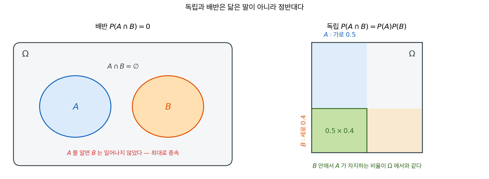

# 사건의 독립

앞 절에서 조건부확률은 "$B$를 알고 나면 $A$의 확률이 어떻게 달라지는가"를 재는 도구였다. 그렇다면 **아무것도 달라지지 않는** 경우는 어떻게 표현할까?

$$
P(A \mid B) = P(A)
$$

$B$가 일어났다는 사실이 $A$에 대해 아무 정보도 주지 않는 경우다. 이것을 **독립**이라 한다. 독립은 확률 계산을 곱셈으로 환원시키기 때문에, 통계학이 자료를 다룰 때 거의 언제나 처음에 놓는 가정이 된다.

이 절은 세 개의 정리로 이루어진다. 독립이 무엇인지(정리 1), 독립과 배반이 왜 정반대인지(정리 2), 그리고 사건이 셋 이상일 때 왜 쌍만 확인해서는 안 되는지(정리 3)이다.

---

## 1. 알아도 달라지지 않는다

정의를 조건부확률로 쓰면 뜻은 분명하지만 $P(B) > 0$이라는 단서가 붙는다. 양변에 $P(B)$를 곱해 두면 그 단서가 사라지고 대칭적인 형태가 된다.

<div class="thmbox" markdown>

### 정리 1. 독립의 정의 — 결합확률이 곱으로 쪼개진다 { .thm }

사건 $A$와 $B$가 **독립**일 필요충분조건은

$$
P(A \cap B) = P(A)\,P(B)
$$

이다. $P(B) > 0$이면 이는

$$
P(A \mid B) = P(A)
$$

와 동등하다.

</div>

??? proof "증명"

    $P(B) > 0$이라 하자. 조건부확률의 정의 $P(A \mid B) = P(A \cap B)/P(B)$를 대입하고 양변에 $P(B)$를 곱하면

    $$
    P(A \mid B) = P(A)
    \iff
    \frac{P(A \cap B)}{P(B)} = P(A)
    \iff
    P(A \cap B) = P(A)\,P(B)
    $$

    이므로 두 조건이 동등하다. 곱 형태는 $P(B) = 0$일 때도 양변이 모두 $0$이 되어 자동으로 성립하므로, $P(B) > 0$이라는 단서 없이 쓸 수 있다. 이 때문에 곱 형태를 정의로 채택한다. $\square$

곱 형태에는 세 가지 이점이 있다. **대칭적이고**($A$와 $B$의 역할이 같다), **$P(B) = 0$일 때도 쓸 수 있으며**, 무엇보다 **계산이 곱셈이 된다**. $n$개의 독립인 사건이 모두 일어날 확률은 $n$개의 수를 곱하면 끝이다.

이 마지막 점이 왜 중요한지는 곧 드러난다. 큰수의 법칙도 중심극한정리도 "독립인 관측을 $n$개 모으면"이라는 전제 위에 서 있다.

<div class="exbox" markdown>

**보기 1.** <span class="diff easy" title="쉬움"></span> 동전 두 번. $A$ = "첫 번째가 앞면", $B$ = "두 번째가 앞면"이라 하면

</div>

??? success "풀이"
    $$
    P(A) = \tfrac{1}{2}, \quad P(B) = \tfrac{1}{2}, \quad P(A \cap B) = \tfrac{1}{4} = P(A)\,P(B)
    $$

    이므로 독립이다.

<div class="exbox" markdown>

**보기 2.** <span class="diff easy" title="쉬움"></span> 주사위 한 번. $A$ = "짝수" = $\{2,4,6\}$, $B$ = "3 이하" = $\{1,2,3\}$이라 하면

</div>

??? success "풀이"
    $$
    P(A) = \tfrac{1}{2}, \quad P(B) = \tfrac{1}{2}, \quad P(A \cap B) = P(\{2\}) = \tfrac{1}{6}
    $$

    이고 $\tfrac{1}{6} \neq \tfrac{1}{4}$이므로 **독립이 아니다**. 같은 주사위 한 번에서 나온 두 사건이라 서로 정보를 준다.

    ```python
    import numpy as np
    from itertools import product

    def check_independence(sample_space, prob, event_A, event_B, labels=("A", "B")):
        """두 사건이 독립인지 정의대로 확인한다.

        prob 는 {결과: 확률} 사전이고, 사건은 결과들의 집합이다.
        사건의 확률 = 그 사건에 속한 결과들의 확률의 합.
        """
        p_A = sum(prob[s] for s in event_A)
        p_B = sum(prob[s] for s in event_B)
        # event_A & event_B 는 집합의 교집합, 즉 두 사건이 동시에 일어난 결과들이다
        p_AB = sum(prob[s] for s in event_A & event_B)

        # 독립의 정의: P(A ∩ B) = P(A)P(B).
        # 부동소수점 비교이므로 == 대신 isclose 를 쓴다.
        independent = np.isclose(p_AB, p_A * p_B)

        print(f"P({labels[0]}) = {p_A:.4f}")
        print(f"P({labels[1]}) = {p_B:.4f}")
        print(f"P({labels[0]} ∩ {labels[1]}) = {p_AB:.4f}")
        print(f"P({labels[0]}) × P({labels[1]}) = {p_A * p_B:.4f}")
        print(f"Independent: {independent}\n")

    # 예 1: 주사위 한 번. "짝수"와 "3 이하"는 독립인가?
    # 얼핏 무관해 보이지만 확인해 봐야 안다.
    #   P(짝수) = 3/6, P(3 이하) = 3/6, P(둘 다) = P({2}) = 1/6
    #   1/6 vs (1/2)(1/2) = 1/4  ->  다르므로 종속이다.
    outcomes = {i: 1/6 for i in range(1, 7)}
    A = {2, 4, 6}       # 짝수
    B = {1, 2, 3}       # 3 이하
    check_independence(outcomes, outcomes, A, B, ("Even", "≤3"))

    # 예 2: 동전 두 번. 첫 번째가 앞면인 사건과 두 번째가 앞면인 사건.
    # product로 표본공간 HH, HT, TH, TT 를 만들고 각각 확률 1/4을 준다.
    flips = list(product(['H', 'T'], repeat=2))
    prob = {f: 0.25 for f in flips}
    A = {f for f in flips if f[0] == 'H'}
    B = {f for f in flips if f[1] == 'H'}
    check_independence(flips, prob, A, B, ("1st=H", "2nd=H"))
    ```

    출력:

    ```
    P(Even) = 0.5000
    P(≤3) = 0.5000
    P(Even ∩ ≤3) = 0.1667
    P(Even) × P(≤3) = 0.2500
    Independent: False

    P(1st=H) = 0.5000
    P(2nd=H) = 0.5000
    P(1st=H ∩ 2nd=H) = 0.2500
    P(1st=H) × P(2nd=H) = 0.2500
    Independent: True
    ```

!!! example "같은 장치라도 절차가 독립을 만들거나 깨뜨린다"
    탄창이 여섯 칸이고 총알이 하나인 리볼버를 생각하자. 방아쇠를 당기는 일을 되풀이하는데, **절차를 한 가지만 바꾼다.**

    **매번 탄창을 돌리면** 시행마다 판이 새로 짜인다. 몇 번째든 총알이 나올 확률이 늘 $1/6$이고, 앞에서 무사했다는 사실이 다음 번에 아무것도 말해 주지 않는다.

    $$
    P(\text{2회에 총알}) = \tfrac16, \qquad
    P(\text{2회에 총알} \mid \text{1회에 무사}) = \tfrac16
    $$

    조건을 걸어도 값이 그대로이므로 **독립**이다.

    **돌리지 않으면** 이야기가 달라진다. 한 번 지나간 칸은 빈 칸으로 확정되어 후보에서 빠진다. 1회에 무사했다면 남은 칸이 다섯이고 총알은 여전히 하나이므로

    $$
    P(\text{2회에 총알} \mid \text{1회에 무사}) = \tfrac15
    $$

    이다. $1/6$이 아니라 $1/5$다. 3회, 4회로 가면 $1/4$, $1/3$로 계속 오른다. **앞의 결과가 뒤의 확률을 바꾸므로 독립이 아니다.**

    장치도 같고 총알 수도 같다. 달라진 것은 **탄창을 돌리느냐**뿐인데 한쪽은 독립이고 한쪽은 아니다. 독립은 대상에 붙는 성질이 아니라 **자료가 만들어지는 절차**에 붙는 성질임을 이보다 선명하게 보여 주는 예가 드물다.

    같은 구분이 통계에서는 **복원추출과 비복원추출**로 나타난다. 복원이면 뽑을 때마다 판이 같아 독립이고, 비복원이면 앞서 뽑힌 것이 빠져 나가 얽힌다. 유한모집단에서 $n/N \le 10\%$면 비복원이어도 독립처럼 다루는 관행([3.5절](../limits/clt.md))이 나오는 자리가 여기다. 빠져 나간 몫이 작으면 판이 거의 그대로이기 때문이다.

---

## 2. 독립과 배반은 정반대다

"독립"과 "배반"은 둘 다 두 사건이 서로 무관하다는 느낌을 주는 말이라 자주 혼동된다. 그러나 확률의 관점에서 이 둘은 **정반대**다.

<div class="thmbox" markdown>

### 정리 2. 독립과 배반 — 양립할 수 없는 두 성질 { .thm }

| 성질 | 독립 | 배반 |
|:---|:---|:---|
| 조건 | $P(A \cap B) = P(A)P(B)$ | $P(A \cap B) = 0$ |
| 둘 다 일어날 수 있는가 | 예 | 아니오 |
| 한쪽을 알면 | 다른 쪽에 대한 정보 없음 | 다른 쪽은 일어나지 **않았음**을 안다 |

$P(A) > 0$이고 $P(B) > 0$인 두 사건이 배반이면 이들은 **독립일 수 없다**.

$$
P(A \cap B) = 0 \neq P(A)\,P(B) > 0
$$

</div>

배반인 사건은 무관하기는커녕 **최대로 종속**이다. $A$가 일어났다는 말을 듣는 순간 $B$가 일어나지 않았음을 확실히 알게 되기 때문이다. 정보를 전혀 주지 않는 것(독립)과 완벽한 정보를 주는 것(배반)은 정반대 극이다.

두 성질은 그림도 정반대다.



**배반은 그림으로 확인할 수 있지만 독립은 그럴 수 없다.** 왼쪽처럼 두 도형이 떨어져 있으면 그것만으로 배반이다. 반면 독립은 위치가 아니라 **넓이의 관계**여서, 도형을 보고 알 수 있는 성질이 아니라 계산해 보아야 아는 성질이다.

오른쪽이 독립을 굳이 그림으로 그린 것이다. $\Omega$를 넓이 1인 정사각형으로 놓고 $A$를 가로 방향 띠, $B$를 세로 방향 띠로 잡으면 겹친 직사각형의 넓이가 정확히 $P(A)P(B)$가 된다. 여기서 읽어야 할 것은 **$B$라는 띠 안에서 $A$가 차지하는 비율이 정사각형 전체에서 차지하는 비율과 같다**는 점이다. $P(A \mid B) = P(A)$를 그림으로 옮기면 이 말이 된다.

---

## 3. 셋 이상일 때는 쌍만 봐서는 안 된다

사건이 둘일 때는 확인할 것이 곱 규칙 하나뿐이다. 셋이 되면 확인할 것이 늘어나고, 이때 흔한 함정이 생긴다.

<div class="thmbox" markdown>

### 정리 3. 상호독립 — 모든 부분집합에서 곱 규칙이 성립해야 한다 { .thm }

사건 $A_1, \ldots, A_n$이 **상호독립**이라는 것은 모든 부분집합 $S \subseteq \{1, \ldots, n\}$에 대해

$$
P\!\left(\bigcap_{i \in S} A_i\right) = \prod_{i \in S} P(A_i)
$$

가 성립한다는 뜻이다. 모든 **쌍**에 대해서만 성립하는 것을 **쌍별 독립**이라 하며, 쌍별 독립은 상호독립을 함의하지 **않는다**.

</div>

<div class="exbox" markdown>

**보기 3.** <span class="diff easy" title="쉬움"></span> 반례 — 쌍별 독립이지만 서로 독립은 아닌 경우. 공정한 동전 두 개를 던지고

- $A$ = "첫 번째가 앞면"
- $B$ = "두 번째가 앞면"
- $C$ = "두 동전이 같은 면"

이라 하자. 세 쌍이 모두 독립이다. $P(A \cap B) = P(A \cap C) = P(B \cap C) = \tfrac{1}{4}$이고 각각 곱과 일치한다. 그러나

</div>

??? success "풀이"
    $$
    P(A \cap B \cap C) = P(\{HH\}) = \tfrac{1}{4} \neq P(A)\,P(B)\,P(C) = \tfrac{1}{8}
    $$

    이다. 쌍별로는 독립인데 셋을 함께 보면 독립이 아니다.

!!! warning "$C$는 $A$와 $B$를 알면 결정된다"
    반례가 작동하는 이유는 명확하다. $A$와 $B$를 둘 다 알면 $C$가 **완전히 결정된다**. 두 동전의 면을 알면 같은지 다른지는 볼 것도 없다.

    그런데 $A$ 하나만으로는 $C$에 대해 아무것도 알 수 없고, $B$ 하나만으로도 마찬가지다. 정보가 **둘이 모여야만** 나타나는 것이다. 쌍별 독립이 상호독립을 함의하지 못하는 근본 이유가 이것이다.

    실무적 함의: "변수들이 두 개씩 상관이 없다"는 것을 확인했다고 해서 함께 써도 안전하다고 결론지어서는 안 된다. 셋 이상이 얽힌 구조는 쌍별 검사로 보이지 않는다.

<div class="exbox" markdown>

**보기 4.** <span class="diff easy" title="쉬움"></span> 동전 두 번 던지기의 독립성 확인. 공정한 동전 두 번 던지기를 20만 번 모의실험해 $\hat P(H_1)$, $\hat P(H_2)$, $\hat P(H_1 \cap H_2)$를 센다.

**(1)** 독립이면 세 추정값 사이에 어떤 관계가 성립해야 하는가. 그 **차이** $\hat P(H_1 \cap H_2) - \hat P(H_1)\hat P(H_2)$의 표준오차를 이론으로 구하시오.

**(2)** 모의실험으로 확인하고, 두 값이 소수 넷째 자리까지 같게 나온 것을 어떻게 읽어야 하는지 말하시오.

</div>

??? success "풀이"

    **(1) 이론값.** 동전이 공정하고 두 던지기가 독립이면 세 참값은

    $$
    P(H_1) = P(H_2) = \tfrac12, \qquad
    P(H_1 \cap H_2) = \tfrac12 \cdot \tfrac12 = \tfrac14
    $$

    이다. 모의실험이 확인할 것은 "$0.25$가 나오는가"가 아니라 **곱 규칙이 성립하는가**, 곧 셋째 추정값이 앞의 두 추정값의 곱과 같은가다. 그래서 보아야 할 양은 차이

    $$
    \widehat{\text{Cov}} = \hat P(H_1 \cap H_2) - \hat P(H_1)\hat P(H_2)
    $$

    이고, 이것은 지시변수 $X = \mathbf 1_{H_1}$, $Y = \mathbf 1_{H_2}$의 표본공분산이다. 참 공분산은 독립이므로 $0$이다. 그 표준오차는 $X, Y$를 중심화해 보면

    $$
    \operatorname{Var}(\widehat{\text{Cov}}) \approx \frac{\operatorname{Var}(X)\operatorname{Var}(Y)}{n}
    = \frac{0.25 \times 0.25}{200000}
    $$

    이므로

    $$
    \operatorname{se}(\widehat{\text{Cov}}) = \frac{0.25}{\sqrt{200000}} = 0.00056
    $$

    이다. 각 비율 자체의 표준오차는 $\sqrt{0.25/200000} = 0.00112$로 그 두 배다.

    **독립을 수치로 확인한다는 것은 "차이가 $0$이다"를 보이는 일이 아니라 "차이가 $0.00056$ 규모 안에 있다"를 보이는 일이다.** 20만 번으로는 그 이상 말할 수 없다.

    **(2) 모의실험.**

    ```python
    import numpy as np

    def simulate_independence(n_simulations=200_000):
        """동전 두 번 던지기가 독립임을 세어서 확인한다."""
        np.random.seed(42)
        flip1 = np.random.randint(0, 2, size=n_simulations)  # 0=뒷면, 1=앞면
        flip2 = np.random.randint(0, 2, size=n_simulations)

        # 0/1 배열의 평균이 곧 "1이 나온 비율" = P(앞면) 이다
        p_A = flip1.mean()
        p_B = flip2.mean()

        # 둘 다 앞면인 비율. 이것이 결합확률 P(A ∩ B) 다.
        p_AB = ((flip1 == 1) & (flip2 == 1)).mean()

        # 독립의 정의는 P(A ∩ B) = P(A)P(B) 다.
        # 아래 출력에서 마지막 두 줄이 같은 값인지 보면 된다.

        print(f"P(H₁) = {p_A:.4f},  P(H₂) = {p_B:.4f}")
        print(f"P(H₁ ∩ H₂) = {p_AB:.4f}")
        print(f"P(H₁) × P(H₂) = {p_A * p_B:.4f}")

        # 네 자리에서 멈추지 말고 차이를 직접 재어 (1)의 오차와 견준다.
        se = 0.25 / np.sqrt(n_simulations)
        print(f"차이 = {p_AB - p_A * p_B:+.6f},  se = {se:.6f}"
              f"  ({(p_AB - p_A * p_B) / se:+.2f} se)")

    simulate_independence()
    ```

    출력:

    ```
    P(H₁) = 0.4996,  P(H₂) = 0.5013
    P(H₁ ∩ H₂) = 0.2505
    P(H₁) × P(H₂) = 0.2505
    차이 = +0.000028,  se = 0.000559  (+0.05 se)
    ```

    **맞는다.** 차이가 $+0.000028$로 표준오차의 $0.05$배다. 곱 규칙이 20만 번의 자료가 가려낼 수 있는 한계 안에서 성립한다.

    **다만 넷째 자리까지 같게 나온 것은 운이 좋았던 것이다.** 차이의 표준오차가 $0.00056$이므로 넷째 자리 단위($0.00005$)의 열 배이고, 보통은 $0.2505$ 대 $0.2499$처럼 넷째 자리에서 갈린다. 실제로 씨앗만 바꿔 같은 모의실험을 돌리면 차이가 $-0.00036$, $+0.00044$, $+0.00079$처럼 나온다. **"소수 몇째 자리까지 같다"는 것은 독립의 증거가 아니고, 몇째 자리까지 같아야 하는지를 정해 주는 것이 (1)의 표준오차다.**

    두 변의 추정값이 각각 $0.4996$과 $0.5013$으로 $0.5$에서 $-0.4$, $+1.2$ 표준오차만큼 비껴나 있는 것도 같은 이야기다. 모의실험은 참값을 보여 주지 않고 참값 둘레의 난수를 보여 준다.

---

## 연습문제

<div class="drillbox" markdown>

**연습문제 1.** <span class="diff easy" title="쉬움"></span>
공정한 주사위를 두 번 굴린다. $A$ = "합이 7", $B$ = "첫 굴림이 3"이라 하자. (a) 표본공간의 크기는? (b) $A$, $B$, $A \cap B$를 나열하라. (c) $P(A), P(B), P(A \cap B)$를 계산하라. (d) $A$와 $B$는 독립인가?

</div>

??? success "풀이"
    (a) $\Omega = \{(i, j) : i, j \in \{1,\ldots,6\}\}$이고 $|\Omega| = 36$이다.

    (b) $A = \{(1,6), (2,5), (3,4), (4,3), (5,2), (6,1)\}$. $B = \{(3,1),(3,2),(3,3),(3,4),(3,5),(3,6)\}$. $A \cap B = \{(3,4)\}$.

    (c) $P(A) = 6/36 = 1/6$, $P(B) = 1/6$, $P(A \cap B) = 1/36$.

    (d) $P(A) \cdot P(B) = 1/36 = P(A \cap B)$이므로 독립이다. 직관: 첫 굴림이 3임을 알아도 합이 7일 확률은 변하지 않는다. 두 번째 굴림의 여섯 값 중 정확히 하나(즉 4)만이 합 7을 만들기 때문이다.

<div class="drillbox" markdown>

**연습문제 2.** <span class="diff med" title="중간"></span>
증명하라: $A$와 $B$가 독립이면 $A^c$와 $B$도 독립이다. 마찬가지로 $A$와 $B^c$, 그리고 $A^c$와 $B^c$도 독립이다.

</div>

??? success "풀이"
    독립성에 의해 $P(A \cap B) = P(A) P(B)$이다.

    $P(A^c \cap B) = P(B) - P(A \cap B) = P(B) - P(A) P(B) = P(B)[1 - P(A)] = P(B) P(A^c)$.

    따라서 $A^c$와 $B$는 독립이다. 대칭적인 논증으로 $A$와 $B^c$도 독립이다. 같은 논증을 $A$와 $B^c$의 독립에서 출발해 적용하면 $A^c$와 $B^c$의 독립을 얻는다.

    교훈: 독립성은 여집합을 취해도 보존된다. 때로는 여집합으로 독립성을 확인하는 편이 더 쉽다(예: 신뢰도 분석에서 $P(\text{고장 없음}) = \prod P(\text{부품 } i \text{ 작동})$).

<div class="drillbox" markdown>

**연습문제 3.** <span class="diff med" title="중간"></span>
**세 개의 곱 규칙이 성립해도 쌍별 독립이 아닐 수 있다.** 보기 3은 쌍별 독립이면서 상호독립이 아닌 예였다. 반대 방향도 가능하다. 공정한 주사위 두 개를 굴리고

- $A$ = "첫 굴림이 $1, 2, 3$ 중 하나"
- $B$ = "첫 굴림이 $3, 4, 5$ 중 하나"
- $C$ = "두 눈의 합이 $9$"

라 하자. $P(A \cap B \cap C) = P(A)P(B)P(C)$임을 확인하고, 그런데도 **어느 쌍도 독립이 아님**을 보여라.

</div>

??? success "풀이"
    표본공간은 36개의 순서쌍이고 각각 확률 $1/36$이다.

    **주변확률.** $P(A) = 3/6 = 1/2$, $P(B) = 3/6 = 1/2$이다. 합이 $9$가 되는 쌍은 $(3,6), (4,5), (5,4), (6,3)$ 넷이므로 $P(C) = 4/36 = 1/9$이다.

    **세 개의 교집합.** $A \cap B$는 "첫 굴림이 $3$"이고, 거기서 합이 $9$가 되려면 두 번째가 $6$이어야 하므로 $A \cap B \cap C = \{(3,6)\}$이다.

    $$
    P(A \cap B \cap C) = \tfrac{1}{36}
    = \tfrac12 \cdot \tfrac12 \cdot \tfrac19
    = P(A)\,P(B)\,P(C)
    $$

    **그런데 쌍은 모두 종속이다.**

    | 쌍 | 교집합 | 확률 | 곱 |
    |:---|:---|:---:|:---:|
    | $A, B$ | 첫 굴림 $=3$ | $6/36 = 1/6$ | $1/4$ |
    | $A, C$ | $(3,6)$ | $1/36$ | $1/18$ |
    | $B, C$ | $(3,6),(4,5),(5,4)$ | $3/36 = 1/12$ | $1/18$ |

    세 줄 모두 왼쪽과 오른쪽이 다르므로 어느 쌍도 독립이 아니다.

    **교훈.** 보기 3과 이 문제를 나란히 놓으면 정리 3의 정의가 왜 "모든 부분집합"을 요구하는지 분명해진다. 쌍의 곱 규칙과 셋의 곱 규칙은 **어느 쪽도 다른 쪽을 함의하지 않는다.** 그래서 부분집합 하나하나를 따로 확인해야 하며, $n$개 사건이면 $2^n - n - 1$개의 조건이 된다.

<div class="drillbox" markdown>

**연습문제 4.** <span class="diff med" title="중간"></span>
**독립성은 추이적이지 않다.** $A$가 $B$와 독립이고 $B$가 $C$와 독립이지만 $A$와 $C$는 독립이 **아닌** 세 사건 $A$, $B$, $C$를 구성하라.

</div>

??? success "풀이"
    공정한 주사위를 한 번 굴리고 다음과 같이 정의하자.

    - $A = \{1, 2, 3\}$, $P(A) = 1/2$.
    - $B = \{1, 4\}$, $P(B) = 1/3$.
    - $C = \{4, 5, 6\}$, $P(C) = 1/2$.

    확인:

    - $A \cap B = \{1\}$이므로 $P = 1/6 = P(A) P(B)$. ✓ 독립
    - $B \cap C = \{4\}$이므로 $P = 1/6 = P(B) P(C)$. ✓ 독립
    - $A \cap C = \emptyset$이므로 $P = 0 \ne P(A) P(C) = 1/4$. ✗ 독립 아님

    따라서 $A$와 $B$가 독립이고 $B$와 $C$가 독립이지만 $A$와 $C$는 독립이 아니다. 독립성은 추이적이지 않다.

<div class="drillbox" markdown>

**연습문제 5.** <span class="diff med" title="중간"></span>
**여집합 정보의 독립.** $X$가 $\{1, 2, 3, 4\}$ 위에서 균등할 때 $A$ = "$X$가 짝수", $B$ = "$X \le 2$"를 생각하자. 이들이 독립임을 보여라. 일반화하라. 균등분포에서 어떤 대칭 조건이 있을 때 두 사건이 독립인 조각으로 분할되는가?

</div>

??? success "풀이"
    $A = \{2, 4\}$이므로 $P(A) = 1/2$이다. $B = \{1, 2\}$이므로 $P(B) = 1/2$이다. $A \cap B = \{2\}$이므로 $P = 1/4 = P(A) P(B)$로 독립이다. ✓

    **일반화:** 여기서 독립이 나오는 이유는 네 결과 $\{1, 2, 3, 4\}$를 비트 $(b_1, b_2)$로 부호화할 수 있기 때문이다. 여기서 $b_1$은 "짝수" 지시자, $b_2$는 "$\le 2$" 지시자다. 네 결과가 어떤 순서로든 $(\bar b_1, \bar b_2), (b_1, \bar b_2), (\bar b_1, b_2), (b_1, b_2)$이고 각각의 확률이 1/4이므로, 두 비트가 균등하고 i.i.d.가 되어 독립이다.

    더 일반적으로, 크기 $|\Omega| = n$인 유한 표본공간 위의 균등분포에서 사건 $A$와 $B$가 독립일 필요충분조건은 네 칸의 도수 $|A \cap B|, |A \cap B^c|, |A^c \cap B|, |A^c \cap B^c|$가 계수 1인 $2 \times 2$ 행렬을 이루는 것, 즉 행과 열이 서로 비례하는 것이다. 이는 독립인 결합분포의 계수 1 분해 성질에 대응하는 이산판이다.

<div class="drillbox" markdown>

**연습문제 6.** <span class="diff med" title="중간"></span>
**독립성은 구조적 성질이지 빈도 성질이 아니다.** 모집단에서 $A$와 $B$가 종속이더라도 크기 $n$인 표본에서 우연히 $\hat P(\hat A \cap \hat B) = \hat P(\hat A) \hat P(\hat B)$가 나올 수 있다. 표본 크기 $n$에서 독립이라는 귀무가설 아래 $|\hat P(A \cap B) - \hat P(A) \hat P(B)|$의 기댓값을 유도하라.

</div>

??? success "풀이"
    $T = \hat P(A \cap B) - \hat P(A) \hat P(B)$로 정의하자. 독립성 아래에서 $T$의 모집단 값은 $0$이다. 표본의 $T$는 근사적으로 다음 분포를 갖는다.

    $$
    T \approx \frac{1}{n} \sum_i \mathbf{1}(X_i \in A) \mathbf{1}(X_i \in B) - \bar A_n \bar B_n
    $$

    점근적으로 $\sqrt{n} \cdot T \xrightarrow{d} N(0, \sigma^2)$이며, 여기서 $\sigma^2 = P(A) P(B)(1 - P(A))(1 - P(B))$이다(크라메르–월드 / 델타 방법 계산).

    따라서 $\mathbb{E}|T| \approx \sqrt{2/\pi} \cdot \sigma/\sqrt{n} = O(n^{-1/2})$이다.

    **귀결:** 유한 표본에서 $T$가 0이 아니라고 해서 종속성이 *증명되지는* 않는다. $T$의 표준오차가 $n^{-1/2}$ 차수이기 때문이다. **독립성에 대한 카이제곱 검정**이 이를 형식화한다. $H_0$ 아래에서 검정통계량이 카이제곱분포를 따르며, 값이 클 때에만 종속성의 증거가 된다.

    이는 다른 곳에서와 같은 교훈이다. 구조적인 모집단 성질(독립성, 인과관계 없음)은 표본 자료로 결정적으로 *입증할* 수 없다. 오직 독립성의 *실패*($T = 0$에서 유의하게 벗어남)만이 귀무가설에 반하는 증거가 된다.

<div class="drillbox" markdown>

**연습문제 7.** <span class="diff med" title="중간"></span>
부품 $n$개로 이루어진 시스템이 있다. 부품들은 서로 **독립으로** 작동하고, 부품 $i$가 제대로 도는 확률은 $p_i$다. **(a)** 부품 하나라도 고장나면 전체가 멈추는 **직렬** 연결에서 시스템이 작동할 확률은? **(b)** 하나라도 살아 있으면 작동하는 **병렬** 연결에서는? **(c)** $p = 0.99$인 부품 $100$개를 직렬로 이으면 시스템의 신뢰도는 얼마인가?

</div>

??? success "풀이"
    **(a) 직렬.** 모든 부품이 동시에 작동해야 하므로 곱 규칙을 그대로 쓴다.

    $$
    P(\text{작동}) = P(A_1 \cap \cdots \cap A_n) = \prod_{i=1}^n p_i
    $$

    **(b) 병렬.** "하나라도 살아 있다"를 직접 세면 경우가 많다. **여사건**을 보는 것이 쉽다. 시스템이 멈추려면 **모두** 고장나야 하므로

    $$
    P(\text{작동}) = 1 - \prod_{i=1}^n (1 - p_i)
    $$

    이다. 독립이 쓰인 자리는 두 경우 모두 곱으로 묶는 단계다.

    **(c)** $0.99^{100} = 0.366$이다.

    **부품 하나하나는 $99\%$ 믿을 만한데 전체는 $37\%$에 그친다.** 신뢰도가 곱으로 쌓이기 때문이며, $1$에 가까운 수라도 $100$번 곱하면 멀리 내려간다. 같은 부품을 병렬로 이으면 $1 - 0.01^{100} \approx 1$로 사실상 완벽해진다. **구조를 바꾸는 것이 부품을 개선하는 것보다 훨씬 강력할 수 있다**는 것이 신뢰도공학의 출발점이다.

    !!! tip "같은 계산이 다중검정에서 되풀이된다"
        $m$개의 가설을 각각 유의수준 $\alpha$에서 **독립으로** 검정한다고 하자. 하나도 잘못 기각하지 않을 확률이 $(1-\alpha)^m$이므로, 적어도 하나를 잘못 기각할 확률은

        $$
        \text{FWER} = 1 - (1-\alpha)^m
        $$

        이다. 직렬 시스템의 식 그대로다. $\alpha = 0.05$, $m = 100$이면 $1 - 0.95^{100} = 0.994$로, 거짓 양성이 **거의 확실하게** 하나는 나온다. 검정 하나하나는 $95\%$ 옳은데 전체로는 믿을 수 없게 되는 것이, 부품이 $99\%$인데 시스템이 $37\%$인 것과 같은 사정이다. [9.6절의 가족단위 오류율](../../ch09/multiple_testing/fwer.md)이 이 문제를 다룬다.

<div class="drillbox" markdown>

**연습문제 8.** <span class="diff med" title="중간"></span>
연습문제 6이 유도한 표본 변동을 검정의 언어로 바꾸어라. **독립이 아닌데 독립처럼 보일 확률**은 얼마인가?

</div>

??? success "풀이"
    ```python
    import numpy as np
    from scipy import stats

    rng = np.random.default_rng(0)

    print("카이제곱 독립 검정의 기각률 (P(A)=P(B)=0.5)")
    print(f"{'의존 강도':>10}" + "".join(f"{'n=' + str(n):>11}" for n in (50, 200, 1000)))
    for phi in (0.0, 0.1, 0.2, 0.3):
        row = f"{phi:>10.1f}"
        for n in (50, 200, 1000):
            rej = 0
            for _ in range(3000):
                a = rng.random(n) < 0.5
                b = np.where(rng.random(n) < phi, a, rng.random(n) < 0.5)
                tab = np.array([[np.sum(a & b), np.sum(a & ~b)],
                                [np.sum(~a & b), np.sum(~a & ~b)]])
                if tab.sum(0).min() > 0 and tab.sum(1).min() > 0:
                    if stats.chi2_contingency(tab, correction=False)[1] < 0.05:
                        rej += 1
            row += f"{rej / 3000:>11.4f}"
        print(row)
    ```

    출력:

    ```
    카이제곱 독립 검정의 기각률 (P(A)=P(B)=0.5)
         의존 강도       n=50      n=200     n=1000
           0.0     0.0567     0.0533     0.0520
           0.1     0.1183     0.2970     0.8893
           0.2     0.3230     0.8183     1.0000
           0.3     0.5893     0.9927     1.0000
    ```

    **첫 줄이 1종 오류율이다.** 실제로 독립일 때 $0.052$–$0.057$로 명목 수준을 지킨다.

    **나머지 줄이 검정력이다.**

    | 의존 강도 | $n=50$ | $n=1000$ |
    |---|---|---|
    | $0.1$ | $0.118$ | $0.889$ |
    | $0.2$ | $0.323$ | $1.000$ |
    | $0.3$ | $0.589$ | $1.000$ |

    **약한 의존은 작은 표본에서 거의 탐지되지 않는다.** $\phi = 0.1$이고 $n = 50$이면 $88\%$의 경우 "독립"으로 판정된다.

    **함의가 두 방향이다.**

    - **"검정이 기각하지 않았으므로 독립이다"는 틀렸다.** 검정력이 낮으면 종속을 놓친다. 1장에서 반복한 "기각 실패 $\ne$ 귀무가설 참"이 여기서도 그대로다.
    - **반대로 $n$이 아주 크면 사소한 종속도 기각한다.** 2장 모자이크 문서 연습문제 7과 2장 왜도·첨도 문서 연습문제 10에서 본 문제다. $\phi = 0.01$짜리 의존도 $n = 10^5$이면 확실히 기각된다.

    **그래서 독립성은 검정보다 **설계와 지식**으로 확보하는 것이 옳다.** 무작위 배정으로 독립을 **만들거나**(1장), 물리적으로 분리된 측정임을 논증하는 편이 자료에서 독립을 확인하려 애쓰는 것보다 확실하다.

    **연습문제 6의 결과와 이어진다.** $P(A) = P(B) = 1/2$이면 연습문제 6의 $\sigma = \sqrt{\tfrac12\cdot\tfrac12\cdot\tfrac12\cdot\tfrac12} = 1/4$이므로, 표본에서 $\hat{P}(A\cap B) - \hat{P}(A)\hat{P}(B)$의 표준편차가 대략 $1/(4\sqrt{n})$ 규모다. 그보다 작은 의존은 표본에서 보이지 않는다. $\square$

<div class="drillbox" markdown>

**연습문제 9.** <span class="diff med" title="중간"></span>
독립성을 **정도**로 재고 싶다면 어떻게 하는가? **상호정보량**을 정의하고 상관계수와 비교하라.

</div>

??? success "풀이"
    **상호정보량**은

    $$
    I(X;Y) = \sum_{x,y} p(x,y)\log_2\frac{p(x,y)}{p(x)p(y)}
    $$

    로 정의된다. 결합분포와 "독립이라면 그랬을 분포"의 쿨백–라이블러 거리다.

    **핵심 성질.** $I(X;Y) \ge 0$이고, **$I(X;Y) = 0$일 필요충분조건이 독립**이다. 상관계수와 달리 "$0$이면 독립"이 성립한다.

    ```python
    import numpy as np

    rng = np.random.default_rng(0)

    def mutual_info(a, b):
        tab = np.array([[np.mean(a & b), np.mean(a & ~b)],
                        [np.mean(~a & b), np.mean(~a & ~b)]])
        px, py = tab.sum(1, keepdims=True), tab.sum(0, keepdims=True)
        with np.errstate(divide="ignore", invalid="ignore"):
            terms = tab * np.log2(tab / (px * py))
        return np.nansum(terms)

    N = 400_000
    print(f"{'의존 강도':>10}{'상호정보량 (bit)':>18}{'|phi 계수|':>12}")
    for phi in (0.0, 0.2, 0.5, 0.9):
        a = rng.random(N) < 0.5
        b = np.where(rng.random(N) < phi, a, rng.random(N) < 0.5)
        print(f"{phi:>10.1f}{mutual_info(a, b):>18.6f}"
              f"{abs(np.corrcoef(a, b)[0, 1]):>12.4f}")
    ```

    출력:

    ```
         의존 강도       상호정보량 (bit)    |phi 계수|
           0.0          0.000001      0.0013
           0.2          0.028765      0.1990
           0.5          0.187827      0.4989
           0.9          0.715882      0.9011
    ```

    **의존이 없으면 $I = 0$이고, 강해질수록 커진다**($0 \to 0.716$ bit).

    **상관계수와의 차이.**

    | | 피어슨 상관 | 상호정보량 |
    |---|---|---|
    | $0$이면 독립인가 | **아니다** | **그렇다** |
    | 잡아내는 관계 | 선형만 | 모든 종류 |
    | 범위 | $[-1,1]$ | $[0,\infty)$ |
    | 방향 | 부호가 있다 | **없다** |
    | 단위 | 없음 | 비트(또는 냇) |
    | 추정 난이도 | 쉽다 | **어렵다** |

    **마지막 줄이 실무의 걸림돌이다.** 상호정보량은 결합분포 전체를 추정해야 하므로 표본이 많이 필요하고, 연속변수에서는 구간화나 밀도추정이 필요해 그 선택이 값을 바꾼다(2장 히스토그램·KDE 문서에서 본 문제와 같다). 그리고 유한 표본에서 **위로 편향**된다. 독립인 자료에서도 추정값이 양수로 나오므로 보정이 필요하다.

    **해석의 의미.** $I(X;Y)$는 "$Y$를 알면 $X$에 대한 불확실성이 몇 비트 줄어드는가"다. 위에서 $0.716$비트는 $X$의 엔트로피 $1$비트 중 $72\%$가 해소된다는 뜻이다.

    **관련 척도들.** 거리상관은 상호정보량처럼 "$0$이면 독립"을 만족하면서 추정이 더 안정적이다. 최대정보계수(MIC)는 상호정보량을 정규화해 비교 가능하게 만든 것이다. 2장 쌍그림 문서 연습문제 7에서 언급한 도구들이 이것이다. $\square$

<div class="drillbox" markdown>

**연습문제 10.** <span class="diff med" title="중간"></span>
독립 가정은 **실무에서 확률을 곱할 수 있게** 해 준다. 그 가정이 틀리면 얼마나 위험한가? 시스템 신뢰도로 확인하라.

</div>

??? success "풀이"
    ```python
    import numpy as np

    p = 0.9                                        # 부품 하나의 신뢰도
    print(f"부품 신뢰도 {p}, 독립 가정")
    print(f"{'부품 수':>8}{'직렬':>10}{'병렬':>10}")
    for k in (1, 2, 3, 5):
        print(f"{k:>8}{p ** k:>10.5f}{1 - (1 - p) ** k:>10.5f}")

    q = 1 - p
    print(f"\n3중 병렬에 공통원인 고장(확률 c)이 있으면")
    print(f"{'c':>8}{'실제 신뢰도':>14}{'독립 가정':>12}{'고장 확률 배수':>16}")
    for c in (0.0, 0.005, 0.01, 0.05):
        rel = (1 - c) * (1 - ((q - c) / (1 - c)) ** 3) if c < q else 1 - c
        naive = 1 - q ** 3
        print(f"{c:>8.3f}{rel:>14.5f}{naive:>12.5f}{(1 - rel) / (1 - naive):>16.1f}")
    ```

    출력:

    ```
    부품 신뢰도 0.9, 독립 가정
        부품 수        직렬        병렬
           1   0.90000   0.90000
           2   0.81000   0.99000
           3   0.72900   0.99900
           5   0.59049   0.99999

    3중 병렬에 공통원인 고장(확률 c)이 있으면
           c        실제 신뢰도       독립 가정        고장 확률 배수
       0.000       0.99900     0.99900             1.0
       0.005       0.99413     0.99900             5.9
       0.010       0.98926     0.99900            10.7
       0.050       0.94986     0.99900            50.1
    ```

    **독립이면 중복이 극적으로 효과적이다.** 신뢰도 $0.9$인 부품 세 개를 병렬로 두면 $0.999$가 된다. 고장 확률이 $0.1$에서 $0.001$로 **$100$배** 줄어든다.

    **공통원인 고장이 있으면 무너진다.**

    | $c$ | 실제 신뢰도 | 독립 가정 | 고장 확률 배수 |
    |---|---|---|---|
    | $0$ | $0.99900$ | $0.99900$ | $1.0$ |
    | $0.01$ | $0.98926$ | $0.99900$ | $10.7$ |
    | $0.05$ | $0.94986$ | $0.99900$ | $\mathbf{50.1}$ |

    **공통 고장 확률이 $5\%$뿐인데 실제 고장 확률이 독립 가정의 $50$배다.** 그리고 부품을 더 늘려도 소용없다. 공통원인이 발동하면 **모두 함께** 고장 나기 때문이다.

    **왜 이것이 중요한가.**

    - **중복 설계의 한계.** 같은 설계·같은 공장·같은 소프트웨어의 부품을 여러 개 두면 공통원인 고장에 함께 노출된다. 그래서 항공기에서는 **서로 다른 팀이 다른 언어로 개발한** 소프트웨어를 병렬로 쓰는 다양성 설계를 한다.
    - **금융 위기의 구조.** 개별 대출의 부도 확률이 낮아도 상관되어 있으면 포트폴리오 손실이 폭발한다. $2008$년 이전의 모형들이 **부도 상관을 낮게 잡은 것**이 핵심 실패였다.
    - **역학과 전파.** 개인의 감염 확률을 곱해 집단 확률을 구하면 크게 빗나간다. 접촉 구조가 독립을 깨뜨린다.

    **일반 원리.** 독립 가정은 계산을 극적으로 단순하게 만들지만(정리 1의 곱 규칙 하나로 $n$개의 수만 곱하면 끝난다), **틀렸을 때의 오차가 꼬리에서 가장 크다.** 평균적인 결과는 비슷해도 "모두 함께 잘못될 확률"은 몇 자릿수씩 어긋난다. 그리고 위험관리에서 중요한 것은 정확히 그 꼬리다. $\square$

---

## 정리하며

독립은 "정보가 없음"을 확률의 언어로 옮긴 것이다.

- **정리 1**은 그것을 곱으로 적었다. $P(A \cap B) = P(A)P(B)$. 조건부확률로 쓴 형태보다 대칭적이고 다루기 쉽다.
- **정리 2**는 독립과 배반이 정반대임을 밝혔다. 배반인 사건은 무관한 것이 아니라 최대로 종속이다.
- **정리 3**은 사건이 셋 이상이면 쌍만 확인해서는 안 됨을 보였다. 정보는 둘이 모여야 나타나기도 한다.

독립이 이 책에서 갖는 무게는 계산의 편의를 훨씬 넘어선다. [3.5절](../limits/lln.md)의 큰수의 법칙과 중심극한정리, 그리고 5장의 표본분포가 모두 "독립인 관측 $n$개"라는 전제 위에 서 있다. 그 전제가 깨지면 결론도 함께 깨진다. 1장에서 본 무작위화가 결국 이 독립성을 설계로 확보하는 장치였다.

여기서 다룬 것은 **사건**의 독립이다. "독립인 관측 $n$개"처럼 수를 다루는 단계에서는 사건 하나가 아니라 확률변수 전체에 대해 독립을 요구해야 하며, 그것은 등식 하나가 아니라 **분포의 인수분해**로 표현된다. [3.3절 확률변수의 독립](../rv/rv_independence.md)이 그 이야기다.

그런데 독립에는 한 겹이 더 있다. 두 사건이 독립이 아니더라도, **세 번째 사건을 알고 나면** 독립이 되는 경우가 있다. 반대로 원래 독립이던 두 사건이 세 번째를 알고 나면 종속이 되기도 한다.

이 미묘한 관계가 다음 절의 **조건부 독립**이며, 12장의 교란변수와 인과추론이 바로 이 개념 위에 서 있다.
