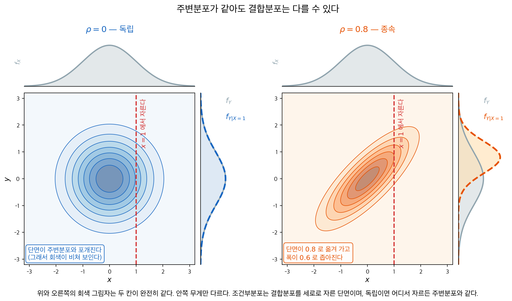
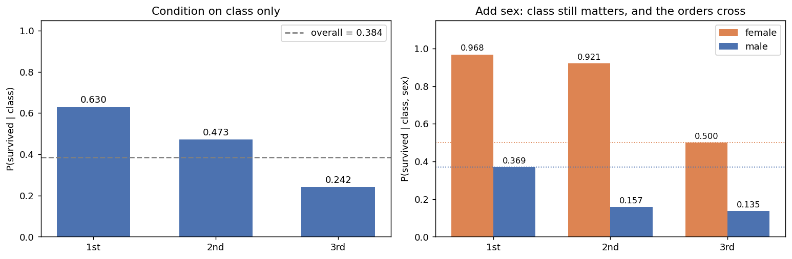
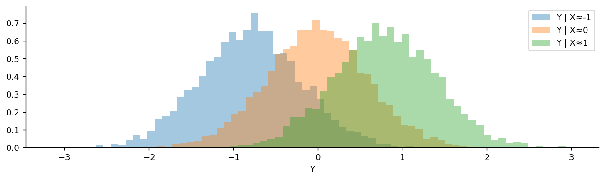

# 조건부분포

[결합분포와 주변분포](joint.md)에서 결합분포로부터 **주변분포**를 얻었다. 한 변수를 더해 없애면 다른 변수의 분포가 남았다. 그런데 결합분포에서 꺼낼 수 있는 것이 주변분포만은 아니다.

한 변수의 값을 **정해 놓고** 다른 변수를 보면 또 하나의 분포가 나온다. 주변분포가 $X$를 무시하고 $Y$만 보는 것이라면, 조건부분포는 $X$를 **알고 나서** $Y$를 보는 것이다. 회귀분석이 하는 일도, 베이즈 추론이 하는 일도 결국 이 분포를 구하는 일이다.

## 1. 조건을 걸면 무게를 세로로 자르게 된다

<div class="thmbox" markdown>

### 정리 1. 조건부분포 — 자른 단면을 다시 1로 맞춘 것 { .thm }

**이산형.** $p_X(x) > 0$일 때

$$
p_{Y|X}(y \mid x) = \frac{p_{X,Y}(x, y)}{p_X(x)}
$$

**연속형.** $f_X(x) > 0$일 때

$$
f_{Y|X}(y \mid x) = \frac{f_{X,Y}(x, y)}{f_X(x)}
$$

둘 다 $y$에 대한 어엿한 분포이며, 특히 $\sum_y p_{Y|X}(y \mid x) = 1$이다.

**곱셈 법칙.** 위 식을 뒤집으면 결합분포가 언제나 다음과 같이 쪼개진다.

$$
f_{X,Y}(x, y) = f_{Y|X}(y \mid x)\, f_X(x) = f_{X|Y}(x \mid y)\, f_Y(y)
$$

</div>

**분자가 자르는 일을, 분모가 다시 세우는 일을 한다.** $x$를 하나 고정하면 평면 위의 무게에서 그 세로선 위에 놓인 것만 남는다. 그런데 그 단면의 총 무게는 $1$이 아니라 $p_X(x)$다. 그래서 $p_X(x)$로 나누어 총합을 $1$로 되돌린다. [3.1절](../probability/conditional.md)에서 조건부확률을 "좁혀진 표본공간에서의 비율"이라 부른 것과 같은 일이며, 그 나눗셈이 여기서는 단면을 분포로 만드는 규격화다.

곱셈 법칙은 3.1절 곱셈 규칙이 확률변수의 언어로 옮겨진 모습이다. 결합분포를 직접 적기 어려울 때 "먼저 $X$를 뽑고, 그 값에 맞추어 $Y$를 뽑는다"는 식으로 두 단계에 나누어 쓸 수 있다는 뜻이기도 하다.



**두 칸의 그림자가 완전히 같다.** 위쪽과 오른쪽의 회색 곡선은 둘 다 표준정규분포다. 그런데 안쪽의 무게 배치는 전혀 다르다. 왼쪽은 축에 나란한 원이고 오른쪽은 기울어진 타원이다. [결합분포와 주변분포](joint.md)에서 "주변분포 둘을 알아도 결합분포는 정해지지 않는다"고 한 말이 눈에 보이는 형태로 나타난 것이 이 그림이다.

**빨간 선에서 세로로 자른 것이 조건부분포다.** $x = 1$에서 자른 단면을 오른쪽 가장자리에 색으로 겹쳐 두었다.

- **왼쪽($\rho = 0$)에서는 단면이 주변분포와 포개진다.** 회색이 파선 아래로 그대로 비쳐 보인다. 어디서 자르든 같은 모양이 나오며, 이것이 앞 절 [확률변수의 독립](rv_independence.md)에서 정의한 독립을 조건부분포의 말로 옮긴 것이다.
- **오른쪽($\rho = 0.8$)에서는 단면이 움직인다.** 중심이 $0$에서 $0.8$로 끌려가고 폭이 $1$에서 $0.6$으로 좁아진다. $X = 1$이라는 사실을 알고 나면 $Y$에 대해 더 많이 알게 된 것이며, 그 "더 알게 된 만큼"이 폭의 감소로 나타난다.

두 주변분포가 모두 표준정규인 이변량 정규분포에서는 이 단면이 정확히 $N(\rho x,\; 1 - \rho^2)$이다. $\rho = 0$이면 $N(0, 1)$, 곧 주변분포 그대로다. 여기서는 일반 이론의 보기로만 쓰며, 이 공식이 어디서 나오는지는 [4.3절 2차원 정규분포 조건부분포](../../ch04/bivariate_normal/gaussian_2d_conditionals.md)가 유도한다.

### 분포에 대한 베이즈 정리

곱셈 법칙과 주변분포를 결합하면 베이즈 정리를 얻는다:

$$
f_{X|Y}(x \mid y) = \frac{f_{Y|X}(y \mid x) \cdot f_X(x)}{f_Y(y)} = \frac{f_{Y|X}(y \mid x) \cdot f_X(x)}{\int f_{Y|X}(y \mid x) \cdot f_X(x)\,dx}
$$

이것이 베이즈 추론의 토대이다. 사전분포 $f_X(x)$를 가능도 $f_{Y|X}(y \mid x)$로 갱신하여 사후분포 $f_{X|Y}(x \mid y)$를 얻는다.

## 2. 단면의 평균과 퍼짐을 재면 조건이 하는 일이 보인다

<div class="thmbox" markdown>

### 정리 2. 조건부 기댓값과 조건부 분산 { .thm }

단면도 분포이므로 평균과 분산을 잰다.

$$
E[Y \mid X = x] = \sum_y y \, p_{Y|X}(y \mid x)
\quad \text{또는} \quad
\int_{-\infty}^{\infty} y \, f_{Y|X}(y \mid x)\,dy
$$

$$
\operatorname{Var}(Y \mid X = x) = E[Y^2 \mid X = x] - \left(E[Y \mid X = x]\right)^2
$$

$x$를 고정하면 수이지만, $x$를 움직이면 $x$의 **함수**다. 그 함수를 확률변수로 볼 때 $E[Y \mid X]$라 쓴다.

</div>

**$E[Y \mid X = x]$를 $x$에 대해 그린 곡선이 회귀곡선이다.** 위 그림의 오른쪽에서 자르는 자리를 옮겨 가며 단면의 중심을 찍어 이으면 직선 $y = 0.8x$가 나온다. [13장의 회귀직선](../../ch13/linear_regression/simple.md)이 조건부평균을 추정하는 일이라고 불리는 근거가 여기 있다.

**단면의 중심이 어떻게 움직이는지를 실제 자료에서 읽어 보자.** [확률변수의 독립](rv_independence.md)에서 타이타닉 승객 891명의 객실등급과 생존이 독립이 아님을 보았다. 이제 같은 자료를 조건부분포의 눈으로 본다. 조건부분포가 결합분포보다 읽기 쉬운 까닭과, **조건을 하나 더 걸었을 때 앞의 결론이 어떻게 되는지**가 이 절의 나머지 주제다.

<div class="exbox" markdown>

**보기 1.** <span class="diff easy" title="쉬움"></span> 조건을 더할수록 이야기가 달라진다. 타이타닉 승객 $891$ 명에서 객실등급·성별·생존을 본다. 앞 절 [확률변수의 독립](rv_independence.md)의 보기 $1$ 에서 결합확률 $P(\text{1등석},\text{생존}) = 0.1526$ 을 얻었다.

**(1)** 그 결합확률 하나만으로 "1등석 승객이 잘 살아남았다" 고 말할 수 있는가. $P(\text{생존} \mid \text{등급})$ 세 값을 구하고, 결합확률이 답하지 못하는 것을 조건부확률이 어떻게 답하는지 적으시오.

**(2)** 성별을 조건에 더하면 3등석 **여성**($0.500$)이 1등석 **남성**($0.369$)보다 높다. 이것이 심프슨의 역설인가. 전체 기댓값의 법칙(정리 3)으로 두 표를 이어 판정하시오.

</div>

??? success "풀이"

    **(1) 말할 수 없다.** 결합확률 $0.1526$ 은 "1등석이면서 살아남은 사람이 전체의 $15.26\%$" 라는 뜻이다. 이 수는 **1등석 승객이 몇 명이었는지**와 **그 안에서 얼마나 살아남았는지**를 한 덩어리로 섞어 놓았다. 1등석이 애초에 많았다면 생존율이 낮아도 이 값이 클 수 있다.

    정리 1 의 나눗셈이 그 섞임을 푼다.

    $$
    P(\text{생존} \mid \text{1등석})
    = \frac{P(\text{1등석},\, \text{생존})}{P(\text{1등석})}
    = \frac{0.1526}{0.2424}
    = \frac{136}{216} = 0.6296
    $$

    사람 수로 적으면 더 분명하다. $891$ 이 분자와 분모에서 약분되어 **"1등석이 몇 명이었는가" 가 지워지고 "1등석 안에서 어떠했는가" 만 남는다.** 세 값은

    $$
    \frac{136}{216} = 0.630,
    \qquad
    \frac{87}{184} = 0.473,
    \qquad
    \frac{119}{491} = 0.242
    $$

    이고 전체 생존율 $0.384$ 를 사이에 두고 갈라진다. **독립이었다면 세 값이 모두 $0.384$ 로 같았을 것이다.** 조건부분포가 조건에 따라 달라진다는 것이 곧 종속이며, 이것이 앞 절에서 본 "실제가 곱의 $1.64$ 배" 를 조건부분포의 말로 옮긴 것이다.

    **(2) 심프슨의 역설이 아니다.** 판정 기준은 하나다. **조건을 걸기 전과 건 뒤에 같은 비교의 방향이 뒤집히는가.** 여기서 비교하는 것은 등급이다.

    조건 전: $0.630 > 0.473 > 0.242$

    여성 안: $0.968 > 0.921 > 0.500$

    남성 안: $0.369 > 0.157 > 0.135$

    **세 줄의 부등호 방향이 모두 같다.** 등급의 효과는 성별을 고정해도 그대로 남으므로 뒤집힘이 없고, 따라서 심프슨의 역설이 아니다. 뒤집히려면 여성 안이나 남성 안에서 3등석이 1등석보다 높아야 한다.

    $0.500 > 0.369$ 은 **서로 다른 칸끼리의 비교**다. 3등석 여성과 1등석 남성은 등급도 성별도 다르므로 같은 비교를 두 번 한 것이 아니다. 읽을 수 있는 것은 **성별의 효과가 등급의 효과보다 크다**는 것뿐이다.

    두 표가 어긋나지 않는다는 것은 전체 기댓값의 법칙이 보증한다. 성별을 $G$, 등급을 $C$ 라 하면

    $$
    P(\text{생존} \mid C = c)
    = \sum_{g} P(\text{생존} \mid C = c,\, G = g)\, P(G = g \mid C = c)
    $$

    이고, 1등석에 넣으면 $P(\text{여성} \mid \text{1등석}) = 94/216 = 0.4352$ 이므로

    $$
    0.968 \times 0.4352 + 0.369 \times 0.5648 = 0.4213 + 0.2083 = 0.6296
    $$

    로 (1) 의 값이 정확히 되살아난다. **칸별 값과 성별 구성비만 알면 등급별 값이 유일하게 정해진다.** 뒤집힘이 일어나려면 구성비가 등급마다 크게 달라야 하는데, 여성 비중이 $43.5\%$, $41.3\%$, $29.3\%$ 로 등급이 내려갈수록 줄어드니 오히려 **등급 차이를 더 벌리는 쪽**으로 작용했다.

    **(3) 수치적으로.**

    ```python
    import pandas as pd

    URL = "https://raw.githubusercontent.com/datasciencedojo/datasets/f0ccab6a7ceafdff780052166fb6fab3311398eb/titanic.csv"
    t = pd.read_csv(URL)

    # 조건부분포는 결합을 조건 변수의 주변으로 나눈 것이다.
    # 여기서는 P(생존=1 | 등급) 이므로 등급별 생존 비율이 곧 그 값이다.
    print("P(생존 | 등급)")
    print(t.groupby("Pclass").Survived.mean().round(3).to_string())
    print(f"{'전체':>6}  {t.Survived.mean():.3f}")

    # 성별을 하나 더 조건에 넣는다. 등급의 효과가 사라질까?
    print("\nP(생존 | 등급, 성별)")
    tab = t.pivot_table(index="Sex", columns="Pclass", values="Survived", aggfunc="mean")
    print(tab.round(3).to_string())

    print("\n인원")
    print(t.pivot_table(index="Sex", columns="Pclass", values="Survived", aggfunc="size").to_string())

    # 전체 기댓값의 법칙으로 두 표를 잇는다.
    #   P(생존 | 등급) = sum_성별 P(생존 | 등급, 성별) * P(성별 | 등급)
    share = pd.crosstab(t.Sex, t.Pclass, normalize="columns")
    print("\nP(성별 | 등급)")
    print(share.round(4).to_string())
    print("\n탑 성질로 되맞추기")
    print(f"{'등급':>5}{'여성 몫':>12}{'남성 몫':>12}{'합':>10}{'직접':>10}")
    for c in (1, 2, 3):
        f = tab.loc["female", c] * share.loc["female", c]
        m = tab.loc["male", c] * share.loc["male", c]
        direct = t[t.Pclass == c].Survived.mean()
        print(f"{c:>5}{f:>12.4f}{m:>12.4f}{f + m:>10.4f}{direct:>10.4f}")

    # 순서가 교차하는가, 뒤집히는가.
    print("\n성별을 고정해도 등급의 순서가 유지되는가")
    for s in ("female", "male"):
        r = [tab.loc[s, c] for c in (1, 2, 3)]
        print(f"  {s:>7}: {r[0]:.3f} > {r[1]:.3f} > {r[2]:.3f} ? "
              f"{r[0] > r[1] > r[2]}")
    print(f"  3등석 여성 {tab.loc['female', 3]:.3f} > 1등석 남성 {tab.loc['male', 1]:.3f}"
          f"  (서로 다른 칸끼리의 비교다)")
    ```

    출력:

    ```
    P(생존 | 등급)
    Pclass
    1    0.630
    2    0.473
    3    0.242
        전체  0.384

    P(생존 | 등급, 성별)
    Pclass      1      2      3
    Sex
    female  0.968  0.921  0.500
    male    0.369  0.157  0.135

    인원
    Pclass    1    2    3
    Sex
    female   94   76  144
    male    122  108  347

    P(성별 | 등급)
    Pclass       1      2       3
    Sex
    female  0.4352  0.413  0.2933
    male    0.5648  0.587  0.7067

    탑 성질로 되맞추기
       등급        여성 몫        남성 몫         합        직접
        1      0.4213      0.2083    0.6296    0.6296
        2      0.3804      0.0924    0.4728    0.4728
        3      0.1466      0.0957    0.2424    0.2424

    성별을 고정해도 등급의 순서가 유지되는가
       female: 0.968 > 0.921 > 0.500 ? True
         male: 0.369 > 0.157 > 0.135 ? True
      3등석 여성 0.500 > 1등석 남성 0.369  (서로 다른 칸끼리의 비교다)
    ```

    

    탑 성질이 세 등급 모두에서 소수 넷째 자리까지 맞는다. $0.6296$, $0.4728$, $0.2424$ 가 직접 센 값과 같다. 등급 순서도 여성 안과 남성 안 모두에서 유지되어 심프슨의 역설이 아님이 확인된다.

    그림의 오른쪽 칸에서 두 점선이 교차하는 것이 $0.500$ 과 $0.369$ 다. 교차가 일어나는 까닭은 성별의 **격차**가 등급의 격차보다 크기 때문이고, 그 격차 자체도 등급마다 다르다. 1등석에서 $0.968 - 0.369 = 0.599$, 2등석에서 $0.921 - 0.157 = 0.764$, 3등석에서 $0.500 - 0.135 = 0.365$ 로 2등석이 가장 크다. **두 설명변수가 서로의 효과를 바꾸어 놓는 이 현상이 교호작용**이며, 11장 이원배치 분산분석과 13장 회귀에서 정면으로 다룬다.

    여기서 기억할 것은 하나다. **"$X$ 가 $Y$ 에 미치는 영향" 이라는 말이 무조건 뜻을 갖는 것은 아니며, 무엇을 조건으로 걸었는지에 따라 달라진다.** 조건을 더했더니 결론의 **부호까지** 뒤집히는 경우가 심프슨의 역설이고 12장에서 다룬다. 타이타닉에서는 부호가 뒤집히지는 않고 서로 다른 칸끼리의 순서가 교차하는 데 그쳤다.

### 조건부 종속

보기 $1$ 에서 성별을 고정해도 등급이 여전히 생존율을 갈라 놓았다. 식으로 적으면

$$
P(\text{생존} \mid \text{등급}, \text{성별}) \ne P(\text{생존} \mid \text{성별})
$$

이고, 이것을 **조건부 종속**이라 한다. 조건을 걸면 종속이 사라지는 경우도 있는데(그때는 **조건부 독립**이라 한다) 여기서는 그렇지 않다는 것이 자료의 답이다.

### 조건을 걸면 사라지는 연관

앞의 예에서는 조건을 더해도 등급의 효과가 남았다. 반대 경우, 곧 **조건을 걸면 연관이 옅어지거나 사라지는** 경우가 훨씬 흔하고 실무에서 더 중요하다. 같은 자료로 볼 수 있다. 이번에는 **승선항**과 생존이다.

<div class="exbox" markdown>

**보기 2.** <span class="diff easy" title="쉬움"></span> 조건을 걸면 사라지는 연관. 같은 타이타닉 자료에서 **승선항**(C 셰르부르, Q 퀸스타운, S 사우샘프턴)과 생존을 본다. 주변적으로는 생존율이 $0.554$, $0.390$, $0.337$ 로 뚜렷하게 갈린다.

**(1)** "셰르부르에서 타는 것이 안전했다" 고 읽어도 되는가. $P(\text{등급} \mid \text{승선항})$ 을 함께 보고 판정하시오.

**(2)** 등급 구성만으로 항구별 생존율을 되맞추면 얼마가 나오는가. 곧 **항구 효과가 전혀 없었다면** 등급 구성의 차이만으로 C 와 S 사이에 얼마나 벌어졌을 것인가. 실제 격차와 견주시오.

</div>

??? success "풀이"

    **(1) 읽으면 안 된다.** 승선항이 객실등급과 심하게 얽혀 있기 때문이다. 셰르부르 승객의 절반 이상($50.6\%$)이 1등석이었던 반면 사우샘프턴은 $19.7\%$ 뿐이고, 퀸스타운은 무려 $93.5\%$ 가 3등석이었다. 그런데 등급은 이미 생존과 강하게 얽혀 있다(보기 $1$). 그러므로 항구별 생존율의 차이는 **항구의 효과가 아니라 등급의 효과가 항구를 통해 비쳐 보인 것**일 수 있다.

    등급을 고정하고 다시 재면 답이 나온다. 1등석 안에서는 $p = 0.242$, 2등석 안에서는 $p = 0.695$ 로 **승선항의 효과가 사라진다.** 1등석에 탄 승객에게는 어느 항구에서 탔는지가 생존과 거의 무관했다는 뜻이다. 다만 3등석에서는 $p < 0.001$ 로 차이가 남는다($0.379$, $0.375$ 대 $0.190$). 그러니 이 자료가 보여 주는 것은 완전한 조건부 독립이 아니라 **대부분이 등급으로 설명되는 부분적 교란**이다.

    **(2) 등급 구성만으로 되맞춰 본다.** 전체 기댓값의 법칙이 항구별 생존율을 등급으로 쪼갠다.

    $$
    P(\text{생존} \mid E = e)
    = \sum_{c} P(\text{생존} \mid E = e,\, C = c)\, P(C = c \mid E = e)
    $$

    오른쪽에는 두 가지가 들어 있다. **칸별 생존율**과 **등급 구성**이다. 여기서 칸별 생존율을 항구와 무관한 전체 등급별 생존율 $P(\text{생존} \mid C = c) = (0.630,\, 0.473,\, 0.242)$ 로 바꿔 끼우면, 항구 효과가 전혀 없고 **구성만 다른 가상의 세계**가 만들어진다.

    $$
    \widetilde P(e) = \sum_{c} P(\text{생존} \mid C = c)\, P(C = c \mid E = e)
    $$

    셰르부르에 넣으면

    $$
    0.630 \times 0.506 + 0.473 \times 0.101 + 0.242 \times 0.393 = 0.4599
    $$

    이고 같은 식으로 $\widetilde P(Q) = 0.2613$, $\widetilde P(S) = 0.3767$ 이다. 이것이 **등급 구성만으로 설명되는 몫**이다.

    C 와 S 의 격차로 견주면

    $$
    \frac{\widetilde P(C) - \widetilde P(S)}{P(C) - P(S)}
    = \frac{0.4599 - 0.3767}{0.5536 - 0.3370}
    = \frac{0.0831}{0.2166}
    = 0.38
    $$

    이다. **격차의 $38\%$ 가 등급 구성만으로 설명된다.** 나머지 $62\%$ 는 칸별 생존율이 항구마다 달랐기 때문인데, (1) 에서 보았듯 그 차이는 3등석에 거의 몰려 있다.

    퀸스타운은 더 극단적이다. 구성만 보면 $0.2613$ 으로 세 항구 가운데 가장 낮아야 하는데 실제로는 $0.3896$ 으로 사우샘프턴($0.3370$)보다 높다. $93.5\%$ 가 3등석이었는데도 그렇다. **구성이 설명하는 방향과 실제가 어긋나는 셈**이고, 이것이 3등석 안에서 $0.375$ 대 $0.190$ 이라는 차이로 남아 있는 그 효과다.

    **(3) 수치적으로.**

    ```python
    import pandas as pd
    from scipy import stats

    URL = "https://raw.githubusercontent.com/datasciencedojo/datasets/f0ccab6a7ceafdff780052166fb6fab3311398eb/titanic.csv"
    t = pd.read_csv(URL).dropna(subset=["Embarked"])

    # 승선항(C 셰르부르, Q 퀸스타운, S 사우샘프턴)과 생존.
    print("P(생존 | 승선항)")
    print(t.groupby("Embarked").Survived.agg(["mean", "size"]).round(3).to_string())
    chi2, p, _, _ = stats.chi2_contingency(pd.crosstab(t.Embarked, t.Survived))
    print(f"  독립성 검정: chi2 = {chi2:.2f}, p = {p:.2e}")

    # 승선항은 객실등급과 심하게 얽혀 있다.
    print("\nP(등급 | 승선항)")
    print(pd.crosstab(t.Embarked, t.Pclass, normalize="index").round(3).to_string())

    # 등급을 조건에 넣으면 승선항의 효과가 남는가?
    print("\n등급을 고정한 뒤의 승선항 효과")
    for c, g in t.groupby("Pclass"):
        chi2, p, _, _ = stats.chi2_contingency(pd.crosstab(g.Embarked, g.Survived))
        rates = g.groupby("Embarked").Survived.mean().round(3).to_dict()
        print(f"  {c}등석  {rates}   p = {p:.3f}")

    # 등급 구성만으로 항구별 생존율을 되맞춰 본다(직접표준화).
    #   탑 성질:   P(생존|항구) = sum_등급 P(생존|항구,등급) P(등급|항구)
    #   반사실:    항구 효과가 전혀 없다면 P(생존|항구,등급) 자리에
    #              전체 등급별 생존율 P(생존|등급) 을 넣으면 된다.
    mix = pd.crosstab(t.Embarked, t.Pclass, normalize="index")
    cell = t.pivot_table(index="Embarked", columns="Pclass", values="Survived", aggfunc="mean")
    overall = t.groupby("Pclass").Survived.mean()

    tower = (mix * cell).sum(axis=1)
    counterfactual = (mix * overall).sum(axis=1)
    observed = t.groupby("Embarked").Survived.mean()

    print("\n{:>6}{:>10}{:>12}{:>16}".format("항구", "실제", "탑 성질", "등급 구성만"))
    for e in ("C", "Q", "S"):
        print(f"{e:>6}{observed[e]:>10.4f}{tower[e]:>12.4f}{counterfactual[e]:>16.4f}")

    gap_obs = observed["C"] - observed["S"]
    gap_cf = counterfactual["C"] - counterfactual["S"]
    print(f"\nC 와 S 의 격차:  실제 {gap_obs:.4f},  등급 구성만으로 {gap_cf:.4f}"
          f"   ({gap_cf / gap_obs * 100:.0f}%)")
    ```

    출력:

    ```
    P(생존 | 승선항)
               mean  size
    Embarked
    C         0.554   168
    Q         0.390    77
    S         0.337   644
      독립성 검정: chi2 = 26.49, p = 1.77e-06

    P(등급 | 승선항)
    Pclass        1      2      3
    Embarked
    C         0.506  0.101  0.393
    Q         0.026  0.039  0.935
    S         0.197  0.255  0.548

    등급을 고정한 뒤의 승선항 효과
      1등석  {'C': 0.694, 'Q': 0.5, 'S': 0.583}   p = 0.242
      2등석  {'C': 0.529, 'Q': 0.667, 'S': 0.463}   p = 0.695
      3등석  {'C': 0.379, 'Q': 0.375, 'S': 0.19}   p = 0.000

        항구        실제        탑 성질          등급 구성만
         C    0.5536      0.5536          0.4599
         Q    0.3896      0.3896          0.2613
         S    0.3370      0.3370          0.3767

    C 와 S 의 격차:  실제 0.2166,  등급 구성만으로 0.0831   (38%)
    ```

    탑 성질 열이 실제 열과 네 자리까지 같다($0.5536$, $0.3896$, $0.3370$). 당연한 일이고, 그 식이 맞는다는 것을 확인한 것이다. 새로 얻은 것은 세 번째 열이다. 등급 구성만 남기고 칸별 차이를 지우면 $0.4599$, $0.2613$, $0.3767$ 이 나오고, C–S 격차가 $0.2166$ 에서 $0.0831$ 로 줄어 $38\%$ 만 남는다.

    **주변 연관 $p = 1.8 \times 10^{-6}$ 을 "항구가 생존을 갈랐다" 로 읽으면 안 된다**는 것이 이 보기의 결론이다. 그렇다고 "전부 등급 때문" 도 아니다. 실제 자료에서 $X \perp Y \mid Z$ 가 딱 떨어지는 일은 드물고, 교과서의 깔끔한 예는 이 상황을 극단까지 이상화한 것이다.

### 조건을 걸었을 때 일어날 수 있는 네 가지

지금까지 본 것을 한자리에 모으면 조건화가 연관에 하는 일의 지도가 그려진다.

| 조건을 걸면 | 뜻 | 보기 |
|---|---|---|
| 그대로 남는다 | 조건부로도 종속 | 등급 $\to$ 생존 (성별을 고정해도 남음) |
| 옅어진다 | 부분적 교란 | 승선항 $\to$ 생존 (3등석에만 남음) |
| 사라진다 | **조건부 독립** $X \perp Y \mid Z$ | 승선항 $\to$ 생존 (1·2등석 안에서) |
| 뒤집힌다 | **심프슨의 역설** | 버클리 대학원 입학 (12장) |

네 칸이 별개의 현상이 아니라 **하나의 눈금 위에 있다는 점**이 중요하다. 넷 모두 "$Z$가 $X$와 $Y$ 양쪽에 얽혀 있다"는 같은 사정에서 나오며, $Z$의 영향력이 커질수록 남는다 $\to$ 옅어진다 $\to$ 사라진다 $\to$ 뒤집힌다로 옮겨 간다. 승선항 예가 그 중간 어딘가에 있다.

!!! warning "조건부 독립은 독립이 아니다"

    승선항과 생존은 1등석 안에서 독립처럼 보이지만 **주변적으로는 명백히 종속**이다($p = 1.8\times 10^{-6}$). 반대 방향도 성립하지 않는다. 주변적으로 독립인 두 변수가 조건을 걸면 종속이 되기도 한다. 조건부 독립과 독립 사이에는 어느 쪽으로도 함의가 없으며, [3.2절 조건부 독립](../probability/conditional_independence.md)이 이 두 방향을 모두 반례로 보인다.

    실무적 교훈은 단순하다. **"$A$와 $B$가 연관되어 있다"는 보고를 받으면 무엇을 고정한 채 쟀는지 물어야 한다.** 아무것도 고정하지 않은 주변 연관은 숨은 제3의 변수를 통해 만들어진 것일 수 있다.

## 3. 단면마다 잰 것을 다시 평균하면 제자리로 돌아온다

단면마다 평균과 분산을 얻었으니 그것들을 다시 모을 수 있다. 조건부로 잰 값을 조건 변수에 대해 한 번 더 평균하면 조건 없이 잰 값으로 되돌아온다. 이 되돌아오는 길이 앞 절의 얽힘을 **수로 재는** 도구가 된다.

<div class="thmbox" markdown>

### 정리 3. 전체 기댓값의 법칙과 전체 분산의 법칙 { .thm }

조건부로 잰 것을 $X$에 대해 다시 평균하면 조건 없이 잰 것으로 돌아온다.

$$
E[Y] = E\bigl[\,E[Y \mid X]\,\bigr]
$$

분산은 두 조각으로 갈라진다(**Eve의 법칙**).

$$
\operatorname{Var}(Y)
= \underbrace{E\bigl[\operatorname{Var}(Y \mid X)\bigr]}_{\text{설명되지 않은 부분}}
+ \underbrace{\operatorname{Var}\bigl(E[Y \mid X]\bigr)}_{\text{설명된 부분}}
$$

</div>

**전체 기댓값의 법칙은 "단면마다 평균을 내고 그 평균들을 다시 평균한다"는 말이다.** 두 단계로 나누어 계산해도 결과가 같다는 뜻이므로, 직접 구하기 어려운 $E[Y]$를 조건을 걸어 우회할 수 있게 해 준다.

**Eve의 법칙은 분산을 설명된 몫과 설명되지 않은 몫으로 가른다.** $X$를 알고 나서도 남는 흔들림이 앞의 항이고, $X$가 달라지는 것 때문에 생기는 흔들림이 뒤의 항이다. 회귀의 결정계수 $R^2$가 재는 것이 바로 뒤 항의 비중이며, 11장 분산분석에서 제곱합을 집단 내와 집단 간으로 쪼개는 것도 같은 분해다.

### 같은 변수를 두 번 뽑아도 얽힌다

전체 기댓값의 법칙이 어디에 쓰이는지를 실무에서 가장 많이 문제가 되는 상황에서 보자. §2에서는 **서로 다른 두 변수**가 제3의 변수를 통해 얽히는 경우를 보았다. 그런데 조건부 독립이 실무에서 문제를 일으키는 더 흔한 방식은 따로 있다. **같은 변수를 두 번 뽑았는데 그 둘이 독립이 아닌** 경우다.

대통령 지지율 조사를 생각해 보자. 어떤 사람에게 지지 여부를 물어 지지하면 1, 아니면 0인 값을 얻는다. 지역마다 지지율이 다르다는 것은 누구나 안다. 어떤 도는 $60\%$, 어떤 도는 $30\%$라고 하자.

**지역을 고정하면** 같은 지역 두 사람의 응답은 독립으로 볼 만하다. 한 사람이 지지한다고 해서 옆 사람이 따라 지지하는 것은 아니니, 그 지역의 지지율 $\theta$를 성공확률로 하는 독립 동전 던지기 둘이라 해도 무리가 없다.

**그런데 지역을 모르면 사정이 달라진다.** 전국에서 무작위로 두 사람을 뽑되 둘이 같은 지역 사람이라 하자. 첫 사람이 지지한다는 것을 알면 그 지역이 지지율 높은 쪽일 가능성이 올라가고, 따라서 **둘째 사람도 지지할 확률이 올라간다.** 첫 응답이 둘째 응답에 대한 정보를 준 것이다. 독립이 아니다.

$$
X_1 \perp X_2 \mid \theta \quad\text{이지만}\quad X_1 \not\perp X_2
$$

계산하면 얼마나 얽히는지가 정확히 나온다. $\theta$가 주어지면 $X_i$가 독립인 $\text{Bernoulli}(\theta)$이므로 $E[X_1X_2 \mid \theta] = \theta^2$이고, 전체 기댓값의 법칙을 쓰면

$$
E[X_1X_2] = E[\theta^2], \qquad E[X_i] = E[\theta] = \mu
$$

이다. 따라서

$$
\text{Cov}(X_1, X_2) = E[\theta^2] - \mu^2 = \text{Var}(\theta)
$$

가 된다. **두 응답의 공분산이 정확히 지역 간 지지율의 분산과 같다.** 지역마다 지지율이 똑같다면($\text{Var}(\theta) = 0$) 두 응답이 독립이고, 지역 차가 클수록 더 얽힌다. 이 상관을 **급내상관**이라 하며 $\rho = \text{Var}(\theta) / \{\mu(1-\mu)\}$로 적는다.

타이타닉 자료로 숫자를 붙여 보자. 지역을 객실등급으로, 지지를 생존으로 바꾸면 구조가 똑같다.

<div class="exbox" markdown>

**보기 3.** <span class="diff easy" title="쉬움"></span> 공유된 잠재 요인이 만드는 종속. 위에서 $\operatorname{Cov}(X_1, X_2) = \operatorname{Var}(\theta)$ 를 얻었다. 타이타닉에서 지역의 자리에 **객실등급**을, 지지의 자리에 **생존**을 넣어 숫자를 붙인다.

**(1)** 같은 군집에서 $m$ 명을 뽑아 평균을 내면 $\operatorname{Var}(\bar X)$ 가 독립일 때의 몇 배인가. 급내상관 $\rho = \operatorname{Var}(\theta)/\{\mu(1-\mu)\}$ 로 적어 **설계효과**를 유도하시오. $m$ 을 한없이 키우면 유효표본은 어떻게 되는가.

**(2)** 급내상관 $\rho$ 는 Eve 의 법칙(정리 3)과 어떤 관계인가. 타이타닉 수치로 확인하시오.

</div>

??? success "풀이"

    **(1) 합의 분산에 교차항이 $m(m-1)$ 개 붙는다.** 같은 군집의 $m$ 명은 **교환가능**하므로 분산이 모두 $\sigma^2 = \mu(1-\mu)$ 로 같고 공분산도 모두 $\operatorname{Var}(\theta)$ 로 같다. 합의 분산 공식에 넣으면

    $$
    \operatorname{Var}\!\left(\sum_{i=1}^m X_i\right)
    = m\sigma^2 + m(m-1)\operatorname{Var}(\theta)
    = m\sigma^2\Big(1 + (m-1)\rho\Big)
    $$

    이다. 마지막에서 $\operatorname{Var}(\theta) = \rho\sigma^2$ 을 썼다. 양변을 $m^2$ 으로 나누면

    $$
    \operatorname{Var}(\bar X) = \frac{\sigma^2}{m}\Big(1 + (m-1)\rho\Big)
    $$

    이고, 독립일 때의 $\sigma^2/m$ 에 견주어 **$1 + (m-1)\rho$ 배로 부푼다.** 이 배수를 **설계효과**라 하고, 같은 정밀도를 주는 독립 표본의 크기

    $$
    m_{\text{eff}} = \frac{m}{1 + (m-1)\rho}
    $$

    를 유효표본크기라 한다.

    **$m$ 을 키워도 유효표본은 무한히 늘지 않는다.** 위 식의 극한을 보면

    $$
    \lim_{m \to \infty} m_{\text{eff}} = \lim_{m\to\infty}\frac{m}{1 + (m-1)\rho} = \frac{1}{\rho}
    $$

    이다. 타이타닉 수치 $\rho = 0.1155$ 에서는 $1/\rho = 8.7$ 이니, **한 등급에서 아무리 많이 뽑아도 아홉 명분 남짓의 정보밖에 얻지 못한다.** 군집을 여러 개 뽑아야 하는 이유가 이것이다.

    **(2) $\rho$ 가 곧 Eve 법칙의 "설명된 몫" 비율이다.** 생존 여부 $Y$ 가 $0/1$ 이므로

    $$
    \operatorname{Var}(Y) = \mu(1-\mu),
    \qquad
    \operatorname{Var}(Y \mid C = c) = \theta_c(1-\theta_c),
    \qquad
    E[Y \mid C] = \theta_C
    $$

    다. 정리 3 의 분해에 넣으면

    $$
    \underbrace{\mu(1-\mu)}_{\operatorname{Var}(Y)}
    = \underbrace{E\big[\theta_C(1-\theta_C)\big]}_{\text{설명 안 된 몫}}
    + \underbrace{\operatorname{Var}(\theta_C)}_{\text{설명된 몫}}
    $$

    인데, 급내상관의 정의가 바로 뒤 항을 전체로 나눈 것이다.

    $$
    \rho = \frac{\operatorname{Var}(\theta)}{\mu(1-\mu)}
    = \frac{\operatorname{Var}\big(E[Y \mid C]\big)}{\operatorname{Var}(Y)}
    $$

    **그러므로 $\rho$ 는 "군집이 설명하는 분산의 비율" 이고, 회귀의 $R^2$ 과 같은 자리에 있는 양이다.** 둘 다 Eve 법칙의 뒤 항이 차지하는 몫이며, 이름만 다르다. 여기서는 $0.0273/0.2365 = 0.1155$ 로 **등급이 생존 여부의 흔들림 가운데 $11.6\%$ 만 설명한다.** 설명력이 그리 크지 않은데도 표본 $100$ 개를 $8$ 개로 만들어 버린다는 것이 (1) 의 경고다.

    **(3) 수치적으로.**

    ```python
    import numpy as np
    import pandas as pd

    URL = "https://raw.githubusercontent.com/datasciencedojo/datasets/f0ccab6a7ceafdff780052166fb6fab3311398eb/titanic.csv"
    t = pd.read_csv(URL)

    theta = t.groupby("Pclass").Survived.mean()          # 등급별 생존율
    w = t.Pclass.value_counts(normalize=True).sort_index()  # 등급별 인원 비중
    mu = t.Survived.mean()

    var_theta = float((w * theta**2).sum() - mu**2)      # 등급 간 분산
    rho = var_theta / (mu * (1 - mu))                    # 급내상관

    print(f"전체 생존율 mu        = {mu:.4f}")
    print(f"등급 간 분산 Var(theta) = {var_theta:.4f}")
    print(f"급내상관 rho          = {rho:.4f}")

    print("\n같은 등급에서 두 명을 뽑을 때")
    print(f"  P(둘 다 생존) = E[theta^2] = {float((w * theta**2).sum()):.4f}")
    print(f"  독립이라면     mu^2        = {mu**2:.4f}")
    print(f"  차이                       = {var_theta:.4f}")

    # Eve 의 법칙(정리 3)으로 Var(Y) 를 두 조각으로 쪼갠다.
    #   Y 가 0/1 이므로 Var(Y) = mu(1-mu) 이고
    #   Var(Y | 등급=c) = theta_c (1 - theta_c) 다.
    within = float((w * theta * (1 - theta)).sum())      # E[Var(Y | 등급)]
    between = var_theta                                  # Var(E[Y | 등급])
    print("\nEve 의 법칙")
    print(f"  Var(Y)              = mu(1-mu)   = {mu * (1 - mu):.6f}")
    print(f"  E[Var(Y | 등급)]     설명 안 된 몫 = {within:.6f}")
    print(f"  Var(E[Y | 등급])     설명된 몫     = {between:.6f}")
    print(f"  두 조각의 합                      = {within + between:.6f}")
    print(f"  설명된 비율 = {between / (mu * (1 - mu)):.4f}  (= 급내상관 rho)")

    print("\n설계효과 DEFF = 1 + (m-1)rho")
    for m in (2, 10, 50, 100):
        print(f"  한 등급에서 {m:3d}명 → DEFF {1 + (m - 1) * rho:5.2f}"
              f"   유효표본 {m / (1 + (m - 1) * rho):5.1f}명")
    print(f"  m -> 무한대 에서의 유효표본 상한 = 1/rho = {1 / rho:.1f}명")
    ```

    출력:

    ```
    전체 생존율 mu        = 0.3838
    등급 간 분산 Var(theta) = 0.0273
    급내상관 rho          = 0.1155

    같은 등급에서 두 명을 뽑을 때
      P(둘 다 생존) = E[theta^2] = 0.1746
      독립이라면     mu^2        = 0.1473
      차이                       = 0.0273

    Eve 의 법칙
      Var(Y)              = mu(1-mu)   = 0.236506
      E[Var(Y | 등급)]     설명 안 된 몫 = 0.209196
      Var(E[Y | 등급])     설명된 몫     = 0.027311
      두 조각의 합                      = 0.236506
      설명된 비율 = 0.1155  (= 급내상관 rho)

    설계효과 DEFF = 1 + (m-1)rho
      한 등급에서   2명 → DEFF  1.12   유효표본   1.8명
      한 등급에서  10명 → DEFF  2.04   유효표본   4.9명
      한 등급에서  50명 → DEFF  6.66   유효표본   7.5명
      한 등급에서 100명 → DEFF 12.43   유효표본   8.0명
      m -> 무한대 에서의 유효표본 상한 = 1/rho = 8.7명
    ```

    같은 등급에서 두 명을 뽑으면 둘 다 살아남을 확률이 $0.1746$ 인데, 독립이라면 $0.3838^2 = 0.1473$ 이어야 한다. 차이 $0.0273$ 이 정확히 등급 간 분산 $\operatorname{Var}(\theta)$ 다. **본문에서 유도한 $\operatorname{Cov}(X_1,X_2) = \operatorname{Var}(\theta)$ 가 그대로 맞는다.**

    Eve 의 법칙도 소수 여섯째 자리까지 닫힌다. $0.209196 + 0.027311 = 0.236506 = \mu(1-\mu)$ 이고, 설명된 비율 $0.1155$ 가 급내상관과 **같은 수**다. (2) 의 주장이 수치로 확인된다.

    마지막 표가 (1) 의 유도를 확인한다. 한 등급에서 $100$ 명을 뽑으면 $\text{DEFF} = 1 + 99 \times 0.1155 = 12.43$ 이라 실질적으로 **$8.0$ 명분의 정보**밖에 되지 않고, $m$ 을 한없이 키워도 $1/\rho = 8.7$ 명이 천장이다. **표본을 늘려 얻는 것이 금세 바닥난다**는 것이 군집표본의 핵심이다.

!!! danger "이것이 i.i.d. 가정이 깨지는 가장 흔한 방식이다"

    5장부터 이 책은 표본이 **독립이고 같은 분포를 따른다**고 가정한다. 표준오차 $\sigma/\sqrt{n}$도, 신뢰구간도, 검정도 모두 그 위에 서 있다. 그런데 현실의 조사는 한 사람씩 무작위로 뽑는 것이 아니라 **동네, 학교, 병원, 사업장 단위로 묶어서** 뽑는 일이 많다. 그 순간 같은 군집에 속한 응답들이 위처럼 얽힌다.

    대가는 마지막 표에 있다. 한 등급에서 100명을 뽑으면 **실질적으로 8명분의 정보**밖에 되지 않는다. 표준오차를 $\sigma/\sqrt{100}$으로 계산하면 참값의 $1/\sqrt{12.43} \approx 0.28$배로 과소평가하는 셈이고, 신뢰구간은 그만큼 좁아지며, 검정은 있지도 않은 유의성을 낸다.

    이 부풀림 $1 + (m-1)\rho$를 **설계효과**라 부른다. 5.3절에서 시계열의 자기상관을 다룰 때 같은 양이 다시 나오며, 거기서는 $Z$의 자리에 "시간"이 들어간다. 얽히는 통로가 지역이든 시간이든 공통 요인이든, 공유된 무언가가 있으면 유효 표본크기가 줄어든다는 결론은 같다.

    5.1절의 [금융위기와 중심극한정리](../../ch05/foundations/financial_crisis_clt.md)가 이 구조를 극단까지 밀어붙인 사례다. 주택저당증권의 부도를 서로 독립이라 가정했는데 실제로는 공통의 경기 요인 $\theta$를 공유하고 있었고, 그 결과 $10^{-8}$로 계산된 사건이 실제로는 $10^{-2}$ 확률로 일어났다.

---

### 손으로 풀어 보기 — 이산

<div class="probox" markdown>

**문제:** <span class="diff easy" title="쉬움"></span> 다음 결합 PMF를 사용한다:

| | $Y=0$ | $Y=1$ | $Y=2$ | $p_X(x)$ |
|:---|:---:|:---:|:---:|:---:|
| $X=0$ | 0.10 | 0.15 | 0.05 | 0.30 |
| $X=1$ | 0.10 | 0.25 | 0.10 | 0.45 |
| $X=2$ | 0.05 | 0.10 | 0.10 | 0.25 |
| $p_Y(y)$ | 0.25 | 0.50 | 0.25 | 1.00 |

$P(Y = 1 \mid X = 1)$과 $E[Y \mid X = 1]$을 구하라.

</div>

??? success "풀이"

    $$
    P(Y = 1 \mid X = 1) = \frac{p_{X,Y}(1,1)}{p_X(1)} = \frac{0.25}{0.45} = \frac{5}{9} \approx 0.556
    $$

    $$
    E[Y \mid X = 1] = 0 \cdot \frac{0.10}{0.45} + 1 \cdot \frac{0.25}{0.45} + 2 \cdot \frac{0.10}{0.45} = \frac{0.45}{0.45} = 1.0
    $$

---

### 손으로 풀어 보기 — 연속

<div class="probox" markdown>

**문제:** <span class="diff med" title="중간"></span> $0 \leq x \leq y \leq 1$에서 $f_{X,Y}(x,y) = 2$라 하자. $f_X(x)$, $f_{Y|X}(y \mid x)$, $E[Y \mid X = x]$를 구하라.

</div>

??? success "풀이"

    **$X$의 주변분포:**

    $$
    f_X(x) = \int_x^1 2\,dy = 2(1 - x), \quad 0 \leq x \leq 1
    $$

    **$X = x$가 주어졌을 때 $Y$의 조건부 PDF:**

    $$
    f_{Y|X}(y \mid x) = \frac{f_{X,Y}(x,y)}{f_X(x)} = \frac{2}{2(1-x)} = \frac{1}{1-x}, \quad x \leq y \leq 1
    $$

    이는 $\text{Uniform}(x, 1)$이다.

    **조건부 기댓값:**

    $$
    E[Y \mid X = x] = \frac{x + 1}{2}
    $$

    **전체 기댓값의 법칙으로 확인:**

    $$
    E[Y] = \int_0^1 \frac{x+1}{2} \cdot 2(1-x)\,dx = \int_0^1 (x+1)(1-x)\,dx = \int_0^1 (1 - x^2)\,dx = \frac{2}{3}
    $$

---

### 코드로 확인하기

### 이산형 주변분포와 조건부분포

<div class="exbox" markdown>

**보기 4.** <span class="diff easy" title="쉬움"></span> 이산형 주변분포와 조건부분포. 바로 위 「손으로 풀어 보기 — 이산」의 결합 PMF 를 다시 쓴다.

| | $Y=0$ | $Y=1$ | $Y=2$ |
|:---|:---:|:---:|:---:|
| $X=0$ | 0.10 | 0.15 | 0.05 |
| $X=1$ | 0.10 | 0.25 | 0.10 |
| $X=2$ | 0.05 | 0.10 | 0.10 |

**(1)** 세 조건부분포 $p_{Y|X}(\cdot \mid x)$ 와 $E[Y \mid X = x]$ 를 모두 구하고, 전체 기댓값의 법칙으로 $E[Y]$ 를 되맞추시오.

**(2)** Eve 의 법칙으로 $\operatorname{Var}(Y)$ 를 두 조각으로 쪼개시오. $X$ 가 설명하는 몫은 몇 %인가.

</div>

??? success "풀이"

    **(1) 행마다 그 행의 합으로 나눈다.** 주변분포는 $p_X = (0.30,\, 0.45,\, 0.25)$, $p_Y = (0.25,\, 0.50,\, 0.25)$ 이고 정리 1 대로 행을 $p_X(x)$ 로 나누면

    $$
    p_{Y|X}(\cdot \mid 0) = \frac{(0.10,\, 0.15,\, 0.05)}{0.30} = \left(\tfrac13,\, \tfrac12,\, \tfrac16\right)
    $$

    $$
    p_{Y|X}(\cdot \mid 1) = \frac{(0.10,\, 0.25,\, 0.10)}{0.45} = \left(\tfrac29,\, \tfrac59,\, \tfrac29\right)
    $$

    $$
    p_{Y|X}(\cdot \mid 2) = \frac{(0.05,\, 0.10,\, 0.10)}{0.25} = \left(\tfrac15,\, \tfrac25,\, \tfrac25\right)
    $$

    다. 세 줄 모두 합이 $1$ 이다. 조건부평균은 이 **조건부분포**로 가중평균한 것이지 주변분포로 가중한 것이 아니다.

    $$
    E[Y \mid X=0] = \frac{0.15 + 2(0.05)}{0.30} = \frac{0.25}{0.30} = 0.8333
    $$

    $$
    E[Y \mid X=1] = \frac{0.25 + 2(0.10)}{0.45} = \frac{0.45}{0.45} = 1,
    \qquad
    E[Y \mid X=2] = \frac{0.10 + 2(0.10)}{0.25} = \frac{0.30}{0.25} = 1.2
    $$

    **분자가 분모와 같아져 $E[Y \mid X=1] = 1$ 이 딱 떨어진 것은 우연이다.** 전체 기댓값의 법칙으로 되맞추면

    $$
    \sum_x p_X(x)\,E[Y \mid X=x]
    = 0.30(0.8333) + 0.45(1) + 0.25(1.2)
    = 0.25 + 0.45 + 0.30 = 1
    $$

    이고 직접 구한 $E[Y] = 0.50 + 2(0.25) = 1$ 과 같다. 세 항의 분모가 약분되어 **결국 결합표의 열 가중합으로 되돌아가는 것**이 이 법칙의 정체다.

    **(2) 두 조각으로 가른다.** 조건부분산도 조건부분포로 잰다.

    $$
    \operatorname{Var}(Y \mid X=0) = \frac{0.15 + 4(0.05)}{0.30} - 0.8333^2 = 1.1667 - 0.6944 = 0.4722
    $$

    $$
    \operatorname{Var}(Y \mid X=1) = \frac{0.65}{0.45} - 1 = 0.4444,
    \qquad
    \operatorname{Var}(Y \mid X=2) = \frac{0.50}{0.25} - 1.44 = 0.56
    $$

    이고 이것을 $p_X$ 로 평균하면

    $$
    E\big[\operatorname{Var}(Y \mid X)\big] = 0.30(0.4722) + 0.45(0.4444) + 0.25(0.56) = 0.481667
    $$

    다. 뒤 항은 조건부평균들의 분산이다.

    $$
    \operatorname{Var}\big(E[Y \mid X]\big)
    = 0.30(0.8333^2) + 0.45(1^2) + 0.25(1.2^2) - 1^2
    = 1.018333 - 1 = 0.018333
    $$

    둘을 더하면

    $$
    0.481667 + 0.018333 = 0.5 = \operatorname{Var}(Y)
    $$

    로 직접 구한 $E[Y^2] - 1 = 1.5 - 1 = 0.5$ 와 맞는다.

    **$X$ 가 설명하는 몫은 $0.018333/0.5 = 3.7\%$ 다.** 조건부평균이 $0.83$ 에서 $1.2$ 까지 움직이므로 $X$ 와 $Y$ 가 독립은 아니지만, $Y$ 자체의 흔들림에 견주면 그 움직임이 아주 작다. **"독립이 아니다" 와 "많이 알려 준다" 는 전혀 다른 말**이고, 그 차이를 재는 것이 Eve 법칙의 뒤 항이다.

    **(3) 수치적으로.**

    ```python
    import numpy as np
    import pandas as pd

    pmf = np.array([
        [0.10, 0.15, 0.05],
        [0.10, 0.25, 0.10],
        [0.05, 0.10, 0.10]
    ])

    # 주변분포: 관심 없는 변수를 **합해서 지운다**.
    #   axis=1 로 더하면 Y가 사라져 P(X=x)만 남는다.
    #   axis=0 로 더하면 X가 사라져 P(Y=y)만 남는다.
    p_X = pmf.sum(axis=1)
    p_Y = pmf.sum(axis=0)
    print("Marginal of X:", p_X)
    print("Marginal of Y:", p_Y)

    # 조건부분포: X=1 인 **행 하나만** 떼어 낸 뒤 그 행의 합으로 나눈다.
    # 나누는 이유는 떼어 낸 행의 합이 P(X=1)이라 1이 아니기 때문이다.
    # 확률로 쓰려면 합이 1이 되게 다시 정규화해야 한다.
    # 이것이 P(Y|X) = P(X,Y)/P(X) 를 표에서 실행한 것이다.
    x_val = 1
    cond_Y_given_X1 = pmf[x_val, :] / p_X[x_val]
    print(f"\nP(Y|X={x_val}):", cond_Y_given_X1)

    # 조건부기댓값은 조건부분포로 가중평균한 것이다.
    # 주변분포가 아니라 **조건부분포**로 가중해야 한다는 점이 요점이다.
    y_vals = np.array([0, 1, 2])
    E_Y_given_X1 = np.sum(y_vals * cond_Y_given_X1)
    print(f"E[Y|X={x_val}] = {E_Y_given_X1:.4f}")

    # 세 행을 모두 같은 방식으로 처리해 조건부평균과 조건부분산을 얻는다.
    cond = pmf / p_X[:, None]
    m = cond @ y_vals                       # E[Y | X=x]
    v = cond @ y_vals**2 - m**2             # Var(Y | X=x)
    print(f"\n{'x':>3}{'P(Y|X=x)':>30}{'E[Y|X=x]':>12}{'Var(Y|X=x)':>14}")
    for x in range(3):
        print(f"{x:>3}{str(np.round(cond[x], 4)):>30}{m[x]:>12.4f}{v[x]:>14.4f}")

    # 전체 기댓값의 법칙: 조건부평균을 p_X 로 다시 평균하면 E[Y] 다.
    E_Y = float(y_vals @ p_Y)
    print(f"\n전체 기댓값의 법칙")
    print(f"  sum_x p_X(x) E[Y|X=x] = {float(p_X @ m):.6f}")
    print(f"  직접 계산한 E[Y]       = {E_Y:.6f}")

    # Eve 의 법칙: Var(Y) 를 설명 안 된 몫과 설명된 몫으로 가른다.
    var_Y = float(y_vals**2 @ p_Y) - E_Y**2
    within = float(p_X @ v)                 # E[Var(Y|X)]
    between = float(p_X @ m**2) - E_Y**2    # Var(E[Y|X])
    print(f"\nEve 의 법칙")
    print(f"  E[Var(Y|X)]  설명 안 된 몫 = {within:.6f}")
    print(f"  Var(E[Y|X])  설명된 몫     = {between:.6f}")
    print(f"  두 조각의 합               = {within + between:.6f}")
    print(f"  직접 계산한 Var(Y)         = {var_Y:.6f}")
    print(f"  설명된 비율                = {between / var_Y:.4f}")
    ```

    출력:

    ```
    Marginal of X: [0.3  0.45 0.25]
    Marginal of Y: [0.25 0.5  0.25]

    P(Y|X=1): [0.22222222 0.55555556 0.22222222]
    E[Y|X=1] = 1.0000

      x                      P(Y|X=x)    E[Y|X=x]    Var(Y|X=x)
      0        [0.3333 0.5    0.1667]      0.8333        0.4722
      1        [0.2222 0.5556 0.2222]      1.0000        0.4444
      2                 [0.2 0.4 0.4]      1.2000        0.5600

    전체 기댓값의 법칙
      sum_x p_X(x) E[Y|X=x] = 1.000000
      직접 계산한 E[Y]       = 1.000000

    Eve 의 법칙
      E[Var(Y|X)]  설명 안 된 몫 = 0.481667
      Var(E[Y|X])  설명된 몫     = 0.018333
      두 조각의 합               = 0.500000
      직접 계산한 Var(Y)         = 0.500000
      설명된 비율                = 0.0367
    ```

    세 조건부분포와 조건부평균 $0.8333$, $1.0000$, $1.2000$ 이 손 계산과 맞고, 조건부분산 $0.4722$, $0.4444$, $0.5600$ 도 맞는다. 전체 기댓값의 법칙이 $1.000000$ 으로 닫히고 Eve 의 법칙이 $0.481667 + 0.018333 = 0.500000$ 으로 닫힌다. 설명된 비율은 $0.0367$ 이다.

### 적분을 통한 연속형 주변분포

<div class="exbox" markdown>

**보기 5.** <span class="diff easy" title="쉬움"></span> 적분으로 구하는 연속형 주변분포. $0 \le x \le y \le 1$ 에서 $f_{X,Y}(x,y) = 2$ 다. 바로 위 「손으로 풀어 보기 — 연속」이 $f_X(x) = 2(1-x)$, $Y \mid X = x \sim \text{Uniform}(x, 1)$, $E[Y] = 2/3$ 까지 구했다. 거기서 이어 간다.

**(1)** Eve 의 법칙으로 $\operatorname{Var}(Y)$ 를 두 조각으로 구하시오. $f_Y$ 를 직접 구해 얻은 값과 맞는가.

**(2)** 조건을 반대로 걸면 $X \mid Y = y$ 는 무슨 분포인가. 전체 기댓값의 법칙으로 $E[X]$ 를 구하시오.

</div>

??? success "풀이"

    **(1) 두 조각을 차례로 구한다.** $Y \mid X = x$ 가 $\text{Uniform}(x, 1)$ 이므로 균등분포의 분산 공식에서

    $$
    \operatorname{Var}(Y \mid X = x) = \frac{(1-x)^2}{12}
    $$

    다. 이것을 $f_X(x) = 2(1-x)$ 로 평균하면

    $$
    E\big[\operatorname{Var}(Y \mid X)\big]
    = \int_0^1 \frac{(1-x)^2}{12}\cdot 2(1-x)\,dx
    = \frac16\int_0^1 (1-x)^3\,dx
    = \frac16 \cdot \frac14 = \frac{1}{24}
    $$

    이다. 뒤 항은 $E[Y \mid X] = (X+1)/2$ 의 분산이므로 $\operatorname{Var}(X)/4$ 다. $f_X$ 로 $X$ 의 적률을 구하면

    $$
    E[X] = \int_0^1 x\,2(1-x)\,dx = 2\left(\frac12 - \frac13\right) = \frac13,
    \qquad
    E[X^2] = 2\left(\frac13 - \frac14\right) = \frac16
    $$

    이므로 $\operatorname{Var}(X) = \tfrac16 - \tfrac19 = \tfrac{1}{18}$ 이고

    $$
    \operatorname{Var}\big(E[Y \mid X]\big) = \frac{1}{4}\cdot\frac{1}{18} = \frac{1}{72}
    $$

    다. 둘을 더하면

    $$
    \operatorname{Var}(Y) = \frac{1}{24} + \frac{1}{72} = \frac{3}{72} + \frac{1}{72} = \frac{4}{72} = \frac{1}{18}
    $$

    **직접 확인한다.** $f_Y(y) = \int_0^y 2\,dx = 2y$ 이므로 $Y \sim \text{Beta}(2,1)$ 이고

    $$
    E[Y] = \int_0^1 y\,2y\,dy = \frac23,
    \qquad
    E[Y^2] = \int_0^1 y^2\,2y\,dy = \frac12,
    \qquad
    \operatorname{Var}(Y) = \frac12 - \frac49 = \frac{1}{18}
    $$

    로 맞는다. 설명된 몫은 $\tfrac{1/72}{1/18} = \tfrac14$ 다. **$X$ 를 알면 $Y$ 의 흔들림이 $25\%$ 줄어든다.**

    **(2) 반대쪽도 균등분포다.** $y$ 를 고정하면 $x$ 가 $0$ 부터 $y$ 까지이므로

    $$
    f_{X|Y}(x \mid y) = \frac{f_{X,Y}(x,y)}{f_Y(y)} = \frac{2}{2y} = \frac1y,
    \qquad 0 \le x \le y
    $$

    곧 $X \mid Y = y \sim \text{Uniform}(0, y)$ 이고 $E[X \mid Y = y] = y/2$ 다. 전체 기댓값의 법칙을 쓰면

    $$
    E[X] = E\big[E[X \mid Y]\big] = E\!\left[\frac{Y}{2}\right] = \frac{1}{2}\cdot\frac{2}{3} = \frac13
    $$

    으로 (1) 에서 $f_X$ 로 직접 구한 값과 같다. **삼각형 위의 균등분포에서는 어느 쪽으로 잘라도 단면이 균등분포**이고, 달라지는 것은 단면의 길이뿐이다. 세로로 자르면 길이가 $1-x$, 가로로 자르면 $y$ 다.

    **(3) 수치적으로.** 수치적분으로 위 값을 모두 확인한다.

    ```python
    import numpy as np
    from scipy import integrate

    # f(x,y) = 2 for 0 <= x <= y <= 1
    def joint_pdf(x, y):
        return 2.0 if 0 <= x <= y <= 1 else 0.0

    # 주변밀도 f_X(x) 는 f(x,y) 를 y 에 대해 x 에서 1 까지 적분한 것이다
    def marginal_X(x):
        result, _ = integrate.quad(lambda y: joint_pdf(x, y), x, 1)
        return result

    # 조건부분포로 구한 E[Y | X=x]
    def E_Y_given_X(x):
        fx = marginal_X(x)
        if fx == 0:
            return 0
        result, _ = integrate.quad(lambda y: y * joint_pdf(x, y) / fx, x, 1)
        return result

    # 전체기댓값의 법칙 확인
    E_Y, _ = integrate.quad(lambda x: E_Y_given_X(x) * marginal_X(x), 0, 1)
    print(f"E[Y] via Law of Total Expectation: {E_Y:.4f}")  # Should be 2/3

    # 조건부분산 Var(Y | X=x). Y | X=x 가 Uniform(x,1) 이므로 (1-x)^2/12 여야 한다.
    def Var_Y_given_X(x):
        fx = marginal_X(x)
        m = E_Y_given_X(x)
        result, _ = integrate.quad(lambda y: y**2 * joint_pdf(x, y) / fx, x, 1)
        return result - m**2

    print("\n조건부평균과 조건부분산")
    print(f"{'x':>6}{'E[Y|X=x]':>12}{'(x+1)/2':>12}{'Var(Y|X=x)':>14}{'(1-x)^2/12':>14}")
    for x in (0.0, 0.25, 0.5, 0.75):
        print(f"{x:>6.2f}{E_Y_given_X(x):>12.6f}{(x + 1) / 2:>12.6f}"
              f"{Var_Y_given_X(x):>14.6f}{(1 - x)**2 / 12:>14.6f}")

    # Eve 의 법칙으로 Var(Y) 를 두 조각으로 구한다.
    within, _ = integrate.quad(lambda x: Var_Y_given_X(x) * marginal_X(x), 0, 1)
    between, _ = integrate.quad(lambda x: (E_Y_given_X(x) - E_Y)**2 * marginal_X(x), 0, 1)
    print(f"\nEve 의 법칙")
    print(f"  E[Var(Y|X)]  = {within:.6f}   (유도 1/24 = {1/24:.6f})")
    print(f"  Var(E[Y|X])  = {between:.6f}   (유도 1/72 = {1/72:.6f})")
    print(f"  합            = {within + between:.6f}   (유도 1/18 = {1/18:.6f})")

    # 직접 계산: f_Y(y) = 2y 이므로 Y ~ Beta(2,1) 이다.
    E_Y2, _ = integrate.quad(lambda y: y**2 * 2 * y, 0, 1)
    print(f"  f_Y(y)=2y 로 직접 구한 Var(Y) = {E_Y2 - E_Y**2:.6f}")

    # 조건을 반대로 걸면 X | Y=y ~ Uniform(0, y) 다.
    def marginal_Y(y):
        result, _ = integrate.quad(lambda x: joint_pdf(x, y), 0, y)
        return result

    def E_X_given_Y(y):
        fy = marginal_Y(y)
        result, _ = integrate.quad(lambda x: x * joint_pdf(x, y) / fy, 0, y)
        return result

    print("\n조건을 반대로 걸면")
    for y in (0.25, 0.5, 0.75, 1.0):
        print(f"  f_Y({y}) = {marginal_Y(y):.6f} (유도 2y = {2 * y:.6f})"
              f"   E[X|Y={y}] = {E_X_given_Y(y):.6f} (유도 y/2 = {y / 2:.6f})")
    # y=0 에서 f_Y(0)=0 이라 나눗셈이 깨지므로 아래 끝을 아주 조금 띄운다.
    E_X, _ = integrate.quad(lambda y: E_X_given_Y(y) * marginal_Y(y), 0.001, 1)
    print(f"  E[X] = E[E[X|Y]] = {E_X:.6f}   (유도 1/3 = {1/3:.6f})")
    ```

    출력:

    ```
    E[Y] via Law of Total Expectation: 0.6667

    조건부평균과 조건부분산
         x    E[Y|X=x]     (x+1)/2    Var(Y|X=x)    (1-x)^2/12
      0.00    0.500000    0.500000      0.083333      0.083333
      0.25    0.625000    0.625000      0.046875      0.046875
      0.50    0.750000    0.750000      0.020833      0.020833
      0.75    0.875000    0.875000      0.005208      0.005208

    Eve 의 법칙
      E[Var(Y|X)]  = 0.041667   (유도 1/24 = 0.041667)
      Var(E[Y|X])  = 0.013889   (유도 1/72 = 0.013889)
      합            = 0.055556   (유도 1/18 = 0.055556)
      f_Y(y)=2y 로 직접 구한 Var(Y) = 0.055556

    조건을 반대로 걸면
      f_Y(0.25) = 0.500000 (유도 2y = 0.500000)   E[X|Y=0.25] = 0.125000 (유도 y/2 = 0.125000)
      f_Y(0.5) = 1.000000 (유도 2y = 1.000000)   E[X|Y=0.5] = 0.250000 (유도 y/2 = 0.250000)
      f_Y(0.75) = 1.500000 (유도 2y = 1.500000)   E[X|Y=0.75] = 0.375000 (유도 y/2 = 0.375000)
      f_Y(1.0) = 2.000000 (유도 2y = 2.000000)   E[X|Y=1.0] = 0.500000 (유도 y/2 = 0.500000)
      E[X] = E[E[X|Y]] = 0.333333   (유도 1/3 = 0.333333)
    ```

    조건부평균 $(x+1)/2$ 와 조건부분산 $(1-x)^2/12$ 가 네 자리 $x$ 에서 모두 수치적분과 소수 여섯째 자리까지 같다. Eve 의 법칙도 $1/24 = 0.041667$, $1/72 = 0.013889$, 합 $1/18 = 0.055556$ 으로 유도한 그대로이고, $f_Y(y) = 2y$ 로 직접 구한 $\operatorname{Var}(Y)$ 와 같다.

    반대 방향도 $f_Y(y) = 2y$, $E[X \mid Y = y] = y/2$ 가 네 자리 $y$ 에서 모두 맞고, $E[X] = 0.333333$ 이 나온다. **전체 기댓값의 법칙이 $0.6667$ 과 $0.3333$ 을 양쪽에서 각각 되살려 준 셈**이다.

### 조건부분포 시각화

<div class="exbox" markdown>

**보기 6.** <span class="diff easy" title="쉬움"></span> 조건부분포 시각화. 표준 이변량 정규분포($\rho = 0.8$)에서 $10$ 만 쌍을 뽑고, $X$ 가 $-1$, $0$, $1$ 근처인 표본만 골라 $Y$ 의 히스토그램을 셋 겹쳐 그린다.

**(1)** 세 히스토그램의 중심과 폭이 이론상 얼마여야 하는가. 폭이 셋 다 같아야 하는 까닭은 무엇인가.

**(2)** 코드는 $X = x_0$ 가 아니라 $\lvert X - x_0 \rvert < 0.1$ 인 **띠**로 조건을 근사한다. 그 때문에 중심과 폭이 참값에서 얼마나 벗어나는가. 띠를 좁히면 무엇이 좋아지고 무엇이 나빠지는가.

</div>

??? success "풀이"

    **(1) 중심은 움직이고 폭은 고정이다.** §1 에서 적은 대로 두 주변분포가 표준정규인 이변량 정규에서는

    $$
    Y \mid X = x \;\sim\; N\big(\rho x,\; 1 - \rho^2\big)
    $$

    이다. $\rho = 0.8$ 이므로 중심은 $0.8x$, 분산은 $1 - 0.64 = 0.36$, 표준편차는 $0.6$ 이다. 세 자리에 넣으면

    $$
    Y \mid X = -1 \sim N(-0.8,\, 0.36),
    \qquad
    N(0,\, 0.36),
    \qquad
    N(0.8,\, 0.36)
    $$

    로 **중심이 $-0.8$, $0$, $+0.8$ 로 옮겨 가고 폭은 셋 다 $0.6$ 으로 같다.**

    폭이 같은 까닭은 조건부분산 $1-\rho^2$ 에 **$x$ 가 들어 있지 않기 때문**이다. 이것을 등분산성이라 하며 이변량 정규분포의 특별한 성질이다. 일반적인 결합분포에서는 단면마다 폭이 달라진다. 바로 앞 보기 $5$ 가 그 예다. 거기서는 $\operatorname{Var}(Y \mid X = x) = (1-x)^2/12$ 로 $x$ 가 커질수록 단면이 좁아졌다.

    **폭이 $1$ 에서 $0.6$ 으로 줄었다는 것**이 조건을 건 보람이다. $Y$ 의 주변분포는 $N(0,1)$ 인데 $X$ 를 알고 나면 표준편차가 $0.6$ 이 되므로 분산이 $36\%$ 로, 곧 $\rho^2 = 64\%$ 만큼 줄었다. Eve 의 법칙으로 적으면 $\operatorname{Var}(E[Y\mid X]) = \rho^2 = 0.64$ 가 설명된 몫이고 $E[\operatorname{Var}(Y \mid X)] = 1-\rho^2 = 0.36$ 이 남은 몫이다.

    **(2) 띠는 조건부분포들의 섞음이다.** $X$ 가 띠 $(x_0 - h,\, x_0 + h)$ 안에 있다고만 알면, $Y$ 는 그 안의 여러 $N(0.8x, 0.36)$ 을 섞은 분포를 따른다. 섞음의 평균과 분산은 전체 기댓값·전체 분산의 법칙이 준다.

    $$
    E[Y \mid \text{띠}] = 0.8\,E[X \mid \text{띠}],
    \qquad
    \operatorname{Var}(Y \mid \text{띠}) = 0.36 + 0.64\,\operatorname{Var}(X \mid \text{띠})
    $$

    **두 가지가 함께 어긋난다.** 중심은 $E[X \mid \text{띠}]$ 가 $x_0$ 이 아니라는 만큼 밀리고, 폭은 띠 안에서 $X$ 가 흔들리는 만큼 넓어진다.

    $x_0 = 1$, $h = 0.1$ 에서 잘라 낸 정규분포의 적률을 쓰면 $E[X \mid \text{띠}] = 0.996673$, $\operatorname{Var}(X \mid \text{띠}) = 0.003322$ 이므로

    $$
    E[Y \mid \text{띠}] = 0.797339 \quad(\text{참값 } 0.8),
    \qquad
    \operatorname{sd}(Y \mid \text{띠}) = 0.601769 \quad(\text{참값 } 0.6)
    $$

    다. 중심이 $0.0027$ 안쪽으로 당겨지고 폭이 $0.3\%$ 넓어진다. 중심이 **$0$ 쪽으로** 당겨지는 것은 정규밀도가 띠 안에서도 왼쪽이 더 두껍기 때문이다.

    **띠를 좁히면 치우침과 잡음이 반대로 움직인다.** 띠 안에서 $X$ 가 거의 균등하다고 보면 $\operatorname{Var}(X \mid \text{띠}) \approx h^2/3$ 이고 중심의 치우침도 $h^2$ 에 비례해 줄어든다. 반면 띠 안의 표본 수는 $h$ 에 비례하므로 평균의 표준오차는 $1/\sqrt h$ 로 커진다.

    $$
    \text{치우침} \propto h^2,
    \qquad
    \text{표준오차} \propto h^{-1/2}
    $$

    **$h$ 를 네 배 줄이면 치우침은 열여섯 배 줄지만 잡음은 두 배로 는다.** 아래 표가 그 맞바꿈을 보여 준다.

    **(3) 수치적으로.**

    ```python
    import numpy as np
    import matplotlib.pyplot as plt
    from scipy import stats

    plt.rcParams["font.sans-serif"] = ["NanumGothic", "Apple SD Gothic Neo", "Malgun Gothic"]
    plt.rcParams["font.family"] = "sans-serif"
    plt.rcParams["axes.unicode_minus"] = False

    np.random.seed(42)
    mean = [0, 0]
    cov = [[1, 0.8], [0.8, 1]]      # 상관 0.8
    samples = np.random.multivariate_normal(mean, cov, 100_000)

    fig, ax = plt.subplots(figsize=(12, 3))

    # 연속변수에서는 P(X = 1)이 0이므로 "정확히 X=1"로 조건을 걸 수 없다.
    # 대신 얇은 띠 |X - x0| < 0.1 안에 든 표본만 골라 근사한다.
    # 띠가 좁을수록 참 조건부분포에 가깝지만 표본 수가 줄어 잡음이 커진다.
    for x_cond in [-1, 0, 1]:
        mask = np.abs(samples[:, 0] - x_cond) < 0.1
        # 이론이 예측하는 바를 그림에서 확인하라.
        #   중심: rho * x0 = 0.8 * x0  ->  -0.8, 0, +0.8 로 이동한다
        #   폭  : sqrt(1 - rho^2) = 0.6  ->  세 히스토그램의 폭이 **모두 같다**
        ax.hist(samples[mask, 1], bins=50, density=True, alpha=0.4,
                label=f'Y | X≈{x_cond}')

    ax.spines[['top', 'right']].set_visible(False)
    ax.set_xlabel('Y')
    ax.legend()
    plt.show()

    # 띠로 조건을 걸면 참값에서 얼마나 벗어나는가.
    #   띠 안의 Y 는 N(0.8x, 0.36) 들의 섞음이므로
    #     평균 = 0.8 * E[X | 띠]
    #     분산 = 0.36 + 0.64 * Var(X | 띠)
    # 잘라 낸 정규분포의 적률로 그 둘을 정확히 계산한다.
    nd, rho, h = stats.norm(), 0.8, 0.1
    print(f"{'x0':>4}{'표본 수':>9}{'모의 평균':>12}{'띠의 참값':>12}{'X=x0 참값':>12}"
          f"{'모의 sd':>10}{'띠 참값':>10}{'SE':>9}")
    for x0 in (-1, 0, 1):
        a, b = x0 - h, x0 + h
        den = nd.cdf(b) - nd.cdf(a)
        e_x = (nd.pdf(a) - nd.pdf(b)) / den                      # E[X | 띠]
        e_x2 = 1 + (a * nd.pdf(a) - b * nd.pdf(b)) / den         # E[X^2 | 띠]
        mean_band = rho * e_x
        sd_band = np.sqrt(1 - rho**2 + rho**2 * (e_x2 - e_x**2))
        mask = np.abs(samples[:, 0] - x0) < h
        y = samples[mask, 1]
        print(f"{x0:>4}{mask.sum():>9}{y.mean():>12.4f}{mean_band:>12.6f}"
              f"{rho * x0:>12.6f}{y.std(ddof=1):>10.4f}{sd_band:>10.6f}"
              f"{sd_band / np.sqrt(mask.sum()):>9.4f}")

    # 띠를 좁히면 치우침은 줄지만 표본이 줄어 잡음이 커진다.
    print(f"\n띠 반폭 h 를 바꾸면")
    for hh in (0.4, 0.1, 0.025):
        a, b = 1 - hh, 1 + hh
        den = nd.cdf(b) - nd.cdf(a)
        e_x = (nd.pdf(a) - nd.pdf(b)) / den
        n_band = int(den * len(samples))
        print(f"  h = {hh:<6} 치우침 {rho * e_x - rho:+.6f}"
              f"   표본 {n_band:>6}개   평균의 SE {0.6 / np.sqrt(n_band):.4f}")
    ```

    출력:

    ```
      x0     표본 수       모의 평균       띠의 참값     X=x0 참값     모의 sd      띠 참값       SE
      -1     4880     -0.8013   -0.797339   -0.800000    0.6027  0.601769   0.0086
       0     7870     -0.0112    0.000000    0.000000    0.5937  0.601773   0.0068
       1     4770      0.7955    0.797339    0.800000    0.6014  0.601769   0.0087

    띠 반폭 h 를 바꾸면
      h = 0.4    치우침 -0.041342   표본  19349개   평균의 SE 0.0043
      h = 0.1    치우침 -0.002661   표본   4839개   평균의 SE 0.0086
      h = 0.025  치우침 -0.000167   표본   1209개   평균의 SE 0.0173
    ```

    

    모의값이 띠의 참값과 맞는다. $x_0 = 1$ 에서 모의 평균 $0.7955$ 가 띠 참값 $0.797339$ 에서 $0.2$ 표준오차, $x_0 = -1$ 에서 $-0.8013$ 이 $-0.797339$ 에서 $0.4$ 표준오차 떨어져 있다. 표준편차는 셋 다 $0.59$ ~ $0.60$ 으로 참값 $0.6017$ 에 가깝다. **$h = 0.1$ 에서 치우침은 $0.0027$ 인데 표준오차가 $0.0086$ 이므로, 치우침이 잡음에 묻혀 보이지 않는다.**

    마지막 표가 맞바꿈을 수로 보인다. $h$ 를 $0.4 \to 0.1 \to 0.025$ 로 네 배씩 줄이면 치우침이 $-0.0413 \to -0.00266 \to -0.000167$ 로 **정확히 열여섯 배씩** 줄어 $h^2$ 비례가 확인되고, 표준오차는 $0.0043 \to 0.0086 \to 0.0173$ 으로 **두 배씩** 늘어 $h^{-1/2}$ 비례가 확인된다. $h = 0.4$ 에서는 치우침 $0.041$ 이 표준오차 $0.0043$ 의 열 배라 눈에 보이는 왜곡이 되고, $h = 0.025$ 에서는 거꾸로 잡음만 커진다. **$h = 0.1$ 은 그 사이에서 고른 값이다.**

    그림에서 읽을 것은 (1) 의 두 가지다. 세 덩어리의 봉우리가 $-0.8$, $0$, $+0.8$ 근처에 차례로 서 있고, 폭은 셋 다 비슷하다. 다만 **높이는 같지 않아 보이는데** 그것은 밀도로 정규화했어도 각 히스토그램의 표본 수가 다르기 때문이 아니라(밀도는 표본 수에 무관하다) 칸이 $50$ 개로 잘아 칸마다 들어가는 표본이 $100$ 개 안팎이라 들쭉날쭉한 탓이다. 가운데 주황색 덩어리가 가장 매끄러운 것도 표본이 $7{,}870$ 개로 가장 많기 때문이다.

---

## 연습문제

<div class="drillbox" markdown>

**연습문제 1.** <span class="diff med" title="중간"></span>
$0 \le x \le y \le 1$에서 결합 PDF가 $f(x, y) = 6(1 - y)$이다. (a) $\int f = 1$임을 확인하라. (b) $f_Y$를 구하라. (c) $f_{X \mid Y}$를 구하라. (d) $\mathbb{E}[X \mid Y = y]$를 계산하라.

</div>

??? success "풀이"
    (a) $\int_0^1 \int_0^y 6(1-y) dx \, dy = \int_0^1 6y(1-y) dy = 1$. ✓

    (b) $[0, 1]$ 위에서 $f_Y(y) = \int_0^y 6(1-y) dx = 6y(1-y)$. (이는 $\mathrm{Beta}(2, 2)$이다.)

    (c) $[0, y]$ 위에서 $f_{X \mid Y}(x \mid y) = 6(1-y)/[6y(1-y)] = 1/y$. 따라서 $X \mid Y = y \sim \mathrm{Uniform}(0, y)$.

    (d) $\mathbb{E}[X \mid Y = y] = y/2$.

<div class="drillbox" markdown>

**연습문제 2.** <span class="diff med" title="중간"></span>
**전체 기댓값의 법칙.** 연습문제 1의 분포를 사용하여 $\mathbb{E}[X] = \mathbb{E}[\mathbb{E}[X \mid Y]]$로 $\mathbb{E}[X]$를 계산하고, 직접 계산으로 확인하라.

</div>

??? success "풀이"
    반복 기댓값으로 $\mathbb{E}[X] = \mathbb{E}[\mathbb{E}[X \mid Y]] = \mathbb{E}[Y/2] = \mathbb{E}[Y]/2$.

    $\mathbb{E}[Y] = \int_0^1 y \cdot 6y(1-y) dy = 6\int_0^1(y^2 - y^3) dy = 6(1/3 - 1/4) = 1/2$.

    따라서 $\mathbb{E}[X] = 1/4$.

    **직접 확인:** $\mathbb{E}[X] = \int_0^1 \int_0^y x \cdot 6(1-y) dx \, dy = \int_0^1 3 y^2 (1-y) dy = 3(1/3 - 1/4) = 1/4$. ✓

    두 방법이 일치하여 전체 기댓값의 법칙을 확인해 준다. 반복 기댓값 방식이 계산상 더 쉬운 경우가 많다.

<div class="drillbox" markdown>

**연습문제 3.** <span class="diff med" title="중간"></span>
**전체 분산의 법칙.** $\mathrm{Var}(X) = \mathbb{E}[\mathrm{Var}(X \mid Y)] + \mathrm{Var}(\mathbb{E}[X \mid Y])$를 유도하고 연습문제 1에 적용하라.

</div>

??? success "풀이"
    **유도:**

    $\mathrm{Var}(X) = \mathbb{E}[X^2] - (\mathbb{E}[X])^2$.

    $\mathbb{E}[X^2] = \mathbb{E}[\mathbb{E}[X^2 \mid Y]] = \mathbb{E}[\mathrm{Var}(X \mid Y) + (\mathbb{E}[X \mid Y])^2]$.

    따라서 $\mathrm{Var}(X) = \mathbb{E}[\mathrm{Var}(X \mid Y)] + \mathbb{E}[(\mathbb{E}[X \mid Y])^2] - (\mathbb{E}[X])^2 = \mathbb{E}[\mathrm{Var}(X \mid Y)] + \mathrm{Var}(\mathbb{E}[X \mid Y])$. $\square$

    **적용:** $\mathrm{Var}(X \mid Y = y) = y^2/12$이다(Uniform(0, y)의 분산). 따라서 $\mathbb{E}[\mathrm{Var}(X \mid Y)] = \mathbb{E}[Y^2]/12$.

    $\mathbb{E}[Y^2] = \int_0^1 y^2 \cdot 6y(1-y) dy = 6\int_0^1(y^3 - y^4) dy = 6(1/4 - 1/5) = 3/10$.

    $\mathrm{Var}(\mathbb{E}[X \mid Y]) = \mathrm{Var}(Y/2) = \mathrm{Var}(Y)/4 = (3/10 - 1/4)/4 = (1/20)/4 = 1/80$.

    $\mathrm{Var}(X) = (3/10)/12 + 1/80 = 1/40 + 1/80 = 3/80$.

    이 분해는 전체 분산을 "집단 내" 성분 $\mathbb{E}[\mathrm{Var}(X \mid Y)]$와 "집단 간" 성분 $\mathrm{Var}(\mathbb{E}[X \mid Y])$로 나누며, 이것이 분산분석(ANOVA)의 바탕이다.

<div class="drillbox" markdown>

**연습문제 4.** <span class="diff hard" title="어려움"></span>
**주변분포는 오해를 부를 수 있다.** $X$의 주변분포는 대칭이지만 모든 $y$에 대해 조건부분포 $X \mid Y = y$는 비대칭인 예를 구성하라.

</div>

??? success "풀이"
    $Y \sim \mathrm{Bernoulli}(0.5)$로 두고:

    - $X \mid Y = 0 \sim \mathrm{Exp}(1)$ (오른쪽으로 치우침, 지지집합 $[0, \infty)$).
    - $X \mid Y = 1 \sim -\mathrm{Exp}(1)$ (왼쪽으로 치우침, 지지집합 $(-\infty, 0]$).

    $X$의 주변분포는 $f_X(x) = 0.5 \cdot \mathbf 1\{x \ge 0\} e^{-x} + 0.5 \cdot \mathbf 1\{x \le 0\} e^x$이며, 이는 0을 중심으로 대칭인 **라플라스분포**이다.

    그러나 $Y$의 어느 값으로 조건화하든 $X$는 심하게 비대칭이다. 비대칭인 두 분포의 혼합이 대칭인 주변분포를 만들어 낼 수 있다.

    **교훈:** 주변분포는 구조를 감춘다. 특히 조건화 변수를 고려하지 않고 $X$의 주변분포만 모형화하면 밑바탕의 메커니즘에 대해 오해를 부르는 그림을 얻을 수 있다. 어떤 변수로 조건화할지 항상 생각해야 한다.

<div class="drillbox" markdown>

**연습문제 5.** <span class="diff med" title="중간"></span>
**개수까지 무작위인 합.** $N$이 음이 아닌 정수값을 갖는 확률변수이고, $X_1, X_2, \ldots$는 $N$과 독립인 i.i.d. 확률변수로 $E[X] = \mu$, $\operatorname{Var}(X) = \sigma^2$이다. $S = \sum_{i=1}^{N} X_i$(단 $N = 0$이면 $S = 0$)에 대해 정리 3을 써서

$$
E[S] = E[N]\,\mu, \qquad
\operatorname{Var}(S) = E[N]\,\sigma^2 + \operatorname{Var}(N)\,\mu^2
$$

을 보여라. 하루 방문객 수가 $N \sim \text{Poisson}(50)$이고 한 사람의 구매액이 평균 $20$, 표준편차 $10$일 때 하루 매출의 평균과 표준편차를 구하라.

</div>

??? success "풀이"
    **$N$에 조건을 건다.** $N = n$을 알면 합이 고정된 개수의 i.i.d. 합이므로

    $$
    E[S \mid N = n] = n\mu, \qquad \operatorname{Var}(S \mid N = n) = n\sigma^2
    $$

    이다. 여기서 $X_i$가 $N$과 독립이라는 가정이 쓰였다. 그렇지 않으면 조건을 걸었을 때 $X_i$의 분포가 달라져 위 두 식이 무너진다.

    확률변수로 적으면 $E[S \mid N] = N\mu$이고 $\operatorname{Var}(S \mid N) = N\sigma^2$이다.

    **전체 기댓값의 법칙.**

    $$
    E[S] = E\bigl[E[S \mid N]\bigr] = E[N\mu] = E[N]\,\mu
    $$

    **전체 분산의 법칙.** 두 조각을 따로 계산한다.

    $$
    E\bigl[\operatorname{Var}(S \mid N)\bigr] = E[N\sigma^2] = E[N]\,\sigma^2,
    \qquad
    \operatorname{Var}\bigl(E[S \mid N]\bigr) = \operatorname{Var}(N\mu) = \mu^2\operatorname{Var}(N)
    $$

    더하면

    $$
    \operatorname{Var}(S) = E[N]\,\sigma^2 + \operatorname{Var}(N)\,\mu^2
    $$

    이다. $\square$

    **두 항의 뜻이 다르다.** 앞의 항은 "개수가 정해진 뒤에도 각 구매액이 흔들리는 몫"이고, 뒤의 항은 "몇 명이 오는지 자체가 흔들리는 몫"이다. $N$이 상수면 뒤 항이 사라져 익숙한 $n\sigma^2$로 돌아온다.

    **수를 넣는다.** $N \sim \text{Poisson}(50)$이므로 $E[N] = \operatorname{Var}(N) = 50$이고 $\mu = 20$, $\sigma^2 = 100$이다.

    $$
    E[S] = 50 \times 20 = 1000
    $$

    $$
    \operatorname{Var}(S) = 50 \times 100 + 50 \times 400 = 5000 + 20000 = 25000,
    \qquad
    \operatorname{sd}(S) = \sqrt{25000} \approx 158.1
    $$

    포아송인 경우에는 $E[N] = \operatorname{Var}(N) = \lambda$이므로 두 항이 묶여 $\operatorname{Var}(S) = \lambda\,E[X^2]$로 줄어든다. 확인하면 $50 \times (100 + 400) = 25000$으로 같다.

    **두 흔들림 가운데 어느 쪽이 큰지 보아 두자.** 여기서는 개수의 흔들림이 만든 $20000$이 구매액의 흔들림이 만든 $5000$보다 네 배 크다. 매출의 불확실성은 "얼마나 쓰는가"보다 "몇 명이 오는가"에서 주로 온다는 뜻이며, 보험의 총손실액(건수 × 건당 손해액)과 대기행렬의 총작업량이 모두 이 구조다.

<div class="drillbox" markdown>

**연습문제 6.** <span class="diff med" title="중간"></span>
**연속형 베이즈 정리.** 밀도함수에 대한 베이즈 정리를 쓰고, 사전분포 $\pi(\theta)$와 가능도 $f(x \mid \theta)$로부터 사후분포 $\pi(\theta \mid x)$를 유도하라.

</div>

??? success "풀이"
    **밀도함수에 대한 베이즈 정리:**

    $$
    \pi(\theta \mid x) = \frac{f(x \mid \theta) \pi(\theta)}{\int f(x \mid \theta) \pi(\theta) d\theta} = \frac{f(x \mid \theta) \pi(\theta)}{f(x)}
    $$

    분모 $f(x) = \int f(x \mid \theta) \pi(\theta) d\theta$는 **주변가능도** 또는 **증거**이며, 기계학습 문헌에서는 흔히 $Z$로 표기한다.

    **말로 하면:** 사후분포는 가능도 곱하기 사전분포에 비례한다. 비례상수는 정규화를 보장한다.

    **흔히 쓰는 축약형:** $\pi(\theta \mid x) \propto f(x \mid \theta) \pi(\theta)$. $Z$를 계산하는 것이 대개 어려운 부분이며(보통 수치적분이 필요하다), 비례 관계만으로 충분한 경우도 있다(예: $Z$를 필요로 하지 않는 MCMC 표본추출).

    베이즈 추론은 자료가 들어올 때마다 이 공식을 반복 적용한다. 사전분포 → (자료 1 이후의) 사후분포 → (자료 1, 2 이후의) 사후분포 → ⋯ 로 이어지며, 매번 직전의 사후분포를 새로운 사전분포로 삼는다.

<div class="drillbox" markdown>

**연습문제 7.** <span class="diff med" title="중간"></span>
신장결석 치료법 두 가지의 성공률이 다음과 같다.

| | 작은 결석 | 큰 결석 | 전체 |
|---|---|---|---|
| 치료 A | 81/87 | 192/263 | 273/350 |
| 치료 B | 234/270 | 55/80 | 289/350 |

각 칸의 성공률을 계산하고, 주변분포와 조건부분포가 반대 결론을 주는 현상을 설명하라. 어느 쪽을 믿어야 하는가?

</div>

??? success "풀이"
    성공률을 계산하면 다음과 같다.

    | | 작은 결석 | 큰 결석 | 전체 |
    |---|---|---|---|
    | 치료 A | **93.1%** | **73.0%** | 78.0% |
    | 치료 B | 86.7% | 68.8% | **82.6%** |

    **결석 크기로 조건을 걸면 두 경우 모두 A가 낫다. 그런데 합쳐 놓으면 B가 낫다.** 이것이 심프슨의 역설이다.

    **왜 뒤집히는가.** 결석 크기가 두 가지 역할을 동시에 한다.

    - **성공률에 영향을 준다.** 큰 결석은 어느 치료든 성공률이 낮다(약 70%대 대 90%대).
    - **치료 배정에 영향을 준다.** A는 주로 큰 결석에(263/350 = 75%), B는 주로 작은 결석에(270/350 = 77%) 쓰였다.

    그 결과 A의 전체 성공률은 "어려운 환자를 많이 맡았다"는 이유로 끌어내려지고, B는 "쉬운 환자를 많이 맡았다"는 이유로 올라간다. 전체 비율은 치료의 효과와 환자 구성을 뒤섞은 값이다.

    수식으로 보면 전체 성공률은 조건부 성공률의 가중평균이다.

    $$
    P(\text{성공}\mid T) = \sum_{s} P(\text{성공}\mid T, S=s)\,P(S=s \mid T)
    $$

    두 치료에서 앞의 항은 A가 크지만 뒤의 **가중치** $P(S\mid T)$가 서로 달라 순서가 뒤집혔다.

    **어느 쪽을 믿는가.** 이 경우에는 **조건부 쪽, 즉 A**다. 결석 크기는 치료를 고르기 **전에** 이미 결정되어 있는 환자의 특성이므로 혼란변수이고, 통제해야 옳다.

    그러나 언제나 조건부가 옳은 것은 아니다. 만약 나눈 변수가 치료의 **결과로** 생긴 것이라면(예: 약을 먹은 뒤 변한 혈압으로 나눈다면) 조건을 거는 것이 치료 효과의 일부를 잘라내 버린다. **자료만으로는 어느 쪽이 옳은지 알 수 없고, 변수들의 인과 순서를 알아야 한다.**

<div class="drillbox" markdown>

**연습문제 8.** <span class="diff med" title="중간"></span>
$X$의 함수 $g(X)$ 가운데 $E[(Y-g(X))^2]$을 최소로 하는 것이 $g(X) = E[Y\mid X]$임을 보여라.

</div>

??? success "풀이"
    $m(X) = E[Y\mid X]$로 두고 임의의 $g$에 대해 항을 더하고 빼면

    $$
    E[(Y-g(X))^2] = E\left[\{(Y - m(X)) + (m(X)-g(X))\}^2\right]
    $$

    이다. 전개하면 세 항이 나오는데, 교차항이 사라진다.

    $$
    E[(Y-m(X))(m(X)-g(X))] = E\Big[E\big[(Y-m(X))(m(X)-g(X)) \,\big|\, X\big]\Big]
    $$

    이고, 안쪽 조건부기대에서 $m(X)-g(X)$는 $X$의 함수이므로 상수처럼 밖으로 나온다.

    $$
    = E\Big[(m(X)-g(X))\underbrace{E[Y - m(X)\mid X]}_{=\,0}\Big] = 0
    $$

    따라서

    $$
    E[(Y-g(X))^2] = \underbrace{E[(Y-m(X))^2]}_{g\text{와 무관}} + \underbrace{E[(m(X)-g(X))^2]}_{\ge\,0}
    $$

    이고, 둘째 항이 0이 될 때, 즉 $g = m$일 때(확률 1로) 최소가 된다. $\square$

    **뜻.** 조건부기대는 **제곱오차 기준에서 최선의 예측**이다. 선형함수 중에서가 아니라 $X$의 **모든** 함수 중에서 최선이다. 회귀분석이 $E[Y\mid X]$를 추정하려 하는 이유가 여기 있고, 선형회귀는 그중 선형인 것만 찾는 제한된 시도다. 이변량 정규분포에서는 참 $E[Y\mid X]$가 마침 선형이라 이 제한이 손해가 아니다.

    기하적으로는 사영이다. 교차항이 0이라는 것이 곧 직교성이고, 위 등식은 피타고라스 정리다. $E[Y\mid X]$는 $X$로 만들 수 있는 모든 확률변수가 이루는 공간 위로 $Y$를 수직으로 내린 그림자다.

    덧붙여, 기준을 절대오차 $E|Y-g(X)|$로 바꾸면 답이 조건부 **중앙값**이 되고, 분위수 손실을 쓰면 조건부 분위수가 된다. 분위수회귀가 그것이다.

<div class="drillbox" markdown>

**연습문제 9.** <span class="diff med" title="중간"></span>
동전의 앞면 확률 $\theta$에 사전분포 $\text{Beta}(2,2)$를 주었다. 10번 던져 앞면이 7번 나왔을 때 사후분포를 구하고, 사후평균이 사전평균과 표본비율의 가중평균임을 보여라.

</div>

??? success "풀이"
    가능도는 $f(x\mid\theta) \propto \theta^7(1-\theta)^3$이고 사전분포는 $\pi(\theta)\propto\theta^{1}(1-\theta)^{1}$이므로

    $$
    \pi(\theta\mid x) \propto \theta^{7+1}(1-\theta)^{3+1} = \theta^{8}(1-\theta)^{4}
    $$

    이다. 이는 $\text{Beta}(9, 5)$의 핵이다. 일반적으로 $\text{Beta}(a,b)$ 사전분포에 $n$번 중 $k$번 성공이면

    $$
    \theta \mid x \sim \text{Beta}(a+k,\ b+n-k)
    $$

    이다. 사전분포의 모수가 "가상의 성공·실패 횟수"처럼 더해진다. **켤레**라는 말은 사후분포가 사전분포와 같은 족에 머문다는 뜻이다.

    **가중평균.** 사후평균은

    $$
    E[\theta\mid x] = \frac{a+k}{a+b+n} = \frac{9}{14} \approx 0.643
    $$

    이다. 이를 쪼개면

    $$
    \frac{a+k}{a+b+n} = \underbrace{\frac{a+b}{a+b+n}}_{w}\cdot\underbrace{\frac{a}{a+b}}_{\text{사전평균}} + \underbrace{\frac{n}{a+b+n}}_{1-w}\cdot\underbrace{\frac{k}{n}}_{\text{표본비율}}
    $$

    이다. 값을 넣으면 $\frac{4}{14}(0.5) + \frac{10}{14}(0.7) = 0.1429+0.5 = 0.643$으로 확인된다. $\square$

    가중치 $w = (a+b)/(a+b+n)$이 사전분포의 "표본크기 상당량"과 실제 표본크기의 비로 정해진다. $n$이 커지면 $w \to 0$이 되어 사후평균이 표본비율로 수렴한다. **자료가 쌓이면 사전분포의 영향이 사라진다**는 사실이 이 한 줄에 들어 있다.

    거꾸로 $n$이 작으면 사전분포가 추정을 안정시킨다. 10번 중 10번 앞면이 나왔을 때 최대가능도추정은 $\hat\theta = 1$로 "다음에도 반드시 앞면"이라 말하지만, $\text{Beta}(2,2)$ 사후평균은 $12/14 = 0.857$로 훨씬 온건하다. 이런 축소가 극단적인 결론을 막아 준다.

<div class="drillbox" markdown>

**연습문제 10.** <span class="diff hard" title="어려움"></span>
조건부기대의 **탑 성질** $E\big[E[Y\mid X, Z]\,\big|\,X\big] = E[Y\mid X]$를 설명하고, 이 성질이 왜 "정보를 더 쓴 예측을 덜 쓴 정보로 평균내면 덜 쓴 예측이 된다"는 뜻인지 밝혀라. 또 $\operatorname{Var}(E[Y\mid X]) \le \operatorname{Var}(E[Y\mid X,Z])$임을 보여라.

</div>

??? success "풀이"
    **탑 성질.** $W = E[Y\mid X,Z]$라 하자. 임의의 유계함수 $h$에 대해 조건부기대의 정의에서

    $$
    E[W\,h(X)] = E\big[E[Y\mid X,Z]\,h(X)\big] = E[Y\,h(X)]
    $$

    이다(두 번째 등식은 $h(X)$가 $(X,Z)$의 함수이기도 하므로 조건부기대의 정의를 그대로 쓴 것이다). 한편 $E[W\mid X]$ 역시 모든 $h$에 대해 $E\big[E[W\mid X]h(X)\big] = E[Wh(X)]$를 만족한다. 두 결과를 합치면 $E[W\mid X]$와 $E[Y\mid X]$가 같은 정의 조건을 만족하므로 (확률 1로) 같다. $\square$

    **뜻.** $E[Y\mid X,Z]$는 $X$와 $Z$를 **둘 다** 알 때의 최선의 예측이고, $E[Y\mid X]$는 $X$**만** 알 때의 최선의 예측이다. 탑 성질은 앞의 것을 $Z$에 대해 평균내면 뒤의 것이 된다고 말한다. 아직 모르는 정보 $Z$를 그 조건부분포로 적분해 없애면, 정확히 그 정보가 없을 때의 예측으로 돌아온다는 뜻이다.

    **분산 부등식.** $X$에 조건을 걸고 전체분산 정리를 $W$에 적용하면

    $$
    \operatorname{Var}(W) = E\big[\operatorname{Var}(W\mid X)\big] + \operatorname{Var}\big(E[W\mid X]\big)
    $$

    이다. 탑 성질에서 둘째 항이 $\operatorname{Var}(E[Y\mid X])$이고 첫째 항은 음이 아니므로

    $$
    \operatorname{Var}\big(E[Y\mid X,Z]\big) \ge \operatorname{Var}\big(E[Y\mid X]\big)
    $$

    이다. $\square$

    **읽는 법.** 정보를 더 쓸수록 예측값 자체는 **더 많이 움직인다**. 그리고 전체분산 정리에 따라 $\operatorname{Var}(Y)$는 고정되어 있으므로, 예측의 분산이 커진 만큼 남은 오차의 분산 $E[\operatorname{Var}(Y\mid \cdot)]$은 줄어든다. 즉 변수를 더 넣으면 설명된 분산이 늘고 잔차분산이 준다. 회귀에서 설명변수를 추가하면 $R^2$이 결코 줄지 않는다는 사실의 모집단 판이다.

    여기서 **과적합의 뿌리**도 보인다. 이 부등식은 참 조건부기대에 대한 이야기이고 표본에서 추정한 것에는 그대로 적용되지 않는다. 쓸모없는 $Z$를 넣어도 표본 $R^2$은 오르는데, 이는 모집단에서 설명력이 늘어서가 아니라 추정오차가 잡음에 맞춰지기 때문이다. 수정 $R^2$이나 AIC 같은 벌점 기준이 필요한 이유다.

---

<div class="drillbox" markdown>

**연습문제 11.** <span class="diff med" title="중간"></span>
§1 그림의 오른쪽 칸($\rho = 0.8$, 두 주변분포가 모두 표준정규)에서 $x = -1, 0, 1, 2$에 세로선을 그어 자른다고 하자. 네 단면의 중심과 폭은 각각 얼마인가? 중심들을 이으면 무엇이 되는가?

</div>

??? success "풀이"
    이변량 표준정규분포에서 $Y \mid X = x \sim N(\rho x,\; 1 - \rho^2)$이므로 $\rho = 0.8$이면 중심이 $0.8x$이고 분산이 $1 - 0.64 = 0.36$, 곧 표준편차가 $0.6$이다.

    | $x$ | 단면의 중심 | 단면의 폭(표준편차) |
    |---:|---:|---:|
    | $-1$ | $-0.8$ | $0.6$ |
    | $0$ | $0$ | $0.6$ |
    | $1$ | $0.8$ | $0.6$ |
    | $2$ | $1.6$ | $0.6$ |

    **중심들을 이으면 직선 $y = 0.8x$가 된다.** 조건부기댓값 $E[Y \mid X = x]$가 $x$의 **선형함수**라는 뜻이며, 이 직선이 곧 [13장의 회귀직선](../../ch13/linear_regression/simple.md)이다. 회귀가 "조건부평균을 추정하는 일"이라고 불리는 근거가 여기 있다.

    **폭이 $x$에 전혀 의존하지 않는다는 점도 중요하다.** 어디서 자르든 $0.6$이다. 회귀에서 가정하는 **등분산성**이 이변량 정규분포에서는 저절로 따라 나온다. 다른 결합분포에서는 그렇지 않으며, 그때 등분산성은 확인해야 할 가정이 된다.

## 정리하며

주변분포가 무게를 한 축으로 **눌러 모은** 것이라면, 조건부분포는 무게를 **세로로 자른** 것이다. 누르면 정보가 사라지지만 자르면 사라지지 않는다.

- **정리 1**은 조건부분포를 $p_{Y|X} = p_{X,Y}/p_X$로 정의했다. 분자가 단면을 떼어 내고 분모가 그 단면의 총 무게를 $1$로 되세운다. 뒤집으면 **곱셈 법칙** $f_{X,Y} = f_{Y|X}f_X$가 되고, 여기서 곧바로 분포에 대한 베이즈 정리가 나온다.
- **정리 2**는 단면의 평균과 분산을 쟀다. $E[Y \mid X = x]$는 $x$의 **함수**이며, 그것을 확률변수로 본 $E[Y \mid X]$가 회귀가 추정하려는 대상이다. 연습문제 $8$이 보이듯 이 함수는 제곱오차 기준에서 $X$의 **모든** 함수 가운데 최선의 예측이다.
- **정리 3**은 되돌아오는 길을 주었다. 단면마다 잰 값을 다시 평균하면 조건 없이 잰 값이 되고($E[Y] = E[E[Y\mid X]]$), 분산은 **설명되지 않은 몫과 설명된 몫**으로 갈라진다(Eve의 법칙). $R^2$와 분산분석의 제곱합 분해가 모두 이 한 식이다.

이 절에서 실무적으로 가장 무거운 대목은 §2와 §3의 실제 자료였다. **조건을 무엇으로 걸었는지에 따라 연관이 남기도, 옅어지기도, 사라지기도, 뒤집히기도 한다.** 그리고 $\theta$처럼 공유된 요인에 조건을 걸어야 비로소 독립이 되는 자료에서는, 그 요인을 무시한 표준오차가 얼마나 낙관적인지를 Eve의 법칙이 정확한 수로 말해 준다.

여기까지가 3.3절이다. 확률변수를 정의하고, 분포를 세 가지 함수로 적고, 둘을 함께 놓아 결합·주변·조건부로 갈랐다. 남은 물음은 앞 절들에서 계속 미뤄 둔 것이다. **분포를 몇 개의 수로 요약하는 일**이다. 기댓값과 분산은 이미 계산해 써 왔지만 정의와 성질을 정면으로 다루지는 않았다.

[3.4절](expectation.md)이 그 일을 한다. 기댓값과 선형성에서 출발해 분산과 공분산, 상관계수, 그리고 이 절에서 미뤄 둔 "무상관인데 독립이 아닌" 간극을 차례로 다루고, 적률생성함수로 분포의 모든 적률을 하나의 함수에 담는다.
