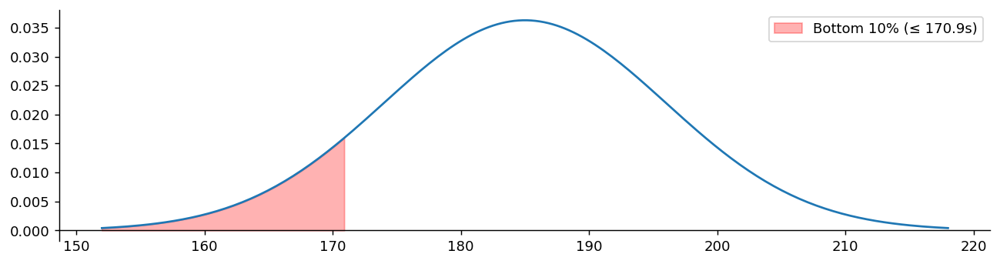

# 연속확률변수

앞 절의 이산확률변수는 값이 가산개뿐이라 각 값에 벽돌을 하나씩 놓을 수 있었다. 그런데 대기 시간, 키, 온도처럼 **연속인 값**을 취하는 양은 사정이 다르다. 가능한 값이 비가산개이므로 각 값에 양의 무게를 놓으면 총합이 무한이 되어 버린다.

해결책은 무게를 **점이 아니라 구간에** 놓는 것이다. 벽돌을 하나씩 세워 놓는 대신 실직선 위에 흙을 얇게 펴 바른다고 생각하면 된다. 어느 한 점의 흙의 양은 0이지만, 구간을 잡으면 그 안의 흙의 양은 양수다.

이 절은 세 개의 정리로 이루어진다. 밀도로 무게를 기술하는 방법(정리 1), 한 점의 확률이 왜 0인지(정리 2), 그리고 이산과 연속이 무엇을 공유하고 무엇이 다른지(정리 3)이다.

## 1. 무게를 점이 아니라 밀도로 놓는다

밀도라는 말은 물리에서 온 것이다. 막대의 어느 점에서 "질량"을 물으면 0이지만 "선밀도"를 물으면 양수이고, 구간에 걸쳐 적분하면 그 부분의 질량이 나온다. 확률도 똑같다.

<div class="thmbox" markdown>

### 정리 1. 확률밀도함수 — 넓이가 확률이다 { .thm }

연속확률변수 $X$의 **확률밀도함수(PDF)** $f(x)$는 다음을 만족하는 함수다.

$$
f(x)\,dx = \text{구간 } [x,\, x+dx] \text{ 안의 무게}
$$

성질은 세 가지다.

$$
\textbf{(1)}\; f(x) \geq 0 \qquad
\textbf{(2)}\; \int_{-\infty}^{\infty} f(x)\,dx = 1 \qquad
\textbf{(3)}\; P(a \leq X \leq b) = \int_a^b f(x)\,dx
$$

</div>

앞의 둘은 이산의 경우와 같다. 비음성과 정규화이며, 합이 적분으로 바뀌었을 뿐이다.

!!! warning "$f(x)$는 확률이 아니다"
    확률질량함수 $p_x$는 그 자체가 확률이었지만 **확률밀도함수 $f(x)$는 확률이 아니다.** 밀도이므로 값이 1을 넘을 수도 있다.

    예컨대 $[0, 0.5]$ 위의 균등분포는 $f(x) = 2$다. 그래도 문제가 없다. 확률을 주는 것은 높이가 아니라 **곡선 아래의 넓이**이고, 이 경우 $2 \times 0.5 = 1$이다.

    $f(x)$를 확률로 읽는 것이 연속확률변수에서 가장 흔한 오해다. 단위를 보면 분명해진다. $X$가 초 단위라면 $f(x)$의 단위는 "초당"이고, $f(x)\,dx$에서야 비로소 단위가 없는 확률이 된다.

<div class="exbox" markdown>

**보기 1.** 정규분포. 가장 널리 쓰이는 연속분포는 평균 $\mu$, 분산 $\sigma^2$인 **정규분포**이며 밀도는 다음과 같다.

$$
f(x) = \frac{1}{\sqrt{2\pi\sigma^2}} \exp\!\left(-\frac{(x - \mu)^2}{2\sigma^2}\right)
$$

두 값 사이의 곡선 아래 넓이가 $X$가 그 범위에 들어갈 확률이다.

</div>

## 2. 한 점의 확률은 0이다

밀도로 무게를 놓기로 한 순간 따라오는 귀결이 있다. 폭이 없는 점에는 넓이가 없다.

<div class="thmbox" markdown>

### 정리 2. 점 확률의 소멸 — 연속확률변수는 특정 값을 취할 확률이 0이다 { .thm }

연속확률변수 $X$와 임의의 값 $a$에 대해

$$
P(X = a) = \int_a^a f(x)\,dx = 0
$$

이다. 따라서 등호의 포함 여부가 확률을 바꾸지 않는다.

$$
P(a \leq X \leq b) = P(a < X < b)
$$

</div>

이산확률변수에서는 $P(X = a)$를 묻는 것이 자연스러웠지만, 연속에서는 그 물음 자체가 정보를 담지 않는다. 의미 있는 물음은 **범위**에 대한 것뿐이다. "대기 시간이 정확히 185.000…초일 확률"이 아니라 "180초에서 190초 사이일 확률"을 묻는다.

3.1절에서 확인했듯 **확률 0은 불가능이 아니다.** 실제로 어떤 값 하나는 반드시 실현되며, 그 값이 나올 확률은 0이었다.

<div class="exbox" markdown>

**보기 2.** 어밀리아의 최대 대기시간. 드라이브스루의 평균 대기시간이 $\mu = 185$초, $\sigma = 11$초인 근사 정규분포를 따른다. 어밀리아는 대기시간이 하위 10%에 드는 식당만 이용한다. 그가 받아들이는 최대 대기시간은?

넓이가 0.1이 되는 지점을 찾는 문제, 즉 10번째 백분위수를 구하는 문제다.

</div>

```python
import numpy as np
import matplotlib.pyplot as plt
from scipy import stats

mu = 185       # 평균 대기시간(초)
sigma = 11     # 표준편차

# ppf(0.1)은 "아래쪽 10%의 경계"를 돌려준다. CDF의 역함수다.
# 즉 P(X <= max_wait) = 0.1 이 되는 지점이다.
max_wait = stats.norm(loc=mu, scale=sigma).ppf(0.1)
print(f"Maximum average wait time: {max_wait:.2f} seconds")

# 시각화: 평균에서 좌우 3 표준편차 구간을 그린다
x = np.linspace(mu - 3*sigma, mu + 3*sigma, 200)
pdf = stats.norm(loc=mu, scale=sigma).pdf(x)

fig, ax = plt.subplots(figsize=(12, 3))
ax.plot(x, pdf)

# 하위 10%에 해당하는 영역을 칠한다.
# 연속확률변수에서 "확률 = 곡선 아래 넓이"라는 사실을 눈으로 보여 준다.
x_fill = np.linspace(mu - 3*sigma, max_wait, 100)
ax.fill_between(x_fill, stats.norm(loc=mu, scale=sigma).pdf(x_fill),
                alpha=0.3, color='r', label=f'Bottom 10% (≤ {max_wait:.1f}s)')
ax.spines[['right', 'top']].set_visible(False)
ax.spines['bottom'].set_position('zero')
ax.legend()
plt.show()
```

출력:

```
Maximum average wait time: 170.90 seconds
```



색칠된 부분의 **넓이**가 0.1이다. 높이가 아니라 넓이라는 점을 다시 확인하라.

## 3. 이산과 연속은 같은 것의 두 얼굴이다

표기가 달라 다른 이론처럼 보이지만, 바뀐 것은 합이 적분으로 바뀐 것뿐이다.

<div class="thmbox" markdown>

### 정리 3. 이산과 연속의 대응 — 합과 적분 { .thm }

| 특징 | 이산 | 연속 |
|:---|:---|:---|
| 값의 집합 | 가산 | 비가산(구간) |
| 한 점의 확률 | $P(X=a) > 0$ 가능 | 언제나 $P(X=a) = 0$ |
| 확률함수 | 확률질량함수 $p_{x_i}$ | 확률밀도함수 $f(x)$ |
| 그 값의 의미 | 확률 자체 | 밀도(확률이 아님) |
| 범위의 확률 | $\sum_{x_i \in [a,b]} p_{x_i}$ | $\int_a^b f(x)\,dx$ |
| 전체 확률 | $\sum_i p_{x_i} = 1$ | $\int_{-\infty}^{\infty} f(x)\,dx = 1$ |

</div>

표의 마지막 두 줄이 요점이다. **$\sum$을 $\int$로 바꾸면 그대로 옮겨진다.** 3.4절의 기댓값과 분산도 이 대응을 따라 이산에서 연속으로 그대로 확장된다.

두 세계를 하나의 언어로 묶는 도구가 있다면 더 편할 것이다. 실제로 있다. 다음 절의 **누적분포함수**가 그것이며, 이산이든 연속이든 똑같이 정의되고 똑같이 쓰인다.

## 연습문제

<div class="drillbox" markdown>

**연습문제 1.**
$0 \le x \le 2$에서 $f(x) = c x^2$이고 그 밖에서는 0이다. (a) $c$를 구하라. (b) $F(x)$를 계산하라. (c) $P(1 \le X \le 2)$를 구하라. (d) 중앙값을 구하라.

</div>

??? success "풀이"
    (a) $\int_0^2 c x^2 dx = 8c/3 = 1 \Rightarrow c = 3/8$.

    (b) $x \in [0, 2]$에서 $F(x) = \int_0^x (3/8) t^2 dt = x^3/8$이고, 그 아래에서는 0, 위에서는 1이다.

    (c) $P(1 \le X \le 2) = F(2) - F(1) = 1 - 1/8 = 7/8$.

    (d) $F(m) = 1/2 \Rightarrow m^3/8 = 1/2 \Rightarrow m = \sqrt[3]{4} \approx 1.587$.

<div class="drillbox" markdown>

**연습문제 2.**
**연속인 $X$에 대해 $P(X = a) = 0$인 이유.** 누적분포함수로부터 엄밀하게 논증하라.

</div>

??? success "풀이"
    누적분포함수 $F$가 연속인 연속확률변수 $X$에 대해, $a$에서 $F$의 연속성을 이용하면

    $$
    P(X = a) = \lim_{\varepsilon \to 0^+} P(a - \varepsilon < X \le a) = \lim_{\varepsilon \to 0^+} [F(a) - F(a - \varepsilon)] = F(a) - F(a^-) = 0
    $$

    이다.

    **참고:** $P(X = a) = 0$이라고 해서 $X = a$가 불가능하다는 뜻은 *아니다*. 르베그의 의미에서 그 사건의 확률이 0이라는 뜻이다. 연속확률변수의 특정 결과는 하나하나가 "무한히 일어나기 어렵지만" 표본공간은 여전히 비가산이고 뽑을 때마다 확정된 결과가 나온다.

    이것이 초급 확률에서 "$P(0)$이 불가능을 뜻하지 않는다"는 혼란의 근원이다. 해결책은 점의 확률이 아니라 밀도로 생각하는 것이다. 연속확률변수는 확률을 점이 아니라 구간에 몰아 놓는다.

<div class="drillbox" markdown>

**연습문제 3.**
**연속 확률밀도함수의 변환 규칙.** $X$의 밀도가 $f_X$이고 $Y = g(X)$이며 $g$가 순증가하고 미분가능할 때 $Y$의 밀도를 유도하라.

</div>

??? success "풀이"
    누적분포함수에서 출발한다: $F_Y(y) = P(Y \le y) = P(g(X) \le y) = P(X \le g^{-1}(y)) = F_X(g^{-1}(y))$.

    연쇄법칙으로 미분하면

    $$
    f_Y(y) = F_Y'(y) = f_X(g^{-1}(y)) \cdot \frac{d}{dy} g^{-1}(y) = \frac{f_X(g^{-1}(y))}{g'(g^{-1}(y))}
    $$

    이다. 또는 더 간결하게, $x = g^{-1}(y)$로 두면

    $$
    f_Y(y) = \frac{f_X(x)}{|g'(x)|}
    $$

    이다. 절댓값을 쓰면 $g$가 감소하는 경우도 함께 다룰 수 있다.

    **예:** $X \sim N(0, 1)$, $Y = e^X$라 하자. 그러면 $g(x) = e^x$, $g'(x) = e^x = y$, $x = \ln y$이므로

    $$
    f_Y(y) = \frac{1}{\sqrt{2\pi}} e^{-(\ln y)^2/2} \cdot \frac{1}{y}
    $$

    이며, 이것이 **로그정규분포**의 밀도다.

<div class="drillbox" markdown>

**연습문제 4.**
**연속확률변수의 기댓값.** $[0, 1]$에서 확률밀도함수가 $f(x) = 2x$인 $X$에 대해 $\mathbb{E}[X]$, $\mathbb{E}[X^2]$, $\mathrm{Var}(X)$를 계산하라.

</div>

??? success "풀이"
    $\mathbb{E}[X] = \int_0^1 x \cdot 2x \, dx = \int_0^1 2x^2 \, dx = 2/3$.

    $\mathbb{E}[X^2] = \int_0^1 x^2 \cdot 2x \, dx = \int_0^1 2x^3 \, dx = 1/2$.

    $\mathrm{Var}(X) = \mathbb{E}[X^2] - (\mathbb{E}[X])^2 = 1/2 - 4/9 = 9/18 - 8/18 = 1/18 \approx 0.0556$.

    표준편차 $\approx 0.236$.

<div class="drillbox" markdown>

**연습문제 5.**
**지수분포의 무기억 성질.** $X \sim \mathrm{Exp}(\lambda)$이면 모든 $s, t \ge 0$에 대해 $P(X > s + t \mid X > s) = P(X > t)$임을 증명하라. 그 해석은 무엇인가?

</div>

??? success "풀이"
    생존함수는 $P(X > x) = e^{-\lambda x}$이다. 조건부확률의 정의를 적용하면

    $$
    P(X > s + t \mid X > s) = \frac{P(X > s + t \cap X > s)}{P(X > s)} = \frac{P(X > s + t)}{P(X > s)} = \frac{e^{-\lambda(s+t)}}{e^{-\lambda s}} = e^{-\lambda t} = P(X > t)
    $$

    이다. $\square$

    **해석:** 어떤 사건을 이미 $s$만큼 기다렸다면 남은 대기시간의 분포는 방금 기다리기 시작한 것과 같다. 이 과정은 얼마나 오래 기다렸는지를 "잊어버린다".

    **현실적 함의:**

    - 방사성 붕괴: 붕괴가 무기억적이기 때문에 반감기가 잘 정의된다.
    - 통화 시간: 기억 효과 때문에 경험적으로 지수분포가 아니다(긴 통화는 대개 계속된다).
    - 창구에 오는 고객: 지수 도착간격을 갖는 포아송 과정으로 잘 모형화되는 경우가 많다.

    지수분포는 무기억 성질을 갖는 **유일한** 연속분포이며, 이는 인상적인 특성화다.

<div class="drillbox" markdown>

**연습문제 6.**
**혼합분포.** 순수하게 이산도 아니고 순수하게 연속도 아닌 확률변수 $X$의 예를 들어라. 그 누적분포함수에 도약과 연속 구간이 함께 있음을 보여라.

</div>

??? success "풀이"
    예: (센서가 작동하지 않아서 등의 이유로) "0"이 될 가능성이 있고, 작동할 때는 연속 성분을 갖는 측정값.

    $Y \sim \mathrm{Exp}(1)$이라 하고 $A$를 $Y$와 독립인 Bernoulli(0.3)이라 하자. $X = A \cdot Y$로 정의한다.

    - 확률 0.7로 $A = 0$이므로 $X = 0$이다.
    - 확률 0.3으로 $A = 1$이므로 $X = Y \sim \mathrm{Exp}(1)$이다.

    누적분포함수:

    $$
    F(x) = \begin{cases} 0 & x < 0 \\ 0.7 + 0.3(1 - e^{-x}) & x \ge 0 \end{cases}
    $$

    $x = 0$에서 $F(0) = 0.7$로 0에 있는 이산 질량에 대응하는 **도약**이 있다.
    $x > 0$에서는 0.7에서 1까지 연속적으로 증가한다.

    이런 혼합분포는 실무에 자주 등장한다(영과잉 계수 모형, 보험 청구액, 절단된 측정값). 르베그–스틸체스 적분의 틀이 이들을 엄밀하게 다루며, 실용적으로는 이산 부분과 연속 부분으로 분해해 각각 적절히 적분한다.

<div class="drillbox" markdown>

**연습문제 7.**
연습문제 $3$은 $g$가 **순증가**일 때의 변환 규칙이었다. $g$가 단조가 아니면 어떻게 되는가? $Y = X^2$으로 확인하라.

</div>

??? success "풀이"
    $g$가 단조가 아니면 $y$ 하나에 여러 $x$가 대응한다. 각 가지의 기여를 **더해야** 한다.

    $$
    f_Y(y) = \sum_{i:\, g(x_i)=y} \frac{f_X(x_i)}{\lvert g'(x_i)\rvert}
    $$

    $Y = X^2$이면 $x = \pm\sqrt{y}$ 두 가지이고 $\lvert g'(x)\rvert = 2\sqrt{y}$이므로

    $$
    f_Y(y) = \frac{f_X(\sqrt{y}) + f_X(-\sqrt{y})}{2\sqrt{y}}, \qquad y > 0
    $$

    이다. $X \sim N(0,1)$이면 $f_X$가 대칭이라

    $$
    f_Y(y) = \frac{2\phi(\sqrt{y})}{2\sqrt{y}} = \frac{1}{\sqrt{2\pi y}}e^{-y/2}
    $$

    이고, 이것이 자유도 $1$인 카이제곱분포의 밀도다.

    ```python
    import numpy as np
    from scipy import stats

    rng = np.random.default_rng(0)
    X = rng.normal(0, 1, 600_000)
    Y = X ** 2

    print("Y = X^2,  X ~ N(0,1)  →  Y ~ chi2(1)")
    print(f"{'분위수':>8}{'모의':>10}{'chi2(1)':>10}")
    for q in (0.25, 0.50, 0.75, 0.95):
        print(f"{q:>8.2f}{np.quantile(Y, q):>10.4f}{stats.chi2.ppf(q, 1):>10.4f}")

    print(f"\n평균 {Y.mean():.4f} (이론 1)   분산 {Y.var():.4f} (이론 2)")
    print(f"y=0 근처에서 밀도가 발산한다: f(0.01) = {stats.chi2.pdf(0.01, 1):.3f}")
    ```

    출력:

    ```
    Y = X^2,  X ~ N(0,1)  →  Y ~ chi2(1)
         분위수        모의   chi2(1)
        0.25    0.1025    0.1015
        0.50    0.4567    0.4549
        0.75    1.3239    1.3233
        0.95    3.8445    3.8415

    평균 1.0022 (이론 1)   분산 2.0121 (이론 2)
    y=0 근처에서 밀도가 발산한다: f(0.01) = 3.970
    ```

    **분위수가 정확히 맞는다.**

    **두 가지를 눈여겨보라.**

    **첫째, 밀도가 $y \to 0^+$에서 발산한다.** $1/\sqrt{y}$ 항 때문이다. **밀도는 $1$을 넘을 수 있고 무한대로 갈 수도 있다.** 확률이 아니라 밀도이기 때문이며, 적분만 유한하면 된다.

    **둘째, 이 변환이 카이제곱분포의 정의다.** 표준정규의 제곱합이 카이제곱이고, 그것이 표본분산의 분포로 이어진다(0장 선형대수 문서에서 본 이차형식). **변환 공식 하나가 통계 이론 전체의 출발점**인 셈이다.

    **주의할 경우.**

    - **$g'$가 $0$이 되는 점**에서는 공식이 무너진다. 그 점 근처를 따로 다루어야 한다.
    - **$g$가 상수인 구간이 있으면** 그 값에 **확률질량**이 생겨 순수 연속이 아니게 된다(연습문제 6의 혼합분포).
    - **가장 안전한 방법은 누적분포함수로 가는 것이다.** $F_Y(y) = P(g(X) \le y)$를 직접 계산한 뒤 미분하면 가지를 빠뜨릴 위험이 없다. $\square$

<div class="drillbox" markdown>

**연습문제 8.**
표본에서 **최솟값과 최댓값**의 분포는 어떻게 되는가? 순서통계량의 분포를 유도하고 확인하라.

</div>

??? success "풀이"
    $X_1,\ldots,X_n$이 i.i.d.이고 누적분포함수가 $F$일 때

    $$
    F_{X_{(n)}}(x) = P(\text{모두} \le x) = F(x)^n,
    \qquad
    F_{X_{(1)}}(x) = 1 - \left(1-F(x)\right)^n
    $$

    이다. 미분하면 밀도를 얻는다. 일반적으로 $k$번째 순서통계량은

    $$
    f_{X_{(k)}}(x) = \frac{n!}{(k-1)!(n-k)!}F(x)^{k-1}\left(1-F(x)\right)^{n-k}f(x)
    $$

    이며, **$U(0,1)$이면 $X_{(k)} \sim \text{Beta}(k,\ n-k+1)$**이다.

    ```python
    import numpy as np

    rng = np.random.default_rng(0)
    n, B = 10, 300_000
    U = np.sort(rng.random((B, n)), axis=1)

    print(f"U(0,1) 에서 n={n} 일 때 순서통계량의 평균")
    print(f"{'k':>4}{'모의':>11}{'이론 k/(n+1)':>15}")
    for k in (1, 3, 5, 8, 10):
        print(f"{k:>4}{U[:, k-1].mean():>11.5f}{k/(n+1):>15.5f}")

    print(f"\n최댓값의 분산 {U[:, -1].var():.6f}   "
          f"이론 {n / ((n+1)**2 * (n+2)):.6f}")
    ```

    출력:

    ```
    U(0,1) 에서 n=10 일 때 순서통계량의 평균
       k         모의     이론 k/(n+1)
       1    0.09096        0.09091
       3    0.27283        0.27273
       5    0.45469        0.45455
       8    0.72724        0.72727
      10    0.90910        0.90909

    최댓값의 분산 0.006901   이론 0.006887
    ```

    **모의와 이론이 소수점 다섯째 자리까지 맞는다.**

    **$\mathbb{E}[X_{(k)}] = k/(n+1)$이라는 결과가 깔끔하다.** $n$개의 점이 $[0,1]$을 $n+1$개의 구간으로 나누고, 각 구간의 기대 길이가 $1/(n+1)$로 같기 때문이다.

    **이것이 여러 곳에서 쓰인다.**

    - **Q–Q 그림의 플로팅 위치.** 2장 matplotlib 문서 연습문제 7에서 $(i-0.5)/n$을 썼는데, $i/(n+1)$을 쓰는 관례도 있다. 전자는 중앙값 기반, 후자는 평균 기반이다.
    - **분위수 추정.** 2장 ECDF 문서 연습문제 8의 여러 분위수 정의가 순서통계량을 어떻게 보간하느냐의 차이다.
    - **극단값 이론.** $X_{(n)}$의 분포가 $F$의 꼬리에 지배되며, 적절히 정규화하면 검벨·프레셰·바이불로 수렴한다(1장 모수 대 통계량 문서 연습문제 8).

    **최댓값의 특이한 성질.** 분산이 $n/((n+1)^2(n+2))$로 $n^{-2}$ 규모로 줄어든다. **표본평균의 $n^{-1}$보다 빠르다.** 그래서 유계 분포의 상한을 추정할 때는 최댓값이 매우 효율적이며, 이것이 1장에서 언급한 $U(0,\theta)$의 초효율 속도 $n^{-1}$의 근원이다. $\square$

<div class="drillbox" markdown>

**연습문제 9.**
연속분포라고 **적률이 존재한다는 보장은 없다.** 파레토분포로 확인하고 그 실무적 의미를 논하라.

</div>

??? success "풀이"
    파레토분포 $f(x) = \alpha x^{-(\alpha+1)}$, $x \ge 1$에서

    $$
    \mathbb{E}[X^k] = \int_1^\infty x^k \alpha x^{-(\alpha+1)}dx = \alpha\int_1^\infty x^{k-\alpha-1}dx
    $$

    는 $k < \alpha$일 때만 수렴한다. **즉 $\alpha$차 이상의 적률은 존재하지 않는다.**

    ```python
    import numpy as np

    rng = np.random.default_rng(0)
    N = 2_000_000

    print(f"{'alpha':>7}{'표본평균':>12}{'이론 평균':>12}{'표본분산':>16}{'분산 존재':>10}")
    for a in (0.8, 1.5, 2.5, 3.5):
        x = rng.pareto(a, N) + 1
        mean_th = a / (a - 1) if a > 1 else float("inf")
        print(f"{a:>7.1f}{x.mean():>12.3f}{mean_th:>12.3f}{x.var():>16.1f}{str(a > 2):>10}")

    print("\n표본평균의 변동이 sqrt(n) 속도로 줄어드는가?")
    for label, a in [("분산 없음 (alpha=1.5)", 1.5), ("분산 있음 (alpha=3.5)", 3.5)]:
        print(f"  {label}")
        prev = None
        for n in (10 ** 3, 10 ** 4, 10 ** 5, 10 ** 6):
            s = np.std([(rng.pareto(a, n) + 1).mean() for _ in range(300)])
            ratio = f"   직전 대비 {prev / s:.2f}배" if prev else ""
            print(f"    n={n:>8}: {s:.5f}{ratio}")
            prev = s
    print(f"\n  sqrt(n) 이면 n 이 10배 될 때마다 {np.sqrt(10):.2f}배씩 줄어야 한다")
    ```

    출력:

    ```
      alpha        표본평균       이론 평균            표본분산     분산 존재
        0.8     141.802         inf    1932163866.8     False
        1.5       3.006       3.000          2164.1     False
        2.5       1.666       1.667             2.0      True
        3.5       1.401       1.400             0.4      True

    표본평균의 변동이 sqrt(n) 속도로 줄어드는가?
      분산 없음 (alpha=1.5)
        n=    1000: 1.08544
        n=   10000: 0.18283   직전 대비 5.94배
        n=  100000: 0.15373   직전 대비 1.19배
        n= 1000000: 0.03477   직전 대비 4.42배
      분산 있음 (alpha=3.5)
        n=    1000: 0.01909
        n=   10000: 0.00606   직전 대비 3.15배
        n=  100000: 0.00201   직전 대비 3.02배
        n= 1000000: 0.00056   직전 대비 3.56배

      sqrt(n) 이면 n 이 10배 될 때마다 3.16배씩 줄어야 한다

    ```

    **$\alpha = 0.8$이면 평균조차 없다.** 표본평균이 $285$로 나오지만 이 값은 아무 의미가 없다. 표본을 다시 뽑으면 전혀 다른 값이 나온다.

    **$\alpha = 1.5$면 평균은 있지만 분산이 없다.** 표본평균이 이론값 $3.0$에 맞기는 하지만, 수렴 방식이 전혀 다르다.

    | $n$ 10배 증가 | $\alpha=1.5$ (분산 없음) | $\alpha=3.5$ (분산 있음) |
    |---|---|---|
    | $10^3 \to 10^4$ | $5.94$배 | $3.15$배 |
    | $10^4 \to 10^5$ | $1.19$배 | $3.02$배 |
    | $10^5 \to 10^6$ | $4.42$배 | $3.56$배 |

    **분산이 있으면 감소 배수가 $\sqrt{10} \approx 3.16$ 근처로 안정적이다.** 중심극한정리가 보장하는 $\sqrt{n}$ 속도다.

    **분산이 없으면 배수가 $1.19$에서 $5.94$까지 들쭉날쭉하다.** 이 자체가 신호다. 큰 관측 하나가 들어오느냐에 따라 표본평균이 좌우되므로, **수렴 속도라는 개념 자체가 불안정하다.** 이론적으로는 $n^{1-1/\alpha}$ 속도로 안정분포에 수렴하지만, 그 극한은 정규가 아니다.

    **실무적 의미가 크다.**

    | 존재하는 적률 | 무엇이 무너지는가 |
    |---|---|
    | 평균 없음 ($\alpha \le 1$) | 큰수의 법칙 실패, 표본평균이 발산 |
    | 분산 없음 ($1 < \alpha \le 2$) | **중심극한정리 실패**, $t$ 검정·신뢰구간 무효 |
    | 4차 적률 없음 ($\alpha \le 4$) | 표본분산의 분산이 무한, $F$ 검정 불안정 |

    **둘째 줄이 특히 중요하다.** 3장 뒤에서 볼 중심극한정리는 **유한 분산**을 요구한다. 그것이 없으면 표본평균이 정규가 아니라 **안정분포**로 수렴하며, 표준적인 추론이 모두 무효가 된다.

    **어디서 마주치는가.** 소득, 도시 인구, 지진 규모, 보험 대형 손실, 금융 수익률의 꼬리가 $\alpha = 1.5$–$3$ 범위로 추정되는 경우가 많다. **$\alpha < 2$이면 "평균 손실"을 논하는 것 자체가 위험하다.**

    **진단.** 표본평균을 $n$에 따라 그려 보아 안정되지 않으면 적률의 존재를 의심해야 한다. 2장 왜도·첨도 문서 연습문제 9의 강건 측도가 이런 상황을 위한 것이다. $\square$

<div class="drillbox" markdown>

**연습문제 10.**
연습문제 $5$의 무기억성을 일반화하라. **위험률**로 분포를 특징짓고, 지수분포가 어떤 위치를 차지하는지 밝혀라.

</div>

??? success "풀이"
    **위험률**은 "지금까지 살아남았을 때 바로 다음 순간 일어날 조건부 강도"다.

    $$
    h(t) = \frac{f(t)}{1-F(t)} = -\frac{d}{dt}\log S(t), \qquad S(t) = 1-F(t)
    $$

    적분해 되돌리면 $S(t) = \exp\left(-\int_0^t h(u)\,du\right)$이므로, **위험률이 분포를 완전히 결정한다.**

    ```python
    import numpy as np
    from scipy import stats

    grid = np.linspace(0.1, 3.0, 7)
    print(f"{'t':>6}{'지수(1)':>11}{'와이불 k=0.5':>15}{'와이불 k=2':>13}{'로그정규':>12}")
    for t in grid:
        h_exp = 1.0
        h_w05 = stats.weibull_min.pdf(t, 0.5) / stats.weibull_min.sf(t, 0.5)
        h_w2 = stats.weibull_min.pdf(t, 2) / stats.weibull_min.sf(t, 2)
        h_ln = stats.lognorm.pdf(t, 1) / stats.lognorm.sf(t, 1)
        print(f"{t:>6.2f}{h_exp:>11.4f}{h_w05:>15.4f}{h_w2:>13.4f}{h_ln:>12.4f}")
    ```

    출력:

    ```
    t      지수(1)      와이불 k=0.5      와이불 k=2        로그정규
      0.10     1.0000         1.5811       0.2000      0.2846
      0.58     1.0000         0.6547       1.1667      0.8389
      1.07     1.0000         0.4841       2.1333      0.7870
      1.55     1.0000         0.4016       3.1000      0.7072
      2.03     1.0000         0.3506       4.0667      0.6383
      2.52     1.0000         0.3152       5.0333      0.5816
      3.00     1.0000         0.2887       6.0000      0.5349
    ```

    **지수분포만 위험률이 일정하다.** 그것이 무기억성의 정확한 내용이다.

    $$
    h(t) = \lambda \text{ (상수)} \iff S(t) = e^{-\lambda t} \iff \text{무기억성}
    $$

    **세 조건이 서로 동치이며, 연속분포 중 이를 만족하는 것은 지수분포뿐이다.**

    **위험률의 모양이 분포의 성격을 말해 준다.**

    | 위험률 | 뜻 | 예 |
    |---|---|---|
    | 일정 | 노화도 개선도 없다 | 방사성 붕괴, 지수 |
    | 증가 | **노화** — 오래될수록 위험 | 마모, 와이불 $k>1$ |
    | 감소 | **길들이기** — 초기 결함이 걸러진다 | 유아 사망, 와이불 $k<1$ |
    | 욕조 곡선 | 초기 감소 후 증가 | 기계 부품, 인간 수명 |
    | 증가 후 감소 | 비단조 | 로그정규 |

    **왜 위험률로 생각하는가.**

    - **해석이 직접적이다.** "$5$년을 버틴 기계가 앞으로 $1$년 안에 고장 날 확률"이 실무에서 묻는 질문이며, 밀도가 아니라 위험률이 그 답에 대응한다.
    - **검열된 자료를 자연스럽게 다룬다.** 아직 사건이 일어나지 않은 관측도 "그 시점까지 살아남았다"는 정보를 준다.
    - **비례위험 모형의 토대다.** 콕스 회귀는 $h(t\mid x) = h_0(t)e^{\beta^T x}$로 두어 기저 위험률 $h_0$를 추정하지 않고도 $\beta$를 추정한다.

    **지수분포가 특별한 위치에 있는 이유가 정리된다.** 위험률이 일정하다는 것은 **"과거를 기억하지 않는다"** 는 뜻이고, 그것이 포아송 과정(이산형 문서 연습문제 8)과 마르코프 성질(조건부 독립 문서 연습문제 4)의 연속 시간판이다. **세 개념이 하나의 성질을 세 언어로 말한 것**이다. $\square$


## 정리하며

연속확률변수는 무게를 다루는 방식만 바꾼 것이다.

- **정리 1**은 무게를 점이 아니라 **밀도**로 놓았다. 확률을 주는 것은 높이가 아니라 곡선 아래의 넓이다.
- **정리 2**는 그 귀결로 한 점의 확률이 0임을 보였다. 등호를 넣든 빼든 확률이 같아지고, 의미 있는 물음은 범위에 대한 것뿐이다.
- **정리 3**은 이산과 연속이 $\sum \leftrightarrow \int$의 대응으로 이어져 있음을 정리했다.

이산과 연속을 나누어 배우는 것은 계산 방법이 다르기 때문이지 이론이 둘이기 때문이 아니다. 확률의 공리는 하나이고, 두 경우 모두 그 위에 서 있다.

그렇다면 두 세계를 아예 하나의 함수로 다룰 수는 없을까? 이산이든 연속이든 똑같이 정의되고, 확률질량함수와 확률밀도함수를 모두 대신할 수 있는 함수 말이다.

있다. **누적분포함수** $F(x) = P(X \le x)$이며, 다음 절의 주제다. 이 함수 하나로 분포가 완전히 결정되고, 여기서 분위수와 난수 생성까지 따라 나온다.
