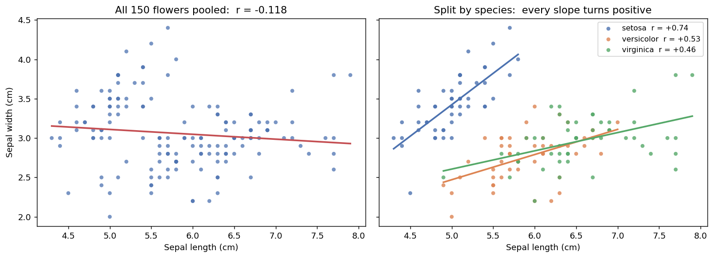
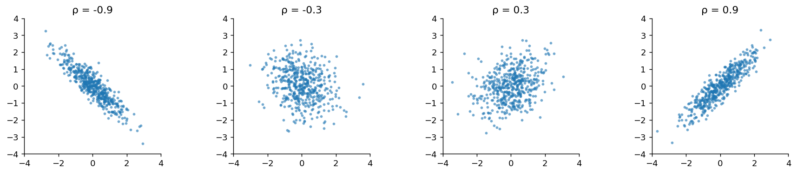
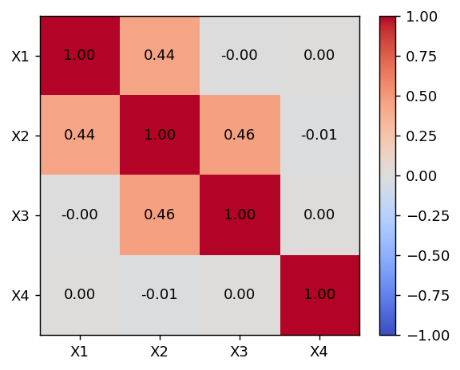

# 상관계수

[앞 쪽](variance_covariance.md)에서 **공분산**을 정의했다. $\operatorname{Cov}(X,Y) = E[XY] - E[X]E[Y]$는 곱 규칙이 깨지는 정도를 재는 양이었다.

그런데 공분산에는 실용적인 결함이 하나 있다. **단위가 붙어 있다.** 키와 몸무게의 공분산은 cm·kg 단위로 나오고, 키를 m로 바꿔 재면 같은 자료인데도 값이 100분의 1이 된다. 크기만 보고 "관계가 세다"고 말할 수 없다는 뜻이다.

단위를 없애면 비교할 수 있게 된다. 그것이 상관계수다.

## 1. 공분산을 표준편차로 나누면 단위가 사라진다

<div class="thmbox" markdown>

### 정리 1. 피어슨 상관계수와 그 범위 { .thm }

$$
\rho(X, Y) = \frac{\operatorname{Cov}(X, Y)}{\sigma_X \, \sigma_Y}
$$

는 **단위가 없는** 수이며 언제나

$$
-1 \le \rho(X,Y) \le 1
$$

이다. $\rho = \pm 1$일 필요충분조건은 $Y = aX + b$ 꼴의 **완전한 선형관계**($a \ne 0$)다.

</div>

??? proof "증명"

    범위가 $[-1, 1]$이라는 것은 코시–슈바르츠 부등식의 결과이며, 분산이 음수가 될 수 없다는 사실만으로 유도된다. 임의의 실수 $t$에 대해

    $$
    0 \le \operatorname{Var}\bigl(t(X - \mu_X) + (Y - \mu_Y)\bigr)
    = t^2 \sigma_X^2 + 2t\operatorname{Cov}(X,Y) + \sigma_Y^2
    $$

    이다. 오른쪽은 $t$에 대한 이차식인데 **모든 $t$에서 음수가 아니므로 판별식이 $0$ 이하**여야 한다.

    $$
    4\operatorname{Cov}(X,Y)^2 - 4\sigma_X^2\sigma_Y^2 \le 0
    \quad \Longrightarrow \quad
    |\operatorname{Cov}(X,Y)| \le \sigma_X \sigma_Y
    $$

    양변을 $\sigma_X\sigma_Y$로 나누면 $|\rho| \le 1$이다.

    **등호가 성립하는 경우.** 판별식이 정확히 $0$이면 어떤 $t$에서 위 분산이 $0$이 되고, 그것은 $t(X-\mu_X) + (Y-\mu_Y)$가 상수라는 뜻이다. 곧 $Y$가 $X$의 일차식으로 완전히 결정된다. $\square$

**등호가 뜻하는 것을 새겨 두자.** $\rho = \pm 1$은 두 변수가 **직선 위에 놓인다**는 말이며, 그보다 약한 어떤 관계도 아니다. 뒤집어 말하면 $\rho$는 직선에서 얼마나 벗어났는지만 재고 있다는 뜻이기도 하다.

**단위가 없다는 것이 핵심이다.** $\rho(aX+b,\; cY+d) = \operatorname{sign}(ac)\,\rho(X,Y)$이므로 척도를 바꾸어도 값이 변하지 않는다. 키를 cm로 재든 m로 재든 상관계수는 같다.

## 2. 상관계수가 재는 것과 못 재는 것

<div class="thmbox" markdown>

### 정리 2. 상관계수는 선형 관계만, 그것도 잰 집단 안에서만 잰다 { .thm }

$\rho$는 두 가지를 하지 **못한다.**

**하나, 비선형 관계를 보지 못한다.** $\rho = 0$은 "선형 성분이 없다"는 뜻이지 "관계가 없다"는 뜻이 아니다.

**둘, 두 변수만의 성질이 아니다.** 같은 두 변수라도 **어떤 집단에서 쟀느냐**에 따라 값이, 심지어 부호까지 달라진다.

</div>

??? proof "증명"

    두 주장 모두 반례를 하나씩 들면 끝난다.

    **하나 — 비선형 관계를 보지 못한다.** $X$가 $0$을 중심으로 대칭이고 $E[X^2] < \infty$, $E[|X|^3] < \infty$라 하고 $Y = X^2$으로 두자. 대칭성에서 $E[X] = 0$이고 $E[X^3] = 0$이므로

    $$
    \operatorname{Cov}(X, Y) = E[X \cdot X^2] - E[X]\,E[X^2] = E[X^3] - 0 = 0
    $$

    이다. 곧 $\rho = 0$이다. 그런데 $X$를 알면 $Y$가 완전히 결정되므로 **이보다 강한 종속은 없다.** $\rho = 0$이 "관계 없음"을 뜻하지 못한다.

    **둘 — 집단에 따라 부호가 바뀐다.** 집단을 나타내는 확률변수 $G$를 두고 **총공분산의 법칙**을 쓴다.

    $$
    \operatorname{Cov}(X,Y)
    = \underbrace{E\big[\operatorname{Cov}(X, Y \mid G)\big]}_{\text{집단 안의 공분산}}
    \;+\; \underbrace{\operatorname{Cov}\big(E[X\mid G],\, E[Y\mid G]\big)}_{\text{집단 사이의 공분산}}
    $$

    (이 항등식은 $\operatorname{Cov}(X,Y) = E[XY] - E[X]E[Y]$의 두 항에 각각 전기댓값의 법칙을 적용하면 나온다.) 첫 항은 각 집단 **안**의 공분산을 평균한 것이고, 둘째 항은 집단 **평균들** 사이의 공분산이다. 두 항의 부호가 반대일 수 있고 둘째 항이 더 클 수 있으므로, 모든 집단 안에서 $\operatorname{Cov}(X,Y\mid G) > 0$이면서 전체 $\operatorname{Cov}(X,Y) < 0$인 분포가 존재한다. 아래 붓꽃 자료가 정확히 그 예다. $\square$

### 값을 어떻게 읽을 것인가

| $\rho$ | 해석 |
|:---|:---|
| $\rho = +1$ | 완전한 양의 선형 관계 |
| $0.7 \leq \rho < 1$ | 강한 양의 연관성 |
| $0.3 \leq \rho < 0.7$ | 중간 정도의 양의 연관성 |
| $0 < \rho < 0.3$ | 약한 양의 연관성 |
| $\rho = 0$ | 선형 관계 없음 |
| $\rho < 0$ | 음의 연관성 (마찬가지로 해석) |
| $\rho = -1$ | 완전한 음의 선형 관계 |

이 표는 눈금일 뿐이고 증명의 대상이 아니다. 분야마다 "강하다"의 기준이 다르며, 물리 실험에서 $\rho = 0.7$은 실망스러운 값이지만 사회과학 설문에서는 매우 높은 값이다.

표를 그대로 외워 부호만 읽으면 낭패를 보기 쉽다. 정리 2의 둘째 주장 — **상관계수는 두 변수의 성질이 아니라 "어떤 집단에서 쟀는가"에 달린 값** — 을 실제 자료로 보는 편이 빠르다.

### 실제 자료에서: 집단을 섞으면 부호가 뒤집힌다

붓꽃 150송이를 재어 놓은 자료가 있다. setosa, versicolor, virginica 세 품종이 50송이씩이고, 송이마다 꽃받침의 길이와 너비가 기록되어 있다. 꽃받침이 길수록 넓을 것 같지만 실제로 계산해 보면 그렇지 않다.

<div class="exbox" markdown>

**보기 1.** <span class="diff easy" title="쉬움"></span> 상관계수는 집단을 탄다. 붓꽃 $150$ 송이의 꽃받침 길이와 너비를 쓴다. setosa·versicolor·virginica 세 품종이 $50$ 송이씩이다.

**(1)** $150$ 송이를 한 덩어리로 재면 $r = -0.118$ 인데 품종별로 재면 셋 다 양수다. 전체 공분산을 **품종 안의 몫**과 **품종 사이의 몫**으로 정확히 쪼개는 식을 적고, 두 몫의 부호가 어떻게 갈리는지 보이시오.

**(2)** 품종별 평균이 setosa $(5.01,\, 3.43)$, versicolor $(5.94,\, 2.77)$, virginica $(6.59,\, 2.97)$ 이다. 이 세 점만 보고도 "사이의 몫"이 음수일 것임을 알 수 있는가.

</div>

??? success "풀이"

    **(1) 공분산이 두 조각으로 정확히 쪼개진다.** 품종을 $G$ 라 하면 전체 공분산은 **전체 공분산의 법칙**에 의해

    $$
    \operatorname{Cov}(X, Y) = \underbrace{E\big[\operatorname{Cov}(X, Y \mid G)\big]}_{\text{품종 안}} + \underbrace{\operatorname{Cov}\big(E[X \mid G],\, E[Y \mid G]\big)}_{\text{품종 사이}}
    $$

    다. 세 품종이 $50$ 송이씩으로 같으므로 가중치가 모두 $1/3$ 이고, 표본에서는 다음 항등식이 된다.

    $$
    \widehat{\operatorname{Cov}}
    = \frac13 \sum_{g} \widehat{\operatorname{Cov}}_g
    + \frac13 \sum_{g} (\bar x_g - \bar x)(\bar y_g - \bar y)
    $$

    (여기서 각 공분산은 $n$ 으로 나눈 것이다. 그래야 항등식이 정확히 맞는다.)

    첫째 항은 각 무리 **안에서** 길이와 너비가 같이 움직이는 정도이고, 둘째 항은 **무리의 중심들**이 길이와 너비 평면에서 어떻게 늘어서 있는가다. 이 자료에서는

    $$
    \text{품종 안} = +0.0909,
    \qquad
    \text{품종 사이} = -0.1330,
    \qquad
    \text{합} = -0.0422
    $$

    이다. **두 몫의 부호가 반대이고 사이의 몫이 더 크다.** 그래서 합이 음수가 되고, 이것을 $s_x s_y = 0.8253 \times 0.4344$ 로 나눈 $-0.1176$ 이 전체 상관계수다. 세 품종 모두에서 $r$ 이 $+0.46$ 이상인데도 전체가 음수인 이유가 수치 하나로 드러난다.

    **(2) 세 점만으로 알 수 있다.** 둘째 항은 세 중심의 $(x, y)$ 편차를 곱해 더한 것이므로, 중심들이 **오른쪽으로 갈수록 아래로 내려가면** 각 곱이 음수가 되어 합도 음수다. 전체 평균이 $(5.843,\, 3.057)$ 이므로 편차는

    | 품종 | $\bar x_g - \bar x$ | $\bar y_g - \bar y$ | 곱 |
    |:---|---:|---:|---:|
    | setosa | $-0.837$ | $+0.371$ | $-0.310$ |
    | versicolor | $+0.093$ | $-0.287$ | $-0.027$ |
    | virginica | $+0.745$ | $-0.083$ | $-0.062$ |

    로 **세 곱이 모두 음수**다. 특히 setosa 한 품종이 $-0.310$ 으로 세 곱의 합 $-0.399$ 가운데 $78\%$ 를 만든다. 꽃받침이 유난히 짧고($-0.84$) 넓은($+0.37$) 무리이기 때문이다.

    짜임을 한 줄로 적으면 이렇다. **품종이라는 숨은 변수가 길이와 너비를 서로 반대 방향으로 밀어 놓았고, 그 밀어냄이 품종 안의 양의 관계보다 세다.** 세 무리를 한데 섞는 순간 무리 사이의 배치가 무리 안의 기울기를 덮어 버린다.

    **(3) 수치적으로.** 항등식이 정말 맞는지 두 몫을 더해 전체와 맞춰 본다.

    ```python
    import numpy as np
    import seaborn as sns

    # 붓꽃 150송이의 실측 자료. 세 품종이 50송이씩 들어 있다.
    iris = sns.load_dataset("iris")

    print("꽃받침 길이와 너비의 상관계수")
    print(f"  {'전체 150송이':<16}{iris['sepal_length'].corr(iris['sepal_width']):+.3f}")
    for name, g in iris.groupby("species"):
        print(f"  {name:<16}{g['sepal_length'].corr(g['sepal_width']):+.3f}")

    print("\n품종별 평균")
    print(iris.groupby("species")[["sepal_length", "sepal_width"]].mean().round(2))

    # 전체 공분산을 "품종 안"과 "품종 사이"로 쪼갠다.
    #   Cov = (1/3) * sum_g Cov_g  +  (1/3) * sum_g (xbar_g - xbar)(ybar_g - ybar)
    # 세 품종의 크기가 50으로 같아 가중치가 모두 1/3 이다.
    x = iris["sepal_length"].to_numpy()
    y = iris["sepal_width"].to_numpy()
    xbar, ybar = x.mean(), y.mean()

    within = between = 0.0
    print("\n품종 안의 공분산과 품종 사이의 기여")
    for name, g in iris.groupby("species"):
        w = len(g) / len(iris)
        cov_g = np.cov(g["sepal_length"], g["sepal_width"], ddof=0)[0, 1]
        bet_g = (g["sepal_length"].mean() - xbar) * (g["sepal_width"].mean() - ybar)
        within += w * cov_g
        between += w * bet_g
        print(f"  {name:<12} 안의 공분산 {cov_g:+.6f}   사이 기여 {bet_g:+.6f}")

    total = np.cov(x, y, ddof=0)[0, 1]
    print(f"\n  품종 안  (1/3)*sum Cov_g           = {within:+.6f}")
    print(f"  품종 사이 (1/3)*sum (dx)(dy)        = {between:+.6f}")
    print(f"  합                                  = {within + between:+.6f}")
    print(f"  전체 150송이의 공분산                = {total:+.6f}")
    print(f"  r = 합 / (sd_x * sd_y)              = {(within + between) / (x.std() * y.std()):+.6f}")
    ```

    출력:

    ```
    꽃받침 길이와 너비의 상관계수
      전체 150송이        -0.118
      setosa          +0.743
      versicolor      +0.526
      virginica       +0.457

    품종별 평균
                sepal_length  sepal_width
    species
    setosa              5.01         3.43
    versicolor          5.94         2.77
    virginica           6.59         2.97

    품종 안의 공분산과 품종 사이의 기여
      setosa       안의 공분산 +0.097232   사이 기여 -0.310372
      versicolor   안의 공분산 +0.083480   사이 기여 -0.026626
      virginica    안의 공분산 +0.091888   사이 기여 -0.062056

      품종 안  (1/3)*sum Cov_g           = +0.090867
      품종 사이 (1/3)*sum (dx)(dy)        = -0.133018
      합                                  = -0.042151
      전체 150송이의 공분산                = -0.042151
      r = 합 / (sd_x * sd_y)              = -0.117570
    ```

    **항등식이 소수 여섯째 자리까지 맞는다.** $+0.090867$ 과 $-0.133018$ 을 더한 $-0.042151$ 이 전체 공분산 $-0.042151$ 과 같고, 그것을 두 표준편차로 나눈 $-0.117570$ 이 맨 윗줄의 $-0.118$ 과 같다. 근사가 아니라 항등식이다.

    

    그림이 두 몫을 각각 보여 준다. 오른쪽 칸에서 세 색의 직선이 모두 **오른쪽 위로** 기울어 있는 것이 품종 안의 몫이고, 세 무리의 **위치**가 왼쪽 위(파랑)에서 오른쪽 아래(주황·초록)로 늘어서 있는 것이 품종 사이의 몫이다. 왼쪽 칸의 빨간 직선은 무리를 무시하고 그은 것이라 그 배치를 따라가 기울기가 음수가 된다.

    눈여겨볼 것은 왼쪽 칸만으로는 오른쪽 칸을 짐작할 수 없다는 점이다. 색을 지우면 점들이 그저 넓게 퍼진 구름으로 보이고, 그 안에 기울기가 양인 세 덩어리가 숨어 있다는 단서가 없다. **$r = -0.118$ 이라는 수 하나를 보고 "길수록 좁다" 고 읽으면 세 품종 모두에서 참인 사실을 정반대로 말하게 된다.**

!!! warning "상관계수를 보고할 때 함께 물을 것"

    **누구를 재었는가.** 같은 두 변수라도 모집단을 바꾸면 값이, 때로는 부호까지 달라진다.

    **섞인 집단은 아닌가.** 성질이 다른 무리를 합쳐 재면 무리 간 차이가 무리 안 관계를 가릴 수 있다. 이 현상을 극단까지 밀면 **심프슨의 역설**이 되며, 12장에서 버클리 대학원 입학 자료로 다시 만난다.

    **범위를 잘라내지 않았는가.** 자료의 일부만 보면 상관이 약해진다. 붓꽃에서도 품종 하나만 보면 길이의 범위가 좁아져 그 안의 상관은 전체보다 작게 나올 수 있다.

    이것은 자료를 나누어야 한다는 뜻도, 합쳐야 한다는 뜻도 아니다. **무엇을 묻고 있는지에 따라 답이 달라진다**는 뜻이다. "이 붓꽃의 꽃받침이 길면 넓을까"를 묻는다면 품종 안에서 재야 하고, "임의의 붓꽃 한 송이를 집었을 때"를 묻는다면 전체에서 재야 한다.


## 3. 변수가 여럿이면 행렬이 된다

변수가 둘일 때는 공분산이 수 하나였다. 셋 이상이면 쌍마다 하나씩 생기므로 표로 묶는 편이 낫다.

<div class="thmbox" markdown>

### 정리 3. 공분산행렬과 상관행렬 { .thm }

$\mathbf X = (X_1, \ldots, X_p)^\top$에 대해 공분산행렬은 $(i,j)$ 자리에 $\operatorname{Cov}(X_i, X_j)$를 놓은 $p \times p$ 행렬이다.

$$
\boldsymbol\Sigma = E\bigl[(\mathbf X - \boldsymbol\mu)(\mathbf X - \boldsymbol\mu)^\top\bigr]
$$

대각선에는 각 변수의 **분산**이 앉고, 그 밖에는 공분산이 앉는다. 곧 $\Sigma_{ij} = \operatorname{Cov}(X_i, X_j)$이고 $\Sigma_{ii} = \operatorname{Var}(X_i)$다. $\boldsymbol\Sigma$는 **대칭**이며 **양반정치**(positive semidefinite)다. 곧 임의의 $\mathbf a \in \mathbb{R}^p$에 대해

$$
\operatorname{Var}(\mathbf a^\top \mathbf X) = \mathbf a^\top \boldsymbol\Sigma\, \mathbf a \;\ge\; 0
$$

이다. 각 원소를 $\sigma_i \sigma_j$로 나누어 표준화한 것이 **상관행렬**이다.

$$
R_{ij} = \frac{\Sigma_{ij}}{\sqrt{\Sigma_{ii}\,\Sigma_{jj}}} = \rho(X_i, X_j)
$$

$\mathbf R$ 역시 대칭이고 양반정치이며, 대각선은 모두 $1$이다.

</div>

??? proof "증명"

    $(i,j)$ 원소가 $\operatorname{Cov}(X_i,X_j)$라는 것은 $(\mathbf X - \boldsymbol\mu)(\mathbf X - \boldsymbol\mu)^\top$의 $(i,j)$ 성분이 $(X_i - \mu_i)(X_j - \mu_j)$이고, 기댓값을 성분별로 취한 것이기 때문이다. 대칭성은 그 성분이 $i$와 $j$를 바꾸어도 같다는 데서 나온다.

    양반정치는 **분산이 음수가 될 수 없다**는 사실 하나에서 나온다. 임의의 상수벡터 $\mathbf a$에 대해 $\mathbf a^\top \mathbf X = \sum_i a_i X_i$는 확률변수이고, 앞 쪽 정리 3의 이중합 형태를 쓰면

    $$
    \operatorname{Var}\!\left(\sum_i a_i X_i\right)
    = \sum_i \sum_j a_i a_j \operatorname{Cov}(X_i, X_j)
    = \mathbf a^\top \boldsymbol\Sigma\, \mathbf a
    $$

    이다. 왼쪽이 분산이므로 $\ge 0$이고, 따라서 모든 $\mathbf a$에 대해 $\mathbf a^\top\boldsymbol\Sigma\mathbf a \ge 0$이다. 이것이 양반정치의 정의다.

    상관행렬은 $\mathbf R = D^{-1}\boldsymbol\Sigma D^{-1}$($D = \operatorname{diag}(\sigma_1,\ldots,\sigma_p)$)이므로 $\mathbf a^\top \mathbf R\, \mathbf a = (D^{-1}\mathbf a)^\top \boldsymbol\Sigma\,(D^{-1}\mathbf a) \ge 0$이고, 따라서 $\mathbf R$도 양반정치다. 대각원소는 $\Sigma_{ii}/\Sigma_{ii} = 1$이다. $\square$

**양반정치라는 조건이 장식이 아니다.** 상관계수를 아무 값이나 골라 행렬에 채워 넣으면 존재할 수 없는 분포가 만들어진다. 고윳값 하나가 음수가 되고, 그 방향의 선형결합이 **음의 분산**을 갖게 되기 때문이다. [앞 쪽 분산과 공분산](variance_covariance.md)의 연습문제 7·9와 아래 연습문제 10이 그 예를 다룬다.

### 코드로 확인하기

`numpy`의 `cov`와 `corrcoef`는 스칼라가 아니라 행렬을 돌려준다는 점만 기억하면 된다.

<div class="exbox" markdown>

**보기 2.** <span class="diff easy" title="쉬움"></span> 자료에서 공분산과 상관계수 구하기. $X \sim N(0,1)$ 과 그와 독립인 $\varepsilon \sim N(0, 0.5^2)$ 로

$$
Y = 0.7\,X + \varepsilon
$$

를 만들고 $n = 10{,}000$ 쌍을 뽑는다.

**(1)** $\operatorname{Cov}(X,Y)$, $\operatorname{Var}(Y)$, $\rho(X,Y)$ 를 구하시오. $\rho$ 가 기울기 $0.7$ 과 다른 까닭은 무엇인가.

**(2)** 잡음의 표준편차를 얼마로 바꾸면 $\rho = 0.9$ 가 되는가. 그리고 표본 $10{,}000$ 개에서 잰 $r$ 이 이론값에서 얼마나 흔들리는지 적으시오.

</div>

??? success "풀이"

    **(1) 해석적으로.** 쌍선형성과 $\operatorname{Cov}(X, \varepsilon) = 0$ 만 쓰면 된다.

    $$
    \operatorname{Cov}(X, Y) = \operatorname{Cov}(X,\; 0.7X + \varepsilon)
    = 0.7\operatorname{Var}(X) + \operatorname{Cov}(X, \varepsilon)
    = 0.7 \times 1 + 0 = 0.7
    $$

    분산은 교차항이 사라져 두 조각의 합이다.

    $$
    \operatorname{Var}(Y) = 0.7^2 \operatorname{Var}(X) + \operatorname{Var}(\varepsilon)
    = 0.49 + 0.25 = 0.74
    $$

    그러므로

    $$
    \rho = \frac{0.7}{\sqrt{1 \times 0.74}} = \frac{0.7}{0.86023} = 0.81373
    $$

    이다. **$\rho$ 가 기울기 $0.7$ 과 다른 것은 $\rho$ 가 단위를 지운 양이기 때문이다.** 기울기는 "$X$ 가 $1$ 늘면 $Y$ 가 얼마나 느는가" 이고, $\rho$ 는 그것을 두 변수의 퍼짐으로 나눈 것이다. $Y$ 의 표준편차가 $\sqrt{0.74} = 0.860$ 이라 $1$ 보다 작으므로 $\rho$ 가 기울기보다 오히려 커졌다. 기울기와 $\rho$ 가 같아지는 것은 두 표준편차가 같을 때뿐이다.

    제곱해 보면 뜻이 더 분명하다.

    $$
    \rho^2 = \frac{0.49}{0.74} = 0.6622
    $$

    **$Y$ 의 분산 가운데 $X$ 가 만든 몫이 $66.2\%$, 잡음이 만든 몫이 $33.8\%$** 라는 뜻이다. 일반적으로 $Y = aX + \varepsilon$ 이면

    $$
    \rho = \frac{a\,\sigma_X}{\sqrt{a^2\sigma_X^2 + \sigma_\varepsilon^2}},
    \qquad
    \rho^2 = \frac{a^2\sigma_X^2}{a^2\sigma_X^2 + \sigma_\varepsilon^2}
    $$

    이다. **신호와 잡음의 비가 $\rho$ 를 정하며, 기울기 하나만으로는 정해지지 않는다.**

    **(2) 거꾸로 풀면 된다.** $\sigma_X = 1$, $a = 0.7$ 을 고정하고 위 식을 $\sigma_\varepsilon$ 에 대해 푼다.

    $$
    \rho^2 = \frac{a^2}{a^2 + \sigma_\varepsilon^2} = 0.81
    \quad\Longrightarrow\quad
    \sigma_\varepsilon^2 = a^2\left(\frac{1}{0.81} - 1\right) = 0.49 \times 0.234568 = 0.114938
    $$

    이므로 $\sigma_\varepsilon = 0.33903$ 이다. 지금의 $0.5$ 에서 잡음을 $32\%$ 줄이면 상관계수가 $0.814$ 에서 $0.900$ 으로 오른다.

    **흔들림.** 표본상관계수의 큰표본 표준오차는 $(1-\rho^2)/\sqrt n$ 이므로 $\rho = 0.81373$, $n = 10^4$ 에서

    $$
    \operatorname{SE}(r) = \frac{1 - 0.6622}{100} = 0.00338
    $$

    이다. 소수 셋째 자리에서 흔들린다는 뜻이고, 보고할 때 $0.8127$ 처럼 네 자리를 적는 것은 자릿수를 과장하는 일이다.

    **(3) 수치적으로.**

    ```python
    import numpy as np

    np.random.seed(42)
    n = 10_000
    X = np.random.normal(0, 1, n)
    # Y = 0.7X + 잡음.  Var(Y) = 0.7^2 * 1 + 0.5^2 = 0.74 이므로
    # Cov(X,Y) = 0.7 이고 Corr = 0.7 / sqrt(1 * 0.74) ≈ 0.814 로 예측된다.
    Y = 0.7 * X + np.random.normal(0, 0.5, n)

    # np.cov / np.corrcoef 는 스칼라가 아니라 **행렬**을 돌려준다.
    #   대각원소  = 각 변수의 분산 (상관행렬에서는 항상 1)
    #   비대각원소 = 두 변수 사이의 공분산(또는 상관)
    # 그래서 [0,1] 로 꺼내야 우리가 원하는 값이 나온다.
    cov_matrix = np.cov(X, Y)
    corr_matrix = np.corrcoef(X, Y)

    print(f"Cov(X,Y) = {cov_matrix[0,1]:.4f}")
    print(f"Corr(X,Y) = {corr_matrix[0,1]:.4f}")
    print(f"\nCovariance matrix:\n{cov_matrix}")
    print(f"\nCorrelation matrix:\n{corr_matrix}")

    # 유도한 이론값과 견준다.
    a, sigma = 0.7, 0.5
    rho = a / np.sqrt(a**2 + sigma**2)
    se = (1 - rho**2) / np.sqrt(n)          # 표본상관계수의 큰표본 표준오차
    print(f"\n이론:  Cov = {a:.4f},  Var(Y) = {a**2 + sigma**2:.4f},  rho = {rho:.6f}")
    print(f"  rho^2 = {rho**2:.4f}  (Y 의 분산 가운데 X 가 설명하는 몫)")
    print(f"  SE(r) = {se:.6f},  (관측 - 이론)/SE = {(corr_matrix[0,1] - rho) / se:+.3f}")

    # rho = 0.9 가 되려면 잡음의 표준편차가 얼마여야 하는가.
    #   rho = a / sqrt(a^2 + s^2) = 0.9  =>  s^2 = a^2 (1/0.81 - 1)
    target = 0.9
    s2 = a**2 * (1 / target**2 - 1)
    print(f"\nrho = {target} 이 되려면 sigma = {np.sqrt(s2):.6f}")
    Z = a * X + np.random.normal(0, np.sqrt(s2), n)
    r2 = np.corrcoef(X, Z)[0, 1]
    se2 = (1 - target**2) / np.sqrt(n)
    print(f"  그 잡음으로 다시 만들면 r = {r2:.4f}"
          f"   SE = {se2:.6f},  (관측 - 이론)/SE = {(r2 - target) / se2:+.3f}")
    ```

    출력:

    ```
    Cov(X,Y) = 0.7006
    Corr(X,Y) = 0.8127

    Covariance matrix:
    [[1.00693675 0.70055986]
     [0.70055986 0.73789018]]

    Correlation matrix:
    [[1.         0.81273374]
     [0.81273374 1.        ]]

    이론:  Cov = 0.7000,  Var(Y) = 0.7400,  rho = 0.813733
      rho^2 = 0.6622  (Y 의 분산 가운데 X 가 설명하는 몫)
      SE(r) = 0.003378,  (관측 - 이론)/SE = -0.296

    rho = 0.9 이 되려면 sigma = 0.339025
      그 잡음으로 다시 만들면 r = 0.9042   SE = 0.001900,  (관측 - 이론)/SE = +2.222
    ```

    유도한 $\operatorname{Cov} = 0.7$, $\operatorname{Var}(Y) = 0.74$, $\rho = 0.813733$ 이 모두 맞는다. 표본값은 $0.70056$, $0.73789$, $0.81273$ 이고 상관계수는 이론값에서 $0.296$ 표준오차 떨어져 있다.

    행렬의 생김새도 유도와 맞춰 두면 좋다. 공분산행렬의 대각원소 $1.00694$ 와 $0.73789$ 가 각각 $\operatorname{Var}(X) = 1$, $\operatorname{Var}(Y) = 0.74$ 의 추정값이고, 상관행렬의 대각원소는 $\operatorname{Cov}(X,X)/\operatorname{Var}(X) = 1$ 이라 **언제나 정확히 $1$** 이다. 그래서 둘 다 $[0,1]$ 로 꺼내야 한다.

    마지막 줄은 조금 빗나갔다. $\sigma_\varepsilon = 0.339025$ 로 다시 만든 표본의 $r$ 이 $0.9042$ 로, 목표 $0.9$ 에서 $2.22$ 표준오차 떨어져 있다. **표준오차의 두 배 남짓이므로 어긋남이라 할 것은 아니지만 흔한 쪽도 아니다.** 같은 $X$ 를 재사용했으므로 앞의 $r$ 과 독립인 시도도 아니다. 씨앗을 바꾸면 $0.9$ 를 중심으로 $\pm 0.002$ 안에 대개 들어온다.

상관계수의 값이 점구름의 모양으로 어떻게 나타나는지 눈에 익혀 두면 산점도만 보고 대략의 값을 짚을 수 있다.

<div class="exbox" markdown>

**보기 3.** <span class="diff easy" title="쉬움"></span> 여러 상관계수를 그림으로 보기. 평균 $\mathbf 0$, 두 분산이 모두 $1$ 이고 상관계수가 $\rho = -0.9,\, -0.3,\, 0.3,\, 0.9$ 인 이변량 정규분포에서 각각 $500$ 쌍을 뽑아 네 칸에 그린다.

**(1)** 점구름이 이루는 타원의 **축 길이 비**를 $\rho$ 로 적으시오. $\rho = 0.3$ 과 $\rho = 0.9$ 에서 각각 얼마인가.

**(2)** $\rho = \pm 0.3$ 칸은 눈으로 보면 거의 둥글다. (1) 의 수가 그 까닭을 설명하는가. 또 네 칸에서 실제로 잰 $r$ 이 참값에서 얼마나 벗어나는지 표준오차와 견주시오.

</div>

??? success "풀이"

    **(1) 고유분해가 답을 준다.** 공분산행렬이

    $$
    \Sigma = \begin{pmatrix} 1 & \rho \\ \rho & 1 \end{pmatrix}
    $$

    이고 대각원소가 같으므로 고유벡터가 $(1,1)^{\mathsf T}$ 와 $(1,-1)^{\mathsf T}$ 로 고정된다.

    $$
    \Sigma \begin{pmatrix} 1 \\ 1 \end{pmatrix} = (1+\rho)\begin{pmatrix} 1 \\ 1 \end{pmatrix},
    \qquad
    \Sigma \begin{pmatrix} 1 \\ -1 \end{pmatrix} = (1-\rho)\begin{pmatrix} 1 \\ -1 \end{pmatrix}
    $$

    고유값은 그 방향으로 잰 **분산**이므로 축 길이는 그 제곱근에 비례한다. 긴 쪽을 위로 두면

    $$
    \frac{\text{긴 축}}{\text{짧은 축}} = \sqrt{\frac{1 + \lvert\rho\rvert}{1 - \lvert\rho\rvert}}
    $$

    다. $\rho$ 의 부호는 길이가 아니라 **어느 대각선이 긴 축인가**만 정한다. 양이면 $y = x$, 음이면 $y = -x$ 다. 값을 넣으면

    $$
    \rho = 0.9: \;\sqrt{\frac{1.9}{0.1}} = \sqrt{19} = 4.359,
    \qquad
    \rho = 0.3: \;\sqrt{\frac{1.3}{0.7}} = 1.363
    $$

    이다.

    **(2) 설명한다.** $\rho = 0.3$ 의 타원은 긴 쪽이 짧은 쪽의 $1.36$ 배밖에 되지 않는다. 가로세로 비를 맞춰 그린 $500$ 개짜리 점구름에서 $36\%$ 쯤 늘어난 것을 눈으로 집어내기는 어렵다. 같은 이야기를 분산으로 적으면 더 분명하다. $\rho^2 = 0.09$ 이므로 **한 변수가 다른 변수의 분산 가운데 $9\%$ 만 설명한다.** 반면 $\rho = 0.9$ 는 축 비가 $4.36$ 배, 설명하는 몫이 $81\%$ 라 한눈에 보인다.

    **$\rho$ 는 눈에 보이는 "길쭉함" 에 비례하지 않는다.** $\rho$ 를 $0.3$ 에서 $0.9$ 로 세 배 키우면 축 비는 $1.36$ 에서 $4.36$ 으로 **세 배가 아니라 $3.2$ 배** 커지고, $\rho$ 가 $1$ 에 다가갈수록 축 비는 무한대로 발산한다. 그러므로 흩뿌림그림을 보고 $\rho$ 를 눈대중하는 일은 양 끝에서는 쉽고 가운데에서는 어렵다.

    **흔들림.** 표본상관계수의 큰표본 표준오차는 $(1-\rho^2)/\sqrt n$ 이고 $n = 500$ 이므로

    $$
    \rho = \pm 0.9: \; \frac{0.19}{22.36} = 0.0085,
    \qquad
    \rho = \pm 0.3: \; \frac{0.91}{22.36} = 0.0407
    $$

    이다. **$\rho$ 가 $0$ 에 가까울수록 표준오차가 크다.** 약한 상관을 재는 일이 강한 상관을 재는 일보다 어렵다는 뜻이고, $(1-\rho^2)$ 이라는 인자가 그것을 말한다.

    **(3) 수치적으로.**

    ```python
    import numpy as np
    import matplotlib.pyplot as plt

    plt.rcParams["font.family"] = "Apple SD Gothic Neo"
    plt.rcParams["axes.unicode_minus"] = False

    np.random.seed(42)
    n = 500
    fig, axes = plt.subplots(1, 4, figsize=(14, 3))

    print(f"{'rho':>6}{'표본 r':>10}{'SE(r)':>9}{'(r-rho)/SE':>12}"
          f"{'축 길이 비':>12}{'rho^2':>8}")
    for ax, rho in zip(axes, [-0.9, -0.3, 0.3, 0.9]):
        # 분산을 둘 다 1로 두면 공분산행렬의 비대각원소가 곧 상관계수가 된다.
        # 상관 = 공분산 / (sd_X * sd_Y) 인데 분모가 1이기 때문이다.
        cov = [[1, rho], [rho, 1]]
        data = np.random.multivariate_normal([0, 0], cov, n)
        ax.scatter(data[:, 0], data[:, 1], s=5, alpha=0.5)
        ax.set_title(f'ρ = {rho}')
        # set_aspect('equal') 이 중요하다. 가로세로 비가 다르면
        # 같은 rho라도 점구름이 더 납작하거나 둥글게 보여 오해를 부른다.
        ax.set_aspect('equal')
        ax.set_xlim(-4, 4)
        ax.set_ylim(-4, 4)
        ax.spines[['top', 'right']].set_visible(False)

        # 유도한 것들과 견준다.
        #   타원 축 길이의 비 = sqrt((1+|rho|)/(1-|rho|))
        #   표본상관계수의 표준오차 = (1-rho^2)/sqrt(n)
        r = np.corrcoef(data[:, 0], data[:, 1])[0, 1]
        se = (1 - rho ** 2) / np.sqrt(n)
        ratio = np.sqrt((1 + abs(rho)) / (1 - abs(rho)))
        print(f"{rho:>6.1f}{r:>10.4f}{se:>9.4f}{(r - rho) / se:>12.3f}"
              f"{ratio:>12.4f}{rho ** 2:>8.2f}")

    plt.tight_layout()
    plt.show()
    ```

    출력:

    ```
       rho      표본 r    SE(r)  (r-rho)/SE      축 길이 비   rho^2
      -0.9   -0.8951   0.0085       0.575      4.3589    0.81
      -0.3   -0.2237   0.0407       1.875      1.3628    0.09
       0.3    0.2999   0.0407      -0.004      1.3628    0.09
       0.9    0.9021   0.0085       0.250      4.3589    0.81
    ```

    축 길이 비 $4.3589$ 와 $1.3628$ 이 유도한 $\sqrt{19}$, $\sqrt{13/7}$ 과 맞고, 표준오차 $0.0085$ 와 $0.0407$ 도 맞는다.

    표본값을 보면 (2) 에서 말한 것이 그대로 일어난다. $\rho = \pm 0.9$ 칸에서는 $r$ 이 $-0.8951$, $0.9021$ 로 참값에서 $0.58$ 과 $0.25$ 표준오차 안이다. 그런데 $\rho = -0.3$ 칸에서는 $r = -0.2237$ 이 나왔다. 참값에서 $1.875$ 표준오차, 절대값으로는 **$25\%$ 나 작다.** 그 칸의 점구름을 눈으로 보고 "$-0.3$ 쯤" 이라 말하기는커녕 **부호를 읽어 내기도 쉽지 않다.**

    

    그림에서 확인할 것은 셋이다. 첫째, 양 끝 두 칸은 기울어진 타원이 또렷하고 부호도 분명하다. 둘째, 가운데 두 칸은 거의 원에 가까워 $-0.3$ 과 $+0.3$ 을 바꿔 놓아도 알아차리기 어렵다. 셋째, 네 칸 모두 가로세로 범위가 $[-4, 4]$ 로 같고 `set_aspect('equal')` 이 걸려 있다. **축 비를 맞추지 않으면 같은 $\rho$ 라도 더 납작하거나 둥글게 보이므로, 흩뿌림그림으로 상관을 견줄 때는 반드시 축을 맞춰야 한다.**

변수가 넷이면 상관행렬이 $4\times4$가 된다. 색으로 칠해 보면 구조가 한눈에 읽힌다.

<div class="exbox" markdown>

**보기 4.** <span class="diff easy" title="쉬움"></span> 상관계수 열지도. 서로 독립인 표준정규 $Z_1, \varepsilon_2, \varepsilon_3, Z_4$ 로 변수 넷을 사슬처럼 엮는다.

$$
X_1 = Z_1,
\qquad
X_2 = 0.5X_1 + \varepsilon_2,
\qquad
X_3 = -0.3X_1 + 0.6X_2 + \varepsilon_3,
\qquad
X_4 = Z_4
$$

**(1)** $4 \times 4$ 상관행렬을 손으로 구하시오.

**(2)** 열지도에서 $0$ 에 가까운 칸이 $X_4$ 의 행·열만이 아니다. $X_1$–$X_3$ 칸도 $-0.00$ 으로 나온다. $X_3$ 의 식에는 $X_1$ 이 버젓이 들어 있는데 왜 그런가. 그렇다면 $X_1$ 과 $X_3$ 는 독립인가.

</div>

??? success "풀이"

    **(1) 쌍선형성으로 차례차례.** $\operatorname{Var}(X_1) = 1$ 에서 출발한다.

    $$
    \operatorname{Cov}(X_1, X_2) = 0.5\operatorname{Var}(X_1) = 0.5,
    \qquad
    \operatorname{Var}(X_2) = 0.25 + 1 = 1.25
    $$

    $$
    \rho_{12} = \frac{0.5}{\sqrt{1 \times 1.25}} = 0.4472
    $$

    다음은 $X_3$ 다. 잡음 $\varepsilon_3$ 은 $X_1$, $X_2$ 와 독립이므로 공분산에 기여하지 않는다.

    $$
    \operatorname{Cov}(X_1, X_3) = -0.3\operatorname{Var}(X_1) + 0.6\operatorname{Cov}(X_1, X_2)
    = -0.3 + 0.6 \times 0.5 = 0
    $$

    $$
    \operatorname{Cov}(X_2, X_3) = -0.3\operatorname{Cov}(X_1, X_2) + 0.6\operatorname{Var}(X_2)
    = -0.15 + 0.75 = 0.6
    $$

    $$
    \operatorname{Var}(X_3) = 0.09\operatorname{Var}(X_1) + 0.36\operatorname{Var}(X_2)
    - 2(0.3)(0.6)\operatorname{Cov}(X_1,X_2) + 1
    = 0.09 + 0.45 - 0.18 + 1 = 1.36
    $$

    따라서 $\rho_{13} = 0$ 이고

    $$
    \rho_{23} = \frac{0.6}{\sqrt{1.25 \times 1.36}} = \frac{0.6}{\sqrt{1.7}} = 0.4602
    $$

    다. $X_4$ 는 셋 모두와 독립이므로 그 행과 열은 대각원소만 빼고 전부 $0$ 이다.

    $$
    \mathbf R = \begin{pmatrix}
    1 & 0.4472 & 0 & 0 \\
    0.4472 & 1 & 0.4602 & 0 \\
    0 & 0.4602 & 1 & 0 \\
    0 & 0 & 0 & 1
    \end{pmatrix}
    $$

    **(2) 두 경로가 정확히 상쇄된다.** $X_1$ 에서 $X_3$ 로 가는 길이 둘이다. 계수 $-0.3$ 인 **곧바른 길**과 $X_2$ 를 거치는 **에두른 길**이고, 에두른 길의 세기는 $0.6 \times 0.5 = +0.3$ 이다. 둘을 더하면 $-0.3 + 0.3 = 0$ 이다.

    대입해 보면 더 분명하다. $X_2 = 0.5X_1 + \varepsilon_2$ 를 $X_3$ 의 식에 넣으면

    $$
    X_3 = -0.3X_1 + 0.6(0.5X_1 + \varepsilon_2) + \varepsilon_3
    = (-0.3 + 0.3)X_1 + 0.6\varepsilon_2 + \varepsilon_3
    = 0.6\,\varepsilon_2 + \varepsilon_3
    $$

    **$X_3$ 에는 $X_1$ 이 아예 들어 있지 않다.** 식을 보고 "$X_3$ 가 $X_1$ 에 의존한다" 고 읽은 것이 잘못이었다. ($\operatorname{Var}(X_3) = 0.36 + 1 = 1.36$ 도 이 꼴에서 한 줄로 나온다.)

    **그러므로 독립이다.** 보통은 $\rho = 0$ 에서 독립을 말할 수 없지만(바로 앞 쪽 [분산과 공분산](variance_covariance.md)의 보기 3 이 그 반례다) 여기서는 말할 수 있다. 까닭이 둘이다. 첫째, $X_3 = 0.6\varepsilon_2 + \varepsilon_3$ 은 $X_1 = Z_1$ 과 **재료가 겹치지 않으므로** 정의부터 독립이다. 둘째, 네 변수가 모두 독립인 정규확률변수의 선형결합이라 **결합정규**이고, 결합정규에서는 무상관이 곧 독립이다. 이 마지막 사실은 [독립성과 무상관성의 차이](independence_vs_zero_corr.md)에서 따로 다룬다.

    **읽을 때 조심할 것.** 열지도의 $X_1$–$X_3$ 칸과 $X_1$–$X_4$ 칸은 둘 다 $0$ 이지만 사정이 전혀 다르다. $X_4$ 는 애초에 아무 데도 연결되지 않았고, $X_3$ 는 **두 갈래로 연결되어 있는데 그 둘이 상쇄된 것**이다. 계수를 $-0.3$ 에서 $-0.2$ 로 조금만 바꾸면 $\operatorname{Cov}(X_1, X_3) = 0.1$ 이 되어 칸이 되살아난다. **상관행렬은 "연결이 없다" 와 "연결이 상쇄된다" 를 구별하지 못한다.**

    **(3) 수치적으로.**

    ```python
    import numpy as np
    import matplotlib.pyplot as plt

    plt.rcParams["font.family"] = "Apple SD Gothic Neo"
    plt.rcParams["axes.unicode_minus"] = False

    np.random.seed(42)
    n = 5000
    # 변수 넷을 사슬처럼 엮는다.
    #   X1 : 독립
    #   X2 : X1에 의존
    #   X3 : 식에 X1과 X2가 모두 들어 있다
    #   X4 : 아무것과도 무관 (대조군)
    # 열지도에서 0에 가까운 칸이 X4의 행/열뿐인지 확인해 보라.
    X1 = np.random.normal(0, 1, n)
    X2 = 0.5 * X1 + np.random.normal(0, 1, n)
    X3 = -0.3 * X1 + 0.6 * X2 + np.random.normal(0, 1, n)
    X4 = np.random.normal(0, 1, n)

    data = np.column_stack([X1, X2, X3, X4])
    # rowvar=False: 열이 변수이고 행이 관측이라는 뜻.
    # numpy의 기본값은 반대(rowvar=True)라서 빠뜨리면 5000x5000 행렬이 나온다.
    corr = np.corrcoef(data, rowvar=False)

    # 손으로 구한 상관행렬과 맞춰 본다.
    #   Var(X2) = 0.25 + 1 = 1.25,        Cov(X1,X2) = 0.5
    #   Cov(X1,X3) = -0.3*1 + 0.6*0.5 = 0 (정확히)
    #   Cov(X2,X3) = -0.3*0.5 + 0.6*1.25 = 0.6
    #   Var(X3) = 0.09 + 0.36*1.25 - 2*0.18*0.5 + 1 = 1.36
    theory = np.array([
        [1.0,                  0.5 / np.sqrt(1.25),  0.0,                            0.0],
        [0.5 / np.sqrt(1.25),  1.0,                  0.6 / np.sqrt(1.25 * 1.36),     0.0],
        [0.0,                  0.6 / np.sqrt(1.25 * 1.36), 1.0,                      0.0],
        [0.0,                  0.0,                  0.0,                            1.0],
    ])
    print("이론 상관행렬")
    print(np.round(theory, 4))
    print("\n표본 상관행렬")
    print(np.round(corr, 4))
    print(f"\n최대 차이 = {np.abs(corr - theory).max():.4f}"
          f"   rho=0 일 때 r 의 SE = {1 / np.sqrt(n):.4f}")

    # X2를 대입해 보면 X1 항이 사라진다.  X3 = 0.6*e2 + e3 다.
    e2 = X2 - 0.5 * X1
    e3 = X3 + 0.3 * X1 - 0.6 * X2
    print(f"\nX3 와 0.6*e2 + e3 의 최대 차이 = {np.abs(X3 - (0.6 * e2 + e3)).max():.2e}")
    print(f"X1 과 X3 의 표본상관 = {corr[0, 2]:+.4f}  ({corr[0, 2] * np.sqrt(n):+.3f} SE)")

    fig, ax = plt.subplots(figsize=(5, 4))
    im = ax.imshow(corr, cmap='coolwarm', vmin=-1, vmax=1)
    labels = ['X1', 'X2', 'X3', 'X4']
    ax.set_xticks(range(4))
    ax.set_xticklabels(labels)
    ax.set_yticks(range(4))
    ax.set_yticklabels(labels)
    for i in range(4):
        for j in range(4):
            ax.text(j, i, f'{corr[i,j]:.2f}', ha='center', va='center', fontsize=10)
    fig.colorbar(im, ax=ax)
    plt.show()
    ```

    출력:

    ```
    이론 상관행렬
    [[1.     0.4472 0.     0.    ]
     [0.4472 1.     0.4602 0.    ]
     [0.     0.4602 1.     0.    ]
     [0.     0.     0.     1.    ]]

    표본 상관행렬
    [[ 1.      0.4409 -0.0033  0.0014]
     [ 0.4409  1.      0.461  -0.0121]
     [-0.0033  0.461   1.      0.0041]
     [ 0.0014 -0.0121  0.0041  1.    ]]

    최대 차이 = 0.0121   rho=0 일 때 r 의 SE = 0.0141

    X3 와 0.6*e2 + e3 의 최대 차이 = 4.44e-16
    X1 과 X3 의 표본상관 = -0.0033  (-0.235 SE)
    ```

    손으로 구한 $\rho_{12} = 0.4472$, $\rho_{13} = 0$, $\rho_{23} = 0.4602$ 가 표본값 $0.4409$, $-0.0033$, $0.4610$ 과 맞는다. 이론과 표본의 최대 차이가 $0.0121$ 인데 $\rho = 0$ 일 때 $r$ 의 표준오차가 $1/\sqrt{5000} = 0.0141$ 이므로 모든 칸이 표준오차 안쪽이다. $X_1$–$X_3$ 칸의 $-0.0033$ 은 $0$ 에서 $0.24$ 표준오차 떨어져 있을 뿐이다.

    대입이 맞는지도 확인했다. $X_3$ 와 $0.6\varepsilon_2 + \varepsilon_3$ 의 최대 차이가 $4.44 \times 10^{-16}$ 으로 **부동소수점 오차 수준**이다. 두 식이 같은 식이라는 뜻이다.

    

    열지도에서 붉은 칸은 대각선과 $X_1$–$X_2$, $X_2$–$X_3$ 네 자리뿐이고 나머지는 모두 회색이다. $X_2$ 만 양쪽에 연결되어 있어 **$X_2$ 의 행이 가장 붉다.** 그러나 색만 보고 "$X_1$ 과 $X_3$ 는 아무 상관 없는 변수" 라고 읽으면 안 된다. 생성식에는 둘을 잇는 항이 분명히 있었고, 다만 그 둘이 서로를 지웠을 뿐이다.

마지막으로 결합 확률질량함수 표에서 직접 계산해 본다. 아래 연습문제 1을 손으로 푼 결과와 맞추어 보라.

<div class="exbox" markdown>

**보기 5.** <span class="diff easy" title="쉬움"></span> 결합 확률질량함수에서 공분산 구하기. $X$ 와 $Y$ 가 모두 $0$ 또는 $1$ 이고 결합 PMF 가 다음과 같다.

| $p_{X,Y}$ | $Y=0$ | $Y=1$ |
|:---|---:|---:|
| $X=0$ | $0.2$ | $0.1$ |
| $X=1$ | $0.3$ | $0.4$ |

**(1)** 두 주변분포와 $E[X]$, $E[Y]$, $E[XY]$, $\operatorname{Cov}(X,Y)$, $\rho(X,Y)$ 를 손으로 구하시오.

**(2)** 두 변수가 모두 $0/1$ 일 때 공분산이 **대각곱의 차** $p_{11}p_{00} - p_{10}p_{01}$ 과 같음을 보이시오. 또 이 주변분포를 그대로 둔 채 $\rho$ 를 최대로 키우면 얼마까지 올라가는가.

</div>

??? success "풀이"

    **(1) 해석적으로.** 행과 열을 더하면 주변분포가 나온다.

    $$
    p_X = (0.3,\; 0.7),
    \qquad
    p_Y = (0.5,\; 0.5)
    $$

    $0/1$ 변수에서는 기댓값이 곧 $1$ 이 나올 확률이다.

    $$
    E[X] = P(X=1) = 0.7,
    \qquad
    E[Y] = P(Y=1) = 0.5
    $$

    $XY$ 는 둘 다 $1$ 일 때만 $1$ 이므로 곱의 기댓값도 칸 하나다.

    $$
    E[XY] = 1 \cdot 1 \cdot p_{11} = 0.4
    $$

    따라서

    $$
    \operatorname{Cov}(X,Y) = 0.4 - 0.7 \times 0.5 = 0.05
    $$

    이다. 분산은 더 짧다. $X^2 = X$ 이므로 $E[X^2] = E[X]$ 이고

    $$
    \operatorname{Var}(X) = 0.7 - 0.7^2 = 0.7 \times 0.3 = 0.21,
    \qquad
    \operatorname{Var}(Y) = 0.5 \times 0.5 = 0.25
    $$

    이다. 곧 $0/1$ 변수의 분산은 언제나 $p(1-p)$ 다. 그러므로

    $$
    \rho = \frac{0.05}{\sqrt{0.21 \times 0.25}} = \frac{0.05}{0.229129} = 0.2182
    $$

    **(2) 대각곱의 차.** $p_{1\cdot} = p_{10} + p_{11}$, $p_{\cdot 1} = p_{01} + p_{11}$ 이고 네 칸의 합이 $1$ 이라는 것만 쓴다. 먼저 $p_{11}$ 에 $1$ 을 곱한 꼴로 적는다.

    $$
    p_{11} = p_{11}(p_{00} + p_{01} + p_{10} + p_{11})
    $$

    한편

    $$
    p_{1\cdot}\,p_{\cdot 1} = (p_{10} + p_{11})(p_{01} + p_{11})
    = p_{10}p_{01} + p_{10}p_{11} + p_{11}p_{01} + p_{11}^2
    $$

    이다. 빼면 가운데 세 항이 그대로 지워지고

    $$
    \operatorname{Cov}(X,Y) = p_{11} - p_{1\cdot}p_{\cdot 1} = p_{11}p_{00} - p_{10}p_{01}
    $$

    만 남는다. 분산까지 넣으면 상관계수가

    $$
    \rho = \frac{p_{11}p_{00} - p_{10}p_{01}}{\sqrt{p_{1\cdot}p_{0\cdot}\,p_{\cdot 1}p_{\cdot 0}}}
    $$

    인데, 이것을 **파이계수**라 부른다. 확인해 보면 $0.4 \times 0.2 - 0.3 \times 0.1 = 0.08 - 0.03 = 0.05$ 로 (1) 과 같다. **$2\times2$ 표에서는 대각선 두 칸의 곱과 반대각선 두 칸의 곱을 견주는 것이 곧 공분산이다.**

    **최대는 $1$ 이 아니다.** 주변분포를 고정하면 가운데 칸이 움직일 수 있는 범위가 좁아진다. $p_{11}$ 은 행합과 열합을 넘을 수 없으므로

    $$
    p_{11} \le \min(p_{1\cdot},\, p_{\cdot 1}) = \min(0.7,\, 0.5) = 0.5
    $$

    이고, 그때 $\operatorname{Cov} = 0.5 - 0.35 = 0.15$ 이므로

    $$
    \rho_{\max} = \frac{0.15}{0.229129} = 0.6547
    $$

    이다. $p_{1\cdot} \ge p_{\cdot 1}$ 인 일반 꼴로 적으면 $\rho_{\max} = \sqrt{p_{\cdot 1}p_{0\cdot} / (p_{1\cdot}p_{\cdot 0})}$ 이고, 여기서는 $\sqrt{0.15/0.35} = 0.6547$ 이다.

    **왜 $1$ 이 못 되는가.** 정리 1 에 따르면 $\rho = 1$ 은 $Y = aX + b$ 가 확률 $1$ 로 성립할 때뿐이다. 둘 다 $0/1$ 이면 그 직선은 $Y = X$ 이거나 $Y = 1 - X$ 밖에 없고, 각각 $P(Y=1) = P(X=1)$ 또는 $P(Y=1) = P(X=0)$ 을 요구한다. 그런데 여기서는 $0.5 \ne 0.7$ 이고 $0.5 \ne 0.3$ 이다. **주변분포가 어긋나 있는 한 $\rho$ 는 $\pm 1$ 에 닿을 수 없다.** 그러므로 $0.2182$ 를 "$1$ 에서 멀다" 고 읽는 것은 부당하고, 도달 가능한 최대 $0.6547$ 의 $33\%$ 라고 읽어야 한다.

    **(3) 수치적으로.**

    ```python
    import numpy as np

    # 결합 PMF 표. pmf[i, j] = P(X = x_vals[i], Y = y_vals[j]) 이고 합이 1이다.
    pmf = np.array([[0.2, 0.1],
                    [0.3, 0.4]])
    x_vals = np.array([0, 1])
    y_vals = np.array([0, 1])

    # 브로드캐스팅으로 표 전체를 한 번에 가중합한다.
    #   x_vals[:, None] 은 세로 벡터 (행 방향으로 퍼진다)  -> X의 값
    #   y_vals[None, :] 은 가로 벡터 (열 방향으로 퍼진다)  -> Y의 값
    # 이렇게 하면 이중 반복문 없이 sum(x * P(x,y)) 를 그대로 쓸 수 있다.
    E_X = np.sum(x_vals[:, None] * pmf)
    E_Y = np.sum(y_vals[None, :] * pmf)
    E_XY = np.sum(x_vals[:, None] * y_vals[None, :] * pmf)

    # Cov(X,Y) = E[XY] - E[X]E[Y]
    cov_XY = E_XY - E_X * E_Y
    var_X = np.sum(x_vals[:, None]**2 * pmf) - E_X**2
    var_Y = np.sum(y_vals[None, :]**2 * pmf) - E_Y**2
    # 상관계수는 공분산을 두 표준편차로 나눈 것. 단위가 없어져 [-1, 1]에 들어간다.
    corr_XY = cov_XY / np.sqrt(var_X * var_Y)

    print(f"E[X] = {E_X:.4f}, E[Y] = {E_Y:.4f}, E[XY] = {E_XY:.4f}")
    print(f"Cov(X,Y) = {cov_XY:.4f}")
    print(f"Corr(X,Y) = {corr_XY:.4f}")

    # 0/1 변수에서는 같은 값이 대각곱의 차로도 나온다.
    #   Cov = p11*p00 - p10*p01
    #   Var(X) = p1. * p0.,   Var(Y) = p.1 * p.0
    p00, p01, p10, p11 = pmf[0, 0], pmf[0, 1], pmf[1, 0], pmf[1, 1]
    px1, py1 = pmf[1].sum(), pmf[:, 1].sum()
    print(f"\n0/1 변수의 지름길")
    print(f"  주변 P(X=1) = {px1:.4f},  P(Y=1) = {py1:.4f}")
    print(f"  대각곱의 차 p11*p00 - p10*p01 = {p11 * p00 - p10 * p01:.4f}")
    print(f"  Var(X) = p1.*p0. = {px1 * (1 - px1):.4f},"
          f"  Var(Y) = p.1*p.0 = {py1 * (1 - py1):.4f}")
    print(f"  rho = {(p11 * p00 - p10 * p01) / np.sqrt(px1 * (1 - px1) * py1 * (1 - py1)):.4f}")

    # 주변분포를 그대로 두고 상관을 최대로 키우면 어디까지 갈 수 있는가.
    #   P(X=1)=0.7, P(Y=1)=0.5 이므로 p11 은 많아야 min(0.7, 0.5) = 0.5 다.
    p11_max = min(px1, py1)
    cov_max = p11_max - px1 * py1
    print(f"\n같은 주변분포에서 가능한 최대")
    print(f"  p11 <= min(0.7, 0.5) = {p11_max:.2f}"
          f"   Cov_max = {cov_max:.4f}"
          f"   rho_max = {cov_max / np.sqrt(px1 * (1 - px1) * py1 * (1 - py1)):.4f}")
    ```

    출력:

    ```
    E[X] = 0.7000, E[Y] = 0.5000, E[XY] = 0.4000
    Cov(X,Y) = 0.0500
    Corr(X,Y) = 0.2182

    0/1 변수의 지름길
      주변 P(X=1) = 0.7000,  P(Y=1) = 0.5000
      대각곱의 차 p11*p00 - p10*p01 = 0.0500
      Var(X) = p1.*p0. = 0.2100,  Var(Y) = p.1*p.0 = 0.2500
      rho = 0.2182

    같은 주변분포에서 가능한 최대
      p11 <= min(0.7, 0.5) = 0.50   Cov_max = 0.1500   rho_max = 0.6547
    ```

    손으로 구한 값들이 그대로 나온다. $E[X] = 0.7$, $E[Y] = 0.5$, $E[XY] = 0.4$, $\operatorname{Cov} = 0.05$, $\rho = 0.2182$ 다. 대각곱의 차로 구한 $0.05$ 도 같고, $p(1-p)$ 로 구한 분산 $0.21$ 과 $0.25$ 도 같다. 아래 연습문제 $1$ 이 같은 표를 다루므로 맞추어 보라.

    마지막 줄이 이 보기에서 새로 얻은 것이다. $p_{11}$ 을 최대 $0.5$ 까지 올려도 $\rho$ 는 $0.6547$ 에서 멈춘다. **상관계수가 $[-1, 1]$ 을 다 쓸 수 있다는 말은 두 주변분포가 서로 맞을 때만 참이다.** 범주형 자료에서 $\rho$ 를 "얼마나 센가" 의 눈금으로 읽을 때 반드시 함께 보아야 할 사실이다.


## 연습문제

<div class="drillbox" markdown>

**연습문제 1.** <span class="diff easy" title="쉬움"></span>
$X$와 $Y$의 결합분포가 $P(X=0,Y=0) = 0.2$, $P(X=0,Y=1) = 0.1$, $P(X=1,Y=0) = 0.3$, $P(X=1,Y=1) = 0.4$로 주어진다. $\text{Cov}(X,Y)$와 $\rho(X,Y)$를 계산하라.

</div>

??? success "풀이"
    먼저 주변분포와 기댓값을 계산한다:

    $$
    E[X] = 0 \cdot 0.3 + 1 \cdot 0.7 = 0.7, \quad E[Y] = 0 \cdot 0.5 + 1 \cdot 0.5 = 0.5
    $$

    $$
    E[XY] = 0 \cdot 0 \cdot 0.2 + 0 \cdot 1 \cdot 0.1 + 1 \cdot 0 \cdot 0.3 + 1 \cdot 1 \cdot 0.4 = 0.4
    $$

    $$
    \text{Cov}(X,Y) = E[XY] - E[X]E[Y] = 0.4 - 0.7 \times 0.5 = 0.4 - 0.35 = 0.05
    $$

    상관계수를 구하려면 분산이 필요하다:

    $$
    \text{Var}(X) = E[X^2] - (E[X])^2 = 0.7 - 0.49 = 0.21
    $$

    $$
    \text{Var}(Y) = E[Y^2] - (E[Y])^2 = 0.5 - 0.25 = 0.25
    $$

    $$
    \rho(X,Y) = \frac{0.05}{\sqrt{0.21 \times 0.25}} = \frac{0.05}{\sqrt{0.0525}} = \frac{0.05}{0.2291} \approx 0.218
    $$

<div class="drillbox" markdown>

**연습문제 2.** <span class="diff med" title="중간"></span>
분산의 정의와 기댓값의 선형성을 사용하여 $\text{Var}(aX + bY) = a^2\text{Var}(X) + b^2\text{Var}(Y) + 2ab\,\text{Cov}(X,Y)$를 증명하라.

</div>

??? success "풀이"
    $\mu_X = E[X]$, $\mu_Y = E[Y]$라 하자. 그러면 $E[aX + bY] = a\mu_X + b\mu_Y$이다. 정의에 의해:

    $$
    \text{Var}(aX + bY) = E\!\left[(aX + bY - a\mu_X - b\mu_Y)^2\right] = E\!\left[(a(X - \mu_X) + b(Y - \mu_Y))^2\right]
    $$

    제곱을 전개하면:

    $$
    = E\!\left[a^2(X-\mu_X)^2 + 2ab(X-\mu_X)(Y-\mu_Y) + b^2(Y-\mu_Y)^2\right]
    $$

    기댓값의 선형성에 의해:

    $$
    = a^2 E[(X-\mu_X)^2] + 2ab\,E[(X-\mu_X)(Y-\mu_Y)] + b^2 E[(Y-\mu_Y)^2]
    $$

    $$
    = a^2\text{Var}(X) + 2ab\,\text{Cov}(X,Y) + b^2\text{Var}(Y)
    $$

    $\square$

<div class="drillbox" markdown>

**연습문제 3.** <span class="diff med" title="중간"></span>
$X \sim \text{Uniform}(-1,1)$이고 $Y = X^2$이라 하자. $\text{Cov}(X,Y) = 0$이지만 $X$와 $Y$가 독립이 아님을 보여라.

</div>

??? success "풀이"
    Uniform$(-1,1)$ 분포의 대칭성에 의해 $E[X] = 0$이다. 간편식을 사용하면:

    $$
    \text{Cov}(X,Y) = E[XY] - E[X]E[Y] = E[X \cdot X^2] - 0 \cdot E[Y] = E[X^3]
    $$

    $g(x) = x^3$은 기함수이고 $X$는 0을 중심으로 대칭인 분포를 가지므로:

    $$
    E[X^3] = \int_{-1}^{1} x^3 \cdot \frac{1}{2}\,dx = \frac{1}{2}\left[\frac{x^4}{4}\right]_{-1}^{1} = \frac{1}{2}\left(\frac{1}{4} - \frac{1}{4}\right) = 0
    $$

    따라서 $\text{Cov}(X,Y) = 0$이다. 그러나 $Y$가 $X$의 결정론적 함수이므로 $X$와 $Y$는 분명히 **독립이 아니다**. $X$를 알면 $Y = X^2$이 완전히 결정된다. 이는 상관계수가 0이라고 해서 독립인 것은 아님을 보여 준다.

<div class="drillbox" markdown>

**연습문제 4.** <span class="diff med" title="중간"></span>
어떤 포트폴리오가 수익률 $R_1$과 $R_2$인 두 자산으로 이루어져 있고 비중은 각각 $w$와 $1-w$이다. $R_p = wR_1 + (1-w)R_2$일 때 포트폴리오 분산 $\text{Var}(R_p)$를 유도하고, $\text{Var}(R_1) = \sigma_1^2$, $\text{Var}(R_2) = \sigma_2^2$, $\text{Cov}(R_1, R_2) = \sigma_{12}$일 때 포트폴리오 분산을 최소화하는 비중 $w^*$를 구하라.

</div>

??? success "풀이"
    선형결합의 분산 공식을 사용하면:

    $$
    \text{Var}(R_p) = w^2 \sigma_1^2 + (1-w)^2 \sigma_2^2 + 2w(1-w)\sigma_{12}
    $$

    최소화하기 위해 $w$에 대해 미분하고 0으로 둔다:

    $$
    \frac{d}{dw}\text{Var}(R_p) = 2w\sigma_1^2 - 2(1-w)\sigma_2^2 + 2(1-2w)\sigma_{12} = 0
    $$

    $$
    w\sigma_1^2 - \sigma_2^2 + w\sigma_2^2 + \sigma_{12} - 2w\sigma_{12} = 0
    $$

    $$
    w(\sigma_1^2 + \sigma_2^2 - 2\sigma_{12}) = \sigma_2^2 - \sigma_{12}
    $$

    $$
    w^* = \frac{\sigma_2^2 - \sigma_{12}}{\sigma_1^2 + \sigma_2^2 - 2\sigma_{12}}
    $$

    이것이 **최소분산 포트폴리오 비중**이다. $\sigma_{12} < 0$(음의 상관)일 때 분산투자가 특히 효과적이며, 최소분산 포트폴리오는 개별 자산 어느 것보다도 위험이 낮다.

<div class="drillbox" markdown>

**연습문제 5.** <span class="diff easy" title="쉬움"></span>
$\operatorname{Cov}(aX+b,\ cY+d) = ac\operatorname{Cov}(X,Y)$이고 $a,c > 0$이면 상관계수가 변하지 않음을 보여라. 기온을 섭씨에서 화씨로 바꾸면 기온과 아이스크림 판매량의 공분산과 상관계수는 각각 어떻게 되는가?

</div>

??? success "풀이"
    상수를 더해도 편차가 변하지 않으므로

    $$
    \operatorname{Cov}(aX+b,\ cY+d) = E[(aX+b - a\mu_X - b)(cY+d-c\mu_Y-d)] = ac\,E[(X-\mu_X)(Y-\mu_Y)]
    $$

    이다. 한편 $\operatorname{SD}(aX+b) = |a|\sigma_X$이므로

    $$
    \rho(aX+b,\ cY+d) = \frac{ac\operatorname{Cov}(X,Y)}{|a|\sigma_X\,|c|\sigma_Y} = \frac{ac}{|ac|}\rho(X,Y)
    $$

    이다. $a, c > 0$이면 $\rho$가 그대로다. 하나만 음수이면 부호가 뒤집힌다. $\square$

    **기온 예.** $F = 1.8C + 32$이므로 공분산은 $1.8$배가 된다. 단위가 "섭씨도·개"에서 "화씨도·개"로 바뀌었으니 당연한 일이다.

    상관계수는 $1.8 > 0$이므로 **전혀 변하지 않는다.**

    이것이 상관계수를 쓰는 이유다. 공분산은 단위에 딸려 있어 크기만 보고는 관계가 강한지 알 수 없다. 공분산이 1000이라는 말은 단위를 모르면 아무 뜻이 없다. 상관계수는 단위를 지워 $[-1,1]$에 넣으므로 서로 다른 변수쌍끼리 비교할 수 있다. 대가는 정보의 손실이다. 상관계수만으로는 회귀 기울기를 복원할 수 없고 두 표준편차를 함께 알아야 한다.

<div class="drillbox" markdown>

**연습문제 6.** <span class="diff med" title="중간"></span>
$n = 25$인 이변량 정규 표본에서 $r = 0.6$을 얻었다. 피셔의 $z$ 변환 $z = \operatorname{arctanh}(r)$을 이용해 $\rho$의 95% 신뢰구간을 구하라. 왜 $r$에 직접 정규근사를 쓰지 않는가?

</div>

??? success "풀이"
    피셔 변환은 $z = \frac12\ln\frac{1+r}{1-r} = \operatorname{arctanh}(r)$이며, 근사적으로

    $$
    z \sim N\!\left(\operatorname{arctanh}(\rho),\ \frac{1}{n-3}\right)
    $$

    를 따른다. $r = 0.6$이면 $z = 0.6931$이고 표준오차는 $1/\sqrt{22} = 0.2132$이므로

    $$
    z \pm 1.96 \times 0.2132 = (0.2753,\ 1.1110)
    $$

    이다. $\tanh$로 되돌리면

    $$
    \rho \in (0.269,\ 0.804)
    $$

    이다.

    **왜 직접 쓰지 않는가.** $r$은 $[-1,1]$에 갇혀 있어 $\rho$가 0에서 멀어질수록 표집분포가 심하게 치우친다. $\rho = 0.9$이면 $r$이 위로는 1까지밖에 못 가지만 아래로는 여유가 있어 왼쪽으로 긴 꼬리를 갖는다. 대칭인 정규근사로는 이를 담을 수 없고, 구간이 1을 넘어가는 일도 생긴다.

    피셔 변환은 이 문제를 두 가지로 해결한다. 첫째, $\operatorname{arctanh}$가 $(-1,1)$을 $\mathbb{R}$ 전체로 펴 주므로 경계 문제가 사라진다. 둘째, **분산이 $\rho$에 의존하지 않게 된다**($1/(n-3)$). 이런 변환을 분산안정화 변환이라 하며, 포아송의 $\sqrt{X}$나 비율의 $\arcsin\sqrt{p}$도 같은 발상이다.

    구간이 $(0.269, 0.804)$로 상당히 넓다는 점도 눈여겨볼 만하다. 표본 25개로는 상관이 약한지 강한지조차 가리기 어렵다. 상관계수를 소수점 둘째 자리까지 보고하면서 표본크기를 밝히지 않는 것은 좋지 않은 관행이다.

<div class="drillbox" markdown>

**연습문제 7.** <span class="diff med" title="중간"></span>
$X \sim \text{Uniform}(0,1)$이고 $Y = X^5$일 때 피어슨 상관계수와 스피어만 순위상관계수를 각각 구하라. 어느 쪽이 "관계의 강도"를 더 잘 나타내는가?

</div>

??? success "풀이"
    **피어슨.** $E[X] = 1/2$, $E[Y] = E[X^5] = 1/6$, $E[XY] = E[X^6] = 1/7$이므로

    $$
    \operatorname{Cov}(X,Y) = \frac17 - \frac12\cdot\frac16 = \frac17-\frac1{12} = \frac{5}{84}
    $$

    이고 $\operatorname{Var}(X) = 1/12$, $\operatorname{Var}(Y) = E[X^{10}]-(1/6)^2 = 1/11 - 1/36 = 25/396$이다. 따라서

    $$
    \rho = \frac{5/84}{\sqrt{(1/12)(25/396)}} \approx \frac{0.05952}{0.07255} \approx 0.820
    $$

    **스피어만.** $Y = X^5$은 $(0,1)$에서 **순증가**하므로 $X$의 순위와 $Y$의 순위가 완전히 같다. 따라서

    $$
    \rho_s = 1
    $$

    **어느 쪽이 나은가.** 이 경우 스피어만이 옳다. $X$를 알면 $Y$가 완전히 결정되므로 관계의 강도는 최대인데, 피어슨은 0.82밖에 주지 못한다. 관계가 **직선이 아니라는** 이유로 깎인 것이다.

    두 계수의 성격이 다르다. 피어슨은 **선형** 관계를, 스피어만은 **단조** 관계를 잰다. 관계가 단조이되 굽어 있으면 스피어만이 더 적절하고, 관계가 단조가 아니면(예: $Y = X^2$, $X$가 0 대칭) 둘 다 0 근처가 나온다.

    실무에서 스피어만을 쓰는 다른 이유도 있다. 순위만 쓰므로 **이상치에 강건하고**, 변수의 단조 변환(로그, 제곱근)에 불변이다. 다만 검정력은 자료가 실제로 이변량 정규일 때 피어슨보다 조금 낮고, 계수의 값 자체를 회귀 기울기 같은 것으로 해석할 수 없다는 단점이 있다. 켄달의 $\tau$는 스피어만과 비슷하되 작은 표본에서 표집분포가 더 다루기 쉽다.

<div class="drillbox" markdown>

**연습문제 8.** <span class="diff med" title="중간"></span>
어떤 도시의 자료에서 아이스크림 판매량과 익사 사고 건수의 상관계수가 $0.8$로 나왔다. 이를 어떻게 해석해야 하는가? 상관이 인과를 뜻하지 않는 경로를 세 가지 들어라.

</div>

??? success "풀이"
    기온이라는 **혼란변수**가 둘 모두를 밀어 올린 것이다. 더운 날 아이스크림이 많이 팔리고, 같은 날 물놀이가 늘어 사고도 는다. 기온을 통제하면(예를 들어 같은 기온대끼리 묶어 보면) 두 변수의 상관은 거의 사라진다.

    **상관이 인과가 아닌 경로.**

    1. **혼란(confounding).** 제3의 변수 $Z$가 $X$와 $Y$를 모두 일으킨다. 위의 기온이 그렇다. 관측연구에서 가장 흔한 경우이며, $Z$를 측정하지 못하면 통제할 수도 없다.
    2. **역인과.** $Y$가 $X$를 일으키는데 반대로 읽는다. "병원에 오래 입원한 환자일수록 예후가 나쁘다"에서 입원이 예후를 나쁘게 한 것이 아니라 상태가 나쁜 환자가 오래 입원한 것이다.
    3. **선택 편향(충돌부에 대한 조건화).** $X$와 $Y$가 모두 영향을 주는 변수를 기준으로 표본을 골랐을 때 없던 상관이 생긴다. 대학 합격자만 보면 내신과 수능 점수가 음의 상관을 보이는 현상(벅슨의 역설)이 그렇다. 둘 다 낮은 학생은 애초에 표본에 없기 때문이다.

    그 밖에 **우연**도 있다. 변수쌍을 충분히 많이 훑으면 아무 관계 없는 쌍에서도 큰 상관이 나온다.

    인과를 말하려면 무작위 배정 실험을 하거나, 그것이 불가능하면 도구변수·이중차분·성향점수처럼 인과 추론을 위해 설계된 방법과 **명시적인 인과 가정**이 필요하다. 상관계수는 그 자체로 연관의 존재만 말해 줄 뿐이다.

<div class="drillbox" markdown>

**연습문제 9.** <span class="diff hard" title="어려움"></span>
코시-슈바르츠 부등식의 등호조건을 이용해 $|\rho(X,Y)| = 1$일 필요충분조건이 확률 1로 $Y = aX + b$($a \ne 0$)인 것임을 보여라.

</div>

??? success "풀이"
    $U = X-\mu_X$, $V = Y-\mu_Y$로 두고 $t \in \mathbb{R}$에 대해

    $$
    g(t) = E[(V - tU)^2] = \sigma_Y^2 - 2t\operatorname{Cov}(X,Y) + t^2\sigma_X^2 \ge 0
    $$

    을 생각한다. $t$에 대한 이차식이 항상 0 이상이므로 판별식이 0 이하이고

    $$
    \{\operatorname{Cov}(X,Y)\}^2 \le \sigma_X^2\sigma_Y^2 \iff |\rho| \le 1
    $$

    이다. 이것이 코시-슈바르츠 부등식이다.

    **등호조건.** $|\rho| = 1$은 판별식이 정확히 0이라는 뜻이고, 그때 $g(t_0) = 0$인 $t_0$가 (유일하게) 존재한다. 즉

    $$
    E[(V-t_0U)^2] = 0
    $$

    이다. 음이 아닌 확률변수의 기대값이 0이면 그 확률변수는 확률 1로 0이므로

    $$
    Y - \mu_Y = t_0(X-\mu_X) \quad \text{확률 1로}
    $$

    이고, $a = t_0$, $b = \mu_Y - t_0\mu_X$로 두면 $Y = aX+b$이다. 판별식에서 $t_0 = \operatorname{Cov}(X,Y)/\sigma_X^2 = \rho\sigma_Y/\sigma_X$이므로 $\rho = 1$이면 $a > 0$, $\rho = -1$이면 $a < 0$이다.

    **역방향.** $Y = aX+b$이면 연습문제 5에서 $\rho(X, aX+b) = \operatorname{sgn}(a)\,\rho(X,X) = \pm1$이다. $\square$

    "확률 1로"라는 단서를 빼면 안 된다. 확률 0인 집합에서는 관계가 깨져도 상관계수는 1이다. 또 $a \ne 0$이 필요한 것은 $a=0$이면 $Y$가 상수가 되어 $\sigma_Y = 0$이고 $\rho$가 아예 정의되지 않기 때문이다.

<div class="drillbox" markdown>

**연습문제 10.** <span class="diff med" title="중간"></span>
세 변수의 상관계수를 $\rho_{12} = \rho_{13} = 0.9$로 정했다. $\rho_{23}$을 아무 값이나 쓸 수 있는가? 가능한 범위를 구하라.

</div>

??? success "풀이"
    쓸 수 없다. 상관행렬은 공분산행렬을 표준화한 것이므로 반드시 **양반정치**여야 한다. 그렇지 않으면 어떤 선형결합의 분산이 음수가 되어 모순이다.

    $\rho_{23} = r$로 두고 행렬식을 계산한다.

    $$
    \det\begin{pmatrix}1&0.9&0.9\\0.9&1&r\\0.9&r&1\end{pmatrix} = 1 + 2(0.9)(0.9)r - 0.81 - 0.81 - r^2 = -r^2 + 1.62r - 0.62
    $$

    양반정치이려면 이 값이 0 이상이어야 한다. $r^2 - 1.62r + 0.62 \le 0$을 풀면

    $$
    r = \frac{1.62 \pm \sqrt{1.62^2 - 4(0.62)}}{2} = \frac{1.62 \pm 0.38}{2} = 0.62 \ \text{또는}\ 1
    $$

    이므로

    $$
    0.62 \le \rho_{23} \le 1
    $$

    이다. 예를 들어 $\rho_{23} = 0.5$로 두면 행렬의 고윳값 하나가 음수가 되어($-0.047$) 그런 분포가 존재하지 않는다.

    **직관.** 변수 1이 2와도 3과도 매우 가깝다면, 2와 3도 서로 가까울 수밖에 없다. 상관계수에는 일종의 삼각부등식이 성립하는 셈이다. 일반적으로

    $$
    \rho_{12}\rho_{13} - \sqrt{(1-\rho_{12}^2)(1-\rho_{13}^2)} \le \rho_{23} \le \rho_{12}\rho_{13} + \sqrt{(1-\rho_{12}^2)(1-\rho_{13}^2)}
    $$

    이며, 가운데 항 $\rho_{12}\rho_{13}$이 부분상관이 0일 때의 값이다.

    실무에서 이 제약이 문제가 되는 경우가 있다. 전문가에게 물어 상관행렬을 손으로 채우거나, 결측이 서로 다른 변수쌍에서 따로 계산한 상관을 모으면(쌍별 완전 관측) 양반정치가 깨지기 쉽다. 그때는 가장 가까운 양반정치 행렬로 사영하는 보정이 필요하다.


## 정리하며

상관계수는 공분산에서 단위를 지운 것이다. 그 대가와 한계를 세 정리가 나누어 말한다.

- **정리 1**은 $\rho = \operatorname{Cov}(X,Y)/(\sigma_X\sigma_Y)$가 단위 없는 수이며 언제나 $[-1,1]$에 놓임을 보였다. 증명의 재료는 "분산은 음수가 될 수 없다" 하나뿐이고, 등호는 $Y = aX + b$라는 **완전한 직선**에서만 성립한다.
- **정리 2**는 $\rho$가 못 하는 두 가지를 밝혔다. **비선형** 관계를 보지 못하고, 잰 **집단**을 바꾸면 값이, 심지어 부호까지 달라진다. 붓꽃 자료에서 전체 $-0.118$이 품종별로는 $+0.743$, $+0.526$, $+0.457$이 되는 것이 그 실례다.
- **정리 3**은 변수가 여럿일 때 공분산행렬·상관행렬로 묶었다. 이 행렬이 **양반정치**여야 한다는 제약은 장식이 아니라 상관계수들 사이에 삼각부등식 꼴의 관계를 강요한다(연습문제 10).

단위를 지운 대가는 정보의 손실이다. $\rho$만으로는 회귀 기울기를 복원할 수 없고 두 표준편차를 함께 알아야 한다(연습문제 5).

정리 2의 첫 주장, 곧 **$\rho = 0$이 독립을 뜻하지 않는다**는 점은 따로 한 쪽을 쓸 만큼 중요하다. 두 개념이 정확히 어디서 갈라지고 어디서 다시 만나는지를 [다음 쪽](independence_vs_zero_corr.md)에서 다룬다. 그리고 공분산행렬이 실제로 일하는 모습은 [4.3절 이변량 정규분포](../../ch04/bivariate_normal/bivariate_normal.md)에서 볼 수 있다. 여기서는 일반 이론을 세웠고, 거기서는 그것이 정규분포에 적용된다.
