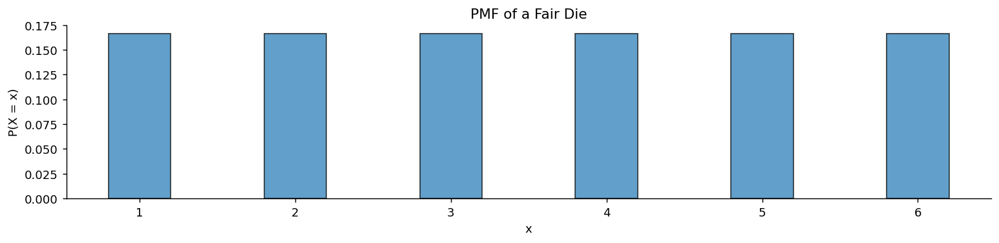
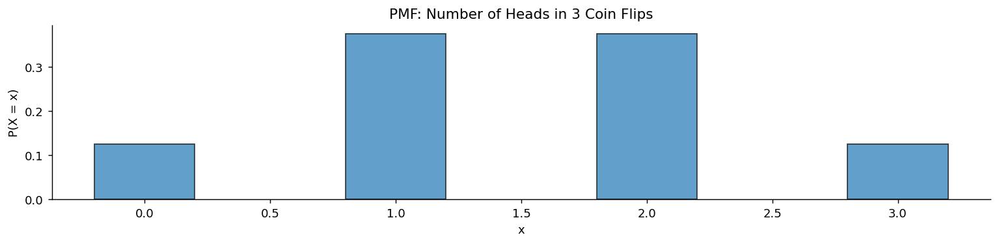
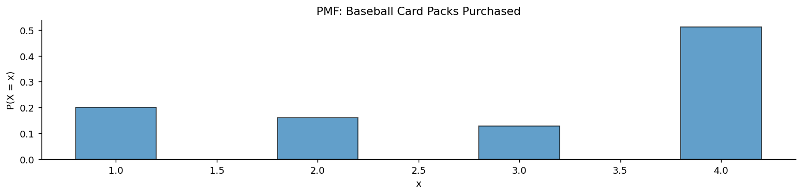

# 이산확률변수

지금까지 확률은 **사건**의 것이었다. "짝수가 나온다", "경보가 울린다"처럼 일어나거나 일어나지 않는 대상이다. 그런데 실제 문제에서 우리가 묻는 것은 대개 참·거짓이 아니라 **수**다. 주사위의 눈은 몇인가, 몇 팩을 사야 하는가, 앞면이 몇 번 나왔는가.

**확률변수**는 이 다리를 놓는다. 표본공간의 결과 하나하나를 실수로 옮겨, 확률을 수 위에서 다룰 수 있게 만든다. 그러면 더하고 곱하고 평균 내는 일이 가능해진다.

이 절은 세 개의 정리로 이루어진다. 확률변수가 무엇인지(정리 1), 그것이 실직선 위에 만들어 내는 분포(정리 2), 그리고 그 분포를 적는 방법인 확률질량함수(정리 3)이다.

## 1. 결과를 수로 옮긴다

주사위를 굴려 "3이 나왔다"는 결과 자체는 수가 아니라 사건이다. 그것에 숫자 3을 붙이는 규칙이 확률변수다. 이름은 "변수"지만 실제로는 **함수**라는 점이 중요하다.

### 정리 1. 확률변수 — 표본공간에서 실직선으로 가는 함수

**확률변수** $X$는 표본공간에서 실수로 가는 함수다.

$$
X : \Omega \longrightarrow \mathbb{R}
$$

취하는 값이 가산집합 $\{x_1, x_2, x_3, \ldots\}$이면 **이산확률변수**라 한다.

함수라는 점을 놓치지 말아야 한다. $X$ 자체에는 무작위성이 없다. 무작위한 것은 어떤 $\omega$가 뽑히느냐이고, $X$는 그 $\omega$를 정해진 규칙에 따라 수로 바꿀 뿐이다. 그래서 확률변수를 대문자 $X$로, 그것이 실제로 취한 값을 소문자 $x$로 구별해 쓴다.

같은 표본공간 위에 확률변수를 여럿 정의할 수 있다는 점도 유용하다. 동전 세 번을 던지는 하나의 실험에서 "앞면의 개수", "첫 앞면까지의 횟수", "앞면이 뒷면보다 많은가(0 또는 1)"를 모두 정의할 수 있다. 무엇을 재고 싶은가에 따라 함수를 고르는 것이다.

## 2. 벽돌을 실직선 위로 옮긴다

3.1절에서 각 결과에 무게를 가진 벽돌을 붙였다. 확률변수는 그 벽돌들을 실직선 위의 제자리로 옮기는 일을 한다.

### 정리 2. 확률변수의 분포 — 옮겨진 무게의 배치

각 결과 $\omega$에 붙은 벽돌을 실직선 위의 위치 $X(\omega)$로 옮긴다. 모든 벽돌을 옮기고 난 뒤 $\mathbb{R}$ 위에 놓인 무게의 배치를 **$X$의 분포**라 한다.

$$
\begin{aligned}
\mathbb{P}(X = a) &= a \text{에 놓인 벽돌들의 무게} \\
\mathbb{P}(X \in A) &= \text{집합 } A \text{에 놓인 벽돌들의 무게}
\end{aligned}
$$

여러 결과가 같은 값으로 옮겨질 수 있다는 점이 핵심이다. 동전 세 개에서 앞면이 정확히 1개인 결과는 $HTT$, $THT$, $TTH$ 셋이고, 이 세 벽돌이 모두 위치 1에 쌓인다. 그래서 $P(X = 1) = 3/8$이 된다.

**분포는 원래의 실험을 잊는다.** 서로 다른 실험이 같은 분포를 낳을 수 있고, 일단 분포를 알고 나면 계산에는 그것만 있으면 된다. 4장에서 이항분포·포아송분포처럼 분포에 이름을 붙여 따로 공부하는 이유가 이것이다.

## 3. 분포를 적는 방법

이산확률변수의 분포는 "각 값에 무게가 얼마인가"를 적으면 완전히 결정된다. 그 목록에 이름을 붙인 것이 확률질량함수다.

### 정리 3. 확률질량함수 — 값마다의 무게

이산확률변수 $X$의 **확률질량함수(PMF)** 는

$$
p_{x_i} = P(X = x_i)
$$

이며, 다음 두 조건을 만족한다.

$$
p_{x_i} \geq 0 \quad \text{(모든 } i \text{에 대해)}, \qquad \sum_i p_{x_i} = 1
$$

이 두 조건은 새로운 것이 아니다. 3.2절 콜모고로프 공리의 비음성과 정규화가 실직선 위로 옮겨진 형태일 뿐이다.

**예: 공정한 주사위.** $X$를 눈의 수라 하면

$$
P(X = x) = \tfrac{1}{6}, \qquad x = 1, 2, 3, 4, 5, 6
$$

**예: 동전 세 번에서 앞면의 개수.** 가능한 값은 $\{0,1,2,3\}$이고

$$
P(X=0) = \tfrac{1}{8}, \quad P(X=1) = \tfrac{3}{8}, \quad P(X=2) = \tfrac{3}{8}, \quad P(X=3) = \tfrac{1}{8}
$$

이다. 벽돌 여덟 개가 네 위치에 $1:3:3:1$로 쌓인 모양이다.

**예: 야구 카드.** 휴고는 좋아하는 선수의 카드가 나올 때까지 팩을 사되 최대 네 팩까지만 산다. 각 팩에 그 카드가 있을 확률은 0.2다. $X$를 산 팩의 수라 하면

$$
\begin{aligned}
P(X=1) &= 0.2 \\
P(X=2) &= 0.8 \times 0.2 = 0.16 \\
P(X=3) &= 0.8^2 \times 0.2 = 0.128 \\
P(X=4) &= 1 - 0.2 - 0.16 - 0.128 = 0.512
\end{aligned}
$$

이다. 앞의 세 값은 곱셈 규칙(3.1절 정리 2)을 그대로 쓴 것이다.

!!! note "$P(X=4)$가 유독 큰 이유"
    $0.512$에는 두 가지가 섞여 있다. 네 번째 팩에서 카드를 찾는 경우와, **끝내 못 찾는 경우**다. 어느 쪽이든 휴고는 네 팩에서 멈추므로 $X = 4$다.

    확률변수를 정의할 때 흔히 놓치는 지점이다. "산 팩의 수"라는 함수는 성공 여부를 구별하지 않는다. 그것까지 알고 싶으면 확률변수를 하나 더 정의하거나, $X$의 정의를 바꿔야 한다.

**예: 삼면체 주사위 두 개의 차이.** $D = |D_1 - D_2|$라 하자. 아홉 개의 결과가 세 값으로 옮겨진다.

| $D_1 \backslash D_2$ | 1 | 2 | 3 |
|:---:|:---:|:---:|:---:|
| **1** | 0 | 1 | 2 |
| **2** | 1 | 0 | 1 |
| **3** | 2 | 1 | 0 |

$$
P(D=0) = \tfrac{3}{9}, \qquad P(D=1) = \tfrac{4}{9}, \qquad P(D=2) = \tfrac{2}{9}
$$

표의 대각선에 벽돌 3개, 그 양옆에 4개, 모서리에 2개가 쌓인다.

```python
import numpy as np
import matplotlib.pyplot as plt

def plot_pmf(values, probabilities, title="PMF"):
    """확률질량함수를 막대그림으로 그린다.

    이산확률변수에서는 각 값에 확률이 "덩어리"로 붙어 있으므로
    막대의 높이가 곧 그 값이 나올 확률이다.
    (연속확률변수의 밀도함수와 달리 높이를 그대로 확률로 읽을 수 있다.)
    """
    fig, ax = plt.subplots(figsize=(12, 3))
    # width=0.4 로 막대 사이를 띄운다. 값 사이에 아무것도 없음을 나타내기 위함이다.
    ax.bar(values, probabilities, width=0.4, alpha=0.7, edgecolor='black')
    ax.set_xlabel('x')
    ax.set_ylabel('P(X = x)')
    ax.set_title(title)
    ax.spines['top'].set_visible(False)
    ax.spines['right'].set_visible(False)
    plt.tight_layout()
    plt.show()

# 예 1: 공정한 주사위. 여섯 값의 확률이 모두 같은 균등 PMF다.
values = [1, 2, 3, 4, 5, 6]
probs = [1/6] * 6
plot_pmf(values, probs, "PMF of a Fair Die")

# 예 2: 동전 3번 던져 앞면의 개수. 이항분포 B(3, 0.5)다.
# P(X=k) = C(3,k) * 0.5^k * 0.5^(3-k). 가운데(1, 2)가 높은 대칭 모양이 된다.
from math import comb
n = 3
values = list(range(n + 1))
probs = [comb(n, k) * (0.5**k) * (0.5**(n-k)) for k in values]
plot_pmf(values, probs, "PMF: Number of Heads in 3 Coin Flips")

# 예 3: 원하는 카드가 나올 때까지 산 팩 수. 균등하지도 대칭이지도 않다.
# 확률의 합이 0.2+0.16+0.128+0.512 = 1 이 되는지 확인해 보라.
# PMF가 되려면 (i) 모든 값이 0 이상, (ii) 합이 정확히 1 이어야 한다.
values = [1, 2, 3, 4]
probs = [0.2, 0.16, 0.128, 0.512]
plot_pmf(values, probs, "PMF: Baseball Card Packs Purchased")
```







막대의 높이가 곧 벽돌의 무게다. 세 그림 모두 막대 높이의 합이 1이다.

## 연습문제

**연습문제 1.**
이산확률변수 $X$의 확률질량함수가 $P(X=0) = 0.1$, $P(X=1) = 0.3$, $P(X=2) = c$, $P(X=3) = 0.2$다. $c$의 값을 구하고 $P(X \geq 2)$를 계산하라.

??? success "풀이"
    확률질량함수의 합이 1이어야 하므로

    $$
    0.1 + 0.3 + c + 0.2 = 1 \implies c = 0.4
    $$

    이다. 따라서

    $$
    P(X \geq 2) = P(X=2) + P(X=3) = 0.4 + 0.2 = 0.6
    $$

    이다.

---

**연습문제 2.**
공정한 사면체 주사위(면이 1, 2, 3, 4) 두 개를 굴린다. $S$를 두 주사위의 합이라 하자. $S$의 확률질량함수를 모두 쓰고 확률의 합이 1임을 확인하라.

??? success "풀이"
    똑같이 일어날 법한 결과가 $4 \times 4 = 16$개다. 가능한 합은 2에서 8까지다.

    | $s$ | 결과 | $P(S = s)$ |
    |:---:|:---|:---:|
    | 2 | $(1,1)$ | $1/16$ |
    | 3 | $(1,2),(2,1)$ | $2/16$ |
    | 4 | $(1,3),(2,2),(3,1)$ | $3/16$ |
    | 5 | $(1,4),(2,3),(3,2),(4,1)$ | $4/16$ |
    | 6 | $(2,4),(3,3),(4,2)$ | $3/16$ |
    | 7 | $(3,4),(4,3)$ | $2/16$ |
    | 8 | $(4,4)$ | $1/16$ |

    확인: $1 + 2 + 3 + 4 + 3 + 2 + 1 = 16$이므로 $\sum P(S=s) = 16/16 = 1$이다. $\square$

---

**연습문제 3.**
치우친 동전의 $P(\text{앞면}) = 0.7$이다. 이 동전을 3번 던진다. $X$를 앞면의 개수라 할 때 $X$의 확률질량함수를 쓰라.

??? success "풀이"
    각 던지기는 독립이고 $p = 0.7$(앞면), $q = 0.3$(뒷면)이다. 3번 던졌을 때 앞면의 개수는 이항분포를 따른다.

    $$
    P(X = k) = \binom{3}{k} (0.7)^k (0.3)^{3-k}
    $$

    각 값을 계산하면

    $$
    P(X=0) = \binom{3}{0}(0.7)^0(0.3)^3 = 0.027
    $$

    $$
    P(X=1) = \binom{3}{1}(0.7)^1(0.3)^2 = 3 \times 0.063 = 0.189
    $$

    $$
    P(X=2) = \binom{3}{2}(0.7)^2(0.3)^1 = 3 \times 0.147 = 0.441
    $$

    $$
    P(X=3) = \binom{3}{3}(0.7)^3(0.3)^0 = 0.343
    $$

    이다. 확인: $0.027 + 0.189 + 0.441 + 0.343 = 1.000$. $\square$

---

**연습문제 4.**
연속확률변수(예: 무작위로 고른 사람의 정확한 키)를 확률질량함수로 기술할 수 없는 이유를 설명하라. 연속인 경우에는 무엇이 확률질량함수를 대신하는가?

??? success "풀이"
    확률질량함수는 개별 값에 양의 확률을 부여한다. 받침의 각 값에 대해 $P(X = x) > 0$이다. 연속확률변수에서는 받침이 비가산 구간이다(예: $[150, 200]$ cm 안의 모든 실수). 개별 값마다 양의 확률을 가진다면 비가산개의 값에 대한 합(또는 적분)이 무한대로 발산하여 정규화 공리 $P(\Omega) = 1$을 위반한다.

    대신 연속확률변수는 **확률밀도함수** $f(x)$로 기술하며, $f(x) \geq 0$이고 $\int_{-\infty}^{\infty} f(x)\,dx = 1$이다. 확률밀도함수는 확률이 아니라 밀도를 준다. 어떤 한 값에 대해서도 $P(X = x) = 0$이지만 $P(a \leq X \leq b) = \int_a^b f(x)\,dx$가 구간에 대한 확률을 준다.

---

**연습문제 5.**
**기하분포.** $X$ = i.i.d. Bernoulli($p$)에서 첫 성공까지의 시행 횟수. 확률질량함수, $\mathbb{E}[X]$, $\mathrm{Var}(X)$를 유도하라.

??? success "풀이"
    **확률질량함수:** $X = k$이려면 실패 $k - 1$번 뒤에 성공해야 하므로 $k = 1, 2, \ldots$에 대해 $P(X = k) = (1 - p)^{k-1} p$이다.

    정규화: $\sum_{k=1}^\infty (1-p)^{k-1} p = p/p = 1$. ✓

    **기댓값:** 꼬리합 공식에 의해 $\mathbb{E}[X] = \sum_{n=0}^\infty P(X > n) = \sum_{n=0}^\infty (1-p)^n = 1/p$이다.

    **분산:** $\mathrm{Var}(X) = (1-p)/p^2$이다($\mathbb{E}[X(X-1)]$을 이용한 비슷한 계산으로 유도한다).

    $p = 0.5$이면 평균 2회, 분산 2, 표준편차 $\sqrt 2$다. 기하분포는 지수분포의 이산판이며 무기억 성질을 물려받는다: $P(X > m + n \mid X > m) = P(X > n)$.

---

**연습문제 6.**
**이항분포의 포아송 근사.** $np \to \lambda$가 상수인 채로 $n \to \infty$이면 Binomial$(n, p)$ → Poisson$(\lambda)$임을 보여라.

??? success "풀이"
    이항 확률질량함수에 $p = \lambda/n$을 대입한다.

    $$
    P(X = k) = \binom{n}{k}\left(\frac{\lambda}{n}\right)^k \left(1 - \frac{\lambda}{n}\right)^{n-k}
    $$

    정리하면

    $$
    = \frac{\lambda^k}{k!} \cdot \underbrace{\frac{n!}{(n-k)! n^k}}_{\to 1} \cdot \underbrace{\left(1 - \frac{\lambda}{n}\right)^n}_{\to e^{-\lambda}} \cdot \underbrace{\left(1 - \frac{\lambda}{n}\right)^{-k}}_{\to 1}
    $$

    이다. $n \to \infty$이면 $P(X = k) \to \frac{\lambda^k e^{-\lambda}}{k!}$로, 포아송 확률질량함수다.

    **용도:** 드문 사건($p$가 작고 $n$이 클 때)에는 포아송이 이항보다 훨씬 간단하다. 응용: 도시의 하루 교통사고 수, 칩당 결함 수, 분당 통화 수, 유전체당 돌연변이 수.

    어림법칙: $n \ge 20$, $p \le 0.05$, $np \le 10$일 때 포아송이 잘 맞는다. 그렇지 않으면 이항을 쓰거나, $np \ge 10$이면 정규근사를 쓴다.

## 정리하며

확률변수는 확률론의 무대를 표본공간에서 실직선으로 옮기는 장치다.

- **정리 1**은 확률변수가 함수임을 밝혔다. 무작위한 것은 $X$가 아니라 어떤 $\omega$가 뽑히느냐다.
- **정리 2**는 그 함수가 벽돌을 실직선 위로 옮겨 **분포**를 만든다고 설명했다. 여러 결과가 같은 값에 쌓일 수 있고, 분포는 원래 실험을 잊는다.
- **정리 3**은 이산인 경우 분포를 적는 방법이 **확률질량함수**임을 보였다. 값마다 무게를 적고, 그 합이 1이면 된다.

무대를 옮긴 이득은 곧 드러난다. 실직선 위에서는 **평균**과 **퍼짐**을 말할 수 있다. "짝수가 나오는 사건"의 평균은 뜻이 없지만 "주사위 눈"의 평균은 3.5다. 이것이 3.4절의 기댓값과 분산이며, 통계학이 자료를 요약하는 방식 전체가 여기서 나온다.

다만 먼저 해결할 문제가 있다. 이산확률변수는 값이 가산개뿐이라 각 값에 무게를 달 수 있었다. 그런데 대기 시간이나 키처럼 **연속인 값**을 취하는 양은 어떻게 다룰까? 개별 값의 확률이 모두 0이 되어 버리는데, 그러면 무게를 어디에 다는가?

다음 절의 **연속확률변수**가 이 물음에 답한다. 답은 무게를 점이 아니라 **밀도**로 다루는 것이다.
