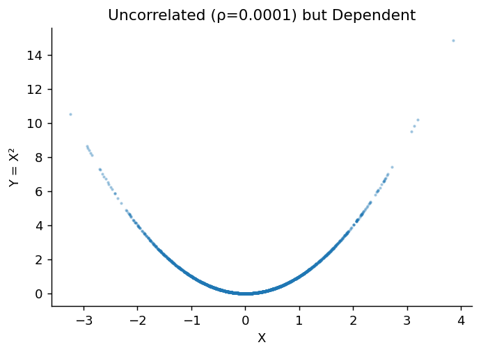
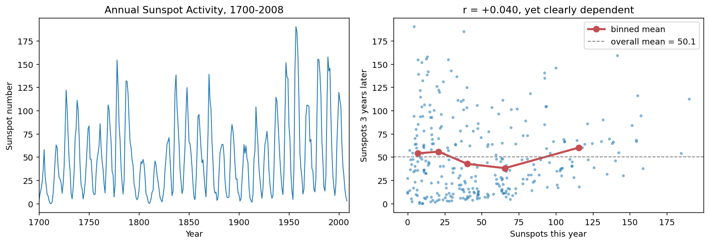
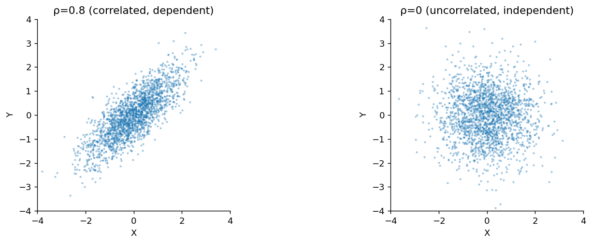

# 독립성과 무상관성의 차이

## 개요

무상관인 확률변수는 독립이라는 오해가 흔하다. **독립이면 상관계수가 0이지만**, 그 역은 일반적으로 **성립하지 않는다**.

[앞 쪽](correlation.md) 정리 2의 첫 주장이 그것이었다. 이 쪽에서는 그 주장을 정면으로 파헤친다. 두 개념을 정의로 나란히 놓고(1절), 함의가 한쪽으로만 간다는 것을 증명과 반례로 확인하고(2절), 함의가 되살아나는 특수한 자리를 찾는다(3절).

이 쪽은 세 개의 정리로 이루어진다. 한쪽 방향의 함의(정리 1), 결합정규에서의 동치(정리 2), 그리고 두 값만 갖는 확률변수에서의 동치(정리 3)다.

---

## 1. 두 개념을 나란히 놓으면

<div class="defn" markdown>

### 정의 1. 독립성 { .dfn }

$X$와 $Y$가 **독립**($X \perp Y$)이라는 것은 다음을 뜻한다:

$$
P(X \in A, Y \in B) = P(X \in A) \cdot P(Y \in B) \quad \text{for all sets } A, B
$$

동등하게, 결합 밀도/PMF가 인수분해된다: $f_{X,Y}(x,y) = f_X(x) \cdot f_Y(y)$.

</div>

<div class="defn" markdown>

### 정의 2. 무상관성 { .dfn }

$X$와 $Y$가 **무상관**이라는 것은 다음을 뜻한다:

$$
\text{Cov}(X, Y) = E[XY] - E[X]E[Y] = 0
$$

동등하게, $\rho(X,Y) = 0$ 또는 $E[XY] = E[X]E[Y]$이다.

</div>

두 정의의 **크기**를 견주어 보라. 정의 1은 **모든** 집합 쌍(동등하게 모든 가측함수 쌍)에 대한 조건이고, 정의 2는 $g(x) = x$, $h(y) = y$라는 **한 쌍**에 대한 조건이다. 조건 하나가 무한히 많은 조건을 대신할 수는 없다. 다음 절의 결론이 이미 여기서 보인다.

---

## 2. 한쪽 방향으로만 성립한다

<div class="thmbox" markdown>

### 정리 1. 독립이면 무상관, 그러나 역은 거짓 { .thm }

$X \perp\!\!\!\perp Y$이면 $\operatorname{Cov}(X,Y) = 0$이다. 역은 **성립하지 않는다.**

</div>

??? proof "증명"

    **정방향.** $X$와 $Y$가 독립이면 곱의 기댓값이 기댓값의 곱이므로 $E[XY] = E[X]\,E[Y]$이고, 따라서

    $$
    \text{Cov}(X,Y) = E[XY] - E[X]E[Y] = E[X]E[Y] - E[X]E[Y] = 0
    $$

    이다. 더 일반적으로 독립성은 **모든** 가측함수 $g, h$에 대해 $E[g(X)h(Y)] = E[g(X)]E[h(Y)]$를 함의하며, 무상관성은 그중 $g(x) = x$, $h(y) = y$인 한 경우만 요구한다.

    **역방향의 반증.** 반례를 하나 들면 끝난다. $X \sim N(0,1)$, $Y = X^2$으로 두면 $E[X] = 0$이고 대칭성에서 $E[X^3] = 0$이므로

    $$
    \operatorname{Cov}(X,Y) = E[X^3] - E[X]\,E[X^2] = 0 - 0 \cdot 1 = 0
    $$

    이다. 그런데 $Y$는 $X$의 함수로 완전히 결정되므로 독립이 아니다. 예컨대 $P(Y > 1 \mid |X| < 0.5) = 0$인 반면 $P(Y > 1) = P(|X| > 1) \approx 0.317$이다. $\square$

아래에 반례를 몇 개 더 모아 둔다. 모두 같은 구조다. **관계가 대칭적이어서 양의 기여와 음의 기여가 정확히 상쇄된다.**

### 반례들: 상관계수가 0이어도 독립은 아니다

#### 반례 1: 대칭적인 비선형 의존성

증명에서 쓴 $X \sim N(0,1)$, $Y = X^2$이 그것이다. $Y$는 $X$에 의해 완전히 결정되는데도 $\operatorname{Cov}(X,Y) = E[X^3] = 0$이다.

**왜 이렇게 되는가.** 공분산이 재는 것은 $(X - \mu_X)(Y - \mu_Y)$의 평균이다. $X$가 양수인 쪽과 음수인 쪽이 $Y$에 **똑같이** 기여하므로, 곱의 부호가 정확히 반반으로 갈려 평균이 $0$이 된다. 관계가 세지 않아서 $0$이 나온 것이 아니라 **관계가 대칭이어서 상쇄된** 것이다. 아래 보기 1의 산점도가 이 사정을 그림으로 보여 준다. 포물선은 뚜렷한데 그 위에 그을 최적 직선은 수평선이다.

관계가 $Y = X^2$이 아니라 $Y = X^2$을 **한쪽으로 치우치게** 만들면(예: $X \sim \text{Uniform}(0,1)$) 상쇄가 깨져 $\rho > 0$이 된다. 대칭이 핵심이다.

#### 반례 2: 이산형 예

$X \sim \text{Uniform}\{-1, 0, 1\}$이고 $Y = |X|$라 하자:

| $X$ | $Y$ | $P$ |
|:---:|:---:|:---:|
| $-1$ | $1$ | $1/3$ |
| $0$ | $0$ | $1/3$ |
| $1$ | $1$ | $1/3$ |

$$
E[X] = 0, \quad E[Y] = \tfrac{2}{3}, \quad E[XY] = (-1)(1)\tfrac{1}{3} + 0 + (1)(1)\tfrac{1}{3} = 0
$$

$$
\text{Cov}(X,Y) = 0 - 0 \cdot \tfrac{2}{3} = 0
$$

그러나 $X$와 $Y$는 **독립이 아니다**: $P(Y = 0 \mid X = 0) = 1 \neq P(Y = 0) = 1/3$이다.

#### 반례 3: 단위원

$(X, Y)$가 단위원 위에 균등하게 분포한다고 하자. 곧 $\theta \sim \text{Uniform}(0, 2\pi)$에 대해 $X = \cos\theta$, $Y = \sin\theta$다. 그러면 $E[X] = E[Y] = 0$이고

$$
E[XY] = E[\cos\theta \sin\theta] = \tfrac12 E[\sin 2\theta] = \frac{1}{2}\cdot\frac{1}{2\pi}\int_0^{2\pi}\sin 2\theta\, d\theta = 0
$$

이므로 $\text{Cov}(X,Y) = 0$이다. 그런데 $X^2 + Y^2 = 1$이므로 $X$를 알면 $Y$의 절댓값이 완전히 결정된다. 완전히 종속이다.

---

## 3. 두 개념이 같아지는 자리

<div class="thmbox" markdown>

### 정리 2. 결합정규분포에서는 무상관이 곧 독립 { .thm }

$(X, Y)$가 **이변량 정규분포**를 따르면

$$
\operatorname{Cov}(X, Y) = 0 \iff X \perp\!\!\!\perp Y
$$

이다.

</div>

??? proof "증명"

    $(\Leftarrow)$는 정리 1이므로 $(\Rightarrow)$만 보이면 된다. 이변량 정규분포의 확률밀도함수는

    $$
    f(x,y) = \frac{1}{2\pi\sigma_X\sigma_Y\sqrt{1-\rho^2}} \exp\left(-\frac{1}{2(1-\rho^2)}\left[\frac{(x-\mu_X)^2}{\sigma_X^2} - \frac{2\rho(x-\mu_X)(y-\mu_Y)}{\sigma_X\sigma_Y} + \frac{(y-\mu_Y)^2}{\sigma_Y^2}\right]\right)
    $$

    이다. $\operatorname{Cov}(X,Y) = 0$이면 $\rho = 0$이므로 $\sqrt{1-\rho^2} = 1$이고 지수 안의 **교차항이 사라진다.** 남은 것은 $x$만 있는 항과 $y$만 있는 항의 합이므로 지수함수가 두 인수의 곱으로 쪼개진다.

    $$
    f(x,y) = \underbrace{\frac{1}{\sqrt{2\pi}\,\sigma_X}\exp\!\left(-\frac{(x-\mu_X)^2}{2\sigma_X^2}\right)}_{f_X(x)}
    \cdot
    \underbrace{\frac{1}{\sqrt{2\pi}\,\sigma_Y}\exp\!\left(-\frac{(y-\mu_Y)^2}{2\sigma_Y^2}\right)}_{f_Y(y)}
    $$

    결합밀도가 두 주변밀도의 곱이므로 정의 1에 의해 $X \perp\!\!\!\perp Y$다. $\square$

**조건을 정확히 읽어야 한다.** 필요한 것은 "$X$와 $Y$가 **각각** 정규"가 아니라 "$(X,Y)$가 **함께** 이변량 정규"다. 주변분포가 둘 다 정규이면서 결합분포는 이변량 정규가 아닌 경우가 있고, 그때는 무상관이어도 독립이 아닐 수 있다. 연습문제 2에서 $Y = SX$ 꼴의 그런 예를 만든다.

그리고 **이것이 정규분포만의 성질은 아니다.** 훨씬 시시한 이유로 함의가 되살아나는 자리가 하나 더 있다.

<div class="thmbox" markdown>

### 정리 3. 두 값만 갖는 확률변수 쌍에서도 무상관이 곧 독립 { .thm }

$X$가 두 값 $\{a, b\}$($a \ne b$)만, $Y$가 두 값 $\{c, d\}$($c \ne d$)만 취하면

$$
\operatorname{Cov}(X, Y) = 0 \iff X \perp\!\!\!\perp Y
$$

이다.

</div>

??? proof "증명"

    지시변수 $U = \mathbf 1\{X = b\}$, $V = \mathbf 1\{Y = d\}$로 옮긴다. 그러면 $X = a + (b-a)U$, $Y = c + (d-c)V$이므로 쌍선형성에 의해

    $$
    \operatorname{Cov}(X,Y) = (b-a)(d-c)\operatorname{Cov}(U,V)
    $$

    이고, $a \ne b$, $c \ne d$이므로 $\operatorname{Cov}(X,Y) = 0$은 $\operatorname{Cov}(U,V) = 0$과 같다. 지시변수의 기댓값은 확률이므로 이것은

    $$
    P(X = b,\, Y = d) = E[UV] = E[U]\,E[V] = P(X = b)\,P(Y = d)
    $$

    을 뜻한다. **네 칸 중 한 칸이 곱셈 규칙을 만족하면 나머지 세 칸도 자동으로 만족한다.** 실제로 주변확률에서 빼면

    $$
    P(X = a,\, Y = d) = P(Y = d) - P(X = b,\, Y = d) = \big(1 - P(X=b)\big)P(Y=d) = P(X=a)P(Y=d)
    $$

    이고, $Y = c$인 두 칸도 같은 방식으로 나온다. $X$와 $Y$가 만드는 사건은 이 네 칸의 합집합뿐이므로 정의 1이 성립한다. $\square$

자유도를 세어 보면 까닭이 분명하다. $2 \times 2$ 결합분포는 확률의 합이 $1$이라는 제약 때문에 자유모수가 셋이고, 두 주변분포가 그중 둘을 묶는다. **남는 자유도가 하나뿐**이므로 공분산이라는 수 하나가 그것을 다 쓴다. 표가 $3 \times 3$만 되어도 남는 자유도가 넷이라 공분산 하나로는 어림도 없다. 반례 2의 $X \sim \text{Uniform}\{-1,0,1\}$이 바로 $3 \times 2$ 표였다.

### 요약

| 관계 | 성립 여부 |
|:---|:---|
| 독립 $\Rightarrow$ 무상관 | 항상 (정리 1) |
| 무상관 $\Rightarrow$ 독립 | **일반적으로 거짓** (정리 1의 반례) |
| 무상관 $\Rightarrow$ 독립, $(X,Y)$가 **결합**정규일 때 | 참 (정리 2) |
| 무상관 $\Rightarrow$ 독립, $X$와 $Y$가 각각 두 값만 가질 때 | 참 (정리 3) |
| 무상관 $\Rightarrow$ 독립, 주변분포만 각각 정규일 때 | **거짓** (연습문제 2) |

### 의존성 개념의 위계

무상관은 독립의 **필요조건**이되 아주 약한 조건이다. 사이에 한 층이 더 있다.

$$
\text{독립} \;\Longrightarrow\; \text{평균독립}\ \big(E[Y \mid X] = E[Y]\big) \;\Longrightarrow\; \text{무상관}
$$

어느 화살표도 뒤집히지 않는다(연습문제 5에서 양쪽 반례를 만든다). 반대편에서 보면 종속성의 층위는 이렇다.

| 층위 | 조건 | 무상관과 양립하는가 |
|:---|:---|:---|
| 함수종속 | $Y = g(X)$ | **예** ($Y = X^2$) |
| 통계적 종속 | $f_{X,Y} \ne f_X f_Y$ | **예** (위 반례 전부) |
| 선형 종속 | $\rho \ne 0$ | 아니오 (정의상) |

**$\rho$가 보는 것은 맨 아래 한 줄뿐이다.** 그 위의 두 층은 $\rho = 0$과 아무 문제 없이 공존한다.

### 무상관이지만 의존적인 경우: Y = X의 제곱

<div class="exbox" markdown>

**보기 1.** <span class="diff easy" title="쉬움"></span> 무상관인데 독립이 아닌 경우. 반례 $1$ 의 $X \sim N(0,1)$, $Y = X^2$ 을 모의실험으로 본다. $\operatorname{Cov}(X, Y) = 0$ 은 위에서 이미 보였으므로 한 걸음 더 들어간다.

**(1)** 두 조건부 평균 $E[Y \mid X]$ 와 $E[X \mid Y]$ 를 구하시오. 둘 중 **어느 쪽이 상수인가.** 그 상수인 쪽에서 $\operatorname{Cov}(X,Y) = 0$ 을 다시 끌어내시오.

**(2)** 그래서 이 쌍은 위 위계 $\text{독립} \Rightarrow \text{평균독립} \Rightarrow \text{무상관}$ 의 어디에 놓이는가. 또 모의실험이 준 $\rho = 0.000122$ 는 $0$ 에서 얼마나 떨어진 값인가.

</div>

??? success "풀이"

    **(1) 한쪽만 상수다.** $Y$ 쪽은 간단하다. $X$ 를 알면 $Y$ 가 한 점으로 정해지므로

    $$
    E[Y \mid X = x] = x^2
    $$

    이고, $x$ 에 따라 변하니 **상수가 아니다.** 곧 $Y$ 는 $X$ 에 평균독립이 아니다.

    반대 방향은 다르다. $Y = y > 0$ 을 관측했다면 $X$ 는 $+\sqrt y$ 또는 $-\sqrt y$ 인데, $X$ 의 분포가 $0$ 을 중심으로 대칭이므로 두 쪽의 밀도가 같다. 따라서 둘 중 어느 쪽인지는 **동전 던지기와 같고**

    $$
    P(X = +\sqrt y \mid Y = y) = P(X = -\sqrt y \mid Y = y) = \tfrac12,
    \qquad
    E[X \mid Y = y] = \tfrac12\sqrt y - \tfrac12\sqrt y = 0
    $$

    이다. **$X$ 는 $Y$ 에 평균독립이다.** $E[X \mid Y] = 0 = E[X]$ 이기 때문이다.

    이 상수인 쪽에서 공분산이 곧바로 나온다. 탑 성질(전체 기댓값의 법칙)을 $Y$ 로 조건을 걸어 쓰면

    $$
    E[XY] = E\big[E[XY \mid Y]\big] = E\big[Y\,E[X \mid Y]\big] = E[Y \cdot 0] = 0
    $$

    이고 $E[X] = 0$ 이므로 $\operatorname{Cov}(X,Y) = 0 - 0 \cdot E[Y] = 0$ 이다. 앞에서 $E[X^3] = 0$ 을 써서 얻은 것과 같은 결론인데, **이번 논증은 $X^3$ 의 적률을 전혀 쓰지 않았다.** 쓴 것은 "조건을 걸면 평균이 $0$" 이라는 사실 하나이고, 그것이 곧 $\text{평균독립} \Rightarrow \text{무상관}$ 의 증명이다.

    **(2) 가운데 칸에 놓인다.** 정리하면 이렇다.

    | 성질 | $(X, Y)$ | $(Y, X)$ |
    |:---|:---:|:---:|
    | 독립 | 아니다 | 아니다 |
    | 평균독립 $E[\cdot \mid \cdot]$ 가 상수 | **$E[X \mid Y]$ 는 상수** | $E[Y \mid X]$ 는 상수가 아니다 |
    | 무상관 | 그렇다 | 그렇다 |

    **독립이 아니면서 한 방향으로는 평균독립인 쌍**, 곧 위계 표에서 첫째 화살표가 뒤집히지 않음을 보이는 예다. 동시에 **평균독립이 비대칭인 관계**라는 것도 드러난다. $X$ 는 $Y$ 에 평균독립이지만 $Y$ 는 $X$ 에 그렇지 않다. 무상관은 $\operatorname{Cov}(X,Y) = \operatorname{Cov}(Y,X)$ 이므로 언제나 대칭이고, 독립도 대칭이다. **가운데 층만 방향을 탄다.**

    **$0.000122$ 는 $0$ 이다.** 표본상관계수의 퍼짐을 재 보면 안다. $\mu_X = 0$, $\mu_Y = 1$ 이므로

    $$
    \operatorname{Var}(\widehat{\operatorname{Cov}}) \approx \frac{E\big[X^2(X^2-1)^2\big]}{n}
    = \frac{15 - 6 + 1}{n} = \frac{10}{n}
    $$

    이고, 이것을 $\operatorname{sd}(X)\operatorname{sd}(Y) = 1 \times \sqrt2$ 로 나누면

    $$
    \operatorname{SE}(r) \approx \frac{\sqrt{10/10^5}}{\sqrt2} = 0.00707
    $$

    이다. $0.000122$ 는 그 $0.017$ 배이니 **소수 여섯째 자리까지 적힌 것이 무색하게 전부 잡음**이다.

    **(3) 수치적으로.**

    ```python
    import numpy as np
    import matplotlib.pyplot as plt
    from scipy import stats

    plt.rcParams["font.sans-serif"] = ["NanumGothic", "Apple SD Gothic Neo", "Malgun Gothic"]
    plt.rcParams["font.family"] = "sans-serif"
    plt.rcParams["axes.unicode_minus"] = False

    np.random.seed(42)
    n = 100_000
    X = np.random.normal(0, 1, n)
    Y = X**2        # X만 알면 Y가 완전히 결정된다. 이보다 강한 종속은 없다.

    # 그런데 상관계수는 0이 나온다.
    # Cov(X, X^2) = E[X^3] - E[X]E[X^2] 인데, X가 0을 중심으로 대칭이면
    # E[X] = 0 이고 E[X^3] = 0 이므로 공분산이 정확히 0이다.
    # 상관은 **직선 관계만** 재기 때문에 포물선 관계를 전혀 보지 못한다.
    corr = np.corrcoef(X, Y)[0, 1]
    print(f"Correlation(X, X²) = {corr:.6f}")
    print(f"But Y is completely determined by X!")

    # 표본상관계수도 확률변수다. 0 에서 얼마나 떨어진 값인지 재 둔다.
    #   sd(표본공분산) ~ sqrt(E[X^2 (X^2-1)^2]/n) = sqrt(10/n)
    #   sd(X) = 1, sd(Y) = sqrt(2) 로 나누면 r 의 표준오차가 된다.
    se_r = np.sqrt(10 / n) / np.sqrt(2)
    print(f"  SE(r) = {se_r:.6f},  r/SE = {corr / se_r:+.3f}")

    # 조건부 평균 둘을 구간별로 잰다. 한쪽은 상수가 아니고 다른 쪽은 상수다.
    # 구간 [a,b) 에서 잘라 낸 정규분포의 2차 적률.
    #   E[X^2 | a <= X < b] = 1 + (a*phi(a) - b*phi(b)) / (Phi(b) - Phi(a))
    def truncated_second_moment(a, b):
        num = a * stats.norm.pdf(a) - b * stats.norm.pdf(b)
        return 1 + num / (stats.norm.cdf(b) - stats.norm.cdf(a))

    print(f"\nE[Y | X] 는 상수가 아니다")
    for lo, hi in [(-2.5, -1.5), (-0.5, 0.5), (1.5, 2.5)]:
        m = (X >= lo) & (X < hi)
        print(f"  {lo:+.1f} <= X < {hi:+.1f}:  평균 {Y[m].mean():7.4f}"
              f"   (이론 {truncated_second_moment(lo, hi):.4f})")
    print(f"  전체 E[Y] = {Y.mean():.4f}  (이론 1)")

    print(f"\nE[X | Y] 는 상수다  (이론: 0)")
    for lo, hi in [(0.0, 0.25), (1.0, 2.0), (4.0, 9.0)]:
        m = (Y >= lo) & (Y < hi)
        print(f"  {lo:4.2f} <= Y < {hi:4.2f}:  평균 {X[m].mean():+7.4f}"
              f"   (표본 {m.sum():>6}개, SE {X[m].std() / np.sqrt(m.sum()):.4f})")
    print(f"  전체 E[X] = {X.mean():+.4f}  (이론 0)")

    fig, ax = plt.subplots(figsize=(6, 4))
    ax.scatter(X[:2000], Y[:2000], s=2, alpha=0.3)
    ax.set_xlabel('X')
    ax.set_ylabel('Y = X²')
    ax.set_title(f'Uncorrelated (ρ={corr:.4f}) but Dependent')
    ax.spines[['top', 'right']].set_visible(False)
    plt.show()
    ```

    출력:

    ```
    Correlation(X, X²) = 0.000122
    But Y is completely determined by X!
      SE(r) = 0.007071,  r/SE = +0.017

    E[Y | X] 는 상수가 아니다
      -2.5 <= X < -1.5:  평균  3.4869   (이론 3.4829)
      -0.5 <= X < +0.5:  평균  0.0805   (이론 0.0806)
      +1.5 <= X < +2.5:  평균  3.4845   (이론 3.4829)
      전체 E[Y] = 1.0018  (이론 1)

    E[X | Y] 는 상수다  (이론: 0)
      0.00 <= Y < 0.25:  평균 +0.0008   (표본  38249개, SE 0.0015)
      1.00 <= Y < 2.00:  평균 +0.0018   (표본  16144개, SE 0.0094)
      4.00 <= Y < 9.00:  평균 -0.0041   (표본   4289개, SE 0.0356)
      전체 E[X] = +0.0010  (이론 0)
    ```

    

    조건부 평균이 유도와 맞는다. $X$ 로 조건을 걸면 $E[Y \mid X]$ 가 $0.0805$ 에서 $3.4869$ 까지 **마흔 배 넘게** 움직이고, 세 구간 모두 구간별 이론값(잘라 낸 정규분포의 둘째 적률)과 소수 셋째 자리까지 맞는다. 전체 평균 $1.0018$ 과는 아무 관계가 없다. 반면 $Y$ 로 조건을 걸면 $E[X \mid Y]$ 가 $+0.0008$, $+0.0018$, $-0.0041$ 로 셋 다 자기 표준오차 안이다. **한 방향으로는 평평하고 다른 방향으로는 포물선이다.**

    그림이 그 비대칭을 보여 준다. 가로로 훑으면 포물선이 솟아오르지만, 세로로 훑으면 같은 높이에 점이 **좌우 한 쌍씩** 놓여 평균이 가운데로 돌아온다. 상관계수가 재는 것은 뒤쪽이고, 그래서 $0$ 이 나온다.

    눈여겨볼 것이 하나 더 있다. 그림의 점이 $2000$ 개뿐이라 꼬리가 성겨 보이지만, 상관계수는 $100{,}000$ 개 전부로 계산한 값이다. **그림의 표본 수와 수치의 표본 수가 다르다는 점을 흘려 보면 안 된다.**

### 실제 자료에서: 태양 흑점

$Y = X^2$은 만들어 낸 예다. 실제로 관측한 자료에서도 같은 일이 일어나는지 보는 편이 설득력이 있다. 1700년부터 2008년까지 기록된 **연평균 태양 흑점 수**를 쓴다. 천문학에서 가장 오래 이어진 관측 기록 가운데 하나이고, 대략 11년을 주기로 오르내리는 것으로 잘 알려져 있다.

올해의 흑점 수와 $k$년 뒤의 흑점 수를 짝지어 상관계수를 재 보자.

<div class="exbox" markdown>

**보기 2.** <span class="diff easy" title="쉬움"></span> 무상관이지만 독립이 아닌 실제 자료. $1700$ 년부터 $2008$ 년까지 기록된 연평균 태양 흑점 수를 쓴다. 올해의 흑점 수와 $3$ 년 뒤의 흑점 수를 짝지으면 상관계수가 $0.040$ 으로 사실상 $0$ 이다.

**(1)** 오늘의 흑점 수를 다섯 구간으로 나누고 각 구간에서 $3$ 년 뒤 평균을 보면 $54.0$, $55.8$, $42.7$, $38.1$, $60.1$ 로 **아래로 볼록한 U자**를 그린다. 전체 평균은 $50.1$ 이다. 이 U자가 설명하는 분산의 몫과 직선이 설명하는 몫을 각각 수로 적어 견주시오.

**(2)** U자가 우연히 생긴 모양이 아님을 보이시오. 그리고 이 쌍이 앞 위계의 어디에 놓이는지 말하시오.

</div>

??? success "풀이"

    **유도할 닫힌 꼴이 없는 자료다.** 태양이 왜 $11$ 년 주기로 도는지에서 $3$ 년 시차의 조건부 평균을 계산해 낼 길은 없다. 그러므로 이 보기의 몫은 **직선으로 재는 것과 구간별 평균으로 재는 것이 얼마나 다른가를 수로 말하는 것**이다.

    **(1) 두 몫을 같은 자로 잰다.** 직선이 설명하는 분산의 몫은 $r^2$ 이다.

    $$
    r^2 = 0.040^2 = 0.0016
    $$

    **$0.16\%$ 다.** 구간별 평균이 설명하는 몫은 **상관비**라 부르고, 구간 평균들이 전체 평균에서 흩어진 정도를 전체 분산으로 나눈 것이다.

    $$
    \eta^2 = \frac{\sum_g w_g\,(\bar y_g - \bar y)^2}{\operatorname{Var}(Y)},
    \qquad w_g = \tfrac15 \;\text{(5분위라 모두 같다)}
    $$

    분자를 직접 계산하면

    $$
    \tfrac15\big[(54.0-50.1)^2 + (55.8-50.1)^2 + (42.7-50.1)^2 + (38.1-50.1)^2 + (60.1-50.1)^2\big]
    $$

    이고, 이것을 $\operatorname{Var}(Y)$ 로 나눈 값이 $\eta^2 = 0.0427$ 이다. **$4.27\%$ 로 직선의 $26.9$ 배다.**

    두 수의 관계가 중요하다. $\eta^2 \ge r^2$ 은 언제나 성립한다. 직선도 구간별로 보면 계단함수로 근사되는 특별한 꼴이기 때문이다. **$\eta^2$ 이 $r^2$ 보다 훨씬 크다는 것은 관계가 직선이 아니라는 뜻**이고, 여기서는 그 차이가 스물여섯 배다.

    다만 $\eta^2$ 은 구간을 다섯 개로 나누느라 모수를 넷 더 쓴 값이므로, 아무 관계가 없어도 어느 정도는 커진다. 독립일 때의 기댓값이 대략

    $$
    E[\eta^2] \approx \frac{k-1}{n-1} = \frac{4}{305} = 0.0131
    $$

    이니 관측한 $0.0427$ 은 그 $3.3$ 배다. **공짜로 얻어지는 몫보다는 확실히 크다.**

    **(2) 2차항을 끼워 넣어 본다.** U자가 실재하는지 보려면 $\text{오늘}^2$ 항의 계수가 $0$ 과 다른지 보면 된다. 최소제곱으로

    $$
    \widehat{\text{3년 뒤}} = 59.99 - 0.5385\,(\text{오늘}) + 0.004138\,(\text{오늘})^2
    $$

    을 얻는데, 2차항의 $t$ 값이 $3.57$ 이고 $p = 0.00042$ 다. **$U$ 자는 우연이 아니다.** 꼭짓점은 $-b/(2c) = 0.5385/(2 \times 0.004138) = 65.1$ 로, 오늘이 $65$ 개쯤일 때 $3$ 년 뒤가 가장 적다는 뜻이고 구간별 평균의 최솟값 $38.1$ 이 놓인 구간($52 \sim 83$)과 맞는다.

    **1차항의 계수가 음수인데 상관계수는 양수**라는 점도 눈여겨볼 만하다. $-0.5385$ 는 2차항을 함께 넣었을 때의 기울기이고, 2차항 없이 혼자 재면 $r = +0.040$ 이다. 같은 자료에서 "기울기" 가 부호까지 달라지는 것이며, **어떤 모형 안에서 잰 기울기인가를 밝히지 않은 기울기는 뜻이 없다.**

    **위계에서의 자리.** $E[\,\text{3년 뒤} \mid \text{오늘}\,]$ 이 $38.1$ 에서 $60.1$ 까지 움직이므로 평균독립이 아니고, 따라서 독립도 아니다. 그런데 무상관이다. **반례 $1$ 의 $Y = X^2$ 과 정확히 같은 자리**이며, 다른 점은 이것이 만들어 낸 예가 아니라 $309$ 년치 관측이라는 것뿐이다.

    **(3) 수치적으로.**

    ```python
    import numpy as np
    import matplotlib.pyplot as plt
    import statsmodels.api as sm
    from scipy import stats

    # 1700~2008년 연평균 태양 흑점 수. statsmodels에 함께 배포되는 실제 관측 자료다.
    sun = sm.datasets.sunspots.load_pandas().data
    x = sun["SUNACTIVITY"].values

    # 올해 값과 k년 뒤 값을 짝지어 상관계수를 잰다.
    print(f"{'시차(년)':>8}{'상관계수':>10}")
    for lag in (1, 3, 5, 11):
        print(f"{lag:>8}{np.corrcoef(x[:-lag], x[lag:])[0, 1]:>10.3f}")

    # 시차 3년에서 상관이 사실상 0이다. 독립일까?
    lag = 3
    today, later = x[:-lag], x[lag:]

    # 오늘의 흑점 수를 5분위로 나누고, 각 구간에서 3년 뒤 평균을 본다.
    edges = np.quantile(today, [0, .2, .4, .6, .8, 1.0])
    print(f"\n{'오늘의 흑점 수':>18}{'3년 뒤 평균':>12}")
    cell_means, weights = [], []
    for i in range(5):
        lo, hi = edges[i], edges[i + 1]
        m = (today >= lo) & (today <= hi) if i == 4 else (today >= lo) & (today < hi)
        cell_means.append(later[m].mean())
        weights.append(m.mean())
        print(f"{f'{lo:6.1f} ~ {hi:6.1f}':>18}{later[m].mean():12.1f}")
    print(f"{'전체 평균':>18}{later.mean():12.1f}")

    # 직선으로 설명되는 몫(r^2)과 5분위 계단함수로 설명되는 몫(상관비 eta^2)을 견준다.
    r = np.corrcoef(today, later)[0, 1]
    cell_means, weights = np.array(cell_means), np.array(weights)
    eta2 = np.sum(weights * (cell_means - later.mean()) ** 2) / later.var()
    print(f"\n설명되는 분산의 몫")
    print(f"  직선       r^2  = {r ** 2:.4f}")
    print(f"  5분위 평균  eta^2 = {eta2:.4f}   ({eta2 / r ** 2:.1f}배)")
    print(f"  독립일 때 eta^2 의 기댓값 = (k-1)/(n-1) = {4 / (len(today) - 1):.4f}")

    # 2차 다항식을 끼워 넣어 U자가 우연인지 본다.
    A = np.column_stack([np.ones_like(today), today, today ** 2])
    beta, *_ = np.linalg.lstsq(A, later, rcond=None)
    resid = later - A @ beta
    s2 = (resid ** 2).sum() / (len(today) - 3)
    se = np.sqrt(s2 * np.diag(np.linalg.inv(A.T @ A)))
    t_stat = beta[2] / se[2]
    print(f"\n2차 적합  later = {beta[0]:.2f} {beta[1]:+.4f}*today {beta[2]:+.6f}*today^2")
    print(f"  2차항의 t = {t_stat:.2f},  p = {2 * (1 - stats.t.cdf(abs(t_stat), len(today) - 3)):.6f}")
    print(f"  R^2(2차) = {1 - (resid ** 2).sum() / ((later - later.mean()) ** 2).sum():.4f}")

    # 상관계수가 가장 큰 시차를 자료에서 직접 찾는다. 11년 주기의 증거다.
    acf = [np.corrcoef(x[:-k], x[k:])[0, 1] for k in range(1, 26)]
    best = 5 + int(np.argmax(acf[4:]))
    print(f"\n시차 5년 이상에서 상관이 가장 큰 곳: {best}년 (r = {acf[best - 1]:.3f}),"
          f"  11년 (r = {acf[10]:.3f})")
    ```

    출력:

    ```
       시차(년)      상관계수
           1     0.824
           3     0.040
           5    -0.430
          11     0.672

              오늘의 흑점 수     3년 뒤 평균
          0.0 ~   12.4        54.0
         12.4 ~   30.6        55.8
         30.6 ~   52.2        42.7
         52.2 ~   82.9        38.1
         82.9 ~  190.2        60.1
                 전체 평균        50.1

    설명되는 분산의 몫
      직선       r^2  = 0.0016
      5분위 평균  eta^2 = 0.0427   (26.9배)
      독립일 때 eta^2 의 기댓값 = (k-1)/(n-1) = 0.0131

    2차 적합  later = 59.99 -0.5385*today +0.004138*today^2
      2차항의 t = 3.57,  p = 0.000420
      R^2(2차) = 0.0418

    시차 5년 이상에서 상관이 가장 큰 곳: 10년 (r = 0.679),  11년 (r = 0.672)
    ```

    

    시차별 상관계수부터 읽는다. $1$ 년 뒤와는 $0.824$ 로 강하게 붙어 있고 $11$ 년 뒤와는 $0.672$ 로 다시 붙는다. 한 주기를 돌아 같은 국면으로 돌아왔기 때문이다. $5$ 년 뒤와는 $-0.430$ 인데 반주기쯤 지나 극대가 극소와 마주 보는 자리다. 주기가 정말 $11$ 년인지는 자료가 직접 답한다. 시차 $5$ 년 이상에서 상관이 가장 큰 곳이 $10$ 년($0.679$)이고 $11$ 년이 $0.672$ 로 바로 뒤를 따른다. **주기가 $10 \sim 11$ 년 언저리라는 것이 상관계수만으로 나온다.**

    문제는 시차 $3$ 년이다. 상관계수 $0.040$ 만 보고 "$3$ 년 뒤 흑점 수는 올해와 무관하다" 고 말하고 싶어지는데, (1) 과 (2) 의 수가 그것을 막는다. $\eta^2$ 이 $r^2$ 의 $26.9$ 배이고 2차항의 $p$ 가 $0.0004$ 다.

    오른쪽 그림의 붉은 선이 그 U자다. 오늘이 아주 적으면($0 \sim 12$) 3년 뒤는 $54.0$ 으로 평균보다 높고, 중간쯤이면($52 \sim 83$) $38.1$ 로 평균보다 낮으며, 아주 많으면($83$ 이상) $60.1$ 로 다시 높다. 까닭은 주기에 있다. 흑점이 아주 적다는 것은 **골짜기 근처**라는 뜻이고 $3$ 년 뒤면 올라가는 중이다. 아주 많다는 것은 **봉우리 근처**라는 뜻인데 $3$ 년 뒤면 아직 높은 수준이 남아 있다. 중간값은 오르는 길일 수도 내리는 길일 수도 있어 두 경우가 섞이며 평균이 낮게 나온다.

    왼쪽 칸이 그 사정의 출처다. 봉우리와 골짜기가 규칙적으로 되풀이되고, 봉우리의 **높이**는 $1800$ 년 무렵의 $50$ 에서 $1957$ 년의 $190$ 까지 크게 다르다. 이 들쭉날쭉함 때문에 시차 $11$ 년의 상관이 $1$ 이 아니라 $0.672$ 에 그친다. **주기는 선명한데 진폭은 선명하지 않다**는 것을 두 칸이 함께 말해 준다.

!!! warning "시계열에서 특히 조심할 것"

    "상관이 0이니 독립이다"라는 논리는 시계열에서 자주 깨진다. 주기가 있거나 변동성이 몰려다니는 자료에서는 값 자체의 자기상관이 0에 가까운데도 **크기**나 **제곱**의 자기상관이 뚜렷하게 남는 일이 흔하다. 금융 수익률이 대표적인 예이며, 14장과 15장에서 다시 만난다. 흑점 자료를 쓴 것은 원인이 분명해서 그림으로 바로 납득되기 때문이다.


### 독립성 검정: 결합분포와 주변분포의 곱 비교

독립의 정의는 **모든** 사건 쌍에 대해 $P(A \cap B) = P(A)P(B)$가 성립하는 것이다. 따라서 사건을 하나 골라 확인하는 것으로는 독립을 증명할 수 없고, **반례를 하나 찾으면 종속을 증명할 수 있다.**

<div class="exbox" markdown>

**보기 3.** <span class="diff easy" title="쉬움"></span> 결합분포와 주변분포를 견주어 독립성 확인. 앞과 같은 $X \sim N(0,1)$, $Y = X^2$ 에서 사건 쌍 둘을 골라 곱셈 규칙을 확인한다.

$$
\text{쌍 1: } A = \{X > 0\},\ B = \{Y > 1\}
\qquad
\text{쌍 2: } A' = \{\lvert X \rvert < 0.5\},\ B = \{Y > 1\}
$$

**(1)** 쌍 $1$ 이 곱셈 규칙을 만족하는 것은 **우연이 아니다.** $P(A)$, $P(B)$, $P(A \cap B)$ 의 참값을 적고, 어떤 성질이 등식을 정확히 만들어 내는지 보이시오.

**(2)** 그런데도 $X$ 와 $Y$ 는 독립이 아니다. 쌍 $1$ 의 통과가 왜 아무것도 보장하지 않는가. 쌍 $2$ 의 두 확률 참값을 적으시오.

</div>

??? success "풀이"

    **(1) 부호와 크기가 독립이다.** $X$ 의 분포가 $0$ 을 중심으로 대칭이면, 부호 $S = \operatorname{sign}(X)$ 와 크기 $\lvert X \rvert$ 가 **서로 독립**이다. 임의의 $t > 0$ 에 대해

    $$
    P(S = +1,\; \lvert X \rvert \le t) = P(0 < X \le t)
    = \tfrac12 P(\lvert X \rvert \le t)
    = P(S = +1)\,P(\lvert X \rvert \le t)
    $$

    이기 때문이다. 가운데 등식이 대칭성이고, $P(S = +1) = \tfrac12$ 이다.

    그런데 $Y = X^2 = \lvert X \rvert^2$ 은 **$\lvert X \rvert$ 만의 함수**다. 그러므로 $Y$ 로 만든 어떤 사건도 $S$ 로 만든 어떤 사건과 독립이다. 쌍 $1$ 이 바로 그 꼴이다. $A = \{S = +1\}$ 이고 $B = \{Y > 1\} = \{\lvert X \rvert > 1\}$ 이니

    $$
    P(A) = \tfrac12,
    \qquad
    P(B) = 2\big(1 - \Phi(1)\big) = 0.317310,
    \qquad
    P(A \cap B) = 1 - \Phi(1) = 0.158655
    $$

    이고 $\tfrac12 \times 0.317310 = 0.158655$ 로 **소수 여섯째 자리까지 정확히 같다.** 근사가 아니라 등식이며, 어떤 문턱을 잡아도, 심지어 $Y$ 대신 $\lvert X \rvert$ 의 어떤 함수를 써도 그렇다.

    **(2) 독립은 모든 쌍에 대한 조건이다.** 정의 $1$ 은 $X$ 가 만드는 모든 사건과 $Y$ 가 만드는 모든 사건에 대해 곱셈 규칙을 요구한다. 쌍 하나가 통과했다는 것은 **그 쌍이 통과했다는 것뿐**이고, 방금 본 대로 쌍 $1$ 은 통과하도록 생겨 먹은 쌍이었다. $X$ 가 담고 있는 정보는 부호와 크기 둘인데, 그 가운데 $Y$ 와 무관한 쪽(부호)만 골라 물은 셈이다.

    $Y$ 와 **묶여 있는 쪽**을 고르면 곧바로 깨진다. $A' = \{\lvert X \rvert < 0.5\}$ 는 크기만의 사건이다. $\lvert X \rvert < 0.5$ 이면 $Y = X^2 < 0.25$ 이므로 $Y > 1$ 은 일어날 수 없고

    $$
    P(A' \cap B) = 0,
    \qquad
    P(A')P(B) = \big(2\Phi(0.5) - 1\big) \times 0.317310 = 0.382925 \times 0.317310 = 0.121506
    $$

    이다. **$0$ 과 $0.1215$ 이니 반례로 충분하고, 반례 하나면 종속이 증명된다.**

    비대칭을 기억해 둘 만하다. **독립을 증명하려면 무한히 많은 쌍을 모두 확인해야 하지만 종속을 증명하는 데는 한 쌍이면 된다.** 상관계수만 보는 것도 같은 구조다. $\rho = 0$ 은 "한 가지 방식으로 재었더니 걸리지 않았다" 는 뜻이지 관계가 없다는 뜻이 아니다.

    **(3) 수치적으로.**

    ```python
    import numpy as np
    from scipy import stats

    np.random.seed(42)
    n = 100_000
    X = np.random.normal(0, 1, n)
    Y = X**2


    def check(name, A, B, exact_joint, exact_prod):
        """P(A ∩ B) 와 P(A)P(B) 를 비교한다. 다르면 독립이 아니다."""
        p_joint = np.mean(A & B)
        p_prod = np.mean(A) * np.mean(B)
        same = np.isclose(p_joint, p_prod, atol=0.01)
        print(f"{name}\n  P(A∩B) = {p_joint:.4f},  P(A)P(B) = {p_prod:.4f}"
              f"  ->  {'같다' if same else '다르다'}")
        print(f"  참값     {exact_joint:.6f}            {exact_prod:.6f}")


    # 사건을 잘못 고르면 종속인데도 통과한다.
    # X>0 과 X^2>1 은 X가 대칭이라 **정확히** 곱셈 규칙을 만족한다.
    # 부호 sign(X) 와 크기 |X| 가 독립이고, Y 는 |X| 만의 함수이기 때문이다.
    p_tail = 1 - stats.norm.cdf(1)                 # P(X > 1)
    check("A: X>0,      B: Y>1", X > 0, Y > 1,
          exact_joint=p_tail, exact_prod=0.5 * 2 * p_tail)

    # 반례를 제대로 고르면 곧바로 드러난다.
    # |X| < 0.5 이면 Y = X^2 < 0.25 이므로 Y > 1 일 수가 없다. 결합확률이 0이다.
    p_half = 2 * stats.norm.cdf(0.5) - 1           # P(|X| < 0.5)
    check("A: |X|<0.5,  B: Y>1", np.abs(X) < 0.5, Y > 1,
          exact_joint=0.0, exact_prod=p_half * 2 * p_tail)

    # 부호와 크기가 정말 독립인지 사건을 바꿔 가며 확인한다.
    print("\nsign(X) 와 |X| 는 독립이므로 어떤 t 를 잡아도 비가 1 이다")
    for t in (0.25, 1.0, 2.0):
        p_joint = np.mean((X > 0) & (np.abs(X) > t))
        p_prod = np.mean(X > 0) * np.mean(np.abs(X) > t)
        print(f"  t = {t:>4}:  P(A∩B)/P(A)P(B) = {p_joint / p_prod:.4f}")
    ```

    출력:

    ```
    A: X>0,      B: Y>1
      P(A∩B) = 0.1599,  P(A)P(B) = 0.1596  ->  같다
      참값     0.158655            0.158655
    A: |X|<0.5,  B: Y>1
      P(A∩B) = 0.0000,  P(A)P(B) = 0.1218  ->  다르다
      참값     0.000000            0.121506

    sign(X) 와 |X| 는 독립이므로 어떤 t 를 잡아도 비가 1 이다
      t = 0.25:  P(A∩B)/P(A)P(B) = 0.9978
      t =  1.0:  P(A∩B)/P(A)P(B) = 1.0024
      t =  2.0:  P(A∩B)/P(A)P(B) = 0.9962
    ```

    쌍 $1$ 의 표본값 $0.1599$ 와 $0.1596$ 이 둘 다 참값 $0.158655$ 언저리이고, 쌍 $2$ 는 $0$ 과 $0.1218$ 로 참값 $0$, $0.121506$ 과 맞는다. 마지막 묶음이 (1) 의 유도를 직접 확인한다. 문턱 $t$ 를 $0.25$, $1.0$, $2.0$ 으로 바꿔도 비가 $0.998$, $1.002$, $0.996$ 으로 모두 $1$ 이다. **부호는 크기에 대해 어떤 문턱에서도 독립이다.**

    **첫 번째 쌍이 통과했다고 독립인 것이 아니다.** 두 번째 쌍이 곱셈 규칙을 깨뜨리므로 $X$ 와 $Y$ 는 독립이 아니다. 이 두 줄이 이 보기의 전부이고, 상관계수 하나를 보고 독립을 말하는 일이 왜 위험한지도 같은 이유다.

이것이 상관계수만 보는 것의 위험과 같은 구조다. 상관은 사실상 "한 가지 방식으로만" 관계를 확인하는 것이고, 위의 첫 번째 검사도 한 가지 사건 쌍만 확인한 것이다. 어느 쪽이든 **통과했다는 사실은 아무것도 보장하지 않는다.**

### 결합정규일 때: 무상관 ↔ 독립

<div class="exbox" markdown>

**보기 4.** <span class="diff easy" title="쉬움"></span> 결합정규에서는 무상관이 곧 독립. 표준 이변량 정규분포에서 $\rho = 0.8$ 인 것과 $\rho = 0$ 인 것을 각각 $10$ 만 쌍 뽑아 나란히 본다.

**(1)** $\rho = 0$ 인 쪽에서 $P(X>1,\, Y>1)$ 의 참값을 적으시오.

**(2)** $\rho$ 가 $0$ 이 아니면 그 값이 얼마나 달라지는가. 문턱을 $1$ 대신 $0$ 으로 두면 닫힌 꼴이 나온다. 회전대칭성을 써서

$$
P(X > 0,\; Y > 0) = \frac14 + \frac{\arcsin\rho}{2\pi}
$$

임을 보이고 $\rho = 0.8$ 에서 값을 구하시오.

</div>

??? success "풀이"

    **(1) 곱으로 끝난다.** 정리 $2$ 가 $\rho = 0$ 인 결합정규에서 $X \perp\!\!\!\perp Y$ 를 보장하므로 곱셈 규칙을 그냥 쓸 수 있다.

    $$
    P(X>1,\, Y>1) = P(X>1)\,P(Y>1) = \big(1 - \Phi(1)\big)^2 = 0.158655^2 = 0.025171
    $$

    **(2) 쐐기의 각도를 재면 된다.** $Z_1, Z_2$ 를 독립인 표준정규라 하고

    $$
    X = Z_1,
    \qquad
    Y = \rho Z_1 + \sqrt{1-\rho^2}\,Z_2
    $$

    로 두면 $(X, Y)$ 가 상관계수 $\rho$ 인 표준 이변량 정규가 된다. 이때 $(Z_1, Z_2)$ 의 분포는 **원점 둘레로 회전대칭**이므로, 원점을 꼭짓점으로 하는 쐐기의 확률은 그 쐐기의 각도를 $2\pi$ 로 나눈 값이다.

    우리가 재려는 영역은 두 반평면의 교집합이다.

    $$
    \{z_1 > 0\}
    \quad\text{과}\quad
    \{\rho z_1 + \sqrt{1-\rho^2}\,z_2 > 0\}
    $$

    두 경계선의 법선벡터는 $(1, 0)$ 과 $(\rho, \sqrt{1-\rho^2})$ 이고, 둘 다 단위벡터이므로 그 사이각은 $\arccos\rho$ 다. 두 반평면이 겹치는 쐐기의 각도는 $\pi$ 에서 법선 사이각을 뺀 것이므로

    $$
    P(X>0,\, Y>0) = \frac{\pi - \arccos\rho}{2\pi}
    $$

    이다. $\arccos\rho = \tfrac\pi2 - \arcsin\rho$ 를 넣어 정리하면

    $$
    = \frac12 - \frac{\pi/2 - \arcsin\rho}{2\pi}
    = \frac14 + \frac{\arcsin\rho}{2\pi}
    $$

    를 얻는다. 끝점에서 확인해 보라. $\rho = 0$ 이면 $\tfrac14$ 로 독립일 때의 값과 같고, $\rho = 1$ 이면 $\tfrac14 + \tfrac14 = \tfrac12$ 로 두 변수가 같아 사분면 둘이 비는 경우와 맞으며, $\rho = -1$ 이면 $0$ 이다.

    $\rho = 0.8$ 을 넣으면 $\arcsin 0.8 = 0.927295$ 이므로

    $$
    P(X>0,\, Y>0) = \frac14 + \frac{0.927295}{2\pi} = 0.25 + 0.147584 = 0.397584
    $$

    **독립일 때의 $0.25$ 보다 $1.59$ 배다.** 상관이 있으면 "둘 다 양수" 인 일이 그만큼 잦아진다는 뜻이고, 포트폴리오 둘이 함께 무너질 확률을 생각할 때 이 배수가 바로 문제가 된다.

    **(3) 수치적으로.**

    ```python
    import numpy as np
    import matplotlib.pyplot as plt
    from scipy import stats

    plt.rcParams["font.sans-serif"] = ["NanumGothic", "Apple SD Gothic Neo", "Malgun Gothic"]
    plt.rcParams["font.family"] = "sans-serif"
    plt.rcParams["axes.unicode_minus"] = False

    np.random.seed(42)
    n = 100_000

    # 결합정규분포에서는 앞의 반례가 통하지 않는다.
    # 정리 2에 의해 무상관이 곧 독립이기 때문이다.
    # 주의: 두 변수가 **각각** 정규분포인 것으로는 부족하고,
    #       둘의 **결합분포**가 정규여야 한다(연습문제 2).
    rho = 0.8
    cov = [[1, rho], [rho, 1]]
    corr_data = np.random.multivariate_normal([0, 0], cov, n)

    # rho = 0 인 결합정규. 무상관이면서 동시에 독립이다.
    indep_data = np.random.multivariate_normal([0, 0], [[1, 0], [0, 1]], n)

    fig, axes = plt.subplots(1, 2, figsize=(12, 4))
    for ax, data, title in zip(axes,
        [corr_data, indep_data],
        [f'ρ={rho} (correlated, dependent)', 'ρ=0 (uncorrelated, independent)']):
        ax.scatter(data[:2000, 0], data[:2000, 1], s=2, alpha=0.3)
        ax.set_xlabel('X')
        ax.set_ylabel('Y')
        ax.set_title(title)
        ax.set_aspect('equal')
        ax.set_xlim(-4, 4)
        ax.set_ylim(-4, 4)
        ax.spines[['top', 'right']].set_visible(False)
    plt.tight_layout()
    plt.show()

    # 정규분포에서는 무상관이 곧 독립임을 확인한다
    p_joint = np.mean((indep_data[:, 0] > 1) & (indep_data[:, 1] > 1))
    p_prod = np.mean(indep_data[:, 0] > 1) * np.mean(indep_data[:, 1] > 1)
    print(f"Jointly normal, ρ=0:")
    print(f"  P(X>1,Y>1) = {p_joint:.4f}, P(X>1)P(Y>1) = {p_prod:.4f}")
    print(f"  Independent? {np.isclose(p_joint, p_prod, atol=0.005)}")

    # 참값은 (1 - Phi(1))^2 이다. 표본오차와 견준다.
    exact = (1 - stats.norm.cdf(1)) ** 2
    se = np.sqrt(exact * (1 - exact) / n)
    print(f"  참값 (1-Phi(1))^2 = {exact:.6f},  SE = {se:.6f},"
          f"  (관측 - 참값)/SE = {(p_joint - exact) / se:+.3f}")

    # rho = 0.8 이면 곱셈 규칙이 깨진다. 문턱을 0 으로 두면 닫힌 꼴이 나온다.
    #   P(X>0, Y>0) = 1/4 + arcsin(rho)/(2*pi)
    print("\n문턱 0 에서의 사분면 확률  P(X>0, Y>0)")
    for name, data, r in [("rho = 0.8", corr_data, rho), ("rho = 0", indep_data, 0.0)]:
        obs = np.mean((data[:, 0] > 0) & (data[:, 1] > 0))
        th = 0.25 + np.arcsin(r) / (2 * np.pi)
        print(f"  {name:>9}:  모의 {obs:.4f}   닫힌 꼴 1/4 + arcsin(rho)/2pi = {th:.6f}"
              f"   독립이라면 0.25")
    print(f"  rho=0.8 은 독립일 때의 {(0.25 + np.arcsin(rho) / (2 * np.pi)) / 0.25:.3f} 배")
    ```

    출력:

    ```
    Jointly normal, ρ=0:
      P(X>1,Y>1) = 0.0255, P(X>1)P(Y>1) = 0.0253
      Independent? True
      참값 (1-Phi(1))^2 = 0.025171,  SE = 0.000495,  (관측 - 참값)/SE = +0.724

    문턱 0 에서의 사분면 확률  P(X>0, Y>0)
      rho = 0.8:  모의 0.3957   닫힌 꼴 1/4 + arcsin(rho)/2pi = 0.397584   독립이라면 0.25
        rho = 0:  모의 0.2499   닫힌 꼴 1/4 + arcsin(rho)/2pi = 0.250000   독립이라면 0.25
      rho=0.8 은 독립일 때의 1.590 배
    ```

    

    $\rho = 0$ 쪽에서 $P(X>1, Y>1) = 0.0255$ 가 참값 $0.025171$ 에서 $0.72$ 표준오차 떨어져 있고, $P(X>1)P(Y>1) = 0.0253$ 과도 같다. **결합정규에서는 무상관이 곧 독립**임이 수치로 확인된다. 반례 $1$ 의 $(X, X^2)$ 에서는 같은 자리에서 곱셈 규칙이 깨졌다는 것을 떠올려 보라. 달라진 것은 $\rho = 0$ 이라는 사실이 아니라 **결합분포가 정규라는 조건**이다.

    닫힌 꼴도 맞는다. $\rho = 0.8$ 에서 모의값 $0.3957$ 이 유도한 $0.397584$ 와 맞고, $\rho = 0$ 에서는 $0.2499$ 가 $0.25$ 와 맞는다.

    두 그림을 견주면 조건의 뜻이 분명해진다. 왼쪽($\rho = 0.8$)은 $45^\circ$ 로 기울어진 타원이고 오른쪽($\rho = 0$)은 둥근 원이다. **결합정규에서 상관계수는 타원이 얼마나 기울었는가 하나로 모든 의존성을 담는다.** 그래서 그것이 $0$ 이면 남는 의존성이 없고, 그림은 완전한 원이 된다. 반례 $1$ 의 포물선처럼 기울기가 $0$ 인데도 모양이 남아 있는 일은 결합정규에서는 일어날 수 없다.

---

## 연습문제

<div class="drillbox" markdown>

**연습문제 1.** <span class="diff med" title="중간"></span>
$X$가 대칭이고 $\mathbb{E}[X] = 0$, $\mathbb{E}[X^2] = 1$, $\mathbb{E}[X^3] = 0$이다. $Y = X^2$이라 하자. (a) $\mathrm{Cov}(X, Y)$. (b) $\rho(X, Y)$. (c) 둘은 독립인가?

</div>

??? success "풀이"
    (a) $\mathrm{Cov}(X, Y) = \mathbb{E}[XY] - \mathbb{E}[X]\mathbb{E}[Y] = \mathbb{E}[X^3] - 0 = 0$.

    (b) $\rho(X, Y) = 0/(\sigma_X \sigma_Y) = 0$.

    (c) **독립이 아니다.** $Y = X^2$은 $X$의 결정론적 함수이다. $X = 3$을 알면 $Y = 9$가 결정된다. 상관계수는 관계의 *선형* 성분만 잡아내는데, 양수와 음수인 $X$가 같은 $Y$ 값을 주기 때문에 이 이차 의존성의 선형 성분은 0이다.

    **교훈:** 무상관성은 독립성의 필요조건이지 충분조건이 아니다. 항상 자료를 그려 보라.

---

<div class="drillbox" markdown>

**연습문제 2.** <span class="diff med" title="중간"></span>
**무상관성이 독립성을 함의하는 경우.** 무상관성이 독립성을 보장하는 경우를 밝히고 증명하라.

</div>

??? success "풀이"
    본문에 두 경우가 있다. $(X,Y)$가 **결합정규**일 때(정리 2)와 $X, Y$가 각각 **두 값만** 가질 때(정리 3)다. 증명은 각 정리의 접이 상자에 있다.

    남은 일은 정리 2의 가정을 **약하게 하면 결론이 무너진다**는 것을 확인하는 것이다. 곧 "주변분포가 각각 정규"만으로는 부족하다.

    **반례 구성.** $X \sim N(0,1)$이라 하고, $X$와 독립인 $S$가 $\pm 1$을 각각 확률 $1/2$로 취한다고 하자. 그리고

    $$
    Y = SX
    $$

    로 둔다. 세 가지를 확인한다.

    **첫째, $Y$의 주변분포는 $N(0,1)$이다.** $S$로 조건을 걸어 쪼개면, 표준정규가 원점에 대해 대칭이므로 $-X$도 $N(0,1)$이다. 따라서 임의의 $y$에 대해

    $$
    P(Y \le y) = \tfrac12 P(X \le y) + \tfrac12 P(-X \le y) = \tfrac12 \Phi(y) + \tfrac12 \Phi(y) = \Phi(y)
    $$

    이다. **주변분포는 둘 다 정확히 표준정규다.**

    **둘째, 무상관이다.** $S$와 $X$가 독립이므로

    $$
    \operatorname{Cov}(X, Y) = E[XY] = E[S X^2] = E[S]\,E[X^2] = 0 \cdot 1 = 0
    $$

    이다.

    **셋째, 독립이 아니다.** $|Y| = |S||X| = |X|$이므로 $X$를 알면 $Y$의 절댓값이 완전히 결정된다. 예컨대

    $$
    P\big(|Y| > 2 \,\big|\, |X| < 1\big) = 0
        \quad\text{이지만}\quad
    P\big(|Y| > 2\big) = P(|X| > 2) \approx 0.0455
    $$

    다. 곱셈 규칙이 깨진다.

    **따라서 $(X,Y)$는 이변량 정규분포가 아니다.** 만약 이변량 정규였다면 정리 2에 의해 무상관이 곧 독립이어야 하는데 그렇지 않으므로 모순이다. 실제로 $(X,Y)$의 질량은 두 직선 $y = x$와 $y = -x$ 위에만 놓여 있어 이차원 밀도를 갖지도 않는다.

    **교훈.** "각 변수가 정규"와 "두 변수가 결합정규"는 전혀 다른 조건이다. 실무에서 각 변수의 히스토그램이 종 모양이라는 것을 확인하고 결합정규성을 가정하는 일이 흔한데, 위 예가 그것이 정당하지 않음을 보인다. 산점도를 함께 보아야 한다. 같은 반례를 이변량 정규분포 쪽에서 다룬 것이 [4.3절 이변량 정규분포](../../ch04/bivariate_normal/bivariate_normal.md)의 연습문제 7다.

---

<div class="drillbox" markdown>

**연습문제 3.** <span class="diff med" title="중간"></span>
**순위 상관계수.** Spearman의 $\rho_S$는 순위들 사이의 Pearson 상관계수이다. Spearman의 $\rho_S$가 (선형 의존성만 잡는 Pearson과 달리) *단조* 의존성을 포착하며 임의의 단조변환에 불변임을 보여라.

</div>

??? success "풀이"
    각 $X_i$를 그 순위 $R_i^X$(1부터 $n$까지)로 바꾸고 $Y_i$에도 같은 작업을 한다. Spearman 상관계수는

    $$
    \rho_S = \frac{\mathrm{Cov}(R^X, R^Y)}{\sigma_{R^X} \sigma_{R^Y}}
    $$

    **단조 의존성:** 단조증가함수 $g$에 대해 $Y = g(X)$이면 순위가 보존되어 $R^Y = R^X$이므로 $\rho_S = 1$이다. $g$가 단조감소이면 $R^Y = n + 1 - R^X$이므로 $\rho_S = -1$이다. *어떤* 단조 관계든 포착한다.

    **Pearson과의 대비:** Pearson의 $\rho$는 $g$가 선형일 때만 1이 된다. $X$가 $[-1, 1]$ 위의 균등분포일 때 $Y = X^3$이면 Pearson $\rho < 1$이지만, 관계가 완전히 단조이므로 Spearman $\rho_S = 1$이다.

    **불변성:** $X$에 임의의 단조변환 $f$를 적용해도 $R^X$가 보존되므로 $\rho_S$는 그런 변환에 불변이다. 이 때문에 이상점이 선형 상관계수를 왜곡할 수 있을 때 Spearman이 로버스트한 상관 측도가 된다.

    Spearman은 (1) 관계가 비선형이지만 단조일 수 있을 때, (2) 이상점이 있을 때, (3) 변수가 순서형일 때 선호된다.

---

<div class="drillbox" markdown>

**연습문제 4.** <span class="diff med" title="중간"></span>
**독립성에 대한 실용적 검정.** 표본 $(X_i, Y_i)_{i=1}^n$이 주어졌을 때 서로 보완하는 두 가지 독립성 검정을 제안하고 각각이 언제 적절한지 논하라.

</div>

??? success "풀이"
    **검정 1 — Pearson 상관 검정:** $H_0$ 아래에서(그리고 결합정규성 아래에서) 통계량 $t = \rho\sqrt{n-2}/\sqrt{1 - \rho^2}$는 $t_{n-2}$를 따른다. $|t|$가 임계값을 넘으면 기각한다.

    *적절한 경우:* 관계가 선형이라고 볼 만하고 자료가 근사적으로 이변량 정규일 때.

    **검정 2 — 거리 상관 검정:** 표본에 대해 $\mathrm{dCor}^2$를 계산하고 $n$을 곱해 척도를 맞춘다. $H_0$ 아래에서 점근분포는 가중된 카이제곱 확률변수들의 합을 포함하며, 검정은 순열로 보정한다($Y$ 값을 무작위로 섞어 $\mathrm{dCor}^2$를 다시 계산하여 귀무분포를 만든다).

    *적절한 경우:* 관계가 비선형일 수 있을 때, 주변분포에 대한 가정을 두지 않을 때, 또는 거리 상관계수가 의미를 갖는 충분히 큰 $n$일 때.

    **로버스트성을 위한 병용:** Pearson은 강한 선형 신호를 값싸게 잡아내고, 거리 상관계수는 더 미묘한 비선형 신호를 잡아내지만 계산 비용이 크다. 표준적인 작업 흐름은 다음과 같다. 먼저 Pearson으로 많은 변수 쌍을 훑고, "무상관"으로 보이는 쌍들을 거리 상관계수나 상호정보량으로 다시 살핀다.

    실용적 고려사항: 두 검정 모두 검정력이 $n$에 따라 커진다. $n < 30$이면 상당한 의존성이 있어도 통계적 유의성을 얻기 어렵다. 산점도로 시각화하는 것이 어떤 형식적 검정보다 의존성을 빨리 진단해 주는 경우가 많다.

---

<div class="drillbox" markdown>

**연습문제 5.** <span class="diff med" title="중간"></span>
**평균독립**을 $E[Y \mid X] = E[Y]$로 정의한다. 다음을 보여라.

(가) 독립이면 평균독립이다.
(나) 평균독립이면 무상관이다.
(다) 두 함의 모두 역이 성립하지 않는다.

</div>

??? success "풀이"
    **(가)** 독립이면 조건부분포가 주변분포와 같으므로 $E[Y\mid X] = E[Y]$이다.

    **(나)** 전체기대값 정리를 쓰면

    $$
    E[XY] = E\{X\,E[Y\mid X]\} = E\{X\,E[Y]\} = E[X]E[Y]
    $$

    이므로 $\operatorname{Cov}(X,Y) = 0$이다.

    **(다-1) 평균독립이지만 독립이 아닌 예.** $X \sim \text{Uniform}(-1,1)$이고 $\varepsilon$이 $X$와 독립이며 평균 0, 분산 1이라 하자. $Y = |X|\varepsilon$로 두면

    $$
    E[Y\mid X] = |X|E[\varepsilon] = 0 = E[Y]
    $$

    로 평균독립이지만, $\operatorname{Var}(Y\mid X) = X^2\operatorname{Var}(\varepsilon)$이 $X$에 의존하므로 독립이 아니다. 이분산 회귀모형이 정확히 이 구조다.

    **(다-2) 무상관이지만 평균독립이 아닌 예.** 본문의 $Y = X^2$($X$가 0 대칭)이 그렇다. $\operatorname{Cov}(X,Y) = E[X^3] = 0$이지만 $E[Y\mid X] = X^2$은 $X$에 의존한다. $\square$

    **위계.**

    $$
    \text{독립} \implies \text{평균독립} \implies \text{무상관}
    $$

    이고 어느 화살표도 뒤집히지 않는다. 세 개념이 서로 다른 층위에 있다는 점이 중요하다. 회귀에서 오차항에 요구하는 조건이 보통 **평균독립** $E[\varepsilon\mid X] = 0$인데, 이것이 무상관 $\operatorname{Cov}(X,\varepsilon)=0$보다 강하다는 사실이 최소제곱 추정량의 불편성을 보장한다. 무상관만으로는 부족하다.

---

<div class="drillbox" markdown>

**연습문제 6.** <span class="diff med" title="중간"></span>
$X, Y, Z$에 대해 (가) $X \perp Y$이면서 $Z$가 주어진 조건 아래 $X \not\perp Y$인 예와, (나) $X \not\perp Y$이면서 $Z$가 주어진 조건 아래 $X \perp Y$인 예를 각각 들어라.

</div>

??? success "풀이"
    **(가) 주변독립이지만 조건부 종속.** $X, Y$가 독립인 동전 던지기이고 $Z = X \oplus Y$(배타적 논리합)라 하자. $X$와 $Y$는 분명히 독립이다. 그런데 $Z = 0$임을 알면 $X = Y$가 되므로, $X$를 아는 순간 $Y$가 완전히 결정된다. 조건을 걸자 없던 의존성이 생겼다.

    인과 그래프로는 $X \to Z \leftarrow Y$ 구조이고 $Z$를 **충돌부**라 부른다. 충돌부에 조건을 걸면 부모들 사이에 가짜 연관이 생긴다. 대학 합격자만 놓고 보면 내신과 수능 점수가 음의 상관을 보이는 벅슨의 역설, 그리고 선택 편향 일반이 모두 이 구조다.

    **(나) 주변 종속이지만 조건부 독립.** $Z$를 기온, $X$를 아이스크림 판매량, $Y$를 익사 사고 수라 하고 $Z$가 주어지면 $X$와 $Y$가 독립이라 하자. 기온을 모르면 $X$와 $Y$는 강하게 상관되지만, 같은 기온대끼리 비교하면 관계가 사라진다.

    인과 그래프로는 $X \leftarrow Z \to Y$ 구조이고 $Z$가 **혼란변수**다. 이 경우에는 조건을 거는 것이 옳다.

    **교훈.** 조건부 독립과 주변 독립은 **어느 쪽도 다른 쪽을 함의하지 않는다.** 그리고 어느 변수에 조건을 걸어야 하는지는 자료만으로는 알 수 없고 인과구조에 대한 가정이 필요하다. 혼란변수에는 조건을 걸어야 하고 충돌부에는 걸면 안 되는데, 둘 다 "상관을 바꾸는 제3의 변수"로 보인다는 점이 어렵다. "통제할 수 있는 변수는 모두 통제하라"는 흔한 조언이 위험한 이유다.

---

<div class="drillbox" markdown>

**연습문제 7.** <span class="diff med" title="중간"></span>
다음 중 $X$와 $Y$의 **무상관**만으로 성립하는 것과 **독립**이 필요한 것을 가려라.

(가) $\operatorname{Var}(X+Y) = \operatorname{Var}(X)+\operatorname{Var}(Y)$
(나) $E[g(X)h(Y)] = E[g(X)]E[h(Y)]$ (모든 $g, h$에 대해)
(다) $M_{X+Y}(t) = M_X(t)M_Y(t)$
(라) $\operatorname{Var}(XY) = \operatorname{Var}(X)\operatorname{Var}(Y) + \operatorname{Var}(X)(E[Y])^2 + \operatorname{Var}(Y)(E[X])^2$

</div>

??? success "풀이"
    **(가) 무상관으로 충분.** $\operatorname{Var}(X+Y) = \operatorname{Var}(X)+\operatorname{Var}(Y)+2\operatorname{Cov}(X,Y)$이므로 공분산이 0이기만 하면 된다. 이것이 무상관의 가장 쓸모 있는 귀결이며, 표본평균의 분산 공식이 여기에 기댄다.

    **(나) 독립이 필요.** 사실 이 조건은 독립과 **동치**다. 무상관은 $g(x)=x$, $h(y)=y$인 한 가지 경우만 보장한다. 본문의 $Y=X^2$ 예에서 $g(x)=x^2$, $h(y)=y$로 두면 등식이 깨진다.

    **(다) 독립이 필요.** 적률생성함수의 곱셈성은 $E[e^{tX}e^{tY}] = E[e^{tX}]E[e^{tY}]$를 요구하는데, 이는 $g(x) = e^{tx}$, $h(y) = e^{ty}$로 둔 (나)의 특수한 경우다. 무상관만으로는 성립하지 않는다. 결합정규(정리 2)나 두 값만 갖는 경우(정리 3)처럼 **무상관이 독립을 함의하는 것이 따로 보장된 자리**에서만 안심하고 쓸 수 있다.

    **(라) 독립이 필요.** $E[X^2Y^2] = E[X^2]E[Y^2]$를 써야 유도되는데, 이는 다시 (나)의 한 경우다.

    **정리.** 무상관은 오직 **일차·이차 적률의 교차항** 하나에 대한 조건이다. 그래서 분산의 가법성처럼 공분산만 관계되는 곳에서는 충분하지만, 변수의 함수가 끼어드는 순간 부족해진다. "독립 대신 무상관만 가정해도 된다"는 말이 통하는 범위는 생각보다 좁다.

---

<div class="drillbox" markdown>

**연습문제 8.** <span class="diff hard" title="어려움"></span>
**거리 상관계수**는 독립일 때 그리고 그때만 0이 되어 Pearson 상관계수의 한계를 보완한다. 거리 상관계수를 개념적으로 정의하고 주된 장점을 서술하라.

</div>

??? success "풀이"
    **거리 상관계수**(Székely, Rizzo, Bakirov 2007)는 다음을 만족하는 의존성 측도이다:

    $$
    \mathrm{dCor}(X, Y) = 0 \iff X \perp\!\!\!\perp Y
    $$

    **정의(비형식적):** $X$ 표본들 사이의 쌍별 거리와 $Y$ 표본들 사이의 쌍별 거리를 계산하고, 각 거리행렬을 이중 중심화한 다음, 중심화된 두 거리행렬 사이의 "상관계수"를 계산한다.

    **Pearson 상관계수에 대한 장점:**

    - **비선형** 의존성을 탐지한다(예: $Y = X^2$).
    - $X$와 $Y$의 차원이 달라도 의존성을 탐지한다.
    - 항상 $[0, 1]$에 속한다(Pearson의 절댓값과 비슷하지만 언제나 음이 아니다).
    - $\mathrm{dCor} = 0$일 필요충분조건이 독립성이다(Pearson과 달리 완전한 진단이 된다).

    **비용:** 표본크기에 대해 계산복잡도가 $O(n^2)$이며, Pearson의 $O(n)$과 대비된다. $n < 10^4$인 탐색적 분석에서는 거리 상관계수가 점점 더 권장되는 의존성 측도가 되고 있다.

---

<div class="drillbox" markdown>

**연습문제 9.** <span class="diff hard" title="어려움"></span>
**상호정보량** $I(X; Y) = \mathbb{E}\!\left[\log \frac{p(X, Y)}{p(X) p(Y)}\right]$에 대해, $I(X; Y) \ge 0$이고 $I(X; Y) = 0$일 필요충분조건이 $X \perp\!\!\!\perp Y$임을 보여라.

</div>

??? success "풀이"
    상호정보량은 결합분포 $p(X, Y)$와 주변분포의 곱 $p(X) p(Y)$ 사이의 **Kullback-Leibler 발산**이다:

    $$
    I(X; Y) = D_{KL}(p(X, Y) \| p(X) p(Y))
    $$

    KL 발산은 음이 아니며(볼록함수 $-\log$에 Jensen 부등식을 적용하면 $D_{KL}(p \| q) \ge 0$), 등호는 거의 어디서나 $p = q$일 때만 성립한다.

    따라서 $I(X; Y) \ge 0$이고, 등호는 $p(X, Y) = p(X) p(Y)$일 때만 성립하는데 이것이 바로 독립성이다.

    $\square$

    **활용:** 상호정보량은 정보이론적 의존성 측도이다. 임의의 비선형 의존성과 고차 의존성을 탐지한다. 자료로부터 $I$를 추정하는 것은 (특히 연속변수에서) 까다롭지만 방법들이 존재한다(k-최근접이웃 추정량, 커널밀도추정, 신경망 기반 상호정보량 추정).

---

<div class="drillbox" markdown>

**연습문제 10.** <span class="diff hard" title="어려움"></span>
주변분포가 둘 다 $\text{Uniform}(0,1)$이면서 의존구조가 서로 다른 결합분포를 세 가지 만들어라. 이것이 뜻하는 바를 코퓰라의 언어로 설명하라.

</div>

??? success "풀이"
    $U \sim \text{Uniform}(0,1)$이라 하자.

    1. **독립.** $(U, V)$에서 $V$를 $U$와 독립인 균등확률변수로 둔다. 결합밀도가 $[0,1]^2$에서 1로 평평하다. $\rho = 0$.
    2. **완전 양의 의존.** $V = U$. 질량이 대각선 위에만 놓인다. $\rho = 1$.
    3. **완전 음의 의존.** $V = 1-U$. 질량이 반대 대각선 위에만 놓인다. $\rho = -1$.

    셋 모두 $U$와 $V$의 주변분포는 정확히 $\text{Uniform}(0,1)$이다. 더 만들 수도 있다. 예컨대 $V = 2U \bmod 1$로 두면 질량이 두 선분 위에 놓이면서 $\rho$가 0에 가깝지만 완전히 종속이다.

    **코퓰라의 언어.** 스클라의 정리에 따르면 임의의 결합 CDF $H$는

    $$
    H(x,y) = C\{F_X(x),\ F_Y(y)\}
    $$

    로 쪼개진다. 여기서 $C$가 **코퓰라**이며, $[0,1]^2$ 위에서 주변분포가 균등인 결합분포 그 자체다.

    이 분해가 말해 주는 것은 **주변분포와 의존구조가 완전히 분리된다**는 점이다. 위의 세 예는 각각 독립 코퓰라 $C(u,v)=uv$, 상계 코퓰라 $C(u,v)=\min(u,v)$, 하계 코퓰라 $C(u,v)=\max(u+v-1,0)$에 해당한다. 프레셰-회프딩 부등식에 따라 모든 코퓰라가 아래 둘 사이에 놓인다.

    실무적 함의가 크다. 첫째, **주변분포를 아무리 잘 맞춰도 의존구조는 따로 정해야 한다.** 각 자산의 수익률 분포를 정확히 추정했다 해도 포트폴리오 위험은 코퓰라가 정한다. 둘째, 상관계수 하나로는 의존구조를 담을 수 없다. 정규 코퓰라와 $t$ 코퓰라는 같은 $\rho$를 가져도 꼬리에서 전혀 다르게 움직인다. 정규 코퓰라는 꼬리의존성이 0이라 "같이 폭락할" 확률을 0으로 보는데, 2008년 금융위기 때 신용파생상품 평가에 이 코퓰라가 쓰인 것이 위험을 크게 과소평가한 한 원인으로 지목된다.

---

## 정리하며

독립과 무상관은 크기가 다른 두 조건이다.

- **정리 1**은 함의가 한쪽으로만 간다는 것을 보였다. 독립은 **모든** 함수 쌍에 대해 곱셈 규칙을 요구하고, 무상관은 항등함수 **한 쌍**에서만 그것을 확인한다. 그래서 $Y = X^2$처럼 관계가 대칭인 경우에 양의 기여와 음의 기여가 상쇄되어 $\rho = 0$이 나오면서도 종속일 수 있다. 태양 흑점 자료에서 시차 $3$년의 상관계수가 $0.040$이었던 것이 실제 자료에서 같은 일이 벌어진 예다.
- **정리 2**는 $(X,Y)$가 **결합**정규이면 함의가 되살아난다는 것을 보였다. 밀도의 교차항이 $\rho = 0$에서 사라지기 때문이다. 결정적인 것은 **결합**정규 가정이며, 주변분포가 각각 정규인 것만으로는 부족하다($Y = SX$, 연습문제 2).
- **정리 3**은 $X$와 $Y$가 각각 두 값만 가질 때에도 함의가 성립함을 보였다. 자유도가 하나뿐이라 공분산 하나가 그것을 다 쓰기 때문이다.

정리 2와 정리 3이 함께 말해 주는 것은 **"무상관이 독립을 함의하는 것은 이변량 정규분포에서만"이라고 말하면 지나치다**는 점이다. 옳은 서술은 이렇다. 일반적으로는 성립하지 않으며, 결합정규나 두 값만 갖는 경우처럼 분포에 강한 제약이 있을 때에만 되살아난다.

실무 지침은 간단하다. **무상관을 독립과 동일시하기 전에 결합분포에 대한 가정이 실제로 성립하는지 따져 보라.** 그리고 상관계수 하나가 아니라 산점도를, 필요하면 거리 상관계수나 상호정보량(연습문제 8·4)을 함께 보라.

이 쪽으로 두 변수의 관계를 재는 이야기가 끝난다. [다음 쪽](mgf.md)에서는 변수 하나로 돌아가, 평균과 분산으로는 못 하는 일 — **분포를 완전히 결정하는** 일 — 을 해내는 **적률생성함수**를 다룬다. 공교롭게도 그 도구의 곱셈 성질 $M_{X+Y} = M_X M_Y$가 이 쪽의 주제와 정확히 맞물린다. 그 등식에 필요한 것은 무상관이 아니라 **독립**이다(연습문제 7의 (다)).
