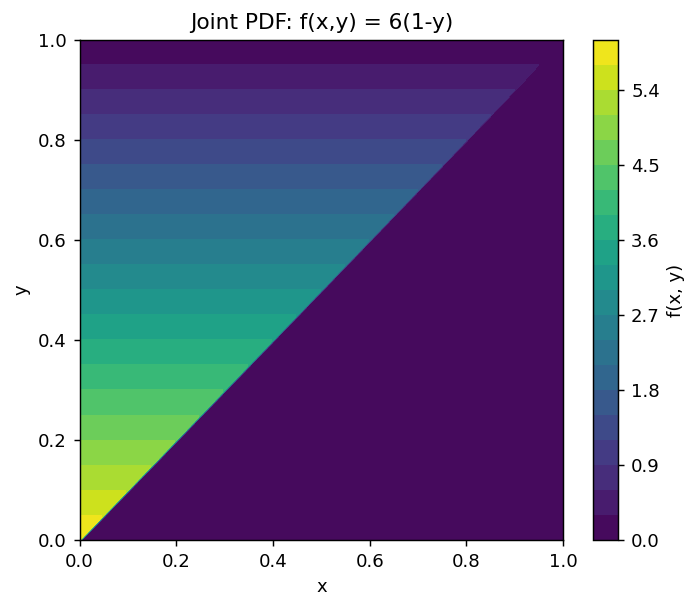
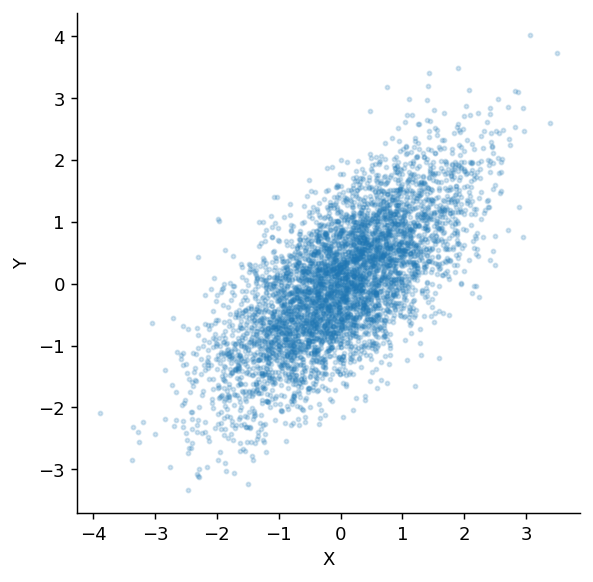

# 결합분포와 주변분포

## 개요

앞의 세 쪽에서 확률변수를 하나씩 보았다. 확률공간 $(\Omega, P)$ 위의 함수 $X$가 결과마다 수를 붙이면 그 수들이 실직선 위에 무게로 퍼지고, 그 퍼짐이 $X$의 분포였다.

그런데 실제로 궁금한 것은 대개 둘 이상이다. 키와 몸무게, 객실등급과 생존 여부, 첫 번째 동전과 두 번째 동전. 이때 $X$와 $Y$를 **따로따로** 아는 것으로는 부족하다. 결과를 $\omega \mapsto (X(\omega), Y(\omega))$로 보내면 무게가 실직선이 아니라 **평면** 위에 놓이며, 그 평면 위의 무게가 **결합분포**다.

이 절이 답하는 물음은 둘이다. 평면 위의 무게에서 각 변수 하나의 분포를 어떻게 되찾는가, 그리고 그 무게 위에서 기댓값과 분산을 어떻게 재는가. 되찾은 분포가 원래 무게를 되살리지 못한다는 것이 이 절의 결론이며, 그 되살림이 언제 가능한지는 다음 절 [확률변수의 독립](rv_independence.md)이 답한다.

---

## 1. 확률변수 둘을 함께 보면 평면 위의 무게가 된다

<div class="defn" markdown>

### 정의 1. 결합분포 { .dfn }

**이산형.** 결합확률질량함수는 $p_{X,Y}(x, y) = P(X = x,\; Y = y)$이며 두 조건을 만족한다.

$$
p_{X,Y}(x, y) \ge 0 \quad \text{(모든 } x, y\text{)},
\qquad
\sum_x \sum_y p_{X,Y}(x, y) = 1
$$

**연속형.** 결합확률밀도함수 $f_{X,Y}$는 임의의 영역 $A \subseteq \mathbb{R}^2$에 대해

$$
P((X, Y) \in A) = \iint_A f_{X,Y}(x, y)\,dx\,dy
$$

를 만족하며, 마찬가지로 $f_{X,Y} \ge 0$이고 전체 적분이 $1$이다.

**결합 누적분포함수.**

$$
F_{X,Y}(x, y) = P(X \leq x,\; Y \leq y),
\qquad
f_{X,Y}(x, y) = \frac{\partial^2}{\partial x \, \partial y} F_{X,Y}(x, y)
$$

</div>

**한 변수일 때와 달라진 것은 차원뿐이다.** 조건도 그대로다. 무게는 음수일 수 없고 전부 더하면 $1$이다. 이산이면 영역 $A$ 안의 칸을 더하고 연속이면 그 위에서 적분한다.

---

## 2. 한 축으로 눌러 모으면 주변분포가 남는다

결합분포를 손에 쥐고 있으면 각 변수 하나의 분포는 언제든 되찾을 수 있다. 다른 변수를 **더해 없애면** 된다.

<div class="thmbox" markdown>

### 정리 1. 주변화 — 한 축에 비친 그림자 { .thm }

**이산형.**

$$
p_X(x) = \sum_y p_{X,Y}(x, y),
\qquad
p_Y(y) = \sum_x p_{X,Y}(x, y)
$$

**연속형.**

$$
f_X(x) = \int_{-\infty}^{\infty} f_{X,Y}(x, y)\,dy,
\qquad
f_Y(y) = \int_{-\infty}^{\infty} f_{X,Y}(x, y)\,dx
$$

</div>

??? proof "증명"

    **이산형.** $X$ 가 값 $x$ 를 취하는 사건을 $Y$ 의 값으로 쪼갠다. $Y$ 도 확률변수이므로 그 값이 **하나로 정해진다** — 따라서

    $$
    \{X = x\} = \bigcup_y \{X = x,\; Y = y\}
    $$

    이고 오른쪽의 사건들은 서로소다. 가산가법성에서

    $$
    p_X(x) = P(X = x) = \sum_y P(X = x,\, Y = y) = \sum_y p_{X,Y}(x, y)
    $$

    다. $Y$ 에 대해서도 역할을 바꾸어 같다.

    **연속형.** 정의 1 의 영역을 $A = (-\infty, x] \times \mathbb{R}$ 로 잡으면 그 사건이 $\{X \le x\}$ 다. 그러므로

    $$
    F_X(x) = \int_{-\infty}^{x}\!\!\int_{-\infty}^{\infty} f_{X,Y}(s, y)\,dy\,ds
    $$

    이고, 양변을 $x$ 로 미분하면(3.3절 정리 2) 괄호 안이 그대로 남아

    $$
    f_X(x) = \int_{-\infty}^{\infty} f_{X,Y}(x, y)\,dy
    $$

    다. $\square$

    **$Y$ 를 "더해 없앤다"는 말의 내용이 이것이다.** $Y$ 가 무엇이든 상관하지 않겠다는 것은 $Y$ 의 모든 경우를 **빠짐없이 한 번씩** 세는 것이고, 그 빠짐없음과 겹치지 않음이 가산가법성을 쓸 자격을 준다.

**주변분포는 그림자다.** 평면 위의 무게를 한 축 방향으로 눌러 모으면 그 축 위에 무게가 쌓인다. $y$를 모두 더해 없앤 것이 $x$축에 비친 그림자이고, 그것이 $X$의 분포다. "주변(marginal)"이라는 이름은 결합확률을 표로 적었을 때 행과 열의 합계를 **표의 가장자리**에 적던 관행에서 왔다.

**그런데 그림자에서 원래 무게로 돌아오는 길은 없다.** 이것이 이 절에서 가장 중요한 사실이며, 바로 아래에서 같은 그림자를 남기는 전혀 다른 무게 배치를 직접 만들어 확인한다. 연습문제 $6$과 $10$이 같은 현상을 연속형과 이산형에서 되풀이한다.

!!! note "주변분포는 결합분포를 결정하지 못한다"
    **주변분포가 완전히 같은데도** 안쪽 무게 배치가 갈릴 수 있을까? 갈린다. 가장 작은 예로 확인해 보자.

    $X$와 $Y$는 둘 다 $\text{Bernoulli}(p)$다. 이 주변분포를 그대로 둔 채 결합분포를 두 가지로 만들 수 있다.

    | 칸 | $(X, Y)$ — 독립 | $(X, X)$ — 완전 종속 |
    |:---|:---:|:---:|
    | $(0,0)$ | $q^2$ | $q$ |
    | $(0,1)$ | $qp$ | $0$ |
    | $(1,0)$ | $pq$ | $0$ |
    | $(1,1)$ | $p^2$ | $p$ |
    | **두 주변분포** | 모두 $\text{Bernoulli}(p)$ | 모두 $\text{Bernoulli}(p)$ |

    오른쪽은 "두 번째 던지기를 보는 대신 첫 번째를 한 번 더 보는" 짝이다. 두 결합분포의 가장자리는 한 칸도 다르지 않지만 안쪽은 전혀 다르다.

    **결론:** 주변분포는 결합분포의 **그림자**일 뿐이다. 결합분포에서 주변분포로 가는 길(주변화)은 언제나 열려 있지만, 반대 방향은 닫혀 있다. 의존 구조는 주변분포 바깥에 있는 정보이며, 그것을 담기 위해 결합분포가 따로 필요하다.

---

## 3. 결합분포가 있으면 기댓값을 잴 수 있다

무게가 어떻게 퍼져 있는지 알면 그 위에서 평균을 낼 수 있다. 한 변수일 때와 달라지는 것은 더하거나 적분할 축이 둘이라는 점뿐이다.

<div class="thmbox" markdown>

### 정리 2. 결합분포 위의 기댓값과 선형성 { .thm }

함수 $g(X, Y)$에 대해

$$
E[g(X,Y)] = \sum_x \sum_y g(x,y)\, p_{X,Y}(x,y)
\quad \text{또는} \quad
\iint g(x,y)\, f_{X,Y}(x,y)\, dx\, dy
$$

이다. 특히 **선형성은 독립과 무관하게 언제나 성립한다.**

$$
E[aX + bY] = a\,E[X] + b\,E[Y]
$$

</div>

??? proof "증명"

    앞 식은 한 변수의 LOTUS(3.4절 정리 1)를 평면으로 옮긴 것이다. 분포를 새로 유도하지 않고 **결합분포에 함숫값을 걸어 무게를 매긴다.**

    선형성은 그 식에 $g(x,y) = ax + by$ 를 넣고 합을 둘로 가르면 나온다. 이산형으로 적으면

    $$
    E[aX + bY] = \sum_x\sum_y (ax + by)\,p_{X,Y}(x,y)
    = a\sum_x\sum_y x\,p_{X,Y} + b\sum_x\sum_y y\,p_{X,Y}
    $$

    다. 첫 항에서 $x$ 가 $y$ 를 담지 않으므로 $y$ 에 대한 합을 먼저 할 수 있고, 그것이 **바로 정리 1 의 주변화**다.

    $$
    \sum_x\sum_y x\,p_{X,Y}(x,y) = \sum_x x \sum_y p_{X,Y}(x,y) = \sum_x x\,p_X(x) = E[X]
    $$

    둘째 항도 역할을 바꾸어 $E[Y]$ 가 된다. 따라서 $E[aX+bY] = aE[X] + bE[Y]$ 다. 연속형은 합을 적분으로 바꾸면 같다. $\square$

    **어디에도 독립이 쓰이지 않았다.** 쓴 것은 합의 순서를 바꾼 것과 주변화뿐이다. 그래서 선형성은 **아무 가정 없이** 성립하고, 그림자만 알면 계산된다. 반면 곱의 기댓값이나 합의 분산은 그림자로는 안 된다 — 안쪽 배치를 알아야 한다.

반면 **합의 분산에는 교차항이 붙는다.**

$$
\operatorname{Var}(X + Y) = \operatorname{Var}(X) + \operatorname{Var}(Y) + 2\operatorname{Cov}(X, Y)
$$

이 식은 [분산과 공분산](variance_covariance.md) 쪽 정리 3 에서 증명한다. 여기서 볼 것은 **교차항이 주변분포에 적혀 있지 않다**는 점이다. 같은 그림자를 남기는 두 배치가 전혀 다른 $\operatorname{Var}(X+Y)$ 를 준다.

**선형성이 가정을 요구하지 않는다는 점이 중요하다.** $X$와 $Y$가 아무리 얽혀 있어도 평균은 그냥 더해진다. 그래서 기댓값 계산은 결합분포를 몰라도 주변분포만으로 된다.

**분산은 그렇지 않다.** 교차항 $2\operatorname{Cov}(X,Y)$가 남으며, 이 항은 주변분포만으로는 구할 수 없다. 두 변수가 어떻게 얽혀 있는지를 알아야 하고, 그 얽힘을 재는 양이 공분산이다. [3.4절 분산과 공분산](variance_covariance.md)이 그것을 다룬다.

**독립이면 교차항이 사라진다.** $X \perp Y$이면 $\operatorname{Cov}(X,Y) = 0$이므로

$$
\operatorname{Var}(X + Y) = \operatorname{Var}(X) + \operatorname{Var}(Y)
$$

가 된다. 분산이 그냥 더해지는 이 성질이 5장에서 $\operatorname{Var}(\bar X) = \sigma^2/n$을 얻는 근거이며, 독립이 깨지면 그 계산부터 어긋난다. 독립이 정확히 무엇을 요구하는지는 다음 절 [확률변수의 독립](rv_independence.md)에서 정의한다.

### 손으로 풀어 보기 — 이산

<div class="probox" markdown>

**문제 1.** <span class="diff easy" title="쉬움"></span> 두 자산 $X$와 $Y$의 결합 PMF가 다음과 같다:

| | $Y=0$ | $Y=1$ | $Y=2$ |
|:---|:---:|:---:|:---:|
| $X=0$ | 0.10 | 0.15 | 0.05 |
| $X=1$ | 0.10 | 0.25 | 0.10 |
| $X=2$ | 0.05 | 0.10 | 0.10 |

$P(X + Y \leq 2)$와 $E[XY]$를 계산하라.

</div>

??? success "풀이"

    $$
    P(X+Y \leq 2) = p(0,0) + p(0,1) + p(0,2) + p(1,0) + p(1,1) + p(2,0) = 0.10 + 0.15 + 0.05 + 0.10 + 0.25 + 0.05 = 0.70
    $$

    $xy = 0$인 칸은 모두 떨어져 나가므로 $x \ge 1$이고 $y \ge 1$인 네 칸만 남는다.

    $$
    E[XY] = 1(1)(0.25) + 1(2)(0.10) + 2(1)(0.10) + 2(2)(0.10) = 0.25 + 0.20 + 0.20 + 0.40 = 1.05
    $$

---

### 손으로 풀어 보기 — 연속

<div class="probox" markdown>

**문제 1.** <span class="diff med" title="중간"></span> $0 \leq x \leq y \leq 1$에서 $f_{X,Y}(x,y) = 6(1-y)$라 하자. 이것이 올바른 PDF임을 확인하고 $P(X < 1/2, Y < 1/2)$를 구하라.

</div>

??? success "풀이"
    먼저 확인한다:

    $$
    \int_0^1 \int_0^y 6(1-y)\,dx\,dy = \int_0^1 6y(1-y)\,dy = 6\left[\frac{y^2}{2} - \frac{y^3}{3}\right]_0^1 = 6\left(\frac{1}{2} - \frac{1}{3}\right) = 1 \checkmark
    $$

    이제 확률을 구한다:

    $$
    P\left(X < \tfrac{1}{2}, Y < \tfrac{1}{2}\right) = \int_0^{1/2}\!\int_0^y 6(1-y)\,dx\,dy = \int_0^{1/2} 6y(1-y)\,dy = 6\left[\frac{y^2}{2} - \frac{y^3}{3}\right]_0^{1/2} = 6\left(\frac{1}{8} - \frac{1}{24}\right) = 6 \cdot \frac{2}{24} = \frac{1}{2}
    $$

    따라서 $P(X < 1/2, Y < 1/2) = 1/2$이다. $x \le y$이므로 $Y < 1/2$이면 $X < 1/2$은 저절로 따라오고, 결국 $P(Y < 1/2)$를 구한 것과 같다.

---

### 코드로 확인하기

### 이산 결합 PMF 표

<div class="exbox" markdown>

**보기 1.** <span class="diff easy" title="쉬움"></span> 이산 결합 확률질량함수 표. 앞의 「손으로 풀어 보기 — 이산」에서 쓴 결합 PMF 를 다시 가져온다.

| | $Y=0$ | $Y=1$ | $Y=2$ |
|:---|:---:|:---:|:---:|
| $X=0$ | 0.10 | 0.15 | 0.05 |
| $X=1$ | 0.10 | 0.25 | 0.10 |
| $X=2$ | 0.05 | 0.10 | 0.10 |

**(1)** 두 주변분포를 구하고 $E[X]$, $E[Y]$, $\operatorname{Var}(X+Y)$ 를 구하시오. $E[XY]$ 는 위에서 이미 구한 값을 쓴다.

**(2)** 두 주변분포를 그대로 둔 채 $X$ 와 $Y$ 를 독립으로 짝지으면 $\operatorname{Var}(X+Y)$ 가 얼마가 되는가. (1) 의 답과 왜 다른가.

</div>

??? success "풀이"

    **(1) 해석적으로.** 주변화는 표에서 그냥 더하는 일이다. 행을 더하면 $Y$ 가 지워지고 열을 더하면 $X$ 가 지워진다.

    $$
    p_X = (0.30,\; 0.45,\; 0.25),
    \qquad
    p_Y = (0.25,\; 0.50,\; 0.25)
    $$

    $p_Y$ 는 $1$ 을 중심으로 대칭이므로 $E[Y] = 1$ 이 곧바로 보인다. $X$ 쪽은 직접 더한다.

    $$
    E[X] = 0(0.30) + 1(0.45) + 2(0.25) = 0.95
    $$

    둘째 적률도 같은 방식이다.

    $$
    E[X^2] = 0.45 + 4(0.25) = 1.45,
    \qquad
    E[Y^2] = 0.50 + 4(0.25) = 1.50
    $$

    따라서

    $$
    \operatorname{Var}(X) = 1.45 - 0.95^2 = 0.5475,
    \qquad
    \operatorname{Var}(Y) = 1.50 - 1^2 = 0.5
    $$

    이다. 여기까지는 **그림자만으로** 된 계산이다. 교차항은 그렇지 않다. 「손으로 풀어 보기 — 이산」에서 네 칸만 남겨 $E[XY] = 1.05$ 를 얻었으므로

    $$
    \operatorname{Cov}(X, Y) = E[XY] - E[X]E[Y] = 1.05 - 0.95 \times 1 = 0.10
    $$

    이고, 정리 2 의 공식에 넣으면

    $$
    \operatorname{Var}(X + Y) = 0.5475 + 0.5 + 2(0.10) = 1.2475
    $$

    이다.

    **(2) 같은 그림자, 다른 무게.** 주변분포를 곱해 새 표 $\tilde p(x,y) = p_X(x)\,p_Y(y)$ 를 만들면 행합과 열합은 한 칸도 바뀌지 않는다. 그러나 안쪽은 전혀 다르다.

    | | $Y=0$ | $Y=1$ | $Y=2$ |
    |:---|:---:|:---:|:---:|
    | $X=0$ | 0.0750 | 0.1500 | 0.0750 |
    | $X=1$ | 0.1125 | 0.2250 | 0.1125 |
    | $X=2$ | 0.0625 | 0.1250 | 0.0625 |

    이 배치에서는 $\operatorname{Cov} = 0$ 이므로 교차항이 사라진다.

    $$
    \operatorname{Var}(X + Y) = 0.5475 + 0.5 = 1.0475
    $$

    **차이 $1.2475 - 1.0475 = 0.2$ 가 정확히 $2\operatorname{Cov}(X,Y)$ 다.** 두 표는 가장자리가 같아 $E[X+Y] = 1.95$ 도 같지만 퍼짐은 다르다. §2 에서 말한 "주변분포는 결합분포를 결정하지 못한다" 가 분산 한 개의 수치로 드러난 것이다.

    **(3) 수치적으로.** 표를 배열로 적어 두 배치를 나란히 재 본다.

    ```python
    import numpy as np
    import pandas as pd

    # 결합 PMF를 2차원 배열로 적는다. pmf[i, j] = P(X=i, Y=j) 이고 전체 합이 1이다.
    pmf = np.array([
        [0.10, 0.15, 0.05],
        [0.10, 0.25, 0.10],
        [0.05, 0.10, 0.10]
    ])

    df = pd.DataFrame(pmf, index=['X=0', 'X=1', 'X=2'], columns=['Y=0', 'Y=1', 'Y=2'])

    # 주변분포는 표의 "가장자리(margin)"에 놓인다. 이름의 유래가 그것이다.
    #   행 방향으로 더하면(axis=1) Y를 지워 P(X=x)가 남고,
    #   열 방향으로 더하면(axis=0) X를 지워 P(Y=y)가 남는다.
    # 이것이 주변화 p(x) = sum_y p(x,y) 를 표에서 실행한 것이다.
    df['P(X=x)'] = pmf.sum(axis=1)
    df.loc['P(Y=y)'] = pmf.sum(axis=0).tolist() + [1.0]   # 맨 끝 1.0은 전체 합
    print(df)

    vals = np.arange(3)
    p_x, p_y = pmf.sum(axis=1), pmf.sum(axis=0)

    def moments(table):
        """결합표 하나에서 E[X], E[Y], E[XY], Var(X+Y) 를 전부 꺼낸다."""
        mx, my = table.sum(axis=1), table.sum(axis=0)
        e_x, e_y = (vals * mx).sum(), (vals * my).sum()
        e_xy = sum(i * j * table[i, j] for i in vals for j in vals)
        v_x = (vals ** 2 * mx).sum() - e_x ** 2
        v_y = (vals ** 2 * my).sum() - e_y ** 2
        cov = e_xy - e_x * e_y
        return e_x, e_y, e_xy, v_x, v_y, cov, v_x + v_y + 2 * cov

    # 주변분포를 곱해 만든 독립 배치. 가장자리는 똑같고 안쪽만 다르다.
    indep = np.outer(p_x, p_y)
    print(f"\n두 배치의 주변분포가 같은가: "
          f"{np.allclose(indep.sum(axis=1), p_x) and np.allclose(indep.sum(axis=0), p_y)}")

    for name, table in [("원래 표", pmf), ("독립 배치", indep)]:
        e_x, e_y, e_xy, v_x, v_y, cov, v_s = moments(table)
        print(f"{name}: E[X]={e_x:.4f} E[Y]={e_y:.4f} E[XY]={e_xy:.4f} "
              f"Var(X)={v_x:.4f} Var(Y)={v_y:.4f} Cov={cov:.4f} Var(X+Y)={v_s:.4f}")

    # S = X + Y 의 분포를 직접 세어 공식과 맞춰 본다.
    for name, table in [("원래 표", pmf), ("독립 배치", indep)]:
        s_pmf = np.zeros(5)
        for i in vals:
            for j in vals:
                s_pmf[i + j] += table[i, j]
        e_s = (np.arange(5) * s_pmf).sum()
        v_s = (np.arange(5) ** 2 * s_pmf).sum() - e_s ** 2
        print(f"{name}: S 의 PMF = {np.round(s_pmf, 4)}  E[S]={e_s:.4f}  Var(S)={v_s:.4f}")
    ```

    출력:

    ```
             Y=0   Y=1   Y=2  P(X=x)
    X=0     0.10  0.15  0.05    0.30
    X=1     0.10  0.25  0.10    0.45
    X=2     0.05  0.10  0.10    0.25
    P(Y=y)  0.25  0.50  0.25    1.00

    두 배치의 주변분포가 같은가: True
    원래 표: E[X]=0.9500 E[Y]=1.0000 E[XY]=1.0500 Var(X)=0.5475 Var(Y)=0.5000 Cov=0.1000 Var(X+Y)=1.2475
    독립 배치: E[X]=0.9500 E[Y]=1.0000 E[XY]=0.9500 Var(X)=0.5475 Var(Y)=0.5000 Cov=0.0000 Var(X+Y)=1.0475
    원래 표: S 의 PMF = [0.1  0.25 0.35 0.2  0.1 ]  E[S]=1.9500  Var(S)=1.2475
    독립 배치: S 의 PMF = [0.075  0.2625 0.3625 0.2375 0.0625]  E[S]=1.9500  Var(S)=1.0475
    ```

    유도한 $1.2475$ 와 $1.0475$ 가 코드가 준 값과 맞고, $S$ 의 분포를 직접 세어 구한 분산도 같은 두 값을 준다. $E[S] = 1.95$ 는 두 배치에서 똑같다. **평균은 그림자가 정하고 분산은 안쪽 무게가 정한다.**

### 연속 결합 PDF 시각화

<div class="exbox" markdown>

**보기 2.** <span class="diff easy" title="쉬움"></span> 연속 결합 밀도함수 시각화. 「손으로 풀어 보기 — 연속」에서 쓴 $0 \le x \le y \le 1$ 위의 밀도 $f_{X,Y}(x,y) = 6(1-y)$ 를 그림으로 본다.

**(1)** 등고선이 가로줄로만 놓이는 까닭을 말하고, 두 주변밀도 $f_X$ 와 $f_Y$ 를 적분으로 구하시오.

**(2)** 결합밀도의 높이는 $y \to 0$ 에서 가장 크다. 그런데 $f_Y(0) = 0$ 이다. 어긋난 것인가.

</div>

??? success "풀이"

    **(1) 해석적으로.** 식 $6(1-y)$ 에 $x$ 가 아예 없다. 그러므로 삼각형 안에서 밀도는 **$y$ 만으로 정해지고 $x$ 방향으로는 평평하다.** 등고선 $f = c$ 는 $y$ 가 상수인 집합, 곧 가로줄이 된다. 삼각형 바깥이 $0$ 이므로 각 가로줄은 $x \in [0, y]$ 에서만 그려진다.

    주변밀도는 다른 변수를 더해 없애면 된다. 적분 범위가 삼각형에 걸려 있으니 그것만 조심한다. $y$ 를 고정하면 $x$ 는 $0$ 부터 $y$ 까지이므로

    $$
    f_Y(y) = \int_0^y 6(1-y)\,dx = 6y(1-y),
    \qquad 0 \le y \le 1
    $$

    이고, 거꾸로 $x$ 를 고정하면 $y$ 는 $x$ 부터 $1$ 까지이므로

    $$
    f_X(x) = \int_x^1 6(1-y)\,dy = 6\left[y - \frac{y^2}{2}\right]_x^1 = 3(1-x)^2,
    \qquad 0 \le x \le 1
    $$

    이다. 둘 다 적분이 $1$ 인지 확인한다. $\int_0^1 6y(1-y)\,dy = 6(\tfrac12 - \tfrac13) = 1$ 이고 $\int_0^1 3(1-x)^2 dx = 1$ 이다. 이름을 붙이면 $Y \sim \text{Beta}(2,2)$, $X \sim \text{Beta}(1,3)$ 이고 평균은 $E[Y] = \tfrac12$, $E[X] = \tfrac14$ 다.

    **두 주변밀도의 곱은 원래 밀도가 아니다.** $f_X(x) f_Y(y) = 3(1-x)^2 \cdot 6y(1-y)$ 는 단위정사각형 전체에서 양수이지만 $f_{X,Y}$ 는 삼각형 밖에서 $0$ 이다. 정의역이 사각형이 아니라는 것만으로 이미 종속이다.

    **(2) 어긋난 것이 아니다.** 주변밀도는 밀도의 **높이가 아니라 단면의 무게**다. 높이에 단면의 길이를 곱한 것이기 때문이다.

    $$
    f_Y(y) = \underbrace{6(1-y)}_{\text{높이}} \times \underbrace{y}_{\text{단면 }[0,y]\text{의 길이}}
    $$

    $y \to 0$ 에서 높이는 $6$ 으로 가장 크지만 단면이 한 점으로 쪼그라들어 길이가 $0$ 이다. 거꾸로 $y \to 1$ 에서는 단면이 가장 길지만 높이가 $0$ 이다. 두 효과가 맞물려 $f_Y$ 는 가운데 $y = \tfrac12$ 에서 최대 $6 \cdot \tfrac12 \cdot \tfrac12 = 1.5$ 를 갖는다. **그림에서 색이 가장 진한 곳과 $Y$ 가 가장 많이 머무는 곳이 다르다**는 것이 이 보기에서 볼 것이다.

    **(3) 수치적으로.** 등고선을 그리고, 유도한 두 주변밀도를 수치적분과 맞춰 본다.

    ```python
    import numpy as np
    import matplotlib.pyplot as plt
    from scipy import integrate

    plt.rcParams["font.sans-serif"] = ["NanumGothic", "Apple SD Gothic Neo", "Malgun Gothic"]
    plt.rcParams["font.family"] = "sans-serif"
    plt.rcParams["axes.unicode_minus"] = False

    x = np.linspace(0, 1, 200)
    y = np.linspace(0, 1, 200)
    X, Y = np.meshgrid(x, y)

    # 이 결합밀도는 삼각형 영역 0 <= x <= y <= 1 위에서만 0이 아니다.
    # where로 그 조건을 걸어 바깥을 0으로 만든다.
    # **정의역이 사각형이 아니라는 점이 핵심이다.** X의 범위가 Y에 달려 있으므로
    # 두 변수는 종속이며, 결합밀도를 주변밀도의 곱으로 쪼갤 수 없다.
    Z = np.where(X <= Y, 6 * (1 - Y), 0)

    # 유도한 주변밀도. 수치적분으로 같은 값이 나오는지 확인한다.
    f_X = lambda t: 3 * (1 - t) ** 2
    f_Y = lambda t: 6 * t * (1 - t)

    for t in (0.2, 0.5, 0.8):
        # f_X(x) = int_x^1 6(1-y) dy,  f_Y(y) = int_0^y 6(1-y) dx = 6y(1-y)
        num_x = integrate.quad(lambda yy: 6 * (1 - yy), t, 1)[0]
        print(f"t={t}:  f_X 유도 {f_X(t):.6f} / 적분 {num_x:.6f}"
              f"   f_Y 유도 {f_Y(t):.6f} / 높이×길이 {6 * (1 - t) * t:.6f}")

    print(f"규격화: int f_X = {integrate.quad(f_X, 0, 1)[0]:.6f},"
          f"  int f_Y = {integrate.quad(f_Y, 0, 1)[0]:.6f}")
    print(f"E[X] = {integrate.quad(lambda t: t * f_X(t), 0, 1)[0]:.6f},"
          f"  E[Y] = {integrate.quad(lambda t: t * f_Y(t), 0, 1)[0]:.6f}")
    print(f"결합밀도 최대 높이 = {6 * (1 - 0):.1f} (y=0),"
          f"  f_Y 최대 = {f_Y(0.5):.1f} (y=0.5)")

    fig, ax = plt.subplots(figsize=(6, 5))
    c = ax.contourf(X, Y, Z, levels=20, cmap='viridis')
    fig.colorbar(c, ax=ax, label='f(x, y)')
    ax.set_xlabel('x')
    ax.set_ylabel('y')
    ax.set_title('Joint PDF: f(x,y) = 6(1-y)')
    plt.show()
    ```

    출력:

    ```
    t=0.2:  f_X 유도 1.920000 / 적분 1.920000   f_Y 유도 0.960000 / 높이×길이 0.960000
    t=0.5:  f_X 유도 0.750000 / 적분 0.750000   f_Y 유도 1.500000 / 높이×길이 1.500000
    t=0.8:  f_X 유도 0.120000 / 적분 0.120000   f_Y 유도 0.960000 / 높이×길이 0.960000
    규격화: int f_X = 1.000000,  int f_Y = 1.000000
    E[X] = 0.250000,  E[Y] = 0.500000
    결합밀도 최대 높이 = 6.0 (y=0),  f_Y 최대 = 1.5 (y=0.5)
    ```

    

    유도한 $f_X(x) = 3(1-x)^2$ 와 $f_Y(y) = 6y(1-y)$ 가 수치적분과 소수점 여섯 자리까지 맞고, 규격화와 평균 $\tfrac14$, $\tfrac12$ 도 그대로 나온다.

    그림에서 읽을 것은 두 가지다. 첫째, **색띠가 가로로만 바뀐다.** 삼각형 안에서 가로로 움직이면 색이 그대로이고, 위로 올라갈 때만 노란색에서 짙은 남색으로 변한다. $x$ 가 밀도에 들어 있지 않다는 사실이 그대로 보인다. 둘째, **그림이 가리는 것이 주변밀도다.** 색이 가장 밝은 곳(노란색)은 아래쪽 $y \approx 0$ 의 꼭짓점 언저리인데 그곳의 삼각형 단면은 거의 폭이 없다. 등고선 그림은 높이만 칠해 주므로 "무게가 실제로 어디에 모여 있는가"는 보여 주지 못하며, 그것을 보려면 (1) 처럼 눌러 모아야 한다.

### 이변량 정규분포 표본추출

연속형 결합분포를 눈으로 보기 위해 이변량 정규분포에서 표본을 뽑아 본다. 여기서는 "평면 위에 퍼진 무게"의 보기로만 쓰며, 이 분포 자체의 밀도함수와 성질은 [4.3절 이변량 정규분포](../../ch04/bivariate_normal/bivariate_normal.md)에서 다룬다.

<div class="exbox" markdown>

**보기 3.** <span class="diff easy" title="쉬움"></span> 이변량 정규분포 표본추출. 평균 $\mathbf 0$, 공분산행렬

$$
\Sigma = \begin{pmatrix} 1 & 0.7 \\ 0.7 & 1 \end{pmatrix}
$$

인 이변량 정규분포에서 $n = 5000$ 쌍을 뽑아 흩뿌림그림을 그린다.

**(1)** 점구름이 어느 방향으로 얼마나 길쭉해야 하는가. $\Sigma$ 의 고유값과 고유벡터로 주축의 방향과 두 축 길이의 비를 구하시오.

**(2)** 이 표본에서 잰 표본상관계수가 $0.7$ 에서 얼마나 벗어나면 이상한 것인가. 이론 표준오차를 적고 실제 벗어남과 견주시오.

</div>

??? success "풀이"

    **(1) 해석적으로.** 대각원소가 둘 다 $1$ 로 같다는 것이 계산을 끝내 준다. 벡터 $(1,1)^{\mathsf T}$ 와 $(1,-1)^{\mathsf T}$ 를 넣어 보면

    $$
    \Sigma \begin{pmatrix} 1 \\ 1 \end{pmatrix} = \begin{pmatrix} 1.7 \\ 1.7 \end{pmatrix} = 1.7 \begin{pmatrix} 1 \\ 1 \end{pmatrix},
    \qquad
    \Sigma \begin{pmatrix} 1 \\ -1 \end{pmatrix} = \begin{pmatrix} 0.3 \\ -0.3 \end{pmatrix} = 0.3 \begin{pmatrix} 1 \\ -1 \end{pmatrix}
    $$

    이므로 고유값은 $\lambda_1 = 1 + \rho = 1.7$, $\lambda_2 = 1 - \rho = 0.3$ 이고 고유벡터는 각각 $45^\circ$ 선 $y = x$ 와 그에 직교하는 $y = -x$ 다. 분산이 같은 두 변수에서는 상관의 부호만 주축이 어느 대각선인지를 정한다.

    고유값은 **그 방향으로 잰 분산**이므로 축 길이의 비는 표준편차의 비다.

    $$
    \sqrt{\frac{\lambda_1}{\lambda_2}} = \sqrt{\frac{1.7}{0.3}} = \sqrt{\frac{17}{3}} = 2.3805
    $$

    $45^\circ$ 방향으로 직교 방향보다 $2.38$ 배 길쭉한 타원이 나와야 한다.

    **한 가지 헷갈리기 쉬운 것.** 주축의 기울기는 $1$ 이지만 **$x$ 를 주었을 때 $Y$ 의 평균을 잇는 직선의 기울기는 $\rho = 0.7$ 이다.** 두 직선은 다르다. 앞의 것은 점구름이 가장 길게 뻗은 방향이고 뒤의 것은 세로 단면들의 중심을 이은 선이다. 이 구별은 다음 절 [조건부분포](conditional_dist.md)와 [4.3절 이변량 정규분포](../../ch04/bivariate_normal/bivariate_normal.md)에서 다시 다룬다.

    **(2) 이론값.** 표본상관계수 $r$ 의 큰표본 표준오차는

    $$
    \operatorname{SE}(r) \approx \frac{1 - \rho^2}{\sqrt n} = \frac{1 - 0.49}{\sqrt{5000}} = \frac{0.51}{70.711} = 0.00721
    $$

    이다. $0.7$ 에서 $0.007$ 쯤 벗어나는 것은 늘 있는 일이고, $0.02$ 이상 벗어나면 세 표준오차 밖이라 눈여겨볼 만하다.

    **(3) 수치적으로.**

    ```python
    import numpy as np
    import matplotlib.pyplot as plt

    plt.rcParams["font.sans-serif"] = ["NanumGothic", "Apple SD Gothic Neo", "Malgun Gothic"]
    plt.rcParams["font.family"] = "sans-serif"
    plt.rcParams["axes.unicode_minus"] = False

    np.random.seed(42)
    mean = [0, 0]
    # 분산이 둘 다 1이므로 비대각원소 0.7이 곧 상관계수다.
    cov = [[1, 0.7], [0.7, 1]]
    # 5000개의 (x, y) 쌍을 뽑는다. 결과는 (5000, 2) 모양이다.
    samples = np.random.multivariate_normal(mean, cov, 5000)

    # (1) 고유분해. 고유값은 그 방향으로 잰 분산이므로
    # 축 길이의 비는 고유값의 비가 아니라 그 제곱근의 비다.
    evals, evecs = np.linalg.eigh(np.array(cov))
    print(f"고유값 = {evals}  (이론 1-rho=0.3, 1+rho=1.7)")
    print(f"큰 고유값의 고유벡터 = {np.round(evecs[:, 1], 4)}  (이론 (1,1)/sqrt(2) = {1 / np.sqrt(2):.4f})")
    print(f"축 길이의 비 = {np.sqrt(evals[1] / evals[0]):.4f}  (이론 sqrt(17/3) = {np.sqrt(17 / 3):.4f})")

    # (2) 표본에서 잰 값들. 주변분산은 1, 상관계수는 0.7 이어야 한다.
    r = np.corrcoef(samples.T)[0, 1]
    se = (1 - 0.7 ** 2) / np.sqrt(len(samples))
    print(f"표본 주변분산 = {np.round(samples.var(axis=0, ddof=1), 4)}  (이론 1, 1)")
    print(f"표본상관계수 r = {r:.6f},  SE(r) = {se:.6f},  (r - 0.7)/SE = {(r - 0.7) / se:+.3f}")

    fig, ax = plt.subplots(figsize=(6, 5))
    # alpha를 낮춰 겹침을 푼다. 5000개를 그대로 찍으면 가운데가 뭉개진다.
    ax.scatter(samples[:, 0], samples[:, 1], alpha=0.2, s=5)
    ax.set_xlabel('X')
    ax.set_ylabel('Y')
    # 가로세로 비를 맞춰야 타원의 기울기를 정직하게 볼 수 있다
    ax.set_aspect('equal')
    ax.spines[['top', 'right']].set_visible(False)
    plt.show()
    ```

    출력:

    ```
    고유값 = [0.3 1.7]  (이론 1-rho=0.3, 1+rho=1.7)
    큰 고유값의 고유벡터 = [0.7071 0.7071]  (이론 (1,1)/sqrt(2) = 0.7071)
    축 길이의 비 = 2.3805  (이론 sqrt(17/3) = 2.3805)
    표본 주변분산 = [1.0022 1.0126]  (이론 1, 1)
    표본상관계수 r = 0.700283,  SE(r) = 0.007212,  (r - 0.7)/SE = +0.039
    ```

    

    고유값 $0.3$ 과 $1.7$, 축 비 $2.3805$, 고유벡터 $(0.7071, 0.7071)$ 이 모두 (1) 의 유도와 맞는다. 표본상관계수 $0.700283$ 은 $0.7$ 에서 $0.04$ 표준오차밖에 떨어져 있지 않다. **표본 하나로 얻은 값이 참값과 이만큼 가까운 것은 운이 좋은 편이며**, 다른 씨앗을 쓰면 대개 $0.007$ 쯤 떨어진 값이 나온다.

    그림에서 확인할 것은 기울기다. 점구름이 $45^\circ$ 선을 따라 길게 뻗어 있고, 가로세로 비를 맞춰 그렸으므로 그 기울기를 눈대중으로 읽어도 된다. 가로로는 대략 $-4$ 부터 $3.5$ 까지, 세로로도 비슷한 폭으로 퍼져 있다. **주변분포만 보면 둘 다 그냥 $N(0,1)$ 이고, 이 기울기는 주변분포 어디에도 적혀 있지 않다.** 보기 1 에서 표로 본 것과 같은 이야기가 연속형에서 되풀이된 것이다.

---

## 연습문제

<div class="drillbox" markdown>

**연습문제 1.** <span class="diff easy" title="쉬움"></span>
결합 PMF가 $p(0,0)=0.10, p(0,1)=0.15, p(0,2)=0.05, p(1,0)=0.10, p(1,1)=0.20, p(1,2)=0.10, p(2,0)=0.05, p(2,1)=0.10, p(2,2)=0.15$이다. (a) 올바른 PMF인가? (b) 주변분포. (c) $\mathbb{E}[X], \mathbb{E}[Y], \mathbb{E}[XY]$. (d) $\mathrm{Cov}, \rho$. (e) 독립인가?

</div>

??? success "풀이"
    (a) 합 = 1이고 모두 음이 아니다 ✓.

    (b) 행의 합: $p_X(0,1,2) = (0.30, 0.40, 0.30)$. 열의 합: $p_Y(0,1,2) = (0.25, 0.45, 0.30)$.

    (c) $\mathbb{E}[X] = 1.0$, $\mathbb{E}[Y] = 1.05$, $\mathbb{E}[XY] = 0.20 + 0.20 + 0.20 + 0.60 = 1.20$.

    (d) $\mathrm{Cov} = 1.20 - 1.0 \cdot 1.05 = 0.15$. $\mathrm{Var}(X) = 0.60$, $\mathrm{Var}(Y) = 0.5475$. $\rho = 0.15/\sqrt{0.60 \cdot 0.5475} \approx 0.262$.

    (e) 독립이 아니다: $p(0,0) = 0.10 \ne p_X(0) p_Y(0) = 0.075$.

---

<div class="drillbox" markdown>

**연습문제 2.** <span class="diff easy" title="쉬움"></span>
결합 PMF가 아래 표와 같다. 두 주변분포를 구하고, $E[X]$와 $E[XY]$를 계산하라.

| $p_{X,Y}$ | $Y=0$ | $Y=1$ |
|:---|---:|---:|
| $X=0$ | $0.1$ | $0.2$ |
| $X=1$ | $0.3$ | $0.4$ |

</div>

??? success "풀이"
    행을 더해 $p_X(0) = 0.3$, $p_X(1) = 0.7$이고, 열을 더해 $p_Y(0) = 0.4$, $p_Y(1) = 0.6$이다.

    $$
    E[X] = 0 \cdot 0.3 + 1 \cdot 0.7 = 0.7
    $$

    $E[XY]$는 $xy$가 $0$이 아닌 칸이 하나뿐이라 간단하다.

    $$
    E[XY] = 1 \cdot 1 \cdot p_{X,Y}(1,1) = 0.4
    $$

    참고로 $E[X]E[Y] = 0.7 \times 0.6 = 0.42 \ne 0.4$이므로 $\operatorname{Cov}(X,Y) = -0.02$이고 두 변수는 독립이 아니다.

---

<div class="drillbox" markdown>

**연습문제 3.** <span class="diff med" title="중간"></span>
**결합 CDF.** 결합 PDF가 $f(x, y)$인 연속확률변수 $(X, Y)$에 대해 결합 CDF를 $F(x, y) = P(X \le x, Y \le y)$로 정의한다. $f$를 $F$로 표현하라.

</div>

??? success "풀이"
    결합 CDF는 왼쪽 아래 사분면에서 결합 PDF를 적분한 것이다:

    $$
    F(x, y) = \int_{-\infty}^{y} \int_{-\infty}^{x} f(s, t)\, ds\, dt
    $$

    (충분한 매끄러움을 가정하고) 두 변수 모두에 대해 미분하면:

    $$
    f(x, y) = \frac{\partial^2 F(x, y)}{\partial x \partial y}
    $$

    이는 1차원 관계 $f = F'$의 결합분포 판이다.

    결합 CDF의 성질: 두 인수 각각에 대해 비감소이고, $F(-\infty, y) = F(x, -\infty) = 0$, $F(\infty, \infty) = 1$이며, 주변분포는 $F_X(x) = F(x, \infty)$와 $F_Y(y) = F(\infty, y)$로 되찾는다.

---

<div class="drillbox" markdown>

**연습문제 4.** <span class="diff med" title="중간"></span>
**조건부분포로부터 결합분포 구하기.** $f_{X|Y}(x \mid y) = (1/y) \mathbf 1\{0 \le x \le y\}$($[0, y]$ 위의 균등분포)이고 $y \ge 0$에 대해 $f_Y(y) = e^{-y}$이다. 결합분포와 $X$의 주변분포를 구하라.

</div>

??? success "풀이"
    결합분포: $f_{X, Y}(x, y) = f_{X|Y}(x|y) f_Y(y) = (1/y) e^{-y} \mathbf 1\{0 \le x \le y\}$.

    $X$의 주변분포: $y \ge x$인 영역에서 $y$에 대해 적분한다:

    $$
    f_X(x) = \int_x^\infty \frac{e^{-y}}{y} dy
    $$

    이 적분은 초등함수로 표현되지 않는다(**지수적분** $E_1(x)$와 같다). $x$가 작으면 $-\ln x$처럼 발산하고, $x$가 크면 $e^{-x}/x$처럼 행동한다. $X$는 알려져 있지만 초등함수가 아닌 분포를 갖는다.

    **교훈:** 주변분포가 복잡하더라도 조건부 구조는 단순할 수 있다. 이러한 인수분해 관점이 계층적 베이즈 모형의 토대이다.

---

<div class="drillbox" markdown>

**연습문제 5.** <span class="diff med" title="중간"></span>
**다항분포.** 이항분포를 $k$개의 범주로 일반화한다. $n$번의 시행에서 각 시행이 독립적으로 확률 $p_j$로 결과 $j$를 내고 $\sum_j p_j = 1$이다. $X_j$를 결과 $j$의 횟수라 할 때 결합 PMF를 유도하라.

</div>

??? success "풀이"
    특정한 결과 열 하나가 나올 확률은 $\prod_j p_j^{X_j}$이다. 계수 벡터 $(X_1, \ldots, X_k)$를 주는 열의 개수는 다항계수 $\binom{n}{X_1, X_2, \ldots, X_k} = n!/(X_1! X_2! \cdots X_k!)$이다.

    결합 PMF:

    $$
    P(X_1 = x_1, \ldots, X_k = x_k) = \frac{n!}{x_1! x_2! \cdots x_k!} \prod_{j=1}^k p_j^{x_j}
    $$

    이는 $x_j \ge 0$이고 $\sum_j x_j = n$일 때 성립한다.

    **$X_j$의 주변분포**는 $\mathrm{Binomial}(n, p_j)$이다($j$ 이외의 범주를 하나로 묶으면 된다).

    $i \ne j$일 때 $X_i, X_j$ 사이의 **공분산**은 $\mathrm{Cov}(X_i, X_j) = -np_i p_j$이다. 음수인 이유는 한 계수가 늘어나면 제약 $\sum = n$ 때문에 다른 계수가 줄어들어야 하기 때문이다.

---

<div class="drillbox" markdown>

**연습문제 6.** <span class="diff med" title="중간"></span>
**결합 CDF에서 직사각형 확률 꺼내기.** $a < b$, $c < d$일 때

$$
P(a < X \le b,\; c < Y \le d) = F(b,d) - F(a,d) - F(b,c) + F(a,c)
$$

임을 보여라. 이 식을 독립인 $X, Y \sim \text{Uniform}(0,1)$에 적용해 $P(0.2 < X \le 0.5,\; 0.3 < Y \le 0.8)$을 구하라. 또 두 인수에 대해 각각 비감소인 것만으로는 $F$가 결합 CDF가 되지 못하는 이유를 밝혀라.

</div>

??? success "풀이"
    **포함–배제.** 사건 $\{X \le b, Y \le d\}$에서 왼쪽 띠 $\{X \le a\}$와 아래 띠 $\{Y \le c\}$를 빼면 두 띠가 겹치는 모서리 $\{X \le a, Y \le c\}$를 두 번 뺀 것이 되므로 한 번 되돌려 준다.

    $$
    P(a < X \le b,\; c < Y \le d) = F(b,d) - F(a,d) - F(b,c) + F(a,c)
    $$

    부호가 $+,-,-,+$로 엇갈리는 것은 2차원판 포함–배제이며, $n$차원이면 $2^n$개 항에 $(-1)^{\text{바뀐 좌표 수}}$가 붙는다.

    **적용.** 독립인 균등분포에서는 $F(x,y) = F_X(x)F_Y(y) = xy$($0 \le x, y \le 1$)이므로

    $$
    (0.5)(0.8) - (0.2)(0.8) - (0.5)(0.3) + (0.2)(0.3) = 0.40 - 0.16 - 0.15 + 0.06 = 0.15
    $$

    이다. 독립이므로 $(0.5 - 0.2)(0.8 - 0.3) = 0.3 \times 0.5 = 0.15$로 직접 확인된다.

    **단조성만으로는 부족하다.** 위 네 항의 합은 확률이므로 **음이 될 수 없다.** 그런데 두 인수에 대한 비감소성은 이 조건을 함의하지 않는다. 예컨대 $[0,1]^2$에서

    $$
    F(x,y) = \min(x + y,\; 1)
    $$

    은 두 인수 각각에 대해 비감소이고 $F(0,0) = 0$, $F(1,1) = 1$이지만, $a = c = 0$, $b = d = 1$로 놓으면 네 항의 합이 $1 - 1 - 1 + 0 = -1 < 0$이 된다. 그러므로 결합 CDF의 정의에는 **직사각형 부등식**이 따로 들어가야 하며, 1차원에서 "비감소 + 오른쪽 연속 + 양 끝 극한"만으로 충분했던 것과 달라지는 지점이 여기다.

---

<div class="drillbox" markdown>

**연습문제 7.** <span class="diff med" title="중간"></span>
$[0,1]^2$ 위에서 $f_{X,Y}(x,y) = c\,(x + y)$라 하자. $c$를 구하고, 주변밀도와 $P(X > Y)$를 구하라.

</div>

??? success "풀이"
    **규격화.** $\int_0^1\!\!\int_0^1 c(x+y)\,dx\,dy = c\left(\tfrac12 + \tfrac12\right) = c = 1$이므로 $c = 1$이다.

    **주변밀도.**

    $$
    f_X(x) = \int_0^1 (x + y)\,dy = x + \tfrac12 \qquad (0 \le x \le 1)
    $$

    대칭이므로 $f_Y(y) = y + \tfrac12$다.

    **$P(X > Y)$.** 밀도가 $x$와 $y$에 대해 **대칭**이므로 직선 $y = x$의 양쪽 무게가 같다. 따라서

    $$
    P(X > Y) = \tfrac12
    $$

    적분으로 확인해도 $\int_0^1\!\!\int_0^x (x+y)\,dy\,dx = \int_0^1 \left(x^2 + \tfrac{x^2}{2}\right)dx = \tfrac12$다.

    **덧붙여 독립이 아니다.** $f_X(x)f_Y(y) = (x+\tfrac12)(y+\tfrac12)$에는 $xy$ 항이 생기는데 원래 밀도에는 없다. **합은 곱으로 쪼개지지 않는다.**

---

<div class="drillbox" markdown>

**연습문제 8.** <span class="diff med" title="중간"></span>
연습문제 $8$의 분포에서 $E[X + Y]$와 $\operatorname{Var}(X+Y)$를 구하려 한다. 둘 중 어느 쪽이 주변분포만으로 계산되는가? 그 차이가 왜 생기는지 설명하라.

</div>

??? success "풀이"
    **$E[X+Y]$는 주변분포만으로 된다.** 선형성이 독립을 요구하지 않기 때문이다.

    $$
    E[X] = \int_0^1 x\left(x + \tfrac12\right)dx = \tfrac13 + \tfrac14 = \tfrac{7}{12}
    $$

    대칭이므로 $E[Y]$도 같고, 따라서 $E[X+Y] = \tfrac{7}{6}$이다.

    **$\operatorname{Var}(X+Y)$는 주변분포만으로 안 된다.** 정리 2 에서 보았듯

    $$
    \operatorname{Var}(X+Y) = \operatorname{Var}(X) + \operatorname{Var}(Y) + 2\operatorname{Cov}(X,Y)
    $$

    인데 마지막 항이 두 변수가 **어떻게 얽혀 있는지**에 달려 있다. 같은 주변분포를 갖는 다른 결합분포를 가져오면 이 값이 달라진다(연습문제 $6$이 그 극단적인 예다).

    **요약하면 이렇다.** 평균은 그림자만 보고도 더할 수 있지만, 퍼짐은 안쪽 무게를 보아야 한다. 이것이 공분산이 따로 필요한 이유이며 [3.4절 분산과 공분산](variance_covariance.md)이 그 양을 다룬다.

---

<div class="drillbox" markdown>

**연습문제 9.** <span class="diff med" title="중간"></span>
공정한 주사위 둘을 굴려 눈을 $X$, $Y$라 한다. $S = X + Y$의 분포를 구하라. 이 계산에 $X$와 $Y$의 **주변분포만으로 충분한가?**

</div>

??? success "풀이"
    결합분포는 $36$칸에 $1/36$씩 고르게 놓인다. $S = k$인 칸의 개수를 세면 된다.

    | $k$ | $2$ | $3$ | $4$ | $5$ | $6$ | $7$ | $8$ | $9$ | $10$ | $11$ | $12$ |
    |---:|---:|---:|---:|---:|---:|---:|---:|---:|---:|---:|---:|
    | 칸 수 | $1$ | $2$ | $3$ | $4$ | $5$ | $6$ | $5$ | $4$ | $3$ | $2$ | $1$ |

    따라서 $P(S=k)$는 위 칸 수를 $36$으로 나눈 값이고, $k=7$에서 $6/36$으로 가장 크다.

    **주변분포만으로는 충분하지 않다.** 위 계산에서 실제로 쓴 것은 "각 칸이 $1/36$"이라는 **결합분포**다. 주변분포가 똑같이 각각 균등한데도 결합분포가 다르면 답이 달라진다. 예컨대 $Y = X$로 짝지으면 두 주변분포는 그대로지만

    $$
    S = 2X \in \{2, 4, 6, 8, 10, 12\}
    $$

    이 되어 홀수가 아예 나오지 않는다. **합의 분포는 그림자가 아니라 안쪽 무게가 정한다.**

    다만 **독립이라는 조건이 주어지면** 주변분포만으로 계산이 닫힌다. 그때 결합분포가 곱으로 복원되기 때문이며, 그 계산을 **합성곱**이라 부른다.

    $$
    P(S = k) = \sum_x p_X(x)\, p_Y(k - x)
    $$

---

<div class="drillbox" markdown>

**연습문제 10.** <span class="diff hard" title="어려움"></span>
$X$와 $Y$가 둘 다 $\text{Uniform}(0,1)$을 따른다는 것만 알고 있다. 이 정보만으로 $P(X + Y > 1.5)$를 답할 수 있는가? 서로 다른 답을 주는 결합분포 둘을 만들어 보여라.

</div>

??? success "풀이"
    **답할 수 없다.** 주변분포는 결합분포를 결정하지 않으므로(§2) 두 변수가 어떻게 얽혀 있는지에 따라 답이 달라진다.

    **경우 1 (독립).** 단위정사각형 위에 무게가 고르게 퍼져 있고, $x + y > 1.5$인 영역은 꼭짓점 $(0.5, 1)$, $(1, 0.5)$, $(1,1)$을 잇는 직각삼각형이다. 두 변의 길이가 $0.5$이므로

    $$
    P(X + Y > 1.5) = \tfrac12 \times 0.5 \times 0.5 = 0.125
    $$

    **경우 2 ($Y = X$).** 무게가 대각선 위에만 놓인다. 주변분포는 여전히 각각 $\text{Uniform}(0,1)$이다.

    $$
    P(X + Y > 1.5) = P(2X > 1.5) = P(X > 0.75) = 0.25
    $$

    **같은 그림자에서 $0.125$와 $0.25$가 나온다.** 두 배 차이다.

    **실무적 함의가 작지 않다.** 위험을 합산하는 일이 모두 이 구조다. 자산 둘의 수익률 분포를 각각 알아도 포트폴리오 손실의 분포는 정해지지 않으며, 둘이 함께 무너질 가능성을 따로 모형화해야 한다. 주변분포는 그대로 두고 얽힘만 갈아 끼우는 도구를 **코퓰러**라 부른다. 2008년 금융위기에서 문제가 된 것이 바로 이 얽힘을 너무 낙관적으로 잡은 모형이었고, [5장의 금융위기 사례](../../ch05/foundations/financial_crisis_clt.md)가 그 이야기를 다룬다.

---

## 정리하며

확률변수를 하나 더 얹으면 무게가 실직선을 떠나 평면으로 올라간다. 달라지는 것은 차원뿐이고 규칙은 그대로다.

- **정의 1**은 결합분포를 적었다. 음이 아니고 전부 더하면 $1$이며, 영역의 확률은 그 영역 위의 합 또는 적분이다. 한 변수일 때와 같은 두 조건이다.
- **정리 1**은 한 축으로 눌러 모으는 **주변화**를 주었다. 다른 변수를 더해 없애면 그 축 위의 그림자가 남고, 그것이 각 변수 하나의 분포다.
- **정리 2**는 결합분포 위에서 기댓값을 재는 법을 주었다. **선형성은 아무 가정도 요구하지 않아** 그림자만으로 계산되지만, 합의 분산에는 교차항 $2\operatorname{Cov}(X,Y)$가 붙어 안쪽 무게를 보아야 한다.

이 절에서 가장 중요한 한 줄은 정리 1 의 뒷면이다. **주변화는 한 방향으로만 통한다.** 결합분포에서 주변분포로 가는 길은 언제나 열려 있지만, 같은 그림자를 남기는 무게 배치가 여러 가지이므로 되돌아오는 길은 닫혀 있다. 의존 구조는 주변분포 바깥에 있는 정보다.

그러면 그 길이 열리는 경우는 없을까? 있다. **결합분포가 마침 두 그림자의 곱일 때**, 곧 두 변수가 독립일 때다. 다음 절 [확률변수의 독립](rv_independence.md)이 그 조건을 정의하고 거기서 따라 나오는 것들을 모은다. 그다음 [조건부분포](conditional_dist.md)는 반대로, 무게를 눌러 모으는 대신 **세로로 잘라** 보는 방법을 다룬다.
