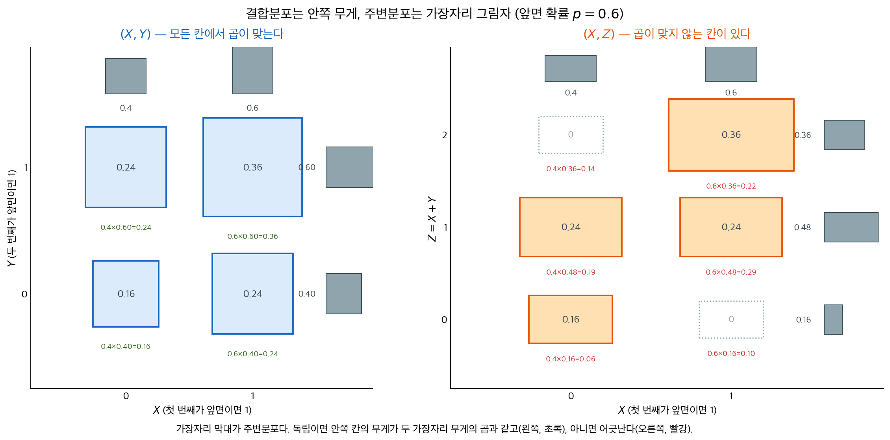

# 결합분포와 주변분포

지금까지 확률변수를 하나씩 보았다. 확률공간 $(\Omega, P)$ 위의 함수 $X$가 결과 하나하나에 수를 붙이면, 그 수들이 실직선 위에 무게로 퍼져 $X$의 분포가 된다.

그런데 실제로 궁금한 것은 대개 둘 이상이다. 키와 몸무게, 광고비와 매출, 첫 번째 동전과 두 번째 동전. 이때 $X$와 $Y$를 **따로따로** 아는 것으로는 부족하다. 둘을 한꺼번에 $(X, Y)$로 보아 평면 위의 무게로 다루어야 하고, 그것이 **결합분포**다.

이 절이 답하는 물음은 두 가지다. 평면 위의 무게에서 각 변수 하나의 분포를 어떻게 되찾는가, 그리고 "$X$와 $Y$가 독립"이라는 말이 그 무게의 모양에 대해 무엇을 뜻하는가.

## 1. 확률변수 둘을 함께 보면 평면 위의 무게가 된다

$X$ 하나면 무게가 실직선 위에 놓인다. $X$와 $Y$를 함께 보면 $\omega \mapsto (X(\omega), Y(\omega))$라는 대응이 결과를 평면의 점으로 보내므로, 무게가 $\mathbb{R}^2$ 위에 놓인다.

<div class="thmbox" markdown>

### 정리 1. 결합분포와 주변분포 — 안쪽 무게와 가장자리 그림자 { .thm }

**결합분포.** 이산인 경우 결합확률질량함수는

$$
p_{X,Y}(x, y) = P(X = x,\; Y = y)
$$

이고, 연속인 경우 결합확률밀도함수 $f_{X,Y}$는 임의의 영역 $B \subset \mathbb{R}^2$에 대해 $P((X,Y) \in B) = \iint_B f_{X,Y}(x,y)\,dx\,dy$를 만족한다.

**주변분포.** 한 변수를 **더해 없애면** 다른 변수의 분포가 남는다.

$$
p_X(x) = \sum_y p_{X,Y}(x, y),
\qquad
f_X(x) = \int_{-\infty}^{\infty} f_{X,Y}(x, y)\, dy
$$

</div>

**주변분포는 그림자다.** 평면 위의 무게를 한 축 방향으로 눌러 모으면 그 축 위에 무게가 쌓인다. $y$를 모두 더해 없앤 것이 $x$축에 비친 그림자이고, 그것이 $X$의 분포다. "주변(marginal)"이라는 이름은 결합확률을 표로 적었을 때 행과 열의 합계를 **표의 가장자리**에 적던 관행에서 왔다.

**그림자는 되돌릴 수 없다.** 여기가 중요하다. 결합분포에서 주변분포를 얻는 길은 언제나 열려 있지만, 그 반대는 아니다. **주변분포 둘을 알아도 결합분포는 정해지지 않는다.** 같은 그림자를 남기는 서로 다른 무게 배치가 얼마든지 있기 때문이다. 연습문제 $3$에서 그런 쌍을 직접 만들어 본다.

그러므로 "$X$는 이런 분포, $Y$는 저런 분포"라는 정보만으로는 $P(X > Y)$ 같은 물음에 답할 수 없다. 두 변수가 어떻게 **얽혀 있는지**를 따로 알아야 하며, 그 얽힘을 담은 것이 결합분포다.

## 2. 독립은 안쪽 무게가 가장자리 곱으로 쪼개진다는 뜻이다

3.2절에서 사건의 독립을 $P(A \cap B) = P(A)P(B)$로 정의했다. 확률변수의 독립은 그것을 **모든 사건에 대해 한꺼번에** 요구한 것이다.

<div class="thmbox" markdown>

### 정리 2. 확률변수의 독립 — 결합이 주변의 곱으로 쪼개진다 { .thm }

확률변수 $X$와 $Y$가 **독립**이라는 것은 모든 집합 $A, B \subset \mathbb{R}$에 대해

$$
P(X \in A,\; Y \in B) = P(X \in A)\, P(Y \in B)
$$

가 성립한다는 뜻이다. 이것은 다음과 동치다.

$$
p_{X,Y}(x, y) = p_X(x)\, p_Y(y) \quad \text{(이산)},
\qquad
f_{X,Y}(x, y) = f_X(x)\, f_Y(y) \quad \text{(연속)}
$$

곧 **결합분포가 두 주변분포의 곱**이다.

</div>

**말을 바꾸면 이렇다. 독립이면 그림자 둘만으로 원래 무게를 복원할 수 있다.** 앞 절에서 일반적으로는 불가능하다고 한 그 복원이, 독립일 때만은 가능해진다. 곱하기만 하면 되기 때문이다. 독립이란 결국 "두 변수 사이에 그림자에 없는 정보가 남아 있지 않다"는 말이다.

**조건부분포로 읽으면 더 분명하다.** $p_X(x) > 0$일 때

$$
p_{Y \mid X}(y \mid x) = \frac{p_{X,Y}(x, y)}{p_X(x)} = \frac{p_X(x)p_Y(y)}{p_X(x)} = p_Y(y)
$$

이므로, **$X$가 무엇으로 관측되든 $Y$의 분포가 그대로다.** 3.1절에서 사건에 대해 "$B$의 발생 여부가 $A$에 영향을 주지 않는다"고 했던 말의 확률변수판이다. 거꾸로 $X$의 값에 따라 $Y$의 조건부분포가 **달라진다면** 두 변수는 독립이 아니다. 독립을 깨뜨렸음을 보이는 가장 손쉬운 방법이 이것이다.

## 3. 같은 실험에서 나온 변수들은 대개 얽혀 있다

동전을 두 번 던져 보자. $\Omega = \{HH, HT, TH, TT\}$이고 앞면이 나올 확률이 $p$, 뒷면이 $q = 1-p$다. 여기서 세 확률변수를 만든다.

$$
X = \mathbf{1}(\text{첫 번째가 앞면}), \qquad
Y = \mathbf{1}(\text{두 번째가 앞면}), \qquad
Z = X + Y
$$

$X$와 $Y$는 각각 $\text{Bernoulli}(p)$를 따르고, $Z$는 $\text{Binomial}(2, p)$를 따른다. 셋 다 **같은 표본공간** 위에 살고 있다는 점에 주목하자.

<div class="codebox" markdown>

### 예제 1. 두 결합분포를 표로 만들어 곱과 견주기 { .eg }

```python
import numpy as np

P = 0.6
Q = 1 - P

# Omega = {HH, HT, TH, TT} 와 각각의 확률
outcomes = {("H", "H"): P * P, ("H", "T"): P * Q,
            ("T", "H"): Q * P, ("T", "T"): Q * Q}

xy = np.zeros((2, 2))      # (X, Y) 의 결합분포
xz = np.zeros((2, 3))      # (X, Z) 의 결합분포
for (first, second), prob in outcomes.items():
    x = 1 if first == "H" else 0
    y = 1 if second == "H" else 0
    xy[x, y] += prob
    xz[x, x + y] += prob   # Z = X + Y

def report(joint, name):
    # 주변분포는 한 축으로 더해 없앤 것이다. 이것이 "그림자".
    px = joint.sum(axis=1)
    pother = joint.sum(axis=0)
    print(f"\n({name}) 결합분포와 주변분포의 곱")
    for i in range(joint.shape[0]):
        for j in range(joint.shape[1]):
            prod = px[i] * pother[j]
            mark = "같다" if abs(prod - joint[i, j]) < 1e-12 else "다르다  <-"
            print(f"  P(X={i}, {name[-1]}={j}) = {joint[i, j]:.2f}   "
                  f"곱 = {prod:.3f}   {mark}")

report(xy, "X,Y")
report(xz, "X,Z")

# 조건부분포로도 확인한다. 독립이면 X 값에 관계없이 같아야 한다.
print("\nX 로 조건을 걸었을 때 Z 의 분포")
for i in range(2):
    print(f"  P(Z=. | X={i}) = {np.round(xz[i] / xz[i].sum(), 3)}")
```

출력:

```
(X,Y) 결합분포와 주변분포의 곱
  P(X=0, Y=0) = 0.16   곱 = 0.160   같다
  P(X=0, Y=1) = 0.24   곱 = 0.240   같다
  P(X=1, Y=0) = 0.24   곱 = 0.240   같다
  P(X=1, Y=1) = 0.36   곱 = 0.360   같다

(X,Z) 결합분포와 주변분포의 곱
  P(X=0, Z=0) = 0.16   곱 = 0.064   다르다  <-
  P(X=0, Z=1) = 0.24   곱 = 0.192   다르다  <-
  P(X=0, Z=2) = 0.00   곱 = 0.144   다르다  <-
  P(X=1, Z=0) = 0.00   곱 = 0.096   다르다  <-
  P(X=1, Z=1) = 0.24   곱 = 0.288   다르다  <-
  P(X=1, Z=2) = 0.36   곱 = 0.216   다르다  <-

X 로 조건을 걸었을 때 Z 의 분포
  P(Z=. | X=0) = [0.4 0.6 0. ]
  P(Z=. | X=1) = [0.  0.4 0.6]
```

</div>



**왼쪽이 독립의 모습이다.** 네 칸 모두 안쪽 무게가 가장자리 무게의 곱과 정확히 같다. $0.4 \times 0.4 = 0.16$, $0.6 \times 0.6 = 0.36$처럼 어긋나는 칸이 하나도 없다. 첫 번째 던지기의 결과는 두 번째에 아무 영향도 주지 않으므로 당연한 결과다.

**오른쪽은 여섯 칸 모두 어긋난다.** 그중에서도 **비어 있는 두 칸**이 가장 선명한 증거다. $X = 0$인데 $Z = 2$일 수는 없다. 첫 번째가 뒷면이면 앞면은 많아야 하나이기 때문이다. 그래서 실제 무게는 $0$이다. 그런데 독립이라면 그 칸에 $0.4 \times 0.36 = 0.14$만큼의 무게가 있어야 한다. **독립이 요구하는 자리에 무게를 둘 수 없다는 것,** 이것이 $X$와 $Z$가 독립이 아니라는 뜻이다.

**조건부분포가 같은 말을 한다.** 출력의 마지막 두 줄을 보면 $X = 0$일 때 $Z$의 분포가 $(0.4,\, 0.6,\, 0)$이고 $X = 1$일 때는 $(0,\, 0.4,\, 0.6)$이다. 첫 번째 던지기를 보고 나면 $Z$에 대해 아는 것이 달라진다. 독립이었다면 두 줄이 같아야 했다.

!!! warning "같은 자료로 만든 통계량은 대개 독립이 아니다"
    $X$와 $Y$는 독립인데 $X$와 $Z = X + Y$는 아니다. $Z$가 $X$를 **재료로 쓰기** 때문이다. 이 사정은 통계학 전체에 퍼져 있다. 같은 표본에서 계산한 $\bar X$와 $S^2$, 회귀에서의 $\hat\beta_0$와 $\hat\beta_1$, 한 자료에서 뽑은 여러 검정통계량은 모두 원칙적으로 얽혀 있다.

    그래서 [5.6절](../../ch05/applications/sample_variance.md)에서 만나는 사실 하나가 그만큼 특별하다. **모집단이 정규분포이면 $\bar X$와 $S^2$이 독립이다.** 일반적으로는 성립하지 않으며, 정규분포를 정규분포답게 만드는 성질 가운데 하나다. $t$ 분포가 그 독립성 위에서 만들어진다.

## 연습문제

<div class="drillbox" markdown>

**연습문제 1.** <span class="diff easy" title="쉬움"></span>
결합확률질량함수가 아래 표와 같다. $X$와 $Y$의 주변분포를 구하고, 두 변수가 독립인지 판정하라.

| $p_{X,Y}$ | $Y=0$ | $Y=1$ |
|:---|---:|---:|
| $X=0$ | $0.2$ | $0.3$ |
| $X=1$ | $0.2$ | $0.3$ |

</div>

??? success "풀이"
    행을 더해 $p_X(0) = 0.5$, $p_X(1) = 0.5$이고, 열을 더해 $p_Y(0) = 0.4$, $p_Y(1) = 0.6$이다.

    네 칸을 모두 확인한다.

    $$
    p_X(0)p_Y(0) = 0.5 \times 0.4 = 0.2, \qquad
    p_X(0)p_Y(1) = 0.5 \times 0.6 = 0.3
    $$

    $$
    p_X(1)p_Y(0) = 0.2, \qquad p_X(1)p_Y(1) = 0.3
    $$

    네 칸 모두 표의 값과 같으므로 **독립이다.** 표의 두 행이 서로 비례한다는 것이 눈으로 보이는 신호다.

<div class="drillbox" markdown>

**연습문제 2.** <span class="diff easy" title="쉬움"></span>
연습문제 $1$의 표에서 $(X=1, Y=1)$ 칸만 $0.3$에서 $0.4$로 바꾸고 $(X=1, Y=0)$ 칸을 $0.1$로 줄였다. 주변분포는 어떻게 되는가? 독립은 유지되는가?

</div>

??? success "풀이"
    행의 합은 그대로 $p_X(0) = 0.5$, $p_X(1) = 0.5$이지만 열의 합이 바뀌어 $p_Y(0) = 0.3$, $p_Y(1) = 0.7$이다.

    $(X=0, Y=0)$ 칸을 확인하면 $p_X(0)p_Y(0) = 0.5 \times 0.3 = 0.15$인데 실제 값은 $0.2$다. **독립이 아니다.**

    한 칸의 무게를 옮겼을 뿐인데 독립이 깨졌다. 독립은 네 칸이 모두 맞아야 하는 조건이며, **한 칸만 어긋나도 성립하지 않는다.**

<div class="drillbox" markdown>

**연습문제 3.** <span class="diff med" title="중간"></span>
**주변분포는 결합분포를 결정하지 않는다.** $X$와 $Y$가 각각 $\text{Bernoulli}(1/2)$를 따르면서 결합분포가 서로 다른 두 경우를 만들어라. 하나는 독립이고 하나는 아니어야 한다.

</div>

??? success "풀이"
    **경우 1 (독립).** 네 칸에 $1/4$씩 고르게 둔다. 행의 합과 열의 합이 모두 $1/2$이므로 주변분포는 $\text{Bernoulli}(1/2)$다. 각 칸이 $1/2 \times 1/2 = 1/4$과 같으므로 독립이다.

    **경우 2 (종속).** 대각선에만 무게를 둔다.

    $$
    p(0,0) = p(1,1) = \tfrac12, \qquad p(0,1) = p(1,0) = 0
    $$

    행의 합도 열의 합도 여전히 $1/2$씩이므로 **주변분포가 경우 1과 똑같다.** 그러나 $p(0,1) = 0 \ne 1/4$이므로 독립이 아니다. 실제로 이 배치는 $Y = X$, 곧 두 변수가 항상 같은 값을 갖는 경우다.

    **요점.** 두 경우는 그림자가 같지만 완전히 다른 무게 배치다. 하나는 무관하고 하나는 완전히 결정되어 있다. **그림자만 보아서는 둘을 구별할 수 없다.**

<div class="drillbox" markdown>

**연습문제 4.** <span class="diff med" title="중간"></span>
$(X, Y)$가 정사각형 $[0,1]^2$ 위에서 균등분포를 따른다. 주변분포를 구하고 독립인지 판정하라. 받침을 삼각형 $\{(x,y): 0 \le y \le x \le 1\}$로 바꾸면 어떻게 되는가?

</div>

??? success "풀이"
    **정사각형.** $f_{X,Y}(x,y) = 1$이므로

    $$
    f_X(x) = \int_0^1 1 \, dy = 1 \quad (0 \le x \le 1)
    $$

    이고 $f_Y$도 마찬가지다. $f_X(x)f_Y(y) = 1 = f_{X,Y}(x,y)$이므로 **독립이다.**

    **삼각형.** 넓이가 $1/2$이므로 $f_{X,Y}(x,y) = 2$이고

    $$
    f_X(x) = \int_0^x 2 \, dy = 2x, \qquad f_Y(y) = \int_y^1 2 \, dx = 2(1-y)
    $$

    이다. 곱은 $4x(1-y)$인데 결합밀도는 $2$이므로 **독립이 아니다.**

    **받침의 모양만 보아도 알 수 있다.** 독립이면 받침이 직사각형이어야 한다. $x$가 가질 수 있는 값의 범위가 $y$에 따라 달라지면 그 자체로 독립일 수 없다. 삼각형에서는 $y = 0.9$일 때 $x \ge 0.9$여야 하지만 $y = 0.1$이면 $x \ge 0.1$이면 되므로, $Y$를 알면 $X$에 대해 아는 것이 달라진다.

<div class="drillbox" markdown>

**연습문제 5.** <span class="diff med" title="중간"></span>
본문의 동전 예제에서 $X$와 $Z = X+Y$의 **공분산**을 구하라. 그리고 $\text{Cov} \ne 0$이 독립이 아님을 보이는 충분한 근거인지 답하라.

</div>

??? success "풀이"
    $X$와 $Y$가 독립이고 각각 분산 $pq$를 가지므로

    $$
    \text{Cov}(X, Z) = \text{Cov}(X,\, X + Y) = \text{Var}(X) + \text{Cov}(X, Y) = pq + 0 = pq
    $$

    이다. $p = 0.6$이면 $0.24$다.

    $pq > 0$이므로 공분산이 $0$이 아니고, **독립이면 공분산이 반드시 $0$이므로** 이는 독립이 아님을 보이는 충분한 근거다.

    **다만 거꾸로는 성립하지 않는다.** 공분산이 $0$이어도 독립이 아닐 수 있다. 공분산은 **선형** 관계만 재기 때문이다. [3.4절](variance_covariance.md)의 예제 $1$이 그런 경우를 다룬다.

<div class="drillbox" markdown>

**연습문제 6.** <span class="diff med" title="중간"></span>
$X$와 $Y$가 독립이면 $g(X)$와 $h(Y)$도 독립임을 보여라. 본문의 $X$와 $Z = X+Y$가 독립이 아닌 것과 모순되지 않는 이유를 설명하라.

</div>

??? success "풀이"
    임의의 집합 $A, B$에 대해 $\{g(X) \in A\} = \{X \in g^{-1}(A)\}$이고 $\{h(Y) \in B\} = \{Y \in h^{-1}(B)\}$이다. $X$와 $Y$가 독립이므로

    $$
    P(g(X) \in A,\, h(Y) \in B) = P(X \in g^{-1}(A))\,P(Y \in h^{-1}(B))
    = P(g(X) \in A)\,P(h(Y) \in B)
    $$

    이다. 따라서 독립이다. $\square$

    **모순이 아닌 이유.** 이 정리는 $g$가 $X$**만**의 함수이고 $h$가 $Y$**만**의 함수일 때 적용된다. 그런데 $Z = X + Y$는 $Y$만의 함수가 아니라 **둘 모두의 함수**다. 정리의 조건을 벗어나므로 결론도 보장되지 않는다.

    **일반 원리.** 서로 겹치지 않는 재료로 만든 변수끼리는 독립이 유지된다. 재료가 겹치는 순간 얽힌다.

<div class="drillbox" markdown>

**연습문제 7.** <span class="diff med" title="중간"></span>
$X_1, \ldots, X_n$이 독립이고 각각 $\text{Bernoulli}(p)$를 따른다. $S = \sum X_i$라 하자. $S$가 주어졌을 때 $(X_1, \ldots, X_n)$의 조건부분포를 구하라. 그 결과가 $p$에 의존하는가?

</div>

??? success "풀이"
    $\sum x_i = s$인 임의의 $0$–$1$ 벡터 $(x_1, \ldots, x_n)$에 대해

    $$
    P(X_1 = x_1, \ldots, X_n = x_n \mid S = s)
    = \frac{p^s q^{n-s}}{\binom{n}{s} p^s q^{n-s}}
    = \frac{1}{\binom{n}{s}}
    $$

    이다. 분자는 그 벡터 하나의 확률이고 분모는 $P(S=s)$다.

    **$p$가 약분되어 사라진다.** 합을 알고 나면 $1$이 어느 자리에 놓였는지는 $\binom{n}{s}$가지 경우에 **고르게** 퍼져 있으며, 그 분포는 $p$와 무관하다.

    **이것이 충분통계량의 뜻이다.** $S$를 알고 나면 원자료가 $p$에 대해 더 말해 줄 것이 없다. [7장의 충분성](../../ch07/mle/sufficiency_completeness.md)이 이 성질을 다룬다.

<div class="drillbox" markdown>

**연습문제 8.** <span class="diff hard" title="어려움"></span>
$(X, Y)$의 결합밀도가 $f(x,y) = c \cdot x y$ ($0 < x < 1$, $0 < y < 1$)이다. $c$를 구하고 독립인지 판정하라. 이어서 $f(x,y) = c(x + y)$인 경우는 어떠한가?

</div>

??? success "풀이"
    **첫 번째.** $\int_0^1\!\!\int_0^1 cxy \,dx\,dy = c \cdot \tfrac12 \cdot \tfrac12 = \tfrac{c}{4} = 1$이므로 $c = 4$다.

    $f_X(x) = \int_0^1 4xy \, dy = 2x$이고 같은 방식으로 $f_Y(y) = 2y$다. 곱이 $4xy$로 결합밀도와 같으므로 **독립이다.**

    **두 번째.** $\int_0^1\!\!\int_0^1 c(x+y)\,dx\,dy = c(\tfrac12 + \tfrac12) = c = 1$이므로 $c = 1$이다.

    $f_X(x) = \int_0^1 (x+y)\,dy = x + \tfrac12$이고 $f_Y(y) = y + \tfrac12$다. 곱은 $(x + \tfrac12)(y + \tfrac12) = xy + \tfrac{x}{2} + \tfrac{y}{2} + \tfrac14$인데 결합밀도는 $x + y$이므로 **독립이 아니다.**

    **눈으로 가리는 요령.** 결합밀도가 $g(x)h(y)$처럼 **변수별로 인수분해되고 받침이 직사각형**이면 독립이다. $xy$는 쪼개지지만 $x + y$는 쪼개지지 않는다. 합은 곱으로 바꿀 수 없다.

<div class="drillbox" markdown>

**연습문제 9.** <span class="diff hard" title="어려움"></span>
본문의 동전 예제를 $n$번 던지기로 늘린다. $X_1$과 $S_n = \sum_{i=1}^n X_i$의 상관계수를 $n$의 함수로 구하고, $n \to \infty$일 때 어떻게 되는지 해석하라.

</div>

??? success "풀이"
    $\text{Cov}(X_1, S_n) = \text{Var}(X_1) = pq$이고 $\text{Var}(S_n) = npq$이므로

    $$
    \rho(X_1, S_n) = \frac{pq}{\sqrt{pq}\sqrt{npq}} = \frac{1}{\sqrt n}
    $$

    이다. $n = 2$이면 $0.707$, $n = 100$이면 $0.1$이다.

    **$n \to \infty$이면 $0$으로 간다.** 관측 하나가 합 전체에서 차지하는 몫이 점점 작아지기 때문이다. 다만 **어떤 유한한 $n$에서도 정확히 $0$은 아니므로 독립이 되지는 않는다.** 얽힘이 옅어질 뿐 끊어지지는 않는다.

    **실무적 함의.** 표본이 크면 개별 관측과 표본평균의 상관을 무시해도 되는 경우가 많지만, 그것은 근사이지 등식이 아니다. 잔차처럼 $n$이 커져도 구조적 얽힘이 남는 양도 있다.

<div class="drillbox" markdown>

**연습문제 10.** <span class="diff hard" title="어려움"></span>
$X$와 $Y$가 독립이고 각각 $N(0,1)$을 따른다. $U = X + Y$와 $V = X - Y$의 결합분포를 구하고 독립인지 판정하라. $Z = X+Y$가 $X$와 얽혔던 것과 무엇이 다른가?

</div>

??? success "풀이"
    $(U, V)$는 정규분포의 선형변환이므로 이변량 정규분포를 따른다. 평균은 $0$이고

    $$
    \text{Var}(U) = 2, \qquad \text{Var}(V) = 2, \qquad
    \text{Cov}(U, V) = \text{Var}(X) - \text{Var}(Y) = 1 - 1 = 0
    $$

    이다. **이변량 정규분포에서는 공분산이 $0$이면 독립**이므로 $U$와 $V$는 독립이며, 각각 $N(0, 2)$를 따른다.

    **본문의 경우와 무엇이 다른가.** $X$와 $Z = X+Y$는 $Z$가 $X$를 재료로 쓰므로 얽혔다. $U$와 $V$도 둘 다 $X$와 $Y$를 재료로 쓰는데 독립이다. **재료가 겹친다고 반드시 얽히는 것은 아니다.**

    갈림길은 두 가지다. 첫째, $\text{Cov}(U,V) = \text{Var}(X) - \text{Var}(Y)$가 두 분산이 **같기 때문에** 상쇄되었다. 분산이 달랐다면 $0$이 아니다. 둘째, 무상관에서 독립으로 넘어가는 데 **정규성**이 쓰였다. 일반적인 분포에서는 무상관이 독립을 주지 않는다(연습문제 $5$).

    이 결과가 실제로 쓰이는 자리가 있다. 정규모집단에서 $\bar X$와 $S^2$이 독립인 것이 바로 이런 직교분해의 결과이며, $t$ 분포는 그 독립성 위에서 정의된다.

## 정리하며

확률변수를 둘 이상 함께 보면 무게가 평면 위에 놓인다.

- **결합분포**가 그 무게 전체이고, **주변분포**는 한 축으로 눌러 모은 그림자다. 그림자를 얻는 길은 언제나 열려 있지만 그림자에서 원래 무게로 돌아가는 길은 일반적으로 없다.
- **독립**은 그 되돌아가는 길이 열리는 특수한 경우다. $p_{X,Y} = p_X \, p_Y$, 곧 안쪽 무게가 두 그림자의 곱이면 독립이다. 그러면 $X$를 알아도 $Y$의 조건부분포가 달라지지 않는다.
- 독립을 **깨뜨렸음**을 보이려면 어긋나는 칸 하나를 찾거나, $X$의 값에 따라 $Y$의 조건부분포가 달라짐을 보이면 된다.
- 같은 표본공간에서 나온 변수들은 재료가 겹치면 대개 얽힌다. 동전 두 번에서 $X \perp Y$이지만 $X$와 $X+Y$는 아니다.

독립은 앞으로 거의 모든 장에서 **가정**으로 등장한다. 3.5절의 큰수의 법칙과 중심극한정리가 요구하는 i.i.d.의 "i"가 이것이고, 5장의 표본분포가 곱으로 계산되는 것도, 6장의 가능도가 곱으로 쓰이는 것도 모두 이 성질 덕분이다. 그러므로 자료가 실제로 독립인지를 묻는 일이 그만큼 중요하다. 시계열처럼 이웃한 관측이 얽혀 있으면 이 장 전체의 계산이 어긋난다.

다음 절에서는 이 결합분포 위에서 **기댓값**을 정의하고, 두 변수가 함께 움직이는 정도를 재는 **공분산**을 얻는다.
