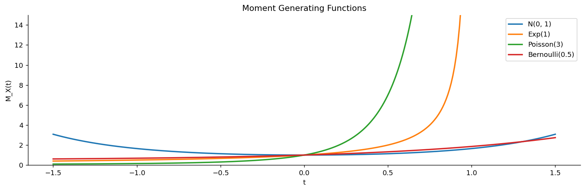

# 적률생성함수

평균과 분산은 분포의 두 요약값이지만 분포를 결정하지는 못한다. 평균과 분산이 같으면서 모양이 전혀 다른 분포는 얼마든지 있다.

$E[X], E[X^2], E[X^3], \ldots$을 **적률**이라 하는데, 이것들을 다 모으면 대개 분포가 결정된다. 그런데 적률을 하나씩 계산하는 것은 번거롭다. **적률생성함수**는 이 무한히 많은 적률을 **함수 하나**에 담고, 미분만으로 꺼내 쓸 수 있게 한다.

이 도구가 특별한 이유는 세 가지다. 적률을 자동으로 뽑아 주고, 분포를 유일하게 결정하며, 무엇보다 **독립인 변수의 합을 곱셈으로 바꾼다**. 중심극한정리의 증명이 이 마지막 성질 위에 서 있다.

이 절은 세 개의 정리로 이루어진다. 미분으로 적률을 뽑는 성질(정리 1), 분포를 유일하게 결정한다는 성질(정리 2), 그리고 합을 곱으로 바꾸는 성질(정리 3)이다.

## 1. 적률을 한 함수에 담아 미분으로 꺼낸다

정의는 뜻밖으로 단순하다. $e^{tX}$의 기댓값을 $t$의 함수로 본다. LOTUS(3.4절 정리 2)를 $g(x) = e^{tx}$에 적용한 것이다.

<div class="thmbox" markdown>

### 정리 1. 적률생성함수 — 0에서의 n계 도함수가 n번째 적률 { .thm }

확률변수 $X$의 **적률생성함수(MGF)** 는

$$
M_X(t) = E\big[e^{tX}\big] =
\begin{cases}
\displaystyle\sum_x e^{tx}\, P(X = x), & \text{이산} \\[10pt]
\displaystyle\int_{-\infty}^{\infty} e^{tx} f(x)\,dx, & \text{연속}
\end{cases}
$$

이며, 0을 포함하는 어떤 열린구간에서 유한하면 **존재한다**고 한다. 이때

$$
M_X^{(n)}(0) = \frac{d^n}{dt^n} M_X(t)\bigg|_{t=0} = E[X^n]
$$

이 성립한다.

</div>

??? proof "왜 그런가"

    $e^{tX}$를 테일러 전개하면 적률이 계수로 줄줄이 나온다.

    $$
    M_X(t) = E\!\left[\sum_{k=0}^{\infty} \frac{(tX)^k}{k!}\right] = \sum_{k=0}^{\infty} \frac{t^k}{k!}\,E[X^k]
    $$

    $t^n$의 계수가 $E[X^n]/n!$이므로, $n$번 미분하고 $t = 0$을 넣으면 $E[X^n]$만 남는다. "적률을 생성한다"는 이름이 여기서 왔다. $\square$

실무에서 가장 자주 쓰는 것은 처음 둘이다.

$$
E[X] = M_X'(0), \qquad
E[X^2] = M_X''(0), \qquad
\text{Var}(X) = M_X''(0) - \big[M_X'(0)\big]^2
$$

<div class="exbox" markdown>

### 보기 1. 정규분포 { .ex }

$X \sim N(\mu, \sigma^2)$의 적률생성함수는

$$
M_X(t) = \exp\!\left(\mu t + \frac{\sigma^2 t^2}{2}\right)
$$

이다. 두 번 미분해 보면

$$
\begin{aligned}
M_X'(t) &= (\mu + \sigma^2 t)\,M_X(t), &\quad M_X'(0) &= \mu = E[X] \\[4pt]
M_X''(t) &= \big(\sigma^2 + (\mu + \sigma^2 t)^2\big)M_X(t), &\quad M_X''(0) &= \sigma^2 + \mu^2 = E[X^2]
\end{aligned}
$$

이고 $\text{Var}(X) = (\sigma^2 + \mu^2) - \mu^2 = \sigma^2$이다. 적분 한 번 하지 않고 평균과 분산을 얻었다.

</div>

주요 분포의 적률생성함수를 모아 두면 계산이 빨라진다.

| 분포 | $M_X(t)$ | 조건 |
|:---|:---|:---|
| 베르누이분포 Bernoulli$(p)$ | $1 - p + pe^t$ | |
| 이항분포 B$(n, p)$ | $(1 - p + pe^t)^n$ | |
| 포아송분포 Poisson$(\lambda)$ | $\exp\!\big(\lambda(e^t - 1)\big)$ | |
| 기하분포 Geom$(p)$ | $\dfrac{pe^t}{1 - (1-p)e^t}$ | $t < -\ln(1-p)$ |
| 지수분포 Exp$(\lambda)$ | $\dfrac{\lambda}{\lambda - t}$ | $t < \lambda$ |
| 정규분포 N$(\mu, \sigma^2)$ | $\exp\!\left(\mu t + \dfrac{\sigma^2 t^2}{2}\right)$ | |

```python
import numpy as np

def mgf_normal(t, mu, sigma2):
    """정규분포 N(mu, sigma2)의 적률생성함수.

        M(t) = exp(mu*t + sigma2*t^2/2)
    """
    return np.exp(mu * t + sigma2 * t**2 / 2)


def d1(f, x, h=1e-4):
    """중심차분으로 1계 도함수를 근사한다:  (f(x+h) - f(x-h)) / (2h)"""
    return (f(x + h) - f(x - h)) / (2 * h)


def d2(f, x, h=1e-3):
    """중심차분으로 2계 도함수를 근사한다:  (f(x+h) - 2f(x) + f(x-h)) / h^2

    h를 1계보다 크게 잡은 이유가 있다. 2계 차분은 h^2 으로 나누므로
    h가 너무 작으면 분자의 반올림 오차가 크게 증폭된다.
    """
    return (f(x + h) - 2 * f(x) + f(x - h)) / h**2


# "적률생성함수"라는 이름 그대로, t=0 에서 k번 미분하면 k번째 적률이 나온다.
#   M'(0)  = E[X]
#   M''(0) = E[X^2]
mu, sigma2 = 3.0, 4.0
M = lambda t: mgf_normal(t, mu, sigma2)

E_X = d1(M, 0.0)
E_X2 = d2(M, 0.0)
Var_X = E_X2 - E_X**2

print(f"E[X] = {E_X:.4f} (theoretical: {mu})")
print(f"E[X²] = {E_X2:.4f} (theoretical: {sigma2 + mu**2})")
print(f"Var(X) = {Var_X:.4f} (theoretical: {sigma2})")
```

출력:

```
E[X] = 3.0000 (theoretical: 3.0)
E[X²] = 13.0000 (theoretical: 13.0)
Var(X) = 4.0000 (theoretical: 4.0)
```

## 2. 적률생성함수가 같으면 분포가 같다

적률생성함수는 요약이 아니라 **분포 전체를 담은 다른 표현**이다. 누적분포함수와 마찬가지로 분포를 완전히 결정한다.

<div class="thmbox" markdown>

### 정리 2. 유일성 — 적률생성함수는 분포를 식별한다 { .thm }

$X$와 $Y$의 적률생성함수가 존재하고 0을 포함하는 어떤 열린구간에서 일치하면

$$
M_X(t) = M_Y(t) \quad \Longrightarrow \quad X \stackrel{d}{=} Y
$$

이다.

</div>

증명 전략이 여기서 나온다. **어떤 확률변수의 분포를 알고 싶으면 적률생성함수를 계산해 표에서 찾으면 된다.** 밀도를 직접 유도하는 것보다 훨씬 쉬운 경우가 많다.

선형변환에 대한 규칙도 함께 알아 두면 유용하다. $Y = aX + b$이면

$$
M_Y(t) = e^{bt}\,M_X(at)
$$

이다. 표준화 $Z = (X - \mu)/\sigma$가 이 규칙의 전형적인 쓰임이다.

## 3. 합을 곱으로 바꾼다

적률생성함수가 확률론의 핵심 도구가 된 진짜 이유가 이것이다.

<div class="thmbox" markdown>

### 정리 3. 독립인 합 — 적률생성함수의 곱 { .thm }

$X \perp\!\!\!\perp Y$이면

$$
M_{X+Y}(t) = M_X(t)\,M_Y(t)
$$

이며, 독립인 $n$개로 확장된다.

$$
M_{S_n}(t) = \prod_{i=1}^{n} M_{X_i}(t), \qquad S_n = \sum_{i=1}^n X_i
$$

</div>

**독립인 변수의 합의 분포를 구하는 일은 원래 매우 어렵다.** 밀도끼리 합성곱(convolution)을 해야 하는데 적분이 지저분하다. 적률생성함수로 옮기면 그 합성곱이 **단순한 곱셈**이 된다. $e^{t(X+Y)} = e^{tX}e^{tY}$이고 독립이면 곱의 기댓값이 기댓값의 곱이기 때문이다(3.4절 정리 3의 곱 규칙).

<div class="exbox" markdown>

### 보기 2. 독립인 정규분포의 합 { .ex }

$X_1 \sim N(\mu_1, \sigma_1^2)$, $X_2 \sim N(\mu_2, \sigma_2^2)$이 독립이면

$$
M_{X_1+X_2}(t) = \exp\!\left((\mu_1+\mu_2)t + \frac{(\sigma_1^2+\sigma_2^2)t^2}{2}\right)
$$

이다. 이것은 $N(\mu_1+\mu_2,\ \sigma_1^2+\sigma_2^2)$의 적률생성함수이므로, 유일성(정리 2)에 의해

$$
X_1 + X_2 \sim N(\mu_1 + \mu_2,\ \sigma_1^2 + \sigma_2^2)
$$

</div>

이다. **정규분포의 합이 다시 정규분포**라는 중요한 사실이 세 줄로 증명된다. 밀도로 직접 하려면 합성곱 적분을 계산해야 한다.

!!! note "중심극한정리 증명의 뼈대"
    평균 $\mu$, 분산 $\sigma^2$인 i.i.d. $X_i$에 대해 표준화된 평균을 $Z_n = \dfrac{\bar X - \mu}{\sigma/\sqrt n}$이라 하자. 정리 3에 의해

    $$
    M_{Z_n}(t) = \left[M_{\frac{X_i-\mu}{\sigma}}\!\left(\frac{t}{\sqrt n}\right)\right]^{n}
    $$

    이다. 안쪽 적률생성함수를 $t/\sqrt n$ 근방에서 2차까지 전개하면 $1 + \dfrac{t^2}{2n} + o(1/n)$이 되고, $n$제곱하면

    $$
    \left(1 + \frac{t^2}{2n} + o(1/n)\right)^{n} \longrightarrow e^{t^2/2}
    $$

    이다. 극한이 $N(0,1)$의 적률생성함수이므로 유일성에 의해 $Z_n \xrightarrow{d} N(0,1)$이다.

    증명의 세 재료가 모두 이 절에 있다. **합을 곱으로 바꾸고**(정리 3), **테일러 전개로 앞 두 적률만 남기고**(정리 1), **극한을 분포로 되돌린다**(정리 2). 3.5절에서 이 정리를 정면으로 다룬다.

```python
import numpy as np
import matplotlib.pyplot as plt

def plot_mgf_comparison():
    """분포 넷의 적률생성함수를 한 그림에 겹쳐 그린다.

    네 곡선이 모두 t=0 에서 1을 지난다는 점에 주목하라.
    M(0) = E[e^0] = E[1] = 1 이므로 어떤 분포든 반드시 그렇다.
    그리고 t=0 에서의 기울기가 곧 그 분포의 평균이다.
    """
    t = np.linspace(-1.5, 1.5, 300)

    fig, ax = plt.subplots(figsize=(12, 4))

    # 정규분포 N(0,1):  M(t) = exp(t^2/2). 모든 t에서 유한하다.
    ax.plot(t, np.exp(t**2 / 2), label='N(0, 1)', lw=2)

    # 지수분포 Exp(1):  M(t) = 1/(1-t).  t < 1 에서만 존재한다.
    # 꼬리가 지수적으로 감소하는 속도보다 e^{tx} 가 빨리 커지면 적분이 발산하기 때문이다.
    # 그래서 t >= 1 인 부분을 아예 잘라 내고 그린다.
    t_exp = t[t < 1]
    ax.plot(t_exp, 1 / (1 - t_exp), label='Exp(1)', lw=2)

    # 포아송(3):  M(t) = exp(lambda*(e^t - 1))
    lam = 3
    ax.plot(t, np.exp(lam * (np.exp(t) - 1)), label='Poisson(3)', lw=2)

    # 베르누이(0.5):  M(t) = 1 - p + p*e^t.  값이 둘뿐이라 가장 단순한 형태다.
    p = 0.5
    ax.plot(t, 1 - p + p * np.exp(t), label='Bernoulli(0.5)', lw=2)

    ax.set_xlabel('t')
    ax.set_ylabel('M_X(t)')
    ax.set_title('Moment Generating Functions')
    ax.set_ylim(0, 15)
    ax.legend()
    ax.spines[['top', 'right']].set_visible(False)
    plt.tight_layout()
    plt.show()

plot_mgf_comparison()
```



모든 곡선이 $t = 0$에서 값 1을 지난다는 점에 주목하라. $M_X(0) = E[e^0] = 1$이므로 언제나 그렇다. 그 점에서의 기울기가 평균이다.

```python
import numpy as np

def verify_sum_of_normals(n_simulations=100_000):
    """독립인 정규분포의 합이 다시 정규분포임을 모의실험으로 확인한다.

    적률생성함수로 증명한 결과를 눈으로 확인하는 것이다.
    MGF가 곱해지면 지수의 어깨가 더해지므로
    평균은 mu1+mu2, 분산은 sigma1^2+sigma2^2 이 된다.
    """
    np.random.seed(42)
    mu1, sigma1 = 2, 3
    mu2, sigma2 = 5, 4

    X1 = np.random.normal(mu1, sigma1, n_simulations)
    X2 = np.random.normal(mu2, sigma2, n_simulations)
    S = X1 + X2

    # 분산은 더해지지만 **표준편차는 더해지지 않는다**는 점에 주의하라.
    # sqrt(3^2 + 4^2) = 5 이지 3 + 4 = 7 이 아니다.

    print(f"E[X1+X2] = {S.mean():.4f} (theoretical: {mu1 + mu2})")
    print(f"Var(X1+X2) = {S.var():.4f} (theoretical: {sigma1**2 + sigma2**2})")

verify_sum_of_normals()
```

출력:

```
E[X1+X2] = 7.0068 (theoretical: 7)
Var(X1+X2) = 25.1339 (theoretical: 25)
```

## 연습문제

<div class="drillbox" markdown>

**연습문제 1.**
$X \sim \mathrm{Exp}(\lambda)$이다. (a) $M_X(t)$와 그 정의역을 유도하라. (b) $\mathbb{E}[X], \mathbb{E}[X^2]$를 계산하라. (c) $\mathrm{Var}(X) = 1/\lambda^2$임을 확인하라.

</div>

??? success "풀이"
    (a) $t < \lambda$에 대해 $M_X(t) = \int_0^\infty e^{tx} \lambda e^{-\lambda x} dx = \lambda \int_0^\infty e^{-(\lambda - t) x} dx = \lambda/(\lambda - t)$이다.

    (b) $M_X'(t) = \lambda/(\lambda - t)^2$이므로 $M_X'(0) = 1/\lambda = \mathbb{E}[X]$이다. $M_X''(t) = 2\lambda/(\lambda - t)^3$이므로 $M_X''(0) = 2/\lambda^2 = \mathbb{E}[X^2]$이다.

    (c) $\mathrm{Var}(X) = 2/\lambda^2 - (1/\lambda)^2 = 1/\lambda^2$이다. 평균과 표준편차가 모두 $1/\lambda$로 같다.

<div class="drillbox" markdown>

**연습문제 2.**
$M_{aX + b}(t) = e^{bt} M_X(at)$를 증명하고, $X$와 $Y$가 독립일 때 $M_{X + Y}(t) = M_X(t) M_Y(t)$임을 증명하라.

</div>

??? success "풀이"
    **선형변환:**

    $$
    M_{aX + b}(t) = \mathbb{E}[e^{t(aX + b)}] = e^{bt} \mathbb{E}[e^{(at)X}] = e^{bt} M_X(at)
    $$

    **독립인 변수의 합:** $X$와 $Y$가 독립이면 $e^{tX}$와 $e^{tY}$도 독립이므로(독립인 변수의 함수이므로)

    $$
    M_{X + Y}(t) = \mathbb{E}[e^{t(X + Y)}] = \mathbb{E}[e^{tX} \cdot e^{tY}] = \mathbb{E}[e^{tX}] \mathbb{E}[e^{tY}] = M_X(t) M_Y(t)
    $$

    이다.

    두 번째 공식은 일반화된다. 상호독립인 $S_n = X_1 + \cdots + X_n$에 대해 $M_{S_n}(t) = \prod_i M_{X_i}(t)$이다.

    이 두 성질 덕분에 적률생성함수가 확률변수의 변환과 합을 분석하는 데 그토록 유용하다.

<div class="drillbox" markdown>

**연습문제 3.**
적률생성함수 방법으로 **독립인 포아송 확률변수 합의 분포**를 유도하라. $X_i \sim \mathrm{Poisson}(\lambda_i)$이 서로 독립일 때 $\sum_i X_i$의 분포는 무엇인가?

</div>

??? success "풀이"
    포아송의 적률생성함수는 $M_X(t) = e^{\lambda (e^t - 1)}$이다.

    합: $M_{\sum X_i}(t) = \prod_i M_{X_i}(t) = \prod_i e^{\lambda_i (e^t - 1)} = e^{(\sum \lambda_i)(e^t - 1)}$.

    이것이 $\mathrm{Poisson}(\sum \lambda_i)$의 적률생성함수다. 유일성에 의해 $\sum X_i \sim \mathrm{Poisson}(\sum \lambda_i)$이다.

    **함의:** 포아송은 덧셈에 대해 "닫혀" 있다. 독립인 포아송들의 합은 비율을 합한 포아송이다. 이것이 계수 자료 모형의 토대다. 독립인 여러 원천에서 나온 총 사건 수가 결합된 비율의 포아송을 따르므로 모듈식 분석이 가능하다.

<div class="drillbox" markdown>

**연습문제 4.**
**적률생성함수로 구하는 왜도와 첨도.** 3차 및 4차 표준화 누율(왜도와 초과첨도)이 $M_X(t)$ 자체가 아니라 $\ln M_X(t)$의 도함수에서 나옴을 보여라.

</div>

??? success "풀이"
    **누율생성함수**는 $K_X(t) = \ln M_X(t)$이며 그 테일러 전개는

    $$
    K_X(t) = \kappa_1 t + \kappa_2 \frac{t^2}{2} + \kappa_3 \frac{t^3}{6} + \kappa_4 \frac{t^4}{24} + \cdots
    $$

    이고 $\kappa_n$이 $n$차 누율이다. 처음 몇 개는 다음과 같다.

    - $\kappa_1 = \mathbb{E}[X] = \mu$ (평균)
    - $\kappa_2 = \mathrm{Var}(X) = \sigma^2$
    - $\kappa_3 = \mathbb{E}[(X - \mu)^3]$ (3차 중심적률)
    - $\kappa_4 = \mathbb{E}[(X - \mu)^4] - 3\sigma^4$ (4차 중심적률에서 $3\sigma^4$을 뺀 값)

    그러면 **왜도** $= \kappa_3/\kappa_2^{3/2}$이고 **초과첨도** $= \kappa_4/\kappa_2^2$이다. 둘 다 누율에서 나오며, 누율은 $M_X(t)$가 아니라 $K_X(t)$의 도함수다.

    **누율이 적률보다 나은 이유:** 독립인 합의 누율은 더해진다. 독립인 $X, Y$에 대해 $\kappa_n(X + Y) = \kappa_n(X) + \kappa_n(Y)$이지만 적률은 그렇지 않다. 예를 들어 $\mathrm{Var}(X + Y) = \mathrm{Var}(X) + \mathrm{Var}(Y)$가 $\kappa_2$의 덧셈이고, 더 높은 누율에서도 마찬가지다. 그래서 누율이 중심극한정리와 에지워스 전개의 자연스러운 언어가 된다.

<div class="drillbox" markdown>

**연습문제 5.**
**적률생성함수의 비존재.** 코시분포가 적률생성함수를 갖지 않음을 보여라. 대안인 **특성함수**는 무엇이며 왜 언제나 존재하는가?

</div>

??? success "풀이"
    코시 밀도는 $f(x) = 1/(\pi(1 + x^2))$이다.

    $M(t) = \int_{-\infty}^\infty e^{tx} / (\pi (1 + x^2)) dx$인데, $t \ne 0$이면 $e^{tx}$가 한쪽 방향으로 지수적으로 커져 피적분함수가 적분 가능하지 않다. 적률생성함수는 $t = 0$(자명하게 1)을 제외하면 정의되지 않는다.

    **특성함수(CF):** $\phi_X(t) = \mathbb{E}[e^{itX}]$. $|e^{itX}| = 1$이므로 $\mathbb{E}[|e^{itX}|] = 1 < \infty$가 되어 언제나 존재한다.

    코시분포의 경우 적률생성함수가 없는데도 $\phi(t) = e^{-|t|}$라는 깔끔한 닫힌 형태를 갖는다.

    **실무적 함의:** 꼬리가 두꺼운 분포를 다룰 때는 적률생성함수에서 특성함수로 갈아탄다. 대부분의 이론적 결과(레비 연속성 정리, 역변환 공식)는 더 넓은 부류를 포괄하는 특성함수로 진술된다. 적률생성함수는 모든 적률이 존재하는 분포, 즉 응용통계의 "얌전한" 다수에는 여전히 유용하다.

<div class="drillbox" markdown>

**연습문제 6.**
**적률생성함수가 분포를 결정한다**(유일성 정리) — 다만 0의 근방에서 존재할 때만 그렇다. 모든 차수의 적률이 일치하는 서로 다른 두 분포를 구성하라. (이것이 **적률 문제**의 실패다.)

</div>

??? success "풀이"
    $x > 0$에서 확률밀도함수가 $f_1(x) = \frac{1}{x\sqrt{2\pi}} e^{-(\ln x)^2/2}$인 **로그정규분포**와 그것을 변형한

    $$
    f_2(x) = f_1(x) \cdot (1 + \sin(2\pi \ln x))
    $$

    을 생각하자. 둘 다 타당한 확률밀도함수다(변형의 진폭을 음이 아니도록 잡았다).

    적률: $\mathbb{E}_2[X^k] = \int_0^\infty x^k f_1(x)(1 + \sin(2\pi \ln x)) dx = \mathbb{E}_1[X^k] + \int x^k f_1(x) \sin(2\pi \ln x) dx$.

    $u = \ln x$로 치환하면 두 번째 적분이 $\int e^{(k+1)u - u^2/2}\sin(2\pi u)/\sqrt{2\pi}\, du$가 된다. 이 적분은 *모든* 정수 $k$에 대해 0이다. 피적분함수가 가우시안 인자와 적분값이 0이 되는 사인 변조를 결합하기 때문이다. 따라서 모든 적률이 일치하지만 $f_1 \ne f_2$이다.

    **왜 이렇게 되는가:** 로그정규분포의 적률생성함수는 0의 어떤 근방에서도 수렴하지 *않는다*($t > 0$이면 적분 $\int e^{tx} f_1(x) dx$가 발산한다). 그래서 적률생성함수가 존재하지 않고 적률의 열이 분포를 결정하지 못한다.

    **교훈:** 적률생성함수가 열린구간에서 존재하면 적률이 분포를 유일하게 결정한다. 적률생성함수가 존재하지 않으면(두꺼운 꼬리, 로그정규) 적률만으로는 부족할 수 있으며 여러 분포가 모든 적률을 공유할 수 있다. 이것이 **스틸체스 적률 문제**다. 카를레만형 조건이 성립할 때에 한해 적률이 분포를 유일하게 결정한다.

<div class="drillbox" markdown>

**연습문제 7.**
**체르노프 한계.** 적률생성함수가 존재하면 꼬리확률에 **지수적으로 감소하는** 상계를 얻을 수 있다. 이를 유도하고 마르코프·체비쇼프 한계와 비교하라.

</div>

??? success "풀이"
    임의의 $t>0$에 대해 $\{X \ge a\} = \{e^{tX} \ge e^{ta}\}$이므로 마르코프 부등식을 $e^{tX}$에 적용하면

    $$
    P(X \ge a) \le e^{-ta}M_X(t)
    $$

    이다. 이것이 모든 $t>0$에서 성립하므로 **가장 좋은 $t$를 골라 최적화한다.**

    $$
    P(X \ge a) \le \inf_{t>0} e^{-ta}M_X(t) = \exp\!\left(-\sup_{t>0}\{ta - \ln M_X(t)\}\right)
    $$

    지수 안의 것이 $\ln M_X$의 **르장드르 변환**이며, 대편차이론에서 **속도함수**라 부른다.

    ```python
    import numpy as np
    from scipy import optimize, stats

    n, p = 100, 0.5
    mu, var = n * p, n * p * (1 - p)
    M = lambda t: (1 - p + p * np.exp(t)) ** n          # 이항분포의 적률생성함수

    print(f"{'a':>5}{'정확한 값':>13}{'마르코프':>12}{'체비쇼프':>12}{'체르노프':>12}")
    for a in (60, 70, 80):
        exact = stats.binom.sf(a - 1, n, p)
        markov = min(mu / a, 1.0)
        cheb = min(var / (a - mu) ** 2, 1.0)
        r = optimize.minimize_scalar(lambda t: -t * a + np.log(M(t)),
                                     bounds=(1e-9, 10), method="bounded")
        print(f"{a:>5}{exact:>13.3e}{markov:>12.3e}{cheb:>12.3e}{np.exp(r.fun):>12.3e}")
    ```

    출력:

    ```
    a        정확한 값        마르코프        체비쇼프        체르노프
       60    2.844e-02   8.333e-01   2.500e-01   1.335e-01
       70    3.925e-05   7.143e-01   6.250e-02   2.670e-04
       80    5.580e-10   6.250e-01   2.778e-02   4.258e-09
    ```

    **격차가 극적이다.** $a=80$에서 정확한 값이 $5.6\times10^{-10}$인데

    | 한계 | 값 | 정확한 값의 몇 배 |
    |---|---|---|
    | 마르코프 | $0.625$ | $10^{9}$배 |
    | 체비쇼프 | $0.0278$ | $5\times10^{7}$배 |
    | **체르노프** | $4.26\times10^{-9}$ | **$7.6$배** |

    마르코프와 체비쇼프는 $a$가 커져도 거의 줄지 않는다(각각 $1/a$, $1/a^2$). 체르노프만이 **지수적으로** 줄어든다.

    **왜 이렇게 강한가.** 마르코프는 $X$ 자체를, 체비쇼프는 $X^2$을 쓴다. 체르노프는 $e^{tX}$를 쓰므로 **모든 차수의 적률을 한꺼번에 동원한다.** 그래서 적률생성함수가 존재하는 분포에서만 쓸 수 있고, 코시나 로그정규에서는 쓸 수 없다(연습문제 $5$, $6$).

    **닫힌 형태.** 이항분포에서는 최적화를 손으로 풀 수 있다. $q=a/n$일 때 최적 $t^\ast = \ln\frac{q(1-p)}{p(1-q)}$이고 한계가

    $$
    P(\bar X_n \ge q) \le e^{-n\,\mathrm{KL}(q\,\|\,p)}, \qquad
    \mathrm{KL}(q\|p)=q\ln\frac{q}{p}+(1-q)\ln\frac{1-q}{1-p}
    $$

    가 된다. $a=70$이면 $\mathrm{KL}(0.7\|0.5)=0.08228$이라 한계가 $e^{-8.228}=2.670\times10^{-4}$로, 위 수치최적화 결과와 정확히 일치한다.

    **지수의 계수가 곧 정보량이다.** 꼬리확률의 감소 속도가 쿨백–라이블러 발산으로 표현된다는 것은 우연이 아니며, 나중에 가설검정의 검정력과 대편차이론에서 다시 만난다. $\square$

<div class="drillbox" markdown>

**연습문제 8.**
이산확률변수에는 적률생성함수보다 편한 도구가 있다. **확률생성함수** $G_X(s)=\mathbb{E}[s^X]$의 성질을 정리하고, **분지과정의 소멸확률**을 구하라.

</div>

??? success "풀이"
    음이 아닌 정수값 $X$에 대해 $G_X(s)=\sum_{k\ge0}P(X=k)s^k$이다. 적률생성함수와는 $G_X(s)=M_X(\ln s)$로 연결된다.

    | 성질 | 내용 |
    |---|---|
    | 확률 추출 | $P(X=k)=G^{(k)}(0)/k!$ |
    | 계승적률 | $\mathbb{E}[X(X-1)\cdots(X-k+1)]=G^{(k)}(1)$ |
    | 독립합 | $G_{X+Y}(s)=G_X(s)G_Y(s)$ |
    | **확률적 개수의 합** | $G_S(s)=G_N(G_X(s))$ |

    마지막 **합성 성질**이 확률생성함수만의 강점이다. 앞 절 기댓값 문서 연습문제 $9$의 왈드 항등식이 여기서는 분포 전체로 강화된다.

    **분지과정.** 한 개체가 자손을 $X$명 낳고($\mathbb{E}[X]=\lambda$), 각 자손이 독립적으로 같은 일을 반복한다. $n$세대 개체 수의 확률생성함수는 $G$의 $n$중 합성 $G^{\circ n}$이다. 소멸확률 $q=\lim_n P(Z_n=0)$은

    $$
    q = G(q)
    $$

    의 $[0,1]$에서의 **가장 작은 근**이다. 그리고 $\lambda \le 1$이면 $q=1$, $\lambda>1$이면 $q<1$이다.

    ```python
    import numpy as np
    from scipy import optimize, stats

    rng = np.random.default_rng(0)
    print(f"{'lam':>6}{'소멸확률 (s=G(s))':>20}{'모의 (30세대)':>18}")
    for lam in (0.8, 1.0, 1.5, 2.0):
        G = lambda s: np.exp(lam * (s - 1))           # 자손수 ~ Poisson(lam)
        q = optimize.brentq(lambda s: G(s) - s, 0, 1 - 1e-12) if lam > 1 else 1.0
        extinct = 0
        for _ in range(20_000):
            pop = 1
            for _ in range(30):
                if pop == 0 or pop > 100_000:
                    break
                pop = rng.poisson(lam, pop).sum()
            extinct += (pop == 0)
        print(f"{lam:>6.1f}{q:>20.4f}{extinct / 20_000:>18.4f}")

    print("\n합성 성질 확인: N ~ Poisson(3), X ~ Bernoulli(0.4) 이면 S ~ Poisson(1.2)")
    N = rng.poisson(3.0, 200_000)
    S = rng.binomial(N, 0.4)
    for k in range(4):
        print(f"  P(S={k}) 모의 {np.mean(S == k):.4f}   Poisson(1.2) "
              f"{stats.poisson.pmf(k, 1.2):.4f}")
    ```

    출력:

    ```
    lam       소멸확률 (s=G(s))         모의 (30세대)
       0.8              1.0000            0.9994
       1.0              1.0000            0.9377
       1.5              0.4172            0.4125
       2.0              0.2032            0.2036

    합성 성질 확인: N ~ Poisson(3), X ~ Bernoulli(0.4) 이면 S ~ Poisson(1.2)
      P(S=0) 모의 0.3020   Poisson(1.2) 0.3012
      P(S=1) 모의 0.3598   Poisson(1.2) 0.3614
      P(S=2) 모의 0.2172   Poisson(1.2) 0.2169
      P(S=3) 모의 0.0875   Poisson(1.2) 0.0867
    ```

    **임계점 $\lambda=1$이 특이하다.** 이론적으로 소멸확률이 $1$인데 $30$세대 모의에서는 $0.9377$밖에 되지 않는다. **임계 분지과정은 확률 $1$로 소멸하지만 매우 느리게 소멸한다** — $P(Z_n>0)\sim 2/(n\sigma^2)$로 $1/n$ 속도라, 모든 유한 세대에서는 상당수가 살아남아 있다.

    **합성 성질도 확인된다.** $G_S(s)=G_N(G_X(s))=e^{3(0.4s+0.6-1)}=e^{1.2(s-1)}$이므로 $S\sim\text{Poisson}(1.2)$이고, 모의 분포가 정확히 그와 일치한다. **"포아송 개수의 베르누이 성공"이 다시 포아송**이라는 이 사실이 포아송 씨닝(thinning)이라 불리며 대기행렬과 점과정에서 기본 도구다.

    **$\lambda=1$이 임계점인 이유.** $G$는 볼록증가함수이고 $G(1)=1$이다. $G'(1)=\lambda$가 $1$보다 크면 $s=1$ 직전에서 $G$가 대각선 아래로 내려가므로 $[0,1)$ 안에 교점이 하나 더 생긴다. **평균 자손 수가 $1$을 넘느냐가 전부다** — 감염병의 재생산지수 $R_0$가 정확히 이 $\lambda$다. $\square$

<div class="drillbox" markdown>

**연습문제 9.**
**누율은 독립합에 대해 더해진다.** 이를 보이고, 왜 정규분포가 "3차 이상 누율이 모두 0"인 유일한 분포인지 설명하라.

</div>

??? success "풀이"
    $K_X(t)=\ln M_X(t)$가 **누율생성함수**이고 $\kappa_n = K^{(n)}(0)$이 $n$번째 누율이다. 독립이면 $M_{X+Y}=M_XM_Y$이므로 로그를 취해

    $$
    K_{X+Y}(t) = K_X(t) + K_Y(t) \quad\Longrightarrow\quad \kappa_n(X+Y)=\kappa_n(X)+\kappa_n(Y)
    $$

    **적률은 이런 성질이 없다**($\mathbb{E}[(X+Y)^2]\ne\mathbb{E}[X^2]+\mathbb{E}[Y^2]$). 누율이 적률보다 자연스러운 좌표계인 이유다.

    ```python
    import numpy as np

    def cumulants(x):                       # 처음 네 개의 표본누율
        c = x - x.mean()
        m2, m3, m4 = (c ** 2).mean(), (c ** 3).mean(), (c ** 4).mean()
        return x.mean(), m2, m3, m4 - 3 * m2 ** 2

    rng = np.random.default_rng(0)
    n = 4_000_000
    X = rng.poisson(3.0, n)                 # 누율이 모두 3
    Y = rng.gamma(2.0, 1.0, n)              # 누율이 (n-1)! * 2

    for name, v, theory in [("X ~ Poisson(3)", X, [3, 3, 3, 3]),
                            ("Y ~ Gamma(2,1)", Y, [2, 2, 4, 12]),
                            ("X + Y", X + Y, [5, 5, 7, 15])]:
        k = cumulants(v)
        print(f"{name:>14}: k1 {k[0]:>7.3f}  k2 {k[1]:>7.3f}  k3 {k[2]:>7.3f}"
              f"  k4 {k[3]:>7.3f}   이론 {theory}")
    ```

    출력:

    ```
    X ~ Poisson(3): k1   2.999  k2   3.001  k3   3.009  k4   2.984   이론 [3, 3, 3, 3]
    Y ~ Gamma(2,1): k1   2.000  k2   1.998  k3   3.995  k4  11.995   이론 [2, 2, 4, 12]
             X + Y: k1   4.999  k2   4.999  k3   7.009  k4  15.020   이론 [5, 5, 7, 15]
    ```

    **네 개 모두 자리별로 더해진다.** $3+2=5$, $3+2=5$, $3+4=7$, $3+12=15$.

    **정규분포의 특징화.** $N(\mu,\sigma^2)$의 누율생성함수는

    $$
    K(t)=\mu t + \tfrac{1}{2}\sigma^2 t^2
    $$

    로 **$t$의 이차식**이다. 따라서 $\kappa_1=\mu$, $\kappa_2=\sigma^2$, 그리고 **$\kappa_n=0$ for all $n\ge3$**이다. 왜도와 첨도가 0인 것(연습문제 $4$)이 이 사실의 처음 두 항일 뿐이다.

    !!! note "마르친키에비치 정리"
        $K(t)$가 **차수 $2$를 넘는 다항식**인 확률분포는 존재하지 않는다. 즉 "$\kappa_3=1$이고 $\kappa_n=0\ (n\ge4)$인 분포"를 만들 수는 없다. 누율을 유한 개에서 끊을 수 있는 것은 **오직 이차식, 곧 정규분포뿐**이다.

    **이것이 정규분포의 지위를 설명한다.**

    - 누율이 더해지므로, 독립합을 표준화하면 $\kappa_n$이 $n\ge3$에서 $m^{1-n/2}$ 비율로 **사라진다.** 남는 것은 $\kappa_1,\kappa_2$뿐이고 그것이 곧 정규분포다 — **중심극한정리의 누율 버전**이다.
    - 고차 누율을 조금씩 되살려 보정한 것이 **에지워스 전개**이며, 3.5절 베리–에센 한계와 함께 "얼마나 정규에 가까운가"를 정량화한다.

    **실무적 함의.** 자료가 비정규임을 진단할 때 왜도($\kappa_3/\sigma^3$)와 초과첨도($\kappa_4/\sigma^4$)를 보는 것은 **정규분포에서 $0$이어야 하는 양을 재는 것**이다. 그리고 표본 크기를 $m$배 늘려 평균을 내면 이 두 값이 각각 $\sqrt{m}$, $m$배로 줄어든다. $\square$

<div class="drillbox" markdown>

**연습문제 10.**
적률생성함수를 **자료로부터 추정할 수 있는가?** 경험적 적률생성함수 $\hat M(t)=\frac{1}{n}\sum_i e^{tX_i}$의 거동을 조사하라.

</div>

??? success "풀이"
    ```python
    import numpy as np

    rng = np.random.default_rng(1)
    print("X ~ N(0,1),  n = 10000,  참값 M(t) = exp(t^2/2)")
    print(f"{'t':>5}{'참값':>10}{'추정 (같은 조건 5회 반복)':>46}")
    for t in (0.5, 1.0, 2.0, 3.0):
        est = [np.mean(np.exp(t * rng.normal(0, 1, 10_000))) for _ in range(5)]
        print(f"{t:>5.1f}{np.exp(t ** 2 / 2):>10.3f}   "
              + " ".join(f"{e:>8.3f}" for e in est))

    print("\nX ~ Exp(1),  M(t) = 1/(1-t) 는 t < 1 에서만 유한하다")
    for t in (0.5, 0.9, 1.5):
        x = rng.exponential(1.0, 100_000)
        true = 1 / (1 - t) if t < 1 else float("inf")
        print(f"  t={t}:  추정 {np.mean(np.exp(t * x)):>14.3f}   참값 {true:>10.3f}")
    ```

    출력:

    ```
    X ~ N(0,1),  n = 10000,  참값 M(t) = exp(t^2/2)
        t        참값                              추정 (같은 조건 5회 반복)
      0.5     1.133      1.127    1.124    1.128    1.128    1.131
      1.0     1.649      1.620    1.661    1.669    1.631    1.642
      2.0     7.389      8.411    6.678    7.169    7.353    7.376
      3.0    90.017     59.410   86.072  106.658   67.707   85.592

    X ~ Exp(1),  M(t) = 1/(1-t) 는 t < 1 에서만 유한하다
      t=0.5:  추정          1.981   참값      2.000
      t=0.9:  추정          6.746   참값     10.000
      t=1.5:  추정   14997922.650   참값        inf
    ```

    **$t$가 커질수록 추정이 무너진다.** $t=0.5$에서는 $1.124$–$1.131$로 안정적인데, $t=3$에서는 참값 $90.0$에 대해 $59.4$부터 $106.7$까지 흩어진다.

    **원인은 추정량 자체의 분산이다.** $\operatorname{Var}(\hat M(t)) = \frac{1}{n}\left(M(2t)-M(t)^2\right)$인데, 정규분포에서 이 값이

    $$
    \frac{1}{n}\left(e^{2t^2}-e^{t^2}\right)
    $$

    로 **$t^2$의 지수로 폭발한다.** $t=3$이면 $e^{18}\approx 6.6\times10^7$이라 $n=10^4$로는 어림도 없다. 그리고 $\hat M(t)$는 실질적으로 **표본 중 가장 큰 몇 개**가 결정한다 — 지수가 나머지를 전부 눌러버리기 때문이다.

    **더 나쁜 경우: 존재하지 않는 값을 추정한다.** $\mathrm{Exp}(1)$에서 $M(t)$는 $t\ge1$이면 **무한대**다. 그런데 $t=1.5$를 넣어도 프로그램은 조용히 $1.5\times10^{7}$이라는 유한한 수를 내놓는다. **표본에는 유한 개의 값뿐이므로 $\hat M(t)$는 언제나 유한하다.** 발산을 자료만 보고 알아낼 방법이 없다. $t=0.9$에서 이미 추정값 $6.75$가 참값 $10$에 크게 못 미치는 것이 그 전조다.

    !!! warning "적률생성함수는 이론의 도구이지 추정의 도구가 아니다"
        적률생성함수의 힘은 **분포를 알 때** 합·변환·극한을 대수적으로 다루는 데 있다. 자료에서 거꾸로 읽어내는 용도로는 부적합하다.

    **그래서 실무에서는 무엇을 쓰는가.**

    | 목적 | 도구 |
    |---|---|
    | 분포 비교 | 경험분포함수(2장), 콜모고로프–스미르노프 통계량 |
    | 꼬리 성질 | 극단값 이론, 힐 추정량 |
    | 분포 요약 | 분위수(항상 존재하고 안정적) |
    | 이론 전개 | 적률생성함수·특성함수 |

    **특성함수는 사정이 다르다.** $|e^{itX}|=1$이라 항상 유계이고, 경험적 특성함수 $\frac1n\sum e^{itX_j}$는 모든 $t$에서 분산이 $1/n$ 이하로 잘 행동한다. 실제로 특성함수 기반의 적합도 검정이 존재하는 이유이며, 적률생성함수 기반의 것은 없는 이유다. $\square$


## 정리하며

적률생성함수는 분포를 다른 언어로 옮겨 적은 것이다. 그 언어에서는 어려운 연산이 쉬워진다.

- **정리 1**은 적률을 미분으로 꺼냈다. $M_X^{(n)}(0) = E[X^n]$이며, 적분 없이 평균과 분산을 얻는다.
- **정리 2**는 적률생성함수가 분포를 **유일하게 결정**함을 밝혔다. 그래서 "적률생성함수를 계산해 표에서 찾는" 증명 전략이 가능해진다.
- **정리 3**은 독립인 합을 **곱**으로 바꾸었다. 밀도의 합성곱이라는 지저분한 적분이 단순한 곱셈이 된다.

세 성질이 함께 쓰이면 정규분포의 합이 정규분포임이 세 줄로 증명되고, 중심극한정리의 뼈대가 세워진다.

이것으로 3.4절이 끝난다. 분포를 요약하는 세 층위를 갖추었다. **평균**(중심), **분산**(퍼짐), 그리고 **적률생성함수**(전부).

이제 도구가 갖추어졌으니 확률론에서 가장 중요한 두 결과로 갈 차례다. 관측을 많이 모으면 무슨 일이 벌어지는가?

두 가지 일이 벌어진다. 표본평균이 참값으로 **모여들고**(큰수의 법칙), 그 모여드는 모양이 **정규분포**가 된다(중심극한정리). 3.5절의 주제이며, 5장 이후 이 책의 추론 전체가 이 두 정리 위에 서 있다.
