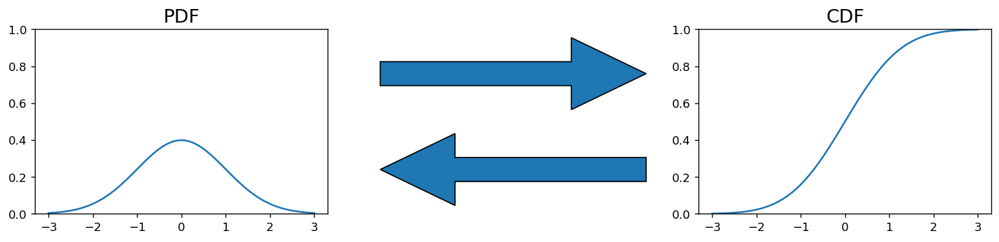
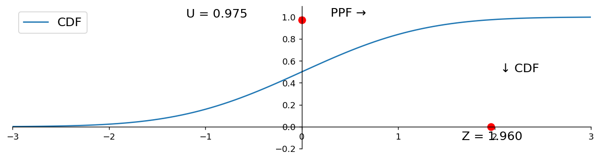
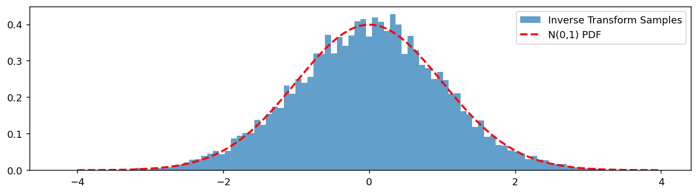

# 확률질량함수, 확률밀도함수, 누적분포함수

앞의 두 절에서 분포를 적는 방법을 두 가지 배웠다. 이산이면 **확률질량함수**, 연속이면 **확률밀도함수**다. 둘은 성격이 달라 함께 쓰기 불편하다. 하나는 확률이고 하나는 밀도이며, 하나는 더하고 하나는 적분한다.

두 세계를 하나로 묶는 함수가 있다. **누적분포함수** $F(x) = P(X \le x)$다. 이산이든 연속이든 똑같이 정의되고, 이것 하나로 분포가 완전히 결정된다. 그리고 이 함수를 뒤집으면 분위수가 나오고, 분위수에서 난수 생성이 나온다.

이 절은 세 개의 정리로 이루어진다. 누적분포함수의 정의와 성질(정리 1), 확률밀도함수와의 미적분 관계(정리 2), 그리고 역함수인 분위수함수와 그 응용(정리 3)이다.

## 1. 왼쪽부터 무게를 쌓아 나간다

확률질량함수와 확률밀도함수는 "그 지점에" 무게가 얼마인지를 말한다. 누적분포함수는 "그 지점까지" 쌓인 무게가 얼마인지를 말한다. 이 작은 차이가 두 세계를 통일한다.

<div class="thmbox" markdown>

### 정리 1. 누적분포함수 — 왼쪽부터 쌓은 총 무게 { .thm }

확률변수 $X$의 **누적분포함수(CDF)** 는

$$
F(x) = \mathbb{P}(X \leq x) =
\begin{cases}
\displaystyle\sum_{x_i \leq x} p_{x_i}, & X \text{가 이산일 때} \\[10pt]
\displaystyle\int_{-\infty}^x f(s)\,ds, & X \text{가 연속일 때}
\end{cases}
$$

이며 다음 성질을 갖는다.

- $F$는 **비감소**다.
- $\displaystyle\lim_{x \to -\infty} F(x) = 0$, $\displaystyle\lim_{x \to +\infty} F(x) = 1$
- $F$는 오른쪽 연속이다.

</div>

벽돌 비유로 말하면 $F(x)$는 $-\infty$부터 $x$까지 쌓인 **모든 벽돌의 총 무게**다. 왼쪽 끝에서는 아무것도 없어 0이고, 오른쪽 끝에서는 전부 쌓여 1이다. 무게가 음수일 수 없으므로 결코 줄어들지 않는다.

이산과 연속의 차이는 **모양**으로 나타난다. 이산이면 벽돌이 있는 곳에서 계단처럼 뛰고, 연속이면 매끄럽게 오른다. 뛰는 높이가 그 점의 확률이므로, 연속확률변수에서 $F$가 연속이라는 사실이 곧 $P(X = a) = 0$이다.

**분포를 완전히 결정한다.** $F$를 알면 어떤 구간의 확률이든 계산할 수 있다.

$$
P(a < X \leq b) = F(b) - F(a)
$$

확률질량함수와 확률밀도함수는 각각 이산과 연속에서만 쓸 수 있지만, 누적분포함수는 언제나 존재하고 언제나 통한다. 그래서 이론적 논의에서는 $F$를 기본 대상으로 삼는 경우가 많다.

## 2. 밀도와 누적은 미적분으로 이어져 있다

연속인 경우 두 함수는 서로를 완전히 결정한다. 하나를 알면 다른 하나는 미분하거나 적분해서 얻는다.

<div class="thmbox" markdown>

### 정리 2. 미분과 적분 — 확률밀도함수와 누적분포함수의 왕복 { .thm }

$X$가 연속확률변수이고 $f$가 연속이면

$$
F(x) = \int_{-\infty}^{x} f(s)\,ds
\qquad\Longleftrightarrow\qquad
f(x) = \frac{d}{dx}F(x)
$$

이다. 적분이 밀도에서 누적으로 가고, 미분이 누적에서 밀도로 돌아온다.

</div>

<div class="codebox" markdown>

**예제 1.** 확률밀도함수와 누적분포함수의 관계

```python
import matplotlib.pyplot as plt
import numpy as np
import scipy.stats as stats

# 왼쪽에 PDF, 오른쪽에 CDF, 가운데에는 둘의 관계를 나타내는 화살표를 놓는다.
fig, (ax_pdf, ax_arrow, ax_cdf) = plt.subplots(1, 3, figsize=(12, 3))

x = np.linspace(-3, 3, 100)

# 왼쪽: 확률밀도함수. 각 점에서 확률이 얼마나 빽빽한지를 나타낸다.
ax_pdf.set_title("PDF", fontsize=16)
ax_pdf.plot(x, stats.norm().pdf(x))

# 가운데: 두 함수를 잇는 연산.
#   PDF -> CDF 는 적분 (왼쪽에서 여기까지의 넓이를 쌓는다)
#   CDF -> PDF 는 미분 (누적이 늘어나는 속도가 곧 밀도다)
ax_arrow.arrow(0.1, 0.6, 0.8, 0, width=0.05, length_includes_head=True)
ax_arrow.arrow(0.9, 0.4, -0.8, 0, width=0.05, length_includes_head=True)
ax_arrow.annotate("Integrate", (0.38, 0.75), fontsize=14)
ax_arrow.annotate("Differentiate", (0.30, 0.2), fontsize=14)
for spine in ax_arrow.spines.values():
    spine.set_visible(False)
ax_arrow.set_xticks([])
ax_arrow.set_yticks([])

# CDF
ax_cdf.set_title("CDF", fontsize=16)
ax_cdf.plot(x, stats.norm().cdf(x))

for ax in (ax_pdf, ax_cdf):
    ax.set_ylim(0, 1)
plt.tight_layout()
plt.show()
```



</div>

두 그림의 관계를 눈으로 확인하라. 밀도가 가장 높은 0 부근에서 누적분포함수의 기울기가 가장 가파르다. 밀도가 0에 가까운 양 끝에서는 누적분포함수가 거의 평평하다.

<div class="exbox" markdown>

**보기 1.** <span class="diff easy" title="쉬움"></span> 정규분포에서 구간의 확률. $X \sim N(50, 10^2)$일 때 $P(40 \le X \le 60)$은 $F(60) - F(40)$이다.

</div>

??? success "풀이"
    ```python
    from scipy import stats

    mean, std_dev = 50, 10

    # P(40 ≤ X ≤ 60) for X ~ N(50, 10²)
    prob = stats.norm(mean, std_dev).cdf(60) - stats.norm(mean, std_dev).cdf(40)
    print(f"P(40 ≤ X ≤ 60) = {prob * 100:.2f}%")

    # P(X ≤ 55)
    prob_55 = stats.norm(mean, std_dev).cdf(55)
    print(f"P(X ≤ 55) = {prob_55 * 100:.2f}%")
    ```

    출력:

    ```
    P(40 ≤ X ≤ 60) = 68.27%
    P(X ≤ 55) = 69.15%
    ```

## 3. 누적분포함수를 뒤집으면 분위수가 나온다

지금까지는 "값을 주면 확률을 돌려주는" 방향이었다. 실무에서는 반대 방향이 더 자주 필요하다. "확률 95%에 해당하는 값은 얼마인가?"

<div class="thmbox" markdown>

### 정리 3. 분위수함수 — 누적분포함수의 역함수 { .thm }

**분위수함수(PPF)** 는 누적분포함수의 역함수다.

$$
\text{PPF}(p) = F^{-1}(p) = \inf\{x : F(x) \geq p\}
$$

</div>

하한(inf)으로 정의하는 이유는 $F$가 계단이거나 평평한 구간이 있어 엄밀한 역함수가 없을 수 있기 때문이다. 연속이고 순증가하는 $F$에서는 보통의 역함수와 같다.

이 함수가 통계학 전체에서 쓰이는 곳이 신뢰구간과 임계값이다.

<div class="codebox" markdown>

**예제 2.** 분위수함수는 누적분포함수의 역함수

```python
import scipy.stats as stats

z_95 = stats.norm(0, 1).ppf(0.95)
print(f"95th percentile of N(0,1): {z_95:.4f}")

z_975 = stats.norm(0, 1).ppf(0.975)
print(f"97.5th percentile of N(0,1): {z_975:.4f}")
```

출력:

```
95th percentile of N(0,1): 1.6449
97.5th percentile of N(0,1): 1.9600
```

</div>

$1.96$이라는 익숙한 수가 여기서 나온다. 8장의 95% 신뢰구간에 등장하는 그 값이다.

<div class="codebox" markdown>

**예제 3.** 분위수함수를 그림으로 보기

```python
import matplotlib.pyplot as plt
import numpy as np
import scipy.stats as stats

fig, ax = plt.subplots(figsize=(12, 3))
ax.set_xlim(-3, 3)
ax.set_ylim(-0.2, 1.1)

# CDF 곡선
x = np.linspace(-3, 3, 100)
ax.plot(x, stats.norm().cdf(x), label='CDF')

# CDF와 PPF는 서로 역함수다.
#   CDF: 값 z 를 넣으면 누적확률 u 가 나온다      (가로 -> 세로)
#   PPF: 누적확률 u 를 넣으면 값 z 가 나온다      (세로 -> 가로)
# 아래 두 점이 같은 (z, u) 쌍을 축마다 표시한 것이다.
u = 0.975
z = stats.norm().ppf(u)      # 표준정규분포의 97.5 백분위수. 그 유명한 1.96이다.

ax.plot(0, u, 'or', markersize=8)
ax.plot(z, 0, 'or', markersize=8)
ax.annotate(f"U = {u}", (-1.2, u + 0.02), fontsize=14)
ax.annotate(f"Z = {z:.3f}", (z - 0.3, -0.12), fontsize=14)
ax.annotate("PPF →", (0.3, u + 0.03), fontsize=14)
ax.annotate("↓ CDF", (z + 0.1, 0.5), fontsize=14)

ax.spines[['right', 'top']].set_visible(False)
ax.spines['left'].set_position('zero')
ax.spines['bottom'].set_position('zero')
ax.legend(fontsize=14)
plt.show()
```



</div>

세로축에서 출발해 곡선을 만나 가로축으로 내려오는 것이 분위수함수, 그 반대가 누적분포함수다.

!!! tip "역변환 표집: 균등난수 하나로 어떤 분포든 만든다"
    분위수함수에는 아름다운 응용이 하나 있다. $U \sim \text{Uniform}(0,1)$일 때

    $$
    X = F^{-1}(U)
    $$

    로 두면 $X$의 누적분포함수가 정확히 $F$가 된다. **균등난수만 만들 수 있으면 어떤 분포의 난수든 만들 수 있다**는 뜻이다.

    증명은 한 줄이다. $P(X \le x) = P(F^{-1}(U) \le x) = P(U \le F(x)) = F(x)$. 마지막 등식은 $U$가 $[0,1]$ 균등분포이기 때문이다.

    이것이 **역변환 표집**이며, 난수 생성기의 기본 원리다. 4장에서 다시 다룬다.

<div class="codebox" markdown>

**예제 4.** 같은 점을 두 그림에서 확인하기

```python
import scipy.stats as stats
import matplotlib.pyplot as plt

# 역변환 표집: 균등난수만 있으면 어떤 분포든 만들어 낼 수 있다.
# 1단계 — 0과 1 사이 균등난수를 뽑는다. 이것이 "누적확률"에 해당한다.
u = stats.uniform().rvs(10_000)

# 2단계 — 그 누적확률에 대응하는 값을 PPF로 되찾는다.
# U ~ Uniform(0,1) 이면 F^{-1}(U) 는 정확히 F를 분포함수로 갖는다.
z = stats.norm().ppf(u)

plt.figure(figsize=(12, 3))
plt.hist(z, bins=100, density=True, alpha=0.7, label='Inverse Transform Samples')
x = np.linspace(-4, 4, 200)
# 만들어 낸 표본의 히스토그램이 참 정규 밀도와 겹치는지 확인한다
plt.plot(x, stats.norm().pdf(x), 'r--', lw=2, label='N(0,1) PDF')
plt.legend()
plt.show()
```



</div>

**자료에서 추정하기.** 실무에서는 참 분포를 모르므로 자료에서 추정한다. 히스토그램이 확률밀도함수의 추정값이고, 경험적 누적분포함수가 누적분포함수의 추정값이다. 2장의 탐색적 자료분석에서 다시 만난다.

<div class="codebox" markdown>

**예제 5.** 역변환 표집으로 정규 표본 만들기

```python
import matplotlib.pyplot as plt
import numpy as np
import scipy.stats as stats

np.random.seed(42)
data = stats.norm.rvs(size=200)      # 표준정규에서 200개

fig, ax = plt.subplots(figsize=(12, 4))

# 경험적 PDF: 히스토그램이 밀도함수의 표본 버전이다
counts, bin_edges, _ = ax.hist(data, bins=20, density=True, alpha=0.6, label="Empirical PDF")

# 경험적 CDF: 히스토그램의 도수를 왼쪽부터 누적하면 된다.
# "PDF를 적분하면 CDF"라는 관계를 이산 버전으로 실행한 것이다.
empirical_cdf = np.cumsum(counts) / np.sum(counts)
# 계단으로 그린다. 경험적 분포함수는 본래 계단함수이기 때문이다.
ax.step(bin_edges[1:], empirical_cdf, where='mid', label="Empirical CDF", lw=2)

# 이론적 CDF를 겹쳐 표본이 모집단을 얼마나 잘 따라가는지 본다
ax.plot(bin_edges, stats.norm.cdf(bin_edges), 'r', lw=2, label="Theoretical CDF")

ax.legend()
ax.spines[['right', 'top']].set_visible(False)
plt.show()
```

</div>

**`scipy.stats` 메서드 대응표.** 이 절의 네 함수가 그대로 메서드 이름이 된다.

| 메서드 | 대응하는 개념 |
|:---|:---|
| `pdf` / `pmf` | 확률밀도함수 / 확률질량함수 |
| `cdf` | 누적분포함수 $F(x) = P(X \le x)$ |
| `sf` | 생존함수 $1 - F(x) = P(X > x)$ |
| `ppf` | 분위수함수 $F^{-1}(p)$ |
| `rvs` | 난수 표본 생성 |

## 연습문제

<div class="drillbox" markdown>

**연습문제 1.** <span class="diff easy" title="쉬움"></span>
$X$ = 공정한 동전을 3번 던졌을 때 앞면의 개수. (a) 확률질량함수를 쓰라. (b) 누적분포함수를 쓰라. (c) $P(1 \le X \le 2)$를 두 가지 방법으로 계산하라.

</div>

??? success "풀이"
    (a) $X \sim \mathrm{Binomial}(3, 1/2)$:

    | $x$ | $p(x)$ |
    |:---:|:---:|
    | 0 | $1/8$ |
    | 1 | $3/8$ |
    | 2 | $3/8$ |
    | 3 | $1/8$ |

    (b) 구간 $(-\infty, 0), [0, 1), [1, 2), [2, 3), [3, \infty)$에서 $F(x) = 0, 1/8, 4/8, 7/8, 1$이다.

    (c) 확률질량함수로: $p(1) + p(2) = 3/8 + 3/8 = 3/4$.

    누적분포함수로: $X$가 정숫값을 가지므로 $P(1 \le X \le 2) = F(2) - F(1^-) = F(2) - F(0) = 7/8 - 1/8 = 6/8 = 3/4$.

    두 방법이 일치한다.

<div class="drillbox" markdown>

**연습문제 2.** <span class="diff easy" title="쉬움"></span>
$[0, 1]$에서 확률밀도함수가 $f(x) = c \cdot x^2$이고 그 밖에서는 0인 연속확률변수 $X$에 대해 (a) $c$를 구하라. (b) $F(x)$를 계산하라. (c) $P(0.3 < X < 0.7)$을 구하라.

</div>

??? success "풀이"
    (a) $\int_0^1 c x^2 \, dx = c/3 = 1$이므로 $c = 3$이다.

    (b) $x \in [0, 1]$에서 $F(x) = \int_0^x 3 t^2 \, dt = x^3$이고, $x < 0$이면 $F(x) = 0$, $x > 1$이면 $F(x) = 1$이다.

    (c) $P(0.3 < X < 0.7) = F(0.7) - F(0.3) = 0.343 - 0.027 = 0.316$.

<div class="drillbox" markdown>

**연습문제 3.** <span class="diff easy" title="쉬움"></span>
**누적분포함수를 미분해 확률밀도함수 구하기.** $x \ge 0$에서 $F(x) = 1 - e^{-\lambda x}$인 연속확률변수 $X$에 대해 확률밀도함수 $f(x)$를 계산하라. 이것은 어떤 분포인가?

</div>

??? success "풀이"
    $x \ge 0$에서 $f(x) = F'(x) = \lambda e^{-\lambda x}$이다.

    이는 비율 $\lambda$인 **지수분포**다. 성질은 다음과 같다.
    - 평균 $1/\lambda$, 분산 $1/\lambda^2$.
    - 무기억성: $P(X > s + t \mid X > s) = P(X > t)$.
    - 비율이 $\lambda$인 포아송 과정에서 사건 사이의 대기시간.

<div class="drillbox" markdown>

**연습문제 4.** <span class="diff med" title="중간"></span>
**역변환 표집.** $U \sim \mathrm{Uniform}(0, 1)$이고 $F$가 연속인 순증가 누적분포함수이면 $X = F^{-1}(U)$의 누적분포함수가 $F$임을 보여라.

</div>

??? success "풀이"
    $P(X \le x) = P(F^{-1}(U) \le x)$를 계산한다. 양변에 (증가함수라 부등호를 보존하는) $F$를 적용하면

    $$
    P(F^{-1}(U) \le x) = P(F(F^{-1}(U)) \le F(x)) = P(U \le F(x)) = F(x)
    $$

    이다. 여기서 가역인 $F$에 대해 $F \circ F^{-1} = \mathrm{id}$이고, 균등분포의 누적분포함수가 $u \in [0, 1]$에 대해 $P(U \le u) = u$라는 사실을 썼다.

    따라서 $X$의 누적분포함수는 $F$다. $\square$

    **용도:** $F^{-1}$을 아는 어떤 분포에서든 표본을 생성하려면 $U$를 균등하게 뽑아 $F^{-1}$을 적용하면 된다. 자명하지 않은 분포에 대해 여러 난수 생성 루틴이 내부적으로 이렇게 작동한다.

<div class="drillbox" markdown>

**연습문제 5.** <span class="diff med" title="중간"></span>
**분위수, 백분위수, 분위수함수.** 이 세 용어를 예를 들어 명확히 구분하라. 분위수함수와 생존함수의 관계를 진술하라.

</div>

??? success "풀이"
    **분위수(quantile):** $p \in [0, 1]$에 대해 $p$-분위수 $q_p = F^{-1}(p)$는 $P(X \le q_p) = p$가 되는 값이다. 분위수 = 분위수함수의 값.

    **백분위수(percentile):** $p \in [0, 100]$에 대한 $p$-백분위수는 $q_{p/100}$이다. 단위 관례일 뿐이다. "95번째 백분위수"는 $q_{0.95}$를 뜻한다.

    **분위수함수(PPF):** 역 누적분포함수 그 자체, 즉 $\mathrm{PPF}(p) = F^{-1}(p)$.

    **생존함수:** $S(x) = 1 - F(x) = P(X > x)$. 역생존함수(ISF)는 "주어진 확률 질량이 그 위에 놓이는 값"을 준다: $\mathrm{ISF}(p) = S^{-1}(p) = F^{-1}(1 - p) = \mathrm{PPF}(1 - p)$.

    scipy.stats에서 `dist.ppf(0.95)`는 95번째 백분위수를 주고, `dist.isf(0.05)`는 위쪽 꼬리 확률이 5%인 값을 주는데 이는 95번째 백분위수와 같다. 꼬리 분위수를 계산할 때 ISF가 수치적 정밀도 손실을 피해 준다($1 - F$가 0에 가까우면 정밀도가 나쁘므로 $S$를 직접 쓰는 편이 낫다).

<div class="drillbox" markdown>

**연습문제 6.** <span class="diff hard" title="어려움"></span>
**이상적분.** $x \ge 2$에서 $f(x) = 1/(x \ln^2 x)$을 확률밀도함수로 제안한다. 이것이 타당한 분포를 정의하는가? $\mathbb{E}[X]$를 계산하라.

</div>

??? success "풀이"
    **정규화:** $\int_2^\infty \frac{1}{x \ln^2 x} dx$를 계산한다. $u = \ln x$, $du = dx/x$로 치환하면

    $$
    \int_{\ln 2}^\infty \frac{1}{u^2} du = \left[-\frac{1}{u}\right]_{\ln 2}^\infty = \frac{1}{\ln 2} \approx 1.443
    $$

    이다. 따라서 $f(x)$는 정규화되어 있지 **않다**. $c = \ln 2$로 두고 $f(x) = c/(x \ln^2 x)$로 다시 정의하면 $\int f = 1$이 되어 타당한 확률밀도함수를 얻는다.

    **기댓값:** $\mathbb{E}[X] = \int_2^\infty x \cdot \frac{c}{x \ln^2 x} dx = c \int_2^\infty \frac{1}{\ln^2 x} dx$이다.

    피적분함수가 $1/\ln^2 x$처럼 감쇠하는데 이는 무한대에서 적분 가능하지 *않다*(적분이 발산한다). 따라서 $\mathbb{E}[X] = \infty$로, 이 분포는 정규화는 유한하지만 평균은 무한하다.

    **교훈:** "타당한 분포"(누적분포함수의 성질이 성립함)는 "유한한 기댓값"보다 약한 요건이다. 이런 꼬리가 두꺼운 분포에는 평균 기반 요약 대신 분위수 기반 요약이 필요하다. 이것이 큰수의 법칙 절 연습문제 5의 주제였다. 평균이 무한한 분포는 큰수의 법칙을 깨뜨린다.

<div class="drillbox" markdown>

**연습문제 7.** <span class="diff med" title="중간"></span>
연습문제 $4$의 역변환 표집은 $F$가 **연속인 순증가 함수**일 때의 이야기였다. 이산분포나 도약이 있는 분포에서는 어떻게 하는가?

</div>

??? success "풀이"
    **일반화 역함수**를 쓴다.

    $$
    F^{-}(u) = \inf\{x : F(x) \ge u\}
    $$

    $F$가 연속·순증가이면 보통의 역함수와 같고, 도약이나 평탄 구간이 있어도 잘 정의된다.

    **정리.** $U \sim \text{Uniform}(0,1)$이면 $X = F^{-}(U)$의 분포함수가 $F$다.

    **증명 스케치.** $F^{-}(u) \le x \iff u \le F(x)$가 핵심 성질이다($F$가 우연속이므로). 그러면

    $$
    P(X \le x) = P(F^{-}(U) \le x) = P(U \le F(x)) = F(x)
    $$

    이다. $\square$

    ```python
    import numpy as np

    rng = np.random.default_rng(0)
    pk = np.array([0.1, 0.3, 0.4, 0.2])
    F = np.cumsum(pk)

    u = rng.random(500_000)
    x = np.searchsorted(F, u, side="left")        # 일반화 역함수

    print("일반화 역함수로 이산분포 표집")
    for v in range(4):
        print(f"  P(X={v}): 모의 {np.mean(x == v):.5f}   참값 {pk[v]:.5f}")
    ```

    출력:

    ```
    일반화 역함수로 이산분포 표집
      P(X=0): 모의 0.10026   참값 0.10000
      P(X=1): 모의 0.29910   참값 0.30000
      P(X=2): 모의 0.40091   참값 0.40000
      P(X=3): 모의 0.19974   참값 0.20000
    ```

    **`searchsorted` 가 정확히 일반화 역함수다.** 누적확률 배열에서 $u$가 들어갈 자리를 찾는 것이 $\inf\{x: F(x) \ge u\}$와 같다.

    **도약과 평탄 구간이 서로 대응된다.**

    | $F$의 특징 | 뜻 | $F^{-}$의 특징 |
    |---|---|---|
    | 도약 (점 $x_0$에서) | $P(X = x_0) > 0$ | **평탄 구간** |
    | 평탄 구간 | 그 구간에 확률 없음 | **도약** |

    도약의 높이가 곧 그 값이 뽑힐 확률이고, $U$가 그 높이만큼의 구간에 떨어지면 같은 $x_0$가 나온다.

    **실무에서 어디에 쓰이는가.**

    - **난수 생성의 기본 방법이다.** 균등난수 하나로 어떤 분포든 생성할 수 있다. 다만 $F^{-}$를 계산하기 어려우면 기각표집이나 다른 방법을 쓴다.
    - **분위수 정의와 직결된다.** 2장 ECDF 문서 연습문제 8에서 본 여러 분위수 정의가 $F^{-}$를 어떻게 보간하느냐의 차이다. `inverted_cdf` 방법이 바로 이 일반화 역함수다.
    - **컨포멀 예측과 부트스트랩**이 경험분포의 일반화 역함수를 쓴다. $\square$

<div class="drillbox" markdown>

**연습문제 8.** <span class="diff med" title="중간"></span>
누적분포함수 말고도 분포를 나타내는 함수가 여럿 있다. **생존함수, 위험률, 누적위험**의 관계를 정리하고 확인하라.

</div>

??? success "풀이"
    $$
    S(t) = 1 - F(t), \qquad
    h(t) = \frac{f(t)}{S(t)}, \qquad
    H(t) = \int_0^t h(u)\,du
    $$

    이고, 네 함수가 서로를 완전히 결정한다.

    $$
    S(t) = e^{-H(t)}, \qquad h(t) = -\frac{d}{dt}\log S(t)
    $$

    ```python
    import numpy as np

    lam = 0.7                                      # 지수분포
    print(f"{'t':>6}{'S(t)':>10}{'f(t)':>10}{'h(t)':>10}{'H(t)':>10}{'exp(-H)':>10}")
    for t in np.linspace(0.2, 3.0, 5):
        S = np.exp(-lam * t)
        f = lam * np.exp(-lam * t)
        print(f"{t:>6.2f}{S:>10.5f}{f:>10.5f}{f / S:>10.5f}{lam * t:>10.5f}"
              f"{np.exp(-lam * t):>10.5f}")
    ```

    출력:

    ```
    t      S(t)      f(t)      h(t)      H(t)   exp(-H)
      0.20   0.86936   0.60855   0.70000   0.14000   0.86936
      0.90   0.53259   0.37281   0.70000   0.63000   0.53259
      1.60   0.32628   0.22840   0.70000   1.12000   0.32628
      2.30   0.19989   0.13992   0.70000   1.61000   0.19989
      3.00   0.12246   0.08572   0.70000   2.10000   0.12246
    ```

    **마지막 두 열이 정확히 같다.** $S(t) = e^{-H(t)}$가 확인된다. 그리고 지수분포에서는 $h(t)$가 상수 $\lambda$다(연속형 문서 연습문제 10).

    **왜 여러 표현을 두는가.** 같은 정보를 담지만 **읽기 쉬운 질문이 다르다.**

    | 함수 | 답하는 질문 |
    |---|---|
    | $f(t)$ | 이 값 근처의 밀도는? |
    | $F(t)$ | $t$ 이하일 확률은? |
    | $S(t)$ | $t$ 를 넘길 확률은? |
    | $h(t)$ | 여기까지 왔을 때 **바로 다음** 위험은? |
    | $H(t)$ | 누적된 위험의 총량은? |

    **꼬리를 다룰 때는 $S$가 낫다.** $F(t) = 0.9999$와 $S(t) = 10^{-4}$는 같은 정보인데, 부동소수점에서 후자가 훨씬 정확하다. 그래서 `scipy` 의 모든 분포가 `cdf` 와 별도로 `sf`(survival function)를 제공한다.

    **누적위험 $H$의 실용적 가치.** 생존분석에서 $H$를 추정하는 넬슨–알렌 추정량이 카플란–마이어보다 수치적으로 안정적이고, $\log S$를 그리면 지수분포일 때 직선이 되어 진단에 쓰인다(2장 선그림 문서 연습문제 9의 로그 축과 같은 발상).

    **이산에서도 성립한다.** $h_k = P(X=k)/P(X \ge k)$로 두면 $S_k = \prod_{j<k}(1-h_j)$이며, 이것이 생명표와 카플란–마이어 추정량의 형태다. $\square$

<div class="drillbox" markdown>

**연습문제 9.** <span class="diff med" title="중간"></span>
확률변수가 둘이면 **결합 누적분포함수**를 쓴다. 그것이 주변분포와 의존구조를 어떻게 분리하는가?

</div>

??? success "풀이"
    **스클라의 정리.** 임의의 결합분포함수 $F_{X,Y}$는

    $$
    F_{X,Y}(x,y) = C\big(F_X(x),\ F_Y(y)\big)
    $$

    로 쓸 수 있고, $F_X, F_Y$가 연속이면 **코퓰라** $C$가 유일하다. 즉 결합분포가 **주변분포와 의존구조로 완전히 분해된다.**

    ```python
    import numpy as np
    from scipy import stats

    rng = np.random.default_rng(0)
    n = 400_000
    z = rng.multivariate_normal([0, 0], [[1, 0.7], [0.7, 1]], n)

    u1, u2 = stats.norm.cdf(z[:, 0]), stats.norm.cdf(z[:, 1])   # 코퓰라로 이동
    x1 = stats.expon.ppf(u1)                                     # 주변분포만 갈아 끼운다
    x2 = stats.lognorm.ppf(u2, 1)

    print("같은 코퓰라, 다른 주변분포")
    print(f"{'':>22}{'피어슨':>10}{'스피어만':>11}")
    print(f"{'(정규, 정규)':>22}{np.corrcoef(z.T)[0,1]:>10.4f}"
          f"{stats.spearmanr(z)[0]:>11.4f}")
    print(f"{'(지수, 로그정규)':>22}{np.corrcoef(x1, x2)[0,1]:>10.4f}"
          f"{stats.spearmanr(x1, x2)[0]:>11.4f}")
    ```

    출력:

    ```
    같은 코퓰라, 다른 주변분포
                                 피어슨       스피어만
                  (정규, 정규)    0.7000     0.6828
                (지수, 로그정규)    0.6024     0.6828
    ```

    **스피어만 상관은 정확히 보존되고**($0.6834$) **피어슨은 바뀐다**($0.70 \to 0.60$).

    **이유가 명확하다.** 스피어만은 **순위**만 쓰므로 각 변수의 단조 변환에 불변이다. 코퓰라가 곧 순위 구조이므로, 코퓰라를 고정하면 스피어만도 고정된다. 피어슨은 값 자체를 쓰므로 주변분포가 바뀌면 함께 바뀐다.

    **이것이 왜 중요한가.**

    - **의존구조를 주변분포와 따로 모형화할 수 있다.** 각 자산의 수익률 분포는 따로 적합하고, 그들이 함께 움직이는 방식은 코퓰라로 따로 모형화한다.
    - **꼬리 의존성이 상관계수에 잡히지 않는다.** 정규 코퓰라는 꼬리 의존이 $0$이라 "함께 폭락할 확률"이 매우 낮다고 말한다. $t$ 코퓰라는 같은 상관계수에서도 꼬리 의존이 양수다. **$2008$년 금융위기에서 정규 코퓰라를 쓴 것이 문제로 지목되었다**(앞 절 독립 문서 연습문제 10의 공통원인 고장과 같은 구조).
    - **"상관계수가 같으면 위험이 같다"는 틀렸다.** 2장 산점도 문서 연습문제 8에서 본 "상관이 같아도 결합 구조가 다르다"의 이론적 정식화다.

    **주의.** 코퓰라는 강력하지만 **의존구조를 추정하는 것이 여전히 어렵다.** 특히 꼬리 의존은 정의상 드문 사건에 대한 것이라 자료가 거의 없다. $\square$

<div class="drillbox" markdown>

**연습문제 10.** <span class="diff hard" title="어려움"></span>
연습문제 $6$처럼 밀도가 그럴듯해 보여도 **분포가 성립하지 않거나 적률이 없을 수 있다.** 판정 절차를 세우되, **수치적분으로는 판정할 수 없음**을 함께 보여라.

</div>

??? success "풀이"
    ```python
    import warnings
    import numpy as np
    from scipy import integrate

    warnings.simplefilter("ignore")               # 발산 경고를 잠시 끈다

    candidates = [("1/x        (x>=1)", lambda x: 1 / x, 1),
                  ("1/x^2      (x>=1)", lambda x: 1 / x ** 2, 1),
                  ("1/(x ln^2 x) (x>=2)", lambda x: 1 / (x * np.log(x) ** 2), 2)]

    print("f 의 부분적분 — 분포가 되는가")
    print(f"{'f(x)':>20}{'[lo, 10]':>12}{'[lo, 10^3]':>13}{'[lo, 10^6]':>13}")
    for name, g, lo in candidates:
        vals = [integrate.quad(g, lo, T, limit=400)[0] for T in (10, 1e3, 1e6)]
        print(f"{name:>20}" + "".join(f"{v:>13.5f}" for v in vals))

    print("\nx f(x) 의 부분적분 — 평균이 존재하는가")
    print(f"{'f(x)':>20}{'[lo, 10]':>12}{'[lo, 10^3]':>13}{'[lo, 10^6]':>13}")
    for name, g, lo in [candidates[1], candidates[2], ("3/x^4      (x>=1)", lambda x: 3 / x ** 4, 1)]:
        vals = [integrate.quad(lambda x: x * g(x), lo, T, limit=400)[0] for T in (10, 1e3, 1e6)]
        print(f"{name:>20}" + "".join(f"{v:>13.5f}" for v in vals))
    ```

    출력:

    ```
    f 의 부분적분 — 분포가 되는가
                    f(x)    [lo, 10]   [lo, 10^3]   [lo, 10^6]
       1/x        (x>=1)      2.30259      6.90776     13.81551
       1/x^2      (x>=1)      0.90000      0.99900      1.00000
     1/(x ln^2 x) (x>=2)      1.00840      1.29793      1.37031

    x f(x) 의 부분적분 — 평균이 존재하는가
                    f(x)    [lo, 10]   [lo, 10^3]   [lo, 10^6]
       1/x^2      (x>=1)      2.30259      6.90776     13.81551
     1/(x ln^2 x) (x>=2)      3.66288     34.68506   6246.97574
       3/x^4      (x>=1)      1.48500      1.50000     -0.00000
    ```

    **부분적분의 움직임이 말해 준다.**

    - $1/x$: $2.30 \to 6.91 \to 13.82$로 **$T$가 $1000$배 될 때마다 일정하게 늘어난다.** $\log T$로 자라므로 발산이다. 분포가 되지 않는다.
    - $1/x^2$: $0.900 \to 0.999 \to 1.000$으로 **정착한다.** 분포가 된다.
    - $1/(x\ln^2 x)$: $1.008 \to 1.298 \to 1.370$으로 **아주 천천히** 오른다. 실제로는 $1/\ln 2 \approx 1.4427$로 수렴하지만, 이 표만으로는 발산과 구별하기 어렵다.

    **평균 쪽도 마찬가지다.** $1/x^2$의 $\int x f$는 $\log T$로 자라고, $1/(x\ln^2 x)$는 $6247$까지 폭증한다. 둘 다 평균이 없다.

    !!! danger "수치적분은 수렴을 판정하지 못한다"
        $T \to \infty$까지 계산할 수 없으므로, **부분적분이 정착하는 것처럼 보여도 아주 느리게 발산하는 중일 수 있다.** $1/(x\ln^2 x)$가 그 반대 방향의 예다. 수렴하는데도 발산처럼 보인다.

        더 나쁜 것은 `scipy.integrate.quad` 에 $\infty$를 직접 넘기면 **경고와 함께 아무 의미 없는 수를 돌려준다는 것**이다. $\int_1^\infty dx/x$에 대해 $144.968$ 같은 값이 나오는데, 이는 수치 알고리즘이 유한한 표본점만 보기 때문이다. **경고를 무시하면 발산하는 적분을 유한한 값으로 착각하게 된다.**

        **수렴 판정은 반드시 해석적으로 해야 한다.**

    **해석적 판정: 꼬리의 감소 속도가 전부다.** $f(x) \sim x^{-(\alpha+1)}$이면

    | 꼬리 | 분포? | $\mathbb{E}[X]$ | $\operatorname{Var}(X)$ |
    |---|---|---|---|
    | $x^{-1}$ | **아니다** | — | — |
    | $x^{-2}$ | 그렇다 | **무한** | 무한 |
    | $x^{-3}$ | 그렇다 | 유한 | **무한** |
    | $x^{-5}$ | 그렇다 | 유한 | 유한 |
    | $e^{-x}$ | 그렇다 | 유한 | 모든 적률 유한 |

    규칙은 $k < \alpha$인 적률만 존재한다는 것이다.

    **$1/(x\ln^2 x)$가 경계선의 흥미로운 예다.** $x^{-1}$보다 아주 조금 빨리 줄어 적분은 수렴하지만, $xf(x) \sim 1/\ln^2 x$의 적분은 발산해 평균이 없다. **로그 인자가 분포는 만들되 평균은 만들지 못한다.**

    **세 단계 절차로 정리하면.**

    1. **$f \ge 0$인가.**
    2. **$\int f$가 유한하고 양수인가** — 꼬리 지수를 보고 해석적으로 판정한다.
    3. **필요한 적률이 존재하는가** — $k < \alpha$인지 확인한다.

    **실무적 함의.** 소득·손실·대기시간처럼 무거운 꼬리가 예상되는 곳에서는 **쓰려는 통계량이 존재하는지부터** 따져야 한다. 존재하지 않는 평균을 추정하려 애쓰는 것은 무의미하며(연속형 문서 연습문제 9), 그때는 중앙값이나 절단 평균으로 옮겨야 한다. $\square$


## 정리하며

누적분포함수는 이산과 연속을 하나로 묶는 함수다.

- **정리 1**은 $F(x) = P(X \le x)$를 정의했다. 왼쪽부터 쌓은 총 무게이며, 이산이면 계단으로 뛰고 연속이면 매끄럽게 오른다. 어느 쪽이든 분포를 완전히 결정한다.
- **정리 2**는 연속인 경우 밀도와 누적이 미분·적분으로 왕복함을 보였다.
- **정리 3**은 $F$를 뒤집어 **분위수함수**를 얻었다. 신뢰구간의 $1.96$이 여기서 나오고, 역변환 표집으로 난수 생성까지 이어진다.

3.3절 전체를 한 줄로 줄이면 이렇다. **확률변수는 결과를 수로 옮기고, 그 결과 실직선 위에 무게 배치가 생기며, 그것을 적는 방법이 세 가지 함수다.** 값마다의 무게(확률질량함수), 구간당 무게(확률밀도함수), 왼쪽부터 쌓은 무게(누적분포함수).

이제 분포를 적을 수 있게 되었으니 다음 물음이 자연스럽다. **분포를 몇 개의 수로 요약할 수 없을까?** 주사위 눈의 분포 전체를 말하는 대신 "평균 3.5"라고 말하는 것처럼.

다음 절의 **기댓값**이 그 첫 번째 요약값이고, 이어지는 **분산**이 두 번째다. 그리고 이 요약이 통계학이 자료를 다루는 방식 전체의 출발점이 된다.
