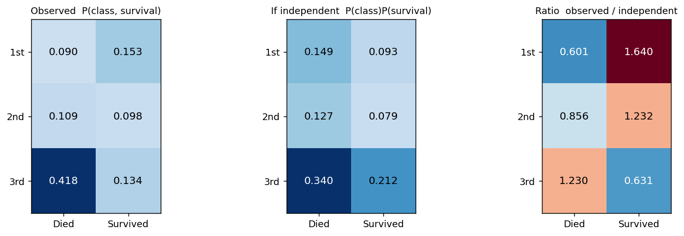

# 확률변수의 독립

3.2절에서 **사건**의 독립을 $P(A \cap B) = P(A)P(B)$로 정의했다. 등식 하나였다.

확률변수의 독립은 그것을 **모든 사건에 대해 한꺼번에** 요구한다. $X$로 만들 수 있는 모든 사건과 $Y$로 만들 수 있는 모든 사건의 모든 쌍에서 곱 규칙이 성립해야 하므로, 등식이 무한히 많다. 다행히 그 무한히 많은 조건이 **분포의 인수분해**라는 한 줄로 요약된다.

앞 절에서 주변분포가 결합분포를 결정하지 못한다는 것을 보았다. 독립은 그 닫힌 길이 열리는 특수한 경우이며, 이 절은 그것이 어떤 모습인지와 무엇이 따라 나오는지를 다룬다.

## 1. 독립은 안쪽 무게가 가장자리 곱으로 쪼개진다는 뜻이다

무한히 많은 등식을 분포의 말로 옮기면 인수분해 한 줄이 된다.

<div class="thmbox" markdown>

### 정리 1. 확률변수의 독립 — 결합이 주변의 곱으로 쪼개진다 { .thm }

두 확률변수 $X$와 $Y$가 **독립**일 필요충분조건은 결합분포가 인수분해되는 것이다:

$$
\text{Discrete:} \quad p_{X,Y}(x, y) = p_X(x) \cdot p_Y(y) \quad \text{for all } x, y
$$

$$
\text{Continuous:} \quad f_{X,Y}(x, y) = f_X(x) \cdot f_Y(y) \quad \text{for all } x, y
$$

동등하게, 모든 $x, y$에 대해 $F_{X,Y}(x,y) = F_X(x) \cdot F_Y(y)$이다.

</div>

**정의만으로는 실감이 나지 않으므로 손으로 전부 확인할 수 있는 가장 작은 예부터 본다.**

### 가장 작은 예: 동전 두 번

인수분해 조건을 **손으로 전부 확인할 수 있는** 가장 작은 예부터 보자. [이산확률변수](discrete.md)에서 만든 예를 그대로 쓴다. 앞면이 나올 확률이 $p$인 동전을 독립적으로 두 번 던지고 $q = 1 - p$라 하자. 확률변수 셋을 얹는다.

$$
X = \mathbb{1}(\text{첫 번째가 } H), \qquad
Y = \mathbb{1}(\text{두 번째가 } H), \qquad
Z = X + Y = \text{앞면의 개수}
$$

**$(X, Y)$는 인수분해된다.**

| $p_{X,Y}$ | $Y = 0$ | $Y = 1$ | $p_X$ |
|:---:|:---:|:---:|:---:|
| $X = 0$ | $q^2$ | $qp$ | $q$ |
| $X = 1$ | $pq$ | $p^2$ | $p$ |
| $p_Y$ | $q$ | $p$ | $1$ |

네 칸을 하나씩 확인하면 된다.

$$
\begin{aligned}
p_{X,Y}(0,0) &= q^2 = q \cdot q = p_X(0)p_Y(0) \\
p_{X,Y}(0,1) &= qp = q \cdot p = p_X(0)p_Y(1) \\
p_{X,Y}(1,0) &= pq = p \cdot q = p_X(1)p_Y(0) \\
p_{X,Y}(1,1) &= p^2 = p \cdot p = p_X(1)p_Y(1)
\end{aligned}
$$

네 칸 모두에서 성립하므로 $X$와 $Y$는 독립이다. 표로 말하면 **모든 칸이 자기 행의 합과 자기 열의 합의 곱**이며, 이것이 독립의 그림이다.

**$(X, Z)$는 인수분해되지 않는다.** $X$는 여전히 $\text{Bernoulli}(p)$이고 $Z$는 여전히 $B(2, p)$다. 바뀐 것은 짝짓는 방식뿐이다.

| $p_{X,Z}$ | $Z = 0$ | $Z = 1$ | $Z = 2$ | $p_X$ |
|:---:|:---:|:---:|:---:|:---:|
| $X = 0$ | $q^2$ | $qp$ | $0$ | $q$ |
| $X = 1$ | $0$ | $pq$ | $p^2$ | $p$ |
| $p_Z$ | $q^2$ | $2pq$ | $p^2$ | $1$ |

독립 조건은 "**모든** $(x,z)$에 대해"이므로 어긋나는 칸 하나면 판정이 끝난다. $0 < p < 1$일 때

$$
p_{X,Z}(1, 0) = 0
\qquad \text{그러나} \qquad
p_X(1)\,p_Z(0) = p \cdot q^2 \neq 0
$$

이다. 첫 번째가 앞면인데 앞면이 0개일 수는 없으므로 그 칸은 구조적으로 비어 있다. **독립인 표에는 0인 칸이 생길 수 없다**(모든 주변확률이 양수인 한). 곱이 0이 되려면 주변확률 하나가 0이어야 하기 때문이다.

조건부로 읽으면 이유가 더 분명하다.

$$
P(Z = 0 \mid X = 0) = \frac{q^2}{q} = q,
\qquad
P(Z = 0 \mid X = 1) = \frac{0}{p} = 0
$$

$X$의 값에 따라 $Z$의 조건부분포가 달라진다. **그것이 종속이라는 말의 뜻이다.** 그리고 $Z = X + Y$이니 놀랄 일이 아니다. $Z$는 $X$를 자기 안에 담고 있어서 $X$를 알면 $Z$에 대해 아는 것이 반드시 달라진다.


**표 둘을 그림 하나로 겹쳐 놓은 것이 위 그림이다.** $p = 0.6$으로 두고 칸마다 무게에 비례하는 사각형을 그렸으며, 가장자리 막대가 주변분포다. 칸 아래에는 그 칸의 무게와 "두 가장자리 무게의 곱"을 나란히 적었다.

**왼쪽 $(X, Y)$는 네 칸 모두 초록이다.** $0.4 \times 0.4 = 0.16$, $0.6 \times 0.6 = 0.36$처럼 어긋나는 칸이 하나도 없다.

**오른쪽 $(X, Z)$는 여섯 칸 모두 빨강이고, 그중 비어 있는 두 칸이 가장 선명하다.** $X = 0$인데 $Z = 2$일 수는 없으므로 실제 무게는 $0$이다. 그런데 독립이라면 그 자리에 $0.4 \times 0.36 = 0.14$가 있어야 한다. **독립이 요구하는 자리에 무게를 둘 수 없다는 것**이 위에서 말한 "독립인 표에는 $0$인 칸이 생길 수 없다"의 그림이다.

## 2. 독립이면 곱이 곱으로 넘어간다

독립이면 결합분포가 두 그림자만으로 완전히 복원된다. 앞 절에서 일반적으로는 닫혀 있다고 한 그 길이, 독립일 때만은 열린다. 곱하기만 하면 되기 때문이다.

<div class="thmbox" markdown>

### 정리 2. 독립의 귀결 — 곱이 곱으로 넘어간다 { .thm }

$X$와 $Y$가 독립이면 임의의 (가측) 함수 $g, h$에 대해

$$
E\bigl[g(X)\,h(Y)\bigr] = E[g(X)]\; E[h(Y)]
$$

이고, 따라서 $g(X)$와 $h(Y)$도 **독립**이다. 특히 $g(x) = x$, $h(y) = y$로 두면

$$
\operatorname{Cov}(X, Y) = 0, \qquad \operatorname{Var}(X + Y) = \operatorname{Var}(X) + \operatorname{Var}(Y)
$$

를 얻는다.

</div>

**역은 성립하지 않는다.** 공분산이 $0$이어도 독립이 아닐 수 있다. 공분산은 **선형** 관계만 재기 때문이며, 그 간극을 연습문제 $8$에서 직접 만들어 보고 [3.4절 독립성과 무상관성의 차이](independence_vs_zero_corr.md)에서 정면으로 다룬다.

**"함수도 독립"이라는 귀결에는 단서가 붙는다.** $g$가 $X$만의 함수이고 $h$가 $Y$만의 함수여야 한다. $Z = X + Y$처럼 **재료가 겹치면** 정리의 조건을 벗어나고, 실제로 §1의 동전 예에서 $X$와 $Z$는 독립이 아니었다.

### 실제 자료에서: 타이타닉의 객실등급과 생존

곱으로 인수분해되는지를 실제 자료에서 확인해 보자. 1912년 타이타닉 승객 891명의 기록을 쓴다. 두 변수는 **객실등급**(1·2·3등석)과 **생존 여부**다. 둘 다 범주형이므로 결합분포가 여섯 칸짜리 표 하나로 전부 적힌다.

<div class="exbox" markdown>

**보기 1.** <span class="diff easy" title="쉬움"></span> 실제 자료에서 독립성 확인하기. 1912년 타이타닉 승객 $891$ 명의 기록에서 **객실등급**(1·2·3등석)과 **생존 여부**를 본다. 여섯 칸의 사람 수는 다음과 같다.

| | 사망 | 생존 | 합 |
|:---|---:|---:|---:|
| 1등석 | $80$ | $136$ | $216$ |
| 2등석 | $97$ | $87$ | $184$ |
| 3등석 | $372$ | $119$ | $491$ |
| **합** | $549$ | $342$ | $891$ |

**(1)** 두 주변분포를 구하고, **1등석·생존 칸 하나만으로** 두 변수가 독립이 아님을 보이시오. 그 칸이 독립일 때의 값보다 몇 배인가.

**(2)** 여섯 칸 모두에서 비 $P(\text{등급}, \text{생존}) \big/ \big[P(\text{등급})P(\text{생존})\big]$ 를 구하면 어떤 짜임이 보이는가. 이 표가 **말해 주지 않는 것**은 무엇인가.

</div>

??? success "풀이"

    **(1) 해석적으로.** 주변분포는 행과 열의 합을 $891$ 로 나눈 것이다.

    $$
    P(\text{1등석}) = \frac{216}{891} = 0.2424,
    \quad
    P(\text{2등석}) = \frac{184}{891} = 0.2065,
    \quad
    P(\text{3등석}) = \frac{491}{891} = 0.5511
    $$

    $$
    P(\text{사망}) = \frac{549}{891} = 0.6162,
    \qquad
    P(\text{생존}) = \frac{342}{891} = 0.3838
    $$

    **이 두 줄만 보아서는 두 변수의 관계를 알 수 없다.** 같은 가장자리를 갖는 결합분포가 여럿이기 때문이며, [결합분포와 주변분포](joint.md)에서 본 그대로다.

    이제 한 칸만 보면 독립이 깨진다. 실제 비율은

    $$
    P(\text{1등석}, \text{생존}) = \frac{136}{891} = 0.1526
    $$

    인데 독립이라면 두 주변확률의 곱

    $$
    P(\text{1등석})\,P(\text{생존}) = \frac{216}{891}\cdot\frac{342}{891} = 0.0931
    $$

    이어야 한다. 비를 사람 수로만 적으면 $891$ 이 하나 남아

    $$
    \frac{P(\text{1등석}, \text{생존})}{P(\text{1등석})P(\text{생존})}
    = \frac{891 \times 136}{216 \times 342}
    = \frac{121176}{73872}
    = \frac{187}{114}
    = 1.6404
    $$

    다. **한 칸에서 $1.64$ 배가 어긋났으므로 정리 1 의 곱 조건은 이미 깨졌고**, 나머지 다섯 칸을 볼 필요도 없이 두 변수는 독립이 아니다. 독립은 여섯 칸 **모두**에서 성립해야 하는 조건이다.

    **(2) 여섯 칸의 비.** 같은 꼴 $891\,n_{ij} / (r_i c_j)$ 를 여섯 번 계산하면

    | | 사망 | 생존 |
    |:---|---:|---:|
    | 1등석 | $0.601$ | $1.640$ |
    | 2등석 | $0.856$ | $1.232$ |
    | 3등석 | $1.230$ | $0.631$ |

    이다. $1$ 이면 독립, $1$ 보다 크면 그 조합이 우연보다 자주 나타났다는 뜻이다. **짜임이 단조롭다.** 생존 열은 $1.640 \to 1.232 \to 0.631$ 로 등급이 내려갈수록 줄고, 사망 열은 $0.601 \to 0.856 \to 1.230$ 으로 정확히 반대로 는다. 각 행의 두 칸이 서로 반대 방향으로 벌어지는 것은 행의 두 확률이 더해서 주변확률이 되어야 하기 때문이다.

    같은 이야기를 등급별 생존율로 적으면 더 짧다.

    $$
    P(\text{생존} \mid \text{1등석}) = \frac{136}{216} = 0.6296,
    \quad
    \frac{87}{184} = 0.4728,
    \quad
    \frac{119}{491} = 0.2424
    $$

    전체 생존율 $0.3838$ 과 견주면 1등석은 그 $1.64$ 배, 3등석은 $0.63$ 배다. **위 표의 비는 곧 "조건부 확률을 주변확률로 나눈 것"이며**, 독립이란 조건을 걸어도 확률이 변하지 않는다는 뜻이었음이 여기서 보인다. 조건부분포로 보는 관점은 다음 쪽 [조건부분포](conditional_dist.md)가 이어받는다.

    **말해 주지 않는 것이 둘 있다.** 첫째, 이 표는 어긋남의 **크기**만 줄 뿐 그것이 우연으로 생길 수 있는 크기인지 판정하지 않는다. 여섯 칸의 어긋남을 수 하나로 묶어 판정하는 것이 10장의 카이제곱 독립성 검정이다. 둘째, 이 표는 **등급이 원인이라고 말하지 않는다.** 1등석 승객과 3등석 승객은 등급 말고도 여러 가지가 달랐으므로, 같은 어긋남이 다른 변수를 통해 생겼을 수 있다. 두 변수만 담은 표로는 그 가능성을 가려낼 수 없다.

    **(3) 수치적으로.**

    ```python
    import numpy as np
    import pandas as pd

    URL = "https://raw.githubusercontent.com/datasciencedojo/datasets/f0ccab6a7ceafdff780052166fb6fab3311398eb/titanic.csv"
    t = pd.read_csv(URL)

    # 칸의 사람 수부터 본다. 비율은 전부 이 여섯 수에서 나온다.
    counts = pd.crosstab(t.Pclass, t.Survived)
    counts.index.name, counts.columns.name = "객실등급", "생존"
    print("사람 수 (전체 %d명)" % len(t))
    print(counts.to_string())
    print("행 합 :", list(counts.sum(axis=1)), "  열 합 :", list(counts.sum(axis=0)))

    # 결합 확률질량함수. 891명을 두 변수로 갈라 칸마다 비율을 센다.
    joint = pd.crosstab(t.Pclass, t.Survived, normalize=True)
    joint.index.name, joint.columns.name = "객실등급", "생존"
    print("\n결합 P(등급, 생존)")
    print(joint.round(4).to_string())

    # 주변분포는 행 방향, 열 방향으로 더하면 나온다.
    p_class = joint.sum(axis=1)
    p_surv = joint.sum(axis=0)
    print("\n주변 P(등급) :", dict(p_class.round(4)))
    print("주변 P(생존) :", dict(p_surv.round(4)))

    # 독립이라면 결합이 주변의 곱과 같아야 한다.
    product = pd.DataFrame(np.outer(p_class, p_surv), index=joint.index, columns=joint.columns)
    print("\n독립이라면 P(등급)P(생존)")
    print(product.round(4).to_string())

    print("\n실제 / 곱   (1이면 독립)")
    print((joint / product).round(3).to_string())

    # 같은 비를 사람 수로만 적으면 n * n_ij / (행합 * 열합) 이다.
    n = len(t)
    ratio_counts = n * counts / np.outer(counts.sum(axis=1), counts.sum(axis=0))
    print("\n사람 수로 계산한 같은 비  n*n_ij/(행합*열합)")
    print(ratio_counts.round(3).to_string())
    print(f"1등석·생존 칸을 손으로:  891*136/(216*342) = {891 * 136 / (216 * 342):.6f}")

    # 등급별 생존율. 여섯 칸의 짜임을 한 줄로 요약한다.
    rate = counts[1] / counts.sum(axis=1)
    print("\n등급별 생존율 P(생존 | 등급)")
    for c in (1, 2, 3):
        print(f"  {c}등석: {counts.loc[c, 1]:>3}/{counts.loc[c].sum():>3} = {rate[c]:.4f}")
    print(f"  전체  : {counts[1].sum():>3}/{n:>3} = {counts[1].sum() / n:.4f}")
    ```

    출력:

    ```
    사람 수 (전체 891명)
    생존      0    1
    객실등급          
    1      80  136
    2      97   87
    3     372  119
    행 합 : [216, 184, 491]   열 합 : [549, 342]

    결합 P(등급, 생존)
    생존         0       1
    객실등급                
    1     0.0898  0.1526
    2     0.1089  0.0976
    3     0.4175  0.1336

    주변 P(등급) : {1: 0.2424, 2: 0.2065, 3: 0.5511}
    주변 P(생존) : {0: 0.6162, 1: 0.3838}

    독립이라면 P(등급)P(생존)
    생존         0       1
    객실등급                
    1     0.1494  0.0931
    2     0.1272  0.0793
    3     0.3395  0.2115

    실제 / 곱   (1이면 독립)
    생존        0      1
    객실등급              
    1     0.601  1.640
    2     0.856  1.232
    3     1.230  0.631

    사람 수로 계산한 같은 비  n*n_ij/(행합*열합)
    생존        0      1
    객실등급              
    1     0.601  1.640
    2     0.856  1.232
    3     1.230  0.631
    1등석·생존 칸을 손으로:  891*136/(216*342) = 1.640351

    등급별 생존율 P(생존 | 등급)
      1등석: 136/216 = 0.6296
      2등석:  87/184 = 0.4728
      3등석: 119/491 = 0.2424
      전체  : 342/891 = 0.3838
    ```

    

    손으로 구한 $0.2424$, $0.3838$, $0.0931$, $1.6404$ 가 코드가 준 값과 모두 맞고, 사람 수만으로 계산한 비 $891 \times 136/(216 \times 342) = 1.640351$ 도 확률로 계산한 $1.640$ 과 같다. **결합분포를 비율로 적든 사람 수로 적든 독립성 판정은 바뀌지 않는다.**

    그림의 세 칸이 이 계산을 그대로 옮긴 것이다. 왼쪽이 실제 결합분포, 가운데가 독립일 때의 곱, 오른쪽이 둘의 비다. 왼쪽과 가운데를 눈으로 견주면 1등석 행에서 색이 뒤집혀 있는 것이 보인다. 실제로는 생존 칸($0.153$)이 사망 칸($0.090$)보다 진한데 독립이라면 반대($0.093$ 대 $0.149$)여야 한다. **1등석에서는 살아남은 사람이 죽은 사람보다 많았고, 그것은 전체 생존율 $38.4\%$ 만 보고는 나올 수 없는 일이다.**

!!! note "독립이 깨지는 방식에도 모양이 있다"

    "독립이 아니다"는 참/거짓 하나가 아니라 **어떻게 아닌가**라는 물음을 연다. 위 표는 등급과 생존이 단조롭게 얽혀 있다고 말한다. 만약 2등석만 유난히 부풀고 1등석과 3등석이 비슷했다면 같은 "종속"이라도 뜻이 전혀 달랐을 것이다.

    여섯 칸의 어긋남을 **숫자 하나로 요약**해 우연으로 볼 수 있는 크기인지 판정하는 것이 10장의 **카이제곱 독립성 검정**이다. 여기서는 어긋남이 있다는 것과 그 모양까지만 본다. 연속형 변수였다면 상관계수가 같은 일을 하지만 직선 관계만 잡아내며, 범주형에는 순서조차 없을 수 있어 애초에 쓸 수 없다.

---

## 3. 변수가 셋 이상이면 곱이 길어질 뿐이다

<div class="thmbox" markdown>

### 정리 3. 상호독립과 i.i.d. { .thm }

$X_1, \ldots, X_n$이 **상호독립**이라는 것은 결합밀도가 주변밀도의 곱으로 쪼개진다는 뜻이다.

$$
f_{X_1, \ldots, X_n}(x_1, \ldots, x_n) = \prod_{i=1}^n f_{X_i}(x_i)
$$

여기에 **같은 분포**라는 조건까지 붙으면 모든 $f_{X_i}$가 하나의 $f$로 같아져 $\prod_i f(x_i)$가 된다. 이것이 **i.i.d.**다.

</div>

**쌍마다 독립인 것으로는 모자란다.** 3.2절의 사건에서 쌍별독립과 상호독립이 다른 것이었듯, 확률변수에서도 모든 부분집합에 대해 곱 규칙이 성립해야 한다.

i.i.d.는 [3.5절](../limits/lln.md)의 큰수의 법칙과 중심극한정리가 요구하는 바로 그 가정이며, 5장의 표본분포와 6장의 가능도가 모두 이 곱 위에 서 있다.

$X_1, \ldots, X_5$가 비율 $\lambda$인 지수분포에서 독립으로 뽑혔다고 하자. 결합밀도는 곱이므로

$$
f(x_1, \ldots, x_5 \mid \lambda) = \prod_{i=1}^{5} \lambda e^{-\lambda x_i}
= \lambda^5 e^{-\lambda \sum x_i}
$$

이다. **여기서 관점을 뒤집는 것이 6장의 출발점이다.** 자료를 고정하고 $\lambda$를 움직이며 이 값을 보면, 같은 식이 $\lambda$에 대한 함수가 된다. 그것이 **가능도**다.

<div class="exbox" markdown>

**보기 2.** <span class="diff easy" title="쉬움"></span> 곱으로 쪼개진 결합밀도가 곧 가능도다. 위 식 $L(\lambda) = \lambda^5 e^{-\lambda \sum x_i}$ 를 $\lambda$ 의 함수로 읽는다. 참 $\lambda = 2$ 인 지수분포에서 $5$ 개를 뽑았더니 합이 $\sum x_i = 1.7015$ 였다.

**(1)** $L(\lambda)$ 를 가장 크게 만드는 $\lambda$ 를 해석적으로 구하시오. 그것이 최대임을 확인하고 끝점도 따지시오.

**(2)** 그렇게 얻은 추정값이 $2.94$ 다. 참값 $2$ 에서 $47\%$ 나 높다. 표본이 다섯 개뿐이라 그렇다는데, 그 흔들림이 얼마나 되는지 수로 말할 수 있는가.

</div>

??? success "풀이"

    **(1) 해석적으로.** 곱을 그대로 미분하기보다 로그를 취한다. 로그는 증가함수이므로 최대점의 **위치**가 바뀌지 않는다.

    $$
    \ell(\lambda) = \log L(\lambda) = 5\log\lambda - \lambda \sum_{i=1}^5 x_i
    $$

    $\lambda > 0$ 에서 미분해 $0$ 으로 둔다.

    $$
    \ell'(\lambda) = \frac{5}{\lambda} - \sum_i x_i = 0
    \quad\Longrightarrow\quad
    \hat\lambda = \frac{5}{\sum_i x_i} = \frac{1}{\bar x}
    $$

    **지수분포의 평균이 $1/\lambda$ 이므로 그 역수를 쓰라는 답이 나온 것**이고, 자연스러워 보이지만 원리 하나에서 유도되었다는 것이 요점이다. 이계도함수가

    $$
    \ell''(\lambda) = -\frac{5}{\lambda^2} < 0
    $$

    이라 $\ell$ 이 $(0, \infty)$ 에서 위로 오목하므로 정류점은 하나뿐이고 그것이 최대다. 끝점도 걱정할 것이 없다. $\lambda \to 0^+$ 에서 $5\log\lambda \to -\infty$, $\lambda \to \infty$ 에서도 $-\lambda\sum x_i$ 가 $\log$ 보다 빨리 내려가 $\ell \to -\infty$ 다. 따라서 최대는 안쪽에서만 잡힌다.

    $\sum x_i = 1.7015$ 를 넣으면

    $$
    \hat\lambda = \frac{5}{1.7015} = 2.9386
    $$

    이다. 본문의 표에서 $\lambda = 2.5$ 가 가장 큰 값을 준 것은 **격자에 $2.94$ 가 없었기 때문**이지 $2.5$ 가 답이어서가 아니다.

    **(2) 추정값도 확률변수다.** $\hat\lambda$ 가 참값에서 떨어져 있다는 것만으로는 아무 말도 할 수 없고, $\hat\lambda$ 가 표본마다 어떻게 흔들리는지를 알아야 한다. 여기서는 그 분포를 끝까지 적을 수 있다. 독립인 $\text{Exp}(\lambda)$ 를 $n$ 개 더하면 $S = \sum X_i \sim \text{Gamma}(n, \lambda)$ 이고, 감마분포의 역수적률이

    $$
    E\!\left[\frac1S\right] = \frac{\lambda}{n-1},
    \qquad
    E\!\left[\frac1{S^2}\right] = \frac{\lambda^2}{(n-1)(n-2)}
    $$

    이므로 $\hat\lambda = n/S$ 의 평균과 분산이 나온다.

    $$
    E[\hat\lambda] = \frac{n\lambda}{n-1},
    \qquad
    \operatorname{Var}(\hat\lambda) = \frac{n^2\lambda^2}{(n-1)^2(n-2)}
    $$

    $n = 5$, $\lambda = 2$ 를 넣으면

    $$
    E[\hat\lambda] = \frac{5 \times 2}{4} = 2.5,
    \qquad
    \operatorname{sd}(\hat\lambda) = \frac{5 \times 2}{4\sqrt{3}} = 1.4434
    $$

    이다. **두 가지가 한꺼번에 드러난다.** 첫째, 최대가능도추정량이 **불편이 아니다.** $n = 5$ 에서 평균이 $2.5$ 로 참값보다 $25\%$ 높고, 그 치우침은 $n$ 이 커져야 $n/(n-1) \to 1$ 로 사라진다. 둘째, **퍼짐이 어마어마하다.** 표준편차 $1.44$ 는 참값 $2$ 의 $72\%$ 다.

    그러고 보면 관측한 $2.9386$ 은 자기 분포의 평균 $2.5$ 에서 겨우

    $$
    \frac{2.9386 - 2.5}{1.4434} = 0.30
    $$

    표준편차 떨어져 있다. **참값 $2$ 에서 $47\%$ 멀어 보이는 것은 추정량이 나쁜 값을 낸 것이 아니라 $n = 5$ 짜리 추정량이 원래 그렇게 생겼기 때문이다.** 표본 다섯 개로 모수를 재는 일이 어떤 것인지를 이 두 수가 말해 준다.

    **(3) 수치적으로.**

    ```python
    import numpy as np

    rng = np.random.default_rng(7)
    x = rng.exponential(1 / 2.0, 5)      # 참 lambda = 2
    print("표본 :", np.round(x, 4))

    def joint_density(x, lam):
        # 독립이므로 결합밀도가 곱이다. 이 곱이 그대로 가능도가 된다.
        return np.prod(lam * np.exp(-lam * x))

    print("\n같은 표본을 여러 lambda 에서 평가한 결합밀도")
    for lam in (0.5, 1.0, 2.0, 2.5, 4.0):
        print(f"  lambda = {lam:>3}:  {joint_density(x, lam):.6f}")

    print(f"\n표본평균 = {x.mean():.4f},  1/표본평균 = {1 / x.mean():.4f}")

    # 유도한 최대가능도추정값 5/sum(x) 가 정말 꼭대기인지 확인한다.
    lam_hat = 5 / x.sum()
    print(f"\n합 sum(x) = {x.sum():.6f},  lambda_hat = 5/sum(x) = {lam_hat:.6f}")
    print(f"  L(lambda_hat)   = {joint_density(x, lam_hat):.6f}")
    print(f"  L(2.5)          = {joint_density(x, 2.5):.6f}")
    print(f"  격자 최대점      = "
          f"{np.linspace(0.01, 10, 100000)[np.argmax([joint_density(x, l) for l in np.linspace(0.01, 10, 100000)])]:.6f}")

    # lambda_hat 자체가 확률변수다. 그 분포를 모의실험으로 본다.
    # sum(X_i) ~ Gamma(n, lambda) 이므로 E[1/sum] = lambda/(n-1) 이고
    #   E[lambda_hat] = n*lambda/(n-1) = 5*2/4 = 2.5   (참값 2 가 아니다)
    #   Var(lambda_hat) = n^2 lambda^2 / ((n-1)^2 (n-2))
    n, lam_true = 5, 2.0
    sim = n / rng.exponential(1 / lam_true, size=(200_000, n)).sum(axis=1)
    mean_th = n * lam_true / (n - 1)
    var_th = n**2 * lam_true**2 / ((n - 1)**2 * (n - 2))
    print(f"\nlambda_hat 의 분포 (n = {n}, 참값 {lam_true})")
    print(f"  모의 평균   = {sim.mean():.4f}   이론 n*lam/(n-1) = {mean_th:.4f}")
    print(f"  모의 표준편차 = {sim.std(ddof=1):.4f}   이론 = {np.sqrt(var_th):.4f}")
    print(f"  관측한 {lam_hat:.4f} 는 그 평균에서 "
          f"{(lam_hat - mean_th) / np.sqrt(var_th):+.3f} 표준편차")
    print(f"  P(lambda_hat > {lam_hat:.4f}) = {np.mean(sim > lam_hat):.4f}")
    ```

    출력:

    ```
    표본 : [0.3538 0.5126 0.2843 0.4476 0.1033]

    같은 표본을 여러 lambda 에서 평가한 결합밀도
      lambda = 0.5:  0.013347
      lambda = 1.0:  0.182417
      lambda = 2.0:  1.064827
      lambda = 2.5:  1.387910
      lambda = 4.0:  1.133856

    표본평균 = 0.3403,  1/표본평균 = 2.9386

    합 sum(x) = 1.701462,  lambda_hat = 5/sum(x) = 2.938649
      L(lambda_hat)   = 1.476612
      L(2.5)          = 1.387910
      격자 최대점      = 2.938698

    lambda_hat 의 분포 (n = 5, 참값 2.0)
      모의 평균   = 2.4951   이론 n*lam/(n-1) = 2.5000
      모의 표준편차 = 1.4363   이론 = 1.4434
      관측한 2.9386 는 그 평균에서 +0.304 표준편차
      P(lambda_hat > 2.9386) = 0.2549
    ```

    유도한 $\hat\lambda = 5/\sum x_i = 2.938649$ 가 격자 탐색의 최대점 $2.938698$ 과 맞고(격자 간격 $10^{-4}$ 만큼의 차이다), 그 자리의 가능도 $1.476612$ 가 $\lambda = 2.5$ 에서의 $1.387910$ 보다 크다. **표에서 $2.5$ 가 1등이었던 것은 격자가 성겼기 때문**임이 확인된다.

    표본분포 쪽도 맞는다. $20$ 만 번 되풀이한 $\hat\lambda$ 의 평균이 $2.4951$ 로 이론값 $2.5$ 와, 표준편차가 $1.4363$ 으로 이론값 $1.4434$ 와 맞는다. 마지막 줄이 특히 읽을 만하다. $\hat\lambda$ 가 $2.9386$ 보다 큰 표본이 **네 번에 한 번($0.2549$) 꼴로 나온다.** 이번 표본이 유별난 것이 아니었다.

    **이 모든 계산이 가능한 이유가 곧 독립이다.** 독립이 아니면 결합밀도를 곱으로 쓸 수 없어 $\ell(\lambda) = 5\log\lambda - \lambda\sum x_i$ 라는 한 줄이 나오지 않고, $\sum X_i \sim \text{Gamma}(5, \lambda)$ 라는 사실도 쓸 수 없다. [6장](../../ch06/mle/likelihood.md)의 모든 계산이 이 한 줄의 인수분해 위에 서 있다.

## 연습문제

<div class="drillbox" markdown>

**연습문제 1.** <span class="diff med" title="중간"></span>
**독립인 정규확률변수의 합과 차.** $X_1, X_2 \sim N(\mu, \sigma^2)$가 i.i.d.이다. $X_1 + X_2$와 $X_1 - X_2$가 독립임을 보여라.

</div>

??? success "풀이"
    둘 다 정규확률변수의 선형결합이므로 정규분포를 따른다. 공분산을 계산하면:

    $$
    \mathrm{Cov}(X_1 + X_2, X_1 - X_2) = \mathrm{Var}(X_1) - \mathrm{Var}(X_2) + \mathrm{Cov}(X_1, X_2) - \mathrm{Cov}(X_2, X_1) = \sigma^2 - \sigma^2 + 0 - 0 = 0
    $$

    여기서 독립성에 의한 $\mathrm{Cov}(X_1, X_2) = 0$과 공분산의 쌍선형성을 사용했다.

    *결합정규* 확률변수에서는 공분산이 0이면 독립이다. $(X_1 + X_2, X_1 - X_2)$는 이변량 정규인 $(X_1, X_2)$의 선형변환이므로 결합정규이다. 따라서 독립이다.

    **정규분포의 특별한 성질:** 이는 정규성이 선형적 독립성을 보존하는 방식을 보여 주는 예이다. 표본평균 $\bar X$와 편차 $X_i - \bar X$는 무상관이고, 결합정규이므로 독립이다. 이 사실이 스튜던트 $t$ 분포 유도의 바탕이 된다.

<div class="drillbox" markdown>

**연습문제 2.** <span class="diff med" title="중간"></span>
삼각형 $0 \le x \le y \le 1$ 위에서 $f(x,y) = 2$이고 그 밖에서는 0인 결합밀도를 생각하자([결합분포와 주변분포](joint.md)의 보기 $2$와 같은 지지집합이다). 두 주변밀도를 구하고 독립 여부를 판정하라. 밀도가 상수인데도 독립이 아닌 이유를 지지집합의 모양으로 설명하라.

</div>

??? success "풀이"
    먼저 밀도가 옳은지 확인한다. 삼각형의 넓이가 $1/2$이고 밀도가 2이므로 적분이 1이다.

    **주변밀도.** $x$를 고정하면 $y$는 $x$부터 1까지 움직이므로

    $$
    f_X(x) = \int_x^1 2\,dy = 2(1-x), \qquad 0 \le x \le 1
    $$

    이다. $y$를 고정하면 $x$는 0부터 $y$까지이므로

    $$
    f_Y(y) = \int_0^y 2\,dx = 2y, \qquad 0 \le y \le 1
    $$

    이다. 둘 다 $\text{Beta}$ 분포이며, 각각 $\text{Beta}(1,2)$와 $\text{Beta}(2,1)$이다.

    **독립이 아니다.** 곱해 보면

    $$
    f_X(x)f_Y(y) = 4y(1-x) \ne 2 = f(x,y)
    $$

    로 일치하지 않는다.

    **지지집합으로 본 이유.** 독립이려면 결합밀도가 $g(x)h(y)$ 꼴로 쪼개져야 하는데, 여기서는 밀도 자체는 상수 2라도 **"어디서 2인가"가 $x$와 $y$를 묶고 있다.** 지시함수까지 포함해 쓰면

    $$
    f(x,y) = 2\cdot\mathbb{1}\{0\le x \le y \le 1\}
    $$

    이고, 이 지시함수는 $x$만의 함수와 $y$만의 함수의 곱으로 쓸 수 없다. $x = 0.8$이면 $y$는 $[0.8, 1]$에만 있을 수 있고 $x=0.1$이면 $[0.1,1]$ 전체에 있을 수 있으니, $x$가 $y$의 범위를 바꾼다.

    **일반 규칙.** 지지집합이 직사각형(또는 축에 나란한 곱집합)이 아니면 **결코 독립일 수 없다.** 밀도의 모양을 보기 전에 지지집합부터 확인하면 독립성 판정이 빨라진다. 반대로 지지집합이 직사각형이면 밀도가 $g(x)h(y)$로 쪼개지는지 확인하면 된다.

<div class="drillbox" markdown>

**연습문제 3.** <span class="diff med" title="중간"></span>
$X, Y$가 독립이고 각각 CDF가 $F$, $G$일 때 $M = \max(X,Y)$와 $W = \min(X,Y)$의 CDF를 구하라. $M$과 $W$는 독립인가?

</div>

??? success "풀이"
    **최댓값.** 둘 다 $m$ 이하여야 하므로

    $$
    F_M(m) = P(X\le m,\ Y \le m) = F(m)G(m)
    $$

    **최솟값.** 둘 다 $w$를 넘어야 하므로

    $$
    1 - F_W(w) = \{1-F(w)\}\{1-G(w)\} \implies F_W(w) = F(w)+G(w)-F(w)G(w)
    $$

    **독립이 아니다.** 언제나 $W \le M$이라는 제약이 있으므로 지지집합이 직사각형이 아니고, 연습문제 $2$의 규칙에 따라 독립일 수 없다. 직접 확인해도 된다. $X, Y$가 독립인 $\text{Uniform}(0,1)$이면

    $$
    P(M \le 0.5,\ W \le 0.5) = P(M\le0.5) = 0.25
    $$

    인데(최댓값이 0.5 이하이면 최솟값은 자동으로 그렇다)

    $$
    P(M\le0.5)P(W\le0.5) = 0.25 \times 0.75 = 0.1875
    $$

    로 다르다.

    실제로는 **양의 상관**을 갖는다. 두 값이 모두 크면 최댓값도 최솟값도 크기 때문이다. 참고로 $(W, M)$은 $(X,Y)$의 순서통계량 $(X_{(1)}, X_{(2)})$이고, 이런 순서통계량은 언제나 서로 종속이다. 유일한 예외적 성질은 지수분포에서 나오는데, $X, Y$가 독립인 $\text{Exp}(\lambda)$이면 $W$와 $M - W$는 독립이다.

<div class="drillbox" markdown>

**연습문제 4.** <span class="diff hard" title="어려움"></span>
$X, Y$가 독립이고 각각 $\text{Exp}(\lambda)$를 따를 때, 야코비안을 써서 $U = X+Y$와 $V = X/(X+Y)$의 결합밀도를 구하라. $U$와 $V$는 독립인가?

</div>

??? success "풀이"
    결합밀도는 $x, y > 0$에서

    $$
    f_{X,Y}(x,y) = \lambda^2 e^{-\lambda(x+y)}
    $$

    이다.

    **역변환.** $u = x+y$, $v = x/(x+y)$를 풀면 $x = uv$, $y = u(1-v)$이고 정의역은 $u > 0$, $0 < v < 1$이다.

    **야코비안.**

    $$
    J = \det\begin{pmatrix}\partial x/\partial u & \partial x/\partial v \\ \partial y/\partial u & \partial y/\partial v\end{pmatrix} = \det\begin{pmatrix}v & u \\ 1-v & -u\end{pmatrix} = -uv - u(1-v) = -u
    $$

    이므로 $|J| = u$이다.

    **결합밀도.**

    $$
    f_{U,V}(u,v) = f_{X,Y}(uv,\ u(1-v))\,|J| = \lambda^2 e^{-\lambda u}\cdot u = \underbrace{\lambda^2 u e^{-\lambda u}}_{u\text{만의 함수}}\cdot\underbrace{1}_{v\text{만의 함수}}
    $$

    **독립이다.** 결합밀도가 곱으로 쪼개지고 지지집합이 직사각형 $(0,\infty)\times(0,1)$이다. 게다가

    $$
    U \sim \text{Gamma}(2, \lambda), \qquad V \sim \text{Uniform}(0,1)
    $$

    이다. $\square$

    **뜻.** 두 대기시간의 **합**과 그 합 안에서 첫째가 차지하는 **비율**이 서로 아무 정보도 주지 않는다. 전체가 얼마나 걸렸는지를 알아도 그 안의 배분에 대해서는 아무것도 알 수 없고, 배분은 그냥 균등하다.

    이는 감마분포의 일반적인 성질의 특수한 경우다. $X \sim \text{Gamma}(a,\lambda)$, $Y\sim\text{Gamma}(b,\lambda)$가 독립이면 $X+Y \sim \text{Gamma}(a+b,\lambda)$와 $X/(X+Y)\sim\text{Beta}(a,b)$가 독립이다. 여기서는 $a=b=1$이라 $\text{Beta}(1,1) = \text{Uniform}(0,1)$이 나왔다. 디리클레 분포의 구성, 카이제곱의 비에서 $F$ 분포가 나오는 구조, 포아송 과정의 도착시각이 균등 순서통계량이 되는 성질이 모두 이 한 가지 사실에서 갈라져 나온다.

<div class="drillbox" markdown>

**연습문제 5.** <span class="diff med" title="중간"></span>
이진변수 $n$개의 결합 PMF를 표로 적으려면 몇 개의 값이 필요한가? $n = 50$이면 얼마인가? 조건부 독립 구조를 가정하면 이 수가 어떻게 줄어드는가?

</div>

??? success "풀이"
    각 변수가 0 또는 1이므로 조합이 $2^n$가지이고, 합이 1이라는 제약 하나가 있으므로 자유로운 값은

    $$
    2^n - 1
    $$

    개다. $n = 50$이면 $2^{50}-1 \approx 1.1\times10^{15}$로, 표를 저장하는 것조차 불가능하다. 자료로 추정하는 것은 더더욱 불가능하다. 각 칸에 관측이 하나라도 들어가려면 표본이 $10^{15}$개는 있어야 한다.

    **조건부 독립이 구해 준다.** 곱셈 법칙으로 결합분포를 언제나

    $$
    p(x_1,\dots,x_n) = \prod_{i=1}^n p(x_i \mid x_1,\dots,x_{i-1})
    $$

    로 쪼갤 수 있는데, 여기서 각 조건부분포가 앞의 모든 변수가 아니라 **소수의 부모 변수에만** 의존한다고 가정하는 것이 베이즈망이다. 부모가 많아야 $k$개라면

    $$
    p(x_1,\dots,x_n) = \prod_{i=1}^n p(x_i \mid \text{pa}(x_i))
    $$

    이고 필요한 값은 $n\cdot2^k$ 정도로 줄어든다. $n=50$, $k=3$이면 $50\times8 = 400$개다. $10^{15}$에서 $400$으로 줄었다.

    극단적으로 모두 독립이라 가정하면($k=0$) $n = 50$개면 충분하다. 나이브 베이즈 분류기가 이 가정을 쓰며, 가정이 뻔히 틀렸는데도 잘 작동하는 경우가 많은 것은 분류에 필요한 것이 정확한 확률이 아니라 확률의 **순서**이기 때문이다.

    이것이 고차원 확률모형의 중심 주제다. **조건부 독립 가정이 없으면 고차원 결합분포는 다룰 수 없고, 그 가정을 어떤 구조로 넣을 것인가가 모형 설계 그 자체다.** 그래프모형, 마르코프 연쇄, 은닉 마르코프 모형이 모두 특정한 조건부 독립 구조에 이름을 붙인 것이다.

<div class="drillbox" markdown>

**연습문제 6.** <span class="diff easy" title="쉬움"></span>
결합 PMF가 아래 표와 같을 때 $X$와 $Y$가 독립인지 판정하라. 독립이 아니라면 어긋나는 칸을 하나 제시하라.

| $p_{X,Y}$ | $Y=0$ | $Y=1$ |
|:---|---:|---:|
| $X=0$ | $0.12$ | $0.28$ |
| $X=1$ | $0.18$ | $0.42$ |

</div>

??? success "풀이"
    주변분포는 $p_X = (0.4,\ 0.6)$, $p_Y = (0.3,\ 0.7)$이다. 네 칸을 모두 확인한다.

    $$
    0.4 \times 0.3 = 0.12, \quad 0.4 \times 0.7 = 0.28, \quad
    0.6 \times 0.3 = 0.18, \quad 0.6 \times 0.7 = 0.42
    $$

    네 칸 모두 표와 같으므로 **독립이다.** 눈으로 보는 요령은 두 행이 서로 **비례**하는지 보는 것이다. $(0.12, 0.28)$과 $(0.18, 0.42)$는 비가 $2:3$으로 같다.

<div class="drillbox" markdown>

**연습문제 7.** <span class="diff med" title="중간"></span>
$X \sim \text{Exp}(\lambda_1)$과 $Y \sim \text{Exp}(\lambda_2)$가 독립이다. $M = \min(X, Y)$의 분포를 구하라.

</div>

??? success "풀이"
    최솟값은 **꼬리확률**로 다루는 것이 쉽다. $M > t$라는 것은 둘 다 $t$를 넘었다는 뜻이다.

    $$
    P(M > t) = P(X > t,\ Y > t) = P(X > t)\,P(Y > t)
    = e^{-\lambda_1 t}\, e^{-\lambda_2 t} = e^{-(\lambda_1 + \lambda_2)t}
    $$

    두 번째 등호에서 **독립**을 썼다. 이것이 $\text{Exp}(\lambda_1 + \lambda_2)$의 꼬리확률이므로

    $$
    M \sim \text{Exp}(\lambda_1 + \lambda_2)
    $$

    **비율이 더해진다.** 고장률 $\lambda_1$인 부품과 $\lambda_2$인 부품을 직렬로 이으면 시스템의 고장률이 둘의 합이 된다. 3.2절 연습문제 7의 직렬 시스템을 연속시간으로 옮긴 것이며, 경쟁위험과 포아송 과정의 중첩이 모두 이 계산이다.

<div class="drillbox" markdown>

**연습문제 8.** <span class="diff med" title="중간"></span>
$\operatorname{Cov}(X,Y) = 0$인데 $X$와 $Y$가 독립이 아닌 예를 만들어라. 정리 2의 어느 부분이 한 방향으로만 성립하는지 밝혀라.

</div>

??? success "풀이"
    $X \sim N(0,1)$을 뽑고 $S$를 $\pm 1$을 같은 확률로 주는 독립인 부호라 한 뒤 $Y = S\,|X|$로 둔다.

    **공분산은 $0$이다.** $S$가 $X$와 독립이고 $E[S] = 0$이므로

    $$
    E[XY] = E\bigl[S\,X|X|\bigr] = E[S]\,E\bigl[X|X|\bigr] = 0
    $$

    이고 $E[X] = 0$이므로 $\operatorname{Cov}(X,Y) = 0$이다.

    **그런데 독립이 아니다.** $|Y| = |X|$이므로 $X$를 알면 $Y$의 크기가 완전히 정해진다. 곱 규칙이 깨지는 사건 쌍을 하나 들면 충분하다.

    $$
    P\bigl(|X| > 1,\ |Y| > 1\bigr) = P(|X| > 1) \approx 0.317
    $$

    인데

    $$
    P(|X| > 1)\,P(|Y| > 1) \approx 0.317^2 \approx 0.101
    $$

    이다. $0.317 \ne 0.101$이므로 독립이 아니다.

    **정리 2는 한 방향이다.** 독립이면 $\operatorname{Cov} = 0$이지만 그 역은 성립하지 않는다. 공분산은 $g(x) = x$, $h(y) = y$라는 **한 쌍의 함수**에서만 곱 규칙을 확인하는 반면, 독립은 **모든** 함수 쌍에서 성립할 것을 요구하기 때문이다. 위 예에서는 $g(x) = h(x) = |x|$로 바꾸는 순간 곱 규칙이 깨진다.

<div class="drillbox" markdown>

**연습문제 9.** <span class="diff hard" title="어려움"></span>
**쌍마다 독립인데 상호독립은 아닌 예.** $X, Y$가 독립인 $\text{Bernoulli}(1/2)$이고 $Z = (X + Y) \bmod 2$라 하자. 세 변수가 **쌍마다** 독립임을 보이고, 그럼에도 정리 3의 상호독립은 성립하지 않음을 보여라.

</div>

??? success "풀이"
    네 결과 $(X,Y) \in \{00, 01, 10, 11\}$이 각각 확률 $1/4$이고, $Z$는 차례로 $0, 1, 1, 0$이다.

    **주변분포.** $P(X=1) = P(Y=1) = 1/2$이고, $Z=1$인 결과가 둘이므로 $P(Z=1) = 1/2$이다.

    **쌍마다 독립이다.** $X$와 $Z$를 보면

    $$
    P(X=1,\, Z=1) = P(X=1,\, Y=0) = \tfrac14 = \tfrac12 \cdot \tfrac12 = P(X=1)P(Z=1)
    $$

    이고 나머지 세 칸도 모두 $1/4$이다. $Y$와 $Z$도 대칭이므로 같고, $X$와 $Y$는 가정에서 독립이다. **세 쌍 모두 독립이다.**

    **그런데 상호독립은 아니다.** 세 변수를 한꺼번에 보면

    $$
    P(X=1,\, Y=1,\, Z=1) = 0
    \qquad \text{그러나} \qquad
    P(X=1)P(Y=1)P(Z=1) = \tfrac18
    $$

    이다. $X=Y=1$이면 $Z=0$일 수밖에 없으므로 그 칸이 구조적으로 비어 있다.

    **정리 3이 "모든 부분집합에서"라고 말하는 이유가 이것이다.** 쌍마다 확인하는 것으로는 모자란다. 둘을 알면 셋째가 완전히 결정되는데도 어느 둘만 보아서는 그 사실이 드러나지 않는다. 3.2절 사건의 상호독립에서 본 것과 같은 현상이다.

<div class="drillbox" markdown>

**연습문제 10.** <span class="diff med" title="중간"></span>
$X$와 $Y$가 독립일 때 $M_{X+Y}(t) = M_X(t)\,M_Y(t)$임을 보여라. 이를 써서 독립인 $X \sim \text{Poisson}(\lambda_1)$과 $Y \sim \text{Poisson}(\lambda_2)$의 합의 분포를 구하라.

</div>

??? success "풀이"
    **적률생성함수가 곱이 된다.** 정의에서

    $$
    M_{X+Y}(t) = E\bigl[e^{t(X+Y)}\bigr] = E\bigl[e^{tX} e^{tY}\bigr]
    = E[e^{tX}]\, E[e^{tY}] = M_X(t)\, M_Y(t)
    $$

    이다. 세 번째 등호가 정리 2를 $g(x) = e^{tx}$, $h(y) = e^{ty}$에 적용한 것이다. **독립이 없으면 이 단계가 무너진다.**

    **포아송에 적용한다.** $\text{Poisson}(\lambda)$의 적률생성함수가 $M(t) = e^{\lambda(e^t - 1)}$이므로

    $$
    M_{X+Y}(t) = e^{\lambda_1(e^t-1)}\, e^{\lambda_2(e^t-1)} = e^{(\lambda_1+\lambda_2)(e^t-1)}
    $$

    이고, 이것이 $\text{Poisson}(\lambda_1 + \lambda_2)$의 적률생성함수다. 적률생성함수가 분포를 유일하게 정하므로

    $$
    X + Y \sim \text{Poisson}(\lambda_1 + \lambda_2)
    $$

    이다.

    **이 수법이 [3.4절 적률생성함수](mgf.md)의 주된 쓰임이다.** 합의 분포를 직접 합성곱으로 구하려면 합이 길지만, 적률생성함수로 옮기면 곱셈 한 번으로 끝난다. 독립인 정규끼리의 합, 감마끼리의 합, 카이제곱끼리의 합이 모두 같은 방식으로 나온다.

## 정리하며

사건의 독립이 등식 하나였다면, 확률변수의 독립은 등식 무한히 많다. 그 전부가 **분포의 인수분해** 한 줄로 요약된다.

- **정리 1**은 독립을 $p_{X,Y} = p_X\,p_Y$로 정의했다. 안쪽 무게가 두 그림자의 곱이라는 뜻이며, 그림이 말해 주듯 **독립인 표에는 $0$인 칸이 생길 수 없다.**
- **정리 2**는 그로부터 따라 나오는 것을 모았다. $E[g(X)h(Y)]$가 곱으로 갈라지고, 공분산이 $0$이 되며, 합의 분산에서 교차항이 사라진다. 다만 **역은 성립하지 않는다.** 공분산은 함수 한 쌍만 확인하고 독립은 모든 쌍을 요구한다.
- **정리 3**은 변수를 $n$개로 늘렸다. $\prod_i f(x_i)$라는 한 줄이 i.i.d.이며, 관점을 뒤집으면 그대로 **가능도**가 된다.

독립을 **깨뜨렸음**을 보이는 길은 짧다. 어긋나는 칸 하나를 찾거나, $X$의 값에 따라 $Y$의 조건부분포가 달라짐을 보이면 된다. 동전 두 번에서 $X$와 $Y$는 독립이지만 $X$와 $X+Y$는 아니었고, 그 까닭은 뒤쪽이 앞쪽을 **재료로 쓰기** 때문이었다. 같은 자료로 만든 통계량이 대개 얽히는 이유가 이것이다.

독립은 앞으로 거의 모든 장에서 **가정**으로 등장한다. 3.5절의 극한정리가 요구하는 i.i.d.의 "i"가 이것이고, 5장의 표본분포가 곱으로 계산되는 것도, 6장의 가능도가 곱으로 쓰이는 것도 모두 이 성질 덕분이다. 그러므로 자료가 실제로 독립인지를 묻는 일이 그만큼 중요하다. 시계열처럼 이웃한 관측이 얽혀 있으면 이 계산들이 어긋난다.
