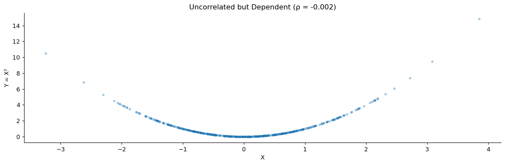
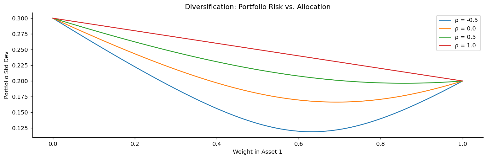

# 분산과 공분산

기댓값은 분포의 중심을 알려 주지만 그것뿐이다. 언제나 정확히 3.5가 나오는 가짜 주사위와 공정한 주사위는 기댓값이 같다. 빠진 것은 **퍼짐**이다.

**분산**이 그 두 번째 요약값이다. 값들이 중심에서 얼마나 흩어져 있는가를 잰다. 그리고 확률변수가 둘이 되면 새로운 물음이 생긴다. 두 변수가 **함께** 움직이는가? 이것을 재는 것이 **공분산**이며, 정규화하면 **상관계수**가 된다.

이 절은 세 개의 정리로 이루어진다. 분산의 정의와 성질(정리 1), 공분산과 상관(정리 2), 그리고 합의 분산이 왜 단순한 덧셈이 아닌지(정리 3)이다.

## 1. 중심에서 얼마나 흩어져 있는가

퍼짐을 재려면 평균에서 떨어진 거리를 평균 내면 될 것 같다. 그런데 편차 $X - \mu$의 평균은 언제나 0이다(선형성을 쓰면 바로 나온다). 부호가 상쇄되기 때문이다. 그래서 **제곱**한다.

<div class="thmbox" markdown>

### 정리 1. 분산 — 평균에서의 기대 제곱편차 { .thm }

확률변수 $X$의 **분산**은

$$
\text{Var}(X) = E\big[(X - \mu)^2\big] = E[X^2] - (E[X])^2
$$

이며($\mu = E[X]$), 그 제곱근을 **표준편차**라 한다.

$$
\sigma_X = \sqrt{\text{Var}(X)}
$$

</div>

두 번째 형태 $E[X^2] - (E[X])^2$이 계산에는 대개 더 편하다. 앞 절의 LOTUS를 $g(x) = x^2$에 적용하면 $E[X^2]$을 곧바로 얻을 수 있기 때문이다.

주요 성질은 다음과 같다.

| 성질 | 식 | 비고 |
|:---|:---|:---|
| 비음성 | $\text{Var}(X) \ge 0$ | $X$가 상수일 때만 0 |
| 상수 | $\text{Var}(c) = 0$ | |
| 척도 | $\text{Var}(aX) = a^2\,\text{Var}(X)$ | **$a$가 아니라 $a^2$** |
| 평행이동 불변 | $\text{Var}(X + c) = \text{Var}(X)$ | 퍼짐은 위치와 무관 |

척도 성질에서 제곱이 붙는 것이 기댓값과의 결정적 차이다. 기댓값은 선형이지만 **분산은 선형이 아니다**. 그래서 표준편차를 함께 쓴다. $\text{SD}(aX) = |a|\,\text{SD}(X)$로 원래 단위와 눈금이 맞는다.

<div class="exbox" markdown>

### 보기 1. 공정한 주사위 { .ex }

$$
E[X] = 3.5, \qquad E[X^2] = \frac{1^2 + 2^2 + \cdots + 6^2}{6} = \frac{91}{6}
$$

$$
\text{Var}(X) = \frac{91}{6} - 3.5^2 = \frac{35}{12} \approx 2.917
$$

</div>

<div class="exbox" markdown>

### 보기 2. 베르누이 { .ex }

$X \sim \text{Bernoulli}(p)$이면 $X^2 = X$이므로 $E[X^2] = E[X] = p$이고

$$
\text{Var}(X) = p - p^2 = p(1-p)
$$

이다. $p = 0.5$에서 최대(가장 불확실)이고 $p = 0$이나 $1$에서 0(확실)이다. 직관과 정확히 맞는다.

</div>

```python
import numpy as np

# 공정한 주사위의 분산
values = np.arange(1, 7)          # 나올 수 있는 값 1~6
probs = np.ones(6) / 6            # 각각 확률 1/6

# 기댓값은 "값 x 확률"의 합이다
E_X = np.sum(values * probs)

# E[X^2]은 값을 제곱해서 같은 확률로 가중합한 것.
# 주의: E[X^2] 와 (E[X])^2 은 다르다. 그 차이가 곧 분산이다.
E_X2 = np.sum(values**2 * probs)

# 계산에 편한 공식: Var(X) = E[X^2] - (E[X])^2
# 정의식 E[(X - mu)^2] 를 전개하면 이 형태가 나온다.
var_X = E_X2 - E_X**2
print(f"E[X] = {E_X:.4f}")
print(f"E[X²] = {E_X2:.4f}")
print(f"Var(X) = {var_X:.4f}")
print(f"SD(X) = {np.sqrt(var_X):.4f}")
```

출력:

```
E[X] = 3.5000
E[X²] = 15.1667
Var(X) = 2.9167
SD(X) = 1.7078
```

## 2. 두 변수가 함께 움직이는 정도

분산은 $X$가 자기 평균에서 벗어나는 정도였다. 두 변수를 함께 보면 자연스러운 확장이 나온다. $X$가 평균 위에 있을 때 $Y$도 평균 위에 있는 경향이 있는가?

<div class="thmbox" markdown>

### 정리 2. 공분산과 상관 — 곱 규칙이 깨지는 정도 { .thm }

$X$와 $Y$의 **공분산**은

$$
\text{Cov}(X, Y) = E\big[(X - \mu_X)(Y - \mu_Y)\big] = E[XY] - E[X]\,E[Y]
$$

이고, 이를 정규화한 **피어슨 상관계수**는

$$
\rho(X, Y) = \frac{\text{Cov}(X,Y)}{\sigma_X\,\sigma_Y} \in [-1, 1]
$$

이다.

</div>

두 번째 형태 $E[XY] - E[X]E[Y]$를 눈여겨보라. 앞 절에서 곱 규칙 $E[XY] = E[X]E[Y]$가 **독립일 때만** 성립한다고 했다. **공분산은 정확히 그 등식이 깨지는 정도다.**

| 값 | 뜻 |
|:---|:---|
| $\text{Cov} > 0$ | 같은 방향으로 움직이는 경향 |
| $\text{Cov} < 0$ | 반대 방향으로 움직이는 경향 |
| $\text{Cov} = 0$ | **선형** 관계가 없음 |

성질은 다음과 같다. $\text{Cov}(X,X) = \text{Var}(X)$(자기 자신과의 공분산이 분산), $\text{Cov}(X,Y) = \text{Cov}(Y,X)$(대칭), $\text{Cov}(aX+b,\, cY+d) = ac\,\text{Cov}(X,Y)$(쌍선형), 그리고 **$X \perp\!\!\!\perp Y$이면 $\text{Cov}(X,Y) = 0$**이다.

!!! warning "무상관은 독립이 아니다"
    마지막 성질의 **역은 거짓이다.** 공분산이 0이어도 독립이 아닐 수 있다.

    반례가 간단하다. $X \sim N(0,1)$이고 $Y = X^2$이라 하자. $Y$는 $X$에 완전히 결정되므로 이보다 더 종속일 수 없다. 그런데

    $$
    \text{Cov}(X, Y) = E[X^3] - E[X]E[X^2] = 0 - 0 = 0
    $$

    이다. 표준정규분포가 대칭이라 홀수 적률이 0이기 때문이다.

    이유는 공분산이 **선형** 관계만 잡아내기 때문이다. $Y = X^2$의 관계는 포물선이고, 포물선에는 선형 성분이 없다. 산점도를 그리면 관계가 뚜렷이 보이는데도 $\rho = 0$이 나온다.

    12장의 상관과 인과에서 이 함정을 다시 다룬다. **상관계수가 0이라고 "관계가 없다"고 말해서는 안 된다.** 반드시 그림을 그려 보아야 한다.

```python
import numpy as np
import matplotlib.pyplot as plt

def demonstrate_correlation():
    """무상관이 독립을 뜻하지 않는다는 것을 보인다."""
    np.random.seed(42)
    n = 10_000

    X = np.random.randn(n)      # 0을 중심으로 대칭인 표준정규
    Y = X ** 2                  # X만 알면 Y가 완전히 결정된다. 극단적인 종속이다.

    # 그런데 공분산은 0이 나온다. 이유는 대칭성에 있다.
    #   Cov(X, X^2) = E[X^3] - E[X]E[X^2] = 0 - 0*1 = 0
    # X가 0을 중심으로 대칭이면 E[X^3] = 0 이기 때문이다.
    # 양의 X가 만드는 기여와 음의 X가 만드는 기여가 정확히 상쇄된다.
    cov_XY = np.cov(X, Y)[0, 1]
    corr_XY = np.corrcoef(X, Y)[0, 1]

    print(f"Cov(X, X²) = {cov_XY:.4f} (theoretically 0)")
    print(f"Corr(X, X²) = {corr_XY:.4f}")
    print(f"Yet X and X² are clearly dependent!")

    fig, ax = plt.subplots(figsize=(12, 4))
    ax.scatter(X[:500], Y[:500], alpha=0.3, s=10)
    ax.set_xlabel('X')
    ax.set_ylabel('Y = X²')
    ax.set_title(f'Uncorrelated but Dependent (ρ = {corr_XY:.3f})')
    ax.spines[['top', 'right']].set_visible(False)
    plt.tight_layout()
    plt.show()

demonstrate_correlation()
```

출력:

```
Cov(X, X²) = -0.0023 (theoretically 0)
Corr(X, X²) = -0.0016
Yet X and X² are clearly dependent!
```



## 3. 합의 분산에는 교차항이 붙는다

기댓값에서는 $E[X+Y] = E[X] + E[Y]$가 언제나 성립했다. 분산은 그렇지 않다. 여기서 공분산이 반드시 등장한다.

<div class="thmbox" markdown>

### 정리 3. 합의 분산 — 분산의 합에 공분산 두 배를 더한다 { .thm }

임의의 확률변수 $X_1, \ldots, X_n$에 대해

$$
\text{Var}\!\left(\sum_{i=1}^n X_i\right) = \sum_{i=1}^n \text{Var}(X_i) + 2\sum_{i<j} \text{Cov}(X_i, X_j)
$$

이다. 두 변수인 경우는

$$
\text{Var}(X + Y) = \text{Var}(X) + \text{Var}(Y) + 2\,\text{Cov}(X, Y)
$$

이며, 모든 쌍이 **무상관이면** 교차항이 사라져

$$
\text{Var}\!\left(\sum_{i=1}^n X_i\right) = \sum_{i=1}^n \text{Var}(X_i)
$$

가 된다.

</div>

여기서 조건이 독립이 아니라 **무상관**이라는 점이 중요하다. 분산의 가법성에는 독립까지 필요하지 않다. 공분산만 0이면 된다.

이 식이 5장의 표준오차 $\sigma/\sqrt{n}$을 낳는다. 독립인 관측 $n$개의 합은 분산이 $n\sigma^2$이므로 평균의 분산은 $\sigma^2/n$이고, 제곱근을 취하면 $\sigma/\sqrt{n}$이다. **자료를 4배 모아야 정밀도가 2배가 되는** 그 관계가 여기서 나온다.

<div class="exbox" markdown>

### 보기 3. 포트폴리오 분산 { .ex }

수익률 $R_1, R_2$인 두 자산에 가중치 $w_1, w_2$($w_1 + w_2 = 1$)로 투자하면

$$
\text{Var}(R_p) = w_1^2\sigma_1^2 + w_2^2\sigma_2^2 + 2w_1 w_2 \,\text{Cov}(R_1, R_2)
$$

이다. $\rho < 1$이면 교차항이 충분히 작아 포트폴리오의 분산이 개별 분산의 가중평균보다 **낮아진다**. 이것이 분산투자의 수학적 근거이며, 상관이 낮은 자산을 섞을수록 효과가 크다.

</div>

```python
import numpy as np
import matplotlib.pyplot as plt

def portfolio_variance_demo():
    """분산투자의 이득이 상관계수에 어떻게 달려 있는지 보인다."""
    sigma1, sigma2 = 0.20, 0.30      # 두 자산의 변동성 20%, 30%
    correlations = [-0.5, 0.0, 0.5, 1.0]

    fig, ax = plt.subplots(figsize=(12, 4))
    weights = np.linspace(0, 1, 100)     # 자산1의 비중을 0에서 1까지

    for rho in correlations:
        # 공분산 = 상관계수 x 두 표준편차
        cov_12 = rho * sigma1 * sigma2

        # 포트폴리오 분산: Var(aX + bY) = a^2 Var(X) + b^2 Var(Y) + 2ab Cov(X,Y)
        # 마지막 교차항이 분산투자의 정체다. rho가 작을수록 이 항이 작아지고,
        # 음수이면 아예 위험을 깎아 낸다.
        port_var = (weights**2 * sigma1**2
                    + (1 - weights)**2 * sigma2**2
                    + 2 * weights * (1 - weights) * cov_12)
        port_sd = np.sqrt(port_var)

        # rho = 1 이면 곡선이 직선이 된다. 완전상관이면 섞어도 위험이 줄지 않는다.
        ax.plot(weights, port_sd, label=f'ρ = {rho}')

    ax.set_xlabel('Weight in Asset 1')
    ax.set_ylabel('Portfolio Std Dev')
    ax.set_title('Diversification: Portfolio Risk vs. Allocation')
    ax.legend()
    ax.spines[['top', 'right']].set_visible(False)
    plt.tight_layout()
    plt.show()

portfolio_variance_demo()
```



$\rho = 1$인 곡선만 직선이고 나머지는 아래로 휘어 있다. 그 휨의 크기가 곧 분산투자의 이득이다.

## 연습문제

<div class="drillbox" markdown>

**연습문제 1.**
확률질량함수가 $P(X = 1, 2, 3, 4) = 0.1, 0.3, 0.4, 0.2$이다. (a) $\mathbb{E}[X]$를 구하라. (b) $\mathbb{E}[X^2]$와 $\mathrm{Var}(X)$를 구하라. (c) $Y = 3X + 5$일 때 $\mathbb{E}[Y]$와 $\mathrm{Var}(Y)$를 구하라.

</div>

??? success "풀이"
    (a) $\mathbb{E}[X] = 1(0.1) + 2(0.3) + 3(0.4) + 4(0.2) = 2.7$.

    (b) $\mathbb{E}[X^2] = 1(0.1) + 4(0.3) + 9(0.4) + 16(0.2) = 8.1$. $\mathrm{Var}(X) = 8.1 - 7.29 = 0.81$.

    (c) $\mathbb{E}[Y] = 3 \cdot 2.7 + 5 = 13.1$. $\mathrm{Var}(Y) = 9 \cdot 0.81 = 7.29$. 상수를 더하는 것은 분산에 영향을 주지 않고, 곱하는 것은 분산을 그 제곱만큼 키운다.

<div class="drillbox" markdown>

**연습문제 2.**
**합의 분산 공식을 증명하라:** $\mathrm{Var}(X + Y) = \mathrm{Var}(X) + \mathrm{Var}(Y) + 2\mathrm{Cov}(X, Y)$.

</div>

??? success "풀이"
    $\mu_X = \mathbb{E}[X]$, $\mu_Y = \mathbb{E}[Y]$라 하자. 그러면 $\mathbb{E}[X + Y] = \mu_X + \mu_Y$이고

    $$
    \mathrm{Var}(X + Y) = \mathbb{E}[(X + Y - \mu_X - \mu_Y)^2] = \mathbb{E}[((X - \mu_X) + (Y - \mu_Y))^2]
    $$

    이다. 제곱을 전개하면

    $$
    = \mathbb{E}[(X - \mu_X)^2] + 2\mathbb{E}[(X - \mu_X)(Y - \mu_Y)] + \mathbb{E}[(Y - \mu_Y)^2]
    $$

    $$
    = \mathrm{Var}(X) + 2\mathrm{Cov}(X, Y) + \mathrm{Var}(Y)
    $$

    이다. $\square$

    **일반화:** $\mathrm{Var}(\sum_i X_i) = \sum_i \mathrm{Var}(X_i) + 2\sum_{i < j} \mathrm{Cov}(X_i, X_j)$. 이 이중합 구조가 금융에서 상관이 포트폴리오 분산에 영향을 주는 이유다. 자산이 $N$개면 분산 항 $N$개에 더해 상관 항이 $N(N-1)/2$개 기여한다.

<div class="drillbox" markdown>

**연습문제 3.**
**무상관 $\ne$ 독립.** $X \sim \mathrm{Uniform}(-1, 1)$이고 $Y = X^2$이라 하자. $\mathrm{Cov}(X, Y) = 0$이지만 $X$와 $Y$가 종속임을 보여라.

</div>

??? success "풀이"
    균등분포가 0에 대해 대칭이므로 $\mathbb{E}[X] = 0$이다. 또한 $\mathbb{E}[X^3] = 0$이다(대칭 정의역 위의 홀함수).

    $\mathrm{Cov}(X, Y) = \mathbb{E}[XY] - \mathbb{E}[X]\mathbb{E}[Y] = \mathbb{E}[X \cdot X^2] - 0 = \mathbb{E}[X^3] = 0$.

    따라서 $X$와 $Y$는 *무상관*이다. 그러나 $X = 0.5$임을 알면 $Y = 0.25$임이 정확히 결정된다. 둘은 *결정론적으로 종속*이다. 상관계수는 선형 연관만 재므로 이차 구조를 놓친다.

    **교훈:** 상관이 0인 것은 독립의 *필요*조건이지 *충분*조건이 아니다. 다변량 정규분포(와 몇몇 특수한 분포)에서는 무상관이 독립을 함의하지만, 이는 예외이지 일반 규칙이 아니다. 언제나 자료를 그려 보고 상관에만 의존하지 마라.

<div class="drillbox" markdown>

**연습문제 4.**
**두 자산의 포트폴리오 분산.** 두 자산이 $\sigma_1 = 0.20$, $\sigma_2 = 0.30$, $\rho = 0.30$이다. 포트폴리오 분산을 최소화하는 가중치 $w_1, w_2$($w_1 + w_2 = 1$, 둘 다 음이 아님)를 구하라.

</div>

??? success "풀이"
    포트폴리오 분산은

    $$
    \sigma_p^2(w_1) = w_1^2 \sigma_1^2 + (1 - w_1)^2 \sigma_2^2 + 2 w_1(1 - w_1)\rho \sigma_1 \sigma_2
    $$

    이다. $w_1$에 대해 미분해 0으로 두면

    $$
    \frac{d\sigma_p^2}{dw_1} = 2 w_1 \sigma_1^2 - 2(1 - w_1)\sigma_2^2 + 2(1 - 2w_1)\rho \sigma_1 \sigma_2 = 0
    $$

    이고, 풀면 $w_1^* = (\sigma_2^2 - \rho\sigma_1\sigma_2)/(\sigma_1^2 + \sigma_2^2 - 2\rho\sigma_1\sigma_2)$이다.

    $\sigma_1 = 0.20$, $\sigma_2 = 0.30$, $\rho = 0.30$을 넣으면

    분자: $0.09 - 0.30 \cdot 0.20 \cdot 0.30 = 0.09 - 0.018 = 0.072$.

    분모: $0.04 + 0.09 - 2 \cdot 0.30 \cdot 0.20 \cdot 0.30 = 0.13 - 0.036 = 0.094$.

    $w_1^* = 0.072/0.094 \approx 0.766$, $w_2^* \approx 0.234$이다.

    예상대로 최소분산 포트폴리오는 변동성이 낮은 자산에 더 큰 가중치를 둔다. 최소 분산은 $\sigma_p^2 = 0.766^2 \cdot 0.04 + 0.234^2 \cdot 0.09 + 2 \cdot 0.766 \cdot 0.234 \cdot 0.018 \approx 0.0354$로, 어느 개별 자산의 분산보다도 작다.

<div class="drillbox" markdown>

**연습문제 5.**
**공분산행렬.** $X \sim N(0, 1)$이고 $Z \sim N(0, \sigma_Z^2)$이 $X$와 독립일 때 $Y = aX + Z$인 $(X, Y)$의 $2 \times 2$ 공분산행렬을 계산하라. $\rho(X, Y)$는 얼마인가?

</div>

??? success "풀이"
    주변분산:

    $\mathrm{Var}(X) = 1$, $\mathrm{Var}(Y) = a^2 \cdot 1 + \sigma_Z^2 = a^2 + \sigma_Z^2$.

    공분산:

    $\mathrm{Cov}(X, Y) = \mathrm{Cov}(X, aX + Z) = a \mathrm{Var}(X) + \mathrm{Cov}(X, Z) = a + 0 = a$.

    공분산행렬:

    $$
    \boldsymbol{\Sigma} = \begin{pmatrix} 1 & a \\ a & a^2 + \sigma_Z^2 \end{pmatrix}
    $$

    상관:

    $$
    \rho(X, Y) = \frac{a}{\sqrt{1 \cdot (a^2 + \sigma_Z^2)}} = \frac{a}{\sqrt{a^2 + \sigma_Z^2}}
    $$

    특수한 경우:

    - $\sigma_Z = 0$: $\rho = a/|a| = \pm 1$. $Y$가 $X$의 결정론적 함수다.
    - $\sigma_Z \to \infty$: $\rho \to 0$. 잡음이 지배하여 $X$와 $Y$가 사실상 독립이 된다.

    이 분해 $Y = aX + Z$가 선형회귀의 바탕이다. 계수 $a$가 회귀 기울기이고, 상관 $\rho$는 $Y$의 변동 중 얼마를 $X$가 설명하는지를 잰다.

<div class="drillbox" markdown>

**연습문제 6.**
**표본에서의 분산 추정.** i.i.d. 표본 $X_1, \ldots, X_n$에 대해 **표본공분산** $\hat{\mathrm{Cov}}(X, Y) = \frac{1}{n-1}\sum_i (X_i - \bar X)(Y_i - \bar Y)$이 $\mathrm{Cov}(X, Y)$의 불편추정량임을 보여라.

</div>

??? success "풀이"
    전개하면 $\sum_i (X_i - \bar X)(Y_i - \bar Y) = \sum_i X_i Y_i - n \bar X \bar Y$이다.

    기댓값을 취하면

    $\mathbb{E}\sum X_i Y_i = n(\mathrm{Cov}(X, Y) + \mu_X \mu_Y)$이다(각 항이 $\mathbb{E}[X_i Y_i] = \mathrm{Cov}(X, Y) + \mu_X \mu_Y$를 기여한다).

    $\mathbb{E}[n \bar X \bar Y]$의 경우, 관측값 사이의 독립성을 이용하면

    $$
    \mathbb{E}[\bar X \bar Y] = \frac{1}{n^2}\sum_{i, j} \mathbb{E}[X_i Y_j] = \frac{1}{n^2}\left[n(\mathrm{Cov}(X, Y) + \mu_X \mu_Y) + n(n - 1)\mu_X \mu_Y\right]
    $$

    $= (\mathrm{Cov}(X, Y) + \mu_X \mu_Y)/n + (n - 1)\mu_X \mu_Y / n = \mathrm{Cov}(X, Y)/n + \mu_X \mu_Y$이다.

    따라서 $\mathbb{E}[n \bar X \bar Y] = \mathrm{Cov}(X, Y) + n\mu_X \mu_Y$이다.

    빼면 $\mathbb{E}[\sum_i (X_i - \bar X)(Y_i - \bar Y)] = n(\mathrm{Cov}(X, Y) + \mu_X \mu_Y) - \mathrm{Cov}(X, Y) - n\mu_X \mu_Y = (n - 1)\mathrm{Cov}(X, Y)$이다.

    $n - 1$로 나누면 $\mathbb{E}[\hat{\mathrm{Cov}}] = \mathrm{Cov}(X, Y)$이다. $\square$

    분모 $n - 1$은 공분산에 대한 **베셀 보정**이며 표본분산의 보정과 동일하다. 자료에서 $\mu_X$와 $\mu_Y$를 추정하면서 자유도 하나를 "써버리기" 때문이다.

<div class="drillbox" markdown>

**연습문제 7.**
아무 대칭행렬이나 공분산행렬이 될 수는 없다. **$\Sigma$가 반드시 양반정치여야 함**을 보이고, 그 제약이 상관계수들 사이에 어떤 관계를 강요하는지 밝혀라.

</div>

??? success "풀이"
    $\mathbf{a}\in\mathbb{R}^p$에 대해 선형결합 $\mathbf{a}^\top\mathbf{X}=\sum_i a_iX_i$의 분산은 연습문제 $2$를 일반화하여

    $$
    \operatorname{Var}(\mathbf{a}^\top\mathbf{X})
    = \sum_i\sum_j a_ia_j\operatorname{Cov}(X_i,X_j)
    = \mathbf{a}^\top\Sigma\,\mathbf{a}
    $$

    이다. **분산은 음수가 될 수 없으므로** 모든 $\mathbf{a}$에 대해 $\mathbf{a}^\top\Sigma\mathbf{a}\ge0$, 곧 $\Sigma$는 **양반정치**여야 한다. 동치로 모든 고유값이 음이 아니어야 한다.

    **상관계수에 대한 제약.** $3\times3$ 상관행렬에서 $\rho_{12},\rho_{13}$이 주어지면 $\rho_{23}$은 아무 값이나 될 수 없다. 행렬식이 음이 아니려면

    $$
    \rho_{12}\rho_{13}-\sqrt{(1-\rho_{12}^2)(1-\rho_{13}^2)}
    \;\le\;\rho_{23}\;\le\;
    \rho_{12}\rho_{13}+\sqrt{(1-\rho_{12}^2)(1-\rho_{13}^2)}
    $$

    ```python
    import numpy as np
    np.set_printoptions(precision=4, suppress=True)

    for r12, r13 in [(0.9, 0.9), (0.8, 0.5), (0.5, 0.5)]:
        c = r12 * r13
        h = np.sqrt((1 - r12 ** 2) * (1 - r13 ** 2))
        print(f"  r12={r12}, r13={r13}  ->  r23 는 [{c-h:+.4f}, {c+h:+.4f}] 안에만")

    R = np.array([[1, .9, .9], [.9, 1, -.5], [.9, -.5, 1]])   # 범위 밖
    ev, V = np.linalg.eigh(R)
    a = V[:, 0]
    print(f"\n  고유값 {np.round(ev, 4)}  <- 음수가 있다")
    print(f"  a = {np.round(a, 3)} 일 때 Var(a'X) = {a @ R @ a:.4f}  <- 음의 분산")
    ```

    출력:

    ```
    r12=0.9, r13=0.9  ->  r23 는 [+0.6200, +1.0000] 안에만
      r12=0.8, r13=0.5  ->  r23 는 [-0.1196, +0.9196] 안에만
      r12=0.5, r13=0.5  ->  r23 는 [-0.5000, +1.0000] 안에만

      고유값 [-0.5471  1.5     2.0471]  <- 음수가 있다
      a = [-0.635  0.546  0.546] 일 때 Var(a'X) = -0.5471  <- 음의 분산
    ```

    **$X_1$이 $X_2$와 $X_3$에 각각 $0.9$로 강하게 상관되면 $\rho_{23}$은 최소 $0.62$여야 한다.** "둘 다 나와 가까우면 둘끼리도 가깝다"는 **상관의 삼각부등식**이다.

    $\rho_{23}=-0.5$처럼 무리하게 넣으면 고유값 하나가 $-0.547$이 되고, 그 고유벡터 방향의 선형결합이 **음의 분산**을 갖는다. 그런 확률변수는 존재하지 않는다.

    **실무에서 언제 문제가 되는가.**

    | 상황 | 왜 깨지는가 |
    |---|---|
    | 전문가에게 상관계수를 따로따로 물어 채움 | 일관성을 강요하지 않음 |
    | 쌍별 결측 처리(pairwise deletion) | 쌍마다 다른 표본으로 추정 |
    | 상관행렬을 손으로 수정(스트레스 테스트) | 수정이 범위를 벗어남 |
    | 표본 크기 $n \le p$ | 반드시 특이해짐(연습문제 $9$) |

    **처방.** 고유값분해 후 음수 고유값을 $0$(또는 작은 양수)으로 바꾸고 대각을 $1$로 재정규화하는 **가장 가까운 상관행렬** 사영을 쓴다. 몬테카를로 모의에서 촐레스키 분해가 실패한다면 십중팔구 이 문제다. $\square$

<div class="drillbox" markdown>

**연습문제 8.**
연습문제 $4$의 두 자산을 $n$개로 늘려라. **분산투자로 위험을 얼마나 줄일 수 있으며, 어디서 멈추는가?**

</div>

??? success "풀이"
    $n$개 자산에 균등하게 $1/n$씩 투자하면

    $$
    \operatorname{Var}\!\left(\frac1n\sum_i X_i\right)
    = \frac{1}{n^2}\sum_i\sigma_i^2 + \frac{1}{n^2}\sum_{i\ne j}\sigma_{ij}
    = \frac{\bar{\sigma^2}}{n} + \left(1-\frac1n\right)\bar{\sigma}_{\text{cov}}
    $$

    이다($\bar{\sigma^2}$는 평균분산, $\bar\sigma_{\text{cov}}$는 평균공분산). $n\to\infty$이면

    $$
    \operatorname{Var}\longrightarrow \bar{\sigma}_{\text{cov}}
    $$

    ```python
    import numpy as np

    s2, cbar = 0.04, 0.012            # 평균분산 0.04 (sd 20%), 평균공분산 0.012
    print(f"{'n':>6}{'포트폴리오 분산':>18}{'표준편차':>12}")
    for n in (1, 2, 5, 10, 50, 500):
        v = s2 / n + (1 - 1 / n) * cbar
        print(f"{n:>6}{v:>18.5f}{np.sqrt(v):>12.4f}")
    print(f"{'무한':>6}{cbar:>18.5f}{np.sqrt(cbar):>12.4f}  <- 넘을 수 없는 바닥")
    ```

    출력:

    ```
    n          포트폴리오 분산        표준편차
         1           0.04000      0.2000
         2           0.02600      0.1612
         5           0.01760      0.1327
        10           0.01480      0.1217
        50           0.01256      0.1121
       500           0.01206      0.1098
        무한           0.01200      0.1095  <- 넘을 수 없는 바닥
    ```

    **표준편차가 $20\%$에서 $10.95\%$까지만 내려간다.** $n=50$에서 이미 $11.21\%$로 바닥에 거의 닿았고, $500$개로 늘려도 $10.98\%$다.

    **위험이 두 종류로 갈린다.**

    | 성분 | 크기 | $n\to\infty$ |
    |---|---|---|
    | **분산가능 위험**(고유위험) | $(\bar{\sigma^2}-\bar\sigma_{\text{cov}})/n$ | $\to 0$ |
    | **분산불가능 위험**(체계적 위험) | $\bar\sigma_{\text{cov}}$ | 그대로 남음 |

    $n=50$이면 분산가능 위험의 $98\%$가 제거된다. **더 담아도 의미가 없다** — 이것이 "$30$~$50$종목이면 충분하다"는 실무 규칙의 근거다.

    **핵심은 공분산이지 분산이 아니다.** 항이 $n$개의 분산과 $n(n-1)$개의 공분산으로 이루어지므로, $n$이 커지면 **공분산 항의 개수가 압도적**이다. 개별 자산이 아무리 안전해도 $\bar\sigma_{\text{cov}}>0$이면 바닥을 뚫을 수 없다.

    **$\bar\sigma_{\text{cov}}$를 낮추는 것만이 유일한 길**이며, 그래서 자산배분(주식·채권·원자재)이 종목 선택보다 중요하다고 말한다. 그리고 **위기에는 상관이 함께 올라가서** $\bar\sigma_{\text{cov}}$가 커지므로, 분산투자는 정확히 가장 필요한 순간에 가장 덜 작동한다. $\square$

<div class="drillbox" markdown>

**연습문제 9.**
연습문제 $6$의 표본공분산은 불편추정량이다. 그런데도 **변수의 개수 $p$가 표본 크기 $n$에 가까워지면 표본공분산행렬 전체는 쓸모없어진다.** 왜 그런가?

</div>

??? success "풀이"
    ```python
    import numpy as np

    rng = np.random.default_rng(0)
    print("참 공분산 = 단위행렬 (모든 고유값이 정확히 1이어야 한다)")
    print(f"{'p':>5}{'n':>7}{'p/n':>7}{'최소 고유값':>14}{'최대 고유값':>14}{'조건수':>12}")
    for p, n in [(5, 500), (50, 500), (200, 500), (400, 500), (600, 500)]:
        S = np.cov(rng.normal(size=(n, p)), rowvar=False)
        ev = np.linalg.eigvalsh(S)
        cond = ev[-1] / ev[0] if ev[0] > 1e-12 else float("inf")
        print(f"{p:>5}{n:>7}{p / n:>7.2f}{ev[0]:>14.4f}{ev[-1]:>14.4f}{cond:>12.1f}")

    print("\n마르첸코-파스투르 법칙의 예측 구간  [(1-r)^2, (1+r)^2],  r = sqrt(p/n)")
    for p, n in [(50, 500), (200, 500), (400, 500)]:
        r = np.sqrt(p / n)
        print(f"  p={p:>3}: [{(1 - r) ** 2:.4f}, {(1 + r) ** 2:.4f}]")
    ```

    출력:

    ```
    참 공분산 = 단위행렬 (모든 고유값이 정확히 1이어야 한다)
        p      n    p/n        최소 고유값        최대 고유값         조건수
        5    500   0.01        0.8270        1.1561         1.4
       50    500   0.10        0.4915        1.6853         3.4
      200    500   0.40        0.1531        2.5739        16.8
      400    500   0.80        0.0123        3.5212       286.6
      600    500   1.20       -0.0000        4.2999         inf

    마르첸코-파스투르 법칙의 예측 구간  [(1-r)^2, (1+r)^2],  r = sqrt(p/n)
      p= 50: [0.4675, 1.7325]
      p=200: [0.1351, 2.6649]
      p=400: [0.0111, 3.5889]
    ```

    **원소별로는 멀쩡한데 행렬로는 무너진다.** 각 $\hat\sigma_{ij}$는 여전히 불편추정량이다. 그런데 고유값이 $p/n$이 커질수록 $1$ 주위로 넓게 퍼진다.

    | $p/n$ | 고유값 범위 | 조건수 |
    |---|---|---|
    | $0.01$ | $0.827$–$1.156$ | $1.4$ |
    | $0.40$ | $0.153$–$2.574$ | $16.8$ |
    | $0.80$ | $0.012$–$3.521$ | $286.6$ |
    | $1.20$ | $0$–$4.300$ | $\infty$(특이) |

    **마르첸코–파스투르 법칙이 이 퍼짐을 정확히 예측한다.** $r=\sqrt{p/n}$일 때 고유값이 $[(1-r)^2,(1+r)^2]$에 분포하며, 모의 결과가 이 구간과 거의 정확히 일치한다($p=400$: 예측 $[0.011, 3.589]$ vs 실제 $[0.012, 3.521]$).

    **$p>n$이면 반드시 특이하다.** $\hat\Sigma$의 계수가 최대 $n-1$이기 때문이다. 관측이 $500$개인데 변수가 $600$개면 **$100$개 이상의 방향에서 "분산이 정확히 0"이라고 주장**한다. 물론 거짓이다.

    **왜 치명적인가.** 많은 절차가 $\hat\Sigma$ 자체가 아니라 **$\hat\Sigma^{-1}$**을 쓴다.

    | 절차 | $\Sigma^{-1}$의 역할 |
    |---|---|
    | 마할라노비스 거리 | $\sqrt{(\mathbf{x}-\boldsymbol\mu)^\top\Sigma^{-1}(\mathbf{x}-\boldsymbol\mu)}$ |
    | 최소분산 포트폴리오 | $\mathbf{w}\propto\Sigma^{-1}\mathbf{1}$ |
    | 선형판별분석 | 판별방향 $\Sigma^{-1}(\boldsymbol\mu_1-\boldsymbol\mu_2)$ |
    | 다변량 정규 밀도 | 지수 안의 이차형식 |

    역행렬은 **가장 작은 고유값을 뒤집으므로**, $0.012$짜리 고유값이 $83$배로 증폭된다. 순전히 잡음인 방향이 결과를 지배한다.

    **"불편이면 좋다"는 직관이 다차원에서 깨진다.** 각 원소가 불편이어도 그것들을 모은 행렬의 **함수**(고유값, 역행렬, 행렬식)는 심하게 편향될 수 있다. 처방은 다음 연습문제에서 본다. $\square$

<div class="drillbox" markdown>

**연습문제 10.**
연습문제 $9$의 처방으로 **축소추정**을 검토하라. 편향을 일부러 도입하는 것이 어떻게 도움이 되는가?

</div>

??? success "풀이"
    표본공분산 $S$를 구조가 단순한 목표 $F$ 쪽으로 끌어당긴다.

    $$
    \hat\Sigma_\alpha = (1-\alpha)S + \alpha F,\qquad F=\frac{\operatorname{tr}(S)}{p}I
    $$

    $F$는 **모든 변수가 같은 분산을 갖고 무상관**이라는 극단적으로 단순한 모형이다. 거의 확실히 틀렸지만 **분산이 매우 작다.**

    ```python
    import numpy as np

    rng = np.random.default_rng(1)
    p, n = 100, 150
    beta = rng.uniform(0.5, 1.5, p)                       # 1-요인 구조
    Sigma = np.outer(beta, beta) * 0.04 + np.diag(rng.uniform(0.01, 0.05, p))
    one = np.ones(p)

    def gmv(C):                                           # 최소분산 포트폴리오
        w = np.linalg.solve(C, one)
        return w / w.sum()

    best = 1 / (one @ np.linalg.solve(Sigma, one))         # 참 Sigma 를 알 때의 하한
    X = rng.standard_normal((n, p)) @ np.linalg.cholesky(Sigma).T
    S = np.cov(X, rowvar=False)
    target = np.trace(S) / p * np.eye(p)

    print(f"참 공분산을 알 때 달성 가능한 최소 분산 = {best:.6f}\n")
    print(f"{'축소계수':>10}{'조건수':>12}{'실현 분산':>13}{'하한 대비':>12}")
    for a in (0.0, 0.1, 0.3, 0.5, 0.9):
        w = gmv((1 - a) * S + a * target)
        realized = w @ Sigma @ w
        print(f"{a:>10.1f}{np.linalg.cond((1 - a) * S + a * target):>12.1f}"
              f"{realized:>13.6f}{realized / best:>11.2f}배")
    ```

    출력:

    ```
    참 공분산을 알 때 달성 가능한 최소 분산 = 0.003391

          축소계수         조건수        실현 분산       하한 대비
           0.0      5734.8     0.010957       3.23배
           0.1       509.9     0.004808       1.42배
           0.3       142.2     0.004359       1.29배
           0.5        62.4     0.005170       1.52배
           0.9         7.9     0.019602       5.78배
    ```

    **$\alpha=0$(순수 표본공분산)이 최악에 가깝다.** 하한의 $3.23$배다. 조금만 축소해도($\alpha=0.1$) $1.42$배로 떨어지고, $\alpha=0.3$에서 $1.29$배로 최적이다.

    **U자 곡선이다.**

    | $\alpha$ | 조건수 | 하한 대비 |
    |---|---|---|
    | $0.0$ | $5735$ | $3.23$배 |
    | $0.1$ | $510$ | $1.42$배 |
    | **$0.3$** | $142$ | **$1.29$배** |
    | $0.5$ | $62$ | $1.52$배 |
    | $0.9$ | $8$ | $5.78$배 |

    **양 끝이 모두 나쁘다.** $\alpha=0$은 잡음이 지배하고(분산), $\alpha=0.9$는 참 구조를 지워버린다(편향). 1장에서 본 **편향–분산 절충**이 행렬 수준에서 나타난 것이다.

    **조건수가 $5735$에서 $142$로 떨어지는 것이 핵심이다.** 축소는 모든 고유값을 평균 쪽으로 당기므로, 연습문제 $9$에서 본 **작은 고유값의 과소추정을 직접 교정한다.**

    !!! tip "레도이–울프 축소"
        $\alpha$를 예상 제곱오차 $\mathbb{E}\|\hat\Sigma_\alpha-\Sigma\|_F^2$를 최소화하도록 **자료에서 자동으로 정한다.** `sklearn.covariance.LedoitWolf`가 구현이며, 추가 조율 없이 위 실험의 최적 근처를 찾아 준다.

    **같은 발상이 여러 이름으로 반복된다.**

    | 분야 | 이름 |
    |---|---|
    | 회귀 | 능형회귀($X^\top X+\lambda I$) |
    | 공분산 추정 | 축소, 정칙화 |
    | 베이즈 | 사전분포로 끌어당기기 |
    | 수치해석 | 티호노프 정칙화 |

    **모두 "대각선에 무언가를 더해 역행렬을 안정시킨다"는 하나의 아이디어다.** $\square$


## 정리하며

분산과 공분산은 분포의 두 번째 요약이다.

- **정리 1**은 분산을 평균에서의 기대 제곱편차로 정의했다. 기댓값과 달리 **선형이 아니며**, $\text{Var}(aX) = a^2\text{Var}(X)$의 제곱이 그 표시다.
- **정리 2**는 공분산이 곱 규칙 $E[XY] = E[X]E[Y]$가 깨지는 정도임을 밝혔다. 그리고 그것이 **선형** 관계만 잡아내므로 무상관이 독립을 뜻하지 않는다.
- **정리 3**은 합의 분산에 공분산 두 배가 붙음을 보였다. 무상관이면 사라지고, 그 결과가 5장의 표준오차 $\sigma/\sqrt{n}$이다.

이 절의 결과가 책 뒤쪽에서 쓰이는 곳을 미리 적어 둔다. 표준오차와 신뢰구간(5·8장), 분산투자(포트폴리오), 상관과 인과의 구별(12장), 그리고 회귀의 최소제곱(13장)이 모두 여기서 나온다.

이제 분포를 평균과 분산 두 수로 요약할 수 있게 되었다. 그런데 이 요약은 불완전하다. 평균과 분산이 같은데 모양이 전혀 다른 분포가 얼마든지 있다.

**분포를 완전히 결정하는 하나의 함수**는 없을까? 3.3절의 누적분포함수가 그런 함수이긴 하지만 계산에는 불편하다. 특히 **독립인 변수들의 합**을 다룰 때 그렇다.

다음 절의 **적률생성함수**가 그 자리를 채운다. 분포를 유일하게 결정하고, 미분하면 적률이 줄줄이 나오며, 무엇보다 독립인 변수의 합을 곱셈으로 바꾼다. 중심극한정리의 증명이 이 도구 위에서 이루어진다.
