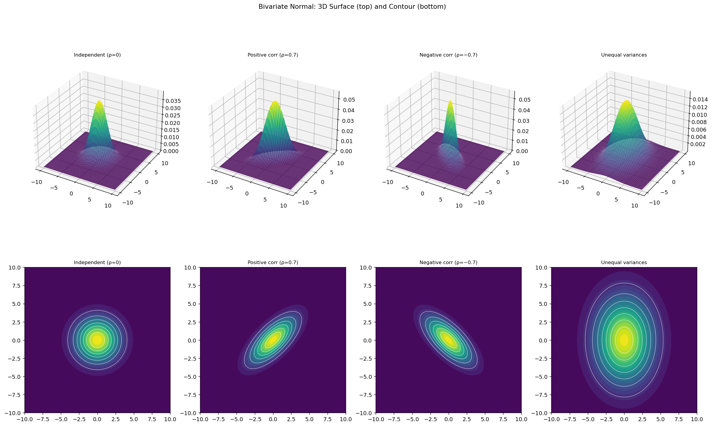

# 이변량 정규분포

## 개요

**이변량 정규분포**는 일변량 정규분포를 2차원으로 확장한 것이다. 확률벡터 $(X_1, X_2)^\top$의 PDF가 다음과 같으면 평균 $\boldsymbol{\mu}$, 공분산행렬 $\boldsymbol{\Sigma}$인 이변량 정규분포를 따른다:

$$
f(\mathbf{x}) = \frac{1}{2\pi|\boldsymbol{\Sigma}|^{1/2}} \exp\!\left(-\frac{1}{2}(\mathbf{x} - \boldsymbol{\mu})^\top \boldsymbol{\Sigma}^{-1}(\mathbf{x} - \boldsymbol{\mu})\right)
$$

밀도 등고선(타원)의 모양은 전적으로 $\boldsymbol{\Sigma}$가 결정한다.

---

## 공분산 구조의 효과

네 가지 설정을 3차원 곡면과 등고선 그림으로 시각화한다:

| 설정 | $\boldsymbol{\Sigma}$ | 상관계수 $\rho$ |
|---|---|---|
| 독립 | $\begin{pmatrix}4&0\\0&4\end{pmatrix}$ | 0 |
| 양의 상관 | $\begin{pmatrix}4&2.8\\2.8&4\end{pmatrix}$ | 0.7 |
| 음의 상관 | $\begin{pmatrix}4&-2.8\\-2.8&4\end{pmatrix}$ | $-0.7$ |
| 분산이 다름 | $\begin{pmatrix}7&0\\0&15\end{pmatrix}$ | 0 |

---

## 코드

<div class="exbox" markdown>

**보기 1.** <span class="diff easy" title="쉬움"></span> 공분산행렬에 따른 이변량 정규분포. 위 표의 네 $\boldsymbol\Sigma$에 대해 3차원 곡면과 등고선을 나란히 그린다.

**(1)** 네 설정의 등고선 타원의 **축 방향**과 95% 타원의 **반길이**를 고윳값으로 구하고, 곡면의 **봉우리 높이**와 타원의 **넓이**를 $\det\boldsymbol\Sigma$의 식으로 적으시오. 두 양의 곱은 무엇인가.

**(2)** (1)을 재어 확인하고, 네 설정 가운데 어느 둘이 같은 곡면의 거울상인지, 또 $\rho = 0$인 두 설정이 왜 전혀 다르게 보이는지 수로 적으시오.

</div>

??? success "풀이"

    **(1) 해석적으로.** 등고선은 $\mathbf{x}^\top\boldsymbol\Sigma^{-1}\mathbf{x} = c$를 만족하는 타원이다($\boldsymbol\mu = \mathbf 0$). $\boldsymbol\Sigma = V\Lambda V^\top$로 대각화하고 $\mathbf y = V^\top\mathbf x$로 좌표를 돌리면

    $$
    \frac{y_1^2}{\lambda_1} + \frac{y_2^2}{\lambda_2} = c
    $$

    가 되므로 **축 방향은 고유벡터**이고 **반길이는 $\sqrt{\lambda_i c}$**다. 95% 타원이면 연습문제 5에서 본 대로 $c = \chi^2_{2,\,0.95} = 5.9915$다.

    네 $\boldsymbol\Sigma$의 고윳값을 구한다. 대각행렬인 1번과 4번은 고윳값이 대각성분 그 자체이고 고유벡터가 좌표축이다. 2번과 3번은 $\begin{pmatrix}4&\pm2.8\\\pm2.8&4\end{pmatrix}$ 꼴이라 특성방정식 $(4-\lambda)^2 = 2.8^2$에서 $\lambda = 4 \pm 2.8$, 곧 $6.8$과 $1.2$다(연습문제 3).

    | 설정 | $\lambda_1, \lambda_2$ | 장축 방향 | 95% 반길이 |
    |---|---|---|---|
    | 독립 | $4,\ 4$ | **정해지지 않는다** | $4.895,\ 4.895$ |
    | 양의 상관 | $6.8,\ 1.2$ | $(1,1)/\sqrt2$ | $6.383,\ 2.681$ |
    | 음의 상관 | $6.8,\ 1.2$ | $(1,-1)/\sqrt2$ | $6.383,\ 2.681$ |
    | 분산이 다름 | $15,\ 7$ | $(0,1)$ | $9.480,\ 6.476$ |

    첫 줄의 "정해지지 않는다"는 결함이 아니다. $\boldsymbol\Sigma = 4I$는 고윳값이 겹쳐 있어 **모든 방향이 고유벡터**다. 등고선이 원이니 장축이 따로 없는 것이 당연하고, 수치 고유분해가 어떤 축을 돌려주든 그것은 알고리즘이 고른 것이지 분포가 고른 것이 아니다.

    **봉우리 높이와 넓이.** 밀도의 최대는 $\mathbf x = \boldsymbol\mu$에서 지수가 $0$이 될 때이므로 앞의 상수가 그대로 남는다.

    $$
    f(\boldsymbol\mu) = \frac{1}{2\pi\lvert\boldsymbol\Sigma\rvert^{1/2}} = \frac{1}{2\pi\sqrt{\det\boldsymbol\Sigma}}
    $$

    타원의 넓이는 반길이의 곱에 $\pi$를 곱한 것이다.

    $$
    \text{넓이} = \pi\sqrt{\lambda_1 c}\sqrt{\lambda_2 c} = \pi c \sqrt{\lambda_1\lambda_2} = \pi c \sqrt{\det\boldsymbol\Sigma}
    $$

    $\det\boldsymbol\Sigma = \lambda_1\lambda_2$를 썼다. 뒤집어 읽으면 **$\det\boldsymbol\Sigma$가 넓이의 제곱에 비례한다.** 행렬식을 "일반화분산"이라 부르는 까닭이고, 2차원에서 그것이 뜻하는 바가 곧 넓이다.

    두 양을 곱하면 $\sqrt{\det\boldsymbol\Sigma}$가 깨끗이 지워진다.

    $$
    f(\boldsymbol\mu) \times \text{넓이}
    = \frac{1}{2\pi\sqrt{\det\boldsymbol\Sigma}} \cdot \pi c \sqrt{\det\boldsymbol\Sigma}
    = \frac{c}{2} = 2.9957
    $$

    **$\boldsymbol\Sigma$에 전혀 의존하지 않는다.** 넓이 $1$을 담은 곡면이라는 제약이 있으니, 넓게 퍼지면 반드시 낮아지고 좁게 모이면 반드시 높아진다. 포아송 쪽에서 봉우리가 $\lambda^{-1/2}$로 낮아진 것과 같은 보존이 2차원에서 이렇게 나타난다.

    **(2) 수치적으로.** 먼저 쪽의 그림을 그린다.

    ```python
    import numpy as np
    import matplotlib.pyplot as plt
    from scipy.stats import multivariate_normal

    plt.rcParams["font.sans-serif"] = ["NanumGothic", "Apple SD Gothic Neo", "Malgun Gothic"]
    plt.rcParams["font.family"] = "sans-serif"
    plt.rcParams["axes.unicode_minus"] = False

    # 공분산행렬 [[var_X, cov], [cov, var_Y]] 를 네 가지로 바꿔 가며 본다.
    # 분산이 4일 때 rho = cov/4 이므로 cov = 2.8 이면 rho = 0.7 이다.
    #   1) 비대각이 0     -> 독립. 등고선이 원이 된다.
    #   2) 비대각이 양수  -> 등고선이 우상향 타원으로 기운다.
    #   3) 비대각이 음수  -> 좌상향으로 기운다.
    #   4) 대각이 서로 다름 -> 기울지는 않지만 세로로 늘어난 타원이 된다.
    # 4번이 중요하다. **타원이 늘어난 것과 기운 것은 다른 이야기다.**
    configs = [
        {"label": "Independent (ρ=0)", "mu": [0, 0], "cov": [[4, 0], [0, 4]]},
        {"label": "Positive corr (ρ=0.7)", "mu": [0, 0], "cov": [[4, 2.8], [2.8, 4]]},
        {"label": "Negative corr (ρ=−0.7)", "mu": [0, 0], "cov": [[4, -2.8], [-2.8, 4]]},
        {"label": "Unequal variances", "mu": [0, 0], "cov": [[7, 0], [0, 15]]},
    ]

    x = np.linspace(-10, 10, 200)
    # meshgrid: 1차원 격자 두 개를 2차원 좌표판으로 펼친다.
    # X[i,j], Y[i,j] 가 (i,j) 칸의 좌표가 된다.
    X, Y = np.meshgrid(x, x)

    fig = plt.figure(figsize=(18, 12))
    for i, cfg in enumerate(configs):
        # dstack으로 (X, Y)를 마지막 축에 쌓아 (200, 200, 2) 모양을 만든다.
        # scipy의 다변량 pdf는 "마지막 축이 좌표"인 배열을 받는다.
        pos = np.dstack((X, Y))
        rv = multivariate_normal(mean=cfg["mu"], cov=cfg["cov"])
        Z = rv.pdf(pos)      # 각 격자점에서의 밀도. (200, 200) 모양

        # 3차원 곡면
        ax = fig.add_subplot(2, 4, i + 1, projection="3d")
        ax.plot_surface(X, Y, Z, cmap="viridis", alpha=0.85, edgecolor="none")
        ax.set_title(cfg["label"], fontsize=9)

        # 등고선
        ax2 = fig.add_subplot(2, 4, i + 5)
        ax2.contourf(X, Y, Z, levels=20, cmap="viridis")
        ax2.contour(X, Y, Z, levels=8, colors="white", linewidths=0.5)
        ax2.set_title(cfg["label"], fontsize=9)
        ax2.set_aspect("equal")

    plt.suptitle("Bivariate Normal: 3D Surface (top) and Contour (bottom)")
    plt.tight_layout()
    plt.show()
    ```

    

    위줄의 곡면은 첫째가 가장 낮고 넓게 퍼졌으며 둘째와 셋째가 더 높고 뾰족하다. 아래줄의 등고선은 첫째가 원, 둘째가 우상향 타원, 셋째가 좌상향 타원, 넷째가 세로로 늘어난 타원이다. 수로 재 본다.

    ```python
    import numpy as np
    from math import pi, sqrt
    from scipy import stats

    c = stats.chi2(2).ppf(0.95)          # 95% 타원의 문턱
    print(f"chi2_2 의 95% 분위수 c = {c:.4f}")
    print(f"{'설정':>12}{'고윳값':>18}{'det':>9}{'sqrt(det)':>11}{'tr':>6}"
          f"{'반길이':>17}{'봉우리':>10}{'95% 넓이':>11}{'봉우리x넓이':>13}")

    configs = [("독립 (rho=0)", [[4, 0], [0, 4]]),
               ("양의 상관", [[4, 2.8], [2.8, 4]]),
               ("음의 상관", [[4, -2.8], [-2.8, 4]]),
               ("분산이 다름", [[7, 0], [0, 15]])]

    rng = np.random.default_rng(0)
    for label, S in configs:
        S = np.array(S, float)
        lam, V = np.linalg.eigh(S)
        lam = lam[::-1]                   # 큰 것부터
        det = np.linalg.det(S)
        semi = np.sqrt(lam * c)
        peak = 1 / (2 * pi * sqrt(det))
        area = pi * c * sqrt(det)
        print(f"{label:>12}{str(np.round(lam, 2)):>18}{det:>9.2f}{sqrt(det):>11.4f}"
              f"{np.trace(S):>6.1f}{str(np.round(semi, 3)):>17}{peak:>10.5f}{area:>11.2f}"
              f"{peak*area:>13.4f}")

    print(f"\n봉우리 x 넓이 = c/2 = {c/2:.4f} 이어야 한다")

    # 95% 타원이 정말 95% 를 담는가. 마할라노비스 거리로 센다.
    for label, S in configs:
        S = np.array(S, float)
        X = rng.multivariate_normal([0, 0], S, size=400_000)
        d2 = np.einsum("ij,jk,ik->i", X, np.linalg.inv(S), X)
        hit = np.mean(d2 <= c)
        print(f"{label:>12}: 95% 타원 안의 비율 {hit:.4f}   SE {sqrt(0.95*0.05/400_000):.4f}"
              f"   z = {(hit-0.95)/sqrt(0.95*0.05/400_000):+.2f}")
    ```

    출력:

    ```
    chi2_2 의 95% 분위수 c = 5.9915
              설정               고윳값      det  sqrt(det)    tr              반길이       봉우리     95% 넓이       봉우리x넓이
      독립 (rho=0)           [4. 4.]    16.00     4.0000   8.0    [4.895 4.895]   0.03979      75.29       2.9957
           양의 상관         [6.8 1.2]     8.16     2.8566   8.0    [6.383 2.681]   0.05572      53.77       2.9957
           음의 상관         [6.8 1.2]     8.16     2.8566   8.0    [6.383 2.681]   0.05572      53.77       2.9957
          분산이 다름         [15.  7.]   105.00    10.2470  22.0    [9.48  6.476]   0.01553     192.88       2.9957

    봉우리 x 넓이 = c/2 = 2.9957 이어야 한다
      독립 (rho=0): 95% 타원 안의 비율 0.9499   SE 0.0003   z = -0.21
           양의 상관: 95% 타원 안의 비율 0.9497   SE 0.0003   z = -0.88
           음의 상관: 95% 타원 안의 비율 0.9505   SE 0.0003   z = +1.49
          분산이 다름: 95% 타원 안의 비율 0.9498   SE 0.0003   z = -0.67
    ```

    (1)의 표가 그대로 나온다. 고윳값 $\{4,4\}$, $\{6.8, 1.2\}$, $\{6.8,1.2\}$, $\{15,7\}$과 반길이 $4.895$, $(6.383, 2.681)$, $(9.480, 6.476)$이 손계산과 일치한다.

    **곱이 상수다.** 마지막 열이 네 설정 모두 $2.9957$이고 $c/2 = 5.9915/2$와 같다. 봉우리 높이는 $0.0155$부터 $0.0557$까지 $3.6$배 차이 나고 넓이는 $53.8$부터 $192.9$까지 $3.6$배 차이 나는데, 둘의 곱은 꼼짝하지 않는다. **퍼짐과 높이는 서로를 정확히 상쇄한다.**

    **거울상인 둘.** 양의 상관과 음의 상관이 고윳값·행렬식·반길이·봉우리·넓이를 **모두 똑같이** 갖는다. 다른 것은 고유벡터의 방향뿐이다. 실제로 $(x_1, x_2) \mapsto (x_1, -x_2)$는 $\rho$의 부호만 바꾸는 변환이고 행렬식을 보존하므로, 두 곡면은 한 곡면을 뒤집어 놓은 것이다. 3차원 그림만 보고 둘을 구별할 수 없고 등고선의 기울기를 보아야 한다.

    **$\rho = 0$인 둘이 왜 다른가.** 첫째와 넷째가 모두 $\rho = 0$인데 넓이가 $75.29$와 $192.88$로 $2.6$배 차이 난다. $\rho$는 **기울기**만 말하고 **크기**는 말하지 않기 때문이다. 넷째는 기울지 않았을 뿐이고 세로로 $9.48$, 가로로 $6.48$까지 늘어나 있다. 코드 주석의 "타원이 늘어난 것과 기운 것은 다른 이야기다"가 이 두 줄의 대비다.

    **대각합과 행렬식이 다른 것을 센다.** 첫째·둘째·셋째의 대각합이 모두 $8.0$으로 같다. 곧 $\text{Var}(X_1) + \text{Var}(X_2)$가 같다는 뜻이다. 그런데 넓이는 $75.29$ 대 $53.77$로 다르다. 상관이 붙으면 총분산은 그대로인데 **타원이 좁아진다.** 분산이 한 방향으로 몰리기 때문이다($6.8$과 $1.2$로 쪼개진다). 대각합은 고윳값의 합, 행렬식은 고윳값의 곱이라 같은 합을 어떻게 쪼개는지에 따라 곱이 달라지고, $\lambda_1 = \lambda_2$일 때 곱이 최대가 된다. **원이 같은 총분산에서 가장 넓은 타원이다.**

    **95% 타원은 정말 95%를 담는다.** 네 설정에서 모의로 잰 포함률이 $0.9497 \sim 0.9505$이고 $z$가 $-0.88$에서 $+1.49$ 사이다. $c = \chi^2_{2,\,0.95}$라는 선택이 $\boldsymbol\Sigma$에 상관없이 작동한다는 것이 확인된다. 연습문제 5에서 본 대로 마할라노비스 거리의 제곱이 $\boldsymbol\Sigma$와 무관하게 $\chi^2_2$를 따르기 때문이다.

---

## 해석

- **$\rho = 0$이고 분산이 같을 때:** 등고선이 원이다. $X_1$과 $X_2$가 독립이며 퍼짐이 동일하다.
- **$\rho > 0$:** 타원이 $X_1 = X_2$ 대각선 방향으로 기운다. 양의 연관성이다.
- **$\rho < 0$:** 타원이 $X_1 = -X_2$ 방향으로 기운다. 음의 연관성이다.
- **분산이 다를 때:** 분산이 큰 축 방향으로 타원이 길쭉해진다.

등고선 타원은 상수 $c$에 대해 $(\mathbf{x} - \boldsymbol{\mu})^\top\boldsymbol{\Sigma}^{-1}(\mathbf{x} - \boldsymbol{\mu}) = c$를 만족한다. 축은 $\boldsymbol{\Sigma}$의 고유벡터 방향과 일치하고, 축의 길이는 $\sqrt{\lambda_i}$(고윳값의 제곱근)에 비례한다.

---

## 연습문제

<div class="drillbox" markdown>

**연습문제 1.** <span class="diff easy" title="쉬움"></span>
$\boldsymbol{\Sigma} = \begin{pmatrix}4&2.8\\2.8&4\end{pmatrix}$인 이변량 정규분포의 상관계수 $\rho$를 계산하라.

</div>

??? success "풀이"
    $$
    \rho = \frac{\text{Cov}(X_1, X_2)}{\sigma_1 \sigma_2} = \frac{2.8}{\sqrt{4}\sqrt{4}} = \frac{2.8}{4} = 0.7
    $$

<div class="drillbox" markdown>

**연습문제 2.** <span class="diff med" title="중간"></span>
이변량 정규분포에서 무상관성이 독립성을 함의함을 보여라.

</div>

??? success "풀이"
    $\rho = 0$이면 공분산행렬이 대각행렬 $\boldsymbol{\Sigma} = \text{diag}(\sigma_1^2, \sigma_2^2)$이다. 그러면:

    $$
    f(x_1, x_2) = \frac{1}{2\pi\sigma_1\sigma_2}\exp\!\left(-\frac{(x_1-\mu_1)^2}{2\sigma_1^2} - \frac{(x_2-\mu_2)^2}{2\sigma_2^2}\right) = f_1(x_1)\cdot f_2(x_2)
    $$

    결합밀도가 주변밀도의 곱으로 인수분해되므로 $X_1$과 $X_2$는 독립이다. $\square$

    **일반적으로는 성립하지 않는다.** [3.4절 독립성과 무상관성의 차이](../../ch03/rv/independence_vs_zero_corr.md)에서 보았듯 무상관인 확률변수가 의존적인 예는 얼마든지 있다. 이변량 정규분포는 그 함의가 되살아나는 특수한 경우이며, 결정적인 것은 $(X_1, X_2)$가 **결합**정규라는 가정이다. 주변분포가 각각 정규인 것만으로는 부족하다는 것을 연습문제 10이 보여 준다.

<div class="drillbox" markdown>

**연습문제 3.** <span class="diff med" title="중간"></span>
$\boldsymbol{\Sigma} = \begin{pmatrix}4&2.8\\2.8&4\end{pmatrix}$의 고윳값과 고유벡터를 계산하고 등고선 타원의 방향을 서술하라.

</div>

??? success "풀이"
    특성방정식은 $(4-\lambda)^2 - 2.8^2 = 0$이다:

    $$
    \lambda^2 - 8\lambda + 16 - 7.84 = 0 \implies \lambda^2 - 8\lambda + 8.16 = 0
    $$

    $$
    \lambda = \frac{8 \pm \sqrt{64 - 32.64}}{2} = \frac{8 \pm 5.6}{2}
    $$

    따라서 $\lambda_1 = 6.8$, $\lambda_2 = 1.2$이다.

    $\lambda_1 = 6.8$에 대한 고유벡터는 $(1, 1)^\top/\sqrt{2}$이다($X_1 = X_2$ 방향).
    $\lambda_2 = 1.2$에 대한 고유벡터는 $(1, -1)^\top/\sqrt{2}$이다($X_1 = -X_2$ 방향).

    타원의 장축은 $(1,1)$ 방향이고 반길이가 $\sqrt{6.8} \approx 2.61$이며, 단축은 $(1,-1)$ 방향이고 반길이가 $\sqrt{1.2} \approx 1.10$이다.

<div class="drillbox" markdown>

**연습문제 4.** <span class="diff med" title="중간"></span>
이변량 정규 $(\boldsymbol{\mu}, \boldsymbol{\Sigma})$에서 $X_1$의 주변분포가 $N(\mu_1, \sigma_1^2)$임을 증명하라.

</div>

??? success "풀이"
    결합밀도에서 $X_2$를 적분해 없앤다. 지수부를 $(x_1, x_2)$의 이차형식으로 쓰고 $x_2$에 대해 완전제곱식을 만든다. $x_2$에 대한 적분은 가우스 적분이므로 상수가 되어 다음이 남는다:

    $$
    f_{X_1}(x_1) = \frac{1}{\sigma_1\sqrt{2\pi}}\exp\!\left(-\frac{(x_1 - \mu_1)^2}{2\sigma_1^2}\right)
    $$

    다른 방법으로, $X_1 = (1, 0)\mathbf{X}$임에 주목하자. 다변량 정규분포의 임의의 선형변환은 정규분포이며 평균이 $(1,0)\boldsymbol{\mu} = \mu_1$, 분산이 $(1,0)\boldsymbol{\Sigma}(1,0)^\top = \sigma_1^2$이다. $\square$

<div class="drillbox" markdown>

**연습문제 5.** <span class="diff med" title="중간"></span>
$(\mathbf{X}-\boldsymbol\mu)^\top\boldsymbol\Sigma^{-1}(\mathbf{X}-\boldsymbol\mu) \sim \chi^2_2$임을 이용해 확률 95%를 담는 등고선 타원을 구하라. 연습문제 3의 $\boldsymbol\Sigma$에 대해 장축과 단축의 반길이를 계산하라. 또 "$1\sigma$ 타원"이 담는 확률이 68%가 아닌 이유를 설명하라.

</div>

??? success "풀이"
    $\boldsymbol\Sigma^{-1/2}(\mathbf{X}-\boldsymbol\mu) = \mathbf{Z} \sim N(\mathbf{0}, I)$로 두면 이차형식이 $Z_1^2 + Z_2^2$이고, 이는 자유도 2인 카이제곱분포를 따른다. 따라서 95% 영역은

    $$
    (\mathbf{x}-\boldsymbol\mu)^\top\boldsymbol\Sigma^{-1}(\mathbf{x}-\boldsymbol\mu) \le \chi^2_{2,\,0.95} = 5.991
    $$

    이다.

    **반길이.** 고유벡터 방향으로 좌표를 잡으면 타원이 $y_1^2/\lambda_1 + y_2^2/\lambda_2 \le c$가 되므로 반길이는 $\sqrt{\lambda_i c}$이다.

    $$
    \text{장축 반길이} = \sqrt{6.8 \times 5.991} = 6.38, \qquad \text{단축 반길이} = \sqrt{1.2 \times 5.991} = 2.68
    $$

    이며 방향은 각각 $(1,1)/\sqrt2$와 $(1,-1)/\sqrt2$이다.

    **왜 68%가 아닌가.** $c = 1$인 타원이 담는 확률은

    $$
    P(\chi^2_2 \le 1) = 1 - e^{-1/2} = 0.393
    $$

    으로 39.3%에 지나지 않는다. 68%는 **일변량**의 수이며, 차원이 늘면 같은 $c$가 담는 확률이 줄어든다. 두 좌표가 모두 $1\sigma$ 안에 들어야 하기 때문이다.

    차원이 높아질수록 이 현상이 심해진다. $d$차원에서 $c=1$ 타원의 확률은 $P(\chi^2_d \le 1)$로, $d=10$이면 $0.0002$에 지나지 않는다. 고차원에서 질량이 중심이 아니라 껍질에 몰린다는 "차원의 저주"의 한 얼굴이다. **다변량에서는 등고선의 확률을 반드시 $\chi^2_d$로 계산해야 한다.**

<div class="drillbox" markdown>

**연습문제 6.** <span class="diff med" title="중간"></span>
$|\boldsymbol\Sigma| = \sigma_1^2\sigma_2^2(1-\rho^2)$임을 확인하고, $\rho \to \pm1$일 때 무슨 일이 일어나는지 설명하라. 밀도함수의 어느 부분이 문제가 되는가?

</div>

??? success "풀이"
    $\boldsymbol\Sigma = \begin{pmatrix}\sigma_1^2 & \rho\sigma_1\sigma_2 \\ \rho\sigma_1\sigma_2 & \sigma_2^2\end{pmatrix}$이므로

    $$
    |\boldsymbol\Sigma| = \sigma_1^2\sigma_2^2 - \rho^2\sigma_1^2\sigma_2^2 = \sigma_1^2\sigma_2^2(1-\rho^2)
    $$

    이다. 연습문제 3의 예에서 $4\times4 - 2.8^2 = 8.16$이고, 고윳값의 곱 $6.8 \times 1.2 = 8.16$과 같다. 행렬식이 고윳값의 곱이라는 사실의 확인이다.

    **$\rho \to \pm1$이면** $|\boldsymbol\Sigma| \to 0$이다. 밀도함수

    $$
    f(\mathbf{x}) = \frac{1}{2\pi|\boldsymbol\Sigma|^{1/2}}\exp\!\left(-\tfrac12(\mathbf{x}-\boldsymbol\mu)^\top\boldsymbol\Sigma^{-1}(\mathbf{x}-\boldsymbol\mu)\right)
    $$

    에서 앞의 상수가 발산하고, $\boldsymbol\Sigma^{-1}$이 아예 존재하지 않게 된다. 기하적으로는 타원이 점점 납작해지다가 $\rho = \pm1$에서 **선분으로 찌그러진다.**

    이때 분포는 사라지는 것이 아니라 2차원 평면의 한 직선 위에 온전히 놓이는 **퇴화분포**가 된다. $\rho = 1$이면 $X_2 - \mu_2 = (\sigma_2/\sigma_1)(X_1-\mu_1)$이 확률 1로 성립한다. 2차원 르베그 측도에 대한 밀도는 없지만 분포 자체는 잘 정의되며, 이런 경우까지 다루려고 다변량 정규분포를 밀도가 아니라 **특성함수**로 정의하는 방식이 널리 쓰인다.

    실무에서는 이것이 수치 문제로 나타난다. 변수들이 거의 완전상관이면($\rho \approx 0.999$) $\boldsymbol\Sigma$가 거의 특이해져 역행렬 계산이 불안정해진다. 회귀에서의 다중공선성이 정확히 같은 문제이며, 능형회귀가 대각선에 작은 값을 더해 이를 완화한다.

<div class="drillbox" markdown>

**연습문제 7.** <span class="diff med" title="중간"></span>
두 자산의 수익률이 이변량 정규분포를 따르고 $\sigma_1 = 0.2$, $\sigma_2 = 0.3$, $\rho = 0.3$이다. 비중 $w$와 $1-w$로 나눈 포트폴리오의 분산을 최소로 하는 $w$를 구하고, 그때의 표준편차를 두 자산 각각과 견주어라.

</div>

??? success "풀이"
    포트폴리오 수익률은 선형결합이므로 다시 정규분포를 따르고, 그 분산은

    $$
    \sigma_p^2(w) = w^2\sigma_1^2 + (1-w)^2\sigma_2^2 + 2w(1-w)\rho\sigma_1\sigma_2
    $$

    이다. $w$로 미분해 0으로 두면

    $$
    w^* = \frac{\sigma_2^2 - \rho\sigma_1\sigma_2}{\sigma_1^2 + \sigma_2^2 - 2\rho\sigma_1\sigma_2}
    $$

    을 얻는다. $\rho\sigma_1\sigma_2 = 0.3(0.2)(0.3) = 0.018$이므로

    $$
    w^* = \frac{0.09 - 0.018}{0.04 + 0.09 - 0.036} = \frac{0.072}{0.094} = 0.766
    $$

    이다. 그때

    $$
    \sigma_p^2 = 0.03485, \qquad \sigma_p = 0.187
    $$

    이다.

    **분산투자의 이득이 여기에 있다.** 두 자산의 표준편차가 각각 0.2와 0.3인데, 섞은 결과가 **둘 중 작은 것보다도 작다**(0.187 < 0.2). 상관이 완전하지 않기 때문이며, 한쪽이 나쁠 때 다른 쪽이 부분적으로 상쇄해 주는 덕분이다.

    $\rho$가 작을수록 이득이 커진다. $\rho = 0$이면 $w^* = 0.692$, $\sigma_p = 0.166$으로 더 좋아지고, $\rho = -1$이면 분산을 0으로 만들 수도 있다. 반대로 $\rho = 1$이면 이득이 전혀 없다. 금융위기 때 자산 간 상관이 함께 1로 치솟아 분산투자가 무너지는 현상이 이 공식의 어두운 면이다.

<div class="drillbox" markdown>

**연습문제 8.** <span class="diff med" title="중간"></span>
$\boldsymbol\Sigma = LL^\top$(촐레스키 분해)일 때 $\mathbf{Z} = L^{-1}(\mathbf{X}-\boldsymbol\mu)$가 표준 이변량 정규분포를 따름을 보이고, 이 사실의 쓸모를 두 가지 들어라.

</div>

??? success "풀이"
    $\mathbf{X}$가 정규벡터이므로 선형변환 $\mathbf{Z}$도 정규벡터다. 평균은 $L^{-1}(\boldsymbol\mu - \boldsymbol\mu) = \mathbf{0}$이고 공분산은

    $$
    \operatorname{Cov}(\mathbf{Z}) = L^{-1}\boldsymbol\Sigma (L^{-1})^\top = L^{-1}LL^\top(L^\top)^{-1} = I
    $$

    이다. 따라서 $\mathbf{Z} \sim N(\mathbf{0}, I)$이고 성분이 독립인 표준정규확률변수다. $\square$

    **쓸모 1 — 난수 생성.** 거꾸로 읽으면 $\mathbf{X} = \boldsymbol\mu + L\mathbf{Z}$이므로, 독립인 표준정규 난수 둘만 있으면 원하는 공분산의 정규벡터를 만들 수 있다. `np.linalg.cholesky(Sigma)` 한 줄이면 된다.

    **쓸모 2 — 마할라노비스 거리의 계산.** 이차형식이

    $$
    (\mathbf{x}-\boldsymbol\mu)^\top\boldsymbol\Sigma^{-1}(\mathbf{x}-\boldsymbol\mu) = \|L^{-1}(\mathbf{x}-\boldsymbol\mu)\|^2
    $$

    가 되므로, $\boldsymbol\Sigma$의 역행렬을 직접 구하지 않고 삼각행렬에 대한 전진대입만으로 계산할 수 있다. 빠르고 수치적으로 훨씬 안정적이다. 다변량 정규 로그밀도를 계산하는 라이브러리가 모두 이 방식을 쓰며, $\ln|\boldsymbol\Sigma| = 2\sum_i \ln L_{ii}$도 공짜로 얻는다.

<div class="drillbox" markdown>

**연습문제 9.** <span class="diff hard" title="어려움"></span>
$\boldsymbol\Sigma^{-1}$을 직접 계산해 이변량 정규밀도를 $\rho$로 명시적으로 쓰고, 지수 안의 식이 $\rho = 0$과 $\rho \ne 0$에서 어떻게 달라지는지 설명하라.

</div>

??? success "풀이"
    $2\times2$ 역행렬 공식에서

    $$
    \boldsymbol\Sigma^{-1} = \frac{1}{\sigma_1^2\sigma_2^2(1-\rho^2)}\begin{pmatrix}\sigma_2^2 & -\rho\sigma_1\sigma_2 \\ -\rho\sigma_1\sigma_2 & \sigma_1^2\end{pmatrix}
    $$

    이다. $z_i = (x_i-\mu_i)/\sigma_i$로 표준화하면 이차형식이

    $$
    (\mathbf{x}-\boldsymbol\mu)^\top\boldsymbol\Sigma^{-1}(\mathbf{x}-\boldsymbol\mu) = \frac{z_1^2 - 2\rho z_1 z_2 + z_2^2}{1-\rho^2}
    $$

    로 정리된다. 따라서

    $$
    f(x_1,x_2) = \frac{1}{2\pi\sigma_1\sigma_2\sqrt{1-\rho^2}}\exp\!\left\{-\frac{z_1^2 - 2\rho z_1z_2 + z_2^2}{2(1-\rho^2)}\right\}
    $$

    이다.

    **$\rho = 0$이면** 지수가 $-(z_1^2+z_2^2)/2$가 되어 두 인수로 깔끔히 쪼개진다. 이것이 연습문제 2의 독립성이다.

    **$\rho \ne 0$이면** 교차항 $-2\rho z_1z_2$가 살아남는다. 이 항 때문에 지수가 곱으로 분해되지 않고, 바로 그것이 의존성의 정체다. $\rho > 0$이면 $z_1$과 $z_2$가 같은 부호일 때 교차항이 지수를 덜 음수로 만들어(즉 밀도를 높여) 타원을 $45^\circ$ 방향으로 기울인다.

    분모의 $1-\rho^2$도 눈여겨볼 만하다. $|\rho|$가 커지면 이 값이 작아져 지수 전체가 커지므로, 직선에서 조금만 벗어나도 밀도가 급격히 떨어진다. 타원이 납작해지는 것이 이 분모의 작용이다.

    완전제곱으로 다시 묶으면

    $$
    z_1^2 - 2\rho z_1z_2 + z_2^2 = (1-\rho^2)z_1^2 + (z_2 - \rho z_1)^2
    $$

    이 되는데, 이 형태가 다음 절에서 볼 조건부분포 $X_2 \mid X_1$의 평균 $\rho z_1$과 분산 $1-\rho^2$를 그대로 드러낸다.

<div class="drillbox" markdown>

**연습문제 10.** <span class="diff med" title="중간"></span>
$X \sim N(0,1)$이고 $S$가 $X$와 독립이며 $\pm1$을 확률 $1/2$씩 취할 때 $Y = SX$를 생각하자. $Y$의 주변분포를 구하고, $(X, Y)$가 이변량 정규분포가 **아님**을 보여라.

</div>

??? success "풀이"
    **$Y$의 주변분포.** 전체확률로 조건을 나누면

    $$
    P(Y \le y) = \tfrac12 P(X \le y) + \tfrac12 P(-X \le y) = \tfrac12\Phi(y) + \tfrac12\Phi(y)= \Phi(y)
    $$

    이다($-X$도 $N(0,1)$이므로). 따라서 $Y \sim N(0,1)$이다.

    **이변량 정규가 아닌 이유.** 두 가지로 보일 수 있다.

    첫째, $|Y| = |X|$가 확률 1로 성립한다. 즉 $(X,Y)$의 질량이 전부 두 직선 $y = x$와 $y = -x$ 위에 놓인다. 이변량 정규분포는 밀도가 평면 전체에서 양수이거나(비퇴화) 한 직선 위에 놓이거나(퇴화) 둘 중 하나이지, 두 직선에 걸칠 수 없다.

    둘째, 무상관인데 독립이 아니다.

    $$
    \operatorname{Cov}(X,Y) = E[SX^2] = E[S]E[X^2] = 0 \times 1 = 0
    $$

    인데, $|Y| = |X|$이므로 $X$를 알면 $Y$의 절댓값을 완전히 알 수 있어 독립이 아니다. 연습문제 2에 따라 이변량 정규였다면 무상관이 곧 독립이어야 하므로 모순이다.

    **교훈.** **주변분포가 둘 다 정규라고 해서 결합분포가 이변량 정규인 것은 아니다.** 이 함정은 실무에서도 흔하다. 각 변수의 히스토그램이나 Q-Q 그림이 정규적으로 보인다고 다변량 정규성을 결론지을 수 없으며, 산점도를 보거나 마할라노비스 거리의 $\chi^2$ 적합을 확인해야 한다. 실제로 두 변수의 주변분포는 정규인데 의존구조가 전혀 다른 결합분포를 코퓰라로 얼마든지 만들 수 있다.

---

## 정리하며

이변량 정규분포는 평균벡터 $\boldsymbol\mu$ 와 공분산행렬 $\boldsymbol\Sigma$ 로 완전히 결정된다.

- **모양은 전적으로 $\boldsymbol\Sigma$ 가 정한다.** 등밀도 등고선이 타원이고, $\rho=0$ 이면 축에 나란한 타원(원), $\rho\ne0$ 이면 기울어진 타원이다. $|\rho|$ 가 1 에 가까울수록 타원이 납작해진다.
- **지수 안의 $(\mathbf{x}-\boldsymbol\mu)^\top\boldsymbol\Sigma^{-1}(\mathbf{x}-\boldsymbol\mu)$ 가 마할라노비스 거리의 제곱**이다. 상관을 고려한 거리이며, 이 값이 일정한 곳이 곧 등고선이다.
- **결합정규이면 무상관이 곧 독립이다.** $\rho=0$ 이면 밀도가 두 일변량 밀도의 곱으로 쪼개진다. 일반 분포에서는 성립하지 않는 특별한 성질이며([3.4절 독립성과 무상관성의 차이](../../ch03/rv/independence_vs_zero_corr.md)), 주변분포가 각각 정규인 것만으로는 부족하고 **결합**정규여야 한다.
- **$\boldsymbol\Sigma$ 는 양정치여야 한다.** 그렇지 않으면 역행렬도 밀도도 존재하지 않으며, 상관계수를 임의로 정할 수 없는 이유가 그것이다.

이어지는 두 절이 이 분포를 두 방향에서 해부한다. **조건부분포**는 한 변수를 고정했을 때 남는 분포를 보고, **고유분해**는 타원의 축을 직접 찾는다.

다음 절 **2차원 정규분포 조건부분포**부터 시작한다. 회귀직선이 어디서 나오는지가 거기서 드러난다.
