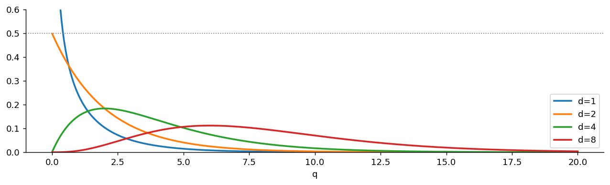
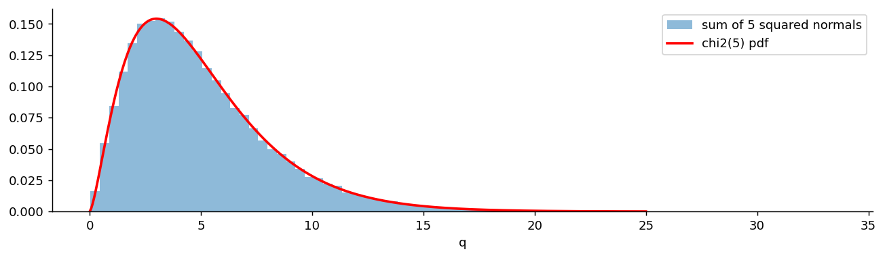
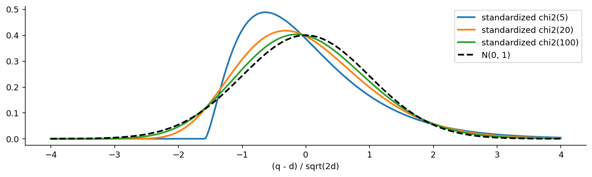

# 카이제곱분포

## 개요

**카이제곱분포**는 독립인 표준정규확률변수를 제곱해서 더한 것의 분포다. 새로운 가정에서 출발해 만든 분포가 아니라, **이미 가진 정규분포를 제곱해 더하기만 해서** 얻어진다는 점이 중요하다.

4.2절의 연속분포 사슬에서 이 페이지는 세 번째 고리다.

$$
\text{Exp}(\lambda) \;\longrightarrow\; N(\mu, \sigma^2) \;\longrightarrow\; \chi^2_d \;\longrightarrow\; t_d \;\longrightarrow\; F_{d_1, d_2}
$$

여기서부터 남은 세 분포는 모두 정규분포에서 만들어진다. 카이제곱분포는 정규확률변수의 **제곱합**, $t$ 분포는 정규를 카이제곱으로 **나눈 것**, $F$ 분포는 카이제곱 **둘의 비**다. 세 분포가 통계적 추론의 기본 도구가 되는 이유는 분산·표준편차·분산비라는 양이 모두 이런 꼴을 하고 있기 때문이다.

이 페이지에서는 자유도를 $d$로 쓴다.

---

## 정의

<div class="defn" markdown>

### 정의 1. 카이제곱분포 { .dfn }

$Z_1, \ldots, Z_d$가 독립인 표준정규확률변수이면, 그 제곱합

$$
Q = Z_1^2 + Z_2^2 + \cdots + Z_d^2
$$

의 분포를 **자유도 $d$인 카이제곱분포**라 하고 $Q \sim \chi^2_d$로 쓴다.

</div>

정의가 "제곱합"이므로 $Q \ge 0$이고, 자유도 $d$는 **더한 제곱의 개수**다. 자유도라는 이름이 붙은 까닭은 추론에서 이 개수가 "자유롭게 움직일 수 있는 좌표의 수"로 나타나기 때문인데, 그 이야기는 5장에서 한다. 이 장에서는 그저 몇 개를 더했는지를 세는 수로 보면 된다.

### 기하학적으로 보기

$(Z_1, \ldots, Z_d)$는 $d$차원 공간에 찍힌 표준정규 점이고, $Q$는 그 점과 원점 사이 **거리의 제곱**이다. 표준정규 점의 분포는 회전에 대해 불변이므로($\|Z\|$의 분포는 좌표축을 어떻게 잡든 같다) 카이제곱분포는 **"원점에서 얼마나 멀리 떨어졌는가"만 남긴 분포**다. 방향 정보를 버리고 거리만 남긴 것이 카이제곱분포라고 보면 된다.

---

## 자유도 1인 경우

먼저 제곱 하나짜리를 직접 계산한다. 나머지는 여기에 더하기만 하면 된다.

<div class="defn" markdown>

### 정리 1. $Z^2$의 밀도 { .dfn }

$Z \sim N(0, 1)$이면 $Q = Z^2$의 밀도는

$$
f_Q(q) = \frac{1}{\sqrt{2\pi q}}\, e^{-q/2}, \qquad q > 0
$$

</div>

??? proof "증명"

    CDF부터 구한다. $q > 0$에 대해

    $$
    F_Q(q) = P(Z^2 \le q) = P(-\sqrt q \le Z \le \sqrt q) = 2\Phi(\sqrt q) - 1
    $$

    이다. 마지막 등호는 표준정규의 대칭성 $\Phi(-x) = 1 - \Phi(x)$를 쓴 것이다. 양변을 $q$에 대해 미분하면 연쇄법칙에 의해

    $$
    f_Q(q) = 2\,\varphi(\sqrt q)\cdot\frac{1}{2\sqrt q} = \frac{\varphi(\sqrt q)}{\sqrt q} = \frac{1}{\sqrt{2\pi q}}\,e^{-q/2}
    $$

    이다. $\square$

    $q \to 0^+$에서 밀도가 발산한다는 점에 주의하라. 적분값은 유한하지만($\int_0^1 q^{-1/2}dq = 2$) 밀도 자체는 무한대로 간다. 표준정규가 0 근처에 가장 많이 놓이고, 제곱은 0 근처를 더 촘촘하게 눌러 놓기 때문이다.

### 적률생성함수

제곱합을 다루려면 MGF가 가장 편하다. $t < 1/2$에 대해

$$
E\!\left[e^{tZ^2}\right] = \int_{-\infty}^{\infty} \frac{1}{\sqrt{2\pi}}\, e^{tz^2}e^{-z^2/2}\,dz = \int_{-\infty}^{\infty} \frac{1}{\sqrt{2\pi}}\, e^{-\frac{(1-2t)z^2}{2}}\,dz = (1 - 2t)^{-1/2}
$$

마지막 등호는 피적분함수가 분산 $1/(1-2t)$인 정규밀도의 상수배임을 알아본 것이다. 즉 표준편차 $(1-2t)^{-1/2}$를 곱해 주면 적분이 1이 된다. $t \ge 1/2$이면 적분이 발산하므로 MGF의 정의역이 $t < 1/2$로 제한된다.

---

## 일반 자유도

독립인 확률변수의 합은 MGF가 곱해지므로, $Q = \sum_{i=1}^d Z_i^2$의 MGF는 곧바로 나온다.

$$
M_Q(t) = \left[(1-2t)^{-1/2}\right]^d = (1 - 2t)^{-d/2}, \qquad t < \tfrac12
$$

이 MGF를 가진 분포의 밀도가 다음 식이다.

<div class="defn" markdown>

### 정리 2. 카이제곱 밀도 { .dfn }

$Q \sim \chi^2_d$의 밀도는

$$
f(q; d) = \frac{1}{2^{d/2}\,\Gamma(d/2)}\, q^{d/2 - 1}\, e^{-q/2}, \qquad q > 0
$$

이다. 즉 $\chi^2_d$는 형상 $d/2$, 척도 $2$인 감마분포다:

$$
\chi^2_d = \text{Gamma}\!\left(\text{형상} = \frac d2,\ \text{척도} = 2\right)
$$

</div>

$d = 1$을 넣으면 $\Gamma(1/2) = \sqrt\pi$이므로 정리 1의 식으로 돌아온다:

$$
\frac{1}{2^{1/2}\sqrt\pi}\,q^{-1/2}e^{-q/2} = \frac{1}{\sqrt{2\pi q}}\,e^{-q/2}
$$

### 사슬을 거슬러 올라가기: $\chi^2_2$는 지수분포다

$d = 2$를 넣으면 $\Gamma(1) = 1$이므로

$$
f(q; 2) = \frac{1}{2}e^{-q/2}
$$

이 되는데, 이것은 비율 $\lambda = 1/2$인 **지수분포**의 밀도다.

$$
\chi^2_2 = \text{Exp}\!\left(\tfrac12\right)
$$

4.2절 사슬의 첫 고리(지수분포)가 세 번째 고리 안에 그대로 들어 있는 셈이다. 독립인 표준정규 두 개를 제곱해 더하면 지수분포가 나온다는 사실은 그 자체로도 놀랍지만, 정규난수를 만드는 박스–뮐러 변환의 바탕이기도 하다. 평면 위 표준정규 점의 **거리 제곱은 지수분포, 방향은 균등분포**이고 둘이 독립이다.

---

## 성질

| 성질 | 값 |
|---|---|
| 지지집합 | $(0, \infty)$ |
| 평균 | $d$ |
| 분산 | $2d$ |
| 최빈값 | $\max(d - 2,\, 0)$ |
| 왜도 | $\sqrt{8/d}$ |
| MGF | $(1-2t)^{-d/2}$, $t < 1/2$ |

### 평균과 분산의 유도

정의로 돌아가면 한 줄이다. $Z \sim N(0,1)$에 대해 $E[Z^2] = \text{Var}(Z) = 1$이고, $E[Z^4] = 3$이므로

$$
\text{Var}(Z^2) = E[Z^4] - (E[Z^2])^2 = 3 - 1 = 2
$$

이다. $Z_i^2$들이 독립이므로 평균과 분산이 각각 더해진다.

$$
E[Q] = \sum_{i=1}^d E[Z_i^2] = d, \qquad \text{Var}(Q) = \sum_{i=1}^d \text{Var}(Z_i^2) = 2d
$$

$\square$

**평균이 곧 자유도**라는 점은 기억해 둘 만하다. 검정통계량이 카이제곱분포를 따른다고 할 때, 그 값이 자유도 근처면 평범하고 자유도보다 훨씬 크면 이상하다는 것이 곧바로 읽힌다.

### 가법성

<div class="defn" markdown>

### 정리 3. 카이제곱의 가법성 { .dfn }

$Q_1 \sim \chi^2_{d_1}$과 $Q_2 \sim \chi^2_{d_2}$가 독립이면

$$
Q_1 + Q_2 \sim \chi^2_{d_1 + d_2}
$$

</div>

??? proof "증명"

    정의에서 곧바로 나온다. $Q_1$은 제곱 $d_1$개의 합이고 $Q_2$는 제곱 $d_2$개의 합이며, 두 묶음이 독립이므로 전체는 독립인 표준정규 $d_1 + d_2$개의 제곱합이다.

    MGF로 확인하면

    $$
    M_{Q_1 + Q_2}(t) = (1-2t)^{-d_1/2}(1-2t)^{-d_2/2} = (1-2t)^{-(d_1+d_2)/2}
    $$

    이고 이는 $\chi^2_{d_1 + d_2}$의 MGF다. $\square$

가법성은 자유도를 "더한 제곱의 개수"로 읽으면 당연한 성질이다. 분산분석에서 제곱합을 여러 조각으로 쪼갤 때 각 조각의 자유도가 더해져 전체가 되는 것이 바로 이 성질이다.

---

## 자유도에 따른 모양

- **$d = 1, 2$:** 최빈값이 0이고 밀도가 단조 감소한다. $d=1$은 0에서 발산하고, $d=2$는 0에서 높이 $1/2$로 시작하는 지수분포다.
- **$d \ge 3$:** $q = d - 2$에서 봉우리가 생긴다. 평균 $d$보다 왼쪽에 있으므로 분포가 **오른쪽으로 치우쳐** 있다.
- **$d$가 크면:** 왜도 $\sqrt{8/d}$가 0으로 가면서 대칭인 종 모양에 가까워진다.

### 큰 자유도에서의 정규근사

$Q$가 독립인 $Z_i^2$의 합이므로 중심극한정리가 그대로 적용된다.

$$
\frac{Q - d}{\sqrt{2d}} \;\xrightarrow{\;d \to \infty\;}\; N(0, 1)
$$

다만 이 근사는 수렴이 느린 편이다. 왜도가 $\sqrt{8/d}$로 줄어드는데, $d = 50$에서도 0.4나 되기 때문이다. 실무에서는 다음 두 가지 변환근사가 훨씬 정확하다.

$$
\begin{aligned}
\text{Fisher:} &\quad \sqrt{2Q} \approx N\!\left(\sqrt{2d - 1},\, 1\right) \\[4pt]
\text{Wilson–Hilferty:} &\quad \left(\frac{Q}{d}\right)^{1/3} \approx N\!\left(1 - \frac{2}{9d},\, \frac{2}{9d}\right)
\end{aligned}
$$

둘 다 치우친 분포를 대칭에 가깝게 펴 주는 변환이다. 특히 세제곱근을 쓰는 윌슨–힐퍼티 근사는 자유도가 한 자릿수여도 꽤 잘 맞는다(연습문제 7).

---

## 문제

<div class="probox" markdown>

**문제:** <span class="diff easy" title="쉬움"></span> $Z \sim N(0,1)$일 때 $P(|Z| \le 1.96) = 0.95$임은 잘 알려져 있다. 이 사실로부터 $\chi^2_1$의 95백분위점을 구하라.

</div>

??? success "풀이"

    $Q = Z^2$이므로 $|Z| \le 1.96$과 $Q \le 1.96^2$은 **같은 사건**이다. 따라서

    $$
    P(Q \le 3.8416) = P(|Z| \le 1.96) = 0.95
    $$

    이고, $\chi^2_1$의 95백분위점은 $1.96^2 = 3.8416$이다.

    자유도 1인 카이제곱검정의 기각값 3.84가 정규분포의 1.96과 같은 수라는 사실이 여기서 드러난다. **양측 $z$ 검정과 자유도 1인 카이제곱검정은 완전히 같은 검정**이며, 표기만 다르다. 한쪽은 부호를 남기고 다른 쪽은 제곱해서 버릴 뿐이다.

---

## Python: PDF, 표본추출, 근사

### 자유도에 따른 밀도

<div class="codebox" markdown>

#### 예제 1. 자유도에 따른 카이제곱 밀도 { .eg }

```python
import matplotlib.pyplot as plt
import numpy as np
from scipy import stats

x = np.linspace(0.01, 20, 400)   # 0에서 시작하면 d=1에서 발산해 그림이 깨진다

fig, ax = plt.subplots(figsize=(12, 3))
# 자유도 = 더한 제곱의 개수.
#   d=1 : 0 근처에서 치솟는다(정규분포가 0 근처에 몰려 있으므로)
#   d=2 : 지수분포 Exp(1/2)와 정확히 같다. 0에서 높이 0.5로 시작한다.
#   d>=3: 최빈값 d-2 에 봉우리가 생기고, 평균 d 는 그보다 오른쪽에 있다.
for d in [1, 2, 4, 8]:
    ax.plot(x, stats.chi2(d).pdf(x), lw=2, label=f'd={d}')
ax.axhline(0.5, color='gray', ls=':', lw=1)   # d=2가 0에서 닿는 높이
ax.set_ylim(0, 0.6)
ax.set_xlabel('q')
ax.spines[['top', 'right']].set_visible(False)
ax.legend()
plt.show()
```



</div>

### 평균과 최빈값이 갈라져 있다

<div class="codebox" markdown>

#### 예제 2. 평균과 최빈값을 함께 그리기 { .eg }

```python
import numpy as np
import matplotlib.pyplot as plt
import scipy.stats as stats

k = 5                      # 자유도. 표준정규 k개를 제곱해 더한 것의 분포다.
chi2 = stats.chi2(df=k)

# x 범위를 분위수로 정한다. 눈대중으로 (0, 20) 같은 범위를 쓰면
# 자유도가 바뀔 때마다 그림이 잘리거나 남는다.
# ppf(1e-6)부터 ppf(1-1e-6)까지 잡으면 어떤 k에서도 꼬리까지 알맞게 담긴다.
x = np.linspace(chi2.ppf(1e-6), chi2.ppf(1 - 1e-6), 600)
y = chi2.pdf(x)

fig, ax = plt.subplots(figsize=(12, 3))
ax.plot(x, y, lw=2, label=f"χ² PDF (k={k})")
# 평균은 정확히 k, 최빈값은 k-2 (k >= 2일 때).
# 둘이 다르다는 것이 곧 이 분포가 오른쪽으로 치우쳐 있다는 뜻이다.
ax.axvline(k, linestyle='--', alpha=0.8, label=f"mean = {k}")
ax.axvline(max(k - 2, 0), linestyle=':', alpha=0.8, label=f"mode = {max(k-2, 0)}")
ax.set_title("Chi-square Distribution — PDF")
ax.set_xlabel("x")
ax.set_ylabel("density")
ax.legend()
ax.grid(True, linestyle=":")
plt.tight_layout()
plt.show()
```


</div>

### 정의대로 만들어 보기

<div class="codebox" markdown>

#### 예제 3. 정규 제곱합이 정말 카이제곱인가 { .eg }

```python
import matplotlib.pyplot as plt
import numpy as np
from scipy import stats

np.random.seed(42)
d = 5
# 정의를 그대로 실행한다. 표준정규 5개를 뽑아 제곱해 더하기를 5만 번.
#   rvs((d, 50000)) 이 (5, 50000) 배열을 주고
#   axis=0 으로 더하면 열마다(= 시행마다) 5개의 제곱합이 나온다.
z = stats.norm.rvs(size=(d, 50_000))
q = (z ** 2).sum(axis=0)

x = np.linspace(0.01, 25, 400)
fig, ax = plt.subplots(figsize=(12, 3))
ax.hist(q, bins=80, density=True, alpha=0.5, label='sum of 5 squared normals')
ax.plot(x, stats.chi2(d).pdf(x), 'r-', lw=2, label='chi2(5) pdf')
ax.set_xlabel('q')
ax.spines[['top', 'right']].set_visible(False)
ax.legend()
plt.show()

print(f"sample mean {q.mean():.3f} (theory {d})")
print(f"sample var  {q.var():.3f} (theory {2*d})")
```

출력:

```
sample mean 5.000 (theory 5)
sample var  10.022 (theory 10)
```



</div>

### 감마·지수와 같음을 확인하기

<div class="codebox" markdown>

#### 예제 4. 세 가지 이름, 같은 분포 { .eg }

```python
import numpy as np
from scipy import stats

x = np.array([0.5, 1.0, 2.0, 4.0])

# chi2(d) = Gamma(shape=d/2, scale=2). scipy의 gamma는 a=shape, scale=scale 이다.
print("chi2(5) :", np.round(stats.chi2(5).pdf(x), 6))
print("gamma   :", np.round(stats.gamma(a=2.5, scale=2).pdf(x), 6))

# d=2 이면 비율 1/2 인 지수분포다. scipy의 expon은 scale=1/rate 를 받는다.
print("chi2(2) :", np.round(stats.chi2(2).pdf(x), 6))
print("expon   :", np.round(stats.expon(scale=2).pdf(x), 6))
```

출력:

```
chi2(5) : [0.036616 0.080657 0.138369 0.143976]
gamma   : [0.036616 0.080657 0.138369 0.143976]
chi2(2) : [0.3894   0.303265 0.18394  0.067668]
expon   : [0.3894   0.303265 0.18394  0.067668]
```

</div>

### 큰 자유도에서의 정규근사

<div class="codebox" markdown>

#### 예제 5. 자유도가 커지면 대칭에 가까워진다 { .eg }

```python
import matplotlib.pyplot as plt
import numpy as np
from scipy import stats

z = np.linspace(-4, 4, 400)

fig, ax = plt.subplots(figsize=(12, 3))
# (Q - d)/sqrt(2d) 를 그린다. 중심극한정리에 따라 N(0,1)로 가야 한다.
# 왜도가 sqrt(8/d) 이므로 d=5에서 1.26, d=20에서 0.63, d=100에서 0.28 이다.
# 두 가지를 보라.
#   Q >= 0 이므로 왼쪽은 -sqrt(d/2) 에서 **뚝 잘린다**(d=5면 -1.58).
#   대신 오른쪽 꼬리가 정규보다 두껍다. 치우침이 사라지는 속도가 느리다.
for d in [5, 20, 100]:
    ax.plot(z, stats.chi2(d).pdf(d + z * np.sqrt(2 * d)) * np.sqrt(2 * d),
            lw=2, label=f'standardized chi2({d})')
ax.plot(z, stats.norm.pdf(z), 'k--', lw=2, label='N(0, 1)')
ax.set_xlabel('(q - d) / sqrt(2d)')
ax.spines[['top', 'right']].set_visible(False)
ax.legend()
plt.show()
```



</div>

---

## 다른 분포와의 관계

$$
\begin{aligned}
Z^2 &\sim \chi^2_1, \qquad Z \sim N(0,1) \\[4pt]
\chi^2_d &= \text{Gamma}(\text{형상} = d/2,\ \text{척도} = 2) \\[4pt]
\chi^2_2 &= \text{Exp}(1/2) \\[4pt]
\frac{Z}{\sqrt{\chi^2_d / d}} &\sim t_d \qquad \text{(다음 페이지)} \\[4pt]
\frac{\chi^2_{d_1}/d_1}{\chi^2_{d_2}/d_2} &\sim F_{d_1, d_2} \qquad \text{(그다음 페이지)}
\end{aligned}
$$

마지막 두 줄이 사슬의 남은 고리다. 카이제곱분포는 그 자체로도 쓰이지만(적합도 검정, 분산의 신뢰구간), **$t$와 $F$를 만드는 재료**라는 역할이 더 크다. 둘 다 "모르는 분산을 표본에서 추정해 나눠 준다"는 공통된 동기에서 나오며, 그 추정된 분산이 카이제곱분포를 따르기 때문이다.

5장에서는 정규모집단에서 뽑은 표본의 표본분산 $S^2$에 대해

$$
\frac{(n-1)S^2}{\sigma^2} \sim \chi^2_{n-1}
$$

임을 보인다. 제곱을 $n$개 더했는데 자유도가 $n-1$인 이유(표본평균을 쓰느라 자유도 하나를 잃는다)가 거기서 밝혀진다.

---

## 연습문제

<div class="drillbox" markdown>

**연습문제 1.** <span class="diff easy" title="쉬움"></span>
$Q \sim \chi^2_{10}$이다. (a) 평균과 분산은? (b) 최빈값은? (c) $P(Q > 18.31) = 0.05$라 할 때, 관측값 $q = 25$를 어떻게 해석하겠는가?

</div>

??? success "풀이"
    (a) $E[Q] = d = 10$, $\text{Var}(Q) = 2d = 20$이므로 표준편차는 $\sqrt{20} = 4.47$이다.

    (b) 최빈값은 $d - 2 = 8$이다. 평균 10보다 작으며, 이 차이가 곧 오른쪽 치우침을 뜻한다.

    (c) $q = 25$는 평균에서 $(25-10)/4.47 = 3.36$ 표준편차 떨어져 있고 95백분위점 18.31을 훌쩍 넘는다. 유의수준 5%에서 기각된다. 다만 카이제곱분포는 오른쪽으로 치우쳐 있으므로 "몇 표준편차"라는 정규분포식 어림은 조심해서 써야 한다. 실제 $P(Q > 25) = 0.0053$으로, 정규근사가 주는 값보다 크다.

<div class="drillbox" markdown>

**연습문제 2.** <span class="diff med" title="중간"></span>
MGF $M_Q(t) = (1-2t)^{-d/2}$를 써서 $E[Q] = d$와 $\text{Var}(Q) = 2d$를 구하라.

</div>

??? success "풀이"
    미분한다.

    $$
    M'(t) = d(1-2t)^{-d/2 - 1}, \qquad M''(t) = d(d+2)(1-2t)^{-d/2-2}
    $$

    $t = 0$을 대입하면 $E[Q] = M'(0) = d$이고 $E[Q^2] = M''(0) = d(d+2) = d^2 + 2d$이다. 따라서

    $$
    \text{Var}(Q) = d^2 + 2d - d^2 = 2d
    $$

    $\square$

    같은 방법으로 $E[Q^3] = d(d+2)(d+4)$를 얻고, 여기서 왜도 $\sqrt{8/d}$가 나온다. 일반적으로 $E[Q^k] = d(d+2)\cdots(d+2k-2)$이다.

<div class="drillbox" markdown>

**연습문제 3.** <span class="diff med" title="중간"></span>
$\chi^2_2 = \text{Exp}(1/2)$임을 두 가지 방법으로 보여라. (a) 밀도를 직접 비교. (b) MGF를 비교.

</div>

??? success "풀이"
    **(a) 밀도.** $d = 2$를 밀도식에 넣으면 $2^{1} \Gamma(1) = 2$이므로

    $$
    f(q; 2) = \frac{1}{2}q^{0}e^{-q/2} = \frac12 e^{-q/2}
    $$

    이고, 이는 비율 $\lambda = 1/2$인 지수분포의 밀도 $\lambda e^{-\lambda q}$와 같다.

    **(b) MGF.** $\chi^2_2$의 MGF는 $(1-2t)^{-1}$이다. $\text{Exp}(\lambda)$의 MGF는 $\lambda/(\lambda - t)$이므로 $\lambda = 1/2$를 넣으면

    $$
    \frac{1/2}{1/2 - t} = \frac{1}{1 - 2t} = (1-2t)^{-1}
    $$

    로 일치한다. $\square$

    **뜻.** 독립인 표준정규 $Z_1, Z_2$에 대해 $Z_1^2 + Z_2^2 \sim \text{Exp}(1/2)$이다. 평면 위 표준정규 점의 원점까지 거리 제곱이 지수분포를 따른다는 말이고, 이것이 박스–뮐러 변환이 작동하는 원리다. 지수난수 하나와 균등난수 하나로 독립인 정규난수 두 개를 만들 수 있다.

<div class="drillbox" markdown>

**연습문제 4.** <span class="diff med" title="중간"></span>
$Q \sim \chi^2_d$의 최빈값이 $d \ge 2$일 때 $d - 2$임을 보여라. $d < 2$이면 어떻게 되는가?

</div>

??? success "풀이"
    로그밀도를 미분하는 편이 쉽다. 상수를 뺀 $\ln f(q) = \left(\frac d2 - 1\right)\ln q - \frac q2 + c$를 $q$에 대해 미분하면

    $$
    \frac{d}{dq}\ln f(q) = \frac{d/2 - 1}{q} - \frac12
    $$

    이다. 0으로 두면 $q = d - 2$를 얻는다. 이계도함수가 $-\frac{d/2-1}{q^2} < 0$($d > 2$일 때)이므로 최대점이다.

    $d < 2$이면 $d/2 - 1 < 0$이라 도함수가 모든 $q > 0$에서 음수이므로 밀도가 단조 감소한다. 즉 최빈값이 경계 0이다($d=1$에서는 0에서 발산한다). $d = 2$이면 도함수가 $-1/2$로 일정한 음수이므로 역시 단조 감소하고, 최빈값은 0에서 높이 $1/2$다. $\square$

    최빈값 $d-2$와 평균 $d$의 간격이 항상 2라는 점이 흥미롭다. 자유도가 커지면 분포 전체의 폭($\sqrt{2d}$)에 비해 이 간격이 상대적으로 작아지므로 분포가 점점 대칭에 가까워진다.

<div class="drillbox" markdown>

**연습문제 5.** <span class="diff med" title="중간"></span>
$Q_1 \sim \chi^2_3$, $Q_2 \sim \chi^2_7$이 독립이다. (a) $Q_1 + Q_2$의 분포는? (b) $E[Q_1 + Q_2]$와 $\text{Var}(Q_1 + Q_2)$는? (c) 만약 둘이 독립이 아니라면 (a)가 무너지는가? (b)는?

</div>

??? success "풀이"
    (a) 가법성에 의해 $Q_1 + Q_2 \sim \chi^2_{10}$이다.

    (b) $E = 3 + 7 = 10$, $\text{Var} = 6 + 14 = 20$이다. 물론 $\chi^2_{10}$의 평균 10, 분산 20과 같다.

    (c) **(a)는 무너진다.** 극단적인 예로 $Q_2 = Q_1 + Q_3$처럼 겹쳐 있으면 합의 분포가 달라진다. 더 쉬운 예로 $Q_1 = Q_2 = Z^2$이면 합은 $2Z^2$이고, 이는 $\chi^2_2$가 아니라 $\chi^2_1$의 2배다(평균 2는 같지만 분산이 $4 \times 2 = 8 \ne 4$).

    **(b)의 평균은 살아남고 분산은 무너진다.** 기댓값의 선형성은 독립을 요구하지 않지만, 분산의 가법성은 공분산이 0이어야 성립한다. 4.1절의 초기하분포에서 본 것과 같은 구조다.

<div class="drillbox" markdown>

**연습문제 6.** <span class="diff med" title="중간"></span>
정리 1의 방법을 일반화하여, $X \sim N(\mu, \sigma^2)$일 때 $\left(\frac{X - \mu}{\sigma}\right)^2 \sim \chi^2_1$임을 보여라. 그리고 $X^2$ 자체는 왜 카이제곱분포를 따르지 않는지 설명하라($\mu \ne 0$인 경우).

</div>

??? success "풀이"
    **앞부분.** 표준화하면 $Z = (X-\mu)/\sigma \sim N(0,1)$이고, 정리 1에 의해 $Z^2 \sim \chi^2_1$이다. 표준화가 곧 "평균을 빼고 척도를 맞추는" 작업이므로, 카이제곱분포를 쓰려면 반드시 이 두 가지가 먼저 되어 있어야 한다.

    **뒷부분.** $\mu \ne 0$이면 $X = \sigma(Z + \mu/\sigma)$이므로

    $$
    \frac{X^2}{\sigma^2} = \left(Z + \frac{\mu}{\sigma}\right)^2
    $$

    이고, 이것은 중심이 0이 아닌 정규의 제곱이다. 이 분포를 **비중심 카이제곱분포**라 하고 비중심모수 $\delta = \mu^2/\sigma^2$로 나타낸다. 평균이 $1 + \delta$, 분산이 $2 + 4\delta$로 둘 다 커진다.

    비중심 카이제곱분포는 검정력 계산에서 핵심적인 역할을 한다. 귀무가설 아래에서 검정통계량이 중심 카이제곱을 따른다면, 대립가설 아래에서는 비중심 카이제곱을 따르고 $\delta$가 클수록 검정력이 높아진다. **$\delta$가 곧 "효과크기"**인 셈이다.

<div class="drillbox" markdown>

**연습문제 7.** <span class="diff hard" title="어려움"></span>
$Q \sim \chi^2_{10}$의 95백분위점은 18.307이다. 세 가지 근사로 이 값을 구하고 오차를 비교하라. (a) 단순 정규근사 $d + z\sqrt{2d}$, (b) 피셔 근사 $\frac12(z + \sqrt{2d-1})^2$, (c) 윌슨–힐퍼티 근사 $d\left(1 - \frac{2}{9d} + z\sqrt{\frac{2}{9d}}\right)^3$.

</div>

??? success "풀이"
    $z = 1.645$를 쓴다.

    **(a) 단순 정규근사.**

    $$
    10 + 1.645\sqrt{20} = 10 + 7.357 = 17.357
    $$

    오차 $-0.95$ (5.2% 과소).

    **(b) 피셔 근사.** $\sqrt{2Q} \approx N(\sqrt{2d-1}, 1)$을 $Q$에 대해 풀면 $Q \approx \frac12(z + \sqrt{2d-1})^2$이다.

    $$
    \tfrac12\left(1.645 + \sqrt{19}\right)^2 = \tfrac12(1.645 + 4.359)^2 = \tfrac12 (6.004)^2 = 18.02
    $$

    오차 $-0.29$ (1.6% 과소).

    **(c) 윌슨–힐퍼티 근사.** $2/(9 \times 10) = 0.02222$이므로

    $$
    10\left(1 - 0.02222 + 1.645\sqrt{0.02222}\right)^3 = 10(1 - 0.02222 + 0.24523)^3 = 10(1.22301)^3 = 18.29
    $$

    오차 $-0.017$ (0.09% 과소).

    **정리.** 단순 정규근사는 치우침을 전혀 반영하지 못해 오차가 크다. 제곱근 변환(피셔)이 치우침을 상당히 잡아 주고, 세제곱근 변환(윌슨–힐퍼티)은 거의 정확하다. 세제곱근이 잘 듣는 이유는 그 변환이 감마족의 왜도를 세제곱 수준에서 상쇄하도록 고안되었기 때문이다.

    표가 없던 시절의 계산 요령이지만, 지금도 카이제곱 분위수의 대략적인 크기를 암산할 때나 근사식을 해석적으로 다룰 때 쓰인다.

<div class="drillbox" markdown>

**연습문제 8.** <span class="diff hard" title="어려움"></span>
$Z_1, Z_2$가 독립인 표준정규일 때, $R^2 = Z_1^2 + Z_2^2$과 각도 $\Theta = \arctan(Z_2/Z_1)$이 서로 독립이고 각각 $\text{Exp}(1/2)$와 $U(0, 2\pi)$를 따름을 보여라.

</div>

??? success "풀이"
    결합밀도를 극좌표로 바꾼다. 독립이므로

    $$
    f(z_1, z_2) = \frac{1}{2\pi}e^{-(z_1^2 + z_2^2)/2}
    $$

    인데, 지수의 안쪽이 $z_1^2 + z_2^2$뿐이라 **방향에 전혀 의존하지 않는다.** 이것이 회전불변성이다.

    $z_1 = r\cos\theta$, $z_2 = r\sin\theta$로 두면 야코비안이 $r$이므로

    $$
    f(r, \theta) = \frac{1}{2\pi}e^{-r^2/2}\cdot r = \underbrace{\frac{1}{2\pi}}_{\theta\text{의 밀도}}\cdot\underbrace{r e^{-r^2/2}}_{r\text{의 밀도}}
    $$

    로 곱으로 쪼개진다. 곱으로 쪼개졌으므로 $R$과 $\Theta$는 **독립**이고, $\Theta \sim U(0, 2\pi)$이며 $R$은 레일리분포를 따른다.

    이제 $Q = R^2$로 두면 $r = \sqrt q$, $dr/dq = 1/(2\sqrt q)$이므로

    $$
    f_Q(q) = \sqrt q\, e^{-q/2}\cdot\frac{1}{2\sqrt q} = \frac12 e^{-q/2}
    $$

    로 $\text{Exp}(1/2) = \chi^2_2$다. $\square$

    **박스–뮐러 변환.** 이 결과를 거꾸로 쓰면 정규난수 생성법이 된다. $U_1, U_2 \sim U(0,1)$에서

    $$
    Z_1 = \sqrt{-2\ln U_1}\,\cos(2\pi U_2), \qquad Z_2 = \sqrt{-2\ln U_1}\,\sin(2\pi U_2)
    $$

    로 두면 $-2\ln U_1 \sim \text{Exp}(1/2)$가 거리 제곱을, $2\pi U_2$가 각도를 담당하여 독립인 표준정규 두 개가 나온다. 균등난수만으로 정규난수를 만드는 고전적인 방법이며, 역변환 표본추출([균등분포](uniform.md) 페이지)이 정규분포에 잘 통하지 않는 문제(정규 CDF의 역함수가 닫힌 꼴이 아니다)를 우회한다.

<div class="drillbox" markdown>

**연습문제 9.** <span class="diff easy" title="쉬움"></span>
$N(\mu, \sigma^2)$에서 크기 $n = 25$인 확률표본을 뽑아 $s^2 = 12$를 얻었다. 카이제곱분포를 사용하여 $\sigma^2$에 대한 95% 신뢰구간을 구성하라.

</div>

??? success "풀이"
    추축량은 $(n-1)s^2/\sigma^2 \sim \chi^2_{n-1}$이다. $n-1 = 24$이므로

    $$
    P\!\left(\chi^2_{0.025} \le \frac{24 \cdot 12}{\sigma^2} \le \chi^2_{0.975}\right) = 0.95
    $$

    이다. SciPy로 $\chi^2_{0.025, 24} = 12.40$, $\chi^2_{0.975, 24} = 39.36$을 얻고 $\sigma^2$에 대해 풀면

    $$
    \frac{24 \times 12}{39.36} \le \sigma^2 \le \frac{24 \times 12}{12.40}, \qquad 7.32 \le \sigma^2 \le 23.23
    $$

    이다.

    구간이 $s^2 = 12$를 중심으로 **비대칭**이라는 점에 주목하라. 아래로는 4.7만큼, 위로는 11.2만큼 뻗는다. 카이제곱분포가 오른쪽으로 치우쳐 있기 때문이며, 분산 추정이 위쪽으로 훨씬 불확실하다는 뜻이다. 이 구간의 정규성 의존은 연습문제 14에서 따져 본다.

<div class="drillbox" markdown>

**연습문제 10.** <span class="diff med" title="중간"></span>
누율생성함수 $K_Q(t) = \ln M_Q(t)$를 써서 $\chi^2_d$의 모든 누율을 구하고, 왜도와 초과첨도를 밝혀라.

</div>

??? success "풀이"
    $M_Q(t) = (1-2t)^{-d/2}$이므로

    $$
    K_Q(t) = -\frac d2\ln(1 - 2t) \;\Longrightarrow\; \kappa_n = 2^{n-1}(n-1)!\;d
    $$

    이다. 따라서 $\kappa_1 = d$, $\kappa_2 = 2d$, $\kappa_3 = 8d$, $\kappa_4 = 48d$이고

    $$
    \gamma_1 = \frac{\kappa_3}{\kappa_2^{3/2}} = \sqrt{\frac 8d}, \qquad \gamma_2 = \frac{\kappa_4}{\kappa_2^2} = \frac{12}{d}
    $$

    이다. 누율이 모두 $d$에 **비례**한다는 점이 가법성(정리 3)의 또 다른 표현이다. 독립인 것을 더하면 누율이 더해지기 때문이다.

    ```python
    import numpy as np
    from scipy import stats

    print(f"{'d':>5}{'sqrt(8/d)':>13}{'scipy 왜도':>13}{'12/d':>10}{'scipy 초과첨도':>16}")
    for d in (1, 2, 5, 10, 50, 100):
        s, kk = stats.chi2.stats(d, moments="sk")
        print(f"{d:>5}{np.sqrt(8 / d):>13.4f}{float(s):>13.4f}"
              f"{12 / d:>10.4f}{float(kk):>16.4f}")
    ```

    출력:

    ```
        d    sqrt(8/d)     scipy 왜도      12/d      scipy 초과첨도
        1       2.8284       2.8284   12.0000         12.0000
        2       2.0000       2.0000    6.0000          6.0000
        5       1.2649       1.2649    2.4000          2.4000
       10       0.8944       0.8944    1.2000          1.2000
       50       0.4000       0.4000    0.2400          0.2400
      100       0.2828       0.2828    0.1200          0.1200
    ```

    $d \to \infty$에서 $\gamma_1, \gamma_2 \to 0$이므로 정규근사가 정당화된다. **다만 수렴이 느리다.** $d = 100$에서도 왜도가 0.283이다. 이 치우침을 다루는 방법이 연습문제 7의 변환근사다.

<div class="drillbox" markdown>

**연습문제 11.** <span class="diff med" title="중간"></span>
표본분산이 왜 $\chi^2_{n-1}$을 따르는지, 자유도가 왜 $n$이 아니라 $n-1$인지 설명하고 모의실험으로 확인하라.

</div>

??? success "풀이"
    $X_i \sim N(\mu, \sigma^2)$일 때 다음 항등식이 성립한다.

    $$
    \underbrace{\sum_i\frac{(X_i-\mu)^2}{\sigma^2}}_{\chi^2_n}
    =\underbrace{\frac{n(\bar X-\mu)^2}{\sigma^2}}_{\chi^2_1}
    +\underbrace{\frac{(n-1)s^2}{\sigma^2}}_{\chi^2_{n-1}}
    $$

    **코크런 정리**에 의해 우변의 두 항은 독립이며 각각 $\chi^2_1$, $\chi^2_{n-1}$을 따른다. 가법성(정리 3)이 자유도 장부를 맞춰 준다: $n = 1 + (n-1)$.

    ```python
    import numpy as np
    from scipy import stats

    rng = np.random.default_rng(0)
    x = np.linspace(0.1, 20, 7)
    print("chi2(d=5) 와 Gamma(a=2.5, scale=2) 의 밀도가 같은가:",
          np.allclose(stats.chi2.pdf(x, 5), stats.gamma.pdf(x, 2.5, scale=2)))

    n, mu, sig = 8, 3.0, 2.0
    X = rng.normal(mu, sig, (400_000, n))
    m, s2 = X.mean(1), X.var(1, ddof=1)
    Q = (n - 1) * s2 / sig ** 2

    print(f"\n(n-1)s^2/sigma^2:  평균 {Q.mean():.4f} (df={n-1}),"
          f"  분산 {Q.var():.4f} (2df={2*(n-1)})")
    print(f"  chi2_{n-1} 까지의 KS 거리 = "
          f"{stats.kstest(Q, 'chi2', args=(n - 1,)).statistic:.4f}")
    print(f"  corr(Xbar, s^2) = {np.corrcoef(m, s2)[0, 1]:+.5f}   <- 독립")

    left = ((X - mu) ** 2).sum(1) / sig ** 2
    right1 = n * (m - mu) ** 2 / sig ** 2
    print(f"\n분해:  좌변 평균 {left.mean():.4f} (df={n})"
          f"  =  {right1.mean():.4f} (df=1)  +  {Q.mean():.4f} (df={n-1})")
    ```

    출력:

    ```
    chi2(d=5) 와 Gamma(a=2.5, scale=2) 의 밀도가 같은가: True

    (n-1)s^2/sigma^2:  평균 6.9973 (df=7),  분산 14.0410 (2df=14)
      chi2_7 까지의 KS 거리 = 0.0017
      corr(Xbar, s^2) = +0.00095   <- 독립

    분해:  좌변 평균 7.9963 (df=8)  =  0.9990 (df=1)  +  6.9973 (df=7)
    ```

    평균 $6.997 \approx 7$, 분산 $14.04 \approx 14$, KS 거리 0.0017(모의오차 수준), 상관 $+0.00095 \approx 0$으로 모두 확인된다.

    **자유도 하나를 잃는 이유.** $\mu$ 대신 $\bar X$를 쓰면 $n$개의 편차 $X_i - \bar X$가 $\sum_i(X_i - \bar X) = 0$이라는 **제약 하나**를 만족한다. $n$차원 공간의 자유로운 방향이 $n-1$개로 줄어드는 것이며, 이것이 베셀 보정($n-1$로 나누기)의 기하학적 의미다.

    **정규성이 본질적이다.** $\bar X$와 $s^2$의 독립성은 정규분포만의 성질이며, 다음 페이지의 $t$ 분포와 그다음의 $F$ 분포가 성립하는 근거다.

<div class="drillbox" markdown>

**연습문제 12.** <span class="diff med" title="중간"></span>
적합도 검정통계량 $X^2 = \sum_j (O_j - E_j)^2/E_j$가 왜 $\chi^2_{m-1}$로 가는지 설명하고 확인하라.

</div>

??? success "풀이"
    $(O_1,\ldots,O_m)\sim\text{Multinomial}(n,\mathbf p)$일 때 각 $O_j$는 근사적으로 $N(np_j,\,np_j(1-p_j))$이고 서로 음의 상관을 갖는다. 다변량 중심극한정리를 적용하면 표준화된 벡터

    $$
    U_j=\frac{O_j-np_j}{\sqrt{np_j}}
    $$

    가 근사적으로 다변량 정규를 따르며, 그 공분산행렬이 $I-\sqrt{\mathbf p}\sqrt{\mathbf p}^\top$이다. 이는 $\sqrt{\mathbf p}$ 방향으로의 사영을 뺀 것, 곧 계수 $m-1$인 사영행렬이다. 따라서

    $$
    X^2=\|\mathbf U\|^2 \xrightarrow{d}\chi^2_{m-1}
    $$

    이다. **자유도가 $m-1$인 이유는 $\sum_j O_j = n$이라는 제약** 하나 때문이며, 연습문제 11과 같은 구조다.

    ```python
    import numpy as np
    from scipy import stats

    rng = np.random.default_rng(0)
    for m, n in [(4, 50), (4, 500), (10, 500)]:
        p = np.full(m, 1 / m)
        O = rng.multinomial(n, p, size=200_000)
        X2 = ((O - n * p) ** 2 / (n * p)).sum(1)
        print(f"범주 {m:>2}, n={n:>4}:  평균 {X2.mean():>7.4f} (df={m-1}),"
              f"  분산 {X2.var():>7.4f} (2df={2*(m-1)}),"
              f"  KS = {stats.kstest(X2, 'chi2', args=(m - 1,)).statistic:.4f}")
    ```

    출력:

    ```
    범주  4, n=  50:  평균  3.0022 (df=3),  분산  5.9008 (2df=6),  KS = 0.0507
    범주  4, n= 500:  평균  3.0051 (df=3),  분산  5.9967 (2df=6),  KS = 0.0084
    범주 10, n= 500:  평균  8.9948 (df=9),  분산 17.9558 (2df=18),  KS = 0.0031
    ```

    **평균과 분산은 $n = 50$에서도 정확히 $m-1$과 $2(m-1)$이다.** 그러나 분포 전체의 근사는 $n$에 달렸다. KS 거리가 $n=50$에서 0.051, $n=500$에서 0.0084로 줄어든다. 처음 두 적률은 소표본에서도 맞지만 꼬리는 그렇지 않다는 뜻이고, 이것이 "기대도수 5 이상" 규칙의 근거다.

    **모수를 추정하면 자유도가 더 줄어든다.** 분포의 모수 $r$개를 자료에서 추정하면 자유도가 $m-1-r$이 된다. 제약이 하나씩 더 붙기 때문이며, 같은 사영 논리다.

<div class="drillbox" markdown>

**연습문제 13.** <span class="diff hard" title="어려움"></span>
대립가설 아래에서 $X^2$은 **비중심 카이제곱**을 따른다. 이를 이용해 적합도 검정의 검정력을 계산하고, 표본크기 설계로 옮겨라.

</div>

??? success "풀이"
    $\mathbf Z\sim N(\boldsymbol\delta,I_d)$이면 $\|\mathbf Z\|^2$은 비중심모수 $\lambda=\|\boldsymbol\delta\|^2$인 비중심 카이제곱 $\chi^2_d(\lambda)$를 따르고

    $$
    E = d+\lambda, \qquad \operatorname{Var} = 2d+4\lambda
    $$

    이다(연습문제 6의 한 변수 판을 벡터로 확장한 것이다). 적합도 검정에서 참 확률이 $\mathbf p^{(1)}$이고 귀무가설이 $\mathbf p^{(0)}$이면

    $$
    \lambda = n\sum_j \frac{\left(p^{(1)}_j-p^{(0)}_j\right)^2}{p^{(0)}_j}
    $$

    이다. **$\lambda$가 $n$에 비례한다.** 이것이 표본을 늘리면 검정력이 오르는 정확한 메커니즘이다.

    ```python
    import numpy as np
    from scipy import stats

    rng = np.random.default_rng(0)
    p1 = np.array([0.30, 0.25, 0.25, 0.20])
    p0 = np.full(4, 0.25)
    crit = stats.chi2.ppf(0.95, 3)
    print(f"기각역: X^2 > {crit:.4f}")
    print(f"{'n':>7}{'lambda':>12}{'이론 검정력':>15}{'모의 검정력':>15}")
    for n in (100, 300, 1000, 3000):
        lam = n * ((p1 - p0) ** 2 / p0).sum()
        O = rng.multinomial(n, p1, size=100_000)
        X2 = ((O - n * p0) ** 2 / (n * p0)).sum(1)
        print(f"{n:>7}{lam:>12.4f}{stats.ncx2.sf(crit, 3, lam):>15.4f}"
              f"{np.mean(X2 > crit):>15.4f}")
    ```

    출력:

    ```
    기각역: X^2 > 7.8147
          n      lambda         이론 검정력         모의 검정력
        100      2.0000         0.1922         0.1903
        300      6.0000         0.5181         0.5168
       1000     20.0000         0.9751         0.9765
       3000     60.0000         1.0000         1.0000
    ```

    이론과 모의가 소수 셋째 자리까지 맞는다.

    **표본크기 설계에 바로 쓸 수 있다.** 검정력 0.80을 원하면 $\lambda \approx 10.9$가 필요하고, 여기서는 $\lambda = n \times 0.02$이므로 $n \approx 545$다.

    **$\lambda/n$이 효과크기다.** 위 예에서 $\sum_j(p^{(1)}_j-p^{(0)}_j)^2/p^{(0)}_j = 0.02$이며 코헨의 $w = \sqrt{0.02} = 0.141$로 "작은 효과"에 해당한다. 작은 효과를 잡으려면 큰 표본이 필요하다는 것이 $\lambda \propto n$의 실무적 번역이다.

<div class="drillbox" markdown>

**연습문제 14.** <span class="diff med" title="중간"></span>
연습문제 9의 신뢰구간은 **정규성**을 가정한다. 그 가정이 틀리면 얼마나 나빠지는가? 실제 포함률을 모의실험으로 측정하라.

</div>

??? success "풀이"
    ```python
    import numpy as np
    from scipy import stats

    rng = np.random.default_rng(0)
    n, B = 25, 100_000
    lo, hi = stats.chi2.ppf([0.025, 0.975], n - 1)

    print(f"n = {n}, 목표 신뢰수준 95%")
    print(f"{'모집단':>12}{'초과첨도':>12}{'실제 포함률':>14}")
    cases = [("정규", stats.norm), ("균등", stats.uniform), ("지수", stats.expon),
             ("t(5)", stats.t(5)), ("로그정규", stats.lognorm(1.0))]
    for name, d in cases:
        X = d.rvs(size=(B, n), random_state=rng)
        s2, v = X.var(1, ddof=1), d.var()
        cover = np.mean(((n - 1) * s2 / hi <= v) & (v <= (n - 1) * s2 / lo))
        print(f"{name:>12}{float(d.stats(moments='k')):>12.2f}{cover:>14.4f}")
    ```

    출력:

    ```
    n = 25, 목표 신뢰수준 95%
             모집단        초과첨도        실제 포함률
              정규        0.00        0.9495
              균등       -1.20        0.9963
              지수        6.00        0.7208
            t(5)        6.00        0.8338
            로그정규      110.94        0.4165
    ```

    **결과가 참담하다.** 로그정규 자료에서 명목 95% 구간이 실제로는 42%만 포함한다. 절반 이상의 경우에 참 분산이 구간 밖에 있다.

    **원인은 4차 적률이다.** $\sqrt n(s^2-\sigma^2)$의 점근분산은 $\mu_4-\sigma^4 = \sigma^4(\gamma_2+2)$인데, 카이제곱 구간은 $\gamma_2 = 0$(정규)을 가정해 $2\sigma^4$만 반영한다. 초과첨도가 6이면 실제 변동성이 네 배($\gamma_2 + 2 = 8$ 대 2)라 구간이 절반 폭으로 좁다.

    **표본크기를 늘려도 낫지 않는다.** 평균의 신뢰구간은 중심극한정리 덕분에 $n$이 커지면 정규성 위반이 씻겨 나가지만, 분산의 카이제곱 구간은 $n \to \infty$에서도 잘못된 분포를 쓰고 있다. 편향이 사라지지 않는다.

    !!! danger "분산의 카이제곱 신뢰구간은 정규성에 취약하다"
        평균의 $t$ 구간은 웬만큼 강건하지만 분산의 $\chi^2$ 구간은 강건하지 않다. 자료가 정규임을 확신할 수 없으면 쓰지 말아야 한다.

    **대안.**

    | 방법 | 내용 |
    |---|---|
    | 부트스트랩 | $s^2$의 분포를 재표집으로 직접 추정 |
    | 첨도 보정 | 점근분산에 $\hat\gamma_2$를 넣어 조정 |
    | 로그 변환 후 분석 | 곱셈적 자료(로그정규)에 적합 |
    | 사분위범위·MAD | 분산 자체를 포기하고 강건 척도 사용 |

    먼저 첨도를 재라. $\hat\gamma_2$가 1을 넘으면 카이제곱 구간을 신뢰하지 않는 편이 안전하다.

---

## 정리하며

- 카이제곱분포는 독립인 표준정규를 제곱해 더한 것의 분포이며, 자유도 $d$는 더한 제곱의 개수다.
- 기하학적으로는 $d$차원 표준정규 점의 **원점까지 거리 제곱**이다. 방향을 버리고 거리만 남긴 분포다.
- 평균이 $d$, 분산이 $2d$이며, $E[Z^2]=1$과 $\text{Var}(Z^2)=2$를 $d$번 더한 것이다.
- $\chi^2_d$는 형상 $d/2$, 척도 2인 감마분포이고, 특히 $\chi^2_2$는 지수분포 $\text{Exp}(1/2)$다. 사슬의 첫 고리가 여기에 다시 나타난다.
- 독립인 카이제곱은 자유도를 더해 가며 합쳐진다. 제곱합을 조각내는 분산분석이 이 성질 위에 서 있다.
- $d$가 크면 $N(d, 2d)$에 가까워지지만 **수렴이 느리다.** 왜도가 $\sqrt{8/d}$라 $d = 100$에서도 0.28이다. 정규근사가 필요하면 단순 표준화보다 윌슨–힐퍼티 세제곱근 변환이 훨씬 정확하다.
- **어디서 나오는가.** 표본분산의 분포 $(n-1)s^2/\sigma^2 \sim \chi^2_{n-1}$, 적합도·독립성 검정통계량의 극한, 그리고 $F$ 분포의 분자와 분모가 모두 카이제곱이다.
- 남은 두 고리 $t$와 $F$는 모두 카이제곱을 재료로 만들어진다. $t$는 정규를 카이제곱으로 나누고, $F$는 카이제곱 둘의 비를 잡는다.

!!! warning "분산의 카이제곱 신뢰구간은 정규성에 취약하다"
    평균의 $t$ 구간과 달리 이 구간은 강건하지 않다. 연습문제 14에서 보듯 로그정규 자료에서 명목 95% 구간의 실제 포함률이 42%까지 떨어지며, **표본을 늘려도 나아지지 않는다.**
