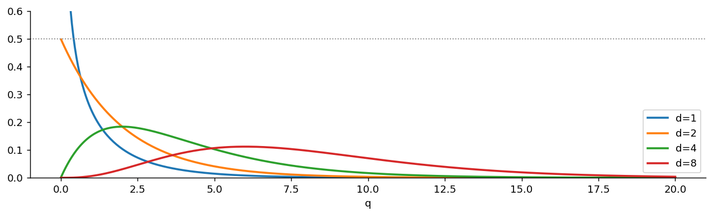
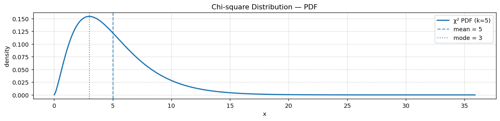
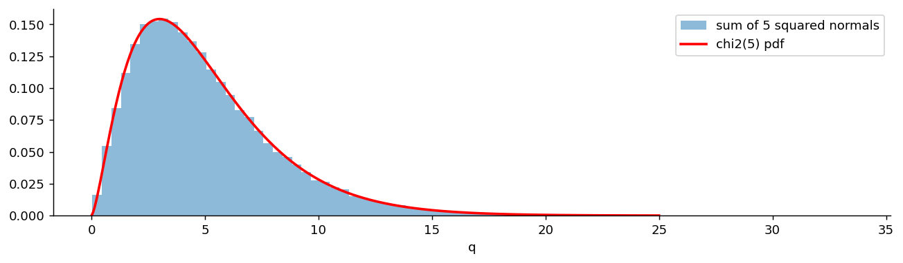
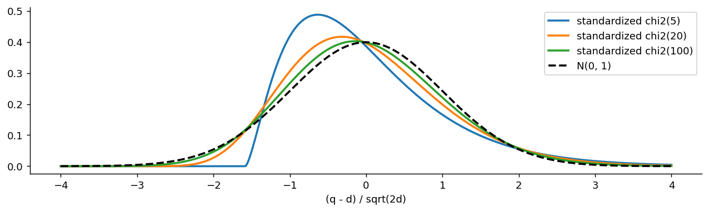

# 카이제곱분포

## 개요

**카이제곱분포**는 독립인 표준정규확률변수를 제곱해서 더한 것의 분포다. 새로운 가정에서 출발해 만든 분포가 아니라, **이미 가진 정규분포를 제곱해 더하기만 해서** 얻어진다는 점이 중요하다.

4.2절의 연속분포 사슬에서 이 페이지는 세 번째 고리다.

$$
\text{Exp}(\lambda) \;\longrightarrow\; N(\mu, \sigma^2) \;\longrightarrow\; \chi^2_d \;\longrightarrow\; t_d \;\longrightarrow\; F_{d_1, d_2}
$$

여기서부터 남은 세 분포는 모두 정규분포에서 만들어진다. 카이제곱분포는 정규확률변수의 **제곱합**, $t$ 분포는 정규를 카이제곱으로 **나눈 것**, $F$ 분포는 카이제곱 **둘의 비**다. 세 분포가 통계적 추론의 기본 도구가 되는 이유는 분산·표준편차·분산비라는 양이 모두 이런 꼴을 하고 있기 때문이다.

이 페이지에서는 자유도를 $d$로 쓴다.

---

## 정의

<div class="defn" markdown>

### 정의 1. 카이제곱분포 { .dfn }

$Z_1, \ldots, Z_d$가 독립인 표준정규확률변수이면, 그 제곱합

$$
Q = Z_1^2 + Z_2^2 + \cdots + Z_d^2
$$

의 분포를 **자유도 $d$인 카이제곱분포**라 하고 $Q \sim \chi^2_d$로 쓴다.

</div>

정의가 "제곱합"이므로 $Q \ge 0$이고, 자유도 $d$는 **더한 제곱의 개수**다. 자유도라는 이름이 붙은 까닭은 추론에서 이 개수가 "자유롭게 움직일 수 있는 좌표의 수"로 나타나기 때문인데, 그 이야기는 5장에서 한다. 이 장에서는 그저 몇 개를 더했는지를 세는 수로 보면 된다.

### 기하학적으로 보기

$(Z_1, \ldots, Z_d)$는 $d$차원 공간에 찍힌 표준정규 점이고, $Q$는 그 점과 원점 사이 **거리의 제곱**이다. 표준정규 점의 분포는 회전에 대해 불변이므로($\|Z\|$의 분포는 좌표축을 어떻게 잡든 같다) 카이제곱분포는 **"원점에서 얼마나 멀리 떨어졌는가"만 남긴 분포**다. 방향 정보를 버리고 거리만 남긴 것이 카이제곱분포라고 보면 된다.

---

## 자유도 1인 경우

먼저 제곱 하나짜리를 직접 계산한다. 나머지는 여기에 더하기만 하면 된다.

<div class="thmbox" markdown>

### 정리 1. 표준정규의 제곱이 갖는 밀도 { .thm }

$Z \sim N(0, 1)$이면 $Q = Z^2$의 밀도는

$$
f_Q(q) = \frac{1}{\sqrt{2\pi q}}\, e^{-q/2}, \qquad q > 0
$$

</div>

??? proof "증명"

    CDF부터 구한다. $q > 0$에 대해

    $$
    F_Q(q) = P(Z^2 \le q) = P(-\sqrt q \le Z \le \sqrt q) = 2\Phi(\sqrt q) - 1
    $$

    이다. 마지막 등호는 표준정규의 대칭성 $\Phi(-x) = 1 - \Phi(x)$를 쓴 것이다. 양변을 $q$에 대해 미분하면 연쇄법칙에 의해

    $$
    f_Q(q) = 2\,\varphi(\sqrt q)\cdot\frac{1}{2\sqrt q} = \frac{\varphi(\sqrt q)}{\sqrt q} = \frac{1}{\sqrt{2\pi q}}\,e^{-q/2}
    $$

    이다. $\square$

    $q \to 0^+$에서 밀도가 발산한다는 점에 주의하라. 적분값은 유한하지만($\int_0^1 q^{-1/2}dq = 2$) 밀도 자체는 무한대로 간다. 표준정규가 0 근처에 가장 많이 놓이고, 제곱은 0 근처를 더 촘촘하게 눌러 놓기 때문이다.

### 적률생성함수

제곱합을 다루려면 MGF가 가장 편하다. $t < 1/2$에 대해

$$
E\!\left[e^{tZ^2}\right] = \int_{-\infty}^{\infty} \frac{1}{\sqrt{2\pi}}\, e^{tz^2}e^{-z^2/2}\,dz = \int_{-\infty}^{\infty} \frac{1}{\sqrt{2\pi}}\, e^{-\frac{(1-2t)z^2}{2}}\,dz = (1 - 2t)^{-1/2}
$$

마지막 등호는 피적분함수가 분산 $1/(1-2t)$인 정규밀도의 상수배임을 알아본 것이다. 즉 표준편차 $(1-2t)^{-1/2}$를 곱해 주면 적분이 1이 된다. $t \ge 1/2$이면 적분이 발산하므로 MGF의 정의역이 $t < 1/2$로 제한된다.

---

## 일반 자유도

독립인 확률변수의 합은 MGF가 곱해지므로, $Q = \sum_{i=1}^d Z_i^2$의 MGF는 곧바로 나온다.

$$
M_Q(t) = \left[(1-2t)^{-1/2}\right]^d = (1 - 2t)^{-d/2}, \qquad t < \tfrac12
$$

이 MGF를 가진 분포의 밀도가 다음 식이다.

<div class="thmbox" markdown>

### 정리 2. 카이제곱 밀도 { .thm }

$Q \sim \chi^2_d$의 밀도는

$$
f(q; d) = \frac{1}{2^{d/2}\,\Gamma(d/2)}\, q^{d/2 - 1}\, e^{-q/2}, \qquad q > 0
$$

이다. 즉 $\chi^2_d$는 형상 $d/2$, 척도 $2$인 감마분포다:

$$
\chi^2_d = \text{Gamma}\!\left(\text{형상} = \frac d2,\ \text{척도} = 2\right)
$$

</div>

??? proof "증명"

    위에서 $Q = \sum_{i=1}^d Z_i^2$의 MGF가 $(1-2t)^{-d/2}$임을 보였다. MGF 는 원점
    둘레의 구간에서 유한하면 분포를 하나로 정하므로, **위 밀도의 MGF 를 구해 그것과
    같음을 보이면 된다.**

    형상 $\alpha$, 척도 $\theta$인 감마밀도

    $$
    g(q) = \frac{1}{\Gamma(\alpha)\,\theta^{\alpha}}\, q^{\alpha - 1} e^{-q/\theta}, \qquad q > 0
    $$

    에 대해 $t < 1/\theta$이면

    $$
    \int_0^{\infty} e^{tq}\, g(q)\,dq
    = \frac{1}{\Gamma(\alpha)\,\theta^{\alpha}} \int_0^{\infty} q^{\alpha-1} e^{-q\left(\frac1\theta - t\right)}dq
    $$

    이다. 안쪽 적분은 $u = q\left(\frac1\theta - t\right)$로 치환하면 감마함수의 정의
    $\int_0^\infty u^{\alpha-1}e^{-u}du = \Gamma(\alpha)$로 돌아가고, 치환으로 생긴
    인수가 $\left(\frac1\theta - t\right)^{-\alpha}$이므로

    $$
    \int_0^{\infty} e^{tq}\, g(q)\,dq
    = \frac{\left(\frac1\theta - t\right)^{-\alpha}}{\theta^{\alpha}}
    = (1 - \theta t)^{-\alpha}
    $$

    이다. 여기에 $\alpha = d/2$, $\theta = 2$를 넣으면 $(1-2t)^{-d/2}$로 $M_Q$와 같다.
    따라서 $Q$의 밀도가 그 감마밀도, 곧 정리의 식이다. $\square$

$d = 1$을 넣으면 $\Gamma(1/2) = \sqrt\pi$이므로 정리 1의 식으로 돌아온다:

$$
\frac{1}{2^{1/2}\sqrt\pi}\,q^{-1/2}e^{-q/2} = \frac{1}{\sqrt{2\pi q}}\,e^{-q/2}
$$

### 사슬을 거슬러 올라가기: 자유도 2는 지수분포다

$d = 2$를 넣으면 $\Gamma(1) = 1$이므로

$$
f(q; 2) = \frac{1}{2}e^{-q/2}
$$

이 되는데, 이것은 비율 $\lambda = 1/2$인 **지수분포**의 밀도다.

$$
\chi^2_2 = \text{Exp}\!\left(\tfrac12\right)
$$

4.2절 사슬의 첫 고리(지수분포)가 세 번째 고리 안에 그대로 들어 있는 셈이다. 독립인 표준정규 두 개를 제곱해 더하면 지수분포가 나온다는 사실은 그 자체로도 놀랍지만, 정규난수를 만드는 박스–뮐러 변환의 바탕이기도 하다. 평면 위 표준정규 점의 **거리 제곱은 지수분포, 방향은 균등분포**이고 둘이 독립이다.

---

## 성질

| 성질 | 값 |
|---|---|
| 지지집합 | $(0, \infty)$ |
| 평균 | $d$ |
| 분산 | $2d$ |
| 최빈값 | $\max(d - 2,\, 0)$ |
| 왜도 | $\sqrt{8/d}$ |
| MGF | $(1-2t)^{-d/2}$, $t < 1/2$ |

<div class="thmbox" markdown>

### 보조정리. 표준정규분포의 짝수 적률 { .thm }

$Z \sim N(0,1)$이면 홀수 차수의 적률은 모두 $0$이고, 짝수 차수는

$$
E[Z^{2k}] = (2k-1)!! = (2k-1)(2k-3)\cdots 3 \cdot 1
$$

이다. 특히 $E[Z^2] = 1$, $E[Z^4] = 3$, $E[Z^6] = 15$다.

</div>

??? proof "증명"

    표준정규 밀도를 $\varphi(x) = \frac{1}{\sqrt{2\pi}}e^{-x^2/2}$라 쓰자. 이 밀도는 미분하면 자기 자신에 $-x$가 곱해져 나오는 성질이 있다.

    $$
    \varphi'(x) = -x\,\varphi(x)
    $$

    이 한 줄이 계산 전체를 끌고 간다. 적분에 들어 있는 $x\varphi(x)$를 $-\varphi'(x)$로 바꿔 놓으면 부분적분을 쓸 수 있기 때문이다. $E[Z^4]$로 요령을 보인다.

    $$
    E[Z^4] = \int_{-\infty}^{\infty} x^4\,\varphi(x)\,dx
    = \int_{-\infty}^{\infty} x^3 \cdot \big(x\,\varphi(x)\big)\,dx
    = \int_{-\infty}^{\infty} x^3 \cdot \big(-\varphi'(x)\big)\,dx
    $$

    이제 $u = x^3$, $dv = -\varphi'(x)\,dx$로 놓고 부분적분한다.

    $$
    E[Z^4] = \Big[-x^3\varphi(x)\Big]_{-\infty}^{\infty} + \int_{-\infty}^{\infty} 3x^2\,\varphi(x)\,dx
    $$

    경계항은 사라진다. $\varphi(x)$가 $e^{-x^2/2}$를 품고 있어 어떤 다항식보다도 빨리 0으로 가기 때문이다. 남은 적분은 $3E[Z^2] = 3$이므로

    $$
    E[Z^4] = 0 + 3 \cdot 1 = 3
    $$

    이다. 같은 요령을 되풀이하면 일반항이 나온다. $E[Z^{2k}] = (2k-1)E[Z^{2k-2}]$이므로

    $$
    E[Z^{2k}] = (2k-1)(2k-3)\cdots 3 \cdot 1 = (2k-1)!!
    $$

    이고, 홀수 차수의 적률은 피적분함수가 기함수라 모두 0이다. $\square$

<div class="thmbox" markdown>

### 정리 3. 카이제곱의 평균과 분산 { .thm }

$X \sim \chi^2_d$이면

$$
E[X] = d, \qquad \text{Var}(X) = 2d
$$

이다. 자유도가 평균이자 분산의 절반이라는 뜻이다.

</div>

??? proof "증명"

    제곱 하나짜리부터 본다. $Z \sim N(0,1)$에 대해 $E[Z^2] = \text{Var}(Z) = 1$이고, 보조정리에서 $E[Z^4] = 3$이므로

    $$
    \text{Var}(Z^2) = E[Z^4] - (E[Z^2])^2 = 3 - 1 = 2
    $$

    이다. 자유도 $d$인 카이제곱은 $Q = \sum_{i=1}^d Z_i^2$이고 $Z_i^2$들이 독립이므로 평균과 분산이 각각 더해진다.

    $$
    E[Q] = \sum_{i=1}^d E[Z_i^2] = d, \qquad \text{Var}(Q) = \sum_{i=1}^d \text{Var}(Z_i^2) = 2d
    $$

    $\square$

**평균이 곧 자유도**라는 점은 기억해 둘 만하다. 검정통계량이 카이제곱분포를 따른다고 할 때, 그 값이 자유도 근처면 평범하고 자유도보다 훨씬 크면 이상하다는 것이 곧바로 읽힌다.

### 가법성

<div class="thmbox" markdown>

### 정리 4. 카이제곱의 가법성 { .thm }

$Q_1 \sim \chi^2_{d_1}$과 $Q_2 \sim \chi^2_{d_2}$가 독립이면

$$
Q_1 + Q_2 \sim \chi^2_{d_1 + d_2}
$$

</div>

??? proof "증명"

    정의에서 곧바로 나온다. $Q_1$은 제곱 $d_1$개의 합이고 $Q_2$는 제곱 $d_2$개의 합이며, 두 묶음이 독립이므로 전체는 독립인 표준정규 $d_1 + d_2$개의 제곱합이다.

    MGF로 확인하면

    $$
    M_{Q_1 + Q_2}(t) = (1-2t)^{-d_1/2}(1-2t)^{-d_2/2} = (1-2t)^{-(d_1+d_2)/2}
    $$

    이고 이는 $\chi^2_{d_1 + d_2}$의 MGF다. $\square$

가법성은 자유도를 "더한 제곱의 개수"로 읽으면 당연한 성질이다. 분산분석에서 제곱합을 여러 조각으로 쪼갤 때 각 조각의 자유도가 더해져 전체가 되는 것이 바로 이 성질이다.

---

## 자유도에 따른 모양

- **$d = 1, 2$:** 최빈값이 0이고 밀도가 단조 감소한다. $d=1$은 0에서 발산하고, $d=2$는 0에서 높이 $1/2$로 시작하는 지수분포다.
- **$d \ge 3$:** $q = d - 2$에서 봉우리가 생긴다. 평균 $d$보다 왼쪽에 있으므로 분포가 **오른쪽으로 치우쳐** 있다.
- **$d$가 크면:** 왜도 $\sqrt{8/d}$가 0으로 가면서 대칭인 종 모양에 가까워진다.

### 큰 자유도에서의 정규근사

$Q$가 독립인 $Z_i^2$의 합이므로 중심극한정리가 그대로 적용된다.

$$
\frac{Q - d}{\sqrt{2d}} \;\xrightarrow{\;d \to \infty\;}\; N(0, 1)
$$

다만 이 근사는 수렴이 느린 편이다. 왜도가 $\sqrt{8/d}$로 줄어드는데, $d = 50$에서도 0.4나 되기 때문이다. 실무에서는 다음 두 가지 변환근사가 훨씬 정확하다.

$$
\begin{aligned}
\text{Fisher:} &\quad \sqrt{2Q} \approx N\!\left(\sqrt{2d - 1},\, 1\right) \\[4pt]
\text{Wilson–Hilferty:} &\quad \left(\frac{Q}{d}\right)^{1/3} \approx N\!\left(1 - \frac{2}{9d},\, \frac{2}{9d}\right)
\end{aligned}
$$

둘 다 치우친 분포를 대칭에 가깝게 펴 주는 변환이다. 특히 세제곱근을 쓰는 윌슨–힐퍼티 근사는 자유도가 한 자릿수여도 꽤 잘 맞는다(연습문제 7).

---

## 문제

<div class="probox" markdown>

**문제:** <span class="diff easy" title="쉬움"></span> $Z \sim N(0,1)$일 때 $P(|Z| \le 1.96) = 0.95$임은 잘 알려져 있다. 이 사실로부터 $\chi^2_1$의 95백분위점을 구하라.

</div>

??? success "풀이"

    $Q = Z^2$이므로 $|Z| \le 1.96$과 $Q \le 1.96^2$은 **같은 사건**이다. 따라서

    $$
    P(Q \le 3.8416) = P(|Z| \le 1.96) = 0.95
    $$

    이고, $\chi^2_1$의 95백분위점은 $1.96^2 = 3.8416$이다.

    자유도 1인 카이제곱검정의 기각값 3.84가 정규분포의 1.96과 같은 수라는 사실이 여기서 드러난다. **양측 $z$ 검정과 자유도 1인 카이제곱검정은 완전히 같은 검정**이며, 표기만 다르다. 한쪽은 부호를 남기고 다른 쪽은 제곱해서 버릴 뿐이다.

---

## Python: PDF, 표본추출, 근사

### 자유도에 따른 밀도

<div class="exbox" markdown>

**보기 1.** <span class="diff easy" title="쉬움"></span> 원점에서 갈라지는 세 가지 모양. $\chi^2_d$의 밀도를 $d = 1, 2, 4, 8$에 대해 $[0.01,\, 20]$에서 겹쳐 그린다.

**(1)** $q \to 0^+$에서 밀도가 어떻게 행동하는지 $d$에 따라 나누어 밝히고, $d = 2$의 곡선이 세로축에 닿는 높이를 구하시오.

**(2)** 자유도가 다른 두 카이제곱 밀도가 몇 번 만나는지 밝히고, 만나는 자리를 닫힌 꼴로 구하시오. 그림에 있는 곡선들에 대해 그 값을 수치로 확인하시오.

</div>

??? success "풀이"

    **(1) 해석적으로.** 밀도는

    $$
    f(q; d) = \frac{1}{2^{d/2}\,\Gamma(d/2)}\, q^{d/2 - 1}\, e^{-q/2}
    $$

    이고 $q \to 0^+$에서 $e^{-q/2} \to 1$이므로 **거동을 정하는 것은 $q^{d/2-1}$ 하나**다. 지수 $d/2 - 1$의 부호가 세 갈래를 만든다.

    $$
    \lim_{q \to 0^+} f(q; d) =
    \begin{cases}
    +\infty, & d = 1 \quad (\text{지수} = -\tfrac12 < 0) \\[4pt]
    \tfrac12, & d = 2 \quad (\text{지수} = 0) \\[4pt]
    0, & d \ge 3 \quad (\text{지수} > 0)
    \end{cases}
    $$

    $d = 2$의 높이는 지수가 $0$이라 상수만 남아

    $$
    f(0^+; 2) = \frac{1}{2^{1}\,\Gamma(1)} = \frac12
    $$

    이다. 코드가 $y = 0.5$에 점선을 그어 둔 것이 이 값이며, **$\chi^2_2 = \text{Exp}(1/2)$의 밀도가 비율 $\lambda = 1/2$에서 출발한다**는 사실의 다른 표현이다.

    $d = 1$에서 밀도가 발산하는 것이 모순이 아님을 짚어 두자. 발산 속도가 $q^{-1/2}$뿐이고 $\int_0^\epsilon q^{-1/2}\,dq = 2\sqrt\epsilon$은 유한하므로 **밀도는 무한대로 가지만 질량은 $0$으로 간다.** 정리 1의 CDF가 그것을 바로 보여 준다.

    $$
    P(Q \le \epsilon) = 2\Phi(\sqrt\epsilon) - 1 \;\xrightarrow{\;\epsilon \to 0^+\;}\; 0
    $$

    **(2) 해석적으로.** $d_1 < d_2$인 두 밀도의 비를 잡으면 $e^{-q/2}$가 약분된다.

    $$
    \frac{f(q; d_2)}{f(q; d_1)}
    = \frac{2^{d_1/2}\,\Gamma(d_1/2)}{2^{d_2/2}\,\Gamma(d_2/2)}\; q^{(d_2 - d_1)/2}
    $$

    남은 것은 $q$의 **양의 거듭제곱 하나**이고, 그것은 $(0, \infty)$에서 $0$부터 $\infty$까지 단조증가한다. 그러므로 비가 $1$이 되는 자리는 **정확히 하나**뿐이다. 비를 $1$로 두고 풀면

    $$
    q^{(d_2 - d_1)/2} = 2^{(d_2 - d_1)/2}\,\frac{\Gamma(d_2/2)}{\Gamma(d_1/2)}
    \qquad\Longrightarrow\qquad
    q^* = 2\left[\frac{\Gamma(d_2/2)}{\Gamma(d_1/2)}\right]^{2/(d_2 - d_1)}
    $$

    을 얻는다. $q < q^*$에서는 자유도가 작은 쪽이 높고, $q > q^*$에서는 큰 쪽이 높다. **자유도를 올리는 일은 밀도를 오른쪽으로 옮기는 일**이며 그 교환이 일어나는 지점이 $q^*$ 하나라는 뜻이다.

    그림에 있는 이웃한 쌍에 넣어 본다. $\Gamma(1/2) = \sqrt\pi$, $\Gamma(1) = \Gamma(2) = 1$, $\Gamma(4) = 6$이므로

    $$
    \begin{aligned}
    (d_1, d_2) = (1, 2): &\quad q^* = 2\left[\frac{\Gamma(1)}{\Gamma(1/2)}\right]^{2} = \frac{2}{\pi} \approx 0.6366 \\[4pt]
    (d_1, d_2) = (2, 4): &\quad q^* = 2\left[\frac{\Gamma(2)}{\Gamma(1)}\right]^{1} = 2 \\[4pt]
    (d_1, d_2) = (4, 8): &\quad q^* = 2\left[\frac{\Gamma(4)}{\Gamma(2)}\right]^{1/2} = 2\sqrt6 \approx 4.8990
    \end{aligned}
    $$

    다. 첫 줄에 $\pi$가 나오는 것은 $d_1 = 1$이 홀수라 $\Gamma(1/2) = \sqrt\pi$를 끌고 들어오기 때문이다.

    **(2) 수치적으로.** 유도한 세 가지, 곧 세 갈래 거동과 $d = 2$의 높이 $1/2$와 교차점 공식을 차례로 확인한다.

    ```python
    import numpy as np
    from scipy import optimize, special, stats

    # (1) q -> 0+ 에서의 거동. 지수 d/2 - 1 의 부호가 세 갈래를 만든다.
    print(f"{'d':>4}{'지수 d/2-1':>12}{'f(1e-6)':>14}{'f(0.01)':>12}")
    for d in (1, 2, 3, 4, 8):
        print(f"{d:>4}{d / 2 - 1:>12.1f}{stats.chi2(d).pdf(1e-6):>14.6g}"
              f"{stats.chi2(d).pdf(0.01):>12.6g}")

    # d=1 은 밀도가 발산하지만 질량은 0 으로 간다.
    print(f"\nd=1:  f(0.01) = {stats.chi2(1).pdf(0.01):.4f}  <- 그림의 ylim 0.6 을 훌쩍 넘는다")
    print(f"      P(Q <= 0.01) = {stats.chi2(1).cdf(0.01):.6f}"
          f"  = 2*Phi(0.1) - 1 = {2 * stats.norm.cdf(0.1) - 1:.6f}")

    # (2) 교차점의 닫힌 꼴. 비가 q 의 양의 거듭제곱이므로 영점은 하나뿐이다.
    def q_star(d1, d2):
        return 2 * (special.gamma(d2 / 2) / special.gamma(d1 / 2)) ** (2 / (d2 - d1))

    print(f"\n{'(d1,d2)':>10}{'닫힌 꼴':>14}{'수치해':>14}{'두 밀도 값':>26}")
    for d1, d2 in [(1, 2), (2, 4), (4, 8), (1, 8)]:
        q = q_star(d1, d2)
        root = optimize.brentq(
            lambda x: stats.chi2(d2).pdf(x) - stats.chi2(d1).pdf(x), 1e-9, 200)
        print(f"{f'({d1},{d2})':>10}{q:>14.9f}{root:>14.9f}"
              f"{stats.chi2(d1).pdf(q):>13.9f}{stats.chi2(d2).pdf(q):>13.9f}")

    print(f"\n손으로 얻은 값:  2/pi = {2 / np.pi:.9f},   2 = 2,   2*sqrt(6) = {2 * np.sqrt(6):.9f}")
    ```

    출력:

    ```
       d    지수 d/2-1       f(1e-6)     f(0.01)
       1        -0.5       398.942     3.96953
       2         0.0           0.5    0.497506
       3         0.5   0.000398942   0.0396953
       4         1.0       2.5e-07  0.00248753
       8         3.0   1.04167e-20 1.03647e-08

    d=1:  f(0.01) = 3.9695  <- 그림의 ylim 0.6 을 훌쩍 넘는다
          P(Q <= 0.01) = 0.079656  = 2*Phi(0.1) - 1 = 0.079656

       (d1,d2)          닫힌 꼴           수치해                    두 밀도 값
         (1,2)   0.636619772   0.636619772  0.363688675  0.363688675
         (2,4)   2.000000000   2.000000000  0.183939721  0.183939721
         (4,8)   4.898979486   4.898979486  0.105741569  0.105741569
         (1,8)   2.833593280   2.833593280  0.057469093  0.057469093

    손으로 얻은 값:  2/pi = 0.636619772,   2 = 2,   2*sqrt(6) = 4.898979486
    ```

    **셋 모두 유도와 맞는다.** 지수의 부호가 바뀌는 자리에서 $f(10^{-6})$이 $398.942$에서 $0.5$로, 다시 $0.000399$로 떨어진다. $d = 2$의 값은 $10^{-6}$에서도 $0.5$ 그대로다. 교차점은 닫힌 꼴과 수치해가 아홉째 자리까지 같고, 그 자리에서 두 밀도 값이 실제로 일치한다. 이웃하지 않은 쌍 $(1, 8)$도 같은 공식으로 맞는다.

    그림을 그리는 코드는 아래와 같다.

    ```python
    import matplotlib.pyplot as plt
    import numpy as np
    from scipy import stats

    x = np.linspace(0.01, 20, 400)   # 0에서 시작하면 d=1에서 발산해 그림이 깨진다

    fig, ax = plt.subplots(figsize=(12, 3))
    # 자유도 = 더한 제곱의 개수.
    #   d=1 : 0 근처에서 치솟는다(정규분포가 0 근처에 몰려 있으므로)
    #   d=2 : 지수분포 Exp(1/2)와 정확히 같다. 0에서 높이 0.5로 시작한다.
    #   d>=3: 최빈값 d-2 에 봉우리가 생기고, 평균 d 는 그보다 오른쪽에 있다.
    for d in [1, 2, 4, 8]:
        ax.plot(x, stats.chi2(d).pdf(x), lw=2, label=f'd={d}')
    ax.axhline(0.5, color='gray', ls=':', lw=1)   # d=2가 0에서 닿는 높이
    ax.set_ylim(0, 0.6)
    ax.set_xlabel('q')
    ax.spines[['top', 'right']].set_visible(False)
    ax.legend()
    plt.show()
    ```

    

    **그림이 가리는 것이 둘 있다.** 하나는 $d = 1$ 곡선의 머리다. $x$ 격자가 $0.01$에서 시작하는데 그 자리의 밀도가 $3.97$이고 `set_ylim(0, 0.6)`이 걸려 있으므로, 왼쪽 끝에서 곡선이 **그림 위로 잘려 나간다.** 발산을 그림으로 보일 방법은 없고, 잘린 자리가 발산의 흔적인 셈이다. 다른 하나는 $d = 1$과 $d = 2$의 교차다. $q^* = 2/\pi \approx 0.637$은 가로축 $20$ 전체에서 왼쪽 끝 $3\%$ 안쪽이라 두 곡선이 갈리는 모습이 거의 한 점으로 뭉쳐 보인다.

    반대로 $d = 4$와 $d = 8$의 교차점 $2\sqrt6 \approx 4.90$은 가로축의 $25\%$ 자리이자 두 곡선이 모두 높은 구간이라 또렷하게 보인다. **교차점이 $q^* = 2[\Gamma(d_2/2)/\Gamma(d_1/2)]^{2/(d_2-d_1)}$로 자유도와 함께 오른쪽으로 밀려가므로**, 자유도가 큰 쌍일수록 교차가 눈에 잘 띄는 자리에서 일어난다.

### 평균과 최빈값이 갈라져 있다

<div class="exbox" markdown>

**보기 2.** <span class="diff easy" title="쉬움"></span> 평균과 최빈값이 갈라진 간격. $\chi^2_5$의 밀도를 그리고 평균과 최빈값에 각각 세로선을 긋는다.

**(1)** 평균과 최빈값의 간격을 자유도의 함수로 구하시오. 그 간격을 표준편차 단위로 재면 무엇이 되는가.

**(2)** 세 중심(최빈값·중앙값·평균)의 순서를 밝히고, 간격 $2$가 두 조각으로 어떻게 갈리는지 수치로 확인하시오.

</div>

??? success "풀이"

    **(1) 해석적으로.** 최빈값은 로그밀도를 미분해 얻는다. 상수를 뺀

    $$
    \log f(q; d) = \left(\frac d2 - 1\right)\log q - \frac q2 + c
    \qquad\Longrightarrow\qquad
    \frac{d}{dq}\log f = \frac{d/2 - 1}{q} - \frac12
    $$

    을 $0$으로 두면 $q = d - 2$다. $d > 2$에서 이계도함수가 $-(d/2-1)/q^2 < 0$이므로 최대점이며, $d \le 2$에서는 도함수가 $(0,\infty)$ 내내 음수라 밀도가 단조감소해 최빈값이 경계 $0$이다(연습문제 4). 곧

    $$
    \text{최빈값} = \max(d - 2,\, 0)
    $$

    이다. 평균은 $d$이므로 $d \ge 2$에서

    $$
    \text{평균} - \text{최빈값} = d - (d-2) = 2
    $$

    로 **자유도와 무관하게 늘 $2$**다. 자유도를 하나 올리면 봉우리와 평균이 **나란히** 한 칸씩 오른쪽으로 가고 간격은 그대로라는 뜻이다.

    그런데 분포의 폭은 자유도와 함께 자란다. 표준편차가 $\sqrt{2d}$이므로 간격을 그 단위로 재면

    $$
    \frac{\text{평균} - \text{최빈값}}{\sqrt{\operatorname{Var}}} = \frac{2}{\sqrt{2d}} = \sqrt{\frac2d}
    $$

    이고, 이것은 성질 표의 왜도 $\sqrt{8/d}$의 **정확히 절반**이다.

    $$
    \sqrt{\frac2d} = \frac12\sqrt{\frac8d} = \frac{\gamma_1}{2}
    $$

    **치우침의 두 가지 척도가 상수배로 묶여 있다.** 간격 $2$는 그대로인데 폭이 $\sqrt{2d}$로 자라므로, 자유도가 커질 때 분포가 대칭에 가까워지는 것은 간격이 줄기 때문이 아니라 **폭이 간격을 따라잡기 때문**이다. $d = 5$에서 $\sqrt{2/5} = 0.632$, $d = 100$에서 $0.141$이다.

    **(2) 해석적으로.** 오른쪽으로 치우친 단봉분포의 일반적인 순서가 그대로 성립한다.

    $$
    \text{최빈값} \;<\; \text{중앙값} \;<\; \text{평균}
    $$

    중앙값은 닫힌 꼴이 없으나 윌슨–힐퍼티 근사(연습문제 7)가 쓸 만한 식을 준다. $(Q/d)^{1/3}$의 중앙값이 그 근사정규의 평균 $1 - 2/(9d)$이므로

    $$
    \text{중앙값} \approx d\left(1 - \frac{2}{9d}\right)^3 \approx d\left(1 - \frac{6}{9d}\right) = d - \frac23
    $$

    이다. 그러면 간격 $2$가 갈리는 비율이 예측된다.

    $$
    \text{평균} - \text{중앙값} \approx \frac23,
    \qquad
    \text{중앙값} - \text{최빈값} \approx 2 - \frac23 = \frac43
    $$

    곧 **$2 : 1$로 갈린다.** 아래에서 이 예측을 수로 확인한다.

    **(2) 수치적으로.**

    ```python
    import numpy as np
    from scipy import integrate, stats

    d = 5
    chi2 = stats.chi2(d)

    # (1) 최빈값을 격자로 확인한다. 유도한 값은 d - 2 = 3 이다.
    grid = np.linspace(1e-9, 20, 2_000_001)
    print(f"d = {d}:  유도한 최빈값 d-2 = {d - 2},"
          f"  격자 최대점 = {grid[chi2.pdf(grid).argmax()]:.6f}")

    # 세 중심의 순서와 간격. 평균 - 최빈값은 자유도와 무관하게 2 다.
    print(f"\n{'d':>5}{'최빈값 d-2':>12}{'중앙값':>12}{'WH 근사':>12}{'평균 d':>9}"
          f"{'평균-중앙':>11}{'중앙-최빈':>11}{'비':>7}")
    for k in (3, 5, 10, 20, 50, 100, 500):
        med = stats.chi2(k).median()
        wh = k * (1 - 2 / (9 * k)) ** 3
        print(f"{k:>5}{k - 2:>12}{med:>12.6f}{wh:>12.6f}{k:>9}"
              f"{k - med:>11.6f}{med - (k - 2):>11.6f}{(med - (k - 2)) / (k - med):>7.3f}")

    # 치우침을 표준편차 단위로 재면 평균-최빈값 간격이 왜도의 절반이다.
    print(f"\n{'d':>5}{'(평균-최빈)/sd':>16}{'sqrt(2/d)':>12}{'왜도/2':>10}{'P(Q<=d)':>11}")
    for k in (3, 5, 10, 20, 50, 100, 500):
        print(f"{k:>5}{2 / np.sqrt(2 * k):>16.6f}{np.sqrt(2 / k):>12.6f}"
              f"{np.sqrt(8 / k) / 2:>10.6f}{stats.chi2(k).cdf(k):>11.6f}")

    # d=5 에서 세 자리의 밀도 높이와, 평균 왼쪽에 놓인 확률
    print(f"\nd = 5:  f(최빈 3) = {chi2.pdf(3):.6f},  f(중앙 {chi2.median():.4f})"
          f" = {chi2.pdf(chi2.median()):.6f},  f(평균 5) = {chi2.pdf(5):.6f}")
    print(f"        P(Q <= 5) = {chi2.cdf(5):.6f}"
          f"   (quad 로 재확인 {integrate.quad(chi2.pdf, 0, 5)[0]:.6f})")
    ```

    출력:

    ```
    d = 5:  유도한 최빈값 d-2 = 3,  격자 최대점 = 3.000000

        d     최빈값 d-2         중앙값       WH 근사     평균 d      평균-중앙      중앙-최빈      비
        3           1    2.365974    2.381497        3   0.634026   1.365974  2.154
        5           3    4.351460    4.362524        5   0.648540   1.351460  2.084
       10           8    9.341818    9.348038       10   0.658182   1.341818  2.039
       20          18   19.337429   19.340713       20   0.662571   1.337429  2.019
       50          48   49.334937   49.336292       50   0.665063   1.334937  2.007
      100          98   99.334129   99.334814      100   0.665871   1.334129  2.004
      500         498  499.333492  499.333630      500   0.666508   1.333492  2.001

        d      (평균-최빈)/sd   sqrt(2/d)      왜도/2    P(Q<=d)
        3        0.816497    0.816497  0.816497   0.608375
        5        0.632456    0.632456  0.632456   0.584120
       10        0.447214    0.447214  0.447214   0.559507
       20        0.316228    0.316228  0.316228   0.542070
       50        0.200000    0.200000  0.200000   0.526602
      100        0.141421    0.141421  0.141421   0.518808
      500        0.063246    0.063246  0.063246   0.508411

    d = 5:  f(최빈 3) = 0.154180,  f(중앙 4.3515) = 0.137036,  f(평균 5) = 0.122042
            P(Q <= 5) = 0.584120   (quad 로 재확인 0.584120)
    ```

    **유도가 모두 맞는다.** 격자가 찾은 최빈값은 $3.000000$이고, 둘째 표에서 $(\text{평균}-\text{최빈})/\text{sd}$와 $\sqrt{2/d}$와 $\gamma_1/2$가 여섯째 자리까지 같은 열로 겹친다. 첫째 표의 마지막 열은 $d = 3$에서 $2.154$였다가 $d = 500$에서 $2.001$로 내려가며 **$2 : 1$ 분할이 큰 자유도에서 성립한다**는 것을 보인다. 윌슨–힐퍼티 근사는 $d = 3$에서도 참 중앙값 $2.3660$을 $2.3815$로 맞힌다.

    세로선이 서 있는 자리의 밀도 높이를 보면 치우침이 또 다르게 읽힌다. $d = 5$에서 봉우리가 $0.1542$인데 평균 자리의 높이는 $0.1220$으로 **$21\%$ 낮다.** 평균은 밀도가 가장 높은 곳이 아니며, 오른쪽 꼬리가 평균을 봉우리 밖으로 끌어낸 결과다.

    마지막 열 $P(Q \le d)$는 **평균이 중앙값이 아니라는 사실의 직접적인 측정**이다. $d = 5$에서 $0.5841$이므로 관측값의 $58\%$가 평균보다 작다. 치우친 분포에서 "평균보다 작은 쪽이 더 흔하다"는 것이고, 자유도가 커지면 $0.5088$($d = 500$)까지 내려가 $1/2$에 다가간다. 다만 **내려가는 속도가 $\sqrt{2/d}$만큼 느리다**는 점이 중요하다. $d = 100$에서도 아직 $0.5188$이며, 이것이 큰 자유도에서조차 정규근사가 꼬리에서 어긋나는 까닭이다(보기 5).

    ```python
    import numpy as np
    import matplotlib.pyplot as plt
    import scipy.stats as stats

    k = 5                      # 자유도. 표준정규 k개를 제곱해 더한 것의 분포다.
    chi2 = stats.chi2(df=k)

    # x 범위를 분위수로 정한다. 눈대중으로 (0, 20) 같은 범위를 쓰면
    # 자유도가 바뀔 때마다 그림이 잘리거나 남는다.
    # ppf(1e-6)부터 ppf(1-1e-6)까지 잡으면 어떤 k에서도 꼬리까지 알맞게 담긴다.
    x = np.linspace(chi2.ppf(1e-6), chi2.ppf(1 - 1e-6), 600)
    y = chi2.pdf(x)

    fig, ax = plt.subplots(figsize=(12, 3))
    ax.plot(x, y, lw=2, label=f"χ² PDF (k={k})")
    # 평균은 정확히 k, 최빈값은 k-2 (k >= 2일 때).
    # 둘이 다르다는 것이 곧 이 분포가 오른쪽으로 치우쳐 있다는 뜻이다.
    ax.axvline(k, linestyle='--', alpha=0.8, label=f"mean = {k}")
    ax.axvline(max(k - 2, 0), linestyle=':', alpha=0.8, label=f"mode = {max(k-2, 0)}")
    ax.set_title("Chi-square Distribution — PDF")
    ax.set_xlabel("x")
    ax.set_ylabel("density")
    ax.legend()
    ax.grid(True, linestyle=":")
    plt.tight_layout()
    plt.show()
    ```

    

    그림에서 두 세로선 사이의 거리가 $2$이고, 그 폭이 곡선 전체의 폭에 비해 작지 않다는 것이 $d = 5$가 아직 꽤 치우친 분포라는 뜻이다. 같은 그림을 $d = 100$으로 다시 그리면 두 선이 거의 붙어 보이는데, 간격이 줄어서가 아니라 가로축이 $\sqrt{2d}$만큼 늘어나서다.

### 정의대로 만들어 보기

<div class="exbox" markdown>

**보기 3.** <span class="diff easy" title="쉬움"></span> 정의를 그대로 실행하기. 표준정규 $5$개를 뽑아 제곱해 더하는 일을 $N = 50{,}000$번 되풀이하고, 얻은 값들의 히스토그램을 $\chi^2_5$의 밀도와 겹쳐 그린다.

**(1)** 제곱합이 $\chi^2_d$를 따른다는 것을 적률생성함수로 보이시오.

**(2)** 모의실험의 표본평균과 표본분산이 이론값 $d$와 $2d$에서 얼마나 벗어나도 되는지 표준오차로 밝히고, 관측된 값이 그 안에 드는지 확인하시오. 적률생성함수를 표본으로 직접 재면 어느 $t$까지 맞는가.

</div>

??? success "풀이"

    **(1) 해석적으로.** 제곱 하나짜리의 MGF는 본문에서 이미 얻었다. $t < 1/2$에 대해

    $$
    E\!\left[e^{tZ^2}\right] = \int_{-\infty}^{\infty} \frac{1}{\sqrt{2\pi}}\,e^{-\frac{(1-2t)z^2}{2}}\,dz = (1-2t)^{-1/2}
    $$

    이고, 마지막 등호는 피적분함수가 분산 $1/(1-2t)$인 정규밀도의 $(1-2t)^{-1/2}$배임을 알아본 것이다. $Z_1, \ldots, Z_d$가 독립이면 **독립인 것의 합의 MGF는 MGF의 곱**이므로

    $$
    M_Q(t) = E\!\left[e^{t\sum_i Z_i^2}\right] = \prod_{i=1}^d E\!\left[e^{tZ_i^2}\right] = (1-2t)^{-d/2}
    $$

    다. 이것이 정리 2의 밀도가 갖는 MGF와 같고, MGF가 $0$의 근방에서 유한하면 분포를 **하나로 결정하므로** $Q \sim \chi^2_d$다. 여기서 $d$가 지수에 더해지는 방식이 곧 가법성(정리 4)이며, 자유도가 "더한 제곱의 개수"인 까닭이기도 하다.

    $d = 1$만은 밀도를 직접 얻을 수도 있다. $P(Z^2 \le q) = 2\Phi(\sqrt q) - 1$을 미분하면 정리 1의 $f(q) = (2\pi q)^{-1/2}e^{-q/2}$가 나오고, $\Gamma(1/2) = \sqrt\pi$를 쓰면 정리 2의 식과 같다.

    **(2) 해석적으로.** 모의실험이 "맞았다"고 말하려면 **얼마나 맞아야 하는지**를 먼저 정해야 한다. $Q_1, \ldots, Q_N$이 독립인 $\chi^2_d$이므로 표본평균의 표준오차는

    $$
    \mathrm{SE}(\bar Q) = \sqrt{\frac{\operatorname{Var}(Q)}{N}} = \sqrt{\frac{2d}{N}}
    = \sqrt{\frac{10}{50{,}000}} = 0.01414
    $$

    다. 표본분산의 표준오차에는 넷째 누율이 필요하다. 연습문제 9의 $\kappa_n = 2^{n-1}(n-1)!\,d$에서 $\kappa_2 = 2d = 10$, $\kappa_4 = 48d = 240$이므로

    $$
    \operatorname{Var}(s^2) \approx \frac{\kappa_4}{N} + \frac{2\kappa_2^2}{N-1}
    = \frac{240}{50{,}000} + \frac{200}{49{,}999} = 0.008800
    \;\Longrightarrow\; \mathrm{SE}(s^2) = 0.0938
    $$

    이다. **이론값에서 이 눈금의 두세 배 안에 들면 맞는 것이고, 그보다 멀면 무언가 틀린 것이다.**

    적률생성함수를 표본으로 재는 일에는 함정이 하나 있다. 추정량 $\widehat M(t) = \frac1N\sum_i e^{tQ_i}$의 기댓값은 $t < 1/2$이면 늘 $M(t)$가 맞지만, 그 **분산**은

    $$
    \operatorname{Var}\!\left(e^{tQ}\right) = M(2t) - M(t)^2
    = (1-4t)^{-d/2} - (1-2t)^{-d}
    $$

    이므로 $2t < 1/2$, 곧 $t < 1/4$에서만 유한하다. $t \ge 1/4$에서는 분산이 무한대이고, 그때 표본평균은 **중심극한정리의 보호를 받지 못한다.** 평균은 여전히 올바른 값을 향하지만 수렴이 극단적으로 느리며, 몇 개의 큰 $Q_i$가 합을 좌우한다.

    **(2) 수치적으로.** 먼저 정의를 그대로 실행해 히스토그램을 그린다.

    ```python
    import matplotlib.pyplot as plt
    import numpy as np
    from scipy import stats

    np.random.seed(42)
    d = 5
    # 정의를 그대로 실행한다. 표준정규 5개를 뽑아 제곱해 더하기를 5만 번.
    #   rvs((d, 50000)) 이 (5, 50000) 배열을 주고
    #   axis=0 으로 더하면 열마다(= 시행마다) 5개의 제곱합이 나온다.
    z = stats.norm.rvs(size=(d, 50_000))
    q = (z ** 2).sum(axis=0)

    x = np.linspace(0.01, 25, 400)
    fig, ax = plt.subplots(figsize=(12, 3))
    ax.hist(q, bins=80, density=True, alpha=0.5, label='sum of 5 squared normals')
    ax.plot(x, stats.chi2(d).pdf(x), 'r-', lw=2, label='chi2(5) pdf')
    ax.set_xlabel('q')
    ax.spines[['top', 'right']].set_visible(False)
    ax.legend()
    plt.show()

    print(f"sample mean {q.mean():.3f} (theory {d})")
    print(f"sample var  {q.var():.3f} (theory {2*d})")
    ```

    출력:

    ```
    sample mean 5.000 (theory 5)
    sample var  10.022 (theory 10)
    ```

    

    이제 (2)에서 세운 기준으로 그 두 수를 재고, 분포 전체의 거리와 MGF까지 확인한다.

    ```python
    import numpy as np
    from scipy import stats

    np.random.seed(42)
    d, N = 5, 50_000
    q = (stats.norm.rvs(size=(d, N)) ** 2).sum(axis=0)

    # 누율은 kappa_n = 2^(n-1) (n-1)! d 다(연습문제 9). 쓸 것은 kappa_2, kappa_4.
    k2, k4 = 2 * d, 48 * d

    # 표본평균과 표본분산의 이론 표준오차. 이것이 "얼마나 맞아야 맞는 것인가"의 기준이다.
    se_mean = np.sqrt(k2 / N)
    se_var = np.sqrt(k4 / N + 2 * k2 ** 2 / (N - 1))

    print(f"표본평균 {q.mean():.4f}   이론 {d}   SE = sqrt(2d/N) = {se_mean:.4f}"
          f"   편차/SE = {abs(q.mean() - d) / se_mean:.2f}")
    print(f"표본분산 {q.var():.4f}  이론 {k2}  SE = {se_var:.4f}"
          f"   편차/SE = {abs(q.var() - k2) / se_var:.2f}")

    ks = stats.kstest(q, "chi2", args=(d,))
    print(f"\nKS 거리 = {ks.statistic:.5f}   (5% 임계 ~ 1.36/sqrt(N) = {1.36 / np.sqrt(N):.5f}),"
          f"  p = {ks.pvalue:.4f}")

    # MGF 를 직접 재 본다. 이론은 (1-2t)^(-d/2) 이고 t < 1/2 에서만 정의된다.
    # 그런데 추정량 mean(exp(tQ)) 의 **분산**은 E[exp(2tQ)] 를 요구하므로
    # t < 1/4 에서만 유한하다. 그 경계를 넘으면 수가 맞지 않기 시작한다.
    print(f"\n{'t':>7}{'표본 MGF':>13}{'이론 MGF':>13}{'SE':>12}{'편차/SE':>10}")
    for t in (-0.50, -0.10, 0.10, 0.20, 0.24, 0.25, 0.30, 0.40):
        theory = (1 - 2 * t) ** (-d / 2)
        sample = np.mean(np.exp(t * q))
        if 2 * t < 0.5:
            se = np.sqrt(((1 - 4 * t) ** (-d / 2) - theory ** 2) / N)
            print(f"{t:>7.2f}{sample:>13.5f}{theory:>13.5f}{se:>12.5f}"
                  f"{abs(sample - theory) / se:>10.2f}")
        else:
            print(f"{t:>7.2f}{sample:>13.5f}{theory:>13.5f}{'무한':>11}{'--':>10}")
    ```

    출력:

    ```
    표본평균 4.9999   이론 5   SE = sqrt(2d/N) = 0.0141   편차/SE = 0.01
    표본분산 10.0223  이론 10  SE = 0.0938   편차/SE = 0.24

    KS 거리 = 0.00234   (5% 임계 ~ 1.36/sqrt(N) = 0.00608),  p = 0.9473

          t       표본 MGF       이론 MGF          SE     편차/SE
      -0.50      0.17678      0.17678     0.00081      0.00
      -0.10      0.63398      0.63394     0.00077      0.05
       0.10      1.74732      1.74693     0.00327      0.12
       0.20      3.59425      3.58610     0.02934      0.28
       0.24      5.15315      5.12852     0.24895      0.10
       0.25      5.68914      5.65685         무한        --
       0.30      9.99557      9.88212         무한        --
       0.40     51.29793     55.90170         무한        --
    ```

    **두 적률이 유도한 눈금 안에 든다.** 평균은 $0.01\,\mathrm{SE}$, 분산은 $0.24\,\mathrm{SE}$ 어긋나 있다. 쪽의 출력이 `sample var 10.022`로 이론값 $10$과 달라 보이지만, **$0.022$는 $\mathrm{SE} = 0.094$의 사분의 일이므로 어긋남이 아니다.** 표준오차를 계산해 두지 않으면 이런 판정을 내릴 수 없다는 것이 (2)의 요점이다. KS 거리 $0.00234$도 $5\%$ 임계값 $0.00608$보다 작아 분포 전체가 $\chi^2_5$와 구별되지 않는다.

    **MGF 표에서 $t = 1/4$ 경계가 눈에 보인다.** $t \le 0.24$에서는 편차가 $\mathrm{SE}$의 $0.3$배 안쪽이다. 그런데 $t = 0.40$에서는 표본값 $51.30$과 이론값 $55.90$이 $8\%$나 벌어진다. $5$만 개를 뽑았는데도 그렇다.

    **이 어긋남은 코드의 결함이 아니라 (2)에서 유도한 바로 그 현상이다.** $t = 0.4$이면 $e^{0.4Q}$의 분산이 $M(0.8)$을 요구하는데 $0.8 > 1/2$이라 무한대다. 그러면 표본평균은 **가장 큰 몇 개의 $Q_i$에 거의 전부 의존한다.** $t = 0.24$에서 이미 $\mathrm{SE}$가 $0.249$로 $t = 0.20$의 $0.029$보다 여덟 배 넘게 커진 것이 경계에 다가가는 모습이다.

    교훈은 모의실험 일반에 적용된다. **꼬리에 큰 가중치를 주는 양은 표본으로 재면 안 된다.** 평균과 분산은 잘 추정되는데 같은 표본으로 $E[e^{0.4Q}]$를 재면 틀리는 이유가 이것이고, 히스토그램이 밀도와 잘 겹쳐 보이는 것과도 아무 모순이 없다. 히스토그램은 질량이 있는 곳을 보여 줄 뿐 꼬리의 지수적 무게를 보여 주지 못한다.

### 감마·지수와 같음을 확인하기

<div class="exbox" markdown>

**보기 4.** <span class="diff easy" title="쉬움"></span> 세 가지 이름, 같은 분포. $\chi^2_5$를 감마분포로, $\chi^2_2$를 지수분포로 다시 쓰고 밀도를 자리마다 맞춰 본다.

**(1)** $\chi^2_d = \text{Gamma}(\text{형상} = d/2,\ \text{척도} = 2)$임을 밀도를 맞춰 보이고, $d = 2$에서 왜 $\text{Exp}(1/2)$가 되는지 밝히시오. 짝수 자유도에서는 어떤 해석이 더 붙는가.

**(2)** `scipy.stats`의 `gamma`와 `expon`에 모수를 넘길 때 생기는 함정을 찾고, 잘못 넘겼을 때 무슨 일이 일어나는지 수로 보이시오.

</div>

??? success "풀이"

    **(1) 해석적으로.** 감마분포의 밀도를 형상 $a$, 척도 $\theta$로 적으면

    $$
    g(q; a, \theta) = \frac{1}{\Gamma(a)\,\theta^{a}}\, q^{a-1} e^{-q/\theta}, \qquad q > 0
    $$

    이다. 여기에 $a = d/2$, $\theta = 2$를 넣으면

    $$
    g\!\left(q; \frac d2, 2\right) = \frac{1}{\Gamma(d/2)\,2^{d/2}}\, q^{d/2-1} e^{-q/2}
    $$

    이고 이것이 정리 2의 카이제곱 밀도와 **글자 하나까지 같다.** 두 분포는 같은 분포에 붙은 두 이름이며, 감마족 안에서 카이제곱은 "척도가 $2$로 고정되고 형상이 자유도의 절반인 단면"이다.

    $d = 2$를 넣으면 $a = 1$이라 $q^{a-1} = q^0 = 1$이 되어 거듭제곱 인자가 사라진다.

    $$
    g(q; 1, 2) = \frac{1}{\Gamma(1)\cdot 2}\,e^{-q/2} = \frac12 e^{-q/2}
    $$

    **형상이 $1$인 감마분포가 지수분포**이고, 척도 $2$는 비율 $\lambda = 1/\theta = 1/2$에 해당하므로 $\chi^2_2 = \text{Exp}(1/2)$다.

    짝수 자유도에는 해석이 하나 더 붙는다. 형상이 정수 $k = d/2$인 감마분포는 **얼랑분포**이고, 이는 독립인 $\text{Exp}(1/2)$를 $k$개 더한 것이다.

    $$
    \chi^2_{2k} \;=\; \text{Gamma}(k,\ 2) \;=\; \underbrace{\text{Exp}(1/2) + \cdots + \text{Exp}(1/2)}_{k\ \text{개}}
    $$

    카이제곱의 가법성(정리 4)으로도 같은 식이 나온다. $\chi^2_2$를 $k$개 더하면 $\chi^2_{2k}$이고 각 $\chi^2_2$가 $\text{Exp}(1/2)$이기 때문이다. **제곱정규를 두 개씩 묶으면 지수난수가 된다**는 것이고, 연습문제 8의 박스–뮐러 변환이 쓰는 사실이 바로 이것이다.

    **(2) 해석적으로.** 감마분포에는 널리 쓰이는 두 가지 모수화가 있다.

    $$
    \text{척도}\ \theta: \; e^{-q/\theta}
    \qquad\text{대}\qquad
    \text{비율}\ \beta = 1/\theta: \; e^{-\beta q}
    $$

    `scipy.stats`는 **척도**를 받는다(`gamma(a, scale=...)`, `expon(scale=...)`). 그런데 $\chi^2_2 = \text{Exp}(1/2)$라고 적을 때의 $1/2$는 **비율**이므로, 그 수를 그대로 `scale`에 넣으면 척도 $1/2$인 다른 분포가 된다. 올바른 값은 $\text{scale} = 1/\lambda = 2$다.

    얼마나 틀리는지는 평균으로 바로 읽힌다. 감마의 평균이 $a\theta$이므로 척도를 $2$ 대신 $1/2$로 주면 평균이 **$4$배 작아진다.**

    $$
    a\theta = \frac d2 \cdot 2 = d
    \qquad\text{대}\qquad
    \frac d2 \cdot \frac12 = \frac d4
    $$

    **이 실수는 예외를 던지지 않는다.** 두 값 모두 적법한 척도라 코드는 조용히 돌아가고, 틀린 밀도와 틀린 $p$값이 나올 뿐이다. 그래서 모수화를 맞춰 보는 일 자체가 점검 항목이 된다.

    **(1)·(2) 수치적으로.** 밀도만 같은 것으로는 충분하지 않다. CDF와 분위수까지 같아야 "같은 분포"다.

    ```python
    import numpy as np
    from scipy import stats

    x = np.array([0.5, 1.0, 2.0, 4.0])

    # chi2(d) = Gamma(shape=d/2, scale=2). scipy의 gamma는 a=shape, scale=scale 이다.
    print("chi2(5) :", np.round(stats.chi2(5).pdf(x), 6))
    print("gamma   :", np.round(stats.gamma(a=2.5, scale=2).pdf(x), 6))

    # d=2 이면 비율 1/2 인 지수분포다. scipy의 expon은 scale=1/rate 를 받는다.
    print("chi2(2) :", np.round(stats.chi2(2).pdf(x), 6))
    print("expon   :", np.round(stats.expon(scale=2).pdf(x), 6))
    ```

    출력:

    ```
    chi2(5) : [0.036616 0.080657 0.138369 0.143976]
    gamma   : [0.036616 0.080657 0.138369 0.143976]
    chi2(2) : [0.3894   0.303265 0.18394  0.067668]
    expon   : [0.3894   0.303265 0.18394  0.067668]
    ```

    자유도를 바꿔 가며 밀도·분포함수·분위수를 모두 맞추고, 모수화 함정과 얼랑 해석도 확인한다.

    ```python
    import numpy as np
    from scipy import stats

    x = np.array([0.5, 1.0, 2.0, 4.0])

    # 밀도만이 아니라 CDF 와 분위수까지 같아야 "같은 분포"다.
    for d in (1, 2, 3, 5, 8):
        g = stats.gamma(a=d / 2, scale=2)
        c = stats.chi2(d)
        print(f"d={d}:  gamma(a={d/2}, scale=2) 와 pdf {np.allclose(c.pdf(x), g.pdf(x))},"
              f"  cdf {np.allclose(c.cdf(x), g.cdf(x))},"
              f"  ppf {np.allclose(c.ppf([.05, .5, .95]), g.ppf([.05, .5, .95]))}")

    # 함정: scipy 의 gamma·expon 은 **척도**를 받는다. 비율을 넣으면 조용히 틀린다.
    print(f"\n척도 2 를 바르게 준 경우   : 평균 {stats.gamma(a=2.5, scale=2).mean():.4f}"
          f"  (chi2(5) 의 평균 {stats.chi2(5).mean():.4f})")
    print(f"비율 1/2 를 잘못 준 경우   : 평균 {stats.gamma(a=2.5, scale=0.5).mean():.4f}"
          f"  <- 4배 작다. 예외도 경고도 없다")
    print(f"expon(scale=2)  평균 {stats.expon(scale=2).mean():.4f}"
          f"   expon(scale=0.5) 평균 {stats.expon(scale=0.5).mean():.4f}")

    # 짝수 자유도는 얼랑분포, 곧 독립 Exp(1/2) 를 d/2 개 더한 것이다.
    rng = np.random.default_rng(7)
    print(f"\n{'k':>3}{'chi2_(2k)':>12}{'KS 거리':>12}{'p값':>9}{'표본평균':>12}{'이론':>7}")
    for k in (1, 2, 3, 5):
        s = rng.exponential(scale=2, size=(200_000, k)).sum(axis=1)
        r = stats.kstest(s, "chi2", args=(2 * k,))
        print(f"{k:>3}{f'chi2_{2*k}':>12}{r.statistic:>12.5f}{r.pvalue:>9.4f}"
              f"{s.mean():>12.4f}{2*k:>7}")
    print(f"KS 의 5% 임계 ~ 1.36/sqrt(200000) = {1.36 / np.sqrt(200_000):.5f}")
    ```

    출력:

    ```
    d=1:  gamma(a=0.5, scale=2) 와 pdf True,  cdf True,  ppf True
    d=2:  gamma(a=1.0, scale=2) 와 pdf True,  cdf True,  ppf True
    d=3:  gamma(a=1.5, scale=2) 와 pdf True,  cdf True,  ppf True
    d=5:  gamma(a=2.5, scale=2) 와 pdf True,  cdf True,  ppf True
    d=8:  gamma(a=4.0, scale=2) 와 pdf True,  cdf True,  ppf True

    척도 2 를 바르게 준 경우   : 평균 5.0000  (chi2(5) 의 평균 5.0000)
    비율 1/2 를 잘못 준 경우   : 평균 1.2500  <- 4배 작다. 예외도 경고도 없다
    expon(scale=2)  평균 2.0000   expon(scale=0.5) 평균 0.5000

      k   chi2_(2k)       KS 거리       p값        표본평균     이론
      1      chi2_2     0.00230   0.2421      1.9993      2
      2      chi2_4     0.00148   0.7761      3.9948      4
      3      chi2_6     0.00157   0.7083      6.0015      6
      5     chi2_10     0.00324   0.0296      9.9865     10
    KS 의 5% 임계 ~ 1.36/sqrt(200000) = 0.00304
    ```

    **모수화 대응은 완전히 맞는다.** $d$가 홀수든 짝수든 `gamma(a=d/2, scale=2)`가 밀도·분포함수·분위수에서 `chi2(d)`와 같다. 이것은 모의실험이 아니라 **항등식의 확인**이므로 `True`가 나오는 것이 당연하다.

    얼랑 해석의 모의실험에서는 표본평균이 네 경우 모두 이론값 $2k$와 맞는다. 그런데 **KS 검정은 $k = 5$에서 $p = 0.0296$으로 $5\%$를 밑돈다.** 덮어 두지 말고 따져 보자.

    $\chi^2_{2k} = \text{Exp}(1/2)$의 $k$개 합은 **정확한 항등식**이므로 귀무가설이 참이고, 따라서 이 $p$값은 오차가 아니라 **우연**이다. 네 번 검정했으므로 적어도 하나가 $5\%$를 밑돌 확률은 $1 - 0.95^4 = 0.185$로 다섯 번에 한 번쯤 일어난다. 씨앗을 바꾸면 사라지는 종류의 일이고, 실제로 KS 거리 $0.00324$는 임계값 $0.00304$를 겨우 $7\%$ 넘겼을 뿐이다.

    여기서 짚어 둘 것은 **표본이 클 때 KS 검정이 지나치게 예민해진다**는 점이다. 임계 거리가 $1.36/\sqrt N$로 줄어드므로 $N = 200{,}000$에서는 $0.3\%$의 분포 차이도 잡아낸다. 참인 귀무가설 아래에서 $p$값은 $(0,1)$에 균등하게 흩어지며, 작은 $p$값 하나를 "어긋남"으로 읽으면 안 된다. 반대로 분포가 **정말로** 조금 다를 때도 큰 $N$에서는 반드시 기각되므로, 큰 표본에서 KS의 $p$값은 "같은가"보다 거리 자체를 보는 쪽이 낫다.

    **함정의 대가는 평균이 $5$에서 $1.25$로 바뀌는 것이다.** 유도한 대로 정확히 $4$배 차이이고, 어떤 경고도 없이 그렇게 된다. $d/2 \cdot 1/2 = 1.25$라는 수가 그 자리에 조용히 들어앉는 셈이다.

    **이름이 셋인 것이 낭비가 아니다.** 같은 분포를 어느 이름으로 부르느냐에 따라 보이는 성질이 다르다. 카이제곱으로 부르면 자유도의 가법성이 보이고, 감마로 부르면 형상과 척도를 따로 움직일 수 있어 일반화가 보이고, 지수로 부르면 무기억성과 포아송 과정이 보인다. 실무에서는 척도를 추정해야 할 때 감마로 옮겨 쓰는 일이 흔하다. 카이제곱은 척도가 $2$로 못박혀 있어서다.

### 큰 자유도에서의 정규근사

<div class="exbox" markdown>

**보기 5.** <span class="diff easy" title="쉬움"></span> 대칭으로 다가가는 속도. $(Q-d)/\sqrt{2d}$의 밀도를 $d = 5, 20, 100$에 대해 $N(0,1)$과 겹쳐 $[-4, 4]$에서 그린다.

**(1)** 표준화한 분포의 지지집합의 왼쪽 끝과 최빈값을 $d$의 함수로 구하고, 최빈값이 왜도와 어떤 관계인지 밝히시오.

**(2)** 표준화한 분포와 $N(0,1)$ 사이의 콜모고로프–스미르노프 거리가 $d$에 따라 어떤 속도로 줄어드는지 닫힌 꼴로 구하고 수치로 확인하시오. 가장 많이 벌어지는 자리는 어디인가.

</div>

??? success "풀이"

    **(1) 해석적으로.** $Y = (Q-d)/\sqrt{2d}$로 두면 $E[Y] = 0$, $\operatorname{Var}(Y) = 1$이다. 밀도는 변수변환으로

    $$
    f_Y(z) = \sqrt{2d}\; f_Q\!\left(d + z\sqrt{2d}\right)
    $$

    이다. $Q \ge 0$이 $z \ge -d/\sqrt{2d}$와 같으므로 지지집합이 왼쪽에서 **뚝 잘린다.**

    $$
    z \ge -\frac{d}{\sqrt{2d}} = -\sqrt{\frac d2}
    $$

    **이것이 정규근사의 가장 뚜렷한 결함이다.** 정규분포는 $(-\infty, \infty)$ 전체에 질량을 두는데 표준화한 카이제곱은 $-\sqrt{d/2}$ 왼쪽에 아무것도 없다. 다만 그 벽이 $\sqrt{d/2}$로 멀어지므로 자유도가 커지면 문제가 되지 않는다($d = 5$에서 $-1.58$, $d = 100$에서 $-7.07$).

    최빈값은 보기 2의 $\max(d-2, 0)$을 그대로 옮기면 된다. $d \ge 2$에서

    $$
    \text{최빈값}(Y) = \frac{(d-2) - d}{\sqrt{2d}} = -\frac{2}{\sqrt{2d}} = -\sqrt{\frac2d}
    $$

    이다. 봉우리가 $0$의 **왼쪽**에 있고, 보기 2에서 본 대로 그 거리가 왜도의 절반이다.

    $$
    \left|\text{최빈값}(Y)\right| = \sqrt{\frac2d} = \frac12\sqrt{\frac8d} = \frac{\gamma_1}{2}
    $$

    초과첨도는 연습문제 9의 $\gamma_2 = 12/d$다. 세 양이 모두 $0$으로 가지만 속도가 다르다. **왜도는 $d^{-1/2}$로, 초과첨도는 $d^{-1}$로 간다.** 그러므로 큰 자유도에서 남는 결함은 첨도가 아니라 **치우침**이며, 정규근사를 고칠 때 왜도항부터 손대는 까닭이 이것이다.

    **(2) 해석적으로.** 치우침이 CDF를 얼마나 밀어 놓는지는 에지워스 전개의 첫 보정항이 말해 준다. 표준화한 합에 대해

    $$
    F_Y(z) = \Phi(z) - \frac{\gamma_1}{6}\left(z^2 - 1\right)\varphi(z) + O\!\left(\frac1d\right)
    $$

    이므로 KS 거리는 그 보정항의 최댓값이다.

    $$
    \sup_z \left|F_Y(z) - \Phi(z)\right| \approx \frac{\gamma_1}{6}\,\sup_z \left|(z^2-1)\varphi(z)\right|
    $$

    남은 것은 $h(z) = (z^2-1)\varphi(z)$의 최댓값을 찾는 일이다. 미분하면 $\varphi'(z) = -z\varphi(z)$를 써서

    $$
    h'(z) = 2z\,\varphi(z) - z(z^2-1)\varphi(z) = z\left(3 - z^2\right)\varphi(z)
    $$

    이고 임계점은 $z = 0$과 $z = \pm\sqrt3$이다. 값을 재면

    $$
    |h(0)| = \varphi(0) = \frac{1}{\sqrt{2\pi}} = 0.3989,
    \qquad
    |h(\pm\sqrt3)| = 2\varphi(\sqrt3) = 0.1780
    $$

    이라 **최댓값은 $z = 0$에서 잡힌다.** 그러므로 $\gamma_1 = \sqrt{8/d}$를 넣으면

    $$
    \text{KS} \approx \frac{1}{6}\sqrt{\frac8d}\cdot\frac{1}{\sqrt{2\pi}}
    = \frac{2\sqrt2}{6\sqrt{2\pi}\sqrt d}
    = \frac{1}{3\sqrt{\pi d}}
    $$

    을 얻는다. 두 가지가 나왔다. 첫째, **수렴 속도가 $d^{-1/2}$이고 상수는 $1/(3\sqrt\pi) = 0.1881$**이다. 둘째, **가장 많이 벌어지는 자리는 꼬리가 아니라 $z = 0$, 곧 평균 근처**다. 치우친 분포에서 평균 왼쪽의 질량이 절반을 넘는다는 보기 2의 사실이 CDF 차이로 나타난 것이다.

    **(1)·(2) 수치적으로.** 먼저 그림을 그린다.

    ```python
    import matplotlib.pyplot as plt
    import numpy as np
    from scipy import stats

    z = np.linspace(-4, 4, 400)

    fig, ax = plt.subplots(figsize=(12, 3))
    # (Q - d)/sqrt(2d) 를 그린다. 중심극한정리에 따라 N(0,1)로 가야 한다.
    # 왜도가 sqrt(8/d) 이므로 d=5에서 1.26, d=20에서 0.63, d=100에서 0.28 이다.
    # 두 가지를 보라.
    #   Q >= 0 이므로 왼쪽은 -sqrt(d/2) 에서 **뚝 잘린다**(d=5면 -1.58).
    #   대신 오른쪽 꼬리가 정규보다 두껍다. 치우침이 사라지는 속도가 느리다.
    for d in [5, 20, 100]:
        ax.plot(z, stats.chi2(d).pdf(d + z * np.sqrt(2 * d)) * np.sqrt(2 * d),
                lw=2, label=f'standardized chi2({d})')
    ax.plot(z, stats.norm.pdf(z), 'k--', lw=2, label='N(0, 1)')
    ax.set_xlabel('(q - d) / sqrt(2d)')
    ax.spines[['top', 'right']].set_visible(False)
    ax.legend()
    plt.show()
    ```

    

    이제 (1)의 세 양과 (2)의 닫힌 꼴을 차례로 확인한다.

    ```python
    import numpy as np
    from scipy import stats

    # 표준화한 밀도. Y = (Q - d)/sqrt(2d) 이므로 f_Y(z) = sqrt(2d) * f_Q(d + z*sqrt(2d)).
    def std_pdf(z, d):
        return stats.chi2(d).pdf(d + z * np.sqrt(2 * d)) * np.sqrt(2 * d)

    print(f"{'d':>7}{'왼쪽끝':>10}{'최빈(유도)':>12}{'최빈(격자)':>12}"
          f"{'봉우리':>9}{'왜도':>9}{'초과첨도':>11}")
    for d in (5, 20, 100, 400, 1600):
        left, mode = -np.sqrt(d / 2), -np.sqrt(2 / d)
        zs = np.linspace(left + 1e-9, 8, 400_001)
        pk = std_pdf(zs, d)
        g1, g2 = stats.chi2.stats(d, moments="sk")
        print(f"{d:>7}{left:>10.4f}{mode:>12.4f}{zs[pk.argmax()]:>12.4f}"
              f"{pk.max():>9.4f}{float(g1):>9.4f}{float(g2):>11.4f}")
    print(f"{'N(0,1)':>7}{'-inf':>10}{0.0:>12.4f}{0.0:>12.4f}"
          f"{1 / np.sqrt(2 * np.pi):>9.4f}{0.0:>9.4f}{0.0:>11.4f}")

    # 정규분포까지의 KS 거리. 유도에 따르면 1/(3 sqrt(pi d)) 이고
    # 가장 많이 벌어지는 자리는 꼬리가 아니라 z = 0, 곧 평균이다.
    print(f"\n{'d':>7}{'KS 거리':>11}{'1/(3 sqrt(pi d))':>19}{'비':>8}{'최대 벌어짐 z':>15}")
    for d in (5, 20, 100, 400, 1600, 6400):
        zz = np.linspace(-np.sqrt(d / 2), 10, 400_001)
        gap = np.abs(stats.chi2(d).cdf(d + zz * np.sqrt(2 * d)) - stats.norm.cdf(zz))
        ks, pred = gap.max(), 1 / (3 * np.sqrt(np.pi * d))
        print(f"{d:>7}{ks:>11.6f}{pred:>19.6f}{ks / pred:>8.4f}{zz[gap.argmax()]:>15.4f}")

    # 그림 창은 [-4, 4] 다. 왼쪽 절단이 그 안에 들어오는 자유도만 잘린 모습이 보인다.
    print("\n그림 창 [-4, 4] 안에 왼쪽 끝 -sqrt(d/2) 가 들어오는가:")
    for d in (5, 20, 100):
        left = -np.sqrt(d / 2)
        print(f"  d={d:>4}: {left:>8.4f}  ->  "
              f"{'창 안이라 절단이 보인다' if left > -4 else '창 밖이라 절단이 안 보인다'}")
    ```

    출력:

    ```
          d       왼쪽끝      최빈(유도)      최빈(격자)      봉우리       왜도       초과첨도
          5   -1.5811     -0.6325     -0.6325   0.4876   1.2649     2.4000
         20   -3.1623     -0.3162     -0.3162   0.4166   0.6325     0.6000
        100   -7.0711     -0.1414     -0.1414   0.4023   0.2828     0.1200
        400  -14.1421     -0.0707     -0.0707   0.3998   0.1414     0.0300
       1600  -28.2843     -0.0354     -0.0353   0.3992   0.0707     0.0075
     N(0,1)      -inf      0.0000      0.0000   0.3989   0.0000     0.0000

          d      KS 거리   1/(3 sqrt(pi d))       비       최대 벌어짐 z
          5   0.084459           0.084104  1.0042        -0.0516
         20   0.042114           0.042052  1.0015        -0.0262
        100   0.018812           0.018806  1.0003        -0.0118
        400   0.009404           0.009403  1.0001        -0.0059
       1600   0.004702           0.004702  1.0000        -0.0029
       6400   0.002351           0.002351  1.0000        -0.0014

    그림 창 [-4, 4] 안에 왼쪽 끝 -sqrt(d/2) 가 들어오는가:
      d=   5:  -1.5811  ->  창 안이라 절단이 보인다
      d=  20:  -3.1623  ->  창 안이라 절단이 보인다
      d= 100:  -7.0711  ->  창 밖이라 절단이 안 보인다
    ```

    **유도가 모두 맞는다.** 격자가 찾은 최빈값이 $-\sqrt{2/d}$와 넷째 자리까지 같고, 봉우리 높이가 $0.4876$에서 $0.3992$로 내려가며 $1/\sqrt{2\pi} = 0.3989$에 **위에서** 다가간다. 표준화해도 봉우리가 정규보다 높은 것은 왼쪽 벽이 질량을 가운데로 밀어 놓기 때문이다.

    **KS 거리의 닫힌 꼴이 놀랄 만큼 잘 맞는다.** $d = 5$에서도 비가 $1.0042$이고 $d \ge 400$에서는 $1.0000$이다. 에지워스 전개의 첫 항 하나로 상수 $1/(3\sqrt\pi) = 0.1881$까지 맞힌 셈이다. 그리고 마지막 열이 (2)의 예측을 확인한다. **최대 벌어짐이 $z \approx 0$에서 일어나며** 자유도가 커질수록 정확히 $0$으로 다가간다.

    **속도가 느리다는 것이 수치로 분명하다.** $d = 100$에서 KS 거리가 아직 $0.0188$이다. 자유도를 $100$까지 올려도 CDF가 둘째 소수점에서 어긋난다는 뜻이고, $d^{-1/2}$ 속도이므로 거리를 절반으로 줄이려면 자유도를 **네 배**로 늘려야 한다. 본문이 말한 "수렴이 느린 편"의 정확한 내용이 이것이며, 연습문제 7의 변환근사들이 필요한 이유다. 그 변환들은 왜도항 자체를 상쇄해 $d^{-1/2}$ 항을 없애 버린다.

    **그림이 보여 주는 것과 가리는 것.** 왼쪽 절단은 $d = 5$와 $d = 20$에서만 창 안에 들어온다. $d = 100$의 벽은 $-7.07$이라 $[-4,4]$ 밖이므로, 그림에서 $d = 100$ 곡선은 정규와 거의 구별되지 않는다. 그러나 KS 거리는 그 자유도에서도 $0.0188$로 $d = 5$의 $0.0845$의 $22\%$나 남아 있다. **눈으로 보아 겹치는 것이 수치로 맞는 것은 아니다.** 게다가 차이가 가장 큰 자리가 $z \approx 0$인데, 거기는 두 곡선이 가장 높고 가까워 보여 차이를 읽어 내기 가장 어려운 자리다.

---

## 다른 분포와의 관계

$$
\begin{aligned}
Z^2 &\sim \chi^2_1, \qquad Z \sim N(0,1) \\[4pt]
\chi^2_d &= \text{Gamma}(\text{형상} = d/2,\ \text{척도} = 2) \\[4pt]
\chi^2_2 &= \text{Exp}(1/2) \\[4pt]
\frac{Z}{\sqrt{\chi^2_d / d}} &\sim t_d \qquad \text{(다음 페이지)} \\[4pt]
\frac{\chi^2_{d_1}/d_1}{\chi^2_{d_2}/d_2} &\sim F_{d_1, d_2} \qquad \text{(그다음 페이지)}
\end{aligned}
$$

마지막 두 줄이 사슬의 남은 고리다. 카이제곱분포는 그 자체로도 쓰이지만(적합도 검정, 분산의 신뢰구간), **$t$와 $F$를 만드는 재료**라는 역할이 더 크다. 둘 다 "모르는 분산을 표본에서 추정해 나눠 준다"는 공통된 동기에서 나오며, 그 추정된 분산이 카이제곱분포를 따르기 때문이다.

5장에서는 정규모집단에서 뽑은 표본의 표본분산 $S^2$에 대해

$$
\frac{(n-1)S^2}{\sigma^2} \sim \chi^2_{n-1}
$$

임을 보인다. 제곱을 $n$개 더했는데 자유도가 $n-1$인 이유(표본평균을 쓰느라 자유도 하나를 잃는다)가 거기서 밝혀진다.

---

## 연습문제

<div class="drillbox" markdown>

**연습문제 1.** <span class="diff easy" title="쉬움"></span>
$Q \sim \chi^2_{10}$이다. (a) 평균과 분산은? (b) 최빈값은? (c) $P(Q > 18.31) = 0.05$라 할 때, 관측값 $q = 25$를 어떻게 해석하겠는가?

</div>

??? success "풀이"
    (a) $E[Q] = d = 10$, $\text{Var}(Q) = 2d = 20$이므로 표준편차는 $\sqrt{20} = 4.47$이다.

    (b) 최빈값은 $d - 2 = 8$이다. 평균 10보다 작으며, 이 차이가 곧 오른쪽 치우침을 뜻한다.

    (c) $q = 25$는 평균에서 $(25-10)/4.47 = 3.36$ 표준편차 떨어져 있고 95백분위점 18.31을 훌쩍 넘는다. 유의수준 5%에서 기각된다. 다만 카이제곱분포는 오른쪽으로 치우쳐 있으므로 "몇 표준편차"라는 정규분포식 어림은 조심해서 써야 한다. 실제 $P(Q > 25) = 0.0053$으로, 정규근사가 주는 값보다 크다.

<div class="drillbox" markdown>

**연습문제 2.** <span class="diff med" title="중간"></span>
MGF $M_Q(t) = (1-2t)^{-d/2}$를 써서 $E[Q] = d$와 $\text{Var}(Q) = 2d$를 구하라.

</div>

??? success "풀이"
    미분한다.

    $$
    M'(t) = d(1-2t)^{-d/2 - 1}, \qquad M''(t) = d(d+2)(1-2t)^{-d/2-2}
    $$

    $t = 0$을 대입하면 $E[Q] = M'(0) = d$이고 $E[Q^2] = M''(0) = d(d+2) = d^2 + 2d$이다. 따라서

    $$
    \text{Var}(Q) = d^2 + 2d - d^2 = 2d
    $$

    $\square$

    같은 방법으로 $E[Q^3] = d(d+2)(d+4)$를 얻고, 여기서 왜도 $\sqrt{8/d}$가 나온다. 일반적으로 $E[Q^k] = d(d+2)\cdots(d+2k-2)$이다.

<div class="drillbox" markdown>

**연습문제 3.** <span class="diff med" title="중간"></span>
$\chi^2_2 = \text{Exp}(1/2)$임을 두 가지 방법으로 보여라. (a) 밀도를 직접 비교. (b) MGF를 비교.

</div>

??? success "풀이"
    **(a) 밀도.** $d = 2$를 밀도식에 넣으면 $2^{1} \Gamma(1) = 2$이므로

    $$
    f(q; 2) = \frac{1}{2}q^{0}e^{-q/2} = \frac12 e^{-q/2}
    $$

    이고, 이는 비율 $\lambda = 1/2$인 지수분포의 밀도 $\lambda e^{-\lambda q}$와 같다.

    **(b) MGF.** $\chi^2_2$의 MGF는 $(1-2t)^{-1}$이다. $\text{Exp}(\lambda)$의 MGF는 $\lambda/(\lambda - t)$이므로 $\lambda = 1/2$를 넣으면

    $$
    \frac{1/2}{1/2 - t} = \frac{1}{1 - 2t} = (1-2t)^{-1}
    $$

    로 일치한다. $\square$

    **뜻.** 독립인 표준정규 $Z_1, Z_2$에 대해 $Z_1^2 + Z_2^2 \sim \text{Exp}(1/2)$이다. 평면 위 표준정규 점의 원점까지 거리 제곱이 지수분포를 따른다는 말이고, 이것이 박스–뮐러 변환이 작동하는 원리다. 지수난수 하나와 균등난수 하나로 독립인 정규난수 두 개를 만들 수 있다.

<div class="drillbox" markdown>

**연습문제 4.** <span class="diff med" title="중간"></span>
$Q \sim \chi^2_d$의 최빈값이 $d \ge 2$일 때 $d - 2$임을 보여라. $d < 2$이면 어떻게 되는가?

</div>

??? success "풀이"
    로그밀도를 미분하는 편이 쉽다. 상수를 뺀 $\ln f(q) = \left(\frac d2 - 1\right)\ln q - \frac q2 + c$를 $q$에 대해 미분하면

    $$
    \frac{d}{dq}\ln f(q) = \frac{d/2 - 1}{q} - \frac12
    $$

    이다. 0으로 두면 $q = d - 2$를 얻는다. 이계도함수가 $-\frac{d/2-1}{q^2} < 0$($d > 2$일 때)이므로 최대점이다.

    $d < 2$이면 $d/2 - 1 < 0$이라 도함수가 모든 $q > 0$에서 음수이므로 밀도가 단조 감소한다. 즉 최빈값이 경계 0이다($d=1$에서는 0에서 발산한다). $d = 2$이면 도함수가 $-1/2$로 일정한 음수이므로 역시 단조 감소하고, 최빈값은 0에서 높이 $1/2$다. $\square$

    최빈값 $d-2$와 평균 $d$의 간격이 항상 2라는 점이 흥미롭다. 자유도가 커지면 분포 전체의 폭($\sqrt{2d}$)에 비해 이 간격이 상대적으로 작아지므로 분포가 점점 대칭에 가까워진다.

<div class="drillbox" markdown>

**연습문제 5.** <span class="diff med" title="중간"></span>
$Q_1 \sim \chi^2_3$, $Q_2 \sim \chi^2_7$이 독립이다. (a) $Q_1 + Q_2$의 분포는? (b) $E[Q_1 + Q_2]$와 $\text{Var}(Q_1 + Q_2)$는? (c) 만약 둘이 독립이 아니라면 (a)가 무너지는가? (b)는?

</div>

??? success "풀이"
    (a) 가법성에 의해 $Q_1 + Q_2 \sim \chi^2_{10}$이다.

    (b) $E = 3 + 7 = 10$, $\text{Var} = 6 + 14 = 20$이다. 물론 $\chi^2_{10}$의 평균 10, 분산 20과 같다.

    (c) **(a)는 무너진다.** 극단적인 예로 $Q_2 = Q_1 + Q_3$처럼 겹쳐 있으면 합의 분포가 달라진다. 더 쉬운 예로 $Q_1 = Q_2 = Z^2$이면 합은 $2Z^2$이고, 이는 $\chi^2_2$가 아니라 $\chi^2_1$의 2배다(평균 2는 같지만 분산이 $4 \times 2 = 8 \ne 4$).

    **(b)의 평균은 살아남고 분산은 무너진다.** 기댓값의 선형성은 독립을 요구하지 않지만, 분산의 가법성은 공분산이 0이어야 성립한다. 4.1절의 초기하분포에서 본 것과 같은 구조다.

<div class="drillbox" markdown>

**연습문제 6.** <span class="diff med" title="중간"></span>
정리 1의 방법을 일반화하여, $X \sim N(\mu, \sigma^2)$일 때 $\left(\frac{X - \mu}{\sigma}\right)^2 \sim \chi^2_1$임을 보여라. 그리고 $X^2$ 자체는 왜 카이제곱분포를 따르지 않는지 설명하라($\mu \ne 0$인 경우).

</div>

??? success "풀이"
    **앞부분.** 표준화하면 $Z = (X-\mu)/\sigma \sim N(0,1)$이고, 정리 1에 의해 $Z^2 \sim \chi^2_1$이다. 표준화가 곧 "평균을 빼고 척도를 맞추는" 작업이므로, 카이제곱분포를 쓰려면 반드시 이 두 가지가 먼저 되어 있어야 한다.

    **뒷부분.** $\mu \ne 0$이면 $X = \sigma(Z + \mu/\sigma)$이므로

    $$
    \frac{X^2}{\sigma^2} = \left(Z + \frac{\mu}{\sigma}\right)^2
    $$

    이고, 이것은 중심이 0이 아닌 정규의 제곱이다. 이 분포를 **비중심 카이제곱분포**라 하고 비중심모수 $\delta = \mu^2/\sigma^2$로 나타낸다. 평균이 $1 + \delta$, 분산이 $2 + 4\delta$로 둘 다 커진다.

    비중심 카이제곱분포는 검정력 계산에서 핵심적인 역할을 한다. 귀무가설 아래에서 검정통계량이 중심 카이제곱을 따른다면, 대립가설 아래에서는 비중심 카이제곱을 따르고 $\delta$가 클수록 검정력이 높아진다. **$\delta$가 곧 "효과크기"**인 셈이다.

<div class="drillbox" markdown>

**연습문제 7.** <span class="diff hard" title="어려움"></span>
$Q \sim \chi^2_{10}$의 95백분위점은 18.307이다. 세 가지 근사로 이 값을 구하고 오차를 비교하라. (a) 단순 정규근사 $d + z\sqrt{2d}$, (b) 피셔 근사 $\frac12(z + \sqrt{2d-1})^2$, (c) 윌슨–힐퍼티 근사 $d\left(1 - \frac{2}{9d} + z\sqrt{\frac{2}{9d}}\right)^3$.

</div>

??? success "풀이"
    $z = 1.645$를 쓴다.

    **(a) 단순 정규근사.**

    $$
    10 + 1.645\sqrt{20} = 10 + 7.357 = 17.357
    $$

    오차 $-0.95$ (5.2% 과소).

    **(b) 피셔 근사.** $\sqrt{2Q} \approx N(\sqrt{2d-1}, 1)$을 $Q$에 대해 풀면 $Q \approx \frac12(z + \sqrt{2d-1})^2$이다.

    $$
    \tfrac12\left(1.645 + \sqrt{19}\right)^2 = \tfrac12(1.645 + 4.359)^2 = \tfrac12 (6.004)^2 = 18.02
    $$

    오차 $-0.29$ (1.6% 과소).

    **(c) 윌슨–힐퍼티 근사.** $2/(9 \times 10) = 0.02222$이므로

    $$
    10\left(1 - 0.02222 + 1.645\sqrt{0.02222}\right)^3 = 10(1 - 0.02222 + 0.24523)^3 = 10(1.22301)^3 = 18.29
    $$

    오차 $-0.017$ (0.09% 과소).

    **정리.** 단순 정규근사는 치우침을 전혀 반영하지 못해 오차가 크다. 제곱근 변환(피셔)이 치우침을 상당히 잡아 주고, 세제곱근 변환(윌슨–힐퍼티)은 거의 정확하다. 세제곱근이 잘 듣는 이유는 그 변환이 감마족의 왜도를 세제곱 수준에서 상쇄하도록 고안되었기 때문이다.

    표가 없던 시절의 계산 요령이지만, 지금도 카이제곱 분위수의 대략적인 크기를 암산할 때나 근사식을 해석적으로 다룰 때 쓰인다.

<div class="drillbox" markdown>

**연습문제 8.** <span class="diff hard" title="어려움"></span>
$Z_1, Z_2$가 독립인 표준정규일 때, 극좌표 $Z_1 = R\cos\Theta$, $Z_2 = R\sin\Theta$($R \ge 0$, $\Theta \in [0, 2\pi)$)로 쓰면 $R^2 = Z_1^2 + Z_2^2$과 각도 $\Theta$가 서로 독립이고 각각 $\text{Exp}(1/2)$와 $U(0, 2\pi)$를 따름을 보여라.

</div>

??? success "풀이"
    결합밀도를 극좌표로 바꾼다. 독립이므로

    $$
    f(z_1, z_2) = \frac{1}{2\pi}e^{-(z_1^2 + z_2^2)/2}
    $$

    인데, 지수의 안쪽이 $z_1^2 + z_2^2$뿐이라 **방향에 전혀 의존하지 않는다.** 이것이 회전불변성이다.

    $z_1 = r\cos\theta$, $z_2 = r\sin\theta$로 두면 야코비안이 $r$이므로

    $$
    f(r, \theta) = \frac{1}{2\pi}e^{-r^2/2}\cdot r = \underbrace{\frac{1}{2\pi}}_{\theta\text{의 밀도}}\cdot\underbrace{r e^{-r^2/2}}_{r\text{의 밀도}}
    $$

    로 곱으로 쪼개진다. 곱으로 쪼개졌으므로 $R$과 $\Theta$는 **독립**이고, $\Theta \sim U(0, 2\pi)$이며 $R$은 레일리분포를 따른다.

    이제 $Q = R^2$로 두면 $r = \sqrt q$, $dr/dq = 1/(2\sqrt q)$이므로

    $$
    f_Q(q) = \sqrt q\, e^{-q/2}\cdot\frac{1}{2\sqrt q} = \frac12 e^{-q/2}
    $$

    로 $\text{Exp}(1/2) = \chi^2_2$다. $\square$

    **박스–뮐러 변환.** 이 결과를 거꾸로 쓰면 정규난수 생성법이 된다. $U_1, U_2 \sim U(0,1)$에서

    $$
    Z_1 = \sqrt{-2\ln U_1}\,\cos(2\pi U_2), \qquad Z_2 = \sqrt{-2\ln U_1}\,\sin(2\pi U_2)
    $$

    로 두면 $-2\ln U_1 \sim \text{Exp}(1/2)$가 거리 제곱을, $2\pi U_2$가 각도를 담당하여 독립인 표준정규 두 개가 나온다. 균등난수만으로 정규난수를 만드는 고전적인 방법이며, 역변환 표본추출([균등분포](uniform.md) 페이지)이 정규분포에 잘 통하지 않는 문제(정규 CDF의 역함수가 닫힌 꼴이 아니다)를 우회한다.

<div class="drillbox" markdown>

**연습문제 9.** <span class="diff med" title="중간"></span>
누율생성함수 $K_Q(t) = \ln M_Q(t)$를 써서 $\chi^2_d$의 모든 누율을 구하고, 왜도와 초과첨도를 밝혀라.

</div>

??? success "풀이"
    $M_Q(t) = (1-2t)^{-d/2}$이므로

    $$
    K_Q(t) = -\frac d2\ln(1 - 2t) \;\Longrightarrow\; \kappa_n = 2^{n-1}(n-1)!\;d
    $$

    이다. 따라서 $\kappa_1 = d$, $\kappa_2 = 2d$, $\kappa_3 = 8d$, $\kappa_4 = 48d$이고

    $$
    \gamma_1 = \frac{\kappa_3}{\kappa_2^{3/2}} = \sqrt{\frac 8d}, \qquad \gamma_2 = \frac{\kappa_4}{\kappa_2^2} = \frac{12}{d}
    $$

    이다. 누율이 모두 $d$에 **비례**한다는 점이 가법성(정리 4)의 또 다른 표현이다. 독립인 것을 더하면 누율이 더해지기 때문이다.

    ```python
    import numpy as np
    from scipy import stats

    print(f"{'d':>5}{'sqrt(8/d)':>13}{'scipy 왜도':>13}{'12/d':>10}{'scipy 초과첨도':>16}")
    for d in (1, 2, 5, 10, 50, 100):
        s, kk = stats.chi2.stats(d, moments="sk")
        print(f"{d:>5}{np.sqrt(8 / d):>13.4f}{float(s):>13.4f}"
              f"{12 / d:>10.4f}{float(kk):>16.4f}")
    ```

    출력:

    ```
        d    sqrt(8/d)     scipy 왜도      12/d      scipy 초과첨도
        1       2.8284       2.8284   12.0000         12.0000
        2       2.0000       2.0000    6.0000          6.0000
        5       1.2649       1.2649    2.4000          2.4000
       10       0.8944       0.8944    1.2000          1.2000
       50       0.4000       0.4000    0.2400          0.2400
      100       0.2828       0.2828    0.1200          0.1200
    ```

    $d \to \infty$에서 $\gamma_1, \gamma_2 \to 0$이므로 정규근사가 정당화된다. **다만 수렴이 느리다.** $d = 100$에서도 왜도가 0.283이다. 이 치우침을 다루는 방법이 연습문제 7의 변환근사다.

<div class="drillbox" markdown>

**연습문제 10.** <span class="diff med" title="중간"></span>
표본분산이 왜 $\chi^2_{n-1}$을 따르는지, 자유도가 왜 $n$이 아니라 $n-1$인지 설명하고 모의실험으로 확인하라.

</div>

??? success "풀이"
    $X_i \sim N(\mu, \sigma^2)$일 때 다음 항등식이 성립한다.

    $$
    \underbrace{\sum_i\frac{(X_i-\mu)^2}{\sigma^2}}_{\chi^2_n}
    =\underbrace{\frac{n(\bar X-\mu)^2}{\sigma^2}}_{\chi^2_1}
    +\underbrace{\frac{(n-1)s^2}{\sigma^2}}_{\chi^2_{n-1}}
    $$

    **코크런 정리**에 의해 우변의 두 항은 독립이며 각각 $\chi^2_1$, $\chi^2_{n-1}$을 따른다. 가법성(정리 4)이 자유도 장부를 맞춰 준다: $n = 1 + (n-1)$.

    ```python
    import numpy as np
    from scipy import stats

    rng = np.random.default_rng(0)
    x = np.linspace(0.1, 20, 7)
    print("chi2(d=5) 와 Gamma(a=2.5, scale=2) 의 밀도가 같은가:",
          np.allclose(stats.chi2.pdf(x, 5), stats.gamma.pdf(x, 2.5, scale=2)))

    n, mu, sig = 8, 3.0, 2.0
    X = rng.normal(mu, sig, (400_000, n))
    m, s2 = X.mean(1), X.var(1, ddof=1)
    Q = (n - 1) * s2 / sig ** 2

    print(f"\n(n-1)s^2/sigma^2:  평균 {Q.mean():.4f} (df={n-1}),"
          f"  분산 {Q.var():.4f} (2df={2*(n-1)})")
    print(f"  chi2_{n-1} 까지의 KS 거리 = "
          f"{stats.kstest(Q, 'chi2', args=(n - 1,)).statistic:.4f}")
    print(f"  corr(Xbar, s^2) = {np.corrcoef(m, s2)[0, 1]:+.5f}   <- 독립")

    left = ((X - mu) ** 2).sum(1) / sig ** 2
    right1 = n * (m - mu) ** 2 / sig ** 2
    print(f"\n분해:  좌변 평균 {left.mean():.4f} (df={n})"
          f"  =  {right1.mean():.4f} (df=1)  +  {Q.mean():.4f} (df={n-1})")
    ```

    출력:

    ```
    chi2(d=5) 와 Gamma(a=2.5, scale=2) 의 밀도가 같은가: True

    (n-1)s^2/sigma^2:  평균 6.9973 (df=7),  분산 14.0410 (2df=14)
      chi2_7 까지의 KS 거리 = 0.0017
      corr(Xbar, s^2) = +0.00095   <- 독립

    분해:  좌변 평균 7.9963 (df=8)  =  0.9990 (df=1)  +  6.9973 (df=7)
    ```

    평균 $6.997 \approx 7$, 분산 $14.04 \approx 14$, KS 거리 0.0017(모의오차 수준), 상관 $+0.00095 \approx 0$으로 모두 확인된다.

    **자유도 하나를 잃는 이유.** $\mu$ 대신 $\bar X$를 쓰면 $n$개의 편차 $X_i - \bar X$가 $\sum_i(X_i - \bar X) = 0$이라는 **제약 하나**를 만족한다. $n$차원 공간의 자유로운 방향이 $n-1$개로 줄어드는 것이며, 이것이 베셀 보정($n-1$로 나누기)의 기하학적 의미다.

    **정규성이 본질적이다.** $\bar X$와 $s^2$의 독립성은 정규분포만의 성질이며, 다음 페이지의 $t$ 분포와 그다음의 $F$ 분포가 성립하는 근거다.

<div class="drillbox" markdown>

**연습문제 11.** <span class="diff med" title="중간"></span>
적합도 검정통계량 $X^2 = \sum_j (O_j - E_j)^2/E_j$가 왜 $\chi^2_{m-1}$로 가는지 설명하고 확인하라.

</div>

??? success "풀이"
    $(O_1,\ldots,O_m)\sim\text{Multinomial}(n,\mathbf p)$일 때 각 $O_j$는 근사적으로 $N(np_j,\,np_j(1-p_j))$이고 서로 음의 상관을 갖는다. 다변량 중심극한정리를 적용하면 표준화된 벡터

    $$
    U_j=\frac{O_j-np_j}{\sqrt{np_j}}
    $$

    가 근사적으로 다변량 정규를 따르며, 그 공분산행렬이 $I-\sqrt{\mathbf p}\sqrt{\mathbf p}^\top$이다. 이는 $\sqrt{\mathbf p}$ 방향으로의 사영을 뺀 것, 곧 계수 $m-1$인 사영행렬이다. 따라서

    $$
    X^2=\|\mathbf U\|^2 \xrightarrow{d}\chi^2_{m-1}
    $$

    이다. **자유도가 $m-1$인 이유는 $\sum_j O_j = n$이라는 제약** 하나 때문이며, 연습문제 10과 같은 구조다.

    ```python
    import numpy as np
    from scipy import stats

    rng = np.random.default_rng(0)
    for m, n in [(4, 50), (4, 500), (10, 500)]:
        p = np.full(m, 1 / m)
        O = rng.multinomial(n, p, size=200_000)
        X2 = ((O - n * p) ** 2 / (n * p)).sum(1)
        print(f"범주 {m:>2}, n={n:>4}:  평균 {X2.mean():>7.4f} (df={m-1}),"
              f"  분산 {X2.var():>7.4f} (2df={2*(m-1)}),"
              f"  KS = {stats.kstest(X2, 'chi2', args=(m - 1,)).statistic:.4f}")
    ```

    출력:

    ```
    범주  4, n=  50:  평균  3.0022 (df=3),  분산  5.9008 (2df=6),  KS = 0.0507
    범주  4, n= 500:  평균  3.0051 (df=3),  분산  5.9967 (2df=6),  KS = 0.0084
    범주 10, n= 500:  평균  8.9948 (df=9),  분산 17.9558 (2df=18),  KS = 0.0031
    ```

    **평균과 분산은 $n = 50$에서도 정확히 $m-1$과 $2(m-1)$이다.** 그러나 분포 전체의 근사는 $n$에 달렸다. KS 거리가 $n=50$에서 0.051, $n=500$에서 0.0084로 줄어든다. 처음 두 적률은 소표본에서도 맞지만 꼬리는 그렇지 않다는 뜻이고, 이것이 "기대도수 5 이상" 규칙의 근거다.

    **모수를 추정하면 자유도가 더 줄어든다.** 분포의 모수 $r$개를 자료에서 추정하면 자유도가 $m-1-r$이 된다. 제약이 하나씩 더 붙기 때문이며, 같은 사영 논리다.

<div class="drillbox" markdown>

**연습문제 12.** <span class="diff hard" title="어려움"></span>
대립가설 아래에서 $X^2$은 **비중심 카이제곱**을 따른다. 이를 이용해 적합도 검정의 검정력을 계산하고, 표본크기 설계로 옮겨라.

</div>

??? success "풀이"
    $\mathbf Z\sim N(\boldsymbol\delta,I_d)$이면 $\|\mathbf Z\|^2$은 비중심모수 $\lambda=\|\boldsymbol\delta\|^2$인 비중심 카이제곱 $\chi^2_d(\lambda)$를 따르고

    $$
    E = d+\lambda, \qquad \operatorname{Var} = 2d+4\lambda
    $$

    이다(연습문제 6의 한 변수 판을 벡터로 확장한 것이다). 적합도 검정에서 참 확률이 $\mathbf p^{(1)}$이고 귀무가설이 $\mathbf p^{(0)}$이면

    $$
    \lambda = n\sum_j \frac{\left(p^{(1)}_j-p^{(0)}_j\right)^2}{p^{(0)}_j}
    $$

    이다. **$\lambda$가 $n$에 비례한다.** 이것이 표본을 늘리면 검정력이 오르는 정확한 메커니즘이다.

    ```python
    import numpy as np
    from scipy import stats

    rng = np.random.default_rng(0)
    p1 = np.array([0.30, 0.25, 0.25, 0.20])
    p0 = np.full(4, 0.25)
    crit = stats.chi2.ppf(0.95, 3)
    print(f"기각역: X^2 > {crit:.4f}")
    print(f"{'n':>7}{'lambda':>12}{'이론 검정력':>15}{'모의 검정력':>15}")
    for n in (100, 300, 1000, 3000):
        lam = n * ((p1 - p0) ** 2 / p0).sum()
        O = rng.multinomial(n, p1, size=100_000)
        X2 = ((O - n * p0) ** 2 / (n * p0)).sum(1)
        print(f"{n:>7}{lam:>12.4f}{stats.ncx2.sf(crit, 3, lam):>15.4f}"
              f"{np.mean(X2 > crit):>15.4f}")
    ```

    출력:

    ```
    기각역: X^2 > 7.8147
          n      lambda         이론 검정력         모의 검정력
        100      2.0000         0.1922         0.1903
        300      6.0000         0.5181         0.5168
       1000     20.0000         0.9751         0.9765
       3000     60.0000         1.0000         1.0000
    ```

    이론과 모의가 소수 셋째 자리까지 맞는다.

    **표본크기 설계에 바로 쓸 수 있다.** 검정력 0.80을 원하면 $\lambda \approx 10.9$가 필요하고, 여기서는 $\lambda = n \times 0.02$이므로 $n \approx 545$다.

    **$\lambda/n$이 효과크기다.** 위 예에서 $\sum_j(p^{(1)}_j-p^{(0)}_j)^2/p^{(0)}_j = 0.02$이며 코헨의 $w = \sqrt{0.02} = 0.141$로 "작은 효과"에 해당한다. 작은 효과를 잡으려면 큰 표본이 필요하다는 것이 $\lambda \propto n$의 실무적 번역이다.

---

## 정리하며

- 카이제곱분포는 독립인 표준정규를 제곱해 더한 것의 분포이며, 자유도 $d$는 더한 제곱의 개수다.
- 기하학적으로는 $d$차원 표준정규 점의 **원점까지 거리 제곱**이다. 방향을 버리고 거리만 남긴 분포다.
- 평균이 $d$, 분산이 $2d$이며, $E[Z^2]=1$과 $\text{Var}(Z^2)=2$를 $d$번 더한 것이다.
- $\chi^2_d$는 형상 $d/2$, 척도 2인 감마분포이고, 특히 $\chi^2_2$는 지수분포 $\text{Exp}(1/2)$다. 사슬의 첫 고리가 여기에 다시 나타난다.
- 독립인 카이제곱은 자유도를 더해 가며 합쳐진다. 제곱합을 조각내는 분산분석이 이 성질 위에 서 있다.
- $d$가 크면 $N(d, 2d)$에 가까워지지만 **수렴이 느리다.** 왜도가 $\sqrt{8/d}$라 $d = 100$에서도 0.28이다. 정규근사가 필요하면 단순 표준화보다 윌슨–힐퍼티 세제곱근 변환이 훨씬 정확하다.
- **어디서 나오는가.** 표본분산의 분포 $(n-1)s^2/\sigma^2 \sim \chi^2_{n-1}$, 적합도·독립성 검정통계량의 극한, 그리고 $F$ 분포의 분자와 분모가 모두 카이제곱이다.
- 남은 두 고리 $t$와 $F$는 모두 카이제곱을 재료로 만들어진다. $t$는 정규를 카이제곱으로 나누고, $F$는 카이제곱 둘의 비를 잡는다.

!!! warning "분산의 카이제곱 신뢰구간은 정규성에 취약하다"
    평균의 $t$ 구간과 달리 이 구간은 강건하지 않다. 로그정규 자료에서는 명목 95% 구간의 실제 포함률이 42%까지 떨어지며, **표본을 늘려도 나아지지 않는다.** 얼마나 나빠지는지를 모집단별로 재어 보는 일은 5.6절의 몫이다.
