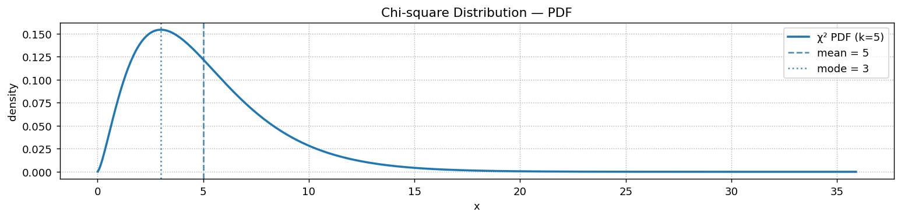

# 카이제곱 밀도함수

## 개요

자유도가 $k$인 **카이제곱 분포**는 독립인 표준정규확률변수 $k$개의 제곱합의 분포로 나타난다:

$$
Q = Z_1^2 + Z_2^2 + \cdots + Z_k^2, \qquad Z_i \overset{\text{iid}}{\sim} N(0,1)
$$

가설검정(적합도 검정, 독립성 검정)과 분산의 신뢰구간 구성에서 근본적인 역할을 한다.

---

## PDF

$$
f(x; k) = \frac{1}{2^{k/2}\,\Gamma(k/2)}\, x^{k/2 - 1}\, e^{-x/2}, \qquad x \ge 0
$$

| 성질 | 값 |
|---|---|
| 지지집합 | $[0, \infty)$ |
| 평균 | $k$ |
| 분산 | $2k$ |
| 최빈값 | $\max(k - 2,\, 0)$ |

---

## 코드

<div class="codebox" markdown>

### 예제 1. 카이제곱 밀도함수 그리기 { .eg }

```python
import numpy as np
import matplotlib.pyplot as plt
import scipy.stats as stats

k = 5                      # 자유도. 표준정규 k개를 제곱해 더한 것의 분포다.
chi2 = stats.chi2(df=k)

# x 범위를 분위수로 정한다. 눈대중으로 (0, 20) 같은 범위를 쓰면
# 자유도가 바뀔 때마다 그림이 잘리거나 남는다.
# ppf(1e-6)부터 ppf(1-1e-6)까지 잡으면 어떤 k에서도 꼬리까지 알맞게 담긴다.
x = np.linspace(chi2.ppf(1e-6), chi2.ppf(1 - 1e-6), 600)
y = chi2.pdf(x)

fig, ax = plt.subplots(figsize=(12, 3))
ax.plot(x, y, lw=2, label=f"χ² PDF (k={k})")
# 평균은 정확히 k, 최빈값은 k-2 (k >= 2일 때).
# 둘이 다르다는 것이 곧 이 분포가 오른쪽으로 치우쳐 있다는 뜻이다.
ax.axvline(k, linestyle='--', alpha=0.8, label=f"mean = {k}")
ax.axvline(max(k - 2, 0), linestyle=':', alpha=0.8, label=f"mode = {max(k-2, 0)}")
ax.set_title("Chi-square Distribution — PDF")
ax.set_xlabel("x")
ax.set_ylabel("density")
ax.legend()
ax.grid(True, linestyle=":")
plt.tight_layout()
plt.show()
```



</div>

---

## 자유도에 따른 모양

- **$k = 1, 2$:** 오른쪽으로 심하게 치우치며 밀도가 0 또는 그 근처에서 정점을 이룬다.
- **$k \approx 10$:** 치우침이 중간 정도이고 종 모양에 가깝지만 비대칭이다.
- **큰 $k$:** 중심극한정리에 의해 $\chi^2_k \approx N(k, 2k)$이다.

!!! note "정규분포와의 연결"
    $\chi^2_k$는 i.i.d. 확률변수 $k$개(각각 $Z_i^2$)의 합이므로, 중심극한정리가 큰 $k$에서 근사적 정규성을 보장한다.

---

## 연습문제

<div class="drillbox" markdown>

**연습문제 1.** <span class="diff med" title="중간"></span>
$Q \sim \chi^2_k$에 대해 정의 $Q = \sum_{i=1}^k Z_i^2$로부터 $E[Q]$와 $\text{Var}(Q)$를 계산하라.

</div>

??? success "풀이"
    각 $Z_i^2$에 대해 $E[Z_i^2] = 1$이고 $\text{Var}(Z_i^2) = E[Z_i^4] - (E[Z_i^2])^2 = 3 - 1 = 2$이다.

    독립성에 의해:

    $$
    E[Q] = \sum_{i=1}^k E[Z_i^2] = k, \qquad \text{Var}(Q) = \sum_{i=1}^k \text{Var}(Z_i^2) = 2k
    $$

<div class="drillbox" markdown>

**연습문제 2.** <span class="diff med" title="중간"></span>
$X \sim \chi^2_m$과 $Y \sim \chi^2_n$이 독립이면 $X + Y \sim \chi^2_{m+n}$임을 보여라.

</div>

??? success "풀이"
    모든 $Z_i, W_j$가 독립인 $N(0,1)$일 때 $X = \sum_{i=1}^m Z_i^2$, $Y = \sum_{j=1}^n W_j^2$로 쓰자. 그러면:

    $$
    X + Y = \sum_{i=1}^m Z_i^2 + \sum_{j=1}^n W_j^2
    $$

    이는 독립인 표준정규확률변수 $m + n$개의 제곱합이므로 정의에 의해 $X + Y \sim \chi^2_{m+n}$이다. $\square$

<div class="drillbox" markdown>

**연습문제 3.** <span class="diff med" title="중간"></span>
PDF를 미분하여 0으로 두고, $k \ge 2$일 때 $\chi^2_k$의 최빈값이 $k - 2$임을 보여라.

</div>

??? success "풀이"
    PDF에 로그를 취하면 $\ln f(x) = \text{const} + (k/2 - 1)\ln x - x/2$이다. 미분하면:

    $$
    \frac{d}{dx}\ln f(x) = \frac{k/2 - 1}{x} - \frac{1}{2} = 0
    $$

    풀면 $x = k - 2$이다. $k \ge 2$이면 이 값은 음이 아니고 지지집합 $[0, \infty)$에 속하므로 최빈값은 $k - 2$이다. $k < 2$이면 $x > 0$에서 도함수가 항상 음수이므로 최빈값은 $x = 0$이다.

<div class="drillbox" markdown>

**연습문제 4.** <span class="diff easy" title="쉬움"></span>
$N(\mu, \sigma^2)$에서 크기 $n = 25$인 확률표본을 뽑아 $s^2 = 12$를 얻었다. 카이제곱 분포를 사용하여 $\sigma^2$에 대한 95% 신뢰구간을 구성하라.

</div>

??? success "풀이"
    추축량은 $(n-1)s^2/\sigma^2 \sim \chi^2_{n-1}$이다. $n-1 = 24$이므로:

    $$
    P\!\left(\chi^2_{0.025} \le \frac{24 \cdot 12}{\sigma^2} \le \chi^2_{0.975}\right) = 0.95
    $$

    SciPy를 사용하면 $\chi^2_{0.025, 24} = 12.40$, $\chi^2_{0.975, 24} = 39.36$이다.

    $$
    \frac{24 \times 12}{39.36} \le \sigma^2 \le \frac{24 \times 12}{12.40}
    $$

    $$
    7.32 \le \sigma^2 \le 23.23
    $$

<div class="drillbox" markdown>

**연습문제 5.** <span class="diff med" title="중간"></span>
$\chi^2_k$의 적률생성함수를 구하고, 그것으로 연습문제 $1$·$2$를 다시 유도하라. 왜도와 첨도는 얼마인가?

</div>

??? success "풀이"
    $Z\sim N(0,1)$일 때 $\mathbb{E}[e^{tZ^2}]=(1-2t)^{-1/2}$($t<1/2$)이므로, 독립인 $k$개의 곱으로

    $$
    M_Q(t)=(1-2t)^{-k/2},\qquad t<\tfrac12
    $$

    **가법성이 즉시 나온다.** $(1-2t)^{-m/2}(1-2t)^{-n/2}=(1-2t)^{-(m+n)/2}$이므로 연습문제 $2$가 한 줄이다.

    **누율생성함수가 특히 깔끔하다.**

    $$
    K_Q(t)=\ln M_Q(t)=-\frac k2\ln(1-2t)
    \;\Longrightarrow\;
    \kappa_n = 2^{n-1}(n-1)!\;k
    $$

    따라서 $\kappa_1=k$, $\kappa_2=2k$(연습문제 $1$), $\kappa_3=8k$, $\kappa_4=48k$이고

    $$
    \gamma_1=\frac{\kappa_3}{\kappa_2^{3/2}}=\sqrt{\frac 8k},\qquad
    \gamma_2=\frac{\kappa_4}{\kappa_2^{2}}=\frac{12}{k}
    $$

    ```python
    import numpy as np
    from scipy import stats

    print(f"{'k':>5}{'sqrt(8/k)':>13}{'scipy 왜도':>13}{'12/k':>10}{'scipy 초과첨도':>16}")
    for k in (1, 2, 5, 10, 50, 100):
        s, kk = stats.chi2.stats(k, moments="sk")
        print(f"{k:>5}{np.sqrt(8 / k):>13.4f}{float(s):>13.4f}"
              f"{12 / k:>10.4f}{float(kk):>16.4f}")
    ```

    출력:

    ```
    k    sqrt(8/k)     scipy 왜도      12/k      scipy 초과첨도
        1       2.8284       2.8284   12.0000         12.0000
        2       2.0000       2.0000    6.0000          6.0000
        5       1.2649       1.2649    2.4000          2.4000
       10       0.8944       0.8944    1.2000          1.2000
       50       0.4000       0.4000    0.2400          0.2400
      100       0.2828       0.2828    0.1200          0.1200
    ```

    **공식이 정확히 맞는다.** 그리고 $k\to\infty$면 $\gamma_1,\gamma_2\to0$이라 "자유도에 따른 모양"에서 말한 정규근사가 확인된다.

    **다만 수렴이 느리다.** $k=100$에서도 왜도가 $0.283$으로 아직 $0$이 아니다. 이 치우침을 어떻게 다루는지가 다음 문제다. $\square$

<div class="drillbox" markdown>

**연습문제 6.** <span class="diff hard" title="어려움"></span>
$\chi^2_k\approx N(k,2k)$는 실제로 얼마나 정확한가? **피셔 근사**와 **윌슨–힐퍼티 근사**와 비교하라.

</div>

??? success "풀이"
    | 근사 | 표준화 변수 |
    |---|---|
    | 단순 | $\dfrac{Q-k}{\sqrt{2k}}$ |
    | 피셔 | $\sqrt{2Q}-\sqrt{2k-1}$ |
    | 윌슨–힐퍼티 | $\dfrac{(Q/k)^{1/3}-\left(1-\frac{2}{9k}\right)}{\sqrt{2/(9k)}}$ |

    ```python
    import numpy as np
    from scipy import stats

    rng = np.random.default_rng(0)
    print(f"{'k':>5}{'단순':>12}{'피셔':>12}{'윌슨-힐퍼티':>16}   (N(0,1)까지의 KS 거리)")
    for k in (2, 5, 10, 30, 100):
        Q = stats.chi2.rvs(k, size=200_000, random_state=rng)
        a = (Q - k) / np.sqrt(2 * k)
        b = np.sqrt(2 * Q) - np.sqrt(2 * k - 1)
        c = ((Q / k) ** (1 / 3) - (1 - 2 / (9 * k))) / np.sqrt(2 / (9 * k))
        print(f"{k:>5}{stats.kstest(a, 'norm').statistic:>12.4f}"
              f"{stats.kstest(b, 'norm').statistic:>12.4f}"
              f"{stats.kstest(c, 'norm').statistic:>16.4f}")
    ```

    출력:

    ```
    k          단순          피셔          윌슨-힐퍼티   (N(0,1)까지의 KS 거리)
        2      0.1587      0.0541          0.0124
        5      0.0831      0.0191          0.0033
       10      0.0584      0.0136          0.0027
       30      0.0345      0.0088          0.0017
      100      0.0211      0.0074          0.0032
    ```

    **차이가 극적이다.** $k=2$에서 단순 근사의 KS 거리가 $0.159$인 반면 윌슨–힐퍼티는 $0.0124$로 **$13$배 정확**하다. $k=10$에서도 $0.0584$ 대 $0.0027$이다.

    **왜 세제곱근인가.** $Q$의 왜도가 $\sqrt{8/k}$인데, $Q^{1/3}$을 취하면 이 치우침이 거의 정확히 상쇄된다. **분산안정화·정규화 변환**의 전형적인 예이며, 같은 발상이 감마분포·포아송분포에도 쓰인다.

    **실무 지침.** $k$가 작을 때 $\chi^2$의 확률을 정규분포로 근사해야 한다면 반드시 윌슨–힐퍼티를 쓴다. 물론 `scipy.stats.chi2`로 정확히 계산할 수 있으면 그쪽이 낫다. $\square$

<div class="drillbox" markdown>

**연습문제 7.** <span class="diff med" title="중간"></span>
$\chi^2_k$가 감마분포의 특수한 경우임을 보이고, 표본분산이 왜 $\chi^2_{n-1}$을 따르는지(자유도가 왜 $n$이 아니라 $n-1$인지) 설명하라.

</div>

??? success "풀이"
    PDF를 감마분포 $\text{Gamma}(\alpha,\theta)$의 밀도 $\frac{1}{\Gamma(\alpha)\theta^\alpha}x^{\alpha-1}e^{-x/\theta}$와 맞춰 보면

    $$
    \chi^2_k=\text{Gamma}\!\left(\alpha=\tfrac k2,\;\theta=2\right)
    $$

    **자유도 $2$는 지수분포다**($\alpha=1$).

    **표본분산의 자유도.** $X_i\sim N(\mu,\sigma^2)$일 때 항등식

    $$
    \underbrace{\sum_i\frac{(X_i-\mu)^2}{\sigma^2}}_{\chi^2_n}
    =\underbrace{\frac{n(\bar X-\mu)^2}{\sigma^2}}_{\chi^2_1}
    +\underbrace{\frac{(n-1)s^2}{\sigma^2}}_{\chi^2_{n-1}}
    $$

    이 성립하고, **코크런 정리**에 의해 우변의 두 항이 **독립**이며 각각 $\chi^2_1$, $\chi^2_{n-1}$이다.

    ```python
    import numpy as np
    from scipy import stats

    rng = np.random.default_rng(0)
    x = np.linspace(0.1, 20, 7)
    print("chi2(k=5) 와 Gamma(a=2.5, scale=2) 의 밀도가 같은가:",
          np.allclose(stats.chi2.pdf(x, 5), stats.gamma.pdf(x, 2.5, scale=2)))

    n, mu, sig = 8, 3.0, 2.0
    X = rng.normal(mu, sig, (400_000, n))
    m, s2 = X.mean(1), X.var(1, ddof=1)
    Q = (n - 1) * s2 / sig ** 2

    print(f"\n(n-1)s^2/sigma^2:  평균 {Q.mean():.4f} (df={n-1}),"
          f"  분산 {Q.var():.4f} (2df={2*(n-1)})")
    print(f"  chi2_{n-1} 까지의 KS 거리 = "
          f"{stats.kstest(Q, 'chi2', args=(n - 1,)).statistic:.4f}")
    print(f"  corr(Xbar, s^2) = {np.corrcoef(m, s2)[0, 1]:+.5f}   <- 독립")

    left = ((X - mu) ** 2).sum(1) / sig ** 2
    right1 = n * (m - mu) ** 2 / sig ** 2
    print(f"\n분해:  좌변 평균 {left.mean():.4f} (df={n})"
          f"  =  {right1.mean():.4f} (df=1)  +  {Q.mean():.4f} (df={n-1})")
    ```

    출력:

    ```
    chi2(k=5) 와 Gamma(a=2.5, scale=2) 의 밀도가 같은가: True

    (n-1)s^2/sigma^2:  평균 6.9973 (df=7),  분산 14.0410 (2df=14)
      chi2_7 까지의 KS 거리 = 0.0017
      corr(Xbar, s^2) = +0.00095   <- 독립

    분해:  좌변 평균 7.9963 (df=8)  =  0.9990 (df=1)  +  6.9973 (df=7)
    ```

    **모든 것이 확인된다.** 평균 $6.997\approx7$, 분산 $14.04\approx14$, KS 거리 $0.0017$(모의오차 수준), 상관 $+0.00095$($\approx0$).

    **자유도 하나를 잃는 이유.** $\mu$ 대신 $\bar X$를 쓰면 $n$개의 편차 $X_i-\bar X$가 $\sum_i(X_i-\bar X)=0$이라는 **제약 하나**를 만족한다. $n$차원 공간의 자유로운 방향이 $n-1$개로 줄어드는 것이며, 이것이 **베셀 보정**($n-1$로 나누기)의 기하학적 의미다.

    **정규성이 본질적이다.** $\bar X$와 $s^2$의 독립성은 **정규분포의 특징적 성질**이며(다른 어떤 분포도 이 성질을 갖지 않는다), $t$ 분포와 $F$ 분포가 성립하는 근거다. $\square$

<div class="drillbox" markdown>

**연습문제 8.** <span class="diff med" title="중간"></span>
적합도 검정통계량 $X^2=\sum_j (O_j-E_j)^2/E_j$가 왜 $\chi^2_{m-1}$로 가는지 설명하고 확인하라.

</div>

??? success "풀이"
    $(O_1,\ldots,O_m)\sim\text{Multinomial}(n,\mathbf p)$일 때, 각 $O_j$는 근사적으로 $N(np_j,\,np_j(1-p_j))$이고 서로 음의 상관을 갖는다. 다변량 중심극한정리를 적용하면 표준화된 벡터

    $$
    U_j=\frac{O_j-np_j}{\sqrt{np_j}}
    $$

    가 근사적으로 다변량 정규를 따르며, 그 공분산행렬이 $I-\sqrt{\mathbf p}\sqrt{\mathbf p}^\top$이다. 이는 **$\sqrt{\mathbf p}$ 방향으로의 사영을 뺀 것**, 곧 계수 $m-1$인 사영행렬이다.

    $$
    X^2=\|\mathbf U\|^2 \xrightarrow{d}\chi^2_{m-1}
    $$

    **자유도가 $m-1$인 이유는 $\sum_j O_j=n$이라는 제약** 하나 때문이며, 연습문제 $7$과 같은 구조다.

    ```python
    import numpy as np
    from scipy import stats

    rng = np.random.default_rng(0)
    for m, n in [(4, 50), (4, 500), (10, 500)]:
        p = np.full(m, 1 / m)
        O = rng.multinomial(n, p, size=200_000)
        X2 = ((O - n * p) ** 2 / (n * p)).sum(1)
        print(f"범주 {m:>2}, n={n:>4}:  평균 {X2.mean():>7.4f} (df={m-1}),"
              f"  분산 {X2.var():>7.4f} (2df={2*(m-1)}),"
              f"  KS = {stats.kstest(X2, 'chi2', args=(m - 1,)).statistic:.4f}")
    ```

    출력:

    ```
    범주  4, n=  50:  평균  3.0022 (df=3),  분산  5.9008 (2df=6),  KS = 0.0507
    범주  4, n= 500:  평균  3.0051 (df=3),  분산  5.9967 (2df=6),  KS = 0.0084
    범주 10, n= 500:  평균  8.9948 (df=9),  분산 17.9558 (2df=18),  KS = 0.0031
    ```

    **평균과 분산이 정확히 $m-1$과 $2(m-1)$이다.** $n=50$에서도 평균 $2.9993$, 분산 $5.897$이다.

    **분포 전체의 근사는 $n$에 달렸다.** KS 거리가 $n=50$에서 $0.050$, $n=500$에서 $0.0082$로 줄어든다. **$X^2$의 처음 두 적률은 소표본에서도 맞지만 꼬리는 그렇지 않다** — 이것이 "기대도수 $5$ 이상" 규칙의 근거다.

    **모수를 추정하면 자유도가 더 줄어든다.** 분포의 모수 $r$개를 자료에서 추정하면 자유도가 $m-1-r$이 된다. 제약이 하나씩 더 붙기 때문이며, 같은 사영 논리다. $\square$

<div class="drillbox" markdown>

**연습문제 9.** <span class="diff hard" title="어려움"></span>
대립가설 아래에서 $X^2$은 **비중심 카이제곱**을 따른다. 이를 이용해 검정력을 계산하라.

</div>

??? success "풀이"
    $\mathbf Z\sim N(\boldsymbol\delta,I_k)$이면 $\|\mathbf Z\|^2$은 **비중심모수** $\lambda=\|\boldsymbol\delta\|^2$인 비중심 카이제곱 $\chi^2_k(\lambda)$을 따르고

    $$
    \mathbb{E}=k+\lambda,\qquad \operatorname{Var}=2k+4\lambda
    $$

    적합도 검정에서 참 확률이 $\mathbf p^{(1)}$이고 귀무가설이 $\mathbf p^{(0)}$이면

    $$
    \lambda = n\sum_j \frac{\left(p^{(1)}_j-p^{(0)}_j\right)^2}{p^{(0)}_j}
    $$

    **$\lambda$가 $n$에 비례한다.** 이것이 표본을 늘리면 검정력이 오르는 정확한 메커니즘이다.

    ```python
    import numpy as np
    from scipy import stats

    rng = np.random.default_rng(0)
    p1 = np.array([0.30, 0.25, 0.25, 0.20])
    p0 = np.full(4, 0.25)
    crit = stats.chi2.ppf(0.95, 3)
    print(f"기각역: X^2 > {crit:.4f}")
    print(f"{'n':>7}{'lambda':>12}{'이론 검정력':>15}{'모의 검정력':>15}")
    for n in (100, 300, 1000, 3000):
        lam = n * ((p1 - p0) ** 2 / p0).sum()
        O = rng.multinomial(n, p1, size=100_000)
        X2 = ((O - n * p0) ** 2 / (n * p0)).sum(1)
        print(f"{n:>7}{lam:>12.4f}{stats.ncx2.sf(crit, 3, lam):>15.4f}"
              f"{np.mean(X2 > crit):>15.4f}")
    ```

    출력:

    ```
    기각역: X^2 > 7.8147
          n      lambda         이론 검정력         모의 검정력
        100      2.0000         0.1922         0.1903
        300      6.0000         0.5181         0.5168
       1000     20.0000         0.9751         0.9765
       3000     60.0000         1.0000         1.0000
    ```

    **이론과 모의가 소수 셋째 자리까지 맞는다.**

    | $n$ | $\lambda$ | 검정력 |
    |---|---|---|
    | $100$ | $2.0$ | $0.192$ |
    | $300$ | $6.0$ | $0.518$ |
    | $1\,000$ | $20.0$ | $0.975$ |

    **표본크기 설계에 바로 쓸 수 있다.** 검정력 $0.80$을 원하면 $\lambda\approx10.9$가 필요하고, $\lambda=n\times0.02$이므로 $n\approx545$다.

    **$\lambda/n$이 효과크기다.** 위 예에서 $\sum_j(p^{(1)}_j-p^{(0)}_j)^2/p^{(0)}_j=0.02$이며, 코헨의 $w=\sqrt{0.02}=0.141$로 "작은 효과"에 해당한다. 작은 효과를 잡으려면 큰 표본이 필요하다는 것이 $\lambda\propto n$의 실무적 번역이다. $\square$

<div class="drillbox" markdown>

**연습문제 10.** <span class="diff med" title="중간"></span>
연습문제 $4$의 신뢰구간은 **정규성**을 가정한다. 그 가정이 틀리면 얼마나 나빠지는가? 실제 포함률을 측정하라.

</div>

??? success "풀이"
    ```python
    import numpy as np
    from scipy import stats

    rng = np.random.default_rng(0)
    n, B = 25, 100_000
    lo, hi = stats.chi2.ppf([0.025, 0.975], n - 1)

    print(f"n = {n}, 목표 신뢰수준 95%")
    print(f"{'모집단':>12}{'초과첨도':>12}{'실제 포함률':>14}")
    cases = [("정규", stats.norm), ("균등", stats.uniform), ("지수", stats.expon),
             ("t(5)", stats.t(5)), ("로그정규", stats.lognorm(1.0))]
    for name, d in cases:
        X = d.rvs(size=(B, n), random_state=rng)
        s2, v = X.var(1, ddof=1), d.var()
        cover = np.mean(((n - 1) * s2 / hi <= v) & (v <= (n - 1) * s2 / lo))
        print(f"{name:>12}{float(d.stats(moments='k')):>12.2f}{cover:>14.4f}")
    ```

    출력:

    ```
    n = 25, 목표 신뢰수준 95%
             모집단        초과첨도        실제 포함률
              정규        0.00        0.9495
              균등       -1.20        0.9963
              지수        6.00        0.7208
            t(5)        6.00        0.8338
            로그정규      110.94        0.4165
    ```

    **결과가 참담하다.**

    | 모집단 | 초과첨도 | 실제 포함률 |
    |---|---|---|
    | 정규 | $0$ | $0.949$ ✅ |
    | 균등 | $-1.2$ | $0.997$ (과대포함) |
    | 지수 | $6$ | $0.720$ ❌ |
    | $t(5)$ | $6$ | $0.834$ ❌ |
    | 로그정규 | $111$ | **$0.420$** ❌❌ |

    **로그정규에서 $95\%$ 구간이 실제로는 $42\%$만 포함한다.** 절반 이상의 경우에 참 분산이 구간 밖에 있다.

    **원인은 4차적률이다.** $\sqrt n(s^2-\sigma^2)$의 점근분산은 $\mu_4-\sigma^4=\sigma^4(\gamma_2+2)$인데, 카이제곱 구간은 $\gamma_2=0$(정규)을 가정해 **$2\sigma^4$**만 반영한다. 초과첨도가 $6$이면 실제 변동성이 $4$배($\gamma_2+2=8$ 대 $2$)라 구간이 절반 폭으로 좁다.

    **표본크기를 늘려도 낫지 않는다.** 평균의 신뢰구간은 중심극한정리 덕분에 $n$이 커지면 정규성 위반이 씻겨 나가지만, **분산의 카이제곱 구간은 $n\to\infty$에서도 잘못된 분포를 쓰고 있다.** 편향이 사라지지 않는다.

    !!! danger "분산의 카이제곱 신뢰구간은 정규성에 취약하다"
        평균의 $t$ 구간은 웬만큼 강건하지만, 분산의 $\chi^2$ 구간은 **강건하지 않다.** 자료가 정규임을 확신할 수 없으면 쓰지 말아야 한다.

    **대안.**

    | 방법 | 내용 |
    |---|---|
    | 부트스트랩 | $s^2$의 분포를 재표집으로 직접 추정 |
    | 첨도 보정 | 점근분산에 $\hat\gamma_2$를 넣어 조정 |
    | 로그 변환 후 분석 | 곱셈적 자료(로그정규)에 적합 |
    | 사분위범위·MAD | 분산 자체를 포기하고 강건 척도 사용 |

    **먼저 첨도를 재라.** $\hat\gamma_2$가 $1$을 넘으면 카이제곱 구간을 신뢰하지 않는 편이 안전하다. $\square$

---

## 정리하며

카이제곱분포는 **독립인 표준정규 $k$ 개의 제곱합**이며, 그 하나의 정의에서 모든 성질이 나온다.

- **평균 $k$, 분산 $2k$, 최빈값 $\max(k-2,0)$.** 평균과 최빈값이 다르다는 것이 곧 오른쪽으로 치우쳤다는 뜻이다.
- **가법성.** 독립이면 $\chi^2_m+\chi^2_n=\chi^2_{m+n}$ 이다. 적률생성함수 $(1-2t)^{-k/2}$ 를 곱해 보면 한 줄로 나온다.
- **감마분포의 특수한 경우**($\alpha=k/2$, $\theta=2$)이며, $k=2$ 이면 지수분포다.
- **$k$ 가 크면 $N(k,2k)$ 에 가까워지지만 수렴이 느리다.** 왜도가 $\sqrt{8/k}$ 라 $k=100$ 에서도 $0.28$ 이다. 정규근사가 필요하면 단순 표준화보다 **윌슨–힐퍼티 세제곱근 변환**이 훨씬 정확하다.
- **어디서 나오는가.** 표본분산의 분포 $(n-1)s^2/\sigma^2\sim\chi^2_{n-1}$, 적합도·독립성 검정통계량의 극한, 그리고 $F$ 분포의 분자와 분모가 모두 카이제곱이다.

!!! warning "분산의 카이제곱 신뢰구간은 정규성에 취약하다"
    평균의 $t$ 구간과 달리 이 구간은 강건하지 않다. 연습문제 $10$ 에서 보듯 로그정규 자료에서 명목 $95\%$ 구간의 실제 포함률이 $42\%$ 까지 떨어지며, **표본을 늘려도 나아지지 않는다.**

다음 절 **$F$ 분포**로 넘어간다. 독립인 두 카이제곱의 비이며, 분산분석과 회귀모형 비교의 언어다.
