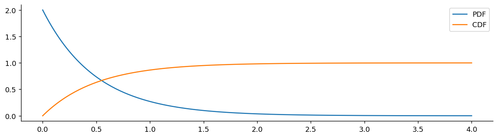
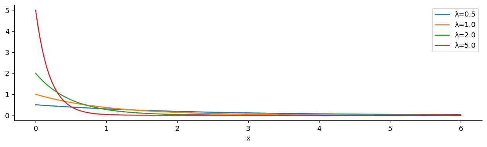
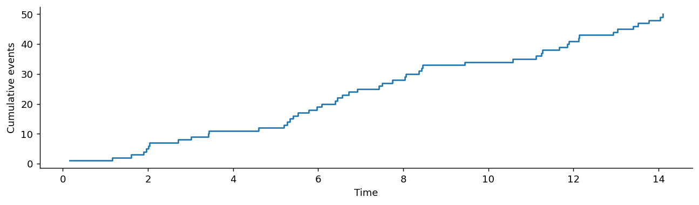

# Exponential 분포

## 개요

**Exponential 분포**는 Poisson 과정에서 사건 사이의 시간을 모형화한다. Geometric 분포의 연속형 대응물이며, 무기억성을 갖는 유일한 연속분포이다. 도착 간 시간, 대기 시간, 부품 수명 모형화에 흔히 쓰인다.

---

## Exponential 분포와 누적분포함수

<div class="defn" markdown>

**정의 1.** [Exponential 분포]

확률변수 $X$가 비율 모수 $\lambda > 0$인 Exponential 분포를 따른다는 것은 다음을 뜻한다:

$$
X \sim \text{Exponential}(\lambda), \qquad f(x) = \lambda e^{-\lambda x}, \quad x \geq 0
$$

**다른 모수화:** 어떤 교재에서는 척도 모수 $\beta = 1/\lambda$를 사용하여 $f(x) = \frac{1}{\beta}e^{-x/\beta}$로 쓴다. SciPy는 척도 모수화를 사용한다.

</div>

### CDF

$$
F(x) = 1 - e^{-\lambda x}, \quad x \geq 0
$$

### 생존함수

$$
S(x) = P(X > x) = e^{-\lambda x}
$$

---

## 성질

$$
\begin{aligned}
E[X] &= \frac{1}{\lambda} \\[4pt]
\text{Var}(X) &= \frac{1}{\lambda^2} \\[4pt]
\text{SD}(X) &= \frac{1}{\lambda} \\[4pt]
\text{Median} &= \frac{\ln 2}{\lambda}
\end{aligned}
$$

$\text{평균} = \text{표준편차} = 1/\lambda$라는 점에 주목하라. Exponential 분포의 두드러진 특징이다.

### 평균의 유도

$$
E[X] = \int_0^{\infty} x \lambda e^{-\lambda x}\,dx = \left[-x e^{-\lambda x}\right]_0^{\infty} + \int_0^{\infty} e^{-\lambda x}\,dx = \frac{1}{\lambda}
$$

### 분산의 유도

$$
E[X^2] = \int_0^{\infty} x^2 \lambda e^{-\lambda x}\,dx = \frac{2}{\lambda^2}
$$

$$
\text{Var}(X) = E[X^2] - (E[X])^2 = \frac{2}{\lambda^2} - \frac{1}{\lambda^2} = \frac{1}{\lambda^2}
$$

---

## 무기억성

Exponential 분포는 무기억성을 갖는 **유일한** 연속분포이다:

$$
P(X > s + t \mid X > s) = P(X > t) \quad \text{for all } s, t \geq 0
$$

??? proof "증명"


    $$
    P(X > s + t \mid X > s) = \frac{P(X > s + t)}{P(X > s)} = \frac{e^{-\lambda(s+t)}}{e^{-\lambda s}} = e^{-\lambda t} = P(X > t)
    $$

    **해석:** 이미 $s$만큼의 시간을 기다렸더라도 남은 대기 시간의 분포는 방금 시작했을 때와 같다. 이 과정은 자신의 이력을 "잊어버린다".

    ---

## Poisson 과정과의 연결

사건이 비율 $\lambda$인 Poisson 과정에 따라 도착하면:

$$
\begin{aligned}
\text{Number of events in } [0, t] &\sim \text{Poisson}(\lambda t) \\
\text{Time between consecutive events} &\sim \text{Exponential}(\lambda) \\
\text{Time to the } n\text{-th event} &\sim \text{Gamma}(n, \lambda)
\end{aligned}
$$

---

## Exponential 확률변수의 최솟값

$X_1 \sim \text{Exp}(\lambda_1)$과 $X_2 \sim \text{Exp}(\lambda_2)$가 독립이면:

$$
\min(X_1, X_2) \sim \text{Exp}(\lambda_1 + \lambda_2)
$$

??? proof "증명"


    $$
    P(\min(X_1, X_2) > t) = P(X_1 > t) \cdot P(X_2 > t) = e^{-\lambda_1 t} \cdot e^{-\lambda_2 t} = e^{-(\lambda_1 + \lambda_2)t}
    $$

    이는 $n$개의 독립인 Exponential 확률변수로 일반화된다: $\min(X_1, \ldots, X_n) \sim \text{Exp}\left(\sum_{i=1}^n \lambda_i\right)$.

    ---

## 문제

<div class="probox" markdown>

**문제:** <span class="diff easy" title="쉬움"></span> 어떤 트레이딩 데스크에 주문이 시간당 평균 12건 도착한다. 연속한 주문 사이의 시간이 10분을 넘을 확률은?

</div>

??? success "풀이"
    비율은 시간당 $\lambda = 12$, 즉 분당 $0.2$이다.

    $$
    P(X > 10) = e^{-0.2 \times 10} = e^{-2} \approx 0.1353
    $$

    주문 사이의 기대 시간: $E[X] = 1/0.2 = 5$분.
---

## Python: PDF, CDF, 표본추출

### PDF와 CDF

```python
import matplotlib.pyplot as plt
import numpy as np
from scipy import stats

lam = 2.0                      # 비율모수. 단위 시간당 평균 2회 발생.
x = np.linspace(0, 4, 200)     # 지수분포는 x >= 0 에서만 정의된다

fig, ax = plt.subplots(figsize=(12, 3))
# scipy는 rate가 아니라 scale = 1/rate 를 받는다. 이 책에서 반복되는 함정이다.
# PDF는 x=0 에서 lam(=2)으로 시작해 단조 감소한다.
#   -> 지수분포에서 가장 있을 법한 대기시간은 **0에 가까운 값**이다.
# CDF는 0에서 1로 오르며 1 - e^{-lam x} 다.
ax.plot(x, stats.expon(scale=1/lam).pdf(x), label='PDF')
ax.plot(x, stats.expon(scale=1/lam).cdf(x), label='CDF')
ax.spines[['top', 'right']].set_visible(False)
ax.legend()
plt.show()
```



### 비율에 따른 비교

```python
import matplotlib.pyplot as plt
import numpy as np
from scipy import stats

fig, ax = plt.subplots(figsize=(12, 3))
# lam 하나가 모든 것을 정한다. 평균 = 표준편차 = 1/lam 이다.
# lam이 커질수록 시작 높이가 높아지고 더 빨리 0으로 떨어진다.
# 네 곡선 모두 x=0 에서의 높이가 정확히 lam 이라는 점을 확인해 보라.
for lam in [0.5, 1.0, 2.0, 5.0]:
    x = np.linspace(0, 6, 200)
    ax.plot(x, stats.expon(scale=1/lam).pdf(x), label=f'λ={lam}')
ax.spines[['top', 'right']].set_visible(False)
ax.set_xlabel('x')
ax.legend()
plt.show()
```



### 표본추출과 검증

```python
import numpy as np
from scipy import stats

np.random.seed(42)
lam = 3.0
samples = stats.expon(scale=1/lam).rvs(100_000)

# 지수분포의 특징: 평균과 **표준편차**가 같다(둘 다 1/lam).
# 분산은 1/lam^2 이므로 평균과 다르다. 포아송(평균 = 분산)과 헷갈리기 쉽다.
print(f"Theoretical mean: {1/lam:.4f},  Sample mean: {samples.mean():.4f}")
print(f"Theoretical var:  {1/lam**2:.4f},  Sample var:  {samples.var():.4f}")
print(f"Mean ≈ SD: {np.isclose(samples.mean(), samples.std(), atol=0.01)}")
```

출력:

```
Theoretical mean: 0.3333,  Sample mean: 0.3320
Theoretical var:  0.1111,  Sample var:  0.1096
Mean ≈ SD: True
```

### 무기억성 확인하기

```python
import numpy as np
from scipy import stats

np.random.seed(42)
lam = 2.0
samples = stats.expon(scale=1/lam).rvs(1_000_000)

s = 0.5
# 무기억성: P(X > s+t | X > s) = P(X > t).
# "이미 0.5만큼 기다렸다"는 사실이 앞으로의 대기시간에 아무 정보도 주지 않는다.
# 연속분포 중에서 이 성질을 갖는 것은 **지수분포뿐이다.**
# (이산분포에서는 기하분포가 유일하다.)
for t in [0.25, 0.5, 1.0]:
    # samples > s 로 "0.5를 넘긴 표본만" 골라 조건을 건다
    conditional = np.mean(samples[samples > s] > s + t)
    unconditional = np.mean(samples > t)
    print(f"P(X>{s}+{t}|X>{s}) = {conditional:.4f},  P(X>{t}) = {unconditional:.4f}")
```

출력:

```
P(X>0.5+0.25|X>0.5) = 0.6066,  P(X>0.25) = 0.6068
P(X>0.5+0.5|X>0.5) = 0.3681,  P(X>0.5) = 0.3682
P(X>0.5+1.0|X>0.5) = 0.1360,  P(X>1.0) = 0.1355
```

### Poisson 과정 모의실험

```python
import numpy as np
import matplotlib.pyplot as plt
from scipy import stats

np.random.seed(42)
lam = 3.0        # 단위 시간당 평균 3회 발생
n_events = 50

# 포아송 과정을 만드는 가장 쉬운 방법: 사건 **사이의 간격**을 지수분포에서 뽑고
# 누적합을 취해 도착 시각으로 바꾼다.
# 지수 간격 <-> 포아송 계수는 같은 과정의 두 얼굴이다.
inter_arrivals = stats.expon(scale=1/lam).rvs(n_events)
arrival_times = np.cumsum(inter_arrivals)

fig, ax = plt.subplots(figsize=(12, 3))
# 계수과정 N(t)는 사건이 일어날 때만 1씩 뛰는 계단함수다.
# where='post' 로 "그 시각에 뛰어오른 뒤 다음까지 유지"를 나타낸다.
ax.step(arrival_times, range(1, n_events + 1), where='post', lw=1.5)
ax.set_xlabel('Time')
ax.set_ylabel('Cumulative events')
ax.spines[['top', 'right']].set_visible(False)
plt.show()
```



---

## 연습문제

<div class="drillbox" markdown>

**연습문제 1.** <span class="diff easy" title="쉬움"></span>
부품 수명이 $T \sim \mathrm{Exp}(0.5)$(단위: 년)이다. (a) $P(T > 3)$. (b) $P(T > 3 \mid T > 2)$. (c) 독립인 부품 두 개에 대해 $\min(T_1, T_2)$의 분포와 기댓값.

</div>

??? success "풀이"
    (a) $P(T > 3) = e^{-1.5} \approx 0.223$.

    (b) 무기억성에 의해 $P(T > 3 \mid T > 2) = P(T > 1) = e^{-0.5} \approx 0.607$. 직접 계산하면 $P(T > 3)/P(T > 2) = e^{-1.5}/e^{-1} = e^{-0.5}$.

    (c) $\min(T_1, T_2) \sim \mathrm{Exp}(\lambda_1 + \lambda_2) = \mathrm{Exp}(1.0)$. $\mathbb{E}[\min] = 1$년(부품 하나일 때의 절반).

<div class="drillbox" markdown>

**연습문제 2.** <span class="diff hard" title="어려움"></span>
Exponential 분포의 **무기억성을 증명**하고, 이 성질을 갖는 연속분포가 *유일*함을 보여라.

</div>

??? success "풀이"
    생존함수는 $\bar F(t) = e^{-\lambda t}$이다. 그러면

    $$
    P(T > s + t \mid T > s) = \bar F(s + t)/\bar F(s) = e^{-\lambda(s+t)}/e^{-\lambda s} = e^{-\lambda t} = P(T > t)
    $$

    $\square$

    **유일성:** $\bar F$가 연속이고 감소하며 $\bar F(0) = 1$이고 무기억성 $\bar F(s + t) = \bar F(s) \bar F(t)$를 만족한다고 하자. (연속성 아래에서 풀린) Cauchy 함수방정식에 의해 이런 함수는 어떤 $\lambda > 0$에 대한 $\bar F(t) = e^{-\lambda t}$뿐이다.

    따라서 Exponential 분포는 무기억성을 갖는 유일한 연속분포이며, 이는 Geometric 분포가 유일한 이산 무기억 분포인 것과 정확히 대응된다.

<div class="drillbox" markdown>

**연습문제 3.** <span class="diff med" title="중간"></span>
$\mathrm{Exp}(\lambda)$의 **PDF, 평균, 분산을 유도하라.**

</div>

??? success "풀이"
    PDF: CDF $F(t) = 1 - e^{-\lambda t}$를 미분하면 $t \ge 0$에 대해 $f(t) = \lambda e^{-\lambda t}$.

    평균: $\mathbb{E}[T] = \int_0^\infty t \lambda e^{-\lambda t} dt$. 부분적분하거나 꼬리 공식을 쓰면 $\mathbb{E}[T] = \int_0^\infty e^{-\lambda t} dt = 1/\lambda$.

    2차 적률: $\mathbb{E}[T^2] = \int_0^\infty t^2 \lambda e^{-\lambda t} dt = 2/\lambda^2$(부분적분을 두 번 사용).

    분산: $\mathrm{Var}(T) = 2/\lambda^2 - 1/\lambda^2 = 1/\lambda^2$.

    참고: 평균과 표준편차가 모두 $1/\lambda$인 것이 Exponential 분포의 두드러진 특징이다. 변동계수 CV = 1이다.

<div class="drillbox" markdown>

**연습문제 4.** <span class="diff med" title="중간"></span>
**Poisson 과정과의 연결.** 사건이 비율 $\lambda$인 Poisson 과정에서 발생할 때 $k$번째 도착 시각 $T_k$의 분포를 유도하라.

</div>

??? success "풀이"
    $T_k = \sum_{i=1}^k X_i$이며, 여기서 $X_i$는 i.i.d. $\mathrm{Exp}(\lambda)$(도착 간 시간)이다.

    $k$개의 i.i.d. Exponential 확률변수의 합은 **감마(Erlang) 분포**이다:

    $$
    T_k \sim \mathrm{Gamma}(\text{shape} = k, \text{rate} = \lambda)
    $$

    PDF: $t \ge 0$에 대해 $f_{T_k}(t) = \lambda^k t^{k-1} e^{-\lambda t} / (k-1)!$.

    $\mathbb{E}[T_k] = k/\lambda$, $\mathrm{Var}(T_k) = k/\lambda^2$.

    이는 Exponential 도착 간 시간과 Poisson 계수를 잇는 근본적인 연결이며, 대기행렬과 신뢰성 분석에서 재생이론의 토대가 된다.

<div class="drillbox" markdown>

**연습문제 5.** <span class="diff med" title="중간"></span>
**최대가능도추정.** i.i.d. $T_1, \ldots, T_n \sim \mathrm{Exp}(\lambda)$가 주어졌을 때 MLE $\hat\lambda$를 유도하라.

</div>

??? success "풀이"
    가능도: $L(\lambda) = \prod_i \lambda e^{-\lambda T_i} = \lambda^n e^{-\lambda \sum T_i}$.

    로그가능도: $\ell(\lambda) = n \ln \lambda - \lambda \sum T_i$.

    도함수: $\ell'(\lambda) = n/\lambda - \sum T_i = 0 \Rightarrow \hat\lambda = n/\sum T_i = 1/\bar T$.

    **성질:**

    - $\hat\lambda$는 표본평균의 역수이다. $\mathbb{E}[T] = 1/\lambda$이므로 자연스러운 결과이다.
    - 점근적으로 불편이지만 유한표본에서는 약간 편향되어 있다: $n \ge 2$에 대해 $\mathbb{E}[\hat\lambda] = n\lambda/(n - 1)$.
    - 점근적으로 정규이며 $\sqrt n (\hat\lambda - \lambda) \xrightarrow{d} N(0, \lambda^2)$이다.

    표본평균의 역수는 여러 분포에서 비율 모수를 추정하는 표준적인 추정량이다.

<div class="drillbox" markdown>

**연습문제 6.** <span class="diff med" title="중간"></span>
**위험함수.** 위험률은 $h(t) = f(t)/\bar F(t)$로 정의된다. Exponential 분포의 위험률이 *상수*임을 보이고, 이것이 물리적으로 무엇을 뜻하는지 논하라.

</div>

??? success "풀이"
    $h(t) = \lambda e^{-\lambda t} / e^{-\lambda t} = \lambda$.

    **상수 위험률:** 순간 고장률 $h(t) = \lambda$가 $t$에 의존하지 않는다. 해석하자면, 아직 고장 나지 않은 부품이 다음 짧은 구간에서 고장 날 확률은 나이와 무관하게 언제나 같다.

    이는 **무기억성의 직접적인 표현**이다. 미래의 위험은 과거의 생존에 의존하지 않는다.

    **상수가 아닌 위험률과의 비교:**

    - **증가하는 위험률** (예: $k > 1$인 Weibull): 부품이 마모된다. 오래된 부품일수록 고장 나기 쉽다. 기계 부품이 그렇다.
    - **감소하는 위험률** ($k < 1$): 부품이 길들여진다. 오래된 부품일수록 고장이 덜 난다. 초기 결함을 넘긴 전자 부품이 그렇다.
    - **욕조 곡선**: 초기에 높고(길들이기) 중간이 평평하며 이후 증가한다(마모). 위의 두 경우가 결합된 형태이다.

    현실의 신뢰성이 정확히 Exponential 분포를 따르는 경우는 드물지만, Exponential 분포는 유용한 기준선이다. (a) 모수가 평균 수명이라는 직접적인 의미를 갖고, (b) 수학적으로 다루기 쉬우며, (c) 무기억성이 "완전히 무작위한" 고장에 대응하여 고장 모형화의 자연스러운 귀무가설이 되기 때문이다.

---

## 정리하며

- Exponential 분포는 사건 사이의 대기 시간을 모형화하며, 비율 $\lambda$(또는 척도 $1/\lambda$)로 모수화된다.
- 무기억성을 갖는 유일한 연속분포이다. 남은 대기 시간은 이미 얼마나 기다렸는지와 무관하다.
- Poisson 과정과 직접 연결된다. Poisson 계수와 Exponential 도착 간 시간은 같은 현상을 보는 두 관점이다.
- 독립인 Exponential 확률변수들의 최솟값은 다시 Exponential 분포이며, 비율은 합해진다.
- SciPy에서는 비율 모수화를 다루려면 `stats.expon(scale=1/lambda)`를 사용한다.
