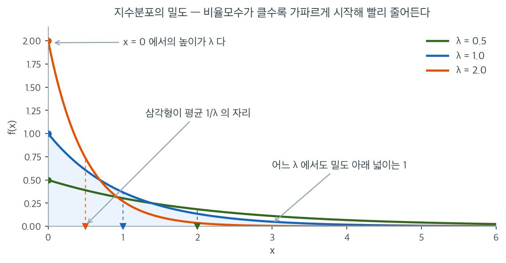
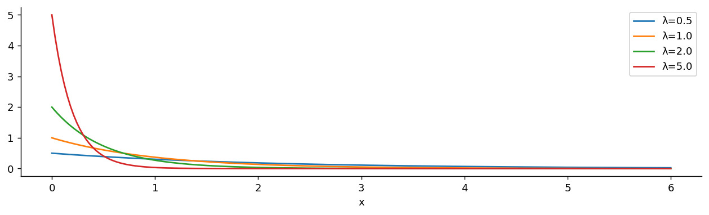
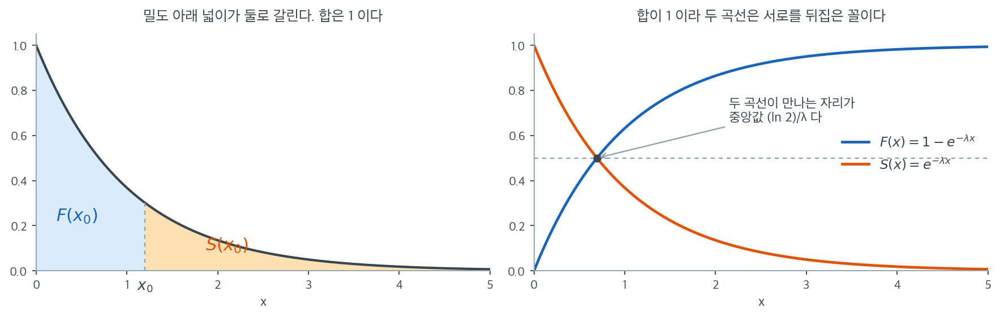
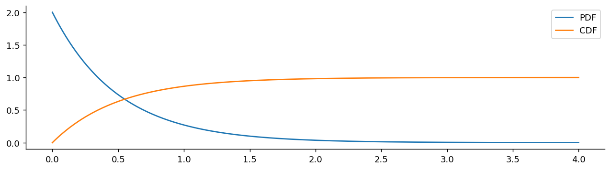
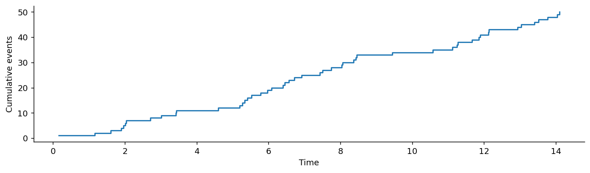

# 지수분포

## 개요

**지수분포**는 포아송 과정에서 사건 사이의 시간을 모형화한다. 기하분포의 연속형 대응물이며, 무기억성을 갖는 유일한 연속분포이다. 도착 간 시간, 대기 시간, 부품 수명 모형화에 흔히 쓰인다.

4.2절의 연속분포는 지수분포에서 시작하는 사슬을 이룬다.

$$
\text{Exp}(\lambda) \;\longrightarrow\; N(\mu, \sigma^2) \;\longrightarrow\; \chi^2_d \;\longrightarrow\; t_d \;\longrightarrow\; F_{d_1, d_2}
$$

첫 고리에서 둘째 고리로 넘어가는 다리는 **더하기**다. 지수분포는 심하게 치우친 분포인데도 여러 개를 더하면 정규분포로 다가간다. 그 뒤로는 정규분포를 제곱하고 나누는 것만으로 나머지 세 분포가 차례로 나온다.

---

## 1. 지수분포

<div class="defn" markdown>

### 정의 1. 지수분포 { .dfn }

확률변수 $X$가 비율 모수 $\lambda > 0$인 지수분포를 따른다는 것은 다음을 뜻한다:

$$
X \sim \text{Exponential}(\lambda), \qquad f(x) = \lambda e^{-\lambda x}, \quad x \geq 0
$$

**다른 모수화:** 어떤 교재에서는 척도 모수 $\beta = 1/\lambda$를 사용하여 $f(x) = \frac{1}{\beta}e^{-x/\beta}$로 쓴다.

</div>

!!! warning "SciPy 모수화"
    SciPy는 비율 $\lambda$가 아니라 **척도** $1/\lambda$를 받는다. `stats.expon(scale=1/lam)`이며, 척도가 곧 평균이다. 비율을 그대로 넣으면 뜻이 정확히 뒤집히므로(평균 2인 분포를 원했는데 평균 0.5가 나온다) 이 책에서 가장 자주 마주치는 함정이다. 처음 쓸 때 `mean()`으로 검산하는 습관을 들이면 좋다(연습문제 2).



밀도가 **$x = 0$에서 가장 높다.** 지수분포에서 가장 있을 법한 대기시간은 0에 가까운 값이고, 봉우리가 가운데 있는 정규분포와 여기서 갈린다. $\lambda$가 커지면 시작 높이가 그만큼 올라가고 더 빨리 줄어드는데, 넓이는 언제나 1이어야 하므로 둘이 맞물려 있다. 평균 $1/\lambda$는 봉우리가 아니라 **꼬리가 끌어낸 무게중심**의 자리다.

<div class="exbox" markdown>

**보기 1.** <span class="diff easy" title="쉬움"></span> 비율모수에 따른 지수분포 비교. $\lambda \in \{0.5, 1, 2, 5\}$인 네 밀도를 $[0, 6]$에 겹쳐 그린다.

**(1)** 지수분포족이 **척도족**임을 보이고, 서로 다른 두 밀도 $f_{\lambda_1}$, $f_{\lambda_2}$가 만나는 자리를 닫힌 꼴로 구하시오. 한 쌍은 몇 번 만나는가.

**(2)** 네 곡선에서 $\lambda$가 달라도 변하지 않는 양을 하나 찾아 수치로 확인하시오.

</div>

??? success "풀이"

    **(1) 해석적으로.** $X \sim \text{Exp}(\lambda)$이면 $\lambda X \sim \text{Exp}(1)$이다. 생존함수로 한 줄에 확인된다.

    $$
    P(\lambda X > t) = P\!\left(X > \frac{t}{\lambda}\right) = e^{-\lambda \cdot t/\lambda} = e^{-t}
    $$

    그러므로 모든 지수분포는 $\text{Exp}(1)$ 하나를 가로로 늘이거나 줄인 것이다. 밀도 수준에서 적으면 $X = Z/\lambda$($Z \sim \text{Exp}(1)$)에 변수변환 공식을 써서

    $$
    f_\lambda(x) = \lambda\, f_1(\lambda x), \qquad f_1(z) = e^{-z}
    $$

    이다. 가로로 $1/\lambda$배 줄이면서 세로로 $\lambda$배 늘인 꼴이고, 두 배율이 서로 역수라 넓이 $1$이 보존된다. **모수가 모양을 바꾸지 않고 눈금만 바꾼다**는 것이 척도족의 뜻이며, 지수분포족에 모양모수가 없다는 말과 같다. 그래서 왜도 $2$나 변동계수 $1$ 같은 **무차원 양은 $\lambda$에 의존할 수 없다.**

    여기서 $f_\lambda(0) = \lambda f_1(0) = \lambda$도 따라온다. 네 곡선의 출발 높이가 곧 비율모수다.

    두 밀도가 만나는 자리는 로그를 잡으면 **일차방정식**이 된다. $\lambda_1 e^{-\lambda_1 x} = \lambda_2 e^{-\lambda_2 x}$에 로그를 씌우면

    $$
    \ln \lambda_1 - \lambda_1 x = \ln \lambda_2 - \lambda_2 x
    \implies (\lambda_2 - \lambda_1)x = \ln\frac{\lambda_2}{\lambda_1}
    $$

    이므로 $\lambda_1 \ne \lambda_2$에서

    $$
    x^* = \frac{\ln(\lambda_1/\lambda_2)}{\lambda_1 - \lambda_2}
    $$

    이다. 분자와 분모의 부호가 언제나 같으므로 $x^* > 0$이고, 정의역 안에 들어온다. 두 로그밀도가 모두 **$x$의 일차함수**이고 기울기가 서로 다르니 직선 두 개가 만나는 것이라

    $$
    \text{교차 횟수} = 1
    $$

    로 정확히 한 번이다. 교차가 반드시 있어야 하는 까닭도 분명하다. $\lambda_1 > \lambda_2$이면 출발점에서는 $f_{\lambda_1}$이 더 높은데($\lambda_1 > \lambda_2$) 두 밀도의 적분이 모두 $1$이므로 어딘가에서는 자리를 바꿔 주어야 한다. **비율이 큰 쪽은 앞에서 높고 뒤에서 낮다.** 꼬리를 보려면 오른쪽을 보아야 한다는 뜻이고, "$\lambda$가 크면 더 빨리 떨어진다"는 말의 정확한 내용이 이것이다.

    $\lambda_2 = 2\lambda_1$인 쌍에서는 $x^* = \ln(1/2)/(-\lambda_1) = \ln 2/\lambda_1$로, 교차점이 **느린 쪽의 중앙값**과 정확히 같아진다.

    **(2) 해석적으로.** $\lambda$에 의존하지 않는 양은 척도를 $1/\lambda$ 단위로 재면 모두 나온다. 가장 깔끔한 것이 평균을 넘길 확률이다.

    $$
    F\!\left(\frac{1}{\lambda}\right) = 1 - e^{-\lambda \cdot (1/\lambda)} = 1 - e^{-1} \approx 0.6321
    $$

    $\lambda$가 지수에서 완전히 약분된다. 어떤 지수분포든 **평균 아래에 질량의 $63.21\%$가 있고 평균을 넘길 확률은 $e^{-1} = 36.79\%$**다. 중앙값과 평균의 비 $\ln 2 \approx 0.693$도 마찬가지로 $\lambda$와 무관하다.

    **수치적으로.** 먼저 쪽의 그림이다.

    ```python
    import matplotlib.pyplot as plt
    import numpy as np
    from scipy import stats

    fig, ax = plt.subplots(figsize=(12, 3))
    # lam 하나가 모든 것을 정한다. 평균 = 표준편차 = 1/lam 이다.
    # lam이 커질수록 시작 높이가 높아지고 더 빨리 0으로 떨어진다.
    # 네 곡선 모두 x=0 에서의 높이가 정확히 lam 이라는 점을 확인해 보라.
    for lam in [0.5, 1.0, 2.0, 5.0]:
        x = np.linspace(0, 6, 200)
        ax.plot(x, stats.expon(scale=1/lam).pdf(x), label=f'λ={lam}')
    ax.spines[['top', 'right']].set_visible(False)
    ax.set_xlabel('x')
    ax.legend()
    plt.show()
    ```

    

    척도족 항등식과 교차점, 그리고 $\lambda$와 무관한 양을 차례로 확인한다.

    ```python
    import itertools

    import numpy as np
    from scipy import optimize, stats

    lams = [0.5, 1.0, 2.0, 5.0]
    std = stats.expon(scale=1.0)        # Exp(1), 모든 지수분포의 원형

    # 척도족 항등식 f_lam(x) = lam * f_1(lam x) 를 격자에서 확인한다.
    x = np.linspace(0, 6, 2001)
    err = max(np.abs(stats.expon(scale=1/L).pdf(x) - L*std.pdf(L*x)).max() for L in lams)
    print(f"척도족 항등식 최대오차 = {err:.3e}")

    # f(0) = lam 이고 F(1/lam) 은 lam 과 무관하다.
    print(f"\n{'lam':>6}{'f(0)':>8}{'평균 1/lam':>12}{'F(1/lam)':>14}{'중앙값':>10}")
    for L in lams:
        d = stats.expon(scale=1/L)
        print(f"{L:>6.1f}{d.pdf(0):>8.2f}{1/L:>12.4f}{d.cdf(1/L):>14.10f}{d.median():>10.6f}")
    print(f"{'':>26}{'1 - e^-1 =':>14}{1 - np.exp(-1):>14.10f}")

    # 두 밀도가 만나는 자리. 닫힌 꼴과 수치해를 견준다.
    print(f"\n{'(a, b)':>12}{'닫힌 꼴 x*':>14}{'수치해':>12}{'공통 높이':>12}{'부호 변화':>10}")
    xs = np.linspace(1e-9, 40, 400_001)
    for a, b in itertools.combinations(lams, 2):
        da, db = stats.expon(scale=1/a), stats.expon(scale=1/b)
        x_cl = np.log(a/b)/(a - b)
        root = optimize.brentq(lambda v: da.pdf(v) - db.pdf(v), 1e-12, 60)
        sgn = np.sign(da.pdf(xs) - db.pdf(xs))
        print(f"{f'({a}, {b})':>12}{x_cl:>14.6f}{root:>12.6f}{da.pdf(x_cl):>12.6f}"
              f"{int(np.sum(sgn[1:] != sgn[:-1])):>10}")

    # b = 2a 인 쌍에서는 교차점이 느린 쪽의 중앙값과 같아진다.
    for a in (0.5, 1.0):
        print(f"lam=({a}, {2*a}) 교차점 {np.log(a/(2*a))/(a-2*a):.6f}"
              f"   Exp({a}) 의 중앙값 {np.log(2)/a:.6f}")
    ```

    출력:

    ```
    척도족 항등식 최대오차 = 8.882e-16

       lam    f(0)    평균 1/lam      F(1/lam)       중앙값
       0.5    0.50      2.0000  0.6321205588  1.386294
       1.0    1.00      1.0000  0.6321205588  0.693147
       2.0    2.00      0.5000  0.6321205588  0.346574
       5.0    5.00      0.2000  0.6321205588  0.138629
                                  1 - e^-1 =  0.6321205588

          (a, b)       닫힌 꼴 x*         수치해       공통 높이     부호 변화
      (0.5, 1.0)      1.386294    1.386294    0.250000         1
      (0.5, 2.0)      0.924196    0.924196    0.314980         1
      (0.5, 5.0)      0.511686    0.511686    0.387132         1
      (1.0, 2.0)      0.693147    0.693147    0.500000         1
      (1.0, 5.0)      0.402359    0.402359    0.668740         1
      (2.0, 5.0)      0.305430    0.305430    1.085767         1
    lam=(0.5, 1.0) 교차점 1.386294   Exp(0.5) 의 중앙값 1.386294
    lam=(1.0, 2.0) 교차점 0.693147   Exp(1.0) 의 중앙값 0.693147
    ```

    **유도한 것이 모두 맞는다.** 척도족 항등식은 부동소수점 한계인 $10^{-16}$ 수준에서 성립하고, $f(0)$ 열이 그대로 $\lambda$ 열이며, $F(1/\lambda)$ 열은 네 줄이 열째 자리까지 $0.6321205588$로 같다. 여섯 쌍 모두 닫힌 꼴 $x^*$가 `brentq`의 해와 여섯째 자리까지 같고 부호 변화는 한 번뿐이다. $\lambda_2 = 2\lambda_1$인 두 쌍에서 교차점이 느린 쪽의 중앙값과 같아지는 것도 확인된다.

    **그림이 가리는 것.** $\lambda = 5$인 곡선이 $f(0) = 5$에서 출발하는 바람에 세로축이 $[0, 5]$로 늘어나고, 그 눈금에서는 $\lambda = 0.5$인 곡선이 바닥에 깔린 거의 평평한 선으로 보인다. 그러나 (1)이 말하듯 **네 곡선은 모양이 같다.** 가로축을 $\lambda x$로, 세로축을 $f/\lambda$로 바꾸어 다시 그리면 네 곡선이 하나로 겹쳐 버린다. 겹쳐 그린 그림에서 눈에 들어오는 "다른 모양"은 눈금의 차이일 뿐이다.

    교차점도 그림에서는 잘 안 보인다. 여섯 쌍의 교차가 $x^* = 0.305$에서 $1.386$ 사이에 몰려 있는데, 이 구간은 가로축 $[0, 6]$의 왼쪽 $4$분의 $1$도 안 되는 곳이라 선들이 뒤엉켜 있다. 가장 바깥 쌍인 $(0.5, 5.0)$의 교차 높이가 $0.387$인 데 비해 세로축이 $5$까지 뻗어 있는 것도 불리하다.

---

## 2. 누적분포함수

<div class="thmbox" markdown>

### 정리 1. 누적분포함수와 생존함수 { .thm }

$X \sim \text{Exp}(\lambda)$이면 $x \geq 0$에 대해

$$
F(x) = 1 - e^{-\lambda x}, \qquad S(x) = P(X > x) = e^{-\lambda x}
$$

이다. $x < 0$이면 $F(x) = 0$, $S(x) = 1$이다.

</div>

??? proof "증명"

    밀도를 $0$부터 $x$까지 적분한다.

    $$
    F(x) = \int_0^x \lambda e^{-\lambda t}\,dt = \left[-e^{-\lambda t}\right]_0^x = 1 - e^{-\lambda x}
    $$

    생존함수는 그 여사건의 확률이므로

    $$
    S(x) = P(X > x) = 1 - F(x) = e^{-\lambda x} \qquad \square
    $$



왼쪽이 증명이 한 일이다. 밀도 아래 넓이를 $x_0$에서 자르면 왼쪽 조각이 $F(x_0)$,
오른쪽 조각이 $S(x_0)$이고 합이 1이다. 오른쪽은 그 두 조각을 $x$의 함수로 따라간
것이다. 합이 1이므로 두 곡선은 $y = 1/2$에 대해 서로를 뒤집은 꼴이고, 그래서
**둘이 만나는 자리가 중앙값**이다.

지수분포는 **생존함수가 더 간단한** 드문 분포다. 뒤에서 무기억성을 따질 때도
$F$ 가 아니라 $S$ 를 들고 계산한다.

<div class="exbox" markdown>

**보기 2.** <span class="diff easy" title="쉬움"></span> 지수분포의 밀도함수와 분포함수. $X \sim \text{Exp}(\lambda)$의 밀도 $f$와 분포함수 $F$를 한 축에 겹쳐 그린다.

**(1)** 밀도를 적분해 $F$를 유도하고, 두 곡선 $y = f(x)$와 $y = F(x)$가 만나는 자리를 $\lambda$의 식으로 구하시오. 모두 몇 번 만나는가.

**(2)** $\lambda = 2$에서 그 자리를 수치로 확인하고, 밀도와 분포함수를 한 축에 겹쳐 그리는 것이 무엇을 가리는지 말하시오.

</div>

??? success "풀이"

    **(1) 해석적으로.** 밀도를 $0$부터 $x$까지 적분한다. $\lambda e^{-\lambda u}$의 원시함수가 $-e^{-\lambda u}$이므로

    $$
    F(x) = \int_0^x \lambda e^{-\lambda u}\,du
    = \left[-e^{-\lambda u}\right]_0^x
    = 1 - e^{-\lambda x}, \qquad x \ge 0
    $$

    이다. 여기서 눈여겨볼 것은 **$f$는 $0$에서 불연속인데 $F$는 연속**이라는 점이다. $f(0^-) = 0$이고 $f(0^+) = \lambda$로 밀도가 원점에서 $\lambda$만큼 수직으로 뛰어오르는데, 적분은 그 도약을 뭉개므로 $F(0) = 0$에서 끊김 없이 올라간다. 밀도의 불연속은 분포함수의 **꺾임**으로만 남는다. $F'(0^+) = \lambda$이고 $F'(0^-) = 0$이어서 $F$는 원점에서 미분가능하지 않다.

    이 모양에서 곧바로 따라오는 것이 **최빈값이 $0$**이라는 사실이다. $f' (x) = -\lambda^2 e^{-\lambda x} < 0$으로 밀도가 정의역 전체에서 강감소하므로 봉우리가 왼쪽 끝점에 붙어 있다. 가장 있을 법한 대기시간이 $0$ 근처라는 뜻이고, 평균 $1/\lambda$와는 전혀 다른 자리다.

    이제 두 곡선이 만나는 자리를 찾는다. $f(x) = F(x)$는

    $$
    \lambda e^{-\lambda x} = 1 - e^{-\lambda x}
    $$

    인데, $u = e^{-\lambda x} \in (0, 1]$로 바꾸면 $\lambda u = 1 - u$, 곧 $u = 1/(1+\lambda)$라는 **일차방정식**이 된다. 되돌리면

    $$
    x^* = \frac{\ln(1+\lambda)}{\lambda}, \qquad
    f(x^*) = F(x^*) = \frac{\lambda}{1+\lambda}
    $$

    이다. 치환 한 번으로 닫힌 꼴이 나왔다.

    교차 횟수는 $g(x) = f(x) - F(x)$의 단조성이 정한다.

    $$
    g'(x) = -\lambda^2 e^{-\lambda x} - \lambda e^{-\lambda x} = -\lambda(\lambda+1)e^{-\lambda x} < 0
    $$

    이므로 $g$는 $[0, \infty)$에서 **강감소**다. 끝값은 $g(0) = \lambda - 0 = \lambda > 0$과 $g(\infty) = 0 - 1 = -1 < 0$이니, 강감소 함수가 양수에서 음수로 내려가는 동안 영점은

    $$
    \text{교차 횟수} = 1
    $$

    로 정확히 하나뿐이다. 치환으로 얻은 해가 유일한 해였던 셈이다.

    $x^*$가 중앙값 $\ln 2/\lambda$보다 큰지는 $\lambda$가 정한다. 두 식의 분모가 같으므로 $x^* > \ln 2/\lambda \iff \ln(1+\lambda) > \ln 2 \iff \lambda > 1$이다.

    **(2) 수치적으로.** 먼저 쪽의 그림이다.

    ```python
    import matplotlib.pyplot as plt
    import numpy as np
    from scipy import stats

    lam = 2.0                      # 비율모수. 단위 시간당 평균 2회 발생.
    x = np.linspace(0, 4, 200)     # 지수분포는 x >= 0 에서만 정의된다

    fig, ax = plt.subplots(figsize=(12, 3))
    # scipy는 rate가 아니라 scale = 1/rate 를 받는다. 이 책에서 반복되는 함정이다.
    # PDF는 x=0 에서 lam(=2)으로 시작해 단조 감소한다.
    #   -> 지수분포에서 가장 있을 법한 대기시간은 **0에 가까운 값**이다.
    # CDF는 0에서 1로 오르며 1 - e^{-lam x} 다.
    ax.plot(x, stats.expon(scale=1/lam).pdf(x), label='PDF')
    ax.plot(x, stats.expon(scale=1/lam).cdf(x), label='CDF')
    ax.spines[['top', 'right']].set_visible(False)
    ax.legend()
    plt.show()
    ```

    

    (1)이 유도한 것을 하나씩 확인한다.

    ```python
    import numpy as np
    from scipy import integrate, optimize, stats

    lam = 2.0
    d = stats.expon(scale=1/lam)

    # (1) 의 CDF 유도를 수치적분으로 맞춰 본다.
    print(f"{'x':>8}{'quad':>14}{'1-e^(-lam x)':>14}")
    for x in (0.25, 1.0, 2.0):
        print(f"{x:>8.2f}{integrate.quad(d.pdf, 0, x)[0]:>14.9f}{1 - np.exp(-lam*x):>14.9f}")

    # 교차점: 닫힌 꼴 ln(1+lam)/lam 과 수치해를 견준다.
    x_star = np.log(1 + lam) / lam
    root = optimize.brentq(lambda x: d.pdf(x) - d.cdf(x), 1e-9, 50)
    print(f"\n닫힌 꼴 x* = ln(1+lam)/lam = {x_star:.9f}")
    print(f"수치해   x* =               {root:.9f}")
    print(f"공통 높이 lam/(1+lam) = {lam/(1+lam):.9f}, f(x*) = {d.pdf(x_star):.9f}, F(x*) = {d.cdf(x_star):.9f}")

    # g = f - F 가 강감소이므로 영점은 하나뿐이다. 부호 변화를 세어 확인한다.
    xs = np.linspace(0, 20, 200_001)
    g = np.sign(d.pdf(xs) - d.cdf(xs))
    print(f"g(0) = {d.pdf(0) - d.cdf(0):.4f},  g(20) = {d.pdf(20) - d.cdf(20):.6f},  부호 변화 = {int(np.sum(g[1:] != g[:-1]))}")

    # 중앙값과 교차점의 순서. lam > 1 이면 x* 가 중앙값보다 크다.
    print(f"\n{'lam':>6}{'x*':>12}{'중앙값 ln2/lam':>16}{'x* > 중앙값':>12}")
    for L in (0.5, 1.0, 2.0, 5.0):
        print(f"{L:>6.1f}{np.log(1+L)/L:>12.6f}{np.log(2)/L:>16.6f}{str(np.log(1+L) > np.log(2)):>12}")
    ```

    출력:

    ```
           x          quad  1-e^(-lam x)
        0.25   0.393469340   0.393469340
        1.00   0.864664717   0.864664717
        2.00   0.981684361   0.981684361

    닫힌 꼴 x* = ln(1+lam)/lam = 0.549306144
    수치해   x* =               0.549306144
    공통 높이 lam/(1+lam) = 0.666666667, f(x*) = 0.666666667, F(x*) = 0.666666667
    g(0) = 2.0000,  g(20) = -1.000000,  부호 변화 = 1

       lam          x*     중앙값 ln2/lam    x* > 중앙값
       0.5    0.810930        1.386294       False
       1.0    0.693147        0.693147       False
       2.0    0.549306        0.346574        True
       5.0    0.358352        0.138629        True
    ```

    **유도한 것이 모두 맞는다.** 수치적분이 $1 - e^{-\lambda x}$와 아홉째 자리까지 같고, 닫힌 꼴 $x^* = 0.549306144$가 `brentq`의 해와 아홉째 자리까지 같으며, 공통 높이는 $\lambda/(1+\lambda) = 2/3$다. 부호 변화가 한 번이라는 것도 강감소 논증과 맞는다. 표의 마지막 칸은 $\lambda > 1$에서만 $x^*$가 중앙값보다 크다는 조건을 그대로 보여 주고, $\lambda = 1$에서는 $\ln(1+\lambda) = \ln 2$라 둘이 정확히 겹친다.

    **그런데 이 그림이 가리는 것이 하나 있다. 두 곡선은 서로 견줄 수 있는 양이 아니다.** $F$는 확률이라 단위가 없고 $0$과 $1$ 사이에 갇혀 있지만, $f$는 **밀도**라서 단위가 시간의 역수이고 $1$을 넘을 수 있다. 실제로 $\lambda = 2$에서 $f(0) = 2 > 1$이다. 둘을 같은 세로축에 올려놓으면 눈금의 뜻이 두 개가 되고, 그래서 교차점 $x^*$는 **그림을 그린 방식이 만들어 낸 자리일 뿐 확률론적인 뜻이 없다.** $\lambda$의 단위를 분에서 초로 바꾸면 $f$만 $60$배가 되어 $x^*$도 옮겨 간다. (1)에서 $x^*$를 닫힌 꼴로 구할 수 있었던 것은 수학적으로 깔끔한 일이지만, 그 값이 분포에 대해 말해 주는 바는 없다.

    같은 축에 겹쳐 그리는 것이 값싸게 알려 주는 것은 따로 있다. **$f$가 내려가는 동안 $F$가 올라간다**는 것, 곧 밀도가 분포함수의 기울기라는 관계다. $f$가 가장 높은 $x = 0$에서 $F$가 가장 급하게 오르고, $f$가 $0$으로 잦아드는 오른쪽 끝에서 $F$가 $1$에 눕는다.

<div class="probox" markdown>

**문제 1.** <span class="diff easy" title="쉬움"></span> 어떤 트레이딩 데스크에 주문이 시간당 평균 12건 도착한다. 연속한 주문 사이의 시간이 10분을 넘을 확률은?

</div>

??? success "풀이"
    비율은 시간당 $\lambda = 12$, 즉 분당 $0.2$이다.

    $$
    P(X > 10) = e^{-0.2 \times 10} = e^{-2} \approx 0.1353
    $$

    주문 사이의 기대 시간: $E[X] = 1/0.2 = 5$분.

---

## 3. 성질

<div class="thmbox" markdown>

### 정리 2. 지수분포의 평균과 분산 { .thm }

$X \sim \text{Exp}(\lambda)$이면

$$
E[X] = \frac{1}{\lambda}, \qquad \text{Var}(X) = \frac{1}{\lambda^2}
$$

이다.

</div>

??? proof "증명"

    **평균.** 부분적분을 한 번 쓴다.

    $$
    E[X] = \int_0^{\infty} x \lambda e^{-\lambda x}\,dx = \left[-x e^{-\lambda x}\right]_0^{\infty} + \int_0^{\infty} e^{-\lambda x}\,dx = \frac{1}{\lambda}
    $$

    **분산.** 같은 방식으로 이차적률을 구한 뒤 평균의 제곱을 뺀다.

    $$
    E[X^2] = \int_0^{\infty} x^2 \lambda e^{-\lambda x}\,dx = \frac{2}{\lambda^2}
    $$

    $$
    \text{Var}(X) = E[X^2] - (E[X])^2 = \frac{2}{\lambda^2} - \frac{1}{\lambda^2} = \frac{1}{\lambda^2} \qquad \square
    $$

표준편차는 분산의 양의 제곱근이므로 $\text{SD}(X) = 1/\lambda$다. 곧 $\text{평균} = \text{표준편차} = 1/\lambda$인데, 이것이 지수분포의 두드러진 특징이다.

중앙값은 $F(m) = 1/2$를 풀면 나온다. $1 - e^{-\lambda m} = 1/2$에서 $e^{-\lambda m} = 1/2$이므로 양변에 로그를 취하면 $m = (\ln 2)/\lambda$다. 이것은 평균보다 작다($\ln 2 \approx 0.693$). 오른쪽으로 긴 꼬리가 평균을 끌어올리기 때문이다.

<div class="exbox" markdown>

**보기 3.** <span class="diff easy" title="쉬움"></span> 지수 표본의 평균과 표준편차 확인. $\lambda = 3$인 지수분포에서 $n = 100{,}000$개를 뽑아 표본적률을 이론값과 견준다.

**(1)** $E[X]$와 $E[X^2]$을 적분으로 구해 **변동계수**가 정확히 $1$임을 보이고, 표본평균과 표본분산의 표준오차를 $\lambda$와 $n$으로 적으시오.

**(2)** 모의값이 그 표준오차 안에 드는지 확인하시오. 또 코드의 `Mean ≈ SD: True`라는 검사가 "이 표본이 지수분포에서 나왔다"는 근거가 되는지 따지시오.

</div>

??? success "풀이"

    **(1) 해석적으로.** 평균은 부분적분 한 번이다. $\left[-xe^{-\lambda x}\right]_0^\infty = 0$이므로

    $$
    E[X] = \int_0^\infty x\,\lambda e^{-\lambda x}\,dx
    = \left[-xe^{-\lambda x}\right]_0^\infty + \int_0^\infty e^{-\lambda x}\,dx
    = \frac{1}{\lambda}
    $$

    이다. 둘째 적률은 같은 수법을 한 번 더 쓴다. $\left[-x^2e^{-\lambda x}\right]_0^\infty = 0$이므로

    $$
    E[X^2] = \int_0^\infty x^2\lambda e^{-\lambda x}\,dx
    = 2\int_0^\infty x e^{-\lambda x}\,dx
    = \frac{2}{\lambda}\cdot\frac{1}{\lambda}
    = \frac{2}{\lambda^2}
    $$

    이고, 따라서

    $$
    \operatorname{Var}(X) = \frac{2}{\lambda^2} - \frac{1}{\lambda^2} = \frac{1}{\lambda^2},
    \qquad \operatorname{SD}(X) = \frac{1}{\lambda}
    $$

    이다. 평균과 표준편차가 **같은 $1/\lambda$**이므로 변동계수는

    $$
    \mathrm{CV} = \frac{\operatorname{SD}(X)}{E[X]} = \frac{1/\lambda}{1/\lambda} = 1
    $$

    로 정확히 $1$이고 $\lambda$에 의존하지 않는다. 보기 1에서 본 척도족 논증이 곧바로 설명해 준다. **CV 는 무차원 양이라 눈금을 바꾸어도 변할 수 없다.**

    여기서 흔한 혼동을 하나 짚어 둔다. 지수분포는 **평균 $=$ 표준편차**이고 포아송분포는 **평균 $=$ 분산**이다. 차원을 따져 보면 어느 쪽이 맞는지 헷갈릴 일이 없다. 지수분포의 $X$는 시간이므로 평균과 표준편차가 같은 단위를 갖고 견줄 수 있지만, 분산은 시간의 제곱이라 평균과 같아질 수 없다. 실제로 $\lambda = 3$에서 평균은 $0.3333$인데 분산은 $0.1111$로 전혀 다르다.

    표준오차는 두 개가 필요하다. 표본평균 쪽은 곧바로 나온다.

    $$
    \operatorname{SE}(\bar X) = \frac{\operatorname{SD}(X)}{\sqrt n} = \frac{1}{\lambda\sqrt n}
    $$

    표본분산 쪽은 넷째 중심적률이 필요하다. 지수분포의 중심적률은 $\mu_2 = 1/\lambda^2$, $\mu_4 = 9/\lambda^4$이므로(첨도가 $9$, 초과첨도가 $6$이다)

    $$
    \operatorname{SE}(S^2) \approx \sqrt{\frac{\mu_4 - \sigma^4}{n}}
    = \sqrt{\frac{9/\lambda^4 - 1/\lambda^4}{n}}
    = \frac{1}{\lambda^2}\sqrt{\frac{8}{n}}
    $$

    이다. $\lambda = 3$, $n = 10^5$을 넣으면 $\operatorname{SE}(\bar X) = 1/(3\sqrt{10^5}) = 0.001054$이고 $\operatorname{SE}(S^2) = (1/9)\sqrt{8/10^5} = 0.000994$다. **이 두 수가 모의값을 판정하는 기준이다.**

    **(2) 수치적으로.** 먼저 쪽의 코드다.

    ```python
    import numpy as np
    from scipy import stats

    np.random.seed(42)
    lam = 3.0
    samples = stats.expon(scale=1/lam).rvs(100_000)

    # 지수분포의 특징: 평균과 **표준편차**가 같다(둘 다 1/lam).
    # 분산은 1/lam^2 이므로 평균과 다르다. 포아송(평균 = 분산)과 헷갈리기 쉽다.
    print(f"Theoretical mean: {1/lam:.4f},  Sample mean: {samples.mean():.4f}")
    print(f"Theoretical var:  {1/lam**2:.4f},  Sample var:  {samples.var():.4f}")
    print(f"Mean ≈ SD: {np.isclose(samples.mean(), samples.std(), atol=0.01)}")
    ```

    출력:

    ```
    Theoretical mean: 0.3333,  Sample mean: 0.3320
    Theoretical var:  0.1111,  Sample var:  0.1096
    Mean ≈ SD: True
    ```

    모의값이 둘 다 이론값보다 **작다.** 어긋남인지 보통의 몬테카를로 오차인지는 (1)의 표준오차로 재 보아야 안다.

    ```python
    import numpy as np
    from scipy import integrate, stats

    lam, n = 3.0, 100_000
    d = stats.expon(scale=1/lam)

    # (1) 의 적률을 수치적분으로 맞춰 본다.
    m1 = integrate.quad(lambda x: x*d.pdf(x), 0, np.inf)[0]
    m2 = integrate.quad(lambda x: x*x*d.pdf(x), 0, np.inf)[0]
    m4 = integrate.quad(lambda x: (x - 1/lam)**4*d.pdf(x), 0, np.inf)[0]
    print(f"E[X]   quad {m1:.9f}   1/lam   {1/lam:.9f}")
    print(f"E[X^2] quad {m2:.9f}   2/lam^2 {2/lam**2:.9f}")
    print(f"mu_4   quad {m4:.9f}   9/lam^4 {9/lam**4:.9f}")
    print(f"변동계수 CV = sd/평균 = {d.std()*lam:.9f}")

    # (2) 이론 표준오차를 먼저 적고 모의값을 z 점수로 견준다.
    np.random.seed(42)
    s = stats.expon(scale=1/lam).rvs(n)
    se_mean = (1/lam)/np.sqrt(n)              # sd(X)/sqrt(n)
    se_var = np.sqrt((9 - 1)/lam**4/n)        # sqrt((mu4 - sigma^4)/n)
    print(f"\n{'양':>8}{'이론':>12}{'모의':>12}{'SE':>12}{'z':>8}")
    print(f"{'평균':>8}{1/lam:>12.6f}{s.mean():>12.6f}{se_mean:>12.6f}{(s.mean()-1/lam)/se_mean:>+8.2f}")
    print(f"{'분산':>8}{1/lam**2:>12.6f}{s.var():>12.6f}{se_var:>12.6f}{(s.var()-1/lam**2)/se_var:>+8.2f}")
    print(f"{'표준편차':>8}{1/lam:>12.6f}{s.std():>12.6f}")
    print(f"{'CV':>8}{1.0:>12.6f}{s.std()/s.mean():>12.6f}")

    # 쪽의 isclose 검사가 실제로 얼마나 느슨한지 재 본다.
    print(f"\n|평균 - 표준편차| = {abs(s.mean()-s.std()):.6f}   (검사 기준 atol=0.01)")

    # CV = 1 은 지수분포만의 성질이 아니다. sigma^2 = ln2 인 로그정규도 통과한다.
    ln = stats.lognorm(s=np.sqrt(np.log(2)), scale=1/lam/np.sqrt(2))
    print(f"로그정규(sigma^2=ln2): 평균 {ln.mean():.6f}  표준편차 {ln.std():.6f}  CV {ln.std()/ln.mean():.9f}")
    print(f"둘을 가르는 수 P(X > 평균):  지수 {np.exp(-1):.6f}   로그정규 {ln.sf(ln.mean()):.6f}   모의 {(s > 1/lam).mean():.6f}")
    ```

    출력:

    ```
    E[X]   quad 0.333333333   1/lam   0.333333333
    E[X^2] quad 0.222222222   2/lam^2 0.222222222
    mu_4   quad 0.111111111   9/lam^4 0.111111111
    변동계수 CV = sd/평균 = 1.000000000

           양          이론          모의          SE       z
          평균    0.333333    0.331990    0.001054   -1.27
          분산    0.111111    0.109554    0.000994   -1.57
        표준편차    0.333333    0.330990
          CV    1.000000    0.996987

    |평균 - 표준편차| = 0.001000   (검사 기준 atol=0.01)
    로그정규(sigma^2=ln2): 평균 0.333333  표준편차 0.333333  CV 1.000000000
    둘을 가르는 수 P(X > 평균):  지수 0.367879   로그정규 0.338604   모의 0.367390
    ```

    **유도가 맞는다.** 수치적분이 $1/\lambda$, $2/\lambda^2$, $9/\lambda^4$을 아홉째 자리까지 재현하고 CV 는 $1.000000000$이다.

    **모의값의 어긋남은 보통의 몬테카를로 오차다.** 표본평균이 이론값보다 작지만 $z = -1.27$, 표본분산도 작지만 $z = -1.57$로 둘 다 $\pm 2$ 안에 있다. $n = 10^5$이면 꽤 큰 표본인데도 소수 셋째 자리가 흔들린다는 것을 눈여겨볼 만하다. 넷째 자리까지 맞기를 기대했다면 $n$을 백 배 더 키워야 한다.

    두 $z$가 같은 쪽으로 치우친 것도 우연이 아니다. 지수분포는 척도족이라 표본평균과 표본표준편차가 같은 척도를 함께 추정하며, 되풀이 실험에서 두 양의 상관이 $0.73$ 정도로 양이다. 한 표본에서 척도가 낮게 잡히면 평균과 표준편차가 **함께** 낮아진다. 다만 그 덕분에 CV 추정이 더 정확해지는 것은 **아니다.** CV 의 표준편차를 모의로 재 보면 $0.0031$인데 표본평균의 상대표준오차 $0.0032$와 사실상 같다. 상관이 $1$이 아니라 $0.73$이라 오차가 약분되지 않는다.

    **`Mean ≈ SD: True`는 지수분포의 근거가 되지 못한다.** 이 검사는 CV 가 $1$에 가깝다는 것만 보는데, CV $= 1$은 지수분포의 **필요조건일 뿐 충분조건이 아니다.** 출력의 마지막 두 줄이 반례다. $\sigma^2 = \ln 2$인 로그정규분포는 $\mathrm{CV} = \sqrt{e^{\sigma^2}-1} = \sqrt{2-1} = 1$이라 평균과 표준편차가 지수분포와 **소수점 아래까지 똑같이** $0.3333$으로 맞는다. 이 검사를 그대로 통과한다.

    게다가 기준 `atol=0.01`이 지나치게 느슨하다. 실제 차이는 $0.001$이라 기준의 $10$분의 $1$인데, 거꾸로 말하면 참값에서 $3\%$쯤 벗어난 분포도 이 검사를 통과한다는 뜻이다.

    둘을 가르려면 CV 가 아닌 다른 양을 보아야 한다. 보기 1에서 본 $P(X > E[X]) = e^{-1} = 0.3679$가 좋은 후보다. 로그정규 쪽은 $0.3386$으로 뚜렷이 다르고, 모의표본은 $0.3674$로 지수분포 쪽에 붙는다. **적률 두 개를 맞추는 것으로 분포를 확인했다고 할 수 없고, 분포함수 전체를 보는 검정(보기 4의 콜모고로프–스미르노프 같은 것)이 따로 필요하다.**

---

## 4. 무기억성

<div class="thmbox" markdown>

### 정리 3. 지수분포의 무기억성 { .thm }

$X \sim \text{Exp}(\lambda)$이면 모든 $s, t \geq 0$에 대해

$$
P(X > s + t \mid X > s) = P(X > t)
$$

이다.

</div>

??? proof "증명"

    $$
    P(X > s + t \mid X > s) = \frac{P(X > s + t)}{P(X > s)} = \frac{e^{-\lambda(s+t)}}{e^{-\lambda s}} = e^{-\lambda t} = P(X > t)
    $$

    **해석:** 이미 $s$만큼의 시간을 기다렸더라도 남은 대기 시간의 분포는 방금 시작했을 때와 같다. 이 과정은 자신의 이력을 "잊어버린다".

거꾸로, 이 성질을 갖는 연속분포는 지수분포뿐이다. 그 방향의 증명은 연습문제 12에서 다룬다.

<div class="exbox" markdown>

**보기 4.** <span class="diff easy" title="쉬움"></span> 무기억성 확인하기. $\lambda = 2$인 지수표본 $100$만 개에서 $X > 0.5$인 것만 골라 조건부 꼬리확률을 재고 무조건 꼬리확률과 견준다.

**(1)** $P(X > s+t \mid X > s) = P(X > t)$를 유도하고, 이보다 **더 강한** 결론을 적으시오.

**(2)** 조건을 걸면 쓸 수 있는 표본이 줄어든다. 줄어든 크기를 $\lambda$, $s$, $n$으로 적고, 그것이 조건부 추정의 정밀도에 어떻게 나타나는지 수치로 확인하시오.

</div>

??? success "풀이"

    **(1) 해석적으로.** 생존함수가 $S(x) = e^{-\lambda x}$이고 $\{X > s+t\} \subset \{X > s\}$이므로 교집합이 그대로 $\{X > s+t\}$다. 조건부확률의 정의에서

    $$
    P(X > s+t \mid X > s)
    = \frac{P(X > s+t)}{P(X > s)}
    = \frac{e^{-\lambda(s+t)}}{e^{-\lambda s}}
    = e^{-\lambda t}
    = P(X > t)
    $$

    이다. 지수함수의 $e^{a+b} = e^ae^b$가 전부이고, 바로 이 성질이 무기억성의 정체다.

    **더 강한 결론.** 위 식은 꼬리확률 하나가 아니라 **모든 $t \ge 0$에서** 성립한다. 그러므로 **잔여수명의 분포함수 전체**가 원래 분포와 같다. $R = X - s$라 두면

    $$
    P(R > t \mid X > s) = e^{-\lambda t} \quad \text{for all } t \ge 0
    \implies (X - s \mid X > s) \sim \text{Exp}(\lambda)
    $$

    이다. 꼬리확률 몇 개가 우연히 맞는 것이 아니라 **분포가 같다**는 뜻이고, 둘은 전혀 다른 주장이다. 적률도 따라서 모두 같다.

    $$
    E[X \mid X > s] = s + E[R \mid X > s] = s + \frac{1}{\lambda},
    \qquad \operatorname{SD}(X \mid X > s) = \frac{1}{\lambda}
    $$

    이미 $s$만큼 기다렸다는 사실이 앞으로 기다릴 기대시간을 **전혀 줄여 주지 않는다.** 기다린 시간이 그냥 더해질 뿐이다.

    **(2) 해석적으로.** 조건을 거는 코드 `samples[samples > s]`는 $X > s$가 아닌 표본을 버린다. 남는 개수의 기댓값은

    $$
    n_{\text{eff}} = n\,P(X > s) = n e^{-\lambda s}
    $$

    이고, $\lambda = 2$, $s = 0.5$, $n = 10^6$에서 $n_{\text{eff}} = 10^6 e^{-1} \approx 367{,}879$다. **$63\%$를 버리는 셈이다.** 비율추정의 표준오차가 $\sqrt{p(1-p)/n}$이므로 조건부 쪽 표준오차는 무조건 쪽의

    $$
    \sqrt{\frac{n}{n_{\text{eff}}}} = e^{\lambda s/2} = e^{0.5} \approx 1.65
    $$

    배가 된다. 그러므로 **조건부 값이 무조건 값보다 이론값에서 더 멀리 떨어져 보이는 것이 정상이다.** 무기억성이 덜 맞아서가 아니라 표본이 적어서다.

    **수치적으로.** 먼저 쪽의 코드다.

    ```python
    import numpy as np
    from scipy import stats

    np.random.seed(42)
    lam = 2.0
    samples = stats.expon(scale=1/lam).rvs(1_000_000)

    s = 0.5
    # 무기억성: P(X > s+t | X > s) = P(X > t).
    # "이미 0.5만큼 기다렸다"는 사실이 앞으로의 대기시간에 아무 정보도 주지 않는다.
    # 연속분포 중에서 이 성질을 갖는 것은 **지수분포뿐이다.**
    # (이산분포에서는 기하분포가 유일하다.)
    for t in [0.25, 0.5, 1.0]:
        # samples > s 로 "0.5를 넘긴 표본만" 골라 조건을 건다
        conditional = np.mean(samples[samples > s] > s + t)
        unconditional = np.mean(samples > t)
        print(f"P(X>{s}+{t}|X>{s}) = {conditional:.4f},  P(X>{t}) = {unconditional:.4f}")
    ```

    출력:

    ```
    P(X>0.5+0.25|X>0.5) = 0.6066,  P(X>0.25) = 0.6068
    P(X>0.5+0.5|X>0.5) = 0.3681,  P(X>0.5) = 0.3682
    P(X>0.5+1.0|X>0.5) = 0.1360,  P(X>1.0) = 0.1355
    ```

    두 열이 소수 셋째 자리까지 맞는다. 다만 이 코드는 **이론값을 적지 않아서** 어느 쪽이 더 정확한지, 남은 차이가 몬테카를로 오차인지 알 수 없다. (1)과 (2)가 예측한 것을 모두 넣어 다시 재 본다.

    ```python
    import numpy as np
    from scipy import stats

    np.random.seed(42)
    lam, n, s = 2.0, 1_000_000, 0.5
    samples = stats.expon(scale=1/lam).rvs(n)

    # 조건을 걸면 표본이 줄어든다. 줄어든 크기가 조건부 추정의 정밀도를 정한다.
    tail = samples[samples > s]
    n_eff = len(tail)
    print(f"n = {n},  X > {s} 인 표본 = {n_eff}   이론 n*e^(-lam*s) = {n*np.exp(-lam*s):.0f}")
    print(f"조건부 SE 가 무조건 SE 의 {np.sqrt(n/n_eff):.2f} 배다\n")

    print(f"{'t':>6}{'조건부':>10}{'무조건':>10}{'이론 e^(-lam t)':>17}{'z(조건부)':>11}{'z(무조건)':>11}")
    for t in (0.25, 0.5, 1.0):
        p = np.exp(-lam*t)
        c, u = np.mean(tail > s + t), np.mean(samples > t)
        se_c, se_u = np.sqrt(p*(1-p)/n_eff), np.sqrt(p*(1-p)/n)
        print(f"{t:>6}{c:>10.4f}{u:>10.4f}{p:>17.6f}{(c-p)/se_c:>+11.2f}{(u-p)/se_u:>+11.2f}")

    # 꼬리확률 몇 개가 아니라 분포 전체가 같은가. 잔여수명에 KS 검정을 건다.
    res = tail - s
    ks = stats.kstest(res, stats.expon(scale=1/lam).cdf)
    print(f"\n잔여수명 (X - s | X > s) 의 KS 검정:  D = {ks.statistic:.5f},  p = {ks.pvalue:.4f}")
    print(f"  평균      모의 {res.mean():.6f}   이론 1/lam    = {1/lam:.6f}")
    print(f"  표준편차  모의 {res.std():.6f}   이론 1/lam    = {1/lam:.6f}")
    print(f"  E[X|X>s]  모의 {tail.mean():.6f}   이론 s + 1/lam = {s + 1/lam:.6f}")
    ```

    출력:

    ```
    n = 1000000,  X > 0.5 인 표본 = 368152   이론 n*e^(-lam*s) = 367879
    조건부 SE 가 무조건 SE 의 1.65 배다

         t       조건부       무조건    이론 e^(-lam t)     z(조건부)     z(무조건)
      0.25    0.6066    0.6068         0.606531      +0.12      +0.63
       0.5    0.3681    0.3682         0.367879      +0.25      +0.57
       1.0    0.1360    0.1355         0.135335      +1.14      +0.50

    잔여수명 (X - s | X > s) 의 KS 검정:  D = 0.00133,  p = 0.5307
      평균      모의 0.500547   이론 1/lam    = 0.500000
      표준편차  모의 0.500772   이론 1/lam    = 0.500000
      E[X|X>s]  모의 1.000547   이론 s + 1/lam = 1.000000
    ```

    **(2)의 예측이 맞는다.** 살아남은 표본이 $368{,}152$개로 이론값 $367{,}879$와 $273$개 차이인데, 이 개수 자체가 이항분포라 표준편차가 $\sqrt{n e^{-1}(1-e^{-1})} \approx 482$이므로 $0.6$ 표준편차 안이다. 조건부 표준오차가 무조건 쪽의 $1.65$배라는 것도 그대로 나온다.

    **여섯 개의 $z$가 모두 $\pm 1.2$ 안에 있다.** 조건부와 무조건이 이론값 $e^{-\lambda t}$ 양쪽에서 똑같이 잘 맞는다는 뜻이다. $t = 1.0$에서 조건부 값 $0.1360$이 무조건 값 $0.1355$보다 이론값에서 멀어 보이지만, $z$로 재면 $+1.14$ 대 $+0.50$이다. 표본이 $2.7$배 적은 쪽이 그만큼 더 흔들린 것이고, **같은 자릿수의 차이를 같은 무게로 읽으면 안 된다**는 것을 보여 준다.

    **(1)의 더 강한 결론도 확인된다.** 잔여수명 $X - s \mid X > s$에 콜모고로프–스미르노프 검정을 걸면 $D = 0.00133$, $p = 0.53$으로 $\text{Exp}(2)$와 다르다고 할 근거가 전혀 없다. 꼬리확률 세 개가 아니라 **분포함수 전체**가 맞는다는 뜻이다. 잔여수명의 평균과 표준편차가 모두 $0.5006$으로 이론값 $0.5$와 맞고, $E[X \mid X > 0.5] = 1.0005$가 $s + 1/\lambda = 1$과 맞는 것도 같은 결론의 다른 얼굴이다.

    덧붙여 둘 것이 있다. 이 모의실험은 무기억성이 지수분포에서 **성립함**을 보일 뿐, 지수분포가 그 성질을 갖는 **유일한** 연속분포라는 것은 보이지 못한다. 유일성은 모의실험으로 닿을 수 없는 주장이며, $S(s+t) = S(s)S(t)$라는 함수방정식을 푸는 일이다. 연습문제 12 가 그 몫을 맡는다.

---

## 5. 기하분포에서 건너오는 다리

무기억성을 갖는 이산분포가 하나 있었다. [기하분포](../discrete_distributions/geometric.md)다. 두 분포가 같은 성질을 공유하는 것은 우연이 아니라, 하나가 다른 하나의 극한이기 때문이다. 4.1절의 사슬과 4.2절의 사슬이 만나는 자리가 여기다.

동전을 아주 빠르게 던진다고 하자. $1/n$초에 한 번씩 던지되 앞면이 나올 확률을 $p = \lambda/n$로 낮춘다. 던지는 속도를 올린 만큼 성공을 어렵게 만든 셈이라, 단위 시간당 기대 성공 횟수 $np$는 $\lambda$로 붙들려 있다. 첫 앞면이 나오기까지의 **시행 횟수**를 $X \sim \text{Geo}(p)$라 하면, 첫 앞면까지의 **시간**은 $T = X/n$이다.

$T$의 생존함수를 계산해 보면 된다. $T > t$라는 것은 처음 $nt$번의 시행이 모두 실패했다는 뜻이므로

$$
P(T > t) = P(X > nt) = (1-p)^{\lfloor nt \rfloor} = \left(1 - \frac{\lambda}{n}\right)^{\lfloor nt \rfloor} \;\xrightarrow[n \to \infty]{}\; e^{-\lambda t}
$$

이고, 이것이 바로 $\text{Exp}(\lambda)$의 생존함수다. 평균과 분산도 따라온다. $E[X] = 1/p = n/\lambda$이므로 $E[T] = E[X]/n = 1/\lambda$이고, $\text{Var}(X) = (1-p)/p^2$이므로

$$
\text{Var}(T) = \frac{\text{Var}(X)}{n^2} = \frac{1 - \lambda/n}{\lambda^2} \;\xrightarrow[n \to \infty]{}\; \frac{1}{\lambda^2}
$$

이다. 기하분포의 $1/p$와 $(1-p)/p^2$이 지수분포의 $1/\lambda$와 $1/\lambda^2$로 정확히 옮겨 간다. 시간 간격 $\Delta t$를 직접 붙들고 같은 극한을 취하는 방식은 [기하분포](../discrete_distributions/geometric.md) 쪽 연습문제에서 다룬다.

### 같은 극한의 두 얼굴

이 극한은 처음 보는 것이 아니다. $np = \lambda$를 고정한 채 $n \to \infty$, $p \to 0$으로 보내는 것은 [포아송분포](../discrete_distributions/poisson.md)를 얻을 때 쓴 바로 그 극한이다. 달라지는 것은 무엇을 묻느냐뿐이다.

**세는 쪽**에서 물으면, 곧 "단위 시간 안에 앞면이 몇 번 나왔는가"를 물으면 $B(n, p) \to \text{Poisson}(\lambda)$다. **기다리는 쪽**에서 물으면, 곧 "첫 앞면까지 얼마나 걸렸는가"를 물으면 $\frac{1}{n}\text{Geo}(p) \to \text{Exp}(\lambda)$다. 같은 실험을 두 방향에서 본 것이고, 그래서 두 결과가 같은 하나의 대상을 기술한다. 그 대상이 다음 절의 **포아송 과정**이다.

$$
\begin{array}{ccc}
B(n, p) & \longrightarrow & \text{Poisson}(\lambda) \\
\text{Geo}(p)/n & \longrightarrow & \text{Exp}(\lambda)
\end{array}
$$

윗줄이 사건의 개수를 세고 아랫줄이 사건 사이의 시간을 잰다. 무기억성이 기하분포에서 지수분포로 고스란히 건너온 것도 이 그림 안에서 자연스럽다. 매 시행이 과거를 기억하지 않으니, 시행을 아무리 잘게 쪼개도 그 성질이 남는다.

---

## 6. 포아송 과정과의 연결

사건이 비율 $\lambda$인 포아송 과정에 따라 도착하면:

$$
\begin{aligned}
\text{Number of events in } [0, t] &\sim \text{Poisson}(\lambda t) \\
\text{Time between consecutive events} &\sim \text{Exponential}(\lambda) \\
\text{Time to the } n\text{-th event} &\sim \text{Gamma}(n, \lambda)
\end{aligned}
$$

<div class="exbox" markdown>

**보기 5.** <span class="diff easy" title="쉬움"></span> 포아송 과정 모의실험. 간격을 $\text{Exp}(\lambda)$에서 뽑아 누적합을 취해 도착시각을 만들고, 계수과정 $N_t$를 계단함수로 그린다.

**(1)** 간격이 독립인 $\text{Exp}(\lambda)$이면 $[0,t]$의 사건 수가 $\text{Poisson}(\lambda t)$임을 유도하시오.

**(2)** 그 유도를 수치로 확인하고, 그림의 계단이 이론과 어떻게 맞는지 읽으시오.

</div>

??? success "풀이"

    **(1) 해석적으로.** 간격을 $X_1, X_2, \ldots$(독립, $\text{Exp}(\lambda)$)라 하고 $n$번째 도착시각을 $S_n = X_1 + \cdots + X_n$이라 하자. $S_n$은 지수분포 $n$개의 합이므로 $\text{Gamma}(n, \lambda)$이고 밀도가

    $$
    f_{S_n}(u) = \frac{\lambda^n u^{n-1}e^{-\lambda u}}{(n-1)!}, \qquad u \ge 0
    $$

    이다. 다리를 놓는 것은 다음 **사건의 같음**이다.

    $$
    \{N_t \ge n\} = \{S_n \le t\}
    $$

    "$[0,t]$에 사건이 $n$번 이상 일어났다"와 "$n$번째 사건이 $t$ 이전에 일어났다"는 **같은 말**이다. 세는 쪽과 기다리는 쪽을 잇는 것이 이 한 줄이고, 본문의 "같은 극한의 두 얼굴"이 여기서 다시 나온다.

    이제 $N_t = n$을 직접 계산한다. $[0,t]$에 정확히 $n$번 일어났다는 것은 $n$번째 도착은 $t$ 이전이고 그다음 간격이 남은 시간보다 길다는 뜻이다.

    $$
    \{N_t = n\} = \{S_n \le t < S_n + X_{n+1}\}
    $$

    $S_n$의 값으로 조건을 걸고 $X_{n+1}$의 독립성을 쓰면

    $$
    P(N_t = n) = \int_0^t f_{S_n}(u)\,P(X_{n+1} > t-u)\,du
    = \int_0^t \frac{\lambda^n u^{n-1}e^{-\lambda u}}{(n-1)!}\,e^{-\lambda(t-u)}\,du
    $$

    이다. 여기서 **지수가 정확히 약분된다.** $e^{-\lambda u}e^{-\lambda(t-u)} = e^{-\lambda t}$로 $u$가 사라지므로 적분은 다항식 하나만 남는다.

    $$
    P(N_t = n) = \frac{\lambda^n e^{-\lambda t}}{(n-1)!}\int_0^t u^{n-1}\,du
    = \frac{\lambda^n e^{-\lambda t}}{(n-1)!}\cdot\frac{t^n}{n}
    = \frac{e^{-\lambda t}(\lambda t)^n}{n!}
    $$

    이것이 바로 $\text{Poisson}(\lambda t)$의 확률질량함수다. $n = 0$인 경우는 따로 보면 되는데 $P(N_t = 0) = P(X_1 > t) = e^{-\lambda t}$로 위 식에 $n=0$을 넣은 값과 같다. 그러므로

    $$
    N_t \sim \text{Poisson}(\lambda t), \qquad E[N_t] = \operatorname{Var}(N_t) = \lambda t
    $$

    다. **지수 간격과 포아송 계수가 같은 과정의 두 얼굴**이라는 말의 증명이 이 적분 한 줄이다.

    사건의 같음을 그대로 쓰면 분포함수 수준의 항등식도 나온다. $P(N_t \ge n) = P(S_n \le t)$, 곧 **포아송 생존함수와 감마 분포함수가 같다**는 것이다. 이 식은 (2)에서 수치로 확인한다.

    **(2) 수치적으로.** 먼저 쪽의 그림이다.

    ```python
    import numpy as np
    import matplotlib.pyplot as plt
    from scipy import stats

    plt.rcParams["font.sans-serif"] = ["NanumGothic", "Apple SD Gothic Neo", "Malgun Gothic"]
    plt.rcParams["font.family"] = "sans-serif"
    plt.rcParams["axes.unicode_minus"] = False

    np.random.seed(42)
    lam = 3.0        # 단위 시간당 평균 3회 발생
    n_events = 50

    # 포아송 과정을 만드는 가장 쉬운 방법: 사건 **사이의 간격**을 지수분포에서 뽑고
    # 누적합을 취해 도착 시각으로 바꾼다.
    # 지수 간격 <-> 포아송 계수는 같은 과정의 두 얼굴이다.
    inter_arrivals = stats.expon(scale=1/lam).rvs(n_events)
    arrival_times = np.cumsum(inter_arrivals)

    fig, ax = plt.subplots(figsize=(12, 3))
    # 계수과정 N(t)는 사건이 일어날 때만 1씩 뛰는 계단함수다.
    # where='post' 로 "그 시각에 뛰어오른 뒤 다음까지 유지"를 나타낸다.
    ax.step(arrival_times, range(1, n_events + 1), where='post', lw=1.5)
    ax.set_xlabel('Time')
    ax.set_ylabel('Cumulative events')
    ax.spines[['top', 'right']].set_visible(False)
    plt.show()
    ```

    

    유도한 항등식과 분포를 차례로 확인한다.

    ```python
    import numpy as np
    from scipy import stats

    lam, t, n_events = 3.0, 4.0, 50

    # (1) 의 항등식 {N_t >= n} = {S_n <= t}. 감마 CDF 와 포아송 생존함수를 견준다.
    print(f"lam = {lam}, t = {t},  lam*t = {lam*t}")
    print(f"{'n':>4}{'P(S_n <= t) 감마':>19}{'P(N_t >= n) 포아송':>21}{'차':>11}")
    for n in (1, 3, 12, 20):
        g = stats.gamma(a=n, scale=1/lam).cdf(t)
        p = stats.poisson(lam*t).sf(n - 1)
        print(f"{n:>4}{g:>19.12f}{p:>21.12f}{g - p:>11.1e}")

    # 차를 취하면 포아송 pmf 가 나온다는 것이 (1) 의 결론이다.
    print(f"\n{'n':>4}{'감마 차':>19}{'포아송 pmf':>21}{'차':>11}")
    for n in (0, 1, 5, 12):
        lo = stats.gamma(a=n, scale=1/lam).cdf(t) if n > 0 else 1.0
        a = lo - stats.gamma(a=n + 1, scale=1/lam).cdf(t)
        b = stats.poisson(lam*t).pmf(n)
        print(f"{n:>4}{a:>19.12f}{b:>21.12f}{a - b:>11.1e}")

    # 모의실험: 지수 간격을 누적해 계수과정을 만든다.
    rng = np.random.default_rng(7)
    R = 200_000
    S = np.cumsum(rng.exponential(scale=1/lam, size=(R, 400)), axis=1)
    N = (S <= t).sum(axis=1)
    print(f"\nN_t 의 모의 평균 {N.mean():.4f}, 분산 {N.var():.4f}   이론은 둘 다 lam*t = {lam*t}")
    print(f"  SE(평균) = {np.sqrt(lam*t/R):.4f},  z = {(N.mean() - lam*t)/np.sqrt(lam*t/R):+.2f}")

    # 쪽의 그림에 쓰인 표본을 되짚어 본다.
    np.random.seed(42)
    gaps = stats.expon(scale=1/lam).rvs(n_events)
    arr = np.cumsum(gaps)
    sd50 = np.sqrt(n_events)/lam
    H = np.sum(1/np.arange(1, n_events + 1))
    print(f"\n그림(seed 42) 의 마지막 도착시각 S_50 = {arr[-1]:.4f}")
    print(f"  이론 E[S_50] = n/lam = {n_events/lam:.4f},  sd = sqrt(n)/lam = {sd50:.4f},  z = {(arr[-1] - n_events/lam)/sd50:+.2f}")
    print(f"  간격 평균 {gaps.mean():.4f} (이론 {1/lam:.4f}),  최댓값 {gaps.max():.4f} (이론 E[max] = H_50/lam = {H/lam:.4f})")
    ```

    출력:

    ```
    lam = 3.0, t = 4.0,  lam*t = 12.0
       n     P(S_n <= t) 감마      P(N_t >= n) 포아송          차
       1     0.999993855788       0.999993855788    0.0e+00
       3     0.999477741950       0.999477741950    0.0e+00
      12     0.538402666936       0.538402666936    0.0e+00
      20     0.021279769383       0.021279769383    0.0e+00

       n               감마 차              포아송 pmf          차
       0     0.000006144212       0.000006144212    1.5e-17
       1     0.000073730548       0.000073730548   -4.6e-17
       5     0.012740638736       0.012740638736    2.3e-17
      12     0.114367915509       0.114367915509   -6.9e-16

    N_t 의 모의 평균 12.0001, 분산 11.9695   이론은 둘 다 lam*t = 12.0
      SE(평균) = 0.0077,  z = +0.01

    그림(seed 42) 의 마지막 도착시각 S_50 = 14.0991
      이론 E[S_50] = n/lam = 16.6667,  sd = sqrt(n)/lam = 2.3570,  z = -1.09
      간격 평균 0.2820 (이론 0.3333),  최댓값 1.1679 (이론 E[max] = H_50/lam = 1.4997)
    ```

    **항등식이 기계정밀도로 맞는다.** 감마 분포함수와 포아송 생존함수의 차가 네 자리 모두 정확히 $0$이고, 차를 취해 얻은 값은 포아송 확률질량함수와 $10^{-16}$ 수준에서 같다. 이것은 모의실험이 아니라 **두 특수함수 사이의 항등식**을 확인한 것이므로 몬테카를로 오차가 없다. $(1)$의 유도가 옳다는 가장 강한 증거다.

    모의실험 쪽도 맞는다. $20$만 번 되풀이한 $N_t$의 평균이 $12.0001$로 $\lambda t = 12$와 $z = +0.01$만큼 떨어져 있고, 분산도 $11.9695$로 평균과 거의 같다. **평균과 분산이 둘 다 $\lambda t$라는 포아송분포의 지문이 그대로 찍힌다.**

    **그림 읽기.** 계단은 평균적으로 기울기 $\lambda = 3$인 직선을 따라간다. 사건 $50$개가 쌓이는 데 걸린 시간이 $S_{50} = 14.10$이므로 그림에서 읽히는 기울기는 $50/14.10 = 3.55$로 $\lambda = 3$보다 크다. 어긋남이 아니다. $E[S_{50}] = 50/3 = 16.67$이고 표준편차가 $\sqrt{50}/3 = 2.36$이므로 $z = -1.09$, 곧 **한 표본이 보통만큼 흔들린 것**이다. 간격 $50$개의 평균이 $0.2820$으로 이론값 $0.3333$보다 작게 나온 것과 같은 이야기다.

    **이 그림이 가리는 것이 둘 있다.** 하나는 가로축의 끝이 자료에 따라 달라진다는 점이다. 사건 수를 $50$으로 **고정하고** 시간을 흐르게 한 그림이므로, 눈에 보이는 전체 기울기는 $50/S_{50}$이라는 비이고 $\lambda$의 추정값이지 $\lambda$가 아니다. 시간 $t$를 고정하고 사건 수를 세는 쪽으로 물었다면 $N_t \sim \text{Poisson}(\lambda t)$라는 (1)의 결론이 직접 눈에 들어왔을 것이다.

    다른 하나는 **뭉침**이다. 계단만 보면 사건이 고르게 흩어진 듯한 인상을 주는데, 실제 간격은 최솟값이 $0$에 거의 붙고 최댓값이 $1.1679$로 평균의 네 배가 넘는다. 독립 지수 간격 $50$개의 최댓값은 기댓값이 $H_{50}/\lambda = 1.4997$($H_n$은 조화수)이므로 이 정도 긴 공백은 **있어야 정상**이다. 최빈값이 $0$인 분포에서 뽑으니 짧은 간격이 몰려 나오고 그 사이사이에 긴 공백이 생긴다. "완전히 무작위"가 "고르게 퍼짐"이 아니라는 것이 포아송 과정의 가장 자주 오해되는 대목이며, 연습문제 13 의 균등 순서통계량 결과가 그 까닭을 말해 준다.

---

## 7. 지수 확률변수의 최솟값

<div class="thmbox" markdown>

### 정리 4. 최솟값도 지수분포다 { .thm }

$X_1 \sim \text{Exp}(\lambda_1)$과 $X_2 \sim \text{Exp}(\lambda_2)$가 독립이면

$$
\min(X_1, X_2) \sim \text{Exp}(\lambda_1 + \lambda_2)
$$

이다.

</div>

??? proof "증명"

    $$
    P(\min(X_1, X_2) > t) = P(X_1 > t) \cdot P(X_2 > t) = e^{-\lambda_1 t} \cdot e^{-\lambda_2 t} = e^{-(\lambda_1 + \lambda_2)t}
    $$

    이는 $n$개의 독립인 지수 확률변수로 일반화된다: $\min(X_1, \ldots, X_n) \sim \text{Exp}\left(\sum_{i=1}^n \lambda_i\right)$.

---

## 8. 다음 고리: 더하면 정규분포로 간다

최솟값을 취하면 지수분포가 그대로 남지만, **더하면** 이야기가 달라진다.

$$
X_1 + X_2 + \cdots + X_n \sim \text{Gamma}(n, \lambda)
$$

감마분포의 모양은 $n$이 커질수록 점점 대칭인 종 모양이 된다. 중심극한정리를 쓰면 그 이유가 곧바로 설명된다. $E[X_i] = 1/\lambda$, $\text{Var}(X_i) = 1/\lambda^2$이므로

$$
\frac{\sum_{i=1}^n X_i - n/\lambda}{\sqrt n/\lambda} \;\xrightarrow{\;n \to \infty\;}\; N(0, 1)
$$

이다. 즉 $\text{Gamma}(n, \lambda) \approx N(n/\lambda,\ n/\lambda^2)$이다.

### 얼마나 많이 더해야 하는가

지수분포는 왜도가 2로, 연속분포 가운데 상당히 치우친 편이다. $n$개를 더한 합의 왜도는 $2/\sqrt n$로 줄어들지만 그 속도가 빠르지 않다.

| $n$ | 합의 왜도 |
|---|---|
| 1 | 2.00 |
| 5 | 0.89 |
| 20 | 0.45 |
| 50 | 0.28 |
| 100 | 0.20 |

"$n \ge 30$이면 중심극한정리가 듣는다"는 흔한 규칙이 지수분포 같은 치우친 모집단에서는 부족하다는 것을 알 수 있다. 자료가 치우쳐 있을수록 더 큰 표본이 필요하며, 특히 **꼬리 확률**을 다룰 때는 훨씬 더 그렇다. 3장의 베리–에센 정리가 이 수렴 속도를 정량적으로 말해 준다.

이 다리를 건너면 정규분포에 닿고, 그다음은 정규분포를 제곱하거나 나누는 것만 남는다.

---

## 연습문제

<div class="drillbox" markdown>

**연습문제 1.** <span class="diff easy" title="쉬움"></span>
부품 수명이 $T \sim \mathrm{Exp}(0.5)$(단위: 년)이다. (a) $P(T > 3)$. (b) $P(T > 3 \mid T > 2)$. (c) 독립인 부품 두 개에 대해 $\min(T_1, T_2)$의 분포와 기댓값.

</div>

??? success "풀이"
    (a) $P(T > 3) = e^{-1.5} \approx 0.223$.

    (b) 무기억성에 의해 $P(T > 3 \mid T > 2) = P(T > 1) = e^{-0.5} \approx 0.607$. 직접 계산하면 $P(T > 3)/P(T > 2) = e^{-1.5}/e^{-1} = e^{-0.5}$.

    (c) $\min(T_1, T_2) \sim \mathrm{Exp}(\lambda_1 + \lambda_2) = \mathrm{Exp}(1.0)$. $\mathbb{E}[\min] = 1$년(부품 하나일 때의 절반).

---

<div class="drillbox" markdown>

**연습문제 2.** <span class="diff easy" title="쉬움"></span>
평균 대기시간이 8분인 지수분포를 SciPy로 만들려 한다. `stats.expon`에 어떤 인자를 넘겨야 하는가? 비율모수 $\lambda$는 얼마인가? 또 대기시간이 평균인 8분을 넘길 확률을 구하라.

</div>

??? success "풀이"
    SciPy는 척도 모수화를 쓰고 척도가 곧 평균이므로 `stats.expon(scale=8)`이다. 비율모수는 그 역수인 $\lambda = 1/8 = 0.125$(분당 0.125회)이다.

    $$
    P(X > 8) = e^{-\lambda \cdot 8} = e^{-1} \approx 0.3679
    $$

    평균을 넘길 확률이 절반이 아니라 0.368이다. 분포가 오른쪽으로 치우쳐 있어 중앙값 $8\ln 2 \approx 5.55$분이 평균보다 작기 때문이다.

    **이 값이 $\lambda$에 의존하지 않는다는 점**이 재미있다. 어떤 지수분포든 평균을 넘길 확률은 언제나 $e^{-1}$이다. 대기시간의 3분의 2가 평균 아래에 몰려 있고, 평균을 끌어올리는 것은 가끔 나오는 아주 긴 대기다.

---

<div class="drillbox" markdown>

**연습문제 3.** <span class="diff easy" title="쉬움"></span>
$U \sim \text{Uniform}(0, 1)$일 때 $X = -\ln(U)/\lambda$가 $\text{Exp}(\lambda)$를 따름을 보여라. 역변환 공식 $F^{-1}(u) = -\ln(1-u)/\lambda$와 견주어 보라.

</div>

??? success "풀이"
    $x \ge 0$에 대해

    $$
    P(X \le x) = P\!\left(-\frac{\ln U}{\lambda} \le x\right) = P(\ln U \ge -\lambda x) = P(U \ge e^{-\lambda x}) = 1 - e^{-\lambda x}
    $$

    이고, 이는 $\text{Exp}(\lambda)$의 CDF다.

    $F(x) = 1 - e^{-\lambda x}$를 뒤집으면 $F^{-1}(u) = -\ln(1-u)/\lambda$이므로 정석은 $-\ln(1-U)/\lambda$다. 그런데 $U$가 균등분포이면 $1-U$도 같은 균등분포이므로 둘은 같은 분포를 낳는다. 뺄셈 한 번을 아끼려고 실제 구현에서는 $-\ln(U)/\lambda$를 쓴다. $\square$

    다만 $U = 0$이 뽑히면 $\ln 0 = -\infty$가 되므로, 난수 생성기가 0을 낼 수 있는지 확인해야 한다. NumPy의 균등난수는 $[0,1)$ 구간이라 0이 나올 수 있다. 그래서 `np.random.exponential`은 내부적으로 이 경우를 따로 처리한다.

---

<div class="drillbox" markdown>

**연습문제 4.** <span class="diff med" title="중간"></span>
$\mathrm{Exp}(\lambda)$의 **PDF, 평균, 분산을 유도하라.**

</div>

??? success "풀이"
    PDF: CDF $F(t) = 1 - e^{-\lambda t}$를 미분하면 $t \ge 0$에 대해 $f(t) = \lambda e^{-\lambda t}$.

    평균: $\mathbb{E}[T] = \int_0^\infty t \lambda e^{-\lambda t} dt$. 부분적분하거나 꼬리 공식을 쓰면 $\mathbb{E}[T] = \int_0^\infty e^{-\lambda t} dt = 1/\lambda$.

    2차 적률: $\mathbb{E}[T^2] = \int_0^\infty t^2 \lambda e^{-\lambda t} dt = 2/\lambda^2$(부분적분을 두 번 사용).

    분산: $\mathrm{Var}(T) = 2/\lambda^2 - 1/\lambda^2 = 1/\lambda^2$.

    중앙값: $F(m) = 0.5$를 풀면 $1 - e^{-\lambda m} = 0.5$에서 $m = \ln 2/\lambda \approx 0.693/\lambda$이다.

    참고: 평균과 표준편차가 모두 $1/\lambda$인 것이 지수분포의 두드러진 특징이다. 변동계수 CV = 1이다. 또 **중앙값이 평균보다 작다**($0.693/\lambda < 1/\lambda$). 오른쪽으로 치우친 분포이므로 평균을 넘는 대기시간은 절반이 아니라 $e^{-1} = 36.8\%$에 지나지 않는다.

---

<div class="drillbox" markdown>

**연습문제 5.** <span class="diff med" title="중간"></span>
**포아송 과정과의 연결.** 사건이 비율 $\lambda$인 포아송 과정에서 발생할 때 $k$번째 도착 시각 $T_k$의 분포를 유도하라.

</div>

??? success "풀이"
    $T_k = \sum_{i=1}^k X_i$이며, 여기서 $X_i$는 i.i.d. $\mathrm{Exp}(\lambda)$(도착 간 시간)이다.

    $k$개의 i.i.d. 지수 확률변수의 합은 **감마(Erlang) 분포**이다:

    $$
    T_k \sim \mathrm{Gamma}(\text{shape} = k, \text{rate} = \lambda)
    $$

    PDF: $t \ge 0$에 대해 $f_{T_k}(t) = \lambda^k t^{k-1} e^{-\lambda t} / (k-1)!$.

    $\mathbb{E}[T_k] = k/\lambda$, $\mathrm{Var}(T_k) = k/\lambda^2$.

    이는 지수 도착 간 시간과 포아송 계수를 잇는 근본적인 연결이며, 대기행렬과 신뢰성 분석에서 재생이론의 토대가 된다.

---

<div class="drillbox" markdown>

**연습문제 6.** <span class="diff med" title="중간"></span>
**최대가능도추정.** i.i.d. $T_1, \ldots, T_n \sim \mathrm{Exp}(\lambda)$가 주어졌을 때 MLE $\hat\lambda$를 유도하라.

</div>

??? success "풀이"
    가능도: $L(\lambda) = \prod_i \lambda e^{-\lambda T_i} = \lambda^n e^{-\lambda \sum T_i}$.

    로그가능도: $\ell(\lambda) = n \ln \lambda - \lambda \sum T_i$.

    도함수: $\ell'(\lambda) = n/\lambda - \sum T_i = 0 \Rightarrow \hat\lambda = n/\sum T_i = 1/\bar T$.

    **성질:**

    - $\hat\lambda$는 표본평균의 역수이다. $\mathbb{E}[T] = 1/\lambda$이므로 자연스러운 결과이다.
    - 점근적으로 불편이지만 유한표본에서는 약간 편향되어 있다: $n \ge 2$에 대해 $\mathbb{E}[\hat\lambda] = n\lambda/(n - 1)$.
    - 점근적으로 정규이며 $\sqrt n (\hat\lambda - \lambda) \xrightarrow{d} N(0, \lambda^2)$이다.

    표본평균의 역수는 여러 분포에서 비율 모수를 추정하는 표준적인 추정량이다.

---

<div class="drillbox" markdown>

**연습문제 7.** <span class="diff med" title="중간"></span>
**위험함수.** 위험률은 $h(t) = f(t)/\bar F(t)$로 정의된다. 지수분포의 위험률이 *상수*임을 보이고, 이것이 물리적으로 무엇을 뜻하는지 논하라.

</div>

??? success "풀이"
    $h(t) = \lambda e^{-\lambda t} / e^{-\lambda t} = \lambda$.

    **상수 위험률:** 순간 고장률 $h(t) = \lambda$가 $t$에 의존하지 않는다. 해석하자면, 아직 고장 나지 않은 부품이 다음 짧은 구간에서 고장 날 확률은 나이와 무관하게 언제나 같다.

    이는 **무기억성의 직접적인 표현**이다. 미래의 위험은 과거의 생존에 의존하지 않는다.

    **상수가 아닌 위험률과의 비교:**

    - **증가하는 위험률** (예: $k > 1$인 Weibull): 부품이 마모된다. 오래된 부품일수록 고장 나기 쉽다. 기계 부품이 그렇다.
    - **감소하는 위험률** ($k < 1$): 부품이 길들여진다. 오래된 부품일수록 고장이 덜 난다. 초기 결함을 넘긴 전자 부품이 그렇다.
    - **욕조 곡선**: 초기에 높고(길들이기) 중간이 평평하며 이후 증가한다(마모). 위의 두 경우가 결합된 형태이다.

    현실의 신뢰성이 정확히 지수분포를 따르는 경우는 드물지만, 지수분포는 유용한 기준선이다. (a) 모수가 평균 수명이라는 직접적인 의미를 갖고, (b) 수학적으로 다루기 쉬우며, (c) 무기억성이 "완전히 무작위한" 고장에 대응하여 고장 모형화의 자연스러운 귀무가설이 되기 때문이다.

---

<div class="drillbox" markdown>

**연습문제 8.** <span class="diff med" title="중간"></span>
$X \sim \text{Exp}(\lambda)$일 때 $N = \lfloor X \rfloor + 1$의 분포를 구하라. 이 결과가 "기하분포는 지수분포의 이산판"이라는 말과 어떻게 이어지는가?

</div>

??? success "풀이"
    $N = k$($k = 1, 2, \dots$)일 필요충분조건은 $k-1 \le X < k$이므로

    $$
    P(N = k) = F(k) - F(k-1) = e^{-\lambda(k-1)} - e^{-\lambda k} = \left(e^{-\lambda}\right)^{k-1}\left(1 - e^{-\lambda}\right)
    $$

    이다. $p = 1 - e^{-\lambda}$로 두면

    $$
    P(N = k) = (1-p)^{k-1}p
    $$

    로 정확히 $\text{Geometric}(p)$이다. "첫 성공까지의 시행 횟수" 판이다.

    **왜 자연스러운가.** 지수분포의 시간축을 길이 1인 칸으로 자르고 "이 칸 안에 사건이 있었는가"만 기록한 것이 $N$이다. 각 칸에서 사건이 일어날 확률이 $p = 1-e^{-\lambda}$로 같고, 무기억성 덕분에 칸들이 서로 독립이다. 독립적인 동전 던지기의 첫 성공까지 세는 것이 곧 기하분포다.

    두 분포의 무기억성도 서로 대응한다. $P(X > s+t \mid X > s) = P(X > t)$가 $P(N > m+n \mid N > m) = P(N > n)$이 되고, 기하분포는 무기억성을 갖는 **유일한 이산분포**다. 반대 방향으로 $\lambda$를 작게 하면서 칸을 잘게 쪼개면 기하분포가 지수분포로 수렴한다.

---

<div class="drillbox" markdown>

**연습문제 9.** <span class="diff med" title="중간"></span>
$T_1, \dots, T_n$이 독립이고 $\text{Exp}(\lambda)$를 따를 때 $2\lambda\sum_i T_i \sim \chi^2_{2n}$임을 보이고, 이를 이용해 $\lambda$의 정확한 95% 신뢰구간을 만들어라. $n = 20$, $\sum T_i = 87.4$일 때 값을 구하라.

</div>

??? success "풀이"
    **분포.** $\sum_i T_i \sim \text{Gamma}(\text{형상}=n,\ \text{비율}=\lambda)$이다. 감마분포는 척도 변환에 대해 닫혀 있으므로 $2\lambda\sum T_i \sim \text{Gamma}(\text{형상}=n,\ \text{척도}=2)$이고, 이것이 바로 자유도 $2n$인 카이제곱분포의 정의이다.

    **추축량.** $Q = 2\lambda\sum T_i$는 $\lambda$를 담고 있으면서 그 분포가 $\lambda$에 의존하지 않는다. 따라서

    $$
    P\!\left(\chi^2_{2n,\,0.025} \le 2\lambda\sum T_i \le \chi^2_{2n,\,0.975}\right) = 0.95
    $$

    이고, $\lambda$에 대해 풀면

    $$
    \left(\frac{\chi^2_{2n,\,0.025}}{2\sum T_i},\ \frac{\chi^2_{2n,\,0.975}}{2\sum T_i}\right)
    $$

    가 정확한 95% 신뢰구간이다.

    **수치.** $n=20$이므로 자유도가 40이고 $\chi^2_{40,0.025} = 24.433$, $\chi^2_{40,0.975} = 59.342$이다. $2\sum T_i = 174.8$이므로

    $$
    \hat\lambda = \frac{20}{87.4} = 0.2288, \qquad \text{95\% CI} = (0.1398,\ 0.3395)
    $$

    이다. 평균 $1/\lambda$의 구간은 양끝을 뒤집어 $(2.95,\ 7.15)$이다.

    두 가지를 눈여겨본다. 첫째, 구간이 $\hat\lambda$를 중심으로 **대칭이 아니다**. 오른쪽으로 더 길다. 정규근사로 만든 $\hat\lambda \pm 1.96\hat\lambda/\sqrt n$은 이 비대칭을 놓친다. 둘째, 이 구간은 근사가 아니라 **정확**하다. $n$이 아무리 작아도 포함확률이 정확히 0.95다.

---

<div class="drillbox" markdown>

**연습문제 10.** <span class="diff med" title="중간"></span>
수명 시험을 시각 $C$에서 중단했다. $n$개 가운데 $d$개가 고장 났고 나머지는 아직 살아 있다(우측 중도절단). $\lambda$의 최대가능도추정량을 구하고, 중도절단된 관측값을 그냥 버리면 무엇이 잘못되는지 설명하라.

</div>

??? success "풀이"
    고장 난 개체는 밀도 $f(t_i) = \lambda e^{-\lambda t_i}$로, 살아 있는 개체는 생존확률 $S(C) = e^{-\lambda C}$로 가능도에 들어간다. 관측시간을 $t_i$(고장이면 고장시각, 중도절단이면 $C$)라 하고 $\delta_i$를 고장 지시자라 하면

    $$
    L(\lambda) = \prod_{i=1}^n \left\{\lambda e^{-\lambda t_i}\right\}^{\delta_i}\left\{e^{-\lambda t_i}\right\}^{1-\delta_i} = \lambda^{d}\exp\!\left(-\lambda\sum_i t_i\right)
    $$

    이다. 로그를 취해 미분하면

    $$
    \ell'(\lambda) = \frac{d}{\lambda} - \sum_i t_i = 0 \implies \hat\lambda = \frac{d}{\sum_i t_i} = \frac{\text{고장 횟수}}{\text{총 노출시간}}
    $$

    이다. 분자에는 **사건 수**가, 분모에는 살아 있던 개체까지 포함한 **총 관찰시간**이 들어간다는 점이 핵심이다.

    **중도절단 자료를 버리면.** 고장 난 $d$개만 써서 $\hat\lambda = d/\sum_{\delta_i=1}t_i$로 계산하게 되는데, 분모에서 살아남은 개체들의 노출시간이 통째로 빠진다. 분모가 작아지므로 $\lambda$를 **과대추정**하고 평균수명을 과소추정한다. 게다가 이 편향은 표본을 키워도 사라지지 않는다.

    직관적으로도 그렇다. 시험을 일찍 끊을수록 오래 사는 개체가 더 많이 잘려 나가고, 관측된 고장은 짧은 수명 쪽에 치우친다. 살아 있는 개체가 주는 정보는 "적어도 $C$는 넘었다"이며, 이것도 엄연한 정보다. 생존분석 전체가 이 정보를 버리지 않으려고 만들어진 분야이며, 21장에서 다시 다룬다.

---

<div class="drillbox" markdown>

**연습문제 11.** <span class="diff med" title="중간"></span>
$X_1 \sim \text{Exp}(\lambda_1)$과 $X_2 \sim \text{Exp}(\lambda_2)$가 독립일 때 $P(X_1 < X_2)$를 구하라.

</div>

??? success "풀이"
    $X_1$의 값으로 조건을 걸어 적분한다.

    $$
    P(X_1 < X_2) = \int_0^\infty \lambda_1 e^{-\lambda_1 x}\,P(X_2 > x)\,dx = \int_0^\infty \lambda_1 e^{-\lambda_1 x} e^{-\lambda_2 x}\,dx = \frac{\lambda_1}{\lambda_1 + \lambda_2}
    $$

    **어느 쪽이 먼저 일어나는지가 비율에 비례한다.** 본문의 최솟값 결과와 짝을 이룬다. $\min(X_1, X_2) \sim \text{Exp}(\lambda_1 + \lambda_2)$가 "언제"를 말하고, 이 결과가 "누가"를 말한다.

    더구나 둘은 **서로 독립**이다. 언제 일어났는지를 알아도 어느 쪽이 이겼는지에 대한 정보가 없다. 경쟁위험 모형과 연속시간 마르코프 연쇄가 이 두 결과 위에 서 있다. 상태를 떠나는 시각은 비율의 합으로 정해지고, 어디로 가는지는 비율의 비로 정해진다.

---

<div class="drillbox" markdown>

**연습문제 12.** <span class="diff hard" title="어려움"></span>
지수분포의 **무기억성을 증명**하고, 이 성질을 갖는 연속분포가 *유일*함을 보여라.

</div>

??? success "풀이"
    생존함수는 $\bar F(t) = e^{-\lambda t}$이다. 그러면

    $$
    P(T > s + t \mid T > s) = \bar F(s + t)/\bar F(s) = e^{-\lambda(s+t)}/e^{-\lambda s} = e^{-\lambda t} = P(T > t)
    $$

    $\square$

    **유일성:** $\bar F$가 연속이고 감소하며 $\bar F(0) = 1$이고 무기억성 $\bar F(s + t) = \bar F(s) \bar F(t)$를 만족한다고 하자. (연속성 아래에서 풀린) 코시 함수방정식에 의해 이런 함수는 어떤 $\lambda > 0$에 대한 $\bar F(t) = e^{-\lambda t}$뿐이다.

    따라서 지수분포는 무기억성을 갖는 유일한 연속분포이며, 이는 기하분포가 유일한 이산 무기억 분포인 것과 정확히 대응된다.

---

<div class="drillbox" markdown>

**연습문제 13.** <span class="diff hard" title="어려움"></span>
비율 $\lambda$인 포아송 과정에서 $[0, t]$ 동안 $n$개의 사건이 일어났다는 조건이 주어졌을 때, 그 도착시각 $(S_1, \dots, S_n)$의 조건부 결합분포가 $\text{Uniform}(0,t)$에서 뽑은 $n$개의 순서통계량과 같음을 보여라.

</div>

??? success "풀이"
    도착 간 시간 $X_1, \dots, X_{n+1}$이 독립이고 $\text{Exp}(\lambda)$를 따르며 $S_k = X_1 + \cdots + X_k$이다. $(X_1,\dots,X_{n+1})$의 결합밀도는

    $$
    \lambda^{n+1}\exp\!\left(-\lambda\sum_{i=1}^{n+1}x_i\right)
    $$

    이다. 변환 $(x_1,\dots,x_{n+1}) \mapsto (s_1,\dots,s_n, x_{n+1})$은 선형이고 야코비안의 절댓값이 1이므로, $0 < s_1 < \cdots < s_n$ 영역에서

    $$
    f(s_1,\dots,s_n,x_{n+1}) = \lambda^{n+1}\exp\!\left\{-\lambda(s_n + x_{n+1})\right\}
    $$

    이다. 사건 $\{N(t) = n\}$은 $\{S_n \le t < S_n + X_{n+1}\}$, 즉 $x_{n+1} > t - s_n$과 같으므로 $x_{n+1}$을 적분해 없애면

    $$
    f(s_1,\dots,s_n,\, N(t)=n) = \lambda^{n+1}e^{-\lambda s_n}\int_{t-s_n}^{\infty}e^{-\lambda x}dx = \lambda^{n}e^{-\lambda t}
    $$

    를 얻는다. $s_n$이 깨끗이 사라졌다.

    $P(N(t)=n) = e^{-\lambda t}(\lambda t)^n/n!$로 나누면

    $$
    f(s_1,\dots,s_n \mid N(t)=n) = \frac{\lambda^n e^{-\lambda t}}{e^{-\lambda t}(\lambda t)^n/n!} = \frac{n!}{t^n}, \qquad 0 < s_1 < \cdots < s_n < t
    $$

    이다. 이것이 정확히 $\text{Uniform}(0,t)$ 확률변수 $n$개의 순서통계량의 결합밀도이다($n!$은 순서를 매기는 가짓수, $1/t^n$은 각 변수의 밀도). $\square$

    **뜻.** $\lambda$가 결과 식에서 완전히 사라진 것이 핵심이다. **몇 개가 일어났는지를 알고 나면, 그것들이 언제 일어났는지에 대해 포아송 과정은 "아무 선호도 없다".** 사건들이 구간 안에 완전히 무작위로 흩어져 있다는 뜻이고, 이것이 포아송 과정을 "완전 무작위"의 표준으로 삼는 이유다.

    쓸모도 많다. 첫째, 포아송 과정을 모의실험하는 가장 빠른 방법을 준다. $N \sim \text{Poisson}(\lambda t)$를 뽑은 뒤 균등난수 $N$개를 뽑아 정렬하면 끝이다. 도착 간 시간을 하나씩 누적하는 것보다 벡터화하기 좋다. 둘째, 시간에 따라 비율이 변하는 비동질 포아송 과정의 표집(잔기 방법)과 공간통계의 완전공간랜덤성 검정이 모두 이 성질에 기댄다.

---

<div class="drillbox" markdown>

**연습문제 14.** <span class="diff hard" title="어려움"></span>
$E[X \mid X > s] = s + 1/\lambda$임을 보여라. 또 $c > 0$에 대해 $cX \sim \text{Exp}(\lambda/c)$임을 보이고, 이것이 SciPy의 척도 모수화와 어떻게 맞아떨어지는지 설명하라.

</div>

??? success "풀이"
    **조건부 기댓값.** 무기억성에 따라 모든 $t \ge 0$에서 $P(X - s > t \mid X > s) = e^{-\lambda t}$이므로, 조건부 초과분 $X - s \mid X > s$ 자체가 다시 $\text{Exp}(\lambda)$를 따른다. 따라서

    $$
    E[X \mid X > s] = s + E[X - s \mid X > s] = s + \frac{1}{\lambda}
    $$

    이다. 이미 $s$만큼 기다렸다는 사실이 앞으로 기다릴 기대시간을 전혀 줄여 주지 않는다.

    **척도 변환.** $c > 0$에 대해

    $$
    P(cX > t) = P\!\left(X > \frac{t}{c}\right) = e^{-\lambda t / c} = e^{-(\lambda/c) t}
    $$

    이므로 $cX \sim \text{Exp}(\lambda/c)$다. 즉 지수분포족은 척도 변환에 대해 닫혀 있고, $\lambda$는 척도의 역수처럼 움직인다.

    그래서 $X = Z/\lambda$($Z \sim \text{Exp}(1)$) 꼴로 언제나 쓸 수 있고, SciPy가 모든 분포에 공통으로 제공하는 `scale` 인자 하나로 지수분포를 다룰 수 있다. `scale=1/lambda`가 붙는 이유가 여기에 있다. $\square$

---

## 정리하며

지수분포는 포아송 과정에서 **첫 사건까지의 대기 시간**이며, 기하분포의 연속형 대응물이다.

- **모수 하나가 전부다.** 평균 $1/\lambda$, 분산 $1/\lambda^2$, 중앙값 $\ln 2/\lambda$, 최빈값 $0$. 평균이 중앙값보다 크다는 사실이 오른쪽으로 치우친 모양을 그대로 말해 준다.
- **최빈값이 0이라는 점을 놓치기 쉽다.** 평균 대기시간이 10분이어도 가장 흔한 대기시간은 0에 가깝다.
- **무기억성을 갖는 유일한 연속분포다.** 이미 기다린 시간이 앞으로 기다릴 시간에 아무 정보도 주지 않는다. 노화하는 대상에는 이 가정이 맞지 않으며, 그때는 위험함수가 시간에 따라 변하는 모형(와이불분포 등)이 필요하다.
- **포아송 과정과 직접 연결된다.** 포아송 계수와 지수 도착 간 시간은 같은 현상의 두 얼굴이고, 최솟값을 취하면 비율이 더해진다.
- **SciPy는 척도 모수화를 쓴다.** `stats.expon(scale=1/lambda)`이며, 비율 $\lambda$를 그대로 넣으면 뜻이 뒤집힌다.

다음은 **정규분포**다. 지수분포처럼 심하게 치우친 분포라도 여러 개를 더하면 그리로 간다. 4.2절 사슬의 두 번째 고리이자, 남은 세 고리를 모두 만들어 내는 자리다.
