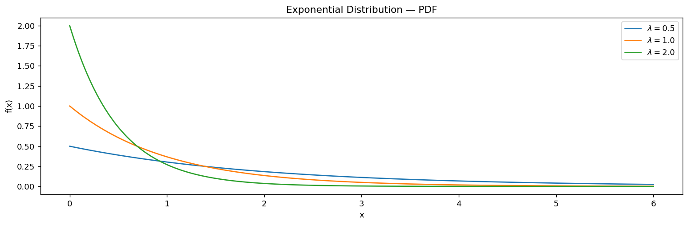

# 지수 밀도함수

## 개요

**Exponential 분포**는 Poisson 과정에서 첫 사건이 일어날 때까지의 대기 시간을 모형화한다. Geometric 분포의 연속형 대응물이며, **무기억성**을 갖는 유일한 연속분포이다.

비율 모수 $\lambda > 0$인 PDF는 다음과 같다:

$$
f(x) = \lambda\, e^{-\lambda x}, \qquad x \ge 0
$$

| 성질 | 값 |
|---|---|
| 평균 | $1/\lambda$ |
| 분산 | $1/\lambda^2$ |
| 중앙값 | $\ln(2)/\lambda$ |
| 최빈값 | 0 |

---

## SciPy 모수화

SciPy는 **척도** 모수화를 사용한다: `stats.expon(scale=1/lambda)`.

<div class="codebox" markdown>

**예제 .** 비율모수에 따른 지수 밀도함수

```python
import matplotlib.pyplot as plt
import numpy as np
import scipy.stats as stats

# 비율모수 lambda 를 셋 준비한다. lambda 가 클수록 사건이 자주 일어난다.
lambdas = [0.5, 1.0, 2.0]
x = np.linspace(0, 6, 300)

fig, ax = plt.subplots(figsize=(12, 4))
for lam in lambdas:
    # scipy는 비율(rate) lambda 가 아니라 **척도(scale) = 1/lambda** 를 받는다.
    # scale이 곧 평균이다. lambda=2 이면 평균 대기시간이 0.5다.
    rv = stats.expon(scale=1 / lam)
    # 밀도는 x=0에서 lambda 로 시작해 지수적으로 떨어진다.
    # lambda 가 클수록 시작점이 높고 더 가파르게 준다.
    ax.plot(x, rv.pdf(x), label=rf'$\lambda={lam}$')
ax.set_xlabel('x')
ax.set_ylabel('f(x)')
ax.set_title('Exponential Distribution — PDF')
ax.legend()
plt.tight_layout()
plt.show()
```

</div>



$\lambda$가 클수록 사건이 더 자주 일어나므로 분포가 0 근처에 더 몰린다.

---

## 무기억성

Exponential 분포는 다음을 만족한다:

$$
P(X > s + t \mid X > s) = P(X > t) \qquad \text{for all } s, t \ge 0
$$

남은 대기 시간이 이미 얼마나 기다렸는지와 무관하다는 뜻이다. 이 과정에는 기억이 없다.

---

## 연습문제

<div class="drillbox" markdown>

**연습문제 1.** <span class="diff med" title="중간"></span>
Exponential 분포의 무기억성을 증명하라.

</div>

??? success "풀이"
    생존함수는 $S(x) = e^{-\lambda x}$이다. 그러면:

    $$
    P(X > s + t \mid X > s) = \frac{P(X > s + t)}{P(X > s)} = \frac{e^{-\lambda(s+t)}}{e^{-\lambda s}} = e^{-\lambda t} = P(X > t)
    $$

    $\square$

<div class="drillbox" markdown>

**연습문제 2.** <span class="diff easy" title="쉬움"></span>
고객 도착이 시간당 $\lambda = 3$인 Poisson 과정을 따를 때, 다음 고객을 30분 넘게 기다릴 확률은 얼마인가?

</div>

??? success "풀이"
    도착 간 시간은 (시간 단위로) $X \sim \text{Exp}(\lambda = 3)$이다. 30분은 $t = 0.5$시간이다.

    $$
    P(X > 0.5) = e^{-3 \times 0.5} = e^{-1.5} \approx 0.2231
    $$

<div class="drillbox" markdown>

**연습문제 3.** <span class="diff hard" title="어려움"></span>
Exponential 분포가 무기억성을 갖는 유일한 연속분포임을 보여라.

</div>

??? success "풀이"
    모든 $s, t \ge 0$에 대해 $P(X > s + t) = P(X > s) \cdot P(X > t)$라 하자. $g(t) = P(X > t)$로 두면 $g(0) = 1$이고 $g$는 감소하며 $g(s+t) = g(s)g(t)$이다.

    $g(0) = 1$인 함수방정식 $g(s+t) = g(s)g(t)$의 연속인 해는 어떤 $\lambda > 0$에 대한 $g(t) = e^{-\lambda t}$뿐이다. 이는 Exponential 분포의 생존함수이다. $\square$

<div class="drillbox" markdown>

**연습문제 4.** <span class="diff med" title="중간"></span>
PDF로부터 Exponential 분포의 CDF, 중앙값, 평균을 유도하라.

</div>

??? success "풀이"
    **CDF:**

    $$
    F(x) = \int_0^x \lambda e^{-\lambda t}\,dt = 1 - e^{-\lambda x}
    $$

    **중앙값:** $F(m) = 0.5$를 풀면:

    $$
    1 - e^{-\lambda m} = 0.5 \implies m = \frac{\ln 2}{\lambda}
    $$

    **평균:**

    $$
    E[X] = \int_0^{\infty} x\lambda e^{-\lambda x}\,dx = \frac{1}{\lambda}
    $$

    (부분적분으로 구한다.)

---

## 정리하며

지수분포는 포아송 과정에서 **첫 사건까지의 대기 시간**이며, 기하분포의 연속형 대응물이다.

- **모수 하나가 전부다.** 평균 $1/\lambda$, 분산 $1/\lambda^2$, 중앙값 $\ln 2/\lambda$, 최빈값 $0$. **평균이 중앙값보다 크다**는 사실이 오른쪽으로 치우친 모양을 그대로 말해 준다.
- **최빈값이 0이라는 점을 놓치기 쉽다.** 평균 대기시간이 10분이어도 가장 흔한 대기시간은 0에 가깝다.
- **무기억성** $P(X>s+t\mid X>s)=P(X>t)$ **를 갖는 유일한 연속분포다.** 이미 기다린 시간이 앞으로 기다릴 시간에 아무 정보도 주지 않는다. 기계 부품처럼 노화하는 대상에는 이 가정이 맞지 않으며, 그때 쓰는 것이 뒤에 나올 **와이불분포**다.
- **SciPy 는 척도 모수화를 쓴다.** `stats.expon(scale=1/lambda)` 이며, 비율 $\lambda$ 를 그대로 넣으면 뜻이 뒤집힌다.

다음 절 **정규분포**로 넘어간다. 이 책에서 가장 많이 등장하는 분포이며, 중심극한정리 덕분에 원래 분포가 무엇이든 표본평균이 향하는 곳이다.
