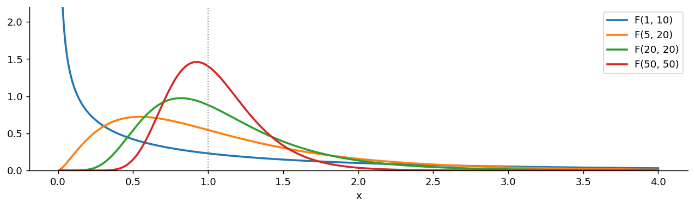
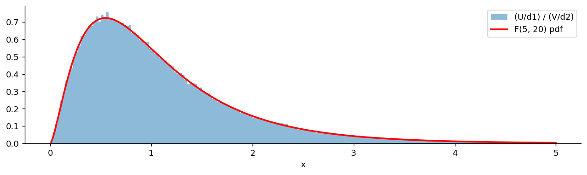

# F 분포

## 개요

**$F$ 분포**는 독립인 두 카이제곱확률변수를 각자의 자유도로 나눈 뒤, 그 **비**의 분포다. 두 개의 분산 추정값 중 어느 쪽이 얼마나 큰지를 재는 자가 필요할 때 나타난다.

4.2절 사슬의 마지막 고리다.

$$
\text{Exp}(\lambda) \to N(\mu, \sigma^2) \to \chi^2_d \to t_d \;\longrightarrow\; F_{d_1, d_2}
$$

사슬을 한 문장으로 되짚으면 이렇다. 정규분포를 **제곱해 더하면** 카이제곱, 정규를 카이제곱으로 **나누면** $t$, 카이제곱을 카이제곱으로 **나누면** $F$다. 세 분포 모두 정규분포 하나에서 나왔고, 나누는 방식만 다르다.

---

## 정의

<div class="defn" markdown>

### 정의 1. F 분포 { .dfn }

$U \sim \chi^2_{d_1}$과 $V \sim \chi^2_{d_2}$가 **서로 독립**일 때

$$
X = \frac{U/d_1}{V/d_2}
$$

의 분포를 **자유도 $(d_1, d_2)$인 $F$ 분포**라 하고 $X \sim F_{d_1, d_2}$로 쓴다. $d_1$을 **분자 자유도**, $d_2$를 **분모 자유도**라 한다.

</div>

### 왜 각자의 자유도로 나누는가

$E[U] = d_1$, $E[V] = d_2$이므로 $U/d_1$과 $V/d_2$는 둘 다 평균이 1이다. 이렇게 맞춰 놓아야 **비가 1 근처에 놓이고**, "두 값이 같은 것을 재고 있는가"라는 물음이 "비가 1에 가까운가"로 번역된다. 자유도로 나누지 않으면 자유도 차이만으로 비가 한쪽으로 쏠려 비교 자체가 되지 않는다.

$d_1$과 $d_2$의 **순서가 중요하다.** $F_{5,20}$과 $F_{20,5}$은 전혀 다른 분포이며, 둘의 관계는 아래 "역수 관계"에서 다룬다.

---

## 밀도

<div class="defn" markdown>

### 정리 1. F 분포의 밀도 { .dfn }

$X \sim F_{d_1, d_2}$의 밀도는

$$
f(x) = \frac{\Gamma\!\left(\frac{d_1 + d_2}{2}\right)}{\Gamma\!\left(\frac{d_1}{2}\right)\Gamma\!\left(\frac{d_2}{2}\right)}\left(\frac{d_1}{d_2}\right)^{d_1/2} x^{\frac{d_1}{2} - 1}\left(1 + \frac{d_1 x}{d_2}\right)^{-\frac{d_1 + d_2}{2}}, \qquad x > 0
$$

</div>

??? proof "증명"

    $t$ 분포 때와 같은 방식이다. 분모를 고정하고 적분한다.

    **1단계: $V$를 고정한다.** $V = v$가 주어지면

    $$
    X = \frac{d_2}{d_1 v}\,U = aU, \qquad a = \frac{d_2}{d_1 v}
    $$

    로 $U$의 상수배다. 따라서 조건부밀도는 $f_{X \mid v}(x) = \frac1a f_U\!\left(\frac xa\right)$이고, 카이제곱 밀도를 넣어 정리하면

    $$
    f_{X\mid v}(x) = \frac{1}{2^{d_1/2}\Gamma(d_1/2)}\left(\frac{d_1 v}{d_2}\right)^{d_1/2} x^{\frac{d_1}{2}-1}\exp\!\left(-\frac{d_1 v x}{2 d_2}\right)
    $$

    이다.

    **2단계: $V$에 대해 적분한다.** 독립이므로 $f_V$를 그대로 곱해 적분한다.

    $$
    f_X(x) = \frac{(d_1/d_2)^{d_1/2}x^{\frac{d_1}{2}-1}}{2^{\frac{d_1+d_2}{2}}\Gamma\!\left(\frac{d_1}{2}\right)\Gamma\!\left(\frac{d_2}{2}\right)}\int_0^\infty v^{\frac{d_1+d_2}{2}-1}\exp\!\left[-\frac v2\left(1 + \frac{d_1 x}{d_2}\right)\right]dv
    $$

    **3단계: 감마적분.** $\int_0^\infty v^{a-1}e^{-bv}dv = \Gamma(a)/b^a$를 쓰면 적분값이

    $$
    \Gamma\!\left(\frac{d_1+d_2}{2}\right)\left[\frac{2}{1 + d_1x/d_2}\right]^{\frac{d_1+d_2}{2}}
    $$

    이고, 2의 거듭제곱이 상쇄되어 정리 1의 식이 남는다. $\square$

밀도의 모양에서 두 가지를 읽을 수 있다. $x \to 0$ 근처에서는 $x^{d_1/2 - 1}$이 지배하므로 $d_1 = 1$이면 발산하고 $d_1 = 2$면 유한한 값에서 시작하며 $d_1 \ge 3$이면 0에서 출발한다. $x \to \infty$에서는 $x^{-(d_2/2 + 1)}$처럼 **멱함수로** 떨어지므로 꼬리가 두껍다. 분모 자유도 $d_2$가 꼬리의 무게를 정한다.

---

## 성질

| 성질 | 조건 | 값 |
|---|---|---|
| 지지집합 | — | $(0, \infty)$ |
| 평균 | $d_2 > 2$ | $\dfrac{d_2}{d_2 - 2}$ |
| 분산 | $d_2 > 4$ | $\dfrac{2d_2^2(d_1 + d_2 - 2)}{d_1(d_2-2)^2(d_2-4)}$ |
| 최빈값 | $d_1 > 2$ | $\dfrac{d_1 - 2}{d_1}\cdot\dfrac{d_2}{d_2 + 2}$ |
| 적률 $E[X^k]$ | $2k < d_2$ | 유한 |

### 평균의 유도

독립성을 쓰면 $t$ 분포의 분산을 구할 때와 똑같은 계산이 나온다.

$$
E[X] = \frac{d_2}{d_1}E[U]\,E\!\left[\frac1V\right] = \frac{d_2}{d_1}\cdot d_1 \cdot \frac{1}{d_2 - 2} = \frac{d_2}{d_2 - 2}
$$

여기서 $E[1/V] = 1/(d_2 - 2)$는 [t 분포](student_t.md) 페이지에서 유도한 것이다.

### 분산의 유도

분산도 같은 길로 간다. $X = \dfrac{d_2}{d_1}\cdot\dfrac{U}{V}$이고 $U$와 $V$가 독립이므로 2차 적률이 곱으로 갈라진다.

$$
E[X^2] = \left(\frac{d_2}{d_1}\right)^{2} E[U^2]\; E\!\left[\frac{1}{V^2}\right]
$$

분자 쪽은 이미 아는 것으로 끝난다. $U \sim \chi^2_{d_1}$의 평균이 $d_1$이고 분산이 $2d_1$이므로

$$
E[U^2] = \text{Var}(U) + (E[U])^2 = 2d_1 + d_1^2 = d_1(d_1+2)
$$

이다. 분모 쪽은 역적률이 하나 더 필요하다. $V \sim \chi^2_{d_2}$의 음의 적률은 감마적분에서 곧바로 나오는데, $E[V^{-k}] = 2^{-k}\,\Gamma(d_2/2 - k)\big/\Gamma(d_2/2)$이므로 $k=2$를 넣으면

$$
E\!\left[\frac{1}{V^2}\right] = \frac{1}{4}\cdot\frac{1}{(d_2/2 - 1)(d_2/2 - 2)} = \frac{1}{(d_2-2)(d_2-4)}
$$

이다. 감마함수의 인수가 양수여야 하므로 $d_2 > 4$라는 조건이 여기서 붙는다. **분산이 존재할 조건이 평균의 조건($d_2 > 2$)보다 까다로운 까닭이 이것이다.** 둘을 합치면

$$
E[X^2] = \frac{d_2^2}{d_1^2}\cdot\frac{d_1(d_1+2)}{(d_2-2)(d_2-4)} = \frac{d_2^2\,(d_1+2)}{d_1(d_2-2)(d_2-4)}
$$

이고, 여기서 $(E[X])^2 = d_2^2/(d_2-2)^2$을 빼면 된다.

$$
\text{Var}(X) = \frac{d_2^2}{d_2-2}\left[\frac{d_1+2}{d_1(d_2-4)} - \frac{1}{d_2-2}\right]
$$

대괄호 안을 통분하면 분자가

$$
(d_1+2)(d_2-2) - d_1(d_2-4) = d_1d_2 - 2d_1 + 2d_2 - 4 - d_1d_2 + 4d_1 = 2(d_1 + d_2 - 2)
$$

로 정리되어 $d_1d_2$가 지워진다. 따라서

$$
\text{Var}(X) = \frac{2d_2^2(d_1+d_2-2)}{d_1(d_2-2)^2(d_2-4)}
$$

이다. $\square$

식이 복잡해 보이지만 읽을 것은 둘뿐이다. 첫째, $d_2 \to \infty$이면 분산이 $2/d_1$로 가는데 이는 $\chi^2_{d_1}/d_1$의 분산과 같다. 분모가 흔들리지 않게 되면 $F$가 그리로 돌아간다는 뜻이다. 둘째, $d_2$가 4에 가까워지면 $(d_2-4)$ 때문에 분산이 무한대로 발산한다. 분모 자유도가 작으면 $V$가 0 근처에 올 확률이 무시할 수 없고, 그때 비가 폭발하기 때문이다.

### 평균이 1이 아닌 이유

두 분산 추정값의 비라면 평균이 1이어야 할 것 같지만 실제로는

$$
\frac{d_2}{d_2 - 2} = 1 + \frac{2}{d_2 - 2} > 1
$$

로 언제나 1보다 크다. 원인은 **옌센 부등식**이다. $1/x$가 볼록함수이므로

$$
E\!\left[\frac{1}{V/d_2}\right] > \frac{1}{E[V/d_2]} = 1
$$

이다. 분모가 흔들린다는 사실 자체가 비의 기댓값을 위로 밀어 올린다. 분모 자유도가 커질수록 흔들림이 줄어 평균이 1로 내려간다. $d_2 = 10$이면 1.25, $d_2 = 50$이면 1.04다.

### 역수 관계

<div class="defn" markdown>

### 정리 2. 역수 관계 { .dfn }

$X \sim F_{d_1, d_2}$이면

$$
\frac1X \sim F_{d_2, d_1}
$$

이고, 따라서 분위수 사이에 다음 관계가 성립한다:

$$
F_{\alpha}(d_1, d_2) = \frac{1}{F_{1 - \alpha}(d_2, d_1)}
$$

여기서 $F_\alpha(d_1, d_2)$는 $F_{d_1,d_2}$의 $\alpha$분위수다.

</div>

??? proof "증명"

    정의를 뒤집기만 하면 된다.

    $$
    \frac1X = \frac{V/d_2}{U/d_1}
    $$

    인데 이것은 자유도 $d_2$인 카이제곱을 $d_2$로 나눈 것과 자유도 $d_1$인 카이제곱을 $d_1$로 나눈 것의 비이므로 $F_{d_2, d_1}$이다.

    분위수 관계는 여기서 따라 나온다. $P(X \le x) = \alpha$이면 $P(1/X \ge 1/x) = \alpha$, 즉 $P(1/X \le 1/x) = 1 - \alpha$이므로 $1/x$가 $F_{d_2,d_1}$의 $(1-\alpha)$분위수다. $\square$

이 관계는 표를 절약하려고 만들어진 것이다. 옛 교재의 $F$ 표에는 오른쪽 꼬리(95, 99백분위점)만 실려 있는데, 왼쪽 꼬리가 필요하면 자유도를 맞바꾼 표의 오른쪽 꼬리를 읽고 역수를 취하면 된다. 예를 들어

$$
F_{0.05}(5, 20) = \frac{1}{F_{0.95}(20, 5)} = \frac{1}{4.558} = 0.2194
$$

이다.

---

## 다른 분포로 이어지는 길

### 분자 자유도가 1일 때: t 분포의 제곱

$$
F_{1, d} = t_d^2
$$

분자가 $Z^2 \sim \chi^2_1$이기 때문이다. 부호를 버리고 제곱했으므로, 양측 $t$ 검정이 단측 $F$ 검정으로 바뀐다.

### 분모 자유도가 무한대로 갈 때: 카이제곱분포

분모의 $V/d_2$는 큰수의 법칙에 의해 1로 굳어진다. 따라서

$$
d_1 X \;\xrightarrow{\;d_2 \to \infty\;}\; \chi^2_{d_1}
$$

이다. 분모 자유도가 충분히 크면 $F$ 검정과 카이제곱 검정이 사실상 같아진다는 뜻이다. **분모의 불확실성이 사라지면 비를 볼 필요가 없어지고 분자만 남는다.**

### 베타분포와의 관계

$$
Y = \frac{d_1 X}{d_1 X + d_2} = \frac{U}{U + V} \sim \text{Beta}\!\left(\frac{d_1}{2}, \frac{d_2}{2}\right)
$$

$F$ 분포는 $(0,\infty)$ 위에, 베타분포는 $(0,1)$ 위에 사는 같은 분포의 두 모습이다. 위 변환이 무한 구간을 유한 구간으로 접어 넣는다. 통계 소프트웨어가 $F$의 CDF를 계산할 때 실제로 쓰는 것이 이 관계이며, 불완전 베타함수 하나로 $t$, $F$, 베타, 이항까지 모두 계산된다.

### 사슬 전체를 한눈에

| 관계 | 내용 |
|---|---|
| $Z^2 = \chi^2_1$ | 정규를 제곱하면 자유도 1인 카이제곱 |
| $\chi^2_2 = \text{Exp}(1/2)$ | 자유도 2인 카이제곱은 지수분포 |
| $t_d = Z/\sqrt{\chi^2_d/d}$ | 정규를 카이제곱으로 나누면 $t$ |
| $t_\infty = Z$ | 분모가 굳으면 정규로 돌아온다 |
| $t_d^2 = F_{1,d}$ | $t$를 제곱하면 분자 자유도 1인 $F$ |
| $F_{d_1,\infty} = \chi^2_{d_1}/d_1$ | 분모가 굳으면 카이제곱으로 돌아온다 |

사슬이 한 방향으로만 흐르지 않는다는 점이 중요하다. 끝에서 극한을 취하면 앞의 고리로 되돌아온다. 다섯 분포는 줄지어 선 다섯 개의 사물이 아니라 **정규분포 하나를 여러 각도에서 본 모습들**이다.

---

## 왜 F 분포인가

$F$ 분포가 실제로 나타나는 자리는 **두 분산의 비교**다. 정규모집단 두 개에서 각각 크기 $n_1$, $n_2$인 표본을 뽑았다고 하자. 5장에서 보듯이

$$
\frac{(n_1 - 1)S_1^2}{\sigma_1^2} \sim \chi^2_{n_1 - 1}, \qquad \frac{(n_2-1)S_2^2}{\sigma_2^2} \sim \chi^2_{n_2-1}
$$

이고 두 표본이 독립이면 두 카이제곱도 독립이다. 각각을 자유도로 나누어 비를 잡으면 $\sigma$들이 다음과 같이 남는다.

$$
\frac{S_1^2/\sigma_1^2}{S_2^2/\sigma_2^2} \sim F_{n_1 - 1,\, n_2 - 1}
$$

귀무가설 $\sigma_1 = \sigma_2$ 아래에서는 $\sigma$가 약분되어 $S_1^2/S_2^2 \sim F_{n_1-1, n_2-1}$이 된다. **모르는 모수가 사라지고 관측 가능한 양만 남는다**는 점이 이 통계량이 쓸모 있는 이유다.

분산분석의 $F$ 검정도 같은 구조다. 집단 간 변동과 집단 내 변동을 각각 자유도로 나누면 둘 다 귀무가설 아래에서 같은 $\sigma^2$의 불편추정량이 되고, 그 비가 $F$ 분포를 따른다. 비가 1보다 훨씬 크면 집단 간 차이가 우연으로 설명되지 않는다는 신호다.

---

## 문제

<div class="probox" markdown>

**문제:** <span class="diff easy" title="쉬움"></span> 두 생산라인의 분산을 비교한다. 각각 $n_1 = 6$, $n_2 = 21$개를 뽑아 $S_1^2 = 12.4$, $S_2^2 = 4.1$을 얻었다. $F_{0.95}(5, 20) = 2.711$일 때 유의수준 5%에서 단측 검정하라.

</div>

??? success "풀이"

    귀무가설 $H_0: \sigma_1^2 = \sigma_2^2$, 대립가설 $H_1: \sigma_1^2 > \sigma_2^2$이다. 검정통계량은

    $$
    F = \frac{S_1^2}{S_2^2} = \frac{12.4}{4.1} = 3.024
    $$

    이고 귀무가설 아래에서 $F_{5, 20}$을 따른다. $3.024 > 2.711$이므로 기각한다. 첫째 라인의 분산이 더 크다고 볼 근거가 있다.

    참고로 이 분포의 평균은 $20/18 = 1.111$이고 최빈값은 $\frac{3}{5}\cdot\frac{20}{22} = 0.545$다. 관측값 3.024는 평균의 세 배에 가깝다.

    !!! warning "정규성 가정"
        $F$ 검정은 **정규성에 매우 민감하다.** 모집단이 정규가 아니면 유의수준이 크게 틀어진다. 5.9절에서 재어 보면 지수 모집단에서 명목 5% 검정이 실제로 27%를, 로그정규에서는 49%를 기각한다. 게다가 표본을 키우면 나아지는 것이 아니라 더 나빠진다. 평균 비교($t$ 검정)가 정규성 위반에 꽤 너그러운 것과 대조적이며, 그 까닭과 대가의 크기는 5.2절과 5.9절에서 따진다. 실무에서는 르빈 검정이나 브라운–포사이드 검정처럼 로버스트한 대안을 쓴다.

---

## Python: 밀도, 표본추출, 관계 확인

### 자유도에 따른 밀도

<div class="codebox" markdown>

#### 예제 1. 자유도에 따른 F 밀도 { .eg }

```python
import matplotlib.pyplot as plt
import numpy as np
from scipy import stats

x = np.linspace(0.01, 4, 400)

fig, ax = plt.subplots(figsize=(12, 3))
# 분자 자유도 d1이 0 근처의 모양을, 분모 자유도 d2가 꼬리의 무게를 정한다.
#   (1, 10)  : d1=1 이라 0에서 발산한다. 이것이 t(10)^2 의 분포다.
#   (5, 20)  : 봉우리가 0.545, 평균이 1.111. 오른쪽으로 치우쳐 있다.
#   (20, 20) : 두 자유도가 같아 1 근처에 모인다.
#   (50, 50) : 더 좁아진다. 자유도가 크면 비가 1에서 벗어나기 어렵다.
for d1, d2 in [(1, 10), (5, 20), (20, 20), (50, 50)]:
    ax.plot(x, stats.f(d1, d2).pdf(x), lw=2, label=f'F({d1}, {d2})')
ax.axvline(1, color='gray', ls=':', lw=1)   # 비가 1이면 두 분산이 같다는 뜻
ax.set_ylim(0, 2.2)
ax.set_xlabel('x')
ax.spines[['top', 'right']].set_visible(False)
ax.legend()
plt.show()
```



</div>

### 평균과 최빈값이 1을 사이에 두고 갈라진다

<div class="codebox" markdown>

#### 예제 2. 평균과 최빈값을 함께 그리기 { .eg }

```python
import numpy as np
import matplotlib.pyplot as plt
import scipy.stats as stats

# F 분포는 자유도가 둘이다. 두 카이제곱을 각자의 자유도로 나눈 뒤의 비율이다.
#   dfn = 분자 자유도, dfd = 분모 자유도
d1, d2 = 5, 12
f_dist = stats.f(dfn=d1, dfd=d2)

x = np.linspace(f_dist.ppf(1e-6), f_dist.ppf(1 - 1e-6), 600)
y = f_dist.pdf(x)

# 평균은 분모 자유도만으로 정해지며 d2 > 2 일 때만 존재한다.
# d2가 작으면 꼬리가 매우 무거워 평균이 아예 없다.
mean = d2 / (d2 - 2)
mode = ((d1 - 2) / d1) * (d2 / (d2 + 2))
# 최빈값 0.514 < 1 < 평균 1.2 다. 둘이 1을 사이에 두고 갈라져 있다.

fig, ax = plt.subplots(figsize=(12, 3))
ax.plot(x, y, lw=2, label=f"F PDF (d1={d1}, d2={d2})")
ax.axvline(mean, linestyle='--', alpha=0.85, label=f"mean = {mean:.3f}")
ax.axvline(mode, linestyle=':', alpha=0.85, label=f"mode = {mode:.3f}")
ax.set_title("F Distribution — PDF")
ax.set_xlabel("x")
ax.set_ylabel("density")
ax.legend()
ax.grid(True, linestyle=":")
plt.tight_layout()
plt.show()
```


</div>

### 정의대로 만들어 보기

<div class="codebox" markdown>

#### 예제 3. 카이제곱 두 개의 비가 정말 F인가 { .eg }

```python
import matplotlib.pyplot as plt
import numpy as np
from scipy import stats

np.random.seed(42)
d1, d2 = 5, 20
# 정의를 그대로 실행한다. 두 카이제곱을 **따로** 뽑아야 독립이 보장된다.
# 각각을 자기 자유도로 나누는 것이 핵심이다. 그래야 비가 1 근처에 놓인다.
u = stats.chi2(d1).rvs(200_000)
v = stats.chi2(d2).rvs(200_000)
x = (u / d1) / (v / d2)

grid = np.linspace(0.01, 5, 400)
fig, ax = plt.subplots(figsize=(12, 3))
# 구간을 [0, 5]로 고정한다. 오른쪽 꼬리가 두꺼워 x > 20 인 값도 나온다.
ax.hist(x, bins=200, range=(0, 5), density=True, alpha=0.5, label='(U/d1) / (V/d2)')
ax.plot(grid, stats.f(d1, d2).pdf(grid), 'r-', lw=2, label='F(5, 20) pdf')
ax.set_xlabel('x')
ax.spines[['top', 'right']].set_visible(False)
ax.legend()
plt.show()

print(f"sample mean {x.mean():.4f} (theory {d2/(d2-2):.4f})")
print(f"P(X > 2.711) = {np.mean(x > 2.711):.4f} (theory 0.05)")
```

출력:

```
sample mean 1.1128 (theory 1.1111)
P(X > 2.711) = 0.0507 (theory 0.05)
```



</div>

### 관계 확인하기

<div class="codebox" markdown>

#### 예제 4. 역수 관계, t 제곱, 카이제곱 극한 { .eg }

```python
from scipy import stats

# (1) 역수 관계: F_0.05(5, 20) = 1 / F_0.95(20, 5)
print(f"F_0.05(5,20)     = {stats.f(5, 20).ppf(0.05):.6f}")
print(f"1 / F_0.95(20,5) = {1 / stats.f(20, 5).ppf(0.95):.6f}")

# (2) t^2 = F(1, d): 양측 97.5백분위점의 제곱이 F의 95백분위점이다.
print(f"t(10).ppf(0.975)^2 = {stats.t(10).ppf(0.975)**2:.6f}")
print(f"F(1,10).ppf(0.95)  = {stats.f(1, 10).ppf(0.95):.6f}")

# (3) d2가 크면 d1*F 가 카이제곱에 가까워진다.
print(f"4 * F(4,1000).ppf(0.95) = {4 * stats.f(4, 1000).ppf(0.95):.4f}")
print(f"chi2(4).ppf(0.95)       = {stats.chi2(4).ppf(0.95):.4f}")
```

출력:

```
F_0.05(5,20)     = 0.219388
1 / F_0.95(20,5) = 0.219388
t(10).ppf(0.975)^2 = 4.964603
F(1,10).ppf(0.95)  = 4.964603
4 * F(4,1000).ppf(0.95) = 9.5233
chi2(4).ppf(0.95)       = 9.4877
```

세 관계가 모두 소수점 아래까지 맞는다. 셋째 것만 근사이며, 분모 자유도를 더 키우면 차이가 더 줄어든다.

</div>

---

## 연습문제

<div class="drillbox" markdown>

**연습문제 1.** <span class="diff easy" title="쉬움"></span>
$X \sim F_{10, 5}$이다. (a) 평균은? (b) 분산은 존재하는가? (c) $1/X$의 분포와 평균은?

</div>

??? success "풀이"
    (a) $d_2 = 5 > 2$이므로 $E[X] = 5/3 = 1.667$이다.

    (b) 분산은 $d_2 > 4$일 때만 존재한다. $d_2 = 5$이므로 간신히 존재하지만, 식에 $d_2 - 4 = 1$이 분모로 들어가므로

    $$
    \text{Var}(X) = \frac{2 \cdot 25 \cdot 13}{10 \cdot 9 \cdot 1} = 7.22
    $$

    로 대단히 크다. 표준편차가 2.69로 평균 1.667보다 크다. 이런 분포에서 표본분산을 추정하면 값이 심하게 흔들린다.

    (c) 역수 관계에 의해 $1/X \sim F_{5, 10}$이고 평균은 $10/8 = 1.25$다. **$X$의 평균이 1.667인데 $1/X$의 평균은 $1/1.667 = 0.6$이 아니라 1.25다.** 역수의 기댓값은 기댓값의 역수가 아니라는 사실을 보여 주는 깔끔한 예다.

<div class="drillbox" markdown>

**연습문제 2.** <span class="diff med" title="중간"></span>
$E[X] = d_2/(d_2-2)$를 유도하고, 이 값이 항상 1보다 큰 이유를 옌센 부등식으로 설명하라. $d_2 \le 2$이면 어떻게 되는가?

</div>

??? success "풀이"
    **유도.** $U$와 $V$가 독립이므로

    $$
    E[X] = \frac{d_2}{d_1}E[U]E\!\left[\frac1V\right] = \frac{d_2}{d_1}\cdot d_1\cdot\frac{1}{d_2-2} = \frac{d_2}{d_2-2}
    $$

    여기서 $E[1/V] = 1/(d_2-2)$는 $\chi^2_{d_2}$의 밀도를 직접 적분해 얻는다.

    **옌센.** $g(w) = 1/w$는 $w > 0$에서 볼록하므로 $E[g(W)] > g(E[W])$이다. $W = V/d_2$로 두면 $E[W] = 1$이므로

    $$
    E\!\left[\frac{1}{W}\right] > \frac{1}{E[W]} = 1
    $$

    이고, $E[X] = E[U/d_1]E[1/W] = 1 \cdot E[1/W] > 1$이다. $\square$

    **$d_2 \le 2$.** $E[1/V]$가 발산하므로 평균이 존재하지 않는다. 분모가 0 근처를 너무 자주 방문하기 때문이며, $t$ 분포에서 $d \le 2$일 때 분산이 무한대가 되던 것과 같은 현상이다.

    직관적으로 옌센 부등식의 간극 $E[1/W] - 1$은 $W$의 산포가 클수록 커진다. 분모 자유도가 작을수록 분산 추정이 불안정하고, 그 불안정성이 비를 위로 밀어 올린다.

<div class="drillbox" markdown>

**연습문제 3.** <span class="diff med" title="중간"></span>
$F$ 분포의 최빈값이 $d_1 > 2$일 때 $\frac{d_1-2}{d_1}\cdot\frac{d_2}{d_2+2}$임을 보여라. 이 값이 항상 1보다 작음을 확인하고 그 뜻을 설명하라.

</div>

??? success "풀이"
    로그밀도에서 $x$에 의존하는 부분만 남기면

    $$
    \ln f(x) = \left(\frac{d_1}{2} - 1\right)\ln x - \frac{d_1 + d_2}{2}\ln\!\left(1 + \frac{d_1 x}{d_2}\right) + c
    $$

    이다. 미분하여 0으로 두면

    $$
    \frac{d_1/2 - 1}{x} = \frac{d_1 + d_2}{2}\cdot\frac{d_1/d_2}{1 + d_1x/d_2}
    $$

    이고, 양변에 $x\left(1 + \frac{d_1x}{d_2}\right)$를 곱해 정리하면

    $$
    \left(\frac{d_1}{2}-1\right)\left(1 + \frac{d_1 x}{d_2}\right) = \frac{d_1(d_1+d_2)}{2d_2}x
    $$

    이다. $x$ 항을 모으면

    $$
    \frac{d_1}{2} - 1 = \frac{d_1 x}{d_2}\left[\frac{d_1 + d_2}{2} - \frac{d_1}{2} + 1\right] = \frac{d_1 x}{d_2}\cdot\frac{d_2 + 2}{2}
    $$

    이므로

    $$
    x = \frac{d_1 - 2}{d_1}\cdot\frac{d_2}{d_2+2}
    $$

    이다. $\square$

    **1보다 작다.** 두 인수가 각각 1보다 작으므로($\frac{d_1-2}{d_1} < 1$, $\frac{d_2}{d_2+2} < 1$) 곱도 1보다 작다.

    **$d_1 \le 2$이면 이 공식을 쓸 수 없다.** 밀도가 아예 봉우리를 갖지 않기 때문이다. 밀도의 $x^{d_1/2-1}$ 부분이 $d_1 = 2$에서는 상수, $d_1 = 1$에서는 $x^{-1/2}$로 발산하므로 두 경우 모두 0에서부터 단조감소한다. 최빈값은 내부의 봉우리가 아니라 경계 0이며, 공식이 0 이하의 값을 내놓는 것이 그 신호다.

    **뜻.** 최빈값은 1보다 작고 평균은 1보다 크다. 즉 $F$ 분포는 언제나 **오른쪽으로 치우쳐** 있고, 가장 흔한 값과 평균이 1을 사이에 두고 갈라져 있다. 두 분산이 정말로 같아도 관측된 비는 1보다 작게 나오는 경우가 더 많지만, 어쩌다 크게 벗어날 때는 아주 크게 벗어난다는 뜻이다.

<div class="drillbox" markdown>

**연습문제 4.** <span class="diff med" title="중간"></span>
$U \sim \chi^2_{d_1}$, $V \sim \chi^2_{d_2}$가 독립일 때 $Y = \dfrac{U}{U+V} \sim \text{Beta}\!\left(\frac{d_1}{2}, \frac{d_2}{2}\right)$임을 보이고, 이것이 $F$ 분포와 어떻게 연결되는지 밝혀라.

</div>

??? success "풀이"
    $U$와 $V$가 각각 형상 $d_1/2$, $d_2/2$이고 **척도가 2로 같은** 감마확률변수다. 척도가 같은 독립 감마의 비율에 대한 표준 결과가 곧 베타분포다.

    직접 보이려면 $(Y, S) = \left(\frac{U}{U+V},\, U+V\right)$로 변수변환한다. 역변환은 $U = YS$, $V = (1-Y)S$이고 야코비안의 절댓값은 $S$다. 결합밀도에 넣으면

    $$
    f(y, s) \propto (ys)^{\frac{d_1}{2}-1}\left[(1-y)s\right]^{\frac{d_2}{2}-1}e^{-s/2}\cdot s = \underbrace{y^{\frac{d_1}{2}-1}(1-y)^{\frac{d_2}{2}-1}}_{\text{Beta}}\cdot\underbrace{s^{\frac{d_1+d_2}{2}-1}e^{-s/2}}_{\chi^2_{d_1+d_2}}
    $$

    로 곱으로 쪼개진다. 따라서 $Y \sim \text{Beta}(d_1/2, d_2/2)$이고 $S \sim \chi^2_{d_1+d_2}$이며 **둘은 독립**이다. $\square$

    **$F$와의 연결.** $X = \frac{U/d_1}{V/d_2}$에서 $U/V = \frac{d_1}{d_2}X$이므로

    $$
    Y = \frac{U/V}{U/V + 1} = \frac{d_1 X}{d_1 X + d_2}
    $$

    이다. 단조증가 변환이므로 분위수가 서로 대응하고, $F$의 확률 계산이 베타의 확률 계산으로 바뀐다. 소프트웨어가 `betainc` 하나로 $F$, $t$, 이항의 꼬리확률을 모두 처리하는 이유다.

<div class="drillbox" markdown>

**연습문제 5.** <span class="diff med" title="중간"></span>
$d_2 \to \infty$일 때 $d_1 X \to \chi^2_{d_1}$임을 설명하고, $d_1 = 4$, $d_2 = 1000$에서 95백분위점을 비교하라.

</div>

??? success "풀이"
    $V \sim \chi^2_{d_2}$의 평균이 $d_2$, 분산이 $2d_2$이므로

    $$
    \frac{V}{d_2} \to 1 \quad (\text{확률수렴}), \qquad \text{Var}\!\left(\frac{V}{d_2}\right) = \frac{2}{d_2} \to 0
    $$

    이다. 따라서 $d_1 X = \frac{U}{V/d_2} \to U \sim \chi^2_{d_1}$이다. **분모의 불확실성이 사라지면 비가 아니라 분자만 남는다.**

    수치로는 $4 \times F_{0.95}(4, 1000) = 9.523$이고 $\chi^2_{0.95}(4) = 9.488$로 0.4% 차이다.

    **실무적 의미.** 회귀분석에서 표본이 아주 크면 $F$ 검정과 왈드 카이제곱 검정이 거의 같은 답을 준다. 반대로 표본이 작을 때 카이제곱 검정을 쓰면 분모의 불확실성을 무시하는 셈이라 **$p$-값이 실제보다 작게 나온다.** 작은 표본에서 $F$를 고집해야 하는 이유다.

<div class="drillbox" markdown>

**연습문제 6.** <span class="diff med" title="중간"></span>
분산분석에서 집단 간 평균제곱 $\text{MS}_{\text{between}}$과 집단 내 평균제곱 $\text{MS}_{\text{within}}$의 비가 왜 $F$ 분포를 따르는지, 그리고 왜 **단측** 검정을 하는지 설명하라.

</div>

??? success "풀이"
    **왜 $F$인가.** 귀무가설(모든 집단의 평균이 같다) 아래에서 두 평균제곱은 모두 같은 $\sigma^2$의 불편추정량이다.

    $$
    E[\text{MS}_{\text{between}}] = \sigma^2, \qquad E[\text{MS}_{\text{within}}] = \sigma^2
    $$

    각각에 대응하는 제곱합을 $\sigma^2$으로 나누면 카이제곱이 되고, 코크런 정리에 의해 두 제곱합이 서로 독립이다. 따라서 각각을 자유도로 나눈 비는 정의 1에 정확히 들어맞아 $F_{k-1,\, N-k}$를 따른다.

    **왜 단측인가.** 대립가설(평균이 서로 다르다) 아래에서는 집단 간 제곱합에 평균 차이에서 오는 항이 더해진다.

    $$
    E[\text{MS}_{\text{between}}] = \sigma^2 + \frac{\sum n_i(\mu_i - \bar\mu)^2}{k-1} > \sigma^2
    $$

    반면 집단 내 평균제곱은 평균 차이와 무관하게 $\sigma^2$을 그대로 추정한다. 즉 **차이가 있으면 비가 커지는 쪽으로만 움직인다.** 비가 아주 작은 것은 평균 차이의 증거가 아니라 우연이거나 자료 조작의 신호다(피셔가 멘델의 완두콩 자료를 의심한 근거가 바로 지나치게 작은 카이제곱 값이었다).

    이 비대칭성이 분산분석의 $F$ 검정을 언제나 오른쪽 꼬리로만 하는 이유다.

<div class="drillbox" markdown>

**연습문제 7.** <span class="diff med" title="중간"></span>
두 분산이 같은지 **양측**으로 검정할 때, "큰 분산을 분자에 놓고 오른쪽 꼬리만 본 뒤 $p$-값을 두 배 한다"는 관행이 있다. 이 절차가 옳은 이유와, 그냥 $F = S_1^2/S_2^2$을 쓰고 양쪽 꼬리를 보는 것과의 관계를 설명하라.

</div>

??? success "풀이"
    양측 검정의 $p$-값은 원래

    $$
    p = 2\min\{P(F \ge f_{\text{obs}}),\ P(F \le f_{\text{obs}})\}
    $$

    이다(등꼬리 방식). 두 꼬리확률 중 작은 쪽이 관측값이 놓인 쪽이다.

    큰 분산을 분자에 놓으면 $f_{\text{obs}} \ge 1$이 보장되고, 오른쪽 꼬리확률이 자동으로 작은 쪽이 된다. 따라서 오른쪽 꼬리만 계산해 두 배 하면 위 식과 같은 값이 된다. **역수 관계(정리 2)가 이 맞바꿈을 정당화한다.** 분자와 분모를 바꾸면 자유도도 함께 바뀌므로

    $$
    P\!\left(F_{d_1,d_2} \le \frac{1}{c}\right) = P\!\left(F_{d_2,d_1} \ge c\right)
    $$

    가 성립하여 왼쪽 꼬리 계산이 오른쪽 꼬리 계산으로 바뀐다.

    주의할 점은 **자유도도 반드시 함께 바꿔야 한다**는 것이다. $S_1^2$과 $S_2^2$을 맞바꾸면서 자유도를 그대로 두면 완전히 틀린 $p$-값이 나온다. 손으로 표를 읽던 시절에 흔했던 실수이며, 지금은 `stats.f(d1, d2).sf(f_obs)`로 직접 계산하고 필요하면 두 배 하는 편이 안전하다.

    한 가지 더. 등꼬리 방식과 가능도비 방식은 $F$ 분포가 비대칭이라 **서로 다른 구간**을 준다. 어느 쪽이든 정해 놓고 일관되게 쓰면 되지만, 보고할 때는 어느 방식인지 밝혀야 한다.

<div class="drillbox" markdown>

**연습문제 8.** <span class="diff easy" title="쉬움"></span>
크기가 10인 세 집단으로 이루어진 일원배치 분산분석에서 $F$ 검정의 자유도는 얼마인가? 유의수준 5%에서 임계값은?

</div>

??? success "풀이"
    집단이 $k = 3$개, 전체 관측값이 $N = 30$개다.

    - 분자(집단 간) 자유도: $d_1 = k - 1 = 2$
    - 분모(집단 내) 자유도: $d_2 = N - k = 30 - 3 = 27$

    임계값은 `stats.f.ppf(0.95, 2, 27)` $\approx 3.354$이고, 관측된 $F$가 이를 넘으면 세 집단 평균이 모두 같다는 귀무가설을 기각한다.

    자유도 장부가 맞는지 확인해 두면 좋다. $2 + 27 = 29 = N - 1$로, 전체 제곱합의 자유도와 일치한다. 카이제곱의 가법성이 제곱합의 분해에 그대로 반영된 결과다.

<div class="drillbox" markdown>

**연습문제 9.** <span class="diff med" title="중간"></span>
두 정규모집단에서 각각 $n_1 = 13$, $s_1^2 = 24.5$와 $n_2 = 16$, $s_2^2 = 9.8$을 얻었다. 두 모분산이 같은지 유의수준 5%로 **양측**검정하라.

</div>

??? success "풀이"
    $H_0 : \sigma_1^2 = \sigma_2^2$ 아래에서 검정통계량은 두 표본분산의 비다.

    $$
    F = \frac{s_1^2}{s_2^2} = \frac{24.5}{9.8} = 2.5, \qquad (d_1, d_2) = (12, 15)
    $$

    양측 5%의 기각역은 $F < F_{0.025}(12,15) = 0.315$ 또는 $F > F_{0.975}(12,15) = 2.963$이다. 2.5는 그 사이에 있으므로 $H_0$을 기각하지 못한다.

    $p$-값으로 확인하면 위쪽 꼬리 확률이 `stats.f.sf(2.5, 12, 15) = 0.048`이고, 양측이므로 두 배 한 **0.096**이 $p$-값이다. 한쪽 꼬리만 보고 "0.048이니 유의하다"고 말하는 것이 흔한 실수이며, 연습문제 7에서 다룬 두 배 규칙이 바로 이 상황을 위한 것이다.

    분산이 2.5배나 차이 나 보이는데도 기각되지 않는다는 점에 주목하라. 자유도 12와 15로는 분산비를 정밀하게 재지 못한다. **분산 비교는 평균 비교보다 훨씬 많은 자료를 요구한다.**

<div class="drillbox" markdown>

**연습문제 10.** <span class="diff med" title="중간"></span>
설명변수가 5개인 회귀모형(절편 포함 모수 6개)과 그중 2개만 남긴 축소모형(모수 3개)을 $n = 40$인 자료에 적합해 $\text{RSS}_{\text{축소}} = 120$, $\text{RSS}_{\text{완전}} = 90$을 얻었다. 버린 3개 변수가 모두 쓸모없다는 가설을 유의수준 5%로 검정하라.

</div>

??? success "풀이"
    내포된 두 모형의 비교에 쓰는 통계량은 다음과 같다.

    $$
    F = \frac{(\text{RSS}_{\text{축소}} - \text{RSS}_{\text{완전}})/(p_{\text{완전}} - p_{\text{축소}})}{\text{RSS}_{\text{완전}}/(n - p_{\text{완전}})}
    $$

    분자 자유도는 $6 - 3 = 3$, 분모 자유도는 $40 - 6 = 34$다. 값을 넣으면

    $$
    F = \frac{(120 - 90)/3}{90/34} = \frac{10}{2.647} \approx 3.778
    $$

    이다. 임계값은 $F_{0.95}(3, 34) \approx 2.883$이고 $3.778 > 2.883$이므로 귀무가설을 기각한다. $p$-값은 `stats.f.sf(3.778, 3, 34)` $\approx 0.019$다.

    분자와 분모의 구조를 읽어 보면 정의 1이 그대로 보인다. 분자는 "모형을 키워서 줄어든 제곱합"을 늘어난 모수 개수로 나눈 것이고, 분모는 완전모형의 오차분산 추정값이다. 귀무가설 아래에서 둘 다 $\sigma^2$의 불편추정량이며 코크런 정리에 의해 독립이다.

    이 검정이 말해 주는 것은 "세 계수가 모두 0은 아니다"까지이며, 셋 중 어느 것이 필요한지는 말해 주지 않는다. 계수 하나씩을 보려면 각각의 $t$ 검정을 쓰는데, 그것이 곧 $F_{1,34}$ 검정이다(위의 "$d_1 = 1$" 절).

---

## 정리하며

- $F$ 분포는 독립인 두 카이제곱을 각자의 자유도로 나눈 뒤 취한 비의 분포다. 자유도로 나누기 때문에 비가 1 근처에 놓이고, "두 분산이 같은가"가 "비가 1에 가까운가"로 번역된다.
- 평균 $d_2/(d_2-2)$는 언제나 1보다 크다. 분모가 흔들린다는 사실이 옌센 부등식을 통해 비의 기댓값을 위로 밀어 올리기 때문이다.
- 분자 자유도 $d_1$이 0 근처의 모양을, 분모 자유도 $d_2$가 꼬리의 무게와 적률의 존재를 정한다. 분포는 언제나 오른쪽으로 치우쳐 있다.
- 역수 관계 $1/F_{d_1,d_2} = F_{d_2,d_1}$은 왼쪽 꼬리를 오른쪽 꼬리 계산으로 바꿔 준다. 자유도를 함께 바꾸는 것을 잊으면 안 된다.
- $F_{1,d} = t_d^2$이고 $d_2 \to \infty$이면 $d_1 F \to \chi^2_{d_1}$이다. 사슬의 끝에서 극한을 취하면 앞의 고리로 되돌아온다.
- 분산분석과 회귀모형 비교가 모두 이 분포 위에 서 있지만, 등분산 검정으로서의 $F$ 검정은 정규성 위반에 취약하므로 로버스트한 대안을 쓰는 편이 낫다.
