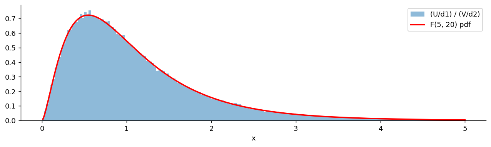
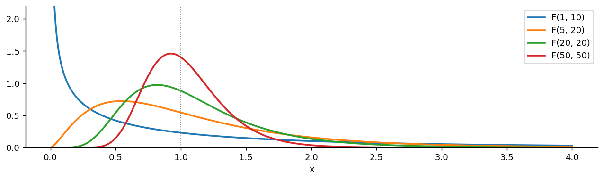
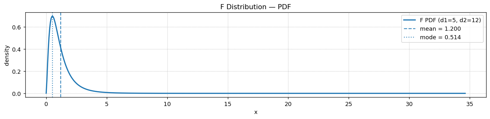

# F 분포

## 개요

**$F$ 분포**는 독립인 두 카이제곱확률변수를 각자의 자유도로 나눈 뒤, 그 **비**의 분포다. 두 개의 분산 추정값 중 어느 쪽이 얼마나 큰지를 재는 자가 필요할 때 나타난다.

4.2절 사슬의 마지막 고리다.

$$
\text{Exp}(\lambda) \to N(\mu, \sigma^2) \to \chi^2_d \to t_d \;\longrightarrow\; F_{d_1, d_2}
$$

사슬을 한 문장으로 되짚으면 이렇다. 정규분포를 **제곱해 더하면** 카이제곱, 정규를 카이제곱으로 **나누면** $t$, 카이제곱을 카이제곱으로 **나누면** $F$다. 세 분포 모두 정규분포 하나에서 나왔고, 나누는 방식만 다르다.

---

## 1. 정의

<div class="defn" markdown>

### 정의 1. F 분포 { .dfn }

$U \sim \chi^2_{d_1}$과 $V \sim \chi^2_{d_2}$가 **서로 독립**일 때

$$
X = \frac{U/d_1}{V/d_2}
$$

의 분포를 **자유도 $(d_1, d_2)$인 $F$ 분포**라 하고 $X \sim F_{d_1, d_2}$로 쓴다. $d_1$을 **분자 자유도**, $d_2$를 **분모 자유도**라 한다.

</div>

### 왜 각자의 자유도로 나누는가

$E[U] = d_1$, $E[V] = d_2$이므로 $U/d_1$과 $V/d_2$는 둘 다 평균이 1이다. 이렇게 맞춰 놓아야 **비가 1 근처에 놓이고**, "두 값이 같은 것을 재고 있는가"라는 물음이 "비가 1에 가까운가"로 번역된다. 자유도로 나누지 않으면 자유도 차이만으로 비가 한쪽으로 쏠려 비교 자체가 되지 않는다.

$d_1$과 $d_2$의 **순서가 중요하다.** $F_{5,20}$과 $F_{20,5}$은 전혀 다른 분포이며, 둘의 관계는 아래 "역수 관계"에서 다룬다.

<div class="exbox" markdown>

**보기 1.** <span class="diff easy" title="쉬움"></span> 카이제곱 두 개의 비가 정말 F인가. 독립인 $U \sim \chi^2_5$, $V \sim \chi^2_{20}$을 각각 20만 개 뽑아 정의대로 $X = \dfrac{U/5}{V/20}$를 만들고 $F_{5,20}$의 밀도와 겹쳐 본다.

**(1)** 이 비가 $F_{d_1,d_2}$를 따름을 **베타분포를 거쳐** 보이고, 그 길로 정리 1의 밀도를 다시 얻으시오.

**(2)** 같은 표본으로 $Y = \dfrac{U}{U+V}$를 만들어 $\text{Beta}(d_1/2,\, d_2/2)$와 견주면 콜모고로프–스미르노프 통계량이 (1)의 것과 **같은 값**이 나온다. 왜 그런가.

**(3)** 표본평균과 꼬리확률이 이론값과 어긋난 몫이 몬테카를로 오차로 설명되는지 따지시오.

</div>

??? success "풀이"

    **(1) 해석적으로.** 정리 1의 증명은 분모를 고정하고 적분하는 길이었다. 여기서는 **베타분포를 지나가는 다른 길**로 같은 밀도를 얻는다. 이쪽이 세 줄 더 짧다.

    $U \sim \chi^2_{d_1}$과 $V \sim \chi^2_{d_2}$는 형상이 $a = d_1/2$, $b = d_2/2$이고 **척도가 둘 다 2로 같은** 감마확률변수다. 척도가 같으므로 연습문제 5의 변수변환이 그대로 적용되어

    $$
    Y = \frac{U}{U+V} \sim \text{Beta}(a, b), \qquad a = \frac{d_1}{2},\quad b = \frac{d_2}{2}
    $$

    이다. 이제 $X$를 $Y$로 적는다. $\dfrac{U}{V} = \dfrac{Y}{1-Y}$이므로

    $$
    X = \frac{d_2}{d_1}\cdot\frac UV = \frac{d_2}{d_1}\cdot\frac{Y}{1-Y}
    $$

    이고, 이것은 $(0,1)$에서 $(0,\infty)$로 가는 **강증가 전단사**다. 따라서 $X$의 분포는 $Y$의 분포로 완전히 정해진다. 뒤집으면

    $$
    Y = \frac{d_1 X}{d_1 X + d_2}
    $$

    다.

    밀도는 변수변환 한 번으로 나온다. $c = d_1/d_2$로 두면 $cX = \dfrac{Y}{1-Y}$에서

    $$
    Y = \frac{cX}{1+cX}, \qquad 1 - Y = \frac{1}{1+cX}, \qquad \frac{dY}{dX} = \frac{c}{(1+cX)^2}
    $$

    이므로

    $$
    f_X(x) = f_Y(y)\,\frac{dy}{dx}
    = \frac{1}{B(a,b)}\left(\frac{cx}{1+cx}\right)^{a-1}\left(\frac{1}{1+cx}\right)^{b-1}\frac{c}{(1+cx)^2}
    $$

    이다. $(1+cx)$의 지수를 모으면 $-(a-1)-(b-1)-2 = -(a+b)$이고 $c$의 거듭제곱은 $c^{a-1}\cdot c = c^a$이므로

    $$
    f_X(x) = \frac{c^{a}}{B(a,b)}\,x^{a-1}(1+cx)^{-(a+b)}
    $$

    로 깔끔하게 줄어든다. 마지막으로 $a = d_1/2$, $b = d_2/2$, $c = d_1/d_2$, $1/B(a,b) = \Gamma(a+b)/\{\Gamma(a)\Gamma(b)\}$를 넣으면

    $$
    f_X(x) = \frac{\Gamma\!\left(\frac{d_1+d_2}{2}\right)}{\Gamma\!\left(\frac{d_1}{2}\right)\Gamma\!\left(\frac{d_2}{2}\right)}\left(\frac{d_1}{d_2}\right)^{d_1/2}x^{\frac{d_1}{2}-1}\left(1 + \frac{d_1x}{d_2}\right)^{-\frac{d_1+d_2}{2}}
    $$

    으로 **정리 1과 글자 하나까지 같다.** $\square$

    **(2) KS 통계량이 왜 같은가.** 우연이 아니다. **콜모고로프–스미르노프 통계량은 강증가 변환에 대해 불변**이기 때문이다.

    $T(x) = \dfrac{d_1x}{d_1x+d_2}$라 두자. (1)에서 보았듯 $T$는 $(0,\infty)$에서 $(0,1)$로 가는 강증가 전단사이고 $Y_i = T(X_i)$다. $X$의 분포함수를 $F$, $Y$의 분포함수를 $G$라 하면 $G(T(x)) = P(Y \le T(x)) = P(X \le x) = F(x)$, 곧 $G = F \circ T^{-1}$이다.

    경험분포함수도 똑같이 옮겨 간다. $T$가 순서를 보존하므로

    $$
    \hat G_n(T(x)) = \frac1n\#\{i : Y_i \le T(x)\} = \frac1n\#\{i : X_i \le x\} = \hat F_n(x)
    $$

    이다. 그러므로 모든 $y \in (0,1)$에서

    $$
    \left|\hat G_n(y) - G(y)\right| = \left|\hat F_n(T^{-1}(y)) - F(T^{-1}(y))\right|
    $$

    이고, $y$가 $(0,1)$을 훑을 때 $T^{-1}(y)$가 $(0,\infty)$를 정확히 한 번씩 훑으므로 두 상한이 같다.

    $$
    D_Y = \sup_{y}\left|\hat G_n(y) - G(y)\right| = \sup_{x}\left|\hat F_n(x) - F(x)\right| = D_X
    \qquad \square
    $$

    **그러므로 "$X$가 $F$에서 왔는가"와 "$Y$가 베타에서 왔는가"는 서로 다른 두 검정이 아니라 글자만 바꾼 하나의 검정이다.** 베타로 옮겨 재어 보아도 새로 얻는 정보가 없고, 반대로 잃는 것도 없다. 소프트웨어가 $F$의 꼬리확률을 불완전 베타함수로 계산하는 것이 근사가 아니라 **같은 양을 다른 좌표에서 적은 것**이라는 사실의 다른 얼굴이다.

    **(3) 몬테카를로 오차.** 이론값은 성질 표에서 온다. $d_1 = 5$, $d_2 = 20$이므로

    $$
    E[X] = \frac{20}{18} = 1.1111,
    \qquad
    \text{Var}(X) = \frac{2\cdot 20^2(5+20-2)}{5(20-2)^2(20-4)} = \frac{18400}{25920} = 0.70988
    $$

    이고 $n = 200{,}000$에서 표본평균의 표준오차는 $\sqrt{0.70988/200000} = 0.00188$이다. 꼬리확률 쪽은 지시함수의 평균이므로 이항 표준오차 $\sqrt{p(1-p)/n}$를 쓰며, $p = 0.05$에서 $0.00049$다. **어긋남이 이 눈금의 몇 배인지가 판정 기준이다.**

    **(4) 수치적으로.**

    ```python
    import matplotlib.pyplot as plt
    import numpy as np
    from scipy import stats

    np.random.seed(42)
    d1, d2 = 5, 20
    # 정의를 그대로 실행한다. 두 카이제곱을 **따로** 뽑아야 독립이 보장된다.
    # 각각을 자기 자유도로 나누는 것이 핵심이다. 그래야 비가 1 근처에 놓인다.
    u = stats.chi2(d1).rvs(200_000)
    v = stats.chi2(d2).rvs(200_000)
    x = (u / d1) / (v / d2)

    grid = np.linspace(0.01, 5, 400)
    fig, ax = plt.subplots(figsize=(12, 3))
    # 구간을 [0, 5]로 고정한다. 오른쪽 꼬리가 두꺼워 x > 20 인 값도 나온다.
    ax.hist(x, bins=200, range=(0, 5), density=True, alpha=0.5, label='(U/d1) / (V/d2)')
    ax.plot(grid, stats.f(d1, d2).pdf(grid), 'r-', lw=2, label='F(5, 20) pdf')
    ax.set_xlabel('x')
    ax.spines[['top', 'right']].set_visible(False)
    ax.legend()
    plt.show()

    print(f"sample mean {x.mean():.4f} (theory {d2/(d2-2):.4f})")
    print(f"P(X > 2.711) = {np.mean(x > 2.711):.4f} (theory 0.05)")
    ```

    출력:

    ```
    sample mean 1.1128 (theory 1.1111)
    P(X > 2.711) = 0.0507 (theory 0.05)
    ```

    

    눈으로는 히스토그램과 곡선이 겹쳐 보인다. 그러나 (1)~(3)이 말한 것은 눈보다 세밀하므로 수로 따진다. 씨앗과 뽑는 순서가 위와 같으므로 **아래는 같은 표본이다.**

    ```python
    import numpy as np
    from scipy import special, stats

    d1, d2 = 5, 20

    # ── (1) 베타에서 변수변환으로 얻은 밀도가 정리 1 의 밀도와 같은가 ──
    a, b, c = d1 / 2, d2 / 2, d1 / d2


    def pdf_from_beta(x):
        """Beta(a,b) 를 X = (b/a)Y/(1-Y) 로 보낸 밀도. 유도 결과를 그대로 적었다."""
        return c ** a / special.beta(a, b) * x ** (a - 1) * (1 + c * x) ** (-(a + b))


    print("(1) 베타 경유로 유도한 밀도 vs scipy 의 F 밀도")
    for x in (0.05, 0.3, 1.0, 2.711, 7.0):
        mine, ref = pdf_from_beta(x), stats.f(d1, d2).pdf(x)
        print(f"  x = {x:6.3f}:  유도 {mine:.12f}   scipy {ref:.12f}   차 {mine - ref:+.2e}")

    # ── 쪽의 코드와 똑같은 씨앗·순서로 표본을 되살린다 ──
    np.random.seed(42)
    u = stats.chi2(d1).rvs(200_000)
    v = stats.chi2(d2).rvs(200_000)
    x = (u / d1) / (v / d2)
    n = x.size

    # ── (2) 같은 표본을 베타 쪽으로 보낸다 ──
    y = u / (u + v)
    print(f"\n(2) 단조변환 Y = d1*X/(d1*X+d2) 가 되는가: 최대오차 "
          f"{np.abs(y - d1 * x / (d1 * x + d2)).max():.3e}")
    ks_f = stats.kstest(x, stats.f(d1, d2).cdf)
    ks_b = stats.kstest(y, stats.beta(a, b).cdf)
    print(f"  KS(X,  F({d1},{d2}))         D = {ks_f.statistic:.17f}  p = {ks_f.pvalue:.6f}")
    print(f"  KS(Y,  Beta({a}, {b}))    D = {ks_b.statistic:.17f}  p = {ks_b.pvalue:.6f}")
    print(f"  두 D 의 차 = {ks_b.statistic - ks_f.statistic:+.3e}"
          f"   상대차 = {abs(ks_b.statistic / ks_f.statistic - 1):.3e}"
          f"   배정도 간격 몇 개인가 = {round(abs(ks_b.statistic - ks_f.statistic) / np.spacing(ks_f.statistic))}")

    # ── (3) 몬테카를로 오차 ──
    mean_th = d2 / (d2 - 2)
    var_th = 2 * d2 ** 2 * (d1 + d2 - 2) / (d1 * (d2 - 2) ** 2 * (d2 - 4))
    se_mean = np.sqrt(var_th / n)
    p_th = stats.f(d1, d2).sf(2.711)
    se_p = np.sqrt(p_th * (1 - p_th) / n)
    print("\n(3) 어긋난 몫이 몬테카를로 오차로 설명되는가")
    print(f"  표본평균      {x.mean():.6f}   이론 {mean_th:.6f}   "
          f"차 {x.mean() - mean_th:+.6f} = {(x.mean() - mean_th) / se_mean:+.2f} SE  (SE {se_mean:.6f})")
    print(f"  P(X > 2.711)  {np.mean(x > 2.711):.6f}   이론 {p_th:.6f}   "
          f"차 {np.mean(x > 2.711) - p_th:+.6f} = {(np.mean(x > 2.711) - p_th) / se_p:+.2f} SE  (SE {se_p:.6f})")
    print(f"  KS 임계값(5%) ≈ 1.36/sqrt(n) = {1.36 / np.sqrt(n):.5f},  관측 D = {ks_f.statistic:.5f}")
    print(f"  표본분산      {x.var(ddof=1):.6f}   이론 {var_th:.6f}")

    # 그림의 히스토그램은 range=(0,5) 안에서만 정규화된다. 그래서 막대가 조금 높다.
    h, edges = np.histogram(x, bins=200, range=(0, 5), density=True)
    mid = (edges[:-1] + edges[1:]) / 2
    sel = (mid > 0.2) & (mid < 3)
    print("\n그림의 히스토그램은 구간 안에서만 정규화된다")
    print(f"  P(X > 5): 모의 {np.mean(x > 5):.5f}   이론 {stats.f(d1, d2).sf(5):.5f}")
    print(f"  막대/참밀도 비의 중앙값 (0.2 < x < 3) = {np.median(h[sel] / stats.f(d1, d2).pdf(mid[sel])):.6f}")
    print(f"  예상되는 들뜸 1/P(X <= 5) = {1 / stats.f(d1, d2).cdf(5):.6f}")
    ```

    출력:

    ```
    (1) 베타 경유로 유도한 밀도 vs scipy 의 F 밀도
      x =  0.050:  유도 0.084857775634   scipy 0.084857775634   차 +4.16e-16
      x =  0.300:  유도 0.589862265493   scipy 0.589862265493   차 +3.00e-15
      x =  1.000:  유도 0.544878125182   scipy 0.544878125182   차 +2.55e-15
      x =  2.711:  유도 0.061415532019   scipy 0.061415532019   차 +2.64e-16
      x =  7.000:  유도 0.000529252506   scipy 0.000529252506   차 +6.29e-18

    (2) 단조변환 Y = d1*X/(d1*X+d2) 가 되는가: 최대오차 2.220e-16
      KS(X,  F(5,20))         D = 0.00154584734914034  p = 0.725011
      KS(Y,  Beta(2.5, 10.0))    D = 0.00154584734914043  p = 0.725011
      두 D 의 차 = +8.327e-17   상대차 = 5.396e-14   배정도 간격 몇 개인가 = 384

    (3) 어긋난 몫이 몬테카를로 오차로 설명되는가
      표본평균      1.112822   이론 1.111111   차 +0.001711 = +0.91 SE  (SE 0.001884)
      P(X > 2.711)  0.050735   이론 0.049993   차 +0.000742 = +1.52 SE  (SE 0.000487)
      KS 임계값(5%) ≈ 1.36/sqrt(n) = 0.00304,  관측 D = 0.00155
      표본분산      0.708868   이론 0.709877

    그림의 히스토그램은 구간 안에서만 정규화된다
      P(X > 5): 모의 0.00378   이론 0.00393
      막대/참밀도 비의 중앙값 (0.2 < x < 3) = 1.003307
      예상되는 들뜸 1/P(X <= 5) = 1.003946
    ```

    **(1)의 유도가 맞는다.** 베타에서 변수변환으로 얻은 식이 `scipy` 의 $F$ 밀도와 다섯 자리에서 열두 자리까지 모두 같고, 차이는 $10^{-15}$ 수준의 부동소수점 잔차뿐이다. 서로 다른 두 길(조건부 적분과 베타 변수변환)이 같은 밀도에 도착했다.

    **(2)의 결론도 맞는다. 다만 완전히 같지는 않다.** 두 KS 통계량이 열다섯째 자리까지 같지만 마지막 비트들이 다르다. 상대차 $5.4 \times 10^{-14}$, 배정도 눈금으로 384칸이다. **이것은 정리가 틀렸다는 뜻이 아니라 두 경로가 서로 다른 함수를 호출했다는 뜻이다.** 한쪽은 $F$의 분포함수를, 다른 쪽은 불완전 베타함수를 불렀고 둘은 수학적으로 같은 값이지만 반올림이 같을 이유는 없다. 증명이 보장하는 것은 **참값의 일치**이고 부동소수점은 거기까지만 따라온다. $p$값은 여섯째 자리까지 똑같이 $0.725011$이어서 검정의 결론에는 아무 차이가 없다.

    **(3)의 답은 그렇다.** 표본평균이 이론값보다 $+0.0017$ 큰데 이는 표준오차의 $0.91$배이고, 꼬리확률은 $+0.00074$ 커서 $1.52$배다. 둘 다 $2$ 표준오차 안이므로 **어긋남이 아니라 정상적인 표집변동이다.** KS 통계량 $0.00155$도 5% 임계값 $0.00304$의 절반에 못 미쳐 $p = 0.725$로 귀무가설을 기각할 구석이 없다. 표본분산 $0.70887$과 이론값 $0.70988$도 잘 맞는다.

    **그림에 숨은 작은 편향이 하나 있다.** `ax.hist(..., range=(0, 5), density=True)` 는 **구간 안에 든 자료만으로** 정규화하므로, 막대들이 참밀도가 아니라 "$X \le 5$가 주어졌을 때의 조건부 밀도"를 그린다. $P(X > 5) = 0.0039$이니 막대는 $1/0.9961 = 1.0039$배, 곧 $0.4\%$ 들떠 있어야 하고 실제로 재어 보면 $1.0033$배다(남은 차이는 이 표본의 $P(X>5)$가 $0.00378$이라는 표집변동이다). $0.4\%$는 눈으로 가려낼 수 없는 크기여서 "겹쳐 보인다"는 인상을 해치지 않지만, 히스토그램으로 밀도를 맞출 때 구간을 자르면 **언제나 이쪽으로 치우친다**는 것은 기억해 둘 만하다. 꼬리를 버린 만큼 남은 막대가 그 몫을 나누어 갖는다.

---

## 2. 밀도

<div class="thmbox" markdown>

### 정리 1. F 분포의 밀도 { .thm }

$X \sim F_{d_1, d_2}$의 밀도는

$$
f(x) = \frac{\Gamma\!\left(\frac{d_1 + d_2}{2}\right)}{\Gamma\!\left(\frac{d_1}{2}\right)\Gamma\!\left(\frac{d_2}{2}\right)}\left(\frac{d_1}{d_2}\right)^{d_1/2} x^{\frac{d_1}{2} - 1}\left(1 + \frac{d_1 x}{d_2}\right)^{-\frac{d_1 + d_2}{2}}, \qquad x > 0
$$

</div>

??? proof "증명"

    $t$ 분포 때와 같은 방식이다. 분모를 고정하고 적분한다.

    **1단계: $V$를 고정한다.** $V = v$가 주어지면

    $$
    X = \frac{d_2}{d_1 v}\,U = aU, \qquad a = \frac{d_2}{d_1 v}
    $$

    로 $U$의 상수배다. 따라서 조건부밀도는 $f_{X \mid v}(x) = \frac1a f_U\!\left(\frac xa\right)$이고, 카이제곱 밀도를 넣어 정리하면

    $$
    f_{X\mid v}(x) = \frac{1}{2^{d_1/2}\Gamma(d_1/2)}\left(\frac{d_1 v}{d_2}\right)^{d_1/2} x^{\frac{d_1}{2}-1}\exp\!\left(-\frac{d_1 v x}{2 d_2}\right)
    $$

    이다.

    **2단계: $V$에 대해 적분한다.** 독립이므로 $f_V$를 그대로 곱해 적분한다.

    $$
    f_X(x) = \frac{(d_1/d_2)^{d_1/2}x^{\frac{d_1}{2}-1}}{2^{\frac{d_1+d_2}{2}}\Gamma\!\left(\frac{d_1}{2}\right)\Gamma\!\left(\frac{d_2}{2}\right)}\int_0^\infty v^{\frac{d_1+d_2}{2}-1}\exp\!\left[-\frac v2\left(1 + \frac{d_1 x}{d_2}\right)\right]dv
    $$

    **3단계: 감마적분.** $\int_0^\infty v^{a-1}e^{-bv}dv = \Gamma(a)/b^a$를 쓰면 적분값이

    $$
    \Gamma\!\left(\frac{d_1+d_2}{2}\right)\left[\frac{2}{1 + d_1x/d_2}\right]^{\frac{d_1+d_2}{2}}
    $$

    이고, 2의 거듭제곱이 상쇄되어 정리 1의 식이 남는다. $\square$

밀도의 모양에서 두 가지를 읽을 수 있다. $x \to 0$ 근처에서는 $x^{d_1/2 - 1}$이 지배하므로 $d_1 = 1$이면 발산하고 $d_1 = 2$면 유한한 값에서 시작하며 $d_1 \ge 3$이면 0에서 출발한다. $x \to \infty$에서는 $x^{-(d_2/2 + 1)}$처럼 **멱함수로** 떨어지므로 꼬리가 두껍다. 분모 자유도 $d_2$가 꼬리의 무게를 정한다.

<div class="exbox" markdown>

**보기 2.** <span class="diff easy" title="쉬움"></span> 자유도에 따른 F 밀도. $F_{1,10}$, $F_{5,20}$, $F_{20,20}$, $F_{50,50}$의 밀도를 $x \in [0.01, 4]$에서 겹쳐 그린다.

**(1)** 밀도의 두 끝 거동을 유도하여, 두 자유도 $d_1$과 $d_2$가 각각 곡선의 어느 부분을 맡는지 밝히시오.

**(2)** 꼬리 거동에서 $E[X^k]$가 유한할 조건을 읽어 내고, 같은 조건이 닫힌 꼴에서도 나오는지 확인하시오.

**(3)** (1)과 (2)를 수치로 확인하고, 그림이 가리는 것이 무엇인지 말하시오.

</div>

??? success "풀이"

    **(1) 해석적으로.** 정리 1의 밀도를 $x$에 의존하는 부분과 상수로 갈라 쓴다.

    $$
    f(x) = C_{d_1,d_2}\; x^{\frac{d_1}{2}-1}\left(1 + \frac{d_1x}{d_2}\right)^{-\frac{d_1+d_2}{2}},
    \qquad
    C_{d_1,d_2} = \frac{\Gamma\!\left(\frac{d_1+d_2}{2}\right)}{\Gamma\!\left(\frac{d_1}{2}\right)\Gamma\!\left(\frac{d_2}{2}\right)}\left(\frac{d_1}{d_2}\right)^{d_1/2}
    $$

    **왼쪽 끝.** $x \to 0^+$에서 괄호 안이 $1$로 가므로 둘째 인수가 사라지고 첫째 인수만 남는다.

    $$
    f(x) \sim C_{d_1,d_2}\, x^{\frac{d_1}{2}-1} \qquad (x \to 0^+)
    $$

    지수 $\frac{d_1}{2}-1$의 부호가 **$d_1$ 하나로** 갈리고, 그것이 원점 쪽 세 가지 모양을 만든다.

    - $d_1 = 1$: 지수가 $-\tfrac12$이라 $f(x) \to \infty$. 밀도가 $0$에서 수직으로 발산한다.
    - $d_1 = 2$: 지수가 $0$이라 $f(0^+) = C_{2,d_2}$로 유한하다. 게다가 $\Gamma(1 + \tfrac{d_2}{2}) = \tfrac{d_2}{2}\Gamma(\tfrac{d_2}{2})$를 쓰면

    $$
    C_{2,d_2} = \frac{\Gamma\!\left(1 + \frac{d_2}{2}\right)}{\Gamma(1)\,\Gamma\!\left(\frac{d_2}{2}\right)}\cdot\frac{2}{d_2} = \frac{d_2}{2}\cdot\frac{2}{d_2} = 1
    $$

    으로 **$d_2$와 무관하게 정확히 $1$**이다.

    - $d_1 \ge 3$: 지수가 양수라 $f(0^+) = 0$. 밀도가 원점에서 출발한다.

    **오른쪽 끝.** $x \to \infty$에서는 괄호 안의 $1$이 묻혀 $1 + \frac{d_1x}{d_2} \sim \frac{d_1x}{d_2}$이므로

    $$
    f(x) \sim C_{d_1,d_2}\left(\frac{d_1}{d_2}\right)^{-\frac{d_1+d_2}{2}} x^{\frac{d_1}{2}-1-\frac{d_1+d_2}{2}}
    = A_{d_1,d_2}\, x^{-\left(\frac{d_2}{2}+1\right)}
    $$

    이다. 지수를 셈해 보면

    $$
    \frac{d_1}{2} - 1 - \frac{d_1+d_2}{2} = -1 - \frac{d_2}{2}
    $$

    로 **$d_1$이 완전히 지워진다.** 상수는 $(d_1/d_2)^{d_1/2 - (d_1+d_2)/2} = (d_2/d_1)^{d_2/2}$이므로

    $$
    A_{d_1,d_2} = \frac{\Gamma\!\left(\frac{d_1+d_2}{2}\right)}{\Gamma\!\left(\frac{d_1}{2}\right)\Gamma\!\left(\frac{d_2}{2}\right)}\left(\frac{d_2}{d_1}\right)^{d_2/2}
    $$

    다.

    **두 자유도가 하는 일이 완전히 갈라진다.** $d_1$은 원점 쪽 모양만 정하고 꼬리의 멱지수에는 전혀 간여하지 않으며, $d_2$는 거꾸로 꼬리만 정한다. 그리고 꼬리가 $e^{-x}$가 아니라 $x^{-(d_2/2+1)}$로 **멱함수**로 떨어진다는 점이 중요하다. 정규분포와 카이제곱분포의 지수꼬리와 달리 이쪽은 느리게 죽는다.

    **(2) 적률.** $E[X^k] = \int_0^\infty x^k f(x)\,dx$의 수렴을 두 끝에서 따로 본다. 원점 쪽 피적분함수는 $x^{k + d_1/2 - 1}$이고 $k \ge 0$, $d_1 \ge 1$이면 지수가 언제나 $-1$보다 크므로 문제가 없다. 꼬리 쪽은

    $$
    x^k f(x) \sim A_{d_1,d_2}\, x^{\,k - \frac{d_2}{2} - 1}
    $$

    이고 $\int^\infty x^{-p}\,dx$는 $p > 1$에서만 수렴하므로 $\frac{d_2}{2} + 1 - k > 1$, 곧

    $$
    2k < d_2
    $$

    가 조건이다. **적률의 존재 여부가 분모 자유도 하나로 결정된다.** 성질 표의 마지막 줄이 이것이다.

    같은 조건이 닫힌 꼴에서도 나온다. $X = \frac{d_2}{d_1}\cdot\frac UV$에서 독립성으로 쪼개면

    $$
    E[X^k] = \left(\frac{d_2}{d_1}\right)^{k} E[U^k]\, E\!\left[V^{-k}\right]
    = \left(\frac{d_2}{d_1}\right)^{k}\frac{\Gamma\!\left(\frac{d_1}{2}+k\right)\Gamma\!\left(\frac{d_2}{2}-k\right)}{\Gamma\!\left(\frac{d_1}{2}\right)\Gamma\!\left(\frac{d_2}{2}\right)}
    $$

    이다. $E[U^k] = 2^k\Gamma(\tfrac{d_1}{2}+k)/\Gamma(\tfrac{d_1}{2})$와 정리 2의 증명에서 쓴 $E[V^{-k}] = 2^{-k}\Gamma(\tfrac{d_2}{2}-k)/\Gamma(\tfrac{d_2}{2})$를 넣으면 $2^k$가 약분된다. 여기서 $\Gamma(\tfrac{d_2}{2}-k)$의 인수가 양수여야 하므로 역시 $2k < d_2$다. **꼬리를 눈으로 센 조건과 감마함수가 요구하는 조건이 같은 것이다.** $k=1$에 $d_2 > 2$, $k=2$에 $d_2 > 4$로 성질 표의 평균·분산 조건이 그대로 나온다.

    **(3) 수치적으로.** 먼저 그림이다.

    ```python
    import matplotlib.pyplot as plt
    import numpy as np
    from scipy import stats

    x = np.linspace(0.01, 4, 400)

    fig, ax = plt.subplots(figsize=(12, 3))
    # 분자 자유도 d1이 0 근처의 모양을, 분모 자유도 d2가 꼬리의 무게를 정한다.
    #   (1, 10)  : d1=1 이라 0에서 발산한다. 이것이 t(10)^2 의 분포다.
    #   (5, 20)  : 봉우리가 0.545, 평균이 1.111. 오른쪽으로 치우쳐 있다.
    #   (20, 20) : 두 자유도가 같아 1 근처에 모인다.
    #   (50, 50) : 더 좁아진다. 자유도가 크면 비가 1에서 벗어나기 어렵다.
    for d1, d2 in [(1, 10), (5, 20), (20, 20), (50, 50)]:
        ax.plot(x, stats.f(d1, d2).pdf(x), lw=2, label=f'F({d1}, {d2})')
    ax.axvline(1, color='gray', ls=':', lw=1)   # 비가 1이면 두 분산이 같다는 뜻
    ax.set_ylim(0, 2.2)
    ax.set_xlabel('x')
    ax.spines[['top', 'right']].set_visible(False)
    ax.legend()
    plt.show()
    ```

    

    이제 (1)과 (2)가 유도한 것을 하나씩 확인한다. 두 근사식은 양 끝에서 실제 밀도와의 **비**가 $1$로 가는지를 보면 된다.

    ```python
    import numpy as np
    from scipy import integrate, special, stats


    def log_const(d1, d2):
        """밀도 앞의 베타 상수의 로그. gammaln 을 쓰지 않으면 자유도가 조금만 커도 넘친다."""
        return (special.gammaln((d1 + d2) / 2)
                - special.gammaln(d1 / 2) - special.gammaln(d2 / 2))


    def head_const(d1, d2):     # x -> 0+ 에서  f(x) ~ C x^(d1/2 - 1)
        return np.exp(log_const(d1, d2) + (d1 / 2) * np.log(d1 / d2))


    def tail_const(d1, d2):     # x -> inf 에서 f(x) ~ A x^-(d2/2 + 1)
        return np.exp(log_const(d1, d2) + (d2 / 2) * np.log(d2 / d1))


    # 그림에 그린 네 곡선에 대해 두 근사식을 양 끝에서 실제 밀도와 견준다.
    print(f"{'자유도':>9}{'d1/2-1':>8}{'C':>12}{'비(x=1e-8)':>12}"
          f"{'-(d2/2+1)':>11}{'A':>12}{'비(x=1e6)':>11}")
    for d1, d2 in [(1, 10), (2, 10), (5, 20), (20, 20), (50, 50)]:
        f = stats.f(d1, d2)
        C, A = head_const(d1, d2), tail_const(d1, d2)
        r0 = f.pdf(1e-8) / (C * (1e-8) ** (d1 / 2 - 1))
        r1 = f.pdf(1e6) / (A * (1e6) ** (-(d2 / 2 + 1)))
        print(f"({d1:2d},{d2:3d}){d1/2-1:>8.1f}{C:>12.4g}{r0:>12.6f}"
              f"{-(d2/2+1):>11.1f}{A:>12.4g}{r1:>11.6f}")

    # d1 = 2 는 경계다. 지수가 0 이 되고, 상수가 d2 와 무관하게 정확히 1 이 된다.
    print("\nd1 = 2 에서 f(0+) = 1 (d2 와 무관):")
    for d2 in (2, 10, 50, 1000):
        print(f"  d2 = {d2:5d}:  f(1e-12) = {stats.f(2, d2).pdf(1e-12):.12f}")


    def moment(k, d1, d2):
        """E[X^k] 의 닫힌 꼴. 2k >= d2 면 Gamma(d2/2 - k) 의 인수가 양수가 아니다."""
        if 2 * k >= d2:
            return np.inf
        return (d2 / d1) ** k * np.exp(
            special.gammaln(d1 / 2 + k) + special.gammaln(d2 / 2 - k)
            - special.gammaln(d1 / 2) - special.gammaln(d2 / 2))


    # quad 는 [0, inf] 를 한 번에 주면 0 근처의 질량을 놓친다. 1 에서 끊어 두 조각으로 쟌다.
    d1, d2 = 5, 20
    print(f"\nF({d1},{d2}) 의 적률 — 닫힌 꼴과 수치적분:")
    for k in (1, 2, 5, 9):
        q = (integrate.quad(lambda x: x ** k * stats.f(d1, d2).pdf(x), 0, 1)[0]
             + integrate.quad(lambda x: x ** k * stats.f(d1, d2).pdf(x), 1, np.inf)[0])
        print(f"  k = {k}:  닫힌꼴 {moment(k, d1, d2):13.6f}   quad {q:13.6f}")

    # 2k >= d2 면 꼬리 적분이 멈추지 않는다. T 를 키우며 본다.
    print(f"\n꼬리 적분 ∫_1^T x^k f(x) dx   (d2/2 = {d2 // 2} 이 경계):")
    for k in (9, 10, 11):
        vals = [integrate.quad(lambda x: x ** k * stats.f(d1, d2).pdf(x), 1, T)[0]
                for T in (1e2, 1e4, 1e6)]
        tag = "수렴" if 2 * k < d2 else "발산"
        print(f"  k = {k:2d} (2k = {2 * k:2d}, {tag}): "
              + "  ".join(f"T=1e{e}  {v:10.4g}" for e, v in zip((2, 4, 6), vals)))

    # 그림의 테두리가 무엇을 자르는지 센다. 그림은 x in [0.01, 4], y in [0, 2.2] 다.
    print("\n그림의 테두리 밖에 있는 것:")
    for d1, d2 in [(1, 10), (5, 20), (20, 20), (50, 50)]:
        f = stats.f(d1, d2)
        print(f"  F({d1:2d},{d2:3d}): f(0.01) = {f.pdf(0.01):9.4f}   f(4) = {f.pdf(4):.3e}"
              f"   P(X > 4) = {f.sf(4):.4f}")
    grid = np.linspace(1e-6, 4, 4_000_001)
    over = grid[stats.f(1, 10).pdf(grid) > 2.2]
    print(f"  F(1,10) 의 밀도가 2.2(세로축 상한)를 넘는 구간은 x < {over.max():.4f} 뿐이다")
    ```

    출력:

    ```
          자유도  d1/2-1           C   비(x=1e-8)  -(d2/2+1)           A   비(x=1e6)
    ( 1, 10)    -0.5      0.3891    1.000000       -6.0    1.23e+05   0.999945
    ( 2, 10)     0.0           1    1.000000       -6.0   1.562e+04   0.999970
    ( 5, 20)     1.5       8.865    1.000000      -11.0   2.975e+08   0.999950
    (20, 20)     9.0   9.238e+05    1.000000      -11.0   9.238e+05   0.999980
    (50, 50)    24.0    1.58e+15    1.000000      -26.0    1.58e+15   0.999950

    d1 = 2 에서 f(0+) = 1 (d2 와 무관):
      d2 =     2:  f(1e-12) = 0.999999999998
      d2 =    10:  f(1e-12) = 0.999999999999
      d2 =    50:  f(1e-12) = 0.999999999999
      d2 =  1000:  f(1e-12) = 0.999999999999

    F(5,20) 의 적률 — 닫힌 꼴과 수치적분:
      k = 1:  닫힌꼴      1.111111   quad      1.111111
      k = 2:  닫힌꼴      1.944444   quad      1.944444
      k = 5:  닫힌꼴     95.333333   quad     95.333333
      k = 9:  닫힌꼴 6466460.000000   quad 6466460.000000

    꼬리 적분 ∫_1^T x^k f(x) dx   (d2/2 = 10 이 경계):
      k =  9 (2k = 18, 수렴): T=1e2   4.119e+06  T=1e4   6.437e+06  T=1e6   6.466e+06
      k = 10 (2k = 20, 발산): T=1e2   1.775e+08  T=1e4   1.418e+09  T=1e6   2.786e+09
      k = 11 (2k = 22, 발산): T=1e2   1.007e+10  T=1e4    2.89e+12  T=1e6   2.973e+14

    그림의 테두리 밖에 있는 것:
      F( 1, 10): f(0.01) =    3.8698   f(4) = 3.057e-02   P(X > 4) = 0.0734
      F( 5, 20): f(0.01) =    0.0086   f(4) = 1.224e-02   P(X > 4) = 0.0112
      F(20, 20): f(0.01) =    0.0000   f(4) = 2.539e-03   P(X > 4) = 0.0016
      F(50, 50): f(0.01) =    0.0000   f(4) = 5.008e-06   P(X > 4) = 0.0000
      F(1,10) 의 밀도가 2.2(세로축 상한)를 넘는 구간은 x < 0.0303 뿐이다
    ```

    **유도한 것이 모두 맞는다.** 두 근사식과 실제 밀도의 비가 왼쪽 끝에서 여섯째 자리까지 $1.000000$이고, 오른쪽 끝에서는 $0.99995$ 정도다. 오른쪽이 덜 정확한 것은 당연하다. 버린 항이 $1$ 대신 $d_1x/d_2$를 쓴 몫이라 상대오차가 $O(1/x)$로 줄어들 뿐이고, $x = 10^6$에서 $5 \times 10^{-5}$라는 것이 바로 그 크기다. 적률은 닫힌 꼴과 `quad`가 여섯째 자리까지 같다.

    **적률의 경계에서 두 가지 발산이 보인다.** $k = 9$는 $2k = 18 < 20$이라 꼬리 적분이 $6.466 \times 10^6$에서 멈추고 닫힌 꼴 $6466460$과 맞는다. $k = 10$은 $2k = d_2$인 **딱 경계**인데, 피적분함수가 $A x^{-1}$이라 적분이 로그로 발산한다. 열 배 구간마다 $A\ln 10 \approx 6.8 \times 10^8$씩 일정하게 더해지는 것이 표에서 보인다. $k = 11$은 멱함수로 발산해 두 자리 올라갈 때마다 백 배씩 뛴다. **같은 "무한대"인데 번지는 속도가 다르다.**

    **그림이 가리는 것이 셋 있다.** 첫째, $F_{1,10}$의 수직 발산이다. 세로축을 $2.2$에서 끊었으므로 밀도가 그보다 큰 $x < 0.0303$ 구간이 잘려 나갔고, 그림의 왼쪽 끝 $x = 0.01$에서 이미 밀도가 $3.87$이라 그 곡선은 **위쪽 테두리를 뚫고 들어온다.** 발산이 있다는 사실은 테두리에 닿는 선분 하나로만 암시된다. 둘째, 멱꼬리다. $x = 4$에서 네 밀도가 $3.1\times10^{-2}$부터 $5.0\times10^{-6}$까지인데 세로축 눈금 $2.2$에 견주면 모두 바닥에 깔려 구별되지 않는다. $d_2$가 꼬리를 정한다는 (1)의 결론은 **이 그림에서는 읽을 수 없다.** 셋째, 그림 밖의 확률이다. $F_{1,10}$은 질량의 $7.3\%$가 $x > 4$에 있는데 그림은 그것을 보여 주지 않는다. $F_{50,50}$은 $0.004\%$뿐이다.

    요컨대 이 그림은 $d_1$이 맡는 원점 쪽 모양을 보여 주기에는 좋고, $d_2$가 맡는 꼬리를 보여 주기에는 **쓸 수 없다.** 꼬리를 보려면 세로축을 로그로 바꾸거나 생존함수를 그려야 한다.

---

## 3. 성질

| 성질 | 조건 | 값 |
|---|---|---|
| 지지집합 | — | $(0, \infty)$ |
| 평균 | $d_2 > 2$ | $\dfrac{d_2}{d_2 - 2}$ |
| 분산 | $d_2 > 4$ | $\dfrac{2d_2^2(d_1 + d_2 - 2)}{d_1(d_2-2)^2(d_2-4)}$ |
| 최빈값 | $d_1 > 2$ | $\dfrac{d_1 - 2}{d_1}\cdot\dfrac{d_2}{d_2 + 2}$ |
| 적률 $E[X^k]$ | $2k < d_2$ | 유한 |

<div class="thmbox" markdown>

### 정리 2. F 분포의 평균과 분산 { .thm }

$X \sim F_{d_1, d_2}$ 일 때 $d_2 > 2$ 이면

$$
E[X] = \frac{d_2}{d_2 - 2}
$$

이고, $d_2 > 4$ 이면

$$
\text{Var}(X) = \frac{2d_2^2(d_1+d_2-2)}{d_1(d_2-2)^2(d_2-4)}
$$

이다. 두 조건이 모두 **분모 자유도에만** 걸린다. 분모의 $d_2-2$, $d_2-4$ 가 그것을 말해 준다.

</div>

??? proof "증명"

    두 적률 모두 **독립성으로 분자와 분모를 갈라 놓는 것**에서 시작한다. $X = \dfrac{d_2}{d_1}\cdot\dfrac{U}{V}$ 이고 $U \sim \chi^2_{d_1}$, $V \sim \chi^2_{d_2}$ 가 독립이다.

    **평균.** $t$ 분포의 분산을 구할 때와 똑같은 계산이다.

    $$
    E[X] = \frac{d_2}{d_1}E[U]\,E\!\left[\frac1V\right] = \frac{d_2}{d_1}\cdot d_1 \cdot \frac{1}{d_2 - 2} = \frac{d_2}{d_2 - 2}
    $$

    여기서 $E[1/V] = 1/(d_2 - 2)$ 는 [t 분포](student_t.md) 페이지에서 유도한 것이다. 감마함수의 인수가 양수여야 하므로 $d_2 > 2$ 가 필요하다. **분자 자유도 $d_1$ 이 약분되어 평균에 남지 않는다.**

    **분산.** 같은 길로 간다. 독립이므로 2차 적률도 곱으로 갈라진다.

    $$
    E[X^2] = \left(\frac{d_2}{d_1}\right)^{2} E[U^2]\; E\!\left[\frac{1}{V^2}\right]
    $$

    분자 쪽은 이미 아는 것으로 끝난다. $U \sim \chi^2_{d_1}$의 평균이 $d_1$이고 분산이 $2d_1$이므로

    $$
    E[U^2] = \text{Var}(U) + (E[U])^2 = 2d_1 + d_1^2 = d_1(d_1+2)
    $$

    이다. 분모 쪽은 역적률이 하나 더 필요하다. $V \sim \chi^2_{d_2}$의 음의 적률은 감마적분에서 곧바로 나오는데, $E[V^{-k}] = 2^{-k}\,\Gamma(d_2/2 - k)\big/\Gamma(d_2/2)$이므로 $k=2$를 넣으면

    $$
    E\!\left[\frac{1}{V^2}\right] = \frac{1}{4}\cdot\frac{1}{(d_2/2 - 1)(d_2/2 - 2)} = \frac{1}{(d_2-2)(d_2-4)}
    $$

    이다. 감마함수의 인수가 양수여야 하므로 $d_2 > 4$라는 조건이 여기서 붙는다. **분산이 존재할 조건이 평균의 조건($d_2 > 2$)보다 까다로운 까닭이 이것이다.** 둘을 합치면

    $$
    E[X^2] = \frac{d_2^2}{d_1^2}\cdot\frac{d_1(d_1+2)}{(d_2-2)(d_2-4)} = \frac{d_2^2\,(d_1+2)}{d_1(d_2-2)(d_2-4)}
    $$

    이고, 여기서 $(E[X])^2 = d_2^2/(d_2-2)^2$을 빼면 된다.

    $$
    \text{Var}(X) = \frac{d_2^2}{d_2-2}\left[\frac{d_1+2}{d_1(d_2-4)} - \frac{1}{d_2-2}\right]
    $$

    대괄호 안을 통분하면 분자가

    $$
    (d_1+2)(d_2-2) - d_1(d_2-4) = d_1d_2 - 2d_1 + 2d_2 - 4 - d_1d_2 + 4d_1 = 2(d_1 + d_2 - 2)
    $$

    로 정리되어 $d_1d_2$가 지워진다. 따라서

    $$
    \text{Var}(X) = \frac{2d_2^2(d_1+d_2-2)}{d_1(d_2-2)^2(d_2-4)}
    $$

    이다. $\square$

    식이 복잡해 보이지만 읽을 것은 둘뿐이다. 첫째, $d_2 \to \infty$이면 분산이 $2/d_1$로 가는데 이는 $\chi^2_{d_1}/d_1$의 분산과 같다. 분모가 흔들리지 않게 되면 $F$가 그리로 돌아간다는 뜻이다. 둘째, $d_2$가 4에 가까워지면 $(d_2-4)$ 때문에 분산이 무한대로 발산한다. 분모 자유도가 작으면 $V$가 0 근처에 올 확률이 무시할 수 없고, 그때 비가 폭발하기 때문이다.

### 평균이 1이 아닌 이유

두 분산 추정값의 비라면 평균이 1이어야 할 것 같지만 실제로는

$$
\frac{d_2}{d_2 - 2} = 1 + \frac{2}{d_2 - 2} > 1
$$

로 언제나 1보다 크다. 원인은 **옌센 부등식**이다. $1/x$가 볼록함수이므로

$$
E\!\left[\frac{1}{V/d_2}\right] > \frac{1}{E[V/d_2]} = 1
$$

이다. 분모가 흔들린다는 사실 자체가 비의 기댓값을 위로 밀어 올린다. 분모 자유도가 커질수록 흔들림이 줄어 평균이 1로 내려간다. $d_2 = 10$이면 1.25, $d_2 = 50$이면 1.04다.

### 역수 관계

<div class="thmbox" markdown>

### 정리 3. 역수 관계 { .thm }

$X \sim F_{d_1, d_2}$이면

$$
\frac1X \sim F_{d_2, d_1}
$$

이고, 따라서 분위수 사이에 다음 관계가 성립한다:

$$
F_{\alpha}(d_1, d_2) = \frac{1}{F_{1 - \alpha}(d_2, d_1)}
$$

여기서 $F_\alpha(d_1, d_2)$는 $F_{d_1,d_2}$의 $\alpha$분위수다.

</div>

??? proof "증명"

    정의를 뒤집기만 하면 된다.

    $$
    \frac1X = \frac{V/d_2}{U/d_1}
    $$

    인데 이것은 자유도 $d_2$인 카이제곱을 $d_2$로 나눈 것과 자유도 $d_1$인 카이제곱을 $d_1$로 나눈 것의 비이므로 $F_{d_2, d_1}$이다.

    분위수 관계는 여기서 따라 나온다. $P(X \le x) = \alpha$이면 $P(1/X \ge 1/x) = \alpha$, 즉 $P(1/X \le 1/x) = 1 - \alpha$이므로 $1/x$가 $F_{d_2,d_1}$의 $(1-\alpha)$분위수다. $\square$

이 관계는 표를 절약하려고 만들어진 것이다. 옛 교재의 $F$ 표에는 오른쪽 꼬리(95, 99백분위점)만 실려 있는데, 왼쪽 꼬리가 필요하면 자유도를 맞바꾼 표의 오른쪽 꼬리를 읽고 역수를 취하면 된다. 예를 들어

$$
F_{0.05}(5, 20) = \frac{1}{F_{0.95}(20, 5)} = \frac{1}{4.558} = 0.2194
$$

이다.

<div class="exbox" markdown>

**보기 3.** <span class="diff easy" title="쉬움"></span> 평균과 최빈값을 함께 그리기. $F_{5,12}$의 밀도를 그리고 평균과 최빈값을 수직선으로 표시한다.

**(1)** 로그밀도를 미분해 최빈값을 유도하고, 그 정류점이 **유일한** 최대임을 보이시오.

**(2)** 최빈값 $< 1 <$ 평균이라는 끼움을 보이시오. 평균 공식에 $d_1$이 나타나지 않는 까닭은 무엇인가.

**(3)** 그림은 평균과 최빈값만 표시한다. 중앙값은 어디인가. 두 모분산이 **정말로 같을 때** 관측된 분산비가 $1$보다 작게 나올 확률을 구하고, 그 뜻을 말하시오.

</div>

??? success "풀이"

    **(1) 해석적으로.** 로그밀도에서 $x$에 의존하는 부분만 남긴다.

    $$
    \log f(x) = \left(\frac{d_1}{2} - 1\right)\log x - \frac{d_1 + d_2}{2}\log\!\left(1 + \frac{d_1 x}{d_2}\right) + c
    $$

    미분하면

    $$
    \frac{d}{dx}\log f(x) = \frac{\frac{d_1}{2} - 1}{x} - \frac{d_1+d_2}{2}\cdot\frac{d_1/d_2}{1 + \frac{d_1x}{d_2}}
    $$

    이다. 여기서 **$u = \dfrac{d_1 x}{d_2}$로 바꾸면 식이 눈에 띄게 가벼워진다.** $x = d_2u/d_1$을 넣고 양변에 공통인 $d_1/d_2$를 약분하면 정류점 조건이

    $$
    \frac{\frac{d_1}{2}-1}{u} = \frac{d_1+d_2}{2(1+u)},
    \qquad\text{곧}\qquad
    (d_1 - 2)(1 + u) = (d_1 + d_2)\,u
    $$

    가 된다. **$u$에 대해 일차식이다.** 정리하면

    $$
    d_1 - 2 = u\left[(d_1+d_2) - (d_1-2)\right] = u\,(d_2 + 2)
    \quad\Longrightarrow\quad
    u^\ast = \frac{d_1-2}{d_2+2}
    $$

    이고 $x$로 되돌리면

    $$
    \text{최빈값} = \frac{d_2}{d_1}u^\ast = \frac{d_2(d_1-2)}{d_1(d_2+2)} = \frac{d_1-2}{d_1}\cdot\frac{d_2}{d_2+2}
    $$

    이다.

    **유일한 최대임은 이계도함수를 볼 필요 없이 나온다.** 조건식이 $u$의 일차식이므로 근이 하나뿐이고, 더구나

    $$
    \frac{d}{dx}\log f > 0
    \iff (d_1-2)(1+u) > (d_1+d_2)u
    \iff u < u^\ast
    $$

    이므로 도함수가 $u^\ast$ 앞에서 양, 뒤에서 음이다. 부호가 $+$에서 $-$로 **한 번만** 바뀌니 그 자리가 유일한 최대다. $\square$

    단 $d_1 > 2$여야 한다. $d_1 \le 2$면 $u^\ast \le 0$이 되어 공식이 정의역 밖을 가리키는데, 이는 밀도가 내부에 봉우리를 갖지 않고 $0$에서부터 단조감소한다는 신호다(보기 2에서 본 $x^{d_1/2-1}$의 거동이 그것이다).

    **(2) 끼움.** 최빈값은 두 인수의 곱이고 $d_1 > 2$, $d_2 > 0$에서

    $$
    \frac{d_1-2}{d_1} < 1, \qquad \frac{d_2}{d_2+2} < 1
    $$

    이므로 곱도 $1$보다 작다. 평균은 $d_2 > 2$에서

    $$
    E[X] = \frac{d_2}{d_2-2} = 1 + \frac{2}{d_2-2} > 1
    $$

    이다. 둘을 합치면 **최빈값 $< 1 <$ 평균**이고, 이것이 "$F$ 분포는 오른쪽으로 치우쳐 있다"는 말의 정확한 내용이다.

    **평균에 $d_1$이 없는 까닭.** $X = \dfrac{U/d_1}{V/d_2}$에서 분자는 $E[U/d_1] = 1$로 **$d_1$이 무엇이든 정확히 $1$**이다. 분자는 평균을 $1$에서 밀어내는 데 아무 몫도 하지 않는다. $1$을 넘는 몫은 전부 분모에서 온다. $E[d_2/V] = d_2/(d_2-2) > 1$이라는 옌센 간극이 그것이며(연습문제 3), 그 간극은 $V/d_2$의 산포 $2/d_2$가 정하므로 $d_2$만 들어온다. **분자는 흔들려도 평균을 옮기지 못하고, 분모가 흔들리면 옮긴다** — 비라는 꼴의 비대칭이다.

    반면 최빈값에는 두 자유도가 다 들어온다. 봉우리의 자리는 밀도의 모양이 정하는 것이고, 모양에는 분자 쪽 지수 $d_1/2-1$이 그대로 남아 있기 때문이다.

    **(3) 수치적으로.** 먼저 그림이다.

    ```python
    import numpy as np
    import matplotlib.pyplot as plt
    import scipy.stats as stats

    # F 분포는 자유도가 둘이다. 두 카이제곱을 각자의 자유도로 나눈 뒤의 비율이다.
    #   dfn = 분자 자유도, dfd = 분모 자유도
    d1, d2 = 5, 12
    f_dist = stats.f(dfn=d1, dfd=d2)

    x = np.linspace(f_dist.ppf(1e-6), f_dist.ppf(1 - 1e-6), 600)
    y = f_dist.pdf(x)

    # 평균은 분모 자유도만으로 정해지며 d2 > 2 일 때만 존재한다.
    # d2가 작으면 꼬리가 매우 무거워 평균이 아예 없다.
    mean = d2 / (d2 - 2)
    mode = ((d1 - 2) / d1) * (d2 / (d2 + 2))
    # 최빈값 0.514 < 1 < 평균 1.2 다. 둘이 1을 사이에 두고 갈라져 있다.

    fig, ax = plt.subplots(figsize=(12, 3))
    ax.plot(x, y, lw=2, label=f"F PDF (d1={d1}, d2={d2})")
    ax.axvline(mean, linestyle='--', alpha=0.85, label=f"mean = {mean:.3f}")
    ax.axvline(mode, linestyle=':', alpha=0.85, label=f"mode = {mode:.3f}")
    ax.set_title("F Distribution — PDF")
    ax.set_xlabel("x")
    ax.set_ylabel("density")
    ax.legend()
    ax.grid(True, linestyle=":")
    plt.tight_layout()
    plt.show()
    ```

    

    이제 (1)과 (2)를 확인하고, 그림에 없는 중앙값과 $P(X < 1)$을 구한다.

    ```python
    import numpy as np
    from scipy import integrate, optimize, stats

    d1, d2 = 5, 12
    F = stats.f(d1, d2)

    # (1) 에서 유도한 닫힌 꼴들
    mode_cf = d2 * (d1 - 2) / (d1 * (d2 + 2))
    mean_cf = d2 / (d2 - 2)
    var_cf = 2 * d2 ** 2 * (d1 + d2 - 2) / (d1 * (d2 - 2) ** 2 * (d2 - 4))

    # 최빈값: 격자와 수치최적화 둘로 확인한다.
    grid = np.linspace(1e-9, 6, 6_000_001)
    mode_grid = grid[F.pdf(grid).argmax()]
    mode_opt = optimize.minimize_scalar(lambda x: -F.logpdf(x), bounds=(1e-9, 6),
                                        method="bounded", options={"xatol": 1e-12}).x

    # 평균·분산: quad 로 확인한다. 0 근처에 질량이 몰려 있으므로 1 에서 끊는다.
    m1 = (integrate.quad(lambda x: x * F.pdf(x), 0, 1)[0]
          + integrate.quad(lambda x: x * F.pdf(x), 1, np.inf)[0])
    m2 = (integrate.quad(lambda x: x * x * F.pdf(x), 0, 1)[0]
          + integrate.quad(lambda x: x * x * F.pdf(x), 1, np.inf)[0])

    print(f"F({d1},{d2}) — 닫힌 꼴과 수치값")
    print(f"  최빈값  닫힌꼴 {mode_cf:.9f}   격자 {mode_grid:.9f}   최적화 {mode_opt:.9f}")
    print(f"  평균    닫힌꼴 {mean_cf:.9f}   quad {m1:.9f}")
    print(f"  분산    닫힌꼴 {var_cf:.9f}   quad {m2 - m1 ** 2:.9f}")
    print(f"  E[1/V] (V~chi2_{d2}):  닫힌꼴 1/(d2-2) = {1 / (d2 - 2):.9f}   quad "
          f"{integrate.quad(lambda v: stats.chi2(d2).pdf(v) / v, 0, np.inf)[0]:.9f}")

    print(f"\n네 위치의 순서  (표준편차 {np.sqrt(var_cf):.4f})")
    print(f"  최빈값 {mode_cf:.4f}  <  중앙값 {F.median():.4f}  <  1  <  평균 {mean_cf:.4f}")
    print(f"  순서가 맞는가: {mode_cf < F.median() < 1 < mean_cf}")

    print("\nd1 <= 2 에서는 최빈값 공식이 내부의 봉우리를 가리키지 않는다")
    for a in (1, 2, 3, 5):
        print(f"  d1 = {a}:  공식값 {d2 * (a - 2) / (a * (d2 + 2)):+.6f}"
              f"   (d1 > 2 인가: {a > 2})")

    print("\n두 모분산이 정말 같을 때 관측된 비가 1 아래로 떨어질 확률")
    # 베타 경유로도 같은 값이 나오는지 함께 확인한다.
    for a, b in [(5, 12), (12, 5), (5, 20), (20, 5), (10, 10), (3, 3)]:
        p = stats.f(a, b).cdf(1)
        p_beta = stats.beta(a / 2, b / 2).cdf(a / (a + b))
        print(f"  F({a:2d},{b:2d}): P(X < 1) = {p:.6f}   베타 경유 {p_beta:.6f}"
              f"   중앙값 {stats.f(a, b).median():.6f}")

    print("\n역수 관계가 주는 항등식  P(F_{d1,d2} < 1) = 1 - P(F_{d2,d1} < 1)")
    for a, b in [(5, 12), (5, 20), (3, 34)]:
        lhs = stats.f(a, b).cdf(1)
        rhs = 1 - stats.f(b, a).cdf(1)
        print(f"  ({a},{b}): {lhs:.12f} vs {rhs:.12f}   차 {lhs - rhs:+.2e}")

    print("\nd1 = d2 이면 중앙값이 정확히 1 이다")
    for d in (3, 5, 12, 40):
        print(f"  F({d},{d}).median() = {stats.f(d, d).median():.12f}   "
              f"P(X < 1) = {stats.f(d, d).cdf(1):.12f}")

    print(f"\n평균보다 작을 확률:  P(X < {mean_cf:.4f}) = {F.cdf(mean_cf):.6f}")
    print("자유도를 함께 키우면 최빈값과 평균이 둘 다 1 로 모인다")
    print(f"{'d1=d2':>8}{'최빈값':>12}{'평균':>10}{'평균-최빈값':>13}")
    for d in (5, 10, 20, 50, 200, 1000):
        mo = d * (d - 2) / (d * (d + 2))
        me = d / (d - 2)
        print(f"{d:>8}{mo:>12.6f}{me:>10.6f}{me - mo:>13.6f}")
    ```

    출력:

    ```
    F(5,12) — 닫힌 꼴과 수치값
      최빈값  닫힌꼴 0.514285714   격자 0.514286001   최적화 0.514285678
      평균    닫힌꼴 1.200000000   quad 1.200000000
      분산    닫힌꼴 1.080000000   quad 1.080000000
      E[1/V] (V~chi2_12):  닫힌꼴 1/(d2-2) = 0.100000000   quad 0.100000000

    네 위치의 순서  (표준편차 1.0392)
      최빈값 0.5143  <  중앙값 0.9212  <  1  <  평균 1.2000
      순서가 맞는가: True

    d1 <= 2 에서는 최빈값 공식이 내부의 봉우리를 가리키지 않는다
      d1 = 1:  공식값 -0.857143   (d1 > 2 인가: False)
      d1 = 2:  공식값 +0.000000   (d1 > 2 인가: False)
      d1 = 3:  공식값 +0.285714   (d1 > 2 인가: True)
      d1 = 5:  공식값 +0.514286   (d1 > 2 인가: True)

    두 모분산이 정말 같을 때 관측된 비가 1 아래로 떨어질 확률
      F( 5,12): P(X < 1) = 0.541803   베타 경유 0.541803   중앙값 0.921242
      F(12, 5): P(X < 1) = 0.458197   베타 경유 0.458197   중앙값 1.085492
      F( 5,20): P(X < 1) = 0.556975   베타 경유 0.556975   중앙값 0.900376
      F(20, 5): P(X < 1) = 0.443025   베타 경유 0.443025   중앙값 1.110647
      F(10,10): P(X < 1) = 0.500000   베타 경유 0.500000   중앙값 1.000000
      F( 3, 3): P(X < 1) = 0.500000   베타 경유 0.500000   중앙값 1.000000

    역수 관계가 주는 항등식  P(F_{d1,d2} < 1) = 1 - P(F_{d2,d1} < 1)
      (5,12): 0.541803300486 vs 0.541803300486   차 +1.11e-16
      (5,20): 0.556974815315 vs 0.556974815315   차 +2.22e-16
      (3,34): 0.595308357974 vs 0.595308357974   차 -8.88e-16

    d1 = d2 이면 중앙값이 정확히 1 이다
      F(3,3).median() = 1.000000000000   P(X < 1) = 0.500000000000
      F(5,5).median() = 1.000000000000   P(X < 1) = 0.500000000000
      F(12,12).median() = 1.000000000000   P(X < 1) = 0.500000000000
      F(40,40).median() = 1.000000000000   P(X < 1) = 0.500000000000

    평균보다 작을 확률:  P(X < 1.2000) = 0.633977
    자유도를 함께 키우면 최빈값과 평균이 둘 다 1 로 모인다
       d1=d2         최빈값        평균       평균-최빈값
           5    0.428571  1.666667     1.238095
          10    0.666667  1.250000     0.583333
          20    0.818182  1.111111     0.292929
          50    0.923077  1.041667     0.118590
         200    0.980198  1.010101     0.029903
        1000    0.996008  1.002004     0.005996
    ```

    **유도한 세 값이 모두 맞는다.** 최빈값은 닫힌 꼴 $0.514285714$인데 격자가 $0.514286001$, 수치최적화가 $0.514285678$을 주었다. 격자 간격이 $10^{-6}$이니 격자가 틀린 것이 아니라 **격자만큼만 맞힌 것**이고, 최적화는 수렴한계만큼 어긋났다. 평균과 분산은 `quad`가 아홉째 자리까지 닫힌 꼴과 같다. 평균 유도에 쓴 $E[1/V] = 1/(d_2-2) = 0.1$도 직접 적분해 확인된다.

    **(3)의 답.** 중앙값은 $0.9212$로 **최빈값과 평균 사이, 그리고 $1$보다 작은 쪽**에 있다. 그림에는 이 선이 없으므로 밀도의 봉우리($0.514$)와 평균($1.2$)만 보고는 "분포의 절반이 어디까지인가"를 알 수 없다.

    그리고 $P(X < 1) = 0.5418$이다. **두 모분산이 정말로 같아도 관측된 분산비는 $54.2\%$의 확률로 $1$보다 작게 나온다.** 평균이 $1.2$인데도 그렇다. 평균을 위로 끌어올리는 것은 드물게 나오는 큰 값들이고, 흔한 쪽은 $1$ 아래다. 평균보다 작을 확률이 $P(X < 1.2) = 0.634$라는 것이 같은 이야기다. 치우친 분포에서 평균은 "대표값"이 아니다.

    **두 가지 정확한 등식이 수치로 확인된다.** 하나는 베타 경유다. $Y = d_1X/(d_1X+d_2)$가 증가함수이므로 $X < 1 \iff Y < d_1/(d_1+d_2)$이고, 따라서 $P(X<1) = I_{d_1/(d_1+d_2)}(d_1/2,\, d_2/2)$인데 두 열이 여섯째 자리까지 같다. 다른 하나는 역수 관계(정리 3)가 주는

    $$
    P(F_{d_1,d_2} \le 1) = P\!\left(\tfrac{1}{F_{d_1,d_2}} \ge 1\right) = P(F_{d_2,d_1} \ge 1) = 1 - P(F_{d_2,d_1} \le 1)
    $$

    이다. 표에서 $F_{5,12}$의 $0.5418$과 $F_{12,5}$의 $0.4582$가 정확히 더해 $1$이 되고, 항등식 검사가 $10^{-16}$까지 맞는다. **여기서 따름정리 하나가 공짜로 나온다.** $d_1 = d_2$이면 $X$와 $1/X$가 같은 분포이므로 $P(X<1) = P(X>1) = \tfrac12$, 곧 **중앙값이 정확히 $1$**이다. $F(3,3)$부터 $F(40,40)$까지 열두째 자리까지 $1.000000000000$이 나온 것이 그 확인이다. 자유도가 같을 때만 비가 공평하다는 뜻이다.

    마지막 표는 두 자유도를 함께 키운 것이다. 최빈값은 아래에서, 평균은 위에서 $1$로 다가가고 간격이 $d$가 두 배 될 때마다 대략 절반으로 줄어 $O(1/d)$로 사라진다. **자유도가 커지면 치우침이 없어지고 분포가 $1$ 주위로 모인다.** 분모가 굳으면 $F$가 카이제곱으로 돌아간다는 극한(보기 4)의 앞모습이다.

<div class="probox" markdown>

**문제 1.** <span class="diff easy" title="쉬움"></span> 두 생산라인의 분산을 비교한다. 각각 $n_1 = 6$, $n_2 = 21$개를 뽑아 $S_1^2 = 12.4$, $S_2^2 = 4.1$을 얻었다. $F_{0.95}(5, 20) = 2.711$일 때 유의수준 5%에서 단측 검정하라.

</div>

??? success "풀이"

    귀무가설 $H_0: \sigma_1^2 = \sigma_2^2$, 대립가설 $H_1: \sigma_1^2 > \sigma_2^2$이다. 검정통계량은

    $$
    F = \frac{S_1^2}{S_2^2} = \frac{12.4}{4.1} = 3.024
    $$

    이고 귀무가설 아래에서 $F_{5, 20}$을 따른다. $3.024 > 2.711$이므로 기각한다. 첫째 라인의 분산이 더 크다고 볼 근거가 있다.

    참고로 이 분포의 평균은 $20/18 = 1.111$이고 최빈값은 $\frac{3}{5}\cdot\frac{20}{22} = 0.545$다. 관측값 3.024는 평균의 세 배에 가깝다.

    !!! warning "정규성 가정"
        $F$ 검정은 **정규성에 매우 민감하다.** 모집단이 정규가 아니면 유의수준이 크게 틀어진다. 5.9절에서 재어 보면 지수 모집단에서 명목 5% 검정이 실제로 26%를, 로그정규에서는 48%를 기각한다. 게다가 표본을 키우면 나아지는 것이 아니라 더 나빠진다. 평균 비교($t$ 검정)가 정규성 위반에 꽤 너그러운 것과 대조적이며, 그 까닭과 대가의 크기는 5.2절과 5.9절에서 따진다. 실무에서는 르빈 검정이나 브라운–포사이드 검정처럼 로버스트한 대안을 쓴다.

---

## 4. 다른 분포로 이어지는 길

### 분자 자유도가 1일 때: t 분포의 제곱

<div class="thmbox" markdown>

### 정리 4. 분자 자유도가 1 이면 t 의 제곱 { .thm }

$T \sim t_d$ 이면 $T^2 \sim F_{1, d}$ 다. 분포끼리 적으면

$$
F_{1, d} = t_d^2
$$

이다.

</div>

??? proof "증명"

    $t$ 분포의 정의에서 $T = Z/\sqrt{V/d}$ 이고 $Z \sim N(0,1)$, $V \sim \chi^2_d$ 가 독립이다. 제곱하면

    $$
    T^2 = \frac{Z^2}{V/d} = \frac{Z^2/1}{V/d}
    $$

    인데 $Z^2 \sim \chi^2_1$ 이므로(카이제곱 쪽 정리 1) 이것은 **자유도 1 과 $d$ 로 각각 나눈 두 카이제곱의 비**, 곧 정의 1 의 $F_{1,d}$ 다. $\square$

    **제곱이 부호를 버린다.** 그래서 양측 $t$ 검정이 단측 $F$ 검정으로 바뀐다. $t$ 의 양쪽 꼬리가 $F$ 의 오른쪽 꼬리 하나로 접힌다.

### 분모 자유도가 무한대로 갈 때: 카이제곱분포

<div class="thmbox" markdown>

### 정리 5. 분모 자유도가 무한대로 갈 때 { .thm }

$X \sim F_{d_1, d_2}$ 이면 $d_1$ 을 고정하고 $d_2 \to \infty$ 일 때

$$
d_1 X \;\xrightarrow{\;d_2 \to \infty\;}\; \chi^2_{d_1}
$$

이다.

</div>

??? proof "증명"

    정의대로 $d_1 X = \dfrac{U}{V/d_2}$ 이고 $U \sim \chi^2_{d_1}$ 은 $d_2$ 와 무관하게 **고정된 분포**를 갖는다. 움직이는 것은 분모뿐이다.

    $V = \sum_{i=1}^{d_2} Z_i^2$ 은 평균 1 인 독립 확률변수의 합이므로 큰수의 법칙에 의해

    $$
    \frac{V}{d_2} \;\xrightarrow{\;p\;}\; E[Z^2] = 1
    $$

    이다. 분모가 상수 1 로 굳고 분자가 $\chi^2_{d_1}$ 에 머물므로, 슬러츠키 정리에 의해 비는 $U \sim \chi^2_{d_1}$ 으로 수렴한다. $\square$

    **분모의 불확실성이 사라지면 비를 볼 필요가 없어지고 분자만 남는다.** 분모 자유도가 충분히 크면 $F$ 검정과 카이제곱 검정이 사실상 같아진다는 뜻이다. **분모의 불확실성이 사라지면 비를 볼 필요가 없어지고 분자만 남는다.**

### 베타분포와의 관계

<div class="thmbox" markdown>

### 정리 6. 베타분포와의 관계 { .thm }

$X \sim F_{d_1, d_2}$ 이면

$$
Y = \frac{d_1 X}{d_1 X + d_2} = \frac{U}{U + V} \sim \text{Beta}\!\left(\frac{d_1}{2}, \frac{d_2}{2}\right)
$$

이다. 이 변환은 강증가이므로 분위수가 서로 옮겨진다.

</div>

??? proof "증명"

    먼저 두 표현이 같음을 본다. $X = \dfrac{d_2}{d_1}\cdot\dfrac{U}{V}$ 를 넣으면 $d_1 X = d_2 U/V$ 이고

    $$
    \frac{d_1X}{d_1X + d_2} = \frac{d_2U/V}{d_2U/V + d_2} = \frac{U/V}{U/V + 1} = \frac{U}{U+V}
    $$

    로 $d_2$ 와 $V$ 가 지워진다.

    다음으로 $U/(U+V)$ 의 분포를 본다. 카이제곱은 척도가 2 로 고정된 감마이므로 $U \sim \text{Gamma}(d_1/2,\, 2)$, $V \sim \text{Gamma}(d_2/2,\, 2)$ 이고 둘이 독립이며 **척도가 같다.** 척도가 같은 독립 감마 둘에 대해 $U/(U+V) \sim \text{Beta}(d_1/2,\, d_2/2)$ 이고 이것이 $U+V$ 와 독립이라는 것이 감마–베타 분해다(4.3절 베타분포). 척도가 같아야 그 공통 척도가 비에서 약분된다.

    $y = d_1x/(d_1x+d_2)$ 는 $(0,\infty)$ 를 $(0,1)$ 로 보내는 강증가 함수이므로 $X \le x \iff Y \le y$ 이고, 분위수와 꼬리확률이 서로 옮겨진다. $\square$

$F$ 분포는 $(0,\infty)$ 위에, 베타분포는 $(0,1)$ 위에 사는 같은 분포의 두 모습이다. 위 변환이 무한 구간을 유한 구간으로 접어 넣는다. 통계 소프트웨어가 $F$의 CDF를 계산할 때 실제로 쓰는 것이 이 관계이며, 불완전 베타함수 하나로 $t$, $F$, 베타, 이항까지 모두 계산된다.

### 사슬 전체를 한눈에

| 관계 | 내용 |
|---|---|
| $Z^2 = \chi^2_1$ | 정규를 제곱하면 자유도 1인 카이제곱 |
| $\chi^2_2 = \text{Exp}(1/2)$ | 자유도 2인 카이제곱은 지수분포 |
| $t_d = Z/\sqrt{\chi^2_d/d}$ | 정규를 카이제곱으로 나누면 $t$ |
| $t_\infty = Z$ | 분모가 굳으면 정규로 돌아온다 |
| $t_d^2 = F_{1,d}$ | $t$를 제곱하면 분자 자유도 1인 $F$ |
| $F_{d_1,\infty} = \chi^2_{d_1}/d_1$ | 분모가 굳으면 카이제곱으로 돌아온다 |

사슬이 한 방향으로만 흐르지 않는다는 점이 중요하다. 끝에서 극한을 취하면 앞의 고리로 되돌아온다. 다섯 분포는 줄지어 선 다섯 개의 사물이 아니라 **정규분포 하나를 여러 각도에서 본 모습들**이다.

<div class="exbox" markdown>

**보기 4.** <span class="diff easy" title="쉬움"></span> 역수 관계, t 제곱, 카이제곱 극한. 세 가지 관계를 분위수로 확인한다.

**(1)** 세 관계를 각각 유도하고, 어느 것이 **정확한 등식**이고 어느 것이 **근사**인지 가리시오.

**(2)** 근사인 것의 오차가 $d_2$와 함께 줄어드는 **속도와 그 계수**를 유도하고, 예측이 수치와 맞는지 확인하시오. 그 오차의 부호는 무엇을 뜻하는가.

</div>

??? success "풀이"

    **(1) 해석적으로.** 세 관계 가운데 **앞의 둘은 정확한 등식이고 셋째만 근사다.** 하나씩 본다.

    **(i) 역수 관계 — 정확하다.** 정의 1을 뒤집기만 하면 된다.

    $$
    \frac1X = \frac{V/d_2}{U/d_1} \sim F_{d_2, d_1}
    $$

    이고(정리 3), 분위수로 옮기면 $P(X \le x) = \alpha$에서

    $$
    \alpha = P\!\left(\frac1X \ge \frac1x\right) = 1 - P\!\left(\frac1X \le \frac1x\right)
    $$

    이므로 $1/x$가 $F_{d_2,d_1}$의 $(1-\alpha)$분위수다. 곧

    $$
    F_\alpha(d_1,d_2) = \frac{1}{F_{1-\alpha}(d_2,d_1)}
    $$

    **(ii) $t$의 제곱 — 정확하다.** $t$ 분포의 정의가 $t_d = Z/\sqrt{V/d}$이고 $Z \sim N(0,1)$, $V \sim \chi^2_d$가 독립이다. 제곱하면

    $$
    t_d^2 = \frac{Z^2}{V/d} = \frac{Z^2/1}{V/d}
    $$

    인데 $Z^2 \sim \chi^2_1$이고 제곱은 독립성을 깨뜨리지 않으므로, 정의 1에 $d_1 = 1$, $d_2 = d$를 넣은 꼴이다. 따라서 $t_d^2 \sim F_{1,d}$다.

    분위수의 대응은 한 줄 더 간다. 제곱은 대칭인 $t$를 접으므로

    $$
    P(F_{1,d} \le x) = P(t_d^2 \le x) = P(-\sqrt x \le t_d \le \sqrt x) = 2T_d(\sqrt x) - 1
    $$

    이고($T_d$는 $t_d$의 분포함수), 이것을 $1-\alpha$로 두면 $T_d(\sqrt x) = 1 - \alpha/2$, 곧

    $$
    F_{1-\alpha}(1, d) = \left(t_{d,\,1-\alpha/2}\right)^2
    $$

    이다. **양측 $t$의 $\alpha$가 단측 $F$의 $\alpha$가 되는 까닭이 이 접힘이다.** 부호를 버린 대가로 꼬리 둘이 하나로 합쳐진다.

    **(iii) 카이제곱 극한 — 근사다.** $W = V/d_2$로 두면

    $$
    d_1 X = \frac{U}{V/d_2} = \frac{U}{W}, \qquad E[W] = 1, \quad \text{Var}(W) = \frac{2}{d_2}
    $$

    이고 $d_2 \to \infty$에서 $W \xrightarrow{p} 1$이므로 $d_1X \xrightarrow{d} U \sim \chi^2_{d_1}$이다(연습문제 6). 그러나 **$d_2$가 유한하면 등식이 아니다.** $W$가 아직 흔들리고 있고, 그 흔들림이 분위수를 얼마나 밀어 올리는지가 (2)의 물음이다.

    **(2) 오차의 속도.** $S$와 $f$를 $\chi^2_{d_1}$의 생존함수와 밀도라 하자. $U$와 $W$가 독립이므로 $W$로 조건부를 잡아

    $$
    P(d_1X > t) = P(U > tW) = E\!\left[S(tW)\right]
    $$

    이다. $W$를 $1$ 주위로 펼친다. $E[W-1] = 0$이라 **일차항이 통째로 사라지고** 이차항부터 남는다.

    $$
    E\!\left[S(tW)\right]
    = S(t) + t\,S'(t)\underbrace{E[W-1]}_{=\,0} + \frac{t^2}{2}S''(t)\underbrace{E[(W-1)^2]}_{=\,2/d_2} + O\!\left(d_2^{-2}\right)
    = S(t) - \frac{t^2}{d_2}f'(t) + O\!\left(d_2^{-2}\right)
    $$

    마지막 줄은 $S' = -f$, $S'' = -f'$를 쓴 것이다. 이제 $q$를 $S(q) = \alpha$인 카이제곱 분위수, $t = q + \delta$를 $F$ 쪽 분위수라 하고 위 식을 $\alpha$로 두면

    $$
    \underbrace{S(q)}_{=\,\alpha} - f(q)\,\delta - \frac{q^2}{d_2}f'(q) \approx \alpha
    \quad\Longrightarrow\quad
    \delta \approx -\frac{q^2}{d_2}\cdot\frac{f'(q)}{f(q)} = -\frac{q^2}{d_2}\,\frac{d}{dq}\log f(q)
    $$

    를 얻는다. 카이제곱의 로그밀도는 $\log f(q) = \left(\frac{d_1}{2}-1\right)\log q - \frac q2 + c$이므로

    $$
    \frac{d}{dq}\log f(q) = \frac{\frac{d_1}{2}-1}{q} - \frac12
    $$

    이고 이를 넣으면 보정항이 깔끔하게 정리된다.

    $$
    \boxed{\;\delta \approx \frac{q}{d_2}\left(\frac q2 - \frac{d_1}{2} + 1\right), \qquad q = \chi^2_{1-\alpha,\,d_1}\;}
    $$

    **오차는 $1/d_2$에 비례한다.** $d_1 = 4$, $\alpha = 0.05$에서 $q = 9.4877$이므로 계수가

    $$
    q\left(\frac q2 - 1\right) = 9.4877 \times 3.7439 = 35.52,
    \qquad \text{상대오차} \approx \frac{3.744}{d_2}
    $$

    다. $d_2 = 1000$이면 상대오차가 $0.374\%$라는 예측이다.

    **부호도 읽힌다.** 상단분위수에서는 $q$가 커서 $\frac q2 - \frac{d_1}{2} + 1 > 0$이므로 $\delta > 0$, 곧

    $$
    d_1 F_{1-\alpha}(d_1,d_2) \;>\; \chi^2_{1-\alpha,\,d_1}
    $$

    이다. **$F$의 임계값이 언제나 카이제곱의 임계값보다 크다.** 분모의 불확실성을 셈에 넣으면 기각하기가 더 어려워진다는 뜻이고, 거꾸로 카이제곱으로 갈음하면 임계값을 너무 낮게 잡아 $p$값이 실제보다 작게 나온다. 연습문제 6가 말한 "작은 표본에서 $F$를 고집해야 하는 이유"가 이 부등식이다.

    **(3) 수치적으로.**

    ```python
    from scipy import stats

    # (1) 역수 관계: F_0.05(5, 20) = 1 / F_0.95(20, 5)
    print(f"F_0.05(5,20)     = {stats.f(5, 20).ppf(0.05):.6f}")
    print(f"1 / F_0.95(20,5) = {1 / stats.f(20, 5).ppf(0.95):.6f}")

    # (2) t^2 = F(1, d): 양측 97.5백분위점의 제곱이 F의 95백분위점이다.
    print(f"t(10).ppf(0.975)^2 = {stats.t(10).ppf(0.975)**2:.6f}")
    print(f"F(1,10).ppf(0.95)  = {stats.f(1, 10).ppf(0.95):.6f}")

    # (3) d2가 크면 d1*F 가 카이제곱에 가까워진다.
    print(f"4 * F(4,1000).ppf(0.95) = {4 * stats.f(4, 1000).ppf(0.95):.4f}")
    print(f"chi2(4).ppf(0.95)       = {stats.chi2(4).ppf(0.95):.4f}")
    ```

    출력:

    ```
    F_0.05(5,20)     = 0.219388
    1 / F_0.95(20,5) = 0.219388
    t(10).ppf(0.975)^2 = 4.964603
    F(1,10).ppf(0.95)  = 4.964603
    4 * F(4,1000).ppf(0.95) = 9.5233
    chi2(4).ppf(0.95)       = 9.4877
    ```

    세 관계가 모두 소수점 아래까지 맞는다. 이제 (1)의 "둘은 정확, 하나는 근사"와 (2)의 보정항을 자리를 늘려 가며 확인한다.

    ```python
    import numpy as np
    from scipy import stats

    print("(i) 역수 관계는 정확한 등식이다")
    for al, (a, b) in zip((0.05, 0.10, 0.25, 0.01), [(5, 20), (12, 15), (3, 34), (4, 8)]):
        lhs = stats.f(a, b).ppf(al)
        rhs = 1 / stats.f(b, a).ppf(1 - al)
        print(f"  F_{al:<4}({a:2d},{b:2d}) = {lhs:.14f}   1/F_{1-al:.2f}({b:2d},{a:2d}) = {rhs:.14f}"
              f"   차 {lhs - rhs:+.1e}")

    print("\n(ii) t^2 = F(1,d) 도 정확한 등식이다")
    for d in (1, 2, 5, 10, 34, 200):
        lhs = stats.t(d).ppf(0.975) ** 2
        rhs = stats.f(1, d).ppf(0.95)
        print(f"  d = {d:3d}:  t_{{d,0.975}}^2 = {lhs:.12f}   F_{{0.95}}(1,d) = {rhs:.12f}"
              f"   상대차 {abs(lhs / rhs - 1):.1e}")
    xs = np.array([0.1, 0.5, 1.0, 2.5, 4.9646, 12.0])
    gap = np.max(np.abs(2 * stats.t(10).cdf(np.sqrt(xs)) - 1 - stats.f(1, 10).cdf(xs)))
    print(f"  분포함수 항등식 2*T_10(sqrt(x)) - 1 = F(1,10).cdf(x) 의 최대오차: {gap:.1e}")

    print("\n(iii) 카이제곱 극한만 근사다. 1차 보정항의 예측과 견준다")
    d1, alpha = 4, 0.05
    q = stats.chi2(d1).ppf(1 - alpha)
    # delta = -(q^2/d2) * dlog f/dq = (q/d2)*(q/2 - d1/2 + 1)
    coef = q * (q / 2 - d1 / 2 + 1)
    print(f"  d1 = {d1}, q = chi2_{{0.95}}({d1}) = {q:.6f},  보정계수 q(q/2 - d1/2 + 1) = {coef:.4f}")
    print(f"{'d2':>8}{'d1*F_0.95':>12}{'예측 q+c/d2':>14}{'실제오차':>12}"
          f"{'예측오차':>12}{'상대오차%':>11}{'예측%':>9}")
    for d2 in (50, 200, 1000, 10_000, 100_000):
        act = d1 * stats.f(d1, d2).ppf(1 - alpha)
        pred = q + coef / d2
        print(f"{d2:>8}{act:>12.6f}{pred:>14.6f}{act - q:>12.6f}"
              f"{coef / d2:>12.6f}{100 * (act - q) / q:>11.4f}{100 * coef / (q * d2):>9.4f}")

    print("\n  오차가 1/d2 로 줄어드는가 (d2 를 열 배 할 때 오차의 비)")
    errs = [(d2, d1 * stats.f(d1, d2).ppf(1 - alpha) - q) for d2 in (100, 1_000, 10_000, 100_000)]
    for (a, e1), (b, e2) in zip(errs, errs[1:]):
        print(f"    d2 {a:6d} -> {b:6d}:  오차 {e1:.6f} -> {e2:.6f}   비 {e1 / e2:.3f}")
    ```

    출력:

    ```
    (i) 역수 관계는 정확한 등식이다
      F_0.05( 5,20) = 0.21938814195492   1/F_0.95(20, 5) = 0.21938814195492   차 +5.6e-17
      F_0.1 (12,15) = 0.47509302181881   1/F_0.90(15,12) = 0.47509302181881   차 +0.0e+00
      F_0.25( 3,34) = 0.40549210425717   1/F_0.75(34, 3) = 0.40549210425717   차 -5.6e-17
      F_0.01( 4, 8) = 0.06757264103728   1/F_0.99( 8, 4) = 0.06757264103728   차 +0.0e+00

    (ii) t^2 = F(1,d) 도 정확한 등식이다
      d =   1:  t_{d,0.975}^2 = 161.447638804129   F_{0.95}(1,d) = 161.447638797588   상대차 4.1e-11
      d =   2:  t_{d,0.975}^2 = 18.512820512362   F_{0.95}(1,d) = 18.512820512820   상대차 2.5e-11
      d =   5:  t_{d,0.975}^2 = 6.607890973703   F_{0.95}(1,d) = 6.607890973703   상대차 6.7e-16
      d =  10:  t_{d,0.975}^2 = 4.964602743636   F_{0.95}(1,d) = 4.964602743731   상대차 1.9e-11
      d =  34:  t_{d,0.975}^2 = 4.130017745652   F_{0.95}(1,d) = 4.130017745652   상대차 8.9e-16
      d = 200:  t_{d,0.975}^2 = 3.888374716773   F_{0.95}(1,d) = 3.888374716782   상대차 2.3e-12
      분포함수 항등식 2*T_10(sqrt(x)) - 1 = F(1,10).cdf(x) 의 최대오차: 2.2e-16

    (iii) 카이제곱 극한만 근사다. 1차 보정항의 예측과 견준다
      d1 = 4, q = chi2_{0.95}(4) = 9.487729,  보정계수 q(q/2 - d1/2 + 1) = 35.5208
          d2   d1*F_0.95     예측 q+c/d2        실제오차        예측오차      상대오차%      예측%
          50   10.228717     10.198144    0.740988    0.710415     7.8100   7.4877
         200    9.667199      9.665333    0.179470    0.177604     1.8916   1.8719
        1000    9.523324      9.523250    0.035595    0.035521     0.3752   0.3744
       10000    9.491282      9.491281    0.003553    0.003552     0.0374   0.0374
      100000    9.488084      9.488084    0.000355    0.000355     0.0037   0.0037

      오차가 1/d2 로 줄어드는가 (d2 를 열 배 할 때 오차의 비)
        d2    100 ->   1000:  오차 0.362731 -> 0.035595   비 10.191
        d2   1000 ->  10000:  오차 0.035595 -> 0.003553   비 10.019
        d2  10000 -> 100000:  오차 0.003553 -> 0.000355   비 10.002
    ```

    **(1)의 판정이 맞는다.** 역수 관계는 네 경우 모두 열네 자리까지 같고 차이가 $0$ 또는 $5.6\times10^{-17}$, 곧 마지막 비트 하나다.

    $t^2 = F_{1,d}$ 쪽에는 눈여겨볼 점이 있다. 상대차가 $d = 5$와 $d = 34$에서는 $10^{-16}$인데 $d = 1, 2, 10, 200$에서는 $10^{-11}$ 정도로 커진다. **이것은 등식이 어긋난 것이 아니라 `ppf` 가 어긋난 것이다.** 분위수 함수는 분포함수를 수치적으로 뒤집어 찾으므로 어디서 멈추느냐에 따라 $10^{-11}$쯤의 흔들림이 남는다. 그래서 등식을 확인할 때는 **뒤집기가 끼지 않는 분포함수 쪽에서 재는 것이 옳다.** 실제로 $2T_{10}(\sqrt x) - 1 = F_{1,10}(x)$를 여섯 자리에서 재면 오차가 $2.2\times10^{-16}$으로 기계정밀도다. 앞서 본 역수 관계의 $5.6\times10^{-17}$과 달리 $t^2$ 쪽이 더 크게 어긋나 보였던 것은 분위수를 두 번 뒤집었기 때문이다.

    **(2)의 보정항이 놀랄 만큼 잘 맞는다.** $d_2 = 1000$에서 실제 오차가 $0.035595$인데 예측이 $0.035521$로 **보정항 자체의 $0.2\%$ 안에서** 맞는다. 상대오차로 적으면 실제 $0.3752\%$, 예측 $0.3744\%$다. $d_2 = 10{,}000$과 $100{,}000$에서는 여섯 자리까지 똑같다. $d_2 = 50$에서만 $0.741$ 대 $0.710$으로 $4\%$ 벌어지는데, 버린 항이 $O(d_2^{-2})$이니 $d_2$가 작을 때 눈에 띄는 것이 당연하다.

    속도도 확인된다. $d_2$를 열 배 할 때 오차의 비가 $10.191 \to 10.019 \to 10.002$로 $10$에 수렴한다. **오차가 정확히 $1/d_2$에 비례한다**는 유도와 맞는다.

    그리고 모든 줄에서 실제오차가 **양수**다. $F$의 임계값이 카이제곱의 임계값보다 언제나 크다는 (2)의 부등식이 확인된 것이고, 이것이 실무에서 중요한 쪽이다. $d_2 = 50$이면 임계값을 $7.8\%$ 낮게 잡는 셈이니 명목 $5\%$ 검정의 실제 유의수준이 $5\%$를 넘어간다. $d_2$가 $1000$쯤 되어야 그 차이가 $0.4\%$로 떨어진다.

---

## 5. 왜 F 분포인가

$F$ 분포가 실제로 나타나는 자리는 **두 분산의 비교**다. 정규모집단 두 개에서 각각 크기 $n_1$, $n_2$인 표본을 뽑았다고 하자. 5장에서 보듯이

$$
\frac{(n_1 - 1)S_1^2}{\sigma_1^2} \sim \chi^2_{n_1 - 1}, \qquad \frac{(n_2-1)S_2^2}{\sigma_2^2} \sim \chi^2_{n_2-1}
$$

이고 두 표본이 독립이면 두 카이제곱도 독립이다. 각각을 자유도로 나누어 비를 잡으면 $\sigma$들이 다음과 같이 남는다.

$$
\frac{S_1^2/\sigma_1^2}{S_2^2/\sigma_2^2} \sim F_{n_1 - 1,\, n_2 - 1}
$$

귀무가설 $\sigma_1 = \sigma_2$ 아래에서는 $\sigma$가 약분되어 $S_1^2/S_2^2 \sim F_{n_1-1, n_2-1}$이 된다. **모르는 모수가 사라지고 관측 가능한 양만 남는다**는 점이 이 통계량이 쓸모 있는 이유다.

분산분석의 $F$ 검정도 같은 구조다. 집단 간 변동과 집단 내 변동을 각각 자유도로 나누면 둘 다 귀무가설 아래에서 같은 $\sigma^2$의 불편추정량이 되고, 그 비가 $F$ 분포를 따른다. 비가 1보다 훨씬 크면 집단 간 차이가 우연으로 설명되지 않는다는 신호다.

---


---

## 연습문제

<div class="drillbox" markdown>

**연습문제 1.** <span class="diff easy" title="쉬움"></span>
$X \sim F_{10, 5}$이다. (a) 평균은? (b) 분산은 존재하는가? (c) $1/X$의 분포와 평균은?

</div>

??? success "풀이"
    (a) $d_2 = 5 > 2$이므로 $E[X] = 5/3 = 1.667$이다.

    (b) 분산은 $d_2 > 4$일 때만 존재한다. $d_2 = 5$이므로 간신히 존재하지만, 식에 $d_2 - 4 = 1$이 분모로 들어가므로

    $$
    \text{Var}(X) = \frac{2 \cdot 25 \cdot 13}{10 \cdot 9 \cdot 1} = 7.22
    $$

    로 대단히 크다. 표준편차가 2.69로 평균 1.667보다 크다. 이런 분포에서 표본분산을 추정하면 값이 심하게 흔들린다.

    (c) 역수 관계에 의해 $1/X \sim F_{5, 10}$이고 평균은 $10/8 = 1.25$다. **$X$의 평균이 1.667인데 $1/X$의 평균은 $1/1.667 = 0.6$이 아니라 1.25다.** 역수의 기댓값은 기댓값의 역수가 아니라는 사실을 보여 주는 깔끔한 예다.

---

<div class="drillbox" markdown>

**연습문제 2.** <span class="diff easy" title="쉬움"></span>
크기가 10인 세 집단으로 이루어진 일원배치 분산분석에서 $F$ 검정의 자유도는 얼마인가? 유의수준 5%에서 임계값은?

</div>

??? success "풀이"
    집단이 $k = 3$개, 전체 관측값이 $N = 30$개다.

    - 분자(집단 간) 자유도: $d_1 = k - 1 = 2$
    - 분모(집단 내) 자유도: $d_2 = N - k = 30 - 3 = 27$

    임계값은 `stats.f.ppf(0.95, 2, 27)` $\approx 3.354$이고, 관측된 $F$가 이를 넘으면 세 집단 평균이 모두 같다는 귀무가설을 기각한다.

    자유도 장부가 맞는지 확인해 두면 좋다. $2 + 27 = 29 = N - 1$로, 전체 제곱합의 자유도와 일치한다. 카이제곱의 가법성이 제곱합의 분해에 그대로 반영된 결과다.

---

<div class="drillbox" markdown>

**연습문제 3.** <span class="diff med" title="중간"></span>
$E[X] = d_2/(d_2-2)$를 유도하고, 이 값이 항상 1보다 큰 이유를 옌센 부등식으로 설명하라. $d_2 \le 2$이면 어떻게 되는가?

</div>

??? success "풀이"
    **유도.** $U$와 $V$가 독립이므로

    $$
    E[X] = \frac{d_2}{d_1}E[U]E\!\left[\frac1V\right] = \frac{d_2}{d_1}\cdot d_1\cdot\frac{1}{d_2-2} = \frac{d_2}{d_2-2}
    $$

    여기서 $E[1/V] = 1/(d_2-2)$는 $\chi^2_{d_2}$의 밀도를 직접 적분해 얻는다.

    **옌센.** $g(w) = 1/w$는 $w > 0$에서 볼록하므로 $E[g(W)] > g(E[W])$이다. $W = V/d_2$로 두면 $E[W] = 1$이므로

    $$
    E\!\left[\frac{1}{W}\right] > \frac{1}{E[W]} = 1
    $$

    이고, $E[X] = E[U/d_1]E[1/W] = 1 \cdot E[1/W] > 1$이다. $\square$

    **$d_2 \le 2$.** $E[1/V]$가 발산하므로 평균이 존재하지 않는다. 분모가 0 근처를 너무 자주 방문하기 때문이며, $t$ 분포에서 $d \le 2$일 때 분산이 무한대가 되던 것과 같은 현상이다.

    직관적으로 옌센 부등식의 간극 $E[1/W] - 1$은 $W$의 산포가 클수록 커진다. 분모 자유도가 작을수록 분산 추정이 불안정하고, 그 불안정성이 비를 위로 밀어 올린다.

---

<div class="drillbox" markdown>

**연습문제 4.** <span class="diff med" title="중간"></span>
$F$ 분포의 최빈값이 $d_1 > 2$일 때 $\frac{d_1-2}{d_1}\cdot\frac{d_2}{d_2+2}$임을 보여라. 이 값이 항상 1보다 작음을 확인하고 그 뜻을 설명하라.

</div>

??? success "풀이"
    로그밀도에서 $x$에 의존하는 부분만 남기면

    $$
    \ln f(x) = \left(\frac{d_1}{2} - 1\right)\ln x - \frac{d_1 + d_2}{2}\ln\!\left(1 + \frac{d_1 x}{d_2}\right) + c
    $$

    이다. 미분하여 0으로 두면

    $$
    \frac{d_1/2 - 1}{x} = \frac{d_1 + d_2}{2}\cdot\frac{d_1/d_2}{1 + d_1x/d_2}
    $$

    이고, 양변에 $x\left(1 + \frac{d_1x}{d_2}\right)$를 곱해 정리하면

    $$
    \left(\frac{d_1}{2}-1\right)\left(1 + \frac{d_1 x}{d_2}\right) = \frac{d_1(d_1+d_2)}{2d_2}x
    $$

    이다. $x$ 항을 모으면

    $$
    \frac{d_1}{2} - 1 = \frac{d_1 x}{d_2}\left[\frac{d_1 + d_2}{2} - \frac{d_1}{2} + 1\right] = \frac{d_1 x}{d_2}\cdot\frac{d_2 + 2}{2}
    $$

    이므로

    $$
    x = \frac{d_1 - 2}{d_1}\cdot\frac{d_2}{d_2+2}
    $$

    이다. $\square$

    **1보다 작다.** 두 인수가 각각 1보다 작으므로($\frac{d_1-2}{d_1} < 1$, $\frac{d_2}{d_2+2} < 1$) 곱도 1보다 작다.

    **$d_1 \le 2$이면 이 공식을 쓸 수 없다.** 밀도가 아예 봉우리를 갖지 않기 때문이다. 밀도의 $x^{d_1/2-1}$ 부분이 $d_1 = 2$에서는 상수, $d_1 = 1$에서는 $x^{-1/2}$로 발산하므로 두 경우 모두 0에서부터 단조감소한다. 최빈값은 내부의 봉우리가 아니라 경계 0이며, 공식이 0 이하의 값을 내놓는 것이 그 신호다.

    **뜻.** 최빈값은 1보다 작고 평균은 1보다 크다. 즉 $F$ 분포는 언제나 **오른쪽으로 치우쳐** 있고, 가장 흔한 값과 평균이 1을 사이에 두고 갈라져 있다. 두 분산이 정말로 같아도 관측된 비는 1보다 작게 나오는 경우가 더 많지만, 어쩌다 크게 벗어날 때는 아주 크게 벗어난다는 뜻이다.

---

<div class="drillbox" markdown>

**연습문제 5.** <span class="diff med" title="중간"></span>
$U \sim \chi^2_{d_1}$, $V \sim \chi^2_{d_2}$가 독립일 때 $Y = \dfrac{U}{U+V} \sim \text{Beta}\!\left(\frac{d_1}{2}, \frac{d_2}{2}\right)$임을 보이고, 이것이 $F$ 분포와 어떻게 연결되는지 밝혀라.

</div>

??? success "풀이"
    $U$와 $V$가 각각 형상 $d_1/2$, $d_2/2$이고 **척도가 2로 같은** 감마확률변수다. 척도가 같은 독립 감마의 비율에 대한 표준 결과가 곧 베타분포다.

    직접 보이려면 $(Y, S) = \left(\frac{U}{U+V},\, U+V\right)$로 변수변환한다. 역변환은 $U = YS$, $V = (1-Y)S$이고 야코비안의 절댓값은 $S$다. 결합밀도에 넣으면

    $$
    f(y, s) \propto (ys)^{\frac{d_1}{2}-1}\left[(1-y)s\right]^{\frac{d_2}{2}-1}e^{-s/2}\cdot s = \underbrace{y^{\frac{d_1}{2}-1}(1-y)^{\frac{d_2}{2}-1}}_{\text{Beta}}\cdot\underbrace{s^{\frac{d_1+d_2}{2}-1}e^{-s/2}}_{\chi^2_{d_1+d_2}}
    $$

    로 곱으로 쪼개진다. 따라서 $Y \sim \text{Beta}(d_1/2, d_2/2)$이고 $S \sim \chi^2_{d_1+d_2}$이며 **둘은 독립**이다. $\square$

    **$F$와의 연결.** $X = \frac{U/d_1}{V/d_2}$에서 $U/V = \frac{d_1}{d_2}X$이므로

    $$
    Y = \frac{U/V}{U/V + 1} = \frac{d_1 X}{d_1 X + d_2}
    $$

    이다. 단조증가 변환이므로 분위수가 서로 대응하고, $F$의 확률 계산이 베타의 확률 계산으로 바뀐다. 소프트웨어가 `betainc` 하나로 $F$, $t$, 이항의 꼬리확률을 모두 처리하는 이유다.

---

<div class="drillbox" markdown>

**연습문제 6.** <span class="diff med" title="중간"></span>
$d_2 \to \infty$일 때 $d_1 X \to \chi^2_{d_1}$임을 설명하고, $d_1 = 4$, $d_2 = 1000$에서 95백분위점을 비교하라.

</div>

??? success "풀이"
    $V \sim \chi^2_{d_2}$의 평균이 $d_2$, 분산이 $2d_2$이므로

    $$
    \frac{V}{d_2} \to 1 \quad (\text{확률수렴}), \qquad \text{Var}\!\left(\frac{V}{d_2}\right) = \frac{2}{d_2} \to 0
    $$

    이다. 따라서 $d_1 X = \frac{U}{V/d_2} \to U \sim \chi^2_{d_1}$이다. **분모의 불확실성이 사라지면 비가 아니라 분자만 남는다.**

    수치로는 $4 \times F_{0.95}(4, 1000) = 9.523$이고 $\chi^2_{0.95}(4) = 9.488$로 0.4% 차이다.

    **실무적 의미.** 회귀분석에서 표본이 아주 크면 $F$ 검정과 왈드 카이제곱 검정이 거의 같은 답을 준다. 반대로 표본이 작을 때 카이제곱 검정을 쓰면 분모의 불확실성을 무시하는 셈이라 **$p$-값이 실제보다 작게 나온다.** 작은 표본에서 $F$를 고집해야 하는 이유다.

---

<div class="drillbox" markdown>

**연습문제 7.** <span class="diff med" title="중간"></span>
분산분석에서 집단 간 평균제곱 $\text{MS}_{\text{between}}$과 집단 내 평균제곱 $\text{MS}_{\text{within}}$의 비가 왜 $F$ 분포를 따르는지, 그리고 왜 **단측** 검정을 하는지 설명하라.

</div>

??? success "풀이"
    **왜 $F$인가.** 귀무가설(모든 집단의 평균이 같다) 아래에서 두 평균제곱은 모두 같은 $\sigma^2$의 불편추정량이다.

    $$
    E[\text{MS}_{\text{between}}] = \sigma^2, \qquad E[\text{MS}_{\text{within}}] = \sigma^2
    $$

    각각에 대응하는 제곱합을 $\sigma^2$으로 나누면 카이제곱이 되고, 코크런 정리에 의해 두 제곱합이 서로 독립이다. 따라서 각각을 자유도로 나눈 비는 정의 1에 정확히 들어맞아 $F_{k-1,\, N-k}$를 따른다.

    **왜 단측인가.** 대립가설(평균이 서로 다르다) 아래에서는 집단 간 제곱합에 평균 차이에서 오는 항이 더해진다.

    $$
    E[\text{MS}_{\text{between}}] = \sigma^2 + \frac{\sum n_i(\mu_i - \bar\mu)^2}{k-1} > \sigma^2
    $$

    반면 집단 내 평균제곱은 평균 차이와 무관하게 $\sigma^2$을 그대로 추정한다. 즉 **차이가 있으면 비가 커지는 쪽으로만 움직인다.** 비가 아주 작은 것은 평균 차이의 증거가 아니라 우연이거나 자료 조작의 신호다(피셔가 멘델의 완두콩 자료를 의심한 근거가 바로 지나치게 작은 카이제곱 값이었다).

    이 비대칭성이 분산분석의 $F$ 검정을 언제나 오른쪽 꼬리로만 하는 이유다.

---

<div class="drillbox" markdown>

**연습문제 8.** <span class="diff med" title="중간"></span>
두 분산이 같은지 **양측**으로 검정할 때, "큰 분산을 분자에 놓고 오른쪽 꼬리만 본 뒤 $p$-값을 두 배 한다"는 관행이 있다. 이 절차가 옳은 이유와, 그냥 $F = S_1^2/S_2^2$을 쓰고 양쪽 꼬리를 보는 것과의 관계를 설명하라.

</div>

??? success "풀이"
    양측 검정의 $p$-값은 원래

    $$
    p = 2\min\{P(F \ge f_{\text{obs}}),\ P(F \le f_{\text{obs}})\}
    $$

    이다(등꼬리 방식). 두 꼬리확률 중 작은 쪽이 관측값이 놓인 쪽이다.

    큰 분산을 분자에 놓으면 $f_{\text{obs}} \ge 1$이 보장되고, 오른쪽 꼬리확률이 자동으로 작은 쪽이 된다. 따라서 오른쪽 꼬리만 계산해 두 배 하면 위 식과 같은 값이 된다. **역수 관계(정리 3)가 이 맞바꿈을 정당화한다.** 분자와 분모를 바꾸면 자유도도 함께 바뀌므로

    $$
    P\!\left(F_{d_1,d_2} \le \frac{1}{c}\right) = P\!\left(F_{d_2,d_1} \ge c\right)
    $$

    가 성립하여 왼쪽 꼬리 계산이 오른쪽 꼬리 계산으로 바뀐다.

    주의할 점은 **자유도도 반드시 함께 바꿔야 한다**는 것이다. $S_1^2$과 $S_2^2$을 맞바꾸면서 자유도를 그대로 두면 완전히 틀린 $p$-값이 나온다. 손으로 표를 읽던 시절에 흔했던 실수이며, 지금은 `stats.f(d1, d2).sf(f_obs)`로 직접 계산하고 필요하면 두 배 하는 편이 안전하다.

    한 가지 더. 등꼬리 방식과 가능도비 방식은 $F$ 분포가 비대칭이라 **서로 다른 구간**을 준다. 어느 쪽이든 정해 놓고 일관되게 쓰면 되지만, 보고할 때는 어느 방식인지 밝혀야 한다.

---

<div class="drillbox" markdown>

**연습문제 9.** <span class="diff med" title="중간"></span>
두 정규모집단에서 각각 $n_1 = 13$, $s_1^2 = 24.5$와 $n_2 = 16$, $s_2^2 = 9.8$을 얻었다. 두 모분산이 같은지 유의수준 5%로 **양측**검정하라.

</div>

??? success "풀이"
    $H_0 : \sigma_1^2 = \sigma_2^2$ 아래에서 검정통계량은 두 표본분산의 비다.

    $$
    F = \frac{s_1^2}{s_2^2} = \frac{24.5}{9.8} = 2.5, \qquad (d_1, d_2) = (12, 15)
    $$

    양측 5%의 기각역은 $F < F_{0.025}(12,15) = 0.315$ 또는 $F > F_{0.975}(12,15) = 2.963$이다. 2.5는 그 사이에 있으므로 $H_0$을 기각하지 못한다.

    $p$-값으로 확인하면 위쪽 꼬리 확률이 `stats.f.sf(2.5, 12, 15) = 0.048`이고, 양측이므로 두 배 한 **0.096**이 $p$-값이다. 한쪽 꼬리만 보고 "0.048이니 유의하다"고 말하는 것이 흔한 실수이며, 연습문제 8에서 다룬 두 배 규칙이 바로 이 상황을 위한 것이다.

    분산이 2.5배나 차이 나 보이는데도 기각되지 않는다는 점에 주목하라. 자유도 12와 15로는 분산비를 정밀하게 재지 못한다. **분산 비교는 평균 비교보다 훨씬 많은 자료를 요구한다.**

---

<div class="drillbox" markdown>

**연습문제 10.** <span class="diff med" title="중간"></span>
설명변수가 5개인 회귀모형(절편 포함 모수 6개)과 그중 2개만 남긴 축소모형(모수 3개)을 $n = 40$인 자료에 적합해 $\text{RSS}_{\text{축소}} = 120$, $\text{RSS}_{\text{완전}} = 90$을 얻었다. 버린 3개 변수가 모두 쓸모없다는 가설을 유의수준 5%로 검정하라.

</div>

??? success "풀이"
    내포된 두 모형의 비교에 쓰는 통계량은 다음과 같다.

    $$
    F = \frac{(\text{RSS}_{\text{축소}} - \text{RSS}_{\text{완전}})/(p_{\text{완전}} - p_{\text{축소}})}{\text{RSS}_{\text{완전}}/(n - p_{\text{완전}})}
    $$

    분자 자유도는 $6 - 3 = 3$, 분모 자유도는 $40 - 6 = 34$다. 값을 넣으면

    $$
    F = \frac{(120 - 90)/3}{90/34} = \frac{10}{2.647} \approx 3.778
    $$

    이다. 임계값은 $F_{0.95}(3, 34) \approx 2.883$이고 $3.778 > 2.883$이므로 귀무가설을 기각한다. $p$-값은 `stats.f.sf(3.778, 3, 34)` $\approx 0.019$다.

    분자와 분모의 구조를 읽어 보면 정의 1이 그대로 보인다. 분자는 "모형을 키워서 줄어든 제곱합"을 늘어난 모수 개수로 나눈 것이고, 분모는 완전모형의 오차분산 추정값이다. 귀무가설 아래에서 둘 다 $\sigma^2$의 불편추정량이며 코크런 정리에 의해 독립이다.

    이 검정이 말해 주는 것은 "세 계수가 모두 0은 아니다"까지이며, 셋 중 어느 것이 필요한지는 말해 주지 않는다. 계수 하나씩을 보려면 각각의 $t$ 검정을 쓰는데, 그것이 곧 $F_{1,34}$ 검정이다(위의 "$d_1 = 1$" 절).

---

## 정리하며

- $F$ 분포는 독립인 두 카이제곱을 각자의 자유도로 나눈 뒤 취한 비의 분포다. 자유도로 나누기 때문에 비가 1 근처에 놓이고, "두 분산이 같은가"가 "비가 1에 가까운가"로 번역된다.
- 평균 $d_2/(d_2-2)$는 언제나 1보다 크다. 분모가 흔들린다는 사실이 옌센 부등식을 통해 비의 기댓값을 위로 밀어 올리기 때문이다.
- 분자 자유도 $d_1$이 0 근처의 모양을, 분모 자유도 $d_2$가 꼬리의 무게와 적률의 존재를 정한다. 분포는 언제나 오른쪽으로 치우쳐 있다.
- 역수 관계 $1/F_{d_1,d_2} = F_{d_2,d_1}$은 왼쪽 꼬리를 오른쪽 꼬리 계산으로 바꿔 준다. 자유도를 함께 바꾸는 것을 잊으면 안 된다.
- $F_{1,d} = t_d^2$이고 $d_2 \to \infty$이면 $d_1 F \to \chi^2_{d_1}$이다. 사슬의 끝에서 극한을 취하면 앞의 고리로 되돌아온다.
- 분산분석과 회귀모형 비교가 모두 이 분포 위에 서 있지만, 등분산 검정으로서의 $F$ 검정은 정규성 위반에 취약하므로 로버스트한 대안을 쓰는 편이 낫다.
