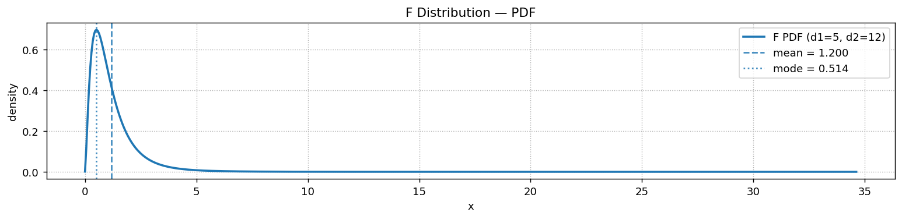

# F 분포 밀도함수

!!! info "앞 페이지"
    두 카이제곱의 비라는 정의에서 출발한 밀도 유도, 평균이 1이 아닌 까닭, 역수 관계와 베타분포와의 연결은 [F 분포](f_distribution.md)에 있다. 이 페이지는 밀도를 그리고 자유도가 모양을 어떻게 바꾸는지 보는 데 집중한다.

## 개요

분자 자유도 $d_1$과 분모 자유도 $d_2$를 갖는 **$F$ 분포**는 독립인 두 카이제곱 확률변수를 자유도로 나눈 뒤 그 비의 분포이다:

$$
F = \frac{U/d_1}{V/d_2}, \qquad U \sim \chi^2_{d_1},\; V \sim \chi^2_{d_2}
$$

분산분석의 F 검정, 분산 비교, 내포된 회귀모형 검정에서 핵심이 되는 분포이다.

---

## 주요 성질

| 성질 | 조건 | 값 |
|---|---|---|
| 지지집합 | — | $[0, \infty)$ |
| 평균 | $d_2 > 2$ | $\dfrac{d_2}{d_2 - 2}$ |
| 최빈값 | $d_1 > 2$ | $\dfrac{d_1 - 2}{d_1} \cdot \dfrac{d_2}{d_2 + 2}$ |
| 분산 | $d_2 > 4$ | $\dfrac{2d_2^2(d_1 + d_2 - 2)}{d_1(d_2-2)^2(d_2-4)}$ |

---

## 코드

<div class="codebox" markdown>

### 예제 1. F 분포의 밀도함수 { .eg }

```python
import numpy as np
import matplotlib.pyplot as plt
import scipy.stats as stats

# F 분포는 자유도가 둘이다. 두 카이제곱을 각자의 자유도로 나눈 뒤의 비율이다.
#   dfn = 분자 자유도, dfd = 분모 자유도
d1, d2 = 5, 12
f_dist = stats.f(dfn=d1, dfd=d2)

x = np.linspace(f_dist.ppf(1e-6), f_dist.ppf(1 - 1e-6), 600)
y = f_dist.pdf(x)

# 평균은 분모 자유도만으로 정해지며 d2 > 2 일 때만 존재한다.
# d2가 작으면 꼬리가 매우 무거워 평균이 아예 없다.
mean = d2 / (d2 - 2)
mode = ((d1 - 2) / d1) * (d2 / (d2 + 2))
# 평균이 최빈값보다 오른쪽에 있다 -> 오른쪽으로 치우친 분포다.

fig, ax = plt.subplots(figsize=(12, 3))
ax.plot(x, y, lw=2, label=f"F PDF (d1={d1}, d2={d2})")
ax.axvline(mean, linestyle='--', alpha=0.85, label=f"mean = {mean:.3f}")
ax.axvline(mode, linestyle=':', alpha=0.85, label=f"mode = {mode:.3f}")
ax.set_title("F Distribution — PDF")
ax.set_xlabel("x")
ax.set_ylabel("density")
ax.legend()
ax.grid(True, linestyle=":")
plt.tight_layout()
plt.show()
```



</div>

---

## 해석

$F$ 분포는 ($[0, \infty)$ 위에 놓이므로) 언제나 오른쪽으로 치우쳐 있다. $d_1$과 $d_2$가 크면 1 근처를 중심으로 하는 정규분포에 가까워진다. 평균은 1보다 크며($d_2/(d_2-2)$와 같다), 이는 분산비가 갖는 약간의 양의 편향을 반영한다.

---

## 연습문제

<div class="drillbox" markdown>

**연습문제 1.** <span class="diff easy" title="쉬움"></span>
$F_{5, 12}$의 평균을 계산하고, $F$ 분포의 평균이 (존재할 때) 항상 1보다 큰 이유를 설명하라.

</div>

??? success "풀이"
    $E[F] = d_2/(d_2 - 2) = 12/10 = 1.2$.

    평균이 1을 넘는 이유는 분모의 카이제곱이 $d_2$로 나누어지지만 평균에는 $d_2$만큼 기여하기 때문이다($E[\chi^2_{d_2}] = d_2$이므로). 비 $E[V/d_2] = 1$이지만 역수가 볼록함수이므로 Jensen 부등식에 의해 $E[d_1/U]$에 위쪽으로의 보정이 생긴다. 형식적으로는 $E[1/(V/d_2)] > 1/E[V/d_2] = 1$이다.

<div class="drillbox" markdown>

**연습문제 2.** <span class="diff med" title="중간"></span>
$T \sim t_\nu$이면 $T^2 \sim F_{1, \nu}$임을 보여라.

</div>

??? success "풀이"
    정의에 의해 $T = Z/\sqrt{V/\nu}$이며 $Z \sim N(0,1)$과 $V \sim \chi^2_\nu$는 독립이다. 그러면:

    $$
    T^2 = \frac{Z^2}{V/\nu} = \frac{Z^2/1}{V/\nu}
    $$

    $Z^2 \sim \chi^2_1$이므로 이는 비 $(\chi^2_1/1)/(\chi^2_\nu/\nu)$이며, 정의에 의해 $F_{1,\nu}$를 따른다. $\square$

<div class="drillbox" markdown>

**연습문제 3.** <span class="diff easy" title="쉬움"></span>
크기가 10인 세 집단으로 이루어진 일원배치 분산분석에서 $F$ 검정의 자유도는 얼마인가? 유의수준 5%에서 임계값은?

</div>

??? success "풀이"

    - 집단 간 자유도: $d_1 = k - 1 = 2$
    - 집단 내 자유도: $d_2 = N - k = 30 - 3 = 27$

    임계값은 `stats.f.ppf(0.95, 2, 27) ≈ 3.354`이다.

    관측된 $F$ 통계량이 3.354를 넘으면 모든 집단 평균이 같다는 귀무가설을 기각한다.

<div class="drillbox" markdown>

**연습문제 4.** <span class="diff med" title="중간"></span>
$1/F_{d_1, d_2} \sim F_{d_2, d_1}$임을 보여라.

</div>

??? success "풀이"
    $U \sim \chi^2_{d_1}$과 $V \sim \chi^2_{d_2}$가 독립일 때 $F = (U/d_1)/(V/d_2)$이면:

    $$
    \frac{1}{F} = \frac{V/d_2}{U/d_1}
    $$

    이는 독립인 두 카이제곱을 자유도로 나눈 비이며 분자의 자유도가 $d_2$, 분모의 자유도가 $d_1$이므로 $1/F \sim F_{d_2, d_1}$이다. $\square$

<div class="drillbox" markdown>

**연습문제 5.** <span class="diff easy" title="쉬움"></span>
$F_{5, 12}$의 최빈값을 계산해 평균과 견주고, 치우침의 방향을 말하라. 또 $d_1 \le 2$일 때 최빈값 공식을 쓸 수 없는 이유를 설명하라.

</div>

??? success "풀이"
    $$
    \text{최빈값} = \frac{d_1 - 2}{d_1} \cdot \frac{d_2}{d_2 + 2} = \frac{3}{5} \cdot \frac{12}{14} \approx 0.514
    $$

    평균은 1.2이므로 최빈값이 평균보다 왼쪽에 있다. 봉우리 왼쪽에 질량이 몰려 있고 오른쪽으로 긴 꼬리가 뻗은 **오른쪽으로 치우친** 모양이다.

    $d_1 \le 2$이면 밀도가 봉우리를 갖지 않는다. 분자가 $x^{d_1/2 - 1}$ 꼴이라 $d_1 = 2$에서는 상수, $d_1 = 1$에서는 $x^{-1/2}$로 발산한다. 두 경우 모두 밀도가 0에서부터 단조감소하므로 최빈값은 내부의 봉우리가 아니라 경계 0이다. 공식이 음수를 내놓는 것은 그 신호다.

<div class="drillbox" markdown>

**연습문제 6.** <span class="diff med" title="중간"></span>
$F_{d_1, d_2}$의 하위 $\alpha$ 분위수를 $F_{d_1, d_2, \alpha}$라 하자. 연습문제 4를 이용해

$$
F_{d_1, d_2, \alpha} = \frac{1}{F_{d_2, d_1, 1 - \alpha}}
$$

임을 보이고, 옛 통계표에 $F$ 분포의 위쪽 꼬리만 실려 있던 이유를 설명하라.

</div>

??? success "풀이"
    $c = F_{d_1, d_2, \alpha}$라 두면 정의에 따라 $P(F_{d_1,d_2} \le c) = \alpha$이다. 양변에서 역수를 취하면 부등호가 뒤집히고, 연습문제 4에 따라 $1/F_{d_1,d_2} \sim F_{d_2,d_1}$이므로

    $$
    \alpha = P\!\left(\frac{1}{F_{d_1,d_2}} \ge \frac{1}{c}\right) = P\!\left(F_{d_2,d_1} \ge \frac{1}{c}\right)
    $$

    이다. 따라서 $P(F_{d_2,d_1} \le 1/c) = 1 - \alpha$이고, 이는 $1/c = F_{d_2, d_1, 1-\alpha}$를 뜻한다.

    아래쪽 임계값이 자유도를 맞바꾼 위쪽 임계값의 역수로 언제나 얻어지므로, 표를 두 배로 늘릴 필요가 없었다. 예를 들어

    $$
    F_{5, 12, 0.025} = \frac{1}{F_{12, 5, 0.975}} = \frac{1}{6.525} \approx 0.153
    $$

    이다. SciPy를 쓰면 `stats.f.ppf(0.025, 5, 12)`로 바로 얻으므로 지금은 이 요령이 필요 없지만, 옛 논문의 임계값을 읽을 때는 알아야 한다.

<div class="drillbox" markdown>

**연습문제 7.** <span class="diff med" title="중간"></span>
두 정규모집단에서 각각 $n_1 = 13$, $s_1^2 = 24.5$와 $n_2 = 16$, $s_2^2 = 9.8$을 얻었다. 두 모분산이 같은지 유의수준 5%로 양측검정하라.

</div>

??? success "풀이"
    $H_0 : \sigma_1^2 = \sigma_2^2$ 아래에서 검정통계량은 두 표본분산의 비이다.

    $$
    F = \frac{s_1^2}{s_2^2} = \frac{24.5}{9.8} = 2.5, \qquad (d_1, d_2) = (12, 15)
    $$

    양측 5%의 기각역은 $F < F_{12,15,0.025} = 0.315$ 또는 $F > F_{12,15,0.975} = 2.963$이다. $2.5$는 그 사이에 있으므로 $H_0$을 기각하지 못한다.

    p-값으로 확인하면 위쪽 꼬리 확률이 `stats.f.sf(2.5, 12, 15) = 0.048`이고, 양측이므로 두 배 한 $0.096$이 p-값이다. 한쪽 꼬리만 보고 "0.048이니 유의하다"고 말하는 것이 흔한 실수다. 분산비 검정은 정규성 가정에 매우 예민하므로 실제로는 르빈 검정 쪽을 쓰는 편이 안전하다.

<div class="drillbox" markdown>

**연습문제 8.** <span class="diff med" title="중간"></span>
$d_2 \to \infty$일 때 $d_1 F_{d_1, d_2} \xrightarrow{d} \chi^2_{d_1}$임을 보여라. 분산분석에서 이 사실이 뜻하는 바는 무엇인가?

</div>

??? success "풀이"
    $F = (U/d_1)/(V/d_2)$에서 $V \sim \chi^2_{d_2}$는 독립인 $\chi^2_1$ 확률변수 $d_2$개의 합이다. 큰수의 법칙에 따라

    $$
    \frac{V}{d_2} \xrightarrow{p} E[\chi^2_1] = 1
    $$

    이다. 분자 $U \sim \chi^2_{d_1}$은 $d_2$와 무관하므로, 슬러츠키 정리에 의해

    $$
    d_1 F = \frac{U}{V/d_2} \xrightarrow{d} U \sim \chi^2_{d_1}
    $$

    이다.

    분산분석에서 분모 자유도 $d_2$는 오차 자유도이다. 오차 자유도가 충분히 크면 $\hat\sigma^2$이 $\sigma^2$에 거의 붙어 있으므로, 분산을 추정했다는 사실에서 오는 추가 변동이 사라지고 $F$ 검정이 분산을 아는 경우의 카이제곱 검정과 사실상 같아진다. 반대로 오차 자유도가 작으면 분모의 흔들림 때문에 $F$의 꼬리가 훨씬 무거워진다. $\square$

<div class="drillbox" markdown>

**연습문제 9.** <span class="diff hard" title="어려움"></span>
$X \sim F_{d_1, d_2}$일 때

$$
Y = \frac{d_1 X / d_2}{1 + d_1 X / d_2}
$$

가 $\text{Beta}(d_1/2,\, d_2/2)$를 따름을 보여라. 이 결과가 $F$ 분포의 CDF 계산과 어떻게 이어지는가?

</div>

??? success "풀이"
    $X = (U/d_1)/(V/d_2)$이므로 $d_1 X / d_2 = U/V$이고

    $$
    Y = \frac{U/V}{1 + U/V} = \frac{U}{U + V}
    $$

    이다.

    카이제곱분포는 감마분포의 특수한 경우로 $\chi^2_d = \text{Gamma}(\text{형상} = d/2,\ \text{척도} = 2)$이다. 척도가 같은 독립 감마 $U \sim \text{Gamma}(a, \theta)$, $V \sim \text{Gamma}(b, \theta)$에 대해 $U/(U+V) \sim \text{Beta}(a, b)$이고 이는 $U+V$와 독립이다. 여기에 $a = d_1/2$, $b = d_2/2$를 넣으면

    $$
    Y = \frac{U}{U+V} \sim \text{Beta}\!\left(\frac{d_1}{2}, \frac{d_2}{2}\right)
    $$

    를 얻는다.

    $Y$는 $X$의 증가함수이므로 $X \le x$와 $Y \le y(x)$가 같은 사건이고, 따라서

    $$
    P(X \le x) = I_{\,d_1 x/(d_1 x + d_2)}\!\left(\frac{d_1}{2}, \frac{d_2}{2}\right)
    $$

    이다. 여기서 $I$는 정규화 불완전베타함수이다. 수치 라이브러리가 $F$ 분포의 CDF를 따로 구현하지 않고 불완전베타함수 하나로 처리하는 이유가 여기에 있다. 카이제곱·$t$·이항분포의 꼬리 확률도 모두 같은 함수로 환원된다. $\square$

<div class="drillbox" markdown>

**연습문제 10.** <span class="diff med" title="중간"></span>
설명변수가 5개인 회귀모형(절편 포함 모수 6개)과 그중 2개만 남긴 축소모형(모수 3개)을 $n = 40$인 자료에 적합해 $\text{RSS}_{\text{축소}} = 120$, $\text{RSS}_{\text{완전}} = 90$을 얻었다. 버린 3개 변수가 모두 쓸모없다는 가설을 유의수준 5%로 검정하라.

</div>

??? success "풀이"
    내포된 두 모형의 비교에 쓰는 통계량은 다음과 같다.

    $$
    F = \frac{(\text{RSS}_{\text{축소}} - \text{RSS}_{\text{완전}})/(p_{\text{완전}} - p_{\text{축소}})}{\text{RSS}_{\text{완전}}/(n - p_{\text{완전}})}
    $$

    분자 자유도는 $6 - 3 = 3$, 분모 자유도는 $40 - 6 = 34$이다. 값을 넣으면

    $$
    F = \frac{(120 - 90)/3}{90/34} = \frac{10}{2.647} \approx 3.778
    $$

    이다. 임계값은 $F_{3, 34, 0.95} \approx 2.883$이고 $3.778 > 2.883$이므로 귀무가설을 기각한다. p-값은 `stats.f.sf(3.778, 3, 34) ≈ 0.019`이다.

    버린 세 변수를 한꺼번에 되살릴 근거가 있다는 뜻이다. 다만 이 검정이 말해 주는 것은 "세 계수가 모두 0은 아니다"까지이며, 셋 중 어느 것이 필요한지는 말해 주지 않는다. 이 통계량이 $F$ 분포를 따르는 것은 두 제곱합이 독립인 카이제곱으로 쪼개지기 때문이며, 그 근거가 코크런 정리다.

---

## 정리하며

$F$ 분포는 **독립인 두 카이제곱을 각자의 자유도로 나눈 뒤 그 비**다.

$$
F = \frac{U/d_1}{V/d_2}, \qquad U \sim \chi^2_{d_1},\; V \sim \chi^2_{d_2}
$$

- **비이므로 지지집합이 $[0,\infty)$ 이고 오른쪽으로 치우친다.** 자유도가 커질수록 1 주위로 모인다.
- **적률에 조건이 붙는다.** 평균 $\frac{d_2}{d_2-2}$ 는 $d_2>2$ 에서만, 분산은 $d_2>4$ 에서만 존재한다. **분모 자유도가 작으면 평균조차 없다.**
- **평균이 1 이 아니라 $d_2/(d_2-2)$ 라는 점**이 자주 잊힌다. $d_2$ 가 작으면 귀무가설 아래에서도 $F$ 가 1 보다 눈에 띄게 크게 나온다.
- **$t^2 = F(1, \nu)$** 다. 자유도 1 짜리 $F$ 검정과 양측 $t$ 검정이 같은 결론을 준다.
- 분산분석, 분산 비교, 내포된 회귀모형 비교가 모두 이 분포를 쓴다. 0장에서 본 코크런 정리가 제곱합을 독립인 카이제곱들로 쪼개 주는 것이 그 근거다.

다음 절 **로그정규분포**로 넘어간다. 지금까지의 분포들이 덧셈적 구조에서 나왔다면, 로그정규는 **곱셈적으로 누적되는 양**에서 나온다.
