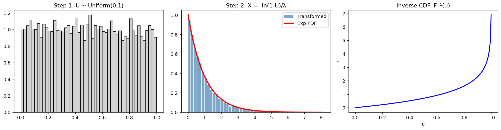
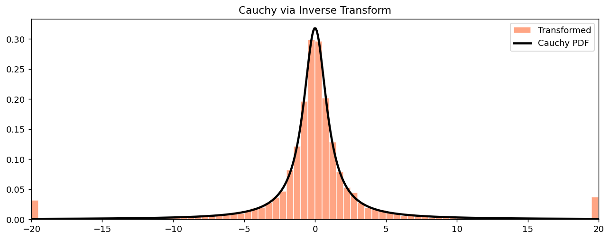

# 역변환 표본추출

## 개요

**역변환 표본추출**은 역 CDF(분위수 함수)를 구할 수 있는 임의의 분포에서 확률표본을 생성하는 방법이다. 핵심 결과는 다음과 같다.

$U \sim \text{Uniform}(0, 1)$이고 $F$가 역함수 $F^{-1}$을 갖는 CDF이면:

$$
X = F^{-1}(U) \sim F
$$

이 하나의 착상이 계산통계학과 Monte Carlo 모의실험의 상당 부분을 떠받친다.

---

## 증명

임의의 $x$에 대해:

$$
P(X \le x) = P(F^{-1}(U) \le x) = P(U \le F(x)) = F(x)
$$

마지막 등식은 $U \sim \text{Uniform}(0,1)$이므로 $P(U \le p) = p$라는 사실을 사용한다. $\square$

---

## 예 1: Exponential 분포

Exponential 분포의 CDF는 $F(x) = 1 - e^{-\lambda x}$이다. 역함수를 구하면:

$$
F^{-1}(u) = -\frac{\ln(1 - u)}{\lambda}
$$

<div class="codebox" markdown>

### 예제 1. 역변환 표집으로 지수분포 만들기 { .eg }

```python
import numpy as np
import matplotlib.pyplot as plt
from scipy import stats

np.random.seed(42)
n = 10_000
lam = 1.0

# 역변환 표집의 전부가 이 두 줄이다.
#   1단계: 균등난수 U를 뽑는다.
#   2단계: 목표 분포의 CDF 역함수 F^{-1} 을 U에 적용한다.
# 지수분포는 F(x) = 1 - e^{-lam x} 이므로 F^{-1}(u) = -ln(1-u)/lam 이다.
u = np.random.uniform(0, 1, n)
x_exp = -np.log(1 - u) / lam

# 세 패널로 과정을 분해해 보여 준다.
fig, axes = plt.subplots(1, 3, figsize=(15, 4))

# 왼쪽: 출발점. 완전히 평평한 균등분포다.
axes[0].hist(u, bins=50, density=True, color="lightgray", edgecolor="black")
axes[0].set_title("Step 1: U ~ Uniform(0,1)")

t = np.linspace(0, np.max(x_exp), 300)
axes[1].hist(x_exp, bins=50, density=True, color="steelblue",
             edgecolor="white", alpha=0.7, label="Transformed")
axes[1].plot(t, stats.expon.pdf(t, scale=1/lam), "r-", lw=2.5, label="Exp PDF")
axes[1].set_title("Step 2: X = -ln(1-U)/λ")
axes[1].legend()

# 오른쪽: 변환 함수 자체를 그린다.
# 이 곡선의 **기울기**가 왜 평평한 입력이 치우친 출력이 되는지 설명한다.
# u가 1에 가까워질수록 곡선이 가팔라져, 좁은 u 구간이 넓은 x 구간으로 늘어난다.
# 늘어난 구간에서는 밀도가 낮아지므로 오른쪽 꼬리가 얇아지는 것이다.
# 0과 1은 각각 -inf, +inf 로 발산하므로 격자에서 살짝 안쪽으로 잡는다.
u_grid = np.linspace(0.001, 0.999, 300)
axes[2].plot(u_grid, -np.log(1 - u_grid) / lam, "b-", lw=2)
axes[2].set_title("Inverse CDF: F⁻¹(u)")
axes[2].set_xlabel("u")
axes[2].set_ylabel("x")

plt.tight_layout()
plt.show()
```



</div>

---

## 예 2: Cauchy 분포

표준 Cauchy 분포의 CDF는 $F(x) = \frac{1}{2} + \frac{1}{\pi}\arctan(x)$이다. 역함수를 구하면:

$$
F^{-1}(u) = \tan\!\left(\pi\!\left(u - \frac{1}{2}\right)\right)
$$

<div class="codebox" markdown>

### 예제 2. 역변환 표집으로 코시분포 만들기 { .eg }

```python
# 코시분포의 CDF는 F(x) = 1/2 + arctan(x)/pi 이므로
# 그 역함수는 F^{-1}(u) = tan(pi*(u - 1/2)) 이다.
u = np.random.uniform(0, 1, n)
x_cauchy = np.tan(np.pi * (u - 0.5))

fig, ax = plt.subplots(figsize=(10, 4))
# 코시분포는 꼬리가 너무 무거워 평균조차 존재하지 않는다.
# 1만 개를 뽑으면 수백, 수천 단위의 값이 나오므로 그대로 그리면
# 히스토그램이 한 칸에 뭉쳐 아무것도 안 보인다.
# 그래서 [-20, 20]으로 잘라 **가운데 부분만** 그린다.
# 자른 값들은 양 끝 막대에 쌓이므로 그 두 막대는 해석하지 말아야 한다.
x_clipped = np.clip(x_cauchy, -20, 20)
ax.hist(x_clipped, bins=80, density=True, color="coral",
        edgecolor="white", alpha=0.7, label="Transformed")
t2 = np.linspace(-20, 20, 500)
ax.plot(t2, stats.cauchy.pdf(t2), "k-", lw=2.5, label="Cauchy PDF")
ax.set_title("Cauchy via Inverse Transform")
ax.set_xlim(-20, 20)
ax.legend()
plt.tight_layout()
plt.show()
```



Cauchy 예는 역변환 표본추출이 유한한 평균조차 없는 두꺼운 꼬리 분포에서도 작동함을 보여 준다.

</div>

---

## 언제 사용하는가

| 상황 | 권장 방법 |
|---|---|
| $F^{-1}$이 닫힌 형태로 주어짐 | 역변환 (빠르고 정확) |
| $F^{-1}$ 계산 비용이 큼 | 기각표본추출이나 MCMC 고려 |
| 이산분포 | 누적 PMF 문턱값 사용 |
| 다변량 분포 | 조건부 분해나 전용 알고리즘 사용 |

---

## 연습문제

<div class="drillbox" markdown>

**연습문제 1.** <span class="diff easy" title="쉬움"></span>
$\text{Uniform}(a, b)$ 분포의 역 CDF를 유도하고 역변환 공식을 쓰라.

</div>

??? success "풀이"
    CDF는 $F(x) = (x - a)/(b - a)$이다. $u = F(x)$로 두고 풀면:

    $$
    x = a + (b - a)u = F^{-1}(u)
    $$

    따라서 $U \sim \text{Uniform}(0,1)$이면 $X = a + (b-a)U \sim \text{Uniform}(a, b)$이다.

<div class="drillbox" markdown>

**연습문제 2.** <span class="diff med" title="중간"></span>
역변환 표본추출로 $\text{Bernoulli}(p)$ 분포에서 표본을 생성하라. 같은 착상이 임의의 이산분포로 어떻게 확장되는지 설명하라.

</div>

??? success "풀이"
    $U \sim \text{Uniform}(0,1)$을 생성한다. $U \le p$이면 $X = 1$로, 그렇지 않으면 $X = 0$으로 둔다.

    값이 $x_1, x_2, \ldots$이고 확률이 $p_1, p_2, \ldots$인 일반적인 이산분포에서는 누적확률 $c_k = \sum_{i=1}^k p_i$를 계산한다. $U \le c_k$를 만족하는 가장 작은 첨자 $k$에 대해 $X = x_k$로 둔다. 이는 $[0,1]$을 길이 $p_k$인 구간들로 나누고 각 구간을 $x_k$에 대응시키는 것이다.

<div class="drillbox" markdown>

**연습문제 3.** <span class="diff med" title="중간"></span>
역변환 결과를 증명하라. $U \sim \text{Uniform}(0,1)$이고 $F$가 연속이고 순증가하는 CDF이면 $F^{-1}(U) \sim F$이다.

</div>

??? success "풀이"
    임의의 $x \in \mathbb{R}$에 대해:

    $$
    P(F^{-1}(U) \le x) = P(U \le F(x))
    $$

    이 등식은 $F$가 순증가하므로 $F^{-1}(u) \le x \iff u \le F(x)$라는 사실을 사용한다. $U \sim \text{Uniform}(0,1)$이므로:

    $$
    P(U \le F(x)) = F(x)
    $$

    따라서 $P(F^{-1}(U) \le x) = F(x)$이고, 이는 $F^{-1}(U)$의 CDF가 $F$임을 뜻한다. $\square$

<div class="drillbox" markdown>

**연습문제 4.** <span class="diff med" title="중간"></span>
Rayleigh 분포는 $x \ge 0$에 대해 CDF가 $F(x) = 1 - e^{-x^2/(2\sigma^2)}$이다. 역 CDF를 유도하고 역변환 표본추출로 Rayleigh 표본을 생성하는 코드를 작성하라.

</div>

??? success "풀이"
    $u = 1 - e^{-x^2/(2\sigma^2)}$의 역함수를 구하면:

    $$
    e^{-x^2/(2\sigma^2)} = 1 - u \implies x = \sigma\sqrt{-2\ln(1-u)}
    $$

    코드:

    ```python
    import numpy as np

    np.random.seed(0)
    sigma = 1.0
    u = np.random.uniform(0, 1, 10000)
    # 레일리 분포의 CDF는 F(x) = 1 - exp(-x^2 / (2 sigma^2)) 이므로
    # 이를 x에 대해 풀면 F^{-1}(u) = sigma * sqrt(-2 ln(1-u)) 다.
    x = sigma * np.sqrt(-2 * np.log(1 - u))

    # 레일리 분포의 평균은 sigma*sqrt(pi/2) ≈ 1.2533,
    # 분산은 (4-pi)/2 * sigma^2 ≈ 0.4292 다.
    print(f"표본평균 {x.mean():.4f}  (이론 {sigma*np.sqrt(np.pi/2):.4f})")
    print(f"표본분산 {x.var():.4f}  (이론 {(4-np.pi)/2*sigma**2:.4f})")
    ```

    출력:

    ```
    표본평균 1.2453  (이론 1.2533)
    표본분산 0.4306  (이론 0.4292)
    ```

    이는 Box-Muller 변환의 한 성분과 밀접하게 관련된다. $R = \sqrt{-2\ln U}$가 Rayleigh 분포를 따른다.

<div class="drillbox" markdown>

**연습문제 5.** <span class="diff med" title="중간"></span>
모든 역변환 공식에서 $U$를 $1 - U$로 바꾸어도 출력의 분포가 달라지지 않는 이유를 설명하라. 실무에서 이것이 왜 유용한가?

</div>

??? success "풀이"
    $U \sim \text{Uniform}(0,1)$이면 $1 - U$도 $\text{Uniform}(0,1)$이다(균등분포는 0.5를 중심으로 대칭이다). 따라서 $F^{-1}(U)$에서 $U$를 $1 - U$로 바꾸어도 같은 분포가 나온다.

    이는 공식을 간단하게 만들어 주므로 유용하다. Exponential 분포에서는 $-\ln(1-U)/\lambda$를 $-\ln(U)/\lambda$로 바꿀 수 있어 뺄셈 한 번을 아낀다. 실무에서는 $\ln(0) = -\infty$를 주는 $U = 0$이라는 경계 사례도 피하게 되는데, $1 - U = 0$이 될 확률은 0이기 때문이다.

---

## 정리하며

역변환 표본추출은 한 줄로 요약된다. **$U\sim\text{Uniform}(0,1)$ 이면 $F^{-1}(U)\sim F$ 다.**

- **증명도 한 줄이다.** $P(F^{-1}(U)\le x)=P(U\le F(x))=F(x)$ 이며, 마지막 등식이 균등분포의 정의다.
- **분위수함수를 구할 수 있으면 어떤 분포든 뽑을 수 있다.** 지수분포는 $F^{-1}(u)=-\ln(1-u)/\lambda$ 처럼 손으로 풀리고, 그렇지 않은 경우에는 수치적 역함수를 쓴다.
- **정규분포에는 잘 쓰지 않는다.** $\Phi^{-1}$ 에 닫힌 형태가 없어 비싸기 때문이며, 실제로는 박스–뮐러 변환이나 지구라트 알고리즘을 쓴다.
- **이산분포에도 그대로 통한다.** $F$ 가 계단이면 $F^{-1}(u)=\inf\{x:F(x)\ge u\}$ 가 계단의 위치를 골라 준다.
- **역함수를 구할 수 없을 때**는 기각 표집이나 MCMC 로 넘어간다.

**이 하나의 착상이 계산통계학의 상당 부분을 떠받친다.** 뒤에 나올 부트스트랩·순열검정·몬테카를로 모의실험이 모두 "균등난수에서 원하는 분포를 만든다"는 이 단계 위에 서 있다.

다음 절 **결합분포**로 넘어간다. 지금까지 변수 하나를 다뤘다면, 이제 둘 이상이 함께 움직이는 경우를 본다.
