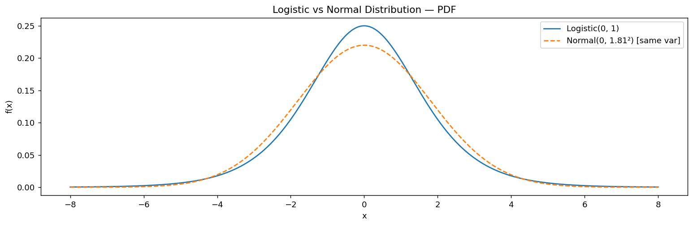

# 로지스틱 밀도함수 (Normal과 비교)

## 개요

위치 $\mu$와 척도 $s$를 갖는 **Logistic 분포**의 PDF는 다음과 같다:

$$
f(x) = \frac{e^{-(x-\mu)/s}}{s\left(1 + e^{-(x-\mu)/s}\right)^2}
$$

| 성질 | 값 |
|---|---|
| 평균 | $\mu$ |
| 분산 | $s^2\pi^2/3$ |
| 지지집합 | $(-\infty, \infty)$ |

Logistic 분포는 정규분포와 비슷하지만 **꼬리가 더 두꺼워** 금융 수익률처럼 꼬리가 두꺼운 현상을 모형화하는 데 유용하다. CDF가 $F(x) = 1/(1 + e^{-(x-\mu)/s})$라는 편리한 닫힌 형태를 가지며, 이것이 기계학습 전반에서 쓰이는 로지스틱(시그모이드) 함수이다.

---

## 정규분포와의 비교

두 분포를 공정하게 비교하려면 분산을 맞춘다. Logistic 분포의 척도가 $s$이면 분산은 $s^2\pi^2/3$이다. 이에 맞추는 정규분포는 $\sigma = s\pi/\sqrt{3}$이다.

```python
import matplotlib.pyplot as plt
import numpy as np
import scipy.stats as stats

mu, s = 0, 1        # 위치모수와 척도모수. s는 표준편차가 아니다.
x = np.linspace(-8, 8, 400)

rv_logistic = stats.logistic(loc=mu, scale=s)

# 두 분포를 공정하게 비교하려면 **분산을 맞춰야** 한다.
# 로지스틱 분포의 분산은 s^2 * pi^2 / 3 이므로 표준편차는 s*pi/sqrt(3) ≈ 1.81s.
# 이 값을 정규분포의 sigma로 주면 두 곡선이 같은 퍼짐을 갖는다.
# 그래야 남는 차이가 오직 "꼬리의 두께"가 된다.
sigma = s * np.pi / np.sqrt(3)
rv_normal = stats.norm(loc=mu, scale=sigma)

fig, ax = plt.subplots(figsize=(12, 4))
ax.plot(x, rv_logistic.pdf(x), label='Logistic(0, 1)')
ax.plot(x, rv_normal.pdf(x), '--', label=rf'Normal(0, {sigma:.2f}²) [same var]')
ax.set_xlabel('x')
ax.set_ylabel('f(x)')
ax.set_title('Logistic vs Normal Distribution — PDF')
ax.legend()
plt.tight_layout()
plt.show()
```



로지스틱 곡선은 분산을 맞춘 정규분포보다 중앙에서 약간 낮고 꼬리에서 더 높다.

---

## 연습문제

**연습문제 1.**
로지스틱 CDF $F(x) = 1/(1 + e^{-(x-\mu)/s})$가 로지스틱 PDF의 부정적분임을 보여라.

??? success "풀이"
    $F(x) = (1 + e^{-(x-\mu)/s})^{-1}$을 미분하면:

    $$
    F'(x) = \frac{e^{-(x-\mu)/s}/s}{(1 + e^{-(x-\mu)/s})^2} = f(x)
    $$

    따라서 $F'(x) = f(x)$가 확인된다. $\square$

---

**연습문제 2.**
로지스틱 분산 $s^2\pi^2/3$을 계산하고, 같은 척도 모수 $\sigma = s$를 갖는 정규분포의 분산보다 큼을 확인하라.

??? success "풀이"
    척도가 $s$인 Logistic 분포의 분산은 $s^2\pi^2/3 \approx 3.29 s^2$이다. $\sigma = s$인 정규분포의 분산은 $s^2$이다. 따라서 로지스틱 분산이 $\pi^2/3 \approx 3.29$배 크며, 이는 꼬리가 더 두껍다는 사실과 일관된다.

---

**연습문제 3.**
Logistic 분포는 로지스틱 회귀에서 핵심적인 역할을 한다. CDF $F(x) = 1/(1 + e^{-x})$가 선형 예측자를 확률로 옮기는 연결함수 역할을 어떻게 하는지 설명하라.

??? success "풀이"
    로지스틱 회귀 모형은 $P(Y = 1 \mid \mathbf{x}) = \sigma(\mathbf{x}^\top\boldsymbol{\beta})$로 설정되며, $\sigma(z) = 1/(1+e^{-z})$가 로지스틱 CDF이다. 선형 예측자 $z = \mathbf{x}^\top\boldsymbol{\beta}$는 $(-\infty, \infty)$의 어떤 값이든 취할 수 있고, 로지스틱 함수가 이를 $(0, 1)$로 옮겨 유효한 확률을 만들어 준다. 그 역함수 $z = \ln(p/(1-p))$(로그 오즈 또는 로짓)가 확률 척도를 선형 척도로 이어 준다.

---

**연습문제 4.**
표준 Logistic 분포($\mu=0, s=1$)와 분산을 맞춘 정규분포에서 꼬리 확률 $P(|X| > 3)$을 비교하라. 어느 쪽의 꼬리 확률이 더 큰가?

??? success "풀이"
    **Logistic:** $P(|X| > 3) = 2 \cdot S(3) = 2/(1 + e^3) \approx 2 \times 0.0474 = 0.0949$.

    **분산을 맞춘 정규분포** ($\sigma = \pi/\sqrt{3} \approx 1.814$): $P(|X| > 3) = 2\mathcal{N}(-3/1.814) = 2\mathcal{N}(-1.654) \approx 2 \times 0.0491 = 0.0982$.

    이 문턱값에서는 꼬리 확률이 비슷하지만, 더 극단적인 값(예: $|X| > 5$)에서는 로지스틱 꼬리가 우세해진다. 로지스틱은 지수적으로($\sim e^{-|x|/s}$) 감소하는 반면 정규분포는 Gaussian 형태로($\sim e^{-x^2/(2\sigma^2)}$) 감소하기 때문이다.
