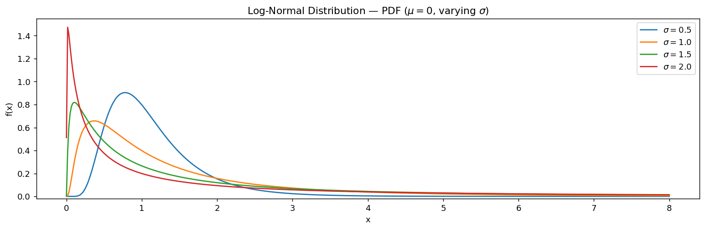

# 로그정규 밀도함수

## 개요

$X \sim N(\mu, \sigma^2)$이면 $Y = e^X$는 모수 $\mu$와 $\sigma$를 갖는 **Log-Normal 분포**를 따른다. 동등하게, $\ln Y \sim N(\mu, \sigma^2)$이다.

$$
f(y) = \frac{1}{y\sigma\sqrt{2\pi}} \exp\!\left(-\frac{(\ln y - \mu)^2}{2\sigma^2}\right), \qquad y > 0
$$

| 성질 | 값 |
|---|---|
| 지지집합 | $(0, \infty)$ |
| 평균 | $e^{\mu + \sigma^2/2}$ |
| 중앙값 | $e^{\mu}$ |
| 분산 | $(e^{\sigma^2} - 1)\,e^{2\mu + \sigma^2}$ |
| 최빈값 | $e^{\mu - \sigma^2}$ |

Log-Normal 분포는 자산 가격, 소득처럼 반드시 양수이고 오른쪽으로 치우친 양을 모형화하는 데 널리 쓰인다.

---

## SciPy 모수화

SciPy는 `stats.lognorm(s=sigma, scale=np.exp(mu))`를 사용하며, `s`가 형상 모수 $\sigma$이고 `scale`이 중앙값 $e^\mu$이다.

<div class="codebox" markdown>

**예제 1.** 로그정규분포의 SciPy 모수화

```python
import matplotlib.pyplot as plt
import numpy as np
import scipy.stats as stats

# 로그정규분포: log(X)가 N(mu, sigma^2)을 따르는 분포다.
# mu와 sigma는 **로그를 취한 뒤의** 평균과 표준편차이지 X 자체의 것이 아니다.
mu = 0
sigmas = [0.5, 1.0, 1.5, 2.0]
x = np.linspace(0.001, 8, 500)     # X > 0 이므로 0에서 시작한다

fig, ax = plt.subplots(figsize=(12, 4))
for sigma in sigmas:
    # scipy의 매개변수화가 특히 헷갈리는 분포다.
    #   s     = 로그 척도의 표준편차 sigma
    #   scale = exp(mu)
    # 즉 loc가 아니라 scale에 exp(mu)를 넣어야 한다.
    rv = stats.lognorm(s=sigma, scale=np.exp(mu))
    # sigma가 커질수록 봉우리가 0쪽으로 밀리고 오른쪽 꼬리가 길어진다.
    ax.plot(x, rv.pdf(x), label=rf'$\sigma={sigma}$')
ax.set_xlabel('x')
ax.set_ylabel('f(x)')
ax.set_title(r'Log-Normal Distribution — PDF ($\mu=0$, varying $\sigma$)')
ax.legend()
ax.set_ylim(bottom=-0.02)
plt.tight_layout()
plt.show()
```



</div>

$\sigma$가 커질수록 분포가 오른쪽으로 더 치우치고 최빈값은 0 쪽으로 이동한다.

---

## 연습문제

<div class="drillbox" markdown>

**연습문제 1.** <span class="diff med" title="중간"></span>
$X \sim N(\mu, \sigma^2)$일 때 정규분포의 적률생성함수를 사용하여 $Y = e^X$의 $E[Y]$를 유도하라.

</div>

??? success "풀이"
    $X \sim N(\mu, \sigma^2)$의 MGF는 $M_X(t) = E[e^{tX}] = e^{\mu t + \sigma^2 t^2/2}$이다.

    $t = 1$로 두면:

    $$
    E[Y] = E[e^X] = M_X(1) = e^{\mu + \sigma^2/2}
    $$

<div class="drillbox" markdown>

**연습문제 2.** <span class="diff med" title="중간"></span>
Log-Normal 분포의 중앙값이 $e^\mu$이며, 임의의 $\sigma > 0$에 대해 평균 $e^{\mu + \sigma^2/2}$보다 작음을 보여라.

</div>

??? success "풀이"
    중앙값 $m$은 $P(Y \le m) = 0.5$를 만족한다:

    $$
    P(e^X \le m) = P(X \le \ln m) = \mathcal{N}\!\left(\frac{\ln m - \mu}{\sigma}\right) = 0.5
    $$

    이려면 $(\ln m - \mu)/\sigma = 0$이어야 하므로 $m = e^\mu$이다.

    $\sigma^2/2 > 0$이므로 $e^{\mu + \sigma^2/2} > e^\mu$이며, 평균 > 중앙값임이 확인된다. 이는 오른쪽으로 치우침을 반영한다. 두꺼운 오른쪽 꼬리가 평균을 위로 끌어올린다.

<div class="drillbox" markdown>

**연습문제 3.** <span class="diff easy" title="쉬움"></span>
주식 수익률이 (연율화된) $\mu = 0.05$, $\sigma = 0.2$인 Log-Normal 분포를 따른다면, 주가가 가치의 20% 넘게 하락할 확률은 얼마인가?

</div>

??? success "풀이"
    20% 손실은 $Y < 0.8$을 뜻한다(주가가 초기 가치의 80%보다 낮다):

    $$
    P(Y < 0.8) = P(X < \ln 0.8) = \mathcal{N}\!\left(\frac{\ln 0.8 - 0.05}{0.2}\right) = \mathcal{N}\!\left(\frac{-0.2231 - 0.05}{0.2}\right) = \mathcal{N}(-1.366) \approx 0.086
    $$

    20% 넘게 손실을 볼 확률은 약 8.6%이다.

<div class="drillbox" markdown>

**연습문제 4.** <span class="diff med" title="중간"></span>
독립인 Log-Normal 확률변수들의 곱이 다시 Log-Normal임을 증명하라.

</div>

??? success "풀이"
    $X_1 \sim N(\mu_1, \sigma_1^2)$과 $X_2 \sim N(\mu_2, \sigma_2^2)$이 독립일 때 $Y_1 = e^{X_1}$, $Y_2 = e^{X_2}$라 하자. 그러면:

    $$
    Y_1 Y_2 = e^{X_1 + X_2}
    $$

    독립인 정규확률변수의 합에 의해 $X_1 + X_2 \sim N(\mu_1 + \mu_2, \sigma_1^2 + \sigma_2^2)$이므로, $Y_1 Y_2$는 모수가 $\mu_1 + \mu_2$와 $\sqrt{\sigma_1^2 + \sigma_2^2}$인 Log-Normal 분포이다.

    귀납법에 의해 독립인 Log-Normal 확률변수들의 임의의 유한 곱은 Log-Normal이다. $\square$

---

## 정리하며

로그정규분포는 **로그를 취하면 정규가 되는** 분포다. 덧셈적으로 누적되면 정규, **곱셈적으로 누적되면 로그정규**다.

- **세 중심이 모두 다르다.** 최빈값 $e^{\mu-\sigma^2}$ < 중앙값 $e^{\mu}$ < 평균 $e^{\mu+\sigma^2/2}$. 순서가 이렇게 고정되어 있고, $\sigma$ 가 클수록 벌어진다. **오른쪽 치우침의 교과서적 예다.**
- **중앙값 $e^\mu$ 만이 로그 척도에서의 평균에 대응한다.** 로그 자료의 평균을 되돌린 값은 평균이 아니라 중앙값이라는 점이 실무에서 자주 혼동된다.
- **지지집합이 $(0,\infty)$** 이라 자산 가격·소득·체류 시간처럼 반드시 양수인 양에 맞는다.
- **적률은 모두 유한하지만 적률생성함수가 존재하지 않는다.** 그래서 적률이 분포를 결정하지 못하며, 모든 적률이 같은 다른 분포가 존재한다(3장 적률생성함수 문서 연습문제 $6$).
- **SciPy 모수화가 까다롭다.** `stats.lognorm(s=sigma, scale=np.exp(mu))` 이며, `scale` 에 들어가는 것은 평균이 아니라 **중앙값** $e^\mu$ 다.

다음 절 **로지스틱분포**로 넘어간다. 정규분포와 모양은 비슷하되 꼬리가 두껍고, 무엇보다 누적분포함수가 닫힌 형태를 갖는다.
